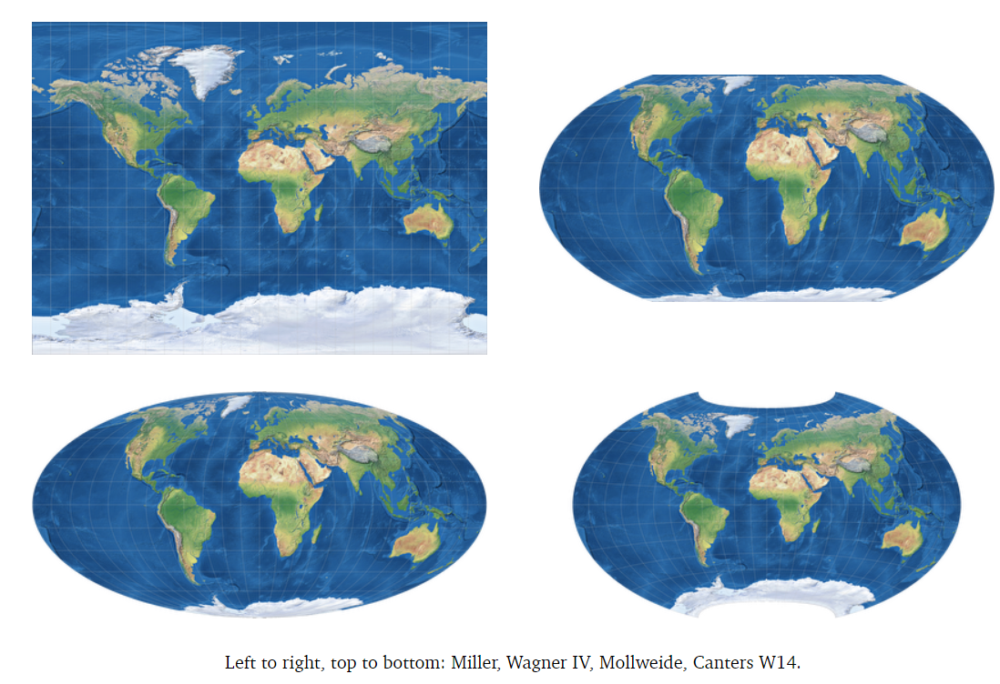
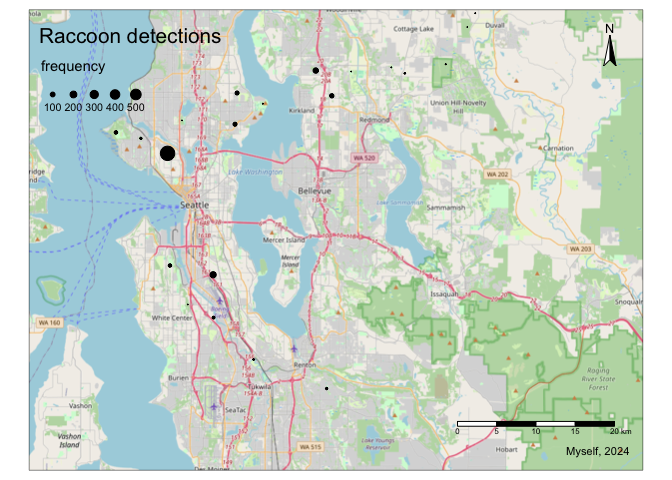
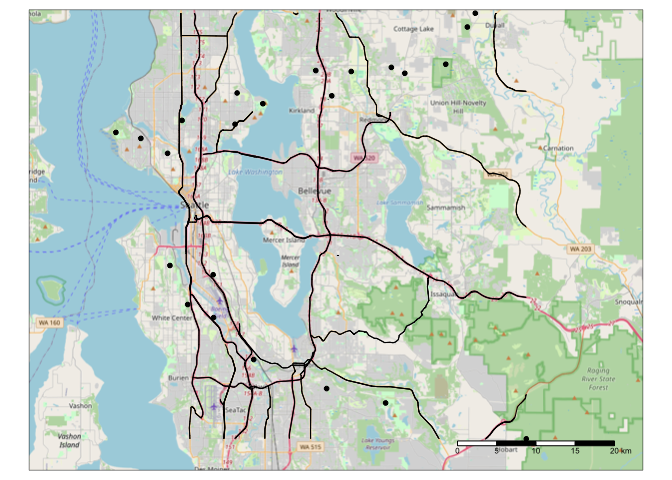
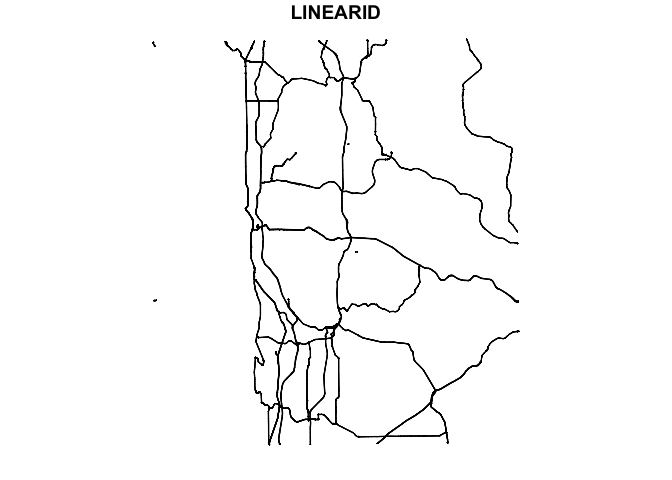
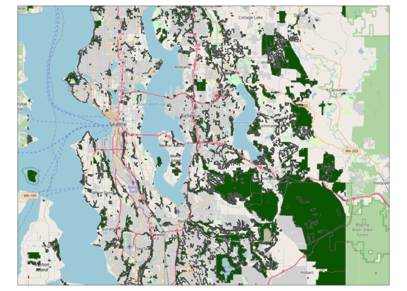

# Spatial data

Spatial data is any type of data that directly or indirectly references
a specific geographical area or location. These can be, for example,
geographic features on the landscape or environmental properties of an
area such as temperature or air quality.

Spatial data can be continuous or discrete just like regular data, and
in both cases it can be represented as a **vector** or a **raster**.
Vector data uses points and lines to represent spatial data, while
raster data represents data in a grid of pixels where each pixel/cell
represents a specific geographic location and the information therein.
Raster data will be heavily influenced by the size of the pixels/cells,
i.e. resolution.

<figure>

<figcaption aria-hidden="true">Figure showing difference between vectors
and rasters</figcaption>
</figure>

## Projections and Spatial Reference Systems (SRS)

Both vector and raster data are planar representations of the world, a
3-dimensional sphere, and as such are not perfect copies. Depending on
how the planar representation is created it will distort more or less
certain areas of the world. Therefore many representations exist. These
are called projections, as the representations project the 3-dimensional
spheric image into a planar, 2-dimensional image. Maps with different
projections are not comparable and cannot be overlaid. Therefore, we
need to make sure we always work on the same projection when using
spatial data.

<figure>

<figcaption aria-hidden="true">Figure showing different projectsions of
the earth</figcaption>
</figure>

To locate points geographic features on a map, you also need a system of
coordinates that define the x-y coordinates for every point on the map.
The system of latitude and longitude is the most familiar. These
coordinate systems can be used to extract area and distance information
from maps. A combination of a projection and a set of coordinates is
known as a **Spatial Reference System (SRS)**. Your choice of SRS will
depend on the source of your data and your spatial analysis needs. In
general, there is a trade-off between the extent of an SRS and its
accuracy for measurement. For example, the WGS84 system of latitude and
longitude covers the entire earth, but it is not useful for measurement
because degrees of longitude become closer together the closer you are
to the poles. Systems based in UTM or State Plane coordinates are much
more accurate for measuring distances and areas, but they are only
useful for covering specific regions.

To describe SRS systems around the world, every system is given a
specific “EPSG code.” For example, the familiar system of latitude /
longitude has the EPSG code 4326. All GIS software, including spatial
mapping functions in R, allow users to transform our spatial data
between different SRSs using these EPSG codes.

In summary, every spatial data set comes with two primary
considerations:

-   Is it in vector or raster format?
-   What SRS is it in?

## Setting up to work with spatial data in R

Packages used to read and manipulate data include the `sf` package,
which reads a shapefile as a spatial data frame, and the `terra` package
that reads the shapefiles as a Spatvector. Previously there was also the
`raster` package, but we will try to avoid it as it has been deprecated.
We have also included `ggplot2` and the `ggmap` package, which has
useful mapping functions on top of `ggplot2`.

    library(dplyr)
    library(tidyr)
    library(sf)
    library(terra)
    library(ggplot2)
    library(ggmap)

# Vector data

In this section we will read and manipulate vector data in R.

-   Vector data represents real world features within the GIS
    environment. A feature is anything you can see on the landscape.
-   Vector data is commonly stored as a shapefile and can contain point,
    line, or polygon data.
-   Vector data contains information attached to each feature, which we
    call attributes.

Features can be points (red) representing specific x,y locations, such
as a trees or camera sites; polygons (white) representing areas, such as
forests or residential areas; and lines (yellow/green and blue)
representing continuous linear features, such as roads or rivers

<figure>

<figcaption aria-hidden="true">Figure showing polygons, points, and
lines in the landscape</figcaption>
</figure>

Vector data reads as a data frame would. Each row is a feature and each
column is an attribute, and it contains a geometry column where the xy
coordinates for the shapes are stored. Plotting these data will plot the
points or shapes in the map using the xy coordinates stored for each
feature.

    ## Simple feature collection with 6 features and 3 fields
    ## Geometry type: POINT
    ## Dimension:     XY
    ## Bounding box:  xmin: -122.3607 ymin: 47.64339 xmax: -122.3607 ymax: 47.64339
    ## Geodetic CRS:  WGS 84
    ##     speciesname    locationid                date                   geometry
    ## 1 Procyon lotor SEWA_N01_DRP2 2019-07-03 05:02:21 POINT (-122.3607 47.64339)
    ## 2 Procyon lotor SEWA_N01_DRP2 2019-07-03 06:04:45 POINT (-122.3607 47.64339)
    ## 3 Procyon lotor SEWA_N01_DRP2 2019-07-03 06:12:10 POINT (-122.3607 47.64339)
    ## 4 Procyon lotor SEWA_N01_DRP2 2019-07-03 06:13:16 POINT (-122.3607 47.64339)
    ## 5 Procyon lotor SEWA_N01_DRP2 2019-07-05 03:55:53 POINT (-122.3607 47.64339)
    ## 6 Procyon lotor SEWA_N01_DRP2 2019-07-05 04:05:21 POINT (-122.3607 47.64339)

The output in the section above shows example vector data for points
representing captures of wildlife at camera traps. The top of the output
describes the data, including the reference system (WGS 84, which is the
standard for lat/lon data) and minimum and maximum extent of the data.
Each row has attribute data (species, a location ID, and the capture
date of that species). The final column stores the spatial data. You can
see that it is `POINT` data and the coordinates of each point.

## Vector data: points

In this section, you will learn the following methods for working with
point data

1.  Importing spatial data that is stored in a CSV file
2.  Converting these data to a spatial format
3.  Plotting points on a map

Point data can be obtained directly from a shapefile or a csv file where
each row is a feature. In this case study, we will work with camera trap
site data and the information collected at each site, i.e. point. The
camera trap sites here are located in Seattle, and have captured coyote
and raccoon presence and absence from the 2019 spring season to the 2021
winter season. The data is stored as a data frame in a csv called
`captures.csv`. The next two lines read the data and show the top few
lines.

    captures.table <- read.csv("data/captures.csv")
    head(captures.table)

    ##     speciesname    locationid                date latitude longitude
    ## 1 Procyon lotor SEWA_N01_DRP2 2019-07-03 05:02:21 47.64339 -122.3607
    ## 2 Procyon lotor SEWA_N01_DRP2 2019-07-03 06:04:45 47.64339 -122.3607
    ## 3 Procyon lotor SEWA_N01_DRP2 2019-07-03 06:12:10 47.64339 -122.3607
    ## 4 Procyon lotor SEWA_N01_DRP2 2019-07-03 06:13:16 47.64339 -122.3607
    ## 5 Procyon lotor SEWA_N01_DRP2 2019-07-05 03:55:53 47.64339 -122.3607
    ## 6 Procyon lotor SEWA_N01_DRP2 2019-07-05 04:05:21 47.64339 -122.3607

Although the data you imported has Latitude and Longitude columns, R
does not recognize it as “spatial” data. Those two columns could be any
numbers, and they just happen to have names that we recognize as
referring to geography. Our first job will be to **save these data as a
“spatial features data frame.”** This is a special type of data frame
that has a column in a format that any GIS software will recognize as
geographic. This will allow us to observe these points in the map and
extract environmental information based on their location. We will use
the `st_as_sf()` function from the `sf` package, and we will specify the
projection (crs).

This function has three arguments:

1.  our data frame,
2.  `coords`: the names of the columns that hold our coordinates. Note
    that Longitude comes before latitude. This is because the pattern is
    x,y, and Longitude is the Earth’s x-axis.
3.  `crs`: the Coordinate Reference System.

How do we know which projection our data is in? Because the data are in
lat/lon format, they are in the WGS 84 projection, and the EPSG code for
this projection is 4326. With other sources of point data, you may need
to ask your data provider for the CRS before working with it.

    captures.spatial <- st_as_sf(captures.table,
                         coords = c("longitude","latitude"), 
                         crs = 4326)
    head(captures.spatial)

    ## Simple feature collection with 6 features and 3 fields
    ## Geometry type: POINT
    ## Dimension:     XY
    ## Bounding box:  xmin: -122.3607 ymin: 47.64339 xmax: -122.3607 ymax: 47.64339
    ## Geodetic CRS:  WGS 84
    ##     speciesname    locationid                date                   geometry
    ## 1 Procyon lotor SEWA_N01_DRP2 2019-07-03 05:02:21 POINT (-122.3607 47.64339)
    ## 2 Procyon lotor SEWA_N01_DRP2 2019-07-03 06:04:45 POINT (-122.3607 47.64339)
    ## 3 Procyon lotor SEWA_N01_DRP2 2019-07-03 06:12:10 POINT (-122.3607 47.64339)
    ## 4 Procyon lotor SEWA_N01_DRP2 2019-07-03 06:13:16 POINT (-122.3607 47.64339)
    ## 5 Procyon lotor SEWA_N01_DRP2 2019-07-05 03:55:53 POINT (-122.3607 47.64339)
    ## 6 Procyon lotor SEWA_N01_DRP2 2019-07-05 04:05:21 POINT (-122.3607 47.64339)

With a spatial data frame, you get the same data frame as before with
two new things.

1.  Five lines above your data that describe the spatial components of
    the data frame. Notice the `Geodetic CRS` row that confirms our data
    are in WGS84 format.
2.  A new column at the end called `geometry`. This is the column that
    has converted the Latitude and Longitude columns into spatial data
    we can use in calculations.

Let’s observe the spatial distribution of the points by plotting them
using the `ggplot2` package. The `geom_sf()` function will allow us to
plot the spatial data frame object.

    ggplot(captures.spatial) + geom_sf()

We will want to add a reference so we can easily distinguish between
locations because for now there is no basemap in this plot. We can use
the Google Maps API for this. This tutorial uses an example API key to
show the map. If you want to run the code yourself, there are a couple
preliminary steps you need to take.

1.  Go to <https://developers.google.com/maps>
2.  Log in with to your google account if you aren’t already.
3.  Click the blue “Get started” button.
4.  Click “Keys & credentials” on the left.
    -   If you have not already registered an account with google’s
        developer platform, you may need to enter credit card
        information even though your use will likely qualify for the
        free tier.
5.  Under the heading “API Keys,” you should have a row for the “Maps
    API Key.” Click “SHOW KEY” on that row and copy this value
    somewhere. You will use it in the next step.

Once you have a Google Maps API key, you can use it to start a new
mapping session with the `register_google()` function.

    my_api <- 'ENTER YOUR KEY HERE'
    register_google(key = my_api)

**If you don’t want to mess around with the Google Maps API for this
tutorial, skip ahead to [Plotting coyote detections on a
map](#coyotemap).**

Now we can get a map relevant to our region using the `get_map()`
function. This can be done both using a bounding box with coordinate
information if we want a specific study area, or just the city’s name.

    seattle <- get_map("seattle", source= "google", api_key = my_api)
    ggmap(seattle)

That map looks nice, but it will unfortunately cut off the camera sites
at the eastern end of the study area. If we use a bounding box that
shows the whole study area, the code will look like this:

    seattle <- get_map(location = c(left = -122.5, bottom = 47.35,
                                    right = -121.9, top = 47.8),
                       source ="google", api_key = my_api)
    ggmap(seattle)

Now we can plot our camera site locations on the Seattle map.

    ggmap(seattle) +
      geom_sf(data=captures.spatial, inherit.aes = FALSE)

### Plotting coyote detections on a map

Now lets plot on a map the coyotes captured at each the camera trap
sites. We will filter the data based on species name, using the dplyr
package, and count detections at each site. We will then plot using the
function seen above, but setting point size based on the number of
detections at each site.

    coyotes <- filter(captures.spatial, speciesname == "Canis latrans") %>%
      group_by(locationid) %>%
      summarize(detections = n())

    ggmap(seattle) +
      geom_sf(data = coyotes, inherit.aes = FALSE, aes(size = detections)) +
      ggtitle("Coyote detections") +
      labs(size = "Detection frequency") +
      scale_size_continuous(breaks=seq(100, 500, by=100))

**If you aren’t using the Google Maps API, you can replace the second
command in that code block with the following. It won’t have the
basemap, but you will be able to see the relative number of detections
in the plot.**

    ggplot() +
      geom_sf(data = coyotes, inherit.aes = FALSE, aes(size = detections)) +
      ggtitle("Coyote detections") +
      labs(size = "Detection frequency") +
      scale_size_continuous(breaks=seq(100, 500, by=100))

### Try it yourself

See if you can make the same map, but for raccoons. (Solution is hidden
below or on the next page in the PDF.)

Solution</a>

      raccoons <- filter(captures.spatial, speciesname == "Procyon lotor") %>%
            group_by(locationid) %>%
            summarize(detections = n())

      ggmap(seattle) +
            geom_sf(data = raccoons, inherit.aes = FALSE, aes(size = detections)) +
            ggtitle("Raccoon detections") +
            labs(size = "Detection frequency") +
            scale_size_continuous(breaks=seq(100, 500, by=100))

Now that you’ve made a simple map with point data, it’s time to move on
to lines.

## Vector data: lines

In this section, you will learn the following methods for working with
line data

1.  Import line data that is stored in a shapefile
2.  Clip a layer to a smaller region
3.  Transform data to a different projection
4.  Calculate the length of a linear feature
5.  Buffer a linear feature

We will look into vector data in the form of lines using the TIGER
database for Washington, composed of primary and secondary roads. The
spatial object will be read in the same way as we did the points, but in
this case we will load directly the shapefile containing the features,
downloaded from
[here](https://catalog.data.gov/dataset/tiger-line-shapefile-2019-state-washington-primary-and-secondary-roads-state-based-shapefile)

The dataset contains 6 attributes (fields) for each feature. Because the
data are already in a spatial format, we use the `st_read()` function
from the `sf` package to import the data.

    roads <- st_read("maps/roads/tl_2019_53_prisecroads.shp")

    ## Reading layer `tl_2019_53_prisecroads' from data source 
    ##   `/Users/jordanma/work/research/analysis/sucp/uwin_workshop/spatial_analysis_workshop_UWIN/maps/roads/tl_2019_53_prisecroads.shp' 
    ##   using driver `ESRI Shapefile'
    ## Simple feature collection with 2912 features and 4 fields
    ## Geometry type: LINESTRING
    ## Dimension:     XY
    ## Bounding box:  xmin: -124.6384 ymin: 45.55945 xmax: -117.0359 ymax: 49.00241
    ## Geodetic CRS:  NAD83

Let’s plot the dataset to see how it looks. We will only plot one of the
attributes, otherwise it will plot one map for each attribute.

    plot(roads[,1])

As you can see from the map, our road layer covers the entire state. We
would like to narrow it down to our study area. We have coordinates for
the boundaries of our study area from the previous section.
Unfortunately, the spatial data we are using is not in the right
projection to use latitude and longitude values to crop it, so we first
need to **transform** the data. This is an essential step in nearly any
spatial analysis, so you will become very familiar with the
`st_transform()` function.

    roads.lat <- st_transform(roads,crs="EPSG:4326")

We crop to the same dimensions as the bounding box from the previous
section with `st_crop()`. The function arguments are slightly different
than the `ggmap` function (e.g., “xmin” instead of “left”) but the
numbers are the same.

    roads.clip <- st_crop(roads.lat, xmin = -122.5, ymin = 47.35,
                                     xmax = -121.9, ymax = 47.8)

Although the WGS84 CRS is widely useful, we are going to convert our
data to a different CRS for the rest of the analysis. The CRS we will
use is the Universal Transverse Mercator (UTM) for Zone 10, which covers
a strip from the equator to the north pole, including the state of
Washington. Its CRS code is 26910. It has two primary advantages over
WGS84:

1.  It allows more precise calculations over short distances
2.  Its units are in meters.

<!-- -->

    roads <- st_transform(roads.clip, crs="EPSG:26910")

Now that we have the roads data cropped and in units of meters, we can
estimate the length of these roads, which will come in handy when
estimating road density in a certain area. The `st_length()` function
from the `sf` package estimates the length of each road.

    roads$length <- st_length(roads)
    head(roads)

    ## Simple feature collection with 6 features and 5 fields
    ## Geometry type: LINESTRING
    ## Dimension:     XY
    ## Bounding box:  xmin: 548982.9 ymin: 5259053 xmax: 560846.4 ymax: 5291810
    ## Projected CRS: NAD83 / UTM zone 10N
    ##         LINEARID      FULLNAME RTTYP MTFCC                       geometry
    ## 26 1104485670344  Aurora Ave N     M S1200 LINESTRING (549171 5283097,...
    ## 27 1104485654497  Aurora Ave N     M S1200 LINESTRING (549171 5283097,...
    ## 28  110854236203 Bronson Way N     M S1200 LINESTRING (560046.5 525905...
    ## 35  110854235195 Sunset Blvd N     M S1200 LINESTRING (560691 5259783,...
    ## 40 1104485698473  Aurora Ave N     M S1200 LINESTRING (548999 5291259,...
    ## 41 1104485670345  Aurora Ave N     M S1200 LINESTRING (549179.3 528263...
    ##          length
    ## 26 720.3650 [m]
    ## 27 719.3267 [m]
    ## 28 532.1332 [m]
    ## 35 250.7223 [m]
    ## 40 552.6963 [m]
    ## 41 458.0921 [m]

Notice that the unit `[m]` is printed in the column. We can convert to
numeric if we don’t want the unit directly in the column using
`as.numeric()`

    roads$length <- as.numeric(roads$length)

You can estimate total length for each road type, or any other
attribute, with the `aggregate()` function.

    road_lengths <- aggregate(length ~ RTTYP, data=roads, FUN="sum")
    print(road_lengths)

    ##   RTTYP   length
    ## 1     I 280107.5
    ## 2     M 471699.1
    ## 3     S 512049.7

Sometimes it is useful to convert lines to polygons, for example when we
want a better representation of the area a linear feature occupies. This
might be good for connectivity analysis as road width might define
crossing probability or for considering impervious surface generated by
roads. For this we use the `st_buffer()` function and decide a buffer
size we will use for the linear feature expansion. Notice that the
“Geometry type” for our layer is now `POLYGON`, which is the subject of
the next section.

    roads_p <- st_buffer(roads, dist=12) # buffer to 12 meters
    plot(roads_p[,1])

    head(roads_p)

    ## Simple feature collection with 6 features and 5 fields
    ## Geometry type: POLYGON
    ## Dimension:     XY
    ## Bounding box:  xmin: 548970.9 ymin: 5259041 xmax: 560858.4 ymax: 5291822
    ## Projected CRS: NAD83 / UTM zone 10N
    ##         LINEARID      FULLNAME RTTYP MTFCC                       geometry
    ## 26 1104485670344  Aurora Ave N     M S1200 POLYGON ((549149.6 5283118,...
    ## 27 1104485654497  Aurora Ave N     M S1200 POLYGON ((549162.6 5283111,...
    ## 28  110854236203 Bronson Way N     M S1200 POLYGON ((560068 5259090, 5...
    ## 35  110854235195 Sunset Blvd N     M S1200 POLYGON ((560690.5 5259804,...
    ## 40 1104485698473  Aurora Ave N     M S1200 POLYGON ((548991.6 5291277,...
    ## 41 1104485670345  Aurora Ave N     M S1200 POLYGON ((549165.9 5282679,...
    ##      length
    ## 26 720.3650
    ## 27 719.3267
    ## 28 532.1332
    ## 35 250.7223
    ## 40 552.6963
    ## 41 458.0921

## Vector data: polygons

In this section, you will learn the following methods for working with
polygon data

1.  Import polygon data that is stored in a shapefile
2.  Transform data to a different projection
3.  Calculate the area of a polygon feature

Polygon data are data that delimit an area. The shape of this area might
represent specific physical features, such as buildings, or it might
delimit an area with similar characteristics, for example residential
areas, parks, or forest.

We can read a polygon dataset, like points and lines, with either the
`sf` package or the `terra` package. The main difference is only the
speed at which certain processes happen, but most functions are found in
equivalent versions in both packages. For this section, you will perform
the same set of operations with both packages. We have pre-pended `sf::`
to all functions from `sf` and `terra::` to all functions from `terra`
to make their source clear. This isn’t necessary for using the function,
but it will make which package you are using more clear.

### Polygons with `sf`

Just like with lines, we use `st_read` to import a shapefile. We will
import a layer of forest cover across the study area. This layer was
originally downloaded from Open Street Map and has been filtered for
forest layers and cropped to the study area extent.

    forest_sf <- sf::st_read("maps/Seattle_forest.shp")

    ## Reading layer `Seattle_forest' from data source 
    ##   `/Users/jordanma/work/research/analysis/sucp/uwin_workshop/spatial_analysis_workshop_UWIN/maps/Seattle_forest.shp' 
    ##   using driver `ESRI Shapefile'
    ## Simple feature collection with 3388 features and 44 fields
    ## Geometry type: MULTIPOLYGON
    ## Dimension:     XY
    ## Bounding box:  xmin: -122.5 ymin: 47.35 xmax: -121.9 ymax: 47.80039
    ## Geodetic CRS:  WGS 84

To view the data, use the `plot` function. To avoid making one map for
each feature, plot just the first attribute.

    plot(forest_sf[,1])

Let’s see what CRS these data are plotted in. Look for the row with
`"EPSG"` in it.

    sf::st_crs(forest_sf)

    ## Coordinate Reference System:
    ##   User input: WGS 84 
    ##   wkt:
    ## GEOGCRS["WGS 84",
    ##     DATUM["World Geodetic System 1984",
    ##         ELLIPSOID["WGS 84",6378137,298.257223563,
    ##             LENGTHUNIT["metre",1]]],
    ##     PRIMEM["Greenwich",0,
    ##         ANGLEUNIT["degree",0.0174532925199433]],
    ##     CS[ellipsoidal,2],
    ##         AXIS["latitude",north,
    ##             ORDER[1],
    ##             ANGLEUNIT["degree",0.0174532925199433]],
    ##         AXIS["longitude",east,
    ##             ORDER[2],
    ##             ANGLEUNIT["degree",0.0174532925199433]],
    ##     ID["EPSG",4326]]

Because this is in WGS 84 / EPSG:4326, we need to transform it to
EPSG:26910.

    forest_sf <- sf::st_transform(forest_sf,crs="EPSG:26910")

Finally, we’re going to calculate the area of each polygon in the
dataset, append that value to the data frame in a new column called
`area`, and calculate the total area of forest cover in the extent of
the study area. Because our data are in a projection in meters, the
values we obtain will be in m^2, so we will also convert the area to
km^2 by dividing by 1000000.

    forest_sf$area <- as.numeric(sf::st_area(forest_sf) / 1000000)
    sum(forest_sf$area)

    ## [1] 398.6176

### Polygons with `terra`

Now you can perform the same sequence using the functions in `terra`.

    forest_terra <- terra::vect("maps/Seattle_forest.shp")

When we plot a Spatvector from terra, we don’t need to specify one
attribute. It draws only one map regardless.

    plot(forest_terra)

Re-project to EPSG 26910.

    terra::crs(forest_terra)

    ## [1] "GEOGCRS[\"WGS 84\",\n    DATUM[\"World Geodetic System 1984\",\n        ELLIPSOID[\"WGS 84\",6378137,298.257223563,\n            LENGTHUNIT[\"metre\",1]]],\n    PRIMEM[\"Greenwich\",0,\n        ANGLEUNIT[\"degree\",0.0174532925199433]],\n    CS[ellipsoidal,2],\n        AXIS[\"geodetic latitude (Lat)\",north,\n            ORDER[1],\n            ANGLEUNIT[\"degree\",0.0174532925199433]],\n        AXIS[\"geodetic longitude (Lon)\",east,\n            ORDER[2],\n            ANGLEUNIT[\"degree\",0.0174532925199433]],\n    ID[\"EPSG\",4326]]"

    forest_terra <- terra::project(forest_terra,"EPSG:26910")

Calculate the area of forest cover.

    forest_terra$area <- as.numeric(terra::expanse(forest_terra) / 1000000)
    sum(forest_sf$area)

    ## [1] 398.6176

## Raster data

In this section, you will learn the following methods for working with
raster data

1.  Import raster data and re-project it
2.  Crop a raster based on another spatial data layer
3.  Combine multiple rasters into one stack
4.  Perform calculations with rasters

We will focus on three raster datasets, two numerical rasters:
Normalized Vegetation density index (NDVI), downloaded directly from
[EarthExplorer](https://earthexplorer.usgs.gov/), and the global human
settlement building density layer
[GHSL](https://human-settlement.emergency.copernicus.eu/download.php).
We will also use one categorical raster: a land use / land cover map
from [the 2008 USGS Land Cover
Database](https://www.mrlc.gov/data/nlcd-2008-land-cover-conus), which
categorizes the landscape into several categories for developed area and
natural areas.

We have previously cropped these rasters in order to keep only
Washington state and speed up the computational process.

To load the rasters we use the `rast()` function from the `terra`
package.

    NDVI <-rast("maps/NDVI_WA.tif")
    BUILT <- rast("maps/BUILT_WA.tif")
    LULC <- rast("maps/LULC_WA.tif")

We will directly reproject the rasters to a common projection. Be
patient: the land use layer takes a little while to re-project.

    NDVI <- project(NDVI, "EPSG:26910")
    BUILT <- project(BUILT, "EPSG:26910")
    LULC <- project(LULC, "EPSG:26910")

    ## |---------|---------|---------|---------|=========================================                                          

We will further crop the Washington state layer to the extent of our
study area using one of the layers we created in the previous section as
a cookie-cutter. Let’s use the forest layer we extracted from OSM read
as a Spatvector.

    NDVI_c <- crop(NDVI, forest_terra)
    BUILT_c <- crop(BUILT, forest_terra)
    LULC_c <- crop(LULC, forest_terra)

    plot(NDVI_c)

    plot(BUILT_c)

The first two rasters contain numerical data only – each cell describes
a quantity that is measurable on a continuous scale. Each value in the
land use data, on the other hand, corresponds to a specific type of
cover based on [this
legend](https://www.mrlc.gov/data/legends/national-land-cover-database-class-legend-and-description).
Because our data also has the auxilliary file `LULC_WA.tif.aux.xml`, we
can automaticaly see the translation between the numerical values in the
raster and their corresponding category names. If we didn’t have this
file, there are methods to classify raster data into categories,
although that is beyond the scope of this tutorial.

    plot(LULC_c)

When we are dealing with many rasters, we can stack them together and
apply functions directly to all of them, but first they have to
perfectly match in terms of extent. We will first project one using
another as a cookie-cutter and then stack. We will stack the numerical
rasters only for now and rename them.

    NDVI_c <- project(NDVI_c, BUILT_c)

    #now we can stack them
    stack <- c(NDVI_c, BUILT_c)
    names(stack) <- c("NDVI","BUILT")
    plot(stack)

With rasters we can also do math, the function will be applied to each
cell against each overlaying cell. For example if we substract building
density from vegetation density. This technique is useful for
comparisons among similar rasters, for example comparing NDVI between
two time periods.

    stack_diff <- NDVI_c - BUILT_c
    plot(stack_diff)

If we want to have more control over the map and add more layers, we can
use `ggplot`. To plot a raster with `ggplot`, we first need to convert
the raster to a data frame. The `xy=TRUE` argument when we create the
data frame saves the coordinates of each pixel in the raster.

    LULC_df <- as.data.frame(LULC_c, xy=TRUE)
    names(LULC_df) <- c("x","y","LandCover")
    ggplot(LULC_df) +
      geom_raster(aes(x = x, y = y, fill = LandCover))

Yikes! That’s probably not what you were hoping for. The downside of
converting our data to a data frame is that we lost our nice color
scheme for the categories. We will need to recreate that color map as a
data table. We’ve looked up the colors from the original map and created
a new data table that identifies the correct color for each land cover
category.

    lulc_colors <- data.frame(LandCover = c("Open Water", "Perennial Ice/Snow", 
                                            "Developed, Open Space", "Developed, Low Intensity", 
                                            "Developed, Medium Intensity", 
                                            "Developed, High Intensity", 
                                            "Barren Land (Rock/Sand/Clay)", "Deciduous Forest", 
                                            "Evergreen Forest", "Mixed Forest", "Shrub/Scrub", 
                                            "Grassland/Herbaceous", "Pasture/Hay", "Cultivated Crops", 
                                            "Woody Wetlands", "Emergent Herbaceous Wetlands"),
                              color = c("#466B9F", "#D1DEF8", "#DEC5C5", "#D99282",
                                        "#EB0000", "#AB0000", "#B3AC9F", "#68AB5F", 
                                        "#1C6330", "#B5C58F", "#CCBA7C", "#E3E3C2", 
                                        "#CACA78", "#E8D1D1", "#DCD93D", "#A8EBEB"))
    color_map <- setNames(lulc_colors$color,lulc_colors$LandCover)

We’ll save our map this time before printing it.

    lulc_map <- ggplot(LULC_df) +
      geom_raster(aes(x = x, y = y, fill = LandCover)) +
      scale_fill_manual(values = color_map)
    lulc_map

We can plot the coyote detections on to our map.

    lulc_map +
      geom_sf(data = coyotes, inherit.aes = FALSE, aes(size = detections)) +
      ggtitle("Coyote detections") +
      labs(size = "Detection frequency") +
      scale_size_continuous(breaks=seq(100, 500, by=100)) +
      xlab("UTM E") + ylab("UTM N")

Oh no! What happened? If you squint, you can see a tiny map of Seattle
in the upper right corner. This happened because our coyote layer is
still in WGS 84, but the land use map is in UTM Zone 10N. The important
point here is that if your projections don’t line up, you may still get
a result, but it won’t be at all what you expect. Let’s re-project the
coyote data then recreate this map so it looks nice. Try those two steps
yourself before checking the answer in the space below (web) or the next
page (PDF).

Solution</a>

      coyotes_utm <- st_transform(coyotes, crs = "EPSG:26910")

      lulc_map +
          geom_sf(data = coyotes_utm, inherit.aes = FALSE, aes(size = detections)) +
          ggtitle("Coyote detections") +
          labs(size = "Detection frequency") +
          scale_size_continuous(breaks=seq(100, 500, by=100)) +
          xlab("UTM E") + ylab("UTM N")

# Case study: Extracting map data for camera trap analysis

This section will pull everything together. You will use some of the
layers from the previous parts of the tutorial to extract environmental
covariates then build models using your detection data. This case study
shows how integrating your spatial analysis into R allows you to perform
a complete analysis in one setting instead of bouncing back and forth
between GIS and R.

In this section you will do the following:

1.  Import data for a spatial analysis
2.  Get all your data layers into the same projection
3.  Buffer a camera trap site
4.  Extract environmental covariates from this buffer
5.  Run a simple regression model with camera data

For this section we will use the points dataset representing the camera
trap sites, and the geospatial data in the vector and raster section, to
extract the geospatial data relevant to each camera trap site. Some of
the steps in the next section are redundant to work you did earlier in
the tutorial, but we wanted to put everything in this case study that
you would need to perform the analysis from start to finish but with
fewer explanatory details.

We will first generate a buffer polygon for each camera site, with
radius 500m from the camera trap location. For each camera trap buffer,
we will measure road density, total forest and grass surface area, and
mean vegetation and built up density. **We will use `sf` for all vector
data and `terra` for rasters.**

## Import data and get all layers in the same CRS (EPSG:26910)

### Camera and capture data

When we make the spatial data layer, we need to create it with EPSG:4326
because the data are in latitude / longitude. We then transform it to
the correct CRS. By chaining together the commands with pipes, we can
create our layers in one step without creating intermediate data frames.

    # Import all captures and set CRS
    captures <- read.csv("data/captures.csv") %>%
      st_as_sf(coords = c("longitude","latitude"), 
               crs = 4326) %>%
      st_transform(crs="EPSG:26910")

Get a spatial data frame of all coyote captures that includes locations
that have 0 captures.

    # Create a data frame with all locations
    all_locations <- select(captures,locationid) %>% 
      distinct()

    # Filter captures for coyotes and summarize by location
    # Converting it to a data frame drops the spatial component from one of the data sets
    coyote_temp <- as.data.frame(filter(captures, speciesname == "Canis latrans")) %>%
      group_by(locationid) %>%
      summarize(detections = n(), .groups = 'drop')

    # Left join with all locations to include the locations with 0 captures
    coyotes <- all_locations %>%
      left_join(coyote_temp, by = "locationid") %>%
      replace_na(list(detections = 0))

### Roads, forest, and grass

    roads <- st_read("maps/roads/tl_2019_53_prisecroads.shp") %>%
      st_crop(xmin = -122.5, ymin = 47.35,
              xmax = -121.9, ymax = 47.8) %>%
      st_transform(crs="EPSG:26910")

    ## Reading layer `tl_2019_53_prisecroads' from data source 
    ##   `/Users/jordanma/work/research/analysis/sucp/uwin_workshop/spatial_analysis_workshop_UWIN/maps/roads/tl_2019_53_prisecroads.shp' 
    ##   using driver `ESRI Shapefile'
    ## Simple feature collection with 2912 features and 4 fields
    ## Geometry type: LINESTRING
    ## Dimension:     XY
    ## Bounding box:  xmin: -124.6384 ymin: 45.55945 xmax: -117.0359 ymax: 49.00241
    ## Geodetic CRS:  NAD83

    forest <- st_read("maps/Seattle_forest.shp") %>%  # Shapefile already cropped
      st_transform(crs="EPSG:26910")

    ## Reading layer `Seattle_forest' from data source 
    ##   `/Users/jordanma/work/research/analysis/sucp/uwin_workshop/spatial_analysis_workshop_UWIN/maps/Seattle_forest.shp' 
    ##   using driver `ESRI Shapefile'
    ## Simple feature collection with 3388 features and 44 fields
    ## Geometry type: MULTIPOLYGON
    ## Dimension:     XY
    ## Bounding box:  xmin: -122.5 ymin: 47.35 xmax: -121.9 ymax: 47.80039
    ## Geodetic CRS:  WGS 84

    grass <- st_read("maps/Seattle_grass.shp") %>%  # Shapefile alrady cropped
      st_transform(crs="EPSG:26910")

    ## Reading layer `Seattle_grass' from data source 
    ##   `/Users/jordanma/work/research/analysis/sucp/uwin_workshop/spatial_analysis_workshop_UWIN/maps/Seattle_grass.shp' 
    ##   using driver `ESRI Shapefile'
    ## Simple feature collection with 12785 features and 44 fields
    ## Geometry type: MULTIPOLYGON
    ## Dimension:     XY
    ## Bounding box:  xmin: -122.5 ymin: 47.35013 xmax: -121.9022 ymax: 47.80039
    ## Geodetic CRS:  WGS 84

### NDVI and BUILT

    NDVI <- rast("maps/NDVI_WA.tif") %>%
      project("EPSG:26910") %>%
      crop(forest)
    BUILT <- rast("maps/BUILT_WA.tif") %>%
      project("EPSG:26910") %>%
      crop(forest)
    LULC <- rast("maps/LULC_WA.tif") %>%
      project("EPSG:26910") %>%
      crop(forest)

    ## |---------|---------|---------|---------|=========================================                                          

## Generate buffer areas

    # Generate buffer areas around camera traps
    coyotes_buff <- st_buffer(coyotes, dist=500)

## Estimate road density within each buffer area

    # Intersect buffers with road segments
    car.int <- st_intersection(coyotes_buff, roads)
    car.int$length.int <- st_length(car.int)

    # Sum all road segment lengths in km within each buffer
    car.sum <- aggregate(length.int ~ locationid, 
                         data = car.int,
                         FUN = sum) # total length of roads in  buffer
    car.sum<- car.sum %>% mutate(car_length_km = round(as.numeric(length.int)/1000)) #convert to km

    # Merge road lengths into coyote data
    # Convert NA to 0
    coyotes_buff <- left_join(coyotes_buff, car.sum, by = "locationid") %>%
      replace_na(list(car_length_km = 0))

## Estimate total forest and grass surface area

    gra.int <- st_intersection(grass, coyotes_buff)
    gra.int <- gra.int %>% mutate(grass_area_km2 = as.numeric(st_area(gra.int))/1000^2)
    grass_area <- aggregate(grass_area_km2 ~ locationid, data = gra.int, FUN = "sum")
    coyotes_buff <- left_join(coyotes_buff, grass_area, by = "locationid") %>%
      replace_na(list(grass_area_km2 = 0))

    for.int <- st_intersection(forest, coyotes_buff)
    for.int <- for.int %>% mutate(forest_area_km2 = as.numeric(st_area(for.int))/1000^2)
    forest_area <- aggregate(forest_area_km2 ~ locationid, data = for.int, FUN = "sum")
    coyotes_buff <- left_join(coyotes_buff, forest_area, by = "locationid") %>%
      replace_na(list(forest_area_km2 = 0))

## Estimate mean vegetation density (NDVI) and mean building density

It is important to change all NDVI values &lt;0 to NA, as these will
bias our estimates for buffer areas near the shore. We also need to
create a temporary SpatVector from `coyotes_buff` to `terra` can work
with both sets of data. The results of the `extract()` function are
vectors in the same order as the `locationid` column, so we will make a
new data frame with these results then join it with `coyotes_buff`.

    coyotes_buff_sv <- vect(coyotes_buff)

    NDVI <- ifel(NDVI<0, NA, NDVI)
    NDVI_mean <- extract(NDVI, coyotes_buff_sv, fun='mean', na.rm=TRUE)[,2]

    BUILT <- ifel(BUILT<0, NA, BUILT)
    BUILT_mean <- extract(BUILT, coyotes_buff_sv, fun='mean', na.rm=TRUE)[,2]

    raster_means <- cbind.data.frame(locationid = coyotes_buff$locationid,
                                     NDVI_mean, BUILT_mean)

    # Don't need to replace NAs because there aren't any in raster_means
    coyotes_buff <- left_join(coyotes_buff, raster_means, by = "locationid")

## Use your spatial data in downstream analysis

The table `coyotes_buff` now has everything we need to eventually run
stats. It has environmental covariates for an occupancy model. Because
occupancy modeling is beyond the scope of this tutorial, we’ll
demonstrate with a couple simple linear models comparing environmental
variables to the number of detections. Even though `coyotes_buff` is an
`sf` object, we can run statistics directly on it like any other data
frame in R.

    summary(glm(detections ~ BUILT_mean + forest_area_km2, data=coyotes_buff))

    ## 
    ## Call:
    ## glm(formula = detections ~ BUILT_mean + forest_area_km2, data = coyotes_buff)
    ## 
    ## Coefficients:
    ##                  Estimate Std. Error t value Pr(>|t|)
    ## (Intercept)       6.19738   65.35269   0.095    0.925
    ## BUILT_mean        0.02778    0.03152   0.881    0.389
    ## forest_area_km2   0.95092  126.74844   0.008    0.994
    ## 
    ## (Dispersion parameter for gaussian family taken to be 14553.74)
    ## 
    ##     Null deviance: 307915  on 22  degrees of freedom
    ## Residual deviance: 291075  on 20  degrees of freedom
    ## AIC: 290.53
    ## 
    ## Number of Fisher Scoring iterations: 2

    summary(glm(detections ~ BUILT_mean, data=coyotes_buff))

    ## 
    ## Call:
    ## glm(formula = detections ~ BUILT_mean, data = coyotes_buff)
    ## 
    ## Coefficients:
    ##             Estimate Std. Error t value Pr(>|t|)
    ## (Intercept)  6.57471   40.72508   0.161    0.873
    ## BUILT_mean   0.02764    0.02508   1.102    0.283
    ## 
    ## (Dispersion parameter for gaussian family taken to be 13860.75)
    ## 
    ##     Null deviance: 307915  on 22  degrees of freedom
    ## Residual deviance: 291076  on 21  degrees of freedom
    ## AIC: 288.53
    ## 
    ## Number of Fisher Scoring iterations: 2
