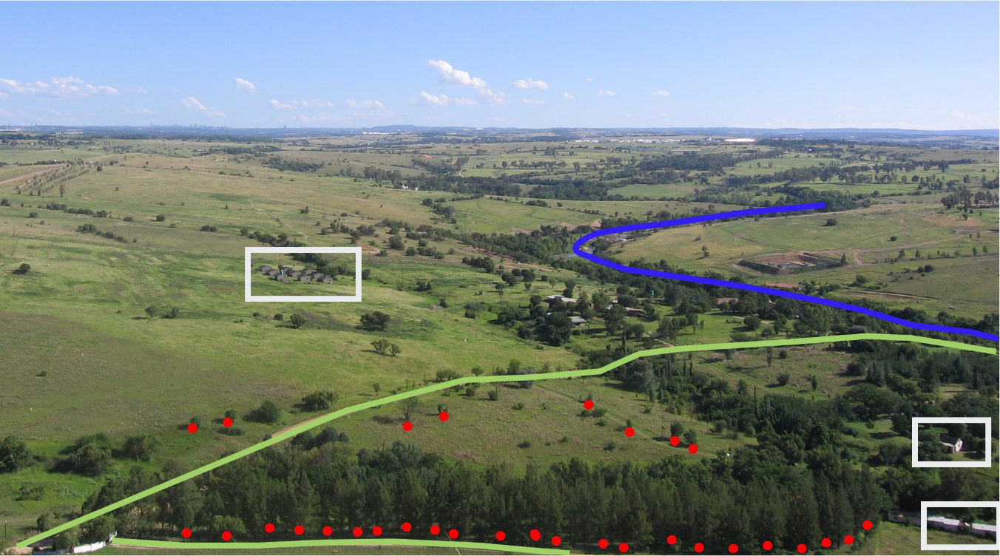
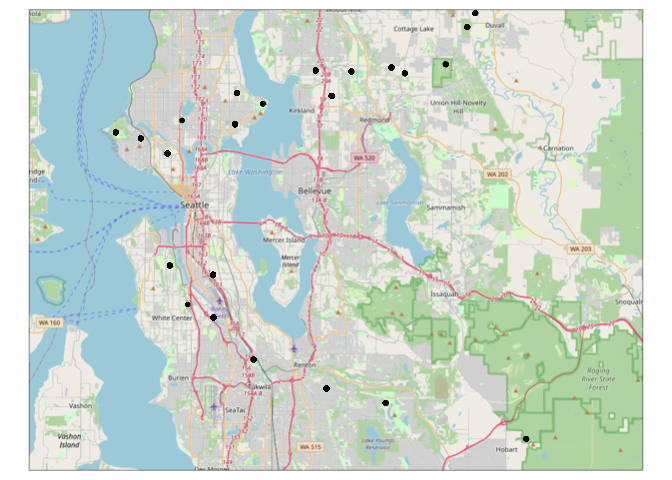
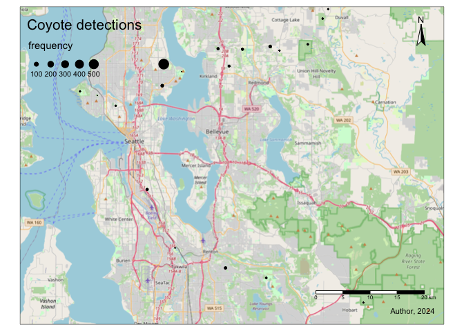
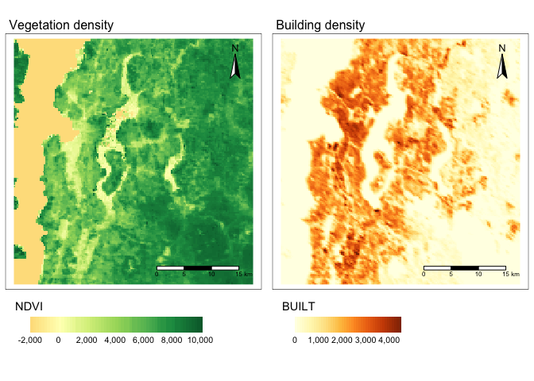
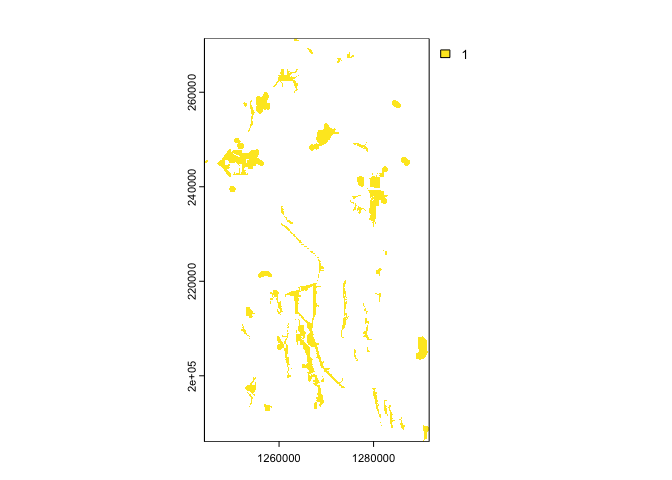
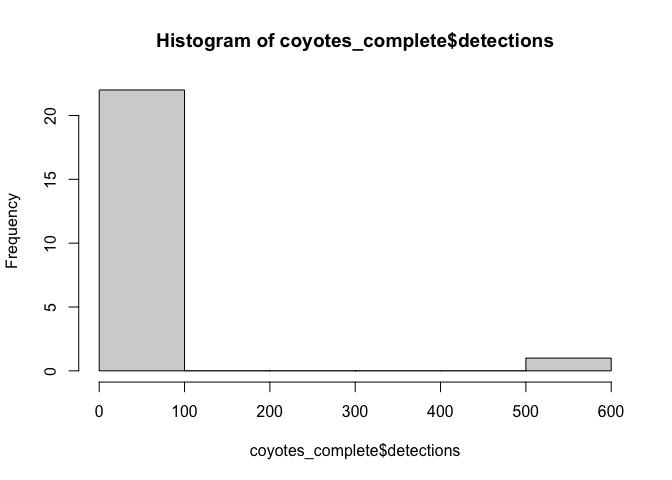

-   [Spatial Mapping in R](#spatial-mapping-in-r)
    -   [Learning objectives](#learning-objectives)
    -   [Workshop overview](#workshop-overview)
-   [Spatial data](#spatial-data)
    -   [Projections and Spatial Reference Systems
        (SRS)](#projections-and-spatial-reference-systems-srs)
    -   [Setting up to work with spatial data in
        R](#setting-up-to-work-with-spatial-data-in-r)
-   [Vector data](#vector-data)
    -   [Vector data: points](#vector-data-points)
-   [EDITED TO HERE](#edited-to-here)
    -   [Vector data: lines](#vector-data-lines)
    -   [Vector data: polygons](#vector-data-polygons)
    -   [Raster data](#raster-data)
    -   [Use your spatial data in downstream
        analysis](#use-your-spatial-data-in-downstream-analysis)

# Spatial Mapping in R

*Tiziana Gelmi-Candusso and Mark Jordan* June 2024

## Learning objectives

1.  Describe different data types and projections used in spatial data
    analysis
2.  Import and process spatial data (vector and raster)
3.  Display spatial data in customizable maps
4.  Prepare spatial data for downstream analysis

## Workshop overview

During the workshop we will work with converting our camera trap data to
spatial layers, map them, and extract spatial information within each
sampling site’s buffer area. For this we will import, manipulate and
extract spatial data in both vector (points, lines, and polygons) and
raster form. Our output will be a table with all camera trap records and
the corresponding environmental variables, ready to build models using
your detection data. This case study shows how integrating your spatial
analysis into R allows you to perform a complete analysis in one setting
instead of bouncing back and forth between GIS and R.

Let’s start.

# Spatial data

Spatial data is any type of data that directly or indirectly references
a specific geographical area or location. These can be, for example,
geographic features on the landscape or environmental properties of an
area such as temperature or air quality. Spatial data can be continuous
or discrete just like regular data, and in both cases it can be
represented as a **vector** or a **raster**. Vector data uses points,
lines, or polygons to represent spatial data, while raster data
represents data in a grid of pixels where each pixel/cell represents a
specific geographic location and the information therein. Raster data
will be heavily influenced by the size of the pixels/cells,
i.e. resolution.

<figure>

<figcaption aria-hidden="true">Figure showing difference between vectors
and rasters</figcaption>
</figure>

## Projections and Spatial Reference Systems (SRS)

Both vector and raster data are planar representations of the world, a
3-dimensional sphere, and as such are not perfect copies. Depending on
how the planar representation is created it will distort more or less
certain areas of the world. Therefore many representations exist. These
are called projections, as the representations project the 3-dimensional
spheric image into a planar, 2-dimensional image. Maps with different
projections are not comparable and cannot be overlaid. Therefore, we
need to make sure we always work on the same projection when using
spatial data.

<figure>

<figcaption aria-hidden="true">Figure showing different projections of
the earth</figcaption>
</figure>

To locate geographic features on a map, you also need a system of
coordinates that define the x-y coordinates for every point on the map.
The system of latitude and longitude is the most familiar. These
coordinate systems can be used to extract area and distance information
from maps. A combination of a projection and a set of coordinates is
known as a **Spatial Reference System (SRS)**. Your choice of SRS will
depend on the source of your data and your spatial analysis needs. In
general, there is a trade-off between the extent of an SRS and its
accuracy for measurement. For example, the WGS84 system of latitude and
longitude covers the entire earth, but it is not useful for measurement
because degrees of longitude become closer together the closer you are
to the poles. Systems based in UTM or State Plane coordinates are much
more accurate for measuring distances and areas, but they are only
useful for covering specific regions.

To describe SRS systems around the world, every system is given a
specific “EPSG code.” For example, the familiar system of latitude /
longitude has the EPSG code 4326, which is the one we will use today.
All GIS software, including spatial mapping functions in R, allow users
to transform spatial data between different SRSs using these EPSG codes.

Throughout the workshop we will work with one projection “EPSG:4326”. We
will project and re-project layers, i.e. to estimate distances using a
metric coordinate system, however, we’ll always re-project to that one
chosen projection for our final spatial output at each stage. This will
facilitate the extraction of covariates for each camera site since we
will have to overlay layers.

In summary, every spatial data set comes with two primary
considerations:

-   Is it in vector or raster format?
-   What SRS is it in?

## Setting up to work with spatial data in R

### Packages

There are several packages to work with spatial data. Currently, the two
most common are `sf` and `terra`. `sf` can be used for vector data and
`terra` can be used for both vector and raster data. The functions to
work with vector data are different between the packages, but objects
can be converted easily into one another. To go from a Spatvector
(`terra`) to Spatial dataframe (`sf`) we use `sf::st_as_sf()` and
vice-versa we use `terra::vect()`. In most cases, it really doesn’t
matter which one we use. `sf` is better for cross-compatibility with
other GIS platforms, it can be faster, and it has [some other advantages
described here](https://r.geocompx.org/spatial-class#intro-sf). `terra`
can generate multilayer objects and works with the `leaflet` package for
interactive views. We will work with `sf` here and convert the objects
to `terra` when we need to.

-   [Cheatsheet for
    sf](https://github.com/rstudio/cheatsheets/blob/main/sf.pdf)
-   [All the functions available in
    `terra`](https://rdrr.io/github/rspatial/terra/man/terra-package.html)
-   [Tables to convert between the
    two](https://www.r-bloggers.com/2023/06/upcoming-changes-to-popular-r-packages-for-spatial-data-what-you-need-to-do/)

We will also use three packages from the tidyverse (`dplyr`, `tidyr`,
and `ggplot2`) as well as three other mapping packages:

-   `rosm` - plotting from Open Street Map
-   `tmap` - enhanced mapping features
-   `leaflet` - interactive web maps

<!-- -->

    library(dplyr)
    library(tidyr)
    library(ggplot2)

    library(sf)
    library(terra)

    library(rosm)
    library(tmap)
    library(leaflet)

If you haven’t already installed some of these packages, where is a
fancy function to both install and load them at the same time.

    #fancy function to install packages only if you don't have them already
    if(!require(tmap)){
        install.packages("tmap", repos = c("https://r-tmap.r-universe.dev",
                                       "https://cloud.r-project.org"))
        library(tmap)
    }
    if(!require(leaflet)){
        install.packages("leaflet")
        library(leaflet)
    }

# Vector data

In this section we will read and manipulate vector data in R.

-   Vector data represents real world features within the GIS
    environment. A feature is anything you can see on the landscape.
-   Vector data is commonly stored as a shapefile and can contain point,
    line, or polygon data.
-   Vector data contains information attached to each feature, which we
    call attributes.

Features can be points (red) representing specific x,y locations, such
as a trees or camera sites; polygons (white) representing areas, such as
forests or residential areas; and lines (yellow/green and blue)
representing continuous linear features, such as roads or rivers

<figure>

<figcaption aria-hidden="true">Figure showing polygons, points, and
lines in the landscape</figcaption>
</figure>

## Vector data: points

When translating camera trap data into a spatial object in R, each
capture would have one x,y coordinate, corresponding to their respective
camera trap site, hence these would be become point vector data. We will
start our workshop with point vector data by loading, preparing and
plotting our camera trap sites and the corresponding capture data.

In this section, you will learn the following methods for working with
point data

1.  Importing spatial data that is stored in a CSV file
2.  Converting these data to a spatial format
3.  Plotting points on a map

Point data can be obtained directly from a shapefile or a csv file where
each row is a feature. In this case study, the camera trap sites here
are located in Seattle, and have captured coyote and raccoon presence
and absence from the 2019 spring season to the 2021 winter season. The
data is stored as a data frame in a csv called `captures.csv`. The next
two lines read the data and show the top few lines.

    captures.table <- read.csv("data/captures.csv")
    head(captures.table) 

    ##     speciesname    locationid                date latitude longitude
    ## 1 Procyon lotor SEWA_N01_DRP2 2019-07-03 05:02:21 47.64339 -122.3607
    ## 2 Procyon lotor SEWA_N01_DRP2 2019-07-03 06:04:45 47.64339 -122.3607
    ## 3 Procyon lotor SEWA_N01_DRP2 2019-07-03 06:12:10 47.64339 -122.3607
    ## 4 Procyon lotor SEWA_N01_DRP2 2019-07-03 06:13:16 47.64339 -122.3607
    ## 5 Procyon lotor SEWA_N01_DRP2 2019-07-05 03:55:53 47.64339 -122.3607
    ## 6 Procyon lotor SEWA_N01_DRP2 2019-07-05 04:05:21 47.64339 -122.3607

Although the data you imported has Latitude and Longitude columns, R
does not recognize it as “spatial” data. Those two columns could be any
numbers, and they just happen to have names that we recognize as
referring to geography. Our first job will be to **save these data as a
“spatial features data frame.”** This is a special type of data frame
that has a column in a format that any GIS software will recognize as
geographic. This will allow us to observe these points in the map and
extract environmental information based on their location. We will use
the `st_as_sf()` function from the `sf` package, and we will specify the
projection (crs).

    captures.spatial <- st_as_sf(captures.table,
                         coords = c("longitude","latitude"), 
                         crs = 4326)
    head(captures.spatial)

    ## Simple feature collection with 6 features and 3 fields
    ## Geometry type: POINT
    ## Dimension:     XY
    ## Bounding box:  xmin: -122.3607 ymin: 47.64339 xmax: -122.3607 ymax: 47.64339
    ## Geodetic CRS:  WGS 84
    ##     speciesname    locationid                date                   geometry
    ## 1 Procyon lotor SEWA_N01_DRP2 2019-07-03 05:02:21 POINT (-122.3607 47.64339)
    ## 2 Procyon lotor SEWA_N01_DRP2 2019-07-03 06:04:45 POINT (-122.3607 47.64339)
    ## 3 Procyon lotor SEWA_N01_DRP2 2019-07-03 06:12:10 POINT (-122.3607 47.64339)
    ## 4 Procyon lotor SEWA_N01_DRP2 2019-07-03 06:13:16 POINT (-122.3607 47.64339)
    ## 5 Procyon lotor SEWA_N01_DRP2 2019-07-05 03:55:53 POINT (-122.3607 47.64339)
    ## 6 Procyon lotor SEWA_N01_DRP2 2019-07-05 04:05:21 POINT (-122.3607 47.64339)

Vector data reads as a data frame would. Each row is a feature and each
column is an attribute, and it contains a geometry column where the xy
coordinates for the shapes are stored. Let’s break down how we converted
these data and what the ouput means.

### Arguments

The `st_as_sf()` function has three arguments:

1.  our data frame “captures.table”,
2.  `coords`: the names of the columns that hold our coordinates. Note
    that Longitude comes before latitude. This is because the pattern is
    x,y, and Longitude is the Earth’s x-axis.
3.  `crs`: the Coordinate Reference System.

Because the data are in lat/lon format, they are in the WGS 84
projection, and the EPSG code for this projection is 4326. With other
sources of point data, you may need to ask your data provider for the
CRS before working with it.

### METADATA of spatial object

With a spatial data frame, you get the same data frame as before. Each
row has attribute data (species, a location ID, and the capture date of
that species).

However, you also get two new things.

1.  Five lines above your data that describe the spatial components of
    the data frame. Notice the `Geodetic CRS` row that confirms our data
    are in WGS84 format.
2.  A new column at the end called `geometry`. This is the column that
    has converted the Latitude and Longitude columns into spatial data
    we can use in calculations. Notice that it is in `POINT` format.

### Plotting point data

Let’s observe the spatial distribution of the points by plotting them
using the `ggplot2` package. The `geom_sf()` function will allow us to
plot the spatial data frame object.

    ggplot(captures.spatial) + geom_sf()

The plot shows the two transects, but they are out of context, there is
no spatial reference to guide the viewer. There is no basemap in this
plot.

If we want to add a reference so we can easily distinguish between
locations, we will move out of our ggcomfort zone and use the `tmap`
function, which has a similar syntax as `ggplot` but is specifically
made for drawing maps and adds a basemap automatically when used
interactively.

**This map won’t display in the Markdown version of the tutorial, but
you should have an interactive map in the Plot window of RStudio when
you run these next lines.**

    #now we plot, and we'll make it interactive that will add a basemap automatically
    tmap_mode(mode = c("view")) #to return to static use "plot" 

    tm_shape(captures.spatial) +
      tm_dots(size = 0.1, col="black")

<script type="application/json" data-for="htmlwidget-3d9199a185efe652f4f2">{"x":{"options":{"crs":{"crsClass":"L.CRS.EPSG3857","code":null,"proj4def":null,"projectedBounds":null,"options":{}}},"calls":[{"method":"createMapPane","args":["tmap401",401]},{"method":"addProviderTiles","args":["Esri.WorldGrayCanvas",null,"Esri.WorldGrayCanvas",{"minZoom":0,"maxZoom":18,"tileSize":256,"subdomains":"abc","errorTileUrl":"","tms":false,"noWrap":false,"zoomOffset":0,"zoomReverse":false,"opacity":1,"zIndex":1,"detectRetina":false,"pane":"tilePane"}]},{"method":"addProviderTiles","args":["OpenStreetMap",null,"OpenStreetMap",{"minZoom":0,"maxZoom":18,"tileSize":256,"subdomains":"abc","errorTileUrl":"","tms":false,"noWrap":false,"zoomOffset":0,"zoomReverse":false,"opacity":1,"zIndex":1,"detectRetina":false,"pane":"tilePane"}]},{"method":"addProviderTiles","args":["Esri.WorldTopoMap",null,"Esri.WorldTopoMap",{"minZoom":0,"maxZoom":18,"tileSize":256,"subdomains":"abc","errorTileUrl":"","tms":false,"noWrap":false,"zoomOffset":0,"zoomReverse":false,"opacity":1,"zIndex":1,"detectRetina":false,"pane":"tilePane"}]},{"method":"addCircleMarkers","args":[[47.64338516008189,47.64338516008189,47.64338516008189,47.64338516008189,47.64338516008189,47.64338516008189,47.64338516008189,47.64338516008189,47.64338516008189,47.64338516008189,47.64338516008189,47.64338516008189,47.64338516008189,47.64338516008189,47.64338516008189,47.64338516008189,47.64338516008189,47.64338516008189,47.64338516008189,47.64338516008189,47.64338516008189,47.64338516008189,47.64338516008189,47.64338516008189,47.64338516008189,47.64338516008189,47.64338516008189,47.64338516008189,47.64338516008189,47.64338516008189,47.64338516008189,47.64338516008189,47.64338516008189,47.64338516008189,47.64338516008189,47.64338516008189,47.64338516008189,47.64338516008189,47.64338516008189,47.64338516008189,47.64338516008189,47.64338516008189,47.64338516008189,47.64338516008189,47.64338516008189,47.64338516008189,47.64338516008189,47.64338516008189,47.64338516008189,47.64338516008189,47.64338516008189,47.64338516008189,47.64338516008189,47.64338516008189,47.64338516008189,47.64338516008189,47.64338516008189,47.64338516008189,47.64338516008189,47.64338516008189,47.64338516008189,47.64338516008189,47.64338516008189,47.64338516008189,47.64338516008189,47.64338516008189,47.64338516008189,47.64338516008189,47.64338516008189,47.64338516008189,47.64338516008189,47.64338516008189,47.64338516008189,47.64338516008189,47.64338516008189,47.64338516008189,47.64338516008189,47.64338516008189,47.64338516008189,47.64338516008189,47.64338516008189,47.64338516008189,47.64338516008189,47.64338516008189,47.64338516008189,47.64338516008189,47.64338516008189,47.64338516008189,47.64338516008189,47.64338516008189,47.64338516008189,47.64338516008189,47.64338516008189,47.64338516008189,47.64338516008189,47.64338516008189,47.64338516008189,47.64338516008189,47.64338516008189,47.64338516008189,47.64338516008189,47.64338516008189,47.64338516008189,47.64338516008189,47.64338516008189,47.64338516008189,47.64338516008189,47.64338516008189,47.64338516008189,47.64338516008189,47.64338516008189,47.64338516008189,47.64338516008189,47.6595091222836,47.6595091222836,47.48416017940076,47.48416017940076,47.48416017940076,47.51659474419708,47.51659474419708,47.51659474419708,47.51659474419708,47.51659474419708,47.51659474419708,47.51659474419708,47.51659474419708,47.51659474419708,47.51659474419708,47.51659474419708,47.51659474419708,47.51659474419708,47.51659474419708,47.51659474419708,47.51659474419708,47.51659474419708,47.51659474419708,47.51659474419708,47.51659474419708,47.51659474419708,47.51659474419708,47.51659474419708,47.51659474419708,47.51659474419708,47.51659474419708,47.70718497541738,47.70718497541738,47.68991392017635,47.68991392017635,47.68991392017635,47.68991392017635,47.68991392017635,47.68991392017635,47.68991392017635,47.68991392017635,47.54968823171571,47.54968823171571,47.54968823171571,47.54968823171571,47.54968823171571,47.54968823171571,47.54968823171571,47.54968823171571,47.54968823171571,47.54968823171571,47.54968823171571,47.54968823171571,47.54968823171571,47.54968823171571,47.54968823171571,47.54968823171571,47.54968823171571,47.54968823171571,47.54968823171571,47.54968823171571,47.54968823171571,47.54968823171571,47.54968823171571,47.54968823171571,47.54968823171571,47.54968823171571,47.54968823171571,47.54968823171571,47.54968823171571,47.54968823171571,47.54968823171571,47.54968823171571,47.54968823171571,47.54968823171571,47.54968823171571,47.54968823171571,47.54968823171571,47.54968823171571,47.54968823171571,47.54968823171571,47.54968823171571,47.54968823171571,47.54968823171571,47.54968823171571,47.54968823171571,47.68772777349194,47.71204606142857,47.71204606142857,47.71204606142857,47.70645746219994,47.70645746219994,47.70645746219994,47.70645746219994,47.70645746219994,47.70645746219994,47.70962862479189,47.46171982619614,47.46171982619614,47.46171982619614,47.46171982619614,47.46171982619614,47.46171982619614,47.46171982619614,47.46171982619614,47.46171982619614,47.46171982619614,47.46171982619614,47.46171982619614,47.46171982619614,47.46171982619614,47.46171982619614,47.46171982619614,47.46171982619614,47.46171982619614,47.46171982619614,47.46171982619614,47.46171982619614,47.46171982619614,47.46171982619614,47.46171982619614,47.46171982619614,47.46171982619614,47.46171982619614,47.46171982619614,47.46171982619614,47.46171982619614,47.46171982619614,47.46171982619614,47.46171982619614,47.46171982619614,47.46171982619614,47.46171982619614,47.46171982619614,47.46171982619614,47.46171982619614,47.46171982619614,47.46171982619614,47.46171982619614,47.46171982619614,47.46171982619614,47.46171982619614,47.46171982619614,47.46171982619614,47.46171982619614,47.46171982619614,47.46171982619614,47.46171982619614,47.75132170764085,47.75132170764085,47.75132170764085,47.75132170764085,47.68991392017635,47.68991392017635,47.68991392017635,47.68991392017635,47.68991392017635,47.68991392017635,47.68991392017635,47.68991392017635,47.68991392017635,47.68991392017635,47.68991392017635,47.68991392017635,47.68991392017635,47.68991392017635,47.68991392017635,47.68991392017635,47.68991392017635,47.68991392017635,47.68991392017635,47.68991392017635,47.68991392017635,47.68991392017635,47.68991392017635,47.68991392017635,47.68991392017635,47.68991392017635,47.68991392017635,47.68991392017635,47.68991392017635,47.68991392017635,47.68991392017635,47.68991392017635,47.68991392017635,47.68991392017635,47.68991392017635,47.68991392017635,47.68991392017635,47.68991392017635,47.68991392017635,47.68991392017635,47.68991392017635,47.68991392017635,47.68991392017635,47.68991392017635,47.68991392017635,47.68991392017635,47.68991392017635,47.68991392017635,47.68991392017635,47.68991392017635,47.68991392017635,47.68991392017635,47.68991392017635,47.68991392017635,47.68991392017635,47.68991392017635,47.68991392017635,47.68991392017635,47.68991392017635,47.68991392017635,47.68991392017635,47.68991392017635,47.68991392017635,47.68991392017635,47.68991392017635,47.68991392017635,47.68991392017635,47.68991392017635,47.70718497541738,47.70718497541738,47.70718497541738,47.70718497541738,47.70718497541738,47.70718497541738,47.70962862479189,47.70962862479189,47.70962862479189,47.54968823171571,47.54968823171571,47.54968823171571,47.54968823171571,47.54968823171571,47.54968823171571,47.54968823171571,47.54968823171571,47.54968823171571,47.54968823171571,47.54968823171571,47.54968823171571,47.54968823171571,47.54968823171571,47.54968823171571,47.54968823171571,47.54968823171571,47.54968823171571,47.54968823171571,47.54968823171571,47.54968823171571,47.54968823171571,47.54968823171571,47.54968823171571,47.54968823171571,47.54968823171571,47.54968823171571,47.54968823171571,47.54968823171571,47.54968823171571,47.54968823171571,47.54968823171571,47.54968823171571,47.54968823171571,47.54968823171571,47.54968823171571,47.54968823171571,47.54968823171571,47.54968823171571,47.54968823171571,47.54968823171571,47.54968823171571,47.54968823171571,47.54968823171571,47.54968823171571,47.54968823171571,47.54968823171571,47.54968823171571,47.54968823171571,47.54968823171571,47.54968823171571,47.54968823171571,47.54968823171571,47.54968823171571,47.54968823171571,47.54968823171571,47.54968823171571,47.54968823171571,47.54968823171571,47.54968823171571,47.54968823171571,47.54968823171571,47.54968823171571,47.54968823171571,47.54968823171571,47.54968823171571,47.54968823171571,47.54968823171571,47.54968823171571,47.54968823171571,47.54968823171571,47.54968823171571,47.54968823171571,47.54968823171571,47.54968823171571,47.54968823171571,47.54968823171571,47.54968823171571,47.54968823171571,47.54968823171571,47.54968823171571,47.54968823171571,47.54968823171571,47.54968823171571,47.64338516008189,47.64338516008189,47.64338516008189,47.64338516008189,47.64338516008189,47.64338516008189,47.64338516008189,47.64338516008189,47.64338516008189,47.64338516008189,47.64338516008189,47.64338516008189,47.64338516008189,47.64338516008189,47.64338516008189,47.64338516008189,47.64338516008189,47.64338516008189,47.64338516008189,47.64338516008189,47.64338516008189,47.64338516008189,47.64338516008189,47.64338516008189,47.64338516008189,47.64338516008189,47.64338516008189,47.64338516008189,47.64338516008189,47.64338516008189,47.64338516008189,47.64338516008189,47.64338516008189,47.64338516008189,47.64338516008189,47.64338516008189,47.64338516008189,47.64338516008189,47.64338516008189,47.64338516008189,47.64338516008189,47.64338516008189,47.70718497541738,47.70718497541738,47.70718497541738,47.70718497541738,47.70718497541738,47.70718497541738,47.70718497541738,47.54968823171571,47.54968823171571,47.54968823171571,47.54968823171571,47.54968823171571,47.54968823171571,47.54968823171571,47.54968823171571,47.4505451313924,47.4505451313924,47.4505451313924,47.4505451313924,47.4505451313924,47.4505451313924,47.4505451313924,47.4505451313924,47.4505451313924,47.4505451313924,47.4505451313924,47.4505451313924,47.75132170764085,47.75132170764085,47.75132170764085,47.64338516008189,47.64338516008189,47.64338516008189,47.64338516008189,47.64338516008189,47.64338516008189,47.64338516008189,47.64338516008189,47.64338516008189,47.64338516008189,47.64338516008189,47.64338516008189,47.64338516008189,47.64338516008189,47.64338516008189,47.64338516008189,47.64338516008189,47.64338516008189,47.64338516008189,47.64338516008189,47.64338516008189,47.64338516008189,47.64338516008189,47.64338516008189,47.64338516008189,47.64338516008189,47.64338516008189,47.64338516008189,47.64338516008189,47.64338516008189,47.64338516008189,47.64338516008189,47.64338516008189,47.64338516008189,47.64338516008189,47.64338516008189,47.64338516008189,47.64338516008189,47.64338516008189,47.64338516008189,47.64338516008189,47.64338516008189,47.64338516008189,47.64338516008189,47.64338516008189,47.64338516008189,47.64338516008189,47.64338516008189,47.64338516008189,47.64338516008189,47.64338516008189,47.64338516008189,47.64338516008189,47.64338516008189,47.64338516008189,47.64338516008189,47.64338516008189,47.64338516008189,47.64338516008189,47.64338516008189,47.64338516008189,47.64338516008189,47.64338516008189,47.64338516008189,47.64338516008189,47.64338516008189,47.64338516008189,47.64338516008189,47.64338516008189,47.64338516008189,47.64338516008189,47.64338516008189,47.64338516008189,47.64338516008189,47.64338516008189,47.64338516008189,47.64338516008189,47.64338516008189,47.64338516008189,47.64338516008189,47.64338516008189,47.64338516008189,47.64338516008189,47.64338516008189,47.64338516008189,47.64338516008189,47.64338516008189,47.64338516008189,47.64338516008189,47.64338516008189,47.64338516008189,47.64338516008189,47.64338516008189,47.64338516008189,47.64338516008189,47.64338516008189,47.64338516008189,47.64338516008189,47.64338516008189,47.64338516008189,47.64338516008189,47.64338516008189,47.64338516008189,47.64338516008189,47.64338516008189,47.64338516008189,47.64338516008189,47.64338516008189,47.64338516008189,47.64338516008189,47.64338516008189,47.64338516008189,47.64338516008189,47.64338516008189,47.64338516008189,47.64338516008189,47.64338516008189,47.64338516008189,47.64338516008189,47.64338516008189,47.64338516008189,47.64338516008189,47.64338516008189,47.64338516008189,47.64338516008189,47.64338516008189,47.64338516008189,47.6595091222836,47.6595091222836,47.6595091222836,47.6595091222836,47.6595091222836,47.6595091222836,47.6595091222836,47.6595091222836,47.6595091222836,47.6595091222836,47.6595091222836,47.6595091222836,47.6595091222836,47.68991392017635,47.68991392017635,47.68991392017635,47.68991392017635,47.68991392017635,47.68991392017635,47.68991392017635,47.68991392017635,47.68991392017635,47.68991392017635,47.68991392017635,47.68991392017635,47.68991392017635,47.68991392017635,47.68991392017635,47.68991392017635,47.68991392017635,47.68991392017635,47.68991392017635,47.68991392017635,47.68991392017635,47.68991392017635,47.68991392017635,47.68991392017635,47.68991392017635,47.68991392017635,47.68991392017635,47.68991392017635,47.68991392017635,47.68991392017635,47.68991392017635,47.68991392017635,47.68991392017635,47.68991392017635,47.68991392017635,47.68991392017635,47.68991392017635,47.68991392017635,47.68991392017635,47.68991392017635,47.68991392017635,47.68991392017635,47.68991392017635,47.68991392017635,47.68991392017635,47.68991392017635,47.68991392017635,47.68991392017635,47.68991392017635,47.68991392017635,47.68991392017635,47.68991392017635,47.68991392017635,47.68991392017635,47.68991392017635,47.68991392017635,47.68991392017635,47.68991392017635,47.68991392017635,47.68991392017635,47.68991392017635,47.68991392017635,47.68991392017635,47.68991392017635,47.68991392017635,47.68991392017635,47.68991392017635,47.68991392017635,47.68991392017635,47.68991392017635,47.68991392017635,47.68991392017635,47.68991392017635,47.68991392017635,47.68991392017635,47.68991392017635,47.68991392017635,47.68991392017635,47.68991392017635,47.68991392017635,47.68991392017635,47.68991392017635,47.68991392017635,47.68991392017635,47.68991392017635,47.68991392017635,47.68991392017635,47.68991392017635,47.68991392017635,47.68991392017635,47.68991392017635,47.65492640513797,47.65492640513797,47.65492640513797,47.70645746219994,47.70645746219994,47.70645746219994,47.70645746219994,47.70645746219994,47.70645746219994,47.70645746219994,47.70645746219994,47.70645746219994,47.70645746219994,47.70962862479189,47.70962862479189,47.70962862479189,47.70962862479189,47.70962862479189,47.70962862479189,47.70962862479189,47.70962862479189,47.70962862479189,47.70962862479189,47.70962862479189,47.70962862479189,47.70962862479189,47.70962862479189,47.70962862479189,47.64338516008189,47.64338516008189,47.64338516008189,47.64338516008189,47.64338516008189,47.64338516008189,47.64338516008189,47.64338516008189,47.64338516008189,47.64338516008189,47.64338516008189,47.64338516008189,47.64338516008189,47.64338516008189,47.64338516008189,47.64338516008189,47.64338516008189,47.64338516008189,47.64338516008189,47.64338516008189,47.64338516008189,47.64338516008189,47.64338516008189,47.64338516008189,47.64338516008189,47.64338516008189,47.64338516008189,47.64338516008189,47.64338516008189,47.64338516008189,47.64338516008189,47.64338516008189,47.64338516008189,47.64338516008189,47.64338516008189,47.64338516008189,47.64338516008189,47.64338516008189,47.64338516008189,47.64338516008189,47.64338516008189,47.64338516008189,47.64338516008189,47.64338516008189,47.64338516008189,47.64338516008189,47.64338516008189,47.64338516008189,47.64338516008189,47.64338516008189,47.64338516008189,47.64338516008189,47.64338516008189,47.64338516008189,47.64338516008189,47.64338516008189,47.64338516008189,47.64338516008189,47.64338516008189,47.64338516008189,47.64338516008189,47.64338516008189,47.64338516008189,47.64338516008189,47.64338516008189,47.64338516008189,47.64338516008189,47.64338516008189,47.64338516008189,47.64338516008189,47.64338516008189,47.64338516008189,47.64338516008189,47.64338516008189,47.64338516008189,47.64338516008189,47.64338516008189,47.64338516008189,47.64338516008189,47.64338516008189,47.64338516008189,47.64338516008189,47.64338516008189,47.64338516008189,47.64338516008189,47.64338516008189,47.64338516008189,47.64338516008189,47.64338516008189,47.64338516008189,47.64338516008189,47.64338516008189,47.64338516008189,47.64338516008189,47.6595091222836,47.6595091222836,47.6595091222836,47.6595091222836,47.6595091222836,47.6595091222836,47.6595091222836,47.75132170764085,47.68163892087217,47.70718497541738,47.70718497541738,47.70718497541738,47.70718497541738,47.70718497541738,47.68991392017635,47.68991392017635,47.68163892087217,47.70645746219994,47.70645746219994,47.70645746219994,47.70645746219994,47.70645746219994,47.70645746219994,47.70962862479189,47.70962862479189,47.70962862479189,47.70962862479189,47.46171982619614,47.46171982619614,47.46171982619614,47.70962862479189,47.70962862479189,47.70962862479189,47.64338516008189,47.64338516008189,47.64338516008189,47.64338516008189,47.64338516008189,47.64338516008189,47.64338516008189,47.64338516008189,47.64338516008189,47.64338516008189,47.64338516008189,47.64338516008189,47.64338516008189,47.64338516008189,47.64338516008189,47.64338516008189,47.64338516008189,47.64338516008189,47.64338516008189,47.64338516008189,47.64338516008189,47.64338516008189,47.64338516008189,47.64338516008189,47.64338516008189,47.64338516008189,47.64338516008189,47.64338516008189,47.64338516008189,47.64338516008189,47.64338516008189,47.64338516008189,47.64338516008189,47.64338516008189,47.64338516008189,47.64338516008189,47.64338516008189,47.64338516008189,47.64338516008189,47.6595091222836,47.6595091222836,47.6595091222836,47.6595091222836,47.6595091222836,47.6595091222836,47.6595091222836,47.6595091222836,47.68991392017635,47.68991392017635,47.68991392017635,47.68991392017635,47.68991392017635,47.68991392017635,47.68991392017635,47.68991392017635,47.68991392017635,47.68991392017635,47.68991392017635,47.68991392017635,47.68991392017635,47.68163892087217,47.71204606142857,47.54968823171571,47.54968823171571,47.54968823171571,47.54968823171571,47.54968823171571,47.54968823171571,47.48416017940076,47.48416017940076,47.51659474419708,47.51659474419708,47.51659474419708,47.51659474419708,47.51659474419708,47.51659474419708,47.51659474419708,47.71204606142857,47.70645746219994,47.70645746219994,47.70645746219994,47.70645746219994,47.70645746219994,47.6595091222836,47.68991392017635,47.68991392017635,47.68991392017635,47.68991392017635,47.68991392017635,47.68991392017635,47.68991392017635,47.68991392017635,47.68991392017635,47.68991392017635,47.68991392017635,47.68991392017635,47.68991392017635,47.68991392017635,47.68991392017635,47.68991392017635,47.68991392017635,47.68991392017635,47.68991392017635,47.68991392017635,47.68991392017635,47.68991392017635,47.68991392017635,47.68991392017635,47.68991392017635,47.68991392017635,47.68991392017635,47.68991392017635,47.68991392017635,47.68991392017635,47.68991392017635,47.68991392017635,47.68991392017635,47.68991392017635,47.68991392017635,47.68991392017635,47.68991392017635,47.68991392017635,47.68991392017635,47.68991392017635,47.68991392017635,47.68991392017635,47.68991392017635,47.68991392017635,47.68991392017635,47.68991392017635,47.68991392017635,47.68991392017635,47.68991392017635,47.68991392017635,47.68991392017635,47.68991392017635,47.68991392017635,47.68991392017635,47.68991392017635,47.68991392017635,47.68991392017635,47.68991392017635,47.68991392017635,47.68991392017635,47.68991392017635,47.68991392017635,47.68991392017635,47.68991392017635,47.68991392017635,47.68991392017635,47.68991392017635,47.68991392017635,47.68991392017635,47.68991392017635,47.68991392017635,47.68991392017635,47.68991392017635,47.68991392017635,47.68991392017635,47.68991392017635,47.68991392017635,47.68991392017635,47.68991392017635,47.68991392017635,47.68991392017635,47.68991392017635,47.68991392017635,47.68991392017635,47.68991392017635,47.68991392017635,47.68991392017635,47.68991392017635,47.68991392017635,47.68991392017635,47.68991392017635,47.68991392017635,47.68991392017635,47.68991392017635,47.68991392017635,47.68991392017635,47.68991392017635,47.68991392017635,47.68991392017635,47.68991392017635,47.68991392017635,47.68991392017635,47.68991392017635,47.68991392017635,47.68991392017635,47.68991392017635,47.68991392017635,47.68991392017635,47.68991392017635,47.68991392017635,47.68991392017635,47.68991392017635,47.68991392017635,47.68991392017635,47.68991392017635,47.68991392017635,47.68991392017635,47.68991392017635,47.68991392017635,47.68991392017635,47.68991392017635,47.68991392017635,47.68991392017635,47.68991392017635,47.68991392017635,47.68991392017635,47.68991392017635,47.68991392017635,47.68991392017635,47.68991392017635,47.68991392017635,47.68991392017635,47.68991392017635,47.68991392017635,47.68991392017635,47.68991392017635,47.68991392017635,47.68991392017635,47.68991392017635,47.68991392017635,47.68991392017635,47.68991392017635,47.68991392017635,47.68991392017635,47.68991392017635,47.68991392017635,47.68991392017635,47.68991392017635,47.68991392017635,47.68991392017635,47.68991392017635,47.68991392017635,47.68991392017635,47.68991392017635,47.68991392017635,47.68991392017635,47.68991392017635,47.68991392017635,47.68991392017635,47.68991392017635,47.68991392017635,47.68991392017635,47.68991392017635,47.68991392017635,47.68991392017635,47.68991392017635,47.68991392017635,47.68991392017635,47.68991392017635,47.68991392017635,47.68991392017635,47.68991392017635,47.68991392017635,47.68991392017635,47.68991392017635,47.68991392017635,47.68991392017635,47.68991392017635,47.68991392017635,47.68991392017635,47.68991392017635,47.68991392017635,47.68991392017635,47.68991392017635,47.68991392017635,47.68991392017635,47.68991392017635,47.68991392017635,47.68991392017635,47.68991392017635,47.68991392017635,47.68991392017635,47.68991392017635,47.68991392017635,47.68991392017635,47.68991392017635,47.68991392017635,47.68991392017635,47.68991392017635,47.68991392017635,47.68991392017635,47.68991392017635,47.68991392017635,47.68991392017635,47.68991392017635,47.68991392017635,47.68991392017635,47.68991392017635,47.68991392017635,47.68991392017635,47.68991392017635,47.68991392017635,47.68991392017635,47.68991392017635,47.68991392017635,47.68991392017635,47.68991392017635,47.68991392017635,47.68991392017635,47.68991392017635,47.68991392017635,47.68991392017635,47.68991392017635,47.68991392017635,47.68991392017635,47.68991392017635,47.68991392017635,47.68991392017635,47.68991392017635,47.68991392017635,47.68991392017635,47.68991392017635,47.68991392017635,47.68991392017635,47.68991392017635,47.68991392017635,47.68991392017635,47.68991392017635,47.68991392017635,47.68991392017635,47.68991392017635,47.68991392017635,47.68991392017635,47.68991392017635,47.68991392017635,47.68991392017635,47.68991392017635,47.68991392017635,47.68991392017635,47.68991392017635,47.68991392017635,47.68991392017635,47.68991392017635,47.68991392017635,47.68991392017635,47.68991392017635,47.68991392017635,47.68991392017635,47.68991392017635,47.68991392017635,47.68991392017635,47.68991392017635,47.68991392017635,47.68991392017635,47.68991392017635,47.68991392017635,47.68991392017635,47.68991392017635,47.68991392017635,47.68991392017635,47.68991392017635,47.54968823171571,47.54968823171571,47.54968823171571,47.54968823171571,47.54968823171571,47.54968823171571,47.51659474419708,47.51659474419708,47.51659474419708,47.51659474419708,47.55682587738807,47.55682587738807,47.55682587738807,47.55682587738807,47.55682587738807,47.55682587738807,47.55682587738807,47.55682587738807,47.55682587738807,47.55682587738807,47.55682587738807,47.55682587738807,47.55682587738807,47.55682587738807,47.55682587738807,47.55682587738807,47.55682587738807,47.55682587738807,47.55682587738807,47.55682587738807,47.55682587738807,47.55682587738807,47.55682587738807,47.55682587738807,47.55682587738807,47.55682587738807,47.55682587738807,47.55682587738807,47.55682587738807,47.55682587738807,47.55682587738807,47.55682587738807,47.55682587738807,47.55682587738807,47.64338516008189,47.64338516008189,47.64338516008189,47.64338516008189,47.64338516008189,47.64338516008189,47.64338516008189,47.64338516008189,47.64338516008189,47.64338516008189,47.64338516008189,47.68991392017635,47.64338516008189,47.64338516008189,47.64338516008189,47.64338516008189,47.64338516008189,47.64338516008189,47.64338516008189,47.64338516008189,47.64338516008189,47.64338516008189,47.64338516008189,47.64338516008189,47.64338516008189,47.64338516008189,47.64338516008189,47.64338516008189,47.64338516008189,47.64338516008189,47.64338516008189,47.64338516008189,47.64338516008189,47.64338516008189,47.64338516008189,47.64338516008189,47.64338516008189,47.64338516008189,47.64338516008189,47.64338516008189,47.64338516008189,47.64338516008189,47.64338516008189,47.64338516008189,47.68991392017635,47.70962862479189,47.70962862479189,47.70962862479189,47.70962862479189,47.70962862479189,47.70962862479189,47.70962862479189,47.70962862479189,47.70962862479189,47.70962862479189,47.70962862479189,47.70645746219994,47.4505451313924,47.4505451313924,47.46171982619614,47.46171982619614,47.46171982619614,47.46171982619614,47.46171982619614,47.46171982619614,47.75132170764085,47.75132170764085,47.75132170764085,47.70718497541738,47.70718497541738,47.70718497541738,47.70718497541738,47.70718497541738,47.70718497541738,47.70718497541738,47.70718497541738,47.70718497541738,47.68772777349194,47.68772777349194,47.68772777349194,47.68772777349194,47.68772777349194,47.68772777349194,47.68772777349194,47.68772777349194,47.68772777349194,47.68772777349194,47.68772777349194,47.68772777349194,47.68772777349194,47.68772777349194,47.68772777349194,47.68772777349194,47.68772777349194,47.68772777349194,47.68772777349194,47.68772777349194,47.68772777349194,47.68772777349194,47.68772777349194,47.68772777349194,47.68772777349194,47.68772777349194,47.68772777349194,47.68772777349194,47.68772777349194,47.68772777349194,47.68772777349194,47.68772777349194,47.68772777349194,47.68772777349194,47.68772777349194,47.68772777349194,47.68772777349194,47.68772777349194,47.68772777349194,47.68772777349194,47.68772777349194,47.68772777349194,47.68772777349194,47.68772777349194,47.68772777349194,47.68772777349194,47.68772777349194,47.68772777349194,47.68772777349194,47.68772777349194,47.68772777349194,47.68772777349194,47.68772777349194,47.68772777349194,47.68772777349194,47.68772777349194,47.68772777349194,47.68772777349194,47.68772777349194,47.68772777349194,47.68772777349194,47.68772777349194,47.68772777349194,47.68772777349194,47.68772777349194,47.65492640513797,47.65492640513797,47.48416017940076,47.48416017940076,47.6595091222836,47.6595091222836,47.6595091222836,47.6595091222836,47.6595091222836,47.6595091222836,47.6595091222836,47.6595091222836,47.6595091222836,47.6595091222836,47.6595091222836,47.6595091222836,47.6595091222836,47.6595091222836,47.64338516008189,47.64338516008189,47.64338516008189,47.64338516008189,47.64338516008189,47.64338516008189,47.64338516008189,47.64338516008189,47.64338516008189,47.64338516008189,47.64338516008189,47.64338516008189,47.64338516008189,47.64338516008189,47.64338516008189,47.64338516008189,47.64338516008189,47.64338516008189,47.64338516008189,47.64338516008189,47.64338516008189,47.64338516008189,47.64338516008189,47.64338516008189,47.64338516008189,47.64338516008189,47.64338516008189,47.64338516008189,47.64338516008189,47.64338516008189,47.64338516008189,47.64338516008189,47.64338516008189,47.64338516008189,47.64338516008189,47.64338516008189,47.64338516008189,47.64338516008189,47.64338516008189,47.64338516008189,47.64338516008189,47.64338516008189,47.64338516008189,47.64338516008189,47.64338516008189,47.64338516008189,47.64338516008189,47.64338516008189,47.64338516008189,47.64338516008189,47.64338516008189,47.64338516008189,47.64338516008189,47.64338516008189,47.64338516008189,47.64338516008189,47.64338516008189,47.64338516008189,47.64338516008189,47.64338516008189,47.64338516008189,47.64338516008189,47.64338516008189,47.64338516008189,47.64338516008189,47.64338516008189,47.64338516008189,47.64338516008189,47.64338516008189,47.64338516008189,47.64338516008189,47.64338516008189,47.64338516008189,47.64338516008189,47.64338516008189,47.64338516008189,47.64338516008189,47.64338516008189,47.64338516008189,47.64338516008189,47.64338516008189,47.64338516008189,47.64338516008189,47.64338516008189,47.64338516008189,47.64338516008189,47.64338516008189,47.64338516008189,47.64338516008189,47.64338516008189,47.64338516008189,47.64338516008189,47.64338516008189,47.64338516008189,47.64338516008189,47.64338516008189,47.68991392017635,47.68991392017635,47.68991392017635,47.68991392017635,47.68991392017635,47.68991392017635,47.68991392017635,47.68991392017635,47.68991392017635,47.68991392017635,47.68991392017635,47.68991392017635,47.68991392017635,47.68991392017635,47.68991392017635,47.68991392017635,47.68991392017635,47.68991392017635,47.68991392017635,47.68991392017635,47.68991392017635,47.68991392017635,47.68991392017635,47.68991392017635,47.68991392017635,47.68991392017635,47.68991392017635,47.68991392017635,47.68991392017635,47.68991392017635,47.68991392017635,47.68991392017635,47.66877800662953,47.66581224621171,47.68991392017635,47.68991392017635,47.68991392017635,47.68991392017635,47.68991392017635,47.68991392017635,47.68991392017635,47.68991392017635,47.68991392017635,47.68991392017635,47.68991392017635,47.68991392017635,47.68991392017635,47.68991392017635,47.68991392017635,47.68991392017635,47.68991392017635,47.68991392017635,47.68991392017635,47.68991392017635,47.68991392017635,47.68991392017635,47.68991392017635,47.68991392017635,47.68991392017635,47.68991392017635,47.68991392017635,47.68991392017635,47.68991392017635,47.68991392017635,47.68991392017635,47.68991392017635,47.68991392017635,47.68991392017635,47.68991392017635,47.68991392017635,47.68991392017635,47.68991392017635,47.68991392017635,47.68991392017635,47.68991392017635,47.68991392017635,47.68991392017635,47.68991392017635,47.68991392017635,47.68991392017635,47.68991392017635,47.68991392017635,47.68991392017635,47.68991392017635,47.68991392017635,47.68991392017635,47.68991392017635,47.68991392017635,47.68991392017635,47.68991392017635,47.68991392017635,47.68991392017635,47.68991392017635,47.68991392017635,47.68991392017635,47.68991392017635,47.68991392017635,47.68991392017635,47.68991392017635,47.68991392017635,47.68991392017635,47.68991392017635,47.68991392017635,47.70508101296168,47.70508101296168,47.54968823171571,47.54968823171571,47.54968823171571,47.54968823171571,47.54968823171571,47.54968823171571,47.54968823171571,47.54968823171571,47.54968823171571,47.54968823171571,47.54968823171571,47.54968823171571,47.54968823171571,47.54968823171571,47.54968823171571,47.54968823171571,47.54968823171571,47.54968823171571,47.54968823171571,47.54968823171571,47.64338516008189,47.64338516008189,47.64338516008189,47.64338516008189,47.64338516008189,47.64338516008189,47.64338516008189,47.64338516008189,47.64338516008189,47.64338516008189,47.64338516008189,47.64338516008189,47.64338516008189,47.64338516008189,47.64338516008189,47.64338516008189,47.64338516008189,47.64338516008189,47.64338516008189,47.64338516008189,47.64338516008189,47.64338516008189,47.64338516008189,47.64338516008189,47.64338516008189,47.64338516008189,47.64338516008189,47.64338516008189,47.64338516008189,47.64338516008189,47.64338516008189,47.64338516008189,47.64338516008189,47.64338516008189,47.64338516008189,47.64338516008189,47.64338516008189,47.64338516008189,47.64338516008189,47.64338516008189,47.64338516008189,47.64338516008189,47.64338516008189,47.64338516008189,47.64338516008189,47.64338516008189,47.64338516008189,47.64338516008189,47.64338516008189,47.64338516008189,47.64338516008189,47.64338516008189,47.64338516008189,47.64338516008189,47.64338516008189,47.64338516008189,47.64338516008189,47.64338516008189,47.64338516008189,47.64338516008189,47.64338516008189,47.64338516008189,47.64338516008189,47.64338516008189,47.64338516008189,47.64338516008189,47.64338516008189,47.64338516008189,47.64338516008189,47.6595091222836,47.6595091222836,47.6595091222836,47.6595091222836,47.75132170764085,47.70718497541738,47.70718497541738,47.70718497541738,47.70718497541738,47.70718497541738,47.70718497541738,47.70718497541738,47.70718497541738,47.70718497541738,47.70718497541738,47.70718497541738,47.70718497541738,47.70718497541738,47.70718497541738,47.70718497541738,47.70718497541738,47.70718497541738,47.70718497541738,47.70718497541738,47.70718497541738,47.70718497541738,47.65492640513797,47.65492640513797,47.65492640513797,47.65492640513797,47.65492640513797,47.65492640513797,47.65492640513797,47.65492640513797,47.65492640513797,47.54968823171571,47.54968823171571,47.54968823171571,47.54968823171571,47.54968823171571,47.4505451313924,47.4505451313924,47.4505451313924,47.4505451313924,47.4505451313924,47.4505451313924,47.70508101296168,47.70508101296168,47.70508101296168,47.68772777349194,47.68772777349194,47.68772777349194,47.68772777349194,47.68772777349194,47.55682587738807,47.55682587738807,47.55682587738807,47.55682587738807,47.55682587738807,47.55682587738807,47.55682587738807,47.55682587738807,47.55682587738807,47.55682587738807,47.55682587738807,47.55682587738807,47.55682587738807,47.55682587738807,47.55682587738807,47.74069408150336,47.74069408150336,47.74069408150336,47.74069408150336,47.74069408150336,47.74069408150336,47.74069408150336,47.74069408150336,47.74069408150336,47.70645746219994,47.70645746219994,47.70962862479189,47.70962862479189,47.42277685380083,47.42277685380083,47.42277685380083,47.42277685380083,47.42277685380083,47.42277685380083,47.42277685380083,47.42277685380083,47.64338516008189,47.64338516008189,47.64338516008189,47.64338516008189,47.64338516008189,47.64338516008189,47.64338516008189,47.64338516008189,47.64338516008189,47.64338516008189,47.64338516008189,47.64338516008189,47.64338516008189,47.64338516008189,47.64338516008189,47.64338516008189,47.64338516008189,47.64338516008189,47.64338516008189,47.64338516008189,47.64338516008189,47.64338516008189,47.64338516008189,47.64338516008189,47.64338516008189,47.64338516008189,47.64338516008189,47.64338516008189,47.64338516008189,47.64338516008189,47.64338516008189,47.64338516008189,47.64338516008189,47.64338516008189,47.64338516008189,47.64338516008189,47.64338516008189,47.64338516008189,47.64338516008189,47.64338516008189,47.64338516008189,47.64338516008189,47.64338516008189,47.64338516008189,47.64338516008189,47.64338516008189,47.64338516008189,47.64338516008189,47.64338516008189,47.64338516008189,47.64338516008189,47.64338516008189,47.64338516008189,47.64338516008189,47.64338516008189,47.64338516008189,47.64338516008189,47.64338516008189,47.64338516008189,47.64338516008189,47.64338516008189,47.64338516008189,47.64338516008189,47.64338516008189,47.64338516008189,47.64338516008189,47.64338516008189,47.64338516008189,47.64338516008189,47.64338516008189,47.64338516008189,47.64338516008189,47.64338516008189,47.64338516008189,47.64338516008189,47.64338516008189,47.64338516008189,47.64338516008189,47.64338516008189,47.64338516008189,47.64338516008189,47.64338516008189,47.64338516008189,47.64338516008189,47.64338516008189,47.64338516008189,47.64338516008189,47.64338516008189,47.64338516008189,47.64338516008189,47.64338516008189,47.64338516008189,47.64338516008189,47.64338516008189,47.64338516008189,47.64338516008189,47.64338516008189,47.64338516008189,47.64338516008189,47.64338516008189,47.64338516008189,47.64338516008189,47.64338516008189,47.64338516008189,47.64338516008189,47.64338516008189,47.64338516008189,47.64338516008189,47.64338516008189,47.64338516008189,47.64338516008189,47.64338516008189,47.64338516008189,47.64338516008189,47.64338516008189,47.64338516008189,47.64338516008189,47.64338516008189,47.64338516008189,47.64338516008189,47.64338516008189,47.64338516008189,47.64338516008189,47.64338516008189,47.64338516008189,47.64338516008189,47.64338516008189,47.64338516008189,47.64338516008189,47.64338516008189,47.64338516008189,47.64338516008189,47.64338516008189,47.64338516008189,47.64338516008189,47.64338516008189,47.64338516008189,47.64338516008189,47.64338516008189,47.64338516008189,47.64338516008189,47.64338516008189,47.64338516008189,47.64338516008189,47.64338516008189,47.6595091222836,47.6595091222836,47.6595091222836,47.6595091222836,47.6595091222836,47.48416017940076,47.70718497541738,47.70718497541738,47.70718497541738,47.70718497541738,47.70718497541738,47.70718497541738,47.70718497541738,47.70718497541738,47.70718497541738,47.70718497541738,47.70718497541738,47.70718497541738,47.70718497541738,47.70718497541738,47.70718497541738,47.70718497541738,47.70718497541738,47.70718497541738,47.70718497541738,47.70718497541738,47.70718497541738,47.70718497541738,47.70718497541738,47.70718497541738,47.70718497541738,47.70718497541738,47.70718497541738,47.70718497541738,47.70718497541738,47.70718497541738,47.70718497541738,47.70718497541738,47.70718497541738,47.70718497541738,47.70718497541738,47.70718497541738,47.70718497541738,47.70718497541738,47.70718497541738,47.70718497541738,47.70718497541738,47.70718497541738,47.70718497541738,47.70718497541738,47.70718497541738,47.70718497541738,47.70718497541738,47.70718497541738,47.70718497541738,47.70718497541738,47.70718497541738,47.70718497541738,47.70718497541738,47.70718497541738,47.70718497541738,47.65492640513797,47.65492640513797,47.70508101296168,47.54968823171571,47.54968823171571,47.54968823171571,47.54968823171571,47.54968823171571,47.55682587738807,47.71204606142857,47.71204606142857,47.71204606142857,47.71204606142857,47.71204606142857,47.71204606142857,47.71204606142857,47.71204606142857,47.70962862479189,47.70962862479189,47.70962862479189,47.70962862479189,47.70962862479189,47.70962862479189,47.70962862479189,47.64338516008189,47.64338516008189,47.64338516008189,47.64338516008189,47.64338516008189,47.64338516008189,47.64338516008189,47.64338516008189,47.64338516008189,47.64338516008189,47.64338516008189,47.64338516008189,47.64338516008189,47.64338516008189,47.64338516008189,47.64338516008189,47.64338516008189,47.64338516008189,47.64338516008189,47.64338516008189,47.64338516008189,47.64338516008189,47.64338516008189,47.64338516008189,47.64338516008189,47.64338516008189,47.64338516008189,47.64338516008189,47.64338516008189,47.64338516008189,47.64338516008189,47.64338516008189,47.52669775847825,47.71204606142857,47.71204606142857,47.71204606142857,47.71204606142857,47.68772777349194,47.68772777349194,47.68772777349194,47.68772777349194,47.68772777349194,47.68772777349194,47.68772777349194,47.68772777349194,47.68772777349194,47.68772777349194,47.68772777349194,47.68772777349194,47.68772777349194,47.68772777349194,47.68772777349194,47.6595091222836,47.6595091222836,47.6595091222836,47.6595091222836,47.6595091222836,47.64338516008189,47.64338516008189,47.64338516008189,47.64338516008189,47.64338516008189,47.64338516008189,47.64338516008189,47.64338516008189,47.64338516008189,47.64338516008189,47.64338516008189,47.64338516008189,47.64338516008189,47.64338516008189,47.64338516008189,47.64338516008189,47.64338516008189,47.64338516008189,47.64338516008189,47.64338516008189,47.64338516008189,47.64338516008189,47.64338516008189,47.64338516008189,47.64338516008189,47.64338516008189,47.64338516008189,47.64338516008189,47.64338516008189,47.64338516008189,47.64338516008189,47.64338516008189,47.64338516008189,47.64338516008189,47.64338516008189,47.64338516008189,47.64338516008189,47.64338516008189,47.64338516008189,47.64338516008189,47.64338516008189,47.64338516008189,47.64338516008189,47.64338516008189,47.64338516008189,47.64338516008189,47.64338516008189,47.64338516008189,47.64338516008189,47.64338516008189,47.64338516008189,47.64338516008189,47.64338516008189,47.64338516008189,47.64338516008189,47.64338516008189,47.64338516008189,47.64338516008189,47.64338516008189,47.64338516008189,47.64338516008189,47.64338516008189,47.64338516008189,47.64338516008189,47.64338516008189,47.64338516008189,47.64338516008189,47.64338516008189,47.64338516008189,47.64338516008189,47.64338516008189,47.64338516008189,47.64338516008189,47.64338516008189,47.64338516008189,47.64338516008189,47.64338516008189,47.64338516008189,47.64338516008189,47.64338516008189,47.64338516008189,47.66581224621171,47.66581224621171,47.66581224621171,47.66581224621171,47.66581224621171,47.66581224621171,47.66581224621171,47.66581224621171,47.66581224621171,47.66581224621171,47.66581224621171,47.66581224621171,47.66581224621171,47.66581224621171,47.66581224621171,47.66581224621171,47.66581224621171,47.66581224621171,47.66581224621171,47.66581224621171,47.66581224621171,47.66581224621171,47.66581224621171,47.66581224621171,47.66581224621171,47.66581224621171,47.66581224621171,47.66581224621171,47.66581224621171,47.66581224621171,47.66581224621171,47.66581224621171,47.68991392017635,47.68991392017635,47.68991392017635,47.68991392017635,47.68991392017635,47.68991392017635,47.68991392017635,47.68991392017635,47.68991392017635,47.68991392017635,47.68991392017635,47.68991392017635,47.68991392017635,47.68991392017635,47.70718497541738,47.70718497541738,47.70718497541738,47.70718497541738,47.70718497541738,47.70718497541738,47.70718497541738,47.70718497541738,47.70718497541738,47.70718497541738,47.70718497541738,47.70718497541738,47.70718497541738,47.70718497541738,47.70718497541738,47.70718497541738,47.70718497541738,47.70718497541738,47.70718497541738,47.70718497541738,47.70718497541738,47.70718497541738,47.68772777349194,47.68772777349194,47.68772777349194,47.68772777349194,47.68772777349194,47.68772777349194,47.68772777349194,47.68772777349194,47.68772777349194,47.70645746219994,47.70508101296168,47.70508101296168,47.70508101296168,47.70508101296168,47.70508101296168,47.70508101296168,47.70508101296168,47.70508101296168,47.70508101296168,47.70508101296168,47.75132170764085,47.75132170764085,47.74069408150336,47.74069408150336,47.74069408150336,47.74069408150336,47.74069408150336,47.74069408150336,47.74069408150336,47.74069408150336,47.54968823171571,47.54968823171571,47.54968823171571,47.54968823171571,47.54968823171571,47.48416017940076,47.48416017940076,47.48416017940076,47.48416017940076,47.48416017940076,47.48416017940076,47.48416017940076,47.70962862479189,47.42277685380083,47.42277685380083,47.66581224621171,47.66581224621171,47.66581224621171,47.66581224621171,47.66581224621171,47.66581224621171,47.66581224621171,47.66581224621171,47.66581224621171,47.64338516008189,47.64338516008189,47.64338516008189,47.64338516008189,47.64338516008189,47.64338516008189,47.64338516008189,47.64338516008189,47.64338516008189,47.64338516008189,47.64338516008189,47.64338516008189,47.64338516008189,47.64338516008189,47.64338516008189,47.64338516008189,47.64338516008189,47.64338516008189,47.64338516008189,47.64338516008189,47.64338516008189,47.64338516008189,47.64338516008189,47.64338516008189,47.64338516008189,47.64338516008189,47.64338516008189,47.64338516008189,47.64338516008189,47.64338516008189,47.64338516008189,47.64338516008189,47.64338516008189,47.64338516008189,47.64338516008189,47.64338516008189,47.64338516008189,47.64338516008189,47.64338516008189,47.64338516008189,47.64338516008189,47.64338516008189,47.64338516008189,47.64338516008189,47.64338516008189,47.64338516008189,47.64338516008189,47.64338516008189,47.64338516008189,47.64338516008189,47.64338516008189,47.64338516008189,47.64338516008189,47.64338516008189,47.64338516008189,47.64338516008189,47.64338516008189,47.64338516008189,47.64338516008189,47.6595091222836,47.6595091222836,47.6595091222836,47.48416017940076,47.48416017940076,47.48416017940076,47.70718497541738,47.70718497541738,47.70718497541738,47.70718497541738,47.70718497541738,47.70718497541738,47.70718497541738,47.70718497541738,47.70718497541738,47.70718497541738,47.70718497541738,47.70718497541738,47.70718497541738,47.70718497541738,47.70718497541738,47.70718497541738,47.70718497541738,47.70718497541738,47.70718497541738,47.70718497541738,47.70718497541738,47.70718497541738,47.70718497541738,47.70718497541738,47.70718497541738,47.70718497541738,47.70718497541738,47.70718497541738,47.70718497541738,47.70718497541738,47.70718497541738,47.70718497541738,47.70718497541738,47.70718497541738,47.68991392017635,47.68991392017635,47.68991392017635,47.68991392017635,47.68991392017635,47.68991392017635,47.68991392017635,47.68991392017635,47.68991392017635,47.68991392017635,47.68991392017635,47.68991392017635,47.68991392017635,47.68991392017635,47.68991392017635,47.68991392017635,47.68991392017635,47.68991392017635,47.68991392017635,47.68991392017635,47.68991392017635,47.68991392017635,47.68991392017635,47.68991392017635,47.68991392017635,47.65492640513797,47.65492640513797,47.65492640513797,47.65492640513797,47.65492640513797,47.65492640513797,47.65492640513797,47.68163892087217,47.54968823171571,47.54968823171571,47.54968823171571,47.54968823171571,47.54968823171571,47.54968823171571,47.54968823171571,47.54968823171571,47.54968823171571,47.54968823171571,47.54968823171571,47.54968823171571,47.54968823171571,47.54968823171571,47.54968823171571,47.54968823171571,47.54968823171571,47.54968823171571,47.54968823171571,47.54968823171571,47.70508101296168,47.70508101296168,47.70508101296168,47.70508101296168,47.70508101296168,47.68772777349194,47.68772777349194,47.68772777349194,47.68772777349194,47.68772777349194,47.68772777349194,47.68772777349194,47.68772777349194,47.68772777349194,47.68772777349194,47.68772777349194,47.68772777349194,47.68772777349194,47.68772777349194,47.68772777349194,47.68772777349194,47.55682587738807,47.55682587738807,47.71204606142857,47.71204606142857,47.71204606142857,47.71204606142857,47.71204606142857,47.71204606142857,47.70645746219994,47.70645746219994,47.70645746219994,47.70962862479189,47.70962862479189,47.70962862479189,47.66581224621171,47.66581224621171,47.66581224621171,47.66581224621171,47.66581224621171,47.66581224621171,47.66581224621171,47.66581224621171,47.66581224621171,47.66581224621171,47.66581224621171,47.66581224621171,47.66581224621171,47.66581224621171,47.66581224621171,47.66581224621171,47.66581224621171,47.66581224621171,47.66581224621171,47.66581224621171,47.66581224621171,47.66581224621171,47.66581224621171,47.66581224621171,47.66581224621171,47.66581224621171,47.66581224621171,47.66581224621171,47.66581224621171,47.66581224621171,47.66581224621171,47.66581224621171,47.66581224621171,47.66581224621171,47.66581224621171,47.66581224621171,47.66581224621171,47.66581224621171,47.66581224621171,47.66581224621171,47.66581224621171,47.66581224621171,47.66581224621171,47.66581224621171,47.66581224621171,47.66581224621171,47.66581224621171,47.66581224621171,47.66581224621171,47.66581224621171,47.66581224621171,47.66581224621171,47.66581224621171,47.66581224621171,47.66581224621171,47.66581224621171,47.66581224621171,47.66581224621171,47.66581224621171,47.66581224621171,47.66581224621171,47.66581224621171,47.66581224621171,47.66581224621171,47.68991392017635,47.68991392017635,47.68991392017635,47.68991392017635,47.68991392017635,47.68991392017635,47.68991392017635,47.68991392017635,47.68991392017635,47.68991392017635,47.68991392017635,47.68991392017635,47.68991392017635,47.68991392017635,47.68991392017635,47.68991392017635,47.68991392017635,47.68991392017635,47.68991392017635,47.68991392017635,47.68991392017635,47.68991392017635,47.68991392017635,47.68991392017635,47.68991392017635,47.68991392017635,47.68991392017635,47.68991392017635,47.68991392017635,47.68991392017635,47.68991392017635,47.68991392017635,47.68991392017635,47.68991392017635,47.68991392017635,47.68991392017635,47.68991392017635,47.68991392017635,47.68991392017635,47.68991392017635,47.68991392017635,47.68991392017635,47.68991392017635,47.68991392017635,47.68991392017635,47.68991392017635,47.68991392017635,47.68991392017635,47.68991392017635,47.68991392017635,47.68991392017635,47.68991392017635,47.68991392017635,47.68991392017635,47.68991392017635,47.68991392017635,47.68991392017635,47.54968823171571,47.54968823171571,47.54968823171571,47.54968823171571,47.66581224621171,47.66581224621171,47.66581224621171,47.66581224621171,47.66581224621171,47.66581224621171,47.66581224621171,47.66581224621171,47.66581224621171,47.66581224621171,47.66581224621171,47.66581224621171,47.66581224621171,47.66581224621171,47.66581224621171,47.66581224621171,47.66581224621171,47.66581224621171,47.66581224621171,47.66581224621171,47.6595091222836,47.6595091222836,47.6595091222836,47.6595091222836,47.6595091222836,47.6595091222836,47.46171982619614,47.46171982619614,47.46171982619614],[-122.3607139786004,-122.3607139786004,-122.3607139786004,-122.3607139786004,-122.3607139786004,-122.3607139786004,-122.3607139786004,-122.3607139786004,-122.3607139786004,-122.3607139786004,-122.3607139786004,-122.3607139786004,-122.3607139786004,-122.3607139786004,-122.3607139786004,-122.3607139786004,-122.3607139786004,-122.3607139786004,-122.3607139786004,-122.3607139786004,-122.3607139786004,-122.3607139786004,-122.3607139786004,-122.3607139786004,-122.3607139786004,-122.3607139786004,-122.3607139786004,-122.3607139786004,-122.3607139786004,-122.3607139786004,-122.3607139786004,-122.3607139786004,-122.3607139786004,-122.3607139786004,-122.3607139786004,-122.3607139786004,-122.3607139786004,-122.3607139786004,-122.3607139786004,-122.3607139786004,-122.3607139786004,-122.3607139786004,-122.3607139786004,-122.3607139786004,-122.3607139786004,-122.3607139786004,-122.3607139786004,-122.3607139786004,-122.3607139786004,-122.3607139786004,-122.3607139786004,-122.3607139786004,-122.3607139786004,-122.3607139786004,-122.3607139786004,-122.3607139786004,-122.3607139786004,-122.3607139786004,-122.3607139786004,-122.3607139786004,-122.3607139786004,-122.3607139786004,-122.3607139786004,-122.3607139786004,-122.3607139786004,-122.3607139786004,-122.3607139786004,-122.3607139786004,-122.3607139786004,-122.3607139786004,-122.3607139786004,-122.3607139786004,-122.3607139786004,-122.3607139786004,-122.3607139786004,-122.3607139786004,-122.3607139786004,-122.3607139786004,-122.3607139786004,-122.3607139786004,-122.3607139786004,-122.3607139786004,-122.3607139786004,-122.3607139786004,-122.3607139786004,-122.3607139786004,-122.3607139786004,-122.3607139786004,-122.3607139786004,-122.3607139786004,-122.3607139786004,-122.3607139786004,-122.3607139786004,-122.3607139786004,-122.3607139786004,-122.3607139786004,-122.3607139786004,-122.3607139786004,-122.3607139786004,-122.3607139786004,-122.3607139786004,-122.3607139786004,-122.3607139786004,-122.3607139786004,-122.3607139786004,-122.3607139786004,-122.3607139786004,-122.3607139786004,-122.3607139786004,-122.3607139786004,-122.3607139786004,-122.3607139786004,-122.3607139786004,-122.4198457606464,-122.4198457606464,-122.2622034927794,-122.2622034927794,-122.2622034927794,-122.3080871681234,-122.3080871681234,-122.3080871681234,-122.3080871681234,-122.3080871681234,-122.3080871681234,-122.3080871681234,-122.3080871681234,-122.3080871681234,-122.3080871681234,-122.3080871681234,-122.3080871681234,-122.3080871681234,-122.3080871681234,-122.3080871681234,-122.3080871681234,-122.3080871681234,-122.3080871681234,-122.3080871681234,-122.3080871681234,-122.3080871681234,-122.3080871681234,-122.3080871681234,-122.3080871681234,-122.3080871681234,-122.3080871681234,-122.1911062988725,-122.1911062988725,-122.2811379791352,-122.2811379791352,-122.2811379791352,-122.2811379791352,-122.2811379791352,-122.2811379791352,-122.2811379791352,-122.2811379791352,-122.3085962034305,-122.3085962034305,-122.3085962034305,-122.3085962034305,-122.3085962034305,-122.3085962034305,-122.3085962034305,-122.3085962034305,-122.3085962034305,-122.3085962034305,-122.3085962034305,-122.3085962034305,-122.3085962034305,-122.3085962034305,-122.3085962034305,-122.3085962034305,-122.3085962034305,-122.3085962034305,-122.3085962034305,-122.3085962034305,-122.3085962034305,-122.3085962034305,-122.3085962034305,-122.3085962034305,-122.3085962034305,-122.3085962034305,-122.3085962034305,-122.3085962034305,-122.3085962034305,-122.3085962034305,-122.3085962034305,-122.3085962034305,-122.3085962034305,-122.3085962034305,-122.3085962034305,-122.3085962034305,-122.3085962034305,-122.3085962034305,-122.3085962034305,-122.3085962034305,-122.3085962034305,-122.3085962034305,-122.3085962034305,-122.3085962034305,-122.3085962034305,-122.1728090350574,-122.0423597218654,-122.0423597218654,-122.0423597218654,-122.1505434614843,-122.1505434614843,-122.1505434614843,-122.1505434614843,-122.1505434614843,-122.1505434614843,-122.1046112483886,-122.1787056377004,-122.1787056377004,-122.1787056377004,-122.1787056377004,-122.1787056377004,-122.1787056377004,-122.1787056377004,-122.1787056377004,-122.1787056377004,-122.1787056377004,-122.1787056377004,-122.1787056377004,-122.1787056377004,-122.1787056377004,-122.1787056377004,-122.1787056377004,-122.1787056377004,-122.1787056377004,-122.1787056377004,-122.1787056377004,-122.1787056377004,-122.1787056377004,-122.1787056377004,-122.1787056377004,-122.1787056377004,-122.1787056377004,-122.1787056377004,-122.1787056377004,-122.1787056377004,-122.1787056377004,-122.1787056377004,-122.1787056377004,-122.1787056377004,-122.1787056377004,-122.1787056377004,-122.1787056377004,-122.1787056377004,-122.1787056377004,-122.1787056377004,-122.1787056377004,-122.1787056377004,-122.1787056377004,-122.1787056377004,-122.1787056377004,-122.1787056377004,-122.1787056377004,-122.1787056377004,-122.1787056377004,-122.1787056377004,-122.1787056377004,-122.1787056377004,-122.0085654530491,-122.0085654530491,-122.0085654530491,-122.0085654530491,-122.2811379791352,-122.2811379791352,-122.2811379791352,-122.2811379791352,-122.2811379791352,-122.2811379791352,-122.2811379791352,-122.2811379791352,-122.2811379791352,-122.2811379791352,-122.2811379791352,-122.2811379791352,-122.2811379791352,-122.2811379791352,-122.2811379791352,-122.2811379791352,-122.2811379791352,-122.2811379791352,-122.2811379791352,-122.2811379791352,-122.2811379791352,-122.2811379791352,-122.2811379791352,-122.2811379791352,-122.2811379791352,-122.2811379791352,-122.2811379791352,-122.2811379791352,-122.2811379791352,-122.2811379791352,-122.2811379791352,-122.2811379791352,-122.2811379791352,-122.2811379791352,-122.2811379791352,-122.2811379791352,-122.2811379791352,-122.2811379791352,-122.2811379791352,-122.2811379791352,-122.2811379791352,-122.2811379791352,-122.2811379791352,-122.2811379791352,-122.2811379791352,-122.2811379791352,-122.2811379791352,-122.2811379791352,-122.2811379791352,-122.2811379791352,-122.2811379791352,-122.2811379791352,-122.2811379791352,-122.2811379791352,-122.2811379791352,-122.2811379791352,-122.2811379791352,-122.2811379791352,-122.2811379791352,-122.2811379791352,-122.2811379791352,-122.2811379791352,-122.2811379791352,-122.2811379791352,-122.2811379791352,-122.2811379791352,-122.2811379791352,-122.2811379791352,-122.1911062988725,-122.1911062988725,-122.1911062988725,-122.1911062988725,-122.1911062988725,-122.1911062988725,-122.1046112483886,-122.1046112483886,-122.1046112483886,-122.3085962034305,-122.3085962034305,-122.3085962034305,-122.3085962034305,-122.3085962034305,-122.3085962034305,-122.3085962034305,-122.3085962034305,-122.3085962034305,-122.3085962034305,-122.3085962034305,-122.3085962034305,-122.3085962034305,-122.3085962034305,-122.3085962034305,-122.3085962034305,-122.3085962034305,-122.3085962034305,-122.3085962034305,-122.3085962034305,-122.3085962034305,-122.3085962034305,-122.3085962034305,-122.3085962034305,-122.3085962034305,-122.3085962034305,-122.3085962034305,-122.3085962034305,-122.3085962034305,-122.3085962034305,-122.3085962034305,-122.3085962034305,-122.3085962034305,-122.3085962034305,-122.3085962034305,-122.3085962034305,-122.3085962034305,-122.3085962034305,-122.3085962034305,-122.3085962034305,-122.3085962034305,-122.3085962034305,-122.3085962034305,-122.3085962034305,-122.3085962034305,-122.3085962034305,-122.3085962034305,-122.3085962034305,-122.3085962034305,-122.3085962034305,-122.3085962034305,-122.3085962034305,-122.3085962034305,-122.3085962034305,-122.3085962034305,-122.3085962034305,-122.3085962034305,-122.3085962034305,-122.3085962034305,-122.3085962034305,-122.3085962034305,-122.3085962034305,-122.3085962034305,-122.3085962034305,-122.3085962034305,-122.3085962034305,-122.3085962034305,-122.3085962034305,-122.3085962034305,-122.3085962034305,-122.3085962034305,-122.3085962034305,-122.3085962034305,-122.3085962034305,-122.3085962034305,-122.3085962034305,-122.3085962034305,-122.3085962034305,-122.3085962034305,-122.3085962034305,-122.3085962034305,-122.3085962034305,-122.3085962034305,-122.3085962034305,-122.3607139786004,-122.3607139786004,-122.3607139786004,-122.3607139786004,-122.3607139786004,-122.3607139786004,-122.3607139786004,-122.3607139786004,-122.3607139786004,-122.3607139786004,-122.3607139786004,-122.3607139786004,-122.3607139786004,-122.3607139786004,-122.3607139786004,-122.3607139786004,-122.3607139786004,-122.3607139786004,-122.3607139786004,-122.3607139786004,-122.3607139786004,-122.3607139786004,-122.3607139786004,-122.3607139786004,-122.3607139786004,-122.3607139786004,-122.3607139786004,-122.3607139786004,-122.3607139786004,-122.3607139786004,-122.3607139786004,-122.3607139786004,-122.3607139786004,-122.3607139786004,-122.3607139786004,-122.3607139786004,-122.3607139786004,-122.3607139786004,-122.3607139786004,-122.3607139786004,-122.3607139786004,-122.3607139786004,-122.1911062988725,-122.1911062988725,-122.1911062988725,-122.1911062988725,-122.1911062988725,-122.1911062988725,-122.1911062988725,-122.3085962034305,-122.3085962034305,-122.3085962034305,-122.3085962034305,-122.3085962034305,-122.3085962034305,-122.3085962034305,-122.3085962034305,-122.1111705329055,-122.1111705329055,-122.1111705329055,-122.1111705329055,-122.1111705329055,-122.1111705329055,-122.1111705329055,-122.1111705329055,-122.1111705329055,-122.1111705329055,-122.1111705329055,-122.1111705329055,-122.0085654530491,-122.0085654530491,-122.0085654530491,-122.3607139786004,-122.3607139786004,-122.3607139786004,-122.3607139786004,-122.3607139786004,-122.3607139786004,-122.3607139786004,-122.3607139786004,-122.3607139786004,-122.3607139786004,-122.3607139786004,-122.3607139786004,-122.3607139786004,-122.3607139786004,-122.3607139786004,-122.3607139786004,-122.3607139786004,-122.3607139786004,-122.3607139786004,-122.3607139786004,-122.3607139786004,-122.3607139786004,-122.3607139786004,-122.3607139786004,-122.3607139786004,-122.3607139786004,-122.3607139786004,-122.3607139786004,-122.3607139786004,-122.3607139786004,-122.3607139786004,-122.3607139786004,-122.3607139786004,-122.3607139786004,-122.3607139786004,-122.3607139786004,-122.3607139786004,-122.3607139786004,-122.3607139786004,-122.3607139786004,-122.3607139786004,-122.3607139786004,-122.3607139786004,-122.3607139786004,-122.3607139786004,-122.3607139786004,-122.3607139786004,-122.3607139786004,-122.3607139786004,-122.3607139786004,-122.3607139786004,-122.3607139786004,-122.3607139786004,-122.3607139786004,-122.3607139786004,-122.3607139786004,-122.3607139786004,-122.3607139786004,-122.3607139786004,-122.3607139786004,-122.3607139786004,-122.3607139786004,-122.3607139786004,-122.3607139786004,-122.3607139786004,-122.3607139786004,-122.3607139786004,-122.3607139786004,-122.3607139786004,-122.3607139786004,-122.3607139786004,-122.3607139786004,-122.3607139786004,-122.3607139786004,-122.3607139786004,-122.3607139786004,-122.3607139786004,-122.3607139786004,-122.3607139786004,-122.3607139786004,-122.3607139786004,-122.3607139786004,-122.3607139786004,-122.3607139786004,-122.3607139786004,-122.3607139786004,-122.3607139786004,-122.3607139786004,-122.3607139786004,-122.3607139786004,-122.3607139786004,-122.3607139786004,-122.3607139786004,-122.3607139786004,-122.3607139786004,-122.3607139786004,-122.3607139786004,-122.3607139786004,-122.3607139786004,-122.3607139786004,-122.3607139786004,-122.3607139786004,-122.3607139786004,-122.3607139786004,-122.3607139786004,-122.3607139786004,-122.3607139786004,-122.3607139786004,-122.3607139786004,-122.3607139786004,-122.3607139786004,-122.3607139786004,-122.3607139786004,-122.3607139786004,-122.3607139786004,-122.3607139786004,-122.3607139786004,-122.3607139786004,-122.3607139786004,-122.3607139786004,-122.3607139786004,-122.3607139786004,-122.3607139786004,-122.3607139786004,-122.3607139786004,-122.3607139786004,-122.3607139786004,-122.4198457606464,-122.4198457606464,-122.4198457606464,-122.4198457606464,-122.4198457606464,-122.4198457606464,-122.4198457606464,-122.4198457606464,-122.4198457606464,-122.4198457606464,-122.4198457606464,-122.4198457606464,-122.4198457606464,-122.2811379791352,-122.2811379791352,-122.2811379791352,-122.2811379791352,-122.2811379791352,-122.2811379791352,-122.2811379791352,-122.2811379791352,-122.2811379791352,-122.2811379791352,-122.2811379791352,-122.2811379791352,-122.2811379791352,-122.2811379791352,-122.2811379791352,-122.2811379791352,-122.2811379791352,-122.2811379791352,-122.2811379791352,-122.2811379791352,-122.2811379791352,-122.2811379791352,-122.2811379791352,-122.2811379791352,-122.2811379791352,-122.2811379791352,-122.2811379791352,-122.2811379791352,-122.2811379791352,-122.2811379791352,-122.2811379791352,-122.2811379791352,-122.2811379791352,-122.2811379791352,-122.2811379791352,-122.2811379791352,-122.2811379791352,-122.2811379791352,-122.2811379791352,-122.2811379791352,-122.2811379791352,-122.2811379791352,-122.2811379791352,-122.2811379791352,-122.2811379791352,-122.2811379791352,-122.2811379791352,-122.2811379791352,-122.2811379791352,-122.2811379791352,-122.2811379791352,-122.2811379791352,-122.2811379791352,-122.2811379791352,-122.2811379791352,-122.2811379791352,-122.2811379791352,-122.2811379791352,-122.2811379791352,-122.2811379791352,-122.2811379791352,-122.2811379791352,-122.2811379791352,-122.2811379791352,-122.2811379791352,-122.2811379791352,-122.2811379791352,-122.2811379791352,-122.2811379791352,-122.2811379791352,-122.2811379791352,-122.2811379791352,-122.2811379791352,-122.2811379791352,-122.2811379791352,-122.2811379791352,-122.2811379791352,-122.2811379791352,-122.2811379791352,-122.2811379791352,-122.2811379791352,-122.2811379791352,-122.2811379791352,-122.2811379791352,-122.2811379791352,-122.2811379791352,-122.2811379791352,-122.2811379791352,-122.2811379791352,-122.2811379791352,-122.2811379791352,-122.3912734311237,-122.3912734311237,-122.3912734311237,-122.1505434614843,-122.1505434614843,-122.1505434614843,-122.1505434614843,-122.1505434614843,-122.1505434614843,-122.1505434614843,-122.1505434614843,-122.1505434614843,-122.1505434614843,-122.1046112483886,-122.1046112483886,-122.1046112483886,-122.1046112483886,-122.1046112483886,-122.1046112483886,-122.1046112483886,-122.1046112483886,-122.1046112483886,-122.1046112483886,-122.1046112483886,-122.1046112483886,-122.1046112483886,-122.1046112483886,-122.1046112483886,-122.3607139786004,-122.3607139786004,-122.3607139786004,-122.3607139786004,-122.3607139786004,-122.3607139786004,-122.3607139786004,-122.3607139786004,-122.3607139786004,-122.3607139786004,-122.3607139786004,-122.3607139786004,-122.3607139786004,-122.3607139786004,-122.3607139786004,-122.3607139786004,-122.3607139786004,-122.3607139786004,-122.3607139786004,-122.3607139786004,-122.3607139786004,-122.3607139786004,-122.3607139786004,-122.3607139786004,-122.3607139786004,-122.3607139786004,-122.3607139786004,-122.3607139786004,-122.3607139786004,-122.3607139786004,-122.3607139786004,-122.3607139786004,-122.3607139786004,-122.3607139786004,-122.3607139786004,-122.3607139786004,-122.3607139786004,-122.3607139786004,-122.3607139786004,-122.3607139786004,-122.3607139786004,-122.3607139786004,-122.3607139786004,-122.3607139786004,-122.3607139786004,-122.3607139786004,-122.3607139786004,-122.3607139786004,-122.3607139786004,-122.3607139786004,-122.3607139786004,-122.3607139786004,-122.3607139786004,-122.3607139786004,-122.3607139786004,-122.3607139786004,-122.3607139786004,-122.3607139786004,-122.3607139786004,-122.3607139786004,-122.3607139786004,-122.3607139786004,-122.3607139786004,-122.3607139786004,-122.3607139786004,-122.3607139786004,-122.3607139786004,-122.3607139786004,-122.3607139786004,-122.3607139786004,-122.3607139786004,-122.3607139786004,-122.3607139786004,-122.3607139786004,-122.3607139786004,-122.3607139786004,-122.3607139786004,-122.3607139786004,-122.3607139786004,-122.3607139786004,-122.3607139786004,-122.3607139786004,-122.3607139786004,-122.3607139786004,-122.3607139786004,-122.3607139786004,-122.3607139786004,-122.3607139786004,-122.3607139786004,-122.3607139786004,-122.3607139786004,-122.3607139786004,-122.3607139786004,-122.3607139786004,-122.4198457606464,-122.4198457606464,-122.4198457606464,-122.4198457606464,-122.4198457606464,-122.4198457606464,-122.4198457606464,-122.0085654530491,-122.2516931321885,-122.1911062988725,-122.1911062988725,-122.1911062988725,-122.1911062988725,-122.1911062988725,-122.2811379791352,-122.2811379791352,-122.2516931321885,-122.1505434614843,-122.1505434614843,-122.1505434614843,-122.1505434614843,-122.1505434614843,-122.1505434614843,-122.1046112483886,-122.1046112483886,-122.1046112483886,-122.1046112483886,-122.1787056377004,-122.1787056377004,-122.1787056377004,-122.1046112483886,-122.1046112483886,-122.1046112483886,-122.3607139786004,-122.3607139786004,-122.3607139786004,-122.3607139786004,-122.3607139786004,-122.3607139786004,-122.3607139786004,-122.3607139786004,-122.3607139786004,-122.3607139786004,-122.3607139786004,-122.3607139786004,-122.3607139786004,-122.3607139786004,-122.3607139786004,-122.3607139786004,-122.3607139786004,-122.3607139786004,-122.3607139786004,-122.3607139786004,-122.3607139786004,-122.3607139786004,-122.3607139786004,-122.3607139786004,-122.3607139786004,-122.3607139786004,-122.3607139786004,-122.3607139786004,-122.3607139786004,-122.3607139786004,-122.3607139786004,-122.3607139786004,-122.3607139786004,-122.3607139786004,-122.3607139786004,-122.3607139786004,-122.3607139786004,-122.3607139786004,-122.3607139786004,-122.4198457606464,-122.4198457606464,-122.4198457606464,-122.4198457606464,-122.4198457606464,-122.4198457606464,-122.4198457606464,-122.4198457606464,-122.2811379791352,-122.2811379791352,-122.2811379791352,-122.2811379791352,-122.2811379791352,-122.2811379791352,-122.2811379791352,-122.2811379791352,-122.2811379791352,-122.2811379791352,-122.2811379791352,-122.2811379791352,-122.2811379791352,-122.2516931321885,-122.0423597218654,-122.3085962034305,-122.3085962034305,-122.3085962034305,-122.3085962034305,-122.3085962034305,-122.3085962034305,-122.2622034927794,-122.2622034927794,-122.3080871681234,-122.3080871681234,-122.3080871681234,-122.3080871681234,-122.3080871681234,-122.3080871681234,-122.3080871681234,-122.0423597218654,-122.1505434614843,-122.1505434614843,-122.1505434614843,-122.1505434614843,-122.1505434614843,-122.4198457606464,-122.2811379791352,-122.2811379791352,-122.2811379791352,-122.2811379791352,-122.2811379791352,-122.2811379791352,-122.2811379791352,-122.2811379791352,-122.2811379791352,-122.2811379791352,-122.2811379791352,-122.2811379791352,-122.2811379791352,-122.2811379791352,-122.2811379791352,-122.2811379791352,-122.2811379791352,-122.2811379791352,-122.2811379791352,-122.2811379791352,-122.2811379791352,-122.2811379791352,-122.2811379791352,-122.2811379791352,-122.2811379791352,-122.2811379791352,-122.2811379791352,-122.2811379791352,-122.2811379791352,-122.2811379791352,-122.2811379791352,-122.2811379791352,-122.2811379791352,-122.2811379791352,-122.2811379791352,-122.2811379791352,-122.2811379791352,-122.2811379791352,-122.2811379791352,-122.2811379791352,-122.2811379791352,-122.2811379791352,-122.2811379791352,-122.2811379791352,-122.2811379791352,-122.2811379791352,-122.2811379791352,-122.2811379791352,-122.2811379791352,-122.2811379791352,-122.2811379791352,-122.2811379791352,-122.2811379791352,-122.2811379791352,-122.2811379791352,-122.2811379791352,-122.2811379791352,-122.2811379791352,-122.2811379791352,-122.2811379791352,-122.2811379791352,-122.2811379791352,-122.2811379791352,-122.2811379791352,-122.2811379791352,-122.2811379791352,-122.2811379791352,-122.2811379791352,-122.2811379791352,-122.2811379791352,-122.2811379791352,-122.2811379791352,-122.2811379791352,-122.2811379791352,-122.2811379791352,-122.2811379791352,-122.2811379791352,-122.2811379791352,-122.2811379791352,-122.2811379791352,-122.2811379791352,-122.2811379791352,-122.2811379791352,-122.2811379791352,-122.2811379791352,-122.2811379791352,-122.2811379791352,-122.2811379791352,-122.2811379791352,-122.2811379791352,-122.2811379791352,-122.2811379791352,-122.2811379791352,-122.2811379791352,-122.2811379791352,-122.2811379791352,-122.2811379791352,-122.2811379791352,-122.2811379791352,-122.2811379791352,-122.2811379791352,-122.2811379791352,-122.2811379791352,-122.2811379791352,-122.2811379791352,-122.2811379791352,-122.2811379791352,-122.2811379791352,-122.2811379791352,-122.2811379791352,-122.2811379791352,-122.2811379791352,-122.2811379791352,-122.2811379791352,-122.2811379791352,-122.2811379791352,-122.2811379791352,-122.2811379791352,-122.2811379791352,-122.2811379791352,-122.2811379791352,-122.2811379791352,-122.2811379791352,-122.2811379791352,-122.2811379791352,-122.2811379791352,-122.2811379791352,-122.2811379791352,-122.2811379791352,-122.2811379791352,-122.2811379791352,-122.2811379791352,-122.2811379791352,-122.2811379791352,-122.2811379791352,-122.2811379791352,-122.2811379791352,-122.2811379791352,-122.2811379791352,-122.2811379791352,-122.2811379791352,-122.2811379791352,-122.2811379791352,-122.2811379791352,-122.2811379791352,-122.2811379791352,-122.2811379791352,-122.2811379791352,-122.2811379791352,-122.2811379791352,-122.2811379791352,-122.2811379791352,-122.2811379791352,-122.2811379791352,-122.2811379791352,-122.2811379791352,-122.2811379791352,-122.2811379791352,-122.2811379791352,-122.2811379791352,-122.2811379791352,-122.2811379791352,-122.2811379791352,-122.2811379791352,-122.2811379791352,-122.2811379791352,-122.2811379791352,-122.2811379791352,-122.2811379791352,-122.2811379791352,-122.2811379791352,-122.2811379791352,-122.2811379791352,-122.2811379791352,-122.2811379791352,-122.2811379791352,-122.2811379791352,-122.2811379791352,-122.2811379791352,-122.2811379791352,-122.2811379791352,-122.2811379791352,-122.2811379791352,-122.2811379791352,-122.2811379791352,-122.2811379791352,-122.2811379791352,-122.2811379791352,-122.2811379791352,-122.2811379791352,-122.2811379791352,-122.2811379791352,-122.2811379791352,-122.2811379791352,-122.2811379791352,-122.2811379791352,-122.2811379791352,-122.2811379791352,-122.2811379791352,-122.2811379791352,-122.2811379791352,-122.2811379791352,-122.2811379791352,-122.2811379791352,-122.2811379791352,-122.2811379791352,-122.2811379791352,-122.2811379791352,-122.2811379791352,-122.2811379791352,-122.2811379791352,-122.2811379791352,-122.2811379791352,-122.2811379791352,-122.2811379791352,-122.2811379791352,-122.2811379791352,-122.2811379791352,-122.2811379791352,-122.2811379791352,-122.2811379791352,-122.2811379791352,-122.2811379791352,-122.2811379791352,-122.2811379791352,-122.2811379791352,-122.2811379791352,-122.2811379791352,-122.2811379791352,-122.2811379791352,-122.2811379791352,-122.2811379791352,-122.2811379791352,-122.2811379791352,-122.2811379791352,-122.2811379791352,-122.2811379791352,-122.2811379791352,-122.2811379791352,-122.2811379791352,-122.2811379791352,-122.2811379791352,-122.2811379791352,-122.2811379791352,-122.2811379791352,-122.2811379791352,-122.2811379791352,-122.2811379791352,-122.2811379791352,-122.2811379791352,-122.2811379791352,-122.2811379791352,-122.2811379791352,-122.2811379791352,-122.2811379791352,-122.2811379791352,-122.2811379791352,-122.2811379791352,-122.2811379791352,-122.2811379791352,-122.2811379791352,-122.2811379791352,-122.2811379791352,-122.2811379791352,-122.2811379791352,-122.2811379791352,-122.2811379791352,-122.2811379791352,-122.2811379791352,-122.2811379791352,-122.2811379791352,-122.3085962034305,-122.3085962034305,-122.3085962034305,-122.3085962034305,-122.3085962034305,-122.3085962034305,-122.3080871681234,-122.3080871681234,-122.3080871681234,-122.3080871681234,-122.3580263463346,-122.3580263463346,-122.3580263463346,-122.3580263463346,-122.3580263463346,-122.3580263463346,-122.3580263463346,-122.3580263463346,-122.3580263463346,-122.3580263463346,-122.3580263463346,-122.3580263463346,-122.3580263463346,-122.3580263463346,-122.3580263463346,-122.3580263463346,-122.3580263463346,-122.3580263463346,-122.3580263463346,-122.3580263463346,-122.3580263463346,-122.3580263463346,-122.3580263463346,-122.3580263463346,-122.3580263463346,-122.3580263463346,-122.3580263463346,-122.3580263463346,-122.3580263463346,-122.3580263463346,-122.3580263463346,-122.3580263463346,-122.3580263463346,-122.3580263463346,-122.3607139786004,-122.3607139786004,-122.3607139786004,-122.3607139786004,-122.3607139786004,-122.3607139786004,-122.3607139786004,-122.3607139786004,-122.3607139786004,-122.3607139786004,-122.3607139786004,-122.2811379791352,-122.3607139786004,-122.3607139786004,-122.3607139786004,-122.3607139786004,-122.3607139786004,-122.3607139786004,-122.3607139786004,-122.3607139786004,-122.3607139786004,-122.3607139786004,-122.3607139786004,-122.3607139786004,-122.3607139786004,-122.3607139786004,-122.3607139786004,-122.3607139786004,-122.3607139786004,-122.3607139786004,-122.3607139786004,-122.3607139786004,-122.3607139786004,-122.3607139786004,-122.3607139786004,-122.3607139786004,-122.3607139786004,-122.3607139786004,-122.3607139786004,-122.3607139786004,-122.3607139786004,-122.3607139786004,-122.3607139786004,-122.3607139786004,-122.2811379791352,-122.1046112483886,-122.1046112483886,-122.1046112483886,-122.1046112483886,-122.1046112483886,-122.1046112483886,-122.1046112483886,-122.1046112483886,-122.1046112483886,-122.1046112483886,-122.1046112483886,-122.1505434614843,-122.1111705329055,-122.1111705329055,-122.1787056377004,-122.1787056377004,-122.1787056377004,-122.1787056377004,-122.1787056377004,-122.1787056377004,-122.0085654530491,-122.0085654530491,-122.0085654530491,-122.1911062988725,-122.1911062988725,-122.1911062988725,-122.1911062988725,-122.1911062988725,-122.1911062988725,-122.1911062988725,-122.1911062988725,-122.1911062988725,-122.1728090350574,-122.1728090350574,-122.1728090350574,-122.1728090350574,-122.1728090350574,-122.1728090350574,-122.1728090350574,-122.1728090350574,-122.1728090350574,-122.1728090350574,-122.1728090350574,-122.1728090350574,-122.1728090350574,-122.1728090350574,-122.1728090350574,-122.1728090350574,-122.1728090350574,-122.1728090350574,-122.1728090350574,-122.1728090350574,-122.1728090350574,-122.1728090350574,-122.1728090350574,-122.1728090350574,-122.1728090350574,-122.1728090350574,-122.1728090350574,-122.1728090350574,-122.1728090350574,-122.1728090350574,-122.1728090350574,-122.1728090350574,-122.1728090350574,-122.1728090350574,-122.1728090350574,-122.1728090350574,-122.1728090350574,-122.1728090350574,-122.1728090350574,-122.1728090350574,-122.1728090350574,-122.1728090350574,-122.1728090350574,-122.1728090350574,-122.1728090350574,-122.1728090350574,-122.1728090350574,-122.1728090350574,-122.1728090350574,-122.1728090350574,-122.1728090350574,-122.1728090350574,-122.1728090350574,-122.1728090350574,-122.1728090350574,-122.1728090350574,-122.1728090350574,-122.1728090350574,-122.1728090350574,-122.1728090350574,-122.1728090350574,-122.1728090350574,-122.1728090350574,-122.1728090350574,-122.1728090350574,-122.3912734311237,-122.3912734311237,-122.2622034927794,-122.2622034927794,-122.4198457606464,-122.4198457606464,-122.4198457606464,-122.4198457606464,-122.4198457606464,-122.4198457606464,-122.4198457606464,-122.4198457606464,-122.4198457606464,-122.4198457606464,-122.4198457606464,-122.4198457606464,-122.4198457606464,-122.4198457606464,-122.3607139786004,-122.3607139786004,-122.3607139786004,-122.3607139786004,-122.3607139786004,-122.3607139786004,-122.3607139786004,-122.3607139786004,-122.3607139786004,-122.3607139786004,-122.3607139786004,-122.3607139786004,-122.3607139786004,-122.3607139786004,-122.3607139786004,-122.3607139786004,-122.3607139786004,-122.3607139786004,-122.3607139786004,-122.3607139786004,-122.3607139786004,-122.3607139786004,-122.3607139786004,-122.3607139786004,-122.3607139786004,-122.3607139786004,-122.3607139786004,-122.3607139786004,-122.3607139786004,-122.3607139786004,-122.3607139786004,-122.3607139786004,-122.3607139786004,-122.3607139786004,-122.3607139786004,-122.3607139786004,-122.3607139786004,-122.3607139786004,-122.3607139786004,-122.3607139786004,-122.3607139786004,-122.3607139786004,-122.3607139786004,-122.3607139786004,-122.3607139786004,-122.3607139786004,-122.3607139786004,-122.3607139786004,-122.3607139786004,-122.3607139786004,-122.3607139786004,-122.3607139786004,-122.3607139786004,-122.3607139786004,-122.3607139786004,-122.3607139786004,-122.3607139786004,-122.3607139786004,-122.3607139786004,-122.3607139786004,-122.3607139786004,-122.3607139786004,-122.3607139786004,-122.3607139786004,-122.3607139786004,-122.3607139786004,-122.3607139786004,-122.3607139786004,-122.3607139786004,-122.3607139786004,-122.3607139786004,-122.3607139786004,-122.3607139786004,-122.3607139786004,-122.3607139786004,-122.3607139786004,-122.3607139786004,-122.3607139786004,-122.3607139786004,-122.3607139786004,-122.3607139786004,-122.3607139786004,-122.3607139786004,-122.3607139786004,-122.3607139786004,-122.3607139786004,-122.3607139786004,-122.3607139786004,-122.3607139786004,-122.3607139786004,-122.3607139786004,-122.3607139786004,-122.3607139786004,-122.3607139786004,-122.3607139786004,-122.3607139786004,-122.2811379791352,-122.2811379791352,-122.2811379791352,-122.2811379791352,-122.2811379791352,-122.2811379791352,-122.2811379791352,-122.2811379791352,-122.2811379791352,-122.2811379791352,-122.2811379791352,-122.2811379791352,-122.2811379791352,-122.2811379791352,-122.2811379791352,-122.2811379791352,-122.2811379791352,-122.2811379791352,-122.2811379791352,-122.2811379791352,-122.2811379791352,-122.2811379791352,-122.2811379791352,-122.2811379791352,-122.2811379791352,-122.2811379791352,-122.2811379791352,-122.2811379791352,-122.2811379791352,-122.2811379791352,-122.2811379791352,-122.2811379791352,-122.3441591850424,-122.2835243750361,-122.2811379791352,-122.2811379791352,-122.2811379791352,-122.2811379791352,-122.2811379791352,-122.2811379791352,-122.2811379791352,-122.2811379791352,-122.2811379791352,-122.2811379791352,-122.2811379791352,-122.2811379791352,-122.2811379791352,-122.2811379791352,-122.2811379791352,-122.2811379791352,-122.2811379791352,-122.2811379791352,-122.2811379791352,-122.2811379791352,-122.2811379791352,-122.2811379791352,-122.2811379791352,-122.2811379791352,-122.2811379791352,-122.2811379791352,-122.2811379791352,-122.2811379791352,-122.2811379791352,-122.2811379791352,-122.2811379791352,-122.2811379791352,-122.2811379791352,-122.2811379791352,-122.2811379791352,-122.2811379791352,-122.2811379791352,-122.2811379791352,-122.2811379791352,-122.2811379791352,-122.2811379791352,-122.2811379791352,-122.2811379791352,-122.2811379791352,-122.2811379791352,-122.2811379791352,-122.2811379791352,-122.2811379791352,-122.2811379791352,-122.2811379791352,-122.2811379791352,-122.2811379791352,-122.2811379791352,-122.2811379791352,-122.2811379791352,-122.2811379791352,-122.2811379791352,-122.2811379791352,-122.2811379791352,-122.2811379791352,-122.2811379791352,-122.2811379791352,-122.2811379791352,-122.2811379791352,-122.2811379791352,-122.2811379791352,-122.2811379791352,-122.2811379791352,-122.2811379791352,-122.089197552975,-122.089197552975,-122.3085962034305,-122.3085962034305,-122.3085962034305,-122.3085962034305,-122.3085962034305,-122.3085962034305,-122.3085962034305,-122.3085962034305,-122.3085962034305,-122.3085962034305,-122.3085962034305,-122.3085962034305,-122.3085962034305,-122.3085962034305,-122.3085962034305,-122.3085962034305,-122.3085962034305,-122.3085962034305,-122.3085962034305,-122.3085962034305,-122.3607139786004,-122.3607139786004,-122.3607139786004,-122.3607139786004,-122.3607139786004,-122.3607139786004,-122.3607139786004,-122.3607139786004,-122.3607139786004,-122.3607139786004,-122.3607139786004,-122.3607139786004,-122.3607139786004,-122.3607139786004,-122.3607139786004,-122.3607139786004,-122.3607139786004,-122.3607139786004,-122.3607139786004,-122.3607139786004,-122.3607139786004,-122.3607139786004,-122.3607139786004,-122.3607139786004,-122.3607139786004,-122.3607139786004,-122.3607139786004,-122.3607139786004,-122.3607139786004,-122.3607139786004,-122.3607139786004,-122.3607139786004,-122.3607139786004,-122.3607139786004,-122.3607139786004,-122.3607139786004,-122.3607139786004,-122.3607139786004,-122.3607139786004,-122.3607139786004,-122.3607139786004,-122.3607139786004,-122.3607139786004,-122.3607139786004,-122.3607139786004,-122.3607139786004,-122.3607139786004,-122.3607139786004,-122.3607139786004,-122.3607139786004,-122.3607139786004,-122.3607139786004,-122.3607139786004,-122.3607139786004,-122.3607139786004,-122.3607139786004,-122.3607139786004,-122.3607139786004,-122.3607139786004,-122.3607139786004,-122.3607139786004,-122.3607139786004,-122.3607139786004,-122.3607139786004,-122.3607139786004,-122.3607139786004,-122.3607139786004,-122.3607139786004,-122.3607139786004,-122.4198457606464,-122.4198457606464,-122.4198457606464,-122.4198457606464,-122.0085654530491,-122.1911062988725,-122.1911062988725,-122.1911062988725,-122.1911062988725,-122.1911062988725,-122.1911062988725,-122.1911062988725,-122.1911062988725,-122.1911062988725,-122.1911062988725,-122.1911062988725,-122.1911062988725,-122.1911062988725,-122.1911062988725,-122.1911062988725,-122.1911062988725,-122.1911062988725,-122.1911062988725,-122.1911062988725,-122.1911062988725,-122.1911062988725,-122.3912734311237,-122.3912734311237,-122.3912734311237,-122.3912734311237,-122.3912734311237,-122.3912734311237,-122.3912734311237,-122.3912734311237,-122.3912734311237,-122.3085962034305,-122.3085962034305,-122.3085962034305,-122.3085962034305,-122.3085962034305,-122.1111705329055,-122.1111705329055,-122.1111705329055,-122.1111705329055,-122.1111705329055,-122.1111705329055,-122.089197552975,-122.089197552975,-122.089197552975,-122.1728090350574,-122.1728090350574,-122.1728090350574,-122.1728090350574,-122.1728090350574,-122.3580263463346,-122.3580263463346,-122.3580263463346,-122.3580263463346,-122.3580263463346,-122.3580263463346,-122.3580263463346,-122.3580263463346,-122.3580263463346,-122.3580263463346,-122.3580263463346,-122.3580263463346,-122.3580263463346,-122.3580263463346,-122.3580263463346,-122.017664160604,-122.017664160604,-122.017664160604,-122.017664160604,-122.017664160604,-122.017664160604,-122.017664160604,-122.017664160604,-122.017664160604,-122.1505434614843,-122.1505434614843,-122.1046112483886,-122.1046112483886,-121.9502331537757,-121.9502331537757,-121.9502331537757,-121.9502331537757,-121.9502331537757,-121.9502331537757,-121.9502331537757,-121.9502331537757,-122.3607139786004,-122.3607139786004,-122.3607139786004,-122.3607139786004,-122.3607139786004,-122.3607139786004,-122.3607139786004,-122.3607139786004,-122.3607139786004,-122.3607139786004,-122.3607139786004,-122.3607139786004,-122.3607139786004,-122.3607139786004,-122.3607139786004,-122.3607139786004,-122.3607139786004,-122.3607139786004,-122.3607139786004,-122.3607139786004,-122.3607139786004,-122.3607139786004,-122.3607139786004,-122.3607139786004,-122.3607139786004,-122.3607139786004,-122.3607139786004,-122.3607139786004,-122.3607139786004,-122.3607139786004,-122.3607139786004,-122.3607139786004,-122.3607139786004,-122.3607139786004,-122.3607139786004,-122.3607139786004,-122.3607139786004,-122.3607139786004,-122.3607139786004,-122.3607139786004,-122.3607139786004,-122.3607139786004,-122.3607139786004,-122.3607139786004,-122.3607139786004,-122.3607139786004,-122.3607139786004,-122.3607139786004,-122.3607139786004,-122.3607139786004,-122.3607139786004,-122.3607139786004,-122.3607139786004,-122.3607139786004,-122.3607139786004,-122.3607139786004,-122.3607139786004,-122.3607139786004,-122.3607139786004,-122.3607139786004,-122.3607139786004,-122.3607139786004,-122.3607139786004,-122.3607139786004,-122.3607139786004,-122.3607139786004,-122.3607139786004,-122.3607139786004,-122.3607139786004,-122.3607139786004,-122.3607139786004,-122.3607139786004,-122.3607139786004,-122.3607139786004,-122.3607139786004,-122.3607139786004,-122.3607139786004,-122.3607139786004,-122.3607139786004,-122.3607139786004,-122.3607139786004,-122.3607139786004,-122.3607139786004,-122.3607139786004,-122.3607139786004,-122.3607139786004,-122.3607139786004,-122.3607139786004,-122.3607139786004,-122.3607139786004,-122.3607139786004,-122.3607139786004,-122.3607139786004,-122.3607139786004,-122.3607139786004,-122.3607139786004,-122.3607139786004,-122.3607139786004,-122.3607139786004,-122.3607139786004,-122.3607139786004,-122.3607139786004,-122.3607139786004,-122.3607139786004,-122.3607139786004,-122.3607139786004,-122.3607139786004,-122.3607139786004,-122.3607139786004,-122.3607139786004,-122.3607139786004,-122.3607139786004,-122.3607139786004,-122.3607139786004,-122.3607139786004,-122.3607139786004,-122.3607139786004,-122.3607139786004,-122.3607139786004,-122.3607139786004,-122.3607139786004,-122.3607139786004,-122.3607139786004,-122.3607139786004,-122.3607139786004,-122.3607139786004,-122.3607139786004,-122.3607139786004,-122.3607139786004,-122.3607139786004,-122.3607139786004,-122.3607139786004,-122.3607139786004,-122.3607139786004,-122.3607139786004,-122.3607139786004,-122.3607139786004,-122.3607139786004,-122.3607139786004,-122.3607139786004,-122.3607139786004,-122.3607139786004,-122.3607139786004,-122.3607139786004,-122.3607139786004,-122.4198457606464,-122.4198457606464,-122.4198457606464,-122.4198457606464,-122.4198457606464,-122.2622034927794,-122.1911062988725,-122.1911062988725,-122.1911062988725,-122.1911062988725,-122.1911062988725,-122.1911062988725,-122.1911062988725,-122.1911062988725,-122.1911062988725,-122.1911062988725,-122.1911062988725,-122.1911062988725,-122.1911062988725,-122.1911062988725,-122.1911062988725,-122.1911062988725,-122.1911062988725,-122.1911062988725,-122.1911062988725,-122.1911062988725,-122.1911062988725,-122.1911062988725,-122.1911062988725,-122.1911062988725,-122.1911062988725,-122.1911062988725,-122.1911062988725,-122.1911062988725,-122.1911062988725,-122.1911062988725,-122.1911062988725,-122.1911062988725,-122.1911062988725,-122.1911062988725,-122.1911062988725,-122.1911062988725,-122.1911062988725,-122.1911062988725,-122.1911062988725,-122.1911062988725,-122.1911062988725,-122.1911062988725,-122.1911062988725,-122.1911062988725,-122.1911062988725,-122.1911062988725,-122.1911062988725,-122.1911062988725,-122.1911062988725,-122.1911062988725,-122.1911062988725,-122.1911062988725,-122.1911062988725,-122.1911062988725,-122.1911062988725,-122.3912734311237,-122.3912734311237,-122.089197552975,-122.3085962034305,-122.3085962034305,-122.3085962034305,-122.3085962034305,-122.3085962034305,-122.3580263463346,-122.0423597218654,-122.0423597218654,-122.0423597218654,-122.0423597218654,-122.0423597218654,-122.0423597218654,-122.0423597218654,-122.0423597218654,-122.1046112483886,-122.1046112483886,-122.1046112483886,-122.1046112483886,-122.1046112483886,-122.1046112483886,-122.1046112483886,-122.3607139786004,-122.3607139786004,-122.3607139786004,-122.3607139786004,-122.3607139786004,-122.3607139786004,-122.3607139786004,-122.3607139786004,-122.3607139786004,-122.3607139786004,-122.3607139786004,-122.3607139786004,-122.3607139786004,-122.3607139786004,-122.3607139786004,-122.3607139786004,-122.3607139786004,-122.3607139786004,-122.3607139786004,-122.3607139786004,-122.3607139786004,-122.3607139786004,-122.3607139786004,-122.3607139786004,-122.3607139786004,-122.3607139786004,-122.3607139786004,-122.3607139786004,-122.3607139786004,-122.3607139786004,-122.3607139786004,-122.3607139786004,-122.3376581580412,-122.0423597218654,-122.0423597218654,-122.0423597218654,-122.0423597218654,-122.1728090350574,-122.1728090350574,-122.1728090350574,-122.1728090350574,-122.1728090350574,-122.1728090350574,-122.1728090350574,-122.1728090350574,-122.1728090350574,-122.1728090350574,-122.1728090350574,-122.1728090350574,-122.1728090350574,-122.1728090350574,-122.1728090350574,-122.4198457606464,-122.4198457606464,-122.4198457606464,-122.4198457606464,-122.4198457606464,-122.3607139786004,-122.3607139786004,-122.3607139786004,-122.3607139786004,-122.3607139786004,-122.3607139786004,-122.3607139786004,-122.3607139786004,-122.3607139786004,-122.3607139786004,-122.3607139786004,-122.3607139786004,-122.3607139786004,-122.3607139786004,-122.3607139786004,-122.3607139786004,-122.3607139786004,-122.3607139786004,-122.3607139786004,-122.3607139786004,-122.3607139786004,-122.3607139786004,-122.3607139786004,-122.3607139786004,-122.3607139786004,-122.3607139786004,-122.3607139786004,-122.3607139786004,-122.3607139786004,-122.3607139786004,-122.3607139786004,-122.3607139786004,-122.3607139786004,-122.3607139786004,-122.3607139786004,-122.3607139786004,-122.3607139786004,-122.3607139786004,-122.3607139786004,-122.3607139786004,-122.3607139786004,-122.3607139786004,-122.3607139786004,-122.3607139786004,-122.3607139786004,-122.3607139786004,-122.3607139786004,-122.3607139786004,-122.3607139786004,-122.3607139786004,-122.3607139786004,-122.3607139786004,-122.3607139786004,-122.3607139786004,-122.3607139786004,-122.3607139786004,-122.3607139786004,-122.3607139786004,-122.3607139786004,-122.3607139786004,-122.3607139786004,-122.3607139786004,-122.3607139786004,-122.3607139786004,-122.3607139786004,-122.3607139786004,-122.3607139786004,-122.3607139786004,-122.3607139786004,-122.3607139786004,-122.3607139786004,-122.3607139786004,-122.3607139786004,-122.3607139786004,-122.3607139786004,-122.3607139786004,-122.3607139786004,-122.3607139786004,-122.3607139786004,-122.3607139786004,-122.3607139786004,-122.2835243750361,-122.2835243750361,-122.2835243750361,-122.2835243750361,-122.2835243750361,-122.2835243750361,-122.2835243750361,-122.2835243750361,-122.2835243750361,-122.2835243750361,-122.2835243750361,-122.2835243750361,-122.2835243750361,-122.2835243750361,-122.2835243750361,-122.2835243750361,-122.2835243750361,-122.2835243750361,-122.2835243750361,-122.2835243750361,-122.2835243750361,-122.2835243750361,-122.2835243750361,-122.2835243750361,-122.2835243750361,-122.2835243750361,-122.2835243750361,-122.2835243750361,-122.2835243750361,-122.2835243750361,-122.2835243750361,-122.2835243750361,-122.2811379791352,-122.2811379791352,-122.2811379791352,-122.2811379791352,-122.2811379791352,-122.2811379791352,-122.2811379791352,-122.2811379791352,-122.2811379791352,-122.2811379791352,-122.2811379791352,-122.2811379791352,-122.2811379791352,-122.2811379791352,-122.1911062988725,-122.1911062988725,-122.1911062988725,-122.1911062988725,-122.1911062988725,-122.1911062988725,-122.1911062988725,-122.1911062988725,-122.1911062988725,-122.1911062988725,-122.1911062988725,-122.1911062988725,-122.1911062988725,-122.1911062988725,-122.1911062988725,-122.1911062988725,-122.1911062988725,-122.1911062988725,-122.1911062988725,-122.1911062988725,-122.1911062988725,-122.1911062988725,-122.1728090350574,-122.1728090350574,-122.1728090350574,-122.1728090350574,-122.1728090350574,-122.1728090350574,-122.1728090350574,-122.1728090350574,-122.1728090350574,-122.1505434614843,-122.089197552975,-122.089197552975,-122.089197552975,-122.089197552975,-122.089197552975,-122.089197552975,-122.089197552975,-122.089197552975,-122.089197552975,-122.089197552975,-122.0085654530491,-122.0085654530491,-122.017664160604,-122.017664160604,-122.017664160604,-122.017664160604,-122.017664160604,-122.017664160604,-122.017664160604,-122.017664160604,-122.3085962034305,-122.3085962034305,-122.3085962034305,-122.3085962034305,-122.3085962034305,-122.2622034927794,-122.2622034927794,-122.2622034927794,-122.2622034927794,-122.2622034927794,-122.2622034927794,-122.2622034927794,-122.1046112483886,-121.9502331537757,-121.9502331537757,-122.2835243750361,-122.2835243750361,-122.2835243750361,-122.2835243750361,-122.2835243750361,-122.2835243750361,-122.2835243750361,-122.2835243750361,-122.2835243750361,-122.3607139786004,-122.3607139786004,-122.3607139786004,-122.3607139786004,-122.3607139786004,-122.3607139786004,-122.3607139786004,-122.3607139786004,-122.3607139786004,-122.3607139786004,-122.3607139786004,-122.3607139786004,-122.3607139786004,-122.3607139786004,-122.3607139786004,-122.3607139786004,-122.3607139786004,-122.3607139786004,-122.3607139786004,-122.3607139786004,-122.3607139786004,-122.3607139786004,-122.3607139786004,-122.3607139786004,-122.3607139786004,-122.3607139786004,-122.3607139786004,-122.3607139786004,-122.3607139786004,-122.3607139786004,-122.3607139786004,-122.3607139786004,-122.3607139786004,-122.3607139786004,-122.3607139786004,-122.3607139786004,-122.3607139786004,-122.3607139786004,-122.3607139786004,-122.3607139786004,-122.3607139786004,-122.3607139786004,-122.3607139786004,-122.3607139786004,-122.3607139786004,-122.3607139786004,-122.3607139786004,-122.3607139786004,-122.3607139786004,-122.3607139786004,-122.3607139786004,-122.3607139786004,-122.3607139786004,-122.3607139786004,-122.3607139786004,-122.3607139786004,-122.3607139786004,-122.3607139786004,-122.3607139786004,-122.4198457606464,-122.4198457606464,-122.4198457606464,-122.2622034927794,-122.2622034927794,-122.2622034927794,-122.1911062988725,-122.1911062988725,-122.1911062988725,-122.1911062988725,-122.1911062988725,-122.1911062988725,-122.1911062988725,-122.1911062988725,-122.1911062988725,-122.1911062988725,-122.1911062988725,-122.1911062988725,-122.1911062988725,-122.1911062988725,-122.1911062988725,-122.1911062988725,-122.1911062988725,-122.1911062988725,-122.1911062988725,-122.1911062988725,-122.1911062988725,-122.1911062988725,-122.1911062988725,-122.1911062988725,-122.1911062988725,-122.1911062988725,-122.1911062988725,-122.1911062988725,-122.1911062988725,-122.1911062988725,-122.1911062988725,-122.1911062988725,-122.1911062988725,-122.1911062988725,-122.2811379791352,-122.2811379791352,-122.2811379791352,-122.2811379791352,-122.2811379791352,-122.2811379791352,-122.2811379791352,-122.2811379791352,-122.2811379791352,-122.2811379791352,-122.2811379791352,-122.2811379791352,-122.2811379791352,-122.2811379791352,-122.2811379791352,-122.2811379791352,-122.2811379791352,-122.2811379791352,-122.2811379791352,-122.2811379791352,-122.2811379791352,-122.2811379791352,-122.2811379791352,-122.2811379791352,-122.2811379791352,-122.3912734311237,-122.3912734311237,-122.3912734311237,-122.3912734311237,-122.3912734311237,-122.3912734311237,-122.3912734311237,-122.2516931321885,-122.3085962034305,-122.3085962034305,-122.3085962034305,-122.3085962034305,-122.3085962034305,-122.3085962034305,-122.3085962034305,-122.3085962034305,-122.3085962034305,-122.3085962034305,-122.3085962034305,-122.3085962034305,-122.3085962034305,-122.3085962034305,-122.3085962034305,-122.3085962034305,-122.3085962034305,-122.3085962034305,-122.3085962034305,-122.3085962034305,-122.089197552975,-122.089197552975,-122.089197552975,-122.089197552975,-122.089197552975,-122.1728090350574,-122.1728090350574,-122.1728090350574,-122.1728090350574,-122.1728090350574,-122.1728090350574,-122.1728090350574,-122.1728090350574,-122.1728090350574,-122.1728090350574,-122.1728090350574,-122.1728090350574,-122.1728090350574,-122.1728090350574,-122.1728090350574,-122.1728090350574,-122.3580263463346,-122.3580263463346,-122.0423597218654,-122.0423597218654,-122.0423597218654,-122.0423597218654,-122.0423597218654,-122.0423597218654,-122.1505434614843,-122.1505434614843,-122.1505434614843,-122.1046112483886,-122.1046112483886,-122.1046112483886,-122.2835243750361,-122.2835243750361,-122.2835243750361,-122.2835243750361,-122.2835243750361,-122.2835243750361,-122.2835243750361,-122.2835243750361,-122.2835243750361,-122.2835243750361,-122.2835243750361,-122.2835243750361,-122.2835243750361,-122.2835243750361,-122.2835243750361,-122.2835243750361,-122.2835243750361,-122.2835243750361,-122.2835243750361,-122.2835243750361,-122.2835243750361,-122.2835243750361,-122.2835243750361,-122.2835243750361,-122.2835243750361,-122.2835243750361,-122.2835243750361,-122.2835243750361,-122.2835243750361,-122.2835243750361,-122.2835243750361,-122.2835243750361,-122.2835243750361,-122.2835243750361,-122.2835243750361,-122.2835243750361,-122.2835243750361,-122.2835243750361,-122.2835243750361,-122.2835243750361,-122.2835243750361,-122.2835243750361,-122.2835243750361,-122.2835243750361,-122.2835243750361,-122.2835243750361,-122.2835243750361,-122.2835243750361,-122.2835243750361,-122.2835243750361,-122.2835243750361,-122.2835243750361,-122.2835243750361,-122.2835243750361,-122.2835243750361,-122.2835243750361,-122.2835243750361,-122.2835243750361,-122.2835243750361,-122.2835243750361,-122.2835243750361,-122.2835243750361,-122.2835243750361,-122.2835243750361,-122.2811379791352,-122.2811379791352,-122.2811379791352,-122.2811379791352,-122.2811379791352,-122.2811379791352,-122.2811379791352,-122.2811379791352,-122.2811379791352,-122.2811379791352,-122.2811379791352,-122.2811379791352,-122.2811379791352,-122.2811379791352,-122.2811379791352,-122.2811379791352,-122.2811379791352,-122.2811379791352,-122.2811379791352,-122.2811379791352,-122.2811379791352,-122.2811379791352,-122.2811379791352,-122.2811379791352,-122.2811379791352,-122.2811379791352,-122.2811379791352,-122.2811379791352,-122.2811379791352,-122.2811379791352,-122.2811379791352,-122.2811379791352,-122.2811379791352,-122.2811379791352,-122.2811379791352,-122.2811379791352,-122.2811379791352,-122.2811379791352,-122.2811379791352,-122.2811379791352,-122.2811379791352,-122.2811379791352,-122.2811379791352,-122.2811379791352,-122.2811379791352,-122.2811379791352,-122.2811379791352,-122.2811379791352,-122.2811379791352,-122.2811379791352,-122.2811379791352,-122.2811379791352,-122.2811379791352,-122.2811379791352,-122.2811379791352,-122.2811379791352,-122.2811379791352,-122.3085962034305,-122.3085962034305,-122.3085962034305,-122.3085962034305,-122.2835243750361,-122.2835243750361,-122.2835243750361,-122.2835243750361,-122.2835243750361,-122.2835243750361,-122.2835243750361,-122.2835243750361,-122.2835243750361,-122.2835243750361,-122.2835243750361,-122.2835243750361,-122.2835243750361,-122.2835243750361,-122.2835243750361,-122.2835243750361,-122.2835243750361,-122.2835243750361,-122.2835243750361,-122.2835243750361,-122.4198457606464,-122.4198457606464,-122.4198457606464,-122.4198457606464,-122.4198457606464,-122.4198457606464,-122.1787056377004,-122.1787056377004,-122.1787056377004],[6.324555320336759,6.324555320336759,6.324555320336759,6.324555320336759,6.324555320336759,6.324555320336759,6.324555320336759,6.324555320336759,6.324555320336759,6.324555320336759,6.324555320336759,6.324555320336759,6.324555320336759,6.324555320336759,6.324555320336759,6.324555320336759,6.324555320336759,6.324555320336759,6.324555320336759,6.324555320336759,6.324555320336759,6.324555320336759,6.324555320336759,6.324555320336759,6.324555320336759,6.324555320336759,6.324555320336759,6.324555320336759,6.324555320336759,6.324555320336759,6.324555320336759,6.324555320336759,6.324555320336759,6.324555320336759,6.324555320336759,6.324555320336759,6.324555320336759,6.324555320336759,6.324555320336759,6.324555320336759,6.324555320336759,6.324555320336759,6.324555320336759,6.324555320336759,6.324555320336759,6.324555320336759,6.324555320336759,6.324555320336759,6.324555320336759,6.324555320336759,6.324555320336759,6.324555320336759,6.324555320336759,6.324555320336759,6.324555320336759,6.324555320336759,6.324555320336759,6.324555320336759,6.324555320336759,6.324555320336759,6.324555320336759,6.324555320336759,6.324555320336759,6.324555320336759,6.324555320336759,6.324555320336759,6.324555320336759,6.324555320336759,6.324555320336759,6.324555320336759,6.324555320336759,6.324555320336759,6.324555320336759,6.324555320336759,6.324555320336759,6.324555320336759,6.324555320336759,6.324555320336759,6.324555320336759,6.324555320336759,6.324555320336759,6.324555320336759,6.324555320336759,6.324555320336759,6.324555320336759,6.324555320336759,6.324555320336759,6.324555320336759,6.324555320336759,6.324555320336759,6.324555320336759,6.324555320336759,6.324555320336759,6.324555320336759,6.324555320336759,6.324555320336759,6.324555320336759,6.324555320336759,6.324555320336759,6.324555320336759,6.324555320336759,6.324555320336759,6.324555320336759,6.324555320336759,6.324555320336759,6.324555320336759,6.324555320336759,6.324555320336759,6.324555320336759,6.324555320336759,6.324555320336759,6.324555320336759,6.324555320336759,6.324555320336759,6.324555320336759,6.324555320336759,6.324555320336759,6.324555320336759,6.324555320336759,6.324555320336759,6.324555320336759,6.324555320336759,6.324555320336759,6.324555320336759,6.324555320336759,6.324555320336759,6.324555320336759,6.324555320336759,6.324555320336759,6.324555320336759,6.324555320336759,6.324555320336759,6.324555320336759,6.324555320336759,6.324555320336759,6.324555320336759,6.324555320336759,6.324555320336759,6.324555320336759,6.324555320336759,6.324555320336759,6.324555320336759,6.324555320336759,6.324555320336759,6.324555320336759,6.324555320336759,6.324555320336759,6.324555320336759,6.324555320336759,6.324555320336759,6.324555320336759,6.324555320336759,6.324555320336759,6.324555320336759,6.324555320336759,6.324555320336759,6.324555320336759,6.324555320336759,6.324555320336759,6.324555320336759,6.324555320336759,6.324555320336759,6.324555320336759,6.324555320336759,6.324555320336759,6.324555320336759,6.324555320336759,6.324555320336759,6.324555320336759,6.324555320336759,6.324555320336759,6.324555320336759,6.324555320336759,6.324555320336759,6.324555320336759,6.324555320336759,6.324555320336759,6.324555320336759,6.324555320336759,6.324555320336759,6.324555320336759,6.324555320336759,6.324555320336759,6.324555320336759,6.324555320336759,6.324555320336759,6.324555320336759,6.324555320336759,6.324555320336759,6.324555320336759,6.324555320336759,6.324555320336759,6.324555320336759,6.324555320336759,6.324555320336759,6.324555320336759,6.324555320336759,6.324555320336759,6.324555320336759,6.324555320336759,6.324555320336759,6.324555320336759,6.324555320336759,6.324555320336759,6.324555320336759,6.324555320336759,6.324555320336759,6.324555320336759,6.324555320336759,6.324555320336759,6.324555320336759,6.324555320336759,6.324555320336759,6.324555320336759,6.324555320336759,6.324555320336759,6.324555320336759,6.324555320336759,6.324555320336759,6.324555320336759,6.324555320336759,6.324555320336759,6.324555320336759,6.324555320336759,6.324555320336759,6.324555320336759,6.324555320336759,6.324555320336759,6.324555320336759,6.324555320336759,6.324555320336759,6.324555320336759,6.324555320336759,6.324555320336759,6.324555320336759,6.324555320336759,6.324555320336759,6.324555320336759,6.324555320336759,6.324555320336759,6.324555320336759,6.324555320336759,6.324555320336759,6.324555320336759,6.324555320336759,6.324555320336759,6.324555320336759,6.324555320336759,6.324555320336759,6.324555320336759,6.324555320336759,6.324555320336759,6.324555320336759,6.324555320336759,6.324555320336759,6.324555320336759,6.324555320336759,6.324555320336759,6.324555320336759,6.324555320336759,6.324555320336759,6.324555320336759,6.324555320336759,6.324555320336759,6.324555320336759,6.324555320336759,6.324555320336759,6.324555320336759,6.324555320336759,6.324555320336759,6.324555320336759,6.324555320336759,6.324555320336759,6.324555320336759,6.324555320336759,6.324555320336759,6.324555320336759,6.324555320336759,6.324555320336759,6.324555320336759,6.324555320336759,6.324555320336759,6.324555320336759,6.324555320336759,6.324555320336759,6.324555320336759,6.324555320336759,6.324555320336759,6.324555320336759,6.324555320336759,6.324555320336759,6.324555320336759,6.324555320336759,6.324555320336759,6.324555320336759,6.324555320336759,6.324555320336759,6.324555320336759,6.324555320336759,6.324555320336759,6.324555320336759,6.324555320336759,6.324555320336759,6.324555320336759,6.324555320336759,6.324555320336759,6.324555320336759,6.324555320336759,6.324555320336759,6.324555320336759,6.324555320336759,6.324555320336759,6.324555320336759,6.324555320336759,6.324555320336759,6.324555320336759,6.324555320336759,6.324555320336759,6.324555320336759,6.324555320336759,6.324555320336759,6.324555320336759,6.324555320336759,6.324555320336759,6.324555320336759,6.324555320336759,6.324555320336759,6.324555320336759,6.324555320336759,6.324555320336759,6.324555320336759,6.324555320336759,6.324555320336759,6.324555320336759,6.324555320336759,6.324555320336759,6.324555320336759,6.324555320336759,6.324555320336759,6.324555320336759,6.324555320336759,6.324555320336759,6.324555320336759,6.324555320336759,6.324555320336759,6.324555320336759,6.324555320336759,6.324555320336759,6.324555320336759,6.324555320336759,6.324555320336759,6.324555320336759,6.324555320336759,6.324555320336759,6.324555320336759,6.324555320336759,6.324555320336759,6.324555320336759,6.324555320336759,6.324555320336759,6.324555320336759,6.324555320336759,6.324555320336759,6.324555320336759,6.324555320336759,6.324555320336759,6.324555320336759,6.324555320336759,6.324555320336759,6.324555320336759,6.324555320336759,6.324555320336759,6.324555320336759,6.324555320336759,6.324555320336759,6.324555320336759,6.324555320336759,6.324555320336759,6.324555320336759,6.324555320336759,6.324555320336759,6.324555320336759,6.324555320336759,6.324555320336759,6.324555320336759,6.324555320336759,6.324555320336759,6.324555320336759,6.324555320336759,6.324555320336759,6.324555320336759,6.324555320336759,6.324555320336759,6.324555320336759,6.324555320336759,6.324555320336759,6.324555320336759,6.324555320336759,6.324555320336759,6.324555320336759,6.324555320336759,6.324555320336759,6.324555320336759,6.324555320336759,6.324555320336759,6.324555320336759,6.324555320336759,6.324555320336759,6.324555320336759,6.324555320336759,6.324555320336759,6.324555320336759,6.324555320336759,6.324555320336759,6.324555320336759,6.324555320336759,6.324555320336759,6.324555320336759,6.324555320336759,6.324555320336759,6.324555320336759,6.324555320336759,6.324555320336759,6.324555320336759,6.324555320336759,6.324555320336759,6.324555320336759,6.324555320336759,6.324555320336759,6.324555320336759,6.324555320336759,6.324555320336759,6.324555320336759,6.324555320336759,6.324555320336759,6.324555320336759,6.324555320336759,6.324555320336759,6.324555320336759,6.324555320336759,6.324555320336759,6.324555320336759,6.324555320336759,6.324555320336759,6.324555320336759,6.324555320336759,6.324555320336759,6.324555320336759,6.324555320336759,6.324555320336759,6.324555320336759,6.324555320336759,6.324555320336759,6.324555320336759,6.324555320336759,6.324555320336759,6.324555320336759,6.324555320336759,6.324555320336759,6.324555320336759,6.324555320336759,6.324555320336759,6.324555320336759,6.324555320336759,6.324555320336759,6.324555320336759,6.324555320336759,6.324555320336759,6.324555320336759,6.324555320336759,6.324555320336759,6.324555320336759,6.324555320336759,6.324555320336759,6.324555320336759,6.324555320336759,6.324555320336759,6.324555320336759,6.324555320336759,6.324555320336759,6.324555320336759,6.324555320336759,6.324555320336759,6.324555320336759,6.324555320336759,6.324555320336759,6.324555320336759,6.324555320336759,6.324555320336759,6.324555320336759,6.324555320336759,6.324555320336759,6.324555320336759,6.324555320336759,6.324555320336759,6.324555320336759,6.324555320336759,6.324555320336759,6.324555320336759,6.324555320336759,6.324555320336759,6.324555320336759,6.324555320336759,6.324555320336759,6.324555320336759,6.324555320336759,6.324555320336759,6.324555320336759,6.324555320336759,6.324555320336759,6.324555320336759,6.324555320336759,6.324555320336759,6.324555320336759,6.324555320336759,6.324555320336759,6.324555320336759,6.324555320336759,6.324555320336759,6.324555320336759,6.324555320336759,6.324555320336759,6.324555320336759,6.324555320336759,6.324555320336759,6.324555320336759,6.324555320336759,6.324555320336759,6.324555320336759,6.324555320336759,6.324555320336759,6.324555320336759,6.324555320336759,6.324555320336759,6.324555320336759,6.324555320336759,6.324555320336759,6.324555320336759,6.324555320336759,6.324555320336759,6.324555320336759,6.324555320336759,6.324555320336759,6.324555320336759,6.324555320336759,6.324555320336759,6.324555320336759,6.324555320336759,6.324555320336759,6.324555320336759,6.324555320336759,6.324555320336759,6.324555320336759,6.324555320336759,6.324555320336759,6.324555320336759,6.324555320336759,6.324555320336759,6.324555320336759,6.324555320336759,6.324555320336759,6.324555320336759,6.324555320336759,6.324555320336759,6.324555320336759,6.324555320336759,6.324555320336759,6.324555320336759,6.324555320336759,6.324555320336759,6.324555320336759,6.324555320336759,6.324555320336759,6.324555320336759,6.324555320336759,6.324555320336759,6.324555320336759,6.324555320336759,6.324555320336759,6.324555320336759,6.324555320336759,6.324555320336759,6.324555320336759,6.324555320336759,6.324555320336759,6.324555320336759,6.324555320336759,6.324555320336759,6.324555320336759,6.324555320336759,6.324555320336759,6.324555320336759,6.324555320336759,6.324555320336759,6.324555320336759,6.324555320336759,6.324555320336759,6.324555320336759,6.324555320336759,6.324555320336759,6.324555320336759,6.324555320336759,6.324555320336759,6.324555320336759,6.324555320336759,6.324555320336759,6.324555320336759,6.324555320336759,6.324555320336759,6.324555320336759,6.324555320336759,6.324555320336759,6.324555320336759,6.324555320336759,6.324555320336759,6.324555320336759,6.324555320336759,6.324555320336759,6.324555320336759,6.324555320336759,6.324555320336759,6.324555320336759,6.324555320336759,6.324555320336759,6.324555320336759,6.324555320336759,6.324555320336759,6.324555320336759,6.324555320336759,6.324555320336759,6.324555320336759,6.324555320336759,6.324555320336759,6.324555320336759,6.324555320336759,6.324555320336759,6.324555320336759,6.324555320336759,6.324555320336759,6.324555320336759,6.324555320336759,6.324555320336759,6.324555320336759,6.324555320336759,6.324555320336759,6.324555320336759,6.324555320336759,6.324555320336759,6.324555320336759,6.324555320336759,6.324555320336759,6.324555320336759,6.324555320336759,6.324555320336759,6.324555320336759,6.324555320336759,6.324555320336759,6.324555320336759,6.324555320336759,6.324555320336759,6.324555320336759,6.324555320336759,6.324555320336759,6.324555320336759,6.324555320336759,6.324555320336759,6.324555320336759,6.324555320336759,6.324555320336759,6.324555320336759,6.324555320336759,6.324555320336759,6.324555320336759,6.324555320336759,6.324555320336759,6.324555320336759,6.324555320336759,6.324555320336759,6.324555320336759,6.324555320336759,6.324555320336759,6.324555320336759,6.324555320336759,6.324555320336759,6.324555320336759,6.324555320336759,6.324555320336759,6.324555320336759,6.324555320336759,6.324555320336759,6.324555320336759,6.324555320336759,6.324555320336759,6.324555320336759,6.324555320336759,6.324555320336759,6.324555320336759,6.324555320336759,6.324555320336759,6.324555320336759,6.324555320336759,6.324555320336759,6.324555320336759,6.324555320336759,6.324555320336759,6.324555320336759,6.324555320336759,6.324555320336759,6.324555320336759,6.324555320336759,6.324555320336759,6.324555320336759,6.324555320336759,6.324555320336759,6.324555320336759,6.324555320336759,6.324555320336759,6.324555320336759,6.324555320336759,6.324555320336759,6.324555320336759,6.324555320336759,6.324555320336759,6.324555320336759,6.324555320336759,6.324555320336759,6.324555320336759,6.324555320336759,6.324555320336759,6.324555320336759,6.324555320336759,6.324555320336759,6.324555320336759,6.324555320336759,6.324555320336759,6.324555320336759,6.324555320336759,6.324555320336759,6.324555320336759,6.324555320336759,6.324555320336759,6.324555320336759,6.324555320336759,6.324555320336759,6.324555320336759,6.324555320336759,6.324555320336759,6.324555320336759,6.324555320336759,6.324555320336759,6.324555320336759,6.324555320336759,6.324555320336759,6.324555320336759,6.324555320336759,6.324555320336759,6.324555320336759,6.324555320336759,6.324555320336759,6.324555320336759,6.324555320336759,6.324555320336759,6.324555320336759,6.324555320336759,6.324555320336759,6.324555320336759,6.324555320336759,6.324555320336759,6.324555320336759,6.324555320336759,6.324555320336759,6.324555320336759,6.324555320336759,6.324555320336759,6.324555320336759,6.324555320336759,6.324555320336759,6.324555320336759,6.324555320336759,6.324555320336759,6.324555320336759,6.324555320336759,6.324555320336759,6.324555320336759,6.324555320336759,6.324555320336759,6.324555320336759,6.324555320336759,6.324555320336759,6.324555320336759,6.324555320336759,6.324555320336759,6.324555320336759,6.324555320336759,6.324555320336759,6.324555320336759,6.324555320336759,6.324555320336759,6.324555320336759,6.324555320336759,6.324555320336759,6.324555320336759,6.324555320336759,6.324555320336759,6.324555320336759,6.324555320336759,6.324555320336759,6.324555320336759,6.324555320336759,6.324555320336759,6.324555320336759,6.324555320336759,6.324555320336759,6.324555320336759,6.324555320336759,6.324555320336759,6.324555320336759,6.324555320336759,6.324555320336759,6.324555320336759,6.324555320336759,6.324555320336759,6.324555320336759,6.324555320336759,6.324555320336759,6.324555320336759,6.324555320336759,6.324555320336759,6.324555320336759,6.324555320336759,6.324555320336759,6.324555320336759,6.324555320336759,6.324555320336759,6.324555320336759,6.324555320336759,6.324555320336759,6.324555320336759,6.324555320336759,6.324555320336759,6.324555320336759,6.324555320336759,6.324555320336759,6.324555320336759,6.324555320336759,6.324555320336759,6.324555320336759,6.324555320336759,6.324555320336759,6.324555320336759,6.324555320336759,6.324555320336759,6.324555320336759,6.324555320336759,6.324555320336759,6.324555320336759,6.324555320336759,6.324555320336759,6.324555320336759,6.324555320336759,6.324555320336759,6.324555320336759,6.324555320336759,6.324555320336759,6.324555320336759,6.324555320336759,6.324555320336759,6.324555320336759,6.324555320336759,6.324555320336759,6.324555320336759,6.324555320336759,6.324555320336759,6.324555320336759,6.324555320336759,6.324555320336759,6.324555320336759,6.324555320336759,6.324555320336759,6.324555320336759,6.324555320336759,6.324555320336759,6.324555320336759,6.324555320336759,6.324555320336759,6.324555320336759,6.324555320336759,6.324555320336759,6.324555320336759,6.324555320336759,6.324555320336759,6.324555320336759,6.324555320336759,6.324555320336759,6.324555320336759,6.324555320336759,6.324555320336759,6.324555320336759,6.324555320336759,6.324555320336759,6.324555320336759,6.324555320336759,6.324555320336759,6.324555320336759,6.324555320336759,6.324555320336759,6.324555320336759,6.324555320336759,6.324555320336759,6.324555320336759,6.324555320336759,6.324555320336759,6.324555320336759,6.324555320336759,6.324555320336759,6.324555320336759,6.324555320336759,6.324555320336759,6.324555320336759,6.324555320336759,6.324555320336759,6.324555320336759,6.324555320336759,6.324555320336759,6.324555320336759,6.324555320336759,6.324555320336759,6.324555320336759,6.324555320336759,6.324555320336759,6.324555320336759,6.324555320336759,6.324555320336759,6.324555320336759,6.324555320336759,6.324555320336759,6.324555320336759,6.324555320336759,6.324555320336759,6.324555320336759,6.324555320336759,6.324555320336759,6.324555320336759,6.324555320336759,6.324555320336759,6.324555320336759,6.324555320336759,6.324555320336759,6.324555320336759,6.324555320336759,6.324555320336759,6.324555320336759,6.324555320336759,6.324555320336759,6.324555320336759,6.324555320336759,6.324555320336759,6.324555320336759,6.324555320336759,6.324555320336759,6.324555320336759,6.324555320336759,6.324555320336759,6.324555320336759,6.324555320336759,6.324555320336759,6.324555320336759,6.324555320336759,6.324555320336759,6.324555320336759,6.324555320336759,6.324555320336759,6.324555320336759,6.324555320336759,6.324555320336759,6.324555320336759,6.324555320336759,6.324555320336759,6.324555320336759,6.324555320336759,6.324555320336759,6.324555320336759,6.324555320336759,6.324555320336759,6.324555320336759,6.324555320336759,6.324555320336759,6.324555320336759,6.324555320336759,6.324555320336759,6.324555320336759,6.324555320336759,6.324555320336759,6.324555320336759,6.324555320336759,6.324555320336759,6.324555320336759,6.324555320336759,6.324555320336759,6.324555320336759,6.324555320336759,6.324555320336759,6.324555320336759,6.324555320336759,6.324555320336759,6.324555320336759,6.324555320336759,6.324555320336759,6.324555320336759,6.324555320336759,6.324555320336759,6.324555320336759,6.324555320336759,6.324555320336759,6.324555320336759,6.324555320336759,6.324555320336759,6.324555320336759,6.324555320336759,6.324555320336759,6.324555320336759,6.324555320336759,6.324555320336759,6.324555320336759,6.324555320336759,6.324555320336759,6.324555320336759,6.324555320336759,6.324555320336759,6.324555320336759,6.324555320336759,6.324555320336759,6.324555320336759,6.324555320336759,6.324555320336759,6.324555320336759,6.324555320336759,6.324555320336759,6.324555320336759,6.324555320336759,6.324555320336759,6.324555320336759,6.324555320336759,6.324555320336759,6.324555320336759,6.324555320336759,6.324555320336759,6.324555320336759,6.324555320336759,6.324555320336759,6.324555320336759,6.324555320336759,6.324555320336759,6.324555320336759,6.324555320336759,6.324555320336759,6.324555320336759,6.324555320336759,6.324555320336759,6.324555320336759,6.324555320336759,6.324555320336759,6.324555320336759,6.324555320336759,6.324555320336759,6.324555320336759,6.324555320336759,6.324555320336759,6.324555320336759,6.324555320336759,6.324555320336759,6.324555320336759,6.324555320336759,6.324555320336759,6.324555320336759,6.324555320336759,6.324555320336759,6.324555320336759,6.324555320336759,6.324555320336759,6.324555320336759,6.324555320336759,6.324555320336759,6.324555320336759,6.324555320336759,6.324555320336759,6.324555320336759,6.324555320336759,6.324555320336759,6.324555320336759,6.324555320336759,6.324555320336759,6.324555320336759,6.324555320336759,6.324555320336759,6.324555320336759,6.324555320336759,6.324555320336759,6.324555320336759,6.324555320336759,6.324555320336759,6.324555320336759,6.324555320336759,6.324555320336759,6.324555320336759,6.324555320336759,6.324555320336759,6.324555320336759,6.324555320336759,6.324555320336759,6.324555320336759,6.324555320336759,6.324555320336759,6.324555320336759,6.324555320336759,6.324555320336759,6.324555320336759,6.324555320336759,6.324555320336759,6.324555320336759,6.324555320336759,6.324555320336759,6.324555320336759,6.324555320336759,6.324555320336759,6.324555320336759,6.324555320336759,6.324555320336759,6.324555320336759,6.324555320336759,6.324555320336759,6.324555320336759,6.324555320336759,6.324555320336759,6.324555320336759,6.324555320336759,6.324555320336759,6.324555320336759,6.324555320336759,6.324555320336759,6.324555320336759,6.324555320336759,6.324555320336759,6.324555320336759,6.324555320336759,6.324555320336759,6.324555320336759,6.324555320336759,6.324555320336759,6.324555320336759,6.324555320336759,6.324555320336759,6.324555320336759,6.324555320336759,6.324555320336759,6.324555320336759,6.324555320336759,6.324555320336759,6.324555320336759,6.324555320336759,6.324555320336759,6.324555320336759,6.324555320336759,6.324555320336759,6.324555320336759,6.324555320336759,6.324555320336759,6.324555320336759,6.324555320336759,6.324555320336759,6.324555320336759,6.324555320336759,6.324555320336759,6.324555320336759,6.324555320336759,6.324555320336759,6.324555320336759,6.324555320336759,6.324555320336759,6.324555320336759,6.324555320336759,6.324555320336759,6.324555320336759,6.324555320336759,6.324555320336759,6.324555320336759,6.324555320336759,6.324555320336759,6.324555320336759,6.324555320336759,6.324555320336759,6.324555320336759,6.324555320336759,6.324555320336759,6.324555320336759,6.324555320336759,6.324555320336759,6.324555320336759,6.324555320336759,6.324555320336759,6.324555320336759,6.324555320336759,6.324555320336759,6.324555320336759,6.324555320336759,6.324555320336759,6.324555320336759,6.324555320336759,6.324555320336759,6.324555320336759,6.324555320336759,6.324555320336759,6.324555320336759,6.324555320336759,6.324555320336759,6.324555320336759,6.324555320336759,6.324555320336759,6.324555320336759,6.324555320336759,6.324555320336759,6.324555320336759,6.324555320336759,6.324555320336759,6.324555320336759,6.324555320336759,6.324555320336759,6.324555320336759,6.324555320336759,6.324555320336759,6.324555320336759,6.324555320336759,6.324555320336759,6.324555320336759,6.324555320336759,6.324555320336759,6.324555320336759,6.324555320336759,6.324555320336759,6.324555320336759,6.324555320336759,6.324555320336759,6.324555320336759,6.324555320336759,6.324555320336759,6.324555320336759,6.324555320336759,6.324555320336759,6.324555320336759,6.324555320336759,6.324555320336759,6.324555320336759,6.324555320336759,6.324555320336759,6.324555320336759,6.324555320336759,6.324555320336759,6.324555320336759,6.324555320336759,6.324555320336759,6.324555320336759,6.324555320336759,6.324555320336759,6.324555320336759,6.324555320336759,6.324555320336759,6.324555320336759,6.324555320336759,6.324555320336759,6.324555320336759,6.324555320336759,6.324555320336759,6.324555320336759,6.324555320336759,6.324555320336759,6.324555320336759,6.324555320336759,6.324555320336759,6.324555320336759,6.324555320336759,6.324555320336759,6.324555320336759,6.324555320336759,6.324555320336759,6.324555320336759,6.324555320336759,6.324555320336759,6.324555320336759,6.324555320336759,6.324555320336759,6.324555320336759,6.324555320336759,6.324555320336759,6.324555320336759,6.324555320336759,6.324555320336759,6.324555320336759,6.324555320336759,6.324555320336759,6.324555320336759,6.324555320336759,6.324555320336759,6.324555320336759,6.324555320336759,6.324555320336759,6.324555320336759,6.324555320336759,6.324555320336759,6.324555320336759,6.324555320336759,6.324555320336759,6.324555320336759,6.324555320336759,6.324555320336759,6.324555320336759,6.324555320336759,6.324555320336759,6.324555320336759,6.324555320336759,6.324555320336759,6.324555320336759,6.324555320336759,6.324555320336759,6.324555320336759,6.324555320336759,6.324555320336759,6.324555320336759,6.324555320336759,6.324555320336759,6.324555320336759,6.324555320336759,6.324555320336759,6.324555320336759,6.324555320336759,6.324555320336759,6.324555320336759,6.324555320336759,6.324555320336759,6.324555320336759,6.324555320336759,6.324555320336759,6.324555320336759,6.324555320336759,6.324555320336759,6.324555320336759,6.324555320336759,6.324555320336759,6.324555320336759,6.324555320336759,6.324555320336759,6.324555320336759,6.324555320336759,6.324555320336759,6.324555320336759,6.324555320336759,6.324555320336759,6.324555320336759,6.324555320336759,6.324555320336759,6.324555320336759,6.324555320336759,6.324555320336759,6.324555320336759,6.324555320336759,6.324555320336759,6.324555320336759,6.324555320336759,6.324555320336759,6.324555320336759,6.324555320336759,6.324555320336759,6.324555320336759,6.324555320336759,6.324555320336759,6.324555320336759,6.324555320336759,6.324555320336759,6.324555320336759,6.324555320336759,6.324555320336759,6.324555320336759,6.324555320336759,6.324555320336759,6.324555320336759,6.324555320336759,6.324555320336759,6.324555320336759,6.324555320336759,6.324555320336759,6.324555320336759,6.324555320336759,6.324555320336759,6.324555320336759,6.324555320336759,6.324555320336759,6.324555320336759,6.324555320336759,6.324555320336759,6.324555320336759,6.324555320336759,6.324555320336759,6.324555320336759,6.324555320336759,6.324555320336759,6.324555320336759,6.324555320336759,6.324555320336759,6.324555320336759,6.324555320336759,6.324555320336759,6.324555320336759,6.324555320336759,6.324555320336759,6.324555320336759,6.324555320336759,6.324555320336759,6.324555320336759,6.324555320336759,6.324555320336759,6.324555320336759,6.324555320336759,6.324555320336759,6.324555320336759,6.324555320336759,6.324555320336759,6.324555320336759,6.324555320336759,6.324555320336759,6.324555320336759,6.324555320336759,6.324555320336759,6.324555320336759,6.324555320336759,6.324555320336759,6.324555320336759,6.324555320336759,6.324555320336759,6.324555320336759,6.324555320336759,6.324555320336759,6.324555320336759,6.324555320336759,6.324555320336759,6.324555320336759,6.324555320336759,6.324555320336759,6.324555320336759,6.324555320336759,6.324555320336759,6.324555320336759,6.324555320336759,6.324555320336759,6.324555320336759,6.324555320336759,6.324555320336759,6.324555320336759,6.324555320336759,6.324555320336759,6.324555320336759,6.324555320336759,6.324555320336759,6.324555320336759,6.324555320336759,6.324555320336759,6.324555320336759,6.324555320336759,6.324555320336759,6.324555320336759,6.324555320336759,6.324555320336759,6.324555320336759,6.324555320336759,6.324555320336759,6.324555320336759,6.324555320336759,6.324555320336759,6.324555320336759,6.324555320336759,6.324555320336759,6.324555320336759,6.324555320336759,6.324555320336759,6.324555320336759,6.324555320336759,6.324555320336759,6.324555320336759,6.324555320336759,6.324555320336759,6.324555320336759,6.324555320336759,6.324555320336759,6.324555320336759,6.324555320336759,6.324555320336759,6.324555320336759,6.324555320336759,6.324555320336759,6.324555320336759,6.324555320336759,6.324555320336759,6.324555320336759,6.324555320336759,6.324555320336759,6.324555320336759,6.324555320336759,6.324555320336759,6.324555320336759,6.324555320336759,6.324555320336759,6.324555320336759,6.324555320336759,6.324555320336759,6.324555320336759,6.324555320336759,6.324555320336759,6.324555320336759,6.324555320336759,6.324555320336759,6.324555320336759,6.324555320336759,6.324555320336759,6.324555320336759,6.324555320336759,6.324555320336759,6.324555320336759,6.324555320336759,6.324555320336759,6.324555320336759,6.324555320336759,6.324555320336759,6.324555320336759,6.324555320336759,6.324555320336759,6.324555320336759,6.324555320336759,6.324555320336759,6.324555320336759,6.324555320336759,6.324555320336759,6.324555320336759,6.324555320336759,6.324555320336759,6.324555320336759,6.324555320336759,6.324555320336759,6.324555320336759,6.324555320336759,6.324555320336759,6.324555320336759,6.324555320336759,6.324555320336759,6.324555320336759,6.324555320336759,6.324555320336759,6.324555320336759,6.324555320336759,6.324555320336759,6.324555320336759,6.324555320336759,6.324555320336759,6.324555320336759,6.324555320336759,6.324555320336759,6.324555320336759,6.324555320336759,6.324555320336759,6.324555320336759,6.324555320336759,6.324555320336759,6.324555320336759,6.324555320336759,6.324555320336759,6.324555320336759,6.324555320336759,6.324555320336759,6.324555320336759,6.324555320336759,6.324555320336759,6.324555320336759,6.324555320336759,6.324555320336759,6.324555320336759,6.324555320336759,6.324555320336759,6.324555320336759,6.324555320336759,6.324555320336759,6.324555320336759,6.324555320336759,6.324555320336759,6.324555320336759,6.324555320336759,6.324555320336759,6.324555320336759,6.324555320336759,6.324555320336759,6.324555320336759,6.324555320336759,6.324555320336759,6.324555320336759,6.324555320336759,6.324555320336759,6.324555320336759,6.324555320336759,6.324555320336759,6.324555320336759,6.324555320336759,6.324555320336759,6.324555320336759,6.324555320336759,6.324555320336759,6.324555320336759,6.324555320336759,6.324555320336759,6.324555320336759,6.324555320336759,6.324555320336759,6.324555320336759,6.324555320336759,6.324555320336759,6.324555320336759,6.324555320336759,6.324555320336759,6.324555320336759,6.324555320336759,6.324555320336759,6.324555320336759,6.324555320336759,6.324555320336759,6.324555320336759,6.324555320336759,6.324555320336759,6.324555320336759,6.324555320336759,6.324555320336759,6.324555320336759,6.324555320336759,6.324555320336759,6.324555320336759,6.324555320336759,6.324555320336759,6.324555320336759,6.324555320336759,6.324555320336759,6.324555320336759,6.324555320336759,6.324555320336759,6.324555320336759,6.324555320336759,6.324555320336759,6.324555320336759,6.324555320336759,6.324555320336759,6.324555320336759,6.324555320336759,6.324555320336759,6.324555320336759,6.324555320336759,6.324555320336759,6.324555320336759,6.324555320336759,6.324555320336759,6.324555320336759,6.324555320336759,6.324555320336759,6.324555320336759,6.324555320336759,6.324555320336759,6.324555320336759,6.324555320336759,6.324555320336759,6.324555320336759,6.324555320336759,6.324555320336759,6.324555320336759,6.324555320336759,6.324555320336759,6.324555320336759,6.324555320336759,6.324555320336759,6.324555320336759,6.324555320336759,6.324555320336759,6.324555320336759,6.324555320336759,6.324555320336759,6.324555320336759,6.324555320336759,6.324555320336759,6.324555320336759,6.324555320336759,6.324555320336759,6.324555320336759,6.324555320336759,6.324555320336759,6.324555320336759,6.324555320336759,6.324555320336759,6.324555320336759,6.324555320336759,6.324555320336759,6.324555320336759,6.324555320336759,6.324555320336759,6.324555320336759,6.324555320336759,6.324555320336759,6.324555320336759,6.324555320336759,6.324555320336759,6.324555320336759,6.324555320336759,6.324555320336759,6.324555320336759,6.324555320336759,6.324555320336759,6.324555320336759,6.324555320336759,6.324555320336759,6.324555320336759,6.324555320336759,6.324555320336759,6.324555320336759,6.324555320336759,6.324555320336759,6.324555320336759,6.324555320336759,6.324555320336759,6.324555320336759,6.324555320336759,6.324555320336759,6.324555320336759,6.324555320336759,6.324555320336759,6.324555320336759,6.324555320336759,6.324555320336759,6.324555320336759,6.324555320336759,6.324555320336759,6.324555320336759,6.324555320336759,6.324555320336759,6.324555320336759,6.324555320336759,6.324555320336759,6.324555320336759,6.324555320336759,6.324555320336759,6.324555320336759,6.324555320336759,6.324555320336759,6.324555320336759,6.324555320336759,6.324555320336759,6.324555320336759,6.324555320336759,6.324555320336759,6.324555320336759,6.324555320336759,6.324555320336759,6.324555320336759,6.324555320336759,6.324555320336759,6.324555320336759,6.324555320336759,6.324555320336759,6.324555320336759,6.324555320336759,6.324555320336759,6.324555320336759,6.324555320336759,6.324555320336759,6.324555320336759,6.324555320336759,6.324555320336759,6.324555320336759,6.324555320336759,6.324555320336759,6.324555320336759,6.324555320336759,6.324555320336759,6.324555320336759,6.324555320336759,6.324555320336759,6.324555320336759,6.324555320336759,6.324555320336759,6.324555320336759,6.324555320336759,6.324555320336759,6.324555320336759,6.324555320336759,6.324555320336759,6.324555320336759,6.324555320336759,6.324555320336759,6.324555320336759,6.324555320336759,6.324555320336759,6.324555320336759,6.324555320336759,6.324555320336759,6.324555320336759,6.324555320336759,6.324555320336759,6.324555320336759,6.324555320336759,6.324555320336759,6.324555320336759,6.324555320336759,6.324555320336759,6.324555320336759,6.324555320336759,6.324555320336759,6.324555320336759,6.324555320336759,6.324555320336759,6.324555320336759,6.324555320336759,6.324555320336759,6.324555320336759,6.324555320336759,6.324555320336759,6.324555320336759,6.324555320336759,6.324555320336759,6.324555320336759,6.324555320336759,6.324555320336759,6.324555320336759,6.324555320336759,6.324555320336759,6.324555320336759,6.324555320336759,6.324555320336759,6.324555320336759,6.324555320336759,6.324555320336759,6.324555320336759,6.324555320336759,6.324555320336759,6.324555320336759,6.324555320336759,6.324555320336759,6.324555320336759,6.324555320336759,6.324555320336759,6.324555320336759,6.324555320336759,6.324555320336759,6.324555320336759,6.324555320336759,6.324555320336759,6.324555320336759,6.324555320336759,6.324555320336759,6.324555320336759,6.324555320336759,6.324555320336759,6.324555320336759,6.324555320336759,6.324555320336759,6.324555320336759,6.324555320336759,6.324555320336759,6.324555320336759,6.324555320336759,6.324555320336759,6.324555320336759,6.324555320336759,6.324555320336759,6.324555320336759,6.324555320336759,6.324555320336759,6.324555320336759,6.324555320336759,6.324555320336759,6.324555320336759,6.324555320336759,6.324555320336759,6.324555320336759,6.324555320336759,6.324555320336759,6.324555320336759,6.324555320336759,6.324555320336759,6.324555320336759,6.324555320336759,6.324555320336759,6.324555320336759,6.324555320336759,6.324555320336759,6.324555320336759,6.324555320336759,6.324555320336759,6.324555320336759,6.324555320336759,6.324555320336759,6.324555320336759,6.324555320336759,6.324555320336759,6.324555320336759,6.324555320336759,6.324555320336759,6.324555320336759,6.324555320336759,6.324555320336759,6.324555320336759,6.324555320336759,6.324555320336759,6.324555320336759,6.324555320336759,6.324555320336759,6.324555320336759,6.324555320336759,6.324555320336759,6.324555320336759,6.324555320336759,6.324555320336759,6.324555320336759,6.324555320336759,6.324555320336759,6.324555320336759,6.324555320336759,6.324555320336759,6.324555320336759,6.324555320336759,6.324555320336759,6.324555320336759,6.324555320336759,6.324555320336759,6.324555320336759,6.324555320336759,6.324555320336759,6.324555320336759,6.324555320336759,6.324555320336759,6.324555320336759,6.324555320336759,6.324555320336759,6.324555320336759,6.324555320336759,6.324555320336759,6.324555320336759,6.324555320336759,6.324555320336759,6.324555320336759,6.324555320336759,6.324555320336759,6.324555320336759,6.324555320336759,6.324555320336759,6.324555320336759,6.324555320336759,6.324555320336759,6.324555320336759,6.324555320336759,6.324555320336759,6.324555320336759,6.324555320336759,6.324555320336759,6.324555320336759,6.324555320336759,6.324555320336759,6.324555320336759,6.324555320336759,6.324555320336759,6.324555320336759,6.324555320336759,6.324555320336759,6.324555320336759,6.324555320336759,6.324555320336759,6.324555320336759,6.324555320336759,6.324555320336759,6.324555320336759,6.324555320336759,6.324555320336759,6.324555320336759,6.324555320336759,6.324555320336759,6.324555320336759,6.324555320336759,6.324555320336759,6.324555320336759,6.324555320336759,6.324555320336759,6.324555320336759,6.324555320336759,6.324555320336759,6.324555320336759,6.324555320336759,6.324555320336759,6.324555320336759,6.324555320336759,6.324555320336759,6.324555320336759,6.324555320336759,6.324555320336759,6.324555320336759,6.324555320336759,6.324555320336759,6.324555320336759,6.324555320336759,6.324555320336759,6.324555320336759,6.324555320336759,6.324555320336759,6.324555320336759,6.324555320336759,6.324555320336759,6.324555320336759,6.324555320336759,6.324555320336759,6.324555320336759,6.324555320336759,6.324555320336759,6.324555320336759,6.324555320336759,6.324555320336759,6.324555320336759,6.324555320336759,6.324555320336759,6.324555320336759,6.324555320336759,6.324555320336759,6.324555320336759,6.324555320336759,6.324555320336759,6.324555320336759,6.324555320336759,6.324555320336759,6.324555320336759,6.324555320336759,6.324555320336759,6.324555320336759,6.324555320336759,6.324555320336759,6.324555320336759,6.324555320336759,6.324555320336759,6.324555320336759,6.324555320336759,6.324555320336759,6.324555320336759,6.324555320336759,6.324555320336759,6.324555320336759,6.324555320336759,6.324555320336759,6.324555320336759,6.324555320336759,6.324555320336759,6.324555320336759,6.324555320336759,6.324555320336759,6.324555320336759,6.324555320336759,6.324555320336759,6.324555320336759,6.324555320336759,6.324555320336759,6.324555320336759,6.324555320336759,6.324555320336759,6.324555320336759,6.324555320336759,6.324555320336759,6.324555320336759,6.324555320336759,6.324555320336759,6.324555320336759,6.324555320336759,6.324555320336759,6.324555320336759,6.324555320336759,6.324555320336759,6.324555320336759,6.324555320336759,6.324555320336759,6.324555320336759,6.324555320336759,6.324555320336759,6.324555320336759,6.324555320336759,6.324555320336759,6.324555320336759,6.324555320336759,6.324555320336759,6.324555320336759,6.324555320336759,6.324555320336759,6.324555320336759,6.324555320336759,6.324555320336759,6.324555320336759,6.324555320336759,6.324555320336759,6.324555320336759,6.324555320336759,6.324555320336759,6.324555320336759,6.324555320336759,6.324555320336759,6.324555320336759,6.324555320336759,6.324555320336759,6.324555320336759,6.324555320336759,6.324555320336759,6.324555320336759,6.324555320336759,6.324555320336759,6.324555320336759,6.324555320336759,6.324555320336759,6.324555320336759,6.324555320336759,6.324555320336759,6.324555320336759,6.324555320336759,6.324555320336759,6.324555320336759,6.324555320336759,6.324555320336759,6.324555320336759,6.324555320336759,6.324555320336759,6.324555320336759,6.324555320336759,6.324555320336759,6.324555320336759,6.324555320336759,6.324555320336759,6.324555320336759,6.324555320336759,6.324555320336759,6.324555320336759,6.324555320336759,6.324555320336759,6.324555320336759,6.324555320336759,6.324555320336759,6.324555320336759,6.324555320336759,6.324555320336759,6.324555320336759,6.324555320336759,6.324555320336759,6.324555320336759,6.324555320336759,6.324555320336759,6.324555320336759,6.324555320336759,6.324555320336759,6.324555320336759,6.324555320336759,6.324555320336759,6.324555320336759,6.324555320336759,6.324555320336759,6.324555320336759,6.324555320336759,6.324555320336759,6.324555320336759,6.324555320336759,6.324555320336759,6.324555320336759,6.324555320336759,6.324555320336759,6.324555320336759,6.324555320336759,6.324555320336759,6.324555320336759,6.324555320336759,6.324555320336759,6.324555320336759,6.324555320336759,6.324555320336759,6.324555320336759,6.324555320336759,6.324555320336759,6.324555320336759,6.324555320336759,6.324555320336759,6.324555320336759,6.324555320336759,6.324555320336759,6.324555320336759,6.324555320336759,6.324555320336759,6.324555320336759,6.324555320336759,6.324555320336759,6.324555320336759,6.324555320336759,6.324555320336759,6.324555320336759,6.324555320336759,6.324555320336759,6.324555320336759,6.324555320336759,6.324555320336759,6.324555320336759,6.324555320336759,6.324555320336759,6.324555320336759,6.324555320336759,6.324555320336759,6.324555320336759,6.324555320336759,6.324555320336759,6.324555320336759,6.324555320336759,6.324555320336759,6.324555320336759,6.324555320336759,6.324555320336759,6.324555320336759,6.324555320336759,6.324555320336759,6.324555320336759,6.324555320336759,6.324555320336759,6.324555320336759,6.324555320336759,6.324555320336759,6.324555320336759,6.324555320336759,6.324555320336759,6.324555320336759,6.324555320336759,6.324555320336759,6.324555320336759,6.324555320336759,6.324555320336759,6.324555320336759,6.324555320336759,6.324555320336759,6.324555320336759,6.324555320336759,6.324555320336759,6.324555320336759,6.324555320336759,6.324555320336759,6.324555320336759,6.324555320336759,6.324555320336759,6.324555320336759,6.324555320336759,6.324555320336759,6.324555320336759,6.324555320336759,6.324555320336759,6.324555320336759,6.324555320336759,6.324555320336759,6.324555320336759,6.324555320336759,6.324555320336759,6.324555320336759,6.324555320336759,6.324555320336759,6.324555320336759,6.324555320336759,6.324555320336759,6.324555320336759,6.324555320336759,6.324555320336759,6.324555320336759,6.324555320336759,6.324555320336759,6.324555320336759,6.324555320336759,6.324555320336759,6.324555320336759,6.324555320336759,6.324555320336759,6.324555320336759,6.324555320336759,6.324555320336759,6.324555320336759,6.324555320336759,6.324555320336759,6.324555320336759,6.324555320336759,6.324555320336759,6.324555320336759,6.324555320336759,6.324555320336759,6.324555320336759,6.324555320336759,6.324555320336759,6.324555320336759,6.324555320336759,6.324555320336759,6.324555320336759,6.324555320336759,6.324555320336759,6.324555320336759,6.324555320336759,6.324555320336759,6.324555320336759,6.324555320336759,6.324555320336759,6.324555320336759,6.324555320336759,6.324555320336759,6.324555320336759,6.324555320336759,6.324555320336759,6.324555320336759,6.324555320336759,6.324555320336759,6.324555320336759,6.324555320336759,6.324555320336759,6.324555320336759,6.324555320336759,6.324555320336759,6.324555320336759,6.324555320336759,6.324555320336759,6.324555320336759,6.324555320336759,6.324555320336759,6.324555320336759,6.324555320336759,6.324555320336759,6.324555320336759,6.324555320336759,6.324555320336759,6.324555320336759,6.324555320336759,6.324555320336759,6.324555320336759,6.324555320336759,6.324555320336759,6.324555320336759,6.324555320336759,6.324555320336759,6.324555320336759,6.324555320336759,6.324555320336759,6.324555320336759,6.324555320336759,6.324555320336759,6.324555320336759,6.324555320336759,6.324555320336759,6.324555320336759,6.324555320336759,6.324555320336759,6.324555320336759,6.324555320336759,6.324555320336759,6.324555320336759,6.324555320336759,6.324555320336759,6.324555320336759,6.324555320336759,6.324555320336759,6.324555320336759,6.324555320336759,6.324555320336759,6.324555320336759,6.324555320336759,6.324555320336759,6.324555320336759,6.324555320336759,6.324555320336759,6.324555320336759,6.324555320336759,6.324555320336759,6.324555320336759,6.324555320336759,6.324555320336759,6.324555320336759,6.324555320336759,6.324555320336759,6.324555320336759,6.324555320336759,6.324555320336759,6.324555320336759,6.324555320336759,6.324555320336759,6.324555320336759,6.324555320336759,6.324555320336759,6.324555320336759,6.324555320336759,6.324555320336759,6.324555320336759,6.324555320336759,6.324555320336759,6.324555320336759,6.324555320336759,6.324555320336759,6.324555320336759,6.324555320336759,6.324555320336759,6.324555320336759,6.324555320336759,6.324555320336759,6.324555320336759,6.324555320336759,6.324555320336759,6.324555320336759,6.324555320336759,6.324555320336759,6.324555320336759,6.324555320336759,6.324555320336759,6.324555320336759,6.324555320336759,6.324555320336759,6.324555320336759,6.324555320336759,6.324555320336759,6.324555320336759,6.324555320336759,6.324555320336759,6.324555320336759,6.324555320336759,6.324555320336759,6.324555320336759,6.324555320336759,6.324555320336759,6.324555320336759,6.324555320336759,6.324555320336759,6.324555320336759,6.324555320336759,6.324555320336759,6.324555320336759,6.324555320336759,6.324555320336759,6.324555320336759,6.324555320336759,6.324555320336759,6.324555320336759,6.324555320336759,6.324555320336759,6.324555320336759,6.324555320336759,6.324555320336759,6.324555320336759,6.324555320336759,6.324555320336759,6.324555320336759,6.324555320336759,6.324555320336759,6.324555320336759,6.324555320336759,6.324555320336759,6.324555320336759,6.324555320336759,6.324555320336759,6.324555320336759,6.324555320336759,6.324555320336759,6.324555320336759,6.324555320336759,6.324555320336759,6.324555320336759,6.324555320336759,6.324555320336759,6.324555320336759,6.324555320336759,6.324555320336759,6.324555320336759,6.324555320336759,6.324555320336759,6.324555320336759,6.324555320336759,6.324555320336759,6.324555320336759,6.324555320336759,6.324555320336759,6.324555320336759,6.324555320336759,6.324555320336759,6.324555320336759,6.324555320336759,6.324555320336759,6.324555320336759,6.324555320336759,6.324555320336759,6.324555320336759,6.324555320336759,6.324555320336759,6.324555320336759,6.324555320336759,6.324555320336759,6.324555320336759,6.324555320336759,6.324555320336759,6.324555320336759,6.324555320336759,6.324555320336759,6.324555320336759,6.324555320336759,6.324555320336759,6.324555320336759,6.324555320336759,6.324555320336759,6.324555320336759,6.324555320336759,6.324555320336759,6.324555320336759,6.324555320336759,6.324555320336759,6.324555320336759,6.324555320336759,6.324555320336759,6.324555320336759,6.324555320336759,6.324555320336759,6.324555320336759,6.324555320336759,6.324555320336759,6.324555320336759,6.324555320336759,6.324555320336759,6.324555320336759,6.324555320336759,6.324555320336759,6.324555320336759,6.324555320336759,6.324555320336759,6.324555320336759,6.324555320336759,6.324555320336759,6.324555320336759,6.324555320336759,6.324555320336759,6.324555320336759,6.324555320336759,6.324555320336759,6.324555320336759,6.324555320336759,6.324555320336759,6.324555320336759,6.324555320336759,6.324555320336759,6.324555320336759,6.324555320336759,6.324555320336759,6.324555320336759,6.324555320336759,6.324555320336759,6.324555320336759,6.324555320336759,6.324555320336759,6.324555320336759,6.324555320336759,6.324555320336759,6.324555320336759,6.324555320336759,6.324555320336759,6.324555320336759,6.324555320336759,6.324555320336759,6.324555320336759,6.324555320336759,6.324555320336759,6.324555320336759,6.324555320336759,6.324555320336759,6.324555320336759,6.324555320336759,6.324555320336759,6.324555320336759,6.324555320336759,6.324555320336759,6.324555320336759,6.324555320336759,6.324555320336759,6.324555320336759,6.324555320336759,6.324555320336759,6.324555320336759,6.324555320336759,6.324555320336759,6.324555320336759,6.324555320336759,6.324555320336759,6.324555320336759,6.324555320336759,6.324555320336759,6.324555320336759,6.324555320336759,6.324555320336759,6.324555320336759,6.324555320336759,6.324555320336759,6.324555320336759,6.324555320336759,6.324555320336759,6.324555320336759,6.324555320336759,6.324555320336759,6.324555320336759,6.324555320336759,6.324555320336759,6.324555320336759,6.324555320336759,6.324555320336759,6.324555320336759,6.324555320336759,6.324555320336759,6.324555320336759,6.324555320336759,6.324555320336759,6.324555320336759,6.324555320336759,6.324555320336759,6.324555320336759,6.324555320336759,6.324555320336759,6.324555320336759,6.324555320336759,6.324555320336759,6.324555320336759,6.324555320336759,6.324555320336759,6.324555320336759,6.324555320336759,6.324555320336759,6.324555320336759,6.324555320336759,6.324555320336759,6.324555320336759,6.324555320336759,6.324555320336759,6.324555320336759,6.324555320336759,6.324555320336759,6.324555320336759,6.324555320336759,6.324555320336759,6.324555320336759,6.324555320336759,6.324555320336759,6.324555320336759,6.324555320336759,6.324555320336759,6.324555320336759,6.324555320336759,6.324555320336759,6.324555320336759,6.324555320336759],["Procyon.lotor","Procyon.lotor.1","Procyon.lotor.2","Procyon.lotor.3","Procyon.lotor.4","Procyon.lotor.5","Procyon.lotor.6","Procyon.lotor.7","Procyon.lotor.8","Procyon.lotor.9","Procyon.lotor.10","Procyon.lotor.11","Procyon.lotor.12","Procyon.lotor.13","Procyon.lotor.14","Procyon.lotor.15","Procyon.lotor.16","Procyon.lotor.17","Procyon.lotor.18","Procyon.lotor.19","Procyon.lotor.20","Procyon.lotor.21","Procyon.lotor.22","Procyon.lotor.23","Procyon.lotor.24","Procyon.lotor.25","Procyon.lotor.26","Procyon.lotor.27","Procyon.lotor.28","Procyon.lotor.29","Procyon.lotor.30","Procyon.lotor.31","Procyon.lotor.32","Procyon.lotor.33","Procyon.lotor.34","Procyon.lotor.35","Procyon.lotor.36","Procyon.lotor.37","Procyon.lotor.38","Procyon.lotor.39","Procyon.lotor.40","Procyon.lotor.41","Procyon.lotor.42","Procyon.lotor.43","Procyon.lotor.44","Procyon.lotor.45","Procyon.lotor.46","Procyon.lotor.47","Procyon.lotor.48","Procyon.lotor.49","Procyon.lotor.50","Procyon.lotor.51","Procyon.lotor.52","Procyon.lotor.53","Procyon.lotor.54","Procyon.lotor.55","Procyon.lotor.56","Procyon.lotor.57","Procyon.lotor.58","Procyon.lotor.59","Procyon.lotor.60","Procyon.lotor.61","Procyon.lotor.62","Procyon.lotor.63","Procyon.lotor.64","Procyon.lotor.65","Procyon.lotor.66","Procyon.lotor.67","Procyon.lotor.68","Procyon.lotor.69","Procyon.lotor.70","Procyon.lotor.71","Procyon.lotor.72","Procyon.lotor.73","Procyon.lotor.74","Procyon.lotor.75","Procyon.lotor.76","Procyon.lotor.77","Procyon.lotor.78","Procyon.lotor.79","Procyon.lotor.80","Procyon.lotor.81","Procyon.lotor.82","Procyon.lotor.83","Procyon.lotor.84","Procyon.lotor.85","Procyon.lotor.86","Procyon.lotor.87","Procyon.lotor.88","Procyon.lotor.89","Procyon.lotor.90","Procyon.lotor.91","Procyon.lotor.92","Procyon.lotor.93","Procyon.lotor.94","Procyon.lotor.95","Procyon.lotor.96","Procyon.lotor.97","Procyon.lotor.98","Procyon.lotor.99","Procyon.lotor.100","Procyon.lotor.101","Procyon.lotor.102","Procyon.lotor.103","Procyon.lotor.104","Procyon.lotor.105","Procyon.lotor.106","Procyon.lotor.107","Procyon.lotor.108","Procyon.lotor.109","Procyon.lotor.110","Procyon.lotor.111","Procyon.lotor.112","Procyon.lotor.113","Procyon.lotor.114","Procyon.lotor.115","Procyon.lotor.116","Procyon.lotor.117","Procyon.lotor.118","Procyon.lotor.119","Procyon.lotor.120","Procyon.lotor.121","Procyon.lotor.122","Procyon.lotor.123","Procyon.lotor.124","Procyon.lotor.125","Procyon.lotor.126","Procyon.lotor.127","Procyon.lotor.128","Procyon.lotor.129","Procyon.lotor.130","Procyon.lotor.131","Procyon.lotor.132","Procyon.lotor.133","Procyon.lotor.134","Procyon.lotor.135","Procyon.lotor.136","Procyon.lotor.137","Procyon.lotor.138","Procyon.lotor.139","Procyon.lotor.140","Procyon.lotor.141","Procyon.lotor.142","Procyon.lotor.143","Procyon.lotor.144","Procyon.lotor.145","Canis.latrans","Canis.latrans.1","Canis.latrans.2","Canis.latrans.3","Canis.latrans.4","Canis.latrans.5","Canis.latrans.6","Canis.latrans.7","Procyon.lotor.146","Procyon.lotor.147","Procyon.lotor.148","Procyon.lotor.149","Procyon.lotor.150","Procyon.lotor.151","Procyon.lotor.152","Procyon.lotor.153","Procyon.lotor.154","Procyon.lotor.155","Procyon.lotor.156","Procyon.lotor.157","Procyon.lotor.158","Procyon.lotor.159","Procyon.lotor.160","Procyon.lotor.161","Procyon.lotor.162","Procyon.lotor.163","Procyon.lotor.164","Procyon.lotor.165","Procyon.lotor.166","Procyon.lotor.167","Procyon.lotor.168","Procyon.lotor.169","Procyon.lotor.170","Procyon.lotor.171","Procyon.lotor.172","Procyon.lotor.173","Procyon.lotor.174","Procyon.lotor.175","Procyon.lotor.176","Procyon.lotor.177","Procyon.lotor.178","Procyon.lotor.179","Procyon.lotor.180","Procyon.lotor.181","Procyon.lotor.182","Procyon.lotor.183","Procyon.lotor.184","Procyon.lotor.185","Procyon.lotor.186","Procyon.lotor.187","Procyon.lotor.188","Procyon.lotor.189","Procyon.lotor.190","Procyon.lotor.191","Procyon.lotor.192","Canis.latrans.8","Canis.latrans.9","Canis.latrans.10","Procyon.lotor.193","Canis.latrans.11","Canis.latrans.12","Canis.latrans.13","Canis.latrans.14","Canis.latrans.15","Procyon.lotor.194","Procyon.lotor.195","Procyon.lotor.196","Procyon.lotor.197","Procyon.lotor.198","Procyon.lotor.199","Procyon.lotor.200","Procyon.lotor.201","Procyon.lotor.202","Procyon.lotor.203","Procyon.lotor.204","Procyon.lotor.205","Procyon.lotor.206","Procyon.lotor.207","Canis.latrans.16","Canis.latrans.17","Canis.latrans.18","Canis.latrans.19","Canis.latrans.20","Canis.latrans.21","Canis.latrans.22","Canis.latrans.23","Canis.latrans.24","Canis.latrans.25","Canis.latrans.26","Canis.latrans.27","Canis.latrans.28","Canis.latrans.29","Canis.latrans.30","Canis.latrans.31","Canis.latrans.32","Canis.latrans.33","Canis.latrans.34","Canis.latrans.35","Canis.latrans.36","Canis.latrans.37","Canis.latrans.38","Canis.latrans.39","Canis.latrans.40","Canis.latrans.41","Canis.latrans.42","Canis.latrans.43","Canis.latrans.44","Canis.latrans.45","Canis.latrans.46","Canis.latrans.47","Canis.latrans.48","Canis.latrans.49","Canis.latrans.50","Canis.latrans.51","Canis.latrans.52","Canis.latrans.53","Canis.latrans.54","Canis.latrans.55","Canis.latrans.56","Procyon.lotor.208","Canis.latrans.57","Canis.latrans.58","Canis.latrans.59","Procyon.lotor.209","Canis.latrans.60","Canis.latrans.61","Canis.latrans.62","Canis.latrans.63","Canis.latrans.64","Canis.latrans.65","Canis.latrans.66","Canis.latrans.67","Canis.latrans.68","Canis.latrans.69","Canis.latrans.70","Canis.latrans.71","Canis.latrans.72","Canis.latrans.73","Canis.latrans.74","Canis.latrans.75","Canis.latrans.76","Canis.latrans.77","Canis.latrans.78","Canis.latrans.79","Canis.latrans.80","Canis.latrans.81","Canis.latrans.82","Canis.latrans.83","Canis.latrans.84","Canis.latrans.85","Canis.latrans.86","Canis.latrans.87","Canis.latrans.88","Canis.latrans.89","Canis.latrans.90","Canis.latrans.91","Canis.latrans.92","Canis.latrans.93","Canis.latrans.94","Canis.latrans.95","Canis.latrans.96","Canis.latrans.97","Canis.latrans.98","Canis.latrans.99","Canis.latrans.100","Canis.latrans.101","Canis.latrans.102","Canis.latrans.103","Canis.latrans.104","Canis.latrans.105","Canis.latrans.106","Canis.latrans.107","Canis.latrans.108","Canis.latrans.109","Canis.latrans.110","Canis.latrans.111","Canis.latrans.112","Canis.latrans.113","Canis.latrans.114","Canis.latrans.115","Canis.latrans.116","Canis.latrans.117","Canis.latrans.118","Canis.latrans.119","Procyon.lotor.210","Procyon.lotor.211","Procyon.lotor.212","Canis.latrans.120","Canis.latrans.121","Canis.latrans.122","Canis.latrans.123","Canis.latrans.124","Canis.latrans.125","Canis.latrans.126","Canis.latrans.127","Procyon.lotor.213","Procyon.lotor.214","Procyon.lotor.215","Procyon.lotor.216","Procyon.lotor.217","Procyon.lotor.218","Procyon.lotor.219","Procyon.lotor.220","Procyon.lotor.221","Procyon.lotor.222","Procyon.lotor.223","Procyon.lotor.224","Procyon.lotor.225","Procyon.lotor.226","Procyon.lotor.227","Procyon.lotor.228","Procyon.lotor.229","Procyon.lotor.230","Procyon.lotor.231","Procyon.lotor.232","Procyon.lotor.233","Procyon.lotor.234","Procyon.lotor.235","Procyon.lotor.236","Procyon.lotor.237","Procyon.lotor.238","Canis.latrans.128","Canis.latrans.129","Canis.latrans.130","Canis.latrans.131","Canis.latrans.132","Procyon.lotor.239","Procyon.lotor.240","Procyon.lotor.241","Procyon.lotor.242","Procyon.lotor.243","Procyon.lotor.244","Procyon.lotor.245","Procyon.lotor.246","Procyon.lotor.247","Procyon.lotor.248","Procyon.lotor.249","Procyon.lotor.250","Procyon.lotor.251","Procyon.lotor.252","Procyon.lotor.253","Procyon.lotor.254","Procyon.lotor.255","Procyon.lotor.256","Procyon.lotor.257","Procyon.lotor.258","Procyon.lotor.259","Canis.latrans.133","Canis.latrans.134","Procyon.lotor.260","Procyon.lotor.261","Procyon.lotor.262","Procyon.lotor.263","Procyon.lotor.264","Procyon.lotor.265","Procyon.lotor.266","Procyon.lotor.267","Procyon.lotor.268","Canis.latrans.135","Canis.latrans.136","Canis.latrans.137","Canis.latrans.138","Canis.latrans.139","Canis.latrans.140","Canis.latrans.141","Canis.latrans.142","Canis.latrans.143","Canis.latrans.144","Canis.latrans.145","Procyon.lotor.269","Procyon.lotor.270","Procyon.lotor.271","Procyon.lotor.272","Canis.latrans.146","Procyon.lotor.273","Canis.latrans.147","Canis.latrans.148","Canis.latrans.149","Canis.latrans.150","Procyon.lotor.274","Procyon.lotor.275","Procyon.lotor.276","Procyon.lotor.277","Procyon.lotor.278","Procyon.lotor.279","Procyon.lotor.280","Procyon.lotor.281","Procyon.lotor.282","Procyon.lotor.283","Procyon.lotor.284","Procyon.lotor.285","Procyon.lotor.286","Procyon.lotor.287","Procyon.lotor.288","Procyon.lotor.289","Procyon.lotor.290","Procyon.lotor.291","Procyon.lotor.292","Procyon.lotor.293","Procyon.lotor.294","Procyon.lotor.295","Procyon.lotor.296","Procyon.lotor.297","Procyon.lotor.298","Procyon.lotor.299","Procyon.lotor.300","Procyon.lotor.301","Procyon.lotor.302","Procyon.lotor.303","Procyon.lotor.304","Procyon.lotor.305","Procyon.lotor.306","Procyon.lotor.307","Procyon.lotor.308","Procyon.lotor.309","Procyon.lotor.310","Procyon.lotor.311","Procyon.lotor.312","Procyon.lotor.313","Procyon.lotor.314","Procyon.lotor.315","Procyon.lotor.316","Canis.latrans.151","Procyon.lotor.317","Procyon.lotor.318","Canis.latrans.152","Canis.latrans.153","Canis.latrans.154","Canis.latrans.155","Procyon.lotor.319","Procyon.lotor.320","Procyon.lotor.321","Procyon.lotor.322","Procyon.lotor.323","Procyon.lotor.324","Procyon.lotor.325","Procyon.lotor.326","Canis.latrans.156","Canis.latrans.157","Canis.latrans.158","Canis.latrans.159","Canis.latrans.160","Canis.latrans.161","Canis.latrans.162","Canis.latrans.163","Canis.latrans.164","Canis.latrans.165","Canis.latrans.166","Canis.latrans.167","Canis.latrans.168","Canis.latrans.169","Canis.latrans.170","Procyon.lotor.327","Procyon.lotor.328","Procyon.lotor.329","Procyon.lotor.330","Procyon.lotor.331","Procyon.lotor.332","Procyon.lotor.333","Procyon.lotor.334","Procyon.lotor.335","Procyon.lotor.336","Procyon.lotor.337","Procyon.lotor.338","Procyon.lotor.339","Procyon.lotor.340","Procyon.lotor.341","Procyon.lotor.342","Procyon.lotor.343","Procyon.lotor.344","Procyon.lotor.345","Procyon.lotor.346","Procyon.lotor.347","Procyon.lotor.348","Procyon.lotor.349","Procyon.lotor.350","Procyon.lotor.351","Procyon.lotor.352","Procyon.lotor.353","Procyon.lotor.354","Procyon.lotor.355","Procyon.lotor.356","Procyon.lotor.357","Procyon.lotor.358","Procyon.lotor.359","Procyon.lotor.360","Procyon.lotor.361","Procyon.lotor.362","Procyon.lotor.363","Procyon.lotor.364","Procyon.lotor.365","Procyon.lotor.366","Procyon.lotor.367","Procyon.lotor.368","Procyon.lotor.369","Procyon.lotor.370","Procyon.lotor.371","Procyon.lotor.372","Procyon.lotor.373","Procyon.lotor.374","Procyon.lotor.375","Procyon.lotor.376","Procyon.lotor.377","Procyon.lotor.378","Procyon.lotor.379","Procyon.lotor.380","Procyon.lotor.381","Procyon.lotor.382","Procyon.lotor.383","Procyon.lotor.384","Procyon.lotor.385","Procyon.lotor.386","Procyon.lotor.387","Procyon.lotor.388","Procyon.lotor.389","Procyon.lotor.390","Procyon.lotor.391","Procyon.lotor.392","Procyon.lotor.393","Procyon.lotor.394","Procyon.lotor.395","Procyon.lotor.396","Procyon.lotor.397","Procyon.lotor.398","Procyon.lotor.399","Procyon.lotor.400","Procyon.lotor.401","Procyon.lotor.402","Procyon.lotor.403","Procyon.lotor.404","Procyon.lotor.405","Procyon.lotor.406","Procyon.lotor.407","Procyon.lotor.408","Procyon.lotor.409","Procyon.lotor.410","Procyon.lotor.411","Procyon.lotor.412","Procyon.lotor.413","Procyon.lotor.414","Procyon.lotor.415","Procyon.lotor.416","Procyon.lotor.417","Procyon.lotor.418","Procyon.lotor.419","Procyon.lotor.420","Procyon.lotor.421","Procyon.lotor.422","Procyon.lotor.423","Procyon.lotor.424","Procyon.lotor.425","Procyon.lotor.426","Procyon.lotor.427","Procyon.lotor.428","Procyon.lotor.429","Procyon.lotor.430","Procyon.lotor.431","Procyon.lotor.432","Procyon.lotor.433","Procyon.lotor.434","Procyon.lotor.435","Procyon.lotor.436","Procyon.lotor.437","Procyon.lotor.438","Procyon.lotor.439","Procyon.lotor.440","Procyon.lotor.441","Procyon.lotor.442","Procyon.lotor.443","Procyon.lotor.444","Procyon.lotor.445","Procyon.lotor.446","Procyon.lotor.447","Procyon.lotor.448","Procyon.lotor.449","Procyon.lotor.450","Procyon.lotor.451","Procyon.lotor.452","Procyon.lotor.453","Procyon.lotor.454","Procyon.lotor.455","Procyon.lotor.456","Procyon.lotor.457","Procyon.lotor.458","Procyon.lotor.459","Procyon.lotor.460","Procyon.lotor.461","Procyon.lotor.462","Procyon.lotor.463","Procyon.lotor.464","Procyon.lotor.465","Procyon.lotor.466","Canis.latrans.171","Canis.latrans.172","Canis.latrans.173","Procyon.lotor.467","Canis.latrans.174","Canis.latrans.175","Canis.latrans.176","Canis.latrans.177","Canis.latrans.178","Canis.latrans.179","Canis.latrans.180","Canis.latrans.181","Canis.latrans.182","Canis.latrans.183","Canis.latrans.184","Canis.latrans.185","Canis.latrans.186","Procyon.lotor.468","Canis.latrans.187","Canis.latrans.188","Canis.latrans.189","Canis.latrans.190","Canis.latrans.191","Canis.latrans.192","Canis.latrans.193","Canis.latrans.194","Canis.latrans.195","Canis.latrans.196","Canis.latrans.197","Canis.latrans.198","Procyon.lotor.469","Canis.latrans.199","Canis.latrans.200","Canis.latrans.201","Canis.latrans.202","Canis.latrans.203","Canis.latrans.204","Canis.latrans.205","Canis.latrans.206","Canis.latrans.207","Canis.latrans.208","Canis.latrans.209","Canis.latrans.210","Canis.latrans.211","Canis.latrans.212","Canis.latrans.213","Canis.latrans.214","Canis.latrans.215","Canis.latrans.216","Canis.latrans.217","Procyon.lotor.470","Canis.latrans.218","Canis.latrans.219","Canis.latrans.220","Canis.latrans.221","Canis.latrans.222","Canis.latrans.223","Canis.latrans.224","Canis.latrans.225","Canis.latrans.226","Canis.latrans.227","Canis.latrans.228","Canis.latrans.229","Canis.latrans.230","Canis.latrans.231","Canis.latrans.232","Canis.latrans.233","Canis.latrans.234","Canis.latrans.235","Canis.latrans.236","Canis.latrans.237","Canis.latrans.238","Canis.latrans.239","Canis.latrans.240","Canis.latrans.241","Canis.latrans.242","Canis.latrans.243","Canis.latrans.244","Canis.latrans.245","Canis.latrans.246","Canis.latrans.247","Canis.latrans.248","Canis.latrans.249","Procyon.lotor.471","Canis.latrans.250","Canis.latrans.251","Canis.latrans.252","Canis.latrans.253","Canis.latrans.254","Canis.latrans.255","Procyon.lotor.472","Procyon.lotor.473","Procyon.lotor.474","Procyon.lotor.475","Canis.latrans.256","Canis.latrans.257","Canis.latrans.258","Canis.latrans.259","Canis.latrans.260","Canis.latrans.261","Canis.latrans.262","Canis.latrans.263","Canis.latrans.264","Canis.latrans.265","Canis.latrans.266","Canis.latrans.267","Canis.latrans.268","Canis.latrans.269","Canis.latrans.270","Canis.latrans.271","Canis.latrans.272","Canis.latrans.273","Canis.latrans.274","Canis.latrans.275","Procyon.lotor.476","Canis.latrans.276","Canis.latrans.277","Canis.latrans.278","Canis.latrans.279","Procyon.lotor.477","Procyon.lotor.478","Procyon.lotor.479","Procyon.lotor.480","Procyon.lotor.481","Procyon.lotor.482","Procyon.lotor.483","Procyon.lotor.484","Procyon.lotor.485","Procyon.lotor.486","Procyon.lotor.487","Procyon.lotor.488","Procyon.lotor.489","Procyon.lotor.490","Procyon.lotor.491","Procyon.lotor.492","Procyon.lotor.493","Procyon.lotor.494","Procyon.lotor.495","Procyon.lotor.496","Procyon.lotor.497","Procyon.lotor.498","Procyon.lotor.499","Procyon.lotor.500","Procyon.lotor.501","Procyon.lotor.502","Procyon.lotor.503","Procyon.lotor.504","Procyon.lotor.505","Procyon.lotor.506","Procyon.lotor.507","Procyon.lotor.508","Procyon.lotor.509","Procyon.lotor.510","Procyon.lotor.511","Procyon.lotor.512","Procyon.lotor.513","Procyon.lotor.514","Procyon.lotor.515","Procyon.lotor.516","Procyon.lotor.517","Procyon.lotor.518","Procyon.lotor.519","Procyon.lotor.520","Procyon.lotor.521","Procyon.lotor.522","Procyon.lotor.523","Procyon.lotor.524","Procyon.lotor.525","Procyon.lotor.526","Procyon.lotor.527","Procyon.lotor.528","Procyon.lotor.529","Procyon.lotor.530","Procyon.lotor.531","Procyon.lotor.532","Procyon.lotor.533","Procyon.lotor.534","Procyon.lotor.535","Procyon.lotor.536","Procyon.lotor.537","Procyon.lotor.538","Procyon.lotor.539","Procyon.lotor.540","Procyon.lotor.541","Procyon.lotor.542","Procyon.lotor.543","Procyon.lotor.544","Procyon.lotor.545","Procyon.lotor.546","Procyon.lotor.547","Procyon.lotor.548","Procyon.lotor.549","Procyon.lotor.550","Procyon.lotor.551","Procyon.lotor.552","Procyon.lotor.553","Procyon.lotor.554","Procyon.lotor.555","Procyon.lotor.556","Procyon.lotor.557","Procyon.lotor.558","Procyon.lotor.559","Procyon.lotor.560","Procyon.lotor.561","Procyon.lotor.562","Procyon.lotor.563","Procyon.lotor.564","Procyon.lotor.565","Procyon.lotor.566","Procyon.lotor.567","Procyon.lotor.568","Procyon.lotor.569","Procyon.lotor.570","Procyon.lotor.571","Procyon.lotor.572","Procyon.lotor.573","Procyon.lotor.574","Procyon.lotor.575","Procyon.lotor.576","Procyon.lotor.577","Canis.latrans.280","Procyon.lotor.578","Procyon.lotor.579","Procyon.lotor.580","Procyon.lotor.581","Canis.latrans.281","Canis.latrans.282","Canis.latrans.283","Procyon.lotor.582","Procyon.lotor.583","Canis.latrans.284","Canis.latrans.285","Canis.latrans.286","Canis.latrans.287","Canis.latrans.288","Canis.latrans.289","Canis.latrans.290","Canis.latrans.291","Canis.latrans.292","Canis.latrans.293","Canis.latrans.294","Canis.latrans.295","Canis.latrans.296","Canis.latrans.297","Canis.latrans.298","Canis.latrans.299","Procyon.lotor.584","Procyon.lotor.585","Procyon.lotor.586","Procyon.lotor.587","Procyon.lotor.588","Procyon.lotor.589","Procyon.lotor.590","Procyon.lotor.591","Procyon.lotor.592","Procyon.lotor.593","Procyon.lotor.594","Procyon.lotor.595","Procyon.lotor.596","Procyon.lotor.597","Procyon.lotor.598","Procyon.lotor.599","Procyon.lotor.600","Procyon.lotor.601","Procyon.lotor.602","Procyon.lotor.603","Procyon.lotor.604","Procyon.lotor.605","Procyon.lotor.606","Procyon.lotor.607","Procyon.lotor.608","Procyon.lotor.609","Procyon.lotor.610","Procyon.lotor.611","Procyon.lotor.612","Procyon.lotor.613","Procyon.lotor.614","Procyon.lotor.615","Procyon.lotor.616","Procyon.lotor.617","Procyon.lotor.618","Procyon.lotor.619","Procyon.lotor.620","Procyon.lotor.621","Procyon.lotor.622","Procyon.lotor.623","Procyon.lotor.624","Procyon.lotor.625","Procyon.lotor.626","Procyon.lotor.627","Procyon.lotor.628","Procyon.lotor.629","Procyon.lotor.630","Canis.latrans.300","Canis.latrans.301","Canis.latrans.302","Canis.latrans.303","Canis.latrans.304","Canis.latrans.305","Procyon.lotor.631","Canis.latrans.306","Canis.latrans.307","Canis.latrans.308","Canis.latrans.309","Canis.latrans.310","Canis.latrans.311","Procyon.lotor.632","Canis.latrans.312","Procyon.lotor.633","Procyon.lotor.634","Procyon.lotor.635","Procyon.lotor.636","Procyon.lotor.637","Procyon.lotor.638","Procyon.lotor.639","Procyon.lotor.640","Procyon.lotor.641","Procyon.lotor.642","Procyon.lotor.643","Procyon.lotor.644","Procyon.lotor.645","Procyon.lotor.646","Procyon.lotor.647","Canis.latrans.313","Canis.latrans.314","Canis.latrans.315","Canis.latrans.316","Canis.latrans.317","Canis.latrans.318","Procyon.lotor.648","Canis.latrans.319","Canis.latrans.320","Canis.latrans.321","Canis.latrans.322","Canis.latrans.323","Canis.latrans.324","Canis.latrans.325","Canis.latrans.326","Canis.latrans.327","Procyon.lotor.649","Canis.latrans.328","Canis.latrans.329","Canis.latrans.330","Canis.latrans.331","Canis.latrans.332","Canis.latrans.333","Canis.latrans.334","Canis.latrans.335","Canis.latrans.336","Canis.latrans.337","Canis.latrans.338","Canis.latrans.339","Canis.latrans.340","Canis.latrans.341","Canis.latrans.342","Canis.latrans.343","Canis.latrans.344","Canis.latrans.345","Canis.latrans.346","Canis.latrans.347","Canis.latrans.348","Canis.latrans.349","Canis.latrans.350","Canis.latrans.351","Canis.latrans.352","Canis.latrans.353","Canis.latrans.354","Canis.latrans.355","Canis.latrans.356","Canis.latrans.357","Canis.latrans.358","Canis.latrans.359","Canis.latrans.360","Canis.latrans.361","Canis.latrans.362","Canis.latrans.363","Canis.latrans.364","Canis.latrans.365","Canis.latrans.366","Canis.latrans.367","Canis.latrans.368","Canis.latrans.369","Canis.latrans.370","Canis.latrans.371","Canis.latrans.372","Canis.latrans.373","Canis.latrans.374","Canis.latrans.375","Canis.latrans.376","Canis.latrans.377","Canis.latrans.378","Canis.latrans.379","Canis.latrans.380","Canis.latrans.381","Canis.latrans.382","Canis.latrans.383","Canis.latrans.384","Canis.latrans.385","Canis.latrans.386","Canis.latrans.387","Canis.latrans.388","Canis.latrans.389","Canis.latrans.390","Canis.latrans.391","Canis.latrans.392","Canis.latrans.393","Canis.latrans.394","Canis.latrans.395","Canis.latrans.396","Canis.latrans.397","Canis.latrans.398","Canis.latrans.399","Canis.latrans.400","Canis.latrans.401","Canis.latrans.402","Canis.latrans.403","Canis.latrans.404","Canis.latrans.405","Canis.latrans.406","Canis.latrans.407","Canis.latrans.408","Canis.latrans.409","Canis.latrans.410","Canis.latrans.411","Canis.latrans.412","Canis.latrans.413","Canis.latrans.414","Canis.latrans.415","Canis.latrans.416","Canis.latrans.417","Canis.latrans.418","Canis.latrans.419","Canis.latrans.420","Canis.latrans.421","Canis.latrans.422","Canis.latrans.423","Canis.latrans.424","Canis.latrans.425","Canis.latrans.426","Canis.latrans.427","Canis.latrans.428","Canis.latrans.429","Canis.latrans.430","Canis.latrans.431","Canis.latrans.432","Canis.latrans.433","Canis.latrans.434","Canis.latrans.435","Canis.latrans.436","Canis.latrans.437","Canis.latrans.438","Canis.latrans.439","Canis.latrans.440","Canis.latrans.441","Canis.latrans.442","Canis.latrans.443","Canis.latrans.444","Canis.latrans.445","Canis.latrans.446","Canis.latrans.447","Canis.latrans.448","Canis.latrans.449","Canis.latrans.450","Canis.latrans.451","Canis.latrans.452","Canis.latrans.453","Canis.latrans.454","Canis.latrans.455","Canis.latrans.456","Canis.latrans.457","Canis.latrans.458","Canis.latrans.459","Canis.latrans.460","Canis.latrans.461","Canis.latrans.462","Canis.latrans.463","Canis.latrans.464","Canis.latrans.465","Canis.latrans.466","Canis.latrans.467","Canis.latrans.468","Canis.latrans.469","Canis.latrans.470","Canis.latrans.471","Canis.latrans.472","Canis.latrans.473","Canis.latrans.474","Canis.latrans.475","Canis.latrans.476","Canis.latrans.477","Canis.latrans.478","Canis.latrans.479","Canis.latrans.480","Canis.latrans.481","Canis.latrans.482","Canis.latrans.483","Canis.latrans.484","Canis.latrans.485","Canis.latrans.486","Canis.latrans.487","Canis.latrans.488","Canis.latrans.489","Canis.latrans.490","Canis.latrans.491","Canis.latrans.492","Canis.latrans.493","Canis.latrans.494","Canis.latrans.495","Canis.latrans.496","Canis.latrans.497","Canis.latrans.498","Canis.latrans.499","Canis.latrans.500","Canis.latrans.501","Canis.latrans.502","Canis.latrans.503","Canis.latrans.504","Canis.latrans.505","Canis.latrans.506","Canis.latrans.507","Canis.latrans.508","Canis.latrans.509","Canis.latrans.510","Canis.latrans.511","Canis.latrans.512","Canis.latrans.513","Canis.latrans.514","Canis.latrans.515","Canis.latrans.516","Canis.latrans.517","Canis.latrans.518","Canis.latrans.519","Canis.latrans.520","Canis.latrans.521","Canis.latrans.522","Canis.latrans.523","Canis.latrans.524","Canis.latrans.525","Canis.latrans.526","Canis.latrans.527","Canis.latrans.528","Canis.latrans.529","Canis.latrans.530","Canis.latrans.531","Canis.latrans.532","Canis.latrans.533","Canis.latrans.534","Canis.latrans.535","Canis.latrans.536","Canis.latrans.537","Canis.latrans.538","Canis.latrans.539","Canis.latrans.540","Canis.latrans.541","Canis.latrans.542","Canis.latrans.543","Canis.latrans.544","Canis.latrans.545","Canis.latrans.546","Canis.latrans.547","Canis.latrans.548","Canis.latrans.549","Canis.latrans.550","Canis.latrans.551","Canis.latrans.552","Canis.latrans.553","Canis.latrans.554","Canis.latrans.555","Canis.latrans.556","Canis.latrans.557","Canis.latrans.558","Canis.latrans.559","Canis.latrans.560","Canis.latrans.561","Canis.latrans.562","Canis.latrans.563","Canis.latrans.564","Canis.latrans.565","Canis.latrans.566","Canis.latrans.567","Canis.latrans.568","Canis.latrans.569","Canis.latrans.570","Canis.latrans.571","Canis.latrans.572","Canis.latrans.573","Canis.latrans.574","Canis.latrans.575","Canis.latrans.576","Canis.latrans.577","Canis.latrans.578","Canis.latrans.579","Canis.latrans.580","Canis.latrans.581","Canis.latrans.582","Canis.latrans.583","Canis.latrans.584","Canis.latrans.585","Canis.latrans.586","Canis.latrans.587","Canis.latrans.588","Procyon.lotor.650","Procyon.lotor.651","Procyon.lotor.652","Procyon.lotor.653","Procyon.lotor.654","Procyon.lotor.655","Procyon.lotor.656","Procyon.lotor.657","Procyon.lotor.658","Procyon.lotor.659","Procyon.lotor.660","Procyon.lotor.661","Procyon.lotor.662","Procyon.lotor.663","Procyon.lotor.664","Procyon.lotor.665","Procyon.lotor.666","Procyon.lotor.667","Procyon.lotor.668","Procyon.lotor.669","Procyon.lotor.670","Procyon.lotor.671","Procyon.lotor.672","Procyon.lotor.673","Procyon.lotor.674","Procyon.lotor.675","Procyon.lotor.676","Procyon.lotor.677","Procyon.lotor.678","Procyon.lotor.679","Procyon.lotor.680","Procyon.lotor.681","Procyon.lotor.682","Procyon.lotor.683","Procyon.lotor.684","Procyon.lotor.685","Procyon.lotor.686","Procyon.lotor.687","Procyon.lotor.688","Procyon.lotor.689","Procyon.lotor.690","Procyon.lotor.691","Procyon.lotor.692","Procyon.lotor.693","Procyon.lotor.694","Procyon.lotor.695","Procyon.lotor.696","Procyon.lotor.697","Procyon.lotor.698","Procyon.lotor.699","Procyon.lotor.700","Procyon.lotor.701","Procyon.lotor.702","Procyon.lotor.703","Procyon.lotor.704","Canis.latrans.589","Procyon.lotor.705","Procyon.lotor.706","Procyon.lotor.707","Procyon.lotor.708","Procyon.lotor.709","Procyon.lotor.710","Procyon.lotor.711","Procyon.lotor.712","Procyon.lotor.713","Procyon.lotor.714","Procyon.lotor.715","Procyon.lotor.716","Procyon.lotor.717","Canis.latrans.590","Procyon.lotor.718","Procyon.lotor.719","Procyon.lotor.720","Procyon.lotor.721","Procyon.lotor.722","Procyon.lotor.723","Procyon.lotor.724","Procyon.lotor.725","Procyon.lotor.726","Procyon.lotor.727","Procyon.lotor.728","Procyon.lotor.729","Procyon.lotor.730","Procyon.lotor.731","Procyon.lotor.732","Procyon.lotor.733","Procyon.lotor.734","Procyon.lotor.735","Procyon.lotor.736","Canis.latrans.591","Canis.latrans.592","Canis.latrans.593","Canis.latrans.594","Canis.latrans.595","Canis.latrans.596","Canis.latrans.597","Canis.latrans.598","Canis.latrans.599","Canis.latrans.600","Canis.latrans.601","Canis.latrans.602","Canis.latrans.603","Canis.latrans.604","Procyon.lotor.737","Procyon.lotor.738","Procyon.lotor.739","Procyon.lotor.740","Procyon.lotor.741","Procyon.lotor.742","Canis.latrans.605","Canis.latrans.606","Procyon.lotor.743","Procyon.lotor.744","Procyon.lotor.745","Procyon.lotor.746","Procyon.lotor.747","Canis.latrans.607","Canis.latrans.608","Canis.latrans.609","Canis.latrans.610","Procyon.lotor.748","Canis.latrans.611","Canis.latrans.612","Canis.latrans.613","Procyon.lotor.749","Procyon.lotor.750","Procyon.lotor.751","Canis.latrans.614","Procyon.lotor.752","Procyon.lotor.753","Procyon.lotor.754","Canis.latrans.615","Procyon.lotor.755","Procyon.lotor.756","Procyon.lotor.757","Procyon.lotor.758","Procyon.lotor.759","Procyon.lotor.760","Canis.latrans.616","Procyon.lotor.761","Procyon.lotor.762","Procyon.lotor.763","Canis.latrans.617","Canis.latrans.618","Procyon.lotor.764","Procyon.lotor.765","Procyon.lotor.766","Procyon.lotor.767","Procyon.lotor.768","Procyon.lotor.769","Procyon.lotor.770","Canis.latrans.619","Procyon.lotor.771","Procyon.lotor.772","Procyon.lotor.773","Procyon.lotor.774","Procyon.lotor.775","Canis.latrans.620","Procyon.lotor.776","Procyon.lotor.777","Procyon.lotor.778","Procyon.lotor.779","Procyon.lotor.780","Procyon.lotor.781","Procyon.lotor.782","Procyon.lotor.783","Canis.latrans.621","Procyon.lotor.784","Procyon.lotor.785","Procyon.lotor.786","Canis.latrans.622","Procyon.lotor.787","Procyon.lotor.788","Procyon.lotor.789","Procyon.lotor.790","Procyon.lotor.791","Procyon.lotor.792","Procyon.lotor.793","Procyon.lotor.794","Procyon.lotor.795","Procyon.lotor.796","Procyon.lotor.797","Procyon.lotor.798","Procyon.lotor.799","Procyon.lotor.800","Procyon.lotor.801","Procyon.lotor.802","Procyon.lotor.803","Procyon.lotor.804","Procyon.lotor.805","Canis.latrans.623","Procyon.lotor.806","Canis.latrans.624","Procyon.lotor.807","Procyon.lotor.808","Procyon.lotor.809","Procyon.lotor.810","Procyon.lotor.811","Procyon.lotor.812","Procyon.lotor.813","Procyon.lotor.814","Procyon.lotor.815","Procyon.lotor.816","Procyon.lotor.817","Procyon.lotor.818","Procyon.lotor.819","Procyon.lotor.820","Procyon.lotor.821","Procyon.lotor.822","Procyon.lotor.823","Procyon.lotor.824","Procyon.lotor.825","Procyon.lotor.826","Procyon.lotor.827","Procyon.lotor.828","Procyon.lotor.829","Procyon.lotor.830","Procyon.lotor.831","Procyon.lotor.832","Procyon.lotor.833","Procyon.lotor.834","Procyon.lotor.835","Procyon.lotor.836","Procyon.lotor.837","Procyon.lotor.838","Procyon.lotor.839","Procyon.lotor.840","Procyon.lotor.841","Procyon.lotor.842","Procyon.lotor.843","Procyon.lotor.844","Procyon.lotor.845","Procyon.lotor.846","Procyon.lotor.847","Procyon.lotor.848","Procyon.lotor.849","Procyon.lotor.850","Procyon.lotor.851","Procyon.lotor.852","Procyon.lotor.853","Procyon.lotor.854","Procyon.lotor.855","Procyon.lotor.856","Procyon.lotor.857","Procyon.lotor.858","Procyon.lotor.859","Procyon.lotor.860","Procyon.lotor.861","Procyon.lotor.862","Procyon.lotor.863","Procyon.lotor.864","Procyon.lotor.865","Procyon.lotor.866","Procyon.lotor.867","Procyon.lotor.868","Procyon.lotor.869","Procyon.lotor.870","Procyon.lotor.871","Procyon.lotor.872","Procyon.lotor.873","Procyon.lotor.874","Procyon.lotor.875","Procyon.lotor.876","Procyon.lotor.877","Procyon.lotor.878","Procyon.lotor.879","Procyon.lotor.880","Procyon.lotor.881","Procyon.lotor.882","Procyon.lotor.883","Procyon.lotor.884","Procyon.lotor.885","Procyon.lotor.886","Procyon.lotor.887","Procyon.lotor.888","Procyon.lotor.889","Procyon.lotor.890","Procyon.lotor.891","Procyon.lotor.892","Procyon.lotor.893","Procyon.lotor.894","Procyon.lotor.895","Procyon.lotor.896","Procyon.lotor.897","Procyon.lotor.898","Procyon.lotor.899","Procyon.lotor.900","Procyon.lotor.901","Procyon.lotor.902","Procyon.lotor.903","Procyon.lotor.904","Procyon.lotor.905","Procyon.lotor.906","Procyon.lotor.907","Procyon.lotor.908","Procyon.lotor.909","Procyon.lotor.910","Procyon.lotor.911","Procyon.lotor.912","Procyon.lotor.913","Canis.latrans.625","Procyon.lotor.914","Canis.latrans.626","Canis.latrans.627","Canis.latrans.628","Canis.latrans.629","Canis.latrans.630","Canis.latrans.631","Canis.latrans.632","Canis.latrans.633","Canis.latrans.634","Canis.latrans.635","Canis.latrans.636","Procyon.lotor.915","Procyon.lotor.916","Canis.latrans.637","Canis.latrans.638","Canis.latrans.639","Canis.latrans.640","Canis.latrans.641","Canis.latrans.642","Canis.latrans.643","Canis.latrans.644","Canis.latrans.645","Canis.latrans.646","Canis.latrans.647","Canis.latrans.648","Canis.latrans.649","Canis.latrans.650","Canis.latrans.651","Canis.latrans.652","Canis.latrans.653","Procyon.lotor.917","Procyon.lotor.918","Procyon.lotor.919","Procyon.lotor.920","Procyon.lotor.921","Procyon.lotor.922","Procyon.lotor.923","Canis.latrans.654","Procyon.lotor.924","Procyon.lotor.925","Canis.latrans.655","Procyon.lotor.926","Procyon.lotor.927","Canis.latrans.656","Procyon.lotor.928","Procyon.lotor.929","Procyon.lotor.930","Procyon.lotor.931","Canis.latrans.657","Canis.latrans.658","Canis.latrans.659","Canis.latrans.660","Canis.latrans.661","Canis.latrans.662","Canis.latrans.663","Canis.latrans.664","Canis.latrans.665","Canis.latrans.666","Canis.latrans.667","Canis.latrans.668","Canis.latrans.669","Procyon.lotor.932","Canis.latrans.670","Canis.latrans.671","Canis.latrans.672","Canis.latrans.673","Canis.latrans.674","Canis.latrans.675","Canis.latrans.676","Canis.latrans.677","Canis.latrans.678","Canis.latrans.679","Canis.latrans.680","Canis.latrans.681","Canis.latrans.682","Canis.latrans.683","Canis.latrans.684","Canis.latrans.685","Canis.latrans.686","Canis.latrans.687","Procyon.lotor.933","Procyon.lotor.934","Procyon.lotor.935","Procyon.lotor.936","Procyon.lotor.937","Procyon.lotor.938","Procyon.lotor.939","Procyon.lotor.940","Procyon.lotor.941","Procyon.lotor.942","Procyon.lotor.943","Procyon.lotor.944","Procyon.lotor.945","Procyon.lotor.946","Procyon.lotor.947","Procyon.lotor.948","Procyon.lotor.949","Procyon.lotor.950","Procyon.lotor.951","Procyon.lotor.952","Procyon.lotor.953","Canis.latrans.688","Procyon.lotor.954","Procyon.lotor.955","Procyon.lotor.956","Canis.latrans.689","Procyon.lotor.957","Procyon.lotor.958","Procyon.lotor.959","Procyon.lotor.960","Procyon.lotor.961","Procyon.lotor.962","Canis.latrans.690","Procyon.lotor.963","Procyon.lotor.964","Procyon.lotor.965","Canis.latrans.691","Procyon.lotor.966","Procyon.lotor.967","Procyon.lotor.968","Procyon.lotor.969","Canis.latrans.692","Canis.latrans.693","Procyon.lotor.970","Procyon.lotor.971","Procyon.lotor.972","Procyon.lotor.973","Procyon.lotor.974","Procyon.lotor.975","Procyon.lotor.976","Procyon.lotor.977","Procyon.lotor.978","Procyon.lotor.979","Procyon.lotor.980","Procyon.lotor.981","Procyon.lotor.982","Procyon.lotor.983","Procyon.lotor.984","Procyon.lotor.985","Procyon.lotor.986","Procyon.lotor.987","Procyon.lotor.988","Procyon.lotor.989","Procyon.lotor.990","Procyon.lotor.991","Procyon.lotor.992","Procyon.lotor.993","Procyon.lotor.994","Procyon.lotor.995","Procyon.lotor.996","Procyon.lotor.997","Procyon.lotor.998","Procyon.lotor.999","Procyon.lotor.1000","Procyon.lotor.1001","Procyon.lotor.1002","Procyon.lotor.1003","Procyon.lotor.1004","Procyon.lotor.1005","Procyon.lotor.1006","Procyon.lotor.1007","Procyon.lotor.1008","Procyon.lotor.1009","Procyon.lotor.1010","Procyon.lotor.1011","Procyon.lotor.1012","Procyon.lotor.1013","Procyon.lotor.1014","Procyon.lotor.1015","Procyon.lotor.1016","Procyon.lotor.1017","Procyon.lotor.1018","Procyon.lotor.1019","Procyon.lotor.1020","Procyon.lotor.1021","Procyon.lotor.1022","Procyon.lotor.1023","Procyon.lotor.1024","Procyon.lotor.1025","Procyon.lotor.1026","Procyon.lotor.1027","Procyon.lotor.1028","Procyon.lotor.1029","Procyon.lotor.1030","Procyon.lotor.1031","Procyon.lotor.1032","Procyon.lotor.1033","Procyon.lotor.1034","Procyon.lotor.1035","Procyon.lotor.1036","Procyon.lotor.1037","Procyon.lotor.1038","Procyon.lotor.1039","Procyon.lotor.1040","Procyon.lotor.1041","Canis.latrans.694","Canis.latrans.695","Canis.latrans.696","Canis.latrans.697","Canis.latrans.698","Procyon.lotor.1042","Procyon.lotor.1043","Procyon.lotor.1044","Procyon.lotor.1045","Procyon.lotor.1046","Procyon.lotor.1047","Procyon.lotor.1048","Procyon.lotor.1049","Canis.latrans.699","Procyon.lotor.1050","Procyon.lotor.1051","Procyon.lotor.1052","Procyon.lotor.1053","Procyon.lotor.1054","Procyon.lotor.1055","Procyon.lotor.1056","Procyon.lotor.1057","Procyon.lotor.1058","Procyon.lotor.1059","Procyon.lotor.1060","Procyon.lotor.1061","Procyon.lotor.1062","Procyon.lotor.1063","Procyon.lotor.1064","Procyon.lotor.1065","Procyon.lotor.1066","Procyon.lotor.1067","Procyon.lotor.1068","Procyon.lotor.1069","Procyon.lotor.1070","Procyon.lotor.1071","Procyon.lotor.1072","Canis.latrans.700","Canis.latrans.701","Canis.latrans.702","Canis.latrans.703","Canis.latrans.704","Canis.latrans.705","Procyon.lotor.1073","Procyon.lotor.1074","Procyon.lotor.1075","Procyon.lotor.1076","Procyon.lotor.1077","Procyon.lotor.1078","Procyon.lotor.1079","Canis.latrans.706","Procyon.lotor.1080","Procyon.lotor.1081","Procyon.lotor.1082","Procyon.lotor.1083","Procyon.lotor.1084","Procyon.lotor.1085","Procyon.lotor.1086","Procyon.lotor.1087","Procyon.lotor.1088","Procyon.lotor.1089","Procyon.lotor.1090","Procyon.lotor.1091","Procyon.lotor.1092","Procyon.lotor.1093","Procyon.lotor.1094","Canis.latrans.707","Canis.latrans.708","Canis.latrans.709","Canis.latrans.710","Canis.latrans.711","Canis.latrans.712","Canis.latrans.713","Canis.latrans.714","Canis.latrans.715","Canis.latrans.716","Canis.latrans.717","Canis.latrans.718","Canis.latrans.719","Canis.latrans.720","Canis.latrans.721","Canis.latrans.722","Canis.latrans.723","Canis.latrans.724","Canis.latrans.725","Canis.latrans.726","Canis.latrans.727","Procyon.lotor.1095","Procyon.lotor.1096","Procyon.lotor.1097","Procyon.lotor.1098","Procyon.lotor.1099","Procyon.lotor.1100","Procyon.lotor.1101","Procyon.lotor.1102","Procyon.lotor.1103","Procyon.lotor.1104","Procyon.lotor.1105","Procyon.lotor.1106","Procyon.lotor.1107","Procyon.lotor.1108","Procyon.lotor.1109","Procyon.lotor.1110","Procyon.lotor.1111","Procyon.lotor.1112","Procyon.lotor.1113","Procyon.lotor.1114","Procyon.lotor.1115","Procyon.lotor.1116","Procyon.lotor.1117","Procyon.lotor.1118","Procyon.lotor.1119","Procyon.lotor.1120","Procyon.lotor.1121","Procyon.lotor.1122","Procyon.lotor.1123","Procyon.lotor.1124","Procyon.lotor.1125","Procyon.lotor.1126","Procyon.lotor.1127","Procyon.lotor.1128","Procyon.lotor.1129","Procyon.lotor.1130","Procyon.lotor.1131","Procyon.lotor.1132","Procyon.lotor.1133","Procyon.lotor.1134","Procyon.lotor.1135","Procyon.lotor.1136","Procyon.lotor.1137","Procyon.lotor.1138","Procyon.lotor.1139","Procyon.lotor.1140","Procyon.lotor.1141","Procyon.lotor.1142","Procyon.lotor.1143","Procyon.lotor.1144","Procyon.lotor.1145","Procyon.lotor.1146","Procyon.lotor.1147","Procyon.lotor.1148","Procyon.lotor.1149","Procyon.lotor.1150","Procyon.lotor.1151","Procyon.lotor.1152","Procyon.lotor.1153","Procyon.lotor.1154","Procyon.lotor.1155","Procyon.lotor.1156","Procyon.lotor.1157","Procyon.lotor.1158","Procyon.lotor.1159","Procyon.lotor.1160","Procyon.lotor.1161","Procyon.lotor.1162","Procyon.lotor.1163","Procyon.lotor.1164","Procyon.lotor.1165","Procyon.lotor.1166","Procyon.lotor.1167","Procyon.lotor.1168","Procyon.lotor.1169","Procyon.lotor.1170","Procyon.lotor.1171","Procyon.lotor.1172","Procyon.lotor.1173","Procyon.lotor.1174","Procyon.lotor.1175","Procyon.lotor.1176","Procyon.lotor.1177","Procyon.lotor.1178","Procyon.lotor.1179","Procyon.lotor.1180","Procyon.lotor.1181","Procyon.lotor.1182","Procyon.lotor.1183","Procyon.lotor.1184","Procyon.lotor.1185","Procyon.lotor.1186","Procyon.lotor.1187","Procyon.lotor.1188","Procyon.lotor.1189","Procyon.lotor.1190","Procyon.lotor.1191","Procyon.lotor.1192","Procyon.lotor.1193","Procyon.lotor.1194","Procyon.lotor.1195","Procyon.lotor.1196","Procyon.lotor.1197","Procyon.lotor.1198","Procyon.lotor.1199","Procyon.lotor.1200","Procyon.lotor.1201","Procyon.lotor.1202","Procyon.lotor.1203","Procyon.lotor.1204","Procyon.lotor.1205","Procyon.lotor.1206","Procyon.lotor.1207","Procyon.lotor.1208","Procyon.lotor.1209","Procyon.lotor.1210","Procyon.lotor.1211","Procyon.lotor.1212","Procyon.lotor.1213","Procyon.lotor.1214","Procyon.lotor.1215","Procyon.lotor.1216","Procyon.lotor.1217","Procyon.lotor.1218","Procyon.lotor.1219","Procyon.lotor.1220","Procyon.lotor.1221","Procyon.lotor.1222","Procyon.lotor.1223","Procyon.lotor.1224","Procyon.lotor.1225","Procyon.lotor.1226","Procyon.lotor.1227","Procyon.lotor.1228","Procyon.lotor.1229","Procyon.lotor.1230","Procyon.lotor.1231","Procyon.lotor.1232","Procyon.lotor.1233","Procyon.lotor.1234","Procyon.lotor.1235","Procyon.lotor.1236","Procyon.lotor.1237","Procyon.lotor.1238","Procyon.lotor.1239","Procyon.lotor.1240","Canis.latrans.728","Canis.latrans.729","Canis.latrans.730","Canis.latrans.731","Procyon.lotor.1241","Procyon.lotor.1242","Procyon.lotor.1243","Procyon.lotor.1244","Procyon.lotor.1245","Procyon.lotor.1246","Procyon.lotor.1247","Procyon.lotor.1248","Procyon.lotor.1249","Procyon.lotor.1250","Procyon.lotor.1251","Procyon.lotor.1252","Procyon.lotor.1253","Procyon.lotor.1254","Procyon.lotor.1255","Procyon.lotor.1256","Procyon.lotor.1257","Procyon.lotor.1258","Procyon.lotor.1259","Procyon.lotor.1260","Procyon.lotor.1261","Procyon.lotor.1262","Procyon.lotor.1263","Canis.latrans.732","Procyon.lotor.1264","Procyon.lotor.1265","Procyon.lotor.1266","Procyon.lotor.1267","Procyon.lotor.1268","Procyon.lotor.1269","Procyon.lotor.1270","Procyon.lotor.1271","Procyon.lotor.1272","Procyon.lotor.1273","Procyon.lotor.1274","Procyon.lotor.1275","Procyon.lotor.1276","Procyon.lotor.1277","Procyon.lotor.1278","Procyon.lotor.1279","Procyon.lotor.1280","Procyon.lotor.1281","Procyon.lotor.1282","Procyon.lotor.1283","Procyon.lotor.1284","Procyon.lotor.1285","Procyon.lotor.1286","Procyon.lotor.1287","Procyon.lotor.1288","Procyon.lotor.1289","Procyon.lotor.1290","Procyon.lotor.1291","Procyon.lotor.1292","Procyon.lotor.1293","Procyon.lotor.1294","Procyon.lotor.1295","Procyon.lotor.1296","Procyon.lotor.1297","Procyon.lotor.1298","Procyon.lotor.1299","Procyon.lotor.1300","Procyon.lotor.1301","Procyon.lotor.1302","Procyon.lotor.1303","Procyon.lotor.1304","Canis.latrans.733","Canis.latrans.734","Canis.latrans.735","Canis.latrans.736","Canis.latrans.737","Canis.latrans.738","Canis.latrans.739","Canis.latrans.740","Canis.latrans.741","Canis.latrans.742","Canis.latrans.743","Canis.latrans.744","Canis.latrans.745","Canis.latrans.746","Canis.latrans.747","Procyon.lotor.1305","Procyon.lotor.1306","Procyon.lotor.1307","Procyon.lotor.1308","Procyon.lotor.1309","Procyon.lotor.1310","Procyon.lotor.1311","Procyon.lotor.1312","Procyon.lotor.1313","Procyon.lotor.1314","Procyon.lotor.1315","Procyon.lotor.1316","Procyon.lotor.1317","Procyon.lotor.1318","Procyon.lotor.1319","Procyon.lotor.1320","Procyon.lotor.1321","Procyon.lotor.1322","Procyon.lotor.1323","Procyon.lotor.1324","Procyon.lotor.1325","Procyon.lotor.1326","Procyon.lotor.1327","Procyon.lotor.1328","Procyon.lotor.1329","Procyon.lotor.1330","Procyon.lotor.1331","Procyon.lotor.1332","Procyon.lotor.1333","Procyon.lotor.1334","Procyon.lotor.1335","Procyon.lotor.1336","Procyon.lotor.1337","Canis.latrans.748","Canis.latrans.749","Canis.latrans.750","Canis.latrans.751","Procyon.lotor.1338","Canis.latrans.752","Procyon.lotor.1339","Canis.latrans.753","Canis.latrans.754","Canis.latrans.755","Procyon.lotor.1340","Canis.latrans.756","Canis.latrans.757","Procyon.lotor.1341","Canis.latrans.758","Canis.latrans.759","Procyon.lotor.1342","Procyon.lotor.1343","Procyon.lotor.1344","Procyon.lotor.1345","Canis.latrans.760","Canis.latrans.761","Procyon.lotor.1346","Procyon.lotor.1347","Procyon.lotor.1348","Procyon.lotor.1349","Procyon.lotor.1350","Procyon.lotor.1351","Procyon.lotor.1352","Procyon.lotor.1353","Procyon.lotor.1354","Procyon.lotor.1355","Procyon.lotor.1356","Procyon.lotor.1357","Procyon.lotor.1358","Procyon.lotor.1359","Procyon.lotor.1360","Procyon.lotor.1361","Procyon.lotor.1362","Procyon.lotor.1363","Procyon.lotor.1364","Procyon.lotor.1365","Procyon.lotor.1366","Procyon.lotor.1367","Procyon.lotor.1368","Procyon.lotor.1369","Procyon.lotor.1370","Procyon.lotor.1371","Procyon.lotor.1372","Procyon.lotor.1373","Procyon.lotor.1374","Procyon.lotor.1375","Procyon.lotor.1376","Procyon.lotor.1377","Procyon.lotor.1378","Procyon.lotor.1379","Procyon.lotor.1380","Procyon.lotor.1381","Procyon.lotor.1382","Procyon.lotor.1383","Procyon.lotor.1384","Procyon.lotor.1385","Procyon.lotor.1386","Procyon.lotor.1387","Procyon.lotor.1388","Procyon.lotor.1389","Procyon.lotor.1390","Procyon.lotor.1391","Procyon.lotor.1392","Procyon.lotor.1393","Procyon.lotor.1394","Canis.latrans.762","Procyon.lotor.1395","Procyon.lotor.1396","Procyon.lotor.1397","Procyon.lotor.1398","Procyon.lotor.1399","Procyon.lotor.1400","Procyon.lotor.1401","Procyon.lotor.1402","Procyon.lotor.1403","Procyon.lotor.1404","Procyon.lotor.1405","Canis.latrans.763","Procyon.lotor.1406","Procyon.lotor.1407","Procyon.lotor.1408","Procyon.lotor.1409","Procyon.lotor.1410","Procyon.lotor.1411","Procyon.lotor.1412","Procyon.lotor.1413","Procyon.lotor.1414","Procyon.lotor.1415","Procyon.lotor.1416","Procyon.lotor.1417","Procyon.lotor.1418","Procyon.lotor.1419","Procyon.lotor.1420","Canis.latrans.764","Canis.latrans.765","Canis.latrans.766","Canis.latrans.767","Procyon.lotor.1421","Procyon.lotor.1422","Canis.latrans.768","Canis.latrans.769","Procyon.lotor.1423","Procyon.lotor.1424","Procyon.lotor.1425","Procyon.lotor.1426","Procyon.lotor.1427","Procyon.lotor.1428","Procyon.lotor.1429","Procyon.lotor.1430","Procyon.lotor.1431","Procyon.lotor.1432","Procyon.lotor.1433","Canis.latrans.770","Procyon.lotor.1434","Canis.latrans.771","Canis.latrans.772","Canis.latrans.773","Canis.latrans.774","Canis.latrans.775","Canis.latrans.776","Canis.latrans.777","Canis.latrans.778","Canis.latrans.779","Canis.latrans.780","Canis.latrans.781","Canis.latrans.782","Procyon.lotor.1435","Procyon.lotor.1436","Canis.latrans.783","Procyon.lotor.1437","Canis.latrans.784","Procyon.lotor.1438","Canis.latrans.785","Canis.latrans.786","Procyon.lotor.1439","Canis.latrans.787","Canis.latrans.788","Procyon.lotor.1440","Canis.latrans.789","Procyon.lotor.1441","Procyon.lotor.1442","Canis.latrans.790","Canis.latrans.791","Canis.latrans.792","Canis.latrans.793","Procyon.lotor.1443","Procyon.lotor.1444","Canis.latrans.794","Procyon.lotor.1445","Canis.latrans.795","Procyon.lotor.1446","Canis.latrans.796","Procyon.lotor.1447","Canis.latrans.797","Procyon.lotor.1448","Procyon.lotor.1449","Procyon.lotor.1450","Procyon.lotor.1451","Procyon.lotor.1452","Procyon.lotor.1453","Canis.latrans.798","Procyon.lotor.1454","Procyon.lotor.1455","Procyon.lotor.1456","Procyon.lotor.1457","Procyon.lotor.1458","Procyon.lotor.1459","Procyon.lotor.1460","Canis.latrans.799","Procyon.lotor.1461","Procyon.lotor.1462","Procyon.lotor.1463","Canis.latrans.800","Canis.latrans.801","Canis.latrans.802","Canis.latrans.803","Canis.latrans.804","Canis.latrans.805","Procyon.lotor.1464","Canis.latrans.806","Canis.latrans.807","Procyon.lotor.1465","Canis.latrans.808","Procyon.lotor.1466","Canis.latrans.809","Canis.latrans.810","Canis.latrans.811","Canis.latrans.812","Procyon.lotor.1467","Canis.latrans.813","Canis.latrans.814","Canis.latrans.815","Procyon.lotor.1468","Canis.latrans.816","Canis.latrans.817","Canis.latrans.818","Canis.latrans.819","Procyon.lotor.1469","Procyon.lotor.1470","Procyon.lotor.1471","Procyon.lotor.1472","Procyon.lotor.1473","Procyon.lotor.1474","Procyon.lotor.1475","Canis.latrans.820","Canis.latrans.821","Canis.latrans.822","Procyon.lotor.1476","Canis.latrans.823","Canis.latrans.824","Canis.latrans.825","Canis.latrans.826","Procyon.lotor.1477","Procyon.lotor.1478","Procyon.lotor.1479","Procyon.lotor.1480","Procyon.lotor.1481","Procyon.lotor.1482","Procyon.lotor.1483","Procyon.lotor.1484","Procyon.lotor.1485","Procyon.lotor.1486","Procyon.lotor.1487","Procyon.lotor.1488","Procyon.lotor.1489","Procyon.lotor.1490","Procyon.lotor.1491","Procyon.lotor.1492","Canis.latrans.827","Procyon.lotor.1493","Procyon.lotor.1494","Procyon.lotor.1495","Procyon.lotor.1496","Canis.latrans.828","Procyon.lotor.1497","Procyon.lotor.1498","Procyon.lotor.1499","Procyon.lotor.1500","Procyon.lotor.1501","Canis.latrans.829","Procyon.lotor.1502","Procyon.lotor.1503","Procyon.lotor.1504","Procyon.lotor.1505","Procyon.lotor.1506","Procyon.lotor.1507","Procyon.lotor.1508","Procyon.lotor.1509","Procyon.lotor.1510","Procyon.lotor.1511","Procyon.lotor.1512","Procyon.lotor.1513","Procyon.lotor.1514","Procyon.lotor.1515","Procyon.lotor.1516","Procyon.lotor.1517","Procyon.lotor.1518","Procyon.lotor.1519","Procyon.lotor.1520","Procyon.lotor.1521","Procyon.lotor.1522","Procyon.lotor.1523","Procyon.lotor.1524","Procyon.lotor.1525","Procyon.lotor.1526","Procyon.lotor.1527","Procyon.lotor.1528","Procyon.lotor.1529","Canis.latrans.830","Canis.latrans.831","Canis.latrans.832","Canis.latrans.833","Canis.latrans.834","Procyon.lotor.1530","Procyon.lotor.1531","Procyon.lotor.1532","Procyon.lotor.1533","Procyon.lotor.1534","Procyon.lotor.1535","Procyon.lotor.1536","Canis.latrans.835","Procyon.lotor.1537","Canis.latrans.836","Procyon.lotor.1538","Canis.latrans.837","Procyon.lotor.1539","Canis.latrans.838","Procyon.lotor.1540","Procyon.lotor.1541","Canis.latrans.839","Procyon.lotor.1542","Procyon.lotor.1543","Canis.latrans.840","Procyon.lotor.1544","Procyon.lotor.1545","Procyon.lotor.1546","Procyon.lotor.1547","Procyon.lotor.1548","Procyon.lotor.1549","Procyon.lotor.1550","Canis.latrans.841","Canis.latrans.842","Procyon.lotor.1551","Procyon.lotor.1552","Procyon.lotor.1553","Canis.latrans.843","Procyon.lotor.1554","Procyon.lotor.1555","Procyon.lotor.1556","Procyon.lotor.1557","Procyon.lotor.1558","Procyon.lotor.1559","Procyon.lotor.1560","Procyon.lotor.1561","Procyon.lotor.1562","Procyon.lotor.1563","Procyon.lotor.1564","Procyon.lotor.1565","Procyon.lotor.1566","Procyon.lotor.1567","Procyon.lotor.1568","Canis.latrans.844","Canis.latrans.845","Canis.latrans.846","Canis.latrans.847","Canis.latrans.848","Procyon.lotor.1569","Canis.latrans.849","Canis.latrans.850","Canis.latrans.851","Canis.latrans.852","Canis.latrans.853","Canis.latrans.854","Canis.latrans.855","Canis.latrans.856","Canis.latrans.857","Canis.latrans.858","Canis.latrans.859","Canis.latrans.860","Procyon.lotor.1570","Procyon.lotor.1571","Canis.latrans.861","Canis.latrans.862","Procyon.lotor.1572","Canis.latrans.863","Procyon.lotor.1573","Procyon.lotor.1574","Procyon.lotor.1575","Procyon.lotor.1576","Canis.latrans.864","Procyon.lotor.1577","Procyon.lotor.1578","Canis.latrans.865","Canis.latrans.866","Canis.latrans.867","Canis.latrans.868","Procyon.lotor.1579","Procyon.lotor.1580","Canis.latrans.869","Canis.latrans.870","Canis.latrans.871","Canis.latrans.872","Canis.latrans.873","Procyon.lotor.1581","Procyon.lotor.1582","Procyon.lotor.1583","Procyon.lotor.1584","Procyon.lotor.1585","Procyon.lotor.1586","Canis.latrans.874","Procyon.lotor.1587","Procyon.lotor.1588","Procyon.lotor.1589","Procyon.lotor.1590","Canis.latrans.875","Canis.latrans.876","Canis.latrans.877","Procyon.lotor.1591","Procyon.lotor.1592","Procyon.lotor.1593","Procyon.lotor.1594","Procyon.lotor.1595","Procyon.lotor.1596","Procyon.lotor.1597","Procyon.lotor.1598","Procyon.lotor.1599","Procyon.lotor.1600","Procyon.lotor.1601","Procyon.lotor.1602","Canis.latrans.878","Procyon.lotor.1603","Procyon.lotor.1604","Procyon.lotor.1605","Canis.latrans.879","Procyon.lotor.1606","Procyon.lotor.1607","Canis.latrans.880","Canis.latrans.881","Procyon.lotor.1608","Procyon.lotor.1609","Procyon.lotor.1610","Canis.latrans.882","Canis.latrans.883","Canis.latrans.884","Canis.latrans.885","Canis.latrans.886","Canis.latrans.887","Canis.latrans.888","Procyon.lotor.1611","Procyon.lotor.1612","Procyon.lotor.1613","Canis.latrans.889","Canis.latrans.890","Procyon.lotor.1614","Procyon.lotor.1615","Procyon.lotor.1616","Procyon.lotor.1617","Procyon.lotor.1618","Procyon.lotor.1619","Procyon.lotor.1620","Procyon.lotor.1621","Procyon.lotor.1622","Procyon.lotor.1623","Canis.latrans.891","Procyon.lotor.1624","Procyon.lotor.1625","Procyon.lotor.1626","Procyon.lotor.1627","Procyon.lotor.1628","Procyon.lotor.1629","Procyon.lotor.1630","Canis.latrans.892","Canis.latrans.893","Canis.latrans.894","Canis.latrans.895","Canis.latrans.896","Canis.latrans.897","Canis.latrans.898","Procyon.lotor.1631","Canis.latrans.899","Canis.latrans.900","Procyon.lotor.1632","Canis.latrans.901","Canis.latrans.902","Canis.latrans.903","Canis.latrans.904","Canis.latrans.905","Canis.latrans.906","Canis.latrans.907","Canis.latrans.908","Canis.latrans.909","Procyon.lotor.1633","Procyon.lotor.1634","Procyon.lotor.1635","Canis.latrans.910","Canis.latrans.911","Canis.latrans.912","Canis.latrans.913","Canis.latrans.914","Canis.latrans.915","Canis.latrans.916","Canis.latrans.917","Canis.latrans.918","Canis.latrans.919","Procyon.lotor.1636","Procyon.lotor.1637","Procyon.lotor.1638","Canis.latrans.920","Procyon.lotor.1639","Procyon.lotor.1640","Procyon.lotor.1641","Procyon.lotor.1642","Procyon.lotor.1643","Canis.latrans.921","Procyon.lotor.1644","Canis.latrans.922","Canis.latrans.923","Canis.latrans.924","Canis.latrans.925","Canis.latrans.926","Canis.latrans.927","Canis.latrans.928","Canis.latrans.929","Canis.latrans.930","Canis.latrans.931","Canis.latrans.932","Canis.latrans.933","Canis.latrans.934","Canis.latrans.935","Canis.latrans.936","Canis.latrans.937","Canis.latrans.938","Canis.latrans.939","Canis.latrans.940","Canis.latrans.941","Canis.latrans.942","Canis.latrans.943","Canis.latrans.944","Canis.latrans.945","Canis.latrans.946","Canis.latrans.947","Canis.latrans.948","Canis.latrans.949","Procyon.lotor.1645","Canis.latrans.950","Canis.latrans.951","Canis.latrans.952","Procyon.lotor.1646","Canis.latrans.953","Canis.latrans.954","Canis.latrans.955","Canis.latrans.956","Canis.latrans.957","Canis.latrans.958","Canis.latrans.959","Canis.latrans.960","Canis.latrans.961","Canis.latrans.962","Canis.latrans.963","Canis.latrans.964","Canis.latrans.965","Canis.latrans.966","Canis.latrans.967","Procyon.lotor.1647","Canis.latrans.968","Procyon.lotor.1648","Procyon.lotor.1649","Procyon.lotor.1650","Procyon.lotor.1651","Procyon.lotor.1652","Procyon.lotor.1653","Procyon.lotor.1654","Procyon.lotor.1655","Canis.latrans.969","Procyon.lotor.1656","Procyon.lotor.1657","Procyon.lotor.1658","Procyon.lotor.1659","Procyon.lotor.1660","Procyon.lotor.1661","Procyon.lotor.1662","Procyon.lotor.1663","Procyon.lotor.1664","Procyon.lotor.1665","Procyon.lotor.1666","Procyon.lotor.1667","Procyon.lotor.1668","Procyon.lotor.1669","Procyon.lotor.1670","Procyon.lotor.1671","Canis.latrans.970","Canis.latrans.971","Canis.latrans.972","Canis.latrans.973","Canis.latrans.974","Procyon.lotor.1672","Procyon.lotor.1673","Procyon.lotor.1674","Procyon.lotor.1675","Procyon.lotor.1676","Procyon.lotor.1677","Procyon.lotor.1678"],"captures.spatial",{"interactive":true,"className":"","pane":"tmap401","stroke":true,"color":"#666666","weight":1,"opacity":0.5,"fill":true,"fillColor":["#000000","#000000","#000000","#000000","#000000","#000000","#000000","#000000","#000000","#000000","#000000","#000000","#000000","#000000","#000000","#000000","#000000","#000000","#000000","#000000","#000000","#000000","#000000","#000000","#000000","#000000","#000000","#000000","#000000","#000000","#000000","#000000","#000000","#000000","#000000","#000000","#000000","#000000","#000000","#000000","#000000","#000000","#000000","#000000","#000000","#000000","#000000","#000000","#000000","#000000","#000000","#000000","#000000","#000000","#000000","#000000","#000000","#000000","#000000","#000000","#000000","#000000","#000000","#000000","#000000","#000000","#000000","#000000","#000000","#000000","#000000","#000000","#000000","#000000","#000000","#000000","#000000","#000000","#000000","#000000","#000000","#000000","#000000","#000000","#000000","#000000","#000000","#000000","#000000","#000000","#000000","#000000","#000000","#000000","#000000","#000000","#000000","#000000","#000000","#000000","#000000","#000000","#000000","#000000","#000000","#000000","#000000","#000000","#000000","#000000","#000000","#000000","#000000","#000000","#000000","#000000","#000000","#000000","#000000","#000000","#000000","#000000","#000000","#000000","#000000","#000000","#000000","#000000","#000000","#000000","#000000","#000000","#000000","#000000","#000000","#000000","#000000","#000000","#000000","#000000","#000000","#000000","#000000","#000000","#000000","#000000","#000000","#000000","#000000","#000000","#000000","#000000","#000000","#000000","#000000","#000000","#000000","#000000","#000000","#000000","#000000","#000000","#000000","#000000","#000000","#000000","#000000","#000000","#000000","#000000","#000000","#000000","#000000","#000000","#000000","#000000","#000000","#000000","#000000","#000000","#000000","#000000","#000000","#000000","#000000","#000000","#000000","#000000","#000000","#000000","#000000","#000000","#000000","#000000","#000000","#000000","#000000","#000000","#000000","#000000","#000000","#000000","#000000","#000000","#000000","#000000","#000000","#000000","#000000","#000000","#000000","#000000","#000000","#000000","#000000","#000000","#000000","#000000","#000000","#000000","#000000","#000000","#000000","#000000","#000000","#000000","#000000","#000000","#000000","#000000","#000000","#000000","#000000","#000000","#000000","#000000","#000000","#000000","#000000","#000000","#000000","#000000","#000000","#000000","#000000","#000000","#000000","#000000","#000000","#000000","#000000","#000000","#000000","#000000","#000000","#000000","#000000","#000000","#000000","#000000","#000000","#000000","#000000","#000000","#000000","#000000","#000000","#000000","#000000","#000000","#000000","#000000","#000000","#000000","#000000","#000000","#000000","#000000","#000000","#000000","#000000","#000000","#000000","#000000","#000000","#000000","#000000","#000000","#000000","#000000","#000000","#000000","#000000","#000000","#000000","#000000","#000000","#000000","#000000","#000000","#000000","#000000","#000000","#000000","#000000","#000000","#000000","#000000","#000000","#000000","#000000","#000000","#000000","#000000","#000000","#000000","#000000","#000000","#000000","#000000","#000000","#000000","#000000","#000000","#000000","#000000","#000000","#000000","#000000","#000000","#000000","#000000","#000000","#000000","#000000","#000000","#000000","#000000","#000000","#000000","#000000","#000000","#000000","#000000","#000000","#000000","#000000","#000000","#000000","#000000","#000000","#000000","#000000","#000000","#000000","#000000","#000000","#000000","#000000","#000000","#000000","#000000","#000000","#000000","#000000","#000000","#000000","#000000","#000000","#000000","#000000","#000000","#000000","#000000","#000000","#000000","#000000","#000000","#000000","#000000","#000000","#000000","#000000","#000000","#000000","#000000","#000000","#000000","#000000","#000000","#000000","#000000","#000000","#000000","#000000","#000000","#000000","#000000","#000000","#000000","#000000","#000000","#000000","#000000","#000000","#000000","#000000","#000000","#000000","#000000","#000000","#000000","#000000","#000000","#000000","#000000","#000000","#000000","#000000","#000000","#000000","#000000","#000000","#000000","#000000","#000000","#000000","#000000","#000000","#000000","#000000","#000000","#000000","#000000","#000000","#000000","#000000","#000000","#000000","#000000","#000000","#000000","#000000","#000000","#000000","#000000","#000000","#000000","#000000","#000000","#000000","#000000","#000000","#000000","#000000","#000000","#000000","#000000","#000000","#000000","#000000","#000000","#000000","#000000","#000000","#000000","#000000","#000000","#000000","#000000","#000000","#000000","#000000","#000000","#000000","#000000","#000000","#000000","#000000","#000000","#000000","#000000","#000000","#000000","#000000","#000000","#000000","#000000","#000000","#000000","#000000","#000000","#000000","#000000","#000000","#000000","#000000","#000000","#000000","#000000","#000000","#000000","#000000","#000000","#000000","#000000","#000000","#000000","#000000","#000000","#000000","#000000","#000000","#000000","#000000","#000000","#000000","#000000","#000000","#000000","#000000","#000000","#000000","#000000","#000000","#000000","#000000","#000000","#000000","#000000","#000000","#000000","#000000","#000000","#000000","#000000","#000000","#000000","#000000","#000000","#000000","#000000","#000000","#000000","#000000","#000000","#000000","#000000","#000000","#000000","#000000","#000000","#000000","#000000","#000000","#000000","#000000","#000000","#000000","#000000","#000000","#000000","#000000","#000000","#000000","#000000","#000000","#000000","#000000","#000000","#000000","#000000","#000000","#000000","#000000","#000000","#000000","#000000","#000000","#000000","#000000","#000000","#000000","#000000","#000000","#000000","#000000","#000000","#000000","#000000","#000000","#000000","#000000","#000000","#000000","#000000","#000000","#000000","#000000","#000000","#000000","#000000","#000000","#000000","#000000","#000000","#000000","#000000","#000000","#000000","#000000","#000000","#000000","#000000","#000000","#000000","#000000","#000000","#000000","#000000","#000000","#000000","#000000","#000000","#000000","#000000","#000000","#000000","#000000","#000000","#000000","#000000","#000000","#000000","#000000","#000000","#000000","#000000","#000000","#000000","#000000","#000000","#000000","#000000","#000000","#000000","#000000","#000000","#000000","#000000","#000000","#000000","#000000","#000000","#000000","#000000","#000000","#000000","#000000","#000000","#000000","#000000","#000000","#000000","#000000","#000000","#000000","#000000","#000000","#000000","#000000","#000000","#000000","#000000","#000000","#000000","#000000","#000000","#000000","#000000","#000000","#000000","#000000","#000000","#000000","#000000","#000000","#000000","#000000","#000000","#000000","#000000","#000000","#000000","#000000","#000000","#000000","#000000","#000000","#000000","#000000","#000000","#000000","#000000","#000000","#000000","#000000","#000000","#000000","#000000","#000000","#000000","#000000","#000000","#000000","#000000","#000000","#000000","#000000","#000000","#000000","#000000","#000000","#000000","#000000","#000000","#000000","#000000","#000000","#000000","#000000","#000000","#000000","#000000","#000000","#000000","#000000","#000000","#000000","#000000","#000000","#000000","#000000","#000000","#000000","#000000","#000000","#000000","#000000","#000000","#000000","#000000","#000000","#000000","#000000","#000000","#000000","#000000","#000000","#000000","#000000","#000000","#000000","#000000","#000000","#000000","#000000","#000000","#000000","#000000","#000000","#000000","#000000","#000000","#000000","#000000","#000000","#000000","#000000","#000000","#000000","#000000","#000000","#000000","#000000","#000000","#000000","#000000","#000000","#000000","#000000","#000000","#000000","#000000","#000000","#000000","#000000","#000000","#000000","#000000","#000000","#000000","#000000","#000000","#000000","#000000","#000000","#000000","#000000","#000000","#000000","#000000","#000000","#000000","#000000","#000000","#000000","#000000","#000000","#000000","#000000","#000000","#000000","#000000","#000000","#000000","#000000","#000000","#000000","#000000","#000000","#000000","#000000","#000000","#000000","#000000","#000000","#000000","#000000","#000000","#000000","#000000","#000000","#000000","#000000","#000000","#000000","#000000","#000000","#000000","#000000","#000000","#000000","#000000","#000000","#000000","#000000","#000000","#000000","#000000","#000000","#000000","#000000","#000000","#000000","#000000","#000000","#000000","#000000","#000000","#000000","#000000","#000000","#000000","#000000","#000000","#000000","#000000","#000000","#000000","#000000","#000000","#000000","#000000","#000000","#000000","#000000","#000000","#000000","#000000","#000000","#000000","#000000","#000000","#000000","#000000","#000000","#000000","#000000","#000000","#000000","#000000","#000000","#000000","#000000","#000000","#000000","#000000","#000000","#000000","#000000","#000000","#000000","#000000","#000000","#000000","#000000","#000000","#000000","#000000","#000000","#000000","#000000","#000000","#000000","#000000","#000000","#000000","#000000","#000000","#000000","#000000","#000000","#000000","#000000","#000000","#000000","#000000","#000000","#000000","#000000","#000000","#000000","#000000","#000000","#000000","#000000","#000000","#000000","#000000","#000000","#000000","#000000","#000000","#000000","#000000","#000000","#000000","#000000","#000000","#000000","#000000","#000000","#000000","#000000","#000000","#000000","#000000","#000000","#000000","#000000","#000000","#000000","#000000","#000000","#000000","#000000","#000000","#000000","#000000","#000000","#000000","#000000","#000000","#000000","#000000","#000000","#000000","#000000","#000000","#000000","#000000","#000000","#000000","#000000","#000000","#000000","#000000","#000000","#000000","#000000","#000000","#000000","#000000","#000000","#000000","#000000","#000000","#000000","#000000","#000000","#000000","#000000","#000000","#000000","#000000","#000000","#000000","#000000","#000000","#000000","#000000","#000000","#000000","#000000","#000000","#000000","#000000","#000000","#000000","#000000","#000000","#000000","#000000","#000000","#000000","#000000","#000000","#000000","#000000","#000000","#000000","#000000","#000000","#000000","#000000","#000000","#000000","#000000","#000000","#000000","#000000","#000000","#000000","#000000","#000000","#000000","#000000","#000000","#000000","#000000","#000000","#000000","#000000","#000000","#000000","#000000","#000000","#000000","#000000","#000000","#000000","#000000","#000000","#000000","#000000","#000000","#000000","#000000","#000000","#000000","#000000","#000000","#000000","#000000","#000000","#000000","#000000","#000000","#000000","#000000","#000000","#000000","#000000","#000000","#000000","#000000","#000000","#000000","#000000","#000000","#000000","#000000","#000000","#000000","#000000","#000000","#000000","#000000","#000000","#000000","#000000","#000000","#000000","#000000","#000000","#000000","#000000","#000000","#000000","#000000","#000000","#000000","#000000","#000000","#000000","#000000","#000000","#000000","#000000","#000000","#000000","#000000","#000000","#000000","#000000","#000000","#000000","#000000","#000000","#000000","#000000","#000000","#000000","#000000","#000000","#000000","#000000","#000000","#000000","#000000","#000000","#000000","#000000","#000000","#000000","#000000","#000000","#000000","#000000","#000000","#000000","#000000","#000000","#000000","#000000","#000000","#000000","#000000","#000000","#000000","#000000","#000000","#000000","#000000","#000000","#000000","#000000","#000000","#000000","#000000","#000000","#000000","#000000","#000000","#000000","#000000","#000000","#000000","#000000","#000000","#000000","#000000","#000000","#000000","#000000","#000000","#000000","#000000","#000000","#000000","#000000","#000000","#000000","#000000","#000000","#000000","#000000","#000000","#000000","#000000","#000000","#000000","#000000","#000000","#000000","#000000","#000000","#000000","#000000","#000000","#000000","#000000","#000000","#000000","#000000","#000000","#000000","#000000","#000000","#000000","#000000","#000000","#000000","#000000","#000000","#000000","#000000","#000000","#000000","#000000","#000000","#000000","#000000","#000000","#000000","#000000","#000000","#000000","#000000","#000000","#000000","#000000","#000000","#000000","#000000","#000000","#000000","#000000","#000000","#000000","#000000","#000000","#000000","#000000","#000000","#000000","#000000","#000000","#000000","#000000","#000000","#000000","#000000","#000000","#000000","#000000","#000000","#000000","#000000","#000000","#000000","#000000","#000000","#000000","#000000","#000000","#000000","#000000","#000000","#000000","#000000","#000000","#000000","#000000","#000000","#000000","#000000","#000000","#000000","#000000","#000000","#000000","#000000","#000000","#000000","#000000","#000000","#000000","#000000","#000000","#000000","#000000","#000000","#000000","#000000","#000000","#000000","#000000","#000000","#000000","#000000","#000000","#000000","#000000","#000000","#000000","#000000","#000000","#000000","#000000","#000000","#000000","#000000","#000000","#000000","#000000","#000000","#000000","#000000","#000000","#000000","#000000","#000000","#000000","#000000","#000000","#000000","#000000","#000000","#000000","#000000","#000000","#000000","#000000","#000000","#000000","#000000","#000000","#000000","#000000","#000000","#000000","#000000","#000000","#000000","#000000","#000000","#000000","#000000","#000000","#000000","#000000","#000000","#000000","#000000","#000000","#000000","#000000","#000000","#000000","#000000","#000000","#000000","#000000","#000000","#000000","#000000","#000000","#000000","#000000","#000000","#000000","#000000","#000000","#000000","#000000","#000000","#000000","#000000","#000000","#000000","#000000","#000000","#000000","#000000","#000000","#000000","#000000","#000000","#000000","#000000","#000000","#000000","#000000","#000000","#000000","#000000","#000000","#000000","#000000","#000000","#000000","#000000","#000000","#000000","#000000","#000000","#000000","#000000","#000000","#000000","#000000","#000000","#000000","#000000","#000000","#000000","#000000","#000000","#000000","#000000","#000000","#000000","#000000","#000000","#000000","#000000","#000000","#000000","#000000","#000000","#000000","#000000","#000000","#000000","#000000","#000000","#000000","#000000","#000000","#000000","#000000","#000000","#000000","#000000","#000000","#000000","#000000","#000000","#000000","#000000","#000000","#000000","#000000","#000000","#000000","#000000","#000000","#000000","#000000","#000000","#000000","#000000","#000000","#000000","#000000","#000000","#000000","#000000","#000000","#000000","#000000","#000000","#000000","#000000","#000000","#000000","#000000","#000000","#000000","#000000","#000000","#000000","#000000","#000000","#000000","#000000","#000000","#000000","#000000","#000000","#000000","#000000","#000000","#000000","#000000","#000000","#000000","#000000","#000000","#000000","#000000","#000000","#000000","#000000","#000000","#000000","#000000","#000000","#000000","#000000","#000000","#000000","#000000","#000000","#000000","#000000","#000000","#000000","#000000","#000000","#000000","#000000","#000000","#000000","#000000","#000000","#000000","#000000","#000000","#000000","#000000","#000000","#000000","#000000","#000000","#000000","#000000","#000000","#000000","#000000","#000000","#000000","#000000","#000000","#000000","#000000","#000000","#000000","#000000","#000000","#000000","#000000","#000000","#000000","#000000","#000000","#000000","#000000","#000000","#000000","#000000","#000000","#000000","#000000","#000000","#000000","#000000","#000000","#000000","#000000","#000000","#000000","#000000","#000000","#000000","#000000","#000000","#000000","#000000","#000000","#000000","#000000","#000000","#000000","#000000","#000000","#000000","#000000","#000000","#000000","#000000","#000000","#000000","#000000","#000000","#000000","#000000","#000000","#000000","#000000","#000000","#000000","#000000","#000000","#000000","#000000","#000000","#000000","#000000","#000000","#000000","#000000","#000000","#000000","#000000","#000000","#000000","#000000","#000000","#000000","#000000","#000000","#000000","#000000","#000000","#000000","#000000","#000000","#000000","#000000","#000000","#000000","#000000","#000000","#000000","#000000","#000000","#000000","#000000","#000000","#000000","#000000","#000000","#000000","#000000","#000000","#000000","#000000","#000000","#000000","#000000","#000000","#000000","#000000","#000000","#000000","#000000","#000000","#000000","#000000","#000000","#000000","#000000","#000000","#000000","#000000","#000000","#000000","#000000","#000000","#000000","#000000","#000000","#000000","#000000","#000000","#000000","#000000","#000000","#000000","#000000","#000000","#000000","#000000","#000000","#000000","#000000","#000000","#000000","#000000","#000000","#000000","#000000","#000000","#000000","#000000","#000000","#000000","#000000","#000000","#000000","#000000","#000000","#000000","#000000","#000000","#000000","#000000","#000000","#000000","#000000","#000000","#000000","#000000","#000000","#000000","#000000","#000000","#000000","#000000","#000000","#000000","#000000","#000000","#000000","#000000","#000000","#000000","#000000","#000000","#000000","#000000","#000000","#000000","#000000","#000000","#000000","#000000","#000000","#000000","#000000","#000000","#000000","#000000","#000000","#000000","#000000","#000000","#000000","#000000","#000000","#000000","#000000","#000000","#000000","#000000","#000000","#000000","#000000","#000000","#000000","#000000","#000000","#000000","#000000","#000000","#000000","#000000","#000000","#000000","#000000","#000000","#000000","#000000","#000000","#000000","#000000","#000000","#000000","#000000","#000000","#000000","#000000","#000000","#000000","#000000","#000000","#000000","#000000","#000000","#000000","#000000","#000000","#000000","#000000","#000000","#000000","#000000","#000000","#000000","#000000","#000000","#000000","#000000","#000000","#000000","#000000","#000000","#000000","#000000","#000000","#000000","#000000","#000000","#000000","#000000","#000000","#000000","#000000","#000000","#000000","#000000","#000000","#000000","#000000","#000000","#000000","#000000","#000000","#000000","#000000","#000000","#000000","#000000","#000000","#000000","#000000","#000000","#000000","#000000","#000000","#000000","#000000","#000000","#000000","#000000","#000000","#000000","#000000","#000000","#000000","#000000","#000000","#000000","#000000","#000000","#000000","#000000","#000000","#000000","#000000","#000000","#000000","#000000","#000000","#000000","#000000","#000000","#000000","#000000","#000000","#000000","#000000","#000000","#000000","#000000","#000000","#000000","#000000","#000000","#000000","#000000","#000000","#000000","#000000","#000000","#000000","#000000","#000000","#000000","#000000","#000000","#000000","#000000","#000000","#000000","#000000","#000000","#000000","#000000","#000000","#000000","#000000","#000000","#000000","#000000","#000000","#000000","#000000","#000000","#000000","#000000","#000000","#000000","#000000","#000000","#000000","#000000","#000000","#000000","#000000","#000000","#000000","#000000","#000000","#000000","#000000","#000000","#000000","#000000","#000000","#000000","#000000","#000000","#000000","#000000","#000000","#000000","#000000","#000000","#000000","#000000","#000000","#000000","#000000","#000000","#000000","#000000","#000000","#000000","#000000","#000000","#000000","#000000","#000000","#000000","#000000","#000000","#000000","#000000","#000000","#000000","#000000","#000000","#000000","#000000","#000000","#000000","#000000","#000000","#000000","#000000","#000000","#000000","#000000","#000000","#000000","#000000","#000000","#000000","#000000","#000000","#000000","#000000","#000000","#000000","#000000","#000000","#000000","#000000","#000000","#000000","#000000","#000000","#000000","#000000","#000000","#000000","#000000","#000000","#000000","#000000","#000000","#000000","#000000","#000000","#000000","#000000","#000000","#000000","#000000","#000000","#000000","#000000","#000000","#000000","#000000","#000000","#000000","#000000","#000000","#000000","#000000","#000000","#000000","#000000","#000000","#000000","#000000","#000000","#000000","#000000","#000000","#000000","#000000","#000000","#000000","#000000","#000000","#000000","#000000","#000000","#000000","#000000","#000000","#000000","#000000","#000000","#000000","#000000","#000000","#000000","#000000","#000000","#000000","#000000","#000000","#000000","#000000","#000000","#000000","#000000","#000000","#000000","#000000","#000000","#000000","#000000","#000000","#000000","#000000","#000000","#000000","#000000","#000000","#000000","#000000","#000000","#000000","#000000","#000000","#000000","#000000","#000000","#000000","#000000","#000000","#000000","#000000","#000000","#000000","#000000","#000000","#000000","#000000","#000000","#000000","#000000","#000000","#000000","#000000","#000000","#000000","#000000","#000000","#000000","#000000","#000000","#000000","#000000","#000000","#000000","#000000","#000000","#000000","#000000","#000000","#000000","#000000","#000000","#000000","#000000","#000000","#000000","#000000","#000000","#000000","#000000","#000000","#000000","#000000","#000000","#000000","#000000","#000000","#000000","#000000","#000000","#000000","#000000","#000000","#000000","#000000","#000000","#000000","#000000","#000000","#000000","#000000","#000000","#000000","#000000","#000000","#000000","#000000","#000000","#000000","#000000","#000000","#000000","#000000","#000000","#000000","#000000","#000000","#000000","#000000","#000000","#000000","#000000","#000000","#000000","#000000","#000000","#000000","#000000","#000000","#000000","#000000","#000000","#000000","#000000","#000000","#000000","#000000","#000000","#000000","#000000","#000000","#000000","#000000","#000000","#000000","#000000","#000000","#000000","#000000","#000000","#000000","#000000","#000000","#000000","#000000","#000000","#000000","#000000","#000000","#000000","#000000","#000000","#000000","#000000","#000000","#000000","#000000","#000000","#000000","#000000","#000000","#000000","#000000","#000000","#000000","#000000","#000000","#000000","#000000","#000000","#000000","#000000","#000000","#000000","#000000","#000000","#000000","#000000","#000000","#000000","#000000","#000000","#000000","#000000","#000000","#000000","#000000","#000000","#000000","#000000","#000000","#000000","#000000","#000000","#000000","#000000","#000000","#000000","#000000","#000000","#000000","#000000","#000000","#000000","#000000","#000000","#000000","#000000","#000000","#000000","#000000","#000000","#000000","#000000","#000000","#000000","#000000","#000000","#000000","#000000","#000000","#000000","#000000","#000000","#000000","#000000","#000000","#000000","#000000","#000000","#000000","#000000","#000000","#000000","#000000","#000000","#000000","#000000","#000000","#000000","#000000","#000000","#000000","#000000","#000000","#000000","#000000","#000000","#000000","#000000","#000000","#000000","#000000","#000000","#000000","#000000","#000000","#000000","#000000","#000000","#000000","#000000","#000000","#000000","#000000","#000000","#000000","#000000","#000000","#000000","#000000","#000000","#000000","#000000","#000000","#000000","#000000","#000000","#000000","#000000","#000000","#000000","#000000","#000000","#000000","#000000","#000000","#000000","#000000","#000000","#000000","#000000","#000000","#000000","#000000","#000000","#000000","#000000","#000000","#000000","#000000","#000000","#000000","#000000","#000000","#000000","#000000","#000000","#000000","#000000","#000000","#000000","#000000","#000000","#000000","#000000","#000000","#000000","#000000","#000000","#000000","#000000","#000000","#000000","#000000","#000000","#000000","#000000","#000000","#000000","#000000","#000000","#000000","#000000","#000000","#000000","#000000","#000000","#000000","#000000","#000000","#000000","#000000","#000000","#000000","#000000","#000000","#000000","#000000","#000000","#000000","#000000","#000000","#000000","#000000","#000000","#000000","#000000","#000000","#000000","#000000","#000000","#000000","#000000","#000000","#000000","#000000","#000000","#000000","#000000","#000000","#000000","#000000","#000000","#000000","#000000","#000000","#000000","#000000","#000000","#000000","#000000","#000000","#000000","#000000","#000000","#000000","#000000","#000000","#000000","#000000","#000000","#000000","#000000","#000000","#000000","#000000","#000000","#000000","#000000","#000000","#000000","#000000","#000000","#000000","#000000","#000000","#000000","#000000","#000000","#000000","#000000","#000000","#000000","#000000","#000000","#000000","#000000","#000000","#000000","#000000","#000000","#000000","#000000","#000000","#000000","#000000","#000000","#000000","#000000","#000000","#000000","#000000","#000000","#000000","#000000","#000000","#000000","#000000","#000000","#000000","#000000","#000000","#000000","#000000","#000000","#000000","#000000","#000000","#000000","#000000","#000000","#000000","#000000","#000000","#000000","#000000","#000000","#000000","#000000","#000000","#000000","#000000","#000000","#000000","#000000","#000000","#000000","#000000","#000000","#000000","#000000","#000000","#000000","#000000","#000000","#000000","#000000","#000000","#000000","#000000","#000000","#000000","#000000","#000000","#000000","#000000","#000000","#000000","#000000","#000000","#000000","#000000","#000000","#000000","#000000","#000000","#000000","#000000","#000000","#000000","#000000","#000000","#000000","#000000","#000000","#000000","#000000","#000000","#000000","#000000","#000000","#000000","#000000","#000000","#000000","#000000","#000000","#000000","#000000","#000000","#000000","#000000","#000000","#000000","#000000","#000000","#000000","#000000","#000000","#000000","#000000","#000000","#000000","#000000","#000000","#000000","#000000","#000000","#000000","#000000","#000000","#000000","#000000","#000000","#000000","#000000","#000000","#000000","#000000","#000000","#000000","#000000","#000000","#000000","#000000","#000000","#000000","#000000","#000000","#000000","#000000","#000000","#000000","#000000","#000000","#000000","#000000","#000000","#000000","#000000","#000000","#000000","#000000"],"fillOpacity":[1,1,1,1,1,1,1,1,1,1,1,1,1,1,1,1,1,1,1,1,1,1,1,1,1,1,1,1,1,1,1,1,1,1,1,1,1,1,1,1,1,1,1,1,1,1,1,1,1,1,1,1,1,1,1,1,1,1,1,1,1,1,1,1,1,1,1,1,1,1,1,1,1,1,1,1,1,1,1,1,1,1,1,1,1,1,1,1,1,1,1,1,1,1,1,1,1,1,1,1,1,1,1,1,1,1,1,1,1,1,1,1,1,1,1,1,1,1,1,1,1,1,1,1,1,1,1,1,1,1,1,1,1,1,1,1,1,1,1,1,1,1,1,1,1,1,1,1,1,1,1,1,1,1,1,1,1,1,1,1,1,1,1,1,1,1,1,1,1,1,1,1,1,1,1,1,1,1,1,1,1,1,1,1,1,1,1,1,1,1,1,1,1,1,1,1,1,1,1,1,1,1,1,1,1,1,1,1,1,1,1,1,1,1,1,1,1,1,1,1,1,1,1,1,1,1,1,1,1,1,1,1,1,1,1,1,1,1,1,1,1,1,1,1,1,1,1,1,1,1,1,1,1,1,1,1,1,1,1,1,1,1,1,1,1,1,1,1,1,1,1,1,1,1,1,1,1,1,1,1,1,1,1,1,1,1,1,1,1,1,1,1,1,1,1,1,1,1,1,1,1,1,1,1,1,1,1,1,1,1,1,1,1,1,1,1,1,1,1,1,1,1,1,1,1,1,1,1,1,1,1,1,1,1,1,1,1,1,1,1,1,1,1,1,1,1,1,1,1,1,1,1,1,1,1,1,1,1,1,1,1,1,1,1,1,1,1,1,1,1,1,1,1,1,1,1,1,1,1,1,1,1,1,1,1,1,1,1,1,1,1,1,1,1,1,1,1,1,1,1,1,1,1,1,1,1,1,1,1,1,1,1,1,1,1,1,1,1,1,1,1,1,1,1,1,1,1,1,1,1,1,1,1,1,1,1,1,1,1,1,1,1,1,1,1,1,1,1,1,1,1,1,1,1,1,1,1,1,1,1,1,1,1,1,1,1,1,1,1,1,1,1,1,1,1,1,1,1,1,1,1,1,1,1,1,1,1,1,1,1,1,1,1,1,1,1,1,1,1,1,1,1,1,1,1,1,1,1,1,1,1,1,1,1,1,1,1,1,1,1,1,1,1,1,1,1,1,1,1,1,1,1,1,1,1,1,1,1,1,1,1,1,1,1,1,1,1,1,1,1,1,1,1,1,1,1,1,1,1,1,1,1,1,1,1,1,1,1,1,1,1,1,1,1,1,1,1,1,1,1,1,1,1,1,1,1,1,1,1,1,1,1,1,1,1,1,1,1,1,1,1,1,1,1,1,1,1,1,1,1,1,1,1,1,1,1,1,1,1,1,1,1,1,1,1,1,1,1,1,1,1,1,1,1,1,1,1,1,1,1,1,1,1,1,1,1,1,1,1,1,1,1,1,1,1,1,1,1,1,1,1,1,1,1,1,1,1,1,1,1,1,1,1,1,1,1,1,1,1,1,1,1,1,1,1,1,1,1,1,1,1,1,1,1,1,1,1,1,1,1,1,1,1,1,1,1,1,1,1,1,1,1,1,1,1,1,1,1,1,1,1,1,1,1,1,1,1,1,1,1,1,1,1,1,1,1,1,1,1,1,1,1,1,1,1,1,1,1,1,1,1,1,1,1,1,1,1,1,1,1,1,1,1,1,1,1,1,1,1,1,1,1,1,1,1,1,1,1,1,1,1,1,1,1,1,1,1,1,1,1,1,1,1,1,1,1,1,1,1,1,1,1,1,1,1,1,1,1,1,1,1,1,1,1,1,1,1,1,1,1,1,1,1,1,1,1,1,1,1,1,1,1,1,1,1,1,1,1,1,1,1,1,1,1,1,1,1,1,1,1,1,1,1,1,1,1,1,1,1,1,1,1,1,1,1,1,1,1,1,1,1,1,1,1,1,1,1,1,1,1,1,1,1,1,1,1,1,1,1,1,1,1,1,1,1,1,1,1,1,1,1,1,1,1,1,1,1,1,1,1,1,1,1,1,1,1,1,1,1,1,1,1,1,1,1,1,1,1,1,1,1,1,1,1,1,1,1,1,1,1,1,1,1,1,1,1,1,1,1,1,1,1,1,1,1,1,1,1,1,1,1,1,1,1,1,1,1,1,1,1,1,1,1,1,1,1,1,1,1,1,1,1,1,1,1,1,1,1,1,1,1,1,1,1,1,1,1,1,1,1,1,1,1,1,1,1,1,1,1,1,1,1,1,1,1,1,1,1,1,1,1,1,1,1,1,1,1,1,1,1,1,1,1,1,1,1,1,1,1,1,1,1,1,1,1,1,1,1,1,1,1,1,1,1,1,1,1,1,1,1,1,1,1,1,1,1,1,1,1,1,1,1,1,1,1,1,1,1,1,1,1,1,1,1,1,1,1,1,1,1,1,1,1,1,1,1,1,1,1,1,1,1,1,1,1,1,1,1,1,1,1,1,1,1,1,1,1,1,1,1,1,1,1,1,1,1,1,1,1,1,1,1,1,1,1,1,1,1,1,1,1,1,1,1,1,1,1,1,1,1,1,1,1,1,1,1,1,1,1,1,1,1,1,1,1,1,1,1,1,1,1,1,1,1,1,1,1,1,1,1,1,1,1,1,1,1,1,1,1,1,1,1,1,1,1,1,1,1,1,1,1,1,1,1,1,1,1,1,1,1,1,1,1,1,1,1,1,1,1,1,1,1,1,1,1,1,1,1,1,1,1,1,1,1,1,1,1,1,1,1,1,1,1,1,1,1,1,1,1,1,1,1,1,1,1,1,1,1,1,1,1,1,1,1,1,1,1,1,1,1,1,1,1,1,1,1,1,1,1,1,1,1,1,1,1,1,1,1,1,1,1,1,1,1,1,1,1,1,1,1,1,1,1,1,1,1,1,1,1,1,1,1,1,1,1,1,1,1,1,1,1,1,1,1,1,1,1,1,1,1,1,1,1,1,1,1,1,1,1,1,1,1,1,1,1,1,1,1,1,1,1,1,1,1,1,1,1,1,1,1,1,1,1,1,1,1,1,1,1,1,1,1,1,1,1,1,1,1,1,1,1,1,1,1,1,1,1,1,1,1,1,1,1,1,1,1,1,1,1,1,1,1,1,1,1,1,1,1,1,1,1,1,1,1,1,1,1,1,1,1,1,1,1,1,1,1,1,1,1,1,1,1,1,1,1,1,1,1,1,1,1,1,1,1,1,1,1,1,1,1,1,1,1,1,1,1,1,1,1,1,1,1,1,1,1,1,1,1,1,1,1,1,1,1,1,1,1,1,1,1,1,1,1,1,1,1,1,1,1,1,1,1,1,1,1,1,1,1,1,1,1,1,1,1,1,1,1,1,1,1,1,1,1,1,1,1,1,1,1,1,1,1,1,1,1,1,1,1,1,1,1,1,1,1,1,1,1,1,1,1,1,1,1,1,1,1,1,1,1,1,1,1,1,1,1,1,1,1,1,1,1,1,1,1,1,1,1,1,1,1,1,1,1,1,1,1,1,1,1,1,1,1,1,1,1,1,1,1,1,1,1,1,1,1,1,1,1,1,1,1,1,1,1,1,1,1,1,1,1,1,1,1,1,1,1,1,1,1,1,1,1,1,1,1,1,1,1,1,1,1,1,1,1,1,1,1,1,1,1,1,1,1,1,1,1,1,1,1,1,1,1,1,1,1,1,1,1,1,1,1,1,1,1,1,1,1,1,1,1,1,1,1,1,1,1,1,1,1,1,1,1,1,1,1,1,1,1,1,1,1,1,1,1,1,1,1,1,1,1,1,1,1,1,1,1,1,1,1,1,1,1,1,1,1,1,1,1,1,1,1,1,1,1,1,1,1,1,1,1,1,1,1,1,1,1,1,1,1,1,1,1,1,1,1,1,1,1,1,1,1,1,1,1,1,1,1,1,1,1,1,1,1,1,1,1,1,1,1,1,1,1,1,1,1,1,1,1,1,1,1,1,1,1,1,1,1,1,1,1,1,1,1,1,1,1,1,1,1,1,1,1,1,1,1,1,1,1,1,1,1,1,1,1,1,1,1,1,1,1,1,1,1,1,1,1,1,1,1,1,1,1,1,1,1,1,1,1,1,1,1,1,1,1,1,1,1,1,1,1,1,1,1,1,1,1,1,1,1,1,1,1,1,1,1,1,1,1,1,1,1,1,1,1,1,1,1,1,1,1,1,1,1,1,1,1,1,1,1,1,1,1,1,1,1,1,1,1,1,1,1,1,1,1,1,1,1,1,1,1,1,1,1,1,1,1,1,1,1,1,1,1,1,1,1,1,1,1,1,1,1,1,1,1,1,1,1,1,1,1,1,1,1,1,1,1,1,1,1,1,1,1,1,1,1,1,1,1,1,1,1,1,1,1,1,1,1,1,1,1,1,1,1,1,1,1,1,1,1,1,1,1,1,1,1,1,1,1,1,1,1,1,1,1,1,1,1,1,1,1,1,1,1,1,1,1,1,1,1,1,1,1,1,1,1,1,1,1,1,1,1,1,1,1,1,1,1,1,1,1,1,1,1,1,1,1,1,1,1,1,1,1,1,1,1,1,1,1,1,1,1,1,1,1,1,1,1,1,1,1,1,1,1,1,1,1,1,1,1,1,1,1,1,1,1,1,1,1,1,1,1,1,1,1,1,1,1,1,1,1,1,1,1,1,1,1,1,1,1,1,1,1,1,1,1,1,1,1,1,1,1,1,1,1,1,1,1,1,1,1,1,1,1,1,1,1,1,1,1,1,1,1,1,1,1,1,1,1,1,1,1,1,1,1,1,1,1,1,1,1,1,1,1,1,1,1,1,1,1,1,1,1,1,1,1,1,1,1,1,1,1,1,1,1,1,1,1,1,1,1,1,1,1,1,1,1,1,1,1,1,1,1,1,1,1,1,1,1,1,1,1,1,1,1,1,1,1,1,1,1,1,1,1,1,1,1,1,1,1,1,1,1,1,1,1,1,1,1,1,1,1,1,1,1,1,1,1,1,1,1,1,1,1,1,1,1,1,1,1,1,1,1,1,1,1,1,1,1,1,1,1,1,1,1,1,1,1,1,1,1,1,1,1,1,1,1,1,1,1,1,1,1,1,1,1,1,1,1,1,1,1,1,1,1,1,1,1,1,1,1,1,1,1,1,1,1,1,1,1,1,1,1,1,1,1,1,1,1,1,1,1,1,1,1,1,1,1,1,1,1,1,1,1,1,1,1,1,1,1,1,1,1,1,1,1,1,1,1,1,1,1,1,1,1,1,1,1,1,1,1,1,1,1,1,1,1,1,1,1,1,1,1,1,1,1,1,1,1,1,1,1,1,1,1,1,1,1,1,1,1,1,1,1,1,1,1,1,1,1,1,1,1,1,1,1,1,1,1,1,1,1,1,1,1,1,1,1,1,1,1,1,1,1,1,1,1,1,1,1,1,1,1,1,1,1,1,1,1,1,1,1,1,1,1,1,1,1,1,1,1,1,1,1,1,1,1,1,1,1,1,1,1,1,1,1,1,1,1,1,1,1,1,1,1,1,1,1,1,1,1,1,1,1,1,1,1,1,1,1,1,1,1,1,1,1,1,1,1,1,1,1,1,1,1,1,1,1,1,1,1,1,1,1,1,1,1,1,1,1,1,1,1,1,1,1,1,1,1,1,1,1,1,1,1,1,1,1,1,1,1,1,1,1,1,1,1,1,1,1,1,1,1,1,1,1,1,1,1,1,1,1,1,1,1,1,1,1,1,1,1,1,1,1,1,1,1,1,1,1,1,1,1,1,1,1,1,1,1,1,1,1,1,1,1,1,1,1,1,1,1,1,1,1,1,1,1,1,1,1,1,1,1,1,1,1,1,1,1,1,1,1,1,1,1,1,1,1,1,1,1,1,1,1,1,1,1,1,1,1,1,1,1,1,1,1,1,1,1,1,1,1,1,1,1,1]},null,null,["<style> div.leaflet-popup-content {width:auto !important;overflow-y:auto; overflow-x:hidden;}<\/style>
<table>\n\t\t\t   <thead><tr><th colspan=\"2\"><b>Procyon lotor<\/b><\/th><\/thead><\/tr><tr><td style=\"color: #888888;\"><nobr>speciesname<\/nobr><\/td><td align=\"right\"><nobr>Procyon lotor<\/nobr><\/td><\/tr><tr><td style=\"color: #888888;\"><nobr>locationid<\/nobr><\/td><td align=\"right\"><nobr>SEWA_N01_DRP2<\/nobr><\/td><\/tr><tr><td style=\"color: #888888;\"><nobr>date<\/nobr><\/td><td align=\"right\"><nobr>2019-07-03 05:02:21<\/nobr><\/td><\/tr><\/table><\/div>","<style> div.leaflet-popup-content {width:auto !important;overflow-y:auto; overflow-x:hidden;}<\/style>
<table>\n\t\t\t   <thead><tr><th colspan=\"2\"><b>Procyon lotor<\/b><\/th><\/thead><\/tr><tr><td style=\"color: #888888;\"><nobr>speciesname<\/nobr><\/td><td align=\"right\"><nobr>Procyon lotor<\/nobr><\/td><\/tr><tr><td style=\"color: #888888;\"><nobr>locationid<\/nobr><\/td><td align=\"right\"><nobr>SEWA_N01_DRP2<\/nobr><\/td><\/tr><tr><td style=\"color: #888888;\"><nobr>date<\/nobr><\/td><td align=\"right\"><nobr>2019-07-03 06:04:45<\/nobr><\/td><\/tr><\/table><\/div>","<style> div.leaflet-popup-content {width:auto !important;overflow-y:auto; overflow-x:hidden;}<\/style>
<table>\n\t\t\t   <thead><tr><th colspan=\"2\"><b>Procyon lotor<\/b><\/th><\/thead><\/tr><tr><td style=\"color: #888888;\"><nobr>speciesname<\/nobr><\/td><td align=\"right\"><nobr>Procyon lotor<\/nobr><\/td><\/tr><tr><td style=\"color: #888888;\"><nobr>locationid<\/nobr><\/td><td align=\"right\"><nobr>SEWA_N01_DRP2<\/nobr><\/td><\/tr><tr><td style=\"color: #888888;\"><nobr>date<\/nobr><\/td><td align=\"right\"><nobr>2019-07-03 06:12:10<\/nobr><\/td><\/tr><\/table><\/div>","<style> div.leaflet-popup-content {width:auto !important;overflow-y:auto; overflow-x:hidden;}<\/style>
<table>\n\t\t\t   <thead><tr><th colspan=\"2\"><b>Procyon lotor<\/b><\/th><\/thead><\/tr><tr><td style=\"color: #888888;\"><nobr>speciesname<\/nobr><\/td><td align=\"right\"><nobr>Procyon lotor<\/nobr><\/td><\/tr><tr><td style=\"color: #888888;\"><nobr>locationid<\/nobr><\/td><td align=\"right\"><nobr>SEWA_N01_DRP2<\/nobr><\/td><\/tr><tr><td style=\"color: #888888;\"><nobr>date<\/nobr><\/td><td align=\"right\"><nobr>2019-07-03 06:13:16<\/nobr><\/td><\/tr><\/table><\/div>","<style> div.leaflet-popup-content {width:auto !important;overflow-y:auto; overflow-x:hidden;}<\/style>
<table>\n\t\t\t   <thead><tr><th colspan=\"2\"><b>Procyon lotor<\/b><\/th><\/thead><\/tr><tr><td style=\"color: #888888;\"><nobr>speciesname<\/nobr><\/td><td align=\"right\"><nobr>Procyon lotor<\/nobr><\/td><\/tr><tr><td style=\"color: #888888;\"><nobr>locationid<\/nobr><\/td><td align=\"right\"><nobr>SEWA_N01_DRP2<\/nobr><\/td><\/tr><tr><td style=\"color: #888888;\"><nobr>date<\/nobr><\/td><td align=\"right\"><nobr>2019-07-05 03:55:53<\/nobr><\/td><\/tr><\/table><\/div>","<style> div.leaflet-popup-content {width:auto !important;overflow-y:auto; overflow-x:hidden;}<\/style>
<table>\n\t\t\t   <thead><tr><th colspan=\"2\"><b>Procyon lotor<\/b><\/th><\/thead><\/tr><tr><td style=\"color: #888888;\"><nobr>speciesname<\/nobr><\/td><td align=\"right\"><nobr>Procyon lotor<\/nobr><\/td><\/tr><tr><td style=\"color: #888888;\"><nobr>locationid<\/nobr><\/td><td align=\"right\"><nobr>SEWA_N01_DRP2<\/nobr><\/td><\/tr><tr><td style=\"color: #888888;\"><nobr>date<\/nobr><\/td><td align=\"right\"><nobr>2019-07-05 04:05:21<\/nobr><\/td><\/tr><\/table><\/div>","<style> div.leaflet-popup-content {width:auto !important;overflow-y:auto; overflow-x:hidden;}<\/style>
<table>\n\t\t\t   <thead><tr><th colspan=\"2\"><b>Procyon lotor<\/b><\/th><\/thead><\/tr><tr><td style=\"color: #888888;\"><nobr>speciesname<\/nobr><\/td><td align=\"right\"><nobr>Procyon lotor<\/nobr><\/td><\/tr><tr><td style=\"color: #888888;\"><nobr>locationid<\/nobr><\/td><td align=\"right\"><nobr>SEWA_N01_DRP2<\/nobr><\/td><\/tr><tr><td style=\"color: #888888;\"><nobr>date<\/nobr><\/td><td align=\"right\"><nobr>2019-05-06 04:16:46<\/nobr><\/td><\/tr><\/table><\/div>","<style> div.leaflet-popup-content {width:auto !important;overflow-y:auto; overflow-x:hidden;}<\/style>
<table>\n\t\t\t   <thead><tr><th colspan=\"2\"><b>Procyon lotor<\/b><\/th><\/thead><\/tr><tr><td style=\"color: #888888;\"><nobr>speciesname<\/nobr><\/td><td align=\"right\"><nobr>Procyon lotor<\/nobr><\/td><\/tr><tr><td style=\"color: #888888;\"><nobr>locationid<\/nobr><\/td><td align=\"right\"><nobr>SEWA_N01_DRP2<\/nobr><\/td><\/tr><tr><td style=\"color: #888888;\"><nobr>date<\/nobr><\/td><td align=\"right\"><nobr>2019-05-06 06:57:43<\/nobr><\/td><\/tr><\/table><\/div>","<style> div.leaflet-popup-content {width:auto !important;overflow-y:auto; overflow-x:hidden;}<\/style>
<table>\n\t\t\t   <thead><tr><th colspan=\"2\"><b>Procyon lotor<\/b><\/th><\/thead><\/tr><tr><td style=\"color: #888888;\"><nobr>speciesname<\/nobr><\/td><td align=\"right\"><nobr>Procyon lotor<\/nobr><\/td><\/tr><tr><td style=\"color: #888888;\"><nobr>locationid<\/nobr><\/td><td align=\"right\"><nobr>SEWA_N01_DRP2<\/nobr><\/td><\/tr><tr><td style=\"color: #888888;\"><nobr>date<\/nobr><\/td><td align=\"right\"><nobr>2019-05-06 14:23:08<\/nobr><\/td><\/tr><\/table><\/div>","<style> div.leaflet-popup-content {width:auto !important;overflow-y:auto; overflow-x:hidden;}<\/style>
<table>\n\t\t\t   <thead><tr><th colspan=\"2\"><b>Procyon lotor<\/b><\/th><\/thead><\/tr><tr><td style=\"color: #888888;\"><nobr>speciesname<\/nobr><\/td><td align=\"right\"><nobr>Procyon lotor<\/nobr><\/td><\/tr><tr><td style=\"color: #888888;\"><nobr>locationid<\/nobr><\/td><td align=\"right\"><nobr>SEWA_N01_DRP2<\/nobr><\/td><\/tr><tr><td style=\"color: #888888;\"><nobr>date<\/nobr><\/td><td align=\"right\"><nobr>2019-05-06 21:55:35<\/nobr><\/td><\/tr><\/table><\/div>","<style> div.leaflet-popup-content {width:auto !important;overflow-y:auto; overflow-x:hidden;}<\/style>
<table>\n\t\t\t   <thead><tr><th colspan=\"2\"><b>Procyon lotor<\/b><\/th><\/thead><\/tr><tr><td style=\"color: #888888;\"><nobr>speciesname<\/nobr><\/td><td align=\"right\"><nobr>Procyon lotor<\/nobr><\/td><\/tr><tr><td style=\"color: #888888;\"><nobr>locationid<\/nobr><\/td><td align=\"right\"><nobr>SEWA_N01_DRP2<\/nobr><\/td><\/tr><tr><td style=\"color: #888888;\"><nobr>date<\/nobr><\/td><td align=\"right\"><nobr>2019-05-06 21:56:49<\/nobr><\/td><\/tr><\/table><\/div>","<style> div.leaflet-popup-content {width:auto !important;overflow-y:auto; overflow-x:hidden;}<\/style>
<table>\n\t\t\t   <thead><tr><th colspan=\"2\"><b>Procyon lotor<\/b><\/th><\/thead><\/tr><tr><td style=\"color: #888888;\"><nobr>speciesname<\/nobr><\/td><td align=\"right\"><nobr>Procyon lotor<\/nobr><\/td><\/tr><tr><td style=\"color: #888888;\"><nobr>locationid<\/nobr><\/td><td align=\"right\"><nobr>SEWA_N01_DRP2<\/nobr><\/td><\/tr><tr><td style=\"color: #888888;\"><nobr>date<\/nobr><\/td><td align=\"right\"><nobr>2019-05-07 01:40:04<\/nobr><\/td><\/tr><\/table><\/div>","<style> div.leaflet-popup-content {width:auto !important;overflow-y:auto; overflow-x:hidden;}<\/style>
<table>\n\t\t\t   <thead><tr><th colspan=\"2\"><b>Procyon lotor<\/b><\/th><\/thead><\/tr><tr><td style=\"color: #888888;\"><nobr>speciesname<\/nobr><\/td><td align=\"right\"><nobr>Procyon lotor<\/nobr><\/td><\/tr><tr><td style=\"color: #888888;\"><nobr>locationid<\/nobr><\/td><td align=\"right\"><nobr>SEWA_N01_DRP2<\/nobr><\/td><\/tr><tr><td style=\"color: #888888;\"><nobr>date<\/nobr><\/td><td align=\"right\"><nobr>2019-05-07 01:43:19<\/nobr><\/td><\/tr><\/table><\/div>","<style> div.leaflet-popup-content {width:auto !important;overflow-y:auto; overflow-x:hidden;}<\/style>
<table>\n\t\t\t   <thead><tr><th colspan=\"2\"><b>Procyon lotor<\/b><\/th><\/thead><\/tr><tr><td style=\"color: #888888;\"><nobr>speciesname<\/nobr><\/td><td align=\"right\"><nobr>Procyon lotor<\/nobr><\/td><\/tr><tr><td style=\"color: #888888;\"><nobr>locationid<\/nobr><\/td><td align=\"right\"><nobr>SEWA_N01_DRP2<\/nobr><\/td><\/tr><tr><td style=\"color: #888888;\"><nobr>date<\/nobr><\/td><td align=\"right\"><nobr>2019-05-07 06:15:57<\/nobr><\/td><\/tr><\/table><\/div>","<style> div.leaflet-popup-content {width:auto !important;overflow-y:auto; overflow-x:hidden;}<\/style>
<table>\n\t\t\t   <thead><tr><th colspan=\"2\"><b>Procyon lotor<\/b><\/th><\/thead><\/tr><tr><td style=\"color: #888888;\"><nobr>speciesname<\/nobr><\/td><td align=\"right\"><nobr>Procyon lotor<\/nobr><\/td><\/tr><tr><td style=\"color: #888888;\"><nobr>locationid<\/nobr><\/td><td align=\"right\"><nobr>SEWA_N01_DRP2<\/nobr><\/td><\/tr><tr><td style=\"color: #888888;\"><nobr>date<\/nobr><\/td><td align=\"right\"><nobr>2019-05-07 06:30:29<\/nobr><\/td><\/tr><\/table><\/div>","<style> div.leaflet-popup-content {width:auto !important;overflow-y:auto; overflow-x:hidden;}<\/style>
<table>\n\t\t\t   <thead><tr><th colspan=\"2\"><b>Procyon lotor<\/b><\/th><\/thead><\/tr><tr><td style=\"color: #888888;\"><nobr>speciesname<\/nobr><\/td><td align=\"right\"><nobr>Procyon lotor<\/nobr><\/td><\/tr><tr><td style=\"color: #888888;\"><nobr>locationid<\/nobr><\/td><td align=\"right\"><nobr>SEWA_N01_DRP2<\/nobr><\/td><\/tr><tr><td style=\"color: #888888;\"><nobr>date<\/nobr><\/td><td align=\"right\"><nobr>2019-05-07 06:32:19<\/nobr><\/td><\/tr><\/table><\/div>","<style> div.leaflet-popup-content {width:auto !important;overflow-y:auto; overflow-x:hidden;}<\/style>
<table>\n\t\t\t   <thead><tr><th colspan=\"2\"><b>Procyon lotor<\/b><\/th><\/thead><\/tr><tr><td style=\"color: #888888;\"><nobr>speciesname<\/nobr><\/td><td align=\"right\"><nobr>Procyon lotor<\/nobr><\/td><\/tr><tr><td style=\"color: #888888;\"><nobr>locationid<\/nobr><\/td><td align=\"right\"><nobr>SEWA_N01_DRP2<\/nobr><\/td><\/tr><tr><td style=\"color: #888888;\"><nobr>date<\/nobr><\/td><td align=\"right\"><nobr>2019-05-07 06:35:27<\/nobr><\/td><\/tr><\/table><\/div>","<style> div.leaflet-popup-content {width:auto !important;overflow-y:auto; overflow-x:hidden;}<\/style>
<table>\n\t\t\t   <thead><tr><th colspan=\"2\"><b>Procyon lotor<\/b><\/th><\/thead><\/tr><tr><td style=\"color: #888888;\"><nobr>speciesname<\/nobr><\/td><td align=\"right\"><nobr>Procyon lotor<\/nobr><\/td><\/tr><tr><td style=\"color: #888888;\"><nobr>locationid<\/nobr><\/td><td align=\"right\"><nobr>SEWA_N01_DRP2<\/nobr><\/td><\/tr><tr><td style=\"color: #888888;\"><nobr>date<\/nobr><\/td><td align=\"right\"><nobr>2019-05-07 09:09:58<\/nobr><\/td><\/tr><\/table><\/div>","<style> div.leaflet-popup-content {width:auto !important;overflow-y:auto; overflow-x:hidden;}<\/style>
<table>\n\t\t\t   <thead><tr><th colspan=\"2\"><b>Procyon lotor<\/b><\/th><\/thead><\/tr><tr><td style=\"color: #888888;\"><nobr>speciesname<\/nobr><\/td><td align=\"right\"><nobr>Procyon lotor<\/nobr><\/td><\/tr><tr><td style=\"color: #888888;\"><nobr>locationid<\/nobr><\/td><td align=\"right\"><nobr>SEWA_N01_DRP2<\/nobr><\/td><\/tr><tr><td style=\"color: #888888;\"><nobr>date<\/nobr><\/td><td align=\"right\"><nobr>2019-05-08 05:03:36<\/nobr><\/td><\/tr><\/table><\/div>","<style> div.leaflet-popup-content {width:auto !important;overflow-y:auto; overflow-x:hidden;}<\/style>
<table>\n\t\t\t   <thead><tr><th colspan=\"2\"><b>Procyon lotor<\/b><\/th><\/thead><\/tr><tr><td style=\"color: #888888;\"><nobr>speciesname<\/nobr><\/td><td align=\"right\"><nobr>Procyon lotor<\/nobr><\/td><\/tr><tr><td style=\"color: #888888;\"><nobr>locationid<\/nobr><\/td><td align=\"right\"><nobr>SEWA_N01_DRP2<\/nobr><\/td><\/tr><tr><td style=\"color: #888888;\"><nobr>date<\/nobr><\/td><td align=\"right\"><nobr>2019-05-02 21:22:37<\/nobr><\/td><\/tr><\/table><\/div>","<style> div.leaflet-popup-content {width:auto !important;overflow-y:auto; overflow-x:hidden;}<\/style>
<table>\n\t\t\t   <thead><tr><th colspan=\"2\"><b>Procyon lotor<\/b><\/th><\/thead><\/tr><tr><td style=\"color: #888888;\"><nobr>speciesname<\/nobr><\/td><td align=\"right\"><nobr>Procyon lotor<\/nobr><\/td><\/tr><tr><td style=\"color: #888888;\"><nobr>locationid<\/nobr><\/td><td align=\"right\"><nobr>SEWA_N01_DRP2<\/nobr><\/td><\/tr><tr><td style=\"color: #888888;\"><nobr>date<\/nobr><\/td><td align=\"right\"><nobr>2019-05-08 22:40:43<\/nobr><\/td><\/tr><\/table><\/div>","<style> div.leaflet-popup-content {width:auto !important;overflow-y:auto; overflow-x:hidden;}<\/style>
<table>\n\t\t\t   <thead><tr><th colspan=\"2\"><b>Procyon lotor<\/b><\/th><\/thead><\/tr><tr><td style=\"color: #888888;\"><nobr>speciesname<\/nobr><\/td><td align=\"right\"><nobr>Procyon lotor<\/nobr><\/td><\/tr><tr><td style=\"color: #888888;\"><nobr>locationid<\/nobr><\/td><td align=\"right\"><nobr>SEWA_N01_DRP2<\/nobr><\/td><\/tr><tr><td style=\"color: #888888;\"><nobr>date<\/nobr><\/td><td align=\"right\"><nobr>2019-05-12 05:17:49<\/nobr><\/td><\/tr><\/table><\/div>","<style> div.leaflet-popup-content {width:auto !important;overflow-y:auto; overflow-x:hidden;}<\/style>
<table>\n\t\t\t   <thead><tr><th colspan=\"2\"><b>Procyon lotor<\/b><\/th><\/thead><\/tr><tr><td style=\"color: #888888;\"><nobr>speciesname<\/nobr><\/td><td align=\"right\"><nobr>Procyon lotor<\/nobr><\/td><\/tr><tr><td style=\"color: #888888;\"><nobr>locationid<\/nobr><\/td><td align=\"right\"><nobr>SEWA_N01_DRP2<\/nobr><\/td><\/tr><tr><td style=\"color: #888888;\"><nobr>date<\/nobr><\/td><td align=\"right\"><nobr>2019-05-12 21:40:02<\/nobr><\/td><\/tr><\/table><\/div>","<style> div.leaflet-popup-content {width:auto !important;overflow-y:auto; overflow-x:hidden;}<\/style>
<table>\n\t\t\t   <thead><tr><th colspan=\"2\"><b>Procyon lotor<\/b><\/th><\/thead><\/tr><tr><td style=\"color: #888888;\"><nobr>speciesname<\/nobr><\/td><td align=\"right\"><nobr>Procyon lotor<\/nobr><\/td><\/tr><tr><td style=\"color: #888888;\"><nobr>locationid<\/nobr><\/td><td align=\"right\"><nobr>SEWA_N01_DRP2<\/nobr><\/td><\/tr><tr><td style=\"color: #888888;\"><nobr>date<\/nobr><\/td><td align=\"right\"><nobr>2019-05-12 21:42:12<\/nobr><\/td><\/tr><\/table><\/div>","<style> div.leaflet-popup-content {width:auto !important;overflow-y:auto; overflow-x:hidden;}<\/style>
<table>\n\t\t\t   <thead><tr><th colspan=\"2\"><b>Procyon lotor<\/b><\/th><\/thead><\/tr><tr><td style=\"color: #888888;\"><nobr>speciesname<\/nobr><\/td><td align=\"right\"><nobr>Procyon lotor<\/nobr><\/td><\/tr><tr><td style=\"color: #888888;\"><nobr>locationid<\/nobr><\/td><td align=\"right\"><nobr>SEWA_N01_DRP2<\/nobr><\/td><\/tr><tr><td style=\"color: #888888;\"><nobr>date<\/nobr><\/td><td align=\"right\"><nobr>2019-05-14 00:18:03<\/nobr><\/td><\/tr><\/table><\/div>","<style> div.leaflet-popup-content {width:auto !important;overflow-y:auto; overflow-x:hidden;}<\/style>
<table>\n\t\t\t   <thead><tr><th colspan=\"2\"><b>Procyon lotor<\/b><\/th><\/thead><\/tr><tr><td style=\"color: #888888;\"><nobr>speciesname<\/nobr><\/td><td align=\"right\"><nobr>Procyon lotor<\/nobr><\/td><\/tr><tr><td style=\"color: #888888;\"><nobr>locationid<\/nobr><\/td><td align=\"right\"><nobr>SEWA_N01_DRP2<\/nobr><\/td><\/tr><tr><td style=\"color: #888888;\"><nobr>date<\/nobr><\/td><td align=\"right\"><nobr>2019-05-14 01:41:10<\/nobr><\/td><\/tr><\/table><\/div>","<style> div.leaflet-popup-content {width:auto !important;overflow-y:auto; overflow-x:hidden;}<\/style>
<table>\n\t\t\t   <thead><tr><th colspan=\"2\"><b>Procyon lotor<\/b><\/th><\/thead><\/tr><tr><td style=\"color: #888888;\"><nobr>speciesname<\/nobr><\/td><td align=\"right\"><nobr>Procyon lotor<\/nobr><\/td><\/tr><tr><td style=\"color: #888888;\"><nobr>locationid<\/nobr><\/td><td align=\"right\"><nobr>SEWA_N01_DRP2<\/nobr><\/td><\/tr><tr><td style=\"color: #888888;\"><nobr>date<\/nobr><\/td><td align=\"right\"><nobr>2019-05-14 06:13:16<\/nobr><\/td><\/tr><\/table><\/div>","<style> div.leaflet-popup-content {width:auto !important;overflow-y:auto; overflow-x:hidden;}<\/style>
<table>\n\t\t\t   <thead><tr><th colspan=\"2\"><b>Procyon lotor<\/b><\/th><\/thead><\/tr><tr><td style=\"color: #888888;\"><nobr>speciesname<\/nobr><\/td><td align=\"right\"><nobr>Procyon lotor<\/nobr><\/td><\/tr><tr><td style=\"color: #888888;\"><nobr>locationid<\/nobr><\/td><td align=\"right\"><nobr>SEWA_N01_DRP2<\/nobr><\/td><\/tr><tr><td style=\"color: #888888;\"><nobr>date<\/nobr><\/td><td align=\"right\"><nobr>2019-05-14 06:15:15<\/nobr><\/td><\/tr><\/table><\/div>","<style> div.leaflet-popup-content {width:auto !important;overflow-y:auto; overflow-x:hidden;}<\/style>
<table>\n\t\t\t   <thead><tr><th colspan=\"2\"><b>Procyon lotor<\/b><\/th><\/thead><\/tr><tr><td style=\"color: #888888;\"><nobr>speciesname<\/nobr><\/td><td align=\"right\"><nobr>Procyon lotor<\/nobr><\/td><\/tr><tr><td style=\"color: #888888;\"><nobr>locationid<\/nobr><\/td><td align=\"right\"><nobr>SEWA_N01_DRP2<\/nobr><\/td><\/tr><tr><td style=\"color: #888888;\"><nobr>date<\/nobr><\/td><td align=\"right\"><nobr>2019-05-14 06:18:22<\/nobr><\/td><\/tr><\/table><\/div>","<style> div.leaflet-popup-content {width:auto !important;overflow-y:auto; overflow-x:hidden;}<\/style>
<table>\n\t\t\t   <thead><tr><th colspan=\"2\"><b>Procyon lotor<\/b><\/th><\/thead><\/tr><tr><td style=\"color: #888888;\"><nobr>speciesname<\/nobr><\/td><td align=\"right\"><nobr>Procyon lotor<\/nobr><\/td><\/tr><tr><td style=\"color: #888888;\"><nobr>locationid<\/nobr><\/td><td align=\"right\"><nobr>SEWA_N01_DRP2<\/nobr><\/td><\/tr><tr><td style=\"color: #888888;\"><nobr>date<\/nobr><\/td><td align=\"right\"><nobr>2019-05-14 06:23:10<\/nobr><\/td><\/tr><\/table><\/div>","<style> div.leaflet-popup-content {width:auto !important;overflow-y:auto; overflow-x:hidden;}<\/style>
<table>\n\t\t\t   <thead><tr><th colspan=\"2\"><b>Procyon lotor<\/b><\/th><\/thead><\/tr><tr><td style=\"color: #888888;\"><nobr>speciesname<\/nobr><\/td><td align=\"right\"><nobr>Procyon lotor<\/nobr><\/td><\/tr><tr><td style=\"color: #888888;\"><nobr>locationid<\/nobr><\/td><td align=\"right\"><nobr>SEWA_N01_DRP2<\/nobr><\/td><\/tr><tr><td style=\"color: #888888;\"><nobr>date<\/nobr><\/td><td align=\"right\"><nobr>2019-05-17 02:02:13<\/nobr><\/td><\/tr><\/table><\/div>","<style> div.leaflet-popup-content {width:auto !important;overflow-y:auto; overflow-x:hidden;}<\/style>
<table>\n\t\t\t   <thead><tr><th colspan=\"2\"><b>Procyon lotor<\/b><\/th><\/thead><\/tr><tr><td style=\"color: #888888;\"><nobr>speciesname<\/nobr><\/td><td align=\"right\"><nobr>Procyon lotor<\/nobr><\/td><\/tr><tr><td style=\"color: #888888;\"><nobr>locationid<\/nobr><\/td><td align=\"right\"><nobr>SEWA_N01_DRP2<\/nobr><\/td><\/tr><tr><td style=\"color: #888888;\"><nobr>date<\/nobr><\/td><td align=\"right\"><nobr>2019-05-18 00:32:11<\/nobr><\/td><\/tr><\/table><\/div>","<style> div.leaflet-popup-content {width:auto !important;overflow-y:auto; overflow-x:hidden;}<\/style>
<table>\n\t\t\t   <thead><tr><th colspan=\"2\"><b>Procyon lotor<\/b><\/th><\/thead><\/tr><tr><td style=\"color: #888888;\"><nobr>speciesname<\/nobr><\/td><td align=\"right\"><nobr>Procyon lotor<\/nobr><\/td><\/tr><tr><td style=\"color: #888888;\"><nobr>locationid<\/nobr><\/td><td align=\"right\"><nobr>SEWA_N01_DRP2<\/nobr><\/td><\/tr><tr><td style=\"color: #888888;\"><nobr>date<\/nobr><\/td><td align=\"right\"><nobr>2019-05-18 21:26:52<\/nobr><\/td><\/tr><\/table><\/div>","<style> div.leaflet-popup-content {width:auto !important;overflow-y:auto; overflow-x:hidden;}<\/style>
<table>\n\t\t\t   <thead><tr><th colspan=\"2\"><b>Procyon lotor<\/b><\/th><\/thead><\/tr><tr><td style=\"color: #888888;\"><nobr>speciesname<\/nobr><\/td><td align=\"right\"><nobr>Procyon lotor<\/nobr><\/td><\/tr><tr><td style=\"color: #888888;\"><nobr>locationid<\/nobr><\/td><td align=\"right\"><nobr>SEWA_N01_DRP2<\/nobr><\/td><\/tr><tr><td style=\"color: #888888;\"><nobr>date<\/nobr><\/td><td align=\"right\"><nobr>2019-05-19 17:39:40<\/nobr><\/td><\/tr><\/table><\/div>","<style> div.leaflet-popup-content {width:auto !important;overflow-y:auto; overflow-x:hidden;}<\/style>
<table>\n\t\t\t   <thead><tr><th colspan=\"2\"><b>Procyon lotor<\/b><\/th><\/thead><\/tr><tr><td style=\"color: #888888;\"><nobr>speciesname<\/nobr><\/td><td align=\"right\"><nobr>Procyon lotor<\/nobr><\/td><\/tr><tr><td style=\"color: #888888;\"><nobr>locationid<\/nobr><\/td><td align=\"right\"><nobr>SEWA_N01_DRP2<\/nobr><\/td><\/tr><tr><td style=\"color: #888888;\"><nobr>date<\/nobr><\/td><td align=\"right\"><nobr>2019-05-21 02:05:31<\/nobr><\/td><\/tr><\/table><\/div>","<style> div.leaflet-popup-content {width:auto !important;overflow-y:auto; overflow-x:hidden;}<\/style>
<table>\n\t\t\t   <thead><tr><th colspan=\"2\"><b>Procyon lotor<\/b><\/th><\/thead><\/tr><tr><td style=\"color: #888888;\"><nobr>speciesname<\/nobr><\/td><td align=\"right\"><nobr>Procyon lotor<\/nobr><\/td><\/tr><tr><td style=\"color: #888888;\"><nobr>locationid<\/nobr><\/td><td align=\"right\"><nobr>SEWA_N01_DRP2<\/nobr><\/td><\/tr><tr><td style=\"color: #888888;\"><nobr>date<\/nobr><\/td><td align=\"right\"><nobr>2019-05-21 02:16:47<\/nobr><\/td><\/tr><\/table><\/div>","<style> div.leaflet-popup-content {width:auto !important;overflow-y:auto; overflow-x:hidden;}<\/style>
<table>\n\t\t\t   <thead><tr><th colspan=\"2\"><b>Procyon lotor<\/b><\/th><\/thead><\/tr><tr><td style=\"color: #888888;\"><nobr>speciesname<\/nobr><\/td><td align=\"right\"><nobr>Procyon lotor<\/nobr><\/td><\/tr><tr><td style=\"color: #888888;\"><nobr>locationid<\/nobr><\/td><td align=\"right\"><nobr>SEWA_N01_DRP2<\/nobr><\/td><\/tr><tr><td style=\"color: #888888;\"><nobr>date<\/nobr><\/td><td align=\"right\"><nobr>2019-05-21 06:02:11<\/nobr><\/td><\/tr><\/table><\/div>","<style> div.leaflet-popup-content {width:auto !important;overflow-y:auto; overflow-x:hidden;}<\/style>
<table>\n\t\t\t   <thead><tr><th colspan=\"2\"><b>Procyon lotor<\/b><\/th><\/thead><\/tr><tr><td style=\"color: #888888;\"><nobr>speciesname<\/nobr><\/td><td align=\"right\"><nobr>Procyon lotor<\/nobr><\/td><\/tr><tr><td style=\"color: #888888;\"><nobr>locationid<\/nobr><\/td><td align=\"right\"><nobr>SEWA_N01_DRP2<\/nobr><\/td><\/tr><tr><td style=\"color: #888888;\"><nobr>date<\/nobr><\/td><td align=\"right\"><nobr>2019-05-21 07:16:02<\/nobr><\/td><\/tr><\/table><\/div>","<style> div.leaflet-popup-content {width:auto !important;overflow-y:auto; overflow-x:hidden;}<\/style>
<table>\n\t\t\t   <thead><tr><th colspan=\"2\"><b>Procyon lotor<\/b><\/th><\/thead><\/tr><tr><td style=\"color: #888888;\"><nobr>speciesname<\/nobr><\/td><td align=\"right\"><nobr>Procyon lotor<\/nobr><\/td><\/tr><tr><td style=\"color: #888888;\"><nobr>locationid<\/nobr><\/td><td align=\"right\"><nobr>SEWA_N01_DRP2<\/nobr><\/td><\/tr><tr><td style=\"color: #888888;\"><nobr>date<\/nobr><\/td><td align=\"right\"><nobr>2019-05-21 12:31:07<\/nobr><\/td><\/tr><\/table><\/div>","<style> div.leaflet-popup-content {width:auto !important;overflow-y:auto; overflow-x:hidden;}<\/style>
<table>\n\t\t\t   <thead><tr><th colspan=\"2\"><b>Procyon lotor<\/b><\/th><\/thead><\/tr><tr><td style=\"color: #888888;\"><nobr>speciesname<\/nobr><\/td><td align=\"right\"><nobr>Procyon lotor<\/nobr><\/td><\/tr><tr><td style=\"color: #888888;\"><nobr>locationid<\/nobr><\/td><td align=\"right\"><nobr>SEWA_N01_DRP2<\/nobr><\/td><\/tr><tr><td style=\"color: #888888;\"><nobr>date<\/nobr><\/td><td align=\"right\"><nobr>2019-05-21 13:41:55<\/nobr><\/td><\/tr><\/table><\/div>","<style> div.leaflet-popup-content {width:auto !important;overflow-y:auto; overflow-x:hidden;}<\/style>
<table>\n\t\t\t   <thead><tr><th colspan=\"2\"><b>Procyon lotor<\/b><\/th><\/thead><\/tr><tr><td style=\"color: #888888;\"><nobr>speciesname<\/nobr><\/td><td align=\"right\"><nobr>Procyon lotor<\/nobr><\/td><\/tr><tr><td style=\"color: #888888;\"><nobr>locationid<\/nobr><\/td><td align=\"right\"><nobr>SEWA_N01_DRP2<\/nobr><\/td><\/tr><tr><td style=\"color: #888888;\"><nobr>date<\/nobr><\/td><td align=\"right\"><nobr>2019-05-21 13:43:05<\/nobr><\/td><\/tr><\/table><\/div>","<style> div.leaflet-popup-content {width:auto !important;overflow-y:auto; overflow-x:hidden;}<\/style>
<table>\n\t\t\t   <thead><tr><th colspan=\"2\"><b>Procyon lotor<\/b><\/th><\/thead><\/tr><tr><td style=\"color: #888888;\"><nobr>speciesname<\/nobr><\/td><td align=\"right\"><nobr>Procyon lotor<\/nobr><\/td><\/tr><tr><td style=\"color: #888888;\"><nobr>locationid<\/nobr><\/td><td align=\"right\"><nobr>SEWA_N01_DRP2<\/nobr><\/td><\/tr><tr><td style=\"color: #888888;\"><nobr>date<\/nobr><\/td><td align=\"right\"><nobr>2019-05-21 13:44:47<\/nobr><\/td><\/tr><\/table><\/div>","<style> div.leaflet-popup-content {width:auto !important;overflow-y:auto; overflow-x:hidden;}<\/style>
<table>\n\t\t\t   <thead><tr><th colspan=\"2\"><b>Procyon lotor<\/b><\/th><\/thead><\/tr><tr><td style=\"color: #888888;\"><nobr>speciesname<\/nobr><\/td><td align=\"right\"><nobr>Procyon lotor<\/nobr><\/td><\/tr><tr><td style=\"color: #888888;\"><nobr>locationid<\/nobr><\/td><td align=\"right\"><nobr>SEWA_N01_DRP2<\/nobr><\/td><\/tr><tr><td style=\"color: #888888;\"><nobr>date<\/nobr><\/td><td align=\"right\"><nobr>2019-05-22 12:50:01<\/nobr><\/td><\/tr><\/table><\/div>","<style> div.leaflet-popup-content {width:auto !important;overflow-y:auto; overflow-x:hidden;}<\/style>
<table>\n\t\t\t   <thead><tr><th colspan=\"2\"><b>Procyon lotor<\/b><\/th><\/thead><\/tr><tr><td style=\"color: #888888;\"><nobr>speciesname<\/nobr><\/td><td align=\"right\"><nobr>Procyon lotor<\/nobr><\/td><\/tr><tr><td style=\"color: #888888;\"><nobr>locationid<\/nobr><\/td><td align=\"right\"><nobr>SEWA_N01_DRP2<\/nobr><\/td><\/tr><tr><td style=\"color: #888888;\"><nobr>date<\/nobr><\/td><td align=\"right\"><nobr>2019-05-22 22:03:20<\/nobr><\/td><\/tr><\/table><\/div>","<style> div.leaflet-popup-content {width:auto !important;overflow-y:auto; overflow-x:hidden;}<\/style>
<table>\n\t\t\t   <thead><tr><th colspan=\"2\"><b>Procyon lotor<\/b><\/th><\/thead><\/tr><tr><td style=\"color: #888888;\"><nobr>speciesname<\/nobr><\/td><td align=\"right\"><nobr>Procyon lotor<\/nobr><\/td><\/tr><tr><td style=\"color: #888888;\"><nobr>locationid<\/nobr><\/td><td align=\"right\"><nobr>SEWA_N01_DRP2<\/nobr><\/td><\/tr><tr><td style=\"color: #888888;\"><nobr>date<\/nobr><\/td><td align=\"right\"><nobr>2019-05-24 00:40:51<\/nobr><\/td><\/tr><\/table><\/div>","<style> div.leaflet-popup-content {width:auto !important;overflow-y:auto; overflow-x:hidden;}<\/style>
<table>\n\t\t\t   <thead><tr><th colspan=\"2\"><b>Procyon lotor<\/b><\/th><\/thead><\/tr><tr><td style=\"color: #888888;\"><nobr>speciesname<\/nobr><\/td><td align=\"right\"><nobr>Procyon lotor<\/nobr><\/td><\/tr><tr><td style=\"color: #888888;\"><nobr>locationid<\/nobr><\/td><td align=\"right\"><nobr>SEWA_N01_DRP2<\/nobr><\/td><\/tr><tr><td style=\"color: #888888;\"><nobr>date<\/nobr><\/td><td align=\"right\"><nobr>2019-05-24 05:34:29<\/nobr><\/td><\/tr><\/table><\/div>","<style> div.leaflet-popup-content {width:auto !important;overflow-y:auto; overflow-x:hidden;}<\/style>
<table>\n\t\t\t   <thead><tr><th colspan=\"2\"><b>Procyon lotor<\/b><\/th><\/thead><\/tr><tr><td style=\"color: #888888;\"><nobr>speciesname<\/nobr><\/td><td align=\"right\"><nobr>Procyon lotor<\/nobr><\/td><\/tr><tr><td style=\"color: #888888;\"><nobr>locationid<\/nobr><\/td><td align=\"right\"><nobr>SEWA_N01_DRP2<\/nobr><\/td><\/tr><tr><td style=\"color: #888888;\"><nobr>date<\/nobr><\/td><td align=\"right\"><nobr>2019-05-26 21:20:37<\/nobr><\/td><\/tr><\/table><\/div>","<style> div.leaflet-popup-content {width:auto !important;overflow-y:auto; overflow-x:hidden;}<\/style>
<table>\n\t\t\t   <thead><tr><th colspan=\"2\"><b>Procyon lotor<\/b><\/th><\/thead><\/tr><tr><td style=\"color: #888888;\"><nobr>speciesname<\/nobr><\/td><td align=\"right\"><nobr>Procyon lotor<\/nobr><\/td><\/tr><tr><td style=\"color: #888888;\"><nobr>locationid<\/nobr><\/td><td align=\"right\"><nobr>SEWA_N01_DRP2<\/nobr><\/td><\/tr><tr><td style=\"color: #888888;\"><nobr>date<\/nobr><\/td><td align=\"right\"><nobr>2019-05-27 00:40:48<\/nobr><\/td><\/tr><\/table><\/div>","<style> div.leaflet-popup-content {width:auto !important;overflow-y:auto; overflow-x:hidden;}<\/style>
<table>\n\t\t\t   <thead><tr><th colspan=\"2\"><b>Procyon lotor<\/b><\/th><\/thead><\/tr><tr><td style=\"color: #888888;\"><nobr>speciesname<\/nobr><\/td><td align=\"right\"><nobr>Procyon lotor<\/nobr><\/td><\/tr><tr><td style=\"color: #888888;\"><nobr>locationid<\/nobr><\/td><td align=\"right\"><nobr>SEWA_N01_DRP2<\/nobr><\/td><\/tr><tr><td style=\"color: #888888;\"><nobr>date<\/nobr><\/td><td align=\"right\"><nobr>2019-05-28 00:55:01<\/nobr><\/td><\/tr><\/table><\/div>","<style> div.leaflet-popup-content {width:auto !important;overflow-y:auto; overflow-x:hidden;}<\/style>
<table>\n\t\t\t   <thead><tr><th colspan=\"2\"><b>Procyon lotor<\/b><\/th><\/thead><\/tr><tr><td style=\"color: #888888;\"><nobr>speciesname<\/nobr><\/td><td align=\"right\"><nobr>Procyon lotor<\/nobr><\/td><\/tr><tr><td style=\"color: #888888;\"><nobr>locationid<\/nobr><\/td><td align=\"right\"><nobr>SEWA_N01_DRP2<\/nobr><\/td><\/tr><tr><td style=\"color: #888888;\"><nobr>date<\/nobr><\/td><td align=\"right\"><nobr>2019-05-29 02:40:01<\/nobr><\/td><\/tr><\/table><\/div>","<style> div.leaflet-popup-content {width:auto !important;overflow-y:auto; overflow-x:hidden;}<\/style>
<table>\n\t\t\t   <thead><tr><th colspan=\"2\"><b>Procyon lotor<\/b><\/th><\/thead><\/tr><tr><td style=\"color: #888888;\"><nobr>speciesname<\/nobr><\/td><td align=\"right\"><nobr>Procyon lotor<\/nobr><\/td><\/tr><tr><td style=\"color: #888888;\"><nobr>locationid<\/nobr><\/td><td align=\"right\"><nobr>SEWA_N01_DRP2<\/nobr><\/td><\/tr><tr><td style=\"color: #888888;\"><nobr>date<\/nobr><\/td><td align=\"right\"><nobr>2019-05-31 00:59:17<\/nobr><\/td><\/tr><\/table><\/div>","<style> div.leaflet-popup-content {width:auto !important;overflow-y:auto; overflow-x:hidden;}<\/style>
<table>\n\t\t\t   <thead><tr><th colspan=\"2\"><b>Procyon lotor<\/b><\/th><\/thead><\/tr><tr><td style=\"color: #888888;\"><nobr>speciesname<\/nobr><\/td><td align=\"right\"><nobr>Procyon lotor<\/nobr><\/td><\/tr><tr><td style=\"color: #888888;\"><nobr>locationid<\/nobr><\/td><td align=\"right\"><nobr>SEWA_N01_DRP2<\/nobr><\/td><\/tr><tr><td style=\"color: #888888;\"><nobr>date<\/nobr><\/td><td align=\"right\"><nobr>2019-06-01 04:34:38<\/nobr><\/td><\/tr><\/table><\/div>","<style> div.leaflet-popup-content {width:auto !important;overflow-y:auto; overflow-x:hidden;}<\/style>
<table>\n\t\t\t   <thead><tr><th colspan=\"2\"><b>Procyon lotor<\/b><\/th><\/thead><\/tr><tr><td style=\"color: #888888;\"><nobr>speciesname<\/nobr><\/td><td align=\"right\"><nobr>Procyon lotor<\/nobr><\/td><\/tr><tr><td style=\"color: #888888;\"><nobr>locationid<\/nobr><\/td><td align=\"right\"><nobr>SEWA_N01_DRP2<\/nobr><\/td><\/tr><tr><td style=\"color: #888888;\"><nobr>date<\/nobr><\/td><td align=\"right\"><nobr>2019-05-04 04:01:24<\/nobr><\/td><\/tr><\/table><\/div>","<style> div.leaflet-popup-content {width:auto !important;overflow-y:auto; overflow-x:hidden;}<\/style>
<table>\n\t\t\t   <thead><tr><th colspan=\"2\"><b>Procyon lotor<\/b><\/th><\/thead><\/tr><tr><td style=\"color: #888888;\"><nobr>speciesname<\/nobr><\/td><td align=\"right\"><nobr>Procyon lotor<\/nobr><\/td><\/tr><tr><td style=\"color: #888888;\"><nobr>locationid<\/nobr><\/td><td align=\"right\"><nobr>SEWA_N01_DRP2<\/nobr><\/td><\/tr><tr><td style=\"color: #888888;\"><nobr>date<\/nobr><\/td><td align=\"right\"><nobr>2019-05-04 04:12:05<\/nobr><\/td><\/tr><\/table><\/div>","<style> div.leaflet-popup-content {width:auto !important;overflow-y:auto; overflow-x:hidden;}<\/style>
<table>\n\t\t\t   <thead><tr><th colspan=\"2\"><b>Procyon lotor<\/b><\/th><\/thead><\/tr><tr><td style=\"color: #888888;\"><nobr>speciesname<\/nobr><\/td><td align=\"right\"><nobr>Procyon lotor<\/nobr><\/td><\/tr><tr><td style=\"color: #888888;\"><nobr>locationid<\/nobr><\/td><td align=\"right\"><nobr>SEWA_N01_DRP2<\/nobr><\/td><\/tr><tr><td style=\"color: #888888;\"><nobr>date<\/nobr><\/td><td align=\"right\"><nobr>2019-06-03 03:39:37<\/nobr><\/td><\/tr><\/table><\/div>","<style> div.leaflet-popup-content {width:auto !important;overflow-y:auto; overflow-x:hidden;}<\/style>
<table>\n\t\t\t   <thead><tr><th colspan=\"2\"><b>Procyon lotor<\/b><\/th><\/thead><\/tr><tr><td style=\"color: #888888;\"><nobr>speciesname<\/nobr><\/td><td align=\"right\"><nobr>Procyon lotor<\/nobr><\/td><\/tr><tr><td style=\"color: #888888;\"><nobr>locationid<\/nobr><\/td><td align=\"right\"><nobr>SEWA_N01_DRP2<\/nobr><\/td><\/tr><tr><td style=\"color: #888888;\"><nobr>date<\/nobr><\/td><td align=\"right\"><nobr>2019-06-04 00:27:39<\/nobr><\/td><\/tr><\/table><\/div>","<style> div.leaflet-popup-content {width:auto !important;overflow-y:auto; overflow-x:hidden;}<\/style>
<table>\n\t\t\t   <thead><tr><th colspan=\"2\"><b>Procyon lotor<\/b><\/th><\/thead><\/tr><tr><td style=\"color: #888888;\"><nobr>speciesname<\/nobr><\/td><td align=\"right\"><nobr>Procyon lotor<\/nobr><\/td><\/tr><tr><td style=\"color: #888888;\"><nobr>locationid<\/nobr><\/td><td align=\"right\"><nobr>SEWA_N01_DRP2<\/nobr><\/td><\/tr><tr><td style=\"color: #888888;\"><nobr>date<\/nobr><\/td><td align=\"right\"><nobr>2019-06-04 00:35:15<\/nobr><\/td><\/tr><\/table><\/div>","<style> div.leaflet-popup-content {width:auto !important;overflow-y:auto; overflow-x:hidden;}<\/style>
<table>\n\t\t\t   <thead><tr><th colspan=\"2\"><b>Procyon lotor<\/b><\/th><\/thead><\/tr><tr><td style=\"color: #888888;\"><nobr>speciesname<\/nobr><\/td><td align=\"right\"><nobr>Procyon lotor<\/nobr><\/td><\/tr><tr><td style=\"color: #888888;\"><nobr>locationid<\/nobr><\/td><td align=\"right\"><nobr>SEWA_N01_DRP2<\/nobr><\/td><\/tr><tr><td style=\"color: #888888;\"><nobr>date<\/nobr><\/td><td align=\"right\"><nobr>2019-06-04 00:46:55<\/nobr><\/td><\/tr><\/table><\/div>","<style> div.leaflet-popup-content {width:auto !important;overflow-y:auto; overflow-x:hidden;}<\/style>
<table>\n\t\t\t   <thead><tr><th colspan=\"2\"><b>Procyon lotor<\/b><\/th><\/thead><\/tr><tr><td style=\"color: #888888;\"><nobr>speciesname<\/nobr><\/td><td align=\"right\"><nobr>Procyon lotor<\/nobr><\/td><\/tr><tr><td style=\"color: #888888;\"><nobr>locationid<\/nobr><\/td><td align=\"right\"><nobr>SEWA_N01_DRP2<\/nobr><\/td><\/tr><tr><td style=\"color: #888888;\"><nobr>date<\/nobr><\/td><td align=\"right\"><nobr>2019-06-04 01:33:09<\/nobr><\/td><\/tr><\/table><\/div>","<style> div.leaflet-popup-content {width:auto !important;overflow-y:auto; overflow-x:hidden;}<\/style>
<table>\n\t\t\t   <thead><tr><th colspan=\"2\"><b>Procyon lotor<\/b><\/th><\/thead><\/tr><tr><td style=\"color: #888888;\"><nobr>speciesname<\/nobr><\/td><td align=\"right\"><nobr>Procyon lotor<\/nobr><\/td><\/tr><tr><td style=\"color: #888888;\"><nobr>locationid<\/nobr><\/td><td align=\"right\"><nobr>SEWA_N01_DRP2<\/nobr><\/td><\/tr><tr><td style=\"color: #888888;\"><nobr>date<\/nobr><\/td><td align=\"right\"><nobr>2019-06-05 04:36:33<\/nobr><\/td><\/tr><\/table><\/div>","<style> div.leaflet-popup-content {width:auto !important;overflow-y:auto; overflow-x:hidden;}<\/style>
<table>\n\t\t\t   <thead><tr><th colspan=\"2\"><b>Procyon lotor<\/b><\/th><\/thead><\/tr><tr><td style=\"color: #888888;\"><nobr>speciesname<\/nobr><\/td><td align=\"right\"><nobr>Procyon lotor<\/nobr><\/td><\/tr><tr><td style=\"color: #888888;\"><nobr>locationid<\/nobr><\/td><td align=\"right\"><nobr>SEWA_N01_DRP2<\/nobr><\/td><\/tr><tr><td style=\"color: #888888;\"><nobr>date<\/nobr><\/td><td align=\"right\"><nobr>2019-06-06 22:18:52<\/nobr><\/td><\/tr><\/table><\/div>","<style> div.leaflet-popup-content {width:auto !important;overflow-y:auto; overflow-x:hidden;}<\/style>
<table>\n\t\t\t   <thead><tr><th colspan=\"2\"><b>Procyon lotor<\/b><\/th><\/thead><\/tr><tr><td style=\"color: #888888;\"><nobr>speciesname<\/nobr><\/td><td align=\"right\"><nobr>Procyon lotor<\/nobr><\/td><\/tr><tr><td style=\"color: #888888;\"><nobr>locationid<\/nobr><\/td><td align=\"right\"><nobr>SEWA_N01_DRP2<\/nobr><\/td><\/tr><tr><td style=\"color: #888888;\"><nobr>date<\/nobr><\/td><td align=\"right\"><nobr>2019-06-06 22:21:43<\/nobr><\/td><\/tr><\/table><\/div>","<style> div.leaflet-popup-content {width:auto !important;overflow-y:auto; overflow-x:hidden;}<\/style>
<table>\n\t\t\t   <thead><tr><th colspan=\"2\"><b>Procyon lotor<\/b><\/th><\/thead><\/tr><tr><td style=\"color: #888888;\"><nobr>speciesname<\/nobr><\/td><td align=\"right\"><nobr>Procyon lotor<\/nobr><\/td><\/tr><tr><td style=\"color: #888888;\"><nobr>locationid<\/nobr><\/td><td align=\"right\"><nobr>SEWA_N01_DRP2<\/nobr><\/td><\/tr><tr><td style=\"color: #888888;\"><nobr>date<\/nobr><\/td><td align=\"right\"><nobr>2019-06-09 21:08:36<\/nobr><\/td><\/tr><\/table><\/div>","<style> div.leaflet-popup-content {width:auto !important;overflow-y:auto; overflow-x:hidden;}<\/style>
<table>\n\t\t\t   <thead><tr><th colspan=\"2\"><b>Procyon lotor<\/b><\/th><\/thead><\/tr><tr><td style=\"color: #888888;\"><nobr>speciesname<\/nobr><\/td><td align=\"right\"><nobr>Procyon lotor<\/nobr><\/td><\/tr><tr><td style=\"color: #888888;\"><nobr>locationid<\/nobr><\/td><td align=\"right\"><nobr>SEWA_N01_DRP2<\/nobr><\/td><\/tr><tr><td style=\"color: #888888;\"><nobr>date<\/nobr><\/td><td align=\"right\"><nobr>2019-06-10 09:39:36<\/nobr><\/td><\/tr><\/table><\/div>","<style> div.leaflet-popup-content {width:auto !important;overflow-y:auto; overflow-x:hidden;}<\/style>
<table>\n\t\t\t   <thead><tr><th colspan=\"2\"><b>Procyon lotor<\/b><\/th><\/thead><\/tr><tr><td style=\"color: #888888;\"><nobr>speciesname<\/nobr><\/td><td align=\"right\"><nobr>Procyon lotor<\/nobr><\/td><\/tr><tr><td style=\"color: #888888;\"><nobr>locationid<\/nobr><\/td><td align=\"right\"><nobr>SEWA_N01_DRP2<\/nobr><\/td><\/tr><tr><td style=\"color: #888888;\"><nobr>date<\/nobr><\/td><td align=\"right\"><nobr>2019-06-10 21:18:08<\/nobr><\/td><\/tr><\/table><\/div>","<style> div.leaflet-popup-content {width:auto !important;overflow-y:auto; overflow-x:hidden;}<\/style>
<table>\n\t\t\t   <thead><tr><th colspan=\"2\"><b>Procyon lotor<\/b><\/th><\/thead><\/tr><tr><td style=\"color: #888888;\"><nobr>speciesname<\/nobr><\/td><td align=\"right\"><nobr>Procyon lotor<\/nobr><\/td><\/tr><tr><td style=\"color: #888888;\"><nobr>locationid<\/nobr><\/td><td align=\"right\"><nobr>SEWA_N01_DRP2<\/nobr><\/td><\/tr><tr><td style=\"color: #888888;\"><nobr>date<\/nobr><\/td><td align=\"right\"><nobr>2019-06-11 05:21:28<\/nobr><\/td><\/tr><\/table><\/div>","<style> div.leaflet-popup-content {width:auto !important;overflow-y:auto; overflow-x:hidden;}<\/style>
<table>\n\t\t\t   <thead><tr><th colspan=\"2\"><b>Procyon lotor<\/b><\/th><\/thead><\/tr><tr><td style=\"color: #888888;\"><nobr>speciesname<\/nobr><\/td><td align=\"right\"><nobr>Procyon lotor<\/nobr><\/td><\/tr><tr><td style=\"color: #888888;\"><nobr>locationid<\/nobr><\/td><td align=\"right\"><nobr>SEWA_N01_DRP2<\/nobr><\/td><\/tr><tr><td style=\"color: #888888;\"><nobr>date<\/nobr><\/td><td align=\"right\"><nobr>2019-06-12 02:48:42<\/nobr><\/td><\/tr><\/table><\/div>","<style> div.leaflet-popup-content {width:auto !important;overflow-y:auto; overflow-x:hidden;}<\/style>
<table>\n\t\t\t   <thead><tr><th colspan=\"2\"><b>Procyon lotor<\/b><\/th><\/thead><\/tr><tr><td style=\"color: #888888;\"><nobr>speciesname<\/nobr><\/td><td align=\"right\"><nobr>Procyon lotor<\/nobr><\/td><\/tr><tr><td style=\"color: #888888;\"><nobr>locationid<\/nobr><\/td><td align=\"right\"><nobr>SEWA_N01_DRP2<\/nobr><\/td><\/tr><tr><td style=\"color: #888888;\"><nobr>date<\/nobr><\/td><td align=\"right\"><nobr>2019-06-13 06:16:33<\/nobr><\/td><\/tr><\/table><\/div>","<style> div.leaflet-popup-content {width:auto !important;overflow-y:auto; overflow-x:hidden;}<\/style>
<table>\n\t\t\t   <thead><tr><th colspan=\"2\"><b>Procyon lotor<\/b><\/th><\/thead><\/tr><tr><td style=\"color: #888888;\"><nobr>speciesname<\/nobr><\/td><td align=\"right\"><nobr>Procyon lotor<\/nobr><\/td><\/tr><tr><td style=\"color: #888888;\"><nobr>locationid<\/nobr><\/td><td align=\"right\"><nobr>SEWA_N01_DRP2<\/nobr><\/td><\/tr><tr><td style=\"color: #888888;\"><nobr>date<\/nobr><\/td><td align=\"right\"><nobr>2019-06-13 06:27:54<\/nobr><\/td><\/tr><\/table><\/div>","<style> div.leaflet-popup-content {width:auto !important;overflow-y:auto; overflow-x:hidden;}<\/style>
<table>\n\t\t\t   <thead><tr><th colspan=\"2\"><b>Procyon lotor<\/b><\/th><\/thead><\/tr><tr><td style=\"color: #888888;\"><nobr>speciesname<\/nobr><\/td><td align=\"right\"><nobr>Procyon lotor<\/nobr><\/td><\/tr><tr><td style=\"color: #888888;\"><nobr>locationid<\/nobr><\/td><td align=\"right\"><nobr>SEWA_N01_DRP2<\/nobr><\/td><\/tr><tr><td style=\"color: #888888;\"><nobr>date<\/nobr><\/td><td align=\"right\"><nobr>2019-06-13 06:51:35<\/nobr><\/td><\/tr><\/table><\/div>","<style> div.leaflet-popup-content {width:auto !important;overflow-y:auto; overflow-x:hidden;}<\/style>
<table>\n\t\t\t   <thead><tr><th colspan=\"2\"><b>Procyon lotor<\/b><\/th><\/thead><\/tr><tr><td style=\"color: #888888;\"><nobr>speciesname<\/nobr><\/td><td align=\"right\"><nobr>Procyon lotor<\/nobr><\/td><\/tr><tr><td style=\"color: #888888;\"><nobr>locationid<\/nobr><\/td><td align=\"right\"><nobr>SEWA_N01_DRP2<\/nobr><\/td><\/tr><tr><td style=\"color: #888888;\"><nobr>date<\/nobr><\/td><td align=\"right\"><nobr>2019-06-13 07:06:35<\/nobr><\/td><\/tr><\/table><\/div>","<style> div.leaflet-popup-content {width:auto !important;overflow-y:auto; overflow-x:hidden;}<\/style>
<table>\n\t\t\t   <thead><tr><th colspan=\"2\"><b>Procyon lotor<\/b><\/th><\/thead><\/tr><tr><td style=\"color: #888888;\"><nobr>speciesname<\/nobr><\/td><td align=\"right\"><nobr>Procyon lotor<\/nobr><\/td><\/tr><tr><td style=\"color: #888888;\"><nobr>locationid<\/nobr><\/td><td align=\"right\"><nobr>SEWA_N01_DRP2<\/nobr><\/td><\/tr><tr><td style=\"color: #888888;\"><nobr>date<\/nobr><\/td><td align=\"right\"><nobr>2019-06-13 07:08:15<\/nobr><\/td><\/tr><\/table><\/div>","<style> div.leaflet-popup-content {width:auto !important;overflow-y:auto; overflow-x:hidden;}<\/style>
<table>\n\t\t\t   <thead><tr><th colspan=\"2\"><b>Procyon lotor<\/b><\/th><\/thead><\/tr><tr><td style=\"color: #888888;\"><nobr>speciesname<\/nobr><\/td><td align=\"right\"><nobr>Procyon lotor<\/nobr><\/td><\/tr><tr><td style=\"color: #888888;\"><nobr>locationid<\/nobr><\/td><td align=\"right\"><nobr>SEWA_N01_DRP2<\/nobr><\/td><\/tr><tr><td style=\"color: #888888;\"><nobr>date<\/nobr><\/td><td align=\"right\"><nobr>2019-06-15 04:47:57<\/nobr><\/td><\/tr><\/table><\/div>","<style> div.leaflet-popup-content {width:auto !important;overflow-y:auto; overflow-x:hidden;}<\/style>
<table>\n\t\t\t   <thead><tr><th colspan=\"2\"><b>Procyon lotor<\/b><\/th><\/thead><\/tr><tr><td style=\"color: #888888;\"><nobr>speciesname<\/nobr><\/td><td align=\"right\"><nobr>Procyon lotor<\/nobr><\/td><\/tr><tr><td style=\"color: #888888;\"><nobr>locationid<\/nobr><\/td><td align=\"right\"><nobr>SEWA_N01_DRP2<\/nobr><\/td><\/tr><tr><td style=\"color: #888888;\"><nobr>date<\/nobr><\/td><td align=\"right\"><nobr>2019-06-15 05:04:42<\/nobr><\/td><\/tr><\/table><\/div>","<style> div.leaflet-popup-content {width:auto !important;overflow-y:auto; overflow-x:hidden;}<\/style>
<table>\n\t\t\t   <thead><tr><th colspan=\"2\"><b>Procyon lotor<\/b><\/th><\/thead><\/tr><tr><td style=\"color: #888888;\"><nobr>speciesname<\/nobr><\/td><td align=\"right\"><nobr>Procyon lotor<\/nobr><\/td><\/tr><tr><td style=\"color: #888888;\"><nobr>locationid<\/nobr><\/td><td align=\"right\"><nobr>SEWA_N01_DRP2<\/nobr><\/td><\/tr><tr><td style=\"color: #888888;\"><nobr>date<\/nobr><\/td><td align=\"right\"><nobr>2019-06-17 05:14:54<\/nobr><\/td><\/tr><\/table><\/div>","<style> div.leaflet-popup-content {width:auto !important;overflow-y:auto; overflow-x:hidden;}<\/style>
<table>\n\t\t\t   <thead><tr><th colspan=\"2\"><b>Procyon lotor<\/b><\/th><\/thead><\/tr><tr><td style=\"color: #888888;\"><nobr>speciesname<\/nobr><\/td><td align=\"right\"><nobr>Procyon lotor<\/nobr><\/td><\/tr><tr><td style=\"color: #888888;\"><nobr>locationid<\/nobr><\/td><td align=\"right\"><nobr>SEWA_N01_DRP2<\/nobr><\/td><\/tr><tr><td style=\"color: #888888;\"><nobr>date<\/nobr><\/td><td align=\"right\"><nobr>2019-06-18 02:55:25<\/nobr><\/td><\/tr><\/table><\/div>","<style> div.leaflet-popup-content {width:auto !important;overflow-y:auto; overflow-x:hidden;}<\/style>
<table>\n\t\t\t   <thead><tr><th colspan=\"2\"><b>Procyon lotor<\/b><\/th><\/thead><\/tr><tr><td style=\"color: #888888;\"><nobr>speciesname<\/nobr><\/td><td align=\"right\"><nobr>Procyon lotor<\/nobr><\/td><\/tr><tr><td style=\"color: #888888;\"><nobr>locationid<\/nobr><\/td><td align=\"right\"><nobr>SEWA_N01_DRP2<\/nobr><\/td><\/tr><tr><td style=\"color: #888888;\"><nobr>date<\/nobr><\/td><td align=\"right\"><nobr>2019-06-20 04:46:49<\/nobr><\/td><\/tr><\/table><\/div>","<style> div.leaflet-popup-content {width:auto !important;overflow-y:auto; overflow-x:hidden;}<\/style>
<table>\n\t\t\t   <thead><tr><th colspan=\"2\"><b>Procyon lotor<\/b><\/th><\/thead><\/tr><tr><td style=\"color: #888888;\"><nobr>speciesname<\/nobr><\/td><td align=\"right\"><nobr>Procyon lotor<\/nobr><\/td><\/tr><tr><td style=\"color: #888888;\"><nobr>locationid<\/nobr><\/td><td align=\"right\"><nobr>SEWA_N01_DRP2<\/nobr><\/td><\/tr><tr><td style=\"color: #888888;\"><nobr>date<\/nobr><\/td><td align=\"right\"><nobr>2019-06-21 01:54:25<\/nobr><\/td><\/tr><\/table><\/div>","<style> div.leaflet-popup-content {width:auto !important;overflow-y:auto; overflow-x:hidden;}<\/style>
<table>\n\t\t\t   <thead><tr><th colspan=\"2\"><b>Procyon lotor<\/b><\/th><\/thead><\/tr><tr><td style=\"color: #888888;\"><nobr>speciesname<\/nobr><\/td><td align=\"right\"><nobr>Procyon lotor<\/nobr><\/td><\/tr><tr><td style=\"color: #888888;\"><nobr>locationid<\/nobr><\/td><td align=\"right\"><nobr>SEWA_N01_DRP2<\/nobr><\/td><\/tr><tr><td style=\"color: #888888;\"><nobr>date<\/nobr><\/td><td align=\"right\"><nobr>2019-06-22 01:44:19<\/nobr><\/td><\/tr><\/table><\/div>","<style> div.leaflet-popup-content {width:auto !important;overflow-y:auto; overflow-x:hidden;}<\/style>
<table>\n\t\t\t   <thead><tr><th colspan=\"2\"><b>Procyon lotor<\/b><\/th><\/thead><\/tr><tr><td style=\"color: #888888;\"><nobr>speciesname<\/nobr><\/td><td align=\"right\"><nobr>Procyon lotor<\/nobr><\/td><\/tr><tr><td style=\"color: #888888;\"><nobr>locationid<\/nobr><\/td><td align=\"right\"><nobr>SEWA_N01_DRP2<\/nobr><\/td><\/tr><tr><td style=\"color: #888888;\"><nobr>date<\/nobr><\/td><td align=\"right\"><nobr>2019-06-23 02:59:41<\/nobr><\/td><\/tr><\/table><\/div>","<style> div.leaflet-popup-content {width:auto !important;overflow-y:auto; overflow-x:hidden;}<\/style>
<table>\n\t\t\t   <thead><tr><th colspan=\"2\"><b>Procyon lotor<\/b><\/th><\/thead><\/tr><tr><td style=\"color: #888888;\"><nobr>speciesname<\/nobr><\/td><td align=\"right\"><nobr>Procyon lotor<\/nobr><\/td><\/tr><tr><td style=\"color: #888888;\"><nobr>locationid<\/nobr><\/td><td align=\"right\"><nobr>SEWA_N01_DRP2<\/nobr><\/td><\/tr><tr><td style=\"color: #888888;\"><nobr>date<\/nobr><\/td><td align=\"right\"><nobr>2019-06-23 03:46:38<\/nobr><\/td><\/tr><\/table><\/div>","<style> div.leaflet-popup-content {width:auto !important;overflow-y:auto; overflow-x:hidden;}<\/style>
<table>\n\t\t\t   <thead><tr><th colspan=\"2\"><b>Procyon lotor<\/b><\/th><\/thead><\/tr><tr><td style=\"color: #888888;\"><nobr>speciesname<\/nobr><\/td><td align=\"right\"><nobr>Procyon lotor<\/nobr><\/td><\/tr><tr><td style=\"color: #888888;\"><nobr>locationid<\/nobr><\/td><td align=\"right\"><nobr>SEWA_N01_DRP2<\/nobr><\/td><\/tr><tr><td style=\"color: #888888;\"><nobr>date<\/nobr><\/td><td align=\"right\"><nobr>2019-06-23 04:54:15<\/nobr><\/td><\/tr><\/table><\/div>","<style> div.leaflet-popup-content {width:auto !important;overflow-y:auto; overflow-x:hidden;}<\/style>
<table>\n\t\t\t   <thead><tr><th colspan=\"2\"><b>Procyon lotor<\/b><\/th><\/thead><\/tr><tr><td style=\"color: #888888;\"><nobr>speciesname<\/nobr><\/td><td align=\"right\"><nobr>Procyon lotor<\/nobr><\/td><\/tr><tr><td style=\"color: #888888;\"><nobr>locationid<\/nobr><\/td><td align=\"right\"><nobr>SEWA_N01_DRP2<\/nobr><\/td><\/tr><tr><td style=\"color: #888888;\"><nobr>date<\/nobr><\/td><td align=\"right\"><nobr>2019-06-25 01:35:34<\/nobr><\/td><\/tr><\/table><\/div>","<style> div.leaflet-popup-content {width:auto !important;overflow-y:auto; overflow-x:hidden;}<\/style>
<table>\n\t\t\t   <thead><tr><th colspan=\"2\"><b>Procyon lotor<\/b><\/th><\/thead><\/tr><tr><td style=\"color: #888888;\"><nobr>speciesname<\/nobr><\/td><td align=\"right\"><nobr>Procyon lotor<\/nobr><\/td><\/tr><tr><td style=\"color: #888888;\"><nobr>locationid<\/nobr><\/td><td align=\"right\"><nobr>SEWA_N01_DRP2<\/nobr><\/td><\/tr><tr><td style=\"color: #888888;\"><nobr>date<\/nobr><\/td><td align=\"right\"><nobr>2019-06-25 02:04:32<\/nobr><\/td><\/tr><\/table><\/div>","<style> div.leaflet-popup-content {width:auto !important;overflow-y:auto; overflow-x:hidden;}<\/style>
<table>\n\t\t\t   <thead><tr><th colspan=\"2\"><b>Procyon lotor<\/b><\/th><\/thead><\/tr><tr><td style=\"color: #888888;\"><nobr>speciesname<\/nobr><\/td><td align=\"right\"><nobr>Procyon lotor<\/nobr><\/td><\/tr><tr><td style=\"color: #888888;\"><nobr>locationid<\/nobr><\/td><td align=\"right\"><nobr>SEWA_N01_DRP2<\/nobr><\/td><\/tr><tr><td style=\"color: #888888;\"><nobr>date<\/nobr><\/td><td align=\"right\"><nobr>2019-06-25 02:12:10<\/nobr><\/td><\/tr><\/table><\/div>","<style> div.leaflet-popup-content {width:auto !important;overflow-y:auto; overflow-x:hidden;}<\/style>
<table>\n\t\t\t   <thead><tr><th colspan=\"2\"><b>Procyon lotor<\/b><\/th><\/thead><\/tr><tr><td style=\"color: #888888;\"><nobr>speciesname<\/nobr><\/td><td align=\"right\"><nobr>Procyon lotor<\/nobr><\/td><\/tr><tr><td style=\"color: #888888;\"><nobr>locationid<\/nobr><\/td><td align=\"right\"><nobr>SEWA_N01_DRP2<\/nobr><\/td><\/tr><tr><td style=\"color: #888888;\"><nobr>date<\/nobr><\/td><td align=\"right\"><nobr>2019-06-25 03:20:26<\/nobr><\/td><\/tr><\/table><\/div>","<style> div.leaflet-popup-content {width:auto !important;overflow-y:auto; overflow-x:hidden;}<\/style>
<table>\n\t\t\t   <thead><tr><th colspan=\"2\"><b>Procyon lotor<\/b><\/th><\/thead><\/tr><tr><td style=\"color: #888888;\"><nobr>speciesname<\/nobr><\/td><td align=\"right\"><nobr>Procyon lotor<\/nobr><\/td><\/tr><tr><td style=\"color: #888888;\"><nobr>locationid<\/nobr><\/td><td align=\"right\"><nobr>SEWA_N01_DRP2<\/nobr><\/td><\/tr><tr><td style=\"color: #888888;\"><nobr>date<\/nobr><\/td><td align=\"right\"><nobr>2019-06-25 21:03:29<\/nobr><\/td><\/tr><\/table><\/div>","<style> div.leaflet-popup-content {width:auto !important;overflow-y:auto; overflow-x:hidden;}<\/style>
<table>\n\t\t\t   <thead><tr><th colspan=\"2\"><b>Procyon lotor<\/b><\/th><\/thead><\/tr><tr><td style=\"color: #888888;\"><nobr>speciesname<\/nobr><\/td><td align=\"right\"><nobr>Procyon lotor<\/nobr><\/td><\/tr><tr><td style=\"color: #888888;\"><nobr>locationid<\/nobr><\/td><td align=\"right\"><nobr>SEWA_N01_DRP2<\/nobr><\/td><\/tr><tr><td style=\"color: #888888;\"><nobr>date<\/nobr><\/td><td align=\"right\"><nobr>2019-06-25 21:13:01<\/nobr><\/td><\/tr><\/table><\/div>","<style> div.leaflet-popup-content {width:auto !important;overflow-y:auto; overflow-x:hidden;}<\/style>
<table>\n\t\t\t   <thead><tr><th colspan=\"2\"><b>Procyon lotor<\/b><\/th><\/thead><\/tr><tr><td style=\"color: #888888;\"><nobr>speciesname<\/nobr><\/td><td align=\"right\"><nobr>Procyon lotor<\/nobr><\/td><\/tr><tr><td style=\"color: #888888;\"><nobr>locationid<\/nobr><\/td><td align=\"right\"><nobr>SEWA_N01_DRP2<\/nobr><\/td><\/tr><tr><td style=\"color: #888888;\"><nobr>date<\/nobr><\/td><td align=\"right\"><nobr>2019-06-25 22:46:39<\/nobr><\/td><\/tr><\/table><\/div>","<style> div.leaflet-popup-content {width:auto !important;overflow-y:auto; overflow-x:hidden;}<\/style>
<table>\n\t\t\t   <thead><tr><th colspan=\"2\"><b>Procyon lotor<\/b><\/th><\/thead><\/tr><tr><td style=\"color: #888888;\"><nobr>speciesname<\/nobr><\/td><td align=\"right\"><nobr>Procyon lotor<\/nobr><\/td><\/tr><tr><td style=\"color: #888888;\"><nobr>locationid<\/nobr><\/td><td align=\"right\"><nobr>SEWA_N01_DRP2<\/nobr><\/td><\/tr><tr><td style=\"color: #888888;\"><nobr>date<\/nobr><\/td><td align=\"right\"><nobr>2019-06-26 02:09:52<\/nobr><\/td><\/tr><\/table><\/div>","<style> div.leaflet-popup-content {width:auto !important;overflow-y:auto; overflow-x:hidden;}<\/style>
<table>\n\t\t\t   <thead><tr><th colspan=\"2\"><b>Procyon lotor<\/b><\/th><\/thead><\/tr><tr><td style=\"color: #888888;\"><nobr>speciesname<\/nobr><\/td><td align=\"right\"><nobr>Procyon lotor<\/nobr><\/td><\/tr><tr><td style=\"color: #888888;\"><nobr>locationid<\/nobr><\/td><td align=\"right\"><nobr>SEWA_N01_DRP2<\/nobr><\/td><\/tr><tr><td style=\"color: #888888;\"><nobr>date<\/nobr><\/td><td align=\"right\"><nobr>2019-06-26 02:11:49<\/nobr><\/td><\/tr><\/table><\/div>","<style> div.leaflet-popup-content {width:auto !important;overflow-y:auto; overflow-x:hidden;}<\/style>
<table>\n\t\t\t   <thead><tr><th colspan=\"2\"><b>Procyon lotor<\/b><\/th><\/thead><\/tr><tr><td style=\"color: #888888;\"><nobr>speciesname<\/nobr><\/td><td align=\"right\"><nobr>Procyon lotor<\/nobr><\/td><\/tr><tr><td style=\"color: #888888;\"><nobr>locationid<\/nobr><\/td><td align=\"right\"><nobr>SEWA_N01_DRP2<\/nobr><\/td><\/tr><tr><td style=\"color: #888888;\"><nobr>date<\/nobr><\/td><td align=\"right\"><nobr>2019-06-27 20:56:37<\/nobr><\/td><\/tr><\/table><\/div>","<style> div.leaflet-popup-content {width:auto !important;overflow-y:auto; overflow-x:hidden;}<\/style>
<table>\n\t\t\t   <thead><tr><th colspan=\"2\"><b>Procyon lotor<\/b><\/th><\/thead><\/tr><tr><td style=\"color: #888888;\"><nobr>speciesname<\/nobr><\/td><td align=\"right\"><nobr>Procyon lotor<\/nobr><\/td><\/tr><tr><td style=\"color: #888888;\"><nobr>locationid<\/nobr><\/td><td align=\"right\"><nobr>SEWA_N01_DRP2<\/nobr><\/td><\/tr><tr><td style=\"color: #888888;\"><nobr>date<\/nobr><\/td><td align=\"right\"><nobr>2019-06-30 03:37:21<\/nobr><\/td><\/tr><\/table><\/div>","<style> div.leaflet-popup-content {width:auto !important;overflow-y:auto; overflow-x:hidden;}<\/style>
<table>\n\t\t\t   <thead><tr><th colspan=\"2\"><b>Procyon lotor<\/b><\/th><\/thead><\/tr><tr><td style=\"color: #888888;\"><nobr>speciesname<\/nobr><\/td><td align=\"right\"><nobr>Procyon lotor<\/nobr><\/td><\/tr><tr><td style=\"color: #888888;\"><nobr>locationid<\/nobr><\/td><td align=\"right\"><nobr>SEWA_N01_DRP2<\/nobr><\/td><\/tr><tr><td style=\"color: #888888;\"><nobr>date<\/nobr><\/td><td align=\"right\"><nobr>2019-06-30 04:50:11<\/nobr><\/td><\/tr><\/table><\/div>","<style> div.leaflet-popup-content {width:auto !important;overflow-y:auto; overflow-x:hidden;}<\/style>
<table>\n\t\t\t   <thead><tr><th colspan=\"2\"><b>Procyon lotor<\/b><\/th><\/thead><\/tr><tr><td style=\"color: #888888;\"><nobr>speciesname<\/nobr><\/td><td align=\"right\"><nobr>Procyon lotor<\/nobr><\/td><\/tr><tr><td style=\"color: #888888;\"><nobr>locationid<\/nobr><\/td><td align=\"right\"><nobr>SEWA_N01_DRP2<\/nobr><\/td><\/tr><tr><td style=\"color: #888888;\"><nobr>date<\/nobr><\/td><td align=\"right\"><nobr>2019-06-30 21:11:07<\/nobr><\/td><\/tr><\/table><\/div>","<style> div.leaflet-popup-content {width:auto !important;overflow-y:auto; overflow-x:hidden;}<\/style>
<table>\n\t\t\t   <thead><tr><th colspan=\"2\"><b>Procyon lotor<\/b><\/th><\/thead><\/tr><tr><td style=\"color: #888888;\"><nobr>speciesname<\/nobr><\/td><td align=\"right\"><nobr>Procyon lotor<\/nobr><\/td><\/tr><tr><td style=\"color: #888888;\"><nobr>locationid<\/nobr><\/td><td align=\"right\"><nobr>SEWA_N01_DRP2<\/nobr><\/td><\/tr><tr><td style=\"color: #888888;\"><nobr>date<\/nobr><\/td><td align=\"right\"><nobr>2019-06-30 21:18:24<\/nobr><\/td><\/tr><\/table><\/div>","<style> div.leaflet-popup-content {width:auto !important;overflow-y:auto; overflow-x:hidden;}<\/style>
<table>\n\t\t\t   <thead><tr><th colspan=\"2\"><b>Procyon lotor<\/b><\/th><\/thead><\/tr><tr><td style=\"color: #888888;\"><nobr>speciesname<\/nobr><\/td><td align=\"right\"><nobr>Procyon lotor<\/nobr><\/td><\/tr><tr><td style=\"color: #888888;\"><nobr>locationid<\/nobr><\/td><td align=\"right\"><nobr>SEWA_N01_DRP2<\/nobr><\/td><\/tr><tr><td style=\"color: #888888;\"><nobr>date<\/nobr><\/td><td align=\"right\"><nobr>2019-06-30 21:30:51<\/nobr><\/td><\/tr><\/table><\/div>","<style> div.leaflet-popup-content {width:auto !important;overflow-y:auto; overflow-x:hidden;}<\/style>
<table>\n\t\t\t   <thead><tr><th colspan=\"2\"><b>Procyon lotor<\/b><\/th><\/thead><\/tr><tr><td style=\"color: #888888;\"><nobr>speciesname<\/nobr><\/td><td align=\"right\"><nobr>Procyon lotor<\/nobr><\/td><\/tr><tr><td style=\"color: #888888;\"><nobr>locationid<\/nobr><\/td><td align=\"right\"><nobr>SEWA_N01_DRP2<\/nobr><\/td><\/tr><tr><td style=\"color: #888888;\"><nobr>date<\/nobr><\/td><td align=\"right\"><nobr>2019-07-02 03:49:05<\/nobr><\/td><\/tr><\/table><\/div>","<style> div.leaflet-popup-content {width:auto !important;overflow-y:auto; overflow-x:hidden;}<\/style>
<table>\n\t\t\t   <thead><tr><th colspan=\"2\"><b>Procyon lotor<\/b><\/th><\/thead><\/tr><tr><td style=\"color: #888888;\"><nobr>speciesname<\/nobr><\/td><td align=\"right\"><nobr>Procyon lotor<\/nobr><\/td><\/tr><tr><td style=\"color: #888888;\"><nobr>locationid<\/nobr><\/td><td align=\"right\"><nobr>SEWA_N01_DRP2<\/nobr><\/td><\/tr><tr><td style=\"color: #888888;\"><nobr>date<\/nobr><\/td><td align=\"right\"><nobr>2019-07-03 00:41:04<\/nobr><\/td><\/tr><\/table><\/div>","<style> div.leaflet-popup-content {width:auto !important;overflow-y:auto; overflow-x:hidden;}<\/style>
<table>\n\t\t\t   <thead><tr><th colspan=\"2\"><b>Procyon lotor<\/b><\/th><\/thead><\/tr><tr><td style=\"color: #888888;\"><nobr>speciesname<\/nobr><\/td><td align=\"right\"><nobr>Procyon lotor<\/nobr><\/td><\/tr><tr><td style=\"color: #888888;\"><nobr>locationid<\/nobr><\/td><td align=\"right\"><nobr>SEWA_N01_DRP2<\/nobr><\/td><\/tr><tr><td style=\"color: #888888;\"><nobr>date<\/nobr><\/td><td align=\"right\"><nobr>2019-07-03 00:42:14<\/nobr><\/td><\/tr><\/table><\/div>","<style> div.leaflet-popup-content {width:auto !important;overflow-y:auto; overflow-x:hidden;}<\/style>
<table>\n\t\t\t   <thead><tr><th colspan=\"2\"><b>Procyon lotor<\/b><\/th><\/thead><\/tr><tr><td style=\"color: #888888;\"><nobr>speciesname<\/nobr><\/td><td align=\"right\"><nobr>Procyon lotor<\/nobr><\/td><\/tr><tr><td style=\"color: #888888;\"><nobr>locationid<\/nobr><\/td><td align=\"right\"><nobr>SEWA_N01_DRP2<\/nobr><\/td><\/tr><tr><td style=\"color: #888888;\"><nobr>date<\/nobr><\/td><td align=\"right\"><nobr>2019-04-25 05:47:12<\/nobr><\/td><\/tr><\/table><\/div>","<style> div.leaflet-popup-content {width:auto !important;overflow-y:auto; overflow-x:hidden;}<\/style>
<table>\n\t\t\t   <thead><tr><th colspan=\"2\"><b>Procyon lotor<\/b><\/th><\/thead><\/tr><tr><td style=\"color: #888888;\"><nobr>speciesname<\/nobr><\/td><td align=\"right\"><nobr>Procyon lotor<\/nobr><\/td><\/tr><tr><td style=\"color: #888888;\"><nobr>locationid<\/nobr><\/td><td align=\"right\"><nobr>SEWA_N01_DRP2<\/nobr><\/td><\/tr><tr><td style=\"color: #888888;\"><nobr>date<\/nobr><\/td><td align=\"right\"><nobr>2019-04-25 05:53:52<\/nobr><\/td><\/tr><\/table><\/div>","<style> div.leaflet-popup-content {width:auto !important;overflow-y:auto; overflow-x:hidden;}<\/style>
<table>\n\t\t\t   <thead><tr><th colspan=\"2\"><b>Procyon lotor<\/b><\/th><\/thead><\/tr><tr><td style=\"color: #888888;\"><nobr>speciesname<\/nobr><\/td><td align=\"right\"><nobr>Procyon lotor<\/nobr><\/td><\/tr><tr><td style=\"color: #888888;\"><nobr>locationid<\/nobr><\/td><td align=\"right\"><nobr>SEWA_N01_DRP2<\/nobr><\/td><\/tr><tr><td style=\"color: #888888;\"><nobr>date<\/nobr><\/td><td align=\"right\"><nobr>2019-04-25 05:55:18<\/nobr><\/td><\/tr><\/table><\/div>","<style> div.leaflet-popup-content {width:auto !important;overflow-y:auto; overflow-x:hidden;}<\/style>
<table>\n\t\t\t   <thead><tr><th colspan=\"2\"><b>Procyon lotor<\/b><\/th><\/thead><\/tr><tr><td style=\"color: #888888;\"><nobr>speciesname<\/nobr><\/td><td align=\"right\"><nobr>Procyon lotor<\/nobr><\/td><\/tr><tr><td style=\"color: #888888;\"><nobr>locationid<\/nobr><\/td><td align=\"right\"><nobr>SEWA_N01_DRP2<\/nobr><\/td><\/tr><tr><td style=\"color: #888888;\"><nobr>date<\/nobr><\/td><td align=\"right\"><nobr>2019-04-25 06:08:50<\/nobr><\/td><\/tr><\/table><\/div>","<style> div.leaflet-popup-content {width:auto !important;overflow-y:auto; overflow-x:hidden;}<\/style>
<table>\n\t\t\t   <thead><tr><th colspan=\"2\"><b>Procyon lotor<\/b><\/th><\/thead><\/tr><tr><td style=\"color: #888888;\"><nobr>speciesname<\/nobr><\/td><td align=\"right\"><nobr>Procyon lotor<\/nobr><\/td><\/tr><tr><td style=\"color: #888888;\"><nobr>locationid<\/nobr><\/td><td align=\"right\"><nobr>SEWA_N01_DRP2<\/nobr><\/td><\/tr><tr><td style=\"color: #888888;\"><nobr>date<\/nobr><\/td><td align=\"right\"><nobr>2019-04-29 02:44:26<\/nobr><\/td><\/tr><\/table><\/div>","<style> div.leaflet-popup-content {width:auto !important;overflow-y:auto; overflow-x:hidden;}<\/style>
<table>\n\t\t\t   <thead><tr><th colspan=\"2\"><b>Procyon lotor<\/b><\/th><\/thead><\/tr><tr><td style=\"color: #888888;\"><nobr>speciesname<\/nobr><\/td><td align=\"right\"><nobr>Procyon lotor<\/nobr><\/td><\/tr><tr><td style=\"color: #888888;\"><nobr>locationid<\/nobr><\/td><td align=\"right\"><nobr>SEWA_N01_DRP2<\/nobr><\/td><\/tr><tr><td style=\"color: #888888;\"><nobr>date<\/nobr><\/td><td align=\"right\"><nobr>2019-04-29 11:07:48<\/nobr><\/td><\/tr><\/table><\/div>","<style> div.leaflet-popup-content {width:auto !important;overflow-y:auto; overflow-x:hidden;}<\/style>
<table>\n\t\t\t   <thead><tr><th colspan=\"2\"><b>Procyon lotor<\/b><\/th><\/thead><\/tr><tr><td style=\"color: #888888;\"><nobr>speciesname<\/nobr><\/td><td align=\"right\"><nobr>Procyon lotor<\/nobr><\/td><\/tr><tr><td style=\"color: #888888;\"><nobr>locationid<\/nobr><\/td><td align=\"right\"><nobr>SEWA_N01_DRP2<\/nobr><\/td><\/tr><tr><td style=\"color: #888888;\"><nobr>date<\/nobr><\/td><td align=\"right\"><nobr>2019-04-24 14:24:19<\/nobr><\/td><\/tr><\/table><\/div>","<style> div.leaflet-popup-content {width:auto !important;overflow-y:auto; overflow-x:hidden;}<\/style>
<table>\n\t\t\t   <thead><tr><th colspan=\"2\"><b>Procyon lotor<\/b><\/th><\/thead><\/tr><tr><td style=\"color: #888888;\"><nobr>speciesname<\/nobr><\/td><td align=\"right\"><nobr>Procyon lotor<\/nobr><\/td><\/tr><tr><td style=\"color: #888888;\"><nobr>locationid<\/nobr><\/td><td align=\"right\"><nobr>SEWA_N01_DRP2<\/nobr><\/td><\/tr><tr><td style=\"color: #888888;\"><nobr>date<\/nobr><\/td><td align=\"right\"><nobr>2019-05-01 02:39:03<\/nobr><\/td><\/tr><\/table><\/div>","<style> div.leaflet-popup-content {width:auto !important;overflow-y:auto; overflow-x:hidden;}<\/style>
<table>\n\t\t\t   <thead><tr><th colspan=\"2\"><b>Procyon lotor<\/b><\/th><\/thead><\/tr><tr><td style=\"color: #888888;\"><nobr>speciesname<\/nobr><\/td><td align=\"right\"><nobr>Procyon lotor<\/nobr><\/td><\/tr><tr><td style=\"color: #888888;\"><nobr>locationid<\/nobr><\/td><td align=\"right\"><nobr>SEWA_N01_DRP2<\/nobr><\/td><\/tr><tr><td style=\"color: #888888;\"><nobr>date<\/nobr><\/td><td align=\"right\"><nobr>2019-05-01 02:56:52<\/nobr><\/td><\/tr><\/table><\/div>","<style> div.leaflet-popup-content {width:auto !important;overflow-y:auto; overflow-x:hidden;}<\/style>
<table>\n\t\t\t   <thead><tr><th colspan=\"2\"><b>Procyon lotor<\/b><\/th><\/thead><\/tr><tr><td style=\"color: #888888;\"><nobr>speciesname<\/nobr><\/td><td align=\"right\"><nobr>Procyon lotor<\/nobr><\/td><\/tr><tr><td style=\"color: #888888;\"><nobr>locationid<\/nobr><\/td><td align=\"right\"><nobr>SEWA_N01_DRP2<\/nobr><\/td><\/tr><tr><td style=\"color: #888888;\"><nobr>date<\/nobr><\/td><td align=\"right\"><nobr>2019-04-24 23:40:02<\/nobr><\/td><\/tr><\/table><\/div>","<style> div.leaflet-popup-content {width:auto !important;overflow-y:auto; overflow-x:hidden;}<\/style>
<table>\n\t\t\t   <thead><tr><th colspan=\"2\"><b>Procyon lotor<\/b><\/th><\/thead><\/tr><tr><td style=\"color: #888888;\"><nobr>speciesname<\/nobr><\/td><td align=\"right\"><nobr>Procyon lotor<\/nobr><\/td><\/tr><tr><td style=\"color: #888888;\"><nobr>locationid<\/nobr><\/td><td align=\"right\"><nobr>SEWA_N01_DRP2<\/nobr><\/td><\/tr><tr><td style=\"color: #888888;\"><nobr>date<\/nobr><\/td><td align=\"right\"><nobr>2019-04-24 23:43:41<\/nobr><\/td><\/tr><\/table><\/div>","<style> div.leaflet-popup-content {width:auto !important;overflow-y:auto; overflow-x:hidden;}<\/style>
<table>\n\t\t\t   <thead><tr><th colspan=\"2\"><b>Procyon lotor<\/b><\/th><\/thead><\/tr><tr><td style=\"color: #888888;\"><nobr>speciesname<\/nobr><\/td><td align=\"right\"><nobr>Procyon lotor<\/nobr><\/td><\/tr><tr><td style=\"color: #888888;\"><nobr>locationid<\/nobr><\/td><td align=\"right\"><nobr>SEWA_N01_DRP2<\/nobr><\/td><\/tr><tr><td style=\"color: #888888;\"><nobr>date<\/nobr><\/td><td align=\"right\"><nobr>2019-04-25 00:34:04<\/nobr><\/td><\/tr><\/table><\/div>","<style> div.leaflet-popup-content {width:auto !important;overflow-y:auto; overflow-x:hidden;}<\/style>
<table>\n\t\t\t   <thead><tr><th colspan=\"2\"><b>Procyon lotor<\/b><\/th><\/thead><\/tr><tr><td style=\"color: #888888;\"><nobr>speciesname<\/nobr><\/td><td align=\"right\"><nobr>Procyon lotor<\/nobr><\/td><\/tr><tr><td style=\"color: #888888;\"><nobr>locationid<\/nobr><\/td><td align=\"right\"><nobr>SEWA_N01_DRP2<\/nobr><\/td><\/tr><tr><td style=\"color: #888888;\"><nobr>date<\/nobr><\/td><td align=\"right\"><nobr>2019-04-25 05:45:57<\/nobr><\/td><\/tr><\/table><\/div>","<style> div.leaflet-popup-content {width:auto !important;overflow-y:auto; overflow-x:hidden;}<\/style>
<table>\n\t\t\t   <thead><tr><th colspan=\"2\"><b>Procyon lotor<\/b><\/th><\/thead><\/tr><tr><td style=\"color: #888888;\"><nobr>speciesname<\/nobr><\/td><td align=\"right\"><nobr>Procyon lotor<\/nobr><\/td><\/tr><tr><td style=\"color: #888888;\"><nobr>locationid<\/nobr><\/td><td align=\"right\"><nobr>SEWA_N01_DSP1<\/nobr><\/td><\/tr><tr><td style=\"color: #888888;\"><nobr>date<\/nobr><\/td><td align=\"right\"><nobr>2019-04-18 21:30:55<\/nobr><\/td><\/tr><\/table><\/div>","<style> div.leaflet-popup-content {width:auto !important;overflow-y:auto; overflow-x:hidden;}<\/style>
<table>\n\t\t\t   <thead><tr><th colspan=\"2\"><b>Procyon lotor<\/b><\/th><\/thead><\/tr><tr><td style=\"color: #888888;\"><nobr>speciesname<\/nobr><\/td><td align=\"right\"><nobr>Procyon lotor<\/nobr><\/td><\/tr><tr><td style=\"color: #888888;\"><nobr>locationid<\/nobr><\/td><td align=\"right\"><nobr>SEWA_N01_DSP1<\/nobr><\/td><\/tr><tr><td style=\"color: #888888;\"><nobr>date<\/nobr><\/td><td align=\"right\"><nobr>2019-05-01 07:56:51<\/nobr><\/td><\/tr><\/table><\/div>","<style> div.leaflet-popup-content {width:auto !important;overflow-y:auto; overflow-x:hidden;}<\/style>
<table>\n\t\t\t   <thead><tr><th colspan=\"2\"><b>Procyon lotor<\/b><\/th><\/thead><\/tr><tr><td style=\"color: #888888;\"><nobr>speciesname<\/nobr><\/td><td align=\"right\"><nobr>Procyon lotor<\/nobr><\/td><\/tr><tr><td style=\"color: #888888;\"><nobr>locationid<\/nobr><\/td><td align=\"right\"><nobr>SEWA_S04_FGL1<\/nobr><\/td><\/tr><tr><td style=\"color: #888888;\"><nobr>date<\/nobr><\/td><td align=\"right\"><nobr>2019-04-09 08:01:27<\/nobr><\/td><\/tr><\/table><\/div>","<style> div.leaflet-popup-content {width:auto !important;overflow-y:auto; overflow-x:hidden;}<\/style>
<table>\n\t\t\t   <thead><tr><th colspan=\"2\"><b>Procyon lotor<\/b><\/th><\/thead><\/tr><tr><td style=\"color: #888888;\"><nobr>speciesname<\/nobr><\/td><td align=\"right\"><nobr>Procyon lotor<\/nobr><\/td><\/tr><tr><td style=\"color: #888888;\"><nobr>locationid<\/nobr><\/td><td align=\"right\"><nobr>SEWA_S04_FGL1<\/nobr><\/td><\/tr><tr><td style=\"color: #888888;\"><nobr>date<\/nobr><\/td><td align=\"right\"><nobr>2019-04-25 12:28:36<\/nobr><\/td><\/tr><\/table><\/div>","<style> div.leaflet-popup-content {width:auto !important;overflow-y:auto; overflow-x:hidden;}<\/style>
<table>\n\t\t\t   <thead><tr><th colspan=\"2\"><b>Procyon lotor<\/b><\/th><\/thead><\/tr><tr><td style=\"color: #888888;\"><nobr>speciesname<\/nobr><\/td><td align=\"right\"><nobr>Procyon lotor<\/nobr><\/td><\/tr><tr><td style=\"color: #888888;\"><nobr>locationid<\/nobr><\/td><td align=\"right\"><nobr>SEWA_S04_FGL1<\/nobr><\/td><\/tr><tr><td style=\"color: #888888;\"><nobr>date<\/nobr><\/td><td align=\"right\"><nobr>2019-04-27 11:54:02<\/nobr><\/td><\/tr><\/table><\/div>","<style> div.leaflet-popup-content {width:auto !important;overflow-y:auto; overflow-x:hidden;}<\/style>
<table>\n\t\t\t   <thead><tr><th colspan=\"2\"><b>Procyon lotor<\/b><\/th><\/thead><\/tr><tr><td style=\"color: #888888;\"><nobr>speciesname<\/nobr><\/td><td align=\"right\"><nobr>Procyon lotor<\/nobr><\/td><\/tr><tr><td style=\"color: #888888;\"><nobr>locationid<\/nobr><\/td><td align=\"right\"><nobr>SEWA_S02_HCN1<\/nobr><\/td><\/tr><tr><td style=\"color: #888888;\"><nobr>date<\/nobr><\/td><td align=\"right\"><nobr>2019-04-03 21:03:27<\/nobr><\/td><\/tr><\/table><\/div>","<style> div.leaflet-popup-content {width:auto !important;overflow-y:auto; overflow-x:hidden;}<\/style>
<table>\n\t\t\t   <thead><tr><th colspan=\"2\"><b>Procyon lotor<\/b><\/th><\/thead><\/tr><tr><td style=\"color: #888888;\"><nobr>speciesname<\/nobr><\/td><td align=\"right\"><nobr>Procyon lotor<\/nobr><\/td><\/tr><tr><td style=\"color: #888888;\"><nobr>locationid<\/nobr><\/td><td align=\"right\"><nobr>SEWA_S02_HCN1<\/nobr><\/td><\/tr><tr><td style=\"color: #888888;\"><nobr>date<\/nobr><\/td><td align=\"right\"><nobr>2019-04-03 21:03:28<\/nobr><\/td><\/tr><\/table><\/div>","<style> div.leaflet-popup-content {width:auto !important;overflow-y:auto; overflow-x:hidden;}<\/style>
<table>\n\t\t\t   <thead><tr><th colspan=\"2\"><b>Procyon lotor<\/b><\/th><\/thead><\/tr><tr><td style=\"color: #888888;\"><nobr>speciesname<\/nobr><\/td><td align=\"right\"><nobr>Procyon lotor<\/nobr><\/td><\/tr><tr><td style=\"color: #888888;\"><nobr>locationid<\/nobr><\/td><td align=\"right\"><nobr>SEWA_S02_HCN1<\/nobr><\/td><\/tr><tr><td style=\"color: #888888;\"><nobr>date<\/nobr><\/td><td align=\"right\"><nobr>2019-04-03 21:03:29<\/nobr><\/td><\/tr><\/table><\/div>","<style> div.leaflet-popup-content {width:auto !important;overflow-y:auto; overflow-x:hidden;}<\/style>
<table>\n\t\t\t   <thead><tr><th colspan=\"2\"><b>Procyon lotor<\/b><\/th><\/thead><\/tr><tr><td style=\"color: #888888;\"><nobr>speciesname<\/nobr><\/td><td align=\"right\"><nobr>Procyon lotor<\/nobr><\/td><\/tr><tr><td style=\"color: #888888;\"><nobr>locationid<\/nobr><\/td><td align=\"right\"><nobr>SEWA_S02_HCN1<\/nobr><\/td><\/tr><tr><td style=\"color: #888888;\"><nobr>date<\/nobr><\/td><td align=\"right\"><nobr>2019-04-09 01:22:27<\/nobr><\/td><\/tr><\/table><\/div>","<style> div.leaflet-popup-content {width:auto !important;overflow-y:auto; overflow-x:hidden;}<\/style>
<table>\n\t\t\t   <thead><tr><th colspan=\"2\"><b>Procyon lotor<\/b><\/th><\/thead><\/tr><tr><td style=\"color: #888888;\"><nobr>speciesname<\/nobr><\/td><td align=\"right\"><nobr>Procyon lotor<\/nobr><\/td><\/tr><tr><td style=\"color: #888888;\"><nobr>locationid<\/nobr><\/td><td align=\"right\"><nobr>SEWA_S02_HCN1<\/nobr><\/td><\/tr><tr><td style=\"color: #888888;\"><nobr>date<\/nobr><\/td><td align=\"right\"><nobr>2019-04-09 01:22:28<\/nobr><\/td><\/tr><\/table><\/div>","<style> div.leaflet-popup-content {width:auto !important;overflow-y:auto; overflow-x:hidden;}<\/style>
<table>\n\t\t\t   <thead><tr><th colspan=\"2\"><b>Procyon lotor<\/b><\/th><\/thead><\/tr><tr><td style=\"color: #888888;\"><nobr>speciesname<\/nobr><\/td><td align=\"right\"><nobr>Procyon lotor<\/nobr><\/td><\/tr><tr><td style=\"color: #888888;\"><nobr>locationid<\/nobr><\/td><td align=\"right\"><nobr>SEWA_S02_HCN1<\/nobr><\/td><\/tr><tr><td style=\"color: #888888;\"><nobr>date<\/nobr><\/td><td align=\"right\"><nobr>2019-04-09 01:22:29<\/nobr><\/td><\/tr><\/table><\/div>","<style> div.leaflet-popup-content {width:auto !important;overflow-y:auto; overflow-x:hidden;}<\/style>
<table>\n\t\t\t   <thead><tr><th colspan=\"2\"><b>Procyon lotor<\/b><\/th><\/thead><\/tr><tr><td style=\"color: #888888;\"><nobr>speciesname<\/nobr><\/td><td align=\"right\"><nobr>Procyon lotor<\/nobr><\/td><\/tr><tr><td style=\"color: #888888;\"><nobr>locationid<\/nobr><\/td><td align=\"right\"><nobr>SEWA_S02_HCN1<\/nobr><\/td><\/tr><tr><td style=\"color: #888888;\"><nobr>date<\/nobr><\/td><td align=\"right\"><nobr>2019-04-11 00:15:47<\/nobr><\/td><\/tr><\/table><\/div>","<style> div.leaflet-popup-content {width:auto !important;overflow-y:auto; overflow-x:hidden;}<\/style>
<table>\n\t\t\t   <thead><tr><th colspan=\"2\"><b>Procyon lotor<\/b><\/th><\/thead><\/tr><tr><td style=\"color: #888888;\"><nobr>speciesname<\/nobr><\/td><td align=\"right\"><nobr>Procyon lotor<\/nobr><\/td><\/tr><tr><td style=\"color: #888888;\"><nobr>locationid<\/nobr><\/td><td align=\"right\"><nobr>SEWA_S02_HCN1<\/nobr><\/td><\/tr><tr><td style=\"color: #888888;\"><nobr>date<\/nobr><\/td><td align=\"right\"><nobr>2019-04-11 00:15:48<\/nobr><\/td><\/tr><\/table><\/div>","<style> div.leaflet-popup-content {width:auto !important;overflow-y:auto; overflow-x:hidden;}<\/style>
<table>\n\t\t\t   <thead><tr><th colspan=\"2\"><b>Procyon lotor<\/b><\/th><\/thead><\/tr><tr><td style=\"color: #888888;\"><nobr>speciesname<\/nobr><\/td><td align=\"right\"><nobr>Procyon lotor<\/nobr><\/td><\/tr><tr><td style=\"color: #888888;\"><nobr>locationid<\/nobr><\/td><td align=\"right\"><nobr>SEWA_S02_HCN1<\/nobr><\/td><\/tr><tr><td style=\"color: #888888;\"><nobr>date<\/nobr><\/td><td align=\"right\"><nobr>2019-04-11 00:15:52<\/nobr><\/td><\/tr><\/table><\/div>","<style> div.leaflet-popup-content {width:auto !important;overflow-y:auto; overflow-x:hidden;}<\/style>
<table>\n\t\t\t   <thead><tr><th colspan=\"2\"><b>Procyon lotor<\/b><\/th><\/thead><\/tr><tr><td style=\"color: #888888;\"><nobr>speciesname<\/nobr><\/td><td align=\"right\"><nobr>Procyon lotor<\/nobr><\/td><\/tr><tr><td style=\"color: #888888;\"><nobr>locationid<\/nobr><\/td><td align=\"right\"><nobr>SEWA_S02_HCN1<\/nobr><\/td><\/tr><tr><td style=\"color: #888888;\"><nobr>date<\/nobr><\/td><td align=\"right\"><nobr>2019-04-11 00:15:53<\/nobr><\/td><\/tr><\/table><\/div>","<style> div.leaflet-popup-content {width:auto !important;overflow-y:auto; overflow-x:hidden;}<\/style>
<table>\n\t\t\t   <thead><tr><th colspan=\"2\"><b>Procyon lotor<\/b><\/th><\/thead><\/tr><tr><td style=\"color: #888888;\"><nobr>speciesname<\/nobr><\/td><td align=\"right\"><nobr>Procyon lotor<\/nobr><\/td><\/tr><tr><td style=\"color: #888888;\"><nobr>locationid<\/nobr><\/td><td align=\"right\"><nobr>SEWA_S02_HCN1<\/nobr><\/td><\/tr><tr><td style=\"color: #888888;\"><nobr>date<\/nobr><\/td><td align=\"right\"><nobr>2019-04-11 00:15:53<\/nobr><\/td><\/tr><\/table><\/div>","<style> div.leaflet-popup-content {width:auto !important;overflow-y:auto; overflow-x:hidden;}<\/style>
<table>\n\t\t\t   <thead><tr><th colspan=\"2\"><b>Procyon lotor<\/b><\/th><\/thead><\/tr><tr><td style=\"color: #888888;\"><nobr>speciesname<\/nobr><\/td><td align=\"right\"><nobr>Procyon lotor<\/nobr><\/td><\/tr><tr><td style=\"color: #888888;\"><nobr>locationid<\/nobr><\/td><td align=\"right\"><nobr>SEWA_S02_HCN1<\/nobr><\/td><\/tr><tr><td style=\"color: #888888;\"><nobr>date<\/nobr><\/td><td align=\"right\"><nobr>2019-04-11 20:53:54<\/nobr><\/td><\/tr><\/table><\/div>","<style> div.leaflet-popup-content {width:auto !important;overflow-y:auto; overflow-x:hidden;}<\/style>
<table>\n\t\t\t   <thead><tr><th colspan=\"2\"><b>Procyon lotor<\/b><\/th><\/thead><\/tr><tr><td style=\"color: #888888;\"><nobr>speciesname<\/nobr><\/td><td align=\"right\"><nobr>Procyon lotor<\/nobr><\/td><\/tr><tr><td style=\"color: #888888;\"><nobr>locationid<\/nobr><\/td><td align=\"right\"><nobr>SEWA_S02_HCN1<\/nobr><\/td><\/tr><tr><td style=\"color: #888888;\"><nobr>date<\/nobr><\/td><td align=\"right\"><nobr>2019-04-11 20:53:55<\/nobr><\/td><\/tr><\/table><\/div>","<style> div.leaflet-popup-content {width:auto !important;overflow-y:auto; overflow-x:hidden;}<\/style>
<table>\n\t\t\t   <thead><tr><th colspan=\"2\"><b>Procyon lotor<\/b><\/th><\/thead><\/tr><tr><td style=\"color: #888888;\"><nobr>speciesname<\/nobr><\/td><td align=\"right\"><nobr>Procyon lotor<\/nobr><\/td><\/tr><tr><td style=\"color: #888888;\"><nobr>locationid<\/nobr><\/td><td align=\"right\"><nobr>SEWA_S02_HCN1<\/nobr><\/td><\/tr><tr><td style=\"color: #888888;\"><nobr>date<\/nobr><\/td><td align=\"right\"><nobr>2019-04-11 20:53:56<\/nobr><\/td><\/tr><\/table><\/div>","<style> div.leaflet-popup-content {width:auto !important;overflow-y:auto; overflow-x:hidden;}<\/style>
<table>\n\t\t\t   <thead><tr><th colspan=\"2\"><b>Procyon lotor<\/b><\/th><\/thead><\/tr><tr><td style=\"color: #888888;\"><nobr>speciesname<\/nobr><\/td><td align=\"right\"><nobr>Procyon lotor<\/nobr><\/td><\/tr><tr><td style=\"color: #888888;\"><nobr>locationid<\/nobr><\/td><td align=\"right\"><nobr>SEWA_S02_HCN1<\/nobr><\/td><\/tr><tr><td style=\"color: #888888;\"><nobr>date<\/nobr><\/td><td align=\"right\"><nobr>2019-04-11 21:24:11<\/nobr><\/td><\/tr><\/table><\/div>","<style> div.leaflet-popup-content {width:auto !important;overflow-y:auto; overflow-x:hidden;}<\/style>
<table>\n\t\t\t   <thead><tr><th colspan=\"2\"><b>Procyon lotor<\/b><\/th><\/thead><\/tr><tr><td style=\"color: #888888;\"><nobr>speciesname<\/nobr><\/td><td align=\"right\"><nobr>Procyon lotor<\/nobr><\/td><\/tr><tr><td style=\"color: #888888;\"><nobr>locationid<\/nobr><\/td><td align=\"right\"><nobr>SEWA_S02_HCN1<\/nobr><\/td><\/tr><tr><td style=\"color: #888888;\"><nobr>date<\/nobr><\/td><td align=\"right\"><nobr>2019-04-11 21:24:12<\/nobr><\/td><\/tr><\/table><\/div>","<style> div.leaflet-popup-content {width:auto !important;overflow-y:auto; overflow-x:hidden;}<\/style>
<table>\n\t\t\t   <thead><tr><th colspan=\"2\"><b>Procyon lotor<\/b><\/th><\/thead><\/tr><tr><td style=\"color: #888888;\"><nobr>speciesname<\/nobr><\/td><td align=\"right\"><nobr>Procyon lotor<\/nobr><\/td><\/tr><tr><td style=\"color: #888888;\"><nobr>locationid<\/nobr><\/td><td align=\"right\"><nobr>SEWA_S02_HCN1<\/nobr><\/td><\/tr><tr><td style=\"color: #888888;\"><nobr>date<\/nobr><\/td><td align=\"right\"><nobr>2019-04-11 21:24:13<\/nobr><\/td><\/tr><\/table><\/div>","<style> div.leaflet-popup-content {width:auto !important;overflow-y:auto; overflow-x:hidden;}<\/style>
<table>\n\t\t\t   <thead><tr><th colspan=\"2\"><b>Procyon lotor<\/b><\/th><\/thead><\/tr><tr><td style=\"color: #888888;\"><nobr>speciesname<\/nobr><\/td><td align=\"right\"><nobr>Procyon lotor<\/nobr><\/td><\/tr><tr><td style=\"color: #888888;\"><nobr>locationid<\/nobr><\/td><td align=\"right\"><nobr>SEWA_S02_HCN1<\/nobr><\/td><\/tr><tr><td style=\"color: #888888;\"><nobr>date<\/nobr><\/td><td align=\"right\"><nobr>2019-04-12 02:59:26<\/nobr><\/td><\/tr><\/table><\/div>","<style> div.leaflet-popup-content {width:auto !important;overflow-y:auto; overflow-x:hidden;}<\/style>
<table>\n\t\t\t   <thead><tr><th colspan=\"2\"><b>Procyon lotor<\/b><\/th><\/thead><\/tr><tr><td style=\"color: #888888;\"><nobr>speciesname<\/nobr><\/td><td align=\"right\"><nobr>Procyon lotor<\/nobr><\/td><\/tr><tr><td style=\"color: #888888;\"><nobr>locationid<\/nobr><\/td><td align=\"right\"><nobr>SEWA_S02_HCN1<\/nobr><\/td><\/tr><tr><td style=\"color: #888888;\"><nobr>date<\/nobr><\/td><td align=\"right\"><nobr>2019-04-12 02:59:28<\/nobr><\/td><\/tr><\/table><\/div>","<style> div.leaflet-popup-content {width:auto !important;overflow-y:auto; overflow-x:hidden;}<\/style>
<table>\n\t\t\t   <thead><tr><th colspan=\"2\"><b>Procyon lotor<\/b><\/th><\/thead><\/tr><tr><td style=\"color: #888888;\"><nobr>speciesname<\/nobr><\/td><td align=\"right\"><nobr>Procyon lotor<\/nobr><\/td><\/tr><tr><td style=\"color: #888888;\"><nobr>locationid<\/nobr><\/td><td align=\"right\"><nobr>SEWA_S02_HCN1<\/nobr><\/td><\/tr><tr><td style=\"color: #888888;\"><nobr>date<\/nobr><\/td><td align=\"right\"><nobr>2019-04-12 02:59:33<\/nobr><\/td><\/tr><\/table><\/div>","<style> div.leaflet-popup-content {width:auto !important;overflow-y:auto; overflow-x:hidden;}<\/style>
<table>\n\t\t\t   <thead><tr><th colspan=\"2\"><b>Procyon lotor<\/b><\/th><\/thead><\/tr><tr><td style=\"color: #888888;\"><nobr>speciesname<\/nobr><\/td><td align=\"right\"><nobr>Procyon lotor<\/nobr><\/td><\/tr><tr><td style=\"color: #888888;\"><nobr>locationid<\/nobr><\/td><td align=\"right\"><nobr>SEWA_S02_HCN1<\/nobr><\/td><\/tr><tr><td style=\"color: #888888;\"><nobr>date<\/nobr><\/td><td align=\"right\"><nobr>2019-04-12 02:59:34<\/nobr><\/td><\/tr><\/table><\/div>","<style> div.leaflet-popup-content {width:auto !important;overflow-y:auto; overflow-x:hidden;}<\/style>
<table>\n\t\t\t   <thead><tr><th colspan=\"2\"><b>Procyon lotor<\/b><\/th><\/thead><\/tr><tr><td style=\"color: #888888;\"><nobr>speciesname<\/nobr><\/td><td align=\"right\"><nobr>Procyon lotor<\/nobr><\/td><\/tr><tr><td style=\"color: #888888;\"><nobr>locationid<\/nobr><\/td><td align=\"right\"><nobr>SEWA_S02_HCN1<\/nobr><\/td><\/tr><tr><td style=\"color: #888888;\"><nobr>date<\/nobr><\/td><td align=\"right\"><nobr>2019-04-12 02:59:39<\/nobr><\/td><\/tr><\/table><\/div>","<style> div.leaflet-popup-content {width:auto !important;overflow-y:auto; overflow-x:hidden;}<\/style>
<table>\n\t\t\t   <thead><tr><th colspan=\"2\"><b>Procyon lotor<\/b><\/th><\/thead><\/tr><tr><td style=\"color: #888888;\"><nobr>speciesname<\/nobr><\/td><td align=\"right\"><nobr>Procyon lotor<\/nobr><\/td><\/tr><tr><td style=\"color: #888888;\"><nobr>locationid<\/nobr><\/td><td align=\"right\"><nobr>SEWA_S02_HCN1<\/nobr><\/td><\/tr><tr><td style=\"color: #888888;\"><nobr>date<\/nobr><\/td><td align=\"right\"><nobr>2019-04-17 04:03:48<\/nobr><\/td><\/tr><\/table><\/div>","<style> div.leaflet-popup-content {width:auto !important;overflow-y:auto; overflow-x:hidden;}<\/style>
<table>\n\t\t\t   <thead><tr><th colspan=\"2\"><b>Procyon lotor<\/b><\/th><\/thead><\/tr><tr><td style=\"color: #888888;\"><nobr>speciesname<\/nobr><\/td><td align=\"right\"><nobr>Procyon lotor<\/nobr><\/td><\/tr><tr><td style=\"color: #888888;\"><nobr>locationid<\/nobr><\/td><td align=\"right\"><nobr>SEWA_S02_HCN1<\/nobr><\/td><\/tr><tr><td style=\"color: #888888;\"><nobr>date<\/nobr><\/td><td align=\"right\"><nobr>2019-04-17 04:03:49<\/nobr><\/td><\/tr><\/table><\/div>","<style> div.leaflet-popup-content {width:auto !important;overflow-y:auto; overflow-x:hidden;}<\/style>
<table>\n\t\t\t   <thead><tr><th colspan=\"2\"><b>Procyon lotor<\/b><\/th><\/thead><\/tr><tr><td style=\"color: #888888;\"><nobr>speciesname<\/nobr><\/td><td align=\"right\"><nobr>Procyon lotor<\/nobr><\/td><\/tr><tr><td style=\"color: #888888;\"><nobr>locationid<\/nobr><\/td><td align=\"right\"><nobr>SEWA_S02_HCN1<\/nobr><\/td><\/tr><tr><td style=\"color: #888888;\"><nobr>date<\/nobr><\/td><td align=\"right\"><nobr>2019-04-17 04:03:50<\/nobr><\/td><\/tr><\/table><\/div>","<style> div.leaflet-popup-content {width:auto !important;overflow-y:auto; overflow-x:hidden;}<\/style>
<table>\n\t\t\t   <thead><tr><th colspan=\"2\"><b>Procyon lotor<\/b><\/th><\/thead><\/tr><tr><td style=\"color: #888888;\"><nobr>speciesname<\/nobr><\/td><td align=\"right\"><nobr>Procyon lotor<\/nobr><\/td><\/tr><tr><td style=\"color: #888888;\"><nobr>locationid<\/nobr><\/td><td align=\"right\"><nobr>SEWA_S02_HCN1<\/nobr><\/td><\/tr><tr><td style=\"color: #888888;\"><nobr>date<\/nobr><\/td><td align=\"right\"><nobr>2019-04-17 04:03:53<\/nobr><\/td><\/tr><\/table><\/div>","<style> div.leaflet-popup-content {width:auto !important;overflow-y:auto; overflow-x:hidden;}<\/style>
<table>\n\t\t\t   <thead><tr><th colspan=\"2\"><b>Procyon lotor<\/b><\/th><\/thead><\/tr><tr><td style=\"color: #888888;\"><nobr>speciesname<\/nobr><\/td><td align=\"right\"><nobr>Procyon lotor<\/nobr><\/td><\/tr><tr><td style=\"color: #888888;\"><nobr>locationid<\/nobr><\/td><td align=\"right\"><nobr>SEWA_N04_HFW1<\/nobr><\/td><\/tr><tr><td style=\"color: #888888;\"><nobr>date<\/nobr><\/td><td align=\"right\"><nobr>2019-04-23 23:24:46<\/nobr><\/td><\/tr><\/table><\/div>","<style> div.leaflet-popup-content {width:auto !important;overflow-y:auto; overflow-x:hidden;}<\/style>
<table>\n\t\t\t   <thead><tr><th colspan=\"2\"><b>Procyon lotor<\/b><\/th><\/thead><\/tr><tr><td style=\"color: #888888;\"><nobr>speciesname<\/nobr><\/td><td align=\"right\"><nobr>Procyon lotor<\/nobr><\/td><\/tr><tr><td style=\"color: #888888;\"><nobr>locationid<\/nobr><\/td><td align=\"right\"><nobr>SEWA_N04_HFW1<\/nobr><\/td><\/tr><tr><td style=\"color: #888888;\"><nobr>date<\/nobr><\/td><td align=\"right\"><nobr>2019-04-28 22:51:00<\/nobr><\/td><\/tr><\/table><\/div>","<style> div.leaflet-popup-content {width:auto !important;overflow-y:auto; overflow-x:hidden;}<\/style>
<table>\n\t\t\t   <thead><tr><th colspan=\"2\"><b>Canis latrans<\/b><\/th><\/thead><\/tr><tr><td style=\"color: #888888;\"><nobr>speciesname<\/nobr><\/td><td align=\"right\"><nobr>Canis latrans<\/nobr><\/td><\/tr><tr><td style=\"color: #888888;\"><nobr>locationid<\/nobr><\/td><td align=\"right\"><nobr>SEWA_N03_IRP1<\/nobr><\/td><\/tr><tr><td style=\"color: #888888;\"><nobr>date<\/nobr><\/td><td align=\"right\"><nobr>2019-04-04 23:28:41<\/nobr><\/td><\/tr><\/table><\/div>","<style> div.leaflet-popup-content {width:auto !important;overflow-y:auto; overflow-x:hidden;}<\/style>
<table>\n\t\t\t   <thead><tr><th colspan=\"2\"><b>Canis latrans<\/b><\/th><\/thead><\/tr><tr><td style=\"color: #888888;\"><nobr>speciesname<\/nobr><\/td><td align=\"right\"><nobr>Canis latrans<\/nobr><\/td><\/tr><tr><td style=\"color: #888888;\"><nobr>locationid<\/nobr><\/td><td align=\"right\"><nobr>SEWA_N03_IRP1<\/nobr><\/td><\/tr><tr><td style=\"color: #888888;\"><nobr>date<\/nobr><\/td><td align=\"right\"><nobr>2019-04-04 23:30:30<\/nobr><\/td><\/tr><\/table><\/div>","<style> div.leaflet-popup-content {width:auto !important;overflow-y:auto; overflow-x:hidden;}<\/style>
<table>\n\t\t\t   <thead><tr><th colspan=\"2\"><b>Canis latrans<\/b><\/th><\/thead><\/tr><tr><td style=\"color: #888888;\"><nobr>speciesname<\/nobr><\/td><td align=\"right\"><nobr>Canis latrans<\/nobr><\/td><\/tr><tr><td style=\"color: #888888;\"><nobr>locationid<\/nobr><\/td><td align=\"right\"><nobr>SEWA_N03_IRP1<\/nobr><\/td><\/tr><tr><td style=\"color: #888888;\"><nobr>date<\/nobr><\/td><td align=\"right\"><nobr>2019-04-05 21:42:26<\/nobr><\/td><\/tr><\/table><\/div>","<style> div.leaflet-popup-content {width:auto !important;overflow-y:auto; overflow-x:hidden;}<\/style>
<table>\n\t\t\t   <thead><tr><th colspan=\"2\"><b>Canis latrans<\/b><\/th><\/thead><\/tr><tr><td style=\"color: #888888;\"><nobr>speciesname<\/nobr><\/td><td align=\"right\"><nobr>Canis latrans<\/nobr><\/td><\/tr><tr><td style=\"color: #888888;\"><nobr>locationid<\/nobr><\/td><td align=\"right\"><nobr>SEWA_N03_IRP1<\/nobr><\/td><\/tr><tr><td style=\"color: #888888;\"><nobr>date<\/nobr><\/td><td align=\"right\"><nobr>2019-04-07 22:58:40<\/nobr><\/td><\/tr><\/table><\/div>","<style> div.leaflet-popup-content {width:auto !important;overflow-y:auto; overflow-x:hidden;}<\/style>
<table>\n\t\t\t   <thead><tr><th colspan=\"2\"><b>Canis latrans<\/b><\/th><\/thead><\/tr><tr><td style=\"color: #888888;\"><nobr>speciesname<\/nobr><\/td><td align=\"right\"><nobr>Canis latrans<\/nobr><\/td><\/tr><tr><td style=\"color: #888888;\"><nobr>locationid<\/nobr><\/td><td align=\"right\"><nobr>SEWA_N03_IRP1<\/nobr><\/td><\/tr><tr><td style=\"color: #888888;\"><nobr>date<\/nobr><\/td><td align=\"right\"><nobr>2019-04-12 22:05:38<\/nobr><\/td><\/tr><\/table><\/div>","<style> div.leaflet-popup-content {width:auto !important;overflow-y:auto; overflow-x:hidden;}<\/style>
<table>\n\t\t\t   <thead><tr><th colspan=\"2\"><b>Canis latrans<\/b><\/th><\/thead><\/tr><tr><td style=\"color: #888888;\"><nobr>speciesname<\/nobr><\/td><td align=\"right\"><nobr>Canis latrans<\/nobr><\/td><\/tr><tr><td style=\"color: #888888;\"><nobr>locationid<\/nobr><\/td><td align=\"right\"><nobr>SEWA_N03_IRP1<\/nobr><\/td><\/tr><tr><td style=\"color: #888888;\"><nobr>date<\/nobr><\/td><td align=\"right\"><nobr>2019-04-20 22:27:47<\/nobr><\/td><\/tr><\/table><\/div>","<style> div.leaflet-popup-content {width:auto !important;overflow-y:auto; overflow-x:hidden;}<\/style>
<table>\n\t\t\t   <thead><tr><th colspan=\"2\"><b>Canis latrans<\/b><\/th><\/thead><\/tr><tr><td style=\"color: #888888;\"><nobr>speciesname<\/nobr><\/td><td align=\"right\"><nobr>Canis latrans<\/nobr><\/td><\/tr><tr><td style=\"color: #888888;\"><nobr>locationid<\/nobr><\/td><td align=\"right\"><nobr>SEWA_N03_IRP1<\/nobr><\/td><\/tr><tr><td style=\"color: #888888;\"><nobr>date<\/nobr><\/td><td align=\"right\"><nobr>2019-04-27 00:01:23<\/nobr><\/td><\/tr><\/table><\/div>","<style> div.leaflet-popup-content {width:auto !important;overflow-y:auto; overflow-x:hidden;}<\/style>
<table>\n\t\t\t   <thead><tr><th colspan=\"2\"><b>Canis latrans<\/b><\/th><\/thead><\/tr><tr><td style=\"color: #888888;\"><nobr>speciesname<\/nobr><\/td><td align=\"right\"><nobr>Canis latrans<\/nobr><\/td><\/tr><tr><td style=\"color: #888888;\"><nobr>locationid<\/nobr><\/td><td align=\"right\"><nobr>SEWA_N03_IRP1<\/nobr><\/td><\/tr><tr><td style=\"color: #888888;\"><nobr>date<\/nobr><\/td><td align=\"right\"><nobr>2019-04-28 20:32:19<\/nobr><\/td><\/tr><\/table><\/div>","<style> div.leaflet-popup-content {width:auto !important;overflow-y:auto; overflow-x:hidden;}<\/style>
<table>\n\t\t\t   <thead><tr><th colspan=\"2\"><b>Procyon lotor<\/b><\/th><\/thead><\/tr><tr><td style=\"color: #888888;\"><nobr>speciesname<\/nobr><\/td><td align=\"right\"><nobr>Procyon lotor<\/nobr><\/td><\/tr><tr><td style=\"color: #888888;\"><nobr>locationid<\/nobr><\/td><td align=\"right\"><nobr>SEWA_S02_MSR1<\/nobr><\/td><\/tr><tr><td style=\"color: #888888;\"><nobr>date<\/nobr><\/td><td align=\"right\"><nobr>2019-04-04 21:02:42<\/nobr><\/td><\/tr><\/table><\/div>","<style> div.leaflet-popup-content {width:auto !important;overflow-y:auto; overflow-x:hidden;}<\/style>
<table>\n\t\t\t   <thead><tr><th colspan=\"2\"><b>Procyon lotor<\/b><\/th><\/thead><\/tr><tr><td style=\"color: #888888;\"><nobr>speciesname<\/nobr><\/td><td align=\"right\"><nobr>Procyon lotor<\/nobr><\/td><\/tr><tr><td style=\"color: #888888;\"><nobr>locationid<\/nobr><\/td><td align=\"right\"><nobr>SEWA_S02_MSR1<\/nobr><\/td><\/tr><tr><td style=\"color: #888888;\"><nobr>date<\/nobr><\/td><td align=\"right\"><nobr>2019-04-04 21:02:43<\/nobr><\/td><\/tr><\/table><\/div>","<style> div.leaflet-popup-content {width:auto !important;overflow-y:auto; overflow-x:hidden;}<\/style>
<table>\n\t\t\t   <thead><tr><th colspan=\"2\"><b>Procyon lotor<\/b><\/th><\/thead><\/tr><tr><td style=\"color: #888888;\"><nobr>speciesname<\/nobr><\/td><td align=\"right\"><nobr>Procyon lotor<\/nobr><\/td><\/tr><tr><td style=\"color: #888888;\"><nobr>locationid<\/nobr><\/td><td align=\"right\"><nobr>SEWA_S02_MSR1<\/nobr><\/td><\/tr><tr><td style=\"color: #888888;\"><nobr>date<\/nobr><\/td><td align=\"right\"><nobr>2019-04-04 21:02:59<\/nobr><\/td><\/tr><\/table><\/div>","<style> div.leaflet-popup-content {width:auto !important;overflow-y:auto; overflow-x:hidden;}<\/style>
<table>\n\t\t\t   <thead><tr><th colspan=\"2\"><b>Procyon lotor<\/b><\/th><\/thead><\/tr><tr><td style=\"color: #888888;\"><nobr>speciesname<\/nobr><\/td><td align=\"right\"><nobr>Procyon lotor<\/nobr><\/td><\/tr><tr><td style=\"color: #888888;\"><nobr>locationid<\/nobr><\/td><td align=\"right\"><nobr>SEWA_S02_MSR1<\/nobr><\/td><\/tr><tr><td style=\"color: #888888;\"><nobr>date<\/nobr><\/td><td align=\"right\"><nobr>2019-04-04 21:03:00<\/nobr><\/td><\/tr><\/table><\/div>","<style> div.leaflet-popup-content {width:auto !important;overflow-y:auto; overflow-x:hidden;}<\/style>
<table>\n\t\t\t   <thead><tr><th colspan=\"2\"><b>Procyon lotor<\/b><\/th><\/thead><\/tr><tr><td style=\"color: #888888;\"><nobr>speciesname<\/nobr><\/td><td align=\"right\"><nobr>Procyon lotor<\/nobr><\/td><\/tr><tr><td style=\"color: #888888;\"><nobr>locationid<\/nobr><\/td><td align=\"right\"><nobr>SEWA_S02_MSR1<\/nobr><\/td><\/tr><tr><td style=\"color: #888888;\"><nobr>date<\/nobr><\/td><td align=\"right\"><nobr>2019-04-04 21:03:01<\/nobr><\/td><\/tr><\/table><\/div>","<style> div.leaflet-popup-content {width:auto !important;overflow-y:auto; overflow-x:hidden;}<\/style>
<table>\n\t\t\t   <thead><tr><th colspan=\"2\"><b>Procyon lotor<\/b><\/th><\/thead><\/tr><tr><td style=\"color: #888888;\"><nobr>speciesname<\/nobr><\/td><td align=\"right\"><nobr>Procyon lotor<\/nobr><\/td><\/tr><tr><td style=\"color: #888888;\"><nobr>locationid<\/nobr><\/td><td align=\"right\"><nobr>SEWA_S02_MSR1<\/nobr><\/td><\/tr><tr><td style=\"color: #888888;\"><nobr>date<\/nobr><\/td><td align=\"right\"><nobr>2019-04-04 21:03:02<\/nobr><\/td><\/tr><\/table><\/div>","<style> div.leaflet-popup-content {width:auto !important;overflow-y:auto; overflow-x:hidden;}<\/style>
<table>\n\t\t\t   <thead><tr><th colspan=\"2\"><b>Procyon lotor<\/b><\/th><\/thead><\/tr><tr><td style=\"color: #888888;\"><nobr>speciesname<\/nobr><\/td><td align=\"right\"><nobr>Procyon lotor<\/nobr><\/td><\/tr><tr><td style=\"color: #888888;\"><nobr>locationid<\/nobr><\/td><td align=\"right\"><nobr>SEWA_S02_MSR1<\/nobr><\/td><\/tr><tr><td style=\"color: #888888;\"><nobr>date<\/nobr><\/td><td align=\"right\"><nobr>2019-04-04 21:08:26<\/nobr><\/td><\/tr><\/table><\/div>","<style> div.leaflet-popup-content {width:auto !important;overflow-y:auto; overflow-x:hidden;}<\/style>
<table>\n\t\t\t   <thead><tr><th colspan=\"2\"><b>Procyon lotor<\/b><\/th><\/thead><\/tr><tr><td style=\"color: #888888;\"><nobr>speciesname<\/nobr><\/td><td align=\"right\"><nobr>Procyon lotor<\/nobr><\/td><\/tr><tr><td style=\"color: #888888;\"><nobr>locationid<\/nobr><\/td><td align=\"right\"><nobr>SEWA_S02_MSR1<\/nobr><\/td><\/tr><tr><td style=\"color: #888888;\"><nobr>date<\/nobr><\/td><td align=\"right\"><nobr>2019-04-04 21:08:27<\/nobr><\/td><\/tr><\/table><\/div>","<style> div.leaflet-popup-content {width:auto !important;overflow-y:auto; overflow-x:hidden;}<\/style>
<table>\n\t\t\t   <thead><tr><th colspan=\"2\"><b>Procyon lotor<\/b><\/th><\/thead><\/tr><tr><td style=\"color: #888888;\"><nobr>speciesname<\/nobr><\/td><td align=\"right\"><nobr>Procyon lotor<\/nobr><\/td><\/tr><tr><td style=\"color: #888888;\"><nobr>locationid<\/nobr><\/td><td align=\"right\"><nobr>SEWA_S02_MSR1<\/nobr><\/td><\/tr><tr><td style=\"color: #888888;\"><nobr>date<\/nobr><\/td><td align=\"right\"><nobr>2019-04-04 21:08:28<\/nobr><\/td><\/tr><\/table><\/div>","<style> div.leaflet-popup-content {width:auto !important;overflow-y:auto; overflow-x:hidden;}<\/style>
<table>\n\t\t\t   <thead><tr><th colspan=\"2\"><b>Procyon lotor<\/b><\/th><\/thead><\/tr><tr><td style=\"color: #888888;\"><nobr>speciesname<\/nobr><\/td><td align=\"right\"><nobr>Procyon lotor<\/nobr><\/td><\/tr><tr><td style=\"color: #888888;\"><nobr>locationid<\/nobr><\/td><td align=\"right\"><nobr>SEWA_S02_MSR1<\/nobr><\/td><\/tr><tr><td style=\"color: #888888;\"><nobr>date<\/nobr><\/td><td align=\"right\"><nobr>2019-04-04 21:08:29<\/nobr><\/td><\/tr><\/table><\/div>","<style> div.leaflet-popup-content {width:auto !important;overflow-y:auto; overflow-x:hidden;}<\/style>
<table>\n\t\t\t   <thead><tr><th colspan=\"2\"><b>Procyon lotor<\/b><\/th><\/thead><\/tr><tr><td style=\"color: #888888;\"><nobr>speciesname<\/nobr><\/td><td align=\"right\"><nobr>Procyon lotor<\/nobr><\/td><\/tr><tr><td style=\"color: #888888;\"><nobr>locationid<\/nobr><\/td><td align=\"right\"><nobr>SEWA_S02_MSR1<\/nobr><\/td><\/tr><tr><td style=\"color: #888888;\"><nobr>date<\/nobr><\/td><td align=\"right\"><nobr>2019-04-07 06:19:37<\/nobr><\/td><\/tr><\/table><\/div>","<style> div.leaflet-popup-content {width:auto !important;overflow-y:auto; overflow-x:hidden;}<\/style>
<table>\n\t\t\t   <thead><tr><th colspan=\"2\"><b>Procyon lotor<\/b><\/th><\/thead><\/tr><tr><td style=\"color: #888888;\"><nobr>speciesname<\/nobr><\/td><td align=\"right\"><nobr>Procyon lotor<\/nobr><\/td><\/tr><tr><td style=\"color: #888888;\"><nobr>locationid<\/nobr><\/td><td align=\"right\"><nobr>SEWA_S02_MSR1<\/nobr><\/td><\/tr><tr><td style=\"color: #888888;\"><nobr>date<\/nobr><\/td><td align=\"right\"><nobr>2019-04-07 06:19:38<\/nobr><\/td><\/tr><\/table><\/div>","<style> div.leaflet-popup-content {width:auto !important;overflow-y:auto; overflow-x:hidden;}<\/style>
<table>\n\t\t\t   <thead><tr><th colspan=\"2\"><b>Procyon lotor<\/b><\/th><\/thead><\/tr><tr><td style=\"color: #888888;\"><nobr>speciesname<\/nobr><\/td><td align=\"right\"><nobr>Procyon lotor<\/nobr><\/td><\/tr><tr><td style=\"color: #888888;\"><nobr>locationid<\/nobr><\/td><td align=\"right\"><nobr>SEWA_S02_MSR1<\/nobr><\/td><\/tr><tr><td style=\"color: #888888;\"><nobr>date<\/nobr><\/td><td align=\"right\"><nobr>2019-04-07 06:19:38<\/nobr><\/td><\/tr><\/table><\/div>","<style> div.leaflet-popup-content {width:auto !important;overflow-y:auto; overflow-x:hidden;}<\/style>
<table>\n\t\t\t   <thead><tr><th colspan=\"2\"><b>Procyon lotor<\/b><\/th><\/thead><\/tr><tr><td style=\"color: #888888;\"><nobr>speciesname<\/nobr><\/td><td align=\"right\"><nobr>Procyon lotor<\/nobr><\/td><\/tr><tr><td style=\"color: #888888;\"><nobr>locationid<\/nobr><\/td><td align=\"right\"><nobr>SEWA_S02_MSR1<\/nobr><\/td><\/tr><tr><td style=\"color: #888888;\"><nobr>date<\/nobr><\/td><td align=\"right\"><nobr>2019-04-07 06:19:42<\/nobr><\/td><\/tr><\/table><\/div>","<style> div.leaflet-popup-content {width:auto !important;overflow-y:auto; overflow-x:hidden;}<\/style>
<table>\n\t\t\t   <thead><tr><th colspan=\"2\"><b>Procyon lotor<\/b><\/th><\/thead><\/tr><tr><td style=\"color: #888888;\"><nobr>speciesname<\/nobr><\/td><td align=\"right\"><nobr>Procyon lotor<\/nobr><\/td><\/tr><tr><td style=\"color: #888888;\"><nobr>locationid<\/nobr><\/td><td align=\"right\"><nobr>SEWA_S02_MSR1<\/nobr><\/td><\/tr><tr><td style=\"color: #888888;\"><nobr>date<\/nobr><\/td><td align=\"right\"><nobr>2019-04-07 06:19:42<\/nobr><\/td><\/tr><\/table><\/div>","<style> div.leaflet-popup-content {width:auto !important;overflow-y:auto; overflow-x:hidden;}<\/style>
<table>\n\t\t\t   <thead><tr><th colspan=\"2\"><b>Procyon lotor<\/b><\/th><\/thead><\/tr><tr><td style=\"color: #888888;\"><nobr>speciesname<\/nobr><\/td><td align=\"right\"><nobr>Procyon lotor<\/nobr><\/td><\/tr><tr><td style=\"color: #888888;\"><nobr>locationid<\/nobr><\/td><td align=\"right\"><nobr>SEWA_S02_MSR1<\/nobr><\/td><\/tr><tr><td style=\"color: #888888;\"><nobr>date<\/nobr><\/td><td align=\"right\"><nobr>2019-04-07 06:19:43<\/nobr><\/td><\/tr><\/table><\/div>","<style> div.leaflet-popup-content {width:auto !important;overflow-y:auto; overflow-x:hidden;}<\/style>
<table>\n\t\t\t   <thead><tr><th colspan=\"2\"><b>Procyon lotor<\/b><\/th><\/thead><\/tr><tr><td style=\"color: #888888;\"><nobr>speciesname<\/nobr><\/td><td align=\"right\"><nobr>Procyon lotor<\/nobr><\/td><\/tr><tr><td style=\"color: #888888;\"><nobr>locationid<\/nobr><\/td><td align=\"right\"><nobr>SEWA_S02_MSR1<\/nobr><\/td><\/tr><tr><td style=\"color: #888888;\"><nobr>date<\/nobr><\/td><td align=\"right\"><nobr>2019-03-30 22:14:29<\/nobr><\/td><\/tr><\/table><\/div>","<style> div.leaflet-popup-content {width:auto !important;overflow-y:auto; overflow-x:hidden;}<\/style>
<table>\n\t\t\t   <thead><tr><th colspan=\"2\"><b>Procyon lotor<\/b><\/th><\/thead><\/tr><tr><td style=\"color: #888888;\"><nobr>speciesname<\/nobr><\/td><td align=\"right\"><nobr>Procyon lotor<\/nobr><\/td><\/tr><tr><td style=\"color: #888888;\"><nobr>locationid<\/nobr><\/td><td align=\"right\"><nobr>SEWA_S02_MSR1<\/nobr><\/td><\/tr><tr><td style=\"color: #888888;\"><nobr>date<\/nobr><\/td><td align=\"right\"><nobr>2019-03-30 22:14:41<\/nobr><\/td><\/tr><\/table><\/div>","<style> div.leaflet-popup-content {width:auto !important;overflow-y:auto; overflow-x:hidden;}<\/style>
<table>\n\t\t\t   <thead><tr><th colspan=\"2\"><b>Procyon lotor<\/b><\/th><\/thead><\/tr><tr><td style=\"color: #888888;\"><nobr>speciesname<\/nobr><\/td><td align=\"right\"><nobr>Procyon lotor<\/nobr><\/td><\/tr><tr><td style=\"color: #888888;\"><nobr>locationid<\/nobr><\/td><td align=\"right\"><nobr>SEWA_S02_MSR1<\/nobr><\/td><\/tr><tr><td style=\"color: #888888;\"><nobr>date<\/nobr><\/td><td align=\"right\"><nobr>2019-03-30 22:14:41<\/nobr><\/td><\/tr><\/table><\/div>","<style> div.leaflet-popup-content {width:auto !important;overflow-y:auto; overflow-x:hidden;}<\/style>
<table>\n\t\t\t   <thead><tr><th colspan=\"2\"><b>Procyon lotor<\/b><\/th><\/thead><\/tr><tr><td style=\"color: #888888;\"><nobr>speciesname<\/nobr><\/td><td align=\"right\"><nobr>Procyon lotor<\/nobr><\/td><\/tr><tr><td style=\"color: #888888;\"><nobr>locationid<\/nobr><\/td><td align=\"right\"><nobr>SEWA_S02_MSR1<\/nobr><\/td><\/tr><tr><td style=\"color: #888888;\"><nobr>date<\/nobr><\/td><td align=\"right\"><nobr>2019-03-30 22:14:42<\/nobr><\/td><\/tr><\/table><\/div>","<style> div.leaflet-popup-content {width:auto !important;overflow-y:auto; overflow-x:hidden;}<\/style>
<table>\n\t\t\t   <thead><tr><th colspan=\"2\"><b>Procyon lotor<\/b><\/th><\/thead><\/tr><tr><td style=\"color: #888888;\"><nobr>speciesname<\/nobr><\/td><td align=\"right\"><nobr>Procyon lotor<\/nobr><\/td><\/tr><tr><td style=\"color: #888888;\"><nobr>locationid<\/nobr><\/td><td align=\"right\"><nobr>SEWA_S02_MSR1<\/nobr><\/td><\/tr><tr><td style=\"color: #888888;\"><nobr>date<\/nobr><\/td><td align=\"right\"><nobr>2019-04-15 02:33:27<\/nobr><\/td><\/tr><\/table><\/div>","<style> div.leaflet-popup-content {width:auto !important;overflow-y:auto; overflow-x:hidden;}<\/style>
<table>\n\t\t\t   <thead><tr><th colspan=\"2\"><b>Procyon lotor<\/b><\/th><\/thead><\/tr><tr><td style=\"color: #888888;\"><nobr>speciesname<\/nobr><\/td><td align=\"right\"><nobr>Procyon lotor<\/nobr><\/td><\/tr><tr><td style=\"color: #888888;\"><nobr>locationid<\/nobr><\/td><td align=\"right\"><nobr>SEWA_S02_MSR1<\/nobr><\/td><\/tr><tr><td style=\"color: #888888;\"><nobr>date<\/nobr><\/td><td align=\"right\"><nobr>2019-04-15 02:33:28<\/nobr><\/td><\/tr><\/table><\/div>","<style> div.leaflet-popup-content {width:auto !important;overflow-y:auto; overflow-x:hidden;}<\/style>
<table>\n\t\t\t   <thead><tr><th colspan=\"2\"><b>Procyon lotor<\/b><\/th><\/thead><\/tr><tr><td style=\"color: #888888;\"><nobr>speciesname<\/nobr><\/td><td align=\"right\"><nobr>Procyon lotor<\/nobr><\/td><\/tr><tr><td style=\"color: #888888;\"><nobr>locationid<\/nobr><\/td><td align=\"right\"><nobr>SEWA_S02_MSR1<\/nobr><\/td><\/tr><tr><td style=\"color: #888888;\"><nobr>date<\/nobr><\/td><td align=\"right\"><nobr>2019-04-15 02:33:28<\/nobr><\/td><\/tr><\/table><\/div>","<style> div.leaflet-popup-content {width:auto !important;overflow-y:auto; overflow-x:hidden;}<\/style>
<table>\n\t\t\t   <thead><tr><th colspan=\"2\"><b>Procyon lotor<\/b><\/th><\/thead><\/tr><tr><td style=\"color: #888888;\"><nobr>speciesname<\/nobr><\/td><td align=\"right\"><nobr>Procyon lotor<\/nobr><\/td><\/tr><tr><td style=\"color: #888888;\"><nobr>locationid<\/nobr><\/td><td align=\"right\"><nobr>SEWA_S02_MSR1<\/nobr><\/td><\/tr><tr><td style=\"color: #888888;\"><nobr>date<\/nobr><\/td><td align=\"right\"><nobr>2019-03-30 22:15:01<\/nobr><\/td><\/tr><\/table><\/div>","<style> div.leaflet-popup-content {width:auto !important;overflow-y:auto; overflow-x:hidden;}<\/style>
<table>\n\t\t\t   <thead><tr><th colspan=\"2\"><b>Procyon lotor<\/b><\/th><\/thead><\/tr><tr><td style=\"color: #888888;\"><nobr>speciesname<\/nobr><\/td><td align=\"right\"><nobr>Procyon lotor<\/nobr><\/td><\/tr><tr><td style=\"color: #888888;\"><nobr>locationid<\/nobr><\/td><td align=\"right\"><nobr>SEWA_S02_MSR1<\/nobr><\/td><\/tr><tr><td style=\"color: #888888;\"><nobr>date<\/nobr><\/td><td align=\"right\"><nobr>2019-04-15 02:33:29<\/nobr><\/td><\/tr><\/table><\/div>","<style> div.leaflet-popup-content {width:auto !important;overflow-y:auto; overflow-x:hidden;}<\/style>
<table>\n\t\t\t   <thead><tr><th colspan=\"2\"><b>Procyon lotor<\/b><\/th><\/thead><\/tr><tr><td style=\"color: #888888;\"><nobr>speciesname<\/nobr><\/td><td align=\"right\"><nobr>Procyon lotor<\/nobr><\/td><\/tr><tr><td style=\"color: #888888;\"><nobr>locationid<\/nobr><\/td><td align=\"right\"><nobr>SEWA_S02_MSR1<\/nobr><\/td><\/tr><tr><td style=\"color: #888888;\"><nobr>date<\/nobr><\/td><td align=\"right\"><nobr>2019-04-15 02:33:30<\/nobr><\/td><\/tr><\/table><\/div>","<style> div.leaflet-popup-content {width:auto !important;overflow-y:auto; overflow-x:hidden;}<\/style>
<table>\n\t\t\t   <thead><tr><th colspan=\"2\"><b>Procyon lotor<\/b><\/th><\/thead><\/tr><tr><td style=\"color: #888888;\"><nobr>speciesname<\/nobr><\/td><td align=\"right\"><nobr>Procyon lotor<\/nobr><\/td><\/tr><tr><td style=\"color: #888888;\"><nobr>locationid<\/nobr><\/td><td align=\"right\"><nobr>SEWA_S02_MSR1<\/nobr><\/td><\/tr><tr><td style=\"color: #888888;\"><nobr>date<\/nobr><\/td><td align=\"right\"><nobr>2019-04-15 02:33:31<\/nobr><\/td><\/tr><\/table><\/div>","<style> div.leaflet-popup-content {width:auto !important;overflow-y:auto; overflow-x:hidden;}<\/style>
<table>\n\t\t\t   <thead><tr><th colspan=\"2\"><b>Procyon lotor<\/b><\/th><\/thead><\/tr><tr><td style=\"color: #888888;\"><nobr>speciesname<\/nobr><\/td><td align=\"right\"><nobr>Procyon lotor<\/nobr><\/td><\/tr><tr><td style=\"color: #888888;\"><nobr>locationid<\/nobr><\/td><td align=\"right\"><nobr>SEWA_S02_MSR1<\/nobr><\/td><\/tr><tr><td style=\"color: #888888;\"><nobr>date<\/nobr><\/td><td align=\"right\"><nobr>2019-04-15 02:35:27<\/nobr><\/td><\/tr><\/table><\/div>","<style> div.leaflet-popup-content {width:auto !important;overflow-y:auto; overflow-x:hidden;}<\/style>
<table>\n\t\t\t   <thead><tr><th colspan=\"2\"><b>Procyon lotor<\/b><\/th><\/thead><\/tr><tr><td style=\"color: #888888;\"><nobr>speciesname<\/nobr><\/td><td align=\"right\"><nobr>Procyon lotor<\/nobr><\/td><\/tr><tr><td style=\"color: #888888;\"><nobr>locationid<\/nobr><\/td><td align=\"right\"><nobr>SEWA_S02_MSR1<\/nobr><\/td><\/tr><tr><td style=\"color: #888888;\"><nobr>date<\/nobr><\/td><td align=\"right\"><nobr>2019-04-15 02:35:27<\/nobr><\/td><\/tr><\/table><\/div>","<style> div.leaflet-popup-content {width:auto !important;overflow-y:auto; overflow-x:hidden;}<\/style>
<table>\n\t\t\t   <thead><tr><th colspan=\"2\"><b>Procyon lotor<\/b><\/th><\/thead><\/tr><tr><td style=\"color: #888888;\"><nobr>speciesname<\/nobr><\/td><td align=\"right\"><nobr>Procyon lotor<\/nobr><\/td><\/tr><tr><td style=\"color: #888888;\"><nobr>locationid<\/nobr><\/td><td align=\"right\"><nobr>SEWA_S02_MSR1<\/nobr><\/td><\/tr><tr><td style=\"color: #888888;\"><nobr>date<\/nobr><\/td><td align=\"right\"><nobr>2019-04-15 02:35:28<\/nobr><\/td><\/tr><\/table><\/div>","<style> div.leaflet-popup-content {width:auto !important;overflow-y:auto; overflow-x:hidden;}<\/style>
<table>\n\t\t\t   <thead><tr><th colspan=\"2\"><b>Procyon lotor<\/b><\/th><\/thead><\/tr><tr><td style=\"color: #888888;\"><nobr>speciesname<\/nobr><\/td><td align=\"right\"><nobr>Procyon lotor<\/nobr><\/td><\/tr><tr><td style=\"color: #888888;\"><nobr>locationid<\/nobr><\/td><td align=\"right\"><nobr>SEWA_S02_MSR1<\/nobr><\/td><\/tr><tr><td style=\"color: #888888;\"><nobr>date<\/nobr><\/td><td align=\"right\"><nobr>2019-04-15 02:35:29<\/nobr><\/td><\/tr><\/table><\/div>","<style> div.leaflet-popup-content {width:auto !important;overflow-y:auto; overflow-x:hidden;}<\/style>
<table>\n\t\t\t   <thead><tr><th colspan=\"2\"><b>Procyon lotor<\/b><\/th><\/thead><\/tr><tr><td style=\"color: #888888;\"><nobr>speciesname<\/nobr><\/td><td align=\"right\"><nobr>Procyon lotor<\/nobr><\/td><\/tr><tr><td style=\"color: #888888;\"><nobr>locationid<\/nobr><\/td><td align=\"right\"><nobr>SEWA_S02_MSR1<\/nobr><\/td><\/tr><tr><td style=\"color: #888888;\"><nobr>date<\/nobr><\/td><td align=\"right\"><nobr>2019-04-15 02:35:30<\/nobr><\/td><\/tr><\/table><\/div>","<style> div.leaflet-popup-content {width:auto !important;overflow-y:auto; overflow-x:hidden;}<\/style>
<table>\n\t\t\t   <thead><tr><th colspan=\"2\"><b>Procyon lotor<\/b><\/th><\/thead><\/tr><tr><td style=\"color: #888888;\"><nobr>speciesname<\/nobr><\/td><td align=\"right\"><nobr>Procyon lotor<\/nobr><\/td><\/tr><tr><td style=\"color: #888888;\"><nobr>locationid<\/nobr><\/td><td align=\"right\"><nobr>SEWA_S02_MSR1<\/nobr><\/td><\/tr><tr><td style=\"color: #888888;\"><nobr>date<\/nobr><\/td><td align=\"right\"><nobr>2019-04-15 02:35:31<\/nobr><\/td><\/tr><\/table><\/div>","<style> div.leaflet-popup-content {width:auto !important;overflow-y:auto; overflow-x:hidden;}<\/style>
<table>\n\t\t\t   <thead><tr><th colspan=\"2\"><b>Procyon lotor<\/b><\/th><\/thead><\/tr><tr><td style=\"color: #888888;\"><nobr>speciesname<\/nobr><\/td><td align=\"right\"><nobr>Procyon lotor<\/nobr><\/td><\/tr><tr><td style=\"color: #888888;\"><nobr>locationid<\/nobr><\/td><td align=\"right\"><nobr>SEWA_S02_MSR1<\/nobr><\/td><\/tr><tr><td style=\"color: #888888;\"><nobr>date<\/nobr><\/td><td align=\"right\"><nobr>2019-03-30 22:14:30<\/nobr><\/td><\/tr><\/table><\/div>","<style> div.leaflet-popup-content {width:auto !important;overflow-y:auto; overflow-x:hidden;}<\/style>
<table>\n\t\t\t   <thead><tr><th colspan=\"2\"><b>Procyon lotor<\/b><\/th><\/thead><\/tr><tr><td style=\"color: #888888;\"><nobr>speciesname<\/nobr><\/td><td align=\"right\"><nobr>Procyon lotor<\/nobr><\/td><\/tr><tr><td style=\"color: #888888;\"><nobr>locationid<\/nobr><\/td><td align=\"right\"><nobr>SEWA_S02_MSR1<\/nobr><\/td><\/tr><tr><td style=\"color: #888888;\"><nobr>date<\/nobr><\/td><td align=\"right\"><nobr>2019-03-30 22:14:30<\/nobr><\/td><\/tr><\/table><\/div>","<style> div.leaflet-popup-content {width:auto !important;overflow-y:auto; overflow-x:hidden;}<\/style>
<table>\n\t\t\t   <thead><tr><th colspan=\"2\"><b>Procyon lotor<\/b><\/th><\/thead><\/tr><tr><td style=\"color: #888888;\"><nobr>speciesname<\/nobr><\/td><td align=\"right\"><nobr>Procyon lotor<\/nobr><\/td><\/tr><tr><td style=\"color: #888888;\"><nobr>locationid<\/nobr><\/td><td align=\"right\"><nobr>SEWA_S02_MSR1<\/nobr><\/td><\/tr><tr><td style=\"color: #888888;\"><nobr>date<\/nobr><\/td><td align=\"right\"><nobr>2019-04-01 20:53:27<\/nobr><\/td><\/tr><\/table><\/div>","<style> div.leaflet-popup-content {width:auto !important;overflow-y:auto; overflow-x:hidden;}<\/style>
<table>\n\t\t\t   <thead><tr><th colspan=\"2\"><b>Procyon lotor<\/b><\/th><\/thead><\/tr><tr><td style=\"color: #888888;\"><nobr>speciesname<\/nobr><\/td><td align=\"right\"><nobr>Procyon lotor<\/nobr><\/td><\/tr><tr><td style=\"color: #888888;\"><nobr>locationid<\/nobr><\/td><td align=\"right\"><nobr>SEWA_S02_MSR1<\/nobr><\/td><\/tr><tr><td style=\"color: #888888;\"><nobr>date<\/nobr><\/td><td align=\"right\"><nobr>2019-04-01 20:53:28<\/nobr><\/td><\/tr><\/table><\/div>","<style> div.leaflet-popup-content {width:auto !important;overflow-y:auto; overflow-x:hidden;}<\/style>
<table>\n\t\t\t   <thead><tr><th colspan=\"2\"><b>Procyon lotor<\/b><\/th><\/thead><\/tr><tr><td style=\"color: #888888;\"><nobr>speciesname<\/nobr><\/td><td align=\"right\"><nobr>Procyon lotor<\/nobr><\/td><\/tr><tr><td style=\"color: #888888;\"><nobr>locationid<\/nobr><\/td><td align=\"right\"><nobr>SEWA_S02_MSR1<\/nobr><\/td><\/tr><tr><td style=\"color: #888888;\"><nobr>date<\/nobr><\/td><td align=\"right\"><nobr>2019-04-01 20:53:28<\/nobr><\/td><\/tr><\/table><\/div>","<style> div.leaflet-popup-content {width:auto !important;overflow-y:auto; overflow-x:hidden;}<\/style>
<table>\n\t\t\t   <thead><tr><th colspan=\"2\"><b>Procyon lotor<\/b><\/th><\/thead><\/tr><tr><td style=\"color: #888888;\"><nobr>speciesname<\/nobr><\/td><td align=\"right\"><nobr>Procyon lotor<\/nobr><\/td><\/tr><tr><td style=\"color: #888888;\"><nobr>locationid<\/nobr><\/td><td align=\"right\"><nobr>SEWA_S02_MSR1<\/nobr><\/td><\/tr><tr><td style=\"color: #888888;\"><nobr>date<\/nobr><\/td><td align=\"right\"><nobr>2019-04-01 20:53:29<\/nobr><\/td><\/tr><\/table><\/div>","<style> div.leaflet-popup-content {width:auto !important;overflow-y:auto; overflow-x:hidden;}<\/style>
<table>\n\t\t\t   <thead><tr><th colspan=\"2\"><b>Procyon lotor<\/b><\/th><\/thead><\/tr><tr><td style=\"color: #888888;\"><nobr>speciesname<\/nobr><\/td><td align=\"right\"><nobr>Procyon lotor<\/nobr><\/td><\/tr><tr><td style=\"color: #888888;\"><nobr>locationid<\/nobr><\/td><td align=\"right\"><nobr>SEWA_S02_MSR1<\/nobr><\/td><\/tr><tr><td style=\"color: #888888;\"><nobr>date<\/nobr><\/td><td align=\"right\"><nobr>2019-04-01 20:53:30<\/nobr><\/td><\/tr><\/table><\/div>","<style> div.leaflet-popup-content {width:auto !important;overflow-y:auto; overflow-x:hidden;}<\/style>
<table>\n\t\t\t   <thead><tr><th colspan=\"2\"><b>Procyon lotor<\/b><\/th><\/thead><\/tr><tr><td style=\"color: #888888;\"><nobr>speciesname<\/nobr><\/td><td align=\"right\"><nobr>Procyon lotor<\/nobr><\/td><\/tr><tr><td style=\"color: #888888;\"><nobr>locationid<\/nobr><\/td><td align=\"right\"><nobr>SEWA_S02_MSR1<\/nobr><\/td><\/tr><tr><td style=\"color: #888888;\"><nobr>date<\/nobr><\/td><td align=\"right\"><nobr>2019-04-01 20:53:31<\/nobr><\/td><\/tr><\/table><\/div>","<style> div.leaflet-popup-content {width:auto !important;overflow-y:auto; overflow-x:hidden;}<\/style>
<table>\n\t\t\t   <thead><tr><th colspan=\"2\"><b>Procyon lotor<\/b><\/th><\/thead><\/tr><tr><td style=\"color: #888888;\"><nobr>speciesname<\/nobr><\/td><td align=\"right\"><nobr>Procyon lotor<\/nobr><\/td><\/tr><tr><td style=\"color: #888888;\"><nobr>locationid<\/nobr><\/td><td align=\"right\"><nobr>SEWA_S02_MSR1<\/nobr><\/td><\/tr><tr><td style=\"color: #888888;\"><nobr>date<\/nobr><\/td><td align=\"right\"><nobr>2019-04-01 20:53:32<\/nobr><\/td><\/tr><\/table><\/div>","<style> div.leaflet-popup-content {width:auto !important;overflow-y:auto; overflow-x:hidden;}<\/style>
<table>\n\t\t\t   <thead><tr><th colspan=\"2\"><b>Procyon lotor<\/b><\/th><\/thead><\/tr><tr><td style=\"color: #888888;\"><nobr>speciesname<\/nobr><\/td><td align=\"right\"><nobr>Procyon lotor<\/nobr><\/td><\/tr><tr><td style=\"color: #888888;\"><nobr>locationid<\/nobr><\/td><td align=\"right\"><nobr>SEWA_S02_MSR1<\/nobr><\/td><\/tr><tr><td style=\"color: #888888;\"><nobr>date<\/nobr><\/td><td align=\"right\"><nobr>2019-04-01 20:53:33<\/nobr><\/td><\/tr><\/table><\/div>","<style> div.leaflet-popup-content {width:auto !important;overflow-y:auto; overflow-x:hidden;}<\/style>
<table>\n\t\t\t   <thead><tr><th colspan=\"2\"><b>Procyon lotor<\/b><\/th><\/thead><\/tr><tr><td style=\"color: #888888;\"><nobr>speciesname<\/nobr><\/td><td align=\"right\"><nobr>Procyon lotor<\/nobr><\/td><\/tr><tr><td style=\"color: #888888;\"><nobr>locationid<\/nobr><\/td><td align=\"right\"><nobr>SEWA_S02_MSR1<\/nobr><\/td><\/tr><tr><td style=\"color: #888888;\"><nobr>date<\/nobr><\/td><td align=\"right\"><nobr>2019-04-01 20:53:34<\/nobr><\/td><\/tr><\/table><\/div>","<style> div.leaflet-popup-content {width:auto !important;overflow-y:auto; overflow-x:hidden;}<\/style>
<table>\n\t\t\t   <thead><tr><th colspan=\"2\"><b>Procyon lotor<\/b><\/th><\/thead><\/tr><tr><td style=\"color: #888888;\"><nobr>speciesname<\/nobr><\/td><td align=\"right\"><nobr>Procyon lotor<\/nobr><\/td><\/tr><tr><td style=\"color: #888888;\"><nobr>locationid<\/nobr><\/td><td align=\"right\"><nobr>SEWA_S02_MSR1<\/nobr><\/td><\/tr><tr><td style=\"color: #888888;\"><nobr>date<\/nobr><\/td><td align=\"right\"><nobr>2019-04-04 21:02:40<\/nobr><\/td><\/tr><\/table><\/div>","<style> div.leaflet-popup-content {width:auto !important;overflow-y:auto; overflow-x:hidden;}<\/style>
<table>\n\t\t\t   <thead><tr><th colspan=\"2\"><b>Procyon lotor<\/b><\/th><\/thead><\/tr><tr><td style=\"color: #888888;\"><nobr>speciesname<\/nobr><\/td><td align=\"right\"><nobr>Procyon lotor<\/nobr><\/td><\/tr><tr><td style=\"color: #888888;\"><nobr>locationid<\/nobr><\/td><td align=\"right\"><nobr>SEWA_N04_NRP1<\/nobr><\/td><\/tr><tr><td style=\"color: #888888;\"><nobr>date<\/nobr><\/td><td align=\"right\"><nobr>2019-04-30 01:29:36<\/nobr><\/td><\/tr><\/table><\/div>","<style> div.leaflet-popup-content {width:auto !important;overflow-y:auto; overflow-x:hidden;}<\/style>
<table>\n\t\t\t   <thead><tr><th colspan=\"2\"><b>Procyon lotor<\/b><\/th><\/thead><\/tr><tr><td style=\"color: #888888;\"><nobr>speciesname<\/nobr><\/td><td align=\"right\"><nobr>Procyon lotor<\/nobr><\/td><\/tr><tr><td style=\"color: #888888;\"><nobr>locationid<\/nobr><\/td><td align=\"right\"><nobr>SEWA_N06_RWP1<\/nobr><\/td><\/tr><tr><td style=\"color: #888888;\"><nobr>date<\/nobr><\/td><td align=\"right\"><nobr>2019-04-25 00:26:24<\/nobr><\/td><\/tr><\/table><\/div>","<style> div.leaflet-popup-content {width:auto !important;overflow-y:auto; overflow-x:hidden;}<\/style>
<table>\n\t\t\t   <thead><tr><th colspan=\"2\"><b>Canis latrans<\/b><\/th><\/thead><\/tr><tr><td style=\"color: #888888;\"><nobr>speciesname<\/nobr><\/td><td align=\"right\"><nobr>Canis latrans<\/nobr><\/td><\/tr><tr><td style=\"color: #888888;\"><nobr>locationid<\/nobr><\/td><td align=\"right\"><nobr>SEWA_N06_RWP1<\/nobr><\/td><\/tr><tr><td style=\"color: #888888;\"><nobr>date<\/nobr><\/td><td align=\"right\"><nobr>2019-05-01 19:44:36<\/nobr><\/td><\/tr><\/table><\/div>","<style> div.leaflet-popup-content {width:auto !important;overflow-y:auto; overflow-x:hidden;}<\/style>
<table>\n\t\t\t   <thead><tr><th colspan=\"2\"><b>Canis latrans<\/b><\/th><\/thead><\/tr><tr><td style=\"color: #888888;\"><nobr>speciesname<\/nobr><\/td><td align=\"right\"><nobr>Canis latrans<\/nobr><\/td><\/tr><tr><td style=\"color: #888888;\"><nobr>locationid<\/nobr><\/td><td align=\"right\"><nobr>SEWA_N06_RWP1<\/nobr><\/td><\/tr><tr><td style=\"color: #888888;\"><nobr>date<\/nobr><\/td><td align=\"right\"><nobr>2019-04-09 04:04:15<\/nobr><\/td><\/tr><\/table><\/div>","<style> div.leaflet-popup-content {width:auto !important;overflow-y:auto; overflow-x:hidden;}<\/style>
<table>\n\t\t\t   <thead><tr><th colspan=\"2\"><b>Canis latrans<\/b><\/th><\/thead><\/tr><tr><td style=\"color: #888888;\"><nobr>speciesname<\/nobr><\/td><td align=\"right\"><nobr>Canis latrans<\/nobr><\/td><\/tr><tr><td style=\"color: #888888;\"><nobr>locationid<\/nobr><\/td><td align=\"right\"><nobr>SEWA_N05_SVP1<\/nobr><\/td><\/tr><tr><td style=\"color: #888888;\"><nobr>date<\/nobr><\/td><td align=\"right\"><nobr>2019-04-07 13:18:59<\/nobr><\/td><\/tr><\/table><\/div>","<style> div.leaflet-popup-content {width:auto !important;overflow-y:auto; overflow-x:hidden;}<\/style>
<table>\n\t\t\t   <thead><tr><th colspan=\"2\"><b>Procyon lotor<\/b><\/th><\/thead><\/tr><tr><td style=\"color: #888888;\"><nobr>speciesname<\/nobr><\/td><td align=\"right\"><nobr>Procyon lotor<\/nobr><\/td><\/tr><tr><td style=\"color: #888888;\"><nobr>locationid<\/nobr><\/td><td align=\"right\"><nobr>SEWA_N05_SVP1<\/nobr><\/td><\/tr><tr><td style=\"color: #888888;\"><nobr>date<\/nobr><\/td><td align=\"right\"><nobr>2019-04-14 00:04:26<\/nobr><\/td><\/tr><\/table><\/div>","<style> div.leaflet-popup-content {width:auto !important;overflow-y:auto; overflow-x:hidden;}<\/style>
<table>\n\t\t\t   <thead><tr><th colspan=\"2\"><b>Canis latrans<\/b><\/th><\/thead><\/tr><tr><td style=\"color: #888888;\"><nobr>speciesname<\/nobr><\/td><td align=\"right\"><nobr>Canis latrans<\/nobr><\/td><\/tr><tr><td style=\"color: #888888;\"><nobr>locationid<\/nobr><\/td><td align=\"right\"><nobr>SEWA_N05_SVP1<\/nobr><\/td><\/tr><tr><td style=\"color: #888888;\"><nobr>date<\/nobr><\/td><td align=\"right\"><nobr>2019-04-17 14:05:29<\/nobr><\/td><\/tr><\/table><\/div>","<style> div.leaflet-popup-content {width:auto !important;overflow-y:auto; overflow-x:hidden;}<\/style>
<table>\n\t\t\t   <thead><tr><th colspan=\"2\"><b>Canis latrans<\/b><\/th><\/thead><\/tr><tr><td style=\"color: #888888;\"><nobr>speciesname<\/nobr><\/td><td align=\"right\"><nobr>Canis latrans<\/nobr><\/td><\/tr><tr><td style=\"color: #888888;\"><nobr>locationid<\/nobr><\/td><td align=\"right\"><nobr>SEWA_N05_SVP1<\/nobr><\/td><\/tr><tr><td style=\"color: #888888;\"><nobr>date<\/nobr><\/td><td align=\"right\"><nobr>2019-04-17 14:09:37<\/nobr><\/td><\/tr><\/table><\/div>","<style> div.leaflet-popup-content {width:auto !important;overflow-y:auto; overflow-x:hidden;}<\/style>
<table>\n\t\t\t   <thead><tr><th colspan=\"2\"><b>Canis latrans<\/b><\/th><\/thead><\/tr><tr><td style=\"color: #888888;\"><nobr>speciesname<\/nobr><\/td><td align=\"right\"><nobr>Canis latrans<\/nobr><\/td><\/tr><tr><td style=\"color: #888888;\"><nobr>locationid<\/nobr><\/td><td align=\"right\"><nobr>SEWA_N05_SVP1<\/nobr><\/td><\/tr><tr><td style=\"color: #888888;\"><nobr>date<\/nobr><\/td><td align=\"right\"><nobr>2019-04-21 14:49:06<\/nobr><\/td><\/tr><\/table><\/div>","<style> div.leaflet-popup-content {width:auto !important;overflow-y:auto; overflow-x:hidden;}<\/style>
<table>\n\t\t\t   <thead><tr><th colspan=\"2\"><b>Canis latrans<\/b><\/th><\/thead><\/tr><tr><td style=\"color: #888888;\"><nobr>speciesname<\/nobr><\/td><td align=\"right\"><nobr>Canis latrans<\/nobr><\/td><\/tr><tr><td style=\"color: #888888;\"><nobr>locationid<\/nobr><\/td><td align=\"right\"><nobr>SEWA_N05_SVP1<\/nobr><\/td><\/tr><tr><td style=\"color: #888888;\"><nobr>date<\/nobr><\/td><td align=\"right\"><nobr>2019-04-02 19:28:06<\/nobr><\/td><\/tr><\/table><\/div>","<style> div.leaflet-popup-content {width:auto !important;overflow-y:auto; overflow-x:hidden;}<\/style>
<table>\n\t\t\t   <thead><tr><th colspan=\"2\"><b>Canis latrans<\/b><\/th><\/thead><\/tr><tr><td style=\"color: #888888;\"><nobr>speciesname<\/nobr><\/td><td align=\"right\"><nobr>Canis latrans<\/nobr><\/td><\/tr><tr><td style=\"color: #888888;\"><nobr>locationid<\/nobr><\/td><td align=\"right\"><nobr>SEWA_N05_SWD1<\/nobr><\/td><\/tr><tr><td style=\"color: #888888;\"><nobr>date<\/nobr><\/td><td align=\"right\"><nobr>2019-04-07 11:47:53<\/nobr><\/td><\/tr><\/table><\/div>","<style> div.leaflet-popup-content {width:auto !important;overflow-y:auto; overflow-x:hidden;}<\/style>
<table>\n\t\t\t   <thead><tr><th colspan=\"2\"><b>Procyon lotor<\/b><\/th><\/thead><\/tr><tr><td style=\"color: #888888;\"><nobr>speciesname<\/nobr><\/td><td align=\"right\"><nobr>Procyon lotor<\/nobr><\/td><\/tr><tr><td style=\"color: #888888;\"><nobr>locationid<\/nobr><\/td><td align=\"right\"><nobr>SEWA_S05_TCC1<\/nobr><\/td><\/tr><tr><td style=\"color: #888888;\"><nobr>date<\/nobr><\/td><td align=\"right\"><nobr>2019-04-15 21:50:44<\/nobr><\/td><\/tr><\/table><\/div>","<style> div.leaflet-popup-content {width:auto !important;overflow-y:auto; overflow-x:hidden;}<\/style>
<table>\n\t\t\t   <thead><tr><th colspan=\"2\"><b>Procyon lotor<\/b><\/th><\/thead><\/tr><tr><td style=\"color: #888888;\"><nobr>speciesname<\/nobr><\/td><td align=\"right\"><nobr>Procyon lotor<\/nobr><\/td><\/tr><tr><td style=\"color: #888888;\"><nobr>locationid<\/nobr><\/td><td align=\"right\"><nobr>SEWA_S05_TCC1<\/nobr><\/td><\/tr><tr><td style=\"color: #888888;\"><nobr>date<\/nobr><\/td><td align=\"right\"><nobr>2019-04-15 21:50:47<\/nobr><\/td><\/tr><\/table><\/div>","<style> div.leaflet-popup-content {width:auto !important;overflow-y:auto; overflow-x:hidden;}<\/style>
<table>\n\t\t\t   <thead><tr><th colspan=\"2\"><b>Procyon lotor<\/b><\/th><\/thead><\/tr><tr><td style=\"color: #888888;\"><nobr>speciesname<\/nobr><\/td><td align=\"right\"><nobr>Procyon lotor<\/nobr><\/td><\/tr><tr><td style=\"color: #888888;\"><nobr>locationid<\/nobr><\/td><td align=\"right\"><nobr>SEWA_S05_TCC1<\/nobr><\/td><\/tr><tr><td style=\"color: #888888;\"><nobr>date<\/nobr><\/td><td align=\"right\"><nobr>2019-04-15 21:50:56<\/nobr><\/td><\/tr><\/table><\/div>","<style> div.leaflet-popup-content {width:auto !important;overflow-y:auto; overflow-x:hidden;}<\/style>
<table>\n\t\t\t   <thead><tr><th colspan=\"2\"><b>Procyon lotor<\/b><\/th><\/thead><\/tr><tr><td style=\"color: #888888;\"><nobr>speciesname<\/nobr><\/td><td align=\"right\"><nobr>Procyon lotor<\/nobr><\/td><\/tr><tr><td style=\"color: #888888;\"><nobr>locationid<\/nobr><\/td><td align=\"right\"><nobr>SEWA_S05_TCC1<\/nobr><\/td><\/tr><tr><td style=\"color: #888888;\"><nobr>date<\/nobr><\/td><td align=\"right\"><nobr>2019-04-15 21:50:57<\/nobr><\/td><\/tr><\/table><\/div>","<style> div.leaflet-popup-content {width:auto !important;overflow-y:auto; overflow-x:hidden;}<\/style>
<table>\n\t\t\t   <thead><tr><th colspan=\"2\"><b>Procyon lotor<\/b><\/th><\/thead><\/tr><tr><td style=\"color: #888888;\"><nobr>speciesname<\/nobr><\/td><td align=\"right\"><nobr>Procyon lotor<\/nobr><\/td><\/tr><tr><td style=\"color: #888888;\"><nobr>locationid<\/nobr><\/td><td align=\"right\"><nobr>SEWA_S05_TCC1<\/nobr><\/td><\/tr><tr><td style=\"color: #888888;\"><nobr>date<\/nobr><\/td><td align=\"right\"><nobr>2019-04-15 21:51:00<\/nobr><\/td><\/tr><\/table><\/div>","<style> div.leaflet-popup-content {width:auto !important;overflow-y:auto; overflow-x:hidden;}<\/style>
<table>\n\t\t\t   <thead><tr><th colspan=\"2\"><b>Procyon lotor<\/b><\/th><\/thead><\/tr><tr><td style=\"color: #888888;\"><nobr>speciesname<\/nobr><\/td><td align=\"right\"><nobr>Procyon lotor<\/nobr><\/td><\/tr><tr><td style=\"color: #888888;\"><nobr>locationid<\/nobr><\/td><td align=\"right\"><nobr>SEWA_S05_TCC1<\/nobr><\/td><\/tr><tr><td style=\"color: #888888;\"><nobr>date<\/nobr><\/td><td align=\"right\"><nobr>2019-04-15 23:47:28<\/nobr><\/td><\/tr><\/table><\/div>","<style> div.leaflet-popup-content {width:auto !important;overflow-y:auto; overflow-x:hidden;}<\/style>
<table>\n\t\t\t   <thead><tr><th colspan=\"2\"><b>Procyon lotor<\/b><\/th><\/thead><\/tr><tr><td style=\"color: #888888;\"><nobr>speciesname<\/nobr><\/td><td align=\"right\"><nobr>Procyon lotor<\/nobr><\/td><\/tr><tr><td style=\"color: #888888;\"><nobr>locationid<\/nobr><\/td><td align=\"right\"><nobr>SEWA_S05_TCC1<\/nobr><\/td><\/tr><tr><td style=\"color: #888888;\"><nobr>date<\/nobr><\/td><td align=\"right\"><nobr>2019-04-15 23:47:29<\/nobr><\/td><\/tr><\/table><\/div>","<style> div.leaflet-popup-content {width:auto !important;overflow-y:auto; overflow-x:hidden;}<\/style>
<table>\n\t\t\t   <thead><tr><th colspan=\"2\"><b>Procyon lotor<\/b><\/th><\/thead><\/tr><tr><td style=\"color: #888888;\"><nobr>speciesname<\/nobr><\/td><td align=\"right\"><nobr>Procyon lotor<\/nobr><\/td><\/tr><tr><td style=\"color: #888888;\"><nobr>locationid<\/nobr><\/td><td align=\"right\"><nobr>SEWA_S05_TCC1<\/nobr><\/td><\/tr><tr><td style=\"color: #888888;\"><nobr>date<\/nobr><\/td><td align=\"right\"><nobr>2019-04-15 23:47:30<\/nobr><\/td><\/tr><\/table><\/div>","<style> div.leaflet-popup-content {width:auto !important;overflow-y:auto; overflow-x:hidden;}<\/style>
<table>\n\t\t\t   <thead><tr><th colspan=\"2\"><b>Procyon lotor<\/b><\/th><\/thead><\/tr><tr><td style=\"color: #888888;\"><nobr>speciesname<\/nobr><\/td><td align=\"right\"><nobr>Procyon lotor<\/nobr><\/td><\/tr><tr><td style=\"color: #888888;\"><nobr>locationid<\/nobr><\/td><td align=\"right\"><nobr>SEWA_S05_TCC1<\/nobr><\/td><\/tr><tr><td style=\"color: #888888;\"><nobr>date<\/nobr><\/td><td align=\"right\"><nobr>2019-04-15 23:47:33<\/nobr><\/td><\/tr><\/table><\/div>","<style> div.leaflet-popup-content {width:auto !important;overflow-y:auto; overflow-x:hidden;}<\/style>
<table>\n\t\t\t   <thead><tr><th colspan=\"2\"><b>Procyon lotor<\/b><\/th><\/thead><\/tr><tr><td style=\"color: #888888;\"><nobr>speciesname<\/nobr><\/td><td align=\"right\"><nobr>Procyon lotor<\/nobr><\/td><\/tr><tr><td style=\"color: #888888;\"><nobr>locationid<\/nobr><\/td><td align=\"right\"><nobr>SEWA_S05_TCC1<\/nobr><\/td><\/tr><tr><td style=\"color: #888888;\"><nobr>date<\/nobr><\/td><td align=\"right\"><nobr>2019-04-15 23:47:34<\/nobr><\/td><\/tr><\/table><\/div>","<style> div.leaflet-popup-content {width:auto !important;overflow-y:auto; overflow-x:hidden;}<\/style>
<table>\n\t\t\t   <thead><tr><th colspan=\"2\"><b>Procyon lotor<\/b><\/th><\/thead><\/tr><tr><td style=\"color: #888888;\"><nobr>speciesname<\/nobr><\/td><td align=\"right\"><nobr>Procyon lotor<\/nobr><\/td><\/tr><tr><td style=\"color: #888888;\"><nobr>locationid<\/nobr><\/td><td align=\"right\"><nobr>SEWA_S05_TCC1<\/nobr><\/td><\/tr><tr><td style=\"color: #888888;\"><nobr>date<\/nobr><\/td><td align=\"right\"><nobr>2019-04-15 23:47:34<\/nobr><\/td><\/tr><\/table><\/div>","<style> div.leaflet-popup-content {width:auto !important;overflow-y:auto; overflow-x:hidden;}<\/style>
<table>\n\t\t\t   <thead><tr><th colspan=\"2\"><b>Procyon lotor<\/b><\/th><\/thead><\/tr><tr><td style=\"color: #888888;\"><nobr>speciesname<\/nobr><\/td><td align=\"right\"><nobr>Procyon lotor<\/nobr><\/td><\/tr><tr><td style=\"color: #888888;\"><nobr>locationid<\/nobr><\/td><td align=\"right\"><nobr>SEWA_S05_TCC1<\/nobr><\/td><\/tr><tr><td style=\"color: #888888;\"><nobr>date<\/nobr><\/td><td align=\"right\"><nobr>2019-04-16 00:01:14<\/nobr><\/td><\/tr><\/table><\/div>","<style> div.leaflet-popup-content {width:auto !important;overflow-y:auto; overflow-x:hidden;}<\/style>
<table>\n\t\t\t   <thead><tr><th colspan=\"2\"><b>Procyon lotor<\/b><\/th><\/thead><\/tr><tr><td style=\"color: #888888;\"><nobr>speciesname<\/nobr><\/td><td align=\"right\"><nobr>Procyon lotor<\/nobr><\/td><\/tr><tr><td style=\"color: #888888;\"><nobr>locationid<\/nobr><\/td><td align=\"right\"><nobr>SEWA_S05_TCC1<\/nobr><\/td><\/tr><tr><td style=\"color: #888888;\"><nobr>date<\/nobr><\/td><td align=\"right\"><nobr>2019-04-16 00:01:14<\/nobr><\/td><\/tr><\/table><\/div>","<style> div.leaflet-popup-content {width:auto !important;overflow-y:auto; overflow-x:hidden;}<\/style>
<table>\n\t\t\t   <thead><tr><th colspan=\"2\"><b>Procyon lotor<\/b><\/th><\/thead><\/tr><tr><td style=\"color: #888888;\"><nobr>speciesname<\/nobr><\/td><td align=\"right\"><nobr>Procyon lotor<\/nobr><\/td><\/tr><tr><td style=\"color: #888888;\"><nobr>locationid<\/nobr><\/td><td align=\"right\"><nobr>SEWA_S05_TCC1<\/nobr><\/td><\/tr><tr><td style=\"color: #888888;\"><nobr>date<\/nobr><\/td><td align=\"right\"><nobr>2019-04-16 00:01:15<\/nobr><\/td><\/tr><\/table><\/div>","<style> div.leaflet-popup-content {width:auto !important;overflow-y:auto; overflow-x:hidden;}<\/style>
<table>\n\t\t\t   <thead><tr><th colspan=\"2\"><b>Canis latrans<\/b><\/th><\/thead><\/tr><tr><td style=\"color: #888888;\"><nobr>speciesname<\/nobr><\/td><td align=\"right\"><nobr>Canis latrans<\/nobr><\/td><\/tr><tr><td style=\"color: #888888;\"><nobr>locationid<\/nobr><\/td><td align=\"right\"><nobr>SEWA_S05_TCC1<\/nobr><\/td><\/tr><tr><td style=\"color: #888888;\"><nobr>date<\/nobr><\/td><td align=\"right\"><nobr>2019-04-03 04:31:44<\/nobr><\/td><\/tr><\/table><\/div>","<style> div.leaflet-popup-content {width:auto !important;overflow-y:auto; overflow-x:hidden;}<\/style>
<table>\n\t\t\t   <thead><tr><th colspan=\"2\"><b>Canis latrans<\/b><\/th><\/thead><\/tr><tr><td style=\"color: #888888;\"><nobr>speciesname<\/nobr><\/td><td align=\"right\"><nobr>Canis latrans<\/nobr><\/td><\/tr><tr><td style=\"color: #888888;\"><nobr>locationid<\/nobr><\/td><td align=\"right\"><nobr>SEWA_S05_TCC1<\/nobr><\/td><\/tr><tr><td style=\"color: #888888;\"><nobr>date<\/nobr><\/td><td align=\"right\"><nobr>2019-04-03 04:31:45<\/nobr><\/td><\/tr><\/table><\/div>","<style> div.leaflet-popup-content {width:auto !important;overflow-y:auto; overflow-x:hidden;}<\/style>
<table>\n\t\t\t   <thead><tr><th colspan=\"2\"><b>Canis latrans<\/b><\/th><\/thead><\/tr><tr><td style=\"color: #888888;\"><nobr>speciesname<\/nobr><\/td><td align=\"right\"><nobr>Canis latrans<\/nobr><\/td><\/tr><tr><td style=\"color: #888888;\"><nobr>locationid<\/nobr><\/td><td align=\"right\"><nobr>SEWA_S05_TCC1<\/nobr><\/td><\/tr><tr><td style=\"color: #888888;\"><nobr>date<\/nobr><\/td><td align=\"right\"><nobr>2019-04-03 04:31:46<\/nobr><\/td><\/tr><\/table><\/div>","<style> div.leaflet-popup-content {width:auto !important;overflow-y:auto; overflow-x:hidden;}<\/style>
<table>\n\t\t\t   <thead><tr><th colspan=\"2\"><b>Canis latrans<\/b><\/th><\/thead><\/tr><tr><td style=\"color: #888888;\"><nobr>speciesname<\/nobr><\/td><td align=\"right\"><nobr>Canis latrans<\/nobr><\/td><\/tr><tr><td style=\"color: #888888;\"><nobr>locationid<\/nobr><\/td><td align=\"right\"><nobr>SEWA_S05_TCC1<\/nobr><\/td><\/tr><tr><td style=\"color: #888888;\"><nobr>date<\/nobr><\/td><td align=\"right\"><nobr>2019-04-03 04:32:27<\/nobr><\/td><\/tr><\/table><\/div>","<style> div.leaflet-popup-content {width:auto !important;overflow-y:auto; overflow-x:hidden;}<\/style>
<table>\n\t\t\t   <thead><tr><th colspan=\"2\"><b>Canis latrans<\/b><\/th><\/thead><\/tr><tr><td style=\"color: #888888;\"><nobr>speciesname<\/nobr><\/td><td align=\"right\"><nobr>Canis latrans<\/nobr><\/td><\/tr><tr><td style=\"color: #888888;\"><nobr>locationid<\/nobr><\/td><td align=\"right\"><nobr>SEWA_S05_TCC1<\/nobr><\/td><\/tr><tr><td style=\"color: #888888;\"><nobr>date<\/nobr><\/td><td align=\"right\"><nobr>2019-04-03 04:32:28<\/nobr><\/td><\/tr><\/table><\/div>","<style> div.leaflet-popup-content {width:auto !important;overflow-y:auto; overflow-x:hidden;}<\/style>
<table>\n\t\t\t   <thead><tr><th colspan=\"2\"><b>Canis latrans<\/b><\/th><\/thead><\/tr><tr><td style=\"color: #888888;\"><nobr>speciesname<\/nobr><\/td><td align=\"right\"><nobr>Canis latrans<\/nobr><\/td><\/tr><tr><td style=\"color: #888888;\"><nobr>locationid<\/nobr><\/td><td align=\"right\"><nobr>SEWA_S05_TCC1<\/nobr><\/td><\/tr><tr><td style=\"color: #888888;\"><nobr>date<\/nobr><\/td><td align=\"right\"><nobr>2019-04-03 04:32:28<\/nobr><\/td><\/tr><\/table><\/div>","<style> div.leaflet-popup-content {width:auto !important;overflow-y:auto; overflow-x:hidden;}<\/style>
<table>\n\t\t\t   <thead><tr><th colspan=\"2\"><b>Canis latrans<\/b><\/th><\/thead><\/tr><tr><td style=\"color: #888888;\"><nobr>speciesname<\/nobr><\/td><td align=\"right\"><nobr>Canis latrans<\/nobr><\/td><\/tr><tr><td style=\"color: #888888;\"><nobr>locationid<\/nobr><\/td><td align=\"right\"><nobr>SEWA_S05_TCC1<\/nobr><\/td><\/tr><tr><td style=\"color: #888888;\"><nobr>date<\/nobr><\/td><td align=\"right\"><nobr>2019-04-03 21:46:13<\/nobr><\/td><\/tr><\/table><\/div>","<style> div.leaflet-popup-content {width:auto !important;overflow-y:auto; overflow-x:hidden;}<\/style>
<table>\n\t\t\t   <thead><tr><th colspan=\"2\"><b>Canis latrans<\/b><\/th><\/thead><\/tr><tr><td style=\"color: #888888;\"><nobr>speciesname<\/nobr><\/td><td align=\"right\"><nobr>Canis latrans<\/nobr><\/td><\/tr><tr><td style=\"color: #888888;\"><nobr>locationid<\/nobr><\/td><td align=\"right\"><nobr>SEWA_S05_TCC1<\/nobr><\/td><\/tr><tr><td style=\"color: #888888;\"><nobr>date<\/nobr><\/td><td align=\"right\"><nobr>2019-04-03 21:46:15<\/nobr><\/td><\/tr><\/table><\/div>","<style> div.leaflet-popup-content {width:auto !important;overflow-y:auto; overflow-x:hidden;}<\/style>
<table>\n\t\t\t   <thead><tr><th colspan=\"2\"><b>Canis latrans<\/b><\/th><\/thead><\/tr><tr><td style=\"color: #888888;\"><nobr>speciesname<\/nobr><\/td><td align=\"right\"><nobr>Canis latrans<\/nobr><\/td><\/tr><tr><td style=\"color: #888888;\"><nobr>locationid<\/nobr><\/td><td align=\"right\"><nobr>SEWA_S05_TCC1<\/nobr><\/td><\/tr><tr><td style=\"color: #888888;\"><nobr>date<\/nobr><\/td><td align=\"right\"><nobr>2019-04-03 21:46:16<\/nobr><\/td><\/tr><\/table><\/div>","<style> div.leaflet-popup-content {width:auto !important;overflow-y:auto; overflow-x:hidden;}<\/style>
<table>\n\t\t\t   <thead><tr><th colspan=\"2\"><b>Canis latrans<\/b><\/th><\/thead><\/tr><tr><td style=\"color: #888888;\"><nobr>speciesname<\/nobr><\/td><td align=\"right\"><nobr>Canis latrans<\/nobr><\/td><\/tr><tr><td style=\"color: #888888;\"><nobr>locationid<\/nobr><\/td><td align=\"right\"><nobr>SEWA_S05_TCC1<\/nobr><\/td><\/tr><tr><td style=\"color: #888888;\"><nobr>date<\/nobr><\/td><td align=\"right\"><nobr>2019-04-03 21:46:17<\/nobr><\/td><\/tr><\/table><\/div>","<style> div.leaflet-popup-content {width:auto !important;overflow-y:auto; overflow-x:hidden;}<\/style>
<table>\n\t\t\t   <thead><tr><th colspan=\"2\"><b>Canis latrans<\/b><\/th><\/thead><\/tr><tr><td style=\"color: #888888;\"><nobr>speciesname<\/nobr><\/td><td align=\"right\"><nobr>Canis latrans<\/nobr><\/td><\/tr><tr><td style=\"color: #888888;\"><nobr>locationid<\/nobr><\/td><td align=\"right\"><nobr>SEWA_S05_TCC1<\/nobr><\/td><\/tr><tr><td style=\"color: #888888;\"><nobr>date<\/nobr><\/td><td align=\"right\"><nobr>2019-04-03 21:46:18<\/nobr><\/td><\/tr><\/table><\/div>","<style> div.leaflet-popup-content {width:auto !important;overflow-y:auto; overflow-x:hidden;}<\/style>
<table>\n\t\t\t   <thead><tr><th colspan=\"2\"><b>Canis latrans<\/b><\/th><\/thead><\/tr><tr><td style=\"color: #888888;\"><nobr>speciesname<\/nobr><\/td><td align=\"right\"><nobr>Canis latrans<\/nobr><\/td><\/tr><tr><td style=\"color: #888888;\"><nobr>locationid<\/nobr><\/td><td align=\"right\"><nobr>SEWA_S05_TCC1<\/nobr><\/td><\/tr><tr><td style=\"color: #888888;\"><nobr>date<\/nobr><\/td><td align=\"right\"><nobr>2019-04-03 21:46:18<\/nobr><\/td><\/tr><\/table><\/div>","<style> div.leaflet-popup-content {width:auto !important;overflow-y:auto; overflow-x:hidden;}<\/style>
<table>\n\t\t\t   <thead><tr><th colspan=\"2\"><b>Canis latrans<\/b><\/th><\/thead><\/tr><tr><td style=\"color: #888888;\"><nobr>speciesname<\/nobr><\/td><td align=\"right\"><nobr>Canis latrans<\/nobr><\/td><\/tr><tr><td style=\"color: #888888;\"><nobr>locationid<\/nobr><\/td><td align=\"right\"><nobr>SEWA_S05_TCC1<\/nobr><\/td><\/tr><tr><td style=\"color: #888888;\"><nobr>date<\/nobr><\/td><td align=\"right\"><nobr>2019-04-03 21:46:24<\/nobr><\/td><\/tr><\/table><\/div>","<style> div.leaflet-popup-content {width:auto !important;overflow-y:auto; overflow-x:hidden;}<\/style>
<table>\n\t\t\t   <thead><tr><th colspan=\"2\"><b>Canis latrans<\/b><\/th><\/thead><\/tr><tr><td style=\"color: #888888;\"><nobr>speciesname<\/nobr><\/td><td align=\"right\"><nobr>Canis latrans<\/nobr><\/td><\/tr><tr><td style=\"color: #888888;\"><nobr>locationid<\/nobr><\/td><td align=\"right\"><nobr>SEWA_S05_TCC1<\/nobr><\/td><\/tr><tr><td style=\"color: #888888;\"><nobr>date<\/nobr><\/td><td align=\"right\"><nobr>2019-04-03 21:46:24<\/nobr><\/td><\/tr><\/table><\/div>","<style> div.leaflet-popup-content {width:auto !important;overflow-y:auto; overflow-x:hidden;}<\/style>
<table>\n\t\t\t   <thead><tr><th colspan=\"2\"><b>Canis latrans<\/b><\/th><\/thead><\/tr><tr><td style=\"color: #888888;\"><nobr>speciesname<\/nobr><\/td><td align=\"right\"><nobr>Canis latrans<\/nobr><\/td><\/tr><tr><td style=\"color: #888888;\"><nobr>locationid<\/nobr><\/td><td align=\"right\"><nobr>SEWA_S05_TCC1<\/nobr><\/td><\/tr><tr><td style=\"color: #888888;\"><nobr>date<\/nobr><\/td><td align=\"right\"><nobr>2019-04-03 21:46:25<\/nobr><\/td><\/tr><\/table><\/div>","<style> div.leaflet-popup-content {width:auto !important;overflow-y:auto; overflow-x:hidden;}<\/style>
<table>\n\t\t\t   <thead><tr><th colspan=\"2\"><b>Canis latrans<\/b><\/th><\/thead><\/tr><tr><td style=\"color: #888888;\"><nobr>speciesname<\/nobr><\/td><td align=\"right\"><nobr>Canis latrans<\/nobr><\/td><\/tr><tr><td style=\"color: #888888;\"><nobr>locationid<\/nobr><\/td><td align=\"right\"><nobr>SEWA_S05_TCC1<\/nobr><\/td><\/tr><tr><td style=\"color: #888888;\"><nobr>date<\/nobr><\/td><td align=\"right\"><nobr>2019-04-03 22:26:50<\/nobr><\/td><\/tr><\/table><\/div>","<style> div.leaflet-popup-content {width:auto !important;overflow-y:auto; overflow-x:hidden;}<\/style>
<table>\n\t\t\t   <thead><tr><th colspan=\"2\"><b>Canis latrans<\/b><\/th><\/thead><\/tr><tr><td style=\"color: #888888;\"><nobr>speciesname<\/nobr><\/td><td align=\"right\"><nobr>Canis latrans<\/nobr><\/td><\/tr><tr><td style=\"color: #888888;\"><nobr>locationid<\/nobr><\/td><td align=\"right\"><nobr>SEWA_S05_TCC1<\/nobr><\/td><\/tr><tr><td style=\"color: #888888;\"><nobr>date<\/nobr><\/td><td align=\"right\"><nobr>2019-04-03 22:26:51<\/nobr><\/td><\/tr><\/table><\/div>","<style> div.leaflet-popup-content {width:auto !important;overflow-y:auto; overflow-x:hidden;}<\/style>
<table>\n\t\t\t   <thead><tr><th colspan=\"2\"><b>Canis latrans<\/b><\/th><\/thead><\/tr><tr><td style=\"color: #888888;\"><nobr>speciesname<\/nobr><\/td><td align=\"right\"><nobr>Canis latrans<\/nobr><\/td><\/tr><tr><td style=\"color: #888888;\"><nobr>locationid<\/nobr><\/td><td align=\"right\"><nobr>SEWA_S05_TCC1<\/nobr><\/td><\/tr><tr><td style=\"color: #888888;\"><nobr>date<\/nobr><\/td><td align=\"right\"><nobr>2019-04-03 22:26:52<\/nobr><\/td><\/tr><\/table><\/div>","<style> div.leaflet-popup-content {width:auto !important;overflow-y:auto; overflow-x:hidden;}<\/style>
<table>\n\t\t\t   <thead><tr><th colspan=\"2\"><b>Canis latrans<\/b><\/th><\/thead><\/tr><tr><td style=\"color: #888888;\"><nobr>speciesname<\/nobr><\/td><td align=\"right\"><nobr>Canis latrans<\/nobr><\/td><\/tr><tr><td style=\"color: #888888;\"><nobr>locationid<\/nobr><\/td><td align=\"right\"><nobr>SEWA_S05_TCC1<\/nobr><\/td><\/tr><tr><td style=\"color: #888888;\"><nobr>date<\/nobr><\/td><td align=\"right\"><nobr>2019-04-03 22:26:55<\/nobr><\/td><\/tr><\/table><\/div>","<style> div.leaflet-popup-content {width:auto !important;overflow-y:auto; overflow-x:hidden;}<\/style>
<table>\n\t\t\t   <thead><tr><th colspan=\"2\"><b>Canis latrans<\/b><\/th><\/thead><\/tr><tr><td style=\"color: #888888;\"><nobr>speciesname<\/nobr><\/td><td align=\"right\"><nobr>Canis latrans<\/nobr><\/td><\/tr><tr><td style=\"color: #888888;\"><nobr>locationid<\/nobr><\/td><td align=\"right\"><nobr>SEWA_S05_TCC1<\/nobr><\/td><\/tr><tr><td style=\"color: #888888;\"><nobr>date<\/nobr><\/td><td align=\"right\"><nobr>2019-04-03 22:26:56<\/nobr><\/td><\/tr><\/table><\/div>","<style> div.leaflet-popup-content {width:auto !important;overflow-y:auto; overflow-x:hidden;}<\/style>
<table>\n\t\t\t   <thead><tr><th colspan=\"2\"><b>Canis latrans<\/b><\/th><\/thead><\/tr><tr><td style=\"color: #888888;\"><nobr>speciesname<\/nobr><\/td><td align=\"right\"><nobr>Canis latrans<\/nobr><\/td><\/tr><tr><td style=\"color: #888888;\"><nobr>locationid<\/nobr><\/td><td align=\"right\"><nobr>SEWA_S05_TCC1<\/nobr><\/td><\/tr><tr><td style=\"color: #888888;\"><nobr>date<\/nobr><\/td><td align=\"right\"><nobr>2019-04-03 22:26:57<\/nobr><\/td><\/tr><\/table><\/div>","<style> div.leaflet-popup-content {width:auto !important;overflow-y:auto; overflow-x:hidden;}<\/style>
<table>\n\t\t\t   <thead><tr><th colspan=\"2\"><b>Canis latrans<\/b><\/th><\/thead><\/tr><tr><td style=\"color: #888888;\"><nobr>speciesname<\/nobr><\/td><td align=\"right\"><nobr>Canis latrans<\/nobr><\/td><\/tr><tr><td style=\"color: #888888;\"><nobr>locationid<\/nobr><\/td><td align=\"right\"><nobr>SEWA_S05_TCC1<\/nobr><\/td><\/tr><tr><td style=\"color: #888888;\"><nobr>date<\/nobr><\/td><td align=\"right\"><nobr>2019-04-07 22:56:54<\/nobr><\/td><\/tr><\/table><\/div>","<style> div.leaflet-popup-content {width:auto !important;overflow-y:auto; overflow-x:hidden;}<\/style>
<table>\n\t\t\t   <thead><tr><th colspan=\"2\"><b>Canis latrans<\/b><\/th><\/thead><\/tr><tr><td style=\"color: #888888;\"><nobr>speciesname<\/nobr><\/td><td align=\"right\"><nobr>Canis latrans<\/nobr><\/td><\/tr><tr><td style=\"color: #888888;\"><nobr>locationid<\/nobr><\/td><td align=\"right\"><nobr>SEWA_S05_TCC1<\/nobr><\/td><\/tr><tr><td style=\"color: #888888;\"><nobr>date<\/nobr><\/td><td align=\"right\"><nobr>2019-04-07 22:56:55<\/nobr><\/td><\/tr><\/table><\/div>","<style> div.leaflet-popup-content {width:auto !important;overflow-y:auto; overflow-x:hidden;}<\/style>
<table>\n\t\t\t   <thead><tr><th colspan=\"2\"><b>Canis latrans<\/b><\/th><\/thead><\/tr><tr><td style=\"color: #888888;\"><nobr>speciesname<\/nobr><\/td><td align=\"right\"><nobr>Canis latrans<\/nobr><\/td><\/tr><tr><td style=\"color: #888888;\"><nobr>locationid<\/nobr><\/td><td align=\"right\"><nobr>SEWA_S05_TCC1<\/nobr><\/td><\/tr><tr><td style=\"color: #888888;\"><nobr>date<\/nobr><\/td><td align=\"right\"><nobr>2019-04-07 22:56:55<\/nobr><\/td><\/tr><\/table><\/div>","<style> div.leaflet-popup-content {width:auto !important;overflow-y:auto; overflow-x:hidden;}<\/style>
<table>\n\t\t\t   <thead><tr><th colspan=\"2\"><b>Canis latrans<\/b><\/th><\/thead><\/tr><tr><td style=\"color: #888888;\"><nobr>speciesname<\/nobr><\/td><td align=\"right\"><nobr>Canis latrans<\/nobr><\/td><\/tr><tr><td style=\"color: #888888;\"><nobr>locationid<\/nobr><\/td><td align=\"right\"><nobr>SEWA_S05_TCC1<\/nobr><\/td><\/tr><tr><td style=\"color: #888888;\"><nobr>date<\/nobr><\/td><td align=\"right\"><nobr>2019-04-07 22:57:34<\/nobr><\/td><\/tr><\/table><\/div>","<style> div.leaflet-popup-content {width:auto !important;overflow-y:auto; overflow-x:hidden;}<\/style>
<table>\n\t\t\t   <thead><tr><th colspan=\"2\"><b>Canis latrans<\/b><\/th><\/thead><\/tr><tr><td style=\"color: #888888;\"><nobr>speciesname<\/nobr><\/td><td align=\"right\"><nobr>Canis latrans<\/nobr><\/td><\/tr><tr><td style=\"color: #888888;\"><nobr>locationid<\/nobr><\/td><td align=\"right\"><nobr>SEWA_S05_TCC1<\/nobr><\/td><\/tr><tr><td style=\"color: #888888;\"><nobr>date<\/nobr><\/td><td align=\"right\"><nobr>2019-04-07 22:57:34<\/nobr><\/td><\/tr><\/table><\/div>","<style> div.leaflet-popup-content {width:auto !important;overflow-y:auto; overflow-x:hidden;}<\/style>
<table>\n\t\t\t   <thead><tr><th colspan=\"2\"><b>Canis latrans<\/b><\/th><\/thead><\/tr><tr><td style=\"color: #888888;\"><nobr>speciesname<\/nobr><\/td><td align=\"right\"><nobr>Canis latrans<\/nobr><\/td><\/tr><tr><td style=\"color: #888888;\"><nobr>locationid<\/nobr><\/td><td align=\"right\"><nobr>SEWA_S05_TCC1<\/nobr><\/td><\/tr><tr><td style=\"color: #888888;\"><nobr>date<\/nobr><\/td><td align=\"right\"><nobr>2019-04-07 22:57:37<\/nobr><\/td><\/tr><\/table><\/div>","<style> div.leaflet-popup-content {width:auto !important;overflow-y:auto; overflow-x:hidden;}<\/style>
<table>\n\t\t\t   <thead><tr><th colspan=\"2\"><b>Canis latrans<\/b><\/th><\/thead><\/tr><tr><td style=\"color: #888888;\"><nobr>speciesname<\/nobr><\/td><td align=\"right\"><nobr>Canis latrans<\/nobr><\/td><\/tr><tr><td style=\"color: #888888;\"><nobr>locationid<\/nobr><\/td><td align=\"right\"><nobr>SEWA_S05_TCC1<\/nobr><\/td><\/tr><tr><td style=\"color: #888888;\"><nobr>date<\/nobr><\/td><td align=\"right\"><nobr>2019-04-07 22:57:39<\/nobr><\/td><\/tr><\/table><\/div>","<style> div.leaflet-popup-content {width:auto !important;overflow-y:auto; overflow-x:hidden;}<\/style>
<table>\n\t\t\t   <thead><tr><th colspan=\"2\"><b>Canis latrans<\/b><\/th><\/thead><\/tr><tr><td style=\"color: #888888;\"><nobr>speciesname<\/nobr><\/td><td align=\"right\"><nobr>Canis latrans<\/nobr><\/td><\/tr><tr><td style=\"color: #888888;\"><nobr>locationid<\/nobr><\/td><td align=\"right\"><nobr>SEWA_S05_TCC1<\/nobr><\/td><\/tr><tr><td style=\"color: #888888;\"><nobr>date<\/nobr><\/td><td align=\"right\"><nobr>2019-04-07 22:57:40<\/nobr><\/td><\/tr><\/table><\/div>","<style> div.leaflet-popup-content {width:auto !important;overflow-y:auto; overflow-x:hidden;}<\/style>
<table>\n\t\t\t   <thead><tr><th colspan=\"2\"><b>Canis latrans<\/b><\/th><\/thead><\/tr><tr><td style=\"color: #888888;\"><nobr>speciesname<\/nobr><\/td><td align=\"right\"><nobr>Canis latrans<\/nobr><\/td><\/tr><tr><td style=\"color: #888888;\"><nobr>locationid<\/nobr><\/td><td align=\"right\"><nobr>SEWA_S05_TCC1<\/nobr><\/td><\/tr><tr><td style=\"color: #888888;\"><nobr>date<\/nobr><\/td><td align=\"right\"><nobr>2019-04-07 22:57:41<\/nobr><\/td><\/tr><\/table><\/div>","<style> div.leaflet-popup-content {width:auto !important;overflow-y:auto; overflow-x:hidden;}<\/style>
<table>\n\t\t\t   <thead><tr><th colspan=\"2\"><b>Canis latrans<\/b><\/th><\/thead><\/tr><tr><td style=\"color: #888888;\"><nobr>speciesname<\/nobr><\/td><td align=\"right\"><nobr>Canis latrans<\/nobr><\/td><\/tr><tr><td style=\"color: #888888;\"><nobr>locationid<\/nobr><\/td><td align=\"right\"><nobr>SEWA_S05_TCC1<\/nobr><\/td><\/tr><tr><td style=\"color: #888888;\"><nobr>date<\/nobr><\/td><td align=\"right\"><nobr>2019-04-07 22:57:45<\/nobr><\/td><\/tr><\/table><\/div>","<style> div.leaflet-popup-content {width:auto !important;overflow-y:auto; overflow-x:hidden;}<\/style>
<table>\n\t\t\t   <thead><tr><th colspan=\"2\"><b>Canis latrans<\/b><\/th><\/thead><\/tr><tr><td style=\"color: #888888;\"><nobr>speciesname<\/nobr><\/td><td align=\"right\"><nobr>Canis latrans<\/nobr><\/td><\/tr><tr><td style=\"color: #888888;\"><nobr>locationid<\/nobr><\/td><td align=\"right\"><nobr>SEWA_S05_TCC1<\/nobr><\/td><\/tr><tr><td style=\"color: #888888;\"><nobr>date<\/nobr><\/td><td align=\"right\"><nobr>2019-04-07 22:57:47<\/nobr><\/td><\/tr><\/table><\/div>","<style> div.leaflet-popup-content {width:auto !important;overflow-y:auto; overflow-x:hidden;}<\/style>
<table>\n\t\t\t   <thead><tr><th colspan=\"2\"><b>Canis latrans<\/b><\/th><\/thead><\/tr><tr><td style=\"color: #888888;\"><nobr>speciesname<\/nobr><\/td><td align=\"right\"><nobr>Canis latrans<\/nobr><\/td><\/tr><tr><td style=\"color: #888888;\"><nobr>locationid<\/nobr><\/td><td align=\"right\"><nobr>SEWA_S05_TCC1<\/nobr><\/td><\/tr><tr><td style=\"color: #888888;\"><nobr>date<\/nobr><\/td><td align=\"right\"><nobr>2019-04-07 22:57:41<\/nobr><\/td><\/tr><\/table><\/div>","<style> div.leaflet-popup-content {width:auto !important;overflow-y:auto; overflow-x:hidden;}<\/style>
<table>\n\t\t\t   <thead><tr><th colspan=\"2\"><b>Canis latrans<\/b><\/th><\/thead><\/tr><tr><td style=\"color: #888888;\"><nobr>speciesname<\/nobr><\/td><td align=\"right\"><nobr>Canis latrans<\/nobr><\/td><\/tr><tr><td style=\"color: #888888;\"><nobr>locationid<\/nobr><\/td><td align=\"right\"><nobr>SEWA_S05_TCC1<\/nobr><\/td><\/tr><tr><td style=\"color: #888888;\"><nobr>date<\/nobr><\/td><td align=\"right\"><nobr>2019-04-07 22:58:42<\/nobr><\/td><\/tr><\/table><\/div>","<style> div.leaflet-popup-content {width:auto !important;overflow-y:auto; overflow-x:hidden;}<\/style>
<table>\n\t\t\t   <thead><tr><th colspan=\"2\"><b>Canis latrans<\/b><\/th><\/thead><\/tr><tr><td style=\"color: #888888;\"><nobr>speciesname<\/nobr><\/td><td align=\"right\"><nobr>Canis latrans<\/nobr><\/td><\/tr><tr><td style=\"color: #888888;\"><nobr>locationid<\/nobr><\/td><td align=\"right\"><nobr>SEWA_S05_TCC1<\/nobr><\/td><\/tr><tr><td style=\"color: #888888;\"><nobr>date<\/nobr><\/td><td align=\"right\"><nobr>2019-04-07 22:59:14<\/nobr><\/td><\/tr><\/table><\/div>","<style> div.leaflet-popup-content {width:auto !important;overflow-y:auto; overflow-x:hidden;}<\/style>
<table>\n\t\t\t   <thead><tr><th colspan=\"2\"><b>Canis latrans<\/b><\/th><\/thead><\/tr><tr><td style=\"color: #888888;\"><nobr>speciesname<\/nobr><\/td><td align=\"right\"><nobr>Canis latrans<\/nobr><\/td><\/tr><tr><td style=\"color: #888888;\"><nobr>locationid<\/nobr><\/td><td align=\"right\"><nobr>SEWA_S05_TCC1<\/nobr><\/td><\/tr><tr><td style=\"color: #888888;\"><nobr>date<\/nobr><\/td><td align=\"right\"><nobr>2019-04-07 22:59:16<\/nobr><\/td><\/tr><\/table><\/div>","<style> div.leaflet-popup-content {width:auto !important;overflow-y:auto; overflow-x:hidden;}<\/style>
<table>\n\t\t\t   <thead><tr><th colspan=\"2\"><b>Canis latrans<\/b><\/th><\/thead><\/tr><tr><td style=\"color: #888888;\"><nobr>speciesname<\/nobr><\/td><td align=\"right\"><nobr>Canis latrans<\/nobr><\/td><\/tr><tr><td style=\"color: #888888;\"><nobr>locationid<\/nobr><\/td><td align=\"right\"><nobr>SEWA_S05_TCC1<\/nobr><\/td><\/tr><tr><td style=\"color: #888888;\"><nobr>date<\/nobr><\/td><td align=\"right\"><nobr>2019-04-07 22:59:28<\/nobr><\/td><\/tr><\/table><\/div>","<style> div.leaflet-popup-content {width:auto !important;overflow-y:auto; overflow-x:hidden;}<\/style>
<table>\n\t\t\t   <thead><tr><th colspan=\"2\"><b>Canis latrans<\/b><\/th><\/thead><\/tr><tr><td style=\"color: #888888;\"><nobr>speciesname<\/nobr><\/td><td align=\"right\"><nobr>Canis latrans<\/nobr><\/td><\/tr><tr><td style=\"color: #888888;\"><nobr>locationid<\/nobr><\/td><td align=\"right\"><nobr>SEWA_N07_FRD1<\/nobr><\/td><\/tr><tr><td style=\"color: #888888;\"><nobr>date<\/nobr><\/td><td align=\"right\"><nobr>2019-04-30 20:58:45<\/nobr><\/td><\/tr><\/table><\/div>","<style> div.leaflet-popup-content {width:auto !important;overflow-y:auto; overflow-x:hidden;}<\/style>
<table>\n\t\t\t   <thead><tr><th colspan=\"2\"><b>Canis latrans<\/b><\/th><\/thead><\/tr><tr><td style=\"color: #888888;\"><nobr>speciesname<\/nobr><\/td><td align=\"right\"><nobr>Canis latrans<\/nobr><\/td><\/tr><tr><td style=\"color: #888888;\"><nobr>locationid<\/nobr><\/td><td align=\"right\"><nobr>SEWA_N07_FRD1<\/nobr><\/td><\/tr><tr><td style=\"color: #888888;\"><nobr>date<\/nobr><\/td><td align=\"right\"><nobr>2019-04-30 21:01:12<\/nobr><\/td><\/tr><\/table><\/div>","<style> div.leaflet-popup-content {width:auto !important;overflow-y:auto; overflow-x:hidden;}<\/style>
<table>\n\t\t\t   <thead><tr><th colspan=\"2\"><b>Canis latrans<\/b><\/th><\/thead><\/tr><tr><td style=\"color: #888888;\"><nobr>speciesname<\/nobr><\/td><td align=\"right\"><nobr>Canis latrans<\/nobr><\/td><\/tr><tr><td style=\"color: #888888;\"><nobr>locationid<\/nobr><\/td><td align=\"right\"><nobr>SEWA_N07_FRD1<\/nobr><\/td><\/tr><tr><td style=\"color: #888888;\"><nobr>date<\/nobr><\/td><td align=\"right\"><nobr>2019-04-30 21:06:53<\/nobr><\/td><\/tr><\/table><\/div>","<style> div.leaflet-popup-content {width:auto !important;overflow-y:auto; overflow-x:hidden;}<\/style>
<table>\n\t\t\t   <thead><tr><th colspan=\"2\"><b>Canis latrans<\/b><\/th><\/thead><\/tr><tr><td style=\"color: #888888;\"><nobr>speciesname<\/nobr><\/td><td align=\"right\"><nobr>Canis latrans<\/nobr><\/td><\/tr><tr><td style=\"color: #888888;\"><nobr>locationid<\/nobr><\/td><td align=\"right\"><nobr>SEWA_N07_FRD1<\/nobr><\/td><\/tr><tr><td style=\"color: #888888;\"><nobr>date<\/nobr><\/td><td align=\"right\"><nobr>2019-04-30 21:11:06<\/nobr><\/td><\/tr><\/table><\/div>","<style> div.leaflet-popup-content {width:auto !important;overflow-y:auto; overflow-x:hidden;}<\/style>
<table>\n\t\t\t   <thead><tr><th colspan=\"2\"><b>Procyon lotor<\/b><\/th><\/thead><\/tr><tr><td style=\"color: #888888;\"><nobr>speciesname<\/nobr><\/td><td align=\"right\"><nobr>Procyon lotor<\/nobr><\/td><\/tr><tr><td style=\"color: #888888;\"><nobr>locationid<\/nobr><\/td><td align=\"right\"><nobr>SEWA_N03_IRP1<\/nobr><\/td><\/tr><tr><td style=\"color: #888888;\"><nobr>date<\/nobr><\/td><td align=\"right\"><nobr>2019-05-06 22:27:59<\/nobr><\/td><\/tr><\/table><\/div>","<style> div.leaflet-popup-content {width:auto !important;overflow-y:auto; overflow-x:hidden;}<\/style>
<table>\n\t\t\t   <thead><tr><th colspan=\"2\"><b>Canis latrans<\/b><\/th><\/thead><\/tr><tr><td style=\"color: #888888;\"><nobr>speciesname<\/nobr><\/td><td align=\"right\"><nobr>Canis latrans<\/nobr><\/td><\/tr><tr><td style=\"color: #888888;\"><nobr>locationid<\/nobr><\/td><td align=\"right\"><nobr>SEWA_N03_IRP1<\/nobr><\/td><\/tr><tr><td style=\"color: #888888;\"><nobr>date<\/nobr><\/td><td align=\"right\"><nobr>2019-06-10 22:45:25<\/nobr><\/td><\/tr><\/table><\/div>","<style> div.leaflet-popup-content {width:auto !important;overflow-y:auto; overflow-x:hidden;}<\/style>
<table>\n\t\t\t   <thead><tr><th colspan=\"2\"><b>Canis latrans<\/b><\/th><\/thead><\/tr><tr><td style=\"color: #888888;\"><nobr>speciesname<\/nobr><\/td><td align=\"right\"><nobr>Canis latrans<\/nobr><\/td><\/tr><tr><td style=\"color: #888888;\"><nobr>locationid<\/nobr><\/td><td align=\"right\"><nobr>SEWA_N03_IRP1<\/nobr><\/td><\/tr><tr><td style=\"color: #888888;\"><nobr>date<\/nobr><\/td><td align=\"right\"><nobr>2019-06-12 03:25:37<\/nobr><\/td><\/tr><\/table><\/div>","<style> div.leaflet-popup-content {width:auto !important;overflow-y:auto; overflow-x:hidden;}<\/style>
<table>\n\t\t\t   <thead><tr><th colspan=\"2\"><b>Canis latrans<\/b><\/th><\/thead><\/tr><tr><td style=\"color: #888888;\"><nobr>speciesname<\/nobr><\/td><td align=\"right\"><nobr>Canis latrans<\/nobr><\/td><\/tr><tr><td style=\"color: #888888;\"><nobr>locationid<\/nobr><\/td><td align=\"right\"><nobr>SEWA_N03_IRP1<\/nobr><\/td><\/tr><tr><td style=\"color: #888888;\"><nobr>date<\/nobr><\/td><td align=\"right\"><nobr>2019-06-15 05:01:23<\/nobr><\/td><\/tr><\/table><\/div>","<style> div.leaflet-popup-content {width:auto !important;overflow-y:auto; overflow-x:hidden;}<\/style>
<table>\n\t\t\t   <thead><tr><th colspan=\"2\"><b>Procyon lotor<\/b><\/th><\/thead><\/tr><tr><td style=\"color: #888888;\"><nobr>speciesname<\/nobr><\/td><td align=\"right\"><nobr>Procyon lotor<\/nobr><\/td><\/tr><tr><td style=\"color: #888888;\"><nobr>locationid<\/nobr><\/td><td align=\"right\"><nobr>SEWA_N03_IRP1<\/nobr><\/td><\/tr><tr><td style=\"color: #888888;\"><nobr>date<\/nobr><\/td><td align=\"right\"><nobr>2019-06-19 00:28:04<\/nobr><\/td><\/tr><\/table><\/div>","<style> div.leaflet-popup-content {width:auto !important;overflow-y:auto; overflow-x:hidden;}<\/style>
<table>\n\t\t\t   <thead><tr><th colspan=\"2\"><b>Canis latrans<\/b><\/th><\/thead><\/tr><tr><td style=\"color: #888888;\"><nobr>speciesname<\/nobr><\/td><td align=\"right\"><nobr>Canis latrans<\/nobr><\/td><\/tr><tr><td style=\"color: #888888;\"><nobr>locationid<\/nobr><\/td><td align=\"right\"><nobr>SEWA_N03_IRP1<\/nobr><\/td><\/tr><tr><td style=\"color: #888888;\"><nobr>date<\/nobr><\/td><td align=\"right\"><nobr>2019-06-19 17:12:17<\/nobr><\/td><\/tr><\/table><\/div>","<style> div.leaflet-popup-content {width:auto !important;overflow-y:auto; overflow-x:hidden;}<\/style>
<table>\n\t\t\t   <thead><tr><th colspan=\"2\"><b>Canis latrans<\/b><\/th><\/thead><\/tr><tr><td style=\"color: #888888;\"><nobr>speciesname<\/nobr><\/td><td align=\"right\"><nobr>Canis latrans<\/nobr><\/td><\/tr><tr><td style=\"color: #888888;\"><nobr>locationid<\/nobr><\/td><td align=\"right\"><nobr>SEWA_N03_IRP1<\/nobr><\/td><\/tr><tr><td style=\"color: #888888;\"><nobr>date<\/nobr><\/td><td align=\"right\"><nobr>2019-05-10 06:44:32<\/nobr><\/td><\/tr><\/table><\/div>","<style> div.leaflet-popup-content {width:auto !important;overflow-y:auto; overflow-x:hidden;}<\/style>
<table>\n\t\t\t   <thead><tr><th colspan=\"2\"><b>Canis latrans<\/b><\/th><\/thead><\/tr><tr><td style=\"color: #888888;\"><nobr>speciesname<\/nobr><\/td><td align=\"right\"><nobr>Canis latrans<\/nobr><\/td><\/tr><tr><td style=\"color: #888888;\"><nobr>locationid<\/nobr><\/td><td align=\"right\"><nobr>SEWA_N03_IRP1<\/nobr><\/td><\/tr><tr><td style=\"color: #888888;\"><nobr>date<\/nobr><\/td><td align=\"right\"><nobr>2019-06-22 05:17:22<\/nobr><\/td><\/tr><\/table><\/div>","<style> div.leaflet-popup-content {width:auto !important;overflow-y:auto; overflow-x:hidden;}<\/style>
<table>\n\t\t\t   <thead><tr><th colspan=\"2\"><b>Canis latrans<\/b><\/th><\/thead><\/tr><tr><td style=\"color: #888888;\"><nobr>speciesname<\/nobr><\/td><td align=\"right\"><nobr>Canis latrans<\/nobr><\/td><\/tr><tr><td style=\"color: #888888;\"><nobr>locationid<\/nobr><\/td><td align=\"right\"><nobr>SEWA_N03_IRP1<\/nobr><\/td><\/tr><tr><td style=\"color: #888888;\"><nobr>date<\/nobr><\/td><td align=\"right\"><nobr>2019-06-22 05:17:22<\/nobr><\/td><\/tr><\/table><\/div>","<style> div.leaflet-popup-content {width:auto !important;overflow-y:auto; overflow-x:hidden;}<\/style>
<table>\n\t\t\t   <thead><tr><th colspan=\"2\"><b>Canis latrans<\/b><\/th><\/thead><\/tr><tr><td style=\"color: #888888;\"><nobr>speciesname<\/nobr><\/td><td align=\"right\"><nobr>Canis latrans<\/nobr><\/td><\/tr><tr><td style=\"color: #888888;\"><nobr>locationid<\/nobr><\/td><td align=\"right\"><nobr>SEWA_N03_IRP1<\/nobr><\/td><\/tr><tr><td style=\"color: #888888;\"><nobr>date<\/nobr><\/td><td align=\"right\"><nobr>2019-06-22 10:41:13<\/nobr><\/td><\/tr><\/table><\/div>","<style> div.leaflet-popup-content {width:auto !important;overflow-y:auto; overflow-x:hidden;}<\/style>
<table>\n\t\t\t   <thead><tr><th colspan=\"2\"><b>Canis latrans<\/b><\/th><\/thead><\/tr><tr><td style=\"color: #888888;\"><nobr>speciesname<\/nobr><\/td><td align=\"right\"><nobr>Canis latrans<\/nobr><\/td><\/tr><tr><td style=\"color: #888888;\"><nobr>locationid<\/nobr><\/td><td align=\"right\"><nobr>SEWA_N03_IRP1<\/nobr><\/td><\/tr><tr><td style=\"color: #888888;\"><nobr>date<\/nobr><\/td><td align=\"right\"><nobr>2019-06-22 11:12:35<\/nobr><\/td><\/tr><\/table><\/div>","<style> div.leaflet-popup-content {width:auto !important;overflow-y:auto; overflow-x:hidden;}<\/style>
<table>\n\t\t\t   <thead><tr><th colspan=\"2\"><b>Canis latrans<\/b><\/th><\/thead><\/tr><tr><td style=\"color: #888888;\"><nobr>speciesname<\/nobr><\/td><td align=\"right\"><nobr>Canis latrans<\/nobr><\/td><\/tr><tr><td style=\"color: #888888;\"><nobr>locationid<\/nobr><\/td><td align=\"right\"><nobr>SEWA_N03_IRP1<\/nobr><\/td><\/tr><tr><td style=\"color: #888888;\"><nobr>date<\/nobr><\/td><td align=\"right\"><nobr>2019-06-22 11:49:24<\/nobr><\/td><\/tr><\/table><\/div>","<style> div.leaflet-popup-content {width:auto !important;overflow-y:auto; overflow-x:hidden;}<\/style>
<table>\n\t\t\t   <thead><tr><th colspan=\"2\"><b>Canis latrans<\/b><\/th><\/thead><\/tr><tr><td style=\"color: #888888;\"><nobr>speciesname<\/nobr><\/td><td align=\"right\"><nobr>Canis latrans<\/nobr><\/td><\/tr><tr><td style=\"color: #888888;\"><nobr>locationid<\/nobr><\/td><td align=\"right\"><nobr>SEWA_N03_IRP1<\/nobr><\/td><\/tr><tr><td style=\"color: #888888;\"><nobr>date<\/nobr><\/td><td align=\"right\"><nobr>2019-06-23 13:34:48<\/nobr><\/td><\/tr><\/table><\/div>","<style> div.leaflet-popup-content {width:auto !important;overflow-y:auto; overflow-x:hidden;}<\/style>
<table>\n\t\t\t   <thead><tr><th colspan=\"2\"><b>Canis latrans<\/b><\/th><\/thead><\/tr><tr><td style=\"color: #888888;\"><nobr>speciesname<\/nobr><\/td><td align=\"right\"><nobr>Canis latrans<\/nobr><\/td><\/tr><tr><td style=\"color: #888888;\"><nobr>locationid<\/nobr><\/td><td align=\"right\"><nobr>SEWA_N03_IRP1<\/nobr><\/td><\/tr><tr><td style=\"color: #888888;\"><nobr>date<\/nobr><\/td><td align=\"right\"><nobr>2019-06-23 14:18:41<\/nobr><\/td><\/tr><\/table><\/div>","<style> div.leaflet-popup-content {width:auto !important;overflow-y:auto; overflow-x:hidden;}<\/style>
<table>\n\t\t\t   <thead><tr><th colspan=\"2\"><b>Canis latrans<\/b><\/th><\/thead><\/tr><tr><td style=\"color: #888888;\"><nobr>speciesname<\/nobr><\/td><td align=\"right\"><nobr>Canis latrans<\/nobr><\/td><\/tr><tr><td style=\"color: #888888;\"><nobr>locationid<\/nobr><\/td><td align=\"right\"><nobr>SEWA_N03_IRP1<\/nobr><\/td><\/tr><tr><td style=\"color: #888888;\"><nobr>date<\/nobr><\/td><td align=\"right\"><nobr>2019-06-23 14:23:22<\/nobr><\/td><\/tr><\/table><\/div>","<style> div.leaflet-popup-content {width:auto !important;overflow-y:auto; overflow-x:hidden;}<\/style>
<table>\n\t\t\t   <thead><tr><th colspan=\"2\"><b>Canis latrans<\/b><\/th><\/thead><\/tr><tr><td style=\"color: #888888;\"><nobr>speciesname<\/nobr><\/td><td align=\"right\"><nobr>Canis latrans<\/nobr><\/td><\/tr><tr><td style=\"color: #888888;\"><nobr>locationid<\/nobr><\/td><td align=\"right\"><nobr>SEWA_N03_IRP1<\/nobr><\/td><\/tr><tr><td style=\"color: #888888;\"><nobr>date<\/nobr><\/td><td align=\"right\"><nobr>2019-06-23 14:25:41<\/nobr><\/td><\/tr><\/table><\/div>","<style> div.leaflet-popup-content {width:auto !important;overflow-y:auto; overflow-x:hidden;}<\/style>
<table>\n\t\t\t   <thead><tr><th colspan=\"2\"><b>Canis latrans<\/b><\/th><\/thead><\/tr><tr><td style=\"color: #888888;\"><nobr>speciesname<\/nobr><\/td><td align=\"right\"><nobr>Canis latrans<\/nobr><\/td><\/tr><tr><td style=\"color: #888888;\"><nobr>locationid<\/nobr><\/td><td align=\"right\"><nobr>SEWA_N03_IRP1<\/nobr><\/td><\/tr><tr><td style=\"color: #888888;\"><nobr>date<\/nobr><\/td><td align=\"right\"><nobr>2019-06-23 15:12:28<\/nobr><\/td><\/tr><\/table><\/div>","<style> div.leaflet-popup-content {width:auto !important;overflow-y:auto; overflow-x:hidden;}<\/style>
<table>\n\t\t\t   <thead><tr><th colspan=\"2\"><b>Canis latrans<\/b><\/th><\/thead><\/tr><tr><td style=\"color: #888888;\"><nobr>speciesname<\/nobr><\/td><td align=\"right\"><nobr>Canis latrans<\/nobr><\/td><\/tr><tr><td style=\"color: #888888;\"><nobr>locationid<\/nobr><\/td><td align=\"right\"><nobr>SEWA_N03_IRP1<\/nobr><\/td><\/tr><tr><td style=\"color: #888888;\"><nobr>date<\/nobr><\/td><td align=\"right\"><nobr>2019-06-24 14:56:07<\/nobr><\/td><\/tr><\/table><\/div>","<style> div.leaflet-popup-content {width:auto !important;overflow-y:auto; overflow-x:hidden;}<\/style>
<table>\n\t\t\t   <thead><tr><th colspan=\"2\"><b>Canis latrans<\/b><\/th><\/thead><\/tr><tr><td style=\"color: #888888;\"><nobr>speciesname<\/nobr><\/td><td align=\"right\"><nobr>Canis latrans<\/nobr><\/td><\/tr><tr><td style=\"color: #888888;\"><nobr>locationid<\/nobr><\/td><td align=\"right\"><nobr>SEWA_N03_IRP1<\/nobr><\/td><\/tr><tr><td style=\"color: #888888;\"><nobr>date<\/nobr><\/td><td align=\"right\"><nobr>2019-06-24 14:59:32<\/nobr><\/td><\/tr><\/table><\/div>","<style> div.leaflet-popup-content {width:auto !important;overflow-y:auto; overflow-x:hidden;}<\/style>
<table>\n\t\t\t   <thead><tr><th colspan=\"2\"><b>Canis latrans<\/b><\/th><\/thead><\/tr><tr><td style=\"color: #888888;\"><nobr>speciesname<\/nobr><\/td><td align=\"right\"><nobr>Canis latrans<\/nobr><\/td><\/tr><tr><td style=\"color: #888888;\"><nobr>locationid<\/nobr><\/td><td align=\"right\"><nobr>SEWA_N03_IRP1<\/nobr><\/td><\/tr><tr><td style=\"color: #888888;\"><nobr>date<\/nobr><\/td><td align=\"right\"><nobr>2019-06-24 15:22:56<\/nobr><\/td><\/tr><\/table><\/div>","<style> div.leaflet-popup-content {width:auto !important;overflow-y:auto; overflow-x:hidden;}<\/style>
<table>\n\t\t\t   <thead><tr><th colspan=\"2\"><b>Canis latrans<\/b><\/th><\/thead><\/tr><tr><td style=\"color: #888888;\"><nobr>speciesname<\/nobr><\/td><td align=\"right\"><nobr>Canis latrans<\/nobr><\/td><\/tr><tr><td style=\"color: #888888;\"><nobr>locationid<\/nobr><\/td><td align=\"right\"><nobr>SEWA_N03_IRP1<\/nobr><\/td><\/tr><tr><td style=\"color: #888888;\"><nobr>date<\/nobr><\/td><td align=\"right\"><nobr>2019-06-24 15:55:01<\/nobr><\/td><\/tr><\/table><\/div>","<style> div.leaflet-popup-content {width:auto !important;overflow-y:auto; overflow-x:hidden;}<\/style>
<table>\n\t\t\t   <thead><tr><th colspan=\"2\"><b>Canis latrans<\/b><\/th><\/thead><\/tr><tr><td style=\"color: #888888;\"><nobr>speciesname<\/nobr><\/td><td align=\"right\"><nobr>Canis latrans<\/nobr><\/td><\/tr><tr><td style=\"color: #888888;\"><nobr>locationid<\/nobr><\/td><td align=\"right\"><nobr>SEWA_N03_IRP1<\/nobr><\/td><\/tr><tr><td style=\"color: #888888;\"><nobr>date<\/nobr><\/td><td align=\"right\"><nobr>2019-06-25 01:09:54<\/nobr><\/td><\/tr><\/table><\/div>","<style> div.leaflet-popup-content {width:auto !important;overflow-y:auto; overflow-x:hidden;}<\/style>
<table>\n\t\t\t   <thead><tr><th colspan=\"2\"><b>Canis latrans<\/b><\/th><\/thead><\/tr><tr><td style=\"color: #888888;\"><nobr>speciesname<\/nobr><\/td><td align=\"right\"><nobr>Canis latrans<\/nobr><\/td><\/tr><tr><td style=\"color: #888888;\"><nobr>locationid<\/nobr><\/td><td align=\"right\"><nobr>SEWA_N03_IRP1<\/nobr><\/td><\/tr><tr><td style=\"color: #888888;\"><nobr>date<\/nobr><\/td><td align=\"right\"><nobr>2019-06-25 04:52:40<\/nobr><\/td><\/tr><\/table><\/div>","<style> div.leaflet-popup-content {width:auto !important;overflow-y:auto; overflow-x:hidden;}<\/style>
<table>\n\t\t\t   <thead><tr><th colspan=\"2\"><b>Canis latrans<\/b><\/th><\/thead><\/tr><tr><td style=\"color: #888888;\"><nobr>speciesname<\/nobr><\/td><td align=\"right\"><nobr>Canis latrans<\/nobr><\/td><\/tr><tr><td style=\"color: #888888;\"><nobr>locationid<\/nobr><\/td><td align=\"right\"><nobr>SEWA_N03_IRP1<\/nobr><\/td><\/tr><tr><td style=\"color: #888888;\"><nobr>date<\/nobr><\/td><td align=\"right\"><nobr>2019-06-25 05:04:15<\/nobr><\/td><\/tr><\/table><\/div>","<style> div.leaflet-popup-content {width:auto !important;overflow-y:auto; overflow-x:hidden;}<\/style>
<table>\n\t\t\t   <thead><tr><th colspan=\"2\"><b>Canis latrans<\/b><\/th><\/thead><\/tr><tr><td style=\"color: #888888;\"><nobr>speciesname<\/nobr><\/td><td align=\"right\"><nobr>Canis latrans<\/nobr><\/td><\/tr><tr><td style=\"color: #888888;\"><nobr>locationid<\/nobr><\/td><td align=\"right\"><nobr>SEWA_N03_IRP1<\/nobr><\/td><\/tr><tr><td style=\"color: #888888;\"><nobr>date<\/nobr><\/td><td align=\"right\"><nobr>2019-06-25 05:38:33<\/nobr><\/td><\/tr><\/table><\/div>","<style> div.leaflet-popup-content {width:auto !important;overflow-y:auto; overflow-x:hidden;}<\/style>
<table>\n\t\t\t   <thead><tr><th colspan=\"2\"><b>Canis latrans<\/b><\/th><\/thead><\/tr><tr><td style=\"color: #888888;\"><nobr>speciesname<\/nobr><\/td><td align=\"right\"><nobr>Canis latrans<\/nobr><\/td><\/tr><tr><td style=\"color: #888888;\"><nobr>locationid<\/nobr><\/td><td align=\"right\"><nobr>SEWA_N03_IRP1<\/nobr><\/td><\/tr><tr><td style=\"color: #888888;\"><nobr>date<\/nobr><\/td><td align=\"right\"><nobr>2019-06-25 06:23:37<\/nobr><\/td><\/tr><\/table><\/div>","<style> div.leaflet-popup-content {width:auto !important;overflow-y:auto; overflow-x:hidden;}<\/style>
<table>\n\t\t\t   <thead><tr><th colspan=\"2\"><b>Canis latrans<\/b><\/th><\/thead><\/tr><tr><td style=\"color: #888888;\"><nobr>speciesname<\/nobr><\/td><td align=\"right\"><nobr>Canis latrans<\/nobr><\/td><\/tr><tr><td style=\"color: #888888;\"><nobr>locationid<\/nobr><\/td><td align=\"right\"><nobr>SEWA_N03_IRP1<\/nobr><\/td><\/tr><tr><td style=\"color: #888888;\"><nobr>date<\/nobr><\/td><td align=\"right\"><nobr>2019-06-25 08:36:59<\/nobr><\/td><\/tr><\/table><\/div>","<style> div.leaflet-popup-content {width:auto !important;overflow-y:auto; overflow-x:hidden;}<\/style>
<table>\n\t\t\t   <thead><tr><th colspan=\"2\"><b>Canis latrans<\/b><\/th><\/thead><\/tr><tr><td style=\"color: #888888;\"><nobr>speciesname<\/nobr><\/td><td align=\"right\"><nobr>Canis latrans<\/nobr><\/td><\/tr><tr><td style=\"color: #888888;\"><nobr>locationid<\/nobr><\/td><td align=\"right\"><nobr>SEWA_N03_IRP1<\/nobr><\/td><\/tr><tr><td style=\"color: #888888;\"><nobr>date<\/nobr><\/td><td align=\"right\"><nobr>2019-06-25 11:22:27<\/nobr><\/td><\/tr><\/table><\/div>","<style> div.leaflet-popup-content {width:auto !important;overflow-y:auto; overflow-x:hidden;}<\/style>
<table>\n\t\t\t   <thead><tr><th colspan=\"2\"><b>Canis latrans<\/b><\/th><\/thead><\/tr><tr><td style=\"color: #888888;\"><nobr>speciesname<\/nobr><\/td><td align=\"right\"><nobr>Canis latrans<\/nobr><\/td><\/tr><tr><td style=\"color: #888888;\"><nobr>locationid<\/nobr><\/td><td align=\"right\"><nobr>SEWA_N03_IRP1<\/nobr><\/td><\/tr><tr><td style=\"color: #888888;\"><nobr>date<\/nobr><\/td><td align=\"right\"><nobr>2019-06-25 11:24:02<\/nobr><\/td><\/tr><\/table><\/div>","<style> div.leaflet-popup-content {width:auto !important;overflow-y:auto; overflow-x:hidden;}<\/style>
<table>\n\t\t\t   <thead><tr><th colspan=\"2\"><b>Canis latrans<\/b><\/th><\/thead><\/tr><tr><td style=\"color: #888888;\"><nobr>speciesname<\/nobr><\/td><td align=\"right\"><nobr>Canis latrans<\/nobr><\/td><\/tr><tr><td style=\"color: #888888;\"><nobr>locationid<\/nobr><\/td><td align=\"right\"><nobr>SEWA_N03_IRP1<\/nobr><\/td><\/tr><tr><td style=\"color: #888888;\"><nobr>date<\/nobr><\/td><td align=\"right\"><nobr>2019-06-25 14:51:37<\/nobr><\/td><\/tr><\/table><\/div>","<style> div.leaflet-popup-content {width:auto !important;overflow-y:auto; overflow-x:hidden;}<\/style>
<table>\n\t\t\t   <thead><tr><th colspan=\"2\"><b>Canis latrans<\/b><\/th><\/thead><\/tr><tr><td style=\"color: #888888;\"><nobr>speciesname<\/nobr><\/td><td align=\"right\"><nobr>Canis latrans<\/nobr><\/td><\/tr><tr><td style=\"color: #888888;\"><nobr>locationid<\/nobr><\/td><td align=\"right\"><nobr>SEWA_N03_IRP1<\/nobr><\/td><\/tr><tr><td style=\"color: #888888;\"><nobr>date<\/nobr><\/td><td align=\"right\"><nobr>2019-06-25 18:50:06<\/nobr><\/td><\/tr><\/table><\/div>","<style> div.leaflet-popup-content {width:auto !important;overflow-y:auto; overflow-x:hidden;}<\/style>
<table>\n\t\t\t   <thead><tr><th colspan=\"2\"><b>Canis latrans<\/b><\/th><\/thead><\/tr><tr><td style=\"color: #888888;\"><nobr>speciesname<\/nobr><\/td><td align=\"right\"><nobr>Canis latrans<\/nobr><\/td><\/tr><tr><td style=\"color: #888888;\"><nobr>locationid<\/nobr><\/td><td align=\"right\"><nobr>SEWA_N03_IRP1<\/nobr><\/td><\/tr><tr><td style=\"color: #888888;\"><nobr>date<\/nobr><\/td><td align=\"right\"><nobr>2019-06-25 22:04:59<\/nobr><\/td><\/tr><\/table><\/div>","<style> div.leaflet-popup-content {width:auto !important;overflow-y:auto; overflow-x:hidden;}<\/style>
<table>\n\t\t\t   <thead><tr><th colspan=\"2\"><b>Canis latrans<\/b><\/th><\/thead><\/tr><tr><td style=\"color: #888888;\"><nobr>speciesname<\/nobr><\/td><td align=\"right\"><nobr>Canis latrans<\/nobr><\/td><\/tr><tr><td style=\"color: #888888;\"><nobr>locationid<\/nobr><\/td><td align=\"right\"><nobr>SEWA_N03_IRP1<\/nobr><\/td><\/tr><tr><td style=\"color: #888888;\"><nobr>date<\/nobr><\/td><td align=\"right\"><nobr>2019-06-26 14:19:24<\/nobr><\/td><\/tr><\/table><\/div>","<style> div.leaflet-popup-content {width:auto !important;overflow-y:auto; overflow-x:hidden;}<\/style>
<table>\n\t\t\t   <thead><tr><th colspan=\"2\"><b>Canis latrans<\/b><\/th><\/thead><\/tr><tr><td style=\"color: #888888;\"><nobr>speciesname<\/nobr><\/td><td align=\"right\"><nobr>Canis latrans<\/nobr><\/td><\/tr><tr><td style=\"color: #888888;\"><nobr>locationid<\/nobr><\/td><td align=\"right\"><nobr>SEWA_N03_IRP1<\/nobr><\/td><\/tr><tr><td style=\"color: #888888;\"><nobr>date<\/nobr><\/td><td align=\"right\"><nobr>2019-05-13 14:03:05<\/nobr><\/td><\/tr><\/table><\/div>","<style> div.leaflet-popup-content {width:auto !important;overflow-y:auto; overflow-x:hidden;}<\/style>
<table>\n\t\t\t   <thead><tr><th colspan=\"2\"><b>Canis latrans<\/b><\/th><\/thead><\/tr><tr><td style=\"color: #888888;\"><nobr>speciesname<\/nobr><\/td><td align=\"right\"><nobr>Canis latrans<\/nobr><\/td><\/tr><tr><td style=\"color: #888888;\"><nobr>locationid<\/nobr><\/td><td align=\"right\"><nobr>SEWA_N03_IRP1<\/nobr><\/td><\/tr><tr><td style=\"color: #888888;\"><nobr>date<\/nobr><\/td><td align=\"right\"><nobr>2019-06-26 14:30:13<\/nobr><\/td><\/tr><\/table><\/div>","<style> div.leaflet-popup-content {width:auto !important;overflow-y:auto; overflow-x:hidden;}<\/style>
<table>\n\t\t\t   <thead><tr><th colspan=\"2\"><b>Canis latrans<\/b><\/th><\/thead><\/tr><tr><td style=\"color: #888888;\"><nobr>speciesname<\/nobr><\/td><td align=\"right\"><nobr>Canis latrans<\/nobr><\/td><\/tr><tr><td style=\"color: #888888;\"><nobr>locationid<\/nobr><\/td><td align=\"right\"><nobr>SEWA_N03_IRP1<\/nobr><\/td><\/tr><tr><td style=\"color: #888888;\"><nobr>date<\/nobr><\/td><td align=\"right\"><nobr>2019-06-26 14:36:06<\/nobr><\/td><\/tr><\/table><\/div>","<style> div.leaflet-popup-content {width:auto !important;overflow-y:auto; overflow-x:hidden;}<\/style>
<table>\n\t\t\t   <thead><tr><th colspan=\"2\"><b>Canis latrans<\/b><\/th><\/thead><\/tr><tr><td style=\"color: #888888;\"><nobr>speciesname<\/nobr><\/td><td align=\"right\"><nobr>Canis latrans<\/nobr><\/td><\/tr><tr><td style=\"color: #888888;\"><nobr>locationid<\/nobr><\/td><td align=\"right\"><nobr>SEWA_N03_IRP1<\/nobr><\/td><\/tr><tr><td style=\"color: #888888;\"><nobr>date<\/nobr><\/td><td align=\"right\"><nobr>2019-06-26 14:50:45<\/nobr><\/td><\/tr><\/table><\/div>","<style> div.leaflet-popup-content {width:auto !important;overflow-y:auto; overflow-x:hidden;}<\/style>
<table>\n\t\t\t   <thead><tr><th colspan=\"2\"><b>Canis latrans<\/b><\/th><\/thead><\/tr><tr><td style=\"color: #888888;\"><nobr>speciesname<\/nobr><\/td><td align=\"right\"><nobr>Canis latrans<\/nobr><\/td><\/tr><tr><td style=\"color: #888888;\"><nobr>locationid<\/nobr><\/td><td align=\"right\"><nobr>SEWA_N03_IRP1<\/nobr><\/td><\/tr><tr><td style=\"color: #888888;\"><nobr>date<\/nobr><\/td><td align=\"right\"><nobr>2019-06-26 15:06:39<\/nobr><\/td><\/tr><\/table><\/div>","<style> div.leaflet-popup-content {width:auto !important;overflow-y:auto; overflow-x:hidden;}<\/style>
<table>\n\t\t\t   <thead><tr><th colspan=\"2\"><b>Canis latrans<\/b><\/th><\/thead><\/tr><tr><td style=\"color: #888888;\"><nobr>speciesname<\/nobr><\/td><td align=\"right\"><nobr>Canis latrans<\/nobr><\/td><\/tr><tr><td style=\"color: #888888;\"><nobr>locationid<\/nobr><\/td><td align=\"right\"><nobr>SEWA_N03_IRP1<\/nobr><\/td><\/tr><tr><td style=\"color: #888888;\"><nobr>date<\/nobr><\/td><td align=\"right\"><nobr>2019-06-26 15:07:43<\/nobr><\/td><\/tr><\/table><\/div>","<style> div.leaflet-popup-content {width:auto !important;overflow-y:auto; overflow-x:hidden;}<\/style>
<table>\n\t\t\t   <thead><tr><th colspan=\"2\"><b>Canis latrans<\/b><\/th><\/thead><\/tr><tr><td style=\"color: #888888;\"><nobr>speciesname<\/nobr><\/td><td align=\"right\"><nobr>Canis latrans<\/nobr><\/td><\/tr><tr><td style=\"color: #888888;\"><nobr>locationid<\/nobr><\/td><td align=\"right\"><nobr>SEWA_N03_IRP1<\/nobr><\/td><\/tr><tr><td style=\"color: #888888;\"><nobr>date<\/nobr><\/td><td align=\"right\"><nobr>2019-06-26 15:10:21<\/nobr><\/td><\/tr><\/table><\/div>","<style> div.leaflet-popup-content {width:auto !important;overflow-y:auto; overflow-x:hidden;}<\/style>
<table>\n\t\t\t   <thead><tr><th colspan=\"2\"><b>Canis latrans<\/b><\/th><\/thead><\/tr><tr><td style=\"color: #888888;\"><nobr>speciesname<\/nobr><\/td><td align=\"right\"><nobr>Canis latrans<\/nobr><\/td><\/tr><tr><td style=\"color: #888888;\"><nobr>locationid<\/nobr><\/td><td align=\"right\"><nobr>SEWA_N03_IRP1<\/nobr><\/td><\/tr><tr><td style=\"color: #888888;\"><nobr>date<\/nobr><\/td><td align=\"right\"><nobr>2019-06-26 15:24:21<\/nobr><\/td><\/tr><\/table><\/div>","<style> div.leaflet-popup-content {width:auto !important;overflow-y:auto; overflow-x:hidden;}<\/style>
<table>\n\t\t\t   <thead><tr><th colspan=\"2\"><b>Canis latrans<\/b><\/th><\/thead><\/tr><tr><td style=\"color: #888888;\"><nobr>speciesname<\/nobr><\/td><td align=\"right\"><nobr>Canis latrans<\/nobr><\/td><\/tr><tr><td style=\"color: #888888;\"><nobr>locationid<\/nobr><\/td><td align=\"right\"><nobr>SEWA_N03_IRP1<\/nobr><\/td><\/tr><tr><td style=\"color: #888888;\"><nobr>date<\/nobr><\/td><td align=\"right\"><nobr>2019-06-26 20:12:31<\/nobr><\/td><\/tr><\/table><\/div>","<style> div.leaflet-popup-content {width:auto !important;overflow-y:auto; overflow-x:hidden;}<\/style>
<table>\n\t\t\t   <thead><tr><th colspan=\"2\"><b>Canis latrans<\/b><\/th><\/thead><\/tr><tr><td style=\"color: #888888;\"><nobr>speciesname<\/nobr><\/td><td align=\"right\"><nobr>Canis latrans<\/nobr><\/td><\/tr><tr><td style=\"color: #888888;\"><nobr>locationid<\/nobr><\/td><td align=\"right\"><nobr>SEWA_N03_IRP1<\/nobr><\/td><\/tr><tr><td style=\"color: #888888;\"><nobr>date<\/nobr><\/td><td align=\"right\"><nobr>2019-06-26 21:08:25<\/nobr><\/td><\/tr><\/table><\/div>","<style> div.leaflet-popup-content {width:auto !important;overflow-y:auto; overflow-x:hidden;}<\/style>
<table>\n\t\t\t   <thead><tr><th colspan=\"2\"><b>Canis latrans<\/b><\/th><\/thead><\/tr><tr><td style=\"color: #888888;\"><nobr>speciesname<\/nobr><\/td><td align=\"right\"><nobr>Canis latrans<\/nobr><\/td><\/tr><tr><td style=\"color: #888888;\"><nobr>locationid<\/nobr><\/td><td align=\"right\"><nobr>SEWA_N03_IRP1<\/nobr><\/td><\/tr><tr><td style=\"color: #888888;\"><nobr>date<\/nobr><\/td><td align=\"right\"><nobr>2019-06-26 21:09:52<\/nobr><\/td><\/tr><\/table><\/div>","<style> div.leaflet-popup-content {width:auto !important;overflow-y:auto; overflow-x:hidden;}<\/style>
<table>\n\t\t\t   <thead><tr><th colspan=\"2\"><b>Canis latrans<\/b><\/th><\/thead><\/tr><tr><td style=\"color: #888888;\"><nobr>speciesname<\/nobr><\/td><td align=\"right\"><nobr>Canis latrans<\/nobr><\/td><\/tr><tr><td style=\"color: #888888;\"><nobr>locationid<\/nobr><\/td><td align=\"right\"><nobr>SEWA_N03_IRP1<\/nobr><\/td><\/tr><tr><td style=\"color: #888888;\"><nobr>date<\/nobr><\/td><td align=\"right\"><nobr>2019-06-26 21:33:30<\/nobr><\/td><\/tr><\/table><\/div>","<style> div.leaflet-popup-content {width:auto !important;overflow-y:auto; overflow-x:hidden;}<\/style>
<table>\n\t\t\t   <thead><tr><th colspan=\"2\"><b>Canis latrans<\/b><\/th><\/thead><\/tr><tr><td style=\"color: #888888;\"><nobr>speciesname<\/nobr><\/td><td align=\"right\"><nobr>Canis latrans<\/nobr><\/td><\/tr><tr><td style=\"color: #888888;\"><nobr>locationid<\/nobr><\/td><td align=\"right\"><nobr>SEWA_N03_IRP1<\/nobr><\/td><\/tr><tr><td style=\"color: #888888;\"><nobr>date<\/nobr><\/td><td align=\"right\"><nobr>2019-06-27 04:17:30<\/nobr><\/td><\/tr><\/table><\/div>","<style> div.leaflet-popup-content {width:auto !important;overflow-y:auto; overflow-x:hidden;}<\/style>
<table>\n\t\t\t   <thead><tr><th colspan=\"2\"><b>Canis latrans<\/b><\/th><\/thead><\/tr><tr><td style=\"color: #888888;\"><nobr>speciesname<\/nobr><\/td><td align=\"right\"><nobr>Canis latrans<\/nobr><\/td><\/tr><tr><td style=\"color: #888888;\"><nobr>locationid<\/nobr><\/td><td align=\"right\"><nobr>SEWA_N03_IRP1<\/nobr><\/td><\/tr><tr><td style=\"color: #888888;\"><nobr>date<\/nobr><\/td><td align=\"right\"><nobr>2019-06-27 04:26:51<\/nobr><\/td><\/tr><\/table><\/div>","<style> div.leaflet-popup-content {width:auto !important;overflow-y:auto; overflow-x:hidden;}<\/style>
<table>\n\t\t\t   <thead><tr><th colspan=\"2\"><b>Canis latrans<\/b><\/th><\/thead><\/tr><tr><td style=\"color: #888888;\"><nobr>speciesname<\/nobr><\/td><td align=\"right\"><nobr>Canis latrans<\/nobr><\/td><\/tr><tr><td style=\"color: #888888;\"><nobr>locationid<\/nobr><\/td><td align=\"right\"><nobr>SEWA_N03_IRP1<\/nobr><\/td><\/tr><tr><td style=\"color: #888888;\"><nobr>date<\/nobr><\/td><td align=\"right\"><nobr>2019-06-27 04:42:41<\/nobr><\/td><\/tr><\/table><\/div>","<style> div.leaflet-popup-content {width:auto !important;overflow-y:auto; overflow-x:hidden;}<\/style>
<table>\n\t\t\t   <thead><tr><th colspan=\"2\"><b>Canis latrans<\/b><\/th><\/thead><\/tr><tr><td style=\"color: #888888;\"><nobr>speciesname<\/nobr><\/td><td align=\"right\"><nobr>Canis latrans<\/nobr><\/td><\/tr><tr><td style=\"color: #888888;\"><nobr>locationid<\/nobr><\/td><td align=\"right\"><nobr>SEWA_N03_IRP1<\/nobr><\/td><\/tr><tr><td style=\"color: #888888;\"><nobr>date<\/nobr><\/td><td align=\"right\"><nobr>2019-06-27 04:49:26<\/nobr><\/td><\/tr><\/table><\/div>","<style> div.leaflet-popup-content {width:auto !important;overflow-y:auto; overflow-x:hidden;}<\/style>
<table>\n\t\t\t   <thead><tr><th colspan=\"2\"><b>Canis latrans<\/b><\/th><\/thead><\/tr><tr><td style=\"color: #888888;\"><nobr>speciesname<\/nobr><\/td><td align=\"right\"><nobr>Canis latrans<\/nobr><\/td><\/tr><tr><td style=\"color: #888888;\"><nobr>locationid<\/nobr><\/td><td align=\"right\"><nobr>SEWA_N03_IRP1<\/nobr><\/td><\/tr><tr><td style=\"color: #888888;\"><nobr>date<\/nobr><\/td><td align=\"right\"><nobr>2019-06-27 04:57:01<\/nobr><\/td><\/tr><\/table><\/div>","<style> div.leaflet-popup-content {width:auto !important;overflow-y:auto; overflow-x:hidden;}<\/style>
<table>\n\t\t\t   <thead><tr><th colspan=\"2\"><b>Canis latrans<\/b><\/th><\/thead><\/tr><tr><td style=\"color: #888888;\"><nobr>speciesname<\/nobr><\/td><td align=\"right\"><nobr>Canis latrans<\/nobr><\/td><\/tr><tr><td style=\"color: #888888;\"><nobr>locationid<\/nobr><\/td><td align=\"right\"><nobr>SEWA_N03_IRP1<\/nobr><\/td><\/tr><tr><td style=\"color: #888888;\"><nobr>date<\/nobr><\/td><td align=\"right\"><nobr>2019-06-27 06:25:12<\/nobr><\/td><\/tr><\/table><\/div>","<style> div.leaflet-popup-content {width:auto !important;overflow-y:auto; overflow-x:hidden;}<\/style>
<table>\n\t\t\t   <thead><tr><th colspan=\"2\"><b>Canis latrans<\/b><\/th><\/thead><\/tr><tr><td style=\"color: #888888;\"><nobr>speciesname<\/nobr><\/td><td align=\"right\"><nobr>Canis latrans<\/nobr><\/td><\/tr><tr><td style=\"color: #888888;\"><nobr>locationid<\/nobr><\/td><td align=\"right\"><nobr>SEWA_N03_IRP1<\/nobr><\/td><\/tr><tr><td style=\"color: #888888;\"><nobr>date<\/nobr><\/td><td align=\"right\"><nobr>2019-06-27 11:37:34<\/nobr><\/td><\/tr><\/table><\/div>","<style> div.leaflet-popup-content {width:auto !important;overflow-y:auto; overflow-x:hidden;}<\/style>
<table>\n\t\t\t   <thead><tr><th colspan=\"2\"><b>Canis latrans<\/b><\/th><\/thead><\/tr><tr><td style=\"color: #888888;\"><nobr>speciesname<\/nobr><\/td><td align=\"right\"><nobr>Canis latrans<\/nobr><\/td><\/tr><tr><td style=\"color: #888888;\"><nobr>locationid<\/nobr><\/td><td align=\"right\"><nobr>SEWA_N03_IRP1<\/nobr><\/td><\/tr><tr><td style=\"color: #888888;\"><nobr>date<\/nobr><\/td><td align=\"right\"><nobr>2019-06-27 12:15:18<\/nobr><\/td><\/tr><\/table><\/div>","<style> div.leaflet-popup-content {width:auto !important;overflow-y:auto; overflow-x:hidden;}<\/style>
<table>\n\t\t\t   <thead><tr><th colspan=\"2\"><b>Canis latrans<\/b><\/th><\/thead><\/tr><tr><td style=\"color: #888888;\"><nobr>speciesname<\/nobr><\/td><td align=\"right\"><nobr>Canis latrans<\/nobr><\/td><\/tr><tr><td style=\"color: #888888;\"><nobr>locationid<\/nobr><\/td><td align=\"right\"><nobr>SEWA_N03_IRP1<\/nobr><\/td><\/tr><tr><td style=\"color: #888888;\"><nobr>date<\/nobr><\/td><td align=\"right\"><nobr>2019-06-27 12:32:51<\/nobr><\/td><\/tr><\/table><\/div>","<style> div.leaflet-popup-content {width:auto !important;overflow-y:auto; overflow-x:hidden;}<\/style>
<table>\n\t\t\t   <thead><tr><th colspan=\"2\"><b>Canis latrans<\/b><\/th><\/thead><\/tr><tr><td style=\"color: #888888;\"><nobr>speciesname<\/nobr><\/td><td align=\"right\"><nobr>Canis latrans<\/nobr><\/td><\/tr><tr><td style=\"color: #888888;\"><nobr>locationid<\/nobr><\/td><td align=\"right\"><nobr>SEWA_N03_IRP1<\/nobr><\/td><\/tr><tr><td style=\"color: #888888;\"><nobr>date<\/nobr><\/td><td align=\"right\"><nobr>2019-06-27 13:23:28<\/nobr><\/td><\/tr><\/table><\/div>","<style> div.leaflet-popup-content {width:auto !important;overflow-y:auto; overflow-x:hidden;}<\/style>
<table>\n\t\t\t   <thead><tr><th colspan=\"2\"><b>Canis latrans<\/b><\/th><\/thead><\/tr><tr><td style=\"color: #888888;\"><nobr>speciesname<\/nobr><\/td><td align=\"right\"><nobr>Canis latrans<\/nobr><\/td><\/tr><tr><td style=\"color: #888888;\"><nobr>locationid<\/nobr><\/td><td align=\"right\"><nobr>SEWA_N03_IRP1<\/nobr><\/td><\/tr><tr><td style=\"color: #888888;\"><nobr>date<\/nobr><\/td><td align=\"right\"><nobr>2019-06-27 13:27:34<\/nobr><\/td><\/tr><\/table><\/div>","<style> div.leaflet-popup-content {width:auto !important;overflow-y:auto; overflow-x:hidden;}<\/style>
<table>\n\t\t\t   <thead><tr><th colspan=\"2\"><b>Canis latrans<\/b><\/th><\/thead><\/tr><tr><td style=\"color: #888888;\"><nobr>speciesname<\/nobr><\/td><td align=\"right\"><nobr>Canis latrans<\/nobr><\/td><\/tr><tr><td style=\"color: #888888;\"><nobr>locationid<\/nobr><\/td><td align=\"right\"><nobr>SEWA_N03_IRP1<\/nobr><\/td><\/tr><tr><td style=\"color: #888888;\"><nobr>date<\/nobr><\/td><td align=\"right\"><nobr>2019-06-27 13:28:48<\/nobr><\/td><\/tr><\/table><\/div>","<style> div.leaflet-popup-content {width:auto !important;overflow-y:auto; overflow-x:hidden;}<\/style>
<table>\n\t\t\t   <thead><tr><th colspan=\"2\"><b>Canis latrans<\/b><\/th><\/thead><\/tr><tr><td style=\"color: #888888;\"><nobr>speciesname<\/nobr><\/td><td align=\"right\"><nobr>Canis latrans<\/nobr><\/td><\/tr><tr><td style=\"color: #888888;\"><nobr>locationid<\/nobr><\/td><td align=\"right\"><nobr>SEWA_N03_IRP1<\/nobr><\/td><\/tr><tr><td style=\"color: #888888;\"><nobr>date<\/nobr><\/td><td align=\"right\"><nobr>2019-06-27 13:44:20<\/nobr><\/td><\/tr><\/table><\/div>","<style> div.leaflet-popup-content {width:auto !important;overflow-y:auto; overflow-x:hidden;}<\/style>
<table>\n\t\t\t   <thead><tr><th colspan=\"2\"><b>Canis latrans<\/b><\/th><\/thead><\/tr><tr><td style=\"color: #888888;\"><nobr>speciesname<\/nobr><\/td><td align=\"right\"><nobr>Canis latrans<\/nobr><\/td><\/tr><tr><td style=\"color: #888888;\"><nobr>locationid<\/nobr><\/td><td align=\"right\"><nobr>SEWA_N03_IRP1<\/nobr><\/td><\/tr><tr><td style=\"color: #888888;\"><nobr>date<\/nobr><\/td><td align=\"right\"><nobr>2019-06-27 14:05:17<\/nobr><\/td><\/tr><\/table><\/div>","<style> div.leaflet-popup-content {width:auto !important;overflow-y:auto; overflow-x:hidden;}<\/style>
<table>\n\t\t\t   <thead><tr><th colspan=\"2\"><b>Canis latrans<\/b><\/th><\/thead><\/tr><tr><td style=\"color: #888888;\"><nobr>speciesname<\/nobr><\/td><td align=\"right\"><nobr>Canis latrans<\/nobr><\/td><\/tr><tr><td style=\"color: #888888;\"><nobr>locationid<\/nobr><\/td><td align=\"right\"><nobr>SEWA_N03_IRP1<\/nobr><\/td><\/tr><tr><td style=\"color: #888888;\"><nobr>date<\/nobr><\/td><td align=\"right\"><nobr>2019-05-19 01:28:03<\/nobr><\/td><\/tr><\/table><\/div>","<style> div.leaflet-popup-content {width:auto !important;overflow-y:auto; overflow-x:hidden;}<\/style>
<table>\n\t\t\t   <thead><tr><th colspan=\"2\"><b>Canis latrans<\/b><\/th><\/thead><\/tr><tr><td style=\"color: #888888;\"><nobr>speciesname<\/nobr><\/td><td align=\"right\"><nobr>Canis latrans<\/nobr><\/td><\/tr><tr><td style=\"color: #888888;\"><nobr>locationid<\/nobr><\/td><td align=\"right\"><nobr>SEWA_N03_IRP1<\/nobr><\/td><\/tr><tr><td style=\"color: #888888;\"><nobr>date<\/nobr><\/td><td align=\"right\"><nobr>2019-05-19 02:08:40<\/nobr><\/td><\/tr><\/table><\/div>","<style> div.leaflet-popup-content {width:auto !important;overflow-y:auto; overflow-x:hidden;}<\/style>
<table>\n\t\t\t   <thead><tr><th colspan=\"2\"><b>Canis latrans<\/b><\/th><\/thead><\/tr><tr><td style=\"color: #888888;\"><nobr>speciesname<\/nobr><\/td><td align=\"right\"><nobr>Canis latrans<\/nobr><\/td><\/tr><tr><td style=\"color: #888888;\"><nobr>locationid<\/nobr><\/td><td align=\"right\"><nobr>SEWA_N03_IRP1<\/nobr><\/td><\/tr><tr><td style=\"color: #888888;\"><nobr>date<\/nobr><\/td><td align=\"right\"><nobr>2019-05-25 05:11:49<\/nobr><\/td><\/tr><\/table><\/div>","<style> div.leaflet-popup-content {width:auto !important;overflow-y:auto; overflow-x:hidden;}<\/style>
<table>\n\t\t\t   <thead><tr><th colspan=\"2\"><b>Canis latrans<\/b><\/th><\/thead><\/tr><tr><td style=\"color: #888888;\"><nobr>speciesname<\/nobr><\/td><td align=\"right\"><nobr>Canis latrans<\/nobr><\/td><\/tr><tr><td style=\"color: #888888;\"><nobr>locationid<\/nobr><\/td><td align=\"right\"><nobr>SEWA_N03_IRP1<\/nobr><\/td><\/tr><tr><td style=\"color: #888888;\"><nobr>date<\/nobr><\/td><td align=\"right\"><nobr>2019-05-26 07:26:34<\/nobr><\/td><\/tr><\/table><\/div>","<style> div.leaflet-popup-content {width:auto !important;overflow-y:auto; overflow-x:hidden;}<\/style>
<table>\n\t\t\t   <thead><tr><th colspan=\"2\"><b>Canis latrans<\/b><\/th><\/thead><\/tr><tr><td style=\"color: #888888;\"><nobr>speciesname<\/nobr><\/td><td align=\"right\"><nobr>Canis latrans<\/nobr><\/td><\/tr><tr><td style=\"color: #888888;\"><nobr>locationid<\/nobr><\/td><td align=\"right\"><nobr>SEWA_N03_IRP1<\/nobr><\/td><\/tr><tr><td style=\"color: #888888;\"><nobr>date<\/nobr><\/td><td align=\"right\"><nobr>2019-05-30 02:09:24<\/nobr><\/td><\/tr><\/table><\/div>","<style> div.leaflet-popup-content {width:auto !important;overflow-y:auto; overflow-x:hidden;}<\/style>
<table>\n\t\t\t   <thead><tr><th colspan=\"2\"><b>Canis latrans<\/b><\/th><\/thead><\/tr><tr><td style=\"color: #888888;\"><nobr>speciesname<\/nobr><\/td><td align=\"right\"><nobr>Canis latrans<\/nobr><\/td><\/tr><tr><td style=\"color: #888888;\"><nobr>locationid<\/nobr><\/td><td align=\"right\"><nobr>SEWA_N03_IRP1<\/nobr><\/td><\/tr><tr><td style=\"color: #888888;\"><nobr>date<\/nobr><\/td><td align=\"right\"><nobr>2019-05-05 23:22:44<\/nobr><\/td><\/tr><\/table><\/div>","<style> div.leaflet-popup-content {width:auto !important;overflow-y:auto; overflow-x:hidden;}<\/style>
<table>\n\t\t\t   <thead><tr><th colspan=\"2\"><b>Procyon lotor<\/b><\/th><\/thead><\/tr><tr><td style=\"color: #888888;\"><nobr>speciesname<\/nobr><\/td><td align=\"right\"><nobr>Procyon lotor<\/nobr><\/td><\/tr><tr><td style=\"color: #888888;\"><nobr>locationid<\/nobr><\/td><td align=\"right\"><nobr>SEWA_N03_IRP1<\/nobr><\/td><\/tr><tr><td style=\"color: #888888;\"><nobr>date<\/nobr><\/td><td align=\"right\"><nobr>2019-06-08 21:43:23<\/nobr><\/td><\/tr><\/table><\/div>","<style> div.leaflet-popup-content {width:auto !important;overflow-y:auto; overflow-x:hidden;}<\/style>
<table>\n\t\t\t   <thead><tr><th colspan=\"2\"><b>Procyon lotor<\/b><\/th><\/thead><\/tr><tr><td style=\"color: #888888;\"><nobr>speciesname<\/nobr><\/td><td align=\"right\"><nobr>Procyon lotor<\/nobr><\/td><\/tr><tr><td style=\"color: #888888;\"><nobr>locationid<\/nobr><\/td><td align=\"right\"><nobr>SEWA_N03_IRP1<\/nobr><\/td><\/tr><tr><td style=\"color: #888888;\"><nobr>date<\/nobr><\/td><td align=\"right\"><nobr>2019-06-08 21:45:26<\/nobr><\/td><\/tr><\/table><\/div>","<style> div.leaflet-popup-content {width:auto !important;overflow-y:auto; overflow-x:hidden;}<\/style>
<table>\n\t\t\t   <thead><tr><th colspan=\"2\"><b>Procyon lotor<\/b><\/th><\/thead><\/tr><tr><td style=\"color: #888888;\"><nobr>speciesname<\/nobr><\/td><td align=\"right\"><nobr>Procyon lotor<\/nobr><\/td><\/tr><tr><td style=\"color: #888888;\"><nobr>locationid<\/nobr><\/td><td align=\"right\"><nobr>SEWA_N03_IRP1<\/nobr><\/td><\/tr><tr><td style=\"color: #888888;\"><nobr>date<\/nobr><\/td><td align=\"right\"><nobr>2019-06-08 21:47:06<\/nobr><\/td><\/tr><\/table><\/div>","<style> div.leaflet-popup-content {width:auto !important;overflow-y:auto; overflow-x:hidden;}<\/style>
<table>\n\t\t\t   <thead><tr><th colspan=\"2\"><b>Canis latrans<\/b><\/th><\/thead><\/tr><tr><td style=\"color: #888888;\"><nobr>speciesname<\/nobr><\/td><td align=\"right\"><nobr>Canis latrans<\/nobr><\/td><\/tr><tr><td style=\"color: #888888;\"><nobr>locationid<\/nobr><\/td><td align=\"right\"><nobr>SEWA_N04_HFW1<\/nobr><\/td><\/tr><tr><td style=\"color: #888888;\"><nobr>date<\/nobr><\/td><td align=\"right\"><nobr>2019-06-09 08:13:34<\/nobr><\/td><\/tr><\/table><\/div>","<style> div.leaflet-popup-content {width:auto !important;overflow-y:auto; overflow-x:hidden;}<\/style>
<table>\n\t\t\t   <thead><tr><th colspan=\"2\"><b>Canis latrans<\/b><\/th><\/thead><\/tr><tr><td style=\"color: #888888;\"><nobr>speciesname<\/nobr><\/td><td align=\"right\"><nobr>Canis latrans<\/nobr><\/td><\/tr><tr><td style=\"color: #888888;\"><nobr>locationid<\/nobr><\/td><td align=\"right\"><nobr>SEWA_N04_HFW1<\/nobr><\/td><\/tr><tr><td style=\"color: #888888;\"><nobr>date<\/nobr><\/td><td align=\"right\"><nobr>2019-06-09 08:17:43<\/nobr><\/td><\/tr><\/table><\/div>","<style> div.leaflet-popup-content {width:auto !important;overflow-y:auto; overflow-x:hidden;}<\/style>
<table>\n\t\t\t   <thead><tr><th colspan=\"2\"><b>Canis latrans<\/b><\/th><\/thead><\/tr><tr><td style=\"color: #888888;\"><nobr>speciesname<\/nobr><\/td><td align=\"right\"><nobr>Canis latrans<\/nobr><\/td><\/tr><tr><td style=\"color: #888888;\"><nobr>locationid<\/nobr><\/td><td align=\"right\"><nobr>SEWA_N04_HFW1<\/nobr><\/td><\/tr><tr><td style=\"color: #888888;\"><nobr>date<\/nobr><\/td><td align=\"right\"><nobr>2019-06-09 21:58:47<\/nobr><\/td><\/tr><\/table><\/div>","<style> div.leaflet-popup-content {width:auto !important;overflow-y:auto; overflow-x:hidden;}<\/style>
<table>\n\t\t\t   <thead><tr><th colspan=\"2\"><b>Canis latrans<\/b><\/th><\/thead><\/tr><tr><td style=\"color: #888888;\"><nobr>speciesname<\/nobr><\/td><td align=\"right\"><nobr>Canis latrans<\/nobr><\/td><\/tr><tr><td style=\"color: #888888;\"><nobr>locationid<\/nobr><\/td><td align=\"right\"><nobr>SEWA_N04_HFW1<\/nobr><\/td><\/tr><tr><td style=\"color: #888888;\"><nobr>date<\/nobr><\/td><td align=\"right\"><nobr>2019-06-11 08:08:02<\/nobr><\/td><\/tr><\/table><\/div>","<style> div.leaflet-popup-content {width:auto !important;overflow-y:auto; overflow-x:hidden;}<\/style>
<table>\n\t\t\t   <thead><tr><th colspan=\"2\"><b>Canis latrans<\/b><\/th><\/thead><\/tr><tr><td style=\"color: #888888;\"><nobr>speciesname<\/nobr><\/td><td align=\"right\"><nobr>Canis latrans<\/nobr><\/td><\/tr><tr><td style=\"color: #888888;\"><nobr>locationid<\/nobr><\/td><td align=\"right\"><nobr>SEWA_N04_HFW1<\/nobr><\/td><\/tr><tr><td style=\"color: #888888;\"><nobr>date<\/nobr><\/td><td align=\"right\"><nobr>2019-06-11 08:10:55<\/nobr><\/td><\/tr><\/table><\/div>","<style> div.leaflet-popup-content {width:auto !important;overflow-y:auto; overflow-x:hidden;}<\/style>
<table>\n\t\t\t   <thead><tr><th colspan=\"2\"><b>Canis latrans<\/b><\/th><\/thead><\/tr><tr><td style=\"color: #888888;\"><nobr>speciesname<\/nobr><\/td><td align=\"right\"><nobr>Canis latrans<\/nobr><\/td><\/tr><tr><td style=\"color: #888888;\"><nobr>locationid<\/nobr><\/td><td align=\"right\"><nobr>SEWA_N04_HFW1<\/nobr><\/td><\/tr><tr><td style=\"color: #888888;\"><nobr>date<\/nobr><\/td><td align=\"right\"><nobr>2019-06-11 17:23:07<\/nobr><\/td><\/tr><\/table><\/div>","<style> div.leaflet-popup-content {width:auto !important;overflow-y:auto; overflow-x:hidden;}<\/style>
<table>\n\t\t\t   <thead><tr><th colspan=\"2\"><b>Canis latrans<\/b><\/th><\/thead><\/tr><tr><td style=\"color: #888888;\"><nobr>speciesname<\/nobr><\/td><td align=\"right\"><nobr>Canis latrans<\/nobr><\/td><\/tr><tr><td style=\"color: #888888;\"><nobr>locationid<\/nobr><\/td><td align=\"right\"><nobr>SEWA_N05_SWD1<\/nobr><\/td><\/tr><tr><td style=\"color: #888888;\"><nobr>date<\/nobr><\/td><td align=\"right\"><nobr>2019-05-25 05:19:13<\/nobr><\/td><\/tr><\/table><\/div>","<style> div.leaflet-popup-content {width:auto !important;overflow-y:auto; overflow-x:hidden;}<\/style>
<table>\n\t\t\t   <thead><tr><th colspan=\"2\"><b>Canis latrans<\/b><\/th><\/thead><\/tr><tr><td style=\"color: #888888;\"><nobr>speciesname<\/nobr><\/td><td align=\"right\"><nobr>Canis latrans<\/nobr><\/td><\/tr><tr><td style=\"color: #888888;\"><nobr>locationid<\/nobr><\/td><td align=\"right\"><nobr>SEWA_N05_SWD1<\/nobr><\/td><\/tr><tr><td style=\"color: #888888;\"><nobr>date<\/nobr><\/td><td align=\"right\"><nobr>2019-06-23 19:40:14<\/nobr><\/td><\/tr><\/table><\/div>","<style> div.leaflet-popup-content {width:auto !important;overflow-y:auto; overflow-x:hidden;}<\/style>
<table>\n\t\t\t   <thead><tr><th colspan=\"2\"><b>Procyon lotor<\/b><\/th><\/thead><\/tr><tr><td style=\"color: #888888;\"><nobr>speciesname<\/nobr><\/td><td align=\"right\"><nobr>Procyon lotor<\/nobr><\/td><\/tr><tr><td style=\"color: #888888;\"><nobr>locationid<\/nobr><\/td><td align=\"right\"><nobr>SEWA_N05_SWD1<\/nobr><\/td><\/tr><tr><td style=\"color: #888888;\"><nobr>date<\/nobr><\/td><td align=\"right\"><nobr>2019-06-24 00:11:51<\/nobr><\/td><\/tr><\/table><\/div>","<style> div.leaflet-popup-content {width:auto !important;overflow-y:auto; overflow-x:hidden;}<\/style>
<table>\n\t\t\t   <thead><tr><th colspan=\"2\"><b>Procyon lotor<\/b><\/th><\/thead><\/tr><tr><td style=\"color: #888888;\"><nobr>speciesname<\/nobr><\/td><td align=\"right\"><nobr>Procyon lotor<\/nobr><\/td><\/tr><tr><td style=\"color: #888888;\"><nobr>locationid<\/nobr><\/td><td align=\"right\"><nobr>SEWA_S02_MSR1<\/nobr><\/td><\/tr><tr><td style=\"color: #888888;\"><nobr>date<\/nobr><\/td><td align=\"right\"><nobr>2019-05-08 05:42:36<\/nobr><\/td><\/tr><\/table><\/div>","<style> div.leaflet-popup-content {width:auto !important;overflow-y:auto; overflow-x:hidden;}<\/style>
<table>\n\t\t\t   <thead><tr><th colspan=\"2\"><b>Procyon lotor<\/b><\/th><\/thead><\/tr><tr><td style=\"color: #888888;\"><nobr>speciesname<\/nobr><\/td><td align=\"right\"><nobr>Procyon lotor<\/nobr><\/td><\/tr><tr><td style=\"color: #888888;\"><nobr>locationid<\/nobr><\/td><td align=\"right\"><nobr>SEWA_S02_MSR1<\/nobr><\/td><\/tr><tr><td style=\"color: #888888;\"><nobr>date<\/nobr><\/td><td align=\"right\"><nobr>2019-05-08 05:42:36<\/nobr><\/td><\/tr><\/table><\/div>","<style> div.leaflet-popup-content {width:auto !important;overflow-y:auto; overflow-x:hidden;}<\/style>
<table>\n\t\t\t   <thead><tr><th colspan=\"2\"><b>Procyon lotor<\/b><\/th><\/thead><\/tr><tr><td style=\"color: #888888;\"><nobr>speciesname<\/nobr><\/td><td align=\"right\"><nobr>Procyon lotor<\/nobr><\/td><\/tr><tr><td style=\"color: #888888;\"><nobr>locationid<\/nobr><\/td><td align=\"right\"><nobr>SEWA_S02_MSR1<\/nobr><\/td><\/tr><tr><td style=\"color: #888888;\"><nobr>date<\/nobr><\/td><td align=\"right\"><nobr>2019-05-08 05:42:38<\/nobr><\/td><\/tr><\/table><\/div>","<style> div.leaflet-popup-content {width:auto !important;overflow-y:auto; overflow-x:hidden;}<\/style>
<table>\n\t\t\t   <thead><tr><th colspan=\"2\"><b>Procyon lotor<\/b><\/th><\/thead><\/tr><tr><td style=\"color: #888888;\"><nobr>speciesname<\/nobr><\/td><td align=\"right\"><nobr>Procyon lotor<\/nobr><\/td><\/tr><tr><td style=\"color: #888888;\"><nobr>locationid<\/nobr><\/td><td align=\"right\"><nobr>SEWA_S02_MSR1<\/nobr><\/td><\/tr><tr><td style=\"color: #888888;\"><nobr>date<\/nobr><\/td><td align=\"right\"><nobr>2019-05-16 07:11:12<\/nobr><\/td><\/tr><\/table><\/div>","<style> div.leaflet-popup-content {width:auto !important;overflow-y:auto; overflow-x:hidden;}<\/style>
<table>\n\t\t\t   <thead><tr><th colspan=\"2\"><b>Procyon lotor<\/b><\/th><\/thead><\/tr><tr><td style=\"color: #888888;\"><nobr>speciesname<\/nobr><\/td><td align=\"right\"><nobr>Procyon lotor<\/nobr><\/td><\/tr><tr><td style=\"color: #888888;\"><nobr>locationid<\/nobr><\/td><td align=\"right\"><nobr>SEWA_S02_MSR1<\/nobr><\/td><\/tr><tr><td style=\"color: #888888;\"><nobr>date<\/nobr><\/td><td align=\"right\"><nobr>2019-05-16 07:11:14<\/nobr><\/td><\/tr><\/table><\/div>","<style> div.leaflet-popup-content {width:auto !important;overflow-y:auto; overflow-x:hidden;}<\/style>
<table>\n\t\t\t   <thead><tr><th colspan=\"2\"><b>Procyon lotor<\/b><\/th><\/thead><\/tr><tr><td style=\"color: #888888;\"><nobr>speciesname<\/nobr><\/td><td align=\"right\"><nobr>Procyon lotor<\/nobr><\/td><\/tr><tr><td style=\"color: #888888;\"><nobr>locationid<\/nobr><\/td><td align=\"right\"><nobr>SEWA_S02_MSR1<\/nobr><\/td><\/tr><tr><td style=\"color: #888888;\"><nobr>date<\/nobr><\/td><td align=\"right\"><nobr>2019-05-16 07:11:14<\/nobr><\/td><\/tr><\/table><\/div>","<style> div.leaflet-popup-content {width:auto !important;overflow-y:auto; overflow-x:hidden;}<\/style>
<table>\n\t\t\t   <thead><tr><th colspan=\"2\"><b>Procyon lotor<\/b><\/th><\/thead><\/tr><tr><td style=\"color: #888888;\"><nobr>speciesname<\/nobr><\/td><td align=\"right\"><nobr>Procyon lotor<\/nobr><\/td><\/tr><tr><td style=\"color: #888888;\"><nobr>locationid<\/nobr><\/td><td align=\"right\"><nobr>SEWA_S02_MSR1<\/nobr><\/td><\/tr><tr><td style=\"color: #888888;\"><nobr>date<\/nobr><\/td><td align=\"right\"><nobr>2019-05-16 09:35:42<\/nobr><\/td><\/tr><\/table><\/div>","<style> div.leaflet-popup-content {width:auto !important;overflow-y:auto; overflow-x:hidden;}<\/style>
<table>\n\t\t\t   <thead><tr><th colspan=\"2\"><b>Procyon lotor<\/b><\/th><\/thead><\/tr><tr><td style=\"color: #888888;\"><nobr>speciesname<\/nobr><\/td><td align=\"right\"><nobr>Procyon lotor<\/nobr><\/td><\/tr><tr><td style=\"color: #888888;\"><nobr>locationid<\/nobr><\/td><td align=\"right\"><nobr>SEWA_S02_MSR1<\/nobr><\/td><\/tr><tr><td style=\"color: #888888;\"><nobr>date<\/nobr><\/td><td align=\"right\"><nobr>2019-05-16 09:35:45<\/nobr><\/td><\/tr><\/table><\/div>","<style> div.leaflet-popup-content {width:auto !important;overflow-y:auto; overflow-x:hidden;}<\/style>
<table>\n\t\t\t   <thead><tr><th colspan=\"2\"><b>Procyon lotor<\/b><\/th><\/thead><\/tr><tr><td style=\"color: #888888;\"><nobr>speciesname<\/nobr><\/td><td align=\"right\"><nobr>Procyon lotor<\/nobr><\/td><\/tr><tr><td style=\"color: #888888;\"><nobr>locationid<\/nobr><\/td><td align=\"right\"><nobr>SEWA_S02_MSR1<\/nobr><\/td><\/tr><tr><td style=\"color: #888888;\"><nobr>date<\/nobr><\/td><td align=\"right\"><nobr>2019-05-16 09:35:46<\/nobr><\/td><\/tr><\/table><\/div>","<style> div.leaflet-popup-content {width:auto !important;overflow-y:auto; overflow-x:hidden;}<\/style>
<table>\n\t\t\t   <thead><tr><th colspan=\"2\"><b>Procyon lotor<\/b><\/th><\/thead><\/tr><tr><td style=\"color: #888888;\"><nobr>speciesname<\/nobr><\/td><td align=\"right\"><nobr>Procyon lotor<\/nobr><\/td><\/tr><tr><td style=\"color: #888888;\"><nobr>locationid<\/nobr><\/td><td align=\"right\"><nobr>SEWA_S02_MSR1<\/nobr><\/td><\/tr><tr><td style=\"color: #888888;\"><nobr>date<\/nobr><\/td><td align=\"right\"><nobr>2019-05-16 22:44:52<\/nobr><\/td><\/tr><\/table><\/div>","<style> div.leaflet-popup-content {width:auto !important;overflow-y:auto; overflow-x:hidden;}<\/style>
<table>\n\t\t\t   <thead><tr><th colspan=\"2\"><b>Procyon lotor<\/b><\/th><\/thead><\/tr><tr><td style=\"color: #888888;\"><nobr>speciesname<\/nobr><\/td><td align=\"right\"><nobr>Procyon lotor<\/nobr><\/td><\/tr><tr><td style=\"color: #888888;\"><nobr>locationid<\/nobr><\/td><td align=\"right\"><nobr>SEWA_S02_MSR1<\/nobr><\/td><\/tr><tr><td style=\"color: #888888;\"><nobr>date<\/nobr><\/td><td align=\"right\"><nobr>2019-05-16 22:44:53<\/nobr><\/td><\/tr><\/table><\/div>","<style> div.leaflet-popup-content {width:auto !important;overflow-y:auto; overflow-x:hidden;}<\/style>
<table>\n\t\t\t   <thead><tr><th colspan=\"2\"><b>Procyon lotor<\/b><\/th><\/thead><\/tr><tr><td style=\"color: #888888;\"><nobr>speciesname<\/nobr><\/td><td align=\"right\"><nobr>Procyon lotor<\/nobr><\/td><\/tr><tr><td style=\"color: #888888;\"><nobr>locationid<\/nobr><\/td><td align=\"right\"><nobr>SEWA_S02_MSR1<\/nobr><\/td><\/tr><tr><td style=\"color: #888888;\"><nobr>date<\/nobr><\/td><td align=\"right\"><nobr>2019-05-16 22:44:54<\/nobr><\/td><\/tr><\/table><\/div>","<style> div.leaflet-popup-content {width:auto !important;overflow-y:auto; overflow-x:hidden;}<\/style>
<table>\n\t\t\t   <thead><tr><th colspan=\"2\"><b>Procyon lotor<\/b><\/th><\/thead><\/tr><tr><td style=\"color: #888888;\"><nobr>speciesname<\/nobr><\/td><td align=\"right\"><nobr>Procyon lotor<\/nobr><\/td><\/tr><tr><td style=\"color: #888888;\"><nobr>locationid<\/nobr><\/td><td align=\"right\"><nobr>SEWA_S02_MSR1<\/nobr><\/td><\/tr><tr><td style=\"color: #888888;\"><nobr>date<\/nobr><\/td><td align=\"right\"><nobr>2019-05-16 22:44:56<\/nobr><\/td><\/tr><\/table><\/div>","<style> div.leaflet-popup-content {width:auto !important;overflow-y:auto; overflow-x:hidden;}<\/style>
<table>\n\t\t\t   <thead><tr><th colspan=\"2\"><b>Procyon lotor<\/b><\/th><\/thead><\/tr><tr><td style=\"color: #888888;\"><nobr>speciesname<\/nobr><\/td><td align=\"right\"><nobr>Procyon lotor<\/nobr><\/td><\/tr><tr><td style=\"color: #888888;\"><nobr>locationid<\/nobr><\/td><td align=\"right\"><nobr>SEWA_S02_MSR1<\/nobr><\/td><\/tr><tr><td style=\"color: #888888;\"><nobr>date<\/nobr><\/td><td align=\"right\"><nobr>2019-05-16 22:44:58<\/nobr><\/td><\/tr><\/table><\/div>","<style> div.leaflet-popup-content {width:auto !important;overflow-y:auto; overflow-x:hidden;}<\/style>
<table>\n\t\t\t   <thead><tr><th colspan=\"2\"><b>Procyon lotor<\/b><\/th><\/thead><\/tr><tr><td style=\"color: #888888;\"><nobr>speciesname<\/nobr><\/td><td align=\"right\"><nobr>Procyon lotor<\/nobr><\/td><\/tr><tr><td style=\"color: #888888;\"><nobr>locationid<\/nobr><\/td><td align=\"right\"><nobr>SEWA_S02_MSR1<\/nobr><\/td><\/tr><tr><td style=\"color: #888888;\"><nobr>date<\/nobr><\/td><td align=\"right\"><nobr>2019-05-16 22:56:02<\/nobr><\/td><\/tr><\/table><\/div>","<style> div.leaflet-popup-content {width:auto !important;overflow-y:auto; overflow-x:hidden;}<\/style>
<table>\n\t\t\t   <thead><tr><th colspan=\"2\"><b>Procyon lotor<\/b><\/th><\/thead><\/tr><tr><td style=\"color: #888888;\"><nobr>speciesname<\/nobr><\/td><td align=\"right\"><nobr>Procyon lotor<\/nobr><\/td><\/tr><tr><td style=\"color: #888888;\"><nobr>locationid<\/nobr><\/td><td align=\"right\"><nobr>SEWA_S02_MSR1<\/nobr><\/td><\/tr><tr><td style=\"color: #888888;\"><nobr>date<\/nobr><\/td><td align=\"right\"><nobr>2019-05-16 22:56:04<\/nobr><\/td><\/tr><\/table><\/div>","<style> div.leaflet-popup-content {width:auto !important;overflow-y:auto; overflow-x:hidden;}<\/style>
<table>\n\t\t\t   <thead><tr><th colspan=\"2\"><b>Procyon lotor<\/b><\/th><\/thead><\/tr><tr><td style=\"color: #888888;\"><nobr>speciesname<\/nobr><\/td><td align=\"right\"><nobr>Procyon lotor<\/nobr><\/td><\/tr><tr><td style=\"color: #888888;\"><nobr>locationid<\/nobr><\/td><td align=\"right\"><nobr>SEWA_S02_MSR1<\/nobr><\/td><\/tr><tr><td style=\"color: #888888;\"><nobr>date<\/nobr><\/td><td align=\"right\"><nobr>2019-05-16 22:56:05<\/nobr><\/td><\/tr><\/table><\/div>","<style> div.leaflet-popup-content {width:auto !important;overflow-y:auto; overflow-x:hidden;}<\/style>
<table>\n\t\t\t   <thead><tr><th colspan=\"2\"><b>Procyon lotor<\/b><\/th><\/thead><\/tr><tr><td style=\"color: #888888;\"><nobr>speciesname<\/nobr><\/td><td align=\"right\"><nobr>Procyon lotor<\/nobr><\/td><\/tr><tr><td style=\"color: #888888;\"><nobr>locationid<\/nobr><\/td><td align=\"right\"><nobr>SEWA_S02_MSR1<\/nobr><\/td><\/tr><tr><td style=\"color: #888888;\"><nobr>date<\/nobr><\/td><td align=\"right\"><nobr>2019-05-16 22:56:06<\/nobr><\/td><\/tr><\/table><\/div>","<style> div.leaflet-popup-content {width:auto !important;overflow-y:auto; overflow-x:hidden;}<\/style>
<table>\n\t\t\t   <thead><tr><th colspan=\"2\"><b>Procyon lotor<\/b><\/th><\/thead><\/tr><tr><td style=\"color: #888888;\"><nobr>speciesname<\/nobr><\/td><td align=\"right\"><nobr>Procyon lotor<\/nobr><\/td><\/tr><tr><td style=\"color: #888888;\"><nobr>locationid<\/nobr><\/td><td align=\"right\"><nobr>SEWA_S02_MSR1<\/nobr><\/td><\/tr><tr><td style=\"color: #888888;\"><nobr>date<\/nobr><\/td><td align=\"right\"><nobr>2019-05-16 22:56:06<\/nobr><\/td><\/tr><\/table><\/div>","<style> div.leaflet-popup-content {width:auto !important;overflow-y:auto; overflow-x:hidden;}<\/style>
<table>\n\t\t\t   <thead><tr><th colspan=\"2\"><b>Procyon lotor<\/b><\/th><\/thead><\/tr><tr><td style=\"color: #888888;\"><nobr>speciesname<\/nobr><\/td><td align=\"right\"><nobr>Procyon lotor<\/nobr><\/td><\/tr><tr><td style=\"color: #888888;\"><nobr>locationid<\/nobr><\/td><td align=\"right\"><nobr>SEWA_S02_MSR1<\/nobr><\/td><\/tr><tr><td style=\"color: #888888;\"><nobr>date<\/nobr><\/td><td align=\"right\"><nobr>2019-05-16 22:56:07<\/nobr><\/td><\/tr><\/table><\/div>","<style> div.leaflet-popup-content {width:auto !important;overflow-y:auto; overflow-x:hidden;}<\/style>
<table>\n\t\t\t   <thead><tr><th colspan=\"2\"><b>Procyon lotor<\/b><\/th><\/thead><\/tr><tr><td style=\"color: #888888;\"><nobr>speciesname<\/nobr><\/td><td align=\"right\"><nobr>Procyon lotor<\/nobr><\/td><\/tr><tr><td style=\"color: #888888;\"><nobr>locationid<\/nobr><\/td><td align=\"right\"><nobr>SEWA_S02_MSR1<\/nobr><\/td><\/tr><tr><td style=\"color: #888888;\"><nobr>date<\/nobr><\/td><td align=\"right\"><nobr>2019-05-16 22:57:05<\/nobr><\/td><\/tr><\/table><\/div>","<style> div.leaflet-popup-content {width:auto !important;overflow-y:auto; overflow-x:hidden;}<\/style>
<table>\n\t\t\t   <thead><tr><th colspan=\"2\"><b>Procyon lotor<\/b><\/th><\/thead><\/tr><tr><td style=\"color: #888888;\"><nobr>speciesname<\/nobr><\/td><td align=\"right\"><nobr>Procyon lotor<\/nobr><\/td><\/tr><tr><td style=\"color: #888888;\"><nobr>locationid<\/nobr><\/td><td align=\"right\"><nobr>SEWA_S02_MSR1<\/nobr><\/td><\/tr><tr><td style=\"color: #888888;\"><nobr>date<\/nobr><\/td><td align=\"right\"><nobr>2019-05-16 22:57:05<\/nobr><\/td><\/tr><\/table><\/div>","<style> div.leaflet-popup-content {width:auto !important;overflow-y:auto; overflow-x:hidden;}<\/style>
<table>\n\t\t\t   <thead><tr><th colspan=\"2\"><b>Procyon lotor<\/b><\/th><\/thead><\/tr><tr><td style=\"color: #888888;\"><nobr>speciesname<\/nobr><\/td><td align=\"right\"><nobr>Procyon lotor<\/nobr><\/td><\/tr><tr><td style=\"color: #888888;\"><nobr>locationid<\/nobr><\/td><td align=\"right\"><nobr>SEWA_S02_MSR1<\/nobr><\/td><\/tr><tr><td style=\"color: #888888;\"><nobr>date<\/nobr><\/td><td align=\"right\"><nobr>2019-05-16 23:19:34<\/nobr><\/td><\/tr><\/table><\/div>","<style> div.leaflet-popup-content {width:auto !important;overflow-y:auto; overflow-x:hidden;}<\/style>
<table>\n\t\t\t   <thead><tr><th colspan=\"2\"><b>Procyon lotor<\/b><\/th><\/thead><\/tr><tr><td style=\"color: #888888;\"><nobr>speciesname<\/nobr><\/td><td align=\"right\"><nobr>Procyon lotor<\/nobr><\/td><\/tr><tr><td style=\"color: #888888;\"><nobr>locationid<\/nobr><\/td><td align=\"right\"><nobr>SEWA_S02_MSR1<\/nobr><\/td><\/tr><tr><td style=\"color: #888888;\"><nobr>date<\/nobr><\/td><td align=\"right\"><nobr>2019-05-16 23:19:35<\/nobr><\/td><\/tr><\/table><\/div>","<style> div.leaflet-popup-content {width:auto !important;overflow-y:auto; overflow-x:hidden;}<\/style>
<table>\n\t\t\t   <thead><tr><th colspan=\"2\"><b>Procyon lotor<\/b><\/th><\/thead><\/tr><tr><td style=\"color: #888888;\"><nobr>speciesname<\/nobr><\/td><td align=\"right\"><nobr>Procyon lotor<\/nobr><\/td><\/tr><tr><td style=\"color: #888888;\"><nobr>locationid<\/nobr><\/td><td align=\"right\"><nobr>SEWA_S02_MSR1<\/nobr><\/td><\/tr><tr><td style=\"color: #888888;\"><nobr>date<\/nobr><\/td><td align=\"right\"><nobr>2019-05-16 23:19:36<\/nobr><\/td><\/tr><\/table><\/div>","<style> div.leaflet-popup-content {width:auto !important;overflow-y:auto; overflow-x:hidden;}<\/style>
<table>\n\t\t\t   <thead><tr><th colspan=\"2\"><b>Canis latrans<\/b><\/th><\/thead><\/tr><tr><td style=\"color: #888888;\"><nobr>speciesname<\/nobr><\/td><td align=\"right\"><nobr>Canis latrans<\/nobr><\/td><\/tr><tr><td style=\"color: #888888;\"><nobr>locationid<\/nobr><\/td><td align=\"right\"><nobr>SEWA_S02_MSR1<\/nobr><\/td><\/tr><tr><td style=\"color: #888888;\"><nobr>date<\/nobr><\/td><td align=\"right\"><nobr>2019-05-18 04:24:11<\/nobr><\/td><\/tr><\/table><\/div>","<style> div.leaflet-popup-content {width:auto !important;overflow-y:auto; overflow-x:hidden;}<\/style>
<table>\n\t\t\t   <thead><tr><th colspan=\"2\"><b>Canis latrans<\/b><\/th><\/thead><\/tr><tr><td style=\"color: #888888;\"><nobr>speciesname<\/nobr><\/td><td align=\"right\"><nobr>Canis latrans<\/nobr><\/td><\/tr><tr><td style=\"color: #888888;\"><nobr>locationid<\/nobr><\/td><td align=\"right\"><nobr>SEWA_S02_MSR1<\/nobr><\/td><\/tr><tr><td style=\"color: #888888;\"><nobr>date<\/nobr><\/td><td align=\"right\"><nobr>2019-05-18 04:24:12<\/nobr><\/td><\/tr><\/table><\/div>","<style> div.leaflet-popup-content {width:auto !important;overflow-y:auto; overflow-x:hidden;}<\/style>
<table>\n\t\t\t   <thead><tr><th colspan=\"2\"><b>Canis latrans<\/b><\/th><\/thead><\/tr><tr><td style=\"color: #888888;\"><nobr>speciesname<\/nobr><\/td><td align=\"right\"><nobr>Canis latrans<\/nobr><\/td><\/tr><tr><td style=\"color: #888888;\"><nobr>locationid<\/nobr><\/td><td align=\"right\"><nobr>SEWA_S02_MSR1<\/nobr><\/td><\/tr><tr><td style=\"color: #888888;\"><nobr>date<\/nobr><\/td><td align=\"right\"><nobr>2019-05-18 04:25:10<\/nobr><\/td><\/tr><\/table><\/div>","<style> div.leaflet-popup-content {width:auto !important;overflow-y:auto; overflow-x:hidden;}<\/style>
<table>\n\t\t\t   <thead><tr><th colspan=\"2\"><b>Canis latrans<\/b><\/th><\/thead><\/tr><tr><td style=\"color: #888888;\"><nobr>speciesname<\/nobr><\/td><td align=\"right\"><nobr>Canis latrans<\/nobr><\/td><\/tr><tr><td style=\"color: #888888;\"><nobr>locationid<\/nobr><\/td><td align=\"right\"><nobr>SEWA_S02_MSR1<\/nobr><\/td><\/tr><tr><td style=\"color: #888888;\"><nobr>date<\/nobr><\/td><td align=\"right\"><nobr>2019-05-18 04:25:11<\/nobr><\/td><\/tr><\/table><\/div>","<style> div.leaflet-popup-content {width:auto !important;overflow-y:auto; overflow-x:hidden;}<\/style>
<table>\n\t\t\t   <thead><tr><th colspan=\"2\"><b>Canis latrans<\/b><\/th><\/thead><\/tr><tr><td style=\"color: #888888;\"><nobr>speciesname<\/nobr><\/td><td align=\"right\"><nobr>Canis latrans<\/nobr><\/td><\/tr><tr><td style=\"color: #888888;\"><nobr>locationid<\/nobr><\/td><td align=\"right\"><nobr>SEWA_S02_MSR1<\/nobr><\/td><\/tr><tr><td style=\"color: #888888;\"><nobr>date<\/nobr><\/td><td align=\"right\"><nobr>2019-05-18 04:25:12<\/nobr><\/td><\/tr><\/table><\/div>","<style> div.leaflet-popup-content {width:auto !important;overflow-y:auto; overflow-x:hidden;}<\/style>
<table>\n\t\t\t   <thead><tr><th colspan=\"2\"><b>Procyon lotor<\/b><\/th><\/thead><\/tr><tr><td style=\"color: #888888;\"><nobr>speciesname<\/nobr><\/td><td align=\"right\"><nobr>Procyon lotor<\/nobr><\/td><\/tr><tr><td style=\"color: #888888;\"><nobr>locationid<\/nobr><\/td><td align=\"right\"><nobr>SEWA_S02_MSR1<\/nobr><\/td><\/tr><tr><td style=\"color: #888888;\"><nobr>date<\/nobr><\/td><td align=\"right\"><nobr>2019-05-19 05:30:16<\/nobr><\/td><\/tr><\/table><\/div>","<style> div.leaflet-popup-content {width:auto !important;overflow-y:auto; overflow-x:hidden;}<\/style>
<table>\n\t\t\t   <thead><tr><th colspan=\"2\"><b>Procyon lotor<\/b><\/th><\/thead><\/tr><tr><td style=\"color: #888888;\"><nobr>speciesname<\/nobr><\/td><td align=\"right\"><nobr>Procyon lotor<\/nobr><\/td><\/tr><tr><td style=\"color: #888888;\"><nobr>locationid<\/nobr><\/td><td align=\"right\"><nobr>SEWA_S02_MSR1<\/nobr><\/td><\/tr><tr><td style=\"color: #888888;\"><nobr>date<\/nobr><\/td><td align=\"right\"><nobr>2019-05-19 05:30:17<\/nobr><\/td><\/tr><\/table><\/div>","<style> div.leaflet-popup-content {width:auto !important;overflow-y:auto; overflow-x:hidden;}<\/style>
<table>\n\t\t\t   <thead><tr><th colspan=\"2\"><b>Procyon lotor<\/b><\/th><\/thead><\/tr><tr><td style=\"color: #888888;\"><nobr>speciesname<\/nobr><\/td><td align=\"right\"><nobr>Procyon lotor<\/nobr><\/td><\/tr><tr><td style=\"color: #888888;\"><nobr>locationid<\/nobr><\/td><td align=\"right\"><nobr>SEWA_S02_MSR1<\/nobr><\/td><\/tr><tr><td style=\"color: #888888;\"><nobr>date<\/nobr><\/td><td align=\"right\"><nobr>2019-05-19 05:30:18<\/nobr><\/td><\/tr><\/table><\/div>","<style> div.leaflet-popup-content {width:auto !important;overflow-y:auto; overflow-x:hidden;}<\/style>
<table>\n\t\t\t   <thead><tr><th colspan=\"2\"><b>Procyon lotor<\/b><\/th><\/thead><\/tr><tr><td style=\"color: #888888;\"><nobr>speciesname<\/nobr><\/td><td align=\"right\"><nobr>Procyon lotor<\/nobr><\/td><\/tr><tr><td style=\"color: #888888;\"><nobr>locationid<\/nobr><\/td><td align=\"right\"><nobr>SEWA_S02_MSR1<\/nobr><\/td><\/tr><tr><td style=\"color: #888888;\"><nobr>date<\/nobr><\/td><td align=\"right\"><nobr>2019-05-19 05:30:51<\/nobr><\/td><\/tr><\/table><\/div>","<style> div.leaflet-popup-content {width:auto !important;overflow-y:auto; overflow-x:hidden;}<\/style>
<table>\n\t\t\t   <thead><tr><th colspan=\"2\"><b>Procyon lotor<\/b><\/th><\/thead><\/tr><tr><td style=\"color: #888888;\"><nobr>speciesname<\/nobr><\/td><td align=\"right\"><nobr>Procyon lotor<\/nobr><\/td><\/tr><tr><td style=\"color: #888888;\"><nobr>locationid<\/nobr><\/td><td align=\"right\"><nobr>SEWA_S02_MSR1<\/nobr><\/td><\/tr><tr><td style=\"color: #888888;\"><nobr>date<\/nobr><\/td><td align=\"right\"><nobr>2019-05-19 05:30:52<\/nobr><\/td><\/tr><\/table><\/div>","<style> div.leaflet-popup-content {width:auto !important;overflow-y:auto; overflow-x:hidden;}<\/style>
<table>\n\t\t\t   <thead><tr><th colspan=\"2\"><b>Procyon lotor<\/b><\/th><\/thead><\/tr><tr><td style=\"color: #888888;\"><nobr>speciesname<\/nobr><\/td><td align=\"right\"><nobr>Procyon lotor<\/nobr><\/td><\/tr><tr><td style=\"color: #888888;\"><nobr>locationid<\/nobr><\/td><td align=\"right\"><nobr>SEWA_S02_MSR1<\/nobr><\/td><\/tr><tr><td style=\"color: #888888;\"><nobr>date<\/nobr><\/td><td align=\"right\"><nobr>2019-05-19 05:30:53<\/nobr><\/td><\/tr><\/table><\/div>","<style> div.leaflet-popup-content {width:auto !important;overflow-y:auto; overflow-x:hidden;}<\/style>
<table>\n\t\t\t   <thead><tr><th colspan=\"2\"><b>Procyon lotor<\/b><\/th><\/thead><\/tr><tr><td style=\"color: #888888;\"><nobr>speciesname<\/nobr><\/td><td align=\"right\"><nobr>Procyon lotor<\/nobr><\/td><\/tr><tr><td style=\"color: #888888;\"><nobr>locationid<\/nobr><\/td><td align=\"right\"><nobr>SEWA_S02_MSR1<\/nobr><\/td><\/tr><tr><td style=\"color: #888888;\"><nobr>date<\/nobr><\/td><td align=\"right\"><nobr>2019-05-19 05:30:57<\/nobr><\/td><\/tr><\/table><\/div>","<style> div.leaflet-popup-content {width:auto !important;overflow-y:auto; overflow-x:hidden;}<\/style>
<table>\n\t\t\t   <thead><tr><th colspan=\"2\"><b>Procyon lotor<\/b><\/th><\/thead><\/tr><tr><td style=\"color: #888888;\"><nobr>speciesname<\/nobr><\/td><td align=\"right\"><nobr>Procyon lotor<\/nobr><\/td><\/tr><tr><td style=\"color: #888888;\"><nobr>locationid<\/nobr><\/td><td align=\"right\"><nobr>SEWA_S02_MSR1<\/nobr><\/td><\/tr><tr><td style=\"color: #888888;\"><nobr>date<\/nobr><\/td><td align=\"right\"><nobr>2019-05-19 05:30:58<\/nobr><\/td><\/tr><\/table><\/div>","<style> div.leaflet-popup-content {width:auto !important;overflow-y:auto; overflow-x:hidden;}<\/style>
<table>\n\t\t\t   <thead><tr><th colspan=\"2\"><b>Procyon lotor<\/b><\/th><\/thead><\/tr><tr><td style=\"color: #888888;\"><nobr>speciesname<\/nobr><\/td><td align=\"right\"><nobr>Procyon lotor<\/nobr><\/td><\/tr><tr><td style=\"color: #888888;\"><nobr>locationid<\/nobr><\/td><td align=\"right\"><nobr>SEWA_S02_MSR1<\/nobr><\/td><\/tr><tr><td style=\"color: #888888;\"><nobr>date<\/nobr><\/td><td align=\"right\"><nobr>2019-05-19 05:30:59<\/nobr><\/td><\/tr><\/table><\/div>","<style> div.leaflet-popup-content {width:auto !important;overflow-y:auto; overflow-x:hidden;}<\/style>
<table>\n\t\t\t   <thead><tr><th colspan=\"2\"><b>Procyon lotor<\/b><\/th><\/thead><\/tr><tr><td style=\"color: #888888;\"><nobr>speciesname<\/nobr><\/td><td align=\"right\"><nobr>Procyon lotor<\/nobr><\/td><\/tr><tr><td style=\"color: #888888;\"><nobr>locationid<\/nobr><\/td><td align=\"right\"><nobr>SEWA_S02_MSR1<\/nobr><\/td><\/tr><tr><td style=\"color: #888888;\"><nobr>date<\/nobr><\/td><td align=\"right\"><nobr>2019-05-19 21:24:02<\/nobr><\/td><\/tr><\/table><\/div>","<style> div.leaflet-popup-content {width:auto !important;overflow-y:auto; overflow-x:hidden;}<\/style>
<table>\n\t\t\t   <thead><tr><th colspan=\"2\"><b>Procyon lotor<\/b><\/th><\/thead><\/tr><tr><td style=\"color: #888888;\"><nobr>speciesname<\/nobr><\/td><td align=\"right\"><nobr>Procyon lotor<\/nobr><\/td><\/tr><tr><td style=\"color: #888888;\"><nobr>locationid<\/nobr><\/td><td align=\"right\"><nobr>SEWA_S02_MSR1<\/nobr><\/td><\/tr><tr><td style=\"color: #888888;\"><nobr>date<\/nobr><\/td><td align=\"right\"><nobr>2019-05-19 21:24:03<\/nobr><\/td><\/tr><\/table><\/div>","<style> div.leaflet-popup-content {width:auto !important;overflow-y:auto; overflow-x:hidden;}<\/style>
<table>\n\t\t\t   <thead><tr><th colspan=\"2\"><b>Procyon lotor<\/b><\/th><\/thead><\/tr><tr><td style=\"color: #888888;\"><nobr>speciesname<\/nobr><\/td><td align=\"right\"><nobr>Procyon lotor<\/nobr><\/td><\/tr><tr><td style=\"color: #888888;\"><nobr>locationid<\/nobr><\/td><td align=\"right\"><nobr>SEWA_S02_MSR1<\/nobr><\/td><\/tr><tr><td style=\"color: #888888;\"><nobr>date<\/nobr><\/td><td align=\"right\"><nobr>2019-05-19 21:24:04<\/nobr><\/td><\/tr><\/table><\/div>","<style> div.leaflet-popup-content {width:auto !important;overflow-y:auto; overflow-x:hidden;}<\/style>
<table>\n\t\t\t   <thead><tr><th colspan=\"2\"><b>Procyon lotor<\/b><\/th><\/thead><\/tr><tr><td style=\"color: #888888;\"><nobr>speciesname<\/nobr><\/td><td align=\"right\"><nobr>Procyon lotor<\/nobr><\/td><\/tr><tr><td style=\"color: #888888;\"><nobr>locationid<\/nobr><\/td><td align=\"right\"><nobr>SEWA_S02_MSR1<\/nobr><\/td><\/tr><tr><td style=\"color: #888888;\"><nobr>date<\/nobr><\/td><td align=\"right\"><nobr>2019-05-19 21:32:11<\/nobr><\/td><\/tr><\/table><\/div>","<style> div.leaflet-popup-content {width:auto !important;overflow-y:auto; overflow-x:hidden;}<\/style>
<table>\n\t\t\t   <thead><tr><th colspan=\"2\"><b>Procyon lotor<\/b><\/th><\/thead><\/tr><tr><td style=\"color: #888888;\"><nobr>speciesname<\/nobr><\/td><td align=\"right\"><nobr>Procyon lotor<\/nobr><\/td><\/tr><tr><td style=\"color: #888888;\"><nobr>locationid<\/nobr><\/td><td align=\"right\"><nobr>SEWA_S02_MSR1<\/nobr><\/td><\/tr><tr><td style=\"color: #888888;\"><nobr>date<\/nobr><\/td><td align=\"right\"><nobr>2019-05-19 21:32:12<\/nobr><\/td><\/tr><\/table><\/div>","<style> div.leaflet-popup-content {width:auto !important;overflow-y:auto; overflow-x:hidden;}<\/style>
<table>\n\t\t\t   <thead><tr><th colspan=\"2\"><b>Procyon lotor<\/b><\/th><\/thead><\/tr><tr><td style=\"color: #888888;\"><nobr>speciesname<\/nobr><\/td><td align=\"right\"><nobr>Procyon lotor<\/nobr><\/td><\/tr><tr><td style=\"color: #888888;\"><nobr>locationid<\/nobr><\/td><td align=\"right\"><nobr>SEWA_S02_MSR1<\/nobr><\/td><\/tr><tr><td style=\"color: #888888;\"><nobr>date<\/nobr><\/td><td align=\"right\"><nobr>2019-05-19 21:32:13<\/nobr><\/td><\/tr><\/table><\/div>","<style> div.leaflet-popup-content {width:auto !important;overflow-y:auto; overflow-x:hidden;}<\/style>
<table>\n\t\t\t   <thead><tr><th colspan=\"2\"><b>Procyon lotor<\/b><\/th><\/thead><\/tr><tr><td style=\"color: #888888;\"><nobr>speciesname<\/nobr><\/td><td align=\"right\"><nobr>Procyon lotor<\/nobr><\/td><\/tr><tr><td style=\"color: #888888;\"><nobr>locationid<\/nobr><\/td><td align=\"right\"><nobr>SEWA_S02_MSR1<\/nobr><\/td><\/tr><tr><td style=\"color: #888888;\"><nobr>date<\/nobr><\/td><td align=\"right\"><nobr>2019-05-19 21:33:25<\/nobr><\/td><\/tr><\/table><\/div>","<style> div.leaflet-popup-content {width:auto !important;overflow-y:auto; overflow-x:hidden;}<\/style>
<table>\n\t\t\t   <thead><tr><th colspan=\"2\"><b>Procyon lotor<\/b><\/th><\/thead><\/tr><tr><td style=\"color: #888888;\"><nobr>speciesname<\/nobr><\/td><td align=\"right\"><nobr>Procyon lotor<\/nobr><\/td><\/tr><tr><td style=\"color: #888888;\"><nobr>locationid<\/nobr><\/td><td align=\"right\"><nobr>SEWA_S02_MSR1<\/nobr><\/td><\/tr><tr><td style=\"color: #888888;\"><nobr>date<\/nobr><\/td><td align=\"right\"><nobr>2019-05-19 21:33:27<\/nobr><\/td><\/tr><\/table><\/div>","<style> div.leaflet-popup-content {width:auto !important;overflow-y:auto; overflow-x:hidden;}<\/style>
<table>\n\t\t\t   <thead><tr><th colspan=\"2\"><b>Procyon lotor<\/b><\/th><\/thead><\/tr><tr><td style=\"color: #888888;\"><nobr>speciesname<\/nobr><\/td><td align=\"right\"><nobr>Procyon lotor<\/nobr><\/td><\/tr><tr><td style=\"color: #888888;\"><nobr>locationid<\/nobr><\/td><td align=\"right\"><nobr>SEWA_S02_MSR1<\/nobr><\/td><\/tr><tr><td style=\"color: #888888;\"><nobr>date<\/nobr><\/td><td align=\"right\"><nobr>2019-05-19 21:33:28<\/nobr><\/td><\/tr><\/table><\/div>","<style> div.leaflet-popup-content {width:auto !important;overflow-y:auto; overflow-x:hidden;}<\/style>
<table>\n\t\t\t   <thead><tr><th colspan=\"2\"><b>Procyon lotor<\/b><\/th><\/thead><\/tr><tr><td style=\"color: #888888;\"><nobr>speciesname<\/nobr><\/td><td align=\"right\"><nobr>Procyon lotor<\/nobr><\/td><\/tr><tr><td style=\"color: #888888;\"><nobr>locationid<\/nobr><\/td><td align=\"right\"><nobr>SEWA_S02_MSR1<\/nobr><\/td><\/tr><tr><td style=\"color: #888888;\"><nobr>date<\/nobr><\/td><td align=\"right\"><nobr>2019-05-20 21:39:59<\/nobr><\/td><\/tr><\/table><\/div>","<style> div.leaflet-popup-content {width:auto !important;overflow-y:auto; overflow-x:hidden;}<\/style>
<table>\n\t\t\t   <thead><tr><th colspan=\"2\"><b>Procyon lotor<\/b><\/th><\/thead><\/tr><tr><td style=\"color: #888888;\"><nobr>speciesname<\/nobr><\/td><td align=\"right\"><nobr>Procyon lotor<\/nobr><\/td><\/tr><tr><td style=\"color: #888888;\"><nobr>locationid<\/nobr><\/td><td align=\"right\"><nobr>SEWA_S02_MSR1<\/nobr><\/td><\/tr><tr><td style=\"color: #888888;\"><nobr>date<\/nobr><\/td><td align=\"right\"><nobr>2019-05-20 21:40:01<\/nobr><\/td><\/tr><\/table><\/div>","<style> div.leaflet-popup-content {width:auto !important;overflow-y:auto; overflow-x:hidden;}<\/style>
<table>\n\t\t\t   <thead><tr><th colspan=\"2\"><b>Procyon lotor<\/b><\/th><\/thead><\/tr><tr><td style=\"color: #888888;\"><nobr>speciesname<\/nobr><\/td><td align=\"right\"><nobr>Procyon lotor<\/nobr><\/td><\/tr><tr><td style=\"color: #888888;\"><nobr>locationid<\/nobr><\/td><td align=\"right\"><nobr>SEWA_S02_MSR1<\/nobr><\/td><\/tr><tr><td style=\"color: #888888;\"><nobr>date<\/nobr><\/td><td align=\"right\"><nobr>2019-05-20 21:40:01<\/nobr><\/td><\/tr><\/table><\/div>","<style> div.leaflet-popup-content {width:auto !important;overflow-y:auto; overflow-x:hidden;}<\/style>
<table>\n\t\t\t   <thead><tr><th colspan=\"2\"><b>Canis latrans<\/b><\/th><\/thead><\/tr><tr><td style=\"color: #888888;\"><nobr>speciesname<\/nobr><\/td><td align=\"right\"><nobr>Canis latrans<\/nobr><\/td><\/tr><tr><td style=\"color: #888888;\"><nobr>locationid<\/nobr><\/td><td align=\"right\"><nobr>SEWA_S02_MSR1<\/nobr><\/td><\/tr><tr><td style=\"color: #888888;\"><nobr>date<\/nobr><\/td><td align=\"right\"><nobr>2019-05-22 02:57:07<\/nobr><\/td><\/tr><\/table><\/div>","<style> div.leaflet-popup-content {width:auto !important;overflow-y:auto; overflow-x:hidden;}<\/style>
<table>\n\t\t\t   <thead><tr><th colspan=\"2\"><b>Canis latrans<\/b><\/th><\/thead><\/tr><tr><td style=\"color: #888888;\"><nobr>speciesname<\/nobr><\/td><td align=\"right\"><nobr>Canis latrans<\/nobr><\/td><\/tr><tr><td style=\"color: #888888;\"><nobr>locationid<\/nobr><\/td><td align=\"right\"><nobr>SEWA_S02_MSR1<\/nobr><\/td><\/tr><tr><td style=\"color: #888888;\"><nobr>date<\/nobr><\/td><td align=\"right\"><nobr>2019-05-22 02:57:08<\/nobr><\/td><\/tr><\/table><\/div>","<style> div.leaflet-popup-content {width:auto !important;overflow-y:auto; overflow-x:hidden;}<\/style>
<table>\n\t\t\t   <thead><tr><th colspan=\"2\"><b>Procyon lotor<\/b><\/th><\/thead><\/tr><tr><td style=\"color: #888888;\"><nobr>speciesname<\/nobr><\/td><td align=\"right\"><nobr>Procyon lotor<\/nobr><\/td><\/tr><tr><td style=\"color: #888888;\"><nobr>locationid<\/nobr><\/td><td align=\"right\"><nobr>SEWA_S02_MSR1<\/nobr><\/td><\/tr><tr><td style=\"color: #888888;\"><nobr>date<\/nobr><\/td><td align=\"right\"><nobr>2019-05-22 10:54:37<\/nobr><\/td><\/tr><\/table><\/div>","<style> div.leaflet-popup-content {width:auto !important;overflow-y:auto; overflow-x:hidden;}<\/style>
<table>\n\t\t\t   <thead><tr><th colspan=\"2\"><b>Procyon lotor<\/b><\/th><\/thead><\/tr><tr><td style=\"color: #888888;\"><nobr>speciesname<\/nobr><\/td><td align=\"right\"><nobr>Procyon lotor<\/nobr><\/td><\/tr><tr><td style=\"color: #888888;\"><nobr>locationid<\/nobr><\/td><td align=\"right\"><nobr>SEWA_S02_MSR1<\/nobr><\/td><\/tr><tr><td style=\"color: #888888;\"><nobr>date<\/nobr><\/td><td align=\"right\"><nobr>2019-05-22 10:54:38<\/nobr><\/td><\/tr><\/table><\/div>","<style> div.leaflet-popup-content {width:auto !important;overflow-y:auto; overflow-x:hidden;}<\/style>
<table>\n\t\t\t   <thead><tr><th colspan=\"2\"><b>Procyon lotor<\/b><\/th><\/thead><\/tr><tr><td style=\"color: #888888;\"><nobr>speciesname<\/nobr><\/td><td align=\"right\"><nobr>Procyon lotor<\/nobr><\/td><\/tr><tr><td style=\"color: #888888;\"><nobr>locationid<\/nobr><\/td><td align=\"right\"><nobr>SEWA_S02_MSR1<\/nobr><\/td><\/tr><tr><td style=\"color: #888888;\"><nobr>date<\/nobr><\/td><td align=\"right\"><nobr>2019-05-22 10:54:39<\/nobr><\/td><\/tr><\/table><\/div>","<style> div.leaflet-popup-content {width:auto !important;overflow-y:auto; overflow-x:hidden;}<\/style>
<table>\n\t\t\t   <thead><tr><th colspan=\"2\"><b>Procyon lotor<\/b><\/th><\/thead><\/tr><tr><td style=\"color: #888888;\"><nobr>speciesname<\/nobr><\/td><td align=\"right\"><nobr>Procyon lotor<\/nobr><\/td><\/tr><tr><td style=\"color: #888888;\"><nobr>locationid<\/nobr><\/td><td align=\"right\"><nobr>SEWA_S02_MSR1<\/nobr><\/td><\/tr><tr><td style=\"color: #888888;\"><nobr>date<\/nobr><\/td><td align=\"right\"><nobr>2019-05-22 10:56:44<\/nobr><\/td><\/tr><\/table><\/div>","<style> div.leaflet-popup-content {width:auto !important;overflow-y:auto; overflow-x:hidden;}<\/style>
<table>\n\t\t\t   <thead><tr><th colspan=\"2\"><b>Procyon lotor<\/b><\/th><\/thead><\/tr><tr><td style=\"color: #888888;\"><nobr>speciesname<\/nobr><\/td><td align=\"right\"><nobr>Procyon lotor<\/nobr><\/td><\/tr><tr><td style=\"color: #888888;\"><nobr>locationid<\/nobr><\/td><td align=\"right\"><nobr>SEWA_S02_MSR1<\/nobr><\/td><\/tr><tr><td style=\"color: #888888;\"><nobr>date<\/nobr><\/td><td align=\"right\"><nobr>2019-05-22 10:56:45<\/nobr><\/td><\/tr><\/table><\/div>","<style> div.leaflet-popup-content {width:auto !important;overflow-y:auto; overflow-x:hidden;}<\/style>
<table>\n\t\t\t   <thead><tr><th colspan=\"2\"><b>Procyon lotor<\/b><\/th><\/thead><\/tr><tr><td style=\"color: #888888;\"><nobr>speciesname<\/nobr><\/td><td align=\"right\"><nobr>Procyon lotor<\/nobr><\/td><\/tr><tr><td style=\"color: #888888;\"><nobr>locationid<\/nobr><\/td><td align=\"right\"><nobr>SEWA_S02_MSR1<\/nobr><\/td><\/tr><tr><td style=\"color: #888888;\"><nobr>date<\/nobr><\/td><td align=\"right\"><nobr>2019-05-22 10:56:46<\/nobr><\/td><\/tr><\/table><\/div>","<style> div.leaflet-popup-content {width:auto !important;overflow-y:auto; overflow-x:hidden;}<\/style>
<table>\n\t\t\t   <thead><tr><th colspan=\"2\"><b>Procyon lotor<\/b><\/th><\/thead><\/tr><tr><td style=\"color: #888888;\"><nobr>speciesname<\/nobr><\/td><td align=\"right\"><nobr>Procyon lotor<\/nobr><\/td><\/tr><tr><td style=\"color: #888888;\"><nobr>locationid<\/nobr><\/td><td align=\"right\"><nobr>SEWA_S02_MSR1<\/nobr><\/td><\/tr><tr><td style=\"color: #888888;\"><nobr>date<\/nobr><\/td><td align=\"right\"><nobr>2019-05-23 05:12:42<\/nobr><\/td><\/tr><\/table><\/div>","<style> div.leaflet-popup-content {width:auto !important;overflow-y:auto; overflow-x:hidden;}<\/style>
<table>\n\t\t\t   <thead><tr><th colspan=\"2\"><b>Procyon lotor<\/b><\/th><\/thead><\/tr><tr><td style=\"color: #888888;\"><nobr>speciesname<\/nobr><\/td><td align=\"right\"><nobr>Procyon lotor<\/nobr><\/td><\/tr><tr><td style=\"color: #888888;\"><nobr>locationid<\/nobr><\/td><td align=\"right\"><nobr>SEWA_S02_MSR1<\/nobr><\/td><\/tr><tr><td style=\"color: #888888;\"><nobr>date<\/nobr><\/td><td align=\"right\"><nobr>2019-05-23 05:12:44<\/nobr><\/td><\/tr><\/table><\/div>","<style> div.leaflet-popup-content {width:auto !important;overflow-y:auto; overflow-x:hidden;}<\/style>
<table>\n\t\t\t   <thead><tr><th colspan=\"2\"><b>Procyon lotor<\/b><\/th><\/thead><\/tr><tr><td style=\"color: #888888;\"><nobr>speciesname<\/nobr><\/td><td align=\"right\"><nobr>Procyon lotor<\/nobr><\/td><\/tr><tr><td style=\"color: #888888;\"><nobr>locationid<\/nobr><\/td><td align=\"right\"><nobr>SEWA_S02_MSR1<\/nobr><\/td><\/tr><tr><td style=\"color: #888888;\"><nobr>date<\/nobr><\/td><td align=\"right\"><nobr>2019-05-23 05:12:44<\/nobr><\/td><\/tr><\/table><\/div>","<style> div.leaflet-popup-content {width:auto !important;overflow-y:auto; overflow-x:hidden;}<\/style>
<table>\n\t\t\t   <thead><tr><th colspan=\"2\"><b>Canis latrans<\/b><\/th><\/thead><\/tr><tr><td style=\"color: #888888;\"><nobr>speciesname<\/nobr><\/td><td align=\"right\"><nobr>Canis latrans<\/nobr><\/td><\/tr><tr><td style=\"color: #888888;\"><nobr>locationid<\/nobr><\/td><td align=\"right\"><nobr>SEWA_S02_MSR1<\/nobr><\/td><\/tr><tr><td style=\"color: #888888;\"><nobr>date<\/nobr><\/td><td align=\"right\"><nobr>2019-05-23 07:00:40<\/nobr><\/td><\/tr><\/table><\/div>","<style> div.leaflet-popup-content {width:auto !important;overflow-y:auto; overflow-x:hidden;}<\/style>
<table>\n\t\t\t   <thead><tr><th colspan=\"2\"><b>Canis latrans<\/b><\/th><\/thead><\/tr><tr><td style=\"color: #888888;\"><nobr>speciesname<\/nobr><\/td><td align=\"right\"><nobr>Canis latrans<\/nobr><\/td><\/tr><tr><td style=\"color: #888888;\"><nobr>locationid<\/nobr><\/td><td align=\"right\"><nobr>SEWA_S02_MSR1<\/nobr><\/td><\/tr><tr><td style=\"color: #888888;\"><nobr>date<\/nobr><\/td><td align=\"right\"><nobr>2019-05-23 07:00:41<\/nobr><\/td><\/tr><\/table><\/div>","<style> div.leaflet-popup-content {width:auto !important;overflow-y:auto; overflow-x:hidden;}<\/style>
<table>\n\t\t\t   <thead><tr><th colspan=\"2\"><b>Canis latrans<\/b><\/th><\/thead><\/tr><tr><td style=\"color: #888888;\"><nobr>speciesname<\/nobr><\/td><td align=\"right\"><nobr>Canis latrans<\/nobr><\/td><\/tr><tr><td style=\"color: #888888;\"><nobr>locationid<\/nobr><\/td><td align=\"right\"><nobr>SEWA_S02_MSR1<\/nobr><\/td><\/tr><tr><td style=\"color: #888888;\"><nobr>date<\/nobr><\/td><td align=\"right\"><nobr>2019-05-23 07:01:39<\/nobr><\/td><\/tr><\/table><\/div>","<style> div.leaflet-popup-content {width:auto !important;overflow-y:auto; overflow-x:hidden;}<\/style>
<table>\n\t\t\t   <thead><tr><th colspan=\"2\"><b>Canis latrans<\/b><\/th><\/thead><\/tr><tr><td style=\"color: #888888;\"><nobr>speciesname<\/nobr><\/td><td align=\"right\"><nobr>Canis latrans<\/nobr><\/td><\/tr><tr><td style=\"color: #888888;\"><nobr>locationid<\/nobr><\/td><td align=\"right\"><nobr>SEWA_S02_MSR1<\/nobr><\/td><\/tr><tr><td style=\"color: #888888;\"><nobr>date<\/nobr><\/td><td align=\"right\"><nobr>2019-05-23 07:01:39<\/nobr><\/td><\/tr><\/table><\/div>","<style> div.leaflet-popup-content {width:auto !important;overflow-y:auto; overflow-x:hidden;}<\/style>
<table>\n\t\t\t   <thead><tr><th colspan=\"2\"><b>Canis latrans<\/b><\/th><\/thead><\/tr><tr><td style=\"color: #888888;\"><nobr>speciesname<\/nobr><\/td><td align=\"right\"><nobr>Canis latrans<\/nobr><\/td><\/tr><tr><td style=\"color: #888888;\"><nobr>locationid<\/nobr><\/td><td align=\"right\"><nobr>SEWA_S02_MSR1<\/nobr><\/td><\/tr><tr><td style=\"color: #888888;\"><nobr>date<\/nobr><\/td><td align=\"right\"><nobr>2019-05-23 07:01:40<\/nobr><\/td><\/tr><\/table><\/div>","<style> div.leaflet-popup-content {width:auto !important;overflow-y:auto; overflow-x:hidden;}<\/style>
<table>\n\t\t\t   <thead><tr><th colspan=\"2\"><b>Canis latrans<\/b><\/th><\/thead><\/tr><tr><td style=\"color: #888888;\"><nobr>speciesname<\/nobr><\/td><td align=\"right\"><nobr>Canis latrans<\/nobr><\/td><\/tr><tr><td style=\"color: #888888;\"><nobr>locationid<\/nobr><\/td><td align=\"right\"><nobr>SEWA_S02_MSR1<\/nobr><\/td><\/tr><tr><td style=\"color: #888888;\"><nobr>date<\/nobr><\/td><td align=\"right\"><nobr>2019-05-23 07:01:41<\/nobr><\/td><\/tr><\/table><\/div>","<style> div.leaflet-popup-content {width:auto !important;overflow-y:auto; overflow-x:hidden;}<\/style>
<table>\n\t\t\t   <thead><tr><th colspan=\"2\"><b>Canis latrans<\/b><\/th><\/thead><\/tr><tr><td style=\"color: #888888;\"><nobr>speciesname<\/nobr><\/td><td align=\"right\"><nobr>Canis latrans<\/nobr><\/td><\/tr><tr><td style=\"color: #888888;\"><nobr>locationid<\/nobr><\/td><td align=\"right\"><nobr>SEWA_S02_MSR1<\/nobr><\/td><\/tr><tr><td style=\"color: #888888;\"><nobr>date<\/nobr><\/td><td align=\"right\"><nobr>2019-05-23 07:01:41<\/nobr><\/td><\/tr><\/table><\/div>","<style> div.leaflet-popup-content {width:auto !important;overflow-y:auto; overflow-x:hidden;}<\/style>
<table>\n\t\t\t   <thead><tr><th colspan=\"2\"><b>Canis latrans<\/b><\/th><\/thead><\/tr><tr><td style=\"color: #888888;\"><nobr>speciesname<\/nobr><\/td><td align=\"right\"><nobr>Canis latrans<\/nobr><\/td><\/tr><tr><td style=\"color: #888888;\"><nobr>locationid<\/nobr><\/td><td align=\"right\"><nobr>SEWA_S02_MSR1<\/nobr><\/td><\/tr><tr><td style=\"color: #888888;\"><nobr>date<\/nobr><\/td><td align=\"right\"><nobr>2019-05-23 07:01:42<\/nobr><\/td><\/tr><\/table><\/div>","<style> div.leaflet-popup-content {width:auto !important;overflow-y:auto; overflow-x:hidden;}<\/style>
<table>\n\t\t\t   <thead><tr><th colspan=\"2\"><b>Canis latrans<\/b><\/th><\/thead><\/tr><tr><td style=\"color: #888888;\"><nobr>speciesname<\/nobr><\/td><td align=\"right\"><nobr>Canis latrans<\/nobr><\/td><\/tr><tr><td style=\"color: #888888;\"><nobr>locationid<\/nobr><\/td><td align=\"right\"><nobr>SEWA_S02_MSR1<\/nobr><\/td><\/tr><tr><td style=\"color: #888888;\"><nobr>date<\/nobr><\/td><td align=\"right\"><nobr>2019-05-23 07:01:51<\/nobr><\/td><\/tr><\/table><\/div>","<style> div.leaflet-popup-content {width:auto !important;overflow-y:auto; overflow-x:hidden;}<\/style>
<table>\n\t\t\t   <thead><tr><th colspan=\"2\"><b>Canis latrans<\/b><\/th><\/thead><\/tr><tr><td style=\"color: #888888;\"><nobr>speciesname<\/nobr><\/td><td align=\"right\"><nobr>Canis latrans<\/nobr><\/td><\/tr><tr><td style=\"color: #888888;\"><nobr>locationid<\/nobr><\/td><td align=\"right\"><nobr>SEWA_S02_MSR1<\/nobr><\/td><\/tr><tr><td style=\"color: #888888;\"><nobr>date<\/nobr><\/td><td align=\"right\"><nobr>2019-05-23 07:01:52<\/nobr><\/td><\/tr><\/table><\/div>","<style> div.leaflet-popup-content {width:auto !important;overflow-y:auto; overflow-x:hidden;}<\/style>
<table>\n\t\t\t   <thead><tr><th colspan=\"2\"><b>Canis latrans<\/b><\/th><\/thead><\/tr><tr><td style=\"color: #888888;\"><nobr>speciesname<\/nobr><\/td><td align=\"right\"><nobr>Canis latrans<\/nobr><\/td><\/tr><tr><td style=\"color: #888888;\"><nobr>locationid<\/nobr><\/td><td align=\"right\"><nobr>SEWA_S02_MSR1<\/nobr><\/td><\/tr><tr><td style=\"color: #888888;\"><nobr>date<\/nobr><\/td><td align=\"right\"><nobr>2019-05-23 07:01:53<\/nobr><\/td><\/tr><\/table><\/div>","<style> div.leaflet-popup-content {width:auto !important;overflow-y:auto; overflow-x:hidden;}<\/style>
<table>\n\t\t\t   <thead><tr><th colspan=\"2\"><b>Procyon lotor<\/b><\/th><\/thead><\/tr><tr><td style=\"color: #888888;\"><nobr>speciesname<\/nobr><\/td><td align=\"right\"><nobr>Procyon lotor<\/nobr><\/td><\/tr><tr><td style=\"color: #888888;\"><nobr>locationid<\/nobr><\/td><td align=\"right\"><nobr>SEWA_S02_MSR1<\/nobr><\/td><\/tr><tr><td style=\"color: #888888;\"><nobr>date<\/nobr><\/td><td align=\"right\"><nobr>2019-05-23 21:15:56<\/nobr><\/td><\/tr><\/table><\/div>","<style> div.leaflet-popup-content {width:auto !important;overflow-y:auto; overflow-x:hidden;}<\/style>
<table>\n\t\t\t   <thead><tr><th colspan=\"2\"><b>Procyon lotor<\/b><\/th><\/thead><\/tr><tr><td style=\"color: #888888;\"><nobr>speciesname<\/nobr><\/td><td align=\"right\"><nobr>Procyon lotor<\/nobr><\/td><\/tr><tr><td style=\"color: #888888;\"><nobr>locationid<\/nobr><\/td><td align=\"right\"><nobr>SEWA_S02_MSR1<\/nobr><\/td><\/tr><tr><td style=\"color: #888888;\"><nobr>date<\/nobr><\/td><td align=\"right\"><nobr>2019-05-23 21:15:57<\/nobr><\/td><\/tr><\/table><\/div>","<style> div.leaflet-popup-content {width:auto !important;overflow-y:auto; overflow-x:hidden;}<\/style>
<table>\n\t\t\t   <thead><tr><th colspan=\"2\"><b>Procyon lotor<\/b><\/th><\/thead><\/tr><tr><td style=\"color: #888888;\"><nobr>speciesname<\/nobr><\/td><td align=\"right\"><nobr>Procyon lotor<\/nobr><\/td><\/tr><tr><td style=\"color: #888888;\"><nobr>locationid<\/nobr><\/td><td align=\"right\"><nobr>SEWA_S02_MSR1<\/nobr><\/td><\/tr><tr><td style=\"color: #888888;\"><nobr>date<\/nobr><\/td><td align=\"right\"><nobr>2019-05-23 21:15:58<\/nobr><\/td><\/tr><\/table><\/div>","<style> div.leaflet-popup-content {width:auto !important;overflow-y:auto; overflow-x:hidden;}<\/style>
<table>\n\t\t\t   <thead><tr><th colspan=\"2\"><b>Procyon lotor<\/b><\/th><\/thead><\/tr><tr><td style=\"color: #888888;\"><nobr>speciesname<\/nobr><\/td><td align=\"right\"><nobr>Procyon lotor<\/nobr><\/td><\/tr><tr><td style=\"color: #888888;\"><nobr>locationid<\/nobr><\/td><td align=\"right\"><nobr>SEWA_S02_MSR1<\/nobr><\/td><\/tr><tr><td style=\"color: #888888;\"><nobr>date<\/nobr><\/td><td align=\"right\"><nobr>2019-05-11 22:48:35<\/nobr><\/td><\/tr><\/table><\/div>","<style> div.leaflet-popup-content {width:auto !important;overflow-y:auto; overflow-x:hidden;}<\/style>
<table>\n\t\t\t   <thead><tr><th colspan=\"2\"><b>Canis latrans<\/b><\/th><\/thead><\/tr><tr><td style=\"color: #888888;\"><nobr>speciesname<\/nobr><\/td><td align=\"right\"><nobr>Canis latrans<\/nobr><\/td><\/tr><tr><td style=\"color: #888888;\"><nobr>locationid<\/nobr><\/td><td align=\"right\"><nobr>SEWA_S02_MSR1<\/nobr><\/td><\/tr><tr><td style=\"color: #888888;\"><nobr>date<\/nobr><\/td><td align=\"right\"><nobr>2019-05-25 05:29:57<\/nobr><\/td><\/tr><\/table><\/div>","<style> div.leaflet-popup-content {width:auto !important;overflow-y:auto; overflow-x:hidden;}<\/style>
<table>\n\t\t\t   <thead><tr><th colspan=\"2\"><b>Procyon lotor<\/b><\/th><\/thead><\/tr><tr><td style=\"color: #888888;\"><nobr>speciesname<\/nobr><\/td><td align=\"right\"><nobr>Procyon lotor<\/nobr><\/td><\/tr><tr><td style=\"color: #888888;\"><nobr>locationid<\/nobr><\/td><td align=\"right\"><nobr>SEWA_S02_MSR1<\/nobr><\/td><\/tr><tr><td style=\"color: #888888;\"><nobr>date<\/nobr><\/td><td align=\"right\"><nobr>2019-05-11 22:48:36<\/nobr><\/td><\/tr><\/table><\/div>","<style> div.leaflet-popup-content {width:auto !important;overflow-y:auto; overflow-x:hidden;}<\/style>
<table>\n\t\t\t   <thead><tr><th colspan=\"2\"><b>Canis latrans<\/b><\/th><\/thead><\/tr><tr><td style=\"color: #888888;\"><nobr>speciesname<\/nobr><\/td><td align=\"right\"><nobr>Canis latrans<\/nobr><\/td><\/tr><tr><td style=\"color: #888888;\"><nobr>locationid<\/nobr><\/td><td align=\"right\"><nobr>SEWA_S02_MSR1<\/nobr><\/td><\/tr><tr><td style=\"color: #888888;\"><nobr>date<\/nobr><\/td><td align=\"right\"><nobr>2019-05-25 05:30:00<\/nobr><\/td><\/tr><\/table><\/div>","<style> div.leaflet-popup-content {width:auto !important;overflow-y:auto; overflow-x:hidden;}<\/style>
<table>\n\t\t\t   <thead><tr><th colspan=\"2\"><b>Canis latrans<\/b><\/th><\/thead><\/tr><tr><td style=\"color: #888888;\"><nobr>speciesname<\/nobr><\/td><td align=\"right\"><nobr>Canis latrans<\/nobr><\/td><\/tr><tr><td style=\"color: #888888;\"><nobr>locationid<\/nobr><\/td><td align=\"right\"><nobr>SEWA_S02_MSR1<\/nobr><\/td><\/tr><tr><td style=\"color: #888888;\"><nobr>date<\/nobr><\/td><td align=\"right\"><nobr>2019-05-25 05:30:01<\/nobr><\/td><\/tr><\/table><\/div>","<style> div.leaflet-popup-content {width:auto !important;overflow-y:auto; overflow-x:hidden;}<\/style>
<table>\n\t\t\t   <thead><tr><th colspan=\"2\"><b>Canis latrans<\/b><\/th><\/thead><\/tr><tr><td style=\"color: #888888;\"><nobr>speciesname<\/nobr><\/td><td align=\"right\"><nobr>Canis latrans<\/nobr><\/td><\/tr><tr><td style=\"color: #888888;\"><nobr>locationid<\/nobr><\/td><td align=\"right\"><nobr>SEWA_S02_MSR1<\/nobr><\/td><\/tr><tr><td style=\"color: #888888;\"><nobr>date<\/nobr><\/td><td align=\"right\"><nobr>2019-05-25 05:30:02<\/nobr><\/td><\/tr><\/table><\/div>","<style> div.leaflet-popup-content {width:auto !important;overflow-y:auto; overflow-x:hidden;}<\/style>
<table>\n\t\t\t   <thead><tr><th colspan=\"2\"><b>Canis latrans<\/b><\/th><\/thead><\/tr><tr><td style=\"color: #888888;\"><nobr>speciesname<\/nobr><\/td><td align=\"right\"><nobr>Canis latrans<\/nobr><\/td><\/tr><tr><td style=\"color: #888888;\"><nobr>locationid<\/nobr><\/td><td align=\"right\"><nobr>SEWA_S02_MSR1<\/nobr><\/td><\/tr><tr><td style=\"color: #888888;\"><nobr>date<\/nobr><\/td><td align=\"right\"><nobr>2019-05-25 05:30:03<\/nobr><\/td><\/tr><\/table><\/div>","<style> div.leaflet-popup-content {width:auto !important;overflow-y:auto; overflow-x:hidden;}<\/style>
<table>\n\t\t\t   <thead><tr><th colspan=\"2\"><b>Procyon lotor<\/b><\/th><\/thead><\/tr><tr><td style=\"color: #888888;\"><nobr>speciesname<\/nobr><\/td><td align=\"right\"><nobr>Procyon lotor<\/nobr><\/td><\/tr><tr><td style=\"color: #888888;\"><nobr>locationid<\/nobr><\/td><td align=\"right\"><nobr>SEWA_S02_MSR1<\/nobr><\/td><\/tr><tr><td style=\"color: #888888;\"><nobr>date<\/nobr><\/td><td align=\"right\"><nobr>2019-05-11 22:48:37<\/nobr><\/td><\/tr><\/table><\/div>","<style> div.leaflet-popup-content {width:auto !important;overflow-y:auto; overflow-x:hidden;}<\/style>
<table>\n\t\t\t   <thead><tr><th colspan=\"2\"><b>Procyon lotor<\/b><\/th><\/thead><\/tr><tr><td style=\"color: #888888;\"><nobr>speciesname<\/nobr><\/td><td align=\"right\"><nobr>Procyon lotor<\/nobr><\/td><\/tr><tr><td style=\"color: #888888;\"><nobr>locationid<\/nobr><\/td><td align=\"right\"><nobr>SEWA_N01_DRP2<\/nobr><\/td><\/tr><tr><td style=\"color: #888888;\"><nobr>date<\/nobr><\/td><td align=\"right\"><nobr>2019-07-06 06:05:50<\/nobr><\/td><\/tr><\/table><\/div>","<style> div.leaflet-popup-content {width:auto !important;overflow-y:auto; overflow-x:hidden;}<\/style>
<table>\n\t\t\t   <thead><tr><th colspan=\"2\"><b>Procyon lotor<\/b><\/th><\/thead><\/tr><tr><td style=\"color: #888888;\"><nobr>speciesname<\/nobr><\/td><td align=\"right\"><nobr>Procyon lotor<\/nobr><\/td><\/tr><tr><td style=\"color: #888888;\"><nobr>locationid<\/nobr><\/td><td align=\"right\"><nobr>SEWA_N01_DRP2<\/nobr><\/td><\/tr><tr><td style=\"color: #888888;\"><nobr>date<\/nobr><\/td><td align=\"right\"><nobr>2019-07-07 04:27:18<\/nobr><\/td><\/tr><\/table><\/div>","<style> div.leaflet-popup-content {width:auto !important;overflow-y:auto; overflow-x:hidden;}<\/style>
<table>\n\t\t\t   <thead><tr><th colspan=\"2\"><b>Procyon lotor<\/b><\/th><\/thead><\/tr><tr><td style=\"color: #888888;\"><nobr>speciesname<\/nobr><\/td><td align=\"right\"><nobr>Procyon lotor<\/nobr><\/td><\/tr><tr><td style=\"color: #888888;\"><nobr>locationid<\/nobr><\/td><td align=\"right\"><nobr>SEWA_N01_DRP2<\/nobr><\/td><\/tr><tr><td style=\"color: #888888;\"><nobr>date<\/nobr><\/td><td align=\"right\"><nobr>2019-07-17 00:36:39<\/nobr><\/td><\/tr><\/table><\/div>","<style> div.leaflet-popup-content {width:auto !important;overflow-y:auto; overflow-x:hidden;}<\/style>
<table>\n\t\t\t   <thead><tr><th colspan=\"2\"><b>Procyon lotor<\/b><\/th><\/thead><\/tr><tr><td style=\"color: #888888;\"><nobr>speciesname<\/nobr><\/td><td align=\"right\"><nobr>Procyon lotor<\/nobr><\/td><\/tr><tr><td style=\"color: #888888;\"><nobr>locationid<\/nobr><\/td><td align=\"right\"><nobr>SEWA_N01_DRP2<\/nobr><\/td><\/tr><tr><td style=\"color: #888888;\"><nobr>date<\/nobr><\/td><td align=\"right\"><nobr>2019-07-17 00:41:27<\/nobr><\/td><\/tr><\/table><\/div>","<style> div.leaflet-popup-content {width:auto !important;overflow-y:auto; overflow-x:hidden;}<\/style>
<table>\n\t\t\t   <thead><tr><th colspan=\"2\"><b>Procyon lotor<\/b><\/th><\/thead><\/tr><tr><td style=\"color: #888888;\"><nobr>speciesname<\/nobr><\/td><td align=\"right\"><nobr>Procyon lotor<\/nobr><\/td><\/tr><tr><td style=\"color: #888888;\"><nobr>locationid<\/nobr><\/td><td align=\"right\"><nobr>SEWA_N01_DRP2<\/nobr><\/td><\/tr><tr><td style=\"color: #888888;\"><nobr>date<\/nobr><\/td><td align=\"right\"><nobr>2019-07-17 00:42:35<\/nobr><\/td><\/tr><\/table><\/div>","<style> div.leaflet-popup-content {width:auto !important;overflow-y:auto; overflow-x:hidden;}<\/style>
<table>\n\t\t\t   <thead><tr><th colspan=\"2\"><b>Procyon lotor<\/b><\/th><\/thead><\/tr><tr><td style=\"color: #888888;\"><nobr>speciesname<\/nobr><\/td><td align=\"right\"><nobr>Procyon lotor<\/nobr><\/td><\/tr><tr><td style=\"color: #888888;\"><nobr>locationid<\/nobr><\/td><td align=\"right\"><nobr>SEWA_N01_DRP2<\/nobr><\/td><\/tr><tr><td style=\"color: #888888;\"><nobr>date<\/nobr><\/td><td align=\"right\"><nobr>2019-07-17 00:59:47<\/nobr><\/td><\/tr><\/table><\/div>","<style> div.leaflet-popup-content {width:auto !important;overflow-y:auto; overflow-x:hidden;}<\/style>
<table>\n\t\t\t   <thead><tr><th colspan=\"2\"><b>Procyon lotor<\/b><\/th><\/thead><\/tr><tr><td style=\"color: #888888;\"><nobr>speciesname<\/nobr><\/td><td align=\"right\"><nobr>Procyon lotor<\/nobr><\/td><\/tr><tr><td style=\"color: #888888;\"><nobr>locationid<\/nobr><\/td><td align=\"right\"><nobr>SEWA_N01_DRP2<\/nobr><\/td><\/tr><tr><td style=\"color: #888888;\"><nobr>date<\/nobr><\/td><td align=\"right\"><nobr>2019-07-17 01:01:07<\/nobr><\/td><\/tr><\/table><\/div>","<style> div.leaflet-popup-content {width:auto !important;overflow-y:auto; overflow-x:hidden;}<\/style>
<table>\n\t\t\t   <thead><tr><th colspan=\"2\"><b>Procyon lotor<\/b><\/th><\/thead><\/tr><tr><td style=\"color: #888888;\"><nobr>speciesname<\/nobr><\/td><td align=\"right\"><nobr>Procyon lotor<\/nobr><\/td><\/tr><tr><td style=\"color: #888888;\"><nobr>locationid<\/nobr><\/td><td align=\"right\"><nobr>SEWA_N01_DRP2<\/nobr><\/td><\/tr><tr><td style=\"color: #888888;\"><nobr>date<\/nobr><\/td><td align=\"right\"><nobr>2019-07-17 01:08:38<\/nobr><\/td><\/tr><\/table><\/div>","<style> div.leaflet-popup-content {width:auto !important;overflow-y:auto; overflow-x:hidden;}<\/style>
<table>\n\t\t\t   <thead><tr><th colspan=\"2\"><b>Procyon lotor<\/b><\/th><\/thead><\/tr><tr><td style=\"color: #888888;\"><nobr>speciesname<\/nobr><\/td><td align=\"right\"><nobr>Procyon lotor<\/nobr><\/td><\/tr><tr><td style=\"color: #888888;\"><nobr>locationid<\/nobr><\/td><td align=\"right\"><nobr>SEWA_N01_DRP2<\/nobr><\/td><\/tr><tr><td style=\"color: #888888;\"><nobr>date<\/nobr><\/td><td align=\"right\"><nobr>2019-07-17 01:12:13<\/nobr><\/td><\/tr><\/table><\/div>","<style> div.leaflet-popup-content {width:auto !important;overflow-y:auto; overflow-x:hidden;}<\/style>
<table>\n\t\t\t   <thead><tr><th colspan=\"2\"><b>Procyon lotor<\/b><\/th><\/thead><\/tr><tr><td style=\"color: #888888;\"><nobr>speciesname<\/nobr><\/td><td align=\"right\"><nobr>Procyon lotor<\/nobr><\/td><\/tr><tr><td style=\"color: #888888;\"><nobr>locationid<\/nobr><\/td><td align=\"right\"><nobr>SEWA_N01_DRP2<\/nobr><\/td><\/tr><tr><td style=\"color: #888888;\"><nobr>date<\/nobr><\/td><td align=\"right\"><nobr>2019-07-17 01:15:14<\/nobr><\/td><\/tr><\/table><\/div>","<style> div.leaflet-popup-content {width:auto !important;overflow-y:auto; overflow-x:hidden;}<\/style>
<table>\n\t\t\t   <thead><tr><th colspan=\"2\"><b>Procyon lotor<\/b><\/th><\/thead><\/tr><tr><td style=\"color: #888888;\"><nobr>speciesname<\/nobr><\/td><td align=\"right\"><nobr>Procyon lotor<\/nobr><\/td><\/tr><tr><td style=\"color: #888888;\"><nobr>locationid<\/nobr><\/td><td align=\"right\"><nobr>SEWA_N01_DRP2<\/nobr><\/td><\/tr><tr><td style=\"color: #888888;\"><nobr>date<\/nobr><\/td><td align=\"right\"><nobr>2019-07-17 01:22:11<\/nobr><\/td><\/tr><\/table><\/div>","<style> div.leaflet-popup-content {width:auto !important;overflow-y:auto; overflow-x:hidden;}<\/style>
<table>\n\t\t\t   <thead><tr><th colspan=\"2\"><b>Procyon lotor<\/b><\/th><\/thead><\/tr><tr><td style=\"color: #888888;\"><nobr>speciesname<\/nobr><\/td><td align=\"right\"><nobr>Procyon lotor<\/nobr><\/td><\/tr><tr><td style=\"color: #888888;\"><nobr>locationid<\/nobr><\/td><td align=\"right\"><nobr>SEWA_N01_DRP2<\/nobr><\/td><\/tr><tr><td style=\"color: #888888;\"><nobr>date<\/nobr><\/td><td align=\"right\"><nobr>2019-07-18 02:34:59<\/nobr><\/td><\/tr><\/table><\/div>","<style> div.leaflet-popup-content {width:auto !important;overflow-y:auto; overflow-x:hidden;}<\/style>
<table>\n\t\t\t   <thead><tr><th colspan=\"2\"><b>Procyon lotor<\/b><\/th><\/thead><\/tr><tr><td style=\"color: #888888;\"><nobr>speciesname<\/nobr><\/td><td align=\"right\"><nobr>Procyon lotor<\/nobr><\/td><\/tr><tr><td style=\"color: #888888;\"><nobr>locationid<\/nobr><\/td><td align=\"right\"><nobr>SEWA_N01_DRP2<\/nobr><\/td><\/tr><tr><td style=\"color: #888888;\"><nobr>date<\/nobr><\/td><td align=\"right\"><nobr>2019-07-18 02:38:06<\/nobr><\/td><\/tr><\/table><\/div>","<style> div.leaflet-popup-content {width:auto !important;overflow-y:auto; overflow-x:hidden;}<\/style>
<table>\n\t\t\t   <thead><tr><th colspan=\"2\"><b>Procyon lotor<\/b><\/th><\/thead><\/tr><tr><td style=\"color: #888888;\"><nobr>speciesname<\/nobr><\/td><td align=\"right\"><nobr>Procyon lotor<\/nobr><\/td><\/tr><tr><td style=\"color: #888888;\"><nobr>locationid<\/nobr><\/td><td align=\"right\"><nobr>SEWA_N01_DRP2<\/nobr><\/td><\/tr><tr><td style=\"color: #888888;\"><nobr>date<\/nobr><\/td><td align=\"right\"><nobr>2019-07-21 02:33:41<\/nobr><\/td><\/tr><\/table><\/div>","<style> div.leaflet-popup-content {width:auto !important;overflow-y:auto; overflow-x:hidden;}<\/style>
<table>\n\t\t\t   <thead><tr><th colspan=\"2\"><b>Procyon lotor<\/b><\/th><\/thead><\/tr><tr><td style=\"color: #888888;\"><nobr>speciesname<\/nobr><\/td><td align=\"right\"><nobr>Procyon lotor<\/nobr><\/td><\/tr><tr><td style=\"color: #888888;\"><nobr>locationid<\/nobr><\/td><td align=\"right\"><nobr>SEWA_N01_DRP2<\/nobr><\/td><\/tr><tr><td style=\"color: #888888;\"><nobr>date<\/nobr><\/td><td align=\"right\"><nobr>2019-07-21 05:20:50<\/nobr><\/td><\/tr><\/table><\/div>","<style> div.leaflet-popup-content {width:auto !important;overflow-y:auto; overflow-x:hidden;}<\/style>
<table>\n\t\t\t   <thead><tr><th colspan=\"2\"><b>Procyon lotor<\/b><\/th><\/thead><\/tr><tr><td style=\"color: #888888;\"><nobr>speciesname<\/nobr><\/td><td align=\"right\"><nobr>Procyon lotor<\/nobr><\/td><\/tr><tr><td style=\"color: #888888;\"><nobr>locationid<\/nobr><\/td><td align=\"right\"><nobr>SEWA_N01_DRP2<\/nobr><\/td><\/tr><tr><td style=\"color: #888888;\"><nobr>date<\/nobr><\/td><td align=\"right\"><nobr>2019-07-24 02:37:51<\/nobr><\/td><\/tr><\/table><\/div>","<style> div.leaflet-popup-content {width:auto !important;overflow-y:auto; overflow-x:hidden;}<\/style>
<table>\n\t\t\t   <thead><tr><th colspan=\"2\"><b>Procyon lotor<\/b><\/th><\/thead><\/tr><tr><td style=\"color: #888888;\"><nobr>speciesname<\/nobr><\/td><td align=\"right\"><nobr>Procyon lotor<\/nobr><\/td><\/tr><tr><td style=\"color: #888888;\"><nobr>locationid<\/nobr><\/td><td align=\"right\"><nobr>SEWA_N01_DRP2<\/nobr><\/td><\/tr><tr><td style=\"color: #888888;\"><nobr>date<\/nobr><\/td><td align=\"right\"><nobr>2019-07-24 03:29:50<\/nobr><\/td><\/tr><\/table><\/div>","<style> div.leaflet-popup-content {width:auto !important;overflow-y:auto; overflow-x:hidden;}<\/style>
<table>\n\t\t\t   <thead><tr><th colspan=\"2\"><b>Procyon lotor<\/b><\/th><\/thead><\/tr><tr><td style=\"color: #888888;\"><nobr>speciesname<\/nobr><\/td><td align=\"right\"><nobr>Procyon lotor<\/nobr><\/td><\/tr><tr><td style=\"color: #888888;\"><nobr>locationid<\/nobr><\/td><td align=\"right\"><nobr>SEWA_N01_DRP2<\/nobr><\/td><\/tr><tr><td style=\"color: #888888;\"><nobr>date<\/nobr><\/td><td align=\"right\"><nobr>2019-07-24 03:31:06<\/nobr><\/td><\/tr><\/table><\/div>","<style> div.leaflet-popup-content {width:auto !important;overflow-y:auto; overflow-x:hidden;}<\/style>
<table>\n\t\t\t   <thead><tr><th colspan=\"2\"><b>Procyon lotor<\/b><\/th><\/thead><\/tr><tr><td style=\"color: #888888;\"><nobr>speciesname<\/nobr><\/td><td align=\"right\"><nobr>Procyon lotor<\/nobr><\/td><\/tr><tr><td style=\"color: #888888;\"><nobr>locationid<\/nobr><\/td><td align=\"right\"><nobr>SEWA_N01_DRP2<\/nobr><\/td><\/tr><tr><td style=\"color: #888888;\"><nobr>date<\/nobr><\/td><td align=\"right\"><nobr>2019-07-25 04:09:44<\/nobr><\/td><\/tr><\/table><\/div>","<style> div.leaflet-popup-content {width:auto !important;overflow-y:auto; overflow-x:hidden;}<\/style>
<table>\n\t\t\t   <thead><tr><th colspan=\"2\"><b>Procyon lotor<\/b><\/th><\/thead><\/tr><tr><td style=\"color: #888888;\"><nobr>speciesname<\/nobr><\/td><td align=\"right\"><nobr>Procyon lotor<\/nobr><\/td><\/tr><tr><td style=\"color: #888888;\"><nobr>locationid<\/nobr><\/td><td align=\"right\"><nobr>SEWA_N01_DRP2<\/nobr><\/td><\/tr><tr><td style=\"color: #888888;\"><nobr>date<\/nobr><\/td><td align=\"right\"><nobr>2019-07-25 04:19:23<\/nobr><\/td><\/tr><\/table><\/div>","<style> div.leaflet-popup-content {width:auto !important;overflow-y:auto; overflow-x:hidden;}<\/style>
<table>\n\t\t\t   <thead><tr><th colspan=\"2\"><b>Procyon lotor<\/b><\/th><\/thead><\/tr><tr><td style=\"color: #888888;\"><nobr>speciesname<\/nobr><\/td><td align=\"right\"><nobr>Procyon lotor<\/nobr><\/td><\/tr><tr><td style=\"color: #888888;\"><nobr>locationid<\/nobr><\/td><td align=\"right\"><nobr>SEWA_N01_DRP2<\/nobr><\/td><\/tr><tr><td style=\"color: #888888;\"><nobr>date<\/nobr><\/td><td align=\"right\"><nobr>2019-07-25 04:24:03<\/nobr><\/td><\/tr><\/table><\/div>","<style> div.leaflet-popup-content {width:auto !important;overflow-y:auto; overflow-x:hidden;}<\/style>
<table>\n\t\t\t   <thead><tr><th colspan=\"2\"><b>Procyon lotor<\/b><\/th><\/thead><\/tr><tr><td style=\"color: #888888;\"><nobr>speciesname<\/nobr><\/td><td align=\"right\"><nobr>Procyon lotor<\/nobr><\/td><\/tr><tr><td style=\"color: #888888;\"><nobr>locationid<\/nobr><\/td><td align=\"right\"><nobr>SEWA_N01_DRP2<\/nobr><\/td><\/tr><tr><td style=\"color: #888888;\"><nobr>date<\/nobr><\/td><td align=\"right\"><nobr>2019-07-26 01:35:09<\/nobr><\/td><\/tr><\/table><\/div>","<style> div.leaflet-popup-content {width:auto !important;overflow-y:auto; overflow-x:hidden;}<\/style>
<table>\n\t\t\t   <thead><tr><th colspan=\"2\"><b>Procyon lotor<\/b><\/th><\/thead><\/tr><tr><td style=\"color: #888888;\"><nobr>speciesname<\/nobr><\/td><td align=\"right\"><nobr>Procyon lotor<\/nobr><\/td><\/tr><tr><td style=\"color: #888888;\"><nobr>locationid<\/nobr><\/td><td align=\"right\"><nobr>SEWA_N01_DRP2<\/nobr><\/td><\/tr><tr><td style=\"color: #888888;\"><nobr>date<\/nobr><\/td><td align=\"right\"><nobr>2019-07-26 01:36:59<\/nobr><\/td><\/tr><\/table><\/div>","<style> div.leaflet-popup-content {width:auto !important;overflow-y:auto; overflow-x:hidden;}<\/style>
<table>\n\t\t\t   <thead><tr><th colspan=\"2\"><b>Procyon lotor<\/b><\/th><\/thead><\/tr><tr><td style=\"color: #888888;\"><nobr>speciesname<\/nobr><\/td><td align=\"right\"><nobr>Procyon lotor<\/nobr><\/td><\/tr><tr><td style=\"color: #888888;\"><nobr>locationid<\/nobr><\/td><td align=\"right\"><nobr>SEWA_N01_DRP2<\/nobr><\/td><\/tr><tr><td style=\"color: #888888;\"><nobr>date<\/nobr><\/td><td align=\"right\"><nobr>2019-07-27 04:43:19<\/nobr><\/td><\/tr><\/table><\/div>","<style> div.leaflet-popup-content {width:auto !important;overflow-y:auto; overflow-x:hidden;}<\/style>
<table>\n\t\t\t   <thead><tr><th colspan=\"2\"><b>Procyon lotor<\/b><\/th><\/thead><\/tr><tr><td style=\"color: #888888;\"><nobr>speciesname<\/nobr><\/td><td align=\"right\"><nobr>Procyon lotor<\/nobr><\/td><\/tr><tr><td style=\"color: #888888;\"><nobr>locationid<\/nobr><\/td><td align=\"right\"><nobr>SEWA_N01_DRP2<\/nobr><\/td><\/tr><tr><td style=\"color: #888888;\"><nobr>date<\/nobr><\/td><td align=\"right\"><nobr>2019-07-27 22:48:27<\/nobr><\/td><\/tr><\/table><\/div>","<style> div.leaflet-popup-content {width:auto !important;overflow-y:auto; overflow-x:hidden;}<\/style>
<table>\n\t\t\t   <thead><tr><th colspan=\"2\"><b>Procyon lotor<\/b><\/th><\/thead><\/tr><tr><td style=\"color: #888888;\"><nobr>speciesname<\/nobr><\/td><td align=\"right\"><nobr>Procyon lotor<\/nobr><\/td><\/tr><tr><td style=\"color: #888888;\"><nobr>locationid<\/nobr><\/td><td align=\"right\"><nobr>SEWA_N01_DRP2<\/nobr><\/td><\/tr><tr><td style=\"color: #888888;\"><nobr>date<\/nobr><\/td><td align=\"right\"><nobr>2019-07-28 02:42:57<\/nobr><\/td><\/tr><\/table><\/div>","<style> div.leaflet-popup-content {width:auto !important;overflow-y:auto; overflow-x:hidden;}<\/style>
<table>\n\t\t\t   <thead><tr><th colspan=\"2\"><b>Procyon lotor<\/b><\/th><\/thead><\/tr><tr><td style=\"color: #888888;\"><nobr>speciesname<\/nobr><\/td><td align=\"right\"><nobr>Procyon lotor<\/nobr><\/td><\/tr><tr><td style=\"color: #888888;\"><nobr>locationid<\/nobr><\/td><td align=\"right\"><nobr>SEWA_N01_DRP2<\/nobr><\/td><\/tr><tr><td style=\"color: #888888;\"><nobr>date<\/nobr><\/td><td align=\"right\"><nobr>2019-08-01 05:50:11<\/nobr><\/td><\/tr><\/table><\/div>","<style> div.leaflet-popup-content {width:auto !important;overflow-y:auto; overflow-x:hidden;}<\/style>
<table>\n\t\t\t   <thead><tr><th colspan=\"2\"><b>Procyon lotor<\/b><\/th><\/thead><\/tr><tr><td style=\"color: #888888;\"><nobr>speciesname<\/nobr><\/td><td align=\"right\"><nobr>Procyon lotor<\/nobr><\/td><\/tr><tr><td style=\"color: #888888;\"><nobr>locationid<\/nobr><\/td><td align=\"right\"><nobr>SEWA_N01_DRP2<\/nobr><\/td><\/tr><tr><td style=\"color: #888888;\"><nobr>date<\/nobr><\/td><td align=\"right\"><nobr>2019-08-01 11:35:11<\/nobr><\/td><\/tr><\/table><\/div>","<style> div.leaflet-popup-content {width:auto !important;overflow-y:auto; overflow-x:hidden;}<\/style>
<table>\n\t\t\t   <thead><tr><th colspan=\"2\"><b>Procyon lotor<\/b><\/th><\/thead><\/tr><tr><td style=\"color: #888888;\"><nobr>speciesname<\/nobr><\/td><td align=\"right\"><nobr>Procyon lotor<\/nobr><\/td><\/tr><tr><td style=\"color: #888888;\"><nobr>locationid<\/nobr><\/td><td align=\"right\"><nobr>SEWA_N01_DRP2<\/nobr><\/td><\/tr><tr><td style=\"color: #888888;\"><nobr>date<\/nobr><\/td><td align=\"right\"><nobr>2019-08-01 11:39:42<\/nobr><\/td><\/tr><\/table><\/div>","<style> div.leaflet-popup-content {width:auto !important;overflow-y:auto; overflow-x:hidden;}<\/style>
<table>\n\t\t\t   <thead><tr><th colspan=\"2\"><b>Procyon lotor<\/b><\/th><\/thead><\/tr><tr><td style=\"color: #888888;\"><nobr>speciesname<\/nobr><\/td><td align=\"right\"><nobr>Procyon lotor<\/nobr><\/td><\/tr><tr><td style=\"color: #888888;\"><nobr>locationid<\/nobr><\/td><td align=\"right\"><nobr>SEWA_N01_DRP2<\/nobr><\/td><\/tr><tr><td style=\"color: #888888;\"><nobr>date<\/nobr><\/td><td align=\"right\"><nobr>2019-07-09 04:04:34<\/nobr><\/td><\/tr><\/table><\/div>","<style> div.leaflet-popup-content {width:auto !important;overflow-y:auto; overflow-x:hidden;}<\/style>
<table>\n\t\t\t   <thead><tr><th colspan=\"2\"><b>Procyon lotor<\/b><\/th><\/thead><\/tr><tr><td style=\"color: #888888;\"><nobr>speciesname<\/nobr><\/td><td align=\"right\"><nobr>Procyon lotor<\/nobr><\/td><\/tr><tr><td style=\"color: #888888;\"><nobr>locationid<\/nobr><\/td><td align=\"right\"><nobr>SEWA_N01_DRP2<\/nobr><\/td><\/tr><tr><td style=\"color: #888888;\"><nobr>date<\/nobr><\/td><td align=\"right\"><nobr>2019-07-09 04:07:41<\/nobr><\/td><\/tr><\/table><\/div>","<style> div.leaflet-popup-content {width:auto !important;overflow-y:auto; overflow-x:hidden;}<\/style>
<table>\n\t\t\t   <thead><tr><th colspan=\"2\"><b>Procyon lotor<\/b><\/th><\/thead><\/tr><tr><td style=\"color: #888888;\"><nobr>speciesname<\/nobr><\/td><td align=\"right\"><nobr>Procyon lotor<\/nobr><\/td><\/tr><tr><td style=\"color: #888888;\"><nobr>locationid<\/nobr><\/td><td align=\"right\"><nobr>SEWA_N01_DRP2<\/nobr><\/td><\/tr><tr><td style=\"color: #888888;\"><nobr>date<\/nobr><\/td><td align=\"right\"><nobr>2019-07-09 04:17:48<\/nobr><\/td><\/tr><\/table><\/div>","<style> div.leaflet-popup-content {width:auto !important;overflow-y:auto; overflow-x:hidden;}<\/style>
<table>\n\t\t\t   <thead><tr><th colspan=\"2\"><b>Procyon lotor<\/b><\/th><\/thead><\/tr><tr><td style=\"color: #888888;\"><nobr>speciesname<\/nobr><\/td><td align=\"right\"><nobr>Procyon lotor<\/nobr><\/td><\/tr><tr><td style=\"color: #888888;\"><nobr>locationid<\/nobr><\/td><td align=\"right\"><nobr>SEWA_N01_DRP2<\/nobr><\/td><\/tr><tr><td style=\"color: #888888;\"><nobr>date<\/nobr><\/td><td align=\"right\"><nobr>2019-07-10 22:45:55<\/nobr><\/td><\/tr><\/table><\/div>","<style> div.leaflet-popup-content {width:auto !important;overflow-y:auto; overflow-x:hidden;}<\/style>
<table>\n\t\t\t   <thead><tr><th colspan=\"2\"><b>Procyon lotor<\/b><\/th><\/thead><\/tr><tr><td style=\"color: #888888;\"><nobr>speciesname<\/nobr><\/td><td align=\"right\"><nobr>Procyon lotor<\/nobr><\/td><\/tr><tr><td style=\"color: #888888;\"><nobr>locationid<\/nobr><\/td><td align=\"right\"><nobr>SEWA_N01_DRP2<\/nobr><\/td><\/tr><tr><td style=\"color: #888888;\"><nobr>date<\/nobr><\/td><td align=\"right\"><nobr>2019-07-11 03:26:29<\/nobr><\/td><\/tr><\/table><\/div>","<style> div.leaflet-popup-content {width:auto !important;overflow-y:auto; overflow-x:hidden;}<\/style>
<table>\n\t\t\t   <thead><tr><th colspan=\"2\"><b>Procyon lotor<\/b><\/th><\/thead><\/tr><tr><td style=\"color: #888888;\"><nobr>speciesname<\/nobr><\/td><td align=\"right\"><nobr>Procyon lotor<\/nobr><\/td><\/tr><tr><td style=\"color: #888888;\"><nobr>locationid<\/nobr><\/td><td align=\"right\"><nobr>SEWA_N01_DRP2<\/nobr><\/td><\/tr><tr><td style=\"color: #888888;\"><nobr>date<\/nobr><\/td><td align=\"right\"><nobr>2019-07-12 03:05:06<\/nobr><\/td><\/tr><\/table><\/div>","<style> div.leaflet-popup-content {width:auto !important;overflow-y:auto; overflow-x:hidden;}<\/style>
<table>\n\t\t\t   <thead><tr><th colspan=\"2\"><b>Procyon lotor<\/b><\/th><\/thead><\/tr><tr><td style=\"color: #888888;\"><nobr>speciesname<\/nobr><\/td><td align=\"right\"><nobr>Procyon lotor<\/nobr><\/td><\/tr><tr><td style=\"color: #888888;\"><nobr>locationid<\/nobr><\/td><td align=\"right\"><nobr>SEWA_N01_DRP2<\/nobr><\/td><\/tr><tr><td style=\"color: #888888;\"><nobr>date<\/nobr><\/td><td align=\"right\"><nobr>2019-07-12 03:59:50<\/nobr><\/td><\/tr><\/table><\/div>","<style> div.leaflet-popup-content {width:auto !important;overflow-y:auto; overflow-x:hidden;}<\/style>
<table>\n\t\t\t   <thead><tr><th colspan=\"2\"><b>Procyon lotor<\/b><\/th><\/thead><\/tr><tr><td style=\"color: #888888;\"><nobr>speciesname<\/nobr><\/td><td align=\"right\"><nobr>Procyon lotor<\/nobr><\/td><\/tr><tr><td style=\"color: #888888;\"><nobr>locationid<\/nobr><\/td><td align=\"right\"><nobr>SEWA_N01_DRP2<\/nobr><\/td><\/tr><tr><td style=\"color: #888888;\"><nobr>date<\/nobr><\/td><td align=\"right\"><nobr>2019-07-12 23:08:54<\/nobr><\/td><\/tr><\/table><\/div>","<style> div.leaflet-popup-content {width:auto !important;overflow-y:auto; overflow-x:hidden;}<\/style>
<table>\n\t\t\t   <thead><tr><th colspan=\"2\"><b>Procyon lotor<\/b><\/th><\/thead><\/tr><tr><td style=\"color: #888888;\"><nobr>speciesname<\/nobr><\/td><td align=\"right\"><nobr>Procyon lotor<\/nobr><\/td><\/tr><tr><td style=\"color: #888888;\"><nobr>locationid<\/nobr><\/td><td align=\"right\"><nobr>SEWA_N01_DRP2<\/nobr><\/td><\/tr><tr><td style=\"color: #888888;\"><nobr>date<\/nobr><\/td><td align=\"right\"><nobr>2019-07-13 04:42:20<\/nobr><\/td><\/tr><\/table><\/div>","<style> div.leaflet-popup-content {width:auto !important;overflow-y:auto; overflow-x:hidden;}<\/style>
<table>\n\t\t\t   <thead><tr><th colspan=\"2\"><b>Procyon lotor<\/b><\/th><\/thead><\/tr><tr><td style=\"color: #888888;\"><nobr>speciesname<\/nobr><\/td><td align=\"right\"><nobr>Procyon lotor<\/nobr><\/td><\/tr><tr><td style=\"color: #888888;\"><nobr>locationid<\/nobr><\/td><td align=\"right\"><nobr>SEWA_N01_DRP2<\/nobr><\/td><\/tr><tr><td style=\"color: #888888;\"><nobr>date<\/nobr><\/td><td align=\"right\"><nobr>2019-07-13 04:43:52<\/nobr><\/td><\/tr><\/table><\/div>","<style> div.leaflet-popup-content {width:auto !important;overflow-y:auto; overflow-x:hidden;}<\/style>
<table>\n\t\t\t   <thead><tr><th colspan=\"2\"><b>Procyon lotor<\/b><\/th><\/thead><\/tr><tr><td style=\"color: #888888;\"><nobr>speciesname<\/nobr><\/td><td align=\"right\"><nobr>Procyon lotor<\/nobr><\/td><\/tr><tr><td style=\"color: #888888;\"><nobr>locationid<\/nobr><\/td><td align=\"right\"><nobr>SEWA_N01_DRP2<\/nobr><\/td><\/tr><tr><td style=\"color: #888888;\"><nobr>date<\/nobr><\/td><td align=\"right\"><nobr>2019-07-05 23:57:16<\/nobr><\/td><\/tr><\/table><\/div>","<style> div.leaflet-popup-content {width:auto !important;overflow-y:auto; overflow-x:hidden;}<\/style>
<table>\n\t\t\t   <thead><tr><th colspan=\"2\"><b>Procyon lotor<\/b><\/th><\/thead><\/tr><tr><td style=\"color: #888888;\"><nobr>speciesname<\/nobr><\/td><td align=\"right\"><nobr>Procyon lotor<\/nobr><\/td><\/tr><tr><td style=\"color: #888888;\"><nobr>locationid<\/nobr><\/td><td align=\"right\"><nobr>SEWA_N01_DRP2<\/nobr><\/td><\/tr><tr><td style=\"color: #888888;\"><nobr>date<\/nobr><\/td><td align=\"right\"><nobr>2019-07-14 03:05:49<\/nobr><\/td><\/tr><\/table><\/div>","<style> div.leaflet-popup-content {width:auto !important;overflow-y:auto; overflow-x:hidden;}<\/style>
<table>\n\t\t\t   <thead><tr><th colspan=\"2\"><b>Procyon lotor<\/b><\/th><\/thead><\/tr><tr><td style=\"color: #888888;\"><nobr>speciesname<\/nobr><\/td><td align=\"right\"><nobr>Procyon lotor<\/nobr><\/td><\/tr><tr><td style=\"color: #888888;\"><nobr>locationid<\/nobr><\/td><td align=\"right\"><nobr>SEWA_N01_DRP2<\/nobr><\/td><\/tr><tr><td style=\"color: #888888;\"><nobr>date<\/nobr><\/td><td align=\"right\"><nobr>2019-07-06 00:21:50<\/nobr><\/td><\/tr><\/table><\/div>","<style> div.leaflet-popup-content {width:auto !important;overflow-y:auto; overflow-x:hidden;}<\/style>
<table>\n\t\t\t   <thead><tr><th colspan=\"2\"><b>Canis latrans<\/b><\/th><\/thead><\/tr><tr><td style=\"color: #888888;\"><nobr>speciesname<\/nobr><\/td><td align=\"right\"><nobr>Canis latrans<\/nobr><\/td><\/tr><tr><td style=\"color: #888888;\"><nobr>locationid<\/nobr><\/td><td align=\"right\"><nobr>SEWA_N04_HFW1<\/nobr><\/td><\/tr><tr><td style=\"color: #888888;\"><nobr>date<\/nobr><\/td><td align=\"right\"><nobr>2019-07-24 03:41:37<\/nobr><\/td><\/tr><\/table><\/div>","<style> div.leaflet-popup-content {width:auto !important;overflow-y:auto; overflow-x:hidden;}<\/style>
<table>\n\t\t\t   <thead><tr><th colspan=\"2\"><b>Procyon lotor<\/b><\/th><\/thead><\/tr><tr><td style=\"color: #888888;\"><nobr>speciesname<\/nobr><\/td><td align=\"right\"><nobr>Procyon lotor<\/nobr><\/td><\/tr><tr><td style=\"color: #888888;\"><nobr>locationid<\/nobr><\/td><td align=\"right\"><nobr>SEWA_N04_HFW1<\/nobr><\/td><\/tr><tr><td style=\"color: #888888;\"><nobr>date<\/nobr><\/td><td align=\"right\"><nobr>2019-07-28 14:39:08<\/nobr><\/td><\/tr><\/table><\/div>","<style> div.leaflet-popup-content {width:auto !important;overflow-y:auto; overflow-x:hidden;}<\/style>
<table>\n\t\t\t   <thead><tr><th colspan=\"2\"><b>Procyon lotor<\/b><\/th><\/thead><\/tr><tr><td style=\"color: #888888;\"><nobr>speciesname<\/nobr><\/td><td align=\"right\"><nobr>Procyon lotor<\/nobr><\/td><\/tr><tr><td style=\"color: #888888;\"><nobr>locationid<\/nobr><\/td><td align=\"right\"><nobr>SEWA_N04_HFW1<\/nobr><\/td><\/tr><tr><td style=\"color: #888888;\"><nobr>date<\/nobr><\/td><td align=\"right\"><nobr>2019-08-01 06:56:05<\/nobr><\/td><\/tr><\/table><\/div>","<style> div.leaflet-popup-content {width:auto !important;overflow-y:auto; overflow-x:hidden;}<\/style>
<table>\n\t\t\t   <thead><tr><th colspan=\"2\"><b>Canis latrans<\/b><\/th><\/thead><\/tr><tr><td style=\"color: #888888;\"><nobr>speciesname<\/nobr><\/td><td align=\"right\"><nobr>Canis latrans<\/nobr><\/td><\/tr><tr><td style=\"color: #888888;\"><nobr>locationid<\/nobr><\/td><td align=\"right\"><nobr>SEWA_N04_HFW1<\/nobr><\/td><\/tr><tr><td style=\"color: #888888;\"><nobr>date<\/nobr><\/td><td align=\"right\"><nobr>2019-07-04 02:26:55<\/nobr><\/td><\/tr><\/table><\/div>","<style> div.leaflet-popup-content {width:auto !important;overflow-y:auto; overflow-x:hidden;}<\/style>
<table>\n\t\t\t   <thead><tr><th colspan=\"2\"><b>Canis latrans<\/b><\/th><\/thead><\/tr><tr><td style=\"color: #888888;\"><nobr>speciesname<\/nobr><\/td><td align=\"right\"><nobr>Canis latrans<\/nobr><\/td><\/tr><tr><td style=\"color: #888888;\"><nobr>locationid<\/nobr><\/td><td align=\"right\"><nobr>SEWA_N04_HFW1<\/nobr><\/td><\/tr><tr><td style=\"color: #888888;\"><nobr>date<\/nobr><\/td><td align=\"right\"><nobr>2019-07-06 14:11:28<\/nobr><\/td><\/tr><\/table><\/div>","<style> div.leaflet-popup-content {width:auto !important;overflow-y:auto; overflow-x:hidden;}<\/style>
<table>\n\t\t\t   <thead><tr><th colspan=\"2\"><b>Canis latrans<\/b><\/th><\/thead><\/tr><tr><td style=\"color: #888888;\"><nobr>speciesname<\/nobr><\/td><td align=\"right\"><nobr>Canis latrans<\/nobr><\/td><\/tr><tr><td style=\"color: #888888;\"><nobr>locationid<\/nobr><\/td><td align=\"right\"><nobr>SEWA_N04_HFW1<\/nobr><\/td><\/tr><tr><td style=\"color: #888888;\"><nobr>date<\/nobr><\/td><td align=\"right\"><nobr>2019-07-06 21:13:13<\/nobr><\/td><\/tr><\/table><\/div>","<style> div.leaflet-popup-content {width:auto !important;overflow-y:auto; overflow-x:hidden;}<\/style>
<table>\n\t\t\t   <thead><tr><th colspan=\"2\"><b>Canis latrans<\/b><\/th><\/thead><\/tr><tr><td style=\"color: #888888;\"><nobr>speciesname<\/nobr><\/td><td align=\"right\"><nobr>Canis latrans<\/nobr><\/td><\/tr><tr><td style=\"color: #888888;\"><nobr>locationid<\/nobr><\/td><td align=\"right\"><nobr>SEWA_N04_HFW1<\/nobr><\/td><\/tr><tr><td style=\"color: #888888;\"><nobr>date<\/nobr><\/td><td align=\"right\"><nobr>2019-07-11 08:50:01<\/nobr><\/td><\/tr><\/table><\/div>","<style> div.leaflet-popup-content {width:auto !important;overflow-y:auto; overflow-x:hidden;}<\/style>
<table>\n\t\t\t   <thead><tr><th colspan=\"2\"><b>Procyon lotor<\/b><\/th><\/thead><\/tr><tr><td style=\"color: #888888;\"><nobr>speciesname<\/nobr><\/td><td align=\"right\"><nobr>Procyon lotor<\/nobr><\/td><\/tr><tr><td style=\"color: #888888;\"><nobr>locationid<\/nobr><\/td><td align=\"right\"><nobr>SEWA_S02_MSR1<\/nobr><\/td><\/tr><tr><td style=\"color: #888888;\"><nobr>date<\/nobr><\/td><td align=\"right\"><nobr>2019-07-27 01:05:46<\/nobr><\/td><\/tr><\/table><\/div>","<style> div.leaflet-popup-content {width:auto !important;overflow-y:auto; overflow-x:hidden;}<\/style>
<table>\n\t\t\t   <thead><tr><th colspan=\"2\"><b>Procyon lotor<\/b><\/th><\/thead><\/tr><tr><td style=\"color: #888888;\"><nobr>speciesname<\/nobr><\/td><td align=\"right\"><nobr>Procyon lotor<\/nobr><\/td><\/tr><tr><td style=\"color: #888888;\"><nobr>locationid<\/nobr><\/td><td align=\"right\"><nobr>SEWA_S02_MSR1<\/nobr><\/td><\/tr><tr><td style=\"color: #888888;\"><nobr>date<\/nobr><\/td><td align=\"right\"><nobr>2019-07-27 01:05:47<\/nobr><\/td><\/tr><\/table><\/div>","<style> div.leaflet-popup-content {width:auto !important;overflow-y:auto; overflow-x:hidden;}<\/style>
<table>\n\t\t\t   <thead><tr><th colspan=\"2\"><b>Procyon lotor<\/b><\/th><\/thead><\/tr><tr><td style=\"color: #888888;\"><nobr>speciesname<\/nobr><\/td><td align=\"right\"><nobr>Procyon lotor<\/nobr><\/td><\/tr><tr><td style=\"color: #888888;\"><nobr>locationid<\/nobr><\/td><td align=\"right\"><nobr>SEWA_S02_MSR1<\/nobr><\/td><\/tr><tr><td style=\"color: #888888;\"><nobr>date<\/nobr><\/td><td align=\"right\"><nobr>2019-07-01 21:38:12<\/nobr><\/td><\/tr><\/table><\/div>","<style> div.leaflet-popup-content {width:auto !important;overflow-y:auto; overflow-x:hidden;}<\/style>
<table>\n\t\t\t   <thead><tr><th colspan=\"2\"><b>Procyon lotor<\/b><\/th><\/thead><\/tr><tr><td style=\"color: #888888;\"><nobr>speciesname<\/nobr><\/td><td align=\"right\"><nobr>Procyon lotor<\/nobr><\/td><\/tr><tr><td style=\"color: #888888;\"><nobr>locationid<\/nobr><\/td><td align=\"right\"><nobr>SEWA_S02_MSR1<\/nobr><\/td><\/tr><tr><td style=\"color: #888888;\"><nobr>date<\/nobr><\/td><td align=\"right\"><nobr>2019-07-01 21:38:12<\/nobr><\/td><\/tr><\/table><\/div>","<style> div.leaflet-popup-content {width:auto !important;overflow-y:auto; overflow-x:hidden;}<\/style>
<table>\n\t\t\t   <thead><tr><th colspan=\"2\"><b>Procyon lotor<\/b><\/th><\/thead><\/tr><tr><td style=\"color: #888888;\"><nobr>speciesname<\/nobr><\/td><td align=\"right\"><nobr>Procyon lotor<\/nobr><\/td><\/tr><tr><td style=\"color: #888888;\"><nobr>locationid<\/nobr><\/td><td align=\"right\"><nobr>SEWA_S02_MSR1<\/nobr><\/td><\/tr><tr><td style=\"color: #888888;\"><nobr>date<\/nobr><\/td><td align=\"right\"><nobr>2019-07-01 21:38:13<\/nobr><\/td><\/tr><\/table><\/div>","<style> div.leaflet-popup-content {width:auto !important;overflow-y:auto; overflow-x:hidden;}<\/style>
<table>\n\t\t\t   <thead><tr><th colspan=\"2\"><b>Procyon lotor<\/b><\/th><\/thead><\/tr><tr><td style=\"color: #888888;\"><nobr>speciesname<\/nobr><\/td><td align=\"right\"><nobr>Procyon lotor<\/nobr><\/td><\/tr><tr><td style=\"color: #888888;\"><nobr>locationid<\/nobr><\/td><td align=\"right\"><nobr>SEWA_S02_MSR1<\/nobr><\/td><\/tr><tr><td style=\"color: #888888;\"><nobr>date<\/nobr><\/td><td align=\"right\"><nobr>2019-07-01 23:47:07<\/nobr><\/td><\/tr><\/table><\/div>","<style> div.leaflet-popup-content {width:auto !important;overflow-y:auto; overflow-x:hidden;}<\/style>
<table>\n\t\t\t   <thead><tr><th colspan=\"2\"><b>Procyon lotor<\/b><\/th><\/thead><\/tr><tr><td style=\"color: #888888;\"><nobr>speciesname<\/nobr><\/td><td align=\"right\"><nobr>Procyon lotor<\/nobr><\/td><\/tr><tr><td style=\"color: #888888;\"><nobr>locationid<\/nobr><\/td><td align=\"right\"><nobr>SEWA_S02_MSR1<\/nobr><\/td><\/tr><tr><td style=\"color: #888888;\"><nobr>date<\/nobr><\/td><td align=\"right\"><nobr>2019-07-01 23:47:08<\/nobr><\/td><\/tr><\/table><\/div>","<style> div.leaflet-popup-content {width:auto !important;overflow-y:auto; overflow-x:hidden;}<\/style>
<table>\n\t\t\t   <thead><tr><th colspan=\"2\"><b>Procyon lotor<\/b><\/th><\/thead><\/tr><tr><td style=\"color: #888888;\"><nobr>speciesname<\/nobr><\/td><td align=\"right\"><nobr>Procyon lotor<\/nobr><\/td><\/tr><tr><td style=\"color: #888888;\"><nobr>locationid<\/nobr><\/td><td align=\"right\"><nobr>SEWA_S02_MSR1<\/nobr><\/td><\/tr><tr><td style=\"color: #888888;\"><nobr>date<\/nobr><\/td><td align=\"right\"><nobr>2019-07-01 23:47:08<\/nobr><\/td><\/tr><\/table><\/div>","<style> div.leaflet-popup-content {width:auto !important;overflow-y:auto; overflow-x:hidden;}<\/style>
<table>\n\t\t\t   <thead><tr><th colspan=\"2\"><b>Canis latrans<\/b><\/th><\/thead><\/tr><tr><td style=\"color: #888888;\"><nobr>speciesname<\/nobr><\/td><td align=\"right\"><nobr>Canis latrans<\/nobr><\/td><\/tr><tr><td style=\"color: #888888;\"><nobr>locationid<\/nobr><\/td><td align=\"right\"><nobr>SEWA_S06_MPO1<\/nobr><\/td><\/tr><tr><td style=\"color: #888888;\"><nobr>date<\/nobr><\/td><td align=\"right\"><nobr>2019-07-16 21:05:11<\/nobr><\/td><\/tr><\/table><\/div>","<style> div.leaflet-popup-content {width:auto !important;overflow-y:auto; overflow-x:hidden;}<\/style>
<table>\n\t\t\t   <thead><tr><th colspan=\"2\"><b>Canis latrans<\/b><\/th><\/thead><\/tr><tr><td style=\"color: #888888;\"><nobr>speciesname<\/nobr><\/td><td align=\"right\"><nobr>Canis latrans<\/nobr><\/td><\/tr><tr><td style=\"color: #888888;\"><nobr>locationid<\/nobr><\/td><td align=\"right\"><nobr>SEWA_S06_MPO1<\/nobr><\/td><\/tr><tr><td style=\"color: #888888;\"><nobr>date<\/nobr><\/td><td align=\"right\"><nobr>2019-07-16 21:34:24<\/nobr><\/td><\/tr><\/table><\/div>","<style> div.leaflet-popup-content {width:auto !important;overflow-y:auto; overflow-x:hidden;}<\/style>
<table>\n\t\t\t   <thead><tr><th colspan=\"2\"><b>Canis latrans<\/b><\/th><\/thead><\/tr><tr><td style=\"color: #888888;\"><nobr>speciesname<\/nobr><\/td><td align=\"right\"><nobr>Canis latrans<\/nobr><\/td><\/tr><tr><td style=\"color: #888888;\"><nobr>locationid<\/nobr><\/td><td align=\"right\"><nobr>SEWA_S06_MPO1<\/nobr><\/td><\/tr><tr><td style=\"color: #888888;\"><nobr>date<\/nobr><\/td><td align=\"right\"><nobr>2019-07-18 11:32:21<\/nobr><\/td><\/tr><\/table><\/div>","<style> div.leaflet-popup-content {width:auto !important;overflow-y:auto; overflow-x:hidden;}<\/style>
<table>\n\t\t\t   <thead><tr><th colspan=\"2\"><b>Canis latrans<\/b><\/th><\/thead><\/tr><tr><td style=\"color: #888888;\"><nobr>speciesname<\/nobr><\/td><td align=\"right\"><nobr>Canis latrans<\/nobr><\/td><\/tr><tr><td style=\"color: #888888;\"><nobr>locationid<\/nobr><\/td><td align=\"right\"><nobr>SEWA_S06_MPO1<\/nobr><\/td><\/tr><tr><td style=\"color: #888888;\"><nobr>date<\/nobr><\/td><td align=\"right\"><nobr>2019-07-18 22:01:59<\/nobr><\/td><\/tr><\/table><\/div>","<style> div.leaflet-popup-content {width:auto !important;overflow-y:auto; overflow-x:hidden;}<\/style>
<table>\n\t\t\t   <thead><tr><th colspan=\"2\"><b>Canis latrans<\/b><\/th><\/thead><\/tr><tr><td style=\"color: #888888;\"><nobr>speciesname<\/nobr><\/td><td align=\"right\"><nobr>Canis latrans<\/nobr><\/td><\/tr><tr><td style=\"color: #888888;\"><nobr>locationid<\/nobr><\/td><td align=\"right\"><nobr>SEWA_S06_MPO1<\/nobr><\/td><\/tr><tr><td style=\"color: #888888;\"><nobr>date<\/nobr><\/td><td align=\"right\"><nobr>2019-07-19 02:57:04<\/nobr><\/td><\/tr><\/table><\/div>","<style> div.leaflet-popup-content {width:auto !important;overflow-y:auto; overflow-x:hidden;}<\/style>
<table>\n\t\t\t   <thead><tr><th colspan=\"2\"><b>Canis latrans<\/b><\/th><\/thead><\/tr><tr><td style=\"color: #888888;\"><nobr>speciesname<\/nobr><\/td><td align=\"right\"><nobr>Canis latrans<\/nobr><\/td><\/tr><tr><td style=\"color: #888888;\"><nobr>locationid<\/nobr><\/td><td align=\"right\"><nobr>SEWA_S06_MPO1<\/nobr><\/td><\/tr><tr><td style=\"color: #888888;\"><nobr>date<\/nobr><\/td><td align=\"right\"><nobr>2019-07-20 04:24:42<\/nobr><\/td><\/tr><\/table><\/div>","<style> div.leaflet-popup-content {width:auto !important;overflow-y:auto; overflow-x:hidden;}<\/style>
<table>\n\t\t\t   <thead><tr><th colspan=\"2\"><b>Canis latrans<\/b><\/th><\/thead><\/tr><tr><td style=\"color: #888888;\"><nobr>speciesname<\/nobr><\/td><td align=\"right\"><nobr>Canis latrans<\/nobr><\/td><\/tr><tr><td style=\"color: #888888;\"><nobr>locationid<\/nobr><\/td><td align=\"right\"><nobr>SEWA_S06_MPO1<\/nobr><\/td><\/tr><tr><td style=\"color: #888888;\"><nobr>date<\/nobr><\/td><td align=\"right\"><nobr>2019-07-21 00:08:17<\/nobr><\/td><\/tr><\/table><\/div>","<style> div.leaflet-popup-content {width:auto !important;overflow-y:auto; overflow-x:hidden;}<\/style>
<table>\n\t\t\t   <thead><tr><th colspan=\"2\"><b>Canis latrans<\/b><\/th><\/thead><\/tr><tr><td style=\"color: #888888;\"><nobr>speciesname<\/nobr><\/td><td align=\"right\"><nobr>Canis latrans<\/nobr><\/td><\/tr><tr><td style=\"color: #888888;\"><nobr>locationid<\/nobr><\/td><td align=\"right\"><nobr>SEWA_S06_MPO1<\/nobr><\/td><\/tr><tr><td style=\"color: #888888;\"><nobr>date<\/nobr><\/td><td align=\"right\"><nobr>2019-07-21 03:46:07<\/nobr><\/td><\/tr><\/table><\/div>","<style> div.leaflet-popup-content {width:auto !important;overflow-y:auto; overflow-x:hidden;}<\/style>
<table>\n\t\t\t   <thead><tr><th colspan=\"2\"><b>Canis latrans<\/b><\/th><\/thead><\/tr><tr><td style=\"color: #888888;\"><nobr>speciesname<\/nobr><\/td><td align=\"right\"><nobr>Canis latrans<\/nobr><\/td><\/tr><tr><td style=\"color: #888888;\"><nobr>locationid<\/nobr><\/td><td align=\"right\"><nobr>SEWA_S06_MPO1<\/nobr><\/td><\/tr><tr><td style=\"color: #888888;\"><nobr>date<\/nobr><\/td><td align=\"right\"><nobr>2019-07-03 04:25:18<\/nobr><\/td><\/tr><\/table><\/div>","<style> div.leaflet-popup-content {width:auto !important;overflow-y:auto; overflow-x:hidden;}<\/style>
<table>\n\t\t\t   <thead><tr><th colspan=\"2\"><b>Canis latrans<\/b><\/th><\/thead><\/tr><tr><td style=\"color: #888888;\"><nobr>speciesname<\/nobr><\/td><td align=\"right\"><nobr>Canis latrans<\/nobr><\/td><\/tr><tr><td style=\"color: #888888;\"><nobr>locationid<\/nobr><\/td><td align=\"right\"><nobr>SEWA_S06_MPO1<\/nobr><\/td><\/tr><tr><td style=\"color: #888888;\"><nobr>date<\/nobr><\/td><td align=\"right\"><nobr>2019-07-03 09:48:03<\/nobr><\/td><\/tr><\/table><\/div>","<style> div.leaflet-popup-content {width:auto !important;overflow-y:auto; overflow-x:hidden;}<\/style>
<table>\n\t\t\t   <thead><tr><th colspan=\"2\"><b>Canis latrans<\/b><\/th><\/thead><\/tr><tr><td style=\"color: #888888;\"><nobr>speciesname<\/nobr><\/td><td align=\"right\"><nobr>Canis latrans<\/nobr><\/td><\/tr><tr><td style=\"color: #888888;\"><nobr>locationid<\/nobr><\/td><td align=\"right\"><nobr>SEWA_S06_MPO1<\/nobr><\/td><\/tr><tr><td style=\"color: #888888;\"><nobr>date<\/nobr><\/td><td align=\"right\"><nobr>2019-07-04 09:36:15<\/nobr><\/td><\/tr><\/table><\/div>","<style> div.leaflet-popup-content {width:auto !important;overflow-y:auto; overflow-x:hidden;}<\/style>
<table>\n\t\t\t   <thead><tr><th colspan=\"2\"><b>Canis latrans<\/b><\/th><\/thead><\/tr><tr><td style=\"color: #888888;\"><nobr>speciesname<\/nobr><\/td><td align=\"right\"><nobr>Canis latrans<\/nobr><\/td><\/tr><tr><td style=\"color: #888888;\"><nobr>locationid<\/nobr><\/td><td align=\"right\"><nobr>SEWA_S06_MPO1<\/nobr><\/td><\/tr><tr><td style=\"color: #888888;\"><nobr>date<\/nobr><\/td><td align=\"right\"><nobr>2019-07-10 06:15:54<\/nobr><\/td><\/tr><\/table><\/div>","<style> div.leaflet-popup-content {width:auto !important;overflow-y:auto; overflow-x:hidden;}<\/style>
<table>\n\t\t\t   <thead><tr><th colspan=\"2\"><b>Canis latrans<\/b><\/th><\/thead><\/tr><tr><td style=\"color: #888888;\"><nobr>speciesname<\/nobr><\/td><td align=\"right\"><nobr>Canis latrans<\/nobr><\/td><\/tr><tr><td style=\"color: #888888;\"><nobr>locationid<\/nobr><\/td><td align=\"right\"><nobr>SEWA_N07_FRD1<\/nobr><\/td><\/tr><tr><td style=\"color: #888888;\"><nobr>date<\/nobr><\/td><td align=\"right\"><nobr>2019-07-28 06:52:41<\/nobr><\/td><\/tr><\/table><\/div>","<style> div.leaflet-popup-content {width:auto !important;overflow-y:auto; overflow-x:hidden;}<\/style>
<table>\n\t\t\t   <thead><tr><th colspan=\"2\"><b>Canis latrans<\/b><\/th><\/thead><\/tr><tr><td style=\"color: #888888;\"><nobr>speciesname<\/nobr><\/td><td align=\"right\"><nobr>Canis latrans<\/nobr><\/td><\/tr><tr><td style=\"color: #888888;\"><nobr>locationid<\/nobr><\/td><td align=\"right\"><nobr>SEWA_N07_FRD1<\/nobr><\/td><\/tr><tr><td style=\"color: #888888;\"><nobr>date<\/nobr><\/td><td align=\"right\"><nobr>2019-07-17 18:05:36<\/nobr><\/td><\/tr><\/table><\/div>","<style> div.leaflet-popup-content {width:auto !important;overflow-y:auto; overflow-x:hidden;}<\/style>
<table>\n\t\t\t   <thead><tr><th colspan=\"2\"><b>Canis latrans<\/b><\/th><\/thead><\/tr><tr><td style=\"color: #888888;\"><nobr>speciesname<\/nobr><\/td><td align=\"right\"><nobr>Canis latrans<\/nobr><\/td><\/tr><tr><td style=\"color: #888888;\"><nobr>locationid<\/nobr><\/td><td align=\"right\"><nobr>SEWA_N07_FRD1<\/nobr><\/td><\/tr><tr><td style=\"color: #888888;\"><nobr>date<\/nobr><\/td><td align=\"right\"><nobr>2019-07-17 18:18:51<\/nobr><\/td><\/tr><\/table><\/div>","<style> div.leaflet-popup-content {width:auto !important;overflow-y:auto; overflow-x:hidden;}<\/style>
<table>\n\t\t\t   <thead><tr><th colspan=\"2\"><b>Procyon lotor<\/b><\/th><\/thead><\/tr><tr><td style=\"color: #888888;\"><nobr>speciesname<\/nobr><\/td><td align=\"right\"><nobr>Procyon lotor<\/nobr><\/td><\/tr><tr><td style=\"color: #888888;\"><nobr>locationid<\/nobr><\/td><td align=\"right\"><nobr>SEWA_N01_DRP2<\/nobr><\/td><\/tr><tr><td style=\"color: #888888;\"><nobr>date<\/nobr><\/td><td align=\"right\"><nobr>2019-08-13 01:52:24<\/nobr><\/td><\/tr><\/table><\/div>","<style> div.leaflet-popup-content {width:auto !important;overflow-y:auto; overflow-x:hidden;}<\/style>
<table>\n\t\t\t   <thead><tr><th colspan=\"2\"><b>Procyon lotor<\/b><\/th><\/thead><\/tr><tr><td style=\"color: #888888;\"><nobr>speciesname<\/nobr><\/td><td align=\"right\"><nobr>Procyon lotor<\/nobr><\/td><\/tr><tr><td style=\"color: #888888;\"><nobr>locationid<\/nobr><\/td><td align=\"right\"><nobr>SEWA_N01_DRP2<\/nobr><\/td><\/tr><tr><td style=\"color: #888888;\"><nobr>date<\/nobr><\/td><td align=\"right\"><nobr>2019-08-13 02:09:35<\/nobr><\/td><\/tr><\/table><\/div>","<style> div.leaflet-popup-content {width:auto !important;overflow-y:auto; overflow-x:hidden;}<\/style>
<table>\n\t\t\t   <thead><tr><th colspan=\"2\"><b>Procyon lotor<\/b><\/th><\/thead><\/tr><tr><td style=\"color: #888888;\"><nobr>speciesname<\/nobr><\/td><td align=\"right\"><nobr>Procyon lotor<\/nobr><\/td><\/tr><tr><td style=\"color: #888888;\"><nobr>locationid<\/nobr><\/td><td align=\"right\"><nobr>SEWA_N01_DRP2<\/nobr><\/td><\/tr><tr><td style=\"color: #888888;\"><nobr>date<\/nobr><\/td><td align=\"right\"><nobr>2019-08-13 02:32:44<\/nobr><\/td><\/tr><\/table><\/div>","<style> div.leaflet-popup-content {width:auto !important;overflow-y:auto; overflow-x:hidden;}<\/style>
<table>\n\t\t\t   <thead><tr><th colspan=\"2\"><b>Procyon lotor<\/b><\/th><\/thead><\/tr><tr><td style=\"color: #888888;\"><nobr>speciesname<\/nobr><\/td><td align=\"right\"><nobr>Procyon lotor<\/nobr><\/td><\/tr><tr><td style=\"color: #888888;\"><nobr>locationid<\/nobr><\/td><td align=\"right\"><nobr>SEWA_N01_DRP2<\/nobr><\/td><\/tr><tr><td style=\"color: #888888;\"><nobr>date<\/nobr><\/td><td align=\"right\"><nobr>2019-08-13 02:56:07<\/nobr><\/td><\/tr><\/table><\/div>","<style> div.leaflet-popup-content {width:auto !important;overflow-y:auto; overflow-x:hidden;}<\/style>
<table>\n\t\t\t   <thead><tr><th colspan=\"2\"><b>Procyon lotor<\/b><\/th><\/thead><\/tr><tr><td style=\"color: #888888;\"><nobr>speciesname<\/nobr><\/td><td align=\"right\"><nobr>Procyon lotor<\/nobr><\/td><\/tr><tr><td style=\"color: #888888;\"><nobr>locationid<\/nobr><\/td><td align=\"right\"><nobr>SEWA_N01_DRP2<\/nobr><\/td><\/tr><tr><td style=\"color: #888888;\"><nobr>date<\/nobr><\/td><td align=\"right\"><nobr>2019-08-13 03:15:22<\/nobr><\/td><\/tr><\/table><\/div>","<style> div.leaflet-popup-content {width:auto !important;overflow-y:auto; overflow-x:hidden;}<\/style>
<table>\n\t\t\t   <thead><tr><th colspan=\"2\"><b>Procyon lotor<\/b><\/th><\/thead><\/tr><tr><td style=\"color: #888888;\"><nobr>speciesname<\/nobr><\/td><td align=\"right\"><nobr>Procyon lotor<\/nobr><\/td><\/tr><tr><td style=\"color: #888888;\"><nobr>locationid<\/nobr><\/td><td align=\"right\"><nobr>SEWA_N01_DRP2<\/nobr><\/td><\/tr><tr><td style=\"color: #888888;\"><nobr>date<\/nobr><\/td><td align=\"right\"><nobr>2019-08-13 03:17:53<\/nobr><\/td><\/tr><\/table><\/div>","<style> div.leaflet-popup-content {width:auto !important;overflow-y:auto; overflow-x:hidden;}<\/style>
<table>\n\t\t\t   <thead><tr><th colspan=\"2\"><b>Procyon lotor<\/b><\/th><\/thead><\/tr><tr><td style=\"color: #888888;\"><nobr>speciesname<\/nobr><\/td><td align=\"right\"><nobr>Procyon lotor<\/nobr><\/td><\/tr><tr><td style=\"color: #888888;\"><nobr>locationid<\/nobr><\/td><td align=\"right\"><nobr>SEWA_N01_DRP2<\/nobr><\/td><\/tr><tr><td style=\"color: #888888;\"><nobr>date<\/nobr><\/td><td align=\"right\"><nobr>2019-08-13 03:19:37<\/nobr><\/td><\/tr><\/table><\/div>","<style> div.leaflet-popup-content {width:auto !important;overflow-y:auto; overflow-x:hidden;}<\/style>
<table>\n\t\t\t   <thead><tr><th colspan=\"2\"><b>Procyon lotor<\/b><\/th><\/thead><\/tr><tr><td style=\"color: #888888;\"><nobr>speciesname<\/nobr><\/td><td align=\"right\"><nobr>Procyon lotor<\/nobr><\/td><\/tr><tr><td style=\"color: #888888;\"><nobr>locationid<\/nobr><\/td><td align=\"right\"><nobr>SEWA_N01_DRP2<\/nobr><\/td><\/tr><tr><td style=\"color: #888888;\"><nobr>date<\/nobr><\/td><td align=\"right\"><nobr>2019-08-13 03:35:00<\/nobr><\/td><\/tr><\/table><\/div>","<style> div.leaflet-popup-content {width:auto !important;overflow-y:auto; overflow-x:hidden;}<\/style>
<table>\n\t\t\t   <thead><tr><th colspan=\"2\"><b>Procyon lotor<\/b><\/th><\/thead><\/tr><tr><td style=\"color: #888888;\"><nobr>speciesname<\/nobr><\/td><td align=\"right\"><nobr>Procyon lotor<\/nobr><\/td><\/tr><tr><td style=\"color: #888888;\"><nobr>locationid<\/nobr><\/td><td align=\"right\"><nobr>SEWA_N01_DRP2<\/nobr><\/td><\/tr><tr><td style=\"color: #888888;\"><nobr>date<\/nobr><\/td><td align=\"right\"><nobr>2019-08-13 03:47:53<\/nobr><\/td><\/tr><\/table><\/div>","<style> div.leaflet-popup-content {width:auto !important;overflow-y:auto; overflow-x:hidden;}<\/style>
<table>\n\t\t\t   <thead><tr><th colspan=\"2\"><b>Procyon lotor<\/b><\/th><\/thead><\/tr><tr><td style=\"color: #888888;\"><nobr>speciesname<\/nobr><\/td><td align=\"right\"><nobr>Procyon lotor<\/nobr><\/td><\/tr><tr><td style=\"color: #888888;\"><nobr>locationid<\/nobr><\/td><td align=\"right\"><nobr>SEWA_N01_DRP2<\/nobr><\/td><\/tr><tr><td style=\"color: #888888;\"><nobr>date<\/nobr><\/td><td align=\"right\"><nobr>2019-08-14 04:26:01<\/nobr><\/td><\/tr><\/table><\/div>","<style> div.leaflet-popup-content {width:auto !important;overflow-y:auto; overflow-x:hidden;}<\/style>
<table>\n\t\t\t   <thead><tr><th colspan=\"2\"><b>Procyon lotor<\/b><\/th><\/thead><\/tr><tr><td style=\"color: #888888;\"><nobr>speciesname<\/nobr><\/td><td align=\"right\"><nobr>Procyon lotor<\/nobr><\/td><\/tr><tr><td style=\"color: #888888;\"><nobr>locationid<\/nobr><\/td><td align=\"right\"><nobr>SEWA_N01_DRP2<\/nobr><\/td><\/tr><tr><td style=\"color: #888888;\"><nobr>date<\/nobr><\/td><td align=\"right\"><nobr>2019-08-14 04:41:58<\/nobr><\/td><\/tr><\/table><\/div>","<style> div.leaflet-popup-content {width:auto !important;overflow-y:auto; overflow-x:hidden;}<\/style>
<table>\n\t\t\t   <thead><tr><th colspan=\"2\"><b>Procyon lotor<\/b><\/th><\/thead><\/tr><tr><td style=\"color: #888888;\"><nobr>speciesname<\/nobr><\/td><td align=\"right\"><nobr>Procyon lotor<\/nobr><\/td><\/tr><tr><td style=\"color: #888888;\"><nobr>locationid<\/nobr><\/td><td align=\"right\"><nobr>SEWA_N01_DRP2<\/nobr><\/td><\/tr><tr><td style=\"color: #888888;\"><nobr>date<\/nobr><\/td><td align=\"right\"><nobr>2019-08-15 00:53:14<\/nobr><\/td><\/tr><\/table><\/div>","<style> div.leaflet-popup-content {width:auto !important;overflow-y:auto; overflow-x:hidden;}<\/style>
<table>\n\t\t\t   <thead><tr><th colspan=\"2\"><b>Procyon lotor<\/b><\/th><\/thead><\/tr><tr><td style=\"color: #888888;\"><nobr>speciesname<\/nobr><\/td><td align=\"right\"><nobr>Procyon lotor<\/nobr><\/td><\/tr><tr><td style=\"color: #888888;\"><nobr>locationid<\/nobr><\/td><td align=\"right\"><nobr>SEWA_N01_DRP2<\/nobr><\/td><\/tr><tr><td style=\"color: #888888;\"><nobr>date<\/nobr><\/td><td align=\"right\"><nobr>2019-08-15 03:44:27<\/nobr><\/td><\/tr><\/table><\/div>","<style> div.leaflet-popup-content {width:auto !important;overflow-y:auto; overflow-x:hidden;}<\/style>
<table>\n\t\t\t   <thead><tr><th colspan=\"2\"><b>Procyon lotor<\/b><\/th><\/thead><\/tr><tr><td style=\"color: #888888;\"><nobr>speciesname<\/nobr><\/td><td align=\"right\"><nobr>Procyon lotor<\/nobr><\/td><\/tr><tr><td style=\"color: #888888;\"><nobr>locationid<\/nobr><\/td><td align=\"right\"><nobr>SEWA_N01_DRP2<\/nobr><\/td><\/tr><tr><td style=\"color: #888888;\"><nobr>date<\/nobr><\/td><td align=\"right\"><nobr>2019-08-15 03:56:01<\/nobr><\/td><\/tr><\/table><\/div>","<style> div.leaflet-popup-content {width:auto !important;overflow-y:auto; overflow-x:hidden;}<\/style>
<table>\n\t\t\t   <thead><tr><th colspan=\"2\"><b>Procyon lotor<\/b><\/th><\/thead><\/tr><tr><td style=\"color: #888888;\"><nobr>speciesname<\/nobr><\/td><td align=\"right\"><nobr>Procyon lotor<\/nobr><\/td><\/tr><tr><td style=\"color: #888888;\"><nobr>locationid<\/nobr><\/td><td align=\"right\"><nobr>SEWA_N01_DRP2<\/nobr><\/td><\/tr><tr><td style=\"color: #888888;\"><nobr>date<\/nobr><\/td><td align=\"right\"><nobr>2019-08-15 03:58:15<\/nobr><\/td><\/tr><\/table><\/div>","<style> div.leaflet-popup-content {width:auto !important;overflow-y:auto; overflow-x:hidden;}<\/style>
<table>\n\t\t\t   <thead><tr><th colspan=\"2\"><b>Procyon lotor<\/b><\/th><\/thead><\/tr><tr><td style=\"color: #888888;\"><nobr>speciesname<\/nobr><\/td><td align=\"right\"><nobr>Procyon lotor<\/nobr><\/td><\/tr><tr><td style=\"color: #888888;\"><nobr>locationid<\/nobr><\/td><td align=\"right\"><nobr>SEWA_N01_DRP2<\/nobr><\/td><\/tr><tr><td style=\"color: #888888;\"><nobr>date<\/nobr><\/td><td align=\"right\"><nobr>2019-08-15 04:04:29<\/nobr><\/td><\/tr><\/table><\/div>","<style> div.leaflet-popup-content {width:auto !important;overflow-y:auto; overflow-x:hidden;}<\/style>
<table>\n\t\t\t   <thead><tr><th colspan=\"2\"><b>Procyon lotor<\/b><\/th><\/thead><\/tr><tr><td style=\"color: #888888;\"><nobr>speciesname<\/nobr><\/td><td align=\"right\"><nobr>Procyon lotor<\/nobr><\/td><\/tr><tr><td style=\"color: #888888;\"><nobr>locationid<\/nobr><\/td><td align=\"right\"><nobr>SEWA_N01_DRP2<\/nobr><\/td><\/tr><tr><td style=\"color: #888888;\"><nobr>date<\/nobr><\/td><td align=\"right\"><nobr>2019-08-15 04:08:04<\/nobr><\/td><\/tr><\/table><\/div>","<style> div.leaflet-popup-content {width:auto !important;overflow-y:auto; overflow-x:hidden;}<\/style>
<table>\n\t\t\t   <thead><tr><th colspan=\"2\"><b>Procyon lotor<\/b><\/th><\/thead><\/tr><tr><td style=\"color: #888888;\"><nobr>speciesname<\/nobr><\/td><td align=\"right\"><nobr>Procyon lotor<\/nobr><\/td><\/tr><tr><td style=\"color: #888888;\"><nobr>locationid<\/nobr><\/td><td align=\"right\"><nobr>SEWA_N01_DRP2<\/nobr><\/td><\/tr><tr><td style=\"color: #888888;\"><nobr>date<\/nobr><\/td><td align=\"right\"><nobr>2019-08-15 20:50:24<\/nobr><\/td><\/tr><\/table><\/div>","<style> div.leaflet-popup-content {width:auto !important;overflow-y:auto; overflow-x:hidden;}<\/style>
<table>\n\t\t\t   <thead><tr><th colspan=\"2\"><b>Procyon lotor<\/b><\/th><\/thead><\/tr><tr><td style=\"color: #888888;\"><nobr>speciesname<\/nobr><\/td><td align=\"right\"><nobr>Procyon lotor<\/nobr><\/td><\/tr><tr><td style=\"color: #888888;\"><nobr>locationid<\/nobr><\/td><td align=\"right\"><nobr>SEWA_N01_DRP2<\/nobr><\/td><\/tr><tr><td style=\"color: #888888;\"><nobr>date<\/nobr><\/td><td align=\"right\"><nobr>2019-08-15 20:56:00<\/nobr><\/td><\/tr><\/table><\/div>","<style> div.leaflet-popup-content {width:auto !important;overflow-y:auto; overflow-x:hidden;}<\/style>
<table>\n\t\t\t   <thead><tr><th colspan=\"2\"><b>Procyon lotor<\/b><\/th><\/thead><\/tr><tr><td style=\"color: #888888;\"><nobr>speciesname<\/nobr><\/td><td align=\"right\"><nobr>Procyon lotor<\/nobr><\/td><\/tr><tr><td style=\"color: #888888;\"><nobr>locationid<\/nobr><\/td><td align=\"right\"><nobr>SEWA_N01_DRP2<\/nobr><\/td><\/tr><tr><td style=\"color: #888888;\"><nobr>date<\/nobr><\/td><td align=\"right\"><nobr>2019-08-15 20:59:49<\/nobr><\/td><\/tr><\/table><\/div>","<style> div.leaflet-popup-content {width:auto !important;overflow-y:auto; overflow-x:hidden;}<\/style>
<table>\n\t\t\t   <thead><tr><th colspan=\"2\"><b>Procyon lotor<\/b><\/th><\/thead><\/tr><tr><td style=\"color: #888888;\"><nobr>speciesname<\/nobr><\/td><td align=\"right\"><nobr>Procyon lotor<\/nobr><\/td><\/tr><tr><td style=\"color: #888888;\"><nobr>locationid<\/nobr><\/td><td align=\"right\"><nobr>SEWA_N01_DRP2<\/nobr><\/td><\/tr><tr><td style=\"color: #888888;\"><nobr>date<\/nobr><\/td><td align=\"right\"><nobr>2019-08-15 21:04:42<\/nobr><\/td><\/tr><\/table><\/div>","<style> div.leaflet-popup-content {width:auto !important;overflow-y:auto; overflow-x:hidden;}<\/style>
<table>\n\t\t\t   <thead><tr><th colspan=\"2\"><b>Procyon lotor<\/b><\/th><\/thead><\/tr><tr><td style=\"color: #888888;\"><nobr>speciesname<\/nobr><\/td><td align=\"right\"><nobr>Procyon lotor<\/nobr><\/td><\/tr><tr><td style=\"color: #888888;\"><nobr>locationid<\/nobr><\/td><td align=\"right\"><nobr>SEWA_N01_DRP2<\/nobr><\/td><\/tr><tr><td style=\"color: #888888;\"><nobr>date<\/nobr><\/td><td align=\"right\"><nobr>2019-08-15 21:06:28<\/nobr><\/td><\/tr><\/table><\/div>","<style> div.leaflet-popup-content {width:auto !important;overflow-y:auto; overflow-x:hidden;}<\/style>
<table>\n\t\t\t   <thead><tr><th colspan=\"2\"><b>Procyon lotor<\/b><\/th><\/thead><\/tr><tr><td style=\"color: #888888;\"><nobr>speciesname<\/nobr><\/td><td align=\"right\"><nobr>Procyon lotor<\/nobr><\/td><\/tr><tr><td style=\"color: #888888;\"><nobr>locationid<\/nobr><\/td><td align=\"right\"><nobr>SEWA_N01_DRP2<\/nobr><\/td><\/tr><tr><td style=\"color: #888888;\"><nobr>date<\/nobr><\/td><td align=\"right\"><nobr>2019-08-05 03:36:31<\/nobr><\/td><\/tr><\/table><\/div>","<style> div.leaflet-popup-content {width:auto !important;overflow-y:auto; overflow-x:hidden;}<\/style>
<table>\n\t\t\t   <thead><tr><th colspan=\"2\"><b>Procyon lotor<\/b><\/th><\/thead><\/tr><tr><td style=\"color: #888888;\"><nobr>speciesname<\/nobr><\/td><td align=\"right\"><nobr>Procyon lotor<\/nobr><\/td><\/tr><tr><td style=\"color: #888888;\"><nobr>locationid<\/nobr><\/td><td align=\"right\"><nobr>SEWA_N01_DRP2<\/nobr><\/td><\/tr><tr><td style=\"color: #888888;\"><nobr>date<\/nobr><\/td><td align=\"right\"><nobr>2019-08-16 21:31:59<\/nobr><\/td><\/tr><\/table><\/div>","<style> div.leaflet-popup-content {width:auto !important;overflow-y:auto; overflow-x:hidden;}<\/style>
<table>\n\t\t\t   <thead><tr><th colspan=\"2\"><b>Procyon lotor<\/b><\/th><\/thead><\/tr><tr><td style=\"color: #888888;\"><nobr>speciesname<\/nobr><\/td><td align=\"right\"><nobr>Procyon lotor<\/nobr><\/td><\/tr><tr><td style=\"color: #888888;\"><nobr>locationid<\/nobr><\/td><td align=\"right\"><nobr>SEWA_N01_DRP2<\/nobr><\/td><\/tr><tr><td style=\"color: #888888;\"><nobr>date<\/nobr><\/td><td align=\"right\"><nobr>2019-08-17 01:15:45<\/nobr><\/td><\/tr><\/table><\/div>","<style> div.leaflet-popup-content {width:auto !important;overflow-y:auto; overflow-x:hidden;}<\/style>
<table>\n\t\t\t   <thead><tr><th colspan=\"2\"><b>Procyon lotor<\/b><\/th><\/thead><\/tr><tr><td style=\"color: #888888;\"><nobr>speciesname<\/nobr><\/td><td align=\"right\"><nobr>Procyon lotor<\/nobr><\/td><\/tr><tr><td style=\"color: #888888;\"><nobr>locationid<\/nobr><\/td><td align=\"right\"><nobr>SEWA_N01_DRP2<\/nobr><\/td><\/tr><tr><td style=\"color: #888888;\"><nobr>date<\/nobr><\/td><td align=\"right\"><nobr>2019-08-17 01:22:49<\/nobr><\/td><\/tr><\/table><\/div>","<style> div.leaflet-popup-content {width:auto !important;overflow-y:auto; overflow-x:hidden;}<\/style>
<table>\n\t\t\t   <thead><tr><th colspan=\"2\"><b>Procyon lotor<\/b><\/th><\/thead><\/tr><tr><td style=\"color: #888888;\"><nobr>speciesname<\/nobr><\/td><td align=\"right\"><nobr>Procyon lotor<\/nobr><\/td><\/tr><tr><td style=\"color: #888888;\"><nobr>locationid<\/nobr><\/td><td align=\"right\"><nobr>SEWA_N01_DRP2<\/nobr><\/td><\/tr><tr><td style=\"color: #888888;\"><nobr>date<\/nobr><\/td><td align=\"right\"><nobr>2019-08-17 01:27:35<\/nobr><\/td><\/tr><\/table><\/div>","<style> div.leaflet-popup-content {width:auto !important;overflow-y:auto; overflow-x:hidden;}<\/style>
<table>\n\t\t\t   <thead><tr><th colspan=\"2\"><b>Procyon lotor<\/b><\/th><\/thead><\/tr><tr><td style=\"color: #888888;\"><nobr>speciesname<\/nobr><\/td><td align=\"right\"><nobr>Procyon lotor<\/nobr><\/td><\/tr><tr><td style=\"color: #888888;\"><nobr>locationid<\/nobr><\/td><td align=\"right\"><nobr>SEWA_N01_DRP2<\/nobr><\/td><\/tr><tr><td style=\"color: #888888;\"><nobr>date<\/nobr><\/td><td align=\"right\"><nobr>2019-08-17 01:34:14<\/nobr><\/td><\/tr><\/table><\/div>","<style> div.leaflet-popup-content {width:auto !important;overflow-y:auto; overflow-x:hidden;}<\/style>
<table>\n\t\t\t   <thead><tr><th colspan=\"2\"><b>Procyon lotor<\/b><\/th><\/thead><\/tr><tr><td style=\"color: #888888;\"><nobr>speciesname<\/nobr><\/td><td align=\"right\"><nobr>Procyon lotor<\/nobr><\/td><\/tr><tr><td style=\"color: #888888;\"><nobr>locationid<\/nobr><\/td><td align=\"right\"><nobr>SEWA_N01_DRP2<\/nobr><\/td><\/tr><tr><td style=\"color: #888888;\"><nobr>date<\/nobr><\/td><td align=\"right\"><nobr>2019-08-17 01:37:29<\/nobr><\/td><\/tr><\/table><\/div>","<style> div.leaflet-popup-content {width:auto !important;overflow-y:auto; overflow-x:hidden;}<\/style>
<table>\n\t\t\t   <thead><tr><th colspan=\"2\"><b>Procyon lotor<\/b><\/th><\/thead><\/tr><tr><td style=\"color: #888888;\"><nobr>speciesname<\/nobr><\/td><td align=\"right\"><nobr>Procyon lotor<\/nobr><\/td><\/tr><tr><td style=\"color: #888888;\"><nobr>locationid<\/nobr><\/td><td align=\"right\"><nobr>SEWA_N01_DRP2<\/nobr><\/td><\/tr><tr><td style=\"color: #888888;\"><nobr>date<\/nobr><\/td><td align=\"right\"><nobr>2019-08-17 01:53:39<\/nobr><\/td><\/tr><\/table><\/div>","<style> div.leaflet-popup-content {width:auto !important;overflow-y:auto; overflow-x:hidden;}<\/style>
<table>\n\t\t\t   <thead><tr><th colspan=\"2\"><b>Procyon lotor<\/b><\/th><\/thead><\/tr><tr><td style=\"color: #888888;\"><nobr>speciesname<\/nobr><\/td><td align=\"right\"><nobr>Procyon lotor<\/nobr><\/td><\/tr><tr><td style=\"color: #888888;\"><nobr>locationid<\/nobr><\/td><td align=\"right\"><nobr>SEWA_N01_DRP2<\/nobr><\/td><\/tr><tr><td style=\"color: #888888;\"><nobr>date<\/nobr><\/td><td align=\"right\"><nobr>2019-08-19 21:20:41<\/nobr><\/td><\/tr><\/table><\/div>","<style> div.leaflet-popup-content {width:auto !important;overflow-y:auto; overflow-x:hidden;}<\/style>
<table>\n\t\t\t   <thead><tr><th colspan=\"2\"><b>Procyon lotor<\/b><\/th><\/thead><\/tr><tr><td style=\"color: #888888;\"><nobr>speciesname<\/nobr><\/td><td align=\"right\"><nobr>Procyon lotor<\/nobr><\/td><\/tr><tr><td style=\"color: #888888;\"><nobr>locationid<\/nobr><\/td><td align=\"right\"><nobr>SEWA_N01_DRP2<\/nobr><\/td><\/tr><tr><td style=\"color: #888888;\"><nobr>date<\/nobr><\/td><td align=\"right\"><nobr>2019-08-20 05:41:57<\/nobr><\/td><\/tr><\/table><\/div>","<style> div.leaflet-popup-content {width:auto !important;overflow-y:auto; overflow-x:hidden;}<\/style>
<table>\n\t\t\t   <thead><tr><th colspan=\"2\"><b>Procyon lotor<\/b><\/th><\/thead><\/tr><tr><td style=\"color: #888888;\"><nobr>speciesname<\/nobr><\/td><td align=\"right\"><nobr>Procyon lotor<\/nobr><\/td><\/tr><tr><td style=\"color: #888888;\"><nobr>locationid<\/nobr><\/td><td align=\"right\"><nobr>SEWA_N01_DRP2<\/nobr><\/td><\/tr><tr><td style=\"color: #888888;\"><nobr>date<\/nobr><\/td><td align=\"right\"><nobr>2019-08-20 06:10:47<\/nobr><\/td><\/tr><\/table><\/div>","<style> div.leaflet-popup-content {width:auto !important;overflow-y:auto; overflow-x:hidden;}<\/style>
<table>\n\t\t\t   <thead><tr><th colspan=\"2\"><b>Procyon lotor<\/b><\/th><\/thead><\/tr><tr><td style=\"color: #888888;\"><nobr>speciesname<\/nobr><\/td><td align=\"right\"><nobr>Procyon lotor<\/nobr><\/td><\/tr><tr><td style=\"color: #888888;\"><nobr>locationid<\/nobr><\/td><td align=\"right\"><nobr>SEWA_N01_DRP2<\/nobr><\/td><\/tr><tr><td style=\"color: #888888;\"><nobr>date<\/nobr><\/td><td align=\"right\"><nobr>2019-08-03 03:03:43<\/nobr><\/td><\/tr><\/table><\/div>","<style> div.leaflet-popup-content {width:auto !important;overflow-y:auto; overflow-x:hidden;}<\/style>
<table>\n\t\t\t   <thead><tr><th colspan=\"2\"><b>Procyon lotor<\/b><\/th><\/thead><\/tr><tr><td style=\"color: #888888;\"><nobr>speciesname<\/nobr><\/td><td align=\"right\"><nobr>Procyon lotor<\/nobr><\/td><\/tr><tr><td style=\"color: #888888;\"><nobr>locationid<\/nobr><\/td><td align=\"right\"><nobr>SEWA_N01_DRP2<\/nobr><\/td><\/tr><tr><td style=\"color: #888888;\"><nobr>date<\/nobr><\/td><td align=\"right\"><nobr>2019-08-20 20:35:33<\/nobr><\/td><\/tr><\/table><\/div>","<style> div.leaflet-popup-content {width:auto !important;overflow-y:auto; overflow-x:hidden;}<\/style>
<table>\n\t\t\t   <thead><tr><th colspan=\"2\"><b>Procyon lotor<\/b><\/th><\/thead><\/tr><tr><td style=\"color: #888888;\"><nobr>speciesname<\/nobr><\/td><td align=\"right\"><nobr>Procyon lotor<\/nobr><\/td><\/tr><tr><td style=\"color: #888888;\"><nobr>locationid<\/nobr><\/td><td align=\"right\"><nobr>SEWA_N01_DRP2<\/nobr><\/td><\/tr><tr><td style=\"color: #888888;\"><nobr>date<\/nobr><\/td><td align=\"right\"><nobr>2019-08-20 20:38:19<\/nobr><\/td><\/tr><\/table><\/div>","<style> div.leaflet-popup-content {width:auto !important;overflow-y:auto; overflow-x:hidden;}<\/style>
<table>\n\t\t\t   <thead><tr><th colspan=\"2\"><b>Procyon lotor<\/b><\/th><\/thead><\/tr><tr><td style=\"color: #888888;\"><nobr>speciesname<\/nobr><\/td><td align=\"right\"><nobr>Procyon lotor<\/nobr><\/td><\/tr><tr><td style=\"color: #888888;\"><nobr>locationid<\/nobr><\/td><td align=\"right\"><nobr>SEWA_N01_DRP2<\/nobr><\/td><\/tr><tr><td style=\"color: #888888;\"><nobr>date<\/nobr><\/td><td align=\"right\"><nobr>2019-08-20 21:00:03<\/nobr><\/td><\/tr><\/table><\/div>","<style> div.leaflet-popup-content {width:auto !important;overflow-y:auto; overflow-x:hidden;}<\/style>
<table>\n\t\t\t   <thead><tr><th colspan=\"2\"><b>Procyon lotor<\/b><\/th><\/thead><\/tr><tr><td style=\"color: #888888;\"><nobr>speciesname<\/nobr><\/td><td align=\"right\"><nobr>Procyon lotor<\/nobr><\/td><\/tr><tr><td style=\"color: #888888;\"><nobr>locationid<\/nobr><\/td><td align=\"right\"><nobr>SEWA_N01_DRP2<\/nobr><\/td><\/tr><tr><td style=\"color: #888888;\"><nobr>date<\/nobr><\/td><td align=\"right\"><nobr>2019-08-22 00:42:29<\/nobr><\/td><\/tr><\/table><\/div>","<style> div.leaflet-popup-content {width:auto !important;overflow-y:auto; overflow-x:hidden;}<\/style>
<table>\n\t\t\t   <thead><tr><th colspan=\"2\"><b>Procyon lotor<\/b><\/th><\/thead><\/tr><tr><td style=\"color: #888888;\"><nobr>speciesname<\/nobr><\/td><td align=\"right\"><nobr>Procyon lotor<\/nobr><\/td><\/tr><tr><td style=\"color: #888888;\"><nobr>locationid<\/nobr><\/td><td align=\"right\"><nobr>SEWA_N01_DRP2<\/nobr><\/td><\/tr><tr><td style=\"color: #888888;\"><nobr>date<\/nobr><\/td><td align=\"right\"><nobr>2019-08-22 22:27:01<\/nobr><\/td><\/tr><\/table><\/div>","<style> div.leaflet-popup-content {width:auto !important;overflow-y:auto; overflow-x:hidden;}<\/style>
<table>\n\t\t\t   <thead><tr><th colspan=\"2\"><b>Procyon lotor<\/b><\/th><\/thead><\/tr><tr><td style=\"color: #888888;\"><nobr>speciesname<\/nobr><\/td><td align=\"right\"><nobr>Procyon lotor<\/nobr><\/td><\/tr><tr><td style=\"color: #888888;\"><nobr>locationid<\/nobr><\/td><td align=\"right\"><nobr>SEWA_N01_DRP2<\/nobr><\/td><\/tr><tr><td style=\"color: #888888;\"><nobr>date<\/nobr><\/td><td align=\"right\"><nobr>2019-08-24 04:48:35<\/nobr><\/td><\/tr><\/table><\/div>","<style> div.leaflet-popup-content {width:auto !important;overflow-y:auto; overflow-x:hidden;}<\/style>
<table>\n\t\t\t   <thead><tr><th colspan=\"2\"><b>Procyon lotor<\/b><\/th><\/thead><\/tr><tr><td style=\"color: #888888;\"><nobr>speciesname<\/nobr><\/td><td align=\"right\"><nobr>Procyon lotor<\/nobr><\/td><\/tr><tr><td style=\"color: #888888;\"><nobr>locationid<\/nobr><\/td><td align=\"right\"><nobr>SEWA_N01_DRP2<\/nobr><\/td><\/tr><tr><td style=\"color: #888888;\"><nobr>date<\/nobr><\/td><td align=\"right\"><nobr>2019-08-25 06:01:01<\/nobr><\/td><\/tr><\/table><\/div>","<style> div.leaflet-popup-content {width:auto !important;overflow-y:auto; overflow-x:hidden;}<\/style>
<table>\n\t\t\t   <thead><tr><th colspan=\"2\"><b>Procyon lotor<\/b><\/th><\/thead><\/tr><tr><td style=\"color: #888888;\"><nobr>speciesname<\/nobr><\/td><td align=\"right\"><nobr>Procyon lotor<\/nobr><\/td><\/tr><tr><td style=\"color: #888888;\"><nobr>locationid<\/nobr><\/td><td align=\"right\"><nobr>SEWA_N01_DRP2<\/nobr><\/td><\/tr><tr><td style=\"color: #888888;\"><nobr>date<\/nobr><\/td><td align=\"right\"><nobr>2019-08-26 00:25:02<\/nobr><\/td><\/tr><\/table><\/div>","<style> div.leaflet-popup-content {width:auto !important;overflow-y:auto; overflow-x:hidden;}<\/style>
<table>\n\t\t\t   <thead><tr><th colspan=\"2\"><b>Procyon lotor<\/b><\/th><\/thead><\/tr><tr><td style=\"color: #888888;\"><nobr>speciesname<\/nobr><\/td><td align=\"right\"><nobr>Procyon lotor<\/nobr><\/td><\/tr><tr><td style=\"color: #888888;\"><nobr>locationid<\/nobr><\/td><td align=\"right\"><nobr>SEWA_N01_DRP2<\/nobr><\/td><\/tr><tr><td style=\"color: #888888;\"><nobr>date<\/nobr><\/td><td align=\"right\"><nobr>2019-08-26 05:46:53<\/nobr><\/td><\/tr><\/table><\/div>","<style> div.leaflet-popup-content {width:auto !important;overflow-y:auto; overflow-x:hidden;}<\/style>
<table>\n\t\t\t   <thead><tr><th colspan=\"2\"><b>Procyon lotor<\/b><\/th><\/thead><\/tr><tr><td style=\"color: #888888;\"><nobr>speciesname<\/nobr><\/td><td align=\"right\"><nobr>Procyon lotor<\/nobr><\/td><\/tr><tr><td style=\"color: #888888;\"><nobr>locationid<\/nobr><\/td><td align=\"right\"><nobr>SEWA_N01_DRP2<\/nobr><\/td><\/tr><tr><td style=\"color: #888888;\"><nobr>date<\/nobr><\/td><td align=\"right\"><nobr>2019-08-26 05:57:01<\/nobr><\/td><\/tr><\/table><\/div>","<style> div.leaflet-popup-content {width:auto !important;overflow-y:auto; overflow-x:hidden;}<\/style>
<table>\n\t\t\t   <thead><tr><th colspan=\"2\"><b>Procyon lotor<\/b><\/th><\/thead><\/tr><tr><td style=\"color: #888888;\"><nobr>speciesname<\/nobr><\/td><td align=\"right\"><nobr>Procyon lotor<\/nobr><\/td><\/tr><tr><td style=\"color: #888888;\"><nobr>locationid<\/nobr><\/td><td align=\"right\"><nobr>SEWA_N01_DRP2<\/nobr><\/td><\/tr><tr><td style=\"color: #888888;\"><nobr>date<\/nobr><\/td><td align=\"right\"><nobr>2019-08-26 06:12:35<\/nobr><\/td><\/tr><\/table><\/div>","<style> div.leaflet-popup-content {width:auto !important;overflow-y:auto; overflow-x:hidden;}<\/style>
<table>\n\t\t\t   <thead><tr><th colspan=\"2\"><b>Procyon lotor<\/b><\/th><\/thead><\/tr><tr><td style=\"color: #888888;\"><nobr>speciesname<\/nobr><\/td><td align=\"right\"><nobr>Procyon lotor<\/nobr><\/td><\/tr><tr><td style=\"color: #888888;\"><nobr>locationid<\/nobr><\/td><td align=\"right\"><nobr>SEWA_N01_DRP2<\/nobr><\/td><\/tr><tr><td style=\"color: #888888;\"><nobr>date<\/nobr><\/td><td align=\"right\"><nobr>2019-08-26 14:22:47<\/nobr><\/td><\/tr><\/table><\/div>","<style> div.leaflet-popup-content {width:auto !important;overflow-y:auto; overflow-x:hidden;}<\/style>
<table>\n\t\t\t   <thead><tr><th colspan=\"2\"><b>Procyon lotor<\/b><\/th><\/thead><\/tr><tr><td style=\"color: #888888;\"><nobr>speciesname<\/nobr><\/td><td align=\"right\"><nobr>Procyon lotor<\/nobr><\/td><\/tr><tr><td style=\"color: #888888;\"><nobr>locationid<\/nobr><\/td><td align=\"right\"><nobr>SEWA_N01_DRP2<\/nobr><\/td><\/tr><tr><td style=\"color: #888888;\"><nobr>date<\/nobr><\/td><td align=\"right\"><nobr>2019-08-26 14:31:34<\/nobr><\/td><\/tr><\/table><\/div>","<style> div.leaflet-popup-content {width:auto !important;overflow-y:auto; overflow-x:hidden;}<\/style>
<table>\n\t\t\t   <thead><tr><th colspan=\"2\"><b>Procyon lotor<\/b><\/th><\/thead><\/tr><tr><td style=\"color: #888888;\"><nobr>speciesname<\/nobr><\/td><td align=\"right\"><nobr>Procyon lotor<\/nobr><\/td><\/tr><tr><td style=\"color: #888888;\"><nobr>locationid<\/nobr><\/td><td align=\"right\"><nobr>SEWA_N01_DRP2<\/nobr><\/td><\/tr><tr><td style=\"color: #888888;\"><nobr>date<\/nobr><\/td><td align=\"right\"><nobr>2019-08-26 14:34:06<\/nobr><\/td><\/tr><\/table><\/div>","<style> div.leaflet-popup-content {width:auto !important;overflow-y:auto; overflow-x:hidden;}<\/style>
<table>\n\t\t\t   <thead><tr><th colspan=\"2\"><b>Procyon lotor<\/b><\/th><\/thead><\/tr><tr><td style=\"color: #888888;\"><nobr>speciesname<\/nobr><\/td><td align=\"right\"><nobr>Procyon lotor<\/nobr><\/td><\/tr><tr><td style=\"color: #888888;\"><nobr>locationid<\/nobr><\/td><td align=\"right\"><nobr>SEWA_N01_DRP2<\/nobr><\/td><\/tr><tr><td style=\"color: #888888;\"><nobr>date<\/nobr><\/td><td align=\"right\"><nobr>2019-08-26 14:46:37<\/nobr><\/td><\/tr><\/table><\/div>","<style> div.leaflet-popup-content {width:auto !important;overflow-y:auto; overflow-x:hidden;}<\/style>
<table>\n\t\t\t   <thead><tr><th colspan=\"2\"><b>Procyon lotor<\/b><\/th><\/thead><\/tr><tr><td style=\"color: #888888;\"><nobr>speciesname<\/nobr><\/td><td align=\"right\"><nobr>Procyon lotor<\/nobr><\/td><\/tr><tr><td style=\"color: #888888;\"><nobr>locationid<\/nobr><\/td><td align=\"right\"><nobr>SEWA_N01_DRP2<\/nobr><\/td><\/tr><tr><td style=\"color: #888888;\"><nobr>date<\/nobr><\/td><td align=\"right\"><nobr>2019-08-26 14:52:57<\/nobr><\/td><\/tr><\/table><\/div>","<style> div.leaflet-popup-content {width:auto !important;overflow-y:auto; overflow-x:hidden;}<\/style>
<table>\n\t\t\t   <thead><tr><th colspan=\"2\"><b>Procyon lotor<\/b><\/th><\/thead><\/tr><tr><td style=\"color: #888888;\"><nobr>speciesname<\/nobr><\/td><td align=\"right\"><nobr>Procyon lotor<\/nobr><\/td><\/tr><tr><td style=\"color: #888888;\"><nobr>locationid<\/nobr><\/td><td align=\"right\"><nobr>SEWA_N01_DRP2<\/nobr><\/td><\/tr><tr><td style=\"color: #888888;\"><nobr>date<\/nobr><\/td><td align=\"right\"><nobr>2019-08-26 15:12:14<\/nobr><\/td><\/tr><\/table><\/div>","<style> div.leaflet-popup-content {width:auto !important;overflow-y:auto; overflow-x:hidden;}<\/style>
<table>\n\t\t\t   <thead><tr><th colspan=\"2\"><b>Procyon lotor<\/b><\/th><\/thead><\/tr><tr><td style=\"color: #888888;\"><nobr>speciesname<\/nobr><\/td><td align=\"right\"><nobr>Procyon lotor<\/nobr><\/td><\/tr><tr><td style=\"color: #888888;\"><nobr>locationid<\/nobr><\/td><td align=\"right\"><nobr>SEWA_N01_DRP2<\/nobr><\/td><\/tr><tr><td style=\"color: #888888;\"><nobr>date<\/nobr><\/td><td align=\"right\"><nobr>2019-08-26 15:15:08<\/nobr><\/td><\/tr><\/table><\/div>","<style> div.leaflet-popup-content {width:auto !important;overflow-y:auto; overflow-x:hidden;}<\/style>
<table>\n\t\t\t   <thead><tr><th colspan=\"2\"><b>Procyon lotor<\/b><\/th><\/thead><\/tr><tr><td style=\"color: #888888;\"><nobr>speciesname<\/nobr><\/td><td align=\"right\"><nobr>Procyon lotor<\/nobr><\/td><\/tr><tr><td style=\"color: #888888;\"><nobr>locationid<\/nobr><\/td><td align=\"right\"><nobr>SEWA_N01_DRP2<\/nobr><\/td><\/tr><tr><td style=\"color: #888888;\"><nobr>date<\/nobr><\/td><td align=\"right\"><nobr>2019-08-26 21:02:12<\/nobr><\/td><\/tr><\/table><\/div>","<style> div.leaflet-popup-content {width:auto !important;overflow-y:auto; overflow-x:hidden;}<\/style>
<table>\n\t\t\t   <thead><tr><th colspan=\"2\"><b>Procyon lotor<\/b><\/th><\/thead><\/tr><tr><td style=\"color: #888888;\"><nobr>speciesname<\/nobr><\/td><td align=\"right\"><nobr>Procyon lotor<\/nobr><\/td><\/tr><tr><td style=\"color: #888888;\"><nobr>locationid<\/nobr><\/td><td align=\"right\"><nobr>SEWA_N01_DRP2<\/nobr><\/td><\/tr><tr><td style=\"color: #888888;\"><nobr>date<\/nobr><\/td><td align=\"right\"><nobr>2019-08-27 04:40:11<\/nobr><\/td><\/tr><\/table><\/div>","<style> div.leaflet-popup-content {width:auto !important;overflow-y:auto; overflow-x:hidden;}<\/style>
<table>\n\t\t\t   <thead><tr><th colspan=\"2\"><b>Procyon lotor<\/b><\/th><\/thead><\/tr><tr><td style=\"color: #888888;\"><nobr>speciesname<\/nobr><\/td><td align=\"right\"><nobr>Procyon lotor<\/nobr><\/td><\/tr><tr><td style=\"color: #888888;\"><nobr>locationid<\/nobr><\/td><td align=\"right\"><nobr>SEWA_N01_DRP2<\/nobr><\/td><\/tr><tr><td style=\"color: #888888;\"><nobr>date<\/nobr><\/td><td align=\"right\"><nobr>2019-08-03 03:43:48<\/nobr><\/td><\/tr><\/table><\/div>","<style> div.leaflet-popup-content {width:auto !important;overflow-y:auto; overflow-x:hidden;}<\/style>
<table>\n\t\t\t   <thead><tr><th colspan=\"2\"><b>Procyon lotor<\/b><\/th><\/thead><\/tr><tr><td style=\"color: #888888;\"><nobr>speciesname<\/nobr><\/td><td align=\"right\"><nobr>Procyon lotor<\/nobr><\/td><\/tr><tr><td style=\"color: #888888;\"><nobr>locationid<\/nobr><\/td><td align=\"right\"><nobr>SEWA_N01_DRP2<\/nobr><\/td><\/tr><tr><td style=\"color: #888888;\"><nobr>date<\/nobr><\/td><td align=\"right\"><nobr>2019-08-05 22:43:26<\/nobr><\/td><\/tr><\/table><\/div>","<style> div.leaflet-popup-content {width:auto !important;overflow-y:auto; overflow-x:hidden;}<\/style>
<table>\n\t\t\t   <thead><tr><th colspan=\"2\"><b>Procyon lotor<\/b><\/th><\/thead><\/tr><tr><td style=\"color: #888888;\"><nobr>speciesname<\/nobr><\/td><td align=\"right\"><nobr>Procyon lotor<\/nobr><\/td><\/tr><tr><td style=\"color: #888888;\"><nobr>locationid<\/nobr><\/td><td align=\"right\"><nobr>SEWA_N01_DRP2<\/nobr><\/td><\/tr><tr><td style=\"color: #888888;\"><nobr>date<\/nobr><\/td><td align=\"right\"><nobr>2019-08-28 15:38:27<\/nobr><\/td><\/tr><\/table><\/div>","<style> div.leaflet-popup-content {width:auto !important;overflow-y:auto; overflow-x:hidden;}<\/style>
<table>\n\t\t\t   <thead><tr><th colspan=\"2\"><b>Procyon lotor<\/b><\/th><\/thead><\/tr><tr><td style=\"color: #888888;\"><nobr>speciesname<\/nobr><\/td><td align=\"right\"><nobr>Procyon lotor<\/nobr><\/td><\/tr><tr><td style=\"color: #888888;\"><nobr>locationid<\/nobr><\/td><td align=\"right\"><nobr>SEWA_N01_DRP2<\/nobr><\/td><\/tr><tr><td style=\"color: #888888;\"><nobr>date<\/nobr><\/td><td align=\"right\"><nobr>2019-08-28 15:44:00<\/nobr><\/td><\/tr><\/table><\/div>","<style> div.leaflet-popup-content {width:auto !important;overflow-y:auto; overflow-x:hidden;}<\/style>
<table>\n\t\t\t   <thead><tr><th colspan=\"2\"><b>Procyon lotor<\/b><\/th><\/thead><\/tr><tr><td style=\"color: #888888;\"><nobr>speciesname<\/nobr><\/td><td align=\"right\"><nobr>Procyon lotor<\/nobr><\/td><\/tr><tr><td style=\"color: #888888;\"><nobr>locationid<\/nobr><\/td><td align=\"right\"><nobr>SEWA_N01_DRP2<\/nobr><\/td><\/tr><tr><td style=\"color: #888888;\"><nobr>date<\/nobr><\/td><td align=\"right\"><nobr>2019-08-28 15:47:45<\/nobr><\/td><\/tr><\/table><\/div>","<style> div.leaflet-popup-content {width:auto !important;overflow-y:auto; overflow-x:hidden;}<\/style>
<table>\n\t\t\t   <thead><tr><th colspan=\"2\"><b>Procyon lotor<\/b><\/th><\/thead><\/tr><tr><td style=\"color: #888888;\"><nobr>speciesname<\/nobr><\/td><td align=\"right\"><nobr>Procyon lotor<\/nobr><\/td><\/tr><tr><td style=\"color: #888888;\"><nobr>locationid<\/nobr><\/td><td align=\"right\"><nobr>SEWA_N01_DRP2<\/nobr><\/td><\/tr><tr><td style=\"color: #888888;\"><nobr>date<\/nobr><\/td><td align=\"right\"><nobr>2019-08-28 21:13:47<\/nobr><\/td><\/tr><\/table><\/div>","<style> div.leaflet-popup-content {width:auto !important;overflow-y:auto; overflow-x:hidden;}<\/style>
<table>\n\t\t\t   <thead><tr><th colspan=\"2\"><b>Procyon lotor<\/b><\/th><\/thead><\/tr><tr><td style=\"color: #888888;\"><nobr>speciesname<\/nobr><\/td><td align=\"right\"><nobr>Procyon lotor<\/nobr><\/td><\/tr><tr><td style=\"color: #888888;\"><nobr>locationid<\/nobr><\/td><td align=\"right\"><nobr>SEWA_N01_DRP2<\/nobr><\/td><\/tr><tr><td style=\"color: #888888;\"><nobr>date<\/nobr><\/td><td align=\"right\"><nobr>2019-08-28 21:55:51<\/nobr><\/td><\/tr><\/table><\/div>","<style> div.leaflet-popup-content {width:auto !important;overflow-y:auto; overflow-x:hidden;}<\/style>
<table>\n\t\t\t   <thead><tr><th colspan=\"2\"><b>Procyon lotor<\/b><\/th><\/thead><\/tr><tr><td style=\"color: #888888;\"><nobr>speciesname<\/nobr><\/td><td align=\"right\"><nobr>Procyon lotor<\/nobr><\/td><\/tr><tr><td style=\"color: #888888;\"><nobr>locationid<\/nobr><\/td><td align=\"right\"><nobr>SEWA_N01_DRP2<\/nobr><\/td><\/tr><tr><td style=\"color: #888888;\"><nobr>date<\/nobr><\/td><td align=\"right\"><nobr>2019-08-29 06:53:59<\/nobr><\/td><\/tr><\/table><\/div>","<style> div.leaflet-popup-content {width:auto !important;overflow-y:auto; overflow-x:hidden;}<\/style>
<table>\n\t\t\t   <thead><tr><th colspan=\"2\"><b>Procyon lotor<\/b><\/th><\/thead><\/tr><tr><td style=\"color: #888888;\"><nobr>speciesname<\/nobr><\/td><td align=\"right\"><nobr>Procyon lotor<\/nobr><\/td><\/tr><tr><td style=\"color: #888888;\"><nobr>locationid<\/nobr><\/td><td align=\"right\"><nobr>SEWA_N01_DRP2<\/nobr><\/td><\/tr><tr><td style=\"color: #888888;\"><nobr>date<\/nobr><\/td><td align=\"right\"><nobr>2019-08-30 06:08:20<\/nobr><\/td><\/tr><\/table><\/div>","<style> div.leaflet-popup-content {width:auto !important;overflow-y:auto; overflow-x:hidden;}<\/style>
<table>\n\t\t\t   <thead><tr><th colspan=\"2\"><b>Procyon lotor<\/b><\/th><\/thead><\/tr><tr><td style=\"color: #888888;\"><nobr>speciesname<\/nobr><\/td><td align=\"right\"><nobr>Procyon lotor<\/nobr><\/td><\/tr><tr><td style=\"color: #888888;\"><nobr>locationid<\/nobr><\/td><td align=\"right\"><nobr>SEWA_N01_DRP2<\/nobr><\/td><\/tr><tr><td style=\"color: #888888;\"><nobr>date<\/nobr><\/td><td align=\"right\"><nobr>2019-08-30 20:13:12<\/nobr><\/td><\/tr><\/table><\/div>","<style> div.leaflet-popup-content {width:auto !important;overflow-y:auto; overflow-x:hidden;}<\/style>
<table>\n\t\t\t   <thead><tr><th colspan=\"2\"><b>Procyon lotor<\/b><\/th><\/thead><\/tr><tr><td style=\"color: #888888;\"><nobr>speciesname<\/nobr><\/td><td align=\"right\"><nobr>Procyon lotor<\/nobr><\/td><\/tr><tr><td style=\"color: #888888;\"><nobr>locationid<\/nobr><\/td><td align=\"right\"><nobr>SEWA_N01_DRP2<\/nobr><\/td><\/tr><tr><td style=\"color: #888888;\"><nobr>date<\/nobr><\/td><td align=\"right\"><nobr>2019-08-31 04:17:31<\/nobr><\/td><\/tr><\/table><\/div>","<style> div.leaflet-popup-content {width:auto !important;overflow-y:auto; overflow-x:hidden;}<\/style>
<table>\n\t\t\t   <thead><tr><th colspan=\"2\"><b>Procyon lotor<\/b><\/th><\/thead><\/tr><tr><td style=\"color: #888888;\"><nobr>speciesname<\/nobr><\/td><td align=\"right\"><nobr>Procyon lotor<\/nobr><\/td><\/tr><tr><td style=\"color: #888888;\"><nobr>locationid<\/nobr><\/td><td align=\"right\"><nobr>SEWA_N01_DRP2<\/nobr><\/td><\/tr><tr><td style=\"color: #888888;\"><nobr>date<\/nobr><\/td><td align=\"right\"><nobr>2019-08-31 04:20:57<\/nobr><\/td><\/tr><\/table><\/div>","<style> div.leaflet-popup-content {width:auto !important;overflow-y:auto; overflow-x:hidden;}<\/style>
<table>\n\t\t\t   <thead><tr><th colspan=\"2\"><b>Procyon lotor<\/b><\/th><\/thead><\/tr><tr><td style=\"color: #888888;\"><nobr>speciesname<\/nobr><\/td><td align=\"right\"><nobr>Procyon lotor<\/nobr><\/td><\/tr><tr><td style=\"color: #888888;\"><nobr>locationid<\/nobr><\/td><td align=\"right\"><nobr>SEWA_N01_DRP2<\/nobr><\/td><\/tr><tr><td style=\"color: #888888;\"><nobr>date<\/nobr><\/td><td align=\"right\"><nobr>2019-08-31 05:52:05<\/nobr><\/td><\/tr><\/table><\/div>","<style> div.leaflet-popup-content {width:auto !important;overflow-y:auto; overflow-x:hidden;}<\/style>
<table>\n\t\t\t   <thead><tr><th colspan=\"2\"><b>Procyon lotor<\/b><\/th><\/thead><\/tr><tr><td style=\"color: #888888;\"><nobr>speciesname<\/nobr><\/td><td align=\"right\"><nobr>Procyon lotor<\/nobr><\/td><\/tr><tr><td style=\"color: #888888;\"><nobr>locationid<\/nobr><\/td><td align=\"right\"><nobr>SEWA_N01_DRP2<\/nobr><\/td><\/tr><tr><td style=\"color: #888888;\"><nobr>date<\/nobr><\/td><td align=\"right\"><nobr>2019-08-31 20:28:48<\/nobr><\/td><\/tr><\/table><\/div>","<style> div.leaflet-popup-content {width:auto !important;overflow-y:auto; overflow-x:hidden;}<\/style>
<table>\n\t\t\t   <thead><tr><th colspan=\"2\"><b>Procyon lotor<\/b><\/th><\/thead><\/tr><tr><td style=\"color: #888888;\"><nobr>speciesname<\/nobr><\/td><td align=\"right\"><nobr>Procyon lotor<\/nobr><\/td><\/tr><tr><td style=\"color: #888888;\"><nobr>locationid<\/nobr><\/td><td align=\"right\"><nobr>SEWA_N01_DRP2<\/nobr><\/td><\/tr><tr><td style=\"color: #888888;\"><nobr>date<\/nobr><\/td><td align=\"right\"><nobr>2019-08-31 20:35:03<\/nobr><\/td><\/tr><\/table><\/div>","<style> div.leaflet-popup-content {width:auto !important;overflow-y:auto; overflow-x:hidden;}<\/style>
<table>\n\t\t\t   <thead><tr><th colspan=\"2\"><b>Procyon lotor<\/b><\/th><\/thead><\/tr><tr><td style=\"color: #888888;\"><nobr>speciesname<\/nobr><\/td><td align=\"right\"><nobr>Procyon lotor<\/nobr><\/td><\/tr><tr><td style=\"color: #888888;\"><nobr>locationid<\/nobr><\/td><td align=\"right\"><nobr>SEWA_N01_DRP2<\/nobr><\/td><\/tr><tr><td style=\"color: #888888;\"><nobr>date<\/nobr><\/td><td align=\"right\"><nobr>2019-08-31 20:36:10<\/nobr><\/td><\/tr><\/table><\/div>","<style> div.leaflet-popup-content {width:auto !important;overflow-y:auto; overflow-x:hidden;}<\/style>
<table>\n\t\t\t   <thead><tr><th colspan=\"2\"><b>Procyon lotor<\/b><\/th><\/thead><\/tr><tr><td style=\"color: #888888;\"><nobr>speciesname<\/nobr><\/td><td align=\"right\"><nobr>Procyon lotor<\/nobr><\/td><\/tr><tr><td style=\"color: #888888;\"><nobr>locationid<\/nobr><\/td><td align=\"right\"><nobr>SEWA_N01_DRP2<\/nobr><\/td><\/tr><tr><td style=\"color: #888888;\"><nobr>date<\/nobr><\/td><td align=\"right\"><nobr>2019-08-31 20:39:47<\/nobr><\/td><\/tr><\/table><\/div>","<style> div.leaflet-popup-content {width:auto !important;overflow-y:auto; overflow-x:hidden;}<\/style>
<table>\n\t\t\t   <thead><tr><th colspan=\"2\"><b>Procyon lotor<\/b><\/th><\/thead><\/tr><tr><td style=\"color: #888888;\"><nobr>speciesname<\/nobr><\/td><td align=\"right\"><nobr>Procyon lotor<\/nobr><\/td><\/tr><tr><td style=\"color: #888888;\"><nobr>locationid<\/nobr><\/td><td align=\"right\"><nobr>SEWA_N01_DRP2<\/nobr><\/td><\/tr><tr><td style=\"color: #888888;\"><nobr>date<\/nobr><\/td><td align=\"right\"><nobr>2019-08-31 20:58:32<\/nobr><\/td><\/tr><\/table><\/div>","<style> div.leaflet-popup-content {width:auto !important;overflow-y:auto; overflow-x:hidden;}<\/style>
<table>\n\t\t\t   <thead><tr><th colspan=\"2\"><b>Procyon lotor<\/b><\/th><\/thead><\/tr><tr><td style=\"color: #888888;\"><nobr>speciesname<\/nobr><\/td><td align=\"right\"><nobr>Procyon lotor<\/nobr><\/td><\/tr><tr><td style=\"color: #888888;\"><nobr>locationid<\/nobr><\/td><td align=\"right\"><nobr>SEWA_N01_DRP2<\/nobr><\/td><\/tr><tr><td style=\"color: #888888;\"><nobr>date<\/nobr><\/td><td align=\"right\"><nobr>2019-08-31 20:59:44<\/nobr><\/td><\/tr><\/table><\/div>","<style> div.leaflet-popup-content {width:auto !important;overflow-y:auto; overflow-x:hidden;}<\/style>
<table>\n\t\t\t   <thead><tr><th colspan=\"2\"><b>Procyon lotor<\/b><\/th><\/thead><\/tr><tr><td style=\"color: #888888;\"><nobr>speciesname<\/nobr><\/td><td align=\"right\"><nobr>Procyon lotor<\/nobr><\/td><\/tr><tr><td style=\"color: #888888;\"><nobr>locationid<\/nobr><\/td><td align=\"right\"><nobr>SEWA_N01_DRP2<\/nobr><\/td><\/tr><tr><td style=\"color: #888888;\"><nobr>date<\/nobr><\/td><td align=\"right\"><nobr>2019-08-31 21:14:24<\/nobr><\/td><\/tr><\/table><\/div>","<style> div.leaflet-popup-content {width:auto !important;overflow-y:auto; overflow-x:hidden;}<\/style>
<table>\n\t\t\t   <thead><tr><th colspan=\"2\"><b>Procyon lotor<\/b><\/th><\/thead><\/tr><tr><td style=\"color: #888888;\"><nobr>speciesname<\/nobr><\/td><td align=\"right\"><nobr>Procyon lotor<\/nobr><\/td><\/tr><tr><td style=\"color: #888888;\"><nobr>locationid<\/nobr><\/td><td align=\"right\"><nobr>SEWA_N01_DRP2<\/nobr><\/td><\/tr><tr><td style=\"color: #888888;\"><nobr>date<\/nobr><\/td><td align=\"right\"><nobr>2019-08-31 21:53:48<\/nobr><\/td><\/tr><\/table><\/div>","<style> div.leaflet-popup-content {width:auto !important;overflow-y:auto; overflow-x:hidden;}<\/style>
<table>\n\t\t\t   <thead><tr><th colspan=\"2\"><b>Procyon lotor<\/b><\/th><\/thead><\/tr><tr><td style=\"color: #888888;\"><nobr>speciesname<\/nobr><\/td><td align=\"right\"><nobr>Procyon lotor<\/nobr><\/td><\/tr><tr><td style=\"color: #888888;\"><nobr>locationid<\/nobr><\/td><td align=\"right\"><nobr>SEWA_N01_DRP2<\/nobr><\/td><\/tr><tr><td style=\"color: #888888;\"><nobr>date<\/nobr><\/td><td align=\"right\"><nobr>2019-08-31 21:57:48<\/nobr><\/td><\/tr><\/table><\/div>","<style> div.leaflet-popup-content {width:auto !important;overflow-y:auto; overflow-x:hidden;}<\/style>
<table>\n\t\t\t   <thead><tr><th colspan=\"2\"><b>Procyon lotor<\/b><\/th><\/thead><\/tr><tr><td style=\"color: #888888;\"><nobr>speciesname<\/nobr><\/td><td align=\"right\"><nobr>Procyon lotor<\/nobr><\/td><\/tr><tr><td style=\"color: #888888;\"><nobr>locationid<\/nobr><\/td><td align=\"right\"><nobr>SEWA_N01_DRP2<\/nobr><\/td><\/tr><tr><td style=\"color: #888888;\"><nobr>date<\/nobr><\/td><td align=\"right\"><nobr>2019-09-01 05:46:03<\/nobr><\/td><\/tr><\/table><\/div>","<style> div.leaflet-popup-content {width:auto !important;overflow-y:auto; overflow-x:hidden;}<\/style>
<table>\n\t\t\t   <thead><tr><th colspan=\"2\"><b>Procyon lotor<\/b><\/th><\/thead><\/tr><tr><td style=\"color: #888888;\"><nobr>speciesname<\/nobr><\/td><td align=\"right\"><nobr>Procyon lotor<\/nobr><\/td><\/tr><tr><td style=\"color: #888888;\"><nobr>locationid<\/nobr><\/td><td align=\"right\"><nobr>SEWA_N01_DRP2<\/nobr><\/td><\/tr><tr><td style=\"color: #888888;\"><nobr>date<\/nobr><\/td><td align=\"right\"><nobr>2019-09-01 05:57:30<\/nobr><\/td><\/tr><\/table><\/div>","<style> div.leaflet-popup-content {width:auto !important;overflow-y:auto; overflow-x:hidden;}<\/style>
<table>\n\t\t\t   <thead><tr><th colspan=\"2\"><b>Procyon lotor<\/b><\/th><\/thead><\/tr><tr><td style=\"color: #888888;\"><nobr>speciesname<\/nobr><\/td><td align=\"right\"><nobr>Procyon lotor<\/nobr><\/td><\/tr><tr><td style=\"color: #888888;\"><nobr>locationid<\/nobr><\/td><td align=\"right\"><nobr>SEWA_N01_DRP2<\/nobr><\/td><\/tr><tr><td style=\"color: #888888;\"><nobr>date<\/nobr><\/td><td align=\"right\"><nobr>2019-09-01 05:58:48<\/nobr><\/td><\/tr><\/table><\/div>","<style> div.leaflet-popup-content {width:auto !important;overflow-y:auto; overflow-x:hidden;}<\/style>
<table>\n\t\t\t   <thead><tr><th colspan=\"2\"><b>Procyon lotor<\/b><\/th><\/thead><\/tr><tr><td style=\"color: #888888;\"><nobr>speciesname<\/nobr><\/td><td align=\"right\"><nobr>Procyon lotor<\/nobr><\/td><\/tr><tr><td style=\"color: #888888;\"><nobr>locationid<\/nobr><\/td><td align=\"right\"><nobr>SEWA_N01_DRP2<\/nobr><\/td><\/tr><tr><td style=\"color: #888888;\"><nobr>date<\/nobr><\/td><td align=\"right\"><nobr>2019-09-01 20:04:37<\/nobr><\/td><\/tr><\/table><\/div>","<style> div.leaflet-popup-content {width:auto !important;overflow-y:auto; overflow-x:hidden;}<\/style>
<table>\n\t\t\t   <thead><tr><th colspan=\"2\"><b>Procyon lotor<\/b><\/th><\/thead><\/tr><tr><td style=\"color: #888888;\"><nobr>speciesname<\/nobr><\/td><td align=\"right\"><nobr>Procyon lotor<\/nobr><\/td><\/tr><tr><td style=\"color: #888888;\"><nobr>locationid<\/nobr><\/td><td align=\"right\"><nobr>SEWA_N01_DRP2<\/nobr><\/td><\/tr><tr><td style=\"color: #888888;\"><nobr>date<\/nobr><\/td><td align=\"right\"><nobr>2019-09-01 20:28:57<\/nobr><\/td><\/tr><\/table><\/div>","<style> div.leaflet-popup-content {width:auto !important;overflow-y:auto; overflow-x:hidden;}<\/style>
<table>\n\t\t\t   <thead><tr><th colspan=\"2\"><b>Procyon lotor<\/b><\/th><\/thead><\/tr><tr><td style=\"color: #888888;\"><nobr>speciesname<\/nobr><\/td><td align=\"right\"><nobr>Procyon lotor<\/nobr><\/td><\/tr><tr><td style=\"color: #888888;\"><nobr>locationid<\/nobr><\/td><td align=\"right\"><nobr>SEWA_N01_DRP2<\/nobr><\/td><\/tr><tr><td style=\"color: #888888;\"><nobr>date<\/nobr><\/td><td align=\"right\"><nobr>2019-09-02 06:49:46<\/nobr><\/td><\/tr><\/table><\/div>","<style> div.leaflet-popup-content {width:auto !important;overflow-y:auto; overflow-x:hidden;}<\/style>
<table>\n\t\t\t   <thead><tr><th colspan=\"2\"><b>Procyon lotor<\/b><\/th><\/thead><\/tr><tr><td style=\"color: #888888;\"><nobr>speciesname<\/nobr><\/td><td align=\"right\"><nobr>Procyon lotor<\/nobr><\/td><\/tr><tr><td style=\"color: #888888;\"><nobr>locationid<\/nobr><\/td><td align=\"right\"><nobr>SEWA_N01_DRP2<\/nobr><\/td><\/tr><tr><td style=\"color: #888888;\"><nobr>date<\/nobr><\/td><td align=\"right\"><nobr>2019-09-02 16:53:20<\/nobr><\/td><\/tr><\/table><\/div>","<style> div.leaflet-popup-content {width:auto !important;overflow-y:auto; overflow-x:hidden;}<\/style>
<table>\n\t\t\t   <thead><tr><th colspan=\"2\"><b>Procyon lotor<\/b><\/th><\/thead><\/tr><tr><td style=\"color: #888888;\"><nobr>speciesname<\/nobr><\/td><td align=\"right\"><nobr>Procyon lotor<\/nobr><\/td><\/tr><tr><td style=\"color: #888888;\"><nobr>locationid<\/nobr><\/td><td align=\"right\"><nobr>SEWA_N01_DRP2<\/nobr><\/td><\/tr><tr><td style=\"color: #888888;\"><nobr>date<\/nobr><\/td><td align=\"right\"><nobr>2019-08-03 05:18:43<\/nobr><\/td><\/tr><\/table><\/div>","<style> div.leaflet-popup-content {width:auto !important;overflow-y:auto; overflow-x:hidden;}<\/style>
<table>\n\t\t\t   <thead><tr><th colspan=\"2\"><b>Procyon lotor<\/b><\/th><\/thead><\/tr><tr><td style=\"color: #888888;\"><nobr>speciesname<\/nobr><\/td><td align=\"right\"><nobr>Procyon lotor<\/nobr><\/td><\/tr><tr><td style=\"color: #888888;\"><nobr>locationid<\/nobr><\/td><td align=\"right\"><nobr>SEWA_N01_DRP2<\/nobr><\/td><\/tr><tr><td style=\"color: #888888;\"><nobr>date<\/nobr><\/td><td align=\"right\"><nobr>2019-08-06 12:44:19<\/nobr><\/td><\/tr><\/table><\/div>","<style> div.leaflet-popup-content {width:auto !important;overflow-y:auto; overflow-x:hidden;}<\/style>
<table>\n\t\t\t   <thead><tr><th colspan=\"2\"><b>Procyon lotor<\/b><\/th><\/thead><\/tr><tr><td style=\"color: #888888;\"><nobr>speciesname<\/nobr><\/td><td align=\"right\"><nobr>Procyon lotor<\/nobr><\/td><\/tr><tr><td style=\"color: #888888;\"><nobr>locationid<\/nobr><\/td><td align=\"right\"><nobr>SEWA_N01_DRP2<\/nobr><\/td><\/tr><tr><td style=\"color: #888888;\"><nobr>date<\/nobr><\/td><td align=\"right\"><nobr>2019-09-04 05:04:40<\/nobr><\/td><\/tr><\/table><\/div>","<style> div.leaflet-popup-content {width:auto !important;overflow-y:auto; overflow-x:hidden;}<\/style>
<table>\n\t\t\t   <thead><tr><th colspan=\"2\"><b>Procyon lotor<\/b><\/th><\/thead><\/tr><tr><td style=\"color: #888888;\"><nobr>speciesname<\/nobr><\/td><td align=\"right\"><nobr>Procyon lotor<\/nobr><\/td><\/tr><tr><td style=\"color: #888888;\"><nobr>locationid<\/nobr><\/td><td align=\"right\"><nobr>SEWA_N01_DRP2<\/nobr><\/td><\/tr><tr><td style=\"color: #888888;\"><nobr>date<\/nobr><\/td><td align=\"right\"><nobr>2019-09-04 05:05:54<\/nobr><\/td><\/tr><\/table><\/div>","<style> div.leaflet-popup-content {width:auto !important;overflow-y:auto; overflow-x:hidden;}<\/style>
<table>\n\t\t\t   <thead><tr><th colspan=\"2\"><b>Procyon lotor<\/b><\/th><\/thead><\/tr><tr><td style=\"color: #888888;\"><nobr>speciesname<\/nobr><\/td><td align=\"right\"><nobr>Procyon lotor<\/nobr><\/td><\/tr><tr><td style=\"color: #888888;\"><nobr>locationid<\/nobr><\/td><td align=\"right\"><nobr>SEWA_N01_DRP2<\/nobr><\/td><\/tr><tr><td style=\"color: #888888;\"><nobr>date<\/nobr><\/td><td align=\"right\"><nobr>2019-09-04 05:28:18<\/nobr><\/td><\/tr><\/table><\/div>","<style> div.leaflet-popup-content {width:auto !important;overflow-y:auto; overflow-x:hidden;}<\/style>
<table>\n\t\t\t   <thead><tr><th colspan=\"2\"><b>Procyon lotor<\/b><\/th><\/thead><\/tr><tr><td style=\"color: #888888;\"><nobr>speciesname<\/nobr><\/td><td align=\"right\"><nobr>Procyon lotor<\/nobr><\/td><\/tr><tr><td style=\"color: #888888;\"><nobr>locationid<\/nobr><\/td><td align=\"right\"><nobr>SEWA_N01_DRP2<\/nobr><\/td><\/tr><tr><td style=\"color: #888888;\"><nobr>date<\/nobr><\/td><td align=\"right\"><nobr>2019-08-06 21:47:40<\/nobr><\/td><\/tr><\/table><\/div>","<style> div.leaflet-popup-content {width:auto !important;overflow-y:auto; overflow-x:hidden;}<\/style>
<table>\n\t\t\t   <thead><tr><th colspan=\"2\"><b>Procyon lotor<\/b><\/th><\/thead><\/tr><tr><td style=\"color: #888888;\"><nobr>speciesname<\/nobr><\/td><td align=\"right\"><nobr>Procyon lotor<\/nobr><\/td><\/tr><tr><td style=\"color: #888888;\"><nobr>locationid<\/nobr><\/td><td align=\"right\"><nobr>SEWA_N01_DRP2<\/nobr><\/td><\/tr><tr><td style=\"color: #888888;\"><nobr>date<\/nobr><\/td><td align=\"right\"><nobr>2019-09-05 06:28:34<\/nobr><\/td><\/tr><\/table><\/div>","<style> div.leaflet-popup-content {width:auto !important;overflow-y:auto; overflow-x:hidden;}<\/style>
<table>\n\t\t\t   <thead><tr><th colspan=\"2\"><b>Procyon lotor<\/b><\/th><\/thead><\/tr><tr><td style=\"color: #888888;\"><nobr>speciesname<\/nobr><\/td><td align=\"right\"><nobr>Procyon lotor<\/nobr><\/td><\/tr><tr><td style=\"color: #888888;\"><nobr>locationid<\/nobr><\/td><td align=\"right\"><nobr>SEWA_N01_DRP2<\/nobr><\/td><\/tr><tr><td style=\"color: #888888;\"><nobr>date<\/nobr><\/td><td align=\"right\"><nobr>2019-09-05 06:35:57<\/nobr><\/td><\/tr><\/table><\/div>","<style> div.leaflet-popup-content {width:auto !important;overflow-y:auto; overflow-x:hidden;}<\/style>
<table>\n\t\t\t   <thead><tr><th colspan=\"2\"><b>Procyon lotor<\/b><\/th><\/thead><\/tr><tr><td style=\"color: #888888;\"><nobr>speciesname<\/nobr><\/td><td align=\"right\"><nobr>Procyon lotor<\/nobr><\/td><\/tr><tr><td style=\"color: #888888;\"><nobr>locationid<\/nobr><\/td><td align=\"right\"><nobr>SEWA_N01_DRP2<\/nobr><\/td><\/tr><tr><td style=\"color: #888888;\"><nobr>date<\/nobr><\/td><td align=\"right\"><nobr>2019-09-05 20:45:07<\/nobr><\/td><\/tr><\/table><\/div>","<style> div.leaflet-popup-content {width:auto !important;overflow-y:auto; overflow-x:hidden;}<\/style>
<table>\n\t\t\t   <thead><tr><th colspan=\"2\"><b>Procyon lotor<\/b><\/th><\/thead><\/tr><tr><td style=\"color: #888888;\"><nobr>speciesname<\/nobr><\/td><td align=\"right\"><nobr>Procyon lotor<\/nobr><\/td><\/tr><tr><td style=\"color: #888888;\"><nobr>locationid<\/nobr><\/td><td align=\"right\"><nobr>SEWA_N01_DRP2<\/nobr><\/td><\/tr><tr><td style=\"color: #888888;\"><nobr>date<\/nobr><\/td><td align=\"right\"><nobr>2019-09-05 20:47:35<\/nobr><\/td><\/tr><\/table><\/div>","<style> div.leaflet-popup-content {width:auto !important;overflow-y:auto; overflow-x:hidden;}<\/style>
<table>\n\t\t\t   <thead><tr><th colspan=\"2\"><b>Procyon lotor<\/b><\/th><\/thead><\/tr><tr><td style=\"color: #888888;\"><nobr>speciesname<\/nobr><\/td><td align=\"right\"><nobr>Procyon lotor<\/nobr><\/td><\/tr><tr><td style=\"color: #888888;\"><nobr>locationid<\/nobr><\/td><td align=\"right\"><nobr>SEWA_N01_DRP2<\/nobr><\/td><\/tr><tr><td style=\"color: #888888;\"><nobr>date<\/nobr><\/td><td align=\"right\"><nobr>2019-09-05 20:49:00<\/nobr><\/td><\/tr><\/table><\/div>","<style> div.leaflet-popup-content {width:auto !important;overflow-y:auto; overflow-x:hidden;}<\/style>
<table>\n\t\t\t   <thead><tr><th colspan=\"2\"><b>Procyon lotor<\/b><\/th><\/thead><\/tr><tr><td style=\"color: #888888;\"><nobr>speciesname<\/nobr><\/td><td align=\"right\"><nobr>Procyon lotor<\/nobr><\/td><\/tr><tr><td style=\"color: #888888;\"><nobr>locationid<\/nobr><\/td><td align=\"right\"><nobr>SEWA_N01_DRP2<\/nobr><\/td><\/tr><tr><td style=\"color: #888888;\"><nobr>date<\/nobr><\/td><td align=\"right\"><nobr>2019-09-06 04:08:55<\/nobr><\/td><\/tr><\/table><\/div>","<style> div.leaflet-popup-content {width:auto !important;overflow-y:auto; overflow-x:hidden;}<\/style>
<table>\n\t\t\t   <thead><tr><th colspan=\"2\"><b>Procyon lotor<\/b><\/th><\/thead><\/tr><tr><td style=\"color: #888888;\"><nobr>speciesname<\/nobr><\/td><td align=\"right\"><nobr>Procyon lotor<\/nobr><\/td><\/tr><tr><td style=\"color: #888888;\"><nobr>locationid<\/nobr><\/td><td align=\"right\"><nobr>SEWA_N01_DRP2<\/nobr><\/td><\/tr><tr><td style=\"color: #888888;\"><nobr>date<\/nobr><\/td><td align=\"right\"><nobr>2019-09-06 04:26:51<\/nobr><\/td><\/tr><\/table><\/div>","<style> div.leaflet-popup-content {width:auto !important;overflow-y:auto; overflow-x:hidden;}<\/style>
<table>\n\t\t\t   <thead><tr><th colspan=\"2\"><b>Procyon lotor<\/b><\/th><\/thead><\/tr><tr><td style=\"color: #888888;\"><nobr>speciesname<\/nobr><\/td><td align=\"right\"><nobr>Procyon lotor<\/nobr><\/td><\/tr><tr><td style=\"color: #888888;\"><nobr>locationid<\/nobr><\/td><td align=\"right\"><nobr>SEWA_N01_DRP2<\/nobr><\/td><\/tr><tr><td style=\"color: #888888;\"><nobr>date<\/nobr><\/td><td align=\"right\"><nobr>2019-09-06 04:30:12<\/nobr><\/td><\/tr><\/table><\/div>","<style> div.leaflet-popup-content {width:auto !important;overflow-y:auto; overflow-x:hidden;}<\/style>
<table>\n\t\t\t   <thead><tr><th colspan=\"2\"><b>Procyon lotor<\/b><\/th><\/thead><\/tr><tr><td style=\"color: #888888;\"><nobr>speciesname<\/nobr><\/td><td align=\"right\"><nobr>Procyon lotor<\/nobr><\/td><\/tr><tr><td style=\"color: #888888;\"><nobr>locationid<\/nobr><\/td><td align=\"right\"><nobr>SEWA_N01_DRP2<\/nobr><\/td><\/tr><tr><td style=\"color: #888888;\"><nobr>date<\/nobr><\/td><td align=\"right\"><nobr>2019-09-06 04:33:22<\/nobr><\/td><\/tr><\/table><\/div>","<style> div.leaflet-popup-content {width:auto !important;overflow-y:auto; overflow-x:hidden;}<\/style>
<table>\n\t\t\t   <thead><tr><th colspan=\"2\"><b>Procyon lotor<\/b><\/th><\/thead><\/tr><tr><td style=\"color: #888888;\"><nobr>speciesname<\/nobr><\/td><td align=\"right\"><nobr>Procyon lotor<\/nobr><\/td><\/tr><tr><td style=\"color: #888888;\"><nobr>locationid<\/nobr><\/td><td align=\"right\"><nobr>SEWA_N01_DRP2<\/nobr><\/td><\/tr><tr><td style=\"color: #888888;\"><nobr>date<\/nobr><\/td><td align=\"right\"><nobr>2019-09-06 16:22:26<\/nobr><\/td><\/tr><\/table><\/div>","<style> div.leaflet-popup-content {width:auto !important;overflow-y:auto; overflow-x:hidden;}<\/style>
<table>\n\t\t\t   <thead><tr><th colspan=\"2\"><b>Procyon lotor<\/b><\/th><\/thead><\/tr><tr><td style=\"color: #888888;\"><nobr>speciesname<\/nobr><\/td><td align=\"right\"><nobr>Procyon lotor<\/nobr><\/td><\/tr><tr><td style=\"color: #888888;\"><nobr>locationid<\/nobr><\/td><td align=\"right\"><nobr>SEWA_N01_DRP2<\/nobr><\/td><\/tr><tr><td style=\"color: #888888;\"><nobr>date<\/nobr><\/td><td align=\"right\"><nobr>2019-09-06 16:29:21<\/nobr><\/td><\/tr><\/table><\/div>","<style> div.leaflet-popup-content {width:auto !important;overflow-y:auto; overflow-x:hidden;}<\/style>
<table>\n\t\t\t   <thead><tr><th colspan=\"2\"><b>Procyon lotor<\/b><\/th><\/thead><\/tr><tr><td style=\"color: #888888;\"><nobr>speciesname<\/nobr><\/td><td align=\"right\"><nobr>Procyon lotor<\/nobr><\/td><\/tr><tr><td style=\"color: #888888;\"><nobr>locationid<\/nobr><\/td><td align=\"right\"><nobr>SEWA_N01_DRP2<\/nobr><\/td><\/tr><tr><td style=\"color: #888888;\"><nobr>date<\/nobr><\/td><td align=\"right\"><nobr>2019-09-06 20:09:31<\/nobr><\/td><\/tr><\/table><\/div>","<style> div.leaflet-popup-content {width:auto !important;overflow-y:auto; overflow-x:hidden;}<\/style>
<table>\n\t\t\t   <thead><tr><th colspan=\"2\"><b>Procyon lotor<\/b><\/th><\/thead><\/tr><tr><td style=\"color: #888888;\"><nobr>speciesname<\/nobr><\/td><td align=\"right\"><nobr>Procyon lotor<\/nobr><\/td><\/tr><tr><td style=\"color: #888888;\"><nobr>locationid<\/nobr><\/td><td align=\"right\"><nobr>SEWA_N01_DRP2<\/nobr><\/td><\/tr><tr><td style=\"color: #888888;\"><nobr>date<\/nobr><\/td><td align=\"right\"><nobr>2019-09-06 20:12:37<\/nobr><\/td><\/tr><\/table><\/div>","<style> div.leaflet-popup-content {width:auto !important;overflow-y:auto; overflow-x:hidden;}<\/style>
<table>\n\t\t\t   <thead><tr><th colspan=\"2\"><b>Procyon lotor<\/b><\/th><\/thead><\/tr><tr><td style=\"color: #888888;\"><nobr>speciesname<\/nobr><\/td><td align=\"right\"><nobr>Procyon lotor<\/nobr><\/td><\/tr><tr><td style=\"color: #888888;\"><nobr>locationid<\/nobr><\/td><td align=\"right\"><nobr>SEWA_N01_DRP2<\/nobr><\/td><\/tr><tr><td style=\"color: #888888;\"><nobr>date<\/nobr><\/td><td align=\"right\"><nobr>2019-09-06 20:28:43<\/nobr><\/td><\/tr><\/table><\/div>","<style> div.leaflet-popup-content {width:auto !important;overflow-y:auto; overflow-x:hidden;}<\/style>
<table>\n\t\t\t   <thead><tr><th colspan=\"2\"><b>Procyon lotor<\/b><\/th><\/thead><\/tr><tr><td style=\"color: #888888;\"><nobr>speciesname<\/nobr><\/td><td align=\"right\"><nobr>Procyon lotor<\/nobr><\/td><\/tr><tr><td style=\"color: #888888;\"><nobr>locationid<\/nobr><\/td><td align=\"right\"><nobr>SEWA_N01_DRP2<\/nobr><\/td><\/tr><tr><td style=\"color: #888888;\"><nobr>date<\/nobr><\/td><td align=\"right\"><nobr>2019-09-06 20:31:20<\/nobr><\/td><\/tr><\/table><\/div>","<style> div.leaflet-popup-content {width:auto !important;overflow-y:auto; overflow-x:hidden;}<\/style>
<table>\n\t\t\t   <thead><tr><th colspan=\"2\"><b>Procyon lotor<\/b><\/th><\/thead><\/tr><tr><td style=\"color: #888888;\"><nobr>speciesname<\/nobr><\/td><td align=\"right\"><nobr>Procyon lotor<\/nobr><\/td><\/tr><tr><td style=\"color: #888888;\"><nobr>locationid<\/nobr><\/td><td align=\"right\"><nobr>SEWA_N01_DRP2<\/nobr><\/td><\/tr><tr><td style=\"color: #888888;\"><nobr>date<\/nobr><\/td><td align=\"right\"><nobr>2019-09-06 20:33:54<\/nobr><\/td><\/tr><\/table><\/div>","<style> div.leaflet-popup-content {width:auto !important;overflow-y:auto; overflow-x:hidden;}<\/style>
<table>\n\t\t\t   <thead><tr><th colspan=\"2\"><b>Procyon lotor<\/b><\/th><\/thead><\/tr><tr><td style=\"color: #888888;\"><nobr>speciesname<\/nobr><\/td><td align=\"right\"><nobr>Procyon lotor<\/nobr><\/td><\/tr><tr><td style=\"color: #888888;\"><nobr>locationid<\/nobr><\/td><td align=\"right\"><nobr>SEWA_N01_DRP2<\/nobr><\/td><\/tr><tr><td style=\"color: #888888;\"><nobr>date<\/nobr><\/td><td align=\"right\"><nobr>2019-09-06 20:35:53<\/nobr><\/td><\/tr><\/table><\/div>","<style> div.leaflet-popup-content {width:auto !important;overflow-y:auto; overflow-x:hidden;}<\/style>
<table>\n\t\t\t   <thead><tr><th colspan=\"2\"><b>Procyon lotor<\/b><\/th><\/thead><\/tr><tr><td style=\"color: #888888;\"><nobr>speciesname<\/nobr><\/td><td align=\"right\"><nobr>Procyon lotor<\/nobr><\/td><\/tr><tr><td style=\"color: #888888;\"><nobr>locationid<\/nobr><\/td><td align=\"right\"><nobr>SEWA_N01_DRP2<\/nobr><\/td><\/tr><tr><td style=\"color: #888888;\"><nobr>date<\/nobr><\/td><td align=\"right\"><nobr>2019-09-06 20:38:05<\/nobr><\/td><\/tr><\/table><\/div>","<style> div.leaflet-popup-content {width:auto !important;overflow-y:auto; overflow-x:hidden;}<\/style>
<table>\n\t\t\t   <thead><tr><th colspan=\"2\"><b>Procyon lotor<\/b><\/th><\/thead><\/tr><tr><td style=\"color: #888888;\"><nobr>speciesname<\/nobr><\/td><td align=\"right\"><nobr>Procyon lotor<\/nobr><\/td><\/tr><tr><td style=\"color: #888888;\"><nobr>locationid<\/nobr><\/td><td align=\"right\"><nobr>SEWA_N01_DRP2<\/nobr><\/td><\/tr><tr><td style=\"color: #888888;\"><nobr>date<\/nobr><\/td><td align=\"right\"><nobr>2019-08-08 04:37:17<\/nobr><\/td><\/tr><\/table><\/div>","<style> div.leaflet-popup-content {width:auto !important;overflow-y:auto; overflow-x:hidden;}<\/style>
<table>\n\t\t\t   <thead><tr><th colspan=\"2\"><b>Procyon lotor<\/b><\/th><\/thead><\/tr><tr><td style=\"color: #888888;\"><nobr>speciesname<\/nobr><\/td><td align=\"right\"><nobr>Procyon lotor<\/nobr><\/td><\/tr><tr><td style=\"color: #888888;\"><nobr>locationid<\/nobr><\/td><td align=\"right\"><nobr>SEWA_N01_DRP2<\/nobr><\/td><\/tr><tr><td style=\"color: #888888;\"><nobr>date<\/nobr><\/td><td align=\"right\"><nobr>2019-09-07 22:39:54<\/nobr><\/td><\/tr><\/table><\/div>","<style> div.leaflet-popup-content {width:auto !important;overflow-y:auto; overflow-x:hidden;}<\/style>
<table>\n\t\t\t   <thead><tr><th colspan=\"2\"><b>Procyon lotor<\/b><\/th><\/thead><\/tr><tr><td style=\"color: #888888;\"><nobr>speciesname<\/nobr><\/td><td align=\"right\"><nobr>Procyon lotor<\/nobr><\/td><\/tr><tr><td style=\"color: #888888;\"><nobr>locationid<\/nobr><\/td><td align=\"right\"><nobr>SEWA_N01_DRP2<\/nobr><\/td><\/tr><tr><td style=\"color: #888888;\"><nobr>date<\/nobr><\/td><td align=\"right\"><nobr>2019-09-08 05:18:27<\/nobr><\/td><\/tr><\/table><\/div>","<style> div.leaflet-popup-content {width:auto !important;overflow-y:auto; overflow-x:hidden;}<\/style>
<table>\n\t\t\t   <thead><tr><th colspan=\"2\"><b>Procyon lotor<\/b><\/th><\/thead><\/tr><tr><td style=\"color: #888888;\"><nobr>speciesname<\/nobr><\/td><td align=\"right\"><nobr>Procyon lotor<\/nobr><\/td><\/tr><tr><td style=\"color: #888888;\"><nobr>locationid<\/nobr><\/td><td align=\"right\"><nobr>SEWA_N01_DRP2<\/nobr><\/td><\/tr><tr><td style=\"color: #888888;\"><nobr>date<\/nobr><\/td><td align=\"right\"><nobr>2019-09-08 19:27:56<\/nobr><\/td><\/tr><\/table><\/div>","<style> div.leaflet-popup-content {width:auto !important;overflow-y:auto; overflow-x:hidden;}<\/style>
<table>\n\t\t\t   <thead><tr><th colspan=\"2\"><b>Procyon lotor<\/b><\/th><\/thead><\/tr><tr><td style=\"color: #888888;\"><nobr>speciesname<\/nobr><\/td><td align=\"right\"><nobr>Procyon lotor<\/nobr><\/td><\/tr><tr><td style=\"color: #888888;\"><nobr>locationid<\/nobr><\/td><td align=\"right\"><nobr>SEWA_N01_DRP2<\/nobr><\/td><\/tr><tr><td style=\"color: #888888;\"><nobr>date<\/nobr><\/td><td align=\"right\"><nobr>2019-09-08 19:36:06<\/nobr><\/td><\/tr><\/table><\/div>","<style> div.leaflet-popup-content {width:auto !important;overflow-y:auto; overflow-x:hidden;}<\/style>
<table>\n\t\t\t   <thead><tr><th colspan=\"2\"><b>Procyon lotor<\/b><\/th><\/thead><\/tr><tr><td style=\"color: #888888;\"><nobr>speciesname<\/nobr><\/td><td align=\"right\"><nobr>Procyon lotor<\/nobr><\/td><\/tr><tr><td style=\"color: #888888;\"><nobr>locationid<\/nobr><\/td><td align=\"right\"><nobr>SEWA_N01_DRP2<\/nobr><\/td><\/tr><tr><td style=\"color: #888888;\"><nobr>date<\/nobr><\/td><td align=\"right\"><nobr>2019-09-08 19:54:37<\/nobr><\/td><\/tr><\/table><\/div>","<style> div.leaflet-popup-content {width:auto !important;overflow-y:auto; overflow-x:hidden;}<\/style>
<table>\n\t\t\t   <thead><tr><th colspan=\"2\"><b>Procyon lotor<\/b><\/th><\/thead><\/tr><tr><td style=\"color: #888888;\"><nobr>speciesname<\/nobr><\/td><td align=\"right\"><nobr>Procyon lotor<\/nobr><\/td><\/tr><tr><td style=\"color: #888888;\"><nobr>locationid<\/nobr><\/td><td align=\"right\"><nobr>SEWA_N01_DRP2<\/nobr><\/td><\/tr><tr><td style=\"color: #888888;\"><nobr>date<\/nobr><\/td><td align=\"right\"><nobr>2019-08-09 05:59:46<\/nobr><\/td><\/tr><\/table><\/div>","<style> div.leaflet-popup-content {width:auto !important;overflow-y:auto; overflow-x:hidden;}<\/style>
<table>\n\t\t\t   <thead><tr><th colspan=\"2\"><b>Procyon lotor<\/b><\/th><\/thead><\/tr><tr><td style=\"color: #888888;\"><nobr>speciesname<\/nobr><\/td><td align=\"right\"><nobr>Procyon lotor<\/nobr><\/td><\/tr><tr><td style=\"color: #888888;\"><nobr>locationid<\/nobr><\/td><td align=\"right\"><nobr>SEWA_N01_DRP2<\/nobr><\/td><\/tr><tr><td style=\"color: #888888;\"><nobr>date<\/nobr><\/td><td align=\"right\"><nobr>2019-09-08 19:57:05<\/nobr><\/td><\/tr><\/table><\/div>","<style> div.leaflet-popup-content {width:auto !important;overflow-y:auto; overflow-x:hidden;}<\/style>
<table>\n\t\t\t   <thead><tr><th colspan=\"2\"><b>Procyon lotor<\/b><\/th><\/thead><\/tr><tr><td style=\"color: #888888;\"><nobr>speciesname<\/nobr><\/td><td align=\"right\"><nobr>Procyon lotor<\/nobr><\/td><\/tr><tr><td style=\"color: #888888;\"><nobr>locationid<\/nobr><\/td><td align=\"right\"><nobr>SEWA_N01_DRP2<\/nobr><\/td><\/tr><tr><td style=\"color: #888888;\"><nobr>date<\/nobr><\/td><td align=\"right\"><nobr>2019-09-08 20:12:08<\/nobr><\/td><\/tr><\/table><\/div>","<style> div.leaflet-popup-content {width:auto !important;overflow-y:auto; overflow-x:hidden;}<\/style>
<table>\n\t\t\t   <thead><tr><th colspan=\"2\"><b>Procyon lotor<\/b><\/th><\/thead><\/tr><tr><td style=\"color: #888888;\"><nobr>speciesname<\/nobr><\/td><td align=\"right\"><nobr>Procyon lotor<\/nobr><\/td><\/tr><tr><td style=\"color: #888888;\"><nobr>locationid<\/nobr><\/td><td align=\"right\"><nobr>SEWA_N01_DRP2<\/nobr><\/td><\/tr><tr><td style=\"color: #888888;\"><nobr>date<\/nobr><\/td><td align=\"right\"><nobr>2019-09-08 20:13:29<\/nobr><\/td><\/tr><\/table><\/div>","<style> div.leaflet-popup-content {width:auto !important;overflow-y:auto; overflow-x:hidden;}<\/style>
<table>\n\t\t\t   <thead><tr><th colspan=\"2\"><b>Procyon lotor<\/b><\/th><\/thead><\/tr><tr><td style=\"color: #888888;\"><nobr>speciesname<\/nobr><\/td><td align=\"right\"><nobr>Procyon lotor<\/nobr><\/td><\/tr><tr><td style=\"color: #888888;\"><nobr>locationid<\/nobr><\/td><td align=\"right\"><nobr>SEWA_N01_DRP2<\/nobr><\/td><\/tr><tr><td style=\"color: #888888;\"><nobr>date<\/nobr><\/td><td align=\"right\"><nobr>2019-09-08 20:20:29<\/nobr><\/td><\/tr><\/table><\/div>","<style> div.leaflet-popup-content {width:auto !important;overflow-y:auto; overflow-x:hidden;}<\/style>
<table>\n\t\t\t   <thead><tr><th colspan=\"2\"><b>Procyon lotor<\/b><\/th><\/thead><\/tr><tr><td style=\"color: #888888;\"><nobr>speciesname<\/nobr><\/td><td align=\"right\"><nobr>Procyon lotor<\/nobr><\/td><\/tr><tr><td style=\"color: #888888;\"><nobr>locationid<\/nobr><\/td><td align=\"right\"><nobr>SEWA_N01_DRP2<\/nobr><\/td><\/tr><tr><td style=\"color: #888888;\"><nobr>date<\/nobr><\/td><td align=\"right\"><nobr>2019-09-08 20:21:59<\/nobr><\/td><\/tr><\/table><\/div>","<style> div.leaflet-popup-content {width:auto !important;overflow-y:auto; overflow-x:hidden;}<\/style>
<table>\n\t\t\t   <thead><tr><th colspan=\"2\"><b>Procyon lotor<\/b><\/th><\/thead><\/tr><tr><td style=\"color: #888888;\"><nobr>speciesname<\/nobr><\/td><td align=\"right\"><nobr>Procyon lotor<\/nobr><\/td><\/tr><tr><td style=\"color: #888888;\"><nobr>locationid<\/nobr><\/td><td align=\"right\"><nobr>SEWA_N01_DRP2<\/nobr><\/td><\/tr><tr><td style=\"color: #888888;\"><nobr>date<\/nobr><\/td><td align=\"right\"><nobr>2019-09-08 21:54:51<\/nobr><\/td><\/tr><\/table><\/div>","<style> div.leaflet-popup-content {width:auto !important;overflow-y:auto; overflow-x:hidden;}<\/style>
<table>\n\t\t\t   <thead><tr><th colspan=\"2\"><b>Procyon lotor<\/b><\/th><\/thead><\/tr><tr><td style=\"color: #888888;\"><nobr>speciesname<\/nobr><\/td><td align=\"right\"><nobr>Procyon lotor<\/nobr><\/td><\/tr><tr><td style=\"color: #888888;\"><nobr>locationid<\/nobr><\/td><td align=\"right\"><nobr>SEWA_N01_DRP2<\/nobr><\/td><\/tr><tr><td style=\"color: #888888;\"><nobr>date<\/nobr><\/td><td align=\"right\"><nobr>2019-09-08 22:21:00<\/nobr><\/td><\/tr><\/table><\/div>","<style> div.leaflet-popup-content {width:auto !important;overflow-y:auto; overflow-x:hidden;}<\/style>
<table>\n\t\t\t   <thead><tr><th colspan=\"2\"><b>Procyon lotor<\/b><\/th><\/thead><\/tr><tr><td style=\"color: #888888;\"><nobr>speciesname<\/nobr><\/td><td align=\"right\"><nobr>Procyon lotor<\/nobr><\/td><\/tr><tr><td style=\"color: #888888;\"><nobr>locationid<\/nobr><\/td><td align=\"right\"><nobr>SEWA_N01_DRP2<\/nobr><\/td><\/tr><tr><td style=\"color: #888888;\"><nobr>date<\/nobr><\/td><td align=\"right\"><nobr>2019-08-09 06:01:42<\/nobr><\/td><\/tr><\/table><\/div>","<style> div.leaflet-popup-content {width:auto !important;overflow-y:auto; overflow-x:hidden;}<\/style>
<table>\n\t\t\t   <thead><tr><th colspan=\"2\"><b>Procyon lotor<\/b><\/th><\/thead><\/tr><tr><td style=\"color: #888888;\"><nobr>speciesname<\/nobr><\/td><td align=\"right\"><nobr>Procyon lotor<\/nobr><\/td><\/tr><tr><td style=\"color: #888888;\"><nobr>locationid<\/nobr><\/td><td align=\"right\"><nobr>SEWA_N01_DRP2<\/nobr><\/td><\/tr><tr><td style=\"color: #888888;\"><nobr>date<\/nobr><\/td><td align=\"right\"><nobr>2019-09-11 02:35:12<\/nobr><\/td><\/tr><\/table><\/div>","<style> div.leaflet-popup-content {width:auto !important;overflow-y:auto; overflow-x:hidden;}<\/style>
<table>\n\t\t\t   <thead><tr><th colspan=\"2\"><b>Procyon lotor<\/b><\/th><\/thead><\/tr><tr><td style=\"color: #888888;\"><nobr>speciesname<\/nobr><\/td><td align=\"right\"><nobr>Procyon lotor<\/nobr><\/td><\/tr><tr><td style=\"color: #888888;\"><nobr>locationid<\/nobr><\/td><td align=\"right\"><nobr>SEWA_N01_DRP2<\/nobr><\/td><\/tr><tr><td style=\"color: #888888;\"><nobr>date<\/nobr><\/td><td align=\"right\"><nobr>2019-09-11 03:01:21<\/nobr><\/td><\/tr><\/table><\/div>","<style> div.leaflet-popup-content {width:auto !important;overflow-y:auto; overflow-x:hidden;}<\/style>
<table>\n\t\t\t   <thead><tr><th colspan=\"2\"><b>Procyon lotor<\/b><\/th><\/thead><\/tr><tr><td style=\"color: #888888;\"><nobr>speciesname<\/nobr><\/td><td align=\"right\"><nobr>Procyon lotor<\/nobr><\/td><\/tr><tr><td style=\"color: #888888;\"><nobr>locationid<\/nobr><\/td><td align=\"right\"><nobr>SEWA_N01_DRP2<\/nobr><\/td><\/tr><tr><td style=\"color: #888888;\"><nobr>date<\/nobr><\/td><td align=\"right\"><nobr>2019-09-11 05:08:57<\/nobr><\/td><\/tr><\/table><\/div>","<style> div.leaflet-popup-content {width:auto !important;overflow-y:auto; overflow-x:hidden;}<\/style>
<table>\n\t\t\t   <thead><tr><th colspan=\"2\"><b>Procyon lotor<\/b><\/th><\/thead><\/tr><tr><td style=\"color: #888888;\"><nobr>speciesname<\/nobr><\/td><td align=\"right\"><nobr>Procyon lotor<\/nobr><\/td><\/tr><tr><td style=\"color: #888888;\"><nobr>locationid<\/nobr><\/td><td align=\"right\"><nobr>SEWA_N01_DRP2<\/nobr><\/td><\/tr><tr><td style=\"color: #888888;\"><nobr>date<\/nobr><\/td><td align=\"right\"><nobr>2019-08-09 20:46:13<\/nobr><\/td><\/tr><\/table><\/div>","<style> div.leaflet-popup-content {width:auto !important;overflow-y:auto; overflow-x:hidden;}<\/style>
<table>\n\t\t\t   <thead><tr><th colspan=\"2\"><b>Procyon lotor<\/b><\/th><\/thead><\/tr><tr><td style=\"color: #888888;\"><nobr>speciesname<\/nobr><\/td><td align=\"right\"><nobr>Procyon lotor<\/nobr><\/td><\/tr><tr><td style=\"color: #888888;\"><nobr>locationid<\/nobr><\/td><td align=\"right\"><nobr>SEWA_N01_DRP2<\/nobr><\/td><\/tr><tr><td style=\"color: #888888;\"><nobr>date<\/nobr><\/td><td align=\"right\"><nobr>2019-08-10 04:29:37<\/nobr><\/td><\/tr><\/table><\/div>","<style> div.leaflet-popup-content {width:auto !important;overflow-y:auto; overflow-x:hidden;}<\/style>
<table>\n\t\t\t   <thead><tr><th colspan=\"2\"><b>Procyon lotor<\/b><\/th><\/thead><\/tr><tr><td style=\"color: #888888;\"><nobr>speciesname<\/nobr><\/td><td align=\"right\"><nobr>Procyon lotor<\/nobr><\/td><\/tr><tr><td style=\"color: #888888;\"><nobr>locationid<\/nobr><\/td><td align=\"right\"><nobr>SEWA_N01_DSP1<\/nobr><\/td><\/tr><tr><td style=\"color: #888888;\"><nobr>date<\/nobr><\/td><td align=\"right\"><nobr>2019-09-08 02:44:23<\/nobr><\/td><\/tr><\/table><\/div>","<style> div.leaflet-popup-content {width:auto !important;overflow-y:auto; overflow-x:hidden;}<\/style>
<table>\n\t\t\t   <thead><tr><th colspan=\"2\"><b>Procyon lotor<\/b><\/th><\/thead><\/tr><tr><td style=\"color: #888888;\"><nobr>speciesname<\/nobr><\/td><td align=\"right\"><nobr>Procyon lotor<\/nobr><\/td><\/tr><tr><td style=\"color: #888888;\"><nobr>locationid<\/nobr><\/td><td align=\"right\"><nobr>SEWA_N01_DSP1<\/nobr><\/td><\/tr><tr><td style=\"color: #888888;\"><nobr>date<\/nobr><\/td><td align=\"right\"><nobr>2019-09-13 04:08:39<\/nobr><\/td><\/tr><\/table><\/div>","<style> div.leaflet-popup-content {width:auto !important;overflow-y:auto; overflow-x:hidden;}<\/style>
<table>\n\t\t\t   <thead><tr><th colspan=\"2\"><b>Procyon lotor<\/b><\/th><\/thead><\/tr><tr><td style=\"color: #888888;\"><nobr>speciesname<\/nobr><\/td><td align=\"right\"><nobr>Procyon lotor<\/nobr><\/td><\/tr><tr><td style=\"color: #888888;\"><nobr>locationid<\/nobr><\/td><td align=\"right\"><nobr>SEWA_N01_DSP1<\/nobr><\/td><\/tr><tr><td style=\"color: #888888;\"><nobr>date<\/nobr><\/td><td align=\"right\"><nobr>2019-09-15 04:24:33<\/nobr><\/td><\/tr><\/table><\/div>","<style> div.leaflet-popup-content {width:auto !important;overflow-y:auto; overflow-x:hidden;}<\/style>
<table>\n\t\t\t   <thead><tr><th colspan=\"2\"><b>Procyon lotor<\/b><\/th><\/thead><\/tr><tr><td style=\"color: #888888;\"><nobr>speciesname<\/nobr><\/td><td align=\"right\"><nobr>Procyon lotor<\/nobr><\/td><\/tr><tr><td style=\"color: #888888;\"><nobr>locationid<\/nobr><\/td><td align=\"right\"><nobr>SEWA_N01_DSP1<\/nobr><\/td><\/tr><tr><td style=\"color: #888888;\"><nobr>date<\/nobr><\/td><td align=\"right\"><nobr>2019-09-17 23:55:38<\/nobr><\/td><\/tr><\/table><\/div>","<style> div.leaflet-popup-content {width:auto !important;overflow-y:auto; overflow-x:hidden;}<\/style>
<table>\n\t\t\t   <thead><tr><th colspan=\"2\"><b>Procyon lotor<\/b><\/th><\/thead><\/tr><tr><td style=\"color: #888888;\"><nobr>speciesname<\/nobr><\/td><td align=\"right\"><nobr>Procyon lotor<\/nobr><\/td><\/tr><tr><td style=\"color: #888888;\"><nobr>locationid<\/nobr><\/td><td align=\"right\"><nobr>SEWA_N01_DSP1<\/nobr><\/td><\/tr><tr><td style=\"color: #888888;\"><nobr>date<\/nobr><\/td><td align=\"right\"><nobr>2019-09-18 03:19:35<\/nobr><\/td><\/tr><\/table><\/div>","<style> div.leaflet-popup-content {width:auto !important;overflow-y:auto; overflow-x:hidden;}<\/style>
<table>\n\t\t\t   <thead><tr><th colspan=\"2\"><b>Procyon lotor<\/b><\/th><\/thead><\/tr><tr><td style=\"color: #888888;\"><nobr>speciesname<\/nobr><\/td><td align=\"right\"><nobr>Procyon lotor<\/nobr><\/td><\/tr><tr><td style=\"color: #888888;\"><nobr>locationid<\/nobr><\/td><td align=\"right\"><nobr>SEWA_N01_DSP1<\/nobr><\/td><\/tr><tr><td style=\"color: #888888;\"><nobr>date<\/nobr><\/td><td align=\"right\"><nobr>2019-09-18 03:21:47<\/nobr><\/td><\/tr><\/table><\/div>","<style> div.leaflet-popup-content {width:auto !important;overflow-y:auto; overflow-x:hidden;}<\/style>
<table>\n\t\t\t   <thead><tr><th colspan=\"2\"><b>Procyon lotor<\/b><\/th><\/thead><\/tr><tr><td style=\"color: #888888;\"><nobr>speciesname<\/nobr><\/td><td align=\"right\"><nobr>Procyon lotor<\/nobr><\/td><\/tr><tr><td style=\"color: #888888;\"><nobr>locationid<\/nobr><\/td><td align=\"right\"><nobr>SEWA_N01_DSP1<\/nobr><\/td><\/tr><tr><td style=\"color: #888888;\"><nobr>date<\/nobr><\/td><td align=\"right\"><nobr>2019-09-22 02:42:53<\/nobr><\/td><\/tr><\/table><\/div>","<style> div.leaflet-popup-content {width:auto !important;overflow-y:auto; overflow-x:hidden;}<\/style>
<table>\n\t\t\t   <thead><tr><th colspan=\"2\"><b>Procyon lotor<\/b><\/th><\/thead><\/tr><tr><td style=\"color: #888888;\"><nobr>speciesname<\/nobr><\/td><td align=\"right\"><nobr>Procyon lotor<\/nobr><\/td><\/tr><tr><td style=\"color: #888888;\"><nobr>locationid<\/nobr><\/td><td align=\"right\"><nobr>SEWA_N01_DSP1<\/nobr><\/td><\/tr><tr><td style=\"color: #888888;\"><nobr>date<\/nobr><\/td><td align=\"right\"><nobr>2019-09-25 22:20:04<\/nobr><\/td><\/tr><\/table><\/div>","<style> div.leaflet-popup-content {width:auto !important;overflow-y:auto; overflow-x:hidden;}<\/style>
<table>\n\t\t\t   <thead><tr><th colspan=\"2\"><b>Procyon lotor<\/b><\/th><\/thead><\/tr><tr><td style=\"color: #888888;\"><nobr>speciesname<\/nobr><\/td><td align=\"right\"><nobr>Procyon lotor<\/nobr><\/td><\/tr><tr><td style=\"color: #888888;\"><nobr>locationid<\/nobr><\/td><td align=\"right\"><nobr>SEWA_N01_DSP1<\/nobr><\/td><\/tr><tr><td style=\"color: #888888;\"><nobr>date<\/nobr><\/td><td align=\"right\"><nobr>2019-09-27 19:55:24<\/nobr><\/td><\/tr><\/table><\/div>","<style> div.leaflet-popup-content {width:auto !important;overflow-y:auto; overflow-x:hidden;}<\/style>
<table>\n\t\t\t   <thead><tr><th colspan=\"2\"><b>Procyon lotor<\/b><\/th><\/thead><\/tr><tr><td style=\"color: #888888;\"><nobr>speciesname<\/nobr><\/td><td align=\"right\"><nobr>Procyon lotor<\/nobr><\/td><\/tr><tr><td style=\"color: #888888;\"><nobr>locationid<\/nobr><\/td><td align=\"right\"><nobr>SEWA_N01_DSP1<\/nobr><\/td><\/tr><tr><td style=\"color: #888888;\"><nobr>date<\/nobr><\/td><td align=\"right\"><nobr>2019-09-27 19:59:20<\/nobr><\/td><\/tr><\/table><\/div>","<style> div.leaflet-popup-content {width:auto !important;overflow-y:auto; overflow-x:hidden;}<\/style>
<table>\n\t\t\t   <thead><tr><th colspan=\"2\"><b>Procyon lotor<\/b><\/th><\/thead><\/tr><tr><td style=\"color: #888888;\"><nobr>speciesname<\/nobr><\/td><td align=\"right\"><nobr>Procyon lotor<\/nobr><\/td><\/tr><tr><td style=\"color: #888888;\"><nobr>locationid<\/nobr><\/td><td align=\"right\"><nobr>SEWA_N01_DSP1<\/nobr><\/td><\/tr><tr><td style=\"color: #888888;\"><nobr>date<\/nobr><\/td><td align=\"right\"><nobr>2019-09-28 02:39:39<\/nobr><\/td><\/tr><\/table><\/div>","<style> div.leaflet-popup-content {width:auto !important;overflow-y:auto; overflow-x:hidden;}<\/style>
<table>\n\t\t\t   <thead><tr><th colspan=\"2\"><b>Procyon lotor<\/b><\/th><\/thead><\/tr><tr><td style=\"color: #888888;\"><nobr>speciesname<\/nobr><\/td><td align=\"right\"><nobr>Procyon lotor<\/nobr><\/td><\/tr><tr><td style=\"color: #888888;\"><nobr>locationid<\/nobr><\/td><td align=\"right\"><nobr>SEWA_N01_DSP1<\/nobr><\/td><\/tr><tr><td style=\"color: #888888;\"><nobr>date<\/nobr><\/td><td align=\"right\"><nobr>2019-09-28 06:04:12<\/nobr><\/td><\/tr><\/table><\/div>","<style> div.leaflet-popup-content {width:auto !important;overflow-y:auto; overflow-x:hidden;}<\/style>
<table>\n\t\t\t   <thead><tr><th colspan=\"2\"><b>Procyon lotor<\/b><\/th><\/thead><\/tr><tr><td style=\"color: #888888;\"><nobr>speciesname<\/nobr><\/td><td align=\"right\"><nobr>Procyon lotor<\/nobr><\/td><\/tr><tr><td style=\"color: #888888;\"><nobr>locationid<\/nobr><\/td><td align=\"right\"><nobr>SEWA_N01_DSP1<\/nobr><\/td><\/tr><tr><td style=\"color: #888888;\"><nobr>date<\/nobr><\/td><td align=\"right\"><nobr>2019-09-28 19:40:38<\/nobr><\/td><\/tr><\/table><\/div>","<style> div.leaflet-popup-content {width:auto !important;overflow-y:auto; overflow-x:hidden;}<\/style>
<table>\n\t\t\t   <thead><tr><th colspan=\"2\"><b>Canis latrans<\/b><\/th><\/thead><\/tr><tr><td style=\"color: #888888;\"><nobr>speciesname<\/nobr><\/td><td align=\"right\"><nobr>Canis latrans<\/nobr><\/td><\/tr><tr><td style=\"color: #888888;\"><nobr>locationid<\/nobr><\/td><td align=\"right\"><nobr>SEWA_N03_IRP1<\/nobr><\/td><\/tr><tr><td style=\"color: #888888;\"><nobr>date<\/nobr><\/td><td align=\"right\"><nobr>2019-08-04 06:29:08<\/nobr><\/td><\/tr><\/table><\/div>","<style> div.leaflet-popup-content {width:auto !important;overflow-y:auto; overflow-x:hidden;}<\/style>
<table>\n\t\t\t   <thead><tr><th colspan=\"2\"><b>Canis latrans<\/b><\/th><\/thead><\/tr><tr><td style=\"color: #888888;\"><nobr>speciesname<\/nobr><\/td><td align=\"right\"><nobr>Canis latrans<\/nobr><\/td><\/tr><tr><td style=\"color: #888888;\"><nobr>locationid<\/nobr><\/td><td align=\"right\"><nobr>SEWA_N03_IRP1<\/nobr><\/td><\/tr><tr><td style=\"color: #888888;\"><nobr>date<\/nobr><\/td><td align=\"right\"><nobr>2019-08-04 16:17:53<\/nobr><\/td><\/tr><\/table><\/div>","<style> div.leaflet-popup-content {width:auto !important;overflow-y:auto; overflow-x:hidden;}<\/style>
<table>\n\t\t\t   <thead><tr><th colspan=\"2\"><b>Canis latrans<\/b><\/th><\/thead><\/tr><tr><td style=\"color: #888888;\"><nobr>speciesname<\/nobr><\/td><td align=\"right\"><nobr>Canis latrans<\/nobr><\/td><\/tr><tr><td style=\"color: #888888;\"><nobr>locationid<\/nobr><\/td><td align=\"right\"><nobr>SEWA_N03_IRP1<\/nobr><\/td><\/tr><tr><td style=\"color: #888888;\"><nobr>date<\/nobr><\/td><td align=\"right\"><nobr>2019-08-30 21:09:17<\/nobr><\/td><\/tr><\/table><\/div>","<style> div.leaflet-popup-content {width:auto !important;overflow-y:auto; overflow-x:hidden;}<\/style>
<table>\n\t\t\t   <thead><tr><th colspan=\"2\"><b>Procyon lotor<\/b><\/th><\/thead><\/tr><tr><td style=\"color: #888888;\"><nobr>speciesname<\/nobr><\/td><td align=\"right\"><nobr>Procyon lotor<\/nobr><\/td><\/tr><tr><td style=\"color: #888888;\"><nobr>locationid<\/nobr><\/td><td align=\"right\"><nobr>SEWA_N03_IRP1<\/nobr><\/td><\/tr><tr><td style=\"color: #888888;\"><nobr>date<\/nobr><\/td><td align=\"right\"><nobr>2019-09-01 05:53:55<\/nobr><\/td><\/tr><\/table><\/div>","<style> div.leaflet-popup-content {width:auto !important;overflow-y:auto; overflow-x:hidden;}<\/style>
<table>\n\t\t\t   <thead><tr><th colspan=\"2\"><b>Canis latrans<\/b><\/th><\/thead><\/tr><tr><td style=\"color: #888888;\"><nobr>speciesname<\/nobr><\/td><td align=\"right\"><nobr>Canis latrans<\/nobr><\/td><\/tr><tr><td style=\"color: #888888;\"><nobr>locationid<\/nobr><\/td><td align=\"right\"><nobr>SEWA_N03_IRP1<\/nobr><\/td><\/tr><tr><td style=\"color: #888888;\"><nobr>date<\/nobr><\/td><td align=\"right\"><nobr>2019-09-02 06:02:42<\/nobr><\/td><\/tr><\/table><\/div>","<style> div.leaflet-popup-content {width:auto !important;overflow-y:auto; overflow-x:hidden;}<\/style>
<table>\n\t\t\t   <thead><tr><th colspan=\"2\"><b>Canis latrans<\/b><\/th><\/thead><\/tr><tr><td style=\"color: #888888;\"><nobr>speciesname<\/nobr><\/td><td align=\"right\"><nobr>Canis latrans<\/nobr><\/td><\/tr><tr><td style=\"color: #888888;\"><nobr>locationid<\/nobr><\/td><td align=\"right\"><nobr>SEWA_N03_IRP1<\/nobr><\/td><\/tr><tr><td style=\"color: #888888;\"><nobr>date<\/nobr><\/td><td align=\"right\"><nobr>2019-09-02 10:45:32<\/nobr><\/td><\/tr><\/table><\/div>","<style> div.leaflet-popup-content {width:auto !important;overflow-y:auto; overflow-x:hidden;}<\/style>
<table>\n\t\t\t   <thead><tr><th colspan=\"2\"><b>Canis latrans<\/b><\/th><\/thead><\/tr><tr><td style=\"color: #888888;\"><nobr>speciesname<\/nobr><\/td><td align=\"right\"><nobr>Canis latrans<\/nobr><\/td><\/tr><tr><td style=\"color: #888888;\"><nobr>locationid<\/nobr><\/td><td align=\"right\"><nobr>SEWA_N03_IRP1<\/nobr><\/td><\/tr><tr><td style=\"color: #888888;\"><nobr>date<\/nobr><\/td><td align=\"right\"><nobr>2019-09-02 11:10:05<\/nobr><\/td><\/tr><\/table><\/div>","<style> div.leaflet-popup-content {width:auto !important;overflow-y:auto; overflow-x:hidden;}<\/style>
<table>\n\t\t\t   <thead><tr><th colspan=\"2\"><b>Canis latrans<\/b><\/th><\/thead><\/tr><tr><td style=\"color: #888888;\"><nobr>speciesname<\/nobr><\/td><td align=\"right\"><nobr>Canis latrans<\/nobr><\/td><\/tr><tr><td style=\"color: #888888;\"><nobr>locationid<\/nobr><\/td><td align=\"right\"><nobr>SEWA_N03_IRP1<\/nobr><\/td><\/tr><tr><td style=\"color: #888888;\"><nobr>date<\/nobr><\/td><td align=\"right\"><nobr>2019-09-02 21:05:13<\/nobr><\/td><\/tr><\/table><\/div>","<style> div.leaflet-popup-content {width:auto !important;overflow-y:auto; overflow-x:hidden;}<\/style>
<table>\n\t\t\t   <thead><tr><th colspan=\"2\"><b>Canis latrans<\/b><\/th><\/thead><\/tr><tr><td style=\"color: #888888;\"><nobr>speciesname<\/nobr><\/td><td align=\"right\"><nobr>Canis latrans<\/nobr><\/td><\/tr><tr><td style=\"color: #888888;\"><nobr>locationid<\/nobr><\/td><td align=\"right\"><nobr>SEWA_N03_IRP1<\/nobr><\/td><\/tr><tr><td style=\"color: #888888;\"><nobr>date<\/nobr><\/td><td align=\"right\"><nobr>2019-09-02 21:25:58<\/nobr><\/td><\/tr><\/table><\/div>","<style> div.leaflet-popup-content {width:auto !important;overflow-y:auto; overflow-x:hidden;}<\/style>
<table>\n\t\t\t   <thead><tr><th colspan=\"2\"><b>Canis latrans<\/b><\/th><\/thead><\/tr><tr><td style=\"color: #888888;\"><nobr>speciesname<\/nobr><\/td><td align=\"right\"><nobr>Canis latrans<\/nobr><\/td><\/tr><tr><td style=\"color: #888888;\"><nobr>locationid<\/nobr><\/td><td align=\"right\"><nobr>SEWA_N03_IRP1<\/nobr><\/td><\/tr><tr><td style=\"color: #888888;\"><nobr>date<\/nobr><\/td><td align=\"right\"><nobr>2019-09-02 22:29:17<\/nobr><\/td><\/tr><\/table><\/div>","<style> div.leaflet-popup-content {width:auto !important;overflow-y:auto; overflow-x:hidden;}<\/style>
<table>\n\t\t\t   <thead><tr><th colspan=\"2\"><b>Canis latrans<\/b><\/th><\/thead><\/tr><tr><td style=\"color: #888888;\"><nobr>speciesname<\/nobr><\/td><td align=\"right\"><nobr>Canis latrans<\/nobr><\/td><\/tr><tr><td style=\"color: #888888;\"><nobr>locationid<\/nobr><\/td><td align=\"right\"><nobr>SEWA_N03_IRP1<\/nobr><\/td><\/tr><tr><td style=\"color: #888888;\"><nobr>date<\/nobr><\/td><td align=\"right\"><nobr>2019-09-03 16:03:05<\/nobr><\/td><\/tr><\/table><\/div>","<style> div.leaflet-popup-content {width:auto !important;overflow-y:auto; overflow-x:hidden;}<\/style>
<table>\n\t\t\t   <thead><tr><th colspan=\"2\"><b>Canis latrans<\/b><\/th><\/thead><\/tr><tr><td style=\"color: #888888;\"><nobr>speciesname<\/nobr><\/td><td align=\"right\"><nobr>Canis latrans<\/nobr><\/td><\/tr><tr><td style=\"color: #888888;\"><nobr>locationid<\/nobr><\/td><td align=\"right\"><nobr>SEWA_N03_IRP1<\/nobr><\/td><\/tr><tr><td style=\"color: #888888;\"><nobr>date<\/nobr><\/td><td align=\"right\"><nobr>2019-09-05 05:09:28<\/nobr><\/td><\/tr><\/table><\/div>","<style> div.leaflet-popup-content {width:auto !important;overflow-y:auto; overflow-x:hidden;}<\/style>
<table>\n\t\t\t   <thead><tr><th colspan=\"2\"><b>Canis latrans<\/b><\/th><\/thead><\/tr><tr><td style=\"color: #888888;\"><nobr>speciesname<\/nobr><\/td><td align=\"right\"><nobr>Canis latrans<\/nobr><\/td><\/tr><tr><td style=\"color: #888888;\"><nobr>locationid<\/nobr><\/td><td align=\"right\"><nobr>SEWA_N03_IRP1<\/nobr><\/td><\/tr><tr><td style=\"color: #888888;\"><nobr>date<\/nobr><\/td><td align=\"right\"><nobr>2019-08-07 23:44:44<\/nobr><\/td><\/tr><\/table><\/div>","<style> div.leaflet-popup-content {width:auto !important;overflow-y:auto; overflow-x:hidden;}<\/style>
<table>\n\t\t\t   <thead><tr><th colspan=\"2\"><b>Canis latrans<\/b><\/th><\/thead><\/tr><tr><td style=\"color: #888888;\"><nobr>speciesname<\/nobr><\/td><td align=\"right\"><nobr>Canis latrans<\/nobr><\/td><\/tr><tr><td style=\"color: #888888;\"><nobr>locationid<\/nobr><\/td><td align=\"right\"><nobr>SEWA_N03_IRP1<\/nobr><\/td><\/tr><tr><td style=\"color: #888888;\"><nobr>date<\/nobr><\/td><td align=\"right\"><nobr>2019-09-06 23:18:58<\/nobr><\/td><\/tr><\/table><\/div>","<style> div.leaflet-popup-content {width:auto !important;overflow-y:auto; overflow-x:hidden;}<\/style>
<table>\n\t\t\t   <thead><tr><th colspan=\"2\"><b>Canis latrans<\/b><\/th><\/thead><\/tr><tr><td style=\"color: #888888;\"><nobr>speciesname<\/nobr><\/td><td align=\"right\"><nobr>Canis latrans<\/nobr><\/td><\/tr><tr><td style=\"color: #888888;\"><nobr>locationid<\/nobr><\/td><td align=\"right\"><nobr>SEWA_N03_IRP1<\/nobr><\/td><\/tr><tr><td style=\"color: #888888;\"><nobr>date<\/nobr><\/td><td align=\"right\"><nobr>2019-08-08 02:35:23<\/nobr><\/td><\/tr><\/table><\/div>","<style> div.leaflet-popup-content {width:auto !important;overflow-y:auto; overflow-x:hidden;}<\/style>
<table>\n\t\t\t   <thead><tr><th colspan=\"2\"><b>Canis latrans<\/b><\/th><\/thead><\/tr><tr><td style=\"color: #888888;\"><nobr>speciesname<\/nobr><\/td><td align=\"right\"><nobr>Canis latrans<\/nobr><\/td><\/tr><tr><td style=\"color: #888888;\"><nobr>locationid<\/nobr><\/td><td align=\"right\"><nobr>SEWA_N03_IRP1<\/nobr><\/td><\/tr><tr><td style=\"color: #888888;\"><nobr>date<\/nobr><\/td><td align=\"right\"><nobr>2019-09-09 20:22:52<\/nobr><\/td><\/tr><\/table><\/div>","<style> div.leaflet-popup-content {width:auto !important;overflow-y:auto; overflow-x:hidden;}<\/style>
<table>\n\t\t\t   <thead><tr><th colspan=\"2\"><b>Canis latrans<\/b><\/th><\/thead><\/tr><tr><td style=\"color: #888888;\"><nobr>speciesname<\/nobr><\/td><td align=\"right\"><nobr>Canis latrans<\/nobr><\/td><\/tr><tr><td style=\"color: #888888;\"><nobr>locationid<\/nobr><\/td><td align=\"right\"><nobr>SEWA_N03_IRP1<\/nobr><\/td><\/tr><tr><td style=\"color: #888888;\"><nobr>date<\/nobr><\/td><td align=\"right\"><nobr>2019-08-01 23:51:10<\/nobr><\/td><\/tr><\/table><\/div>","<style> div.leaflet-popup-content {width:auto !important;overflow-y:auto; overflow-x:hidden;}<\/style>
<table>\n\t\t\t   <thead><tr><th colspan=\"2\"><b>Procyon lotor<\/b><\/th><\/thead><\/tr><tr><td style=\"color: #888888;\"><nobr>speciesname<\/nobr><\/td><td align=\"right\"><nobr>Procyon lotor<\/nobr><\/td><\/tr><tr><td style=\"color: #888888;\"><nobr>locationid<\/nobr><\/td><td align=\"right\"><nobr>SEWA_N03_IRP1<\/nobr><\/td><\/tr><tr><td style=\"color: #888888;\"><nobr>date<\/nobr><\/td><td align=\"right\"><nobr>2019-09-13 05:17:28<\/nobr><\/td><\/tr><\/table><\/div>","<style> div.leaflet-popup-content {width:auto !important;overflow-y:auto; overflow-x:hidden;}<\/style>
<table>\n\t\t\t   <thead><tr><th colspan=\"2\"><b>Canis latrans<\/b><\/th><\/thead><\/tr><tr><td style=\"color: #888888;\"><nobr>speciesname<\/nobr><\/td><td align=\"right\"><nobr>Canis latrans<\/nobr><\/td><\/tr><tr><td style=\"color: #888888;\"><nobr>locationid<\/nobr><\/td><td align=\"right\"><nobr>SEWA_N03_IRP1<\/nobr><\/td><\/tr><tr><td style=\"color: #888888;\"><nobr>date<\/nobr><\/td><td align=\"right\"><nobr>2019-09-13 05:24:11<\/nobr><\/td><\/tr><\/table><\/div>","<style> div.leaflet-popup-content {width:auto !important;overflow-y:auto; overflow-x:hidden;}<\/style>
<table>\n\t\t\t   <thead><tr><th colspan=\"2\"><b>Canis latrans<\/b><\/th><\/thead><\/tr><tr><td style=\"color: #888888;\"><nobr>speciesname<\/nobr><\/td><td align=\"right\"><nobr>Canis latrans<\/nobr><\/td><\/tr><tr><td style=\"color: #888888;\"><nobr>locationid<\/nobr><\/td><td align=\"right\"><nobr>SEWA_N03_IRP1<\/nobr><\/td><\/tr><tr><td style=\"color: #888888;\"><nobr>date<\/nobr><\/td><td align=\"right\"><nobr>2019-09-13 19:38:06<\/nobr><\/td><\/tr><\/table><\/div>","<style> div.leaflet-popup-content {width:auto !important;overflow-y:auto; overflow-x:hidden;}<\/style>
<table>\n\t\t\t   <thead><tr><th colspan=\"2\"><b>Canis latrans<\/b><\/th><\/thead><\/tr><tr><td style=\"color: #888888;\"><nobr>speciesname<\/nobr><\/td><td align=\"right\"><nobr>Canis latrans<\/nobr><\/td><\/tr><tr><td style=\"color: #888888;\"><nobr>locationid<\/nobr><\/td><td align=\"right\"><nobr>SEWA_N03_IRP1<\/nobr><\/td><\/tr><tr><td style=\"color: #888888;\"><nobr>date<\/nobr><\/td><td align=\"right\"><nobr>2019-08-09 05:58:11<\/nobr><\/td><\/tr><\/table><\/div>","<style> div.leaflet-popup-content {width:auto !important;overflow-y:auto; overflow-x:hidden;}<\/style>
<table>\n\t\t\t   <thead><tr><th colspan=\"2\"><b>Canis latrans<\/b><\/th><\/thead><\/tr><tr><td style=\"color: #888888;\"><nobr>speciesname<\/nobr><\/td><td align=\"right\"><nobr>Canis latrans<\/nobr><\/td><\/tr><tr><td style=\"color: #888888;\"><nobr>locationid<\/nobr><\/td><td align=\"right\"><nobr>SEWA_N03_IRP1<\/nobr><\/td><\/tr><tr><td style=\"color: #888888;\"><nobr>date<\/nobr><\/td><td align=\"right\"><nobr>2019-09-14 03:33:57<\/nobr><\/td><\/tr><\/table><\/div>","<style> div.leaflet-popup-content {width:auto !important;overflow-y:auto; overflow-x:hidden;}<\/style>
<table>\n\t\t\t   <thead><tr><th colspan=\"2\"><b>Canis latrans<\/b><\/th><\/thead><\/tr><tr><td style=\"color: #888888;\"><nobr>speciesname<\/nobr><\/td><td align=\"right\"><nobr>Canis latrans<\/nobr><\/td><\/tr><tr><td style=\"color: #888888;\"><nobr>locationid<\/nobr><\/td><td align=\"right\"><nobr>SEWA_N03_IRP1<\/nobr><\/td><\/tr><tr><td style=\"color: #888888;\"><nobr>date<\/nobr><\/td><td align=\"right\"><nobr>2019-09-17 13:17:10<\/nobr><\/td><\/tr><\/table><\/div>","<style> div.leaflet-popup-content {width:auto !important;overflow-y:auto; overflow-x:hidden;}<\/style>
<table>\n\t\t\t   <thead><tr><th colspan=\"2\"><b>Canis latrans<\/b><\/th><\/thead><\/tr><tr><td style=\"color: #888888;\"><nobr>speciesname<\/nobr><\/td><td align=\"right\"><nobr>Canis latrans<\/nobr><\/td><\/tr><tr><td style=\"color: #888888;\"><nobr>locationid<\/nobr><\/td><td align=\"right\"><nobr>SEWA_N03_IRP1<\/nobr><\/td><\/tr><tr><td style=\"color: #888888;\"><nobr>date<\/nobr><\/td><td align=\"right\"><nobr>2019-09-18 15:13:56<\/nobr><\/td><\/tr><\/table><\/div>","<style> div.leaflet-popup-content {width:auto !important;overflow-y:auto; overflow-x:hidden;}<\/style>
<table>\n\t\t\t   <thead><tr><th colspan=\"2\"><b>Canis latrans<\/b><\/th><\/thead><\/tr><tr><td style=\"color: #888888;\"><nobr>speciesname<\/nobr><\/td><td align=\"right\"><nobr>Canis latrans<\/nobr><\/td><\/tr><tr><td style=\"color: #888888;\"><nobr>locationid<\/nobr><\/td><td align=\"right\"><nobr>SEWA_N03_IRP1<\/nobr><\/td><\/tr><tr><td style=\"color: #888888;\"><nobr>date<\/nobr><\/td><td align=\"right\"><nobr>2019-09-18 19:30:47<\/nobr><\/td><\/tr><\/table><\/div>","<style> div.leaflet-popup-content {width:auto !important;overflow-y:auto; overflow-x:hidden;}<\/style>
<table>\n\t\t\t   <thead><tr><th colspan=\"2\"><b>Canis latrans<\/b><\/th><\/thead><\/tr><tr><td style=\"color: #888888;\"><nobr>speciesname<\/nobr><\/td><td align=\"right\"><nobr>Canis latrans<\/nobr><\/td><\/tr><tr><td style=\"color: #888888;\"><nobr>locationid<\/nobr><\/td><td align=\"right\"><nobr>SEWA_N03_IRP1<\/nobr><\/td><\/tr><tr><td style=\"color: #888888;\"><nobr>date<\/nobr><\/td><td align=\"right\"><nobr>2019-09-18 19:55:22<\/nobr><\/td><\/tr><\/table><\/div>","<style> div.leaflet-popup-content {width:auto !important;overflow-y:auto; overflow-x:hidden;}<\/style>
<table>\n\t\t\t   <thead><tr><th colspan=\"2\"><b>Canis latrans<\/b><\/th><\/thead><\/tr><tr><td style=\"color: #888888;\"><nobr>speciesname<\/nobr><\/td><td align=\"right\"><nobr>Canis latrans<\/nobr><\/td><\/tr><tr><td style=\"color: #888888;\"><nobr>locationid<\/nobr><\/td><td align=\"right\"><nobr>SEWA_N03_IRP1<\/nobr><\/td><\/tr><tr><td style=\"color: #888888;\"><nobr>date<\/nobr><\/td><td align=\"right\"><nobr>2019-09-18 20:49:37<\/nobr><\/td><\/tr><\/table><\/div>","<style> div.leaflet-popup-content {width:auto !important;overflow-y:auto; overflow-x:hidden;}<\/style>
<table>\n\t\t\t   <thead><tr><th colspan=\"2\"><b>Canis latrans<\/b><\/th><\/thead><\/tr><tr><td style=\"color: #888888;\"><nobr>speciesname<\/nobr><\/td><td align=\"right\"><nobr>Canis latrans<\/nobr><\/td><\/tr><tr><td style=\"color: #888888;\"><nobr>locationid<\/nobr><\/td><td align=\"right\"><nobr>SEWA_N03_IRP1<\/nobr><\/td><\/tr><tr><td style=\"color: #888888;\"><nobr>date<\/nobr><\/td><td align=\"right\"><nobr>2019-09-21 00:14:13<\/nobr><\/td><\/tr><\/table><\/div>","<style> div.leaflet-popup-content {width:auto !important;overflow-y:auto; overflow-x:hidden;}<\/style>
<table>\n\t\t\t   <thead><tr><th colspan=\"2\"><b>Canis latrans<\/b><\/th><\/thead><\/tr><tr><td style=\"color: #888888;\"><nobr>speciesname<\/nobr><\/td><td align=\"right\"><nobr>Canis latrans<\/nobr><\/td><\/tr><tr><td style=\"color: #888888;\"><nobr>locationid<\/nobr><\/td><td align=\"right\"><nobr>SEWA_N03_IRP1<\/nobr><\/td><\/tr><tr><td style=\"color: #888888;\"><nobr>date<\/nobr><\/td><td align=\"right\"><nobr>2019-09-21 07:48:10<\/nobr><\/td><\/tr><\/table><\/div>","<style> div.leaflet-popup-content {width:auto !important;overflow-y:auto; overflow-x:hidden;}<\/style>
<table>\n\t\t\t   <thead><tr><th colspan=\"2\"><b>Canis latrans<\/b><\/th><\/thead><\/tr><tr><td style=\"color: #888888;\"><nobr>speciesname<\/nobr><\/td><td align=\"right\"><nobr>Canis latrans<\/nobr><\/td><\/tr><tr><td style=\"color: #888888;\"><nobr>locationid<\/nobr><\/td><td align=\"right\"><nobr>SEWA_N03_IRP1<\/nobr><\/td><\/tr><tr><td style=\"color: #888888;\"><nobr>date<\/nobr><\/td><td align=\"right\"><nobr>2019-08-10 23:48:38<\/nobr><\/td><\/tr><\/table><\/div>","<style> div.leaflet-popup-content {width:auto !important;overflow-y:auto; overflow-x:hidden;}<\/style>
<table>\n\t\t\t   <thead><tr><th colspan=\"2\"><b>Procyon lotor<\/b><\/th><\/thead><\/tr><tr><td style=\"color: #888888;\"><nobr>speciesname<\/nobr><\/td><td align=\"right\"><nobr>Procyon lotor<\/nobr><\/td><\/tr><tr><td style=\"color: #888888;\"><nobr>locationid<\/nobr><\/td><td align=\"right\"><nobr>SEWA_N03_IRP1<\/nobr><\/td><\/tr><tr><td style=\"color: #888888;\"><nobr>date<\/nobr><\/td><td align=\"right\"><nobr>2019-09-23 19:25:31<\/nobr><\/td><\/tr><\/table><\/div>","<style> div.leaflet-popup-content {width:auto !important;overflow-y:auto; overflow-x:hidden;}<\/style>
<table>\n\t\t\t   <thead><tr><th colspan=\"2\"><b>Canis latrans<\/b><\/th><\/thead><\/tr><tr><td style=\"color: #888888;\"><nobr>speciesname<\/nobr><\/td><td align=\"right\"><nobr>Canis latrans<\/nobr><\/td><\/tr><tr><td style=\"color: #888888;\"><nobr>locationid<\/nobr><\/td><td align=\"right\"><nobr>SEWA_N03_IRP1<\/nobr><\/td><\/tr><tr><td style=\"color: #888888;\"><nobr>date<\/nobr><\/td><td align=\"right\"><nobr>2019-09-25 03:19:35<\/nobr><\/td><\/tr><\/table><\/div>","<style> div.leaflet-popup-content {width:auto !important;overflow-y:auto; overflow-x:hidden;}<\/style>
<table>\n\t\t\t   <thead><tr><th colspan=\"2\"><b>Canis latrans<\/b><\/th><\/thead><\/tr><tr><td style=\"color: #888888;\"><nobr>speciesname<\/nobr><\/td><td align=\"right\"><nobr>Canis latrans<\/nobr><\/td><\/tr><tr><td style=\"color: #888888;\"><nobr>locationid<\/nobr><\/td><td align=\"right\"><nobr>SEWA_N03_IRP1<\/nobr><\/td><\/tr><tr><td style=\"color: #888888;\"><nobr>date<\/nobr><\/td><td align=\"right\"><nobr>2019-09-25 21:07:09<\/nobr><\/td><\/tr><\/table><\/div>","<style> div.leaflet-popup-content {width:auto !important;overflow-y:auto; overflow-x:hidden;}<\/style>
<table>\n\t\t\t   <thead><tr><th colspan=\"2\"><b>Canis latrans<\/b><\/th><\/thead><\/tr><tr><td style=\"color: #888888;\"><nobr>speciesname<\/nobr><\/td><td align=\"right\"><nobr>Canis latrans<\/nobr><\/td><\/tr><tr><td style=\"color: #888888;\"><nobr>locationid<\/nobr><\/td><td align=\"right\"><nobr>SEWA_N03_IRP1<\/nobr><\/td><\/tr><tr><td style=\"color: #888888;\"><nobr>date<\/nobr><\/td><td align=\"right\"><nobr>2019-09-25 22:12:08<\/nobr><\/td><\/tr><\/table><\/div>","<style> div.leaflet-popup-content {width:auto !important;overflow-y:auto; overflow-x:hidden;}<\/style>
<table>\n\t\t\t   <thead><tr><th colspan=\"2\"><b>Canis latrans<\/b><\/th><\/thead><\/tr><tr><td style=\"color: #888888;\"><nobr>speciesname<\/nobr><\/td><td align=\"right\"><nobr>Canis latrans<\/nobr><\/td><\/tr><tr><td style=\"color: #888888;\"><nobr>locationid<\/nobr><\/td><td align=\"right\"><nobr>SEWA_N03_IRP1<\/nobr><\/td><\/tr><tr><td style=\"color: #888888;\"><nobr>date<\/nobr><\/td><td align=\"right\"><nobr>2019-09-26 06:22:43<\/nobr><\/td><\/tr><\/table><\/div>","<style> div.leaflet-popup-content {width:auto !important;overflow-y:auto; overflow-x:hidden;}<\/style>
<table>\n\t\t\t   <thead><tr><th colspan=\"2\"><b>Canis latrans<\/b><\/th><\/thead><\/tr><tr><td style=\"color: #888888;\"><nobr>speciesname<\/nobr><\/td><td align=\"right\"><nobr>Canis latrans<\/nobr><\/td><\/tr><tr><td style=\"color: #888888;\"><nobr>locationid<\/nobr><\/td><td align=\"right\"><nobr>SEWA_N03_IRP1<\/nobr><\/td><\/tr><tr><td style=\"color: #888888;\"><nobr>date<\/nobr><\/td><td align=\"right\"><nobr>2019-09-27 12:57:57<\/nobr><\/td><\/tr><\/table><\/div>","<style> div.leaflet-popup-content {width:auto !important;overflow-y:auto; overflow-x:hidden;}<\/style>
<table>\n\t\t\t   <thead><tr><th colspan=\"2\"><b>Canis latrans<\/b><\/th><\/thead><\/tr><tr><td style=\"color: #888888;\"><nobr>speciesname<\/nobr><\/td><td align=\"right\"><nobr>Canis latrans<\/nobr><\/td><\/tr><tr><td style=\"color: #888888;\"><nobr>locationid<\/nobr><\/td><td align=\"right\"><nobr>SEWA_N03_IRP1<\/nobr><\/td><\/tr><tr><td style=\"color: #888888;\"><nobr>date<\/nobr><\/td><td align=\"right\"><nobr>2019-09-27 15:01:05<\/nobr><\/td><\/tr><\/table><\/div>","<style> div.leaflet-popup-content {width:auto !important;overflow-y:auto; overflow-x:hidden;}<\/style>
<table>\n\t\t\t   <thead><tr><th colspan=\"2\"><b>Canis latrans<\/b><\/th><\/thead><\/tr><tr><td style=\"color: #888888;\"><nobr>speciesname<\/nobr><\/td><td align=\"right\"><nobr>Canis latrans<\/nobr><\/td><\/tr><tr><td style=\"color: #888888;\"><nobr>locationid<\/nobr><\/td><td align=\"right\"><nobr>SEWA_N03_IRP1<\/nobr><\/td><\/tr><tr><td style=\"color: #888888;\"><nobr>date<\/nobr><\/td><td align=\"right\"><nobr>2019-09-27 19:59:28<\/nobr><\/td><\/tr><\/table><\/div>","<style> div.leaflet-popup-content {width:auto !important;overflow-y:auto; overflow-x:hidden;}<\/style>
<table>\n\t\t\t   <thead><tr><th colspan=\"2\"><b>Canis latrans<\/b><\/th><\/thead><\/tr><tr><td style=\"color: #888888;\"><nobr>speciesname<\/nobr><\/td><td align=\"right\"><nobr>Canis latrans<\/nobr><\/td><\/tr><tr><td style=\"color: #888888;\"><nobr>locationid<\/nobr><\/td><td align=\"right\"><nobr>SEWA_N03_IRP1<\/nobr><\/td><\/tr><tr><td style=\"color: #888888;\"><nobr>date<\/nobr><\/td><td align=\"right\"><nobr>2019-09-28 12:44:15<\/nobr><\/td><\/tr><\/table><\/div>","<style> div.leaflet-popup-content {width:auto !important;overflow-y:auto; overflow-x:hidden;}<\/style>
<table>\n\t\t\t   <thead><tr><th colspan=\"2\"><b>Canis latrans<\/b><\/th><\/thead><\/tr><tr><td style=\"color: #888888;\"><nobr>speciesname<\/nobr><\/td><td align=\"right\"><nobr>Canis latrans<\/nobr><\/td><\/tr><tr><td style=\"color: #888888;\"><nobr>locationid<\/nobr><\/td><td align=\"right\"><nobr>SEWA_N03_IRP1<\/nobr><\/td><\/tr><tr><td style=\"color: #888888;\"><nobr>date<\/nobr><\/td><td align=\"right\"><nobr>2019-09-28 13:01:23<\/nobr><\/td><\/tr><\/table><\/div>","<style> div.leaflet-popup-content {width:auto !important;overflow-y:auto; overflow-x:hidden;}<\/style>
<table>\n\t\t\t   <thead><tr><th colspan=\"2\"><b>Canis latrans<\/b><\/th><\/thead><\/tr><tr><td style=\"color: #888888;\"><nobr>speciesname<\/nobr><\/td><td align=\"right\"><nobr>Canis latrans<\/nobr><\/td><\/tr><tr><td style=\"color: #888888;\"><nobr>locationid<\/nobr><\/td><td align=\"right\"><nobr>SEWA_N03_IRP1<\/nobr><\/td><\/tr><tr><td style=\"color: #888888;\"><nobr>date<\/nobr><\/td><td align=\"right\"><nobr>2019-09-28 14:22:11<\/nobr><\/td><\/tr><\/table><\/div>","<style> div.leaflet-popup-content {width:auto !important;overflow-y:auto; overflow-x:hidden;}<\/style>
<table>\n\t\t\t   <thead><tr><th colspan=\"2\"><b>Canis latrans<\/b><\/th><\/thead><\/tr><tr><td style=\"color: #888888;\"><nobr>speciesname<\/nobr><\/td><td align=\"right\"><nobr>Canis latrans<\/nobr><\/td><\/tr><tr><td style=\"color: #888888;\"><nobr>locationid<\/nobr><\/td><td align=\"right\"><nobr>SEWA_N03_IRP1<\/nobr><\/td><\/tr><tr><td style=\"color: #888888;\"><nobr>date<\/nobr><\/td><td align=\"right\"><nobr>2019-09-28 16:12:14<\/nobr><\/td><\/tr><\/table><\/div>","<style> div.leaflet-popup-content {width:auto !important;overflow-y:auto; overflow-x:hidden;}<\/style>
<table>\n\t\t\t   <thead><tr><th colspan=\"2\"><b>Canis latrans<\/b><\/th><\/thead><\/tr><tr><td style=\"color: #888888;\"><nobr>speciesname<\/nobr><\/td><td align=\"right\"><nobr>Canis latrans<\/nobr><\/td><\/tr><tr><td style=\"color: #888888;\"><nobr>locationid<\/nobr><\/td><td align=\"right\"><nobr>SEWA_N03_IRP1<\/nobr><\/td><\/tr><tr><td style=\"color: #888888;\"><nobr>date<\/nobr><\/td><td align=\"right\"><nobr>2019-09-28 21:02:57<\/nobr><\/td><\/tr><\/table><\/div>","<style> div.leaflet-popup-content {width:auto !important;overflow-y:auto; overflow-x:hidden;}<\/style>
<table>\n\t\t\t   <thead><tr><th colspan=\"2\"><b>Canis latrans<\/b><\/th><\/thead><\/tr><tr><td style=\"color: #888888;\"><nobr>speciesname<\/nobr><\/td><td align=\"right\"><nobr>Canis latrans<\/nobr><\/td><\/tr><tr><td style=\"color: #888888;\"><nobr>locationid<\/nobr><\/td><td align=\"right\"><nobr>SEWA_N03_IRP1<\/nobr><\/td><\/tr><tr><td style=\"color: #888888;\"><nobr>date<\/nobr><\/td><td align=\"right\"><nobr>2019-09-30 06:41:28<\/nobr><\/td><\/tr><\/table><\/div>","<style> div.leaflet-popup-content {width:auto !important;overflow-y:auto; overflow-x:hidden;}<\/style>
<table>\n\t\t\t   <thead><tr><th colspan=\"2\"><b>Canis latrans<\/b><\/th><\/thead><\/tr><tr><td style=\"color: #888888;\"><nobr>speciesname<\/nobr><\/td><td align=\"right\"><nobr>Canis latrans<\/nobr><\/td><\/tr><tr><td style=\"color: #888888;\"><nobr>locationid<\/nobr><\/td><td align=\"right\"><nobr>SEWA_N03_IRP1<\/nobr><\/td><\/tr><tr><td style=\"color: #888888;\"><nobr>date<\/nobr><\/td><td align=\"right\"><nobr>2019-09-30 13:07:55<\/nobr><\/td><\/tr><\/table><\/div>","<style> div.leaflet-popup-content {width:auto !important;overflow-y:auto; overflow-x:hidden;}<\/style>
<table>\n\t\t\t   <thead><tr><th colspan=\"2\"><b>Canis latrans<\/b><\/th><\/thead><\/tr><tr><td style=\"color: #888888;\"><nobr>speciesname<\/nobr><\/td><td align=\"right\"><nobr>Canis latrans<\/nobr><\/td><\/tr><tr><td style=\"color: #888888;\"><nobr>locationid<\/nobr><\/td><td align=\"right\"><nobr>SEWA_N03_IRP1<\/nobr><\/td><\/tr><tr><td style=\"color: #888888;\"><nobr>date<\/nobr><\/td><td align=\"right\"><nobr>2019-09-30 13:43:46<\/nobr><\/td><\/tr><\/table><\/div>","<style> div.leaflet-popup-content {width:auto !important;overflow-y:auto; overflow-x:hidden;}<\/style>
<table>\n\t\t\t   <thead><tr><th colspan=\"2\"><b>Canis latrans<\/b><\/th><\/thead><\/tr><tr><td style=\"color: #888888;\"><nobr>speciesname<\/nobr><\/td><td align=\"right\"><nobr>Canis latrans<\/nobr><\/td><\/tr><tr><td style=\"color: #888888;\"><nobr>locationid<\/nobr><\/td><td align=\"right\"><nobr>SEWA_N03_IRP1<\/nobr><\/td><\/tr><tr><td style=\"color: #888888;\"><nobr>date<\/nobr><\/td><td align=\"right\"><nobr>2019-10-01 08:20:02<\/nobr><\/td><\/tr><\/table><\/div>","<style> div.leaflet-popup-content {width:auto !important;overflow-y:auto; overflow-x:hidden;}<\/style>
<table>\n\t\t\t   <thead><tr><th colspan=\"2\"><b>Canis latrans<\/b><\/th><\/thead><\/tr><tr><td style=\"color: #888888;\"><nobr>speciesname<\/nobr><\/td><td align=\"right\"><nobr>Canis latrans<\/nobr><\/td><\/tr><tr><td style=\"color: #888888;\"><nobr>locationid<\/nobr><\/td><td align=\"right\"><nobr>SEWA_N03_IRP1<\/nobr><\/td><\/tr><tr><td style=\"color: #888888;\"><nobr>date<\/nobr><\/td><td align=\"right\"><nobr>2019-10-01 08:57:09<\/nobr><\/td><\/tr><\/table><\/div>","<style> div.leaflet-popup-content {width:auto !important;overflow-y:auto; overflow-x:hidden;}<\/style>
<table>\n\t\t\t   <thead><tr><th colspan=\"2\"><b>Canis latrans<\/b><\/th><\/thead><\/tr><tr><td style=\"color: #888888;\"><nobr>speciesname<\/nobr><\/td><td align=\"right\"><nobr>Canis latrans<\/nobr><\/td><\/tr><tr><td style=\"color: #888888;\"><nobr>locationid<\/nobr><\/td><td align=\"right\"><nobr>SEWA_N03_IRP1<\/nobr><\/td><\/tr><tr><td style=\"color: #888888;\"><nobr>date<\/nobr><\/td><td align=\"right\"><nobr>2019-10-01 14:03:48<\/nobr><\/td><\/tr><\/table><\/div>","<style> div.leaflet-popup-content {width:auto !important;overflow-y:auto; overflow-x:hidden;}<\/style>
<table>\n\t\t\t   <thead><tr><th colspan=\"2\"><b>Canis latrans<\/b><\/th><\/thead><\/tr><tr><td style=\"color: #888888;\"><nobr>speciesname<\/nobr><\/td><td align=\"right\"><nobr>Canis latrans<\/nobr><\/td><\/tr><tr><td style=\"color: #888888;\"><nobr>locationid<\/nobr><\/td><td align=\"right\"><nobr>SEWA_N03_IRP1<\/nobr><\/td><\/tr><tr><td style=\"color: #888888;\"><nobr>date<\/nobr><\/td><td align=\"right\"><nobr>2019-10-01 20:31:30<\/nobr><\/td><\/tr><\/table><\/div>","<style> div.leaflet-popup-content {width:auto !important;overflow-y:auto; overflow-x:hidden;}<\/style>
<table>\n\t\t\t   <thead><tr><th colspan=\"2\"><b>Procyon lotor<\/b><\/th><\/thead><\/tr><tr><td style=\"color: #888888;\"><nobr>speciesname<\/nobr><\/td><td align=\"right\"><nobr>Procyon lotor<\/nobr><\/td><\/tr><tr><td style=\"color: #888888;\"><nobr>locationid<\/nobr><\/td><td align=\"right\"><nobr>SEWA_N03_IRP1<\/nobr><\/td><\/tr><tr><td style=\"color: #888888;\"><nobr>date<\/nobr><\/td><td align=\"right\"><nobr>2019-10-02 19:35:29<\/nobr><\/td><\/tr><\/table><\/div>","<style> div.leaflet-popup-content {width:auto !important;overflow-y:auto; overflow-x:hidden;}<\/style>
<table>\n\t\t\t   <thead><tr><th colspan=\"2\"><b>Canis latrans<\/b><\/th><\/thead><\/tr><tr><td style=\"color: #888888;\"><nobr>speciesname<\/nobr><\/td><td align=\"right\"><nobr>Canis latrans<\/nobr><\/td><\/tr><tr><td style=\"color: #888888;\"><nobr>locationid<\/nobr><\/td><td align=\"right\"><nobr>SEWA_N03_IRP1<\/nobr><\/td><\/tr><tr><td style=\"color: #888888;\"><nobr>date<\/nobr><\/td><td align=\"right\"><nobr>2019-08-02 22:08:10<\/nobr><\/td><\/tr><\/table><\/div>","<style> div.leaflet-popup-content {width:auto !important;overflow-y:auto; overflow-x:hidden;}<\/style>
<table>\n\t\t\t   <thead><tr><th colspan=\"2\"><b>Canis latrans<\/b><\/th><\/thead><\/tr><tr><td style=\"color: #888888;\"><nobr>speciesname<\/nobr><\/td><td align=\"right\"><nobr>Canis latrans<\/nobr><\/td><\/tr><tr><td style=\"color: #888888;\"><nobr>locationid<\/nobr><\/td><td align=\"right\"><nobr>SEWA_N03_IRP1<\/nobr><\/td><\/tr><tr><td style=\"color: #888888;\"><nobr>date<\/nobr><\/td><td align=\"right\"><nobr>2019-08-13 05:17:46<\/nobr><\/td><\/tr><\/table><\/div>","<style> div.leaflet-popup-content {width:auto !important;overflow-y:auto; overflow-x:hidden;}<\/style>
<table>\n\t\t\t   <thead><tr><th colspan=\"2\"><b>Canis latrans<\/b><\/th><\/thead><\/tr><tr><td style=\"color: #888888;\"><nobr>speciesname<\/nobr><\/td><td align=\"right\"><nobr>Canis latrans<\/nobr><\/td><\/tr><tr><td style=\"color: #888888;\"><nobr>locationid<\/nobr><\/td><td align=\"right\"><nobr>SEWA_N03_IRP1<\/nobr><\/td><\/tr><tr><td style=\"color: #888888;\"><nobr>date<\/nobr><\/td><td align=\"right\"><nobr>2019-08-13 06:40:16<\/nobr><\/td><\/tr><\/table><\/div>","<style> div.leaflet-popup-content {width:auto !important;overflow-y:auto; overflow-x:hidden;}<\/style>
<table>\n\t\t\t   <thead><tr><th colspan=\"2\"><b>Canis latrans<\/b><\/th><\/thead><\/tr><tr><td style=\"color: #888888;\"><nobr>speciesname<\/nobr><\/td><td align=\"right\"><nobr>Canis latrans<\/nobr><\/td><\/tr><tr><td style=\"color: #888888;\"><nobr>locationid<\/nobr><\/td><td align=\"right\"><nobr>SEWA_N03_IRP1<\/nobr><\/td><\/tr><tr><td style=\"color: #888888;\"><nobr>date<\/nobr><\/td><td align=\"right\"><nobr>2019-08-13 08:12:54<\/nobr><\/td><\/tr><\/table><\/div>","<style> div.leaflet-popup-content {width:auto !important;overflow-y:auto; overflow-x:hidden;}<\/style>
<table>\n\t\t\t   <thead><tr><th colspan=\"2\"><b>Canis latrans<\/b><\/th><\/thead><\/tr><tr><td style=\"color: #888888;\"><nobr>speciesname<\/nobr><\/td><td align=\"right\"><nobr>Canis latrans<\/nobr><\/td><\/tr><tr><td style=\"color: #888888;\"><nobr>locationid<\/nobr><\/td><td align=\"right\"><nobr>SEWA_N03_IRP1<\/nobr><\/td><\/tr><tr><td style=\"color: #888888;\"><nobr>date<\/nobr><\/td><td align=\"right\"><nobr>2019-08-14 09:56:11<\/nobr><\/td><\/tr><\/table><\/div>","<style> div.leaflet-popup-content {width:auto !important;overflow-y:auto; overflow-x:hidden;}<\/style>
<table>\n\t\t\t   <thead><tr><th colspan=\"2\"><b>Canis latrans<\/b><\/th><\/thead><\/tr><tr><td style=\"color: #888888;\"><nobr>speciesname<\/nobr><\/td><td align=\"right\"><nobr>Canis latrans<\/nobr><\/td><\/tr><tr><td style=\"color: #888888;\"><nobr>locationid<\/nobr><\/td><td align=\"right\"><nobr>SEWA_N03_IRP1<\/nobr><\/td><\/tr><tr><td style=\"color: #888888;\"><nobr>date<\/nobr><\/td><td align=\"right\"><nobr>2019-08-14 21:02:37<\/nobr><\/td><\/tr><\/table><\/div>","<style> div.leaflet-popup-content {width:auto !important;overflow-y:auto; overflow-x:hidden;}<\/style>
<table>\n\t\t\t   <thead><tr><th colspan=\"2\"><b>Canis latrans<\/b><\/th><\/thead><\/tr><tr><td style=\"color: #888888;\"><nobr>speciesname<\/nobr><\/td><td align=\"right\"><nobr>Canis latrans<\/nobr><\/td><\/tr><tr><td style=\"color: #888888;\"><nobr>locationid<\/nobr><\/td><td align=\"right\"><nobr>SEWA_N03_IRP1<\/nobr><\/td><\/tr><tr><td style=\"color: #888888;\"><nobr>date<\/nobr><\/td><td align=\"right\"><nobr>2019-08-14 22:10:44<\/nobr><\/td><\/tr><\/table><\/div>","<style> div.leaflet-popup-content {width:auto !important;overflow-y:auto; overflow-x:hidden;}<\/style>
<table>\n\t\t\t   <thead><tr><th colspan=\"2\"><b>Canis latrans<\/b><\/th><\/thead><\/tr><tr><td style=\"color: #888888;\"><nobr>speciesname<\/nobr><\/td><td align=\"right\"><nobr>Canis latrans<\/nobr><\/td><\/tr><tr><td style=\"color: #888888;\"><nobr>locationid<\/nobr><\/td><td align=\"right\"><nobr>SEWA_N03_IRP1<\/nobr><\/td><\/tr><tr><td style=\"color: #888888;\"><nobr>date<\/nobr><\/td><td align=\"right\"><nobr>2019-08-03 04:28:16<\/nobr><\/td><\/tr><\/table><\/div>","<style> div.leaflet-popup-content {width:auto !important;overflow-y:auto; overflow-x:hidden;}<\/style>
<table>\n\t\t\t   <thead><tr><th colspan=\"2\"><b>Canis latrans<\/b><\/th><\/thead><\/tr><tr><td style=\"color: #888888;\"><nobr>speciesname<\/nobr><\/td><td align=\"right\"><nobr>Canis latrans<\/nobr><\/td><\/tr><tr><td style=\"color: #888888;\"><nobr>locationid<\/nobr><\/td><td align=\"right\"><nobr>SEWA_N03_IRP1<\/nobr><\/td><\/tr><tr><td style=\"color: #888888;\"><nobr>date<\/nobr><\/td><td align=\"right\"><nobr>2019-08-15 08:04:49<\/nobr><\/td><\/tr><\/table><\/div>","<style> div.leaflet-popup-content {width:auto !important;overflow-y:auto; overflow-x:hidden;}<\/style>
<table>\n\t\t\t   <thead><tr><th colspan=\"2\"><b>Canis latrans<\/b><\/th><\/thead><\/tr><tr><td style=\"color: #888888;\"><nobr>speciesname<\/nobr><\/td><td align=\"right\"><nobr>Canis latrans<\/nobr><\/td><\/tr><tr><td style=\"color: #888888;\"><nobr>locationid<\/nobr><\/td><td align=\"right\"><nobr>SEWA_N03_IRP1<\/nobr><\/td><\/tr><tr><td style=\"color: #888888;\"><nobr>date<\/nobr><\/td><td align=\"right\"><nobr>2019-08-15 09:45:03<\/nobr><\/td><\/tr><\/table><\/div>","<style> div.leaflet-popup-content {width:auto !important;overflow-y:auto; overflow-x:hidden;}<\/style>
<table>\n\t\t\t   <thead><tr><th colspan=\"2\"><b>Canis latrans<\/b><\/th><\/thead><\/tr><tr><td style=\"color: #888888;\"><nobr>speciesname<\/nobr><\/td><td align=\"right\"><nobr>Canis latrans<\/nobr><\/td><\/tr><tr><td style=\"color: #888888;\"><nobr>locationid<\/nobr><\/td><td align=\"right\"><nobr>SEWA_N03_IRP1<\/nobr><\/td><\/tr><tr><td style=\"color: #888888;\"><nobr>date<\/nobr><\/td><td align=\"right\"><nobr>2019-08-15 10:11:14<\/nobr><\/td><\/tr><\/table><\/div>","<style> div.leaflet-popup-content {width:auto !important;overflow-y:auto; overflow-x:hidden;}<\/style>
<table>\n\t\t\t   <thead><tr><th colspan=\"2\"><b>Canis latrans<\/b><\/th><\/thead><\/tr><tr><td style=\"color: #888888;\"><nobr>speciesname<\/nobr><\/td><td align=\"right\"><nobr>Canis latrans<\/nobr><\/td><\/tr><tr><td style=\"color: #888888;\"><nobr>locationid<\/nobr><\/td><td align=\"right\"><nobr>SEWA_N03_IRP1<\/nobr><\/td><\/tr><tr><td style=\"color: #888888;\"><nobr>date<\/nobr><\/td><td align=\"right\"><nobr>2019-08-15 10:14:38<\/nobr><\/td><\/tr><\/table><\/div>","<style> div.leaflet-popup-content {width:auto !important;overflow-y:auto; overflow-x:hidden;}<\/style>
<table>\n\t\t\t   <thead><tr><th colspan=\"2\"><b>Canis latrans<\/b><\/th><\/thead><\/tr><tr><td style=\"color: #888888;\"><nobr>speciesname<\/nobr><\/td><td align=\"right\"><nobr>Canis latrans<\/nobr><\/td><\/tr><tr><td style=\"color: #888888;\"><nobr>locationid<\/nobr><\/td><td align=\"right\"><nobr>SEWA_N03_IRP1<\/nobr><\/td><\/tr><tr><td style=\"color: #888888;\"><nobr>date<\/nobr><\/td><td align=\"right\"><nobr>2019-08-15 20:53:38<\/nobr><\/td><\/tr><\/table><\/div>","<style> div.leaflet-popup-content {width:auto !important;overflow-y:auto; overflow-x:hidden;}<\/style>
<table>\n\t\t\t   <thead><tr><th colspan=\"2\"><b>Canis latrans<\/b><\/th><\/thead><\/tr><tr><td style=\"color: #888888;\"><nobr>speciesname<\/nobr><\/td><td align=\"right\"><nobr>Canis latrans<\/nobr><\/td><\/tr><tr><td style=\"color: #888888;\"><nobr>locationid<\/nobr><\/td><td align=\"right\"><nobr>SEWA_N03_IRP1<\/nobr><\/td><\/tr><tr><td style=\"color: #888888;\"><nobr>date<\/nobr><\/td><td align=\"right\"><nobr>2019-08-15 20:57:48<\/nobr><\/td><\/tr><\/table><\/div>","<style> div.leaflet-popup-content {width:auto !important;overflow-y:auto; overflow-x:hidden;}<\/style>
<table>\n\t\t\t   <thead><tr><th colspan=\"2\"><b>Canis latrans<\/b><\/th><\/thead><\/tr><tr><td style=\"color: #888888;\"><nobr>speciesname<\/nobr><\/td><td align=\"right\"><nobr>Canis latrans<\/nobr><\/td><\/tr><tr><td style=\"color: #888888;\"><nobr>locationid<\/nobr><\/td><td align=\"right\"><nobr>SEWA_N03_IRP1<\/nobr><\/td><\/tr><tr><td style=\"color: #888888;\"><nobr>date<\/nobr><\/td><td align=\"right\"><nobr>2019-08-15 23:15:50<\/nobr><\/td><\/tr><\/table><\/div>","<style> div.leaflet-popup-content {width:auto !important;overflow-y:auto; overflow-x:hidden;}<\/style>
<table>\n\t\t\t   <thead><tr><th colspan=\"2\"><b>Canis latrans<\/b><\/th><\/thead><\/tr><tr><td style=\"color: #888888;\"><nobr>speciesname<\/nobr><\/td><td align=\"right\"><nobr>Canis latrans<\/nobr><\/td><\/tr><tr><td style=\"color: #888888;\"><nobr>locationid<\/nobr><\/td><td align=\"right\"><nobr>SEWA_N03_IRP1<\/nobr><\/td><\/tr><tr><td style=\"color: #888888;\"><nobr>date<\/nobr><\/td><td align=\"right\"><nobr>2019-08-16 06:14:28<\/nobr><\/td><\/tr><\/table><\/div>","<style> div.leaflet-popup-content {width:auto !important;overflow-y:auto; overflow-x:hidden;}<\/style>
<table>\n\t\t\t   <thead><tr><th colspan=\"2\"><b>Canis latrans<\/b><\/th><\/thead><\/tr><tr><td style=\"color: #888888;\"><nobr>speciesname<\/nobr><\/td><td align=\"right\"><nobr>Canis latrans<\/nobr><\/td><\/tr><tr><td style=\"color: #888888;\"><nobr>locationid<\/nobr><\/td><td align=\"right\"><nobr>SEWA_N03_IRP1<\/nobr><\/td><\/tr><tr><td style=\"color: #888888;\"><nobr>date<\/nobr><\/td><td align=\"right\"><nobr>2019-08-03 05:06:35<\/nobr><\/td><\/tr><\/table><\/div>","<style> div.leaflet-popup-content {width:auto !important;overflow-y:auto; overflow-x:hidden;}<\/style>
<table>\n\t\t\t   <thead><tr><th colspan=\"2\"><b>Canis latrans<\/b><\/th><\/thead><\/tr><tr><td style=\"color: #888888;\"><nobr>speciesname<\/nobr><\/td><td align=\"right\"><nobr>Canis latrans<\/nobr><\/td><\/tr><tr><td style=\"color: #888888;\"><nobr>locationid<\/nobr><\/td><td align=\"right\"><nobr>SEWA_N03_IRP1<\/nobr><\/td><\/tr><tr><td style=\"color: #888888;\"><nobr>date<\/nobr><\/td><td align=\"right\"><nobr>2019-08-16 22:21:10<\/nobr><\/td><\/tr><\/table><\/div>","<style> div.leaflet-popup-content {width:auto !important;overflow-y:auto; overflow-x:hidden;}<\/style>
<table>\n\t\t\t   <thead><tr><th colspan=\"2\"><b>Canis latrans<\/b><\/th><\/thead><\/tr><tr><td style=\"color: #888888;\"><nobr>speciesname<\/nobr><\/td><td align=\"right\"><nobr>Canis latrans<\/nobr><\/td><\/tr><tr><td style=\"color: #888888;\"><nobr>locationid<\/nobr><\/td><td align=\"right\"><nobr>SEWA_N03_IRP1<\/nobr><\/td><\/tr><tr><td style=\"color: #888888;\"><nobr>date<\/nobr><\/td><td align=\"right\"><nobr>2019-08-18 12:56:56<\/nobr><\/td><\/tr><\/table><\/div>","<style> div.leaflet-popup-content {width:auto !important;overflow-y:auto; overflow-x:hidden;}<\/style>
<table>\n\t\t\t   <thead><tr><th colspan=\"2\"><b>Canis latrans<\/b><\/th><\/thead><\/tr><tr><td style=\"color: #888888;\"><nobr>speciesname<\/nobr><\/td><td align=\"right\"><nobr>Canis latrans<\/nobr><\/td><\/tr><tr><td style=\"color: #888888;\"><nobr>locationid<\/nobr><\/td><td align=\"right\"><nobr>SEWA_N03_IRP1<\/nobr><\/td><\/tr><tr><td style=\"color: #888888;\"><nobr>date<\/nobr><\/td><td align=\"right\"><nobr>2019-08-19 05:28:22<\/nobr><\/td><\/tr><\/table><\/div>","<style> div.leaflet-popup-content {width:auto !important;overflow-y:auto; overflow-x:hidden;}<\/style>
<table>\n\t\t\t   <thead><tr><th colspan=\"2\"><b>Canis latrans<\/b><\/th><\/thead><\/tr><tr><td style=\"color: #888888;\"><nobr>speciesname<\/nobr><\/td><td align=\"right\"><nobr>Canis latrans<\/nobr><\/td><\/tr><tr><td style=\"color: #888888;\"><nobr>locationid<\/nobr><\/td><td align=\"right\"><nobr>SEWA_N03_IRP1<\/nobr><\/td><\/tr><tr><td style=\"color: #888888;\"><nobr>date<\/nobr><\/td><td align=\"right\"><nobr>2019-08-19 07:27:45<\/nobr><\/td><\/tr><\/table><\/div>","<style> div.leaflet-popup-content {width:auto !important;overflow-y:auto; overflow-x:hidden;}<\/style>
<table>\n\t\t\t   <thead><tr><th colspan=\"2\"><b>Canis latrans<\/b><\/th><\/thead><\/tr><tr><td style=\"color: #888888;\"><nobr>speciesname<\/nobr><\/td><td align=\"right\"><nobr>Canis latrans<\/nobr><\/td><\/tr><tr><td style=\"color: #888888;\"><nobr>locationid<\/nobr><\/td><td align=\"right\"><nobr>SEWA_N03_IRP1<\/nobr><\/td><\/tr><tr><td style=\"color: #888888;\"><nobr>date<\/nobr><\/td><td align=\"right\"><nobr>2019-08-19 08:13:25<\/nobr><\/td><\/tr><\/table><\/div>","<style> div.leaflet-popup-content {width:auto !important;overflow-y:auto; overflow-x:hidden;}<\/style>
<table>\n\t\t\t   <thead><tr><th colspan=\"2\"><b>Canis latrans<\/b><\/th><\/thead><\/tr><tr><td style=\"color: #888888;\"><nobr>speciesname<\/nobr><\/td><td align=\"right\"><nobr>Canis latrans<\/nobr><\/td><\/tr><tr><td style=\"color: #888888;\"><nobr>locationid<\/nobr><\/td><td align=\"right\"><nobr>SEWA_N03_IRP1<\/nobr><\/td><\/tr><tr><td style=\"color: #888888;\"><nobr>date<\/nobr><\/td><td align=\"right\"><nobr>2019-08-03 05:27:22<\/nobr><\/td><\/tr><\/table><\/div>","<style> div.leaflet-popup-content {width:auto !important;overflow-y:auto; overflow-x:hidden;}<\/style>
<table>\n\t\t\t   <thead><tr><th colspan=\"2\"><b>Canis latrans<\/b><\/th><\/thead><\/tr><tr><td style=\"color: #888888;\"><nobr>speciesname<\/nobr><\/td><td align=\"right\"><nobr>Canis latrans<\/nobr><\/td><\/tr><tr><td style=\"color: #888888;\"><nobr>locationid<\/nobr><\/td><td align=\"right\"><nobr>SEWA_N03_IRP1<\/nobr><\/td><\/tr><tr><td style=\"color: #888888;\"><nobr>date<\/nobr><\/td><td align=\"right\"><nobr>2019-08-20 10:57:31<\/nobr><\/td><\/tr><\/table><\/div>","<style> div.leaflet-popup-content {width:auto !important;overflow-y:auto; overflow-x:hidden;}<\/style>
<table>\n\t\t\t   <thead><tr><th colspan=\"2\"><b>Canis latrans<\/b><\/th><\/thead><\/tr><tr><td style=\"color: #888888;\"><nobr>speciesname<\/nobr><\/td><td align=\"right\"><nobr>Canis latrans<\/nobr><\/td><\/tr><tr><td style=\"color: #888888;\"><nobr>locationid<\/nobr><\/td><td align=\"right\"><nobr>SEWA_N03_IRP1<\/nobr><\/td><\/tr><tr><td style=\"color: #888888;\"><nobr>date<\/nobr><\/td><td align=\"right\"><nobr>2019-08-20 11:00:45<\/nobr><\/td><\/tr><\/table><\/div>","<style> div.leaflet-popup-content {width:auto !important;overflow-y:auto; overflow-x:hidden;}<\/style>
<table>\n\t\t\t   <thead><tr><th colspan=\"2\"><b>Canis latrans<\/b><\/th><\/thead><\/tr><tr><td style=\"color: #888888;\"><nobr>speciesname<\/nobr><\/td><td align=\"right\"><nobr>Canis latrans<\/nobr><\/td><\/tr><tr><td style=\"color: #888888;\"><nobr>locationid<\/nobr><\/td><td align=\"right\"><nobr>SEWA_N03_IRP1<\/nobr><\/td><\/tr><tr><td style=\"color: #888888;\"><nobr>date<\/nobr><\/td><td align=\"right\"><nobr>2019-08-20 11:09:40<\/nobr><\/td><\/tr><\/table><\/div>","<style> div.leaflet-popup-content {width:auto !important;overflow-y:auto; overflow-x:hidden;}<\/style>
<table>\n\t\t\t   <thead><tr><th colspan=\"2\"><b>Canis latrans<\/b><\/th><\/thead><\/tr><tr><td style=\"color: #888888;\"><nobr>speciesname<\/nobr><\/td><td align=\"right\"><nobr>Canis latrans<\/nobr><\/td><\/tr><tr><td style=\"color: #888888;\"><nobr>locationid<\/nobr><\/td><td align=\"right\"><nobr>SEWA_N03_IRP1<\/nobr><\/td><\/tr><tr><td style=\"color: #888888;\"><nobr>date<\/nobr><\/td><td align=\"right\"><nobr>2019-08-21 01:28:23<\/nobr><\/td><\/tr><\/table><\/div>","<style> div.leaflet-popup-content {width:auto !important;overflow-y:auto; overflow-x:hidden;}<\/style>
<table>\n\t\t\t   <thead><tr><th colspan=\"2\"><b>Canis latrans<\/b><\/th><\/thead><\/tr><tr><td style=\"color: #888888;\"><nobr>speciesname<\/nobr><\/td><td align=\"right\"><nobr>Canis latrans<\/nobr><\/td><\/tr><tr><td style=\"color: #888888;\"><nobr>locationid<\/nobr><\/td><td align=\"right\"><nobr>SEWA_N03_IRP1<\/nobr><\/td><\/tr><tr><td style=\"color: #888888;\"><nobr>date<\/nobr><\/td><td align=\"right\"><nobr>2019-08-21 04:27:48<\/nobr><\/td><\/tr><\/table><\/div>","<style> div.leaflet-popup-content {width:auto !important;overflow-y:auto; overflow-x:hidden;}<\/style>
<table>\n\t\t\t   <thead><tr><th colspan=\"2\"><b>Canis latrans<\/b><\/th><\/thead><\/tr><tr><td style=\"color: #888888;\"><nobr>speciesname<\/nobr><\/td><td align=\"right\"><nobr>Canis latrans<\/nobr><\/td><\/tr><tr><td style=\"color: #888888;\"><nobr>locationid<\/nobr><\/td><td align=\"right\"><nobr>SEWA_N03_IRP1<\/nobr><\/td><\/tr><tr><td style=\"color: #888888;\"><nobr>date<\/nobr><\/td><td align=\"right\"><nobr>2019-08-21 05:30:13<\/nobr><\/td><\/tr><\/table><\/div>","<style> div.leaflet-popup-content {width:auto !important;overflow-y:auto; overflow-x:hidden;}<\/style>
<table>\n\t\t\t   <thead><tr><th colspan=\"2\"><b>Canis latrans<\/b><\/th><\/thead><\/tr><tr><td style=\"color: #888888;\"><nobr>speciesname<\/nobr><\/td><td align=\"right\"><nobr>Canis latrans<\/nobr><\/td><\/tr><tr><td style=\"color: #888888;\"><nobr>locationid<\/nobr><\/td><td align=\"right\"><nobr>SEWA_N03_IRP1<\/nobr><\/td><\/tr><tr><td style=\"color: #888888;\"><nobr>date<\/nobr><\/td><td align=\"right\"><nobr>2019-08-21 20:04:07<\/nobr><\/td><\/tr><\/table><\/div>","<style> div.leaflet-popup-content {width:auto !important;overflow-y:auto; overflow-x:hidden;}<\/style>
<table>\n\t\t\t   <thead><tr><th colspan=\"2\"><b>Canis latrans<\/b><\/th><\/thead><\/tr><tr><td style=\"color: #888888;\"><nobr>speciesname<\/nobr><\/td><td align=\"right\"><nobr>Canis latrans<\/nobr><\/td><\/tr><tr><td style=\"color: #888888;\"><nobr>locationid<\/nobr><\/td><td align=\"right\"><nobr>SEWA_N03_IRP1<\/nobr><\/td><\/tr><tr><td style=\"color: #888888;\"><nobr>date<\/nobr><\/td><td align=\"right\"><nobr>2019-08-22 06:21:27<\/nobr><\/td><\/tr><\/table><\/div>","<style> div.leaflet-popup-content {width:auto !important;overflow-y:auto; overflow-x:hidden;}<\/style>
<table>\n\t\t\t   <thead><tr><th colspan=\"2\"><b>Canis latrans<\/b><\/th><\/thead><\/tr><tr><td style=\"color: #888888;\"><nobr>speciesname<\/nobr><\/td><td align=\"right\"><nobr>Canis latrans<\/nobr><\/td><\/tr><tr><td style=\"color: #888888;\"><nobr>locationid<\/nobr><\/td><td align=\"right\"><nobr>SEWA_N03_IRP1<\/nobr><\/td><\/tr><tr><td style=\"color: #888888;\"><nobr>date<\/nobr><\/td><td align=\"right\"><nobr>2019-08-22 07:59:44<\/nobr><\/td><\/tr><\/table><\/div>","<style> div.leaflet-popup-content {width:auto !important;overflow-y:auto; overflow-x:hidden;}<\/style>
<table>\n\t\t\t   <thead><tr><th colspan=\"2\"><b>Procyon lotor<\/b><\/th><\/thead><\/tr><tr><td style=\"color: #888888;\"><nobr>speciesname<\/nobr><\/td><td align=\"right\"><nobr>Procyon lotor<\/nobr><\/td><\/tr><tr><td style=\"color: #888888;\"><nobr>locationid<\/nobr><\/td><td align=\"right\"><nobr>SEWA_N03_IRP1<\/nobr><\/td><\/tr><tr><td style=\"color: #888888;\"><nobr>date<\/nobr><\/td><td align=\"right\"><nobr>2019-08-23 21:32:43<\/nobr><\/td><\/tr><\/table><\/div>","<style> div.leaflet-popup-content {width:auto !important;overflow-y:auto; overflow-x:hidden;}<\/style>
<table>\n\t\t\t   <thead><tr><th colspan=\"2\"><b>Canis latrans<\/b><\/th><\/thead><\/tr><tr><td style=\"color: #888888;\"><nobr>speciesname<\/nobr><\/td><td align=\"right\"><nobr>Canis latrans<\/nobr><\/td><\/tr><tr><td style=\"color: #888888;\"><nobr>locationid<\/nobr><\/td><td align=\"right\"><nobr>SEWA_N03_IRP1<\/nobr><\/td><\/tr><tr><td style=\"color: #888888;\"><nobr>date<\/nobr><\/td><td align=\"right\"><nobr>2019-08-24 07:03:34<\/nobr><\/td><\/tr><\/table><\/div>","<style> div.leaflet-popup-content {width:auto !important;overflow-y:auto; overflow-x:hidden;}<\/style>
<table>\n\t\t\t   <thead><tr><th colspan=\"2\"><b>Canis latrans<\/b><\/th><\/thead><\/tr><tr><td style=\"color: #888888;\"><nobr>speciesname<\/nobr><\/td><td align=\"right\"><nobr>Canis latrans<\/nobr><\/td><\/tr><tr><td style=\"color: #888888;\"><nobr>locationid<\/nobr><\/td><td align=\"right\"><nobr>SEWA_N03_IRP1<\/nobr><\/td><\/tr><tr><td style=\"color: #888888;\"><nobr>date<\/nobr><\/td><td align=\"right\"><nobr>2019-08-24 10:59:59<\/nobr><\/td><\/tr><\/table><\/div>","<style> div.leaflet-popup-content {width:auto !important;overflow-y:auto; overflow-x:hidden;}<\/style>
<table>\n\t\t\t   <thead><tr><th colspan=\"2\"><b>Canis latrans<\/b><\/th><\/thead><\/tr><tr><td style=\"color: #888888;\"><nobr>speciesname<\/nobr><\/td><td align=\"right\"><nobr>Canis latrans<\/nobr><\/td><\/tr><tr><td style=\"color: #888888;\"><nobr>locationid<\/nobr><\/td><td align=\"right\"><nobr>SEWA_N03_IRP1<\/nobr><\/td><\/tr><tr><td style=\"color: #888888;\"><nobr>date<\/nobr><\/td><td align=\"right\"><nobr>2019-08-25 13:06:44<\/nobr><\/td><\/tr><\/table><\/div>","<style> div.leaflet-popup-content {width:auto !important;overflow-y:auto; overflow-x:hidden;}<\/style>
<table>\n\t\t\t   <thead><tr><th colspan=\"2\"><b>Canis latrans<\/b><\/th><\/thead><\/tr><tr><td style=\"color: #888888;\"><nobr>speciesname<\/nobr><\/td><td align=\"right\"><nobr>Canis latrans<\/nobr><\/td><\/tr><tr><td style=\"color: #888888;\"><nobr>locationid<\/nobr><\/td><td align=\"right\"><nobr>SEWA_N03_IRP1<\/nobr><\/td><\/tr><tr><td style=\"color: #888888;\"><nobr>date<\/nobr><\/td><td align=\"right\"><nobr>2019-08-04 03:06:49<\/nobr><\/td><\/tr><\/table><\/div>","<style> div.leaflet-popup-content {width:auto !important;overflow-y:auto; overflow-x:hidden;}<\/style>
<table>\n\t\t\t   <thead><tr><th colspan=\"2\"><b>Canis latrans<\/b><\/th><\/thead><\/tr><tr><td style=\"color: #888888;\"><nobr>speciesname<\/nobr><\/td><td align=\"right\"><nobr>Canis latrans<\/nobr><\/td><\/tr><tr><td style=\"color: #888888;\"><nobr>locationid<\/nobr><\/td><td align=\"right\"><nobr>SEWA_N03_IRP1<\/nobr><\/td><\/tr><tr><td style=\"color: #888888;\"><nobr>date<\/nobr><\/td><td align=\"right\"><nobr>2019-08-26 09:41:06<\/nobr><\/td><\/tr><\/table><\/div>","<style> div.leaflet-popup-content {width:auto !important;overflow-y:auto; overflow-x:hidden;}<\/style>
<table>\n\t\t\t   <thead><tr><th colspan=\"2\"><b>Canis latrans<\/b><\/th><\/thead><\/tr><tr><td style=\"color: #888888;\"><nobr>speciesname<\/nobr><\/td><td align=\"right\"><nobr>Canis latrans<\/nobr><\/td><\/tr><tr><td style=\"color: #888888;\"><nobr>locationid<\/nobr><\/td><td align=\"right\"><nobr>SEWA_N03_IRP1<\/nobr><\/td><\/tr><tr><td style=\"color: #888888;\"><nobr>date<\/nobr><\/td><td align=\"right\"><nobr>2019-08-26 20:47:45<\/nobr><\/td><\/tr><\/table><\/div>","<style> div.leaflet-popup-content {width:auto !important;overflow-y:auto; overflow-x:hidden;}<\/style>
<table>\n\t\t\t   <thead><tr><th colspan=\"2\"><b>Procyon lotor<\/b><\/th><\/thead><\/tr><tr><td style=\"color: #888888;\"><nobr>speciesname<\/nobr><\/td><td align=\"right\"><nobr>Procyon lotor<\/nobr><\/td><\/tr><tr><td style=\"color: #888888;\"><nobr>locationid<\/nobr><\/td><td align=\"right\"><nobr>SEWA_N03_IRP1<\/nobr><\/td><\/tr><tr><td style=\"color: #888888;\"><nobr>date<\/nobr><\/td><td align=\"right\"><nobr>2019-08-27 21:54:48<\/nobr><\/td><\/tr><\/table><\/div>","<style> div.leaflet-popup-content {width:auto !important;overflow-y:auto; overflow-x:hidden;}<\/style>
<table>\n\t\t\t   <thead><tr><th colspan=\"2\"><b>Procyon lotor<\/b><\/th><\/thead><\/tr><tr><td style=\"color: #888888;\"><nobr>speciesname<\/nobr><\/td><td align=\"right\"><nobr>Procyon lotor<\/nobr><\/td><\/tr><tr><td style=\"color: #888888;\"><nobr>locationid<\/nobr><\/td><td align=\"right\"><nobr>SEWA_N01_LTP2<\/nobr><\/td><\/tr><tr><td style=\"color: #888888;\"><nobr>date<\/nobr><\/td><td align=\"right\"><nobr>2019-08-21 06:35:12<\/nobr><\/td><\/tr><\/table><\/div>","<style> div.leaflet-popup-content {width:auto !important;overflow-y:auto; overflow-x:hidden;}<\/style>
<table>\n\t\t\t   <thead><tr><th colspan=\"2\"><b>Procyon lotor<\/b><\/th><\/thead><\/tr><tr><td style=\"color: #888888;\"><nobr>speciesname<\/nobr><\/td><td align=\"right\"><nobr>Procyon lotor<\/nobr><\/td><\/tr><tr><td style=\"color: #888888;\"><nobr>locationid<\/nobr><\/td><td align=\"right\"><nobr>SEWA_N01_LTP2<\/nobr><\/td><\/tr><tr><td style=\"color: #888888;\"><nobr>date<\/nobr><\/td><td align=\"right\"><nobr>2019-09-27 05:23:13<\/nobr><\/td><\/tr><\/table><\/div>","<style> div.leaflet-popup-content {width:auto !important;overflow-y:auto; overflow-x:hidden;}<\/style>
<table>\n\t\t\t   <thead><tr><th colspan=\"2\"><b>Procyon lotor<\/b><\/th><\/thead><\/tr><tr><td style=\"color: #888888;\"><nobr>speciesname<\/nobr><\/td><td align=\"right\"><nobr>Procyon lotor<\/nobr><\/td><\/tr><tr><td style=\"color: #888888;\"><nobr>locationid<\/nobr><\/td><td align=\"right\"><nobr>SEWA_N01_LTP2<\/nobr><\/td><\/tr><tr><td style=\"color: #888888;\"><nobr>date<\/nobr><\/td><td align=\"right\"><nobr>2019-08-21 06:37:26<\/nobr><\/td><\/tr><\/table><\/div>","<style> div.leaflet-popup-content {width:auto !important;overflow-y:auto; overflow-x:hidden;}<\/style>
<table>\n\t\t\t   <thead><tr><th colspan=\"2\"><b>Canis latrans<\/b><\/th><\/thead><\/tr><tr><td style=\"color: #888888;\"><nobr>speciesname<\/nobr><\/td><td align=\"right\"><nobr>Canis latrans<\/nobr><\/td><\/tr><tr><td style=\"color: #888888;\"><nobr>locationid<\/nobr><\/td><td align=\"right\"><nobr>SEWA_N05_SVP1<\/nobr><\/td><\/tr><tr><td style=\"color: #888888;\"><nobr>date<\/nobr><\/td><td align=\"right\"><nobr>2019-08-01 17:34:40<\/nobr><\/td><\/tr><\/table><\/div>","<style> div.leaflet-popup-content {width:auto !important;overflow-y:auto; overflow-x:hidden;}<\/style>
<table>\n\t\t\t   <thead><tr><th colspan=\"2\"><b>Canis latrans<\/b><\/th><\/thead><\/tr><tr><td style=\"color: #888888;\"><nobr>speciesname<\/nobr><\/td><td align=\"right\"><nobr>Canis latrans<\/nobr><\/td><\/tr><tr><td style=\"color: #888888;\"><nobr>locationid<\/nobr><\/td><td align=\"right\"><nobr>SEWA_N05_SVP1<\/nobr><\/td><\/tr><tr><td style=\"color: #888888;\"><nobr>date<\/nobr><\/td><td align=\"right\"><nobr>2019-08-23 10:44:46<\/nobr><\/td><\/tr><\/table><\/div>","<style> div.leaflet-popup-content {width:auto !important;overflow-y:auto; overflow-x:hidden;}<\/style>
<table>\n\t\t\t   <thead><tr><th colspan=\"2\"><b>Canis latrans<\/b><\/th><\/thead><\/tr><tr><td style=\"color: #888888;\"><nobr>speciesname<\/nobr><\/td><td align=\"right\"><nobr>Canis latrans<\/nobr><\/td><\/tr><tr><td style=\"color: #888888;\"><nobr>locationid<\/nobr><\/td><td align=\"right\"><nobr>SEWA_N05_SVP1<\/nobr><\/td><\/tr><tr><td style=\"color: #888888;\"><nobr>date<\/nobr><\/td><td align=\"right\"><nobr>2019-08-28 11:34:05<\/nobr><\/td><\/tr><\/table><\/div>","<style> div.leaflet-popup-content {width:auto !important;overflow-y:auto; overflow-x:hidden;}<\/style>
<table>\n\t\t\t   <thead><tr><th colspan=\"2\"><b>Canis latrans<\/b><\/th><\/thead><\/tr><tr><td style=\"color: #888888;\"><nobr>speciesname<\/nobr><\/td><td align=\"right\"><nobr>Canis latrans<\/nobr><\/td><\/tr><tr><td style=\"color: #888888;\"><nobr>locationid<\/nobr><\/td><td align=\"right\"><nobr>SEWA_N05_SVP1<\/nobr><\/td><\/tr><tr><td style=\"color: #888888;\"><nobr>date<\/nobr><\/td><td align=\"right\"><nobr>2019-09-03 10:27:23<\/nobr><\/td><\/tr><\/table><\/div>","<style> div.leaflet-popup-content {width:auto !important;overflow-y:auto; overflow-x:hidden;}<\/style>
<table>\n\t\t\t   <thead><tr><th colspan=\"2\"><b>Canis latrans<\/b><\/th><\/thead><\/tr><tr><td style=\"color: #888888;\"><nobr>speciesname<\/nobr><\/td><td align=\"right\"><nobr>Canis latrans<\/nobr><\/td><\/tr><tr><td style=\"color: #888888;\"><nobr>locationid<\/nobr><\/td><td align=\"right\"><nobr>SEWA_N05_SVP1<\/nobr><\/td><\/tr><tr><td style=\"color: #888888;\"><nobr>date<\/nobr><\/td><td align=\"right\"><nobr>2019-09-10 12:04:13<\/nobr><\/td><\/tr><\/table><\/div>","<style> div.leaflet-popup-content {width:auto !important;overflow-y:auto; overflow-x:hidden;}<\/style>
<table>\n\t\t\t   <thead><tr><th colspan=\"2\"><b>Canis latrans<\/b><\/th><\/thead><\/tr><tr><td style=\"color: #888888;\"><nobr>speciesname<\/nobr><\/td><td align=\"right\"><nobr>Canis latrans<\/nobr><\/td><\/tr><tr><td style=\"color: #888888;\"><nobr>locationid<\/nobr><\/td><td align=\"right\"><nobr>SEWA_N05_SVP1<\/nobr><\/td><\/tr><tr><td style=\"color: #888888;\"><nobr>date<\/nobr><\/td><td align=\"right\"><nobr>2019-09-10 18:29:56<\/nobr><\/td><\/tr><\/table><\/div>","<style> div.leaflet-popup-content {width:auto !important;overflow-y:auto; overflow-x:hidden;}<\/style>
<table>\n\t\t\t   <thead><tr><th colspan=\"2\"><b>Canis latrans<\/b><\/th><\/thead><\/tr><tr><td style=\"color: #888888;\"><nobr>speciesname<\/nobr><\/td><td align=\"right\"><nobr>Canis latrans<\/nobr><\/td><\/tr><tr><td style=\"color: #888888;\"><nobr>locationid<\/nobr><\/td><td align=\"right\"><nobr>SEWA_N05_SVP1<\/nobr><\/td><\/tr><tr><td style=\"color: #888888;\"><nobr>date<\/nobr><\/td><td align=\"right\"><nobr>2019-09-11 17:36:02<\/nobr><\/td><\/tr><\/table><\/div>","<style> div.leaflet-popup-content {width:auto !important;overflow-y:auto; overflow-x:hidden;}<\/style>
<table>\n\t\t\t   <thead><tr><th colspan=\"2\"><b>Canis latrans<\/b><\/th><\/thead><\/tr><tr><td style=\"color: #888888;\"><nobr>speciesname<\/nobr><\/td><td align=\"right\"><nobr>Canis latrans<\/nobr><\/td><\/tr><tr><td style=\"color: #888888;\"><nobr>locationid<\/nobr><\/td><td align=\"right\"><nobr>SEWA_N05_SVP1<\/nobr><\/td><\/tr><tr><td style=\"color: #888888;\"><nobr>date<\/nobr><\/td><td align=\"right\"><nobr>2019-09-19 13:53:18<\/nobr><\/td><\/tr><\/table><\/div>","<style> div.leaflet-popup-content {width:auto !important;overflow-y:auto; overflow-x:hidden;}<\/style>
<table>\n\t\t\t   <thead><tr><th colspan=\"2\"><b>Canis latrans<\/b><\/th><\/thead><\/tr><tr><td style=\"color: #888888;\"><nobr>speciesname<\/nobr><\/td><td align=\"right\"><nobr>Canis latrans<\/nobr><\/td><\/tr><tr><td style=\"color: #888888;\"><nobr>locationid<\/nobr><\/td><td align=\"right\"><nobr>SEWA_N05_SVP1<\/nobr><\/td><\/tr><tr><td style=\"color: #888888;\"><nobr>date<\/nobr><\/td><td align=\"right\"><nobr>2019-08-05 17:56:11<\/nobr><\/td><\/tr><\/table><\/div>","<style> div.leaflet-popup-content {width:auto !important;overflow-y:auto; overflow-x:hidden;}<\/style>
<table>\n\t\t\t   <thead><tr><th colspan=\"2\"><b>Canis latrans<\/b><\/th><\/thead><\/tr><tr><td style=\"color: #888888;\"><nobr>speciesname<\/nobr><\/td><td align=\"right\"><nobr>Canis latrans<\/nobr><\/td><\/tr><tr><td style=\"color: #888888;\"><nobr>locationid<\/nobr><\/td><td align=\"right\"><nobr>SEWA_N05_SVP1<\/nobr><\/td><\/tr><tr><td style=\"color: #888888;\"><nobr>date<\/nobr><\/td><td align=\"right\"><nobr>2019-09-27 14:31:26<\/nobr><\/td><\/tr><\/table><\/div>","<style> div.leaflet-popup-content {width:auto !important;overflow-y:auto; overflow-x:hidden;}<\/style>
<table>\n\t\t\t   <thead><tr><th colspan=\"2\"><b>Canis latrans<\/b><\/th><\/thead><\/tr><tr><td style=\"color: #888888;\"><nobr>speciesname<\/nobr><\/td><td align=\"right\"><nobr>Canis latrans<\/nobr><\/td><\/tr><tr><td style=\"color: #888888;\"><nobr>locationid<\/nobr><\/td><td align=\"right\"><nobr>SEWA_N05_SWD1<\/nobr><\/td><\/tr><tr><td style=\"color: #888888;\"><nobr>date<\/nobr><\/td><td align=\"right\"><nobr>2019-08-30 07:30:31<\/nobr><\/td><\/tr><\/table><\/div>","<style> div.leaflet-popup-content {width:auto !important;overflow-y:auto; overflow-x:hidden;}<\/style>
<table>\n\t\t\t   <thead><tr><th colspan=\"2\"><b>Canis latrans<\/b><\/th><\/thead><\/tr><tr><td style=\"color: #888888;\"><nobr>speciesname<\/nobr><\/td><td align=\"right\"><nobr>Canis latrans<\/nobr><\/td><\/tr><tr><td style=\"color: #888888;\"><nobr>locationid<\/nobr><\/td><td align=\"right\"><nobr>SEWA_N05_SWD1<\/nobr><\/td><\/tr><tr><td style=\"color: #888888;\"><nobr>date<\/nobr><\/td><td align=\"right\"><nobr>2019-09-05 19:48:17<\/nobr><\/td><\/tr><\/table><\/div>","<style> div.leaflet-popup-content {width:auto !important;overflow-y:auto; overflow-x:hidden;}<\/style>
<table>\n\t\t\t   <thead><tr><th colspan=\"2\"><b>Canis latrans<\/b><\/th><\/thead><\/tr><tr><td style=\"color: #888888;\"><nobr>speciesname<\/nobr><\/td><td align=\"right\"><nobr>Canis latrans<\/nobr><\/td><\/tr><tr><td style=\"color: #888888;\"><nobr>locationid<\/nobr><\/td><td align=\"right\"><nobr>SEWA_N05_SWD1<\/nobr><\/td><\/tr><tr><td style=\"color: #888888;\"><nobr>date<\/nobr><\/td><td align=\"right\"><nobr>2019-09-05 19:55:24<\/nobr><\/td><\/tr><\/table><\/div>","<style> div.leaflet-popup-content {width:auto !important;overflow-y:auto; overflow-x:hidden;}<\/style>
<table>\n\t\t\t   <thead><tr><th colspan=\"2\"><b>Canis latrans<\/b><\/th><\/thead><\/tr><tr><td style=\"color: #888888;\"><nobr>speciesname<\/nobr><\/td><td align=\"right\"><nobr>Canis latrans<\/nobr><\/td><\/tr><tr><td style=\"color: #888888;\"><nobr>locationid<\/nobr><\/td><td align=\"right\"><nobr>SEWA_N05_SWD1<\/nobr><\/td><\/tr><tr><td style=\"color: #888888;\"><nobr>date<\/nobr><\/td><td align=\"right\"><nobr>2019-09-05 21:06:12<\/nobr><\/td><\/tr><\/table><\/div>","<style> div.leaflet-popup-content {width:auto !important;overflow-y:auto; overflow-x:hidden;}<\/style>
<table>\n\t\t\t   <thead><tr><th colspan=\"2\"><b>Canis latrans<\/b><\/th><\/thead><\/tr><tr><td style=\"color: #888888;\"><nobr>speciesname<\/nobr><\/td><td align=\"right\"><nobr>Canis latrans<\/nobr><\/td><\/tr><tr><td style=\"color: #888888;\"><nobr>locationid<\/nobr><\/td><td align=\"right\"><nobr>SEWA_N05_SWD1<\/nobr><\/td><\/tr><tr><td style=\"color: #888888;\"><nobr>date<\/nobr><\/td><td align=\"right\"><nobr>2019-09-05 21:08:35<\/nobr><\/td><\/tr><\/table><\/div>","<style> div.leaflet-popup-content {width:auto !important;overflow-y:auto; overflow-x:hidden;}<\/style>
<table>\n\t\t\t   <thead><tr><th colspan=\"2\"><b>Canis latrans<\/b><\/th><\/thead><\/tr><tr><td style=\"color: #888888;\"><nobr>speciesname<\/nobr><\/td><td align=\"right\"><nobr>Canis latrans<\/nobr><\/td><\/tr><tr><td style=\"color: #888888;\"><nobr>locationid<\/nobr><\/td><td align=\"right\"><nobr>SEWA_N05_SWD1<\/nobr><\/td><\/tr><tr><td style=\"color: #888888;\"><nobr>date<\/nobr><\/td><td align=\"right\"><nobr>2019-09-05 21:36:10<\/nobr><\/td><\/tr><\/table><\/div>","<style> div.leaflet-popup-content {width:auto !important;overflow-y:auto; overflow-x:hidden;}<\/style>
<table>\n\t\t\t   <thead><tr><th colspan=\"2\"><b>Canis latrans<\/b><\/th><\/thead><\/tr><tr><td style=\"color: #888888;\"><nobr>speciesname<\/nobr><\/td><td align=\"right\"><nobr>Canis latrans<\/nobr><\/td><\/tr><tr><td style=\"color: #888888;\"><nobr>locationid<\/nobr><\/td><td align=\"right\"><nobr>SEWA_N05_SWD1<\/nobr><\/td><\/tr><tr><td style=\"color: #888888;\"><nobr>date<\/nobr><\/td><td align=\"right\"><nobr>2019-09-06 22:08:16<\/nobr><\/td><\/tr><\/table><\/div>","<style> div.leaflet-popup-content {width:auto !important;overflow-y:auto; overflow-x:hidden;}<\/style>
<table>\n\t\t\t   <thead><tr><th colspan=\"2\"><b>Canis latrans<\/b><\/th><\/thead><\/tr><tr><td style=\"color: #888888;\"><nobr>speciesname<\/nobr><\/td><td align=\"right\"><nobr>Canis latrans<\/nobr><\/td><\/tr><tr><td style=\"color: #888888;\"><nobr>locationid<\/nobr><\/td><td align=\"right\"><nobr>SEWA_N05_SWD1<\/nobr><\/td><\/tr><tr><td style=\"color: #888888;\"><nobr>date<\/nobr><\/td><td align=\"right\"><nobr>2019-09-09 09:28:55<\/nobr><\/td><\/tr><\/table><\/div>","<style> div.leaflet-popup-content {width:auto !important;overflow-y:auto; overflow-x:hidden;}<\/style>
<table>\n\t\t\t   <thead><tr><th colspan=\"2\"><b>Canis latrans<\/b><\/th><\/thead><\/tr><tr><td style=\"color: #888888;\"><nobr>speciesname<\/nobr><\/td><td align=\"right\"><nobr>Canis latrans<\/nobr><\/td><\/tr><tr><td style=\"color: #888888;\"><nobr>locationid<\/nobr><\/td><td align=\"right\"><nobr>SEWA_N05_SWD1<\/nobr><\/td><\/tr><tr><td style=\"color: #888888;\"><nobr>date<\/nobr><\/td><td align=\"right\"><nobr>2019-09-14 06:45:20<\/nobr><\/td><\/tr><\/table><\/div>","<style> div.leaflet-popup-content {width:auto !important;overflow-y:auto; overflow-x:hidden;}<\/style>
<table>\n\t\t\t   <thead><tr><th colspan=\"2\"><b>Canis latrans<\/b><\/th><\/thead><\/tr><tr><td style=\"color: #888888;\"><nobr>speciesname<\/nobr><\/td><td align=\"right\"><nobr>Canis latrans<\/nobr><\/td><\/tr><tr><td style=\"color: #888888;\"><nobr>locationid<\/nobr><\/td><td align=\"right\"><nobr>SEWA_N05_SWD1<\/nobr><\/td><\/tr><tr><td style=\"color: #888888;\"><nobr>date<\/nobr><\/td><td align=\"right\"><nobr>2019-09-18 08:48:43<\/nobr><\/td><\/tr><\/table><\/div>","<style> div.leaflet-popup-content {width:auto !important;overflow-y:auto; overflow-x:hidden;}<\/style>
<table>\n\t\t\t   <thead><tr><th colspan=\"2\"><b>Procyon lotor<\/b><\/th><\/thead><\/tr><tr><td style=\"color: #888888;\"><nobr>speciesname<\/nobr><\/td><td align=\"right\"><nobr>Procyon lotor<\/nobr><\/td><\/tr><tr><td style=\"color: #888888;\"><nobr>locationid<\/nobr><\/td><td align=\"right\"><nobr>SEWA_N05_SWD1<\/nobr><\/td><\/tr><tr><td style=\"color: #888888;\"><nobr>date<\/nobr><\/td><td align=\"right\"><nobr>2019-08-13 21:13:23<\/nobr><\/td><\/tr><\/table><\/div>","<style> div.leaflet-popup-content {width:auto !important;overflow-y:auto; overflow-x:hidden;}<\/style>
<table>\n\t\t\t   <thead><tr><th colspan=\"2\"><b>Canis latrans<\/b><\/th><\/thead><\/tr><tr><td style=\"color: #888888;\"><nobr>speciesname<\/nobr><\/td><td align=\"right\"><nobr>Canis latrans<\/nobr><\/td><\/tr><tr><td style=\"color: #888888;\"><nobr>locationid<\/nobr><\/td><td align=\"right\"><nobr>SEWA_N05_SWD1<\/nobr><\/td><\/tr><tr><td style=\"color: #888888;\"><nobr>date<\/nobr><\/td><td align=\"right\"><nobr>2019-08-17 07:18:59<\/nobr><\/td><\/tr><\/table><\/div>","<style> div.leaflet-popup-content {width:auto !important;overflow-y:auto; overflow-x:hidden;}<\/style>
<table>\n\t\t\t   <thead><tr><th colspan=\"2\"><b>Canis latrans<\/b><\/th><\/thead><\/tr><tr><td style=\"color: #888888;\"><nobr>speciesname<\/nobr><\/td><td align=\"right\"><nobr>Canis latrans<\/nobr><\/td><\/tr><tr><td style=\"color: #888888;\"><nobr>locationid<\/nobr><\/td><td align=\"right\"><nobr>SEWA_N05_SWD1<\/nobr><\/td><\/tr><tr><td style=\"color: #888888;\"><nobr>date<\/nobr><\/td><td align=\"right\"><nobr>2019-08-17 07:20:25<\/nobr><\/td><\/tr><\/table><\/div>","<style> div.leaflet-popup-content {width:auto !important;overflow-y:auto; overflow-x:hidden;}<\/style>
<table>\n\t\t\t   <thead><tr><th colspan=\"2\"><b>Canis latrans<\/b><\/th><\/thead><\/tr><tr><td style=\"color: #888888;\"><nobr>speciesname<\/nobr><\/td><td align=\"right\"><nobr>Canis latrans<\/nobr><\/td><\/tr><tr><td style=\"color: #888888;\"><nobr>locationid<\/nobr><\/td><td align=\"right\"><nobr>SEWA_N05_SWD1<\/nobr><\/td><\/tr><tr><td style=\"color: #888888;\"><nobr>date<\/nobr><\/td><td align=\"right\"><nobr>2019-08-23 20:03:40<\/nobr><\/td><\/tr><\/table><\/div>","<style> div.leaflet-popup-content {width:auto !important;overflow-y:auto; overflow-x:hidden;}<\/style>
<table>\n\t\t\t   <thead><tr><th colspan=\"2\"><b>Canis latrans<\/b><\/th><\/thead><\/tr><tr><td style=\"color: #888888;\"><nobr>speciesname<\/nobr><\/td><td align=\"right\"><nobr>Canis latrans<\/nobr><\/td><\/tr><tr><td style=\"color: #888888;\"><nobr>locationid<\/nobr><\/td><td align=\"right\"><nobr>SEWA_N05_SWD1<\/nobr><\/td><\/tr><tr><td style=\"color: #888888;\"><nobr>date<\/nobr><\/td><td align=\"right\"><nobr>2019-08-25 17:44:55<\/nobr><\/td><\/tr><\/table><\/div>","<style> div.leaflet-popup-content {width:auto !important;overflow-y:auto; overflow-x:hidden;}<\/style>
<table>\n\t\t\t   <thead><tr><th colspan=\"2\"><b>Procyon lotor<\/b><\/th><\/thead><\/tr><tr><td style=\"color: #888888;\"><nobr>speciesname<\/nobr><\/td><td align=\"right\"><nobr>Procyon lotor<\/nobr><\/td><\/tr><tr><td style=\"color: #888888;\"><nobr>locationid<\/nobr><\/td><td align=\"right\"><nobr>SEWA_N01_DRP2<\/nobr><\/td><\/tr><tr><td style=\"color: #888888;\"><nobr>date<\/nobr><\/td><td align=\"right\"><nobr>2019-10-06 00:23:09<\/nobr><\/td><\/tr><\/table><\/div>","<style> div.leaflet-popup-content {width:auto !important;overflow-y:auto; overflow-x:hidden;}<\/style>
<table>\n\t\t\t   <thead><tr><th colspan=\"2\"><b>Procyon lotor<\/b><\/th><\/thead><\/tr><tr><td style=\"color: #888888;\"><nobr>speciesname<\/nobr><\/td><td align=\"right\"><nobr>Procyon lotor<\/nobr><\/td><\/tr><tr><td style=\"color: #888888;\"><nobr>locationid<\/nobr><\/td><td align=\"right\"><nobr>SEWA_N01_DRP2<\/nobr><\/td><\/tr><tr><td style=\"color: #888888;\"><nobr>date<\/nobr><\/td><td align=\"right\"><nobr>2019-10-02 01:08:33<\/nobr><\/td><\/tr><\/table><\/div>","<style> div.leaflet-popup-content {width:auto !important;overflow-y:auto; overflow-x:hidden;}<\/style>
<table>\n\t\t\t   <thead><tr><th colspan=\"2\"><b>Procyon lotor<\/b><\/th><\/thead><\/tr><tr><td style=\"color: #888888;\"><nobr>speciesname<\/nobr><\/td><td align=\"right\"><nobr>Procyon lotor<\/nobr><\/td><\/tr><tr><td style=\"color: #888888;\"><nobr>locationid<\/nobr><\/td><td align=\"right\"><nobr>SEWA_N01_DRP2<\/nobr><\/td><\/tr><tr><td style=\"color: #888888;\"><nobr>date<\/nobr><\/td><td align=\"right\"><nobr>2019-10-02 03:59:31<\/nobr><\/td><\/tr><\/table><\/div>","<style> div.leaflet-popup-content {width:auto !important;overflow-y:auto; overflow-x:hidden;}<\/style>
<table>\n\t\t\t   <thead><tr><th colspan=\"2\"><b>Procyon lotor<\/b><\/th><\/thead><\/tr><tr><td style=\"color: #888888;\"><nobr>speciesname<\/nobr><\/td><td align=\"right\"><nobr>Procyon lotor<\/nobr><\/td><\/tr><tr><td style=\"color: #888888;\"><nobr>locationid<\/nobr><\/td><td align=\"right\"><nobr>SEWA_N01_DRP2<\/nobr><\/td><\/tr><tr><td style=\"color: #888888;\"><nobr>date<\/nobr><\/td><td align=\"right\"><nobr>2019-10-02 04:04:55<\/nobr><\/td><\/tr><\/table><\/div>","<style> div.leaflet-popup-content {width:auto !important;overflow-y:auto; overflow-x:hidden;}<\/style>
<table>\n\t\t\t   <thead><tr><th colspan=\"2\"><b>Procyon lotor<\/b><\/th><\/thead><\/tr><tr><td style=\"color: #888888;\"><nobr>speciesname<\/nobr><\/td><td align=\"right\"><nobr>Procyon lotor<\/nobr><\/td><\/tr><tr><td style=\"color: #888888;\"><nobr>locationid<\/nobr><\/td><td align=\"right\"><nobr>SEWA_N01_DRP2<\/nobr><\/td><\/tr><tr><td style=\"color: #888888;\"><nobr>date<\/nobr><\/td><td align=\"right\"><nobr>2019-10-08 22:46:14<\/nobr><\/td><\/tr><\/table><\/div>","<style> div.leaflet-popup-content {width:auto !important;overflow-y:auto; overflow-x:hidden;}<\/style>
<table>\n\t\t\t   <thead><tr><th colspan=\"2\"><b>Procyon lotor<\/b><\/th><\/thead><\/tr><tr><td style=\"color: #888888;\"><nobr>speciesname<\/nobr><\/td><td align=\"right\"><nobr>Procyon lotor<\/nobr><\/td><\/tr><tr><td style=\"color: #888888;\"><nobr>locationid<\/nobr><\/td><td align=\"right\"><nobr>SEWA_N01_DRP2<\/nobr><\/td><\/tr><tr><td style=\"color: #888888;\"><nobr>date<\/nobr><\/td><td align=\"right\"><nobr>2019-10-10 04:11:30<\/nobr><\/td><\/tr><\/table><\/div>","<style> div.leaflet-popup-content {width:auto !important;overflow-y:auto; overflow-x:hidden;}<\/style>
<table>\n\t\t\t   <thead><tr><th colspan=\"2\"><b>Procyon lotor<\/b><\/th><\/thead><\/tr><tr><td style=\"color: #888888;\"><nobr>speciesname<\/nobr><\/td><td align=\"right\"><nobr>Procyon lotor<\/nobr><\/td><\/tr><tr><td style=\"color: #888888;\"><nobr>locationid<\/nobr><\/td><td align=\"right\"><nobr>SEWA_N01_DRP2<\/nobr><\/td><\/tr><tr><td style=\"color: #888888;\"><nobr>date<\/nobr><\/td><td align=\"right\"><nobr>2019-10-10 04:12:57<\/nobr><\/td><\/tr><\/table><\/div>","<style> div.leaflet-popup-content {width:auto !important;overflow-y:auto; overflow-x:hidden;}<\/style>
<table>\n\t\t\t   <thead><tr><th colspan=\"2\"><b>Procyon lotor<\/b><\/th><\/thead><\/tr><tr><td style=\"color: #888888;\"><nobr>speciesname<\/nobr><\/td><td align=\"right\"><nobr>Procyon lotor<\/nobr><\/td><\/tr><tr><td style=\"color: #888888;\"><nobr>locationid<\/nobr><\/td><td align=\"right\"><nobr>SEWA_N01_DRP2<\/nobr><\/td><\/tr><tr><td style=\"color: #888888;\"><nobr>date<\/nobr><\/td><td align=\"right\"><nobr>2019-10-10 04:16:34<\/nobr><\/td><\/tr><\/table><\/div>","<style> div.leaflet-popup-content {width:auto !important;overflow-y:auto; overflow-x:hidden;}<\/style>
<table>\n\t\t\t   <thead><tr><th colspan=\"2\"><b>Procyon lotor<\/b><\/th><\/thead><\/tr><tr><td style=\"color: #888888;\"><nobr>speciesname<\/nobr><\/td><td align=\"right\"><nobr>Procyon lotor<\/nobr><\/td><\/tr><tr><td style=\"color: #888888;\"><nobr>locationid<\/nobr><\/td><td align=\"right\"><nobr>SEWA_N01_DRP2<\/nobr><\/td><\/tr><tr><td style=\"color: #888888;\"><nobr>date<\/nobr><\/td><td align=\"right\"><nobr>2019-10-10 11:15:30<\/nobr><\/td><\/tr><\/table><\/div>","<style> div.leaflet-popup-content {width:auto !important;overflow-y:auto; overflow-x:hidden;}<\/style>
<table>\n\t\t\t   <thead><tr><th colspan=\"2\"><b>Procyon lotor<\/b><\/th><\/thead><\/tr><tr><td style=\"color: #888888;\"><nobr>speciesname<\/nobr><\/td><td align=\"right\"><nobr>Procyon lotor<\/nobr><\/td><\/tr><tr><td style=\"color: #888888;\"><nobr>locationid<\/nobr><\/td><td align=\"right\"><nobr>SEWA_N01_DRP2<\/nobr><\/td><\/tr><tr><td style=\"color: #888888;\"><nobr>date<\/nobr><\/td><td align=\"right\"><nobr>2019-10-10 11:47:53<\/nobr><\/td><\/tr><\/table><\/div>","<style> div.leaflet-popup-content {width:auto !important;overflow-y:auto; overflow-x:hidden;}<\/style>
<table>\n\t\t\t   <thead><tr><th colspan=\"2\"><b>Procyon lotor<\/b><\/th><\/thead><\/tr><tr><td style=\"color: #888888;\"><nobr>speciesname<\/nobr><\/td><td align=\"right\"><nobr>Procyon lotor<\/nobr><\/td><\/tr><tr><td style=\"color: #888888;\"><nobr>locationid<\/nobr><\/td><td align=\"right\"><nobr>SEWA_N01_DRP2<\/nobr><\/td><\/tr><tr><td style=\"color: #888888;\"><nobr>date<\/nobr><\/td><td align=\"right\"><nobr>2019-10-10 11:50:46<\/nobr><\/td><\/tr><\/table><\/div>","<style> div.leaflet-popup-content {width:auto !important;overflow-y:auto; overflow-x:hidden;}<\/style>
<table>\n\t\t\t   <thead><tr><th colspan=\"2\"><b>Procyon lotor<\/b><\/th><\/thead><\/tr><tr><td style=\"color: #888888;\"><nobr>speciesname<\/nobr><\/td><td align=\"right\"><nobr>Procyon lotor<\/nobr><\/td><\/tr><tr><td style=\"color: #888888;\"><nobr>locationid<\/nobr><\/td><td align=\"right\"><nobr>SEWA_N01_DRP2<\/nobr><\/td><\/tr><tr><td style=\"color: #888888;\"><nobr>date<\/nobr><\/td><td align=\"right\"><nobr>2019-10-10 12:19:02<\/nobr><\/td><\/tr><\/table><\/div>","<style> div.leaflet-popup-content {width:auto !important;overflow-y:auto; overflow-x:hidden;}<\/style>
<table>\n\t\t\t   <thead><tr><th colspan=\"2\"><b>Procyon lotor<\/b><\/th><\/thead><\/tr><tr><td style=\"color: #888888;\"><nobr>speciesname<\/nobr><\/td><td align=\"right\"><nobr>Procyon lotor<\/nobr><\/td><\/tr><tr><td style=\"color: #888888;\"><nobr>locationid<\/nobr><\/td><td align=\"right\"><nobr>SEWA_N01_DRP2<\/nobr><\/td><\/tr><tr><td style=\"color: #888888;\"><nobr>date<\/nobr><\/td><td align=\"right\"><nobr>2019-10-10 12:54:10<\/nobr><\/td><\/tr><\/table><\/div>","<style> div.leaflet-popup-content {width:auto !important;overflow-y:auto; overflow-x:hidden;}<\/style>
<table>\n\t\t\t   <thead><tr><th colspan=\"2\"><b>Procyon lotor<\/b><\/th><\/thead><\/tr><tr><td style=\"color: #888888;\"><nobr>speciesname<\/nobr><\/td><td align=\"right\"><nobr>Procyon lotor<\/nobr><\/td><\/tr><tr><td style=\"color: #888888;\"><nobr>locationid<\/nobr><\/td><td align=\"right\"><nobr>SEWA_N01_DRP2<\/nobr><\/td><\/tr><tr><td style=\"color: #888888;\"><nobr>date<\/nobr><\/td><td align=\"right\"><nobr>2019-10-10 13:46:36<\/nobr><\/td><\/tr><\/table><\/div>","<style> div.leaflet-popup-content {width:auto !important;overflow-y:auto; overflow-x:hidden;}<\/style>
<table>\n\t\t\t   <thead><tr><th colspan=\"2\"><b>Procyon lotor<\/b><\/th><\/thead><\/tr><tr><td style=\"color: #888888;\"><nobr>speciesname<\/nobr><\/td><td align=\"right\"><nobr>Procyon lotor<\/nobr><\/td><\/tr><tr><td style=\"color: #888888;\"><nobr>locationid<\/nobr><\/td><td align=\"right\"><nobr>SEWA_N01_DRP2<\/nobr><\/td><\/tr><tr><td style=\"color: #888888;\"><nobr>date<\/nobr><\/td><td align=\"right\"><nobr>2019-10-10 13:51:42<\/nobr><\/td><\/tr><\/table><\/div>","<style> div.leaflet-popup-content {width:auto !important;overflow-y:auto; overflow-x:hidden;}<\/style>
<table>\n\t\t\t   <thead><tr><th colspan=\"2\"><b>Procyon lotor<\/b><\/th><\/thead><\/tr><tr><td style=\"color: #888888;\"><nobr>speciesname<\/nobr><\/td><td align=\"right\"><nobr>Procyon lotor<\/nobr><\/td><\/tr><tr><td style=\"color: #888888;\"><nobr>locationid<\/nobr><\/td><td align=\"right\"><nobr>SEWA_N01_DRP2<\/nobr><\/td><\/tr><tr><td style=\"color: #888888;\"><nobr>date<\/nobr><\/td><td align=\"right\"><nobr>2019-10-10 14:13:48<\/nobr><\/td><\/tr><\/table><\/div>","<style> div.leaflet-popup-content {width:auto !important;overflow-y:auto; overflow-x:hidden;}<\/style>
<table>\n\t\t\t   <thead><tr><th colspan=\"2\"><b>Procyon lotor<\/b><\/th><\/thead><\/tr><tr><td style=\"color: #888888;\"><nobr>speciesname<\/nobr><\/td><td align=\"right\"><nobr>Procyon lotor<\/nobr><\/td><\/tr><tr><td style=\"color: #888888;\"><nobr>locationid<\/nobr><\/td><td align=\"right\"><nobr>SEWA_N01_DRP2<\/nobr><\/td><\/tr><tr><td style=\"color: #888888;\"><nobr>date<\/nobr><\/td><td align=\"right\"><nobr>2019-10-10 19:12:23<\/nobr><\/td><\/tr><\/table><\/div>","<style> div.leaflet-popup-content {width:auto !important;overflow-y:auto; overflow-x:hidden;}<\/style>
<table>\n\t\t\t   <thead><tr><th colspan=\"2\"><b>Procyon lotor<\/b><\/th><\/thead><\/tr><tr><td style=\"color: #888888;\"><nobr>speciesname<\/nobr><\/td><td align=\"right\"><nobr>Procyon lotor<\/nobr><\/td><\/tr><tr><td style=\"color: #888888;\"><nobr>locationid<\/nobr><\/td><td align=\"right\"><nobr>SEWA_N01_DRP2<\/nobr><\/td><\/tr><tr><td style=\"color: #888888;\"><nobr>date<\/nobr><\/td><td align=\"right\"><nobr>2019-10-10 19:13:59<\/nobr><\/td><\/tr><\/table><\/div>","<style> div.leaflet-popup-content {width:auto !important;overflow-y:auto; overflow-x:hidden;}<\/style>
<table>\n\t\t\t   <thead><tr><th colspan=\"2\"><b>Procyon lotor<\/b><\/th><\/thead><\/tr><tr><td style=\"color: #888888;\"><nobr>speciesname<\/nobr><\/td><td align=\"right\"><nobr>Procyon lotor<\/nobr><\/td><\/tr><tr><td style=\"color: #888888;\"><nobr>locationid<\/nobr><\/td><td align=\"right\"><nobr>SEWA_N01_DRP2<\/nobr><\/td><\/tr><tr><td style=\"color: #888888;\"><nobr>date<\/nobr><\/td><td align=\"right\"><nobr>2019-10-10 19:22:07<\/nobr><\/td><\/tr><\/table><\/div>","<style> div.leaflet-popup-content {width:auto !important;overflow-y:auto; overflow-x:hidden;}<\/style>
<table>\n\t\t\t   <thead><tr><th colspan=\"2\"><b>Procyon lotor<\/b><\/th><\/thead><\/tr><tr><td style=\"color: #888888;\"><nobr>speciesname<\/nobr><\/td><td align=\"right\"><nobr>Procyon lotor<\/nobr><\/td><\/tr><tr><td style=\"color: #888888;\"><nobr>locationid<\/nobr><\/td><td align=\"right\"><nobr>SEWA_N01_DRP2<\/nobr><\/td><\/tr><tr><td style=\"color: #888888;\"><nobr>date<\/nobr><\/td><td align=\"right\"><nobr>2019-10-11 04:08:01<\/nobr><\/td><\/tr><\/table><\/div>","<style> div.leaflet-popup-content {width:auto !important;overflow-y:auto; overflow-x:hidden;}<\/style>
<table>\n\t\t\t   <thead><tr><th colspan=\"2\"><b>Procyon lotor<\/b><\/th><\/thead><\/tr><tr><td style=\"color: #888888;\"><nobr>speciesname<\/nobr><\/td><td align=\"right\"><nobr>Procyon lotor<\/nobr><\/td><\/tr><tr><td style=\"color: #888888;\"><nobr>locationid<\/nobr><\/td><td align=\"right\"><nobr>SEWA_N01_DRP2<\/nobr><\/td><\/tr><tr><td style=\"color: #888888;\"><nobr>date<\/nobr><\/td><td align=\"right\"><nobr>2019-10-11 05:31:12<\/nobr><\/td><\/tr><\/table><\/div>","<style> div.leaflet-popup-content {width:auto !important;overflow-y:auto; overflow-x:hidden;}<\/style>
<table>\n\t\t\t   <thead><tr><th colspan=\"2\"><b>Procyon lotor<\/b><\/th><\/thead><\/tr><tr><td style=\"color: #888888;\"><nobr>speciesname<\/nobr><\/td><td align=\"right\"><nobr>Procyon lotor<\/nobr><\/td><\/tr><tr><td style=\"color: #888888;\"><nobr>locationid<\/nobr><\/td><td align=\"right\"><nobr>SEWA_N01_DRP2<\/nobr><\/td><\/tr><tr><td style=\"color: #888888;\"><nobr>date<\/nobr><\/td><td align=\"right\"><nobr>2019-10-03 00:12:09<\/nobr><\/td><\/tr><\/table><\/div>","<style> div.leaflet-popup-content {width:auto !important;overflow-y:auto; overflow-x:hidden;}<\/style>
<table>\n\t\t\t   <thead><tr><th colspan=\"2\"><b>Procyon lotor<\/b><\/th><\/thead><\/tr><tr><td style=\"color: #888888;\"><nobr>speciesname<\/nobr><\/td><td align=\"right\"><nobr>Procyon lotor<\/nobr><\/td><\/tr><tr><td style=\"color: #888888;\"><nobr>locationid<\/nobr><\/td><td align=\"right\"><nobr>SEWA_N01_DRP2<\/nobr><\/td><\/tr><tr><td style=\"color: #888888;\"><nobr>date<\/nobr><\/td><td align=\"right\"><nobr>2019-10-03 00:14:40<\/nobr><\/td><\/tr><\/table><\/div>","<style> div.leaflet-popup-content {width:auto !important;overflow-y:auto; overflow-x:hidden;}<\/style>
<table>\n\t\t\t   <thead><tr><th colspan=\"2\"><b>Procyon lotor<\/b><\/th><\/thead><\/tr><tr><td style=\"color: #888888;\"><nobr>speciesname<\/nobr><\/td><td align=\"right\"><nobr>Procyon lotor<\/nobr><\/td><\/tr><tr><td style=\"color: #888888;\"><nobr>locationid<\/nobr><\/td><td align=\"right\"><nobr>SEWA_N01_DRP2<\/nobr><\/td><\/tr><tr><td style=\"color: #888888;\"><nobr>date<\/nobr><\/td><td align=\"right\"><nobr>2019-10-03 05:05:27<\/nobr><\/td><\/tr><\/table><\/div>","<style> div.leaflet-popup-content {width:auto !important;overflow-y:auto; overflow-x:hidden;}<\/style>
<table>\n\t\t\t   <thead><tr><th colspan=\"2\"><b>Procyon lotor<\/b><\/th><\/thead><\/tr><tr><td style=\"color: #888888;\"><nobr>speciesname<\/nobr><\/td><td align=\"right\"><nobr>Procyon lotor<\/nobr><\/td><\/tr><tr><td style=\"color: #888888;\"><nobr>locationid<\/nobr><\/td><td align=\"right\"><nobr>SEWA_N01_DRP2<\/nobr><\/td><\/tr><tr><td style=\"color: #888888;\"><nobr>date<\/nobr><\/td><td align=\"right\"><nobr>2019-10-12 01:05:46<\/nobr><\/td><\/tr><\/table><\/div>","<style> div.leaflet-popup-content {width:auto !important;overflow-y:auto; overflow-x:hidden;}<\/style>
<table>\n\t\t\t   <thead><tr><th colspan=\"2\"><b>Procyon lotor<\/b><\/th><\/thead><\/tr><tr><td style=\"color: #888888;\"><nobr>speciesname<\/nobr><\/td><td align=\"right\"><nobr>Procyon lotor<\/nobr><\/td><\/tr><tr><td style=\"color: #888888;\"><nobr>locationid<\/nobr><\/td><td align=\"right\"><nobr>SEWA_N01_DRP2<\/nobr><\/td><\/tr><tr><td style=\"color: #888888;\"><nobr>date<\/nobr><\/td><td align=\"right\"><nobr>2019-10-12 01:07:20<\/nobr><\/td><\/tr><\/table><\/div>","<style> div.leaflet-popup-content {width:auto !important;overflow-y:auto; overflow-x:hidden;}<\/style>
<table>\n\t\t\t   <thead><tr><th colspan=\"2\"><b>Procyon lotor<\/b><\/th><\/thead><\/tr><tr><td style=\"color: #888888;\"><nobr>speciesname<\/nobr><\/td><td align=\"right\"><nobr>Procyon lotor<\/nobr><\/td><\/tr><tr><td style=\"color: #888888;\"><nobr>locationid<\/nobr><\/td><td align=\"right\"><nobr>SEWA_N01_DRP2<\/nobr><\/td><\/tr><tr><td style=\"color: #888888;\"><nobr>date<\/nobr><\/td><td align=\"right\"><nobr>2019-10-12 04:33:30<\/nobr><\/td><\/tr><\/table><\/div>","<style> div.leaflet-popup-content {width:auto !important;overflow-y:auto; overflow-x:hidden;}<\/style>
<table>\n\t\t\t   <thead><tr><th colspan=\"2\"><b>Procyon lotor<\/b><\/th><\/thead><\/tr><tr><td style=\"color: #888888;\"><nobr>speciesname<\/nobr><\/td><td align=\"right\"><nobr>Procyon lotor<\/nobr><\/td><\/tr><tr><td style=\"color: #888888;\"><nobr>locationid<\/nobr><\/td><td align=\"right\"><nobr>SEWA_N01_DRP2<\/nobr><\/td><\/tr><tr><td style=\"color: #888888;\"><nobr>date<\/nobr><\/td><td align=\"right\"><nobr>2019-10-03 05:09:09<\/nobr><\/td><\/tr><\/table><\/div>","<style> div.leaflet-popup-content {width:auto !important;overflow-y:auto; overflow-x:hidden;}<\/style>
<table>\n\t\t\t   <thead><tr><th colspan=\"2\"><b>Procyon lotor<\/b><\/th><\/thead><\/tr><tr><td style=\"color: #888888;\"><nobr>speciesname<\/nobr><\/td><td align=\"right\"><nobr>Procyon lotor<\/nobr><\/td><\/tr><tr><td style=\"color: #888888;\"><nobr>locationid<\/nobr><\/td><td align=\"right\"><nobr>SEWA_N01_DRP2<\/nobr><\/td><\/tr><tr><td style=\"color: #888888;\"><nobr>date<\/nobr><\/td><td align=\"right\"><nobr>2019-10-13 01:17:25<\/nobr><\/td><\/tr><\/table><\/div>","<style> div.leaflet-popup-content {width:auto !important;overflow-y:auto; overflow-x:hidden;}<\/style>
<table>\n\t\t\t   <thead><tr><th colspan=\"2\"><b>Procyon lotor<\/b><\/th><\/thead><\/tr><tr><td style=\"color: #888888;\"><nobr>speciesname<\/nobr><\/td><td align=\"right\"><nobr>Procyon lotor<\/nobr><\/td><\/tr><tr><td style=\"color: #888888;\"><nobr>locationid<\/nobr><\/td><td align=\"right\"><nobr>SEWA_N01_DRP2<\/nobr><\/td><\/tr><tr><td style=\"color: #888888;\"><nobr>date<\/nobr><\/td><td align=\"right\"><nobr>2019-10-13 01:48:14<\/nobr><\/td><\/tr><\/table><\/div>","<style> div.leaflet-popup-content {width:auto !important;overflow-y:auto; overflow-x:hidden;}<\/style>
<table>\n\t\t\t   <thead><tr><th colspan=\"2\"><b>Procyon lotor<\/b><\/th><\/thead><\/tr><tr><td style=\"color: #888888;\"><nobr>speciesname<\/nobr><\/td><td align=\"right\"><nobr>Procyon lotor<\/nobr><\/td><\/tr><tr><td style=\"color: #888888;\"><nobr>locationid<\/nobr><\/td><td align=\"right\"><nobr>SEWA_N01_DRP2<\/nobr><\/td><\/tr><tr><td style=\"color: #888888;\"><nobr>date<\/nobr><\/td><td align=\"right\"><nobr>2019-10-13 02:29:44<\/nobr><\/td><\/tr><\/table><\/div>","<style> div.leaflet-popup-content {width:auto !important;overflow-y:auto; overflow-x:hidden;}<\/style>
<table>\n\t\t\t   <thead><tr><th colspan=\"2\"><b>Procyon lotor<\/b><\/th><\/thead><\/tr><tr><td style=\"color: #888888;\"><nobr>speciesname<\/nobr><\/td><td align=\"right\"><nobr>Procyon lotor<\/nobr><\/td><\/tr><tr><td style=\"color: #888888;\"><nobr>locationid<\/nobr><\/td><td align=\"right\"><nobr>SEWA_N01_DRP2<\/nobr><\/td><\/tr><tr><td style=\"color: #888888;\"><nobr>date<\/nobr><\/td><td align=\"right\"><nobr>2019-10-13 03:18:41<\/nobr><\/td><\/tr><\/table><\/div>","<style> div.leaflet-popup-content {width:auto !important;overflow-y:auto; overflow-x:hidden;}<\/style>
<table>\n\t\t\t   <thead><tr><th colspan=\"2\"><b>Procyon lotor<\/b><\/th><\/thead><\/tr><tr><td style=\"color: #888888;\"><nobr>speciesname<\/nobr><\/td><td align=\"right\"><nobr>Procyon lotor<\/nobr><\/td><\/tr><tr><td style=\"color: #888888;\"><nobr>locationid<\/nobr><\/td><td align=\"right\"><nobr>SEWA_N01_DRP2<\/nobr><\/td><\/tr><tr><td style=\"color: #888888;\"><nobr>date<\/nobr><\/td><td align=\"right\"><nobr>2019-10-13 22:48:21<\/nobr><\/td><\/tr><\/table><\/div>","<style> div.leaflet-popup-content {width:auto !important;overflow-y:auto; overflow-x:hidden;}<\/style>
<table>\n\t\t\t   <thead><tr><th colspan=\"2\"><b>Procyon lotor<\/b><\/th><\/thead><\/tr><tr><td style=\"color: #888888;\"><nobr>speciesname<\/nobr><\/td><td align=\"right\"><nobr>Procyon lotor<\/nobr><\/td><\/tr><tr><td style=\"color: #888888;\"><nobr>locationid<\/nobr><\/td><td align=\"right\"><nobr>SEWA_N01_DRP2<\/nobr><\/td><\/tr><tr><td style=\"color: #888888;\"><nobr>date<\/nobr><\/td><td align=\"right\"><nobr>2019-10-13 22:50:17<\/nobr><\/td><\/tr><\/table><\/div>","<style> div.leaflet-popup-content {width:auto !important;overflow-y:auto; overflow-x:hidden;}<\/style>
<table>\n\t\t\t   <thead><tr><th colspan=\"2\"><b>Procyon lotor<\/b><\/th><\/thead><\/tr><tr><td style=\"color: #888888;\"><nobr>speciesname<\/nobr><\/td><td align=\"right\"><nobr>Procyon lotor<\/nobr><\/td><\/tr><tr><td style=\"color: #888888;\"><nobr>locationid<\/nobr><\/td><td align=\"right\"><nobr>SEWA_N01_DRP2<\/nobr><\/td><\/tr><tr><td style=\"color: #888888;\"><nobr>date<\/nobr><\/td><td align=\"right\"><nobr>2019-10-13 23:40:50<\/nobr><\/td><\/tr><\/table><\/div>","<style> div.leaflet-popup-content {width:auto !important;overflow-y:auto; overflow-x:hidden;}<\/style>
<table>\n\t\t\t   <thead><tr><th colspan=\"2\"><b>Procyon lotor<\/b><\/th><\/thead><\/tr><tr><td style=\"color: #888888;\"><nobr>speciesname<\/nobr><\/td><td align=\"right\"><nobr>Procyon lotor<\/nobr><\/td><\/tr><tr><td style=\"color: #888888;\"><nobr>locationid<\/nobr><\/td><td align=\"right\"><nobr>SEWA_N01_DRP2<\/nobr><\/td><\/tr><tr><td style=\"color: #888888;\"><nobr>date<\/nobr><\/td><td align=\"right\"><nobr>2019-10-14 01:28:59<\/nobr><\/td><\/tr><\/table><\/div>","<style> div.leaflet-popup-content {width:auto !important;overflow-y:auto; overflow-x:hidden;}<\/style>
<table>\n\t\t\t   <thead><tr><th colspan=\"2\"><b>Procyon lotor<\/b><\/th><\/thead><\/tr><tr><td style=\"color: #888888;\"><nobr>speciesname<\/nobr><\/td><td align=\"right\"><nobr>Procyon lotor<\/nobr><\/td><\/tr><tr><td style=\"color: #888888;\"><nobr>locationid<\/nobr><\/td><td align=\"right\"><nobr>SEWA_N01_DRP2<\/nobr><\/td><\/tr><tr><td style=\"color: #888888;\"><nobr>date<\/nobr><\/td><td align=\"right\"><nobr>2019-10-14 01:35:32<\/nobr><\/td><\/tr><\/table><\/div>","<style> div.leaflet-popup-content {width:auto !important;overflow-y:auto; overflow-x:hidden;}<\/style>
<table>\n\t\t\t   <thead><tr><th colspan=\"2\"><b>Procyon lotor<\/b><\/th><\/thead><\/tr><tr><td style=\"color: #888888;\"><nobr>speciesname<\/nobr><\/td><td align=\"right\"><nobr>Procyon lotor<\/nobr><\/td><\/tr><tr><td style=\"color: #888888;\"><nobr>locationid<\/nobr><\/td><td align=\"right\"><nobr>SEWA_N01_DRP2<\/nobr><\/td><\/tr><tr><td style=\"color: #888888;\"><nobr>date<\/nobr><\/td><td align=\"right\"><nobr>2019-10-15 00:22:10<\/nobr><\/td><\/tr><\/table><\/div>","<style> div.leaflet-popup-content {width:auto !important;overflow-y:auto; overflow-x:hidden;}<\/style>
<table>\n\t\t\t   <thead><tr><th colspan=\"2\"><b>Procyon lotor<\/b><\/th><\/thead><\/tr><tr><td style=\"color: #888888;\"><nobr>speciesname<\/nobr><\/td><td align=\"right\"><nobr>Procyon lotor<\/nobr><\/td><\/tr><tr><td style=\"color: #888888;\"><nobr>locationid<\/nobr><\/td><td align=\"right\"><nobr>SEWA_N01_DRP2<\/nobr><\/td><\/tr><tr><td style=\"color: #888888;\"><nobr>date<\/nobr><\/td><td align=\"right\"><nobr>2019-10-15 04:10:27<\/nobr><\/td><\/tr><\/table><\/div>","<style> div.leaflet-popup-content {width:auto !important;overflow-y:auto; overflow-x:hidden;}<\/style>
<table>\n\t\t\t   <thead><tr><th colspan=\"2\"><b>Procyon lotor<\/b><\/th><\/thead><\/tr><tr><td style=\"color: #888888;\"><nobr>speciesname<\/nobr><\/td><td align=\"right\"><nobr>Procyon lotor<\/nobr><\/td><\/tr><tr><td style=\"color: #888888;\"><nobr>locationid<\/nobr><\/td><td align=\"right\"><nobr>SEWA_N01_DRP2<\/nobr><\/td><\/tr><tr><td style=\"color: #888888;\"><nobr>date<\/nobr><\/td><td align=\"right\"><nobr>2019-10-15 04:13:08<\/nobr><\/td><\/tr><\/table><\/div>","<style> div.leaflet-popup-content {width:auto !important;overflow-y:auto; overflow-x:hidden;}<\/style>
<table>\n\t\t\t   <thead><tr><th colspan=\"2\"><b>Procyon lotor<\/b><\/th><\/thead><\/tr><tr><td style=\"color: #888888;\"><nobr>speciesname<\/nobr><\/td><td align=\"right\"><nobr>Procyon lotor<\/nobr><\/td><\/tr><tr><td style=\"color: #888888;\"><nobr>locationid<\/nobr><\/td><td align=\"right\"><nobr>SEWA_N01_DRP2<\/nobr><\/td><\/tr><tr><td style=\"color: #888888;\"><nobr>date<\/nobr><\/td><td align=\"right\"><nobr>2019-10-15 05:11:45<\/nobr><\/td><\/tr><\/table><\/div>","<style> div.leaflet-popup-content {width:auto !important;overflow-y:auto; overflow-x:hidden;}<\/style>
<table>\n\t\t\t   <thead><tr><th colspan=\"2\"><b>Procyon lotor<\/b><\/th><\/thead><\/tr><tr><td style=\"color: #888888;\"><nobr>speciesname<\/nobr><\/td><td align=\"right\"><nobr>Procyon lotor<\/nobr><\/td><\/tr><tr><td style=\"color: #888888;\"><nobr>locationid<\/nobr><\/td><td align=\"right\"><nobr>SEWA_N01_DRP2<\/nobr><\/td><\/tr><tr><td style=\"color: #888888;\"><nobr>date<\/nobr><\/td><td align=\"right\"><nobr>2019-10-15 05:36:37<\/nobr><\/td><\/tr><\/table><\/div>","<style> div.leaflet-popup-content {width:auto !important;overflow-y:auto; overflow-x:hidden;}<\/style>
<table>\n\t\t\t   <thead><tr><th colspan=\"2\"><b>Procyon lotor<\/b><\/th><\/thead><\/tr><tr><td style=\"color: #888888;\"><nobr>speciesname<\/nobr><\/td><td align=\"right\"><nobr>Procyon lotor<\/nobr><\/td><\/tr><tr><td style=\"color: #888888;\"><nobr>locationid<\/nobr><\/td><td align=\"right\"><nobr>SEWA_N01_DRP2<\/nobr><\/td><\/tr><tr><td style=\"color: #888888;\"><nobr>date<\/nobr><\/td><td align=\"right\"><nobr>2019-10-15 05:39:38<\/nobr><\/td><\/tr><\/table><\/div>","<style> div.leaflet-popup-content {width:auto !important;overflow-y:auto; overflow-x:hidden;}<\/style>
<table>\n\t\t\t   <thead><tr><th colspan=\"2\"><b>Procyon lotor<\/b><\/th><\/thead><\/tr><tr><td style=\"color: #888888;\"><nobr>speciesname<\/nobr><\/td><td align=\"right\"><nobr>Procyon lotor<\/nobr><\/td><\/tr><tr><td style=\"color: #888888;\"><nobr>locationid<\/nobr><\/td><td align=\"right\"><nobr>SEWA_N01_DRP2<\/nobr><\/td><\/tr><tr><td style=\"color: #888888;\"><nobr>date<\/nobr><\/td><td align=\"right\"><nobr>2019-10-15 05:41:29<\/nobr><\/td><\/tr><\/table><\/div>","<style> div.leaflet-popup-content {width:auto !important;overflow-y:auto; overflow-x:hidden;}<\/style>
<table>\n\t\t\t   <thead><tr><th colspan=\"2\"><b>Procyon lotor<\/b><\/th><\/thead><\/tr><tr><td style=\"color: #888888;\"><nobr>speciesname<\/nobr><\/td><td align=\"right\"><nobr>Procyon lotor<\/nobr><\/td><\/tr><tr><td style=\"color: #888888;\"><nobr>locationid<\/nobr><\/td><td align=\"right\"><nobr>SEWA_N01_DRP2<\/nobr><\/td><\/tr><tr><td style=\"color: #888888;\"><nobr>date<\/nobr><\/td><td align=\"right\"><nobr>2019-10-15 05:47:29<\/nobr><\/td><\/tr><\/table><\/div>","<style> div.leaflet-popup-content {width:auto !important;overflow-y:auto; overflow-x:hidden;}<\/style>
<table>\n\t\t\t   <thead><tr><th colspan=\"2\"><b>Procyon lotor<\/b><\/th><\/thead><\/tr><tr><td style=\"color: #888888;\"><nobr>speciesname<\/nobr><\/td><td align=\"right\"><nobr>Procyon lotor<\/nobr><\/td><\/tr><tr><td style=\"color: #888888;\"><nobr>locationid<\/nobr><\/td><td align=\"right\"><nobr>SEWA_N01_DRP2<\/nobr><\/td><\/tr><tr><td style=\"color: #888888;\"><nobr>date<\/nobr><\/td><td align=\"right\"><nobr>2019-10-15 05:50:08<\/nobr><\/td><\/tr><\/table><\/div>","<style> div.leaflet-popup-content {width:auto !important;overflow-y:auto; overflow-x:hidden;}<\/style>
<table>\n\t\t\t   <thead><tr><th colspan=\"2\"><b>Procyon lotor<\/b><\/th><\/thead><\/tr><tr><td style=\"color: #888888;\"><nobr>speciesname<\/nobr><\/td><td align=\"right\"><nobr>Procyon lotor<\/nobr><\/td><\/tr><tr><td style=\"color: #888888;\"><nobr>locationid<\/nobr><\/td><td align=\"right\"><nobr>SEWA_N01_DRP2<\/nobr><\/td><\/tr><tr><td style=\"color: #888888;\"><nobr>date<\/nobr><\/td><td align=\"right\"><nobr>2019-10-15 05:52:42<\/nobr><\/td><\/tr><\/table><\/div>","<style> div.leaflet-popup-content {width:auto !important;overflow-y:auto; overflow-x:hidden;}<\/style>
<table>\n\t\t\t   <thead><tr><th colspan=\"2\"><b>Procyon lotor<\/b><\/th><\/thead><\/tr><tr><td style=\"color: #888888;\"><nobr>speciesname<\/nobr><\/td><td align=\"right\"><nobr>Procyon lotor<\/nobr><\/td><\/tr><tr><td style=\"color: #888888;\"><nobr>locationid<\/nobr><\/td><td align=\"right\"><nobr>SEWA_N01_DRP2<\/nobr><\/td><\/tr><tr><td style=\"color: #888888;\"><nobr>date<\/nobr><\/td><td align=\"right\"><nobr>2019-10-15 05:56:16<\/nobr><\/td><\/tr><\/table><\/div>","<style> div.leaflet-popup-content {width:auto !important;overflow-y:auto; overflow-x:hidden;}<\/style>
<table>\n\t\t\t   <thead><tr><th colspan=\"2\"><b>Procyon lotor<\/b><\/th><\/thead><\/tr><tr><td style=\"color: #888888;\"><nobr>speciesname<\/nobr><\/td><td align=\"right\"><nobr>Procyon lotor<\/nobr><\/td><\/tr><tr><td style=\"color: #888888;\"><nobr>locationid<\/nobr><\/td><td align=\"right\"><nobr>SEWA_N01_DRP2<\/nobr><\/td><\/tr><tr><td style=\"color: #888888;\"><nobr>date<\/nobr><\/td><td align=\"right\"><nobr>2019-10-15 05:57:19<\/nobr><\/td><\/tr><\/table><\/div>","<style> div.leaflet-popup-content {width:auto !important;overflow-y:auto; overflow-x:hidden;}<\/style>
<table>\n\t\t\t   <thead><tr><th colspan=\"2\"><b>Procyon lotor<\/b><\/th><\/thead><\/tr><tr><td style=\"color: #888888;\"><nobr>speciesname<\/nobr><\/td><td align=\"right\"><nobr>Procyon lotor<\/nobr><\/td><\/tr><tr><td style=\"color: #888888;\"><nobr>locationid<\/nobr><\/td><td align=\"right\"><nobr>SEWA_N01_DRP2<\/nobr><\/td><\/tr><tr><td style=\"color: #888888;\"><nobr>date<\/nobr><\/td><td align=\"right\"><nobr>2019-10-15 18:59:15<\/nobr><\/td><\/tr><\/table><\/div>","<style> div.leaflet-popup-content {width:auto !important;overflow-y:auto; overflow-x:hidden;}<\/style>
<table>\n\t\t\t   <thead><tr><th colspan=\"2\"><b>Procyon lotor<\/b><\/th><\/thead><\/tr><tr><td style=\"color: #888888;\"><nobr>speciesname<\/nobr><\/td><td align=\"right\"><nobr>Procyon lotor<\/nobr><\/td><\/tr><tr><td style=\"color: #888888;\"><nobr>locationid<\/nobr><\/td><td align=\"right\"><nobr>SEWA_N01_DRP2<\/nobr><\/td><\/tr><tr><td style=\"color: #888888;\"><nobr>date<\/nobr><\/td><td align=\"right\"><nobr>2019-10-15 19:00:24<\/nobr><\/td><\/tr><\/table><\/div>","<style> div.leaflet-popup-content {width:auto !important;overflow-y:auto; overflow-x:hidden;}<\/style>
<table>\n\t\t\t   <thead><tr><th colspan=\"2\"><b>Procyon lotor<\/b><\/th><\/thead><\/tr><tr><td style=\"color: #888888;\"><nobr>speciesname<\/nobr><\/td><td align=\"right\"><nobr>Procyon lotor<\/nobr><\/td><\/tr><tr><td style=\"color: #888888;\"><nobr>locationid<\/nobr><\/td><td align=\"right\"><nobr>SEWA_N01_DRP2<\/nobr><\/td><\/tr><tr><td style=\"color: #888888;\"><nobr>date<\/nobr><\/td><td align=\"right\"><nobr>2019-10-15 19:24:08<\/nobr><\/td><\/tr><\/table><\/div>","<style> div.leaflet-popup-content {width:auto !important;overflow-y:auto; overflow-x:hidden;}<\/style>
<table>\n\t\t\t   <thead><tr><th colspan=\"2\"><b>Procyon lotor<\/b><\/th><\/thead><\/tr><tr><td style=\"color: #888888;\"><nobr>speciesname<\/nobr><\/td><td align=\"right\"><nobr>Procyon lotor<\/nobr><\/td><\/tr><tr><td style=\"color: #888888;\"><nobr>locationid<\/nobr><\/td><td align=\"right\"><nobr>SEWA_N01_DRP2<\/nobr><\/td><\/tr><tr><td style=\"color: #888888;\"><nobr>date<\/nobr><\/td><td align=\"right\"><nobr>2019-10-15 22:26:15<\/nobr><\/td><\/tr><\/table><\/div>","<style> div.leaflet-popup-content {width:auto !important;overflow-y:auto; overflow-x:hidden;}<\/style>
<table>\n\t\t\t   <thead><tr><th colspan=\"2\"><b>Procyon lotor<\/b><\/th><\/thead><\/tr><tr><td style=\"color: #888888;\"><nobr>speciesname<\/nobr><\/td><td align=\"right\"><nobr>Procyon lotor<\/nobr><\/td><\/tr><tr><td style=\"color: #888888;\"><nobr>locationid<\/nobr><\/td><td align=\"right\"><nobr>SEWA_N01_DRP2<\/nobr><\/td><\/tr><tr><td style=\"color: #888888;\"><nobr>date<\/nobr><\/td><td align=\"right\"><nobr>2019-10-16 03:09:25<\/nobr><\/td><\/tr><\/table><\/div>","<style> div.leaflet-popup-content {width:auto !important;overflow-y:auto; overflow-x:hidden;}<\/style>
<table>\n\t\t\t   <thead><tr><th colspan=\"2\"><b>Procyon lotor<\/b><\/th><\/thead><\/tr><tr><td style=\"color: #888888;\"><nobr>speciesname<\/nobr><\/td><td align=\"right\"><nobr>Procyon lotor<\/nobr><\/td><\/tr><tr><td style=\"color: #888888;\"><nobr>locationid<\/nobr><\/td><td align=\"right\"><nobr>SEWA_N01_DRP2<\/nobr><\/td><\/tr><tr><td style=\"color: #888888;\"><nobr>date<\/nobr><\/td><td align=\"right\"><nobr>2019-10-16 03:10:59<\/nobr><\/td><\/tr><\/table><\/div>","<style> div.leaflet-popup-content {width:auto !important;overflow-y:auto; overflow-x:hidden;}<\/style>
<table>\n\t\t\t   <thead><tr><th colspan=\"2\"><b>Procyon lotor<\/b><\/th><\/thead><\/tr><tr><td style=\"color: #888888;\"><nobr>speciesname<\/nobr><\/td><td align=\"right\"><nobr>Procyon lotor<\/nobr><\/td><\/tr><tr><td style=\"color: #888888;\"><nobr>locationid<\/nobr><\/td><td align=\"right\"><nobr>SEWA_N01_DRP2<\/nobr><\/td><\/tr><tr><td style=\"color: #888888;\"><nobr>date<\/nobr><\/td><td align=\"right\"><nobr>2019-10-16 03:12:21<\/nobr><\/td><\/tr><\/table><\/div>","<style> div.leaflet-popup-content {width:auto !important;overflow-y:auto; overflow-x:hidden;}<\/style>
<table>\n\t\t\t   <thead><tr><th colspan=\"2\"><b>Procyon lotor<\/b><\/th><\/thead><\/tr><tr><td style=\"color: #888888;\"><nobr>speciesname<\/nobr><\/td><td align=\"right\"><nobr>Procyon lotor<\/nobr><\/td><\/tr><tr><td style=\"color: #888888;\"><nobr>locationid<\/nobr><\/td><td align=\"right\"><nobr>SEWA_N01_DRP2<\/nobr><\/td><\/tr><tr><td style=\"color: #888888;\"><nobr>date<\/nobr><\/td><td align=\"right\"><nobr>2019-10-16 03:13:34<\/nobr><\/td><\/tr><\/table><\/div>","<style> div.leaflet-popup-content {width:auto !important;overflow-y:auto; overflow-x:hidden;}<\/style>
<table>\n\t\t\t   <thead><tr><th colspan=\"2\"><b>Procyon lotor<\/b><\/th><\/thead><\/tr><tr><td style=\"color: #888888;\"><nobr>speciesname<\/nobr><\/td><td align=\"right\"><nobr>Procyon lotor<\/nobr><\/td><\/tr><tr><td style=\"color: #888888;\"><nobr>locationid<\/nobr><\/td><td align=\"right\"><nobr>SEWA_N01_DRP2<\/nobr><\/td><\/tr><tr><td style=\"color: #888888;\"><nobr>date<\/nobr><\/td><td align=\"right\"><nobr>2019-10-16 03:48:19<\/nobr><\/td><\/tr><\/table><\/div>","<style> div.leaflet-popup-content {width:auto !important;overflow-y:auto; overflow-x:hidden;}<\/style>
<table>\n\t\t\t   <thead><tr><th colspan=\"2\"><b>Procyon lotor<\/b><\/th><\/thead><\/tr><tr><td style=\"color: #888888;\"><nobr>speciesname<\/nobr><\/td><td align=\"right\"><nobr>Procyon lotor<\/nobr><\/td><\/tr><tr><td style=\"color: #888888;\"><nobr>locationid<\/nobr><\/td><td align=\"right\"><nobr>SEWA_N01_DRP2<\/nobr><\/td><\/tr><tr><td style=\"color: #888888;\"><nobr>date<\/nobr><\/td><td align=\"right\"><nobr>2019-10-16 03:50:38<\/nobr><\/td><\/tr><\/table><\/div>","<style> div.leaflet-popup-content {width:auto !important;overflow-y:auto; overflow-x:hidden;}<\/style>
<table>\n\t\t\t   <thead><tr><th colspan=\"2\"><b>Procyon lotor<\/b><\/th><\/thead><\/tr><tr><td style=\"color: #888888;\"><nobr>speciesname<\/nobr><\/td><td align=\"right\"><nobr>Procyon lotor<\/nobr><\/td><\/tr><tr><td style=\"color: #888888;\"><nobr>locationid<\/nobr><\/td><td align=\"right\"><nobr>SEWA_N01_DRP2<\/nobr><\/td><\/tr><tr><td style=\"color: #888888;\"><nobr>date<\/nobr><\/td><td align=\"right\"><nobr>2019-10-16 03:55:54<\/nobr><\/td><\/tr><\/table><\/div>","<style> div.leaflet-popup-content {width:auto !important;overflow-y:auto; overflow-x:hidden;}<\/style>
<table>\n\t\t\t   <thead><tr><th colspan=\"2\"><b>Procyon lotor<\/b><\/th><\/thead><\/tr><tr><td style=\"color: #888888;\"><nobr>speciesname<\/nobr><\/td><td align=\"right\"><nobr>Procyon lotor<\/nobr><\/td><\/tr><tr><td style=\"color: #888888;\"><nobr>locationid<\/nobr><\/td><td align=\"right\"><nobr>SEWA_N01_DRP2<\/nobr><\/td><\/tr><tr><td style=\"color: #888888;\"><nobr>date<\/nobr><\/td><td align=\"right\"><nobr>2019-10-16 11:39:37<\/nobr><\/td><\/tr><\/table><\/div>","<style> div.leaflet-popup-content {width:auto !important;overflow-y:auto; overflow-x:hidden;}<\/style>
<table>\n\t\t\t   <thead><tr><th colspan=\"2\"><b>Procyon lotor<\/b><\/th><\/thead><\/tr><tr><td style=\"color: #888888;\"><nobr>speciesname<\/nobr><\/td><td align=\"right\"><nobr>Procyon lotor<\/nobr><\/td><\/tr><tr><td style=\"color: #888888;\"><nobr>locationid<\/nobr><\/td><td align=\"right\"><nobr>SEWA_N01_DRP2<\/nobr><\/td><\/tr><tr><td style=\"color: #888888;\"><nobr>date<\/nobr><\/td><td align=\"right\"><nobr>2019-10-16 13:00:49<\/nobr><\/td><\/tr><\/table><\/div>","<style> div.leaflet-popup-content {width:auto !important;overflow-y:auto; overflow-x:hidden;}<\/style>
<table>\n\t\t\t   <thead><tr><th colspan=\"2\"><b>Procyon lotor<\/b><\/th><\/thead><\/tr><tr><td style=\"color: #888888;\"><nobr>speciesname<\/nobr><\/td><td align=\"right\"><nobr>Procyon lotor<\/nobr><\/td><\/tr><tr><td style=\"color: #888888;\"><nobr>locationid<\/nobr><\/td><td align=\"right\"><nobr>SEWA_N01_DRP2<\/nobr><\/td><\/tr><tr><td style=\"color: #888888;\"><nobr>date<\/nobr><\/td><td align=\"right\"><nobr>2019-10-17 03:15:05<\/nobr><\/td><\/tr><\/table><\/div>","<style> div.leaflet-popup-content {width:auto !important;overflow-y:auto; overflow-x:hidden;}<\/style>
<table>\n\t\t\t   <thead><tr><th colspan=\"2\"><b>Procyon lotor<\/b><\/th><\/thead><\/tr><tr><td style=\"color: #888888;\"><nobr>speciesname<\/nobr><\/td><td align=\"right\"><nobr>Procyon lotor<\/nobr><\/td><\/tr><tr><td style=\"color: #888888;\"><nobr>locationid<\/nobr><\/td><td align=\"right\"><nobr>SEWA_N01_DRP2<\/nobr><\/td><\/tr><tr><td style=\"color: #888888;\"><nobr>date<\/nobr><\/td><td align=\"right\"><nobr>2019-10-17 04:00:20<\/nobr><\/td><\/tr><\/table><\/div>","<style> div.leaflet-popup-content {width:auto !important;overflow-y:auto; overflow-x:hidden;}<\/style>
<table>\n\t\t\t   <thead><tr><th colspan=\"2\"><b>Procyon lotor<\/b><\/th><\/thead><\/tr><tr><td style=\"color: #888888;\"><nobr>speciesname<\/nobr><\/td><td align=\"right\"><nobr>Procyon lotor<\/nobr><\/td><\/tr><tr><td style=\"color: #888888;\"><nobr>locationid<\/nobr><\/td><td align=\"right\"><nobr>SEWA_N01_DRP2<\/nobr><\/td><\/tr><tr><td style=\"color: #888888;\"><nobr>date<\/nobr><\/td><td align=\"right\"><nobr>2019-10-17 04:01:36<\/nobr><\/td><\/tr><\/table><\/div>","<style> div.leaflet-popup-content {width:auto !important;overflow-y:auto; overflow-x:hidden;}<\/style>
<table>\n\t\t\t   <thead><tr><th colspan=\"2\"><b>Procyon lotor<\/b><\/th><\/thead><\/tr><tr><td style=\"color: #888888;\"><nobr>speciesname<\/nobr><\/td><td align=\"right\"><nobr>Procyon lotor<\/nobr><\/td><\/tr><tr><td style=\"color: #888888;\"><nobr>locationid<\/nobr><\/td><td align=\"right\"><nobr>SEWA_N01_DRP2<\/nobr><\/td><\/tr><tr><td style=\"color: #888888;\"><nobr>date<\/nobr><\/td><td align=\"right\"><nobr>2019-10-17 04:32:47<\/nobr><\/td><\/tr><\/table><\/div>","<style> div.leaflet-popup-content {width:auto !important;overflow-y:auto; overflow-x:hidden;}<\/style>
<table>\n\t\t\t   <thead><tr><th colspan=\"2\"><b>Procyon lotor<\/b><\/th><\/thead><\/tr><tr><td style=\"color: #888888;\"><nobr>speciesname<\/nobr><\/td><td align=\"right\"><nobr>Procyon lotor<\/nobr><\/td><\/tr><tr><td style=\"color: #888888;\"><nobr>locationid<\/nobr><\/td><td align=\"right\"><nobr>SEWA_N01_DRP2<\/nobr><\/td><\/tr><tr><td style=\"color: #888888;\"><nobr>date<\/nobr><\/td><td align=\"right\"><nobr>2019-10-18 05:11:49<\/nobr><\/td><\/tr><\/table><\/div>","<style> div.leaflet-popup-content {width:auto !important;overflow-y:auto; overflow-x:hidden;}<\/style>
<table>\n\t\t\t   <thead><tr><th colspan=\"2\"><b>Procyon lotor<\/b><\/th><\/thead><\/tr><tr><td style=\"color: #888888;\"><nobr>speciesname<\/nobr><\/td><td align=\"right\"><nobr>Procyon lotor<\/nobr><\/td><\/tr><tr><td style=\"color: #888888;\"><nobr>locationid<\/nobr><\/td><td align=\"right\"><nobr>SEWA_N01_DRP2<\/nobr><\/td><\/tr><tr><td style=\"color: #888888;\"><nobr>date<\/nobr><\/td><td align=\"right\"><nobr>2019-10-19 06:22:48<\/nobr><\/td><\/tr><\/table><\/div>","<style> div.leaflet-popup-content {width:auto !important;overflow-y:auto; overflow-x:hidden;}<\/style>
<table>\n\t\t\t   <thead><tr><th colspan=\"2\"><b>Procyon lotor<\/b><\/th><\/thead><\/tr><tr><td style=\"color: #888888;\"><nobr>speciesname<\/nobr><\/td><td align=\"right\"><nobr>Procyon lotor<\/nobr><\/td><\/tr><tr><td style=\"color: #888888;\"><nobr>locationid<\/nobr><\/td><td align=\"right\"><nobr>SEWA_N01_DRP2<\/nobr><\/td><\/tr><tr><td style=\"color: #888888;\"><nobr>date<\/nobr><\/td><td align=\"right\"><nobr>2019-10-19 06:24:20<\/nobr><\/td><\/tr><\/table><\/div>","<style> div.leaflet-popup-content {width:auto !important;overflow-y:auto; overflow-x:hidden;}<\/style>
<table>\n\t\t\t   <thead><tr><th colspan=\"2\"><b>Procyon lotor<\/b><\/th><\/thead><\/tr><tr><td style=\"color: #888888;\"><nobr>speciesname<\/nobr><\/td><td align=\"right\"><nobr>Procyon lotor<\/nobr><\/td><\/tr><tr><td style=\"color: #888888;\"><nobr>locationid<\/nobr><\/td><td align=\"right\"><nobr>SEWA_N01_DRP2<\/nobr><\/td><\/tr><tr><td style=\"color: #888888;\"><nobr>date<\/nobr><\/td><td align=\"right\"><nobr>2019-10-20 01:45:40<\/nobr><\/td><\/tr><\/table><\/div>","<style> div.leaflet-popup-content {width:auto !important;overflow-y:auto; overflow-x:hidden;}<\/style>
<table>\n\t\t\t   <thead><tr><th colspan=\"2\"><b>Procyon lotor<\/b><\/th><\/thead><\/tr><tr><td style=\"color: #888888;\"><nobr>speciesname<\/nobr><\/td><td align=\"right\"><nobr>Procyon lotor<\/nobr><\/td><\/tr><tr><td style=\"color: #888888;\"><nobr>locationid<\/nobr><\/td><td align=\"right\"><nobr>SEWA_N01_DRP2<\/nobr><\/td><\/tr><tr><td style=\"color: #888888;\"><nobr>date<\/nobr><\/td><td align=\"right\"><nobr>2019-10-20 01:48:05<\/nobr><\/td><\/tr><\/table><\/div>","<style> div.leaflet-popup-content {width:auto !important;overflow-y:auto; overflow-x:hidden;}<\/style>
<table>\n\t\t\t   <thead><tr><th colspan=\"2\"><b>Procyon lotor<\/b><\/th><\/thead><\/tr><tr><td style=\"color: #888888;\"><nobr>speciesname<\/nobr><\/td><td align=\"right\"><nobr>Procyon lotor<\/nobr><\/td><\/tr><tr><td style=\"color: #888888;\"><nobr>locationid<\/nobr><\/td><td align=\"right\"><nobr>SEWA_N01_DRP2<\/nobr><\/td><\/tr><tr><td style=\"color: #888888;\"><nobr>date<\/nobr><\/td><td align=\"right\"><nobr>2019-10-20 01:49:11<\/nobr><\/td><\/tr><\/table><\/div>","<style> div.leaflet-popup-content {width:auto !important;overflow-y:auto; overflow-x:hidden;}<\/style>
<table>\n\t\t\t   <thead><tr><th colspan=\"2\"><b>Procyon lotor<\/b><\/th><\/thead><\/tr><tr><td style=\"color: #888888;\"><nobr>speciesname<\/nobr><\/td><td align=\"right\"><nobr>Procyon lotor<\/nobr><\/td><\/tr><tr><td style=\"color: #888888;\"><nobr>locationid<\/nobr><\/td><td align=\"right\"><nobr>SEWA_N01_DRP2<\/nobr><\/td><\/tr><tr><td style=\"color: #888888;\"><nobr>date<\/nobr><\/td><td align=\"right\"><nobr>2019-10-20 04:47:15<\/nobr><\/td><\/tr><\/table><\/div>","<style> div.leaflet-popup-content {width:auto !important;overflow-y:auto; overflow-x:hidden;}<\/style>
<table>\n\t\t\t   <thead><tr><th colspan=\"2\"><b>Procyon lotor<\/b><\/th><\/thead><\/tr><tr><td style=\"color: #888888;\"><nobr>speciesname<\/nobr><\/td><td align=\"right\"><nobr>Procyon lotor<\/nobr><\/td><\/tr><tr><td style=\"color: #888888;\"><nobr>locationid<\/nobr><\/td><td align=\"right\"><nobr>SEWA_N01_DRP2<\/nobr><\/td><\/tr><tr><td style=\"color: #888888;\"><nobr>date<\/nobr><\/td><td align=\"right\"><nobr>2019-10-20 05:26:55<\/nobr><\/td><\/tr><\/table><\/div>","<style> div.leaflet-popup-content {width:auto !important;overflow-y:auto; overflow-x:hidden;}<\/style>
<table>\n\t\t\t   <thead><tr><th colspan=\"2\"><b>Procyon lotor<\/b><\/th><\/thead><\/tr><tr><td style=\"color: #888888;\"><nobr>speciesname<\/nobr><\/td><td align=\"right\"><nobr>Procyon lotor<\/nobr><\/td><\/tr><tr><td style=\"color: #888888;\"><nobr>locationid<\/nobr><\/td><td align=\"right\"><nobr>SEWA_N01_DRP2<\/nobr><\/td><\/tr><tr><td style=\"color: #888888;\"><nobr>date<\/nobr><\/td><td align=\"right\"><nobr>2019-10-21 02:48:47<\/nobr><\/td><\/tr><\/table><\/div>","<style> div.leaflet-popup-content {width:auto !important;overflow-y:auto; overflow-x:hidden;}<\/style>
<table>\n\t\t\t   <thead><tr><th colspan=\"2\"><b>Procyon lotor<\/b><\/th><\/thead><\/tr><tr><td style=\"color: #888888;\"><nobr>speciesname<\/nobr><\/td><td align=\"right\"><nobr>Procyon lotor<\/nobr><\/td><\/tr><tr><td style=\"color: #888888;\"><nobr>locationid<\/nobr><\/td><td align=\"right\"><nobr>SEWA_N01_DRP2<\/nobr><\/td><\/tr><tr><td style=\"color: #888888;\"><nobr>date<\/nobr><\/td><td align=\"right\"><nobr>2019-10-22 01:32:24<\/nobr><\/td><\/tr><\/table><\/div>","<style> div.leaflet-popup-content {width:auto !important;overflow-y:auto; overflow-x:hidden;}<\/style>
<table>\n\t\t\t   <thead><tr><th colspan=\"2\"><b>Procyon lotor<\/b><\/th><\/thead><\/tr><tr><td style=\"color: #888888;\"><nobr>speciesname<\/nobr><\/td><td align=\"right\"><nobr>Procyon lotor<\/nobr><\/td><\/tr><tr><td style=\"color: #888888;\"><nobr>locationid<\/nobr><\/td><td align=\"right\"><nobr>SEWA_N01_DRP2<\/nobr><\/td><\/tr><tr><td style=\"color: #888888;\"><nobr>date<\/nobr><\/td><td align=\"right\"><nobr>2019-10-22 04:31:26<\/nobr><\/td><\/tr><\/table><\/div>","<style> div.leaflet-popup-content {width:auto !important;overflow-y:auto; overflow-x:hidden;}<\/style>
<table>\n\t\t\t   <thead><tr><th colspan=\"2\"><b>Procyon lotor<\/b><\/th><\/thead><\/tr><tr><td style=\"color: #888888;\"><nobr>speciesname<\/nobr><\/td><td align=\"right\"><nobr>Procyon lotor<\/nobr><\/td><\/tr><tr><td style=\"color: #888888;\"><nobr>locationid<\/nobr><\/td><td align=\"right\"><nobr>SEWA_N01_DRP2<\/nobr><\/td><\/tr><tr><td style=\"color: #888888;\"><nobr>date<\/nobr><\/td><td align=\"right\"><nobr>2019-10-22 04:54:49<\/nobr><\/td><\/tr><\/table><\/div>","<style> div.leaflet-popup-content {width:auto !important;overflow-y:auto; overflow-x:hidden;}<\/style>
<table>\n\t\t\t   <thead><tr><th colspan=\"2\"><b>Procyon lotor<\/b><\/th><\/thead><\/tr><tr><td style=\"color: #888888;\"><nobr>speciesname<\/nobr><\/td><td align=\"right\"><nobr>Procyon lotor<\/nobr><\/td><\/tr><tr><td style=\"color: #888888;\"><nobr>locationid<\/nobr><\/td><td align=\"right\"><nobr>SEWA_N01_DRP2<\/nobr><\/td><\/tr><tr><td style=\"color: #888888;\"><nobr>date<\/nobr><\/td><td align=\"right\"><nobr>2019-10-22 05:01:16<\/nobr><\/td><\/tr><\/table><\/div>","<style> div.leaflet-popup-content {width:auto !important;overflow-y:auto; overflow-x:hidden;}<\/style>
<table>\n\t\t\t   <thead><tr><th colspan=\"2\"><b>Procyon lotor<\/b><\/th><\/thead><\/tr><tr><td style=\"color: #888888;\"><nobr>speciesname<\/nobr><\/td><td align=\"right\"><nobr>Procyon lotor<\/nobr><\/td><\/tr><tr><td style=\"color: #888888;\"><nobr>locationid<\/nobr><\/td><td align=\"right\"><nobr>SEWA_N01_DRP2<\/nobr><\/td><\/tr><tr><td style=\"color: #888888;\"><nobr>date<\/nobr><\/td><td align=\"right\"><nobr>2019-10-22 06:08:13<\/nobr><\/td><\/tr><\/table><\/div>","<style> div.leaflet-popup-content {width:auto !important;overflow-y:auto; overflow-x:hidden;}<\/style>
<table>\n\t\t\t   <thead><tr><th colspan=\"2\"><b>Procyon lotor<\/b><\/th><\/thead><\/tr><tr><td style=\"color: #888888;\"><nobr>speciesname<\/nobr><\/td><td align=\"right\"><nobr>Procyon lotor<\/nobr><\/td><\/tr><tr><td style=\"color: #888888;\"><nobr>locationid<\/nobr><\/td><td align=\"right\"><nobr>SEWA_N01_DRP2<\/nobr><\/td><\/tr><tr><td style=\"color: #888888;\"><nobr>date<\/nobr><\/td><td align=\"right\"><nobr>2019-10-22 06:10:42<\/nobr><\/td><\/tr><\/table><\/div>","<style> div.leaflet-popup-content {width:auto !important;overflow-y:auto; overflow-x:hidden;}<\/style>
<table>\n\t\t\t   <thead><tr><th colspan=\"2\"><b>Procyon lotor<\/b><\/th><\/thead><\/tr><tr><td style=\"color: #888888;\"><nobr>speciesname<\/nobr><\/td><td align=\"right\"><nobr>Procyon lotor<\/nobr><\/td><\/tr><tr><td style=\"color: #888888;\"><nobr>locationid<\/nobr><\/td><td align=\"right\"><nobr>SEWA_N01_DRP2<\/nobr><\/td><\/tr><tr><td style=\"color: #888888;\"><nobr>date<\/nobr><\/td><td align=\"right\"><nobr>2019-10-22 07:09:54<\/nobr><\/td><\/tr><\/table><\/div>","<style> div.leaflet-popup-content {width:auto !important;overflow-y:auto; overflow-x:hidden;}<\/style>
<table>\n\t\t\t   <thead><tr><th colspan=\"2\"><b>Procyon lotor<\/b><\/th><\/thead><\/tr><tr><td style=\"color: #888888;\"><nobr>speciesname<\/nobr><\/td><td align=\"right\"><nobr>Procyon lotor<\/nobr><\/td><\/tr><tr><td style=\"color: #888888;\"><nobr>locationid<\/nobr><\/td><td align=\"right\"><nobr>SEWA_N01_DRP2<\/nobr><\/td><\/tr><tr><td style=\"color: #888888;\"><nobr>date<\/nobr><\/td><td align=\"right\"><nobr>2019-10-22 07:29:40<\/nobr><\/td><\/tr><\/table><\/div>","<style> div.leaflet-popup-content {width:auto !important;overflow-y:auto; overflow-x:hidden;}<\/style>
<table>\n\t\t\t   <thead><tr><th colspan=\"2\"><b>Procyon lotor<\/b><\/th><\/thead><\/tr><tr><td style=\"color: #888888;\"><nobr>speciesname<\/nobr><\/td><td align=\"right\"><nobr>Procyon lotor<\/nobr><\/td><\/tr><tr><td style=\"color: #888888;\"><nobr>locationid<\/nobr><\/td><td align=\"right\"><nobr>SEWA_N01_DRP2<\/nobr><\/td><\/tr><tr><td style=\"color: #888888;\"><nobr>date<\/nobr><\/td><td align=\"right\"><nobr>2019-10-22 18:31:13<\/nobr><\/td><\/tr><\/table><\/div>","<style> div.leaflet-popup-content {width:auto !important;overflow-y:auto; overflow-x:hidden;}<\/style>
<table>\n\t\t\t   <thead><tr><th colspan=\"2\"><b>Procyon lotor<\/b><\/th><\/thead><\/tr><tr><td style=\"color: #888888;\"><nobr>speciesname<\/nobr><\/td><td align=\"right\"><nobr>Procyon lotor<\/nobr><\/td><\/tr><tr><td style=\"color: #888888;\"><nobr>locationid<\/nobr><\/td><td align=\"right\"><nobr>SEWA_N01_DRP2<\/nobr><\/td><\/tr><tr><td style=\"color: #888888;\"><nobr>date<\/nobr><\/td><td align=\"right\"><nobr>2019-10-22 18:41:14<\/nobr><\/td><\/tr><\/table><\/div>","<style> div.leaflet-popup-content {width:auto !important;overflow-y:auto; overflow-x:hidden;}<\/style>
<table>\n\t\t\t   <thead><tr><th colspan=\"2\"><b>Procyon lotor<\/b><\/th><\/thead><\/tr><tr><td style=\"color: #888888;\"><nobr>speciesname<\/nobr><\/td><td align=\"right\"><nobr>Procyon lotor<\/nobr><\/td><\/tr><tr><td style=\"color: #888888;\"><nobr>locationid<\/nobr><\/td><td align=\"right\"><nobr>SEWA_N01_DRP2<\/nobr><\/td><\/tr><tr><td style=\"color: #888888;\"><nobr>date<\/nobr><\/td><td align=\"right\"><nobr>2019-10-22 22:01:25<\/nobr><\/td><\/tr><\/table><\/div>","<style> div.leaflet-popup-content {width:auto !important;overflow-y:auto; overflow-x:hidden;}<\/style>
<table>\n\t\t\t   <thead><tr><th colspan=\"2\"><b>Procyon lotor<\/b><\/th><\/thead><\/tr><tr><td style=\"color: #888888;\"><nobr>speciesname<\/nobr><\/td><td align=\"right\"><nobr>Procyon lotor<\/nobr><\/td><\/tr><tr><td style=\"color: #888888;\"><nobr>locationid<\/nobr><\/td><td align=\"right\"><nobr>SEWA_N01_DRP2<\/nobr><\/td><\/tr><tr><td style=\"color: #888888;\"><nobr>date<\/nobr><\/td><td align=\"right\"><nobr>2019-10-22 23:12:11<\/nobr><\/td><\/tr><\/table><\/div>","<style> div.leaflet-popup-content {width:auto !important;overflow-y:auto; overflow-x:hidden;}<\/style>
<table>\n\t\t\t   <thead><tr><th colspan=\"2\"><b>Procyon lotor<\/b><\/th><\/thead><\/tr><tr><td style=\"color: #888888;\"><nobr>speciesname<\/nobr><\/td><td align=\"right\"><nobr>Procyon lotor<\/nobr><\/td><\/tr><tr><td style=\"color: #888888;\"><nobr>locationid<\/nobr><\/td><td align=\"right\"><nobr>SEWA_N01_DRP2<\/nobr><\/td><\/tr><tr><td style=\"color: #888888;\"><nobr>date<\/nobr><\/td><td align=\"right\"><nobr>2019-10-23 20:42:23<\/nobr><\/td><\/tr><\/table><\/div>","<style> div.leaflet-popup-content {width:auto !important;overflow-y:auto; overflow-x:hidden;}<\/style>
<table>\n\t\t\t   <thead><tr><th colspan=\"2\"><b>Procyon lotor<\/b><\/th><\/thead><\/tr><tr><td style=\"color: #888888;\"><nobr>speciesname<\/nobr><\/td><td align=\"right\"><nobr>Procyon lotor<\/nobr><\/td><\/tr><tr><td style=\"color: #888888;\"><nobr>locationid<\/nobr><\/td><td align=\"right\"><nobr>SEWA_N01_DRP2<\/nobr><\/td><\/tr><tr><td style=\"color: #888888;\"><nobr>date<\/nobr><\/td><td align=\"right\"><nobr>2019-10-23 23:59:20<\/nobr><\/td><\/tr><\/table><\/div>","<style> div.leaflet-popup-content {width:auto !important;overflow-y:auto; overflow-x:hidden;}<\/style>
<table>\n\t\t\t   <thead><tr><th colspan=\"2\"><b>Procyon lotor<\/b><\/th><\/thead><\/tr><tr><td style=\"color: #888888;\"><nobr>speciesname<\/nobr><\/td><td align=\"right\"><nobr>Procyon lotor<\/nobr><\/td><\/tr><tr><td style=\"color: #888888;\"><nobr>locationid<\/nobr><\/td><td align=\"right\"><nobr>SEWA_N01_DRP2<\/nobr><\/td><\/tr><tr><td style=\"color: #888888;\"><nobr>date<\/nobr><\/td><td align=\"right\"><nobr>2019-10-24 00:07:06<\/nobr><\/td><\/tr><\/table><\/div>","<style> div.leaflet-popup-content {width:auto !important;overflow-y:auto; overflow-x:hidden;}<\/style>
<table>\n\t\t\t   <thead><tr><th colspan=\"2\"><b>Procyon lotor<\/b><\/th><\/thead><\/tr><tr><td style=\"color: #888888;\"><nobr>speciesname<\/nobr><\/td><td align=\"right\"><nobr>Procyon lotor<\/nobr><\/td><\/tr><tr><td style=\"color: #888888;\"><nobr>locationid<\/nobr><\/td><td align=\"right\"><nobr>SEWA_N01_DRP2<\/nobr><\/td><\/tr><tr><td style=\"color: #888888;\"><nobr>date<\/nobr><\/td><td align=\"right\"><nobr>2019-10-27 03:35:26<\/nobr><\/td><\/tr><\/table><\/div>","<style> div.leaflet-popup-content {width:auto !important;overflow-y:auto; overflow-x:hidden;}<\/style>
<table>\n\t\t\t   <thead><tr><th colspan=\"2\"><b>Procyon lotor<\/b><\/th><\/thead><\/tr><tr><td style=\"color: #888888;\"><nobr>speciesname<\/nobr><\/td><td align=\"right\"><nobr>Procyon lotor<\/nobr><\/td><\/tr><tr><td style=\"color: #888888;\"><nobr>locationid<\/nobr><\/td><td align=\"right\"><nobr>SEWA_N01_DRP2<\/nobr><\/td><\/tr><tr><td style=\"color: #888888;\"><nobr>date<\/nobr><\/td><td align=\"right\"><nobr>2019-10-04 05:20:00<\/nobr><\/td><\/tr><\/table><\/div>","<style> div.leaflet-popup-content {width:auto !important;overflow-y:auto; overflow-x:hidden;}<\/style>
<table>\n\t\t\t   <thead><tr><th colspan=\"2\"><b>Procyon lotor<\/b><\/th><\/thead><\/tr><tr><td style=\"color: #888888;\"><nobr>speciesname<\/nobr><\/td><td align=\"right\"><nobr>Procyon lotor<\/nobr><\/td><\/tr><tr><td style=\"color: #888888;\"><nobr>locationid<\/nobr><\/td><td align=\"right\"><nobr>SEWA_N01_DRP2<\/nobr><\/td><\/tr><tr><td style=\"color: #888888;\"><nobr>date<\/nobr><\/td><td align=\"right\"><nobr>2019-10-04 05:46:55<\/nobr><\/td><\/tr><\/table><\/div>","<style> div.leaflet-popup-content {width:auto !important;overflow-y:auto; overflow-x:hidden;}<\/style>
<table>\n\t\t\t   <thead><tr><th colspan=\"2\"><b>Procyon lotor<\/b><\/th><\/thead><\/tr><tr><td style=\"color: #888888;\"><nobr>speciesname<\/nobr><\/td><td align=\"right\"><nobr>Procyon lotor<\/nobr><\/td><\/tr><tr><td style=\"color: #888888;\"><nobr>locationid<\/nobr><\/td><td align=\"right\"><nobr>SEWA_N01_DRP2<\/nobr><\/td><\/tr><tr><td style=\"color: #888888;\"><nobr>date<\/nobr><\/td><td align=\"right\"><nobr>2019-10-05 05:05:25<\/nobr><\/td><\/tr><\/table><\/div>","<style> div.leaflet-popup-content {width:auto !important;overflow-y:auto; overflow-x:hidden;}<\/style>
<table>\n\t\t\t   <thead><tr><th colspan=\"2\"><b>Procyon lotor<\/b><\/th><\/thead><\/tr><tr><td style=\"color: #888888;\"><nobr>speciesname<\/nobr><\/td><td align=\"right\"><nobr>Procyon lotor<\/nobr><\/td><\/tr><tr><td style=\"color: #888888;\"><nobr>locationid<\/nobr><\/td><td align=\"right\"><nobr>SEWA_N01_DSP1<\/nobr><\/td><\/tr><tr><td style=\"color: #888888;\"><nobr>date<\/nobr><\/td><td align=\"right\"><nobr>2019-10-12 20:46:36<\/nobr><\/td><\/tr><\/table><\/div>","<style> div.leaflet-popup-content {width:auto !important;overflow-y:auto; overflow-x:hidden;}<\/style>
<table>\n\t\t\t   <thead><tr><th colspan=\"2\"><b>Procyon lotor<\/b><\/th><\/thead><\/tr><tr><td style=\"color: #888888;\"><nobr>speciesname<\/nobr><\/td><td align=\"right\"><nobr>Procyon lotor<\/nobr><\/td><\/tr><tr><td style=\"color: #888888;\"><nobr>locationid<\/nobr><\/td><td align=\"right\"><nobr>SEWA_N01_DSP1<\/nobr><\/td><\/tr><tr><td style=\"color: #888888;\"><nobr>date<\/nobr><\/td><td align=\"right\"><nobr>2019-10-18 00:11:22<\/nobr><\/td><\/tr><\/table><\/div>","<style> div.leaflet-popup-content {width:auto !important;overflow-y:auto; overflow-x:hidden;}<\/style>
<table>\n\t\t\t   <thead><tr><th colspan=\"2\"><b>Procyon lotor<\/b><\/th><\/thead><\/tr><tr><td style=\"color: #888888;\"><nobr>speciesname<\/nobr><\/td><td align=\"right\"><nobr>Procyon lotor<\/nobr><\/td><\/tr><tr><td style=\"color: #888888;\"><nobr>locationid<\/nobr><\/td><td align=\"right\"><nobr>SEWA_N01_DSP1<\/nobr><\/td><\/tr><tr><td style=\"color: #888888;\"><nobr>date<\/nobr><\/td><td align=\"right\"><nobr>2019-10-19 22:02:11<\/nobr><\/td><\/tr><\/table><\/div>","<style> div.leaflet-popup-content {width:auto !important;overflow-y:auto; overflow-x:hidden;}<\/style>
<table>\n\t\t\t   <thead><tr><th colspan=\"2\"><b>Procyon lotor<\/b><\/th><\/thead><\/tr><tr><td style=\"color: #888888;\"><nobr>speciesname<\/nobr><\/td><td align=\"right\"><nobr>Procyon lotor<\/nobr><\/td><\/tr><tr><td style=\"color: #888888;\"><nobr>locationid<\/nobr><\/td><td align=\"right\"><nobr>SEWA_N01_DSP1<\/nobr><\/td><\/tr><tr><td style=\"color: #888888;\"><nobr>date<\/nobr><\/td><td align=\"right\"><nobr>2019-10-22 06:27:49<\/nobr><\/td><\/tr><\/table><\/div>","<style> div.leaflet-popup-content {width:auto !important;overflow-y:auto; overflow-x:hidden;}<\/style>
<table>\n\t\t\t   <thead><tr><th colspan=\"2\"><b>Procyon lotor<\/b><\/th><\/thead><\/tr><tr><td style=\"color: #888888;\"><nobr>speciesname<\/nobr><\/td><td align=\"right\"><nobr>Procyon lotor<\/nobr><\/td><\/tr><tr><td style=\"color: #888888;\"><nobr>locationid<\/nobr><\/td><td align=\"right\"><nobr>SEWA_N01_DSP1<\/nobr><\/td><\/tr><tr><td style=\"color: #888888;\"><nobr>date<\/nobr><\/td><td align=\"right\"><nobr>2019-10-25 19:49:37<\/nobr><\/td><\/tr><\/table><\/div>","<style> div.leaflet-popup-content {width:auto !important;overflow-y:auto; overflow-x:hidden;}<\/style>
<table>\n\t\t\t   <thead><tr><th colspan=\"2\"><b>Procyon lotor<\/b><\/th><\/thead><\/tr><tr><td style=\"color: #888888;\"><nobr>speciesname<\/nobr><\/td><td align=\"right\"><nobr>Procyon lotor<\/nobr><\/td><\/tr><tr><td style=\"color: #888888;\"><nobr>locationid<\/nobr><\/td><td align=\"right\"><nobr>SEWA_N01_DSP1<\/nobr><\/td><\/tr><tr><td style=\"color: #888888;\"><nobr>date<\/nobr><\/td><td align=\"right\"><nobr>2019-10-07 21:11:07<\/nobr><\/td><\/tr><\/table><\/div>","<style> div.leaflet-popup-content {width:auto !important;overflow-y:auto; overflow-x:hidden;}<\/style>
<table>\n\t\t\t   <thead><tr><th colspan=\"2\"><b>Procyon lotor<\/b><\/th><\/thead><\/tr><tr><td style=\"color: #888888;\"><nobr>speciesname<\/nobr><\/td><td align=\"right\"><nobr>Procyon lotor<\/nobr><\/td><\/tr><tr><td style=\"color: #888888;\"><nobr>locationid<\/nobr><\/td><td align=\"right\"><nobr>SEWA_N01_DSP1<\/nobr><\/td><\/tr><tr><td style=\"color: #888888;\"><nobr>date<\/nobr><\/td><td align=\"right\"><nobr>2019-10-09 00:58:00<\/nobr><\/td><\/tr><\/table><\/div>","<style> div.leaflet-popup-content {width:auto !important;overflow-y:auto; overflow-x:hidden;}<\/style>
<table>\n\t\t\t   <thead><tr><th colspan=\"2\"><b>Canis latrans<\/b><\/th><\/thead><\/tr><tr><td style=\"color: #888888;\"><nobr>speciesname<\/nobr><\/td><td align=\"right\"><nobr>Canis latrans<\/nobr><\/td><\/tr><tr><td style=\"color: #888888;\"><nobr>locationid<\/nobr><\/td><td align=\"right\"><nobr>SEWA_N07_FRD1<\/nobr><\/td><\/tr><tr><td style=\"color: #888888;\"><nobr>date<\/nobr><\/td><td align=\"right\"><nobr>2019-10-14 05:50:26<\/nobr><\/td><\/tr><\/table><\/div>","<style> div.leaflet-popup-content {width:auto !important;overflow-y:auto; overflow-x:hidden;}<\/style>
<table>\n\t\t\t   <thead><tr><th colspan=\"2\"><b>Procyon lotor<\/b><\/th><\/thead><\/tr><tr><td style=\"color: #888888;\"><nobr>speciesname<\/nobr><\/td><td align=\"right\"><nobr>Procyon lotor<\/nobr><\/td><\/tr><tr><td style=\"color: #888888;\"><nobr>locationid<\/nobr><\/td><td align=\"right\"><nobr>SEWA_N03_MGP1<\/nobr><\/td><\/tr><tr><td style=\"color: #888888;\"><nobr>date<\/nobr><\/td><td align=\"right\"><nobr>2019-10-18 06:28:05<\/nobr><\/td><\/tr><\/table><\/div>","<style> div.leaflet-popup-content {width:auto !important;overflow-y:auto; overflow-x:hidden;}<\/style>
<table>\n\t\t\t   <thead><tr><th colspan=\"2\"><b>Procyon lotor<\/b><\/th><\/thead><\/tr><tr><td style=\"color: #888888;\"><nobr>speciesname<\/nobr><\/td><td align=\"right\"><nobr>Procyon lotor<\/nobr><\/td><\/tr><tr><td style=\"color: #888888;\"><nobr>locationid<\/nobr><\/td><td align=\"right\"><nobr>SEWA_N04_HFW1<\/nobr><\/td><\/tr><tr><td style=\"color: #888888;\"><nobr>date<\/nobr><\/td><td align=\"right\"><nobr>2019-10-16 01:16:12<\/nobr><\/td><\/tr><\/table><\/div>","<style> div.leaflet-popup-content {width:auto !important;overflow-y:auto; overflow-x:hidden;}<\/style>
<table>\n\t\t\t   <thead><tr><th colspan=\"2\"><b>Procyon lotor<\/b><\/th><\/thead><\/tr><tr><td style=\"color: #888888;\"><nobr>speciesname<\/nobr><\/td><td align=\"right\"><nobr>Procyon lotor<\/nobr><\/td><\/tr><tr><td style=\"color: #888888;\"><nobr>locationid<\/nobr><\/td><td align=\"right\"><nobr>SEWA_N04_HFW1<\/nobr><\/td><\/tr><tr><td style=\"color: #888888;\"><nobr>date<\/nobr><\/td><td align=\"right\"><nobr>2019-10-20 07:02:19<\/nobr><\/td><\/tr><\/table><\/div>","<style> div.leaflet-popup-content {width:auto !important;overflow-y:auto; overflow-x:hidden;}<\/style>
<table>\n\t\t\t   <thead><tr><th colspan=\"2\"><b>Procyon lotor<\/b><\/th><\/thead><\/tr><tr><td style=\"color: #888888;\"><nobr>speciesname<\/nobr><\/td><td align=\"right\"><nobr>Procyon lotor<\/nobr><\/td><\/tr><tr><td style=\"color: #888888;\"><nobr>locationid<\/nobr><\/td><td align=\"right\"><nobr>SEWA_N04_HFW1<\/nobr><\/td><\/tr><tr><td style=\"color: #888888;\"><nobr>date<\/nobr><\/td><td align=\"right\"><nobr>2019-10-22 19:17:35<\/nobr><\/td><\/tr><\/table><\/div>","<style> div.leaflet-popup-content {width:auto !important;overflow-y:auto; overflow-x:hidden;}<\/style>
<table>\n\t\t\t   <thead><tr><th colspan=\"2\"><b>Canis latrans<\/b><\/th><\/thead><\/tr><tr><td style=\"color: #888888;\"><nobr>speciesname<\/nobr><\/td><td align=\"right\"><nobr>Canis latrans<\/nobr><\/td><\/tr><tr><td style=\"color: #888888;\"><nobr>locationid<\/nobr><\/td><td align=\"right\"><nobr>SEWA_N04_HFW1<\/nobr><\/td><\/tr><tr><td style=\"color: #888888;\"><nobr>date<\/nobr><\/td><td align=\"right\"><nobr>2019-11-01 14:39:07<\/nobr><\/td><\/tr><\/table><\/div>","<style> div.leaflet-popup-content {width:auto !important;overflow-y:auto; overflow-x:hidden;}<\/style>
<table>\n\t\t\t   <thead><tr><th colspan=\"2\"><b>Canis latrans<\/b><\/th><\/thead><\/tr><tr><td style=\"color: #888888;\"><nobr>speciesname<\/nobr><\/td><td align=\"right\"><nobr>Canis latrans<\/nobr><\/td><\/tr><tr><td style=\"color: #888888;\"><nobr>locationid<\/nobr><\/td><td align=\"right\"><nobr>SEWA_N04_HFW1<\/nobr><\/td><\/tr><tr><td style=\"color: #888888;\"><nobr>date<\/nobr><\/td><td align=\"right\"><nobr>2019-10-07 22:26:45<\/nobr><\/td><\/tr><\/table><\/div>","<style> div.leaflet-popup-content {width:auto !important;overflow-y:auto; overflow-x:hidden;}<\/style>
<table>\n\t\t\t   <thead><tr><th colspan=\"2\"><b>Canis latrans<\/b><\/th><\/thead><\/tr><tr><td style=\"color: #888888;\"><nobr>speciesname<\/nobr><\/td><td align=\"right\"><nobr>Canis latrans<\/nobr><\/td><\/tr><tr><td style=\"color: #888888;\"><nobr>locationid<\/nobr><\/td><td align=\"right\"><nobr>SEWA_N03_IRP1<\/nobr><\/td><\/tr><tr><td style=\"color: #888888;\"><nobr>date<\/nobr><\/td><td align=\"right\"><nobr>2019-10-05 07:10:19<\/nobr><\/td><\/tr><\/table><\/div>","<style> div.leaflet-popup-content {width:auto !important;overflow-y:auto; overflow-x:hidden;}<\/style>
<table>\n\t\t\t   <thead><tr><th colspan=\"2\"><b>Procyon lotor<\/b><\/th><\/thead><\/tr><tr><td style=\"color: #888888;\"><nobr>speciesname<\/nobr><\/td><td align=\"right\"><nobr>Procyon lotor<\/nobr><\/td><\/tr><tr><td style=\"color: #888888;\"><nobr>locationid<\/nobr><\/td><td align=\"right\"><nobr>SEWA_N03_IRP1<\/nobr><\/td><\/tr><tr><td style=\"color: #888888;\"><nobr>date<\/nobr><\/td><td align=\"right\"><nobr>2019-10-28 22:03:01<\/nobr><\/td><\/tr><\/table><\/div>","<style> div.leaflet-popup-content {width:auto !important;overflow-y:auto; overflow-x:hidden;}<\/style>
<table>\n\t\t\t   <thead><tr><th colspan=\"2\"><b>Procyon lotor<\/b><\/th><\/thead><\/tr><tr><td style=\"color: #888888;\"><nobr>speciesname<\/nobr><\/td><td align=\"right\"><nobr>Procyon lotor<\/nobr><\/td><\/tr><tr><td style=\"color: #888888;\"><nobr>locationid<\/nobr><\/td><td align=\"right\"><nobr>SEWA_N03_MGP1<\/nobr><\/td><\/tr><tr><td style=\"color: #888888;\"><nobr>date<\/nobr><\/td><td align=\"right\"><nobr>2019-11-01 02:42:52<\/nobr><\/td><\/tr><\/table><\/div>","<style> div.leaflet-popup-content {width:auto !important;overflow-y:auto; overflow-x:hidden;}<\/style>
<table>\n\t\t\t   <thead><tr><th colspan=\"2\"><b>Canis latrans<\/b><\/th><\/thead><\/tr><tr><td style=\"color: #888888;\"><nobr>speciesname<\/nobr><\/td><td align=\"right\"><nobr>Canis latrans<\/nobr><\/td><\/tr><tr><td style=\"color: #888888;\"><nobr>locationid<\/nobr><\/td><td align=\"right\"><nobr>SEWA_N05_SVP1<\/nobr><\/td><\/tr><tr><td style=\"color: #888888;\"><nobr>date<\/nobr><\/td><td align=\"right\"><nobr>2019-10-15 15:22:33<\/nobr><\/td><\/tr><\/table><\/div>","<style> div.leaflet-popup-content {width:auto !important;overflow-y:auto; overflow-x:hidden;}<\/style>
<table>\n\t\t\t   <thead><tr><th colspan=\"2\"><b>Canis latrans<\/b><\/th><\/thead><\/tr><tr><td style=\"color: #888888;\"><nobr>speciesname<\/nobr><\/td><td align=\"right\"><nobr>Canis latrans<\/nobr><\/td><\/tr><tr><td style=\"color: #888888;\"><nobr>locationid<\/nobr><\/td><td align=\"right\"><nobr>SEWA_N05_SVP1<\/nobr><\/td><\/tr><tr><td style=\"color: #888888;\"><nobr>date<\/nobr><\/td><td align=\"right\"><nobr>2019-10-15 15:25:17<\/nobr><\/td><\/tr><\/table><\/div>","<style> div.leaflet-popup-content {width:auto !important;overflow-y:auto; overflow-x:hidden;}<\/style>
<table>\n\t\t\t   <thead><tr><th colspan=\"2\"><b>Canis latrans<\/b><\/th><\/thead><\/tr><tr><td style=\"color: #888888;\"><nobr>speciesname<\/nobr><\/td><td align=\"right\"><nobr>Canis latrans<\/nobr><\/td><\/tr><tr><td style=\"color: #888888;\"><nobr>locationid<\/nobr><\/td><td align=\"right\"><nobr>SEWA_N05_SVP1<\/nobr><\/td><\/tr><tr><td style=\"color: #888888;\"><nobr>date<\/nobr><\/td><td align=\"right\"><nobr>2019-10-15 16:42:27<\/nobr><\/td><\/tr><\/table><\/div>","<style> div.leaflet-popup-content {width:auto !important;overflow-y:auto; overflow-x:hidden;}<\/style>
<table>\n\t\t\t   <thead><tr><th colspan=\"2\"><b>Canis latrans<\/b><\/th><\/thead><\/tr><tr><td style=\"color: #888888;\"><nobr>speciesname<\/nobr><\/td><td align=\"right\"><nobr>Canis latrans<\/nobr><\/td><\/tr><tr><td style=\"color: #888888;\"><nobr>locationid<\/nobr><\/td><td align=\"right\"><nobr>SEWA_N05_SVP1<\/nobr><\/td><\/tr><tr><td style=\"color: #888888;\"><nobr>date<\/nobr><\/td><td align=\"right\"><nobr>2019-10-19 17:37:22<\/nobr><\/td><\/tr><\/table><\/div>","<style> div.leaflet-popup-content {width:auto !important;overflow-y:auto; overflow-x:hidden;}<\/style>
<table>\n\t\t\t   <thead><tr><th colspan=\"2\"><b>Canis latrans<\/b><\/th><\/thead><\/tr><tr><td style=\"color: #888888;\"><nobr>speciesname<\/nobr><\/td><td align=\"right\"><nobr>Canis latrans<\/nobr><\/td><\/tr><tr><td style=\"color: #888888;\"><nobr>locationid<\/nobr><\/td><td align=\"right\"><nobr>SEWA_N05_SVP1<\/nobr><\/td><\/tr><tr><td style=\"color: #888888;\"><nobr>date<\/nobr><\/td><td align=\"right\"><nobr>2019-10-06 14:18:57<\/nobr><\/td><\/tr><\/table><\/div>","<style> div.leaflet-popup-content {width:auto !important;overflow-y:auto; overflow-x:hidden;}<\/style>
<table>\n\t\t\t   <thead><tr><th colspan=\"2\"><b>Canis latrans<\/b><\/th><\/thead><\/tr><tr><td style=\"color: #888888;\"><nobr>speciesname<\/nobr><\/td><td align=\"right\"><nobr>Canis latrans<\/nobr><\/td><\/tr><tr><td style=\"color: #888888;\"><nobr>locationid<\/nobr><\/td><td align=\"right\"><nobr>SEWA_N05_SVP1<\/nobr><\/td><\/tr><tr><td style=\"color: #888888;\"><nobr>date<\/nobr><\/td><td align=\"right\"><nobr>2019-10-06 14:22:04<\/nobr><\/td><\/tr><\/table><\/div>","<style> div.leaflet-popup-content {width:auto !important;overflow-y:auto; overflow-x:hidden;}<\/style>
<table>\n\t\t\t   <thead><tr><th colspan=\"2\"><b>Canis latrans<\/b><\/th><\/thead><\/tr><tr><td style=\"color: #888888;\"><nobr>speciesname<\/nobr><\/td><td align=\"right\"><nobr>Canis latrans<\/nobr><\/td><\/tr><tr><td style=\"color: #888888;\"><nobr>locationid<\/nobr><\/td><td align=\"right\"><nobr>SEWA_N05_SWD1<\/nobr><\/td><\/tr><tr><td style=\"color: #888888;\"><nobr>date<\/nobr><\/td><td align=\"right\"><nobr>2019-10-20 03:34:33<\/nobr><\/td><\/tr><\/table><\/div>","<style> div.leaflet-popup-content {width:auto !important;overflow-y:auto; overflow-x:hidden;}<\/style>
<table>\n\t\t\t   <thead><tr><th colspan=\"2\"><b>Canis latrans<\/b><\/th><\/thead><\/tr><tr><td style=\"color: #888888;\"><nobr>speciesname<\/nobr><\/td><td align=\"right\"><nobr>Canis latrans<\/nobr><\/td><\/tr><tr><td style=\"color: #888888;\"><nobr>locationid<\/nobr><\/td><td align=\"right\"><nobr>SEWA_N05_SWD1<\/nobr><\/td><\/tr><tr><td style=\"color: #888888;\"><nobr>date<\/nobr><\/td><td align=\"right\"><nobr>2019-10-23 19:02:17<\/nobr><\/td><\/tr><\/table><\/div>","<style> div.leaflet-popup-content {width:auto !important;overflow-y:auto; overflow-x:hidden;}<\/style>
<table>\n\t\t\t   <thead><tr><th colspan=\"2\"><b>Canis latrans<\/b><\/th><\/thead><\/tr><tr><td style=\"color: #888888;\"><nobr>speciesname<\/nobr><\/td><td align=\"right\"><nobr>Canis latrans<\/nobr><\/td><\/tr><tr><td style=\"color: #888888;\"><nobr>locationid<\/nobr><\/td><td align=\"right\"><nobr>SEWA_N05_SWD1<\/nobr><\/td><\/tr><tr><td style=\"color: #888888;\"><nobr>date<\/nobr><\/td><td align=\"right\"><nobr>2019-10-13 12:39:09<\/nobr><\/td><\/tr><\/table><\/div>","<style> div.leaflet-popup-content {width:auto !important;overflow-y:auto; overflow-x:hidden;}<\/style>
<table>\n\t\t\t   <thead><tr><th colspan=\"2\"><b>Canis latrans<\/b><\/th><\/thead><\/tr><tr><td style=\"color: #888888;\"><nobr>speciesname<\/nobr><\/td><td align=\"right\"><nobr>Canis latrans<\/nobr><\/td><\/tr><tr><td style=\"color: #888888;\"><nobr>locationid<\/nobr><\/td><td align=\"right\"><nobr>SEWA_N05_SWD1<\/nobr><\/td><\/tr><tr><td style=\"color: #888888;\"><nobr>date<\/nobr><\/td><td align=\"right\"><nobr>2019-10-14 08:51:35<\/nobr><\/td><\/tr><\/table><\/div>","<style> div.leaflet-popup-content {width:auto !important;overflow-y:auto; overflow-x:hidden;}<\/style>
<table>\n\t\t\t   <thead><tr><th colspan=\"2\"><b>Canis latrans<\/b><\/th><\/thead><\/tr><tr><td style=\"color: #888888;\"><nobr>speciesname<\/nobr><\/td><td align=\"right\"><nobr>Canis latrans<\/nobr><\/td><\/tr><tr><td style=\"color: #888888;\"><nobr>locationid<\/nobr><\/td><td align=\"right\"><nobr>SEWA_S05_TCC1<\/nobr><\/td><\/tr><tr><td style=\"color: #888888;\"><nobr>date<\/nobr><\/td><td align=\"right\"><nobr>2019-10-23 16:03:44<\/nobr><\/td><\/tr><\/table><\/div>","<style> div.leaflet-popup-content {width:auto !important;overflow-y:auto; overflow-x:hidden;}<\/style>
<table>\n\t\t\t   <thead><tr><th colspan=\"2\"><b>Canis latrans<\/b><\/th><\/thead><\/tr><tr><td style=\"color: #888888;\"><nobr>speciesname<\/nobr><\/td><td align=\"right\"><nobr>Canis latrans<\/nobr><\/td><\/tr><tr><td style=\"color: #888888;\"><nobr>locationid<\/nobr><\/td><td align=\"right\"><nobr>SEWA_S05_TCC1<\/nobr><\/td><\/tr><tr><td style=\"color: #888888;\"><nobr>date<\/nobr><\/td><td align=\"right\"><nobr>2019-10-23 16:05:31<\/nobr><\/td><\/tr><\/table><\/div>","<style> div.leaflet-popup-content {width:auto !important;overflow-y:auto; overflow-x:hidden;}<\/style>
<table>\n\t\t\t   <thead><tr><th colspan=\"2\"><b>Canis latrans<\/b><\/th><\/thead><\/tr><tr><td style=\"color: #888888;\"><nobr>speciesname<\/nobr><\/td><td align=\"right\"><nobr>Canis latrans<\/nobr><\/td><\/tr><tr><td style=\"color: #888888;\"><nobr>locationid<\/nobr><\/td><td align=\"right\"><nobr>SEWA_S05_TCC1<\/nobr><\/td><\/tr><tr><td style=\"color: #888888;\"><nobr>date<\/nobr><\/td><td align=\"right\"><nobr>2019-10-23 16:06:41<\/nobr><\/td><\/tr><\/table><\/div>","<style> div.leaflet-popup-content {width:auto !important;overflow-y:auto; overflow-x:hidden;}<\/style>
<table>\n\t\t\t   <thead><tr><th colspan=\"2\"><b>Canis latrans<\/b><\/th><\/thead><\/tr><tr><td style=\"color: #888888;\"><nobr>speciesname<\/nobr><\/td><td align=\"right\"><nobr>Canis latrans<\/nobr><\/td><\/tr><tr><td style=\"color: #888888;\"><nobr>locationid<\/nobr><\/td><td align=\"right\"><nobr>SEWA_N05_SWD1<\/nobr><\/td><\/tr><tr><td style=\"color: #888888;\"><nobr>date<\/nobr><\/td><td align=\"right\"><nobr>2019-07-29 10:40:45<\/nobr><\/td><\/tr><\/table><\/div>","<style> div.leaflet-popup-content {width:auto !important;overflow-y:auto; overflow-x:hidden;}<\/style>
<table>\n\t\t\t   <thead><tr><th colspan=\"2\"><b>Canis latrans<\/b><\/th><\/thead><\/tr><tr><td style=\"color: #888888;\"><nobr>speciesname<\/nobr><\/td><td align=\"right\"><nobr>Canis latrans<\/nobr><\/td><\/tr><tr><td style=\"color: #888888;\"><nobr>locationid<\/nobr><\/td><td align=\"right\"><nobr>SEWA_N05_SWD1<\/nobr><\/td><\/tr><tr><td style=\"color: #888888;\"><nobr>date<\/nobr><\/td><td align=\"right\"><nobr>2019-07-14 06:50:50<\/nobr><\/td><\/tr><\/table><\/div>","<style> div.leaflet-popup-content {width:auto !important;overflow-y:auto; overflow-x:hidden;}<\/style>
<table>\n\t\t\t   <thead><tr><th colspan=\"2\"><b>Canis latrans<\/b><\/th><\/thead><\/tr><tr><td style=\"color: #888888;\"><nobr>speciesname<\/nobr><\/td><td align=\"right\"><nobr>Canis latrans<\/nobr><\/td><\/tr><tr><td style=\"color: #888888;\"><nobr>locationid<\/nobr><\/td><td align=\"right\"><nobr>SEWA_N05_SWD1<\/nobr><\/td><\/tr><tr><td style=\"color: #888888;\"><nobr>date<\/nobr><\/td><td align=\"right\"><nobr>2019-07-19 12:28:18<\/nobr><\/td><\/tr><\/table><\/div>","<style> div.leaflet-popup-content {width:auto !important;overflow-y:auto; overflow-x:hidden;}<\/style>
<table>\n\t\t\t   <thead><tr><th colspan=\"2\"><b>Procyon lotor<\/b><\/th><\/thead><\/tr><tr><td style=\"color: #888888;\"><nobr>speciesname<\/nobr><\/td><td align=\"right\"><nobr>Procyon lotor<\/nobr><\/td><\/tr><tr><td style=\"color: #888888;\"><nobr>locationid<\/nobr><\/td><td align=\"right\"><nobr>SEWA_N01_DRP2<\/nobr><\/td><\/tr><tr><td style=\"color: #888888;\"><nobr>date<\/nobr><\/td><td align=\"right\"><nobr>2019-11-07 01:59:18<\/nobr><\/td><\/tr><\/table><\/div>","<style> div.leaflet-popup-content {width:auto !important;overflow-y:auto; overflow-x:hidden;}<\/style>
<table>\n\t\t\t   <thead><tr><th colspan=\"2\"><b>Procyon lotor<\/b><\/th><\/thead><\/tr><tr><td style=\"color: #888888;\"><nobr>speciesname<\/nobr><\/td><td align=\"right\"><nobr>Procyon lotor<\/nobr><\/td><\/tr><tr><td style=\"color: #888888;\"><nobr>locationid<\/nobr><\/td><td align=\"right\"><nobr>SEWA_N01_DRP2<\/nobr><\/td><\/tr><tr><td style=\"color: #888888;\"><nobr>date<\/nobr><\/td><td align=\"right\"><nobr>2019-11-14 17:18:39<\/nobr><\/td><\/tr><\/table><\/div>","<style> div.leaflet-popup-content {width:auto !important;overflow-y:auto; overflow-x:hidden;}<\/style>
<table>\n\t\t\t   <thead><tr><th colspan=\"2\"><b>Procyon lotor<\/b><\/th><\/thead><\/tr><tr><td style=\"color: #888888;\"><nobr>speciesname<\/nobr><\/td><td align=\"right\"><nobr>Procyon lotor<\/nobr><\/td><\/tr><tr><td style=\"color: #888888;\"><nobr>locationid<\/nobr><\/td><td align=\"right\"><nobr>SEWA_N01_DRP2<\/nobr><\/td><\/tr><tr><td style=\"color: #888888;\"><nobr>date<\/nobr><\/td><td align=\"right\"><nobr>2019-11-14 19:02:10<\/nobr><\/td><\/tr><\/table><\/div>","<style> div.leaflet-popup-content {width:auto !important;overflow-y:auto; overflow-x:hidden;}<\/style>
<table>\n\t\t\t   <thead><tr><th colspan=\"2\"><b>Procyon lotor<\/b><\/th><\/thead><\/tr><tr><td style=\"color: #888888;\"><nobr>speciesname<\/nobr><\/td><td align=\"right\"><nobr>Procyon lotor<\/nobr><\/td><\/tr><tr><td style=\"color: #888888;\"><nobr>locationid<\/nobr><\/td><td align=\"right\"><nobr>SEWA_N01_DRP2<\/nobr><\/td><\/tr><tr><td style=\"color: #888888;\"><nobr>date<\/nobr><\/td><td align=\"right\"><nobr>2019-11-07 03:05:52<\/nobr><\/td><\/tr><\/table><\/div>","<style> div.leaflet-popup-content {width:auto !important;overflow-y:auto; overflow-x:hidden;}<\/style>
<table>\n\t\t\t   <thead><tr><th colspan=\"2\"><b>Procyon lotor<\/b><\/th><\/thead><\/tr><tr><td style=\"color: #888888;\"><nobr>speciesname<\/nobr><\/td><td align=\"right\"><nobr>Procyon lotor<\/nobr><\/td><\/tr><tr><td style=\"color: #888888;\"><nobr>locationid<\/nobr><\/td><td align=\"right\"><nobr>SEWA_N01_DRP2<\/nobr><\/td><\/tr><tr><td style=\"color: #888888;\"><nobr>date<\/nobr><\/td><td align=\"right\"><nobr>2019-11-14 20:08:59<\/nobr><\/td><\/tr><\/table><\/div>","<style> div.leaflet-popup-content {width:auto !important;overflow-y:auto; overflow-x:hidden;}<\/style>
<table>\n\t\t\t   <thead><tr><th colspan=\"2\"><b>Procyon lotor<\/b><\/th><\/thead><\/tr><tr><td style=\"color: #888888;\"><nobr>speciesname<\/nobr><\/td><td align=\"right\"><nobr>Procyon lotor<\/nobr><\/td><\/tr><tr><td style=\"color: #888888;\"><nobr>locationid<\/nobr><\/td><td align=\"right\"><nobr>SEWA_N01_DRP2<\/nobr><\/td><\/tr><tr><td style=\"color: #888888;\"><nobr>date<\/nobr><\/td><td align=\"right\"><nobr>2019-11-14 20:32:07<\/nobr><\/td><\/tr><\/table><\/div>","<style> div.leaflet-popup-content {width:auto !important;overflow-y:auto; overflow-x:hidden;}<\/style>
<table>\n\t\t\t   <thead><tr><th colspan=\"2\"><b>Procyon lotor<\/b><\/th><\/thead><\/tr><tr><td style=\"color: #888888;\"><nobr>speciesname<\/nobr><\/td><td align=\"right\"><nobr>Procyon lotor<\/nobr><\/td><\/tr><tr><td style=\"color: #888888;\"><nobr>locationid<\/nobr><\/td><td align=\"right\"><nobr>SEWA_N01_DRP2<\/nobr><\/td><\/tr><tr><td style=\"color: #888888;\"><nobr>date<\/nobr><\/td><td align=\"right\"><nobr>2019-11-07 05:56:13<\/nobr><\/td><\/tr><\/table><\/div>","<style> div.leaflet-popup-content {width:auto !important;overflow-y:auto; overflow-x:hidden;}<\/style>
<table>\n\t\t\t   <thead><tr><th colspan=\"2\"><b>Procyon lotor<\/b><\/th><\/thead><\/tr><tr><td style=\"color: #888888;\"><nobr>speciesname<\/nobr><\/td><td align=\"right\"><nobr>Procyon lotor<\/nobr><\/td><\/tr><tr><td style=\"color: #888888;\"><nobr>locationid<\/nobr><\/td><td align=\"right\"><nobr>SEWA_N01_DRP2<\/nobr><\/td><\/tr><tr><td style=\"color: #888888;\"><nobr>date<\/nobr><\/td><td align=\"right\"><nobr>2019-11-18 04:51:44<\/nobr><\/td><\/tr><\/table><\/div>","<style> div.leaflet-popup-content {width:auto !important;overflow-y:auto; overflow-x:hidden;}<\/style>
<table>\n\t\t\t   <thead><tr><th colspan=\"2\"><b>Procyon lotor<\/b><\/th><\/thead><\/tr><tr><td style=\"color: #888888;\"><nobr>speciesname<\/nobr><\/td><td align=\"right\"><nobr>Procyon lotor<\/nobr><\/td><\/tr><tr><td style=\"color: #888888;\"><nobr>locationid<\/nobr><\/td><td align=\"right\"><nobr>SEWA_N01_DRP2<\/nobr><\/td><\/tr><tr><td style=\"color: #888888;\"><nobr>date<\/nobr><\/td><td align=\"right\"><nobr>2019-11-19 19:24:18<\/nobr><\/td><\/tr><\/table><\/div>","<style> div.leaflet-popup-content {width:auto !important;overflow-y:auto; overflow-x:hidden;}<\/style>
<table>\n\t\t\t   <thead><tr><th colspan=\"2\"><b>Procyon lotor<\/b><\/th><\/thead><\/tr><tr><td style=\"color: #888888;\"><nobr>speciesname<\/nobr><\/td><td align=\"right\"><nobr>Procyon lotor<\/nobr><\/td><\/tr><tr><td style=\"color: #888888;\"><nobr>locationid<\/nobr><\/td><td align=\"right\"><nobr>SEWA_N01_DRP2<\/nobr><\/td><\/tr><tr><td style=\"color: #888888;\"><nobr>date<\/nobr><\/td><td align=\"right\"><nobr>2019-11-19 19:49:15<\/nobr><\/td><\/tr><\/table><\/div>","<style> div.leaflet-popup-content {width:auto !important;overflow-y:auto; overflow-x:hidden;}<\/style>
<table>\n\t\t\t   <thead><tr><th colspan=\"2\"><b>Procyon lotor<\/b><\/th><\/thead><\/tr><tr><td style=\"color: #888888;\"><nobr>speciesname<\/nobr><\/td><td align=\"right\"><nobr>Procyon lotor<\/nobr><\/td><\/tr><tr><td style=\"color: #888888;\"><nobr>locationid<\/nobr><\/td><td align=\"right\"><nobr>SEWA_N01_DRP2<\/nobr><\/td><\/tr><tr><td style=\"color: #888888;\"><nobr>date<\/nobr><\/td><td align=\"right\"><nobr>2019-11-20 00:24:50<\/nobr><\/td><\/tr><\/table><\/div>","<style> div.leaflet-popup-content {width:auto !important;overflow-y:auto; overflow-x:hidden;}<\/style>
<table>\n\t\t\t   <thead><tr><th colspan=\"2\"><b>Procyon lotor<\/b><\/th><\/thead><\/tr><tr><td style=\"color: #888888;\"><nobr>speciesname<\/nobr><\/td><td align=\"right\"><nobr>Procyon lotor<\/nobr><\/td><\/tr><tr><td style=\"color: #888888;\"><nobr>locationid<\/nobr><\/td><td align=\"right\"><nobr>SEWA_N01_DRP2<\/nobr><\/td><\/tr><tr><td style=\"color: #888888;\"><nobr>date<\/nobr><\/td><td align=\"right\"><nobr>2019-11-20 05:07:46<\/nobr><\/td><\/tr><\/table><\/div>","<style> div.leaflet-popup-content {width:auto !important;overflow-y:auto; overflow-x:hidden;}<\/style>
<table>\n\t\t\t   <thead><tr><th colspan=\"2\"><b>Procyon lotor<\/b><\/th><\/thead><\/tr><tr><td style=\"color: #888888;\"><nobr>speciesname<\/nobr><\/td><td align=\"right\"><nobr>Procyon lotor<\/nobr><\/td><\/tr><tr><td style=\"color: #888888;\"><nobr>locationid<\/nobr><\/td><td align=\"right\"><nobr>SEWA_N01_DRP2<\/nobr><\/td><\/tr><tr><td style=\"color: #888888;\"><nobr>date<\/nobr><\/td><td align=\"right\"><nobr>2019-11-22 03:07:03<\/nobr><\/td><\/tr><\/table><\/div>","<style> div.leaflet-popup-content {width:auto !important;overflow-y:auto; overflow-x:hidden;}<\/style>
<table>\n\t\t\t   <thead><tr><th colspan=\"2\"><b>Procyon lotor<\/b><\/th><\/thead><\/tr><tr><td style=\"color: #888888;\"><nobr>speciesname<\/nobr><\/td><td align=\"right\"><nobr>Procyon lotor<\/nobr><\/td><\/tr><tr><td style=\"color: #888888;\"><nobr>locationid<\/nobr><\/td><td align=\"right\"><nobr>SEWA_N01_DRP2<\/nobr><\/td><\/tr><tr><td style=\"color: #888888;\"><nobr>date<\/nobr><\/td><td align=\"right\"><nobr>2019-11-22 05:01:29<\/nobr><\/td><\/tr><\/table><\/div>","<style> div.leaflet-popup-content {width:auto !important;overflow-y:auto; overflow-x:hidden;}<\/style>
<table>\n\t\t\t   <thead><tr><th colspan=\"2\"><b>Procyon lotor<\/b><\/th><\/thead><\/tr><tr><td style=\"color: #888888;\"><nobr>speciesname<\/nobr><\/td><td align=\"right\"><nobr>Procyon lotor<\/nobr><\/td><\/tr><tr><td style=\"color: #888888;\"><nobr>locationid<\/nobr><\/td><td align=\"right\"><nobr>SEWA_N01_DRP2<\/nobr><\/td><\/tr><tr><td style=\"color: #888888;\"><nobr>date<\/nobr><\/td><td align=\"right\"><nobr>2019-11-22 05:02:40<\/nobr><\/td><\/tr><\/table><\/div>","<style> div.leaflet-popup-content {width:auto !important;overflow-y:auto; overflow-x:hidden;}<\/style>
<table>\n\t\t\t   <thead><tr><th colspan=\"2\"><b>Procyon lotor<\/b><\/th><\/thead><\/tr><tr><td style=\"color: #888888;\"><nobr>speciesname<\/nobr><\/td><td align=\"right\"><nobr>Procyon lotor<\/nobr><\/td><\/tr><tr><td style=\"color: #888888;\"><nobr>locationid<\/nobr><\/td><td align=\"right\"><nobr>SEWA_N01_DRP2<\/nobr><\/td><\/tr><tr><td style=\"color: #888888;\"><nobr>date<\/nobr><\/td><td align=\"right\"><nobr>2019-11-22 23:58:36<\/nobr><\/td><\/tr><\/table><\/div>","<style> div.leaflet-popup-content {width:auto !important;overflow-y:auto; overflow-x:hidden;}<\/style>
<table>\n\t\t\t   <thead><tr><th colspan=\"2\"><b>Procyon lotor<\/b><\/th><\/thead><\/tr><tr><td style=\"color: #888888;\"><nobr>speciesname<\/nobr><\/td><td align=\"right\"><nobr>Procyon lotor<\/nobr><\/td><\/tr><tr><td style=\"color: #888888;\"><nobr>locationid<\/nobr><\/td><td align=\"right\"><nobr>SEWA_N01_DRP2<\/nobr><\/td><\/tr><tr><td style=\"color: #888888;\"><nobr>date<\/nobr><\/td><td align=\"right\"><nobr>2019-11-23 04:55:16<\/nobr><\/td><\/tr><\/table><\/div>","<style> div.leaflet-popup-content {width:auto !important;overflow-y:auto; overflow-x:hidden;}<\/style>
<table>\n\t\t\t   <thead><tr><th colspan=\"2\"><b>Procyon lotor<\/b><\/th><\/thead><\/tr><tr><td style=\"color: #888888;\"><nobr>speciesname<\/nobr><\/td><td align=\"right\"><nobr>Procyon lotor<\/nobr><\/td><\/tr><tr><td style=\"color: #888888;\"><nobr>locationid<\/nobr><\/td><td align=\"right\"><nobr>SEWA_N01_DRP2<\/nobr><\/td><\/tr><tr><td style=\"color: #888888;\"><nobr>date<\/nobr><\/td><td align=\"right\"><nobr>2019-11-23 04:59:49<\/nobr><\/td><\/tr><\/table><\/div>","<style> div.leaflet-popup-content {width:auto !important;overflow-y:auto; overflow-x:hidden;}<\/style>
<table>\n\t\t\t   <thead><tr><th colspan=\"2\"><b>Procyon lotor<\/b><\/th><\/thead><\/tr><tr><td style=\"color: #888888;\"><nobr>speciesname<\/nobr><\/td><td align=\"right\"><nobr>Procyon lotor<\/nobr><\/td><\/tr><tr><td style=\"color: #888888;\"><nobr>locationid<\/nobr><\/td><td align=\"right\"><nobr>SEWA_N01_DRP2<\/nobr><\/td><\/tr><tr><td style=\"color: #888888;\"><nobr>date<\/nobr><\/td><td align=\"right\"><nobr>2019-11-23 05:06:23<\/nobr><\/td><\/tr><\/table><\/div>","<style> div.leaflet-popup-content {width:auto !important;overflow-y:auto; overflow-x:hidden;}<\/style>
<table>\n\t\t\t   <thead><tr><th colspan=\"2\"><b>Procyon lotor<\/b><\/th><\/thead><\/tr><tr><td style=\"color: #888888;\"><nobr>speciesname<\/nobr><\/td><td align=\"right\"><nobr>Procyon lotor<\/nobr><\/td><\/tr><tr><td style=\"color: #888888;\"><nobr>locationid<\/nobr><\/td><td align=\"right\"><nobr>SEWA_N01_DRP2<\/nobr><\/td><\/tr><tr><td style=\"color: #888888;\"><nobr>date<\/nobr><\/td><td align=\"right\"><nobr>2019-11-23 05:08:33<\/nobr><\/td><\/tr><\/table><\/div>","<style> div.leaflet-popup-content {width:auto !important;overflow-y:auto; overflow-x:hidden;}<\/style>
<table>\n\t\t\t   <thead><tr><th colspan=\"2\"><b>Procyon lotor<\/b><\/th><\/thead><\/tr><tr><td style=\"color: #888888;\"><nobr>speciesname<\/nobr><\/td><td align=\"right\"><nobr>Procyon lotor<\/nobr><\/td><\/tr><tr><td style=\"color: #888888;\"><nobr>locationid<\/nobr><\/td><td align=\"right\"><nobr>SEWA_N01_DRP2<\/nobr><\/td><\/tr><tr><td style=\"color: #888888;\"><nobr>date<\/nobr><\/td><td align=\"right\"><nobr>2019-11-23 05:13:30<\/nobr><\/td><\/tr><\/table><\/div>","<style> div.leaflet-popup-content {width:auto !important;overflow-y:auto; overflow-x:hidden;}<\/style>
<table>\n\t\t\t   <thead><tr><th colspan=\"2\"><b>Procyon lotor<\/b><\/th><\/thead><\/tr><tr><td style=\"color: #888888;\"><nobr>speciesname<\/nobr><\/td><td align=\"right\"><nobr>Procyon lotor<\/nobr><\/td><\/tr><tr><td style=\"color: #888888;\"><nobr>locationid<\/nobr><\/td><td align=\"right\"><nobr>SEWA_N01_DRP2<\/nobr><\/td><\/tr><tr><td style=\"color: #888888;\"><nobr>date<\/nobr><\/td><td align=\"right\"><nobr>2019-11-24 04:52:40<\/nobr><\/td><\/tr><\/table><\/div>","<style> div.leaflet-popup-content {width:auto !important;overflow-y:auto; overflow-x:hidden;}<\/style>
<table>\n\t\t\t   <thead><tr><th colspan=\"2\"><b>Procyon lotor<\/b><\/th><\/thead><\/tr><tr><td style=\"color: #888888;\"><nobr>speciesname<\/nobr><\/td><td align=\"right\"><nobr>Procyon lotor<\/nobr><\/td><\/tr><tr><td style=\"color: #888888;\"><nobr>locationid<\/nobr><\/td><td align=\"right\"><nobr>SEWA_N01_DRP2<\/nobr><\/td><\/tr><tr><td style=\"color: #888888;\"><nobr>date<\/nobr><\/td><td align=\"right\"><nobr>2019-11-25 05:45:48<\/nobr><\/td><\/tr><\/table><\/div>","<style> div.leaflet-popup-content {width:auto !important;overflow-y:auto; overflow-x:hidden;}<\/style>
<table>\n\t\t\t   <thead><tr><th colspan=\"2\"><b>Procyon lotor<\/b><\/th><\/thead><\/tr><tr><td style=\"color: #888888;\"><nobr>speciesname<\/nobr><\/td><td align=\"right\"><nobr>Procyon lotor<\/nobr><\/td><\/tr><tr><td style=\"color: #888888;\"><nobr>locationid<\/nobr><\/td><td align=\"right\"><nobr>SEWA_N01_DRP2<\/nobr><\/td><\/tr><tr><td style=\"color: #888888;\"><nobr>date<\/nobr><\/td><td align=\"right\"><nobr>2019-11-26 04:48:03<\/nobr><\/td><\/tr><\/table><\/div>","<style> div.leaflet-popup-content {width:auto !important;overflow-y:auto; overflow-x:hidden;}<\/style>
<table>\n\t\t\t   <thead><tr><th colspan=\"2\"><b>Procyon lotor<\/b><\/th><\/thead><\/tr><tr><td style=\"color: #888888;\"><nobr>speciesname<\/nobr><\/td><td align=\"right\"><nobr>Procyon lotor<\/nobr><\/td><\/tr><tr><td style=\"color: #888888;\"><nobr>locationid<\/nobr><\/td><td align=\"right\"><nobr>SEWA_N01_DRP2<\/nobr><\/td><\/tr><tr><td style=\"color: #888888;\"><nobr>date<\/nobr><\/td><td align=\"right\"><nobr>2019-11-26 22:09:39<\/nobr><\/td><\/tr><\/table><\/div>","<style> div.leaflet-popup-content {width:auto !important;overflow-y:auto; overflow-x:hidden;}<\/style>
<table>\n\t\t\t   <thead><tr><th colspan=\"2\"><b>Procyon lotor<\/b><\/th><\/thead><\/tr><tr><td style=\"color: #888888;\"><nobr>speciesname<\/nobr><\/td><td align=\"right\"><nobr>Procyon lotor<\/nobr><\/td><\/tr><tr><td style=\"color: #888888;\"><nobr>locationid<\/nobr><\/td><td align=\"right\"><nobr>SEWA_N01_DRP2<\/nobr><\/td><\/tr><tr><td style=\"color: #888888;\"><nobr>date<\/nobr><\/td><td align=\"right\"><nobr>2019-11-29 01:41:45<\/nobr><\/td><\/tr><\/table><\/div>","<style> div.leaflet-popup-content {width:auto !important;overflow-y:auto; overflow-x:hidden;}<\/style>
<table>\n\t\t\t   <thead><tr><th colspan=\"2\"><b>Procyon lotor<\/b><\/th><\/thead><\/tr><tr><td style=\"color: #888888;\"><nobr>speciesname<\/nobr><\/td><td align=\"right\"><nobr>Procyon lotor<\/nobr><\/td><\/tr><tr><td style=\"color: #888888;\"><nobr>locationid<\/nobr><\/td><td align=\"right\"><nobr>SEWA_N01_DRP2<\/nobr><\/td><\/tr><tr><td style=\"color: #888888;\"><nobr>date<\/nobr><\/td><td align=\"right\"><nobr>2019-12-01 05:11:45<\/nobr><\/td><\/tr><\/table><\/div>","<style> div.leaflet-popup-content {width:auto !important;overflow-y:auto; overflow-x:hidden;}<\/style>
<table>\n\t\t\t   <thead><tr><th colspan=\"2\"><b>Procyon lotor<\/b><\/th><\/thead><\/tr><tr><td style=\"color: #888888;\"><nobr>speciesname<\/nobr><\/td><td align=\"right\"><nobr>Procyon lotor<\/nobr><\/td><\/tr><tr><td style=\"color: #888888;\"><nobr>locationid<\/nobr><\/td><td align=\"right\"><nobr>SEWA_N01_DRP2<\/nobr><\/td><\/tr><tr><td style=\"color: #888888;\"><nobr>date<\/nobr><\/td><td align=\"right\"><nobr>2019-11-11 01:13:40<\/nobr><\/td><\/tr><\/table><\/div>","<style> div.leaflet-popup-content {width:auto !important;overflow-y:auto; overflow-x:hidden;}<\/style>
<table>\n\t\t\t   <thead><tr><th colspan=\"2\"><b>Procyon lotor<\/b><\/th><\/thead><\/tr><tr><td style=\"color: #888888;\"><nobr>speciesname<\/nobr><\/td><td align=\"right\"><nobr>Procyon lotor<\/nobr><\/td><\/tr><tr><td style=\"color: #888888;\"><nobr>locationid<\/nobr><\/td><td align=\"right\"><nobr>SEWA_N01_DRP2<\/nobr><\/td><\/tr><tr><td style=\"color: #888888;\"><nobr>date<\/nobr><\/td><td align=\"right\"><nobr>2019-11-06 23:03:19<\/nobr><\/td><\/tr><\/table><\/div>","<style> div.leaflet-popup-content {width:auto !important;overflow-y:auto; overflow-x:hidden;}<\/style>
<table>\n\t\t\t   <thead><tr><th colspan=\"2\"><b>Procyon lotor<\/b><\/th><\/thead><\/tr><tr><td style=\"color: #888888;\"><nobr>speciesname<\/nobr><\/td><td align=\"right\"><nobr>Procyon lotor<\/nobr><\/td><\/tr><tr><td style=\"color: #888888;\"><nobr>locationid<\/nobr><\/td><td align=\"right\"><nobr>SEWA_N01_DRP2<\/nobr><\/td><\/tr><tr><td style=\"color: #888888;\"><nobr>date<\/nobr><\/td><td align=\"right\"><nobr>2019-11-11 01:20:48<\/nobr><\/td><\/tr><\/table><\/div>","<style> div.leaflet-popup-content {width:auto !important;overflow-y:auto; overflow-x:hidden;}<\/style>
<table>\n\t\t\t   <thead><tr><th colspan=\"2\"><b>Procyon lotor<\/b><\/th><\/thead><\/tr><tr><td style=\"color: #888888;\"><nobr>speciesname<\/nobr><\/td><td align=\"right\"><nobr>Procyon lotor<\/nobr><\/td><\/tr><tr><td style=\"color: #888888;\"><nobr>locationid<\/nobr><\/td><td align=\"right\"><nobr>SEWA_N01_DRP2<\/nobr><\/td><\/tr><tr><td style=\"color: #888888;\"><nobr>date<\/nobr><\/td><td align=\"right\"><nobr>2019-11-11 03:37:01<\/nobr><\/td><\/tr><\/table><\/div>","<style> div.leaflet-popup-content {width:auto !important;overflow-y:auto; overflow-x:hidden;}<\/style>
<table>\n\t\t\t   <thead><tr><th colspan=\"2\"><b>Procyon lotor<\/b><\/th><\/thead><\/tr><tr><td style=\"color: #888888;\"><nobr>speciesname<\/nobr><\/td><td align=\"right\"><nobr>Procyon lotor<\/nobr><\/td><\/tr><tr><td style=\"color: #888888;\"><nobr>locationid<\/nobr><\/td><td align=\"right\"><nobr>SEWA_N01_DRP2<\/nobr><\/td><\/tr><tr><td style=\"color: #888888;\"><nobr>date<\/nobr><\/td><td align=\"right\"><nobr>2019-11-11 21:56:49<\/nobr><\/td><\/tr><\/table><\/div>","<style> div.leaflet-popup-content {width:auto !important;overflow-y:auto; overflow-x:hidden;}<\/style>
<table>\n\t\t\t   <thead><tr><th colspan=\"2\"><b>Procyon lotor<\/b><\/th><\/thead><\/tr><tr><td style=\"color: #888888;\"><nobr>speciesname<\/nobr><\/td><td align=\"right\"><nobr>Procyon lotor<\/nobr><\/td><\/tr><tr><td style=\"color: #888888;\"><nobr>locationid<\/nobr><\/td><td align=\"right\"><nobr>SEWA_N01_DRP2<\/nobr><\/td><\/tr><tr><td style=\"color: #888888;\"><nobr>date<\/nobr><\/td><td align=\"right\"><nobr>2019-11-12 03:00:44<\/nobr><\/td><\/tr><\/table><\/div>","<style> div.leaflet-popup-content {width:auto !important;overflow-y:auto; overflow-x:hidden;}<\/style>
<table>\n\t\t\t   <thead><tr><th colspan=\"2\"><b>Procyon lotor<\/b><\/th><\/thead><\/tr><tr><td style=\"color: #888888;\"><nobr>speciesname<\/nobr><\/td><td align=\"right\"><nobr>Procyon lotor<\/nobr><\/td><\/tr><tr><td style=\"color: #888888;\"><nobr>locationid<\/nobr><\/td><td align=\"right\"><nobr>SEWA_N01_DRP2<\/nobr><\/td><\/tr><tr><td style=\"color: #888888;\"><nobr>date<\/nobr><\/td><td align=\"right\"><nobr>2019-11-12 05:11:53<\/nobr><\/td><\/tr><\/table><\/div>","<style> div.leaflet-popup-content {width:auto !important;overflow-y:auto; overflow-x:hidden;}<\/style>
<table>\n\t\t\t   <thead><tr><th colspan=\"2\"><b>Procyon lotor<\/b><\/th><\/thead><\/tr><tr><td style=\"color: #888888;\"><nobr>speciesname<\/nobr><\/td><td align=\"right\"><nobr>Procyon lotor<\/nobr><\/td><\/tr><tr><td style=\"color: #888888;\"><nobr>locationid<\/nobr><\/td><td align=\"right\"><nobr>SEWA_N01_DRP2<\/nobr><\/td><\/tr><tr><td style=\"color: #888888;\"><nobr>date<\/nobr><\/td><td align=\"right\"><nobr>2019-11-12 05:58:18<\/nobr><\/td><\/tr><\/table><\/div>","<style> div.leaflet-popup-content {width:auto !important;overflow-y:auto; overflow-x:hidden;}<\/style>
<table>\n\t\t\t   <thead><tr><th colspan=\"2\"><b>Procyon lotor<\/b><\/th><\/thead><\/tr><tr><td style=\"color: #888888;\"><nobr>speciesname<\/nobr><\/td><td align=\"right\"><nobr>Procyon lotor<\/nobr><\/td><\/tr><tr><td style=\"color: #888888;\"><nobr>locationid<\/nobr><\/td><td align=\"right\"><nobr>SEWA_N01_DRP2<\/nobr><\/td><\/tr><tr><td style=\"color: #888888;\"><nobr>date<\/nobr><\/td><td align=\"right\"><nobr>2019-11-07 01:05:27<\/nobr><\/td><\/tr><\/table><\/div>","<style> div.leaflet-popup-content {width:auto !important;overflow-y:auto; overflow-x:hidden;}<\/style>
<table>\n\t\t\t   <thead><tr><th colspan=\"2\"><b>Procyon lotor<\/b><\/th><\/thead><\/tr><tr><td style=\"color: #888888;\"><nobr>speciesname<\/nobr><\/td><td align=\"right\"><nobr>Procyon lotor<\/nobr><\/td><\/tr><tr><td style=\"color: #888888;\"><nobr>locationid<\/nobr><\/td><td align=\"right\"><nobr>SEWA_N01_DRP2<\/nobr><\/td><\/tr><tr><td style=\"color: #888888;\"><nobr>date<\/nobr><\/td><td align=\"right\"><nobr>2019-11-14 03:55:26<\/nobr><\/td><\/tr><\/table><\/div>","<style> div.leaflet-popup-content {width:auto !important;overflow-y:auto; overflow-x:hidden;}<\/style>
<table>\n\t\t\t   <thead><tr><th colspan=\"2\"><b>Procyon lotor<\/b><\/th><\/thead><\/tr><tr><td style=\"color: #888888;\"><nobr>speciesname<\/nobr><\/td><td align=\"right\"><nobr>Procyon lotor<\/nobr><\/td><\/tr><tr><td style=\"color: #888888;\"><nobr>locationid<\/nobr><\/td><td align=\"right\"><nobr>SEWA_N01_DRP2<\/nobr><\/td><\/tr><tr><td style=\"color: #888888;\"><nobr>date<\/nobr><\/td><td align=\"right\"><nobr>2019-11-14 03:57:11<\/nobr><\/td><\/tr><\/table><\/div>","<style> div.leaflet-popup-content {width:auto !important;overflow-y:auto; overflow-x:hidden;}<\/style>
<table>\n\t\t\t   <thead><tr><th colspan=\"2\"><b>Procyon lotor<\/b><\/th><\/thead><\/tr><tr><td style=\"color: #888888;\"><nobr>speciesname<\/nobr><\/td><td align=\"right\"><nobr>Procyon lotor<\/nobr><\/td><\/tr><tr><td style=\"color: #888888;\"><nobr>locationid<\/nobr><\/td><td align=\"right\"><nobr>SEWA_N01_DRP2<\/nobr><\/td><\/tr><tr><td style=\"color: #888888;\"><nobr>date<\/nobr><\/td><td align=\"right\"><nobr>2019-11-14 04:40:12<\/nobr><\/td><\/tr><\/table><\/div>","<style> div.leaflet-popup-content {width:auto !important;overflow-y:auto; overflow-x:hidden;}<\/style>
<table>\n\t\t\t   <thead><tr><th colspan=\"2\"><b>Procyon lotor<\/b><\/th><\/thead><\/tr><tr><td style=\"color: #888888;\"><nobr>speciesname<\/nobr><\/td><td align=\"right\"><nobr>Procyon lotor<\/nobr><\/td><\/tr><tr><td style=\"color: #888888;\"><nobr>locationid<\/nobr><\/td><td align=\"right\"><nobr>SEWA_N01_DSP1<\/nobr><\/td><\/tr><tr><td style=\"color: #888888;\"><nobr>date<\/nobr><\/td><td align=\"right\"><nobr>2019-11-12 20:38:28<\/nobr><\/td><\/tr><\/table><\/div>","<style> div.leaflet-popup-content {width:auto !important;overflow-y:auto; overflow-x:hidden;}<\/style>
<table>\n\t\t\t   <thead><tr><th colspan=\"2\"><b>Procyon lotor<\/b><\/th><\/thead><\/tr><tr><td style=\"color: #888888;\"><nobr>speciesname<\/nobr><\/td><td align=\"right\"><nobr>Procyon lotor<\/nobr><\/td><\/tr><tr><td style=\"color: #888888;\"><nobr>locationid<\/nobr><\/td><td align=\"right\"><nobr>SEWA_N01_DSP1<\/nobr><\/td><\/tr><tr><td style=\"color: #888888;\"><nobr>date<\/nobr><\/td><td align=\"right\"><nobr>2019-11-13 05:57:54<\/nobr><\/td><\/tr><\/table><\/div>","<style> div.leaflet-popup-content {width:auto !important;overflow-y:auto; overflow-x:hidden;}<\/style>
<table>\n\t\t\t   <thead><tr><th colspan=\"2\"><b>Procyon lotor<\/b><\/th><\/thead><\/tr><tr><td style=\"color: #888888;\"><nobr>speciesname<\/nobr><\/td><td align=\"right\"><nobr>Procyon lotor<\/nobr><\/td><\/tr><tr><td style=\"color: #888888;\"><nobr>locationid<\/nobr><\/td><td align=\"right\"><nobr>SEWA_N01_DSP1<\/nobr><\/td><\/tr><tr><td style=\"color: #888888;\"><nobr>date<\/nobr><\/td><td align=\"right\"><nobr>2019-11-18 07:22:08<\/nobr><\/td><\/tr><\/table><\/div>","<style> div.leaflet-popup-content {width:auto !important;overflow-y:auto; overflow-x:hidden;}<\/style>
<table>\n\t\t\t   <thead><tr><th colspan=\"2\"><b>Procyon lotor<\/b><\/th><\/thead><\/tr><tr><td style=\"color: #888888;\"><nobr>speciesname<\/nobr><\/td><td align=\"right\"><nobr>Procyon lotor<\/nobr><\/td><\/tr><tr><td style=\"color: #888888;\"><nobr>locationid<\/nobr><\/td><td align=\"right\"><nobr>SEWA_N01_DSP1<\/nobr><\/td><\/tr><tr><td style=\"color: #888888;\"><nobr>date<\/nobr><\/td><td align=\"right\"><nobr>2019-11-19 05:11:45<\/nobr><\/td><\/tr><\/table><\/div>","<style> div.leaflet-popup-content {width:auto !important;overflow-y:auto; overflow-x:hidden;}<\/style>
<table>\n\t\t\t   <thead><tr><th colspan=\"2\"><b>Procyon lotor<\/b><\/th><\/thead><\/tr><tr><td style=\"color: #888888;\"><nobr>speciesname<\/nobr><\/td><td align=\"right\"><nobr>Procyon lotor<\/nobr><\/td><\/tr><tr><td style=\"color: #888888;\"><nobr>locationid<\/nobr><\/td><td align=\"right\"><nobr>SEWA_N01_DSP1<\/nobr><\/td><\/tr><tr><td style=\"color: #888888;\"><nobr>date<\/nobr><\/td><td align=\"right\"><nobr>2019-11-20 20:44:38<\/nobr><\/td><\/tr><\/table><\/div>","<style> div.leaflet-popup-content {width:auto !important;overflow-y:auto; overflow-x:hidden;}<\/style>
<table>\n\t\t\t   <thead><tr><th colspan=\"2\"><b>Procyon lotor<\/b><\/th><\/thead><\/tr><tr><td style=\"color: #888888;\"><nobr>speciesname<\/nobr><\/td><td align=\"right\"><nobr>Procyon lotor<\/nobr><\/td><\/tr><tr><td style=\"color: #888888;\"><nobr>locationid<\/nobr><\/td><td align=\"right\"><nobr>SEWA_N01_DSP1<\/nobr><\/td><\/tr><tr><td style=\"color: #888888;\"><nobr>date<\/nobr><\/td><td align=\"right\"><nobr>2019-12-24 00:20:13<\/nobr><\/td><\/tr><\/table><\/div>","<style> div.leaflet-popup-content {width:auto !important;overflow-y:auto; overflow-x:hidden;}<\/style>
<table>\n\t\t\t   <thead><tr><th colspan=\"2\"><b>Procyon lotor<\/b><\/th><\/thead><\/tr><tr><td style=\"color: #888888;\"><nobr>speciesname<\/nobr><\/td><td align=\"right\"><nobr>Procyon lotor<\/nobr><\/td><\/tr><tr><td style=\"color: #888888;\"><nobr>locationid<\/nobr><\/td><td align=\"right\"><nobr>SEWA_N01_DSP1<\/nobr><\/td><\/tr><tr><td style=\"color: #888888;\"><nobr>date<\/nobr><\/td><td align=\"right\"><nobr>2020-01-06 20:46:03<\/nobr><\/td><\/tr><\/table><\/div>","<style> div.leaflet-popup-content {width:auto !important;overflow-y:auto; overflow-x:hidden;}<\/style>
<table>\n\t\t\t   <thead><tr><th colspan=\"2\"><b>Procyon lotor<\/b><\/th><\/thead><\/tr><tr><td style=\"color: #888888;\"><nobr>speciesname<\/nobr><\/td><td align=\"right\"><nobr>Procyon lotor<\/nobr><\/td><\/tr><tr><td style=\"color: #888888;\"><nobr>locationid<\/nobr><\/td><td align=\"right\"><nobr>SEWA_N01_DSP1<\/nobr><\/td><\/tr><tr><td style=\"color: #888888;\"><nobr>date<\/nobr><\/td><td align=\"right\"><nobr>2020-01-06 22:17:19<\/nobr><\/td><\/tr><\/table><\/div>","<style> div.leaflet-popup-content {width:auto !important;overflow-y:auto; overflow-x:hidden;}<\/style>
<table>\n\t\t\t   <thead><tr><th colspan=\"2\"><b>Canis latrans<\/b><\/th><\/thead><\/tr><tr><td style=\"color: #888888;\"><nobr>speciesname<\/nobr><\/td><td align=\"right\"><nobr>Canis latrans<\/nobr><\/td><\/tr><tr><td style=\"color: #888888;\"><nobr>locationid<\/nobr><\/td><td align=\"right\"><nobr>SEWA_N03_IRP1<\/nobr><\/td><\/tr><tr><td style=\"color: #888888;\"><nobr>date<\/nobr><\/td><td align=\"right\"><nobr>2019-11-06 09:28:04<\/nobr><\/td><\/tr><\/table><\/div>","<style> div.leaflet-popup-content {width:auto !important;overflow-y:auto; overflow-x:hidden;}<\/style>
<table>\n\t\t\t   <thead><tr><th colspan=\"2\"><b>Canis latrans<\/b><\/th><\/thead><\/tr><tr><td style=\"color: #888888;\"><nobr>speciesname<\/nobr><\/td><td align=\"right\"><nobr>Canis latrans<\/nobr><\/td><\/tr><tr><td style=\"color: #888888;\"><nobr>locationid<\/nobr><\/td><td align=\"right\"><nobr>SEWA_N03_IRP1<\/nobr><\/td><\/tr><tr><td style=\"color: #888888;\"><nobr>date<\/nobr><\/td><td align=\"right\"><nobr>2019-11-10 07:29:12<\/nobr><\/td><\/tr><\/table><\/div>","<style> div.leaflet-popup-content {width:auto !important;overflow-y:auto; overflow-x:hidden;}<\/style>
<table>\n\t\t\t   <thead><tr><th colspan=\"2\"><b>Canis latrans<\/b><\/th><\/thead><\/tr><tr><td style=\"color: #888888;\"><nobr>speciesname<\/nobr><\/td><td align=\"right\"><nobr>Canis latrans<\/nobr><\/td><\/tr><tr><td style=\"color: #888888;\"><nobr>locationid<\/nobr><\/td><td align=\"right\"><nobr>SEWA_N03_IRP1<\/nobr><\/td><\/tr><tr><td style=\"color: #888888;\"><nobr>date<\/nobr><\/td><td align=\"right\"><nobr>2019-11-10 22:34:03<\/nobr><\/td><\/tr><\/table><\/div>","<style> div.leaflet-popup-content {width:auto !important;overflow-y:auto; overflow-x:hidden;}<\/style>
<table>\n\t\t\t   <thead><tr><th colspan=\"2\"><b>Canis latrans<\/b><\/th><\/thead><\/tr><tr><td style=\"color: #888888;\"><nobr>speciesname<\/nobr><\/td><td align=\"right\"><nobr>Canis latrans<\/nobr><\/td><\/tr><tr><td style=\"color: #888888;\"><nobr>locationid<\/nobr><\/td><td align=\"right\"><nobr>SEWA_N03_IRP1<\/nobr><\/td><\/tr><tr><td style=\"color: #888888;\"><nobr>date<\/nobr><\/td><td align=\"right\"><nobr>2019-11-19 03:44:07<\/nobr><\/td><\/tr><\/table><\/div>","<style> div.leaflet-popup-content {width:auto !important;overflow-y:auto; overflow-x:hidden;}<\/style>
<table>\n\t\t\t   <thead><tr><th colspan=\"2\"><b>Canis latrans<\/b><\/th><\/thead><\/tr><tr><td style=\"color: #888888;\"><nobr>speciesname<\/nobr><\/td><td align=\"right\"><nobr>Canis latrans<\/nobr><\/td><\/tr><tr><td style=\"color: #888888;\"><nobr>locationid<\/nobr><\/td><td align=\"right\"><nobr>SEWA_N03_IRP1<\/nobr><\/td><\/tr><tr><td style=\"color: #888888;\"><nobr>date<\/nobr><\/td><td align=\"right\"><nobr>2019-11-20 12:09:06<\/nobr><\/td><\/tr><\/table><\/div>","<style> div.leaflet-popup-content {width:auto !important;overflow-y:auto; overflow-x:hidden;}<\/style>
<table>\n\t\t\t   <thead><tr><th colspan=\"2\"><b>Canis latrans<\/b><\/th><\/thead><\/tr><tr><td style=\"color: #888888;\"><nobr>speciesname<\/nobr><\/td><td align=\"right\"><nobr>Canis latrans<\/nobr><\/td><\/tr><tr><td style=\"color: #888888;\"><nobr>locationid<\/nobr><\/td><td align=\"right\"><nobr>SEWA_N03_IRP1<\/nobr><\/td><\/tr><tr><td style=\"color: #888888;\"><nobr>date<\/nobr><\/td><td align=\"right\"><nobr>2019-11-20 13:55:45<\/nobr><\/td><\/tr><\/table><\/div>","<style> div.leaflet-popup-content {width:auto !important;overflow-y:auto; overflow-x:hidden;}<\/style>
<table>\n\t\t\t   <thead><tr><th colspan=\"2\"><b>Procyon lotor<\/b><\/th><\/thead><\/tr><tr><td style=\"color: #888888;\"><nobr>speciesname<\/nobr><\/td><td align=\"right\"><nobr>Procyon lotor<\/nobr><\/td><\/tr><tr><td style=\"color: #888888;\"><nobr>locationid<\/nobr><\/td><td align=\"right\"><nobr>SEWA_N03_IRP1<\/nobr><\/td><\/tr><tr><td style=\"color: #888888;\"><nobr>date<\/nobr><\/td><td align=\"right\"><nobr>2019-11-22 19:11:25<\/nobr><\/td><\/tr><\/table><\/div>","<style> div.leaflet-popup-content {width:auto !important;overflow-y:auto; overflow-x:hidden;}<\/style>
<table>\n\t\t\t   <thead><tr><th colspan=\"2\"><b>Canis latrans<\/b><\/th><\/thead><\/tr><tr><td style=\"color: #888888;\"><nobr>speciesname<\/nobr><\/td><td align=\"right\"><nobr>Canis latrans<\/nobr><\/td><\/tr><tr><td style=\"color: #888888;\"><nobr>locationid<\/nobr><\/td><td align=\"right\"><nobr>SEWA_N03_IRP1<\/nobr><\/td><\/tr><tr><td style=\"color: #888888;\"><nobr>date<\/nobr><\/td><td align=\"right\"><nobr>2019-12-02 02:26:52<\/nobr><\/td><\/tr><\/table><\/div>","<style> div.leaflet-popup-content {width:auto !important;overflow-y:auto; overflow-x:hidden;}<\/style>
<table>\n\t\t\t   <thead><tr><th colspan=\"2\"><b>Canis latrans<\/b><\/th><\/thead><\/tr><tr><td style=\"color: #888888;\"><nobr>speciesname<\/nobr><\/td><td align=\"right\"><nobr>Canis latrans<\/nobr><\/td><\/tr><tr><td style=\"color: #888888;\"><nobr>locationid<\/nobr><\/td><td align=\"right\"><nobr>SEWA_N03_IRP1<\/nobr><\/td><\/tr><tr><td style=\"color: #888888;\"><nobr>date<\/nobr><\/td><td align=\"right\"><nobr>2019-12-02 14:55:47<\/nobr><\/td><\/tr><\/table><\/div>","<style> div.leaflet-popup-content {width:auto !important;overflow-y:auto; overflow-x:hidden;}<\/style>
<table>\n\t\t\t   <thead><tr><th colspan=\"2\"><b>Canis latrans<\/b><\/th><\/thead><\/tr><tr><td style=\"color: #888888;\"><nobr>speciesname<\/nobr><\/td><td align=\"right\"><nobr>Canis latrans<\/nobr><\/td><\/tr><tr><td style=\"color: #888888;\"><nobr>locationid<\/nobr><\/td><td align=\"right\"><nobr>SEWA_N03_IRP1<\/nobr><\/td><\/tr><tr><td style=\"color: #888888;\"><nobr>date<\/nobr><\/td><td align=\"right\"><nobr>2019-12-02 18:43:22<\/nobr><\/td><\/tr><\/table><\/div>","<style> div.leaflet-popup-content {width:auto !important;overflow-y:auto; overflow-x:hidden;}<\/style>
<table>\n\t\t\t   <thead><tr><th colspan=\"2\"><b>Canis latrans<\/b><\/th><\/thead><\/tr><tr><td style=\"color: #888888;\"><nobr>speciesname<\/nobr><\/td><td align=\"right\"><nobr>Canis latrans<\/nobr><\/td><\/tr><tr><td style=\"color: #888888;\"><nobr>locationid<\/nobr><\/td><td align=\"right\"><nobr>SEWA_N03_IRP1<\/nobr><\/td><\/tr><tr><td style=\"color: #888888;\"><nobr>date<\/nobr><\/td><td align=\"right\"><nobr>2019-12-03 00:20:24<\/nobr><\/td><\/tr><\/table><\/div>","<style> div.leaflet-popup-content {width:auto !important;overflow-y:auto; overflow-x:hidden;}<\/style>
<table>\n\t\t\t   <thead><tr><th colspan=\"2\"><b>Canis latrans<\/b><\/th><\/thead><\/tr><tr><td style=\"color: #888888;\"><nobr>speciesname<\/nobr><\/td><td align=\"right\"><nobr>Canis latrans<\/nobr><\/td><\/tr><tr><td style=\"color: #888888;\"><nobr>locationid<\/nobr><\/td><td align=\"right\"><nobr>SEWA_N03_IRP1<\/nobr><\/td><\/tr><tr><td style=\"color: #888888;\"><nobr>date<\/nobr><\/td><td align=\"right\"><nobr>2019-12-04 07:23:02<\/nobr><\/td><\/tr><\/table><\/div>","<style> div.leaflet-popup-content {width:auto !important;overflow-y:auto; overflow-x:hidden;}<\/style>
<table>\n\t\t\t   <thead><tr><th colspan=\"2\"><b>Canis latrans<\/b><\/th><\/thead><\/tr><tr><td style=\"color: #888888;\"><nobr>speciesname<\/nobr><\/td><td align=\"right\"><nobr>Canis latrans<\/nobr><\/td><\/tr><tr><td style=\"color: #888888;\"><nobr>locationid<\/nobr><\/td><td align=\"right\"><nobr>SEWA_N03_IRP1<\/nobr><\/td><\/tr><tr><td style=\"color: #888888;\"><nobr>date<\/nobr><\/td><td align=\"right\"><nobr>2019-12-24 05:20:35<\/nobr><\/td><\/tr><\/table><\/div>","<style> div.leaflet-popup-content {width:auto !important;overflow-y:auto; overflow-x:hidden;}<\/style>
<table>\n\t\t\t   <thead><tr><th colspan=\"2\"><b>Procyon lotor<\/b><\/th><\/thead><\/tr><tr><td style=\"color: #888888;\"><nobr>speciesname<\/nobr><\/td><td align=\"right\"><nobr>Procyon lotor<\/nobr><\/td><\/tr><tr><td style=\"color: #888888;\"><nobr>locationid<\/nobr><\/td><td align=\"right\"><nobr>SEWA_N03_MGP1<\/nobr><\/td><\/tr><tr><td style=\"color: #888888;\"><nobr>date<\/nobr><\/td><td align=\"right\"><nobr>2019-11-01 18:46:02<\/nobr><\/td><\/tr><\/table><\/div>","<style> div.leaflet-popup-content {width:auto !important;overflow-y:auto; overflow-x:hidden;}<\/style>
<table>\n\t\t\t   <thead><tr><th colspan=\"2\"><b>Canis latrans<\/b><\/th><\/thead><\/tr><tr><td style=\"color: #888888;\"><nobr>speciesname<\/nobr><\/td><td align=\"right\"><nobr>Canis latrans<\/nobr><\/td><\/tr><tr><td style=\"color: #888888;\"><nobr>locationid<\/nobr><\/td><td align=\"right\"><nobr>SEWA_N06_RWP1<\/nobr><\/td><\/tr><tr><td style=\"color: #888888;\"><nobr>date<\/nobr><\/td><td align=\"right\"><nobr>2019-11-09 06:27:01<\/nobr><\/td><\/tr><\/table><\/div>","<style> div.leaflet-popup-content {width:auto !important;overflow-y:auto; overflow-x:hidden;}<\/style>
<table>\n\t\t\t   <thead><tr><th colspan=\"2\"><b>Procyon lotor<\/b><\/th><\/thead><\/tr><tr><td style=\"color: #888888;\"><nobr>speciesname<\/nobr><\/td><td align=\"right\"><nobr>Procyon lotor<\/nobr><\/td><\/tr><tr><td style=\"color: #888888;\"><nobr>locationid<\/nobr><\/td><td align=\"right\"><nobr>SEWA_S02_MSR1<\/nobr><\/td><\/tr><tr><td style=\"color: #888888;\"><nobr>date<\/nobr><\/td><td align=\"right\"><nobr>2019-09-27 20:33:58<\/nobr><\/td><\/tr><\/table><\/div>","<style> div.leaflet-popup-content {width:auto !important;overflow-y:auto; overflow-x:hidden;}<\/style>
<table>\n\t\t\t   <thead><tr><th colspan=\"2\"><b>Procyon lotor<\/b><\/th><\/thead><\/tr><tr><td style=\"color: #888888;\"><nobr>speciesname<\/nobr><\/td><td align=\"right\"><nobr>Procyon lotor<\/nobr><\/td><\/tr><tr><td style=\"color: #888888;\"><nobr>locationid<\/nobr><\/td><td align=\"right\"><nobr>SEWA_S02_MSR1<\/nobr><\/td><\/tr><tr><td style=\"color: #888888;\"><nobr>date<\/nobr><\/td><td align=\"right\"><nobr>2019-09-27 20:33:59<\/nobr><\/td><\/tr><\/table><\/div>","<style> div.leaflet-popup-content {width:auto !important;overflow-y:auto; overflow-x:hidden;}<\/style>
<table>\n\t\t\t   <thead><tr><th colspan=\"2\"><b>Procyon lotor<\/b><\/th><\/thead><\/tr><tr><td style=\"color: #888888;\"><nobr>speciesname<\/nobr><\/td><td align=\"right\"><nobr>Procyon lotor<\/nobr><\/td><\/tr><tr><td style=\"color: #888888;\"><nobr>locationid<\/nobr><\/td><td align=\"right\"><nobr>SEWA_S02_MSR1<\/nobr><\/td><\/tr><tr><td style=\"color: #888888;\"><nobr>date<\/nobr><\/td><td align=\"right\"><nobr>2019-09-27 20:34:00<\/nobr><\/td><\/tr><\/table><\/div>","<style> div.leaflet-popup-content {width:auto !important;overflow-y:auto; overflow-x:hidden;}<\/style>
<table>\n\t\t\t   <thead><tr><th colspan=\"2\"><b>Procyon lotor<\/b><\/th><\/thead><\/tr><tr><td style=\"color: #888888;\"><nobr>speciesname<\/nobr><\/td><td align=\"right\"><nobr>Procyon lotor<\/nobr><\/td><\/tr><tr><td style=\"color: #888888;\"><nobr>locationid<\/nobr><\/td><td align=\"right\"><nobr>SEWA_S02_MSR1<\/nobr><\/td><\/tr><tr><td style=\"color: #888888;\"><nobr>date<\/nobr><\/td><td align=\"right\"><nobr>2019-09-27 20:34:01<\/nobr><\/td><\/tr><\/table><\/div>","<style> div.leaflet-popup-content {width:auto !important;overflow-y:auto; overflow-x:hidden;}<\/style>
<table>\n\t\t\t   <thead><tr><th colspan=\"2\"><b>Procyon lotor<\/b><\/th><\/thead><\/tr><tr><td style=\"color: #888888;\"><nobr>speciesname<\/nobr><\/td><td align=\"right\"><nobr>Procyon lotor<\/nobr><\/td><\/tr><tr><td style=\"color: #888888;\"><nobr>locationid<\/nobr><\/td><td align=\"right\"><nobr>SEWA_S02_MSR1<\/nobr><\/td><\/tr><tr><td style=\"color: #888888;\"><nobr>date<\/nobr><\/td><td align=\"right\"><nobr>2019-09-27 20:34:02<\/nobr><\/td><\/tr><\/table><\/div>","<style> div.leaflet-popup-content {width:auto !important;overflow-y:auto; overflow-x:hidden;}<\/style>
<table>\n\t\t\t   <thead><tr><th colspan=\"2\"><b>Procyon lotor<\/b><\/th><\/thead><\/tr><tr><td style=\"color: #888888;\"><nobr>speciesname<\/nobr><\/td><td align=\"right\"><nobr>Procyon lotor<\/nobr><\/td><\/tr><tr><td style=\"color: #888888;\"><nobr>locationid<\/nobr><\/td><td align=\"right\"><nobr>SEWA_S02_MSR1<\/nobr><\/td><\/tr><tr><td style=\"color: #888888;\"><nobr>date<\/nobr><\/td><td align=\"right\"><nobr>2019-09-27 20:34:03<\/nobr><\/td><\/tr><\/table><\/div>","<style> div.leaflet-popup-content {width:auto !important;overflow-y:auto; overflow-x:hidden;}<\/style>
<table>\n\t\t\t   <thead><tr><th colspan=\"2\"><b>Procyon lotor<\/b><\/th><\/thead><\/tr><tr><td style=\"color: #888888;\"><nobr>speciesname<\/nobr><\/td><td align=\"right\"><nobr>Procyon lotor<\/nobr><\/td><\/tr><tr><td style=\"color: #888888;\"><nobr>locationid<\/nobr><\/td><td align=\"right\"><nobr>SEWA_S04_FGL1<\/nobr><\/td><\/tr><tr><td style=\"color: #888888;\"><nobr>date<\/nobr><\/td><td align=\"right\"><nobr>2019-10-07 01:38:11<\/nobr><\/td><\/tr><\/table><\/div>","<style> div.leaflet-popup-content {width:auto !important;overflow-y:auto; overflow-x:hidden;}<\/style>
<table>\n\t\t\t   <thead><tr><th colspan=\"2\"><b>Procyon lotor<\/b><\/th><\/thead><\/tr><tr><td style=\"color: #888888;\"><nobr>speciesname<\/nobr><\/td><td align=\"right\"><nobr>Procyon lotor<\/nobr><\/td><\/tr><tr><td style=\"color: #888888;\"><nobr>locationid<\/nobr><\/td><td align=\"right\"><nobr>SEWA_S04_FGL1<\/nobr><\/td><\/tr><tr><td style=\"color: #888888;\"><nobr>date<\/nobr><\/td><td align=\"right\"><nobr>2019-10-07 01:38:10<\/nobr><\/td><\/tr><\/table><\/div>","<style> div.leaflet-popup-content {width:auto !important;overflow-y:auto; overflow-x:hidden;}<\/style>
<table>\n\t\t\t   <thead><tr><th colspan=\"2\"><b>Procyon lotor<\/b><\/th><\/thead><\/tr><tr><td style=\"color: #888888;\"><nobr>speciesname<\/nobr><\/td><td align=\"right\"><nobr>Procyon lotor<\/nobr><\/td><\/tr><tr><td style=\"color: #888888;\"><nobr>locationid<\/nobr><\/td><td align=\"right\"><nobr>SEWA_S02_HCN1<\/nobr><\/td><\/tr><tr><td style=\"color: #888888;\"><nobr>date<\/nobr><\/td><td align=\"right\"><nobr>2019-10-10 01:35:06<\/nobr><\/td><\/tr><\/table><\/div>","<style> div.leaflet-popup-content {width:auto !important;overflow-y:auto; overflow-x:hidden;}<\/style>
<table>\n\t\t\t   <thead><tr><th colspan=\"2\"><b>Procyon lotor<\/b><\/th><\/thead><\/tr><tr><td style=\"color: #888888;\"><nobr>speciesname<\/nobr><\/td><td align=\"right\"><nobr>Procyon lotor<\/nobr><\/td><\/tr><tr><td style=\"color: #888888;\"><nobr>locationid<\/nobr><\/td><td align=\"right\"><nobr>SEWA_S02_HCN1<\/nobr><\/td><\/tr><tr><td style=\"color: #888888;\"><nobr>date<\/nobr><\/td><td align=\"right\"><nobr>2019-10-11 05:19:45<\/nobr><\/td><\/tr><\/table><\/div>","<style> div.leaflet-popup-content {width:auto !important;overflow-y:auto; overflow-x:hidden;}<\/style>
<table>\n\t\t\t   <thead><tr><th colspan=\"2\"><b>Procyon lotor<\/b><\/th><\/thead><\/tr><tr><td style=\"color: #888888;\"><nobr>speciesname<\/nobr><\/td><td align=\"right\"><nobr>Procyon lotor<\/nobr><\/td><\/tr><tr><td style=\"color: #888888;\"><nobr>locationid<\/nobr><\/td><td align=\"right\"><nobr>SEWA_S02_HCN1<\/nobr><\/td><\/tr><tr><td style=\"color: #888888;\"><nobr>date<\/nobr><\/td><td align=\"right\"><nobr>2019-10-15 04:06:49<\/nobr><\/td><\/tr><\/table><\/div>","<style> div.leaflet-popup-content {width:auto !important;overflow-y:auto; overflow-x:hidden;}<\/style>
<table>\n\t\t\t   <thead><tr><th colspan=\"2\"><b>Procyon lotor<\/b><\/th><\/thead><\/tr><tr><td style=\"color: #888888;\"><nobr>speciesname<\/nobr><\/td><td align=\"right\"><nobr>Procyon lotor<\/nobr><\/td><\/tr><tr><td style=\"color: #888888;\"><nobr>locationid<\/nobr><\/td><td align=\"right\"><nobr>SEWA_S02_HCN1<\/nobr><\/td><\/tr><tr><td style=\"color: #888888;\"><nobr>date<\/nobr><\/td><td align=\"right\"><nobr>2019-10-18 22:08:37<\/nobr><\/td><\/tr><\/table><\/div>","<style> div.leaflet-popup-content {width:auto !important;overflow-y:auto; overflow-x:hidden;}<\/style>
<table>\n\t\t\t   <thead><tr><th colspan=\"2\"><b>Procyon lotor<\/b><\/th><\/thead><\/tr><tr><td style=\"color: #888888;\"><nobr>speciesname<\/nobr><\/td><td align=\"right\"><nobr>Procyon lotor<\/nobr><\/td><\/tr><tr><td style=\"color: #888888;\"><nobr>locationid<\/nobr><\/td><td align=\"right\"><nobr>SEWA_S02_HCN1<\/nobr><\/td><\/tr><tr><td style=\"color: #888888;\"><nobr>date<\/nobr><\/td><td align=\"right\"><nobr>2019-10-26 01:16:27<\/nobr><\/td><\/tr><\/table><\/div>","<style> div.leaflet-popup-content {width:auto !important;overflow-y:auto; overflow-x:hidden;}<\/style>
<table>\n\t\t\t   <thead><tr><th colspan=\"2\"><b>Procyon lotor<\/b><\/th><\/thead><\/tr><tr><td style=\"color: #888888;\"><nobr>speciesname<\/nobr><\/td><td align=\"right\"><nobr>Procyon lotor<\/nobr><\/td><\/tr><tr><td style=\"color: #888888;\"><nobr>locationid<\/nobr><\/td><td align=\"right\"><nobr>SEWA_S02_HCN1<\/nobr><\/td><\/tr><tr><td style=\"color: #888888;\"><nobr>date<\/nobr><\/td><td align=\"right\"><nobr>2019-09-29 20:27:21<\/nobr><\/td><\/tr><\/table><\/div>","<style> div.leaflet-popup-content {width:auto !important;overflow-y:auto; overflow-x:hidden;}<\/style>
<table>\n\t\t\t   <thead><tr><th colspan=\"2\"><b>Procyon lotor<\/b><\/th><\/thead><\/tr><tr><td style=\"color: #888888;\"><nobr>speciesname<\/nobr><\/td><td align=\"right\"><nobr>Procyon lotor<\/nobr><\/td><\/tr><tr><td style=\"color: #888888;\"><nobr>locationid<\/nobr><\/td><td align=\"right\"><nobr>SEWA_S02_HCN1<\/nobr><\/td><\/tr><tr><td style=\"color: #888888;\"><nobr>date<\/nobr><\/td><td align=\"right\"><nobr>2019-10-02 20:58:38<\/nobr><\/td><\/tr><\/table><\/div>","<style> div.leaflet-popup-content {width:auto !important;overflow-y:auto; overflow-x:hidden;}<\/style>
<table>\n\t\t\t   <thead><tr><th colspan=\"2\"><b>Canis latrans<\/b><\/th><\/thead><\/tr><tr><td style=\"color: #888888;\"><nobr>speciesname<\/nobr><\/td><td align=\"right\"><nobr>Canis latrans<\/nobr><\/td><\/tr><tr><td style=\"color: #888888;\"><nobr>locationid<\/nobr><\/td><td align=\"right\"><nobr>SEWA_N06_RWP1<\/nobr><\/td><\/tr><tr><td style=\"color: #888888;\"><nobr>date<\/nobr><\/td><td align=\"right\"><nobr>2019-05-11 08:42:29<\/nobr><\/td><\/tr><\/table><\/div>","<style> div.leaflet-popup-content {width:auto !important;overflow-y:auto; overflow-x:hidden;}<\/style>
<table>\n\t\t\t   <thead><tr><th colspan=\"2\"><b>Canis latrans<\/b><\/th><\/thead><\/tr><tr><td style=\"color: #888888;\"><nobr>speciesname<\/nobr><\/td><td align=\"right\"><nobr>Canis latrans<\/nobr><\/td><\/tr><tr><td style=\"color: #888888;\"><nobr>locationid<\/nobr><\/td><td align=\"right\"><nobr>SEWA_N05_SVP1<\/nobr><\/td><\/tr><tr><td style=\"color: #888888;\"><nobr>date<\/nobr><\/td><td align=\"right\"><nobr>2019-07-30 09:28:37<\/nobr><\/td><\/tr><\/table><\/div>","<style> div.leaflet-popup-content {width:auto !important;overflow-y:auto; overflow-x:hidden;}<\/style>
<table>\n\t\t\t   <thead><tr><th colspan=\"2\"><b>Canis latrans<\/b><\/th><\/thead><\/tr><tr><td style=\"color: #888888;\"><nobr>speciesname<\/nobr><\/td><td align=\"right\"><nobr>Canis latrans<\/nobr><\/td><\/tr><tr><td style=\"color: #888888;\"><nobr>locationid<\/nobr><\/td><td align=\"right\"><nobr>SEWA_N05_SVP1<\/nobr><\/td><\/tr><tr><td style=\"color: #888888;\"><nobr>date<\/nobr><\/td><td align=\"right\"><nobr>2019-07-30 22:42:36<\/nobr><\/td><\/tr><\/table><\/div>","<style> div.leaflet-popup-content {width:auto !important;overflow-y:auto; overflow-x:hidden;}<\/style>
<table>\n\t\t\t   <thead><tr><th colspan=\"2\"><b>Canis latrans<\/b><\/th><\/thead><\/tr><tr><td style=\"color: #888888;\"><nobr>speciesname<\/nobr><\/td><td align=\"right\"><nobr>Canis latrans<\/nobr><\/td><\/tr><tr><td style=\"color: #888888;\"><nobr>locationid<\/nobr><\/td><td align=\"right\"><nobr>SEWA_N05_SVP1<\/nobr><\/td><\/tr><tr><td style=\"color: #888888;\"><nobr>date<\/nobr><\/td><td align=\"right\"><nobr>2019-07-30 23:45:45<\/nobr><\/td><\/tr><\/table><\/div>","<style> div.leaflet-popup-content {width:auto !important;overflow-y:auto; overflow-x:hidden;}<\/style>
<table>\n\t\t\t   <thead><tr><th colspan=\"2\"><b>Canis latrans<\/b><\/th><\/thead><\/tr><tr><td style=\"color: #888888;\"><nobr>speciesname<\/nobr><\/td><td align=\"right\"><nobr>Canis latrans<\/nobr><\/td><\/tr><tr><td style=\"color: #888888;\"><nobr>locationid<\/nobr><\/td><td align=\"right\"><nobr>SEWA_N05_SVP1<\/nobr><\/td><\/tr><tr><td style=\"color: #888888;\"><nobr>date<\/nobr><\/td><td align=\"right\"><nobr>2019-07-26 02:30:03<\/nobr><\/td><\/tr><\/table><\/div>","<style> div.leaflet-popup-content {width:auto !important;overflow-y:auto; overflow-x:hidden;}<\/style>
<table>\n\t\t\t   <thead><tr><th colspan=\"2\"><b>Canis latrans<\/b><\/th><\/thead><\/tr><tr><td style=\"color: #888888;\"><nobr>speciesname<\/nobr><\/td><td align=\"right\"><nobr>Canis latrans<\/nobr><\/td><\/tr><tr><td style=\"color: #888888;\"><nobr>locationid<\/nobr><\/td><td align=\"right\"><nobr>SEWA_N05_SVP1<\/nobr><\/td><\/tr><tr><td style=\"color: #888888;\"><nobr>date<\/nobr><\/td><td align=\"right\"><nobr>2019-07-26 02:30:03<\/nobr><\/td><\/tr><\/table><\/div>","<style> div.leaflet-popup-content {width:auto !important;overflow-y:auto; overflow-x:hidden;}<\/style>
<table>\n\t\t\t   <thead><tr><th colspan=\"2\"><b>Procyon lotor<\/b><\/th><\/thead><\/tr><tr><td style=\"color: #888888;\"><nobr>speciesname<\/nobr><\/td><td align=\"right\"><nobr>Procyon lotor<\/nobr><\/td><\/tr><tr><td style=\"color: #888888;\"><nobr>locationid<\/nobr><\/td><td align=\"right\"><nobr>SEWA_N01_DSP1<\/nobr><\/td><\/tr><tr><td style=\"color: #888888;\"><nobr>date<\/nobr><\/td><td align=\"right\"><nobr>2019-07-16 00:30:34<\/nobr><\/td><\/tr><\/table><\/div>","<style> div.leaflet-popup-content {width:auto !important;overflow-y:auto; overflow-x:hidden;}<\/style>
<table>\n\t\t\t   <thead><tr><th colspan=\"2\"><b>Canis latrans<\/b><\/th><\/thead><\/tr><tr><td style=\"color: #888888;\"><nobr>speciesname<\/nobr><\/td><td align=\"right\"><nobr>Canis latrans<\/nobr><\/td><\/tr><tr><td style=\"color: #888888;\"><nobr>locationid<\/nobr><\/td><td align=\"right\"><nobr>SEWA_N03_IRP1<\/nobr><\/td><\/tr><tr><td style=\"color: #888888;\"><nobr>date<\/nobr><\/td><td align=\"right\"><nobr>2019-06-28 02:44:47<\/nobr><\/td><\/tr><\/table><\/div>","<style> div.leaflet-popup-content {width:auto !important;overflow-y:auto; overflow-x:hidden;}<\/style>
<table>\n\t\t\t   <thead><tr><th colspan=\"2\"><b>Canis latrans<\/b><\/th><\/thead><\/tr><tr><td style=\"color: #888888;\"><nobr>speciesname<\/nobr><\/td><td align=\"right\"><nobr>Canis latrans<\/nobr><\/td><\/tr><tr><td style=\"color: #888888;\"><nobr>locationid<\/nobr><\/td><td align=\"right\"><nobr>SEWA_N03_IRP1<\/nobr><\/td><\/tr><tr><td style=\"color: #888888;\"><nobr>date<\/nobr><\/td><td align=\"right\"><nobr>2019-06-28 22:15:09<\/nobr><\/td><\/tr><\/table><\/div>","<style> div.leaflet-popup-content {width:auto !important;overflow-y:auto; overflow-x:hidden;}<\/style>
<table>\n\t\t\t   <thead><tr><th colspan=\"2\"><b>Canis latrans<\/b><\/th><\/thead><\/tr><tr><td style=\"color: #888888;\"><nobr>speciesname<\/nobr><\/td><td align=\"right\"><nobr>Canis latrans<\/nobr><\/td><\/tr><tr><td style=\"color: #888888;\"><nobr>locationid<\/nobr><\/td><td align=\"right\"><nobr>SEWA_N03_IRP1<\/nobr><\/td><\/tr><tr><td style=\"color: #888888;\"><nobr>date<\/nobr><\/td><td align=\"right\"><nobr>2019-07-09 22:10:10<\/nobr><\/td><\/tr><\/table><\/div>","<style> div.leaflet-popup-content {width:auto !important;overflow-y:auto; overflow-x:hidden;}<\/style>
<table>\n\t\t\t   <thead><tr><th colspan=\"2\"><b>Canis latrans<\/b><\/th><\/thead><\/tr><tr><td style=\"color: #888888;\"><nobr>speciesname<\/nobr><\/td><td align=\"right\"><nobr>Canis latrans<\/nobr><\/td><\/tr><tr><td style=\"color: #888888;\"><nobr>locationid<\/nobr><\/td><td align=\"right\"><nobr>SEWA_N03_IRP1<\/nobr><\/td><\/tr><tr><td style=\"color: #888888;\"><nobr>date<\/nobr><\/td><td align=\"right\"><nobr>2019-07-09 23:08:34<\/nobr><\/td><\/tr><\/table><\/div>","<style> div.leaflet-popup-content {width:auto !important;overflow-y:auto; overflow-x:hidden;}<\/style>
<table>\n\t\t\t   <thead><tr><th colspan=\"2\"><b>Canis latrans<\/b><\/th><\/thead><\/tr><tr><td style=\"color: #888888;\"><nobr>speciesname<\/nobr><\/td><td align=\"right\"><nobr>Canis latrans<\/nobr><\/td><\/tr><tr><td style=\"color: #888888;\"><nobr>locationid<\/nobr><\/td><td align=\"right\"><nobr>SEWA_N03_IRP1<\/nobr><\/td><\/tr><tr><td style=\"color: #888888;\"><nobr>date<\/nobr><\/td><td align=\"right\"><nobr>2019-07-10 04:38:13<\/nobr><\/td><\/tr><\/table><\/div>","<style> div.leaflet-popup-content {width:auto !important;overflow-y:auto; overflow-x:hidden;}<\/style>
<table>\n\t\t\t   <thead><tr><th colspan=\"2\"><b>Canis latrans<\/b><\/th><\/thead><\/tr><tr><td style=\"color: #888888;\"><nobr>speciesname<\/nobr><\/td><td align=\"right\"><nobr>Canis latrans<\/nobr><\/td><\/tr><tr><td style=\"color: #888888;\"><nobr>locationid<\/nobr><\/td><td align=\"right\"><nobr>SEWA_N03_IRP1<\/nobr><\/td><\/tr><tr><td style=\"color: #888888;\"><nobr>date<\/nobr><\/td><td align=\"right\"><nobr>2019-07-10 07:25:06<\/nobr><\/td><\/tr><\/table><\/div>","<style> div.leaflet-popup-content {width:auto !important;overflow-y:auto; overflow-x:hidden;}<\/style>
<table>\n\t\t\t   <thead><tr><th colspan=\"2\"><b>Canis latrans<\/b><\/th><\/thead><\/tr><tr><td style=\"color: #888888;\"><nobr>speciesname<\/nobr><\/td><td align=\"right\"><nobr>Canis latrans<\/nobr><\/td><\/tr><tr><td style=\"color: #888888;\"><nobr>locationid<\/nobr><\/td><td align=\"right\"><nobr>SEWA_N03_IRP1<\/nobr><\/td><\/tr><tr><td style=\"color: #888888;\"><nobr>date<\/nobr><\/td><td align=\"right\"><nobr>2019-06-29 00:13:31<\/nobr><\/td><\/tr><\/table><\/div>","<style> div.leaflet-popup-content {width:auto !important;overflow-y:auto; overflow-x:hidden;}<\/style>
<table>\n\t\t\t   <thead><tr><th colspan=\"2\"><b>Canis latrans<\/b><\/th><\/thead><\/tr><tr><td style=\"color: #888888;\"><nobr>speciesname<\/nobr><\/td><td align=\"right\"><nobr>Canis latrans<\/nobr><\/td><\/tr><tr><td style=\"color: #888888;\"><nobr>locationid<\/nobr><\/td><td align=\"right\"><nobr>SEWA_N03_IRP1<\/nobr><\/td><\/tr><tr><td style=\"color: #888888;\"><nobr>date<\/nobr><\/td><td align=\"right\"><nobr>2019-06-29 00:48:29<\/nobr><\/td><\/tr><\/table><\/div>","<style> div.leaflet-popup-content {width:auto !important;overflow-y:auto; overflow-x:hidden;}<\/style>
<table>\n\t\t\t   <thead><tr><th colspan=\"2\"><b>Canis latrans<\/b><\/th><\/thead><\/tr><tr><td style=\"color: #888888;\"><nobr>speciesname<\/nobr><\/td><td align=\"right\"><nobr>Canis latrans<\/nobr><\/td><\/tr><tr><td style=\"color: #888888;\"><nobr>locationid<\/nobr><\/td><td align=\"right\"><nobr>SEWA_N03_IRP1<\/nobr><\/td><\/tr><tr><td style=\"color: #888888;\"><nobr>date<\/nobr><\/td><td align=\"right\"><nobr>2019-06-29 01:03:43<\/nobr><\/td><\/tr><\/table><\/div>","<style> div.leaflet-popup-content {width:auto !important;overflow-y:auto; overflow-x:hidden;}<\/style>
<table>\n\t\t\t   <thead><tr><th colspan=\"2\"><b>Procyon lotor<\/b><\/th><\/thead><\/tr><tr><td style=\"color: #888888;\"><nobr>speciesname<\/nobr><\/td><td align=\"right\"><nobr>Procyon lotor<\/nobr><\/td><\/tr><tr><td style=\"color: #888888;\"><nobr>locationid<\/nobr><\/td><td align=\"right\"><nobr>SEWA_N03_IRP1<\/nobr><\/td><\/tr><tr><td style=\"color: #888888;\"><nobr>date<\/nobr><\/td><td align=\"right\"><nobr>2019-07-13 13:49:26<\/nobr><\/td><\/tr><\/table><\/div>","<style> div.leaflet-popup-content {width:auto !important;overflow-y:auto; overflow-x:hidden;}<\/style>
<table>\n\t\t\t   <thead><tr><th colspan=\"2\"><b>Canis latrans<\/b><\/th><\/thead><\/tr><tr><td style=\"color: #888888;\"><nobr>speciesname<\/nobr><\/td><td align=\"right\"><nobr>Canis latrans<\/nobr><\/td><\/tr><tr><td style=\"color: #888888;\"><nobr>locationid<\/nobr><\/td><td align=\"right\"><nobr>SEWA_N03_IRP1<\/nobr><\/td><\/tr><tr><td style=\"color: #888888;\"><nobr>date<\/nobr><\/td><td align=\"right\"><nobr>2019-07-15 00:54:57<\/nobr><\/td><\/tr><\/table><\/div>","<style> div.leaflet-popup-content {width:auto !important;overflow-y:auto; overflow-x:hidden;}<\/style>
<table>\n\t\t\t   <thead><tr><th colspan=\"2\"><b>Canis latrans<\/b><\/th><\/thead><\/tr><tr><td style=\"color: #888888;\"><nobr>speciesname<\/nobr><\/td><td align=\"right\"><nobr>Canis latrans<\/nobr><\/td><\/tr><tr><td style=\"color: #888888;\"><nobr>locationid<\/nobr><\/td><td align=\"right\"><nobr>SEWA_N03_IRP1<\/nobr><\/td><\/tr><tr><td style=\"color: #888888;\"><nobr>date<\/nobr><\/td><td align=\"right\"><nobr>2019-07-15 05:34:53<\/nobr><\/td><\/tr><\/table><\/div>","<style> div.leaflet-popup-content {width:auto !important;overflow-y:auto; overflow-x:hidden;}<\/style>
<table>\n\t\t\t   <thead><tr><th colspan=\"2\"><b>Canis latrans<\/b><\/th><\/thead><\/tr><tr><td style=\"color: #888888;\"><nobr>speciesname<\/nobr><\/td><td align=\"right\"><nobr>Canis latrans<\/nobr><\/td><\/tr><tr><td style=\"color: #888888;\"><nobr>locationid<\/nobr><\/td><td align=\"right\"><nobr>SEWA_N03_IRP1<\/nobr><\/td><\/tr><tr><td style=\"color: #888888;\"><nobr>date<\/nobr><\/td><td align=\"right\"><nobr>2019-07-15 05:45:16<\/nobr><\/td><\/tr><\/table><\/div>","<style> div.leaflet-popup-content {width:auto !important;overflow-y:auto; overflow-x:hidden;}<\/style>
<table>\n\t\t\t   <thead><tr><th colspan=\"2\"><b>Canis latrans<\/b><\/th><\/thead><\/tr><tr><td style=\"color: #888888;\"><nobr>speciesname<\/nobr><\/td><td align=\"right\"><nobr>Canis latrans<\/nobr><\/td><\/tr><tr><td style=\"color: #888888;\"><nobr>locationid<\/nobr><\/td><td align=\"right\"><nobr>SEWA_N03_IRP1<\/nobr><\/td><\/tr><tr><td style=\"color: #888888;\"><nobr>date<\/nobr><\/td><td align=\"right\"><nobr>2019-07-15 06:09:18<\/nobr><\/td><\/tr><\/table><\/div>","<style> div.leaflet-popup-content {width:auto !important;overflow-y:auto; overflow-x:hidden;}<\/style>
<table>\n\t\t\t   <thead><tr><th colspan=\"2\"><b>Canis latrans<\/b><\/th><\/thead><\/tr><tr><td style=\"color: #888888;\"><nobr>speciesname<\/nobr><\/td><td align=\"right\"><nobr>Canis latrans<\/nobr><\/td><\/tr><tr><td style=\"color: #888888;\"><nobr>locationid<\/nobr><\/td><td align=\"right\"><nobr>SEWA_N03_IRP1<\/nobr><\/td><\/tr><tr><td style=\"color: #888888;\"><nobr>date<\/nobr><\/td><td align=\"right\"><nobr>2019-07-15 07:30:45<\/nobr><\/td><\/tr><\/table><\/div>","<style> div.leaflet-popup-content {width:auto !important;overflow-y:auto; overflow-x:hidden;}<\/style>
<table>\n\t\t\t   <thead><tr><th colspan=\"2\"><b>Canis latrans<\/b><\/th><\/thead><\/tr><tr><td style=\"color: #888888;\"><nobr>speciesname<\/nobr><\/td><td align=\"right\"><nobr>Canis latrans<\/nobr><\/td><\/tr><tr><td style=\"color: #888888;\"><nobr>locationid<\/nobr><\/td><td align=\"right\"><nobr>SEWA_N03_IRP1<\/nobr><\/td><\/tr><tr><td style=\"color: #888888;\"><nobr>date<\/nobr><\/td><td align=\"right\"><nobr>2019-07-15 08:10:59<\/nobr><\/td><\/tr><\/table><\/div>","<style> div.leaflet-popup-content {width:auto !important;overflow-y:auto; overflow-x:hidden;}<\/style>
<table>\n\t\t\t   <thead><tr><th colspan=\"2\"><b>Canis latrans<\/b><\/th><\/thead><\/tr><tr><td style=\"color: #888888;\"><nobr>speciesname<\/nobr><\/td><td align=\"right\"><nobr>Canis latrans<\/nobr><\/td><\/tr><tr><td style=\"color: #888888;\"><nobr>locationid<\/nobr><\/td><td align=\"right\"><nobr>SEWA_N03_IRP1<\/nobr><\/td><\/tr><tr><td style=\"color: #888888;\"><nobr>date<\/nobr><\/td><td align=\"right\"><nobr>2019-07-15 09:23:36<\/nobr><\/td><\/tr><\/table><\/div>","<style> div.leaflet-popup-content {width:auto !important;overflow-y:auto; overflow-x:hidden;}<\/style>
<table>\n\t\t\t   <thead><tr><th colspan=\"2\"><b>Canis latrans<\/b><\/th><\/thead><\/tr><tr><td style=\"color: #888888;\"><nobr>speciesname<\/nobr><\/td><td align=\"right\"><nobr>Canis latrans<\/nobr><\/td><\/tr><tr><td style=\"color: #888888;\"><nobr>locationid<\/nobr><\/td><td align=\"right\"><nobr>SEWA_N03_IRP1<\/nobr><\/td><\/tr><tr><td style=\"color: #888888;\"><nobr>date<\/nobr><\/td><td align=\"right\"><nobr>2019-07-15 09:34:54<\/nobr><\/td><\/tr><\/table><\/div>","<style> div.leaflet-popup-content {width:auto !important;overflow-y:auto; overflow-x:hidden;}<\/style>
<table>\n\t\t\t   <thead><tr><th colspan=\"2\"><b>Canis latrans<\/b><\/th><\/thead><\/tr><tr><td style=\"color: #888888;\"><nobr>speciesname<\/nobr><\/td><td align=\"right\"><nobr>Canis latrans<\/nobr><\/td><\/tr><tr><td style=\"color: #888888;\"><nobr>locationid<\/nobr><\/td><td align=\"right\"><nobr>SEWA_N03_IRP1<\/nobr><\/td><\/tr><tr><td style=\"color: #888888;\"><nobr>date<\/nobr><\/td><td align=\"right\"><nobr>2019-07-15 17:26:46<\/nobr><\/td><\/tr><\/table><\/div>","<style> div.leaflet-popup-content {width:auto !important;overflow-y:auto; overflow-x:hidden;}<\/style>
<table>\n\t\t\t   <thead><tr><th colspan=\"2\"><b>Canis latrans<\/b><\/th><\/thead><\/tr><tr><td style=\"color: #888888;\"><nobr>speciesname<\/nobr><\/td><td align=\"right\"><nobr>Canis latrans<\/nobr><\/td><\/tr><tr><td style=\"color: #888888;\"><nobr>locationid<\/nobr><\/td><td align=\"right\"><nobr>SEWA_N03_IRP1<\/nobr><\/td><\/tr><tr><td style=\"color: #888888;\"><nobr>date<\/nobr><\/td><td align=\"right\"><nobr>2019-07-15 17:42:39<\/nobr><\/td><\/tr><\/table><\/div>","<style> div.leaflet-popup-content {width:auto !important;overflow-y:auto; overflow-x:hidden;}<\/style>
<table>\n\t\t\t   <thead><tr><th colspan=\"2\"><b>Canis latrans<\/b><\/th><\/thead><\/tr><tr><td style=\"color: #888888;\"><nobr>speciesname<\/nobr><\/td><td align=\"right\"><nobr>Canis latrans<\/nobr><\/td><\/tr><tr><td style=\"color: #888888;\"><nobr>locationid<\/nobr><\/td><td align=\"right\"><nobr>SEWA_N03_IRP1<\/nobr><\/td><\/tr><tr><td style=\"color: #888888;\"><nobr>date<\/nobr><\/td><td align=\"right\"><nobr>2019-07-15 23:46:15<\/nobr><\/td><\/tr><\/table><\/div>","<style> div.leaflet-popup-content {width:auto !important;overflow-y:auto; overflow-x:hidden;}<\/style>
<table>\n\t\t\t   <thead><tr><th colspan=\"2\"><b>Canis latrans<\/b><\/th><\/thead><\/tr><tr><td style=\"color: #888888;\"><nobr>speciesname<\/nobr><\/td><td align=\"right\"><nobr>Canis latrans<\/nobr><\/td><\/tr><tr><td style=\"color: #888888;\"><nobr>locationid<\/nobr><\/td><td align=\"right\"><nobr>SEWA_N03_IRP1<\/nobr><\/td><\/tr><tr><td style=\"color: #888888;\"><nobr>date<\/nobr><\/td><td align=\"right\"><nobr>2019-07-16 00:05:51<\/nobr><\/td><\/tr><\/table><\/div>","<style> div.leaflet-popup-content {width:auto !important;overflow-y:auto; overflow-x:hidden;}<\/style>
<table>\n\t\t\t   <thead><tr><th colspan=\"2\"><b>Canis latrans<\/b><\/th><\/thead><\/tr><tr><td style=\"color: #888888;\"><nobr>speciesname<\/nobr><\/td><td align=\"right\"><nobr>Canis latrans<\/nobr><\/td><\/tr><tr><td style=\"color: #888888;\"><nobr>locationid<\/nobr><\/td><td align=\"right\"><nobr>SEWA_N03_IRP1<\/nobr><\/td><\/tr><tr><td style=\"color: #888888;\"><nobr>date<\/nobr><\/td><td align=\"right\"><nobr>2019-07-16 07:01:32<\/nobr><\/td><\/tr><\/table><\/div>","<style> div.leaflet-popup-content {width:auto !important;overflow-y:auto; overflow-x:hidden;}<\/style>
<table>\n\t\t\t   <thead><tr><th colspan=\"2\"><b>Canis latrans<\/b><\/th><\/thead><\/tr><tr><td style=\"color: #888888;\"><nobr>speciesname<\/nobr><\/td><td align=\"right\"><nobr>Canis latrans<\/nobr><\/td><\/tr><tr><td style=\"color: #888888;\"><nobr>locationid<\/nobr><\/td><td align=\"right\"><nobr>SEWA_N03_IRP1<\/nobr><\/td><\/tr><tr><td style=\"color: #888888;\"><nobr>date<\/nobr><\/td><td align=\"right\"><nobr>2019-07-16 07:34:38<\/nobr><\/td><\/tr><\/table><\/div>","<style> div.leaflet-popup-content {width:auto !important;overflow-y:auto; overflow-x:hidden;}<\/style>
<table>\n\t\t\t   <thead><tr><th colspan=\"2\"><b>Canis latrans<\/b><\/th><\/thead><\/tr><tr><td style=\"color: #888888;\"><nobr>speciesname<\/nobr><\/td><td align=\"right\"><nobr>Canis latrans<\/nobr><\/td><\/tr><tr><td style=\"color: #888888;\"><nobr>locationid<\/nobr><\/td><td align=\"right\"><nobr>SEWA_N03_IRP1<\/nobr><\/td><\/tr><tr><td style=\"color: #888888;\"><nobr>date<\/nobr><\/td><td align=\"right\"><nobr>2019-07-16 08:25:03<\/nobr><\/td><\/tr><\/table><\/div>","<style> div.leaflet-popup-content {width:auto !important;overflow-y:auto; overflow-x:hidden;}<\/style>
<table>\n\t\t\t   <thead><tr><th colspan=\"2\"><b>Canis latrans<\/b><\/th><\/thead><\/tr><tr><td style=\"color: #888888;\"><nobr>speciesname<\/nobr><\/td><td align=\"right\"><nobr>Canis latrans<\/nobr><\/td><\/tr><tr><td style=\"color: #888888;\"><nobr>locationid<\/nobr><\/td><td align=\"right\"><nobr>SEWA_N03_IRP1<\/nobr><\/td><\/tr><tr><td style=\"color: #888888;\"><nobr>date<\/nobr><\/td><td align=\"right\"><nobr>2019-07-16 08:50:50<\/nobr><\/td><\/tr><\/table><\/div>","<style> div.leaflet-popup-content {width:auto !important;overflow-y:auto; overflow-x:hidden;}<\/style>
<table>\n\t\t\t   <thead><tr><th colspan=\"2\"><b>Canis latrans<\/b><\/th><\/thead><\/tr><tr><td style=\"color: #888888;\"><nobr>speciesname<\/nobr><\/td><td align=\"right\"><nobr>Canis latrans<\/nobr><\/td><\/tr><tr><td style=\"color: #888888;\"><nobr>locationid<\/nobr><\/td><td align=\"right\"><nobr>SEWA_N03_IRP1<\/nobr><\/td><\/tr><tr><td style=\"color: #888888;\"><nobr>date<\/nobr><\/td><td align=\"right\"><nobr>2019-07-16 10:38:26<\/nobr><\/td><\/tr><\/table><\/div>","<style> div.leaflet-popup-content {width:auto !important;overflow-y:auto; overflow-x:hidden;}<\/style>
<table>\n\t\t\t   <thead><tr><th colspan=\"2\"><b>Canis latrans<\/b><\/th><\/thead><\/tr><tr><td style=\"color: #888888;\"><nobr>speciesname<\/nobr><\/td><td align=\"right\"><nobr>Canis latrans<\/nobr><\/td><\/tr><tr><td style=\"color: #888888;\"><nobr>locationid<\/nobr><\/td><td align=\"right\"><nobr>SEWA_N03_IRP1<\/nobr><\/td><\/tr><tr><td style=\"color: #888888;\"><nobr>date<\/nobr><\/td><td align=\"right\"><nobr>2019-07-16 12:57:04<\/nobr><\/td><\/tr><\/table><\/div>","<style> div.leaflet-popup-content {width:auto !important;overflow-y:auto; overflow-x:hidden;}<\/style>
<table>\n\t\t\t   <thead><tr><th colspan=\"2\"><b>Canis latrans<\/b><\/th><\/thead><\/tr><tr><td style=\"color: #888888;\"><nobr>speciesname<\/nobr><\/td><td align=\"right\"><nobr>Canis latrans<\/nobr><\/td><\/tr><tr><td style=\"color: #888888;\"><nobr>locationid<\/nobr><\/td><td align=\"right\"><nobr>SEWA_N03_IRP1<\/nobr><\/td><\/tr><tr><td style=\"color: #888888;\"><nobr>date<\/nobr><\/td><td align=\"right\"><nobr>2019-07-16 13:09:22<\/nobr><\/td><\/tr><\/table><\/div>","<style> div.leaflet-popup-content {width:auto !important;overflow-y:auto; overflow-x:hidden;}<\/style>
<table>\n\t\t\t   <thead><tr><th colspan=\"2\"><b>Canis latrans<\/b><\/th><\/thead><\/tr><tr><td style=\"color: #888888;\"><nobr>speciesname<\/nobr><\/td><td align=\"right\"><nobr>Canis latrans<\/nobr><\/td><\/tr><tr><td style=\"color: #888888;\"><nobr>locationid<\/nobr><\/td><td align=\"right\"><nobr>SEWA_N03_IRP1<\/nobr><\/td><\/tr><tr><td style=\"color: #888888;\"><nobr>date<\/nobr><\/td><td align=\"right\"><nobr>2019-07-16 15:28:32<\/nobr><\/td><\/tr><\/table><\/div>","<style> div.leaflet-popup-content {width:auto !important;overflow-y:auto; overflow-x:hidden;}<\/style>
<table>\n\t\t\t   <thead><tr><th colspan=\"2\"><b>Canis latrans<\/b><\/th><\/thead><\/tr><tr><td style=\"color: #888888;\"><nobr>speciesname<\/nobr><\/td><td align=\"right\"><nobr>Canis latrans<\/nobr><\/td><\/tr><tr><td style=\"color: #888888;\"><nobr>locationid<\/nobr><\/td><td align=\"right\"><nobr>SEWA_N03_IRP1<\/nobr><\/td><\/tr><tr><td style=\"color: #888888;\"><nobr>date<\/nobr><\/td><td align=\"right\"><nobr>2019-07-16 16:09:03<\/nobr><\/td><\/tr><\/table><\/div>","<style> div.leaflet-popup-content {width:auto !important;overflow-y:auto; overflow-x:hidden;}<\/style>
<table>\n\t\t\t   <thead><tr><th colspan=\"2\"><b>Canis latrans<\/b><\/th><\/thead><\/tr><tr><td style=\"color: #888888;\"><nobr>speciesname<\/nobr><\/td><td align=\"right\"><nobr>Canis latrans<\/nobr><\/td><\/tr><tr><td style=\"color: #888888;\"><nobr>locationid<\/nobr><\/td><td align=\"right\"><nobr>SEWA_N03_IRP1<\/nobr><\/td><\/tr><tr><td style=\"color: #888888;\"><nobr>date<\/nobr><\/td><td align=\"right\"><nobr>2019-07-16 17:44:27<\/nobr><\/td><\/tr><\/table><\/div>","<style> div.leaflet-popup-content {width:auto !important;overflow-y:auto; overflow-x:hidden;}<\/style>
<table>\n\t\t\t   <thead><tr><th colspan=\"2\"><b>Canis latrans<\/b><\/th><\/thead><\/tr><tr><td style=\"color: #888888;\"><nobr>speciesname<\/nobr><\/td><td align=\"right\"><nobr>Canis latrans<\/nobr><\/td><\/tr><tr><td style=\"color: #888888;\"><nobr>locationid<\/nobr><\/td><td align=\"right\"><nobr>SEWA_N03_IRP1<\/nobr><\/td><\/tr><tr><td style=\"color: #888888;\"><nobr>date<\/nobr><\/td><td align=\"right\"><nobr>2019-07-16 17:52:23<\/nobr><\/td><\/tr><\/table><\/div>","<style> div.leaflet-popup-content {width:auto !important;overflow-y:auto; overflow-x:hidden;}<\/style>
<table>\n\t\t\t   <thead><tr><th colspan=\"2\"><b>Canis latrans<\/b><\/th><\/thead><\/tr><tr><td style=\"color: #888888;\"><nobr>speciesname<\/nobr><\/td><td align=\"right\"><nobr>Canis latrans<\/nobr><\/td><\/tr><tr><td style=\"color: #888888;\"><nobr>locationid<\/nobr><\/td><td align=\"right\"><nobr>SEWA_N03_IRP1<\/nobr><\/td><\/tr><tr><td style=\"color: #888888;\"><nobr>date<\/nobr><\/td><td align=\"right\"><nobr>2019-07-17 01:51:22<\/nobr><\/td><\/tr><\/table><\/div>","<style> div.leaflet-popup-content {width:auto !important;overflow-y:auto; overflow-x:hidden;}<\/style>
<table>\n\t\t\t   <thead><tr><th colspan=\"2\"><b>Canis latrans<\/b><\/th><\/thead><\/tr><tr><td style=\"color: #888888;\"><nobr>speciesname<\/nobr><\/td><td align=\"right\"><nobr>Canis latrans<\/nobr><\/td><\/tr><tr><td style=\"color: #888888;\"><nobr>locationid<\/nobr><\/td><td align=\"right\"><nobr>SEWA_N03_IRP1<\/nobr><\/td><\/tr><tr><td style=\"color: #888888;\"><nobr>date<\/nobr><\/td><td align=\"right\"><nobr>2019-07-17 05:40:16<\/nobr><\/td><\/tr><\/table><\/div>","<style> div.leaflet-popup-content {width:auto !important;overflow-y:auto; overflow-x:hidden;}<\/style>
<table>\n\t\t\t   <thead><tr><th colspan=\"2\"><b>Canis latrans<\/b><\/th><\/thead><\/tr><tr><td style=\"color: #888888;\"><nobr>speciesname<\/nobr><\/td><td align=\"right\"><nobr>Canis latrans<\/nobr><\/td><\/tr><tr><td style=\"color: #888888;\"><nobr>locationid<\/nobr><\/td><td align=\"right\"><nobr>SEWA_N03_IRP1<\/nobr><\/td><\/tr><tr><td style=\"color: #888888;\"><nobr>date<\/nobr><\/td><td align=\"right\"><nobr>2019-07-17 05:54:30<\/nobr><\/td><\/tr><\/table><\/div>","<style> div.leaflet-popup-content {width:auto !important;overflow-y:auto; overflow-x:hidden;}<\/style>
<table>\n\t\t\t   <thead><tr><th colspan=\"2\"><b>Canis latrans<\/b><\/th><\/thead><\/tr><tr><td style=\"color: #888888;\"><nobr>speciesname<\/nobr><\/td><td align=\"right\"><nobr>Canis latrans<\/nobr><\/td><\/tr><tr><td style=\"color: #888888;\"><nobr>locationid<\/nobr><\/td><td align=\"right\"><nobr>SEWA_N03_IRP1<\/nobr><\/td><\/tr><tr><td style=\"color: #888888;\"><nobr>date<\/nobr><\/td><td align=\"right\"><nobr>2019-07-17 06:37:46<\/nobr><\/td><\/tr><\/table><\/div>","<style> div.leaflet-popup-content {width:auto !important;overflow-y:auto; overflow-x:hidden;}<\/style>
<table>\n\t\t\t   <thead><tr><th colspan=\"2\"><b>Canis latrans<\/b><\/th><\/thead><\/tr><tr><td style=\"color: #888888;\"><nobr>speciesname<\/nobr><\/td><td align=\"right\"><nobr>Canis latrans<\/nobr><\/td><\/tr><tr><td style=\"color: #888888;\"><nobr>locationid<\/nobr><\/td><td align=\"right\"><nobr>SEWA_N03_IRP1<\/nobr><\/td><\/tr><tr><td style=\"color: #888888;\"><nobr>date<\/nobr><\/td><td align=\"right\"><nobr>2019-07-17 06:49:28<\/nobr><\/td><\/tr><\/table><\/div>","<style> div.leaflet-popup-content {width:auto !important;overflow-y:auto; overflow-x:hidden;}<\/style>
<table>\n\t\t\t   <thead><tr><th colspan=\"2\"><b>Canis latrans<\/b><\/th><\/thead><\/tr><tr><td style=\"color: #888888;\"><nobr>speciesname<\/nobr><\/td><td align=\"right\"><nobr>Canis latrans<\/nobr><\/td><\/tr><tr><td style=\"color: #888888;\"><nobr>locationid<\/nobr><\/td><td align=\"right\"><nobr>SEWA_N03_IRP1<\/nobr><\/td><\/tr><tr><td style=\"color: #888888;\"><nobr>date<\/nobr><\/td><td align=\"right\"><nobr>2019-07-17 06:55:25<\/nobr><\/td><\/tr><\/table><\/div>","<style> div.leaflet-popup-content {width:auto !important;overflow-y:auto; overflow-x:hidden;}<\/style>
<table>\n\t\t\t   <thead><tr><th colspan=\"2\"><b>Canis latrans<\/b><\/th><\/thead><\/tr><tr><td style=\"color: #888888;\"><nobr>speciesname<\/nobr><\/td><td align=\"right\"><nobr>Canis latrans<\/nobr><\/td><\/tr><tr><td style=\"color: #888888;\"><nobr>locationid<\/nobr><\/td><td align=\"right\"><nobr>SEWA_N03_IRP1<\/nobr><\/td><\/tr><tr><td style=\"color: #888888;\"><nobr>date<\/nobr><\/td><td align=\"right\"><nobr>2019-07-17 09:20:32<\/nobr><\/td><\/tr><\/table><\/div>","<style> div.leaflet-popup-content {width:auto !important;overflow-y:auto; overflow-x:hidden;}<\/style>
<table>\n\t\t\t   <thead><tr><th colspan=\"2\"><b>Canis latrans<\/b><\/th><\/thead><\/tr><tr><td style=\"color: #888888;\"><nobr>speciesname<\/nobr><\/td><td align=\"right\"><nobr>Canis latrans<\/nobr><\/td><\/tr><tr><td style=\"color: #888888;\"><nobr>locationid<\/nobr><\/td><td align=\"right\"><nobr>SEWA_N03_IRP1<\/nobr><\/td><\/tr><tr><td style=\"color: #888888;\"><nobr>date<\/nobr><\/td><td align=\"right\"><nobr>2019-07-17 13:39:21<\/nobr><\/td><\/tr><\/table><\/div>","<style> div.leaflet-popup-content {width:auto !important;overflow-y:auto; overflow-x:hidden;}<\/style>
<table>\n\t\t\t   <thead><tr><th colspan=\"2\"><b>Canis latrans<\/b><\/th><\/thead><\/tr><tr><td style=\"color: #888888;\"><nobr>speciesname<\/nobr><\/td><td align=\"right\"><nobr>Canis latrans<\/nobr><\/td><\/tr><tr><td style=\"color: #888888;\"><nobr>locationid<\/nobr><\/td><td align=\"right\"><nobr>SEWA_N03_IRP1<\/nobr><\/td><\/tr><tr><td style=\"color: #888888;\"><nobr>date<\/nobr><\/td><td align=\"right\"><nobr>2019-07-17 20:13:17<\/nobr><\/td><\/tr><\/table><\/div>","<style> div.leaflet-popup-content {width:auto !important;overflow-y:auto; overflow-x:hidden;}<\/style>
<table>\n\t\t\t   <thead><tr><th colspan=\"2\"><b>Canis latrans<\/b><\/th><\/thead><\/tr><tr><td style=\"color: #888888;\"><nobr>speciesname<\/nobr><\/td><td align=\"right\"><nobr>Canis latrans<\/nobr><\/td><\/tr><tr><td style=\"color: #888888;\"><nobr>locationid<\/nobr><\/td><td align=\"right\"><nobr>SEWA_N03_IRP1<\/nobr><\/td><\/tr><tr><td style=\"color: #888888;\"><nobr>date<\/nobr><\/td><td align=\"right\"><nobr>2019-07-17 21:07:57<\/nobr><\/td><\/tr><\/table><\/div>","<style> div.leaflet-popup-content {width:auto !important;overflow-y:auto; overflow-x:hidden;}<\/style>
<table>\n\t\t\t   <thead><tr><th colspan=\"2\"><b>Canis latrans<\/b><\/th><\/thead><\/tr><tr><td style=\"color: #888888;\"><nobr>speciesname<\/nobr><\/td><td align=\"right\"><nobr>Canis latrans<\/nobr><\/td><\/tr><tr><td style=\"color: #888888;\"><nobr>locationid<\/nobr><\/td><td align=\"right\"><nobr>SEWA_N03_IRP1<\/nobr><\/td><\/tr><tr><td style=\"color: #888888;\"><nobr>date<\/nobr><\/td><td align=\"right\"><nobr>2019-06-28 04:10:35<\/nobr><\/td><\/tr><\/table><\/div>","<style> div.leaflet-popup-content {width:auto !important;overflow-y:auto; overflow-x:hidden;}<\/style>
<table>\n\t\t\t   <thead><tr><th colspan=\"2\"><b>Canis latrans<\/b><\/th><\/thead><\/tr><tr><td style=\"color: #888888;\"><nobr>speciesname<\/nobr><\/td><td align=\"right\"><nobr>Canis latrans<\/nobr><\/td><\/tr><tr><td style=\"color: #888888;\"><nobr>locationid<\/nobr><\/td><td align=\"right\"><nobr>SEWA_N03_IRP1<\/nobr><\/td><\/tr><tr><td style=\"color: #888888;\"><nobr>date<\/nobr><\/td><td align=\"right\"><nobr>2019-07-18 05:57:42<\/nobr><\/td><\/tr><\/table><\/div>","<style> div.leaflet-popup-content {width:auto !important;overflow-y:auto; overflow-x:hidden;}<\/style>
<table>\n\t\t\t   <thead><tr><th colspan=\"2\"><b>Canis latrans<\/b><\/th><\/thead><\/tr><tr><td style=\"color: #888888;\"><nobr>speciesname<\/nobr><\/td><td align=\"right\"><nobr>Canis latrans<\/nobr><\/td><\/tr><tr><td style=\"color: #888888;\"><nobr>locationid<\/nobr><\/td><td align=\"right\"><nobr>SEWA_N03_IRP1<\/nobr><\/td><\/tr><tr><td style=\"color: #888888;\"><nobr>date<\/nobr><\/td><td align=\"right\"><nobr>2019-07-18 06:24:56<\/nobr><\/td><\/tr><\/table><\/div>","<style> div.leaflet-popup-content {width:auto !important;overflow-y:auto; overflow-x:hidden;}<\/style>
<table>\n\t\t\t   <thead><tr><th colspan=\"2\"><b>Canis latrans<\/b><\/th><\/thead><\/tr><tr><td style=\"color: #888888;\"><nobr>speciesname<\/nobr><\/td><td align=\"right\"><nobr>Canis latrans<\/nobr><\/td><\/tr><tr><td style=\"color: #888888;\"><nobr>locationid<\/nobr><\/td><td align=\"right\"><nobr>SEWA_N03_IRP1<\/nobr><\/td><\/tr><tr><td style=\"color: #888888;\"><nobr>date<\/nobr><\/td><td align=\"right\"><nobr>2019-07-18 06:58:33<\/nobr><\/td><\/tr><\/table><\/div>","<style> div.leaflet-popup-content {width:auto !important;overflow-y:auto; overflow-x:hidden;}<\/style>
<table>\n\t\t\t   <thead><tr><th colspan=\"2\"><b>Canis latrans<\/b><\/th><\/thead><\/tr><tr><td style=\"color: #888888;\"><nobr>speciesname<\/nobr><\/td><td align=\"right\"><nobr>Canis latrans<\/nobr><\/td><\/tr><tr><td style=\"color: #888888;\"><nobr>locationid<\/nobr><\/td><td align=\"right\"><nobr>SEWA_N03_IRP1<\/nobr><\/td><\/tr><tr><td style=\"color: #888888;\"><nobr>date<\/nobr><\/td><td align=\"right\"><nobr>2019-07-18 10:04:21<\/nobr><\/td><\/tr><\/table><\/div>","<style> div.leaflet-popup-content {width:auto !important;overflow-y:auto; overflow-x:hidden;}<\/style>
<table>\n\t\t\t   <thead><tr><th colspan=\"2\"><b>Canis latrans<\/b><\/th><\/thead><\/tr><tr><td style=\"color: #888888;\"><nobr>speciesname<\/nobr><\/td><td align=\"right\"><nobr>Canis latrans<\/nobr><\/td><\/tr><tr><td style=\"color: #888888;\"><nobr>locationid<\/nobr><\/td><td align=\"right\"><nobr>SEWA_N03_IRP1<\/nobr><\/td><\/tr><tr><td style=\"color: #888888;\"><nobr>date<\/nobr><\/td><td align=\"right\"><nobr>2019-07-18 13:14:21<\/nobr><\/td><\/tr><\/table><\/div>","<style> div.leaflet-popup-content {width:auto !important;overflow-y:auto; overflow-x:hidden;}<\/style>
<table>\n\t\t\t   <thead><tr><th colspan=\"2\"><b>Canis latrans<\/b><\/th><\/thead><\/tr><tr><td style=\"color: #888888;\"><nobr>speciesname<\/nobr><\/td><td align=\"right\"><nobr>Canis latrans<\/nobr><\/td><\/tr><tr><td style=\"color: #888888;\"><nobr>locationid<\/nobr><\/td><td align=\"right\"><nobr>SEWA_N03_IRP1<\/nobr><\/td><\/tr><tr><td style=\"color: #888888;\"><nobr>date<\/nobr><\/td><td align=\"right\"><nobr>2019-06-30 02:46:52<\/nobr><\/td><\/tr><\/table><\/div>","<style> div.leaflet-popup-content {width:auto !important;overflow-y:auto; overflow-x:hidden;}<\/style>
<table>\n\t\t\t   <thead><tr><th colspan=\"2\"><b>Canis latrans<\/b><\/th><\/thead><\/tr><tr><td style=\"color: #888888;\"><nobr>speciesname<\/nobr><\/td><td align=\"right\"><nobr>Canis latrans<\/nobr><\/td><\/tr><tr><td style=\"color: #888888;\"><nobr>locationid<\/nobr><\/td><td align=\"right\"><nobr>SEWA_N03_IRP1<\/nobr><\/td><\/tr><tr><td style=\"color: #888888;\"><nobr>date<\/nobr><\/td><td align=\"right\"><nobr>2019-07-19 02:38:36<\/nobr><\/td><\/tr><\/table><\/div>","<style> div.leaflet-popup-content {width:auto !important;overflow-y:auto; overflow-x:hidden;}<\/style>
<table>\n\t\t\t   <thead><tr><th colspan=\"2\"><b>Canis latrans<\/b><\/th><\/thead><\/tr><tr><td style=\"color: #888888;\"><nobr>speciesname<\/nobr><\/td><td align=\"right\"><nobr>Canis latrans<\/nobr><\/td><\/tr><tr><td style=\"color: #888888;\"><nobr>locationid<\/nobr><\/td><td align=\"right\"><nobr>SEWA_N03_IRP1<\/nobr><\/td><\/tr><tr><td style=\"color: #888888;\"><nobr>date<\/nobr><\/td><td align=\"right\"><nobr>2019-07-19 02:45:11<\/nobr><\/td><\/tr><\/table><\/div>","<style> div.leaflet-popup-content {width:auto !important;overflow-y:auto; overflow-x:hidden;}<\/style>
<table>\n\t\t\t   <thead><tr><th colspan=\"2\"><b>Canis latrans<\/b><\/th><\/thead><\/tr><tr><td style=\"color: #888888;\"><nobr>speciesname<\/nobr><\/td><td align=\"right\"><nobr>Canis latrans<\/nobr><\/td><\/tr><tr><td style=\"color: #888888;\"><nobr>locationid<\/nobr><\/td><td align=\"right\"><nobr>SEWA_N03_IRP1<\/nobr><\/td><\/tr><tr><td style=\"color: #888888;\"><nobr>date<\/nobr><\/td><td align=\"right\"><nobr>2019-07-19 06:13:17<\/nobr><\/td><\/tr><\/table><\/div>","<style> div.leaflet-popup-content {width:auto !important;overflow-y:auto; overflow-x:hidden;}<\/style>
<table>\n\t\t\t   <thead><tr><th colspan=\"2\"><b>Canis latrans<\/b><\/th><\/thead><\/tr><tr><td style=\"color: #888888;\"><nobr>speciesname<\/nobr><\/td><td align=\"right\"><nobr>Canis latrans<\/nobr><\/td><\/tr><tr><td style=\"color: #888888;\"><nobr>locationid<\/nobr><\/td><td align=\"right\"><nobr>SEWA_N03_IRP1<\/nobr><\/td><\/tr><tr><td style=\"color: #888888;\"><nobr>date<\/nobr><\/td><td align=\"right\"><nobr>2019-07-19 13:54:57<\/nobr><\/td><\/tr><\/table><\/div>","<style> div.leaflet-popup-content {width:auto !important;overflow-y:auto; overflow-x:hidden;}<\/style>
<table>\n\t\t\t   <thead><tr><th colspan=\"2\"><b>Canis latrans<\/b><\/th><\/thead><\/tr><tr><td style=\"color: #888888;\"><nobr>speciesname<\/nobr><\/td><td align=\"right\"><nobr>Canis latrans<\/nobr><\/td><\/tr><tr><td style=\"color: #888888;\"><nobr>locationid<\/nobr><\/td><td align=\"right\"><nobr>SEWA_N03_IRP1<\/nobr><\/td><\/tr><tr><td style=\"color: #888888;\"><nobr>date<\/nobr><\/td><td align=\"right\"><nobr>2019-07-19 13:56:58<\/nobr><\/td><\/tr><\/table><\/div>","<style> div.leaflet-popup-content {width:auto !important;overflow-y:auto; overflow-x:hidden;}<\/style>
<table>\n\t\t\t   <thead><tr><th colspan=\"2\"><b>Canis latrans<\/b><\/th><\/thead><\/tr><tr><td style=\"color: #888888;\"><nobr>speciesname<\/nobr><\/td><td align=\"right\"><nobr>Canis latrans<\/nobr><\/td><\/tr><tr><td style=\"color: #888888;\"><nobr>locationid<\/nobr><\/td><td align=\"right\"><nobr>SEWA_N03_IRP1<\/nobr><\/td><\/tr><tr><td style=\"color: #888888;\"><nobr>date<\/nobr><\/td><td align=\"right\"><nobr>2019-07-19 14:58:02<\/nobr><\/td><\/tr><\/table><\/div>","<style> div.leaflet-popup-content {width:auto !important;overflow-y:auto; overflow-x:hidden;}<\/style>
<table>\n\t\t\t   <thead><tr><th colspan=\"2\"><b>Canis latrans<\/b><\/th><\/thead><\/tr><tr><td style=\"color: #888888;\"><nobr>speciesname<\/nobr><\/td><td align=\"right\"><nobr>Canis latrans<\/nobr><\/td><\/tr><tr><td style=\"color: #888888;\"><nobr>locationid<\/nobr><\/td><td align=\"right\"><nobr>SEWA_N03_IRP1<\/nobr><\/td><\/tr><tr><td style=\"color: #888888;\"><nobr>date<\/nobr><\/td><td align=\"right\"><nobr>2019-06-30 04:55:46<\/nobr><\/td><\/tr><\/table><\/div>","<style> div.leaflet-popup-content {width:auto !important;overflow-y:auto; overflow-x:hidden;}<\/style>
<table>\n\t\t\t   <thead><tr><th colspan=\"2\"><b>Canis latrans<\/b><\/th><\/thead><\/tr><tr><td style=\"color: #888888;\"><nobr>speciesname<\/nobr><\/td><td align=\"right\"><nobr>Canis latrans<\/nobr><\/td><\/tr><tr><td style=\"color: #888888;\"><nobr>locationid<\/nobr><\/td><td align=\"right\"><nobr>SEWA_N03_IRP1<\/nobr><\/td><\/tr><tr><td style=\"color: #888888;\"><nobr>date<\/nobr><\/td><td align=\"right\"><nobr>2019-07-19 20:46:11<\/nobr><\/td><\/tr><\/table><\/div>","<style> div.leaflet-popup-content {width:auto !important;overflow-y:auto; overflow-x:hidden;}<\/style>
<table>\n\t\t\t   <thead><tr><th colspan=\"2\"><b>Canis latrans<\/b><\/th><\/thead><\/tr><tr><td style=\"color: #888888;\"><nobr>speciesname<\/nobr><\/td><td align=\"right\"><nobr>Canis latrans<\/nobr><\/td><\/tr><tr><td style=\"color: #888888;\"><nobr>locationid<\/nobr><\/td><td align=\"right\"><nobr>SEWA_N03_IRP1<\/nobr><\/td><\/tr><tr><td style=\"color: #888888;\"><nobr>date<\/nobr><\/td><td align=\"right\"><nobr>2019-07-19 21:20:19<\/nobr><\/td><\/tr><\/table><\/div>","<style> div.leaflet-popup-content {width:auto !important;overflow-y:auto; overflow-x:hidden;}<\/style>
<table>\n\t\t\t   <thead><tr><th colspan=\"2\"><b>Canis latrans<\/b><\/th><\/thead><\/tr><tr><td style=\"color: #888888;\"><nobr>speciesname<\/nobr><\/td><td align=\"right\"><nobr>Canis latrans<\/nobr><\/td><\/tr><tr><td style=\"color: #888888;\"><nobr>locationid<\/nobr><\/td><td align=\"right\"><nobr>SEWA_N03_IRP1<\/nobr><\/td><\/tr><tr><td style=\"color: #888888;\"><nobr>date<\/nobr><\/td><td align=\"right\"><nobr>2019-07-19 21:52:55<\/nobr><\/td><\/tr><\/table><\/div>","<style> div.leaflet-popup-content {width:auto !important;overflow-y:auto; overflow-x:hidden;}<\/style>
<table>\n\t\t\t   <thead><tr><th colspan=\"2\"><b>Canis latrans<\/b><\/th><\/thead><\/tr><tr><td style=\"color: #888888;\"><nobr>speciesname<\/nobr><\/td><td align=\"right\"><nobr>Canis latrans<\/nobr><\/td><\/tr><tr><td style=\"color: #888888;\"><nobr>locationid<\/nobr><\/td><td align=\"right\"><nobr>SEWA_N03_IRP1<\/nobr><\/td><\/tr><tr><td style=\"color: #888888;\"><nobr>date<\/nobr><\/td><td align=\"right\"><nobr>2019-07-19 22:01:32<\/nobr><\/td><\/tr><\/table><\/div>","<style> div.leaflet-popup-content {width:auto !important;overflow-y:auto; overflow-x:hidden;}<\/style>
<table>\n\t\t\t   <thead><tr><th colspan=\"2\"><b>Canis latrans<\/b><\/th><\/thead><\/tr><tr><td style=\"color: #888888;\"><nobr>speciesname<\/nobr><\/td><td align=\"right\"><nobr>Canis latrans<\/nobr><\/td><\/tr><tr><td style=\"color: #888888;\"><nobr>locationid<\/nobr><\/td><td align=\"right\"><nobr>SEWA_N03_IRP1<\/nobr><\/td><\/tr><tr><td style=\"color: #888888;\"><nobr>date<\/nobr><\/td><td align=\"right\"><nobr>2019-07-20 06:04:24<\/nobr><\/td><\/tr><\/table><\/div>","<style> div.leaflet-popup-content {width:auto !important;overflow-y:auto; overflow-x:hidden;}<\/style>
<table>\n\t\t\t   <thead><tr><th colspan=\"2\"><b>Canis latrans<\/b><\/th><\/thead><\/tr><tr><td style=\"color: #888888;\"><nobr>speciesname<\/nobr><\/td><td align=\"right\"><nobr>Canis latrans<\/nobr><\/td><\/tr><tr><td style=\"color: #888888;\"><nobr>locationid<\/nobr><\/td><td align=\"right\"><nobr>SEWA_N03_IRP1<\/nobr><\/td><\/tr><tr><td style=\"color: #888888;\"><nobr>date<\/nobr><\/td><td align=\"right\"><nobr>2019-07-20 07:16:46<\/nobr><\/td><\/tr><\/table><\/div>","<style> div.leaflet-popup-content {width:auto !important;overflow-y:auto; overflow-x:hidden;}<\/style>
<table>\n\t\t\t   <thead><tr><th colspan=\"2\"><b>Canis latrans<\/b><\/th><\/thead><\/tr><tr><td style=\"color: #888888;\"><nobr>speciesname<\/nobr><\/td><td align=\"right\"><nobr>Canis latrans<\/nobr><\/td><\/tr><tr><td style=\"color: #888888;\"><nobr>locationid<\/nobr><\/td><td align=\"right\"><nobr>SEWA_N03_IRP1<\/nobr><\/td><\/tr><tr><td style=\"color: #888888;\"><nobr>date<\/nobr><\/td><td align=\"right\"><nobr>2019-07-20 09:32:57<\/nobr><\/td><\/tr><\/table><\/div>","<style> div.leaflet-popup-content {width:auto !important;overflow-y:auto; overflow-x:hidden;}<\/style>
<table>\n\t\t\t   <thead><tr><th colspan=\"2\"><b>Canis latrans<\/b><\/th><\/thead><\/tr><tr><td style=\"color: #888888;\"><nobr>speciesname<\/nobr><\/td><td align=\"right\"><nobr>Canis latrans<\/nobr><\/td><\/tr><tr><td style=\"color: #888888;\"><nobr>locationid<\/nobr><\/td><td align=\"right\"><nobr>SEWA_N03_IRP1<\/nobr><\/td><\/tr><tr><td style=\"color: #888888;\"><nobr>date<\/nobr><\/td><td align=\"right\"><nobr>2019-07-20 09:56:21<\/nobr><\/td><\/tr><\/table><\/div>","<style> div.leaflet-popup-content {width:auto !important;overflow-y:auto; overflow-x:hidden;}<\/style>
<table>\n\t\t\t   <thead><tr><th colspan=\"2\"><b>Canis latrans<\/b><\/th><\/thead><\/tr><tr><td style=\"color: #888888;\"><nobr>speciesname<\/nobr><\/td><td align=\"right\"><nobr>Canis latrans<\/nobr><\/td><\/tr><tr><td style=\"color: #888888;\"><nobr>locationid<\/nobr><\/td><td align=\"right\"><nobr>SEWA_N03_IRP1<\/nobr><\/td><\/tr><tr><td style=\"color: #888888;\"><nobr>date<\/nobr><\/td><td align=\"right\"><nobr>2019-07-20 10:05:34<\/nobr><\/td><\/tr><\/table><\/div>","<style> div.leaflet-popup-content {width:auto !important;overflow-y:auto; overflow-x:hidden;}<\/style>
<table>\n\t\t\t   <thead><tr><th colspan=\"2\"><b>Canis latrans<\/b><\/th><\/thead><\/tr><tr><td style=\"color: #888888;\"><nobr>speciesname<\/nobr><\/td><td align=\"right\"><nobr>Canis latrans<\/nobr><\/td><\/tr><tr><td style=\"color: #888888;\"><nobr>locationid<\/nobr><\/td><td align=\"right\"><nobr>SEWA_N03_IRP1<\/nobr><\/td><\/tr><tr><td style=\"color: #888888;\"><nobr>date<\/nobr><\/td><td align=\"right\"><nobr>2019-06-30 05:10:15<\/nobr><\/td><\/tr><\/table><\/div>","<style> div.leaflet-popup-content {width:auto !important;overflow-y:auto; overflow-x:hidden;}<\/style>
<table>\n\t\t\t   <thead><tr><th colspan=\"2\"><b>Canis latrans<\/b><\/th><\/thead><\/tr><tr><td style=\"color: #888888;\"><nobr>speciesname<\/nobr><\/td><td align=\"right\"><nobr>Canis latrans<\/nobr><\/td><\/tr><tr><td style=\"color: #888888;\"><nobr>locationid<\/nobr><\/td><td align=\"right\"><nobr>SEWA_N03_IRP1<\/nobr><\/td><\/tr><tr><td style=\"color: #888888;\"><nobr>date<\/nobr><\/td><td align=\"right\"><nobr>2019-07-20 14:01:05<\/nobr><\/td><\/tr><\/table><\/div>","<style> div.leaflet-popup-content {width:auto !important;overflow-y:auto; overflow-x:hidden;}<\/style>
<table>\n\t\t\t   <thead><tr><th colspan=\"2\"><b>Canis latrans<\/b><\/th><\/thead><\/tr><tr><td style=\"color: #888888;\"><nobr>speciesname<\/nobr><\/td><td align=\"right\"><nobr>Canis latrans<\/nobr><\/td><\/tr><tr><td style=\"color: #888888;\"><nobr>locationid<\/nobr><\/td><td align=\"right\"><nobr>SEWA_N03_IRP1<\/nobr><\/td><\/tr><tr><td style=\"color: #888888;\"><nobr>date<\/nobr><\/td><td align=\"right\"><nobr>2019-07-20 14:11:28<\/nobr><\/td><\/tr><\/table><\/div>","<style> div.leaflet-popup-content {width:auto !important;overflow-y:auto; overflow-x:hidden;}<\/style>
<table>\n\t\t\t   <thead><tr><th colspan=\"2\"><b>Canis latrans<\/b><\/th><\/thead><\/tr><tr><td style=\"color: #888888;\"><nobr>speciesname<\/nobr><\/td><td align=\"right\"><nobr>Canis latrans<\/nobr><\/td><\/tr><tr><td style=\"color: #888888;\"><nobr>locationid<\/nobr><\/td><td align=\"right\"><nobr>SEWA_N03_IRP1<\/nobr><\/td><\/tr><tr><td style=\"color: #888888;\"><nobr>date<\/nobr><\/td><td align=\"right\"><nobr>2019-07-20 14:14:23<\/nobr><\/td><\/tr><\/table><\/div>","<style> div.leaflet-popup-content {width:auto !important;overflow-y:auto; overflow-x:hidden;}<\/style>
<table>\n\t\t\t   <thead><tr><th colspan=\"2\"><b>Canis latrans<\/b><\/th><\/thead><\/tr><tr><td style=\"color: #888888;\"><nobr>speciesname<\/nobr><\/td><td align=\"right\"><nobr>Canis latrans<\/nobr><\/td><\/tr><tr><td style=\"color: #888888;\"><nobr>locationid<\/nobr><\/td><td align=\"right\"><nobr>SEWA_N03_IRP1<\/nobr><\/td><\/tr><tr><td style=\"color: #888888;\"><nobr>date<\/nobr><\/td><td align=\"right\"><nobr>2019-07-20 15:35:01<\/nobr><\/td><\/tr><\/table><\/div>","<style> div.leaflet-popup-content {width:auto !important;overflow-y:auto; overflow-x:hidden;}<\/style>
<table>\n\t\t\t   <thead><tr><th colspan=\"2\"><b>Canis latrans<\/b><\/th><\/thead><\/tr><tr><td style=\"color: #888888;\"><nobr>speciesname<\/nobr><\/td><td align=\"right\"><nobr>Canis latrans<\/nobr><\/td><\/tr><tr><td style=\"color: #888888;\"><nobr>locationid<\/nobr><\/td><td align=\"right\"><nobr>SEWA_N03_IRP1<\/nobr><\/td><\/tr><tr><td style=\"color: #888888;\"><nobr>date<\/nobr><\/td><td align=\"right\"><nobr>2019-07-20 15:50:53<\/nobr><\/td><\/tr><\/table><\/div>","<style> div.leaflet-popup-content {width:auto !important;overflow-y:auto; overflow-x:hidden;}<\/style>
<table>\n\t\t\t   <thead><tr><th colspan=\"2\"><b>Canis latrans<\/b><\/th><\/thead><\/tr><tr><td style=\"color: #888888;\"><nobr>speciesname<\/nobr><\/td><td align=\"right\"><nobr>Canis latrans<\/nobr><\/td><\/tr><tr><td style=\"color: #888888;\"><nobr>locationid<\/nobr><\/td><td align=\"right\"><nobr>SEWA_N03_IRP1<\/nobr><\/td><\/tr><tr><td style=\"color: #888888;\"><nobr>date<\/nobr><\/td><td align=\"right\"><nobr>2019-07-20 15:57:09<\/nobr><\/td><\/tr><\/table><\/div>","<style> div.leaflet-popup-content {width:auto !important;overflow-y:auto; overflow-x:hidden;}<\/style>
<table>\n\t\t\t   <thead><tr><th colspan=\"2\"><b>Canis latrans<\/b><\/th><\/thead><\/tr><tr><td style=\"color: #888888;\"><nobr>speciesname<\/nobr><\/td><td align=\"right\"><nobr>Canis latrans<\/nobr><\/td><\/tr><tr><td style=\"color: #888888;\"><nobr>locationid<\/nobr><\/td><td align=\"right\"><nobr>SEWA_N03_IRP1<\/nobr><\/td><\/tr><tr><td style=\"color: #888888;\"><nobr>date<\/nobr><\/td><td align=\"right\"><nobr>2019-07-20 21:44:56<\/nobr><\/td><\/tr><\/table><\/div>","<style> div.leaflet-popup-content {width:auto !important;overflow-y:auto; overflow-x:hidden;}<\/style>
<table>\n\t\t\t   <thead><tr><th colspan=\"2\"><b>Canis latrans<\/b><\/th><\/thead><\/tr><tr><td style=\"color: #888888;\"><nobr>speciesname<\/nobr><\/td><td align=\"right\"><nobr>Canis latrans<\/nobr><\/td><\/tr><tr><td style=\"color: #888888;\"><nobr>locationid<\/nobr><\/td><td align=\"right\"><nobr>SEWA_N03_IRP1<\/nobr><\/td><\/tr><tr><td style=\"color: #888888;\"><nobr>date<\/nobr><\/td><td align=\"right\"><nobr>2019-07-20 22:00:51<\/nobr><\/td><\/tr><\/table><\/div>","<style> div.leaflet-popup-content {width:auto !important;overflow-y:auto; overflow-x:hidden;}<\/style>
<table>\n\t\t\t   <thead><tr><th colspan=\"2\"><b>Canis latrans<\/b><\/th><\/thead><\/tr><tr><td style=\"color: #888888;\"><nobr>speciesname<\/nobr><\/td><td align=\"right\"><nobr>Canis latrans<\/nobr><\/td><\/tr><tr><td style=\"color: #888888;\"><nobr>locationid<\/nobr><\/td><td align=\"right\"><nobr>SEWA_N03_IRP1<\/nobr><\/td><\/tr><tr><td style=\"color: #888888;\"><nobr>date<\/nobr><\/td><td align=\"right\"><nobr>2019-07-20 22:47:50<\/nobr><\/td><\/tr><\/table><\/div>","<style> div.leaflet-popup-content {width:auto !important;overflow-y:auto; overflow-x:hidden;}<\/style>
<table>\n\t\t\t   <thead><tr><th colspan=\"2\"><b>Canis latrans<\/b><\/th><\/thead><\/tr><tr><td style=\"color: #888888;\"><nobr>speciesname<\/nobr><\/td><td align=\"right\"><nobr>Canis latrans<\/nobr><\/td><\/tr><tr><td style=\"color: #888888;\"><nobr>locationid<\/nobr><\/td><td align=\"right\"><nobr>SEWA_N03_IRP1<\/nobr><\/td><\/tr><tr><td style=\"color: #888888;\"><nobr>date<\/nobr><\/td><td align=\"right\"><nobr>2019-06-30 05:16:53<\/nobr><\/td><\/tr><\/table><\/div>","<style> div.leaflet-popup-content {width:auto !important;overflow-y:auto; overflow-x:hidden;}<\/style>
<table>\n\t\t\t   <thead><tr><th colspan=\"2\"><b>Canis latrans<\/b><\/th><\/thead><\/tr><tr><td style=\"color: #888888;\"><nobr>speciesname<\/nobr><\/td><td align=\"right\"><nobr>Canis latrans<\/nobr><\/td><\/tr><tr><td style=\"color: #888888;\"><nobr>locationid<\/nobr><\/td><td align=\"right\"><nobr>SEWA_N03_IRP1<\/nobr><\/td><\/tr><tr><td style=\"color: #888888;\"><nobr>date<\/nobr><\/td><td align=\"right\"><nobr>2019-07-21 02:53:43<\/nobr><\/td><\/tr><\/table><\/div>","<style> div.leaflet-popup-content {width:auto !important;overflow-y:auto; overflow-x:hidden;}<\/style>
<table>\n\t\t\t   <thead><tr><th colspan=\"2\"><b>Canis latrans<\/b><\/th><\/thead><\/tr><tr><td style=\"color: #888888;\"><nobr>speciesname<\/nobr><\/td><td align=\"right\"><nobr>Canis latrans<\/nobr><\/td><\/tr><tr><td style=\"color: #888888;\"><nobr>locationid<\/nobr><\/td><td align=\"right\"><nobr>SEWA_N03_IRP1<\/nobr><\/td><\/tr><tr><td style=\"color: #888888;\"><nobr>date<\/nobr><\/td><td align=\"right\"><nobr>2019-07-21 05:31:31<\/nobr><\/td><\/tr><\/table><\/div>","<style> div.leaflet-popup-content {width:auto !important;overflow-y:auto; overflow-x:hidden;}<\/style>
<table>\n\t\t\t   <thead><tr><th colspan=\"2\"><b>Canis latrans<\/b><\/th><\/thead><\/tr><tr><td style=\"color: #888888;\"><nobr>speciesname<\/nobr><\/td><td align=\"right\"><nobr>Canis latrans<\/nobr><\/td><\/tr><tr><td style=\"color: #888888;\"><nobr>locationid<\/nobr><\/td><td align=\"right\"><nobr>SEWA_N03_IRP1<\/nobr><\/td><\/tr><tr><td style=\"color: #888888;\"><nobr>date<\/nobr><\/td><td align=\"right\"><nobr>2019-07-21 05:35:35<\/nobr><\/td><\/tr><\/table><\/div>","<style> div.leaflet-popup-content {width:auto !important;overflow-y:auto; overflow-x:hidden;}<\/style>
<table>\n\t\t\t   <thead><tr><th colspan=\"2\"><b>Canis latrans<\/b><\/th><\/thead><\/tr><tr><td style=\"color: #888888;\"><nobr>speciesname<\/nobr><\/td><td align=\"right\"><nobr>Canis latrans<\/nobr><\/td><\/tr><tr><td style=\"color: #888888;\"><nobr>locationid<\/nobr><\/td><td align=\"right\"><nobr>SEWA_N03_IRP1<\/nobr><\/td><\/tr><tr><td style=\"color: #888888;\"><nobr>date<\/nobr><\/td><td align=\"right\"><nobr>2019-07-21 05:46:59<\/nobr><\/td><\/tr><\/table><\/div>","<style> div.leaflet-popup-content {width:auto !important;overflow-y:auto; overflow-x:hidden;}<\/style>
<table>\n\t\t\t   <thead><tr><th colspan=\"2\"><b>Canis latrans<\/b><\/th><\/thead><\/tr><tr><td style=\"color: #888888;\"><nobr>speciesname<\/nobr><\/td><td align=\"right\"><nobr>Canis latrans<\/nobr><\/td><\/tr><tr><td style=\"color: #888888;\"><nobr>locationid<\/nobr><\/td><td align=\"right\"><nobr>SEWA_N03_IRP1<\/nobr><\/td><\/tr><tr><td style=\"color: #888888;\"><nobr>date<\/nobr><\/td><td align=\"right\"><nobr>2019-07-21 05:57:06<\/nobr><\/td><\/tr><\/table><\/div>","<style> div.leaflet-popup-content {width:auto !important;overflow-y:auto; overflow-x:hidden;}<\/style>
<table>\n\t\t\t   <thead><tr><th colspan=\"2\"><b>Canis latrans<\/b><\/th><\/thead><\/tr><tr><td style=\"color: #888888;\"><nobr>speciesname<\/nobr><\/td><td align=\"right\"><nobr>Canis latrans<\/nobr><\/td><\/tr><tr><td style=\"color: #888888;\"><nobr>locationid<\/nobr><\/td><td align=\"right\"><nobr>SEWA_N03_IRP1<\/nobr><\/td><\/tr><tr><td style=\"color: #888888;\"><nobr>date<\/nobr><\/td><td align=\"right\"><nobr>2019-07-21 06:12:48<\/nobr><\/td><\/tr><\/table><\/div>","<style> div.leaflet-popup-content {width:auto !important;overflow-y:auto; overflow-x:hidden;}<\/style>
<table>\n\t\t\t   <thead><tr><th colspan=\"2\"><b>Canis latrans<\/b><\/th><\/thead><\/tr><tr><td style=\"color: #888888;\"><nobr>speciesname<\/nobr><\/td><td align=\"right\"><nobr>Canis latrans<\/nobr><\/td><\/tr><tr><td style=\"color: #888888;\"><nobr>locationid<\/nobr><\/td><td align=\"right\"><nobr>SEWA_N03_IRP1<\/nobr><\/td><\/tr><tr><td style=\"color: #888888;\"><nobr>date<\/nobr><\/td><td align=\"right\"><nobr>2019-07-21 06:15:30<\/nobr><\/td><\/tr><\/table><\/div>","<style> div.leaflet-popup-content {width:auto !important;overflow-y:auto; overflow-x:hidden;}<\/style>
<table>\n\t\t\t   <thead><tr><th colspan=\"2\"><b>Canis latrans<\/b><\/th><\/thead><\/tr><tr><td style=\"color: #888888;\"><nobr>speciesname<\/nobr><\/td><td align=\"right\"><nobr>Canis latrans<\/nobr><\/td><\/tr><tr><td style=\"color: #888888;\"><nobr>locationid<\/nobr><\/td><td align=\"right\"><nobr>SEWA_N03_IRP1<\/nobr><\/td><\/tr><tr><td style=\"color: #888888;\"><nobr>date<\/nobr><\/td><td align=\"right\"><nobr>2019-07-21 06:21:03<\/nobr><\/td><\/tr><\/table><\/div>","<style> div.leaflet-popup-content {width:auto !important;overflow-y:auto; overflow-x:hidden;}<\/style>
<table>\n\t\t\t   <thead><tr><th colspan=\"2\"><b>Canis latrans<\/b><\/th><\/thead><\/tr><tr><td style=\"color: #888888;\"><nobr>speciesname<\/nobr><\/td><td align=\"right\"><nobr>Canis latrans<\/nobr><\/td><\/tr><tr><td style=\"color: #888888;\"><nobr>locationid<\/nobr><\/td><td align=\"right\"><nobr>SEWA_N03_IRP1<\/nobr><\/td><\/tr><tr><td style=\"color: #888888;\"><nobr>date<\/nobr><\/td><td align=\"right\"><nobr>2019-07-21 06:28:39<\/nobr><\/td><\/tr><\/table><\/div>","<style> div.leaflet-popup-content {width:auto !important;overflow-y:auto; overflow-x:hidden;}<\/style>
<table>\n\t\t\t   <thead><tr><th colspan=\"2\"><b>Canis latrans<\/b><\/th><\/thead><\/tr><tr><td style=\"color: #888888;\"><nobr>speciesname<\/nobr><\/td><td align=\"right\"><nobr>Canis latrans<\/nobr><\/td><\/tr><tr><td style=\"color: #888888;\"><nobr>locationid<\/nobr><\/td><td align=\"right\"><nobr>SEWA_N03_IRP1<\/nobr><\/td><\/tr><tr><td style=\"color: #888888;\"><nobr>date<\/nobr><\/td><td align=\"right\"><nobr>2019-07-21 06:34:02<\/nobr><\/td><\/tr><\/table><\/div>","<style> div.leaflet-popup-content {width:auto !important;overflow-y:auto; overflow-x:hidden;}<\/style>
<table>\n\t\t\t   <thead><tr><th colspan=\"2\"><b>Canis latrans<\/b><\/th><\/thead><\/tr><tr><td style=\"color: #888888;\"><nobr>speciesname<\/nobr><\/td><td align=\"right\"><nobr>Canis latrans<\/nobr><\/td><\/tr><tr><td style=\"color: #888888;\"><nobr>locationid<\/nobr><\/td><td align=\"right\"><nobr>SEWA_N03_IRP1<\/nobr><\/td><\/tr><tr><td style=\"color: #888888;\"><nobr>date<\/nobr><\/td><td align=\"right\"><nobr>2019-07-21 07:11:02<\/nobr><\/td><\/tr><\/table><\/div>","<style> div.leaflet-popup-content {width:auto !important;overflow-y:auto; overflow-x:hidden;}<\/style>
<table>\n\t\t\t   <thead><tr><th colspan=\"2\"><b>Canis latrans<\/b><\/th><\/thead><\/tr><tr><td style=\"color: #888888;\"><nobr>speciesname<\/nobr><\/td><td align=\"right\"><nobr>Canis latrans<\/nobr><\/td><\/tr><tr><td style=\"color: #888888;\"><nobr>locationid<\/nobr><\/td><td align=\"right\"><nobr>SEWA_N03_IRP1<\/nobr><\/td><\/tr><tr><td style=\"color: #888888;\"><nobr>date<\/nobr><\/td><td align=\"right\"><nobr>2019-07-21 07:38:40<\/nobr><\/td><\/tr><\/table><\/div>","<style> div.leaflet-popup-content {width:auto !important;overflow-y:auto; overflow-x:hidden;}<\/style>
<table>\n\t\t\t   <thead><tr><th colspan=\"2\"><b>Canis latrans<\/b><\/th><\/thead><\/tr><tr><td style=\"color: #888888;\"><nobr>speciesname<\/nobr><\/td><td align=\"right\"><nobr>Canis latrans<\/nobr><\/td><\/tr><tr><td style=\"color: #888888;\"><nobr>locationid<\/nobr><\/td><td align=\"right\"><nobr>SEWA_N03_IRP1<\/nobr><\/td><\/tr><tr><td style=\"color: #888888;\"><nobr>date<\/nobr><\/td><td align=\"right\"><nobr>2019-07-21 07:49:34<\/nobr><\/td><\/tr><\/table><\/div>","<style> div.leaflet-popup-content {width:auto !important;overflow-y:auto; overflow-x:hidden;}<\/style>
<table>\n\t\t\t   <thead><tr><th colspan=\"2\"><b>Canis latrans<\/b><\/th><\/thead><\/tr><tr><td style=\"color: #888888;\"><nobr>speciesname<\/nobr><\/td><td align=\"right\"><nobr>Canis latrans<\/nobr><\/td><\/tr><tr><td style=\"color: #888888;\"><nobr>locationid<\/nobr><\/td><td align=\"right\"><nobr>SEWA_N03_IRP1<\/nobr><\/td><\/tr><tr><td style=\"color: #888888;\"><nobr>date<\/nobr><\/td><td align=\"right\"><nobr>2019-07-21 08:05:18<\/nobr><\/td><\/tr><\/table><\/div>","<style> div.leaflet-popup-content {width:auto !important;overflow-y:auto; overflow-x:hidden;}<\/style>
<table>\n\t\t\t   <thead><tr><th colspan=\"2\"><b>Canis latrans<\/b><\/th><\/thead><\/tr><tr><td style=\"color: #888888;\"><nobr>speciesname<\/nobr><\/td><td align=\"right\"><nobr>Canis latrans<\/nobr><\/td><\/tr><tr><td style=\"color: #888888;\"><nobr>locationid<\/nobr><\/td><td align=\"right\"><nobr>SEWA_N03_IRP1<\/nobr><\/td><\/tr><tr><td style=\"color: #888888;\"><nobr>date<\/nobr><\/td><td align=\"right\"><nobr>2019-07-21 08:07:19<\/nobr><\/td><\/tr><\/table><\/div>","<style> div.leaflet-popup-content {width:auto !important;overflow-y:auto; overflow-x:hidden;}<\/style>
<table>\n\t\t\t   <thead><tr><th colspan=\"2\"><b>Canis latrans<\/b><\/th><\/thead><\/tr><tr><td style=\"color: #888888;\"><nobr>speciesname<\/nobr><\/td><td align=\"right\"><nobr>Canis latrans<\/nobr><\/td><\/tr><tr><td style=\"color: #888888;\"><nobr>locationid<\/nobr><\/td><td align=\"right\"><nobr>SEWA_N03_IRP1<\/nobr><\/td><\/tr><tr><td style=\"color: #888888;\"><nobr>date<\/nobr><\/td><td align=\"right\"><nobr>2019-07-21 08:09:05<\/nobr><\/td><\/tr><\/table><\/div>","<style> div.leaflet-popup-content {width:auto !important;overflow-y:auto; overflow-x:hidden;}<\/style>
<table>\n\t\t\t   <thead><tr><th colspan=\"2\"><b>Canis latrans<\/b><\/th><\/thead><\/tr><tr><td style=\"color: #888888;\"><nobr>speciesname<\/nobr><\/td><td align=\"right\"><nobr>Canis latrans<\/nobr><\/td><\/tr><tr><td style=\"color: #888888;\"><nobr>locationid<\/nobr><\/td><td align=\"right\"><nobr>SEWA_N03_IRP1<\/nobr><\/td><\/tr><tr><td style=\"color: #888888;\"><nobr>date<\/nobr><\/td><td align=\"right\"><nobr>2019-07-21 08:17:16<\/nobr><\/td><\/tr><\/table><\/div>","<style> div.leaflet-popup-content {width:auto !important;overflow-y:auto; overflow-x:hidden;}<\/style>
<table>\n\t\t\t   <thead><tr><th colspan=\"2\"><b>Canis latrans<\/b><\/th><\/thead><\/tr><tr><td style=\"color: #888888;\"><nobr>speciesname<\/nobr><\/td><td align=\"right\"><nobr>Canis latrans<\/nobr><\/td><\/tr><tr><td style=\"color: #888888;\"><nobr>locationid<\/nobr><\/td><td align=\"right\"><nobr>SEWA_N03_IRP1<\/nobr><\/td><\/tr><tr><td style=\"color: #888888;\"><nobr>date<\/nobr><\/td><td align=\"right\"><nobr>2019-07-21 08:27:33<\/nobr><\/td><\/tr><\/table><\/div>","<style> div.leaflet-popup-content {width:auto !important;overflow-y:auto; overflow-x:hidden;}<\/style>
<table>\n\t\t\t   <thead><tr><th colspan=\"2\"><b>Canis latrans<\/b><\/th><\/thead><\/tr><tr><td style=\"color: #888888;\"><nobr>speciesname<\/nobr><\/td><td align=\"right\"><nobr>Canis latrans<\/nobr><\/td><\/tr><tr><td style=\"color: #888888;\"><nobr>locationid<\/nobr><\/td><td align=\"right\"><nobr>SEWA_N03_IRP1<\/nobr><\/td><\/tr><tr><td style=\"color: #888888;\"><nobr>date<\/nobr><\/td><td align=\"right\"><nobr>2019-07-21 08:40:19<\/nobr><\/td><\/tr><\/table><\/div>","<style> div.leaflet-popup-content {width:auto !important;overflow-y:auto; overflow-x:hidden;}<\/style>
<table>\n\t\t\t   <thead><tr><th colspan=\"2\"><b>Canis latrans<\/b><\/th><\/thead><\/tr><tr><td style=\"color: #888888;\"><nobr>speciesname<\/nobr><\/td><td align=\"right\"><nobr>Canis latrans<\/nobr><\/td><\/tr><tr><td style=\"color: #888888;\"><nobr>locationid<\/nobr><\/td><td align=\"right\"><nobr>SEWA_N03_IRP1<\/nobr><\/td><\/tr><tr><td style=\"color: #888888;\"><nobr>date<\/nobr><\/td><td align=\"right\"><nobr>2019-07-21 08:51:18<\/nobr><\/td><\/tr><\/table><\/div>","<style> div.leaflet-popup-content {width:auto !important;overflow-y:auto; overflow-x:hidden;}<\/style>
<table>\n\t\t\t   <thead><tr><th colspan=\"2\"><b>Canis latrans<\/b><\/th><\/thead><\/tr><tr><td style=\"color: #888888;\"><nobr>speciesname<\/nobr><\/td><td align=\"right\"><nobr>Canis latrans<\/nobr><\/td><\/tr><tr><td style=\"color: #888888;\"><nobr>locationid<\/nobr><\/td><td align=\"right\"><nobr>SEWA_N03_IRP1<\/nobr><\/td><\/tr><tr><td style=\"color: #888888;\"><nobr>date<\/nobr><\/td><td align=\"right\"><nobr>2019-07-21 08:54:04<\/nobr><\/td><\/tr><\/table><\/div>","<style> div.leaflet-popup-content {width:auto !important;overflow-y:auto; overflow-x:hidden;}<\/style>
<table>\n\t\t\t   <thead><tr><th colspan=\"2\"><b>Canis latrans<\/b><\/th><\/thead><\/tr><tr><td style=\"color: #888888;\"><nobr>speciesname<\/nobr><\/td><td align=\"right\"><nobr>Canis latrans<\/nobr><\/td><\/tr><tr><td style=\"color: #888888;\"><nobr>locationid<\/nobr><\/td><td align=\"right\"><nobr>SEWA_N03_IRP1<\/nobr><\/td><\/tr><tr><td style=\"color: #888888;\"><nobr>date<\/nobr><\/td><td align=\"right\"><nobr>2019-07-21 09:25:37<\/nobr><\/td><\/tr><\/table><\/div>","<style> div.leaflet-popup-content {width:auto !important;overflow-y:auto; overflow-x:hidden;}<\/style>
<table>\n\t\t\t   <thead><tr><th colspan=\"2\"><b>Canis latrans<\/b><\/th><\/thead><\/tr><tr><td style=\"color: #888888;\"><nobr>speciesname<\/nobr><\/td><td align=\"right\"><nobr>Canis latrans<\/nobr><\/td><\/tr><tr><td style=\"color: #888888;\"><nobr>locationid<\/nobr><\/td><td align=\"right\"><nobr>SEWA_N03_IRP1<\/nobr><\/td><\/tr><tr><td style=\"color: #888888;\"><nobr>date<\/nobr><\/td><td align=\"right\"><nobr>2019-07-21 09:37:20<\/nobr><\/td><\/tr><\/table><\/div>","<style> div.leaflet-popup-content {width:auto !important;overflow-y:auto; overflow-x:hidden;}<\/style>
<table>\n\t\t\t   <thead><tr><th colspan=\"2\"><b>Canis latrans<\/b><\/th><\/thead><\/tr><tr><td style=\"color: #888888;\"><nobr>speciesname<\/nobr><\/td><td align=\"right\"><nobr>Canis latrans<\/nobr><\/td><\/tr><tr><td style=\"color: #888888;\"><nobr>locationid<\/nobr><\/td><td align=\"right\"><nobr>SEWA_N03_IRP1<\/nobr><\/td><\/tr><tr><td style=\"color: #888888;\"><nobr>date<\/nobr><\/td><td align=\"right\"><nobr>2019-07-21 09:57:02<\/nobr><\/td><\/tr><\/table><\/div>","<style> div.leaflet-popup-content {width:auto !important;overflow-y:auto; overflow-x:hidden;}<\/style>
<table>\n\t\t\t   <thead><tr><th colspan=\"2\"><b>Canis latrans<\/b><\/th><\/thead><\/tr><tr><td style=\"color: #888888;\"><nobr>speciesname<\/nobr><\/td><td align=\"right\"><nobr>Canis latrans<\/nobr><\/td><\/tr><tr><td style=\"color: #888888;\"><nobr>locationid<\/nobr><\/td><td align=\"right\"><nobr>SEWA_N03_IRP1<\/nobr><\/td><\/tr><tr><td style=\"color: #888888;\"><nobr>date<\/nobr><\/td><td align=\"right\"><nobr>2019-07-21 10:41:08<\/nobr><\/td><\/tr><\/table><\/div>","<style> div.leaflet-popup-content {width:auto !important;overflow-y:auto; overflow-x:hidden;}<\/style>
<table>\n\t\t\t   <thead><tr><th colspan=\"2\"><b>Canis latrans<\/b><\/th><\/thead><\/tr><tr><td style=\"color: #888888;\"><nobr>speciesname<\/nobr><\/td><td align=\"right\"><nobr>Canis latrans<\/nobr><\/td><\/tr><tr><td style=\"color: #888888;\"><nobr>locationid<\/nobr><\/td><td align=\"right\"><nobr>SEWA_N03_IRP1<\/nobr><\/td><\/tr><tr><td style=\"color: #888888;\"><nobr>date<\/nobr><\/td><td align=\"right\"><nobr>2019-07-21 17:46:48<\/nobr><\/td><\/tr><\/table><\/div>","<style> div.leaflet-popup-content {width:auto !important;overflow-y:auto; overflow-x:hidden;}<\/style>
<table>\n\t\t\t   <thead><tr><th colspan=\"2\"><b>Canis latrans<\/b><\/th><\/thead><\/tr><tr><td style=\"color: #888888;\"><nobr>speciesname<\/nobr><\/td><td align=\"right\"><nobr>Canis latrans<\/nobr><\/td><\/tr><tr><td style=\"color: #888888;\"><nobr>locationid<\/nobr><\/td><td align=\"right\"><nobr>SEWA_N03_IRP1<\/nobr><\/td><\/tr><tr><td style=\"color: #888888;\"><nobr>date<\/nobr><\/td><td align=\"right\"><nobr>2019-07-21 17:49:04<\/nobr><\/td><\/tr><\/table><\/div>","<style> div.leaflet-popup-content {width:auto !important;overflow-y:auto; overflow-x:hidden;}<\/style>
<table>\n\t\t\t   <thead><tr><th colspan=\"2\"><b>Canis latrans<\/b><\/th><\/thead><\/tr><tr><td style=\"color: #888888;\"><nobr>speciesname<\/nobr><\/td><td align=\"right\"><nobr>Canis latrans<\/nobr><\/td><\/tr><tr><td style=\"color: #888888;\"><nobr>locationid<\/nobr><\/td><td align=\"right\"><nobr>SEWA_N03_IRP1<\/nobr><\/td><\/tr><tr><td style=\"color: #888888;\"><nobr>date<\/nobr><\/td><td align=\"right\"><nobr>2019-07-21 17:58:00<\/nobr><\/td><\/tr><\/table><\/div>","<style> div.leaflet-popup-content {width:auto !important;overflow-y:auto; overflow-x:hidden;}<\/style>
<table>\n\t\t\t   <thead><tr><th colspan=\"2\"><b>Canis latrans<\/b><\/th><\/thead><\/tr><tr><td style=\"color: #888888;\"><nobr>speciesname<\/nobr><\/td><td align=\"right\"><nobr>Canis latrans<\/nobr><\/td><\/tr><tr><td style=\"color: #888888;\"><nobr>locationid<\/nobr><\/td><td align=\"right\"><nobr>SEWA_N03_IRP1<\/nobr><\/td><\/tr><tr><td style=\"color: #888888;\"><nobr>date<\/nobr><\/td><td align=\"right\"><nobr>2019-07-21 18:44:55<\/nobr><\/td><\/tr><\/table><\/div>","<style> div.leaflet-popup-content {width:auto !important;overflow-y:auto; overflow-x:hidden;}<\/style>
<table>\n\t\t\t   <thead><tr><th colspan=\"2\"><b>Canis latrans<\/b><\/th><\/thead><\/tr><tr><td style=\"color: #888888;\"><nobr>speciesname<\/nobr><\/td><td align=\"right\"><nobr>Canis latrans<\/nobr><\/td><\/tr><tr><td style=\"color: #888888;\"><nobr>locationid<\/nobr><\/td><td align=\"right\"><nobr>SEWA_N03_IRP1<\/nobr><\/td><\/tr><tr><td style=\"color: #888888;\"><nobr>date<\/nobr><\/td><td align=\"right\"><nobr>2019-07-21 21:24:50<\/nobr><\/td><\/tr><\/table><\/div>","<style> div.leaflet-popup-content {width:auto !important;overflow-y:auto; overflow-x:hidden;}<\/style>
<table>\n\t\t\t   <thead><tr><th colspan=\"2\"><b>Canis latrans<\/b><\/th><\/thead><\/tr><tr><td style=\"color: #888888;\"><nobr>speciesname<\/nobr><\/td><td align=\"right\"><nobr>Canis latrans<\/nobr><\/td><\/tr><tr><td style=\"color: #888888;\"><nobr>locationid<\/nobr><\/td><td align=\"right\"><nobr>SEWA_N03_IRP1<\/nobr><\/td><\/tr><tr><td style=\"color: #888888;\"><nobr>date<\/nobr><\/td><td align=\"right\"><nobr>2019-07-21 21:54:13<\/nobr><\/td><\/tr><\/table><\/div>","<style> div.leaflet-popup-content {width:auto !important;overflow-y:auto; overflow-x:hidden;}<\/style>
<table>\n\t\t\t   <thead><tr><th colspan=\"2\"><b>Canis latrans<\/b><\/th><\/thead><\/tr><tr><td style=\"color: #888888;\"><nobr>speciesname<\/nobr><\/td><td align=\"right\"><nobr>Canis latrans<\/nobr><\/td><\/tr><tr><td style=\"color: #888888;\"><nobr>locationid<\/nobr><\/td><td align=\"right\"><nobr>SEWA_N03_IRP1<\/nobr><\/td><\/tr><tr><td style=\"color: #888888;\"><nobr>date<\/nobr><\/td><td align=\"right\"><nobr>2019-07-21 22:06:37<\/nobr><\/td><\/tr><\/table><\/div>","<style> div.leaflet-popup-content {width:auto !important;overflow-y:auto; overflow-x:hidden;}<\/style>
<table>\n\t\t\t   <thead><tr><th colspan=\"2\"><b>Canis latrans<\/b><\/th><\/thead><\/tr><tr><td style=\"color: #888888;\"><nobr>speciesname<\/nobr><\/td><td align=\"right\"><nobr>Canis latrans<\/nobr><\/td><\/tr><tr><td style=\"color: #888888;\"><nobr>locationid<\/nobr><\/td><td align=\"right\"><nobr>SEWA_N03_IRP1<\/nobr><\/td><\/tr><tr><td style=\"color: #888888;\"><nobr>date<\/nobr><\/td><td align=\"right\"><nobr>2019-07-21 22:25:52<\/nobr><\/td><\/tr><\/table><\/div>","<style> div.leaflet-popup-content {width:auto !important;overflow-y:auto; overflow-x:hidden;}<\/style>
<table>\n\t\t\t   <thead><tr><th colspan=\"2\"><b>Canis latrans<\/b><\/th><\/thead><\/tr><tr><td style=\"color: #888888;\"><nobr>speciesname<\/nobr><\/td><td align=\"right\"><nobr>Canis latrans<\/nobr><\/td><\/tr><tr><td style=\"color: #888888;\"><nobr>locationid<\/nobr><\/td><td align=\"right\"><nobr>SEWA_N03_IRP1<\/nobr><\/td><\/tr><tr><td style=\"color: #888888;\"><nobr>date<\/nobr><\/td><td align=\"right\"><nobr>2019-07-21 23:05:51<\/nobr><\/td><\/tr><\/table><\/div>","<style> div.leaflet-popup-content {width:auto !important;overflow-y:auto; overflow-x:hidden;}<\/style>
<table>\n\t\t\t   <thead><tr><th colspan=\"2\"><b>Canis latrans<\/b><\/th><\/thead><\/tr><tr><td style=\"color: #888888;\"><nobr>speciesname<\/nobr><\/td><td align=\"right\"><nobr>Canis latrans<\/nobr><\/td><\/tr><tr><td style=\"color: #888888;\"><nobr>locationid<\/nobr><\/td><td align=\"right\"><nobr>SEWA_N03_IRP1<\/nobr><\/td><\/tr><tr><td style=\"color: #888888;\"><nobr>date<\/nobr><\/td><td align=\"right\"><nobr>2019-07-21 23:42:04<\/nobr><\/td><\/tr><\/table><\/div>","<style> div.leaflet-popup-content {width:auto !important;overflow-y:auto; overflow-x:hidden;}<\/style>
<table>\n\t\t\t   <thead><tr><th colspan=\"2\"><b>Canis latrans<\/b><\/th><\/thead><\/tr><tr><td style=\"color: #888888;\"><nobr>speciesname<\/nobr><\/td><td align=\"right\"><nobr>Canis latrans<\/nobr><\/td><\/tr><tr><td style=\"color: #888888;\"><nobr>locationid<\/nobr><\/td><td align=\"right\"><nobr>SEWA_N03_IRP1<\/nobr><\/td><\/tr><tr><td style=\"color: #888888;\"><nobr>date<\/nobr><\/td><td align=\"right\"><nobr>2019-07-22 02:09:30<\/nobr><\/td><\/tr><\/table><\/div>","<style> div.leaflet-popup-content {width:auto !important;overflow-y:auto; overflow-x:hidden;}<\/style>
<table>\n\t\t\t   <thead><tr><th colspan=\"2\"><b>Canis latrans<\/b><\/th><\/thead><\/tr><tr><td style=\"color: #888888;\"><nobr>speciesname<\/nobr><\/td><td align=\"right\"><nobr>Canis latrans<\/nobr><\/td><\/tr><tr><td style=\"color: #888888;\"><nobr>locationid<\/nobr><\/td><td align=\"right\"><nobr>SEWA_N03_IRP1<\/nobr><\/td><\/tr><tr><td style=\"color: #888888;\"><nobr>date<\/nobr><\/td><td align=\"right\"><nobr>2019-07-22 05:28:56<\/nobr><\/td><\/tr><\/table><\/div>","<style> div.leaflet-popup-content {width:auto !important;overflow-y:auto; overflow-x:hidden;}<\/style>
<table>\n\t\t\t   <thead><tr><th colspan=\"2\"><b>Canis latrans<\/b><\/th><\/thead><\/tr><tr><td style=\"color: #888888;\"><nobr>speciesname<\/nobr><\/td><td align=\"right\"><nobr>Canis latrans<\/nobr><\/td><\/tr><tr><td style=\"color: #888888;\"><nobr>locationid<\/nobr><\/td><td align=\"right\"><nobr>SEWA_N03_IRP1<\/nobr><\/td><\/tr><tr><td style=\"color: #888888;\"><nobr>date<\/nobr><\/td><td align=\"right\"><nobr>2019-07-22 05:52:32<\/nobr><\/td><\/tr><\/table><\/div>","<style> div.leaflet-popup-content {width:auto !important;overflow-y:auto; overflow-x:hidden;}<\/style>
<table>\n\t\t\t   <thead><tr><th colspan=\"2\"><b>Canis latrans<\/b><\/th><\/thead><\/tr><tr><td style=\"color: #888888;\"><nobr>speciesname<\/nobr><\/td><td align=\"right\"><nobr>Canis latrans<\/nobr><\/td><\/tr><tr><td style=\"color: #888888;\"><nobr>locationid<\/nobr><\/td><td align=\"right\"><nobr>SEWA_N03_IRP1<\/nobr><\/td><\/tr><tr><td style=\"color: #888888;\"><nobr>date<\/nobr><\/td><td align=\"right\"><nobr>2019-07-22 06:04:34<\/nobr><\/td><\/tr><\/table><\/div>","<style> div.leaflet-popup-content {width:auto !important;overflow-y:auto; overflow-x:hidden;}<\/style>
<table>\n\t\t\t   <thead><tr><th colspan=\"2\"><b>Canis latrans<\/b><\/th><\/thead><\/tr><tr><td style=\"color: #888888;\"><nobr>speciesname<\/nobr><\/td><td align=\"right\"><nobr>Canis latrans<\/nobr><\/td><\/tr><tr><td style=\"color: #888888;\"><nobr>locationid<\/nobr><\/td><td align=\"right\"><nobr>SEWA_N03_IRP1<\/nobr><\/td><\/tr><tr><td style=\"color: #888888;\"><nobr>date<\/nobr><\/td><td align=\"right\"><nobr>2019-07-22 06:30:33<\/nobr><\/td><\/tr><\/table><\/div>","<style> div.leaflet-popup-content {width:auto !important;overflow-y:auto; overflow-x:hidden;}<\/style>
<table>\n\t\t\t   <thead><tr><th colspan=\"2\"><b>Canis latrans<\/b><\/th><\/thead><\/tr><tr><td style=\"color: #888888;\"><nobr>speciesname<\/nobr><\/td><td align=\"right\"><nobr>Canis latrans<\/nobr><\/td><\/tr><tr><td style=\"color: #888888;\"><nobr>locationid<\/nobr><\/td><td align=\"right\"><nobr>SEWA_N03_IRP1<\/nobr><\/td><\/tr><tr><td style=\"color: #888888;\"><nobr>date<\/nobr><\/td><td align=\"right\"><nobr>2019-07-22 07:34:24<\/nobr><\/td><\/tr><\/table><\/div>","<style> div.leaflet-popup-content {width:auto !important;overflow-y:auto; overflow-x:hidden;}<\/style>
<table>\n\t\t\t   <thead><tr><th colspan=\"2\"><b>Canis latrans<\/b><\/th><\/thead><\/tr><tr><td style=\"color: #888888;\"><nobr>speciesname<\/nobr><\/td><td align=\"right\"><nobr>Canis latrans<\/nobr><\/td><\/tr><tr><td style=\"color: #888888;\"><nobr>locationid<\/nobr><\/td><td align=\"right\"><nobr>SEWA_N03_IRP1<\/nobr><\/td><\/tr><tr><td style=\"color: #888888;\"><nobr>date<\/nobr><\/td><td align=\"right\"><nobr>2019-07-22 07:46:26<\/nobr><\/td><\/tr><\/table><\/div>","<style> div.leaflet-popup-content {width:auto !important;overflow-y:auto; overflow-x:hidden;}<\/style>
<table>\n\t\t\t   <thead><tr><th colspan=\"2\"><b>Canis latrans<\/b><\/th><\/thead><\/tr><tr><td style=\"color: #888888;\"><nobr>speciesname<\/nobr><\/td><td align=\"right\"><nobr>Canis latrans<\/nobr><\/td><\/tr><tr><td style=\"color: #888888;\"><nobr>locationid<\/nobr><\/td><td align=\"right\"><nobr>SEWA_N03_IRP1<\/nobr><\/td><\/tr><tr><td style=\"color: #888888;\"><nobr>date<\/nobr><\/td><td align=\"right\"><nobr>2019-07-22 08:38:32<\/nobr><\/td><\/tr><\/table><\/div>","<style> div.leaflet-popup-content {width:auto !important;overflow-y:auto; overflow-x:hidden;}<\/style>
<table>\n\t\t\t   <thead><tr><th colspan=\"2\"><b>Canis latrans<\/b><\/th><\/thead><\/tr><tr><td style=\"color: #888888;\"><nobr>speciesname<\/nobr><\/td><td align=\"right\"><nobr>Canis latrans<\/nobr><\/td><\/tr><tr><td style=\"color: #888888;\"><nobr>locationid<\/nobr><\/td><td align=\"right\"><nobr>SEWA_N03_IRP1<\/nobr><\/td><\/tr><tr><td style=\"color: #888888;\"><nobr>date<\/nobr><\/td><td align=\"right\"><nobr>2019-07-22 08:47:11<\/nobr><\/td><\/tr><\/table><\/div>","<style> div.leaflet-popup-content {width:auto !important;overflow-y:auto; overflow-x:hidden;}<\/style>
<table>\n\t\t\t   <thead><tr><th colspan=\"2\"><b>Canis latrans<\/b><\/th><\/thead><\/tr><tr><td style=\"color: #888888;\"><nobr>speciesname<\/nobr><\/td><td align=\"right\"><nobr>Canis latrans<\/nobr><\/td><\/tr><tr><td style=\"color: #888888;\"><nobr>locationid<\/nobr><\/td><td align=\"right\"><nobr>SEWA_N03_IRP1<\/nobr><\/td><\/tr><tr><td style=\"color: #888888;\"><nobr>date<\/nobr><\/td><td align=\"right\"><nobr>2019-07-22 08:48:18<\/nobr><\/td><\/tr><\/table><\/div>","<style> div.leaflet-popup-content {width:auto !important;overflow-y:auto; overflow-x:hidden;}<\/style>
<table>\n\t\t\t   <thead><tr><th colspan=\"2\"><b>Canis latrans<\/b><\/th><\/thead><\/tr><tr><td style=\"color: #888888;\"><nobr>speciesname<\/nobr><\/td><td align=\"right\"><nobr>Canis latrans<\/nobr><\/td><\/tr><tr><td style=\"color: #888888;\"><nobr>locationid<\/nobr><\/td><td align=\"right\"><nobr>SEWA_N03_IRP1<\/nobr><\/td><\/tr><tr><td style=\"color: #888888;\"><nobr>date<\/nobr><\/td><td align=\"right\"><nobr>2019-07-22 08:49:46<\/nobr><\/td><\/tr><\/table><\/div>","<style> div.leaflet-popup-content {width:auto !important;overflow-y:auto; overflow-x:hidden;}<\/style>
<table>\n\t\t\t   <thead><tr><th colspan=\"2\"><b>Canis latrans<\/b><\/th><\/thead><\/tr><tr><td style=\"color: #888888;\"><nobr>speciesname<\/nobr><\/td><td align=\"right\"><nobr>Canis latrans<\/nobr><\/td><\/tr><tr><td style=\"color: #888888;\"><nobr>locationid<\/nobr><\/td><td align=\"right\"><nobr>SEWA_N03_IRP1<\/nobr><\/td><\/tr><tr><td style=\"color: #888888;\"><nobr>date<\/nobr><\/td><td align=\"right\"><nobr>2019-07-22 08:54:14<\/nobr><\/td><\/tr><\/table><\/div>","<style> div.leaflet-popup-content {width:auto !important;overflow-y:auto; overflow-x:hidden;}<\/style>
<table>\n\t\t\t   <thead><tr><th colspan=\"2\"><b>Canis latrans<\/b><\/th><\/thead><\/tr><tr><td style=\"color: #888888;\"><nobr>speciesname<\/nobr><\/td><td align=\"right\"><nobr>Canis latrans<\/nobr><\/td><\/tr><tr><td style=\"color: #888888;\"><nobr>locationid<\/nobr><\/td><td align=\"right\"><nobr>SEWA_N03_IRP1<\/nobr><\/td><\/tr><tr><td style=\"color: #888888;\"><nobr>date<\/nobr><\/td><td align=\"right\"><nobr>2019-07-22 10:26:10<\/nobr><\/td><\/tr><\/table><\/div>","<style> div.leaflet-popup-content {width:auto !important;overflow-y:auto; overflow-x:hidden;}<\/style>
<table>\n\t\t\t   <thead><tr><th colspan=\"2\"><b>Canis latrans<\/b><\/th><\/thead><\/tr><tr><td style=\"color: #888888;\"><nobr>speciesname<\/nobr><\/td><td align=\"right\"><nobr>Canis latrans<\/nobr><\/td><\/tr><tr><td style=\"color: #888888;\"><nobr>locationid<\/nobr><\/td><td align=\"right\"><nobr>SEWA_N03_IRP1<\/nobr><\/td><\/tr><tr><td style=\"color: #888888;\"><nobr>date<\/nobr><\/td><td align=\"right\"><nobr>2019-07-22 10:29:23<\/nobr><\/td><\/tr><\/table><\/div>","<style> div.leaflet-popup-content {width:auto !important;overflow-y:auto; overflow-x:hidden;}<\/style>
<table>\n\t\t\t   <thead><tr><th colspan=\"2\"><b>Canis latrans<\/b><\/th><\/thead><\/tr><tr><td style=\"color: #888888;\"><nobr>speciesname<\/nobr><\/td><td align=\"right\"><nobr>Canis latrans<\/nobr><\/td><\/tr><tr><td style=\"color: #888888;\"><nobr>locationid<\/nobr><\/td><td align=\"right\"><nobr>SEWA_N03_IRP1<\/nobr><\/td><\/tr><tr><td style=\"color: #888888;\"><nobr>date<\/nobr><\/td><td align=\"right\"><nobr>2019-07-22 11:08:38<\/nobr><\/td><\/tr><\/table><\/div>","<style> div.leaflet-popup-content {width:auto !important;overflow-y:auto; overflow-x:hidden;}<\/style>
<table>\n\t\t\t   <thead><tr><th colspan=\"2\"><b>Canis latrans<\/b><\/th><\/thead><\/tr><tr><td style=\"color: #888888;\"><nobr>speciesname<\/nobr><\/td><td align=\"right\"><nobr>Canis latrans<\/nobr><\/td><\/tr><tr><td style=\"color: #888888;\"><nobr>locationid<\/nobr><\/td><td align=\"right\"><nobr>SEWA_N03_IRP1<\/nobr><\/td><\/tr><tr><td style=\"color: #888888;\"><nobr>date<\/nobr><\/td><td align=\"right\"><nobr>2019-07-22 11:13:20<\/nobr><\/td><\/tr><\/table><\/div>","<style> div.leaflet-popup-content {width:auto !important;overflow-y:auto; overflow-x:hidden;}<\/style>
<table>\n\t\t\t   <thead><tr><th colspan=\"2\"><b>Canis latrans<\/b><\/th><\/thead><\/tr><tr><td style=\"color: #888888;\"><nobr>speciesname<\/nobr><\/td><td align=\"right\"><nobr>Canis latrans<\/nobr><\/td><\/tr><tr><td style=\"color: #888888;\"><nobr>locationid<\/nobr><\/td><td align=\"right\"><nobr>SEWA_N03_IRP1<\/nobr><\/td><\/tr><tr><td style=\"color: #888888;\"><nobr>date<\/nobr><\/td><td align=\"right\"><nobr>2019-07-22 11:14:57<\/nobr><\/td><\/tr><\/table><\/div>","<style> div.leaflet-popup-content {width:auto !important;overflow-y:auto; overflow-x:hidden;}<\/style>
<table>\n\t\t\t   <thead><tr><th colspan=\"2\"><b>Canis latrans<\/b><\/th><\/thead><\/tr><tr><td style=\"color: #888888;\"><nobr>speciesname<\/nobr><\/td><td align=\"right\"><nobr>Canis latrans<\/nobr><\/td><\/tr><tr><td style=\"color: #888888;\"><nobr>locationid<\/nobr><\/td><td align=\"right\"><nobr>SEWA_N03_IRP1<\/nobr><\/td><\/tr><tr><td style=\"color: #888888;\"><nobr>date<\/nobr><\/td><td align=\"right\"><nobr>2019-07-22 12:00:59<\/nobr><\/td><\/tr><\/table><\/div>","<style> div.leaflet-popup-content {width:auto !important;overflow-y:auto; overflow-x:hidden;}<\/style>
<table>\n\t\t\t   <thead><tr><th colspan=\"2\"><b>Canis latrans<\/b><\/th><\/thead><\/tr><tr><td style=\"color: #888888;\"><nobr>speciesname<\/nobr><\/td><td align=\"right\"><nobr>Canis latrans<\/nobr><\/td><\/tr><tr><td style=\"color: #888888;\"><nobr>locationid<\/nobr><\/td><td align=\"right\"><nobr>SEWA_N03_IRP1<\/nobr><\/td><\/tr><tr><td style=\"color: #888888;\"><nobr>date<\/nobr><\/td><td align=\"right\"><nobr>2019-07-22 12:13:03<\/nobr><\/td><\/tr><\/table><\/div>","<style> div.leaflet-popup-content {width:auto !important;overflow-y:auto; overflow-x:hidden;}<\/style>
<table>\n\t\t\t   <thead><tr><th colspan=\"2\"><b>Canis latrans<\/b><\/th><\/thead><\/tr><tr><td style=\"color: #888888;\"><nobr>speciesname<\/nobr><\/td><td align=\"right\"><nobr>Canis latrans<\/nobr><\/td><\/tr><tr><td style=\"color: #888888;\"><nobr>locationid<\/nobr><\/td><td align=\"right\"><nobr>SEWA_N03_IRP1<\/nobr><\/td><\/tr><tr><td style=\"color: #888888;\"><nobr>date<\/nobr><\/td><td align=\"right\"><nobr>2019-06-28 04:52:11<\/nobr><\/td><\/tr><\/table><\/div>","<style> div.leaflet-popup-content {width:auto !important;overflow-y:auto; overflow-x:hidden;}<\/style>
<table>\n\t\t\t   <thead><tr><th colspan=\"2\"><b>Canis latrans<\/b><\/th><\/thead><\/tr><tr><td style=\"color: #888888;\"><nobr>speciesname<\/nobr><\/td><td align=\"right\"><nobr>Canis latrans<\/nobr><\/td><\/tr><tr><td style=\"color: #888888;\"><nobr>locationid<\/nobr><\/td><td align=\"right\"><nobr>SEWA_N03_IRP1<\/nobr><\/td><\/tr><tr><td style=\"color: #888888;\"><nobr>date<\/nobr><\/td><td align=\"right\"><nobr>2019-07-22 12:26:04<\/nobr><\/td><\/tr><\/table><\/div>","<style> div.leaflet-popup-content {width:auto !important;overflow-y:auto; overflow-x:hidden;}<\/style>
<table>\n\t\t\t   <thead><tr><th colspan=\"2\"><b>Canis latrans<\/b><\/th><\/thead><\/tr><tr><td style=\"color: #888888;\"><nobr>speciesname<\/nobr><\/td><td align=\"right\"><nobr>Canis latrans<\/nobr><\/td><\/tr><tr><td style=\"color: #888888;\"><nobr>locationid<\/nobr><\/td><td align=\"right\"><nobr>SEWA_N03_IRP1<\/nobr><\/td><\/tr><tr><td style=\"color: #888888;\"><nobr>date<\/nobr><\/td><td align=\"right\"><nobr>2019-07-22 12:32:22<\/nobr><\/td><\/tr><\/table><\/div>","<style> div.leaflet-popup-content {width:auto !important;overflow-y:auto; overflow-x:hidden;}<\/style>
<table>\n\t\t\t   <thead><tr><th colspan=\"2\"><b>Canis latrans<\/b><\/th><\/thead><\/tr><tr><td style=\"color: #888888;\"><nobr>speciesname<\/nobr><\/td><td align=\"right\"><nobr>Canis latrans<\/nobr><\/td><\/tr><tr><td style=\"color: #888888;\"><nobr>locationid<\/nobr><\/td><td align=\"right\"><nobr>SEWA_N03_IRP1<\/nobr><\/td><\/tr><tr><td style=\"color: #888888;\"><nobr>date<\/nobr><\/td><td align=\"right\"><nobr>2019-07-22 14:24:45<\/nobr><\/td><\/tr><\/table><\/div>","<style> div.leaflet-popup-content {width:auto !important;overflow-y:auto; overflow-x:hidden;}<\/style>
<table>\n\t\t\t   <thead><tr><th colspan=\"2\"><b>Canis latrans<\/b><\/th><\/thead><\/tr><tr><td style=\"color: #888888;\"><nobr>speciesname<\/nobr><\/td><td align=\"right\"><nobr>Canis latrans<\/nobr><\/td><\/tr><tr><td style=\"color: #888888;\"><nobr>locationid<\/nobr><\/td><td align=\"right\"><nobr>SEWA_N03_IRP1<\/nobr><\/td><\/tr><tr><td style=\"color: #888888;\"><nobr>date<\/nobr><\/td><td align=\"right\"><nobr>2019-07-22 15:20:36<\/nobr><\/td><\/tr><\/table><\/div>","<style> div.leaflet-popup-content {width:auto !important;overflow-y:auto; overflow-x:hidden;}<\/style>
<table>\n\t\t\t   <thead><tr><th colspan=\"2\"><b>Canis latrans<\/b><\/th><\/thead><\/tr><tr><td style=\"color: #888888;\"><nobr>speciesname<\/nobr><\/td><td align=\"right\"><nobr>Canis latrans<\/nobr><\/td><\/tr><tr><td style=\"color: #888888;\"><nobr>locationid<\/nobr><\/td><td align=\"right\"><nobr>SEWA_N03_IRP1<\/nobr><\/td><\/tr><tr><td style=\"color: #888888;\"><nobr>date<\/nobr><\/td><td align=\"right\"><nobr>2019-07-22 16:01:54<\/nobr><\/td><\/tr><\/table><\/div>","<style> div.leaflet-popup-content {width:auto !important;overflow-y:auto; overflow-x:hidden;}<\/style>
<table>\n\t\t\t   <thead><tr><th colspan=\"2\"><b>Canis latrans<\/b><\/th><\/thead><\/tr><tr><td style=\"color: #888888;\"><nobr>speciesname<\/nobr><\/td><td align=\"right\"><nobr>Canis latrans<\/nobr><\/td><\/tr><tr><td style=\"color: #888888;\"><nobr>locationid<\/nobr><\/td><td align=\"right\"><nobr>SEWA_N03_IRP1<\/nobr><\/td><\/tr><tr><td style=\"color: #888888;\"><nobr>date<\/nobr><\/td><td align=\"right\"><nobr>2019-07-22 16:12:48<\/nobr><\/td><\/tr><\/table><\/div>","<style> div.leaflet-popup-content {width:auto !important;overflow-y:auto; overflow-x:hidden;}<\/style>
<table>\n\t\t\t   <thead><tr><th colspan=\"2\"><b>Canis latrans<\/b><\/th><\/thead><\/tr><tr><td style=\"color: #888888;\"><nobr>speciesname<\/nobr><\/td><td align=\"right\"><nobr>Canis latrans<\/nobr><\/td><\/tr><tr><td style=\"color: #888888;\"><nobr>locationid<\/nobr><\/td><td align=\"right\"><nobr>SEWA_N03_IRP1<\/nobr><\/td><\/tr><tr><td style=\"color: #888888;\"><nobr>date<\/nobr><\/td><td align=\"right\"><nobr>2019-07-22 17:41:55<\/nobr><\/td><\/tr><\/table><\/div>","<style> div.leaflet-popup-content {width:auto !important;overflow-y:auto; overflow-x:hidden;}<\/style>
<table>\n\t\t\t   <thead><tr><th colspan=\"2\"><b>Canis latrans<\/b><\/th><\/thead><\/tr><tr><td style=\"color: #888888;\"><nobr>speciesname<\/nobr><\/td><td align=\"right\"><nobr>Canis latrans<\/nobr><\/td><\/tr><tr><td style=\"color: #888888;\"><nobr>locationid<\/nobr><\/td><td align=\"right\"><nobr>SEWA_N03_IRP1<\/nobr><\/td><\/tr><tr><td style=\"color: #888888;\"><nobr>date<\/nobr><\/td><td align=\"right\"><nobr>2019-07-22 18:17:47<\/nobr><\/td><\/tr><\/table><\/div>","<style> div.leaflet-popup-content {width:auto !important;overflow-y:auto; overflow-x:hidden;}<\/style>
<table>\n\t\t\t   <thead><tr><th colspan=\"2\"><b>Canis latrans<\/b><\/th><\/thead><\/tr><tr><td style=\"color: #888888;\"><nobr>speciesname<\/nobr><\/td><td align=\"right\"><nobr>Canis latrans<\/nobr><\/td><\/tr><tr><td style=\"color: #888888;\"><nobr>locationid<\/nobr><\/td><td align=\"right\"><nobr>SEWA_N03_IRP1<\/nobr><\/td><\/tr><tr><td style=\"color: #888888;\"><nobr>date<\/nobr><\/td><td align=\"right\"><nobr>2019-07-22 18:34:48<\/nobr><\/td><\/tr><\/table><\/div>","<style> div.leaflet-popup-content {width:auto !important;overflow-y:auto; overflow-x:hidden;}<\/style>
<table>\n\t\t\t   <thead><tr><th colspan=\"2\"><b>Canis latrans<\/b><\/th><\/thead><\/tr><tr><td style=\"color: #888888;\"><nobr>speciesname<\/nobr><\/td><td align=\"right\"><nobr>Canis latrans<\/nobr><\/td><\/tr><tr><td style=\"color: #888888;\"><nobr>locationid<\/nobr><\/td><td align=\"right\"><nobr>SEWA_N03_IRP1<\/nobr><\/td><\/tr><tr><td style=\"color: #888888;\"><nobr>date<\/nobr><\/td><td align=\"right\"><nobr>2019-07-22 18:47:30<\/nobr><\/td><\/tr><\/table><\/div>","<style> div.leaflet-popup-content {width:auto !important;overflow-y:auto; overflow-x:hidden;}<\/style>
<table>\n\t\t\t   <thead><tr><th colspan=\"2\"><b>Canis latrans<\/b><\/th><\/thead><\/tr><tr><td style=\"color: #888888;\"><nobr>speciesname<\/nobr><\/td><td align=\"right\"><nobr>Canis latrans<\/nobr><\/td><\/tr><tr><td style=\"color: #888888;\"><nobr>locationid<\/nobr><\/td><td align=\"right\"><nobr>SEWA_N03_IRP1<\/nobr><\/td><\/tr><tr><td style=\"color: #888888;\"><nobr>date<\/nobr><\/td><td align=\"right\"><nobr>2019-07-01 05:00:54<\/nobr><\/td><\/tr><\/table><\/div>","<style> div.leaflet-popup-content {width:auto !important;overflow-y:auto; overflow-x:hidden;}<\/style>
<table>\n\t\t\t   <thead><tr><th colspan=\"2\"><b>Canis latrans<\/b><\/th><\/thead><\/tr><tr><td style=\"color: #888888;\"><nobr>speciesname<\/nobr><\/td><td align=\"right\"><nobr>Canis latrans<\/nobr><\/td><\/tr><tr><td style=\"color: #888888;\"><nobr>locationid<\/nobr><\/td><td align=\"right\"><nobr>SEWA_N03_IRP1<\/nobr><\/td><\/tr><tr><td style=\"color: #888888;\"><nobr>date<\/nobr><\/td><td align=\"right\"><nobr>2019-07-22 19:03:34<\/nobr><\/td><\/tr><\/table><\/div>","<style> div.leaflet-popup-content {width:auto !important;overflow-y:auto; overflow-x:hidden;}<\/style>
<table>\n\t\t\t   <thead><tr><th colspan=\"2\"><b>Canis latrans<\/b><\/th><\/thead><\/tr><tr><td style=\"color: #888888;\"><nobr>speciesname<\/nobr><\/td><td align=\"right\"><nobr>Canis latrans<\/nobr><\/td><\/tr><tr><td style=\"color: #888888;\"><nobr>locationid<\/nobr><\/td><td align=\"right\"><nobr>SEWA_N03_IRP1<\/nobr><\/td><\/tr><tr><td style=\"color: #888888;\"><nobr>date<\/nobr><\/td><td align=\"right\"><nobr>2019-07-22 19:15:06<\/nobr><\/td><\/tr><\/table><\/div>","<style> div.leaflet-popup-content {width:auto !important;overflow-y:auto; overflow-x:hidden;}<\/style>
<table>\n\t\t\t   <thead><tr><th colspan=\"2\"><b>Canis latrans<\/b><\/th><\/thead><\/tr><tr><td style=\"color: #888888;\"><nobr>speciesname<\/nobr><\/td><td align=\"right\"><nobr>Canis latrans<\/nobr><\/td><\/tr><tr><td style=\"color: #888888;\"><nobr>locationid<\/nobr><\/td><td align=\"right\"><nobr>SEWA_N03_IRP1<\/nobr><\/td><\/tr><tr><td style=\"color: #888888;\"><nobr>date<\/nobr><\/td><td align=\"right\"><nobr>2019-07-22 21:04:59<\/nobr><\/td><\/tr><\/table><\/div>","<style> div.leaflet-popup-content {width:auto !important;overflow-y:auto; overflow-x:hidden;}<\/style>
<table>\n\t\t\t   <thead><tr><th colspan=\"2\"><b>Canis latrans<\/b><\/th><\/thead><\/tr><tr><td style=\"color: #888888;\"><nobr>speciesname<\/nobr><\/td><td align=\"right\"><nobr>Canis latrans<\/nobr><\/td><\/tr><tr><td style=\"color: #888888;\"><nobr>locationid<\/nobr><\/td><td align=\"right\"><nobr>SEWA_N03_IRP1<\/nobr><\/td><\/tr><tr><td style=\"color: #888888;\"><nobr>date<\/nobr><\/td><td align=\"right\"><nobr>2019-07-22 21:10:25<\/nobr><\/td><\/tr><\/table><\/div>","<style> div.leaflet-popup-content {width:auto !important;overflow-y:auto; overflow-x:hidden;}<\/style>
<table>\n\t\t\t   <thead><tr><th colspan=\"2\"><b>Canis latrans<\/b><\/th><\/thead><\/tr><tr><td style=\"color: #888888;\"><nobr>speciesname<\/nobr><\/td><td align=\"right\"><nobr>Canis latrans<\/nobr><\/td><\/tr><tr><td style=\"color: #888888;\"><nobr>locationid<\/nobr><\/td><td align=\"right\"><nobr>SEWA_N03_IRP1<\/nobr><\/td><\/tr><tr><td style=\"color: #888888;\"><nobr>date<\/nobr><\/td><td align=\"right\"><nobr>2019-07-22 21:18:13<\/nobr><\/td><\/tr><\/table><\/div>","<style> div.leaflet-popup-content {width:auto !important;overflow-y:auto; overflow-x:hidden;}<\/style>
<table>\n\t\t\t   <thead><tr><th colspan=\"2\"><b>Canis latrans<\/b><\/th><\/thead><\/tr><tr><td style=\"color: #888888;\"><nobr>speciesname<\/nobr><\/td><td align=\"right\"><nobr>Canis latrans<\/nobr><\/td><\/tr><tr><td style=\"color: #888888;\"><nobr>locationid<\/nobr><\/td><td align=\"right\"><nobr>SEWA_N03_IRP1<\/nobr><\/td><\/tr><tr><td style=\"color: #888888;\"><nobr>date<\/nobr><\/td><td align=\"right\"><nobr>2019-07-22 21:20:02<\/nobr><\/td><\/tr><\/table><\/div>","<style> div.leaflet-popup-content {width:auto !important;overflow-y:auto; overflow-x:hidden;}<\/style>
<table>\n\t\t\t   <thead><tr><th colspan=\"2\"><b>Canis latrans<\/b><\/th><\/thead><\/tr><tr><td style=\"color: #888888;\"><nobr>speciesname<\/nobr><\/td><td align=\"right\"><nobr>Canis latrans<\/nobr><\/td><\/tr><tr><td style=\"color: #888888;\"><nobr>locationid<\/nobr><\/td><td align=\"right\"><nobr>SEWA_N03_IRP1<\/nobr><\/td><\/tr><tr><td style=\"color: #888888;\"><nobr>date<\/nobr><\/td><td align=\"right\"><nobr>2019-07-23 06:00:24<\/nobr><\/td><\/tr><\/table><\/div>","<style> div.leaflet-popup-content {width:auto !important;overflow-y:auto; overflow-x:hidden;}<\/style>
<table>\n\t\t\t   <thead><tr><th colspan=\"2\"><b>Canis latrans<\/b><\/th><\/thead><\/tr><tr><td style=\"color: #888888;\"><nobr>speciesname<\/nobr><\/td><td align=\"right\"><nobr>Canis latrans<\/nobr><\/td><\/tr><tr><td style=\"color: #888888;\"><nobr>locationid<\/nobr><\/td><td align=\"right\"><nobr>SEWA_N03_IRP1<\/nobr><\/td><\/tr><tr><td style=\"color: #888888;\"><nobr>date<\/nobr><\/td><td align=\"right\"><nobr>2019-07-23 06:33:42<\/nobr><\/td><\/tr><\/table><\/div>","<style> div.leaflet-popup-content {width:auto !important;overflow-y:auto; overflow-x:hidden;}<\/style>
<table>\n\t\t\t   <thead><tr><th colspan=\"2\"><b>Canis latrans<\/b><\/th><\/thead><\/tr><tr><td style=\"color: #888888;\"><nobr>speciesname<\/nobr><\/td><td align=\"right\"><nobr>Canis latrans<\/nobr><\/td><\/tr><tr><td style=\"color: #888888;\"><nobr>locationid<\/nobr><\/td><td align=\"right\"><nobr>SEWA_N03_IRP1<\/nobr><\/td><\/tr><tr><td style=\"color: #888888;\"><nobr>date<\/nobr><\/td><td align=\"right\"><nobr>2019-07-01 05:09:01<\/nobr><\/td><\/tr><\/table><\/div>","<style> div.leaflet-popup-content {width:auto !important;overflow-y:auto; overflow-x:hidden;}<\/style>
<table>\n\t\t\t   <thead><tr><th colspan=\"2\"><b>Canis latrans<\/b><\/th><\/thead><\/tr><tr><td style=\"color: #888888;\"><nobr>speciesname<\/nobr><\/td><td align=\"right\"><nobr>Canis latrans<\/nobr><\/td><\/tr><tr><td style=\"color: #888888;\"><nobr>locationid<\/nobr><\/td><td align=\"right\"><nobr>SEWA_N03_IRP1<\/nobr><\/td><\/tr><tr><td style=\"color: #888888;\"><nobr>date<\/nobr><\/td><td align=\"right\"><nobr>2019-07-23 06:44:54<\/nobr><\/td><\/tr><\/table><\/div>","<style> div.leaflet-popup-content {width:auto !important;overflow-y:auto; overflow-x:hidden;}<\/style>
<table>\n\t\t\t   <thead><tr><th colspan=\"2\"><b>Canis latrans<\/b><\/th><\/thead><\/tr><tr><td style=\"color: #888888;\"><nobr>speciesname<\/nobr><\/td><td align=\"right\"><nobr>Canis latrans<\/nobr><\/td><\/tr><tr><td style=\"color: #888888;\"><nobr>locationid<\/nobr><\/td><td align=\"right\"><nobr>SEWA_N03_IRP1<\/nobr><\/td><\/tr><tr><td style=\"color: #888888;\"><nobr>date<\/nobr><\/td><td align=\"right\"><nobr>2019-07-23 07:03:39<\/nobr><\/td><\/tr><\/table><\/div>","<style> div.leaflet-popup-content {width:auto !important;overflow-y:auto; overflow-x:hidden;}<\/style>
<table>\n\t\t\t   <thead><tr><th colspan=\"2\"><b>Canis latrans<\/b><\/th><\/thead><\/tr><tr><td style=\"color: #888888;\"><nobr>speciesname<\/nobr><\/td><td align=\"right\"><nobr>Canis latrans<\/nobr><\/td><\/tr><tr><td style=\"color: #888888;\"><nobr>locationid<\/nobr><\/td><td align=\"right\"><nobr>SEWA_N03_IRP1<\/nobr><\/td><\/tr><tr><td style=\"color: #888888;\"><nobr>date<\/nobr><\/td><td align=\"right\"><nobr>2019-07-23 07:28:40<\/nobr><\/td><\/tr><\/table><\/div>","<style> div.leaflet-popup-content {width:auto !important;overflow-y:auto; overflow-x:hidden;}<\/style>
<table>\n\t\t\t   <thead><tr><th colspan=\"2\"><b>Canis latrans<\/b><\/th><\/thead><\/tr><tr><td style=\"color: #888888;\"><nobr>speciesname<\/nobr><\/td><td align=\"right\"><nobr>Canis latrans<\/nobr><\/td><\/tr><tr><td style=\"color: #888888;\"><nobr>locationid<\/nobr><\/td><td align=\"right\"><nobr>SEWA_N03_IRP1<\/nobr><\/td><\/tr><tr><td style=\"color: #888888;\"><nobr>date<\/nobr><\/td><td align=\"right\"><nobr>2019-07-23 09:37:46<\/nobr><\/td><\/tr><\/table><\/div>","<style> div.leaflet-popup-content {width:auto !important;overflow-y:auto; overflow-x:hidden;}<\/style>
<table>\n\t\t\t   <thead><tr><th colspan=\"2\"><b>Canis latrans<\/b><\/th><\/thead><\/tr><tr><td style=\"color: #888888;\"><nobr>speciesname<\/nobr><\/td><td align=\"right\"><nobr>Canis latrans<\/nobr><\/td><\/tr><tr><td style=\"color: #888888;\"><nobr>locationid<\/nobr><\/td><td align=\"right\"><nobr>SEWA_N03_IRP1<\/nobr><\/td><\/tr><tr><td style=\"color: #888888;\"><nobr>date<\/nobr><\/td><td align=\"right\"><nobr>2019-07-23 10:05:33<\/nobr><\/td><\/tr><\/table><\/div>","<style> div.leaflet-popup-content {width:auto !important;overflow-y:auto; overflow-x:hidden;}<\/style>
<table>\n\t\t\t   <thead><tr><th colspan=\"2\"><b>Canis latrans<\/b><\/th><\/thead><\/tr><tr><td style=\"color: #888888;\"><nobr>speciesname<\/nobr><\/td><td align=\"right\"><nobr>Canis latrans<\/nobr><\/td><\/tr><tr><td style=\"color: #888888;\"><nobr>locationid<\/nobr><\/td><td align=\"right\"><nobr>SEWA_N03_IRP1<\/nobr><\/td><\/tr><tr><td style=\"color: #888888;\"><nobr>date<\/nobr><\/td><td align=\"right\"><nobr>2019-07-23 10:08:09<\/nobr><\/td><\/tr><\/table><\/div>","<style> div.leaflet-popup-content {width:auto !important;overflow-y:auto; overflow-x:hidden;}<\/style>
<table>\n\t\t\t   <thead><tr><th colspan=\"2\"><b>Canis latrans<\/b><\/th><\/thead><\/tr><tr><td style=\"color: #888888;\"><nobr>speciesname<\/nobr><\/td><td align=\"right\"><nobr>Canis latrans<\/nobr><\/td><\/tr><tr><td style=\"color: #888888;\"><nobr>locationid<\/nobr><\/td><td align=\"right\"><nobr>SEWA_N03_IRP1<\/nobr><\/td><\/tr><tr><td style=\"color: #888888;\"><nobr>date<\/nobr><\/td><td align=\"right\"><nobr>2019-07-23 10:22:43<\/nobr><\/td><\/tr><\/table><\/div>","<style> div.leaflet-popup-content {width:auto !important;overflow-y:auto; overflow-x:hidden;}<\/style>
<table>\n\t\t\t   <thead><tr><th colspan=\"2\"><b>Canis latrans<\/b><\/th><\/thead><\/tr><tr><td style=\"color: #888888;\"><nobr>speciesname<\/nobr><\/td><td align=\"right\"><nobr>Canis latrans<\/nobr><\/td><\/tr><tr><td style=\"color: #888888;\"><nobr>locationid<\/nobr><\/td><td align=\"right\"><nobr>SEWA_N03_IRP1<\/nobr><\/td><\/tr><tr><td style=\"color: #888888;\"><nobr>date<\/nobr><\/td><td align=\"right\"><nobr>2019-07-23 10:26:30<\/nobr><\/td><\/tr><\/table><\/div>","<style> div.leaflet-popup-content {width:auto !important;overflow-y:auto; overflow-x:hidden;}<\/style>
<table>\n\t\t\t   <thead><tr><th colspan=\"2\"><b>Canis latrans<\/b><\/th><\/thead><\/tr><tr><td style=\"color: #888888;\"><nobr>speciesname<\/nobr><\/td><td align=\"right\"><nobr>Canis latrans<\/nobr><\/td><\/tr><tr><td style=\"color: #888888;\"><nobr>locationid<\/nobr><\/td><td align=\"right\"><nobr>SEWA_N03_IRP1<\/nobr><\/td><\/tr><tr><td style=\"color: #888888;\"><nobr>date<\/nobr><\/td><td align=\"right\"><nobr>2019-07-23 12:06:29<\/nobr><\/td><\/tr><\/table><\/div>","<style> div.leaflet-popup-content {width:auto !important;overflow-y:auto; overflow-x:hidden;}<\/style>
<table>\n\t\t\t   <thead><tr><th colspan=\"2\"><b>Canis latrans<\/b><\/th><\/thead><\/tr><tr><td style=\"color: #888888;\"><nobr>speciesname<\/nobr><\/td><td align=\"right\"><nobr>Canis latrans<\/nobr><\/td><\/tr><tr><td style=\"color: #888888;\"><nobr>locationid<\/nobr><\/td><td align=\"right\"><nobr>SEWA_N03_IRP1<\/nobr><\/td><\/tr><tr><td style=\"color: #888888;\"><nobr>date<\/nobr><\/td><td align=\"right\"><nobr>2019-07-23 12:08:38<\/nobr><\/td><\/tr><\/table><\/div>","<style> div.leaflet-popup-content {width:auto !important;overflow-y:auto; overflow-x:hidden;}<\/style>
<table>\n\t\t\t   <thead><tr><th colspan=\"2\"><b>Canis latrans<\/b><\/th><\/thead><\/tr><tr><td style=\"color: #888888;\"><nobr>speciesname<\/nobr><\/td><td align=\"right\"><nobr>Canis latrans<\/nobr><\/td><\/tr><tr><td style=\"color: #888888;\"><nobr>locationid<\/nobr><\/td><td align=\"right\"><nobr>SEWA_N03_IRP1<\/nobr><\/td><\/tr><tr><td style=\"color: #888888;\"><nobr>date<\/nobr><\/td><td align=\"right\"><nobr>2019-07-01 05:37:30<\/nobr><\/td><\/tr><\/table><\/div>","<style> div.leaflet-popup-content {width:auto !important;overflow-y:auto; overflow-x:hidden;}<\/style>
<table>\n\t\t\t   <thead><tr><th colspan=\"2\"><b>Canis latrans<\/b><\/th><\/thead><\/tr><tr><td style=\"color: #888888;\"><nobr>speciesname<\/nobr><\/td><td align=\"right\"><nobr>Canis latrans<\/nobr><\/td><\/tr><tr><td style=\"color: #888888;\"><nobr>locationid<\/nobr><\/td><td align=\"right\"><nobr>SEWA_N03_IRP1<\/nobr><\/td><\/tr><tr><td style=\"color: #888888;\"><nobr>date<\/nobr><\/td><td align=\"right\"><nobr>2019-07-23 13:28:28<\/nobr><\/td><\/tr><\/table><\/div>","<style> div.leaflet-popup-content {width:auto !important;overflow-y:auto; overflow-x:hidden;}<\/style>
<table>\n\t\t\t   <thead><tr><th colspan=\"2\"><b>Canis latrans<\/b><\/th><\/thead><\/tr><tr><td style=\"color: #888888;\"><nobr>speciesname<\/nobr><\/td><td align=\"right\"><nobr>Canis latrans<\/nobr><\/td><\/tr><tr><td style=\"color: #888888;\"><nobr>locationid<\/nobr><\/td><td align=\"right\"><nobr>SEWA_N03_IRP1<\/nobr><\/td><\/tr><tr><td style=\"color: #888888;\"><nobr>date<\/nobr><\/td><td align=\"right\"><nobr>2019-07-23 14:22:41<\/nobr><\/td><\/tr><\/table><\/div>","<style> div.leaflet-popup-content {width:auto !important;overflow-y:auto; overflow-x:hidden;}<\/style>
<table>\n\t\t\t   <thead><tr><th colspan=\"2\"><b>Canis latrans<\/b><\/th><\/thead><\/tr><tr><td style=\"color: #888888;\"><nobr>speciesname<\/nobr><\/td><td align=\"right\"><nobr>Canis latrans<\/nobr><\/td><\/tr><tr><td style=\"color: #888888;\"><nobr>locationid<\/nobr><\/td><td align=\"right\"><nobr>SEWA_N03_IRP1<\/nobr><\/td><\/tr><tr><td style=\"color: #888888;\"><nobr>date<\/nobr><\/td><td align=\"right\"><nobr>2019-07-23 19:41:00<\/nobr><\/td><\/tr><\/table><\/div>","<style> div.leaflet-popup-content {width:auto !important;overflow-y:auto; overflow-x:hidden;}<\/style>
<table>\n\t\t\t   <thead><tr><th colspan=\"2\"><b>Canis latrans<\/b><\/th><\/thead><\/tr><tr><td style=\"color: #888888;\"><nobr>speciesname<\/nobr><\/td><td align=\"right\"><nobr>Canis latrans<\/nobr><\/td><\/tr><tr><td style=\"color: #888888;\"><nobr>locationid<\/nobr><\/td><td align=\"right\"><nobr>SEWA_N03_IRP1<\/nobr><\/td><\/tr><tr><td style=\"color: #888888;\"><nobr>date<\/nobr><\/td><td align=\"right\"><nobr>2019-07-23 20:15:02<\/nobr><\/td><\/tr><\/table><\/div>","<style> div.leaflet-popup-content {width:auto !important;overflow-y:auto; overflow-x:hidden;}<\/style>
<table>\n\t\t\t   <thead><tr><th colspan=\"2\"><b>Canis latrans<\/b><\/th><\/thead><\/tr><tr><td style=\"color: #888888;\"><nobr>speciesname<\/nobr><\/td><td align=\"right\"><nobr>Canis latrans<\/nobr><\/td><\/tr><tr><td style=\"color: #888888;\"><nobr>locationid<\/nobr><\/td><td align=\"right\"><nobr>SEWA_N03_IRP1<\/nobr><\/td><\/tr><tr><td style=\"color: #888888;\"><nobr>date<\/nobr><\/td><td align=\"right\"><nobr>2019-07-23 20:16:06<\/nobr><\/td><\/tr><\/table><\/div>","<style> div.leaflet-popup-content {width:auto !important;overflow-y:auto; overflow-x:hidden;}<\/style>
<table>\n\t\t\t   <thead><tr><th colspan=\"2\"><b>Canis latrans<\/b><\/th><\/thead><\/tr><tr><td style=\"color: #888888;\"><nobr>speciesname<\/nobr><\/td><td align=\"right\"><nobr>Canis latrans<\/nobr><\/td><\/tr><tr><td style=\"color: #888888;\"><nobr>locationid<\/nobr><\/td><td align=\"right\"><nobr>SEWA_N03_IRP1<\/nobr><\/td><\/tr><tr><td style=\"color: #888888;\"><nobr>date<\/nobr><\/td><td align=\"right\"><nobr>2019-07-23 20:46:17<\/nobr><\/td><\/tr><\/table><\/div>","<style> div.leaflet-popup-content {width:auto !important;overflow-y:auto; overflow-x:hidden;}<\/style>
<table>\n\t\t\t   <thead><tr><th colspan=\"2\"><b>Canis latrans<\/b><\/th><\/thead><\/tr><tr><td style=\"color: #888888;\"><nobr>speciesname<\/nobr><\/td><td align=\"right\"><nobr>Canis latrans<\/nobr><\/td><\/tr><tr><td style=\"color: #888888;\"><nobr>locationid<\/nobr><\/td><td align=\"right\"><nobr>SEWA_N03_IRP1<\/nobr><\/td><\/tr><tr><td style=\"color: #888888;\"><nobr>date<\/nobr><\/td><td align=\"right\"><nobr>2019-07-23 21:16:36<\/nobr><\/td><\/tr><\/table><\/div>","<style> div.leaflet-popup-content {width:auto !important;overflow-y:auto; overflow-x:hidden;}<\/style>
<table>\n\t\t\t   <thead><tr><th colspan=\"2\"><b>Canis latrans<\/b><\/th><\/thead><\/tr><tr><td style=\"color: #888888;\"><nobr>speciesname<\/nobr><\/td><td align=\"right\"><nobr>Canis latrans<\/nobr><\/td><\/tr><tr><td style=\"color: #888888;\"><nobr>locationid<\/nobr><\/td><td align=\"right\"><nobr>SEWA_N03_IRP1<\/nobr><\/td><\/tr><tr><td style=\"color: #888888;\"><nobr>date<\/nobr><\/td><td align=\"right\"><nobr>2019-07-23 21:26:03<\/nobr><\/td><\/tr><\/table><\/div>","<style> div.leaflet-popup-content {width:auto !important;overflow-y:auto; overflow-x:hidden;}<\/style>
<table>\n\t\t\t   <thead><tr><th colspan=\"2\"><b>Canis latrans<\/b><\/th><\/thead><\/tr><tr><td style=\"color: #888888;\"><nobr>speciesname<\/nobr><\/td><td align=\"right\"><nobr>Canis latrans<\/nobr><\/td><\/tr><tr><td style=\"color: #888888;\"><nobr>locationid<\/nobr><\/td><td align=\"right\"><nobr>SEWA_N03_IRP1<\/nobr><\/td><\/tr><tr><td style=\"color: #888888;\"><nobr>date<\/nobr><\/td><td align=\"right\"><nobr>2019-07-23 21:29:20<\/nobr><\/td><\/tr><\/table><\/div>","<style> div.leaflet-popup-content {width:auto !important;overflow-y:auto; overflow-x:hidden;}<\/style>
<table>\n\t\t\t   <thead><tr><th colspan=\"2\"><b>Canis latrans<\/b><\/th><\/thead><\/tr><tr><td style=\"color: #888888;\"><nobr>speciesname<\/nobr><\/td><td align=\"right\"><nobr>Canis latrans<\/nobr><\/td><\/tr><tr><td style=\"color: #888888;\"><nobr>locationid<\/nobr><\/td><td align=\"right\"><nobr>SEWA_N03_IRP1<\/nobr><\/td><\/tr><tr><td style=\"color: #888888;\"><nobr>date<\/nobr><\/td><td align=\"right\"><nobr>2019-07-23 21:30:49<\/nobr><\/td><\/tr><\/table><\/div>","<style> div.leaflet-popup-content {width:auto !important;overflow-y:auto; overflow-x:hidden;}<\/style>
<table>\n\t\t\t   <thead><tr><th colspan=\"2\"><b>Canis latrans<\/b><\/th><\/thead><\/tr><tr><td style=\"color: #888888;\"><nobr>speciesname<\/nobr><\/td><td align=\"right\"><nobr>Canis latrans<\/nobr><\/td><\/tr><tr><td style=\"color: #888888;\"><nobr>locationid<\/nobr><\/td><td align=\"right\"><nobr>SEWA_N03_IRP1<\/nobr><\/td><\/tr><tr><td style=\"color: #888888;\"><nobr>date<\/nobr><\/td><td align=\"right\"><nobr>2019-07-01 07:10:50<\/nobr><\/td><\/tr><\/table><\/div>","<style> div.leaflet-popup-content {width:auto !important;overflow-y:auto; overflow-x:hidden;}<\/style>
<table>\n\t\t\t   <thead><tr><th colspan=\"2\"><b>Canis latrans<\/b><\/th><\/thead><\/tr><tr><td style=\"color: #888888;\"><nobr>speciesname<\/nobr><\/td><td align=\"right\"><nobr>Canis latrans<\/nobr><\/td><\/tr><tr><td style=\"color: #888888;\"><nobr>locationid<\/nobr><\/td><td align=\"right\"><nobr>SEWA_N03_IRP1<\/nobr><\/td><\/tr><tr><td style=\"color: #888888;\"><nobr>date<\/nobr><\/td><td align=\"right\"><nobr>2019-07-23 21:36:37<\/nobr><\/td><\/tr><\/table><\/div>","<style> div.leaflet-popup-content {width:auto !important;overflow-y:auto; overflow-x:hidden;}<\/style>
<table>\n\t\t\t   <thead><tr><th colspan=\"2\"><b>Canis latrans<\/b><\/th><\/thead><\/tr><tr><td style=\"color: #888888;\"><nobr>speciesname<\/nobr><\/td><td align=\"right\"><nobr>Canis latrans<\/nobr><\/td><\/tr><tr><td style=\"color: #888888;\"><nobr>locationid<\/nobr><\/td><td align=\"right\"><nobr>SEWA_N03_IRP1<\/nobr><\/td><\/tr><tr><td style=\"color: #888888;\"><nobr>date<\/nobr><\/td><td align=\"right\"><nobr>2019-07-24 02:28:57<\/nobr><\/td><\/tr><\/table><\/div>","<style> div.leaflet-popup-content {width:auto !important;overflow-y:auto; overflow-x:hidden;}<\/style>
<table>\n\t\t\t   <thead><tr><th colspan=\"2\"><b>Canis latrans<\/b><\/th><\/thead><\/tr><tr><td style=\"color: #888888;\"><nobr>speciesname<\/nobr><\/td><td align=\"right\"><nobr>Canis latrans<\/nobr><\/td><\/tr><tr><td style=\"color: #888888;\"><nobr>locationid<\/nobr><\/td><td align=\"right\"><nobr>SEWA_N03_IRP1<\/nobr><\/td><\/tr><tr><td style=\"color: #888888;\"><nobr>date<\/nobr><\/td><td align=\"right\"><nobr>2019-07-24 05:43:46<\/nobr><\/td><\/tr><\/table><\/div>","<style> div.leaflet-popup-content {width:auto !important;overflow-y:auto; overflow-x:hidden;}<\/style>
<table>\n\t\t\t   <thead><tr><th colspan=\"2\"><b>Canis latrans<\/b><\/th><\/thead><\/tr><tr><td style=\"color: #888888;\"><nobr>speciesname<\/nobr><\/td><td align=\"right\"><nobr>Canis latrans<\/nobr><\/td><\/tr><tr><td style=\"color: #888888;\"><nobr>locationid<\/nobr><\/td><td align=\"right\"><nobr>SEWA_N03_IRP1<\/nobr><\/td><\/tr><tr><td style=\"color: #888888;\"><nobr>date<\/nobr><\/td><td align=\"right\"><nobr>2019-07-24 05:59:45<\/nobr><\/td><\/tr><\/table><\/div>","<style> div.leaflet-popup-content {width:auto !important;overflow-y:auto; overflow-x:hidden;}<\/style>
<table>\n\t\t\t   <thead><tr><th colspan=\"2\"><b>Canis latrans<\/b><\/th><\/thead><\/tr><tr><td style=\"color: #888888;\"><nobr>speciesname<\/nobr><\/td><td align=\"right\"><nobr>Canis latrans<\/nobr><\/td><\/tr><tr><td style=\"color: #888888;\"><nobr>locationid<\/nobr><\/td><td align=\"right\"><nobr>SEWA_N03_IRP1<\/nobr><\/td><\/tr><tr><td style=\"color: #888888;\"><nobr>date<\/nobr><\/td><td align=\"right\"><nobr>2019-07-24 07:20:09<\/nobr><\/td><\/tr><\/table><\/div>","<style> div.leaflet-popup-content {width:auto !important;overflow-y:auto; overflow-x:hidden;}<\/style>
<table>\n\t\t\t   <thead><tr><th colspan=\"2\"><b>Canis latrans<\/b><\/th><\/thead><\/tr><tr><td style=\"color: #888888;\"><nobr>speciesname<\/nobr><\/td><td align=\"right\"><nobr>Canis latrans<\/nobr><\/td><\/tr><tr><td style=\"color: #888888;\"><nobr>locationid<\/nobr><\/td><td align=\"right\"><nobr>SEWA_N03_IRP1<\/nobr><\/td><\/tr><tr><td style=\"color: #888888;\"><nobr>date<\/nobr><\/td><td align=\"right\"><nobr>2019-07-24 08:04:50<\/nobr><\/td><\/tr><\/table><\/div>","<style> div.leaflet-popup-content {width:auto !important;overflow-y:auto; overflow-x:hidden;}<\/style>
<table>\n\t\t\t   <thead><tr><th colspan=\"2\"><b>Canis latrans<\/b><\/th><\/thead><\/tr><tr><td style=\"color: #888888;\"><nobr>speciesname<\/nobr><\/td><td align=\"right\"><nobr>Canis latrans<\/nobr><\/td><\/tr><tr><td style=\"color: #888888;\"><nobr>locationid<\/nobr><\/td><td align=\"right\"><nobr>SEWA_N03_IRP1<\/nobr><\/td><\/tr><tr><td style=\"color: #888888;\"><nobr>date<\/nobr><\/td><td align=\"right\"><nobr>2019-07-24 08:09:07<\/nobr><\/td><\/tr><\/table><\/div>","<style> div.leaflet-popup-content {width:auto !important;overflow-y:auto; overflow-x:hidden;}<\/style>
<table>\n\t\t\t   <thead><tr><th colspan=\"2\"><b>Canis latrans<\/b><\/th><\/thead><\/tr><tr><td style=\"color: #888888;\"><nobr>speciesname<\/nobr><\/td><td align=\"right\"><nobr>Canis latrans<\/nobr><\/td><\/tr><tr><td style=\"color: #888888;\"><nobr>locationid<\/nobr><\/td><td align=\"right\"><nobr>SEWA_N03_IRP1<\/nobr><\/td><\/tr><tr><td style=\"color: #888888;\"><nobr>date<\/nobr><\/td><td align=\"right\"><nobr>2019-07-24 10:31:20<\/nobr><\/td><\/tr><\/table><\/div>","<style> div.leaflet-popup-content {width:auto !important;overflow-y:auto; overflow-x:hidden;}<\/style>
<table>\n\t\t\t   <thead><tr><th colspan=\"2\"><b>Canis latrans<\/b><\/th><\/thead><\/tr><tr><td style=\"color: #888888;\"><nobr>speciesname<\/nobr><\/td><td align=\"right\"><nobr>Canis latrans<\/nobr><\/td><\/tr><tr><td style=\"color: #888888;\"><nobr>locationid<\/nobr><\/td><td align=\"right\"><nobr>SEWA_N03_IRP1<\/nobr><\/td><\/tr><tr><td style=\"color: #888888;\"><nobr>date<\/nobr><\/td><td align=\"right\"><nobr>2019-07-24 12:07:10<\/nobr><\/td><\/tr><\/table><\/div>","<style> div.leaflet-popup-content {width:auto !important;overflow-y:auto; overflow-x:hidden;}<\/style>
<table>\n\t\t\t   <thead><tr><th colspan=\"2\"><b>Canis latrans<\/b><\/th><\/thead><\/tr><tr><td style=\"color: #888888;\"><nobr>speciesname<\/nobr><\/td><td align=\"right\"><nobr>Canis latrans<\/nobr><\/td><\/tr><tr><td style=\"color: #888888;\"><nobr>locationid<\/nobr><\/td><td align=\"right\"><nobr>SEWA_N03_IRP1<\/nobr><\/td><\/tr><tr><td style=\"color: #888888;\"><nobr>date<\/nobr><\/td><td align=\"right\"><nobr>2019-07-24 12:11:47<\/nobr><\/td><\/tr><\/table><\/div>","<style> div.leaflet-popup-content {width:auto !important;overflow-y:auto; overflow-x:hidden;}<\/style>
<table>\n\t\t\t   <thead><tr><th colspan=\"2\"><b>Canis latrans<\/b><\/th><\/thead><\/tr><tr><td style=\"color: #888888;\"><nobr>speciesname<\/nobr><\/td><td align=\"right\"><nobr>Canis latrans<\/nobr><\/td><\/tr><tr><td style=\"color: #888888;\"><nobr>locationid<\/nobr><\/td><td align=\"right\"><nobr>SEWA_N03_IRP1<\/nobr><\/td><\/tr><tr><td style=\"color: #888888;\"><nobr>date<\/nobr><\/td><td align=\"right\"><nobr>2019-07-24 12:14:58<\/nobr><\/td><\/tr><\/table><\/div>","<style> div.leaflet-popup-content {width:auto !important;overflow-y:auto; overflow-x:hidden;}<\/style>
<table>\n\t\t\t   <thead><tr><th colspan=\"2\"><b>Canis latrans<\/b><\/th><\/thead><\/tr><tr><td style=\"color: #888888;\"><nobr>speciesname<\/nobr><\/td><td align=\"right\"><nobr>Canis latrans<\/nobr><\/td><\/tr><tr><td style=\"color: #888888;\"><nobr>locationid<\/nobr><\/td><td align=\"right\"><nobr>SEWA_N03_IRP1<\/nobr><\/td><\/tr><tr><td style=\"color: #888888;\"><nobr>date<\/nobr><\/td><td align=\"right\"><nobr>2019-07-24 12:17:25<\/nobr><\/td><\/tr><\/table><\/div>","<style> div.leaflet-popup-content {width:auto !important;overflow-y:auto; overflow-x:hidden;}<\/style>
<table>\n\t\t\t   <thead><tr><th colspan=\"2\"><b>Canis latrans<\/b><\/th><\/thead><\/tr><tr><td style=\"color: #888888;\"><nobr>speciesname<\/nobr><\/td><td align=\"right\"><nobr>Canis latrans<\/nobr><\/td><\/tr><tr><td style=\"color: #888888;\"><nobr>locationid<\/nobr><\/td><td align=\"right\"><nobr>SEWA_N03_IRP1<\/nobr><\/td><\/tr><tr><td style=\"color: #888888;\"><nobr>date<\/nobr><\/td><td align=\"right\"><nobr>2019-07-24 12:19:23<\/nobr><\/td><\/tr><\/table><\/div>","<style> div.leaflet-popup-content {width:auto !important;overflow-y:auto; overflow-x:hidden;}<\/style>
<table>\n\t\t\t   <thead><tr><th colspan=\"2\"><b>Canis latrans<\/b><\/th><\/thead><\/tr><tr><td style=\"color: #888888;\"><nobr>speciesname<\/nobr><\/td><td align=\"right\"><nobr>Canis latrans<\/nobr><\/td><\/tr><tr><td style=\"color: #888888;\"><nobr>locationid<\/nobr><\/td><td align=\"right\"><nobr>SEWA_N03_IRP1<\/nobr><\/td><\/tr><tr><td style=\"color: #888888;\"><nobr>date<\/nobr><\/td><td align=\"right\"><nobr>2019-07-24 12:21:13<\/nobr><\/td><\/tr><\/table><\/div>","<style> div.leaflet-popup-content {width:auto !important;overflow-y:auto; overflow-x:hidden;}<\/style>
<table>\n\t\t\t   <thead><tr><th colspan=\"2\"><b>Canis latrans<\/b><\/th><\/thead><\/tr><tr><td style=\"color: #888888;\"><nobr>speciesname<\/nobr><\/td><td align=\"right\"><nobr>Canis latrans<\/nobr><\/td><\/tr><tr><td style=\"color: #888888;\"><nobr>locationid<\/nobr><\/td><td align=\"right\"><nobr>SEWA_N03_IRP1<\/nobr><\/td><\/tr><tr><td style=\"color: #888888;\"><nobr>date<\/nobr><\/td><td align=\"right\"><nobr>2019-07-24 13:01:19<\/nobr><\/td><\/tr><\/table><\/div>","<style> div.leaflet-popup-content {width:auto !important;overflow-y:auto; overflow-x:hidden;}<\/style>
<table>\n\t\t\t   <thead><tr><th colspan=\"2\"><b>Canis latrans<\/b><\/th><\/thead><\/tr><tr><td style=\"color: #888888;\"><nobr>speciesname<\/nobr><\/td><td align=\"right\"><nobr>Canis latrans<\/nobr><\/td><\/tr><tr><td style=\"color: #888888;\"><nobr>locationid<\/nobr><\/td><td align=\"right\"><nobr>SEWA_N03_IRP1<\/nobr><\/td><\/tr><tr><td style=\"color: #888888;\"><nobr>date<\/nobr><\/td><td align=\"right\"><nobr>2019-07-24 13:14:46<\/nobr><\/td><\/tr><\/table><\/div>","<style> div.leaflet-popup-content {width:auto !important;overflow-y:auto; overflow-x:hidden;}<\/style>
<table>\n\t\t\t   <thead><tr><th colspan=\"2\"><b>Canis latrans<\/b><\/th><\/thead><\/tr><tr><td style=\"color: #888888;\"><nobr>speciesname<\/nobr><\/td><td align=\"right\"><nobr>Canis latrans<\/nobr><\/td><\/tr><tr><td style=\"color: #888888;\"><nobr>locationid<\/nobr><\/td><td align=\"right\"><nobr>SEWA_N03_IRP1<\/nobr><\/td><\/tr><tr><td style=\"color: #888888;\"><nobr>date<\/nobr><\/td><td align=\"right\"><nobr>2019-07-24 13:21:41<\/nobr><\/td><\/tr><\/table><\/div>","<style> div.leaflet-popup-content {width:auto !important;overflow-y:auto; overflow-x:hidden;}<\/style>
<table>\n\t\t\t   <thead><tr><th colspan=\"2\"><b>Canis latrans<\/b><\/th><\/thead><\/tr><tr><td style=\"color: #888888;\"><nobr>speciesname<\/nobr><\/td><td align=\"right\"><nobr>Canis latrans<\/nobr><\/td><\/tr><tr><td style=\"color: #888888;\"><nobr>locationid<\/nobr><\/td><td align=\"right\"><nobr>SEWA_N03_IRP1<\/nobr><\/td><\/tr><tr><td style=\"color: #888888;\"><nobr>date<\/nobr><\/td><td align=\"right\"><nobr>2019-07-24 13:26:57<\/nobr><\/td><\/tr><\/table><\/div>","<style> div.leaflet-popup-content {width:auto !important;overflow-y:auto; overflow-x:hidden;}<\/style>
<table>\n\t\t\t   <thead><tr><th colspan=\"2\"><b>Canis latrans<\/b><\/th><\/thead><\/tr><tr><td style=\"color: #888888;\"><nobr>speciesname<\/nobr><\/td><td align=\"right\"><nobr>Canis latrans<\/nobr><\/td><\/tr><tr><td style=\"color: #888888;\"><nobr>locationid<\/nobr><\/td><td align=\"right\"><nobr>SEWA_N03_IRP1<\/nobr><\/td><\/tr><tr><td style=\"color: #888888;\"><nobr>date<\/nobr><\/td><td align=\"right\"><nobr>2019-07-24 13:29:06<\/nobr><\/td><\/tr><\/table><\/div>","<style> div.leaflet-popup-content {width:auto !important;overflow-y:auto; overflow-x:hidden;}<\/style>
<table>\n\t\t\t   <thead><tr><th colspan=\"2\"><b>Canis latrans<\/b><\/th><\/thead><\/tr><tr><td style=\"color: #888888;\"><nobr>speciesname<\/nobr><\/td><td align=\"right\"><nobr>Canis latrans<\/nobr><\/td><\/tr><tr><td style=\"color: #888888;\"><nobr>locationid<\/nobr><\/td><td align=\"right\"><nobr>SEWA_N03_IRP1<\/nobr><\/td><\/tr><tr><td style=\"color: #888888;\"><nobr>date<\/nobr><\/td><td align=\"right\"><nobr>2019-07-24 13:34:41<\/nobr><\/td><\/tr><\/table><\/div>","<style> div.leaflet-popup-content {width:auto !important;overflow-y:auto; overflow-x:hidden;}<\/style>
<table>\n\t\t\t   <thead><tr><th colspan=\"2\"><b>Canis latrans<\/b><\/th><\/thead><\/tr><tr><td style=\"color: #888888;\"><nobr>speciesname<\/nobr><\/td><td align=\"right\"><nobr>Canis latrans<\/nobr><\/td><\/tr><tr><td style=\"color: #888888;\"><nobr>locationid<\/nobr><\/td><td align=\"right\"><nobr>SEWA_N03_IRP1<\/nobr><\/td><\/tr><tr><td style=\"color: #888888;\"><nobr>date<\/nobr><\/td><td align=\"right\"><nobr>2019-07-24 13:36:28<\/nobr><\/td><\/tr><\/table><\/div>","<style> div.leaflet-popup-content {width:auto !important;overflow-y:auto; overflow-x:hidden;}<\/style>
<table>\n\t\t\t   <thead><tr><th colspan=\"2\"><b>Canis latrans<\/b><\/th><\/thead><\/tr><tr><td style=\"color: #888888;\"><nobr>speciesname<\/nobr><\/td><td align=\"right\"><nobr>Canis latrans<\/nobr><\/td><\/tr><tr><td style=\"color: #888888;\"><nobr>locationid<\/nobr><\/td><td align=\"right\"><nobr>SEWA_N03_IRP1<\/nobr><\/td><\/tr><tr><td style=\"color: #888888;\"><nobr>date<\/nobr><\/td><td align=\"right\"><nobr>2019-07-24 13:42:52<\/nobr><\/td><\/tr><\/table><\/div>","<style> div.leaflet-popup-content {width:auto !important;overflow-y:auto; overflow-x:hidden;}<\/style>
<table>\n\t\t\t   <thead><tr><th colspan=\"2\"><b>Canis latrans<\/b><\/th><\/thead><\/tr><tr><td style=\"color: #888888;\"><nobr>speciesname<\/nobr><\/td><td align=\"right\"><nobr>Canis latrans<\/nobr><\/td><\/tr><tr><td style=\"color: #888888;\"><nobr>locationid<\/nobr><\/td><td align=\"right\"><nobr>SEWA_N03_IRP1<\/nobr><\/td><\/tr><tr><td style=\"color: #888888;\"><nobr>date<\/nobr><\/td><td align=\"right\"><nobr>2019-07-24 13:51:26<\/nobr><\/td><\/tr><\/table><\/div>","<style> div.leaflet-popup-content {width:auto !important;overflow-y:auto; overflow-x:hidden;}<\/style>
<table>\n\t\t\t   <thead><tr><th colspan=\"2\"><b>Canis latrans<\/b><\/th><\/thead><\/tr><tr><td style=\"color: #888888;\"><nobr>speciesname<\/nobr><\/td><td align=\"right\"><nobr>Canis latrans<\/nobr><\/td><\/tr><tr><td style=\"color: #888888;\"><nobr>locationid<\/nobr><\/td><td align=\"right\"><nobr>SEWA_N03_IRP1<\/nobr><\/td><\/tr><tr><td style=\"color: #888888;\"><nobr>date<\/nobr><\/td><td align=\"right\"><nobr>2019-07-24 14:01:03<\/nobr><\/td><\/tr><\/table><\/div>","<style> div.leaflet-popup-content {width:auto !important;overflow-y:auto; overflow-x:hidden;}<\/style>
<table>\n\t\t\t   <thead><tr><th colspan=\"2\"><b>Canis latrans<\/b><\/th><\/thead><\/tr><tr><td style=\"color: #888888;\"><nobr>speciesname<\/nobr><\/td><td align=\"right\"><nobr>Canis latrans<\/nobr><\/td><\/tr><tr><td style=\"color: #888888;\"><nobr>locationid<\/nobr><\/td><td align=\"right\"><nobr>SEWA_N03_IRP1<\/nobr><\/td><\/tr><tr><td style=\"color: #888888;\"><nobr>date<\/nobr><\/td><td align=\"right\"><nobr>2019-07-24 14:05:07<\/nobr><\/td><\/tr><\/table><\/div>","<style> div.leaflet-popup-content {width:auto !important;overflow-y:auto; overflow-x:hidden;}<\/style>
<table>\n\t\t\t   <thead><tr><th colspan=\"2\"><b>Canis latrans<\/b><\/th><\/thead><\/tr><tr><td style=\"color: #888888;\"><nobr>speciesname<\/nobr><\/td><td align=\"right\"><nobr>Canis latrans<\/nobr><\/td><\/tr><tr><td style=\"color: #888888;\"><nobr>locationid<\/nobr><\/td><td align=\"right\"><nobr>SEWA_N03_IRP1<\/nobr><\/td><\/tr><tr><td style=\"color: #888888;\"><nobr>date<\/nobr><\/td><td align=\"right\"><nobr>2019-07-24 14:06:22<\/nobr><\/td><\/tr><\/table><\/div>","<style> div.leaflet-popup-content {width:auto !important;overflow-y:auto; overflow-x:hidden;}<\/style>
<table>\n\t\t\t   <thead><tr><th colspan=\"2\"><b>Canis latrans<\/b><\/th><\/thead><\/tr><tr><td style=\"color: #888888;\"><nobr>speciesname<\/nobr><\/td><td align=\"right\"><nobr>Canis latrans<\/nobr><\/td><\/tr><tr><td style=\"color: #888888;\"><nobr>locationid<\/nobr><\/td><td align=\"right\"><nobr>SEWA_N03_IRP1<\/nobr><\/td><\/tr><tr><td style=\"color: #888888;\"><nobr>date<\/nobr><\/td><td align=\"right\"><nobr>2019-07-24 14:08:09<\/nobr><\/td><\/tr><\/table><\/div>","<style> div.leaflet-popup-content {width:auto !important;overflow-y:auto; overflow-x:hidden;}<\/style>
<table>\n\t\t\t   <thead><tr><th colspan=\"2\"><b>Canis latrans<\/b><\/th><\/thead><\/tr><tr><td style=\"color: #888888;\"><nobr>speciesname<\/nobr><\/td><td align=\"right\"><nobr>Canis latrans<\/nobr><\/td><\/tr><tr><td style=\"color: #888888;\"><nobr>locationid<\/nobr><\/td><td align=\"right\"><nobr>SEWA_N03_IRP1<\/nobr><\/td><\/tr><tr><td style=\"color: #888888;\"><nobr>date<\/nobr><\/td><td align=\"right\"><nobr>2019-07-24 14:12:12<\/nobr><\/td><\/tr><\/table><\/div>","<style> div.leaflet-popup-content {width:auto !important;overflow-y:auto; overflow-x:hidden;}<\/style>
<table>\n\t\t\t   <thead><tr><th colspan=\"2\"><b>Canis latrans<\/b><\/th><\/thead><\/tr><tr><td style=\"color: #888888;\"><nobr>speciesname<\/nobr><\/td><td align=\"right\"><nobr>Canis latrans<\/nobr><\/td><\/tr><tr><td style=\"color: #888888;\"><nobr>locationid<\/nobr><\/td><td align=\"right\"><nobr>SEWA_N03_IRP1<\/nobr><\/td><\/tr><tr><td style=\"color: #888888;\"><nobr>date<\/nobr><\/td><td align=\"right\"><nobr>2019-07-24 14:21:47<\/nobr><\/td><\/tr><\/table><\/div>","<style> div.leaflet-popup-content {width:auto !important;overflow-y:auto; overflow-x:hidden;}<\/style>
<table>\n\t\t\t   <thead><tr><th colspan=\"2\"><b>Canis latrans<\/b><\/th><\/thead><\/tr><tr><td style=\"color: #888888;\"><nobr>speciesname<\/nobr><\/td><td align=\"right\"><nobr>Canis latrans<\/nobr><\/td><\/tr><tr><td style=\"color: #888888;\"><nobr>locationid<\/nobr><\/td><td align=\"right\"><nobr>SEWA_N03_IRP1<\/nobr><\/td><\/tr><tr><td style=\"color: #888888;\"><nobr>date<\/nobr><\/td><td align=\"right\"><nobr>2019-07-24 14:38:13<\/nobr><\/td><\/tr><\/table><\/div>","<style> div.leaflet-popup-content {width:auto !important;overflow-y:auto; overflow-x:hidden;}<\/style>
<table>\n\t\t\t   <thead><tr><th colspan=\"2\"><b>Canis latrans<\/b><\/th><\/thead><\/tr><tr><td style=\"color: #888888;\"><nobr>speciesname<\/nobr><\/td><td align=\"right\"><nobr>Canis latrans<\/nobr><\/td><\/tr><tr><td style=\"color: #888888;\"><nobr>locationid<\/nobr><\/td><td align=\"right\"><nobr>SEWA_N03_IRP1<\/nobr><\/td><\/tr><tr><td style=\"color: #888888;\"><nobr>date<\/nobr><\/td><td align=\"right\"><nobr>2019-07-24 16:20:32<\/nobr><\/td><\/tr><\/table><\/div>","<style> div.leaflet-popup-content {width:auto !important;overflow-y:auto; overflow-x:hidden;}<\/style>
<table>\n\t\t\t   <thead><tr><th colspan=\"2\"><b>Canis latrans<\/b><\/th><\/thead><\/tr><tr><td style=\"color: #888888;\"><nobr>speciesname<\/nobr><\/td><td align=\"right\"><nobr>Canis latrans<\/nobr><\/td><\/tr><tr><td style=\"color: #888888;\"><nobr>locationid<\/nobr><\/td><td align=\"right\"><nobr>SEWA_N03_IRP1<\/nobr><\/td><\/tr><tr><td style=\"color: #888888;\"><nobr>date<\/nobr><\/td><td align=\"right\"><nobr>2019-07-24 16:27:33<\/nobr><\/td><\/tr><\/table><\/div>","<style> div.leaflet-popup-content {width:auto !important;overflow-y:auto; overflow-x:hidden;}<\/style>
<table>\n\t\t\t   <thead><tr><th colspan=\"2\"><b>Canis latrans<\/b><\/th><\/thead><\/tr><tr><td style=\"color: #888888;\"><nobr>speciesname<\/nobr><\/td><td align=\"right\"><nobr>Canis latrans<\/nobr><\/td><\/tr><tr><td style=\"color: #888888;\"><nobr>locationid<\/nobr><\/td><td align=\"right\"><nobr>SEWA_N03_IRP1<\/nobr><\/td><\/tr><tr><td style=\"color: #888888;\"><nobr>date<\/nobr><\/td><td align=\"right\"><nobr>2019-07-24 16:42:06<\/nobr><\/td><\/tr><\/table><\/div>","<style> div.leaflet-popup-content {width:auto !important;overflow-y:auto; overflow-x:hidden;}<\/style>
<table>\n\t\t\t   <thead><tr><th colspan=\"2\"><b>Canis latrans<\/b><\/th><\/thead><\/tr><tr><td style=\"color: #888888;\"><nobr>speciesname<\/nobr><\/td><td align=\"right\"><nobr>Canis latrans<\/nobr><\/td><\/tr><tr><td style=\"color: #888888;\"><nobr>locationid<\/nobr><\/td><td align=\"right\"><nobr>SEWA_N03_IRP1<\/nobr><\/td><\/tr><tr><td style=\"color: #888888;\"><nobr>date<\/nobr><\/td><td align=\"right\"><nobr>2019-07-24 18:17:56<\/nobr><\/td><\/tr><\/table><\/div>","<style> div.leaflet-popup-content {width:auto !important;overflow-y:auto; overflow-x:hidden;}<\/style>
<table>\n\t\t\t   <thead><tr><th colspan=\"2\"><b>Canis latrans<\/b><\/th><\/thead><\/tr><tr><td style=\"color: #888888;\"><nobr>speciesname<\/nobr><\/td><td align=\"right\"><nobr>Canis latrans<\/nobr><\/td><\/tr><tr><td style=\"color: #888888;\"><nobr>locationid<\/nobr><\/td><td align=\"right\"><nobr>SEWA_N03_IRP1<\/nobr><\/td><\/tr><tr><td style=\"color: #888888;\"><nobr>date<\/nobr><\/td><td align=\"right\"><nobr>2019-07-24 20:19:13<\/nobr><\/td><\/tr><\/table><\/div>","<style> div.leaflet-popup-content {width:auto !important;overflow-y:auto; overflow-x:hidden;}<\/style>
<table>\n\t\t\t   <thead><tr><th colspan=\"2\"><b>Canis latrans<\/b><\/th><\/thead><\/tr><tr><td style=\"color: #888888;\"><nobr>speciesname<\/nobr><\/td><td align=\"right\"><nobr>Canis latrans<\/nobr><\/td><\/tr><tr><td style=\"color: #888888;\"><nobr>locationid<\/nobr><\/td><td align=\"right\"><nobr>SEWA_N03_IRP1<\/nobr><\/td><\/tr><tr><td style=\"color: #888888;\"><nobr>date<\/nobr><\/td><td align=\"right\"><nobr>2019-07-24 20:22:23<\/nobr><\/td><\/tr><\/table><\/div>","<style> div.leaflet-popup-content {width:auto !important;overflow-y:auto; overflow-x:hidden;}<\/style>
<table>\n\t\t\t   <thead><tr><th colspan=\"2\"><b>Canis latrans<\/b><\/th><\/thead><\/tr><tr><td style=\"color: #888888;\"><nobr>speciesname<\/nobr><\/td><td align=\"right\"><nobr>Canis latrans<\/nobr><\/td><\/tr><tr><td style=\"color: #888888;\"><nobr>locationid<\/nobr><\/td><td align=\"right\"><nobr>SEWA_N03_IRP1<\/nobr><\/td><\/tr><tr><td style=\"color: #888888;\"><nobr>date<\/nobr><\/td><td align=\"right\"><nobr>2019-07-24 20:45:50<\/nobr><\/td><\/tr><\/table><\/div>","<style> div.leaflet-popup-content {width:auto !important;overflow-y:auto; overflow-x:hidden;}<\/style>
<table>\n\t\t\t   <thead><tr><th colspan=\"2\"><b>Canis latrans<\/b><\/th><\/thead><\/tr><tr><td style=\"color: #888888;\"><nobr>speciesname<\/nobr><\/td><td align=\"right\"><nobr>Canis latrans<\/nobr><\/td><\/tr><tr><td style=\"color: #888888;\"><nobr>locationid<\/nobr><\/td><td align=\"right\"><nobr>SEWA_N03_IRP1<\/nobr><\/td><\/tr><tr><td style=\"color: #888888;\"><nobr>date<\/nobr><\/td><td align=\"right\"><nobr>2019-07-24 20:59:37<\/nobr><\/td><\/tr><\/table><\/div>","<style> div.leaflet-popup-content {width:auto !important;overflow-y:auto; overflow-x:hidden;}<\/style>
<table>\n\t\t\t   <thead><tr><th colspan=\"2\"><b>Canis latrans<\/b><\/th><\/thead><\/tr><tr><td style=\"color: #888888;\"><nobr>speciesname<\/nobr><\/td><td align=\"right\"><nobr>Canis latrans<\/nobr><\/td><\/tr><tr><td style=\"color: #888888;\"><nobr>locationid<\/nobr><\/td><td align=\"right\"><nobr>SEWA_N03_IRP1<\/nobr><\/td><\/tr><tr><td style=\"color: #888888;\"><nobr>date<\/nobr><\/td><td align=\"right\"><nobr>2019-07-24 21:27:22<\/nobr><\/td><\/tr><\/table><\/div>","<style> div.leaflet-popup-content {width:auto !important;overflow-y:auto; overflow-x:hidden;}<\/style>
<table>\n\t\t\t   <thead><tr><th colspan=\"2\"><b>Canis latrans<\/b><\/th><\/thead><\/tr><tr><td style=\"color: #888888;\"><nobr>speciesname<\/nobr><\/td><td align=\"right\"><nobr>Canis latrans<\/nobr><\/td><\/tr><tr><td style=\"color: #888888;\"><nobr>locationid<\/nobr><\/td><td align=\"right\"><nobr>SEWA_N03_IRP1<\/nobr><\/td><\/tr><tr><td style=\"color: #888888;\"><nobr>date<\/nobr><\/td><td align=\"right\"><nobr>2019-07-24 21:33:29<\/nobr><\/td><\/tr><\/table><\/div>","<style> div.leaflet-popup-content {width:auto !important;overflow-y:auto; overflow-x:hidden;}<\/style>
<table>\n\t\t\t   <thead><tr><th colspan=\"2\"><b>Canis latrans<\/b><\/th><\/thead><\/tr><tr><td style=\"color: #888888;\"><nobr>speciesname<\/nobr><\/td><td align=\"right\"><nobr>Canis latrans<\/nobr><\/td><\/tr><tr><td style=\"color: #888888;\"><nobr>locationid<\/nobr><\/td><td align=\"right\"><nobr>SEWA_N03_IRP1<\/nobr><\/td><\/tr><tr><td style=\"color: #888888;\"><nobr>date<\/nobr><\/td><td align=\"right\"><nobr>2019-07-25 06:16:54<\/nobr><\/td><\/tr><\/table><\/div>","<style> div.leaflet-popup-content {width:auto !important;overflow-y:auto; overflow-x:hidden;}<\/style>
<table>\n\t\t\t   <thead><tr><th colspan=\"2\"><b>Canis latrans<\/b><\/th><\/thead><\/tr><tr><td style=\"color: #888888;\"><nobr>speciesname<\/nobr><\/td><td align=\"right\"><nobr>Canis latrans<\/nobr><\/td><\/tr><tr><td style=\"color: #888888;\"><nobr>locationid<\/nobr><\/td><td align=\"right\"><nobr>SEWA_N03_IRP1<\/nobr><\/td><\/tr><tr><td style=\"color: #888888;\"><nobr>date<\/nobr><\/td><td align=\"right\"><nobr>2019-07-25 06:18:27<\/nobr><\/td><\/tr><\/table><\/div>","<style> div.leaflet-popup-content {width:auto !important;overflow-y:auto; overflow-x:hidden;}<\/style>
<table>\n\t\t\t   <thead><tr><th colspan=\"2\"><b>Canis latrans<\/b><\/th><\/thead><\/tr><tr><td style=\"color: #888888;\"><nobr>speciesname<\/nobr><\/td><td align=\"right\"><nobr>Canis latrans<\/nobr><\/td><\/tr><tr><td style=\"color: #888888;\"><nobr>locationid<\/nobr><\/td><td align=\"right\"><nobr>SEWA_N03_IRP1<\/nobr><\/td><\/tr><tr><td style=\"color: #888888;\"><nobr>date<\/nobr><\/td><td align=\"right\"><nobr>2019-07-25 06:20:24<\/nobr><\/td><\/tr><\/table><\/div>","<style> div.leaflet-popup-content {width:auto !important;overflow-y:auto; overflow-x:hidden;}<\/style>
<table>\n\t\t\t   <thead><tr><th colspan=\"2\"><b>Canis latrans<\/b><\/th><\/thead><\/tr><tr><td style=\"color: #888888;\"><nobr>speciesname<\/nobr><\/td><td align=\"right\"><nobr>Canis latrans<\/nobr><\/td><\/tr><tr><td style=\"color: #888888;\"><nobr>locationid<\/nobr><\/td><td align=\"right\"><nobr>SEWA_N03_IRP1<\/nobr><\/td><\/tr><tr><td style=\"color: #888888;\"><nobr>date<\/nobr><\/td><td align=\"right\"><nobr>2019-07-25 06:22:02<\/nobr><\/td><\/tr><\/table><\/div>","<style> div.leaflet-popup-content {width:auto !important;overflow-y:auto; overflow-x:hidden;}<\/style>
<table>\n\t\t\t   <thead><tr><th colspan=\"2\"><b>Canis latrans<\/b><\/th><\/thead><\/tr><tr><td style=\"color: #888888;\"><nobr>speciesname<\/nobr><\/td><td align=\"right\"><nobr>Canis latrans<\/nobr><\/td><\/tr><tr><td style=\"color: #888888;\"><nobr>locationid<\/nobr><\/td><td align=\"right\"><nobr>SEWA_N03_IRP1<\/nobr><\/td><\/tr><tr><td style=\"color: #888888;\"><nobr>date<\/nobr><\/td><td align=\"right\"><nobr>2019-07-25 06:25:42<\/nobr><\/td><\/tr><\/table><\/div>","<style> div.leaflet-popup-content {width:auto !important;overflow-y:auto; overflow-x:hidden;}<\/style>
<table>\n\t\t\t   <thead><tr><th colspan=\"2\"><b>Canis latrans<\/b><\/th><\/thead><\/tr><tr><td style=\"color: #888888;\"><nobr>speciesname<\/nobr><\/td><td align=\"right\"><nobr>Canis latrans<\/nobr><\/td><\/tr><tr><td style=\"color: #888888;\"><nobr>locationid<\/nobr><\/td><td align=\"right\"><nobr>SEWA_N03_IRP1<\/nobr><\/td><\/tr><tr><td style=\"color: #888888;\"><nobr>date<\/nobr><\/td><td align=\"right\"><nobr>2019-07-25 07:07:22<\/nobr><\/td><\/tr><\/table><\/div>","<style> div.leaflet-popup-content {width:auto !important;overflow-y:auto; overflow-x:hidden;}<\/style>
<table>\n\t\t\t   <thead><tr><th colspan=\"2\"><b>Canis latrans<\/b><\/th><\/thead><\/tr><tr><td style=\"color: #888888;\"><nobr>speciesname<\/nobr><\/td><td align=\"right\"><nobr>Canis latrans<\/nobr><\/td><\/tr><tr><td style=\"color: #888888;\"><nobr>locationid<\/nobr><\/td><td align=\"right\"><nobr>SEWA_N03_IRP1<\/nobr><\/td><\/tr><tr><td style=\"color: #888888;\"><nobr>date<\/nobr><\/td><td align=\"right\"><nobr>2019-07-25 09:37:21<\/nobr><\/td><\/tr><\/table><\/div>","<style> div.leaflet-popup-content {width:auto !important;overflow-y:auto; overflow-x:hidden;}<\/style>
<table>\n\t\t\t   <thead><tr><th colspan=\"2\"><b>Canis latrans<\/b><\/th><\/thead><\/tr><tr><td style=\"color: #888888;\"><nobr>speciesname<\/nobr><\/td><td align=\"right\"><nobr>Canis latrans<\/nobr><\/td><\/tr><tr><td style=\"color: #888888;\"><nobr>locationid<\/nobr><\/td><td align=\"right\"><nobr>SEWA_N03_IRP1<\/nobr><\/td><\/tr><tr><td style=\"color: #888888;\"><nobr>date<\/nobr><\/td><td align=\"right\"><nobr>2019-07-25 13:12:43<\/nobr><\/td><\/tr><\/table><\/div>","<style> div.leaflet-popup-content {width:auto !important;overflow-y:auto; overflow-x:hidden;}<\/style>
<table>\n\t\t\t   <thead><tr><th colspan=\"2\"><b>Canis latrans<\/b><\/th><\/thead><\/tr><tr><td style=\"color: #888888;\"><nobr>speciesname<\/nobr><\/td><td align=\"right\"><nobr>Canis latrans<\/nobr><\/td><\/tr><tr><td style=\"color: #888888;\"><nobr>locationid<\/nobr><\/td><td align=\"right\"><nobr>SEWA_N03_IRP1<\/nobr><\/td><\/tr><tr><td style=\"color: #888888;\"><nobr>date<\/nobr><\/td><td align=\"right\"><nobr>2019-07-25 13:21:25<\/nobr><\/td><\/tr><\/table><\/div>","<style> div.leaflet-popup-content {width:auto !important;overflow-y:auto; overflow-x:hidden;}<\/style>
<table>\n\t\t\t   <thead><tr><th colspan=\"2\"><b>Canis latrans<\/b><\/th><\/thead><\/tr><tr><td style=\"color: #888888;\"><nobr>speciesname<\/nobr><\/td><td align=\"right\"><nobr>Canis latrans<\/nobr><\/td><\/tr><tr><td style=\"color: #888888;\"><nobr>locationid<\/nobr><\/td><td align=\"right\"><nobr>SEWA_N03_IRP1<\/nobr><\/td><\/tr><tr><td style=\"color: #888888;\"><nobr>date<\/nobr><\/td><td align=\"right\"><nobr>2019-07-25 14:41:20<\/nobr><\/td><\/tr><\/table><\/div>","<style> div.leaflet-popup-content {width:auto !important;overflow-y:auto; overflow-x:hidden;}<\/style>
<table>\n\t\t\t   <thead><tr><th colspan=\"2\"><b>Canis latrans<\/b><\/th><\/thead><\/tr><tr><td style=\"color: #888888;\"><nobr>speciesname<\/nobr><\/td><td align=\"right\"><nobr>Canis latrans<\/nobr><\/td><\/tr><tr><td style=\"color: #888888;\"><nobr>locationid<\/nobr><\/td><td align=\"right\"><nobr>SEWA_N03_IRP1<\/nobr><\/td><\/tr><tr><td style=\"color: #888888;\"><nobr>date<\/nobr><\/td><td align=\"right\"><nobr>2019-07-25 15:21:28<\/nobr><\/td><\/tr><\/table><\/div>","<style> div.leaflet-popup-content {width:auto !important;overflow-y:auto; overflow-x:hidden;}<\/style>
<table>\n\t\t\t   <thead><tr><th colspan=\"2\"><b>Canis latrans<\/b><\/th><\/thead><\/tr><tr><td style=\"color: #888888;\"><nobr>speciesname<\/nobr><\/td><td align=\"right\"><nobr>Canis latrans<\/nobr><\/td><\/tr><tr><td style=\"color: #888888;\"><nobr>locationid<\/nobr><\/td><td align=\"right\"><nobr>SEWA_N03_IRP1<\/nobr><\/td><\/tr><tr><td style=\"color: #888888;\"><nobr>date<\/nobr><\/td><td align=\"right\"><nobr>2019-07-25 16:18:55<\/nobr><\/td><\/tr><\/table><\/div>","<style> div.leaflet-popup-content {width:auto !important;overflow-y:auto; overflow-x:hidden;}<\/style>
<table>\n\t\t\t   <thead><tr><th colspan=\"2\"><b>Canis latrans<\/b><\/th><\/thead><\/tr><tr><td style=\"color: #888888;\"><nobr>speciesname<\/nobr><\/td><td align=\"right\"><nobr>Canis latrans<\/nobr><\/td><\/tr><tr><td style=\"color: #888888;\"><nobr>locationid<\/nobr><\/td><td align=\"right\"><nobr>SEWA_N03_IRP1<\/nobr><\/td><\/tr><tr><td style=\"color: #888888;\"><nobr>date<\/nobr><\/td><td align=\"right\"><nobr>2019-07-25 21:13:13<\/nobr><\/td><\/tr><\/table><\/div>","<style> div.leaflet-popup-content {width:auto !important;overflow-y:auto; overflow-x:hidden;}<\/style>
<table>\n\t\t\t   <thead><tr><th colspan=\"2\"><b>Canis latrans<\/b><\/th><\/thead><\/tr><tr><td style=\"color: #888888;\"><nobr>speciesname<\/nobr><\/td><td align=\"right\"><nobr>Canis latrans<\/nobr><\/td><\/tr><tr><td style=\"color: #888888;\"><nobr>locationid<\/nobr><\/td><td align=\"right\"><nobr>SEWA_N03_IRP1<\/nobr><\/td><\/tr><tr><td style=\"color: #888888;\"><nobr>date<\/nobr><\/td><td align=\"right\"><nobr>2019-06-28 05:01:55<\/nobr><\/td><\/tr><\/table><\/div>","<style> div.leaflet-popup-content {width:auto !important;overflow-y:auto; overflow-x:hidden;}<\/style>
<table>\n\t\t\t   <thead><tr><th colspan=\"2\"><b>Canis latrans<\/b><\/th><\/thead><\/tr><tr><td style=\"color: #888888;\"><nobr>speciesname<\/nobr><\/td><td align=\"right\"><nobr>Canis latrans<\/nobr><\/td><\/tr><tr><td style=\"color: #888888;\"><nobr>locationid<\/nobr><\/td><td align=\"right\"><nobr>SEWA_N03_IRP1<\/nobr><\/td><\/tr><tr><td style=\"color: #888888;\"><nobr>date<\/nobr><\/td><td align=\"right\"><nobr>2019-07-25 21:18:26<\/nobr><\/td><\/tr><\/table><\/div>","<style> div.leaflet-popup-content {width:auto !important;overflow-y:auto; overflow-x:hidden;}<\/style>
<table>\n\t\t\t   <thead><tr><th colspan=\"2\"><b>Canis latrans<\/b><\/th><\/thead><\/tr><tr><td style=\"color: #888888;\"><nobr>speciesname<\/nobr><\/td><td align=\"right\"><nobr>Canis latrans<\/nobr><\/td><\/tr><tr><td style=\"color: #888888;\"><nobr>locationid<\/nobr><\/td><td align=\"right\"><nobr>SEWA_N03_IRP1<\/nobr><\/td><\/tr><tr><td style=\"color: #888888;\"><nobr>date<\/nobr><\/td><td align=\"right\"><nobr>2019-07-25 22:14:25<\/nobr><\/td><\/tr><\/table><\/div>","<style> div.leaflet-popup-content {width:auto !important;overflow-y:auto; overflow-x:hidden;}<\/style>
<table>\n\t\t\t   <thead><tr><th colspan=\"2\"><b>Canis latrans<\/b><\/th><\/thead><\/tr><tr><td style=\"color: #888888;\"><nobr>speciesname<\/nobr><\/td><td align=\"right\"><nobr>Canis latrans<\/nobr><\/td><\/tr><tr><td style=\"color: #888888;\"><nobr>locationid<\/nobr><\/td><td align=\"right\"><nobr>SEWA_N03_IRP1<\/nobr><\/td><\/tr><tr><td style=\"color: #888888;\"><nobr>date<\/nobr><\/td><td align=\"right\"><nobr>2019-07-26 16:12:33<\/nobr><\/td><\/tr><\/table><\/div>","<style> div.leaflet-popup-content {width:auto !important;overflow-y:auto; overflow-x:hidden;}<\/style>
<table>\n\t\t\t   <thead><tr><th colspan=\"2\"><b>Canis latrans<\/b><\/th><\/thead><\/tr><tr><td style=\"color: #888888;\"><nobr>speciesname<\/nobr><\/td><td align=\"right\"><nobr>Canis latrans<\/nobr><\/td><\/tr><tr><td style=\"color: #888888;\"><nobr>locationid<\/nobr><\/td><td align=\"right\"><nobr>SEWA_N03_IRP1<\/nobr><\/td><\/tr><tr><td style=\"color: #888888;\"><nobr>date<\/nobr><\/td><td align=\"right\"><nobr>2019-07-26 21:34:17<\/nobr><\/td><\/tr><\/table><\/div>","<style> div.leaflet-popup-content {width:auto !important;overflow-y:auto; overflow-x:hidden;}<\/style>
<table>\n\t\t\t   <thead><tr><th colspan=\"2\"><b>Canis latrans<\/b><\/th><\/thead><\/tr><tr><td style=\"color: #888888;\"><nobr>speciesname<\/nobr><\/td><td align=\"right\"><nobr>Canis latrans<\/nobr><\/td><\/tr><tr><td style=\"color: #888888;\"><nobr>locationid<\/nobr><\/td><td align=\"right\"><nobr>SEWA_N03_IRP1<\/nobr><\/td><\/tr><tr><td style=\"color: #888888;\"><nobr>date<\/nobr><\/td><td align=\"right\"><nobr>2019-07-27 16:54:08<\/nobr><\/td><\/tr><\/table><\/div>","<style> div.leaflet-popup-content {width:auto !important;overflow-y:auto; overflow-x:hidden;}<\/style>
<table>\n\t\t\t   <thead><tr><th colspan=\"2\"><b>Canis latrans<\/b><\/th><\/thead><\/tr><tr><td style=\"color: #888888;\"><nobr>speciesname<\/nobr><\/td><td align=\"right\"><nobr>Canis latrans<\/nobr><\/td><\/tr><tr><td style=\"color: #888888;\"><nobr>locationid<\/nobr><\/td><td align=\"right\"><nobr>SEWA_N03_IRP1<\/nobr><\/td><\/tr><tr><td style=\"color: #888888;\"><nobr>date<\/nobr><\/td><td align=\"right\"><nobr>2019-07-27 23:50:46<\/nobr><\/td><\/tr><\/table><\/div>","<style> div.leaflet-popup-content {width:auto !important;overflow-y:auto; overflow-x:hidden;}<\/style>
<table>\n\t\t\t   <thead><tr><th colspan=\"2\"><b>Canis latrans<\/b><\/th><\/thead><\/tr><tr><td style=\"color: #888888;\"><nobr>speciesname<\/nobr><\/td><td align=\"right\"><nobr>Canis latrans<\/nobr><\/td><\/tr><tr><td style=\"color: #888888;\"><nobr>locationid<\/nobr><\/td><td align=\"right\"><nobr>SEWA_N03_IRP1<\/nobr><\/td><\/tr><tr><td style=\"color: #888888;\"><nobr>date<\/nobr><\/td><td align=\"right\"><nobr>2019-07-27 23:52:22<\/nobr><\/td><\/tr><\/table><\/div>","<style> div.leaflet-popup-content {width:auto !important;overflow-y:auto; overflow-x:hidden;}<\/style>
<table>\n\t\t\t   <thead><tr><th colspan=\"2\"><b>Canis latrans<\/b><\/th><\/thead><\/tr><tr><td style=\"color: #888888;\"><nobr>speciesname<\/nobr><\/td><td align=\"right\"><nobr>Canis latrans<\/nobr><\/td><\/tr><tr><td style=\"color: #888888;\"><nobr>locationid<\/nobr><\/td><td align=\"right\"><nobr>SEWA_N03_IRP1<\/nobr><\/td><\/tr><tr><td style=\"color: #888888;\"><nobr>date<\/nobr><\/td><td align=\"right\"><nobr>2019-07-31 06:10:44<\/nobr><\/td><\/tr><\/table><\/div>","<style> div.leaflet-popup-content {width:auto !important;overflow-y:auto; overflow-x:hidden;}<\/style>
<table>\n\t\t\t   <thead><tr><th colspan=\"2\"><b>Canis latrans<\/b><\/th><\/thead><\/tr><tr><td style=\"color: #888888;\"><nobr>speciesname<\/nobr><\/td><td align=\"right\"><nobr>Canis latrans<\/nobr><\/td><\/tr><tr><td style=\"color: #888888;\"><nobr>locationid<\/nobr><\/td><td align=\"right\"><nobr>SEWA_N03_IRP1<\/nobr><\/td><\/tr><tr><td style=\"color: #888888;\"><nobr>date<\/nobr><\/td><td align=\"right\"><nobr>2019-07-31 07:34:31<\/nobr><\/td><\/tr><\/table><\/div>","<style> div.leaflet-popup-content {width:auto !important;overflow-y:auto; overflow-x:hidden;}<\/style>
<table>\n\t\t\t   <thead><tr><th colspan=\"2\"><b>Canis latrans<\/b><\/th><\/thead><\/tr><tr><td style=\"color: #888888;\"><nobr>speciesname<\/nobr><\/td><td align=\"right\"><nobr>Canis latrans<\/nobr><\/td><\/tr><tr><td style=\"color: #888888;\"><nobr>locationid<\/nobr><\/td><td align=\"right\"><nobr>SEWA_N03_IRP1<\/nobr><\/td><\/tr><tr><td style=\"color: #888888;\"><nobr>date<\/nobr><\/td><td align=\"right\"><nobr>2019-07-31 20:50:36<\/nobr><\/td><\/tr><\/table><\/div>","<style> div.leaflet-popup-content {width:auto !important;overflow-y:auto; overflow-x:hidden;}<\/style>
<table>\n\t\t\t   <thead><tr><th colspan=\"2\"><b>Canis latrans<\/b><\/th><\/thead><\/tr><tr><td style=\"color: #888888;\"><nobr>speciesname<\/nobr><\/td><td align=\"right\"><nobr>Canis latrans<\/nobr><\/td><\/tr><tr><td style=\"color: #888888;\"><nobr>locationid<\/nobr><\/td><td align=\"right\"><nobr>SEWA_N03_IRP1<\/nobr><\/td><\/tr><tr><td style=\"color: #888888;\"><nobr>date<\/nobr><\/td><td align=\"right\"><nobr>2019-07-31 22:23:19<\/nobr><\/td><\/tr><\/table><\/div>","<style> div.leaflet-popup-content {width:auto !important;overflow-y:auto; overflow-x:hidden;}<\/style>
<table>\n\t\t\t   <thead><tr><th colspan=\"2\"><b>Canis latrans<\/b><\/th><\/thead><\/tr><tr><td style=\"color: #888888;\"><nobr>speciesname<\/nobr><\/td><td align=\"right\"><nobr>Canis latrans<\/nobr><\/td><\/tr><tr><td style=\"color: #888888;\"><nobr>locationid<\/nobr><\/td><td align=\"right\"><nobr>SEWA_N03_IRP1<\/nobr><\/td><\/tr><tr><td style=\"color: #888888;\"><nobr>date<\/nobr><\/td><td align=\"right\"><nobr>2019-07-01 21:31:20<\/nobr><\/td><\/tr><\/table><\/div>","<style> div.leaflet-popup-content {width:auto !important;overflow-y:auto; overflow-x:hidden;}<\/style>
<table>\n\t\t\t   <thead><tr><th colspan=\"2\"><b>Canis latrans<\/b><\/th><\/thead><\/tr><tr><td style=\"color: #888888;\"><nobr>speciesname<\/nobr><\/td><td align=\"right\"><nobr>Canis latrans<\/nobr><\/td><\/tr><tr><td style=\"color: #888888;\"><nobr>locationid<\/nobr><\/td><td align=\"right\"><nobr>SEWA_N03_IRP1<\/nobr><\/td><\/tr><tr><td style=\"color: #888888;\"><nobr>date<\/nobr><\/td><td align=\"right\"><nobr>2019-07-01 22:50:08<\/nobr><\/td><\/tr><\/table><\/div>","<style> div.leaflet-popup-content {width:auto !important;overflow-y:auto; overflow-x:hidden;}<\/style>
<table>\n\t\t\t   <thead><tr><th colspan=\"2\"><b>Canis latrans<\/b><\/th><\/thead><\/tr><tr><td style=\"color: #888888;\"><nobr>speciesname<\/nobr><\/td><td align=\"right\"><nobr>Canis latrans<\/nobr><\/td><\/tr><tr><td style=\"color: #888888;\"><nobr>locationid<\/nobr><\/td><td align=\"right\"><nobr>SEWA_N03_IRP1<\/nobr><\/td><\/tr><tr><td style=\"color: #888888;\"><nobr>date<\/nobr><\/td><td align=\"right\"><nobr>2019-07-02 00:13:51<\/nobr><\/td><\/tr><\/table><\/div>","<style> div.leaflet-popup-content {width:auto !important;overflow-y:auto; overflow-x:hidden;}<\/style>
<table>\n\t\t\t   <thead><tr><th colspan=\"2\"><b>Canis latrans<\/b><\/th><\/thead><\/tr><tr><td style=\"color: #888888;\"><nobr>speciesname<\/nobr><\/td><td align=\"right\"><nobr>Canis latrans<\/nobr><\/td><\/tr><tr><td style=\"color: #888888;\"><nobr>locationid<\/nobr><\/td><td align=\"right\"><nobr>SEWA_N03_IRP1<\/nobr><\/td><\/tr><tr><td style=\"color: #888888;\"><nobr>date<\/nobr><\/td><td align=\"right\"><nobr>2019-07-02 00:27:57<\/nobr><\/td><\/tr><\/table><\/div>","<style> div.leaflet-popup-content {width:auto !important;overflow-y:auto; overflow-x:hidden;}<\/style>
<table>\n\t\t\t   <thead><tr><th colspan=\"2\"><b>Canis latrans<\/b><\/th><\/thead><\/tr><tr><td style=\"color: #888888;\"><nobr>speciesname<\/nobr><\/td><td align=\"right\"><nobr>Canis latrans<\/nobr><\/td><\/tr><tr><td style=\"color: #888888;\"><nobr>locationid<\/nobr><\/td><td align=\"right\"><nobr>SEWA_N03_IRP1<\/nobr><\/td><\/tr><tr><td style=\"color: #888888;\"><nobr>date<\/nobr><\/td><td align=\"right\"><nobr>2019-07-02 00:34:20<\/nobr><\/td><\/tr><\/table><\/div>","<style> div.leaflet-popup-content {width:auto !important;overflow-y:auto; overflow-x:hidden;}<\/style>
<table>\n\t\t\t   <thead><tr><th colspan=\"2\"><b>Canis latrans<\/b><\/th><\/thead><\/tr><tr><td style=\"color: #888888;\"><nobr>speciesname<\/nobr><\/td><td align=\"right\"><nobr>Canis latrans<\/nobr><\/td><\/tr><tr><td style=\"color: #888888;\"><nobr>locationid<\/nobr><\/td><td align=\"right\"><nobr>SEWA_N03_IRP1<\/nobr><\/td><\/tr><tr><td style=\"color: #888888;\"><nobr>date<\/nobr><\/td><td align=\"right\"><nobr>2019-07-02 00:43:23<\/nobr><\/td><\/tr><\/table><\/div>","<style> div.leaflet-popup-content {width:auto !important;overflow-y:auto; overflow-x:hidden;}<\/style>
<table>\n\t\t\t   <thead><tr><th colspan=\"2\"><b>Canis latrans<\/b><\/th><\/thead><\/tr><tr><td style=\"color: #888888;\"><nobr>speciesname<\/nobr><\/td><td align=\"right\"><nobr>Canis latrans<\/nobr><\/td><\/tr><tr><td style=\"color: #888888;\"><nobr>locationid<\/nobr><\/td><td align=\"right\"><nobr>SEWA_N03_IRP1<\/nobr><\/td><\/tr><tr><td style=\"color: #888888;\"><nobr>date<\/nobr><\/td><td align=\"right\"><nobr>2019-06-28 09:50:34<\/nobr><\/td><\/tr><\/table><\/div>","<style> div.leaflet-popup-content {width:auto !important;overflow-y:auto; overflow-x:hidden;}<\/style>
<table>\n\t\t\t   <thead><tr><th colspan=\"2\"><b>Canis latrans<\/b><\/th><\/thead><\/tr><tr><td style=\"color: #888888;\"><nobr>speciesname<\/nobr><\/td><td align=\"right\"><nobr>Canis latrans<\/nobr><\/td><\/tr><tr><td style=\"color: #888888;\"><nobr>locationid<\/nobr><\/td><td align=\"right\"><nobr>SEWA_N03_IRP1<\/nobr><\/td><\/tr><tr><td style=\"color: #888888;\"><nobr>date<\/nobr><\/td><td align=\"right\"><nobr>2019-07-02 00:48:46<\/nobr><\/td><\/tr><\/table><\/div>","<style> div.leaflet-popup-content {width:auto !important;overflow-y:auto; overflow-x:hidden;}<\/style>
<table>\n\t\t\t   <thead><tr><th colspan=\"2\"><b>Canis latrans<\/b><\/th><\/thead><\/tr><tr><td style=\"color: #888888;\"><nobr>speciesname<\/nobr><\/td><td align=\"right\"><nobr>Canis latrans<\/nobr><\/td><\/tr><tr><td style=\"color: #888888;\"><nobr>locationid<\/nobr><\/td><td align=\"right\"><nobr>SEWA_N03_IRP1<\/nobr><\/td><\/tr><tr><td style=\"color: #888888;\"><nobr>date<\/nobr><\/td><td align=\"right\"><nobr>2019-07-02 01:42:11<\/nobr><\/td><\/tr><\/table><\/div>","<style> div.leaflet-popup-content {width:auto !important;overflow-y:auto; overflow-x:hidden;}<\/style>
<table>\n\t\t\t   <thead><tr><th colspan=\"2\"><b>Canis latrans<\/b><\/th><\/thead><\/tr><tr><td style=\"color: #888888;\"><nobr>speciesname<\/nobr><\/td><td align=\"right\"><nobr>Canis latrans<\/nobr><\/td><\/tr><tr><td style=\"color: #888888;\"><nobr>locationid<\/nobr><\/td><td align=\"right\"><nobr>SEWA_N03_IRP1<\/nobr><\/td><\/tr><tr><td style=\"color: #888888;\"><nobr>date<\/nobr><\/td><td align=\"right\"><nobr>2019-07-02 01:43:31<\/nobr><\/td><\/tr><\/table><\/div>","<style> div.leaflet-popup-content {width:auto !important;overflow-y:auto; overflow-x:hidden;}<\/style>
<table>\n\t\t\t   <thead><tr><th colspan=\"2\"><b>Canis latrans<\/b><\/th><\/thead><\/tr><tr><td style=\"color: #888888;\"><nobr>speciesname<\/nobr><\/td><td align=\"right\"><nobr>Canis latrans<\/nobr><\/td><\/tr><tr><td style=\"color: #888888;\"><nobr>locationid<\/nobr><\/td><td align=\"right\"><nobr>SEWA_N03_IRP1<\/nobr><\/td><\/tr><tr><td style=\"color: #888888;\"><nobr>date<\/nobr><\/td><td align=\"right\"><nobr>2019-07-02 02:16:55<\/nobr><\/td><\/tr><\/table><\/div>","<style> div.leaflet-popup-content {width:auto !important;overflow-y:auto; overflow-x:hidden;}<\/style>
<table>\n\t\t\t   <thead><tr><th colspan=\"2\"><b>Canis latrans<\/b><\/th><\/thead><\/tr><tr><td style=\"color: #888888;\"><nobr>speciesname<\/nobr><\/td><td align=\"right\"><nobr>Canis latrans<\/nobr><\/td><\/tr><tr><td style=\"color: #888888;\"><nobr>locationid<\/nobr><\/td><td align=\"right\"><nobr>SEWA_N03_IRP1<\/nobr><\/td><\/tr><tr><td style=\"color: #888888;\"><nobr>date<\/nobr><\/td><td align=\"right\"><nobr>2019-07-02 02:23:15<\/nobr><\/td><\/tr><\/table><\/div>","<style> div.leaflet-popup-content {width:auto !important;overflow-y:auto; overflow-x:hidden;}<\/style>
<table>\n\t\t\t   <thead><tr><th colspan=\"2\"><b>Canis latrans<\/b><\/th><\/thead><\/tr><tr><td style=\"color: #888888;\"><nobr>speciesname<\/nobr><\/td><td align=\"right\"><nobr>Canis latrans<\/nobr><\/td><\/tr><tr><td style=\"color: #888888;\"><nobr>locationid<\/nobr><\/td><td align=\"right\"><nobr>SEWA_N03_IRP1<\/nobr><\/td><\/tr><tr><td style=\"color: #888888;\"><nobr>date<\/nobr><\/td><td align=\"right\"><nobr>2019-07-02 02:24:26<\/nobr><\/td><\/tr><\/table><\/div>","<style> div.leaflet-popup-content {width:auto !important;overflow-y:auto; overflow-x:hidden;}<\/style>
<table>\n\t\t\t   <thead><tr><th colspan=\"2\"><b>Canis latrans<\/b><\/th><\/thead><\/tr><tr><td style=\"color: #888888;\"><nobr>speciesname<\/nobr><\/td><td align=\"right\"><nobr>Canis latrans<\/nobr><\/td><\/tr><tr><td style=\"color: #888888;\"><nobr>locationid<\/nobr><\/td><td align=\"right\"><nobr>SEWA_N03_IRP1<\/nobr><\/td><\/tr><tr><td style=\"color: #888888;\"><nobr>date<\/nobr><\/td><td align=\"right\"><nobr>2019-07-02 08:31:24<\/nobr><\/td><\/tr><\/table><\/div>","<style> div.leaflet-popup-content {width:auto !important;overflow-y:auto; overflow-x:hidden;}<\/style>
<table>\n\t\t\t   <thead><tr><th colspan=\"2\"><b>Canis latrans<\/b><\/th><\/thead><\/tr><tr><td style=\"color: #888888;\"><nobr>speciesname<\/nobr><\/td><td align=\"right\"><nobr>Canis latrans<\/nobr><\/td><\/tr><tr><td style=\"color: #888888;\"><nobr>locationid<\/nobr><\/td><td align=\"right\"><nobr>SEWA_N03_IRP1<\/nobr><\/td><\/tr><tr><td style=\"color: #888888;\"><nobr>date<\/nobr><\/td><td align=\"right\"><nobr>2019-07-02 08:33:28<\/nobr><\/td><\/tr><\/table><\/div>","<style> div.leaflet-popup-content {width:auto !important;overflow-y:auto; overflow-x:hidden;}<\/style>
<table>\n\t\t\t   <thead><tr><th colspan=\"2\"><b>Canis latrans<\/b><\/th><\/thead><\/tr><tr><td style=\"color: #888888;\"><nobr>speciesname<\/nobr><\/td><td align=\"right\"><nobr>Canis latrans<\/nobr><\/td><\/tr><tr><td style=\"color: #888888;\"><nobr>locationid<\/nobr><\/td><td align=\"right\"><nobr>SEWA_N03_IRP1<\/nobr><\/td><\/tr><tr><td style=\"color: #888888;\"><nobr>date<\/nobr><\/td><td align=\"right\"><nobr>2019-06-28 12:46:05<\/nobr><\/td><\/tr><\/table><\/div>","<style> div.leaflet-popup-content {width:auto !important;overflow-y:auto; overflow-x:hidden;}<\/style>
<table>\n\t\t\t   <thead><tr><th colspan=\"2\"><b>Canis latrans<\/b><\/th><\/thead><\/tr><tr><td style=\"color: #888888;\"><nobr>speciesname<\/nobr><\/td><td align=\"right\"><nobr>Canis latrans<\/nobr><\/td><\/tr><tr><td style=\"color: #888888;\"><nobr>locationid<\/nobr><\/td><td align=\"right\"><nobr>SEWA_N03_IRP1<\/nobr><\/td><\/tr><tr><td style=\"color: #888888;\"><nobr>date<\/nobr><\/td><td align=\"right\"><nobr>2019-07-03 02:03:56<\/nobr><\/td><\/tr><\/table><\/div>","<style> div.leaflet-popup-content {width:auto !important;overflow-y:auto; overflow-x:hidden;}<\/style>
<table>\n\t\t\t   <thead><tr><th colspan=\"2\"><b>Canis latrans<\/b><\/th><\/thead><\/tr><tr><td style=\"color: #888888;\"><nobr>speciesname<\/nobr><\/td><td align=\"right\"><nobr>Canis latrans<\/nobr><\/td><\/tr><tr><td style=\"color: #888888;\"><nobr>locationid<\/nobr><\/td><td align=\"right\"><nobr>SEWA_N03_IRP1<\/nobr><\/td><\/tr><tr><td style=\"color: #888888;\"><nobr>date<\/nobr><\/td><td align=\"right\"><nobr>2019-07-03 02:08:10<\/nobr><\/td><\/tr><\/table><\/div>","<style> div.leaflet-popup-content {width:auto !important;overflow-y:auto; overflow-x:hidden;}<\/style>
<table>\n\t\t\t   <thead><tr><th colspan=\"2\"><b>Canis latrans<\/b><\/th><\/thead><\/tr><tr><td style=\"color: #888888;\"><nobr>speciesname<\/nobr><\/td><td align=\"right\"><nobr>Canis latrans<\/nobr><\/td><\/tr><tr><td style=\"color: #888888;\"><nobr>locationid<\/nobr><\/td><td align=\"right\"><nobr>SEWA_N03_IRP1<\/nobr><\/td><\/tr><tr><td style=\"color: #888888;\"><nobr>date<\/nobr><\/td><td align=\"right\"><nobr>2019-07-03 02:09:57<\/nobr><\/td><\/tr><\/table><\/div>","<style> div.leaflet-popup-content {width:auto !important;overflow-y:auto; overflow-x:hidden;}<\/style>
<table>\n\t\t\t   <thead><tr><th colspan=\"2\"><b>Canis latrans<\/b><\/th><\/thead><\/tr><tr><td style=\"color: #888888;\"><nobr>speciesname<\/nobr><\/td><td align=\"right\"><nobr>Canis latrans<\/nobr><\/td><\/tr><tr><td style=\"color: #888888;\"><nobr>locationid<\/nobr><\/td><td align=\"right\"><nobr>SEWA_N03_IRP1<\/nobr><\/td><\/tr><tr><td style=\"color: #888888;\"><nobr>date<\/nobr><\/td><td align=\"right\"><nobr>2019-07-03 15:40:03<\/nobr><\/td><\/tr><\/table><\/div>","<style> div.leaflet-popup-content {width:auto !important;overflow-y:auto; overflow-x:hidden;}<\/style>
<table>\n\t\t\t   <thead><tr><th colspan=\"2\"><b>Canis latrans<\/b><\/th><\/thead><\/tr><tr><td style=\"color: #888888;\"><nobr>speciesname<\/nobr><\/td><td align=\"right\"><nobr>Canis latrans<\/nobr><\/td><\/tr><tr><td style=\"color: #888888;\"><nobr>locationid<\/nobr><\/td><td align=\"right\"><nobr>SEWA_N03_IRP1<\/nobr><\/td><\/tr><tr><td style=\"color: #888888;\"><nobr>date<\/nobr><\/td><td align=\"right\"><nobr>2019-07-04 03:31:58<\/nobr><\/td><\/tr><\/table><\/div>","<style> div.leaflet-popup-content {width:auto !important;overflow-y:auto; overflow-x:hidden;}<\/style>
<table>\n\t\t\t   <thead><tr><th colspan=\"2\"><b>Canis latrans<\/b><\/th><\/thead><\/tr><tr><td style=\"color: #888888;\"><nobr>speciesname<\/nobr><\/td><td align=\"right\"><nobr>Canis latrans<\/nobr><\/td><\/tr><tr><td style=\"color: #888888;\"><nobr>locationid<\/nobr><\/td><td align=\"right\"><nobr>SEWA_N03_IRP1<\/nobr><\/td><\/tr><tr><td style=\"color: #888888;\"><nobr>date<\/nobr><\/td><td align=\"right\"><nobr>2019-06-28 14:16:37<\/nobr><\/td><\/tr><\/table><\/div>","<style> div.leaflet-popup-content {width:auto !important;overflow-y:auto; overflow-x:hidden;}<\/style>
<table>\n\t\t\t   <thead><tr><th colspan=\"2\"><b>Canis latrans<\/b><\/th><\/thead><\/tr><tr><td style=\"color: #888888;\"><nobr>speciesname<\/nobr><\/td><td align=\"right\"><nobr>Canis latrans<\/nobr><\/td><\/tr><tr><td style=\"color: #888888;\"><nobr>locationid<\/nobr><\/td><td align=\"right\"><nobr>SEWA_N03_IRP1<\/nobr><\/td><\/tr><tr><td style=\"color: #888888;\"><nobr>date<\/nobr><\/td><td align=\"right\"><nobr>2019-07-05 14:44:46<\/nobr><\/td><\/tr><\/table><\/div>","<style> div.leaflet-popup-content {width:auto !important;overflow-y:auto; overflow-x:hidden;}<\/style>
<table>\n\t\t\t   <thead><tr><th colspan=\"2\"><b>Canis latrans<\/b><\/th><\/thead><\/tr><tr><td style=\"color: #888888;\"><nobr>speciesname<\/nobr><\/td><td align=\"right\"><nobr>Canis latrans<\/nobr><\/td><\/tr><tr><td style=\"color: #888888;\"><nobr>locationid<\/nobr><\/td><td align=\"right\"><nobr>SEWA_N03_IRP1<\/nobr><\/td><\/tr><tr><td style=\"color: #888888;\"><nobr>date<\/nobr><\/td><td align=\"right\"><nobr>2019-07-05 21:59:59<\/nobr><\/td><\/tr><\/table><\/div>","<style> div.leaflet-popup-content {width:auto !important;overflow-y:auto; overflow-x:hidden;}<\/style>
<table>\n\t\t\t   <thead><tr><th colspan=\"2\"><b>Canis latrans<\/b><\/th><\/thead><\/tr><tr><td style=\"color: #888888;\"><nobr>speciesname<\/nobr><\/td><td align=\"right\"><nobr>Canis latrans<\/nobr><\/td><\/tr><tr><td style=\"color: #888888;\"><nobr>locationid<\/nobr><\/td><td align=\"right\"><nobr>SEWA_N03_IRP1<\/nobr><\/td><\/tr><tr><td style=\"color: #888888;\"><nobr>date<\/nobr><\/td><td align=\"right\"><nobr>2019-07-05 22:31:03<\/nobr><\/td><\/tr><\/table><\/div>","<style> div.leaflet-popup-content {width:auto !important;overflow-y:auto; overflow-x:hidden;}<\/style>
<table>\n\t\t\t   <thead><tr><th colspan=\"2\"><b>Canis latrans<\/b><\/th><\/thead><\/tr><tr><td style=\"color: #888888;\"><nobr>speciesname<\/nobr><\/td><td align=\"right\"><nobr>Canis latrans<\/nobr><\/td><\/tr><tr><td style=\"color: #888888;\"><nobr>locationid<\/nobr><\/td><td align=\"right\"><nobr>SEWA_N03_IRP1<\/nobr><\/td><\/tr><tr><td style=\"color: #888888;\"><nobr>date<\/nobr><\/td><td align=\"right\"><nobr>2019-06-28 14:21:30<\/nobr><\/td><\/tr><\/table><\/div>","<style> div.leaflet-popup-content {width:auto !important;overflow-y:auto; overflow-x:hidden;}<\/style>
<table>\n\t\t\t   <thead><tr><th colspan=\"2\"><b>Canis latrans<\/b><\/th><\/thead><\/tr><tr><td style=\"color: #888888;\"><nobr>speciesname<\/nobr><\/td><td align=\"right\"><nobr>Canis latrans<\/nobr><\/td><\/tr><tr><td style=\"color: #888888;\"><nobr>locationid<\/nobr><\/td><td align=\"right\"><nobr>SEWA_N03_IRP1<\/nobr><\/td><\/tr><tr><td style=\"color: #888888;\"><nobr>date<\/nobr><\/td><td align=\"right\"><nobr>2019-06-28 20:57:41<\/nobr><\/td><\/tr><\/table><\/div>","<style> div.leaflet-popup-content {width:auto !important;overflow-y:auto; overflow-x:hidden;}<\/style>
<table>\n\t\t\t   <thead><tr><th colspan=\"2\"><b>Canis latrans<\/b><\/th><\/thead><\/tr><tr><td style=\"color: #888888;\"><nobr>speciesname<\/nobr><\/td><td align=\"right\"><nobr>Canis latrans<\/nobr><\/td><\/tr><tr><td style=\"color: #888888;\"><nobr>locationid<\/nobr><\/td><td align=\"right\"><nobr>SEWA_N03_IRP1<\/nobr><\/td><\/tr><tr><td style=\"color: #888888;\"><nobr>date<\/nobr><\/td><td align=\"right\"><nobr>2019-07-07 17:25:40<\/nobr><\/td><\/tr><\/table><\/div>","<style> div.leaflet-popup-content {width:auto !important;overflow-y:auto; overflow-x:hidden;}<\/style>
<table>\n\t\t\t   <thead><tr><th colspan=\"2\"><b>Canis latrans<\/b><\/th><\/thead><\/tr><tr><td style=\"color: #888888;\"><nobr>speciesname<\/nobr><\/td><td align=\"right\"><nobr>Canis latrans<\/nobr><\/td><\/tr><tr><td style=\"color: #888888;\"><nobr>locationid<\/nobr><\/td><td align=\"right\"><nobr>SEWA_N03_IRP1<\/nobr><\/td><\/tr><tr><td style=\"color: #888888;\"><nobr>date<\/nobr><\/td><td align=\"right\"><nobr>2019-07-07 17:40:18<\/nobr><\/td><\/tr><\/table><\/div>","<style> div.leaflet-popup-content {width:auto !important;overflow-y:auto; overflow-x:hidden;}<\/style>
<table>\n\t\t\t   <thead><tr><th colspan=\"2\"><b>Canis latrans<\/b><\/th><\/thead><\/tr><tr><td style=\"color: #888888;\"><nobr>speciesname<\/nobr><\/td><td align=\"right\"><nobr>Canis latrans<\/nobr><\/td><\/tr><tr><td style=\"color: #888888;\"><nobr>locationid<\/nobr><\/td><td align=\"right\"><nobr>SEWA_N03_IRP1<\/nobr><\/td><\/tr><tr><td style=\"color: #888888;\"><nobr>date<\/nobr><\/td><td align=\"right\"><nobr>2019-07-08 00:40:12<\/nobr><\/td><\/tr><\/table><\/div>","<style> div.leaflet-popup-content {width:auto !important;overflow-y:auto; overflow-x:hidden;}<\/style>
<table>\n\t\t\t   <thead><tr><th colspan=\"2\"><b>Canis latrans<\/b><\/th><\/thead><\/tr><tr><td style=\"color: #888888;\"><nobr>speciesname<\/nobr><\/td><td align=\"right\"><nobr>Canis latrans<\/nobr><\/td><\/tr><tr><td style=\"color: #888888;\"><nobr>locationid<\/nobr><\/td><td align=\"right\"><nobr>SEWA_N03_IRP1<\/nobr><\/td><\/tr><tr><td style=\"color: #888888;\"><nobr>date<\/nobr><\/td><td align=\"right\"><nobr>2019-07-08 03:34:14<\/nobr><\/td><\/tr><\/table><\/div>","<style> div.leaflet-popup-content {width:auto !important;overflow-y:auto; overflow-x:hidden;}<\/style>
<table>\n\t\t\t   <thead><tr><th colspan=\"2\"><b>Canis latrans<\/b><\/th><\/thead><\/tr><tr><td style=\"color: #888888;\"><nobr>speciesname<\/nobr><\/td><td align=\"right\"><nobr>Canis latrans<\/nobr><\/td><\/tr><tr><td style=\"color: #888888;\"><nobr>locationid<\/nobr><\/td><td align=\"right\"><nobr>SEWA_N03_IRP1<\/nobr><\/td><\/tr><tr><td style=\"color: #888888;\"><nobr>date<\/nobr><\/td><td align=\"right\"><nobr>2019-07-08 06:25:46<\/nobr><\/td><\/tr><\/table><\/div>","<style> div.leaflet-popup-content {width:auto !important;overflow-y:auto; overflow-x:hidden;}<\/style>
<table>\n\t\t\t   <thead><tr><th colspan=\"2\"><b>Procyon lotor<\/b><\/th><\/thead><\/tr><tr><td style=\"color: #888888;\"><nobr>speciesname<\/nobr><\/td><td align=\"right\"><nobr>Procyon lotor<\/nobr><\/td><\/tr><tr><td style=\"color: #888888;\"><nobr>locationid<\/nobr><\/td><td align=\"right\"><nobr>SEWA_S02_MSR1<\/nobr><\/td><\/tr><tr><td style=\"color: #888888;\"><nobr>date<\/nobr><\/td><td align=\"right\"><nobr>2020-01-10 18:14:17<\/nobr><\/td><\/tr><\/table><\/div>","<style> div.leaflet-popup-content {width:auto !important;overflow-y:auto; overflow-x:hidden;}<\/style>
<table>\n\t\t\t   <thead><tr><th colspan=\"2\"><b>Procyon lotor<\/b><\/th><\/thead><\/tr><tr><td style=\"color: #888888;\"><nobr>speciesname<\/nobr><\/td><td align=\"right\"><nobr>Procyon lotor<\/nobr><\/td><\/tr><tr><td style=\"color: #888888;\"><nobr>locationid<\/nobr><\/td><td align=\"right\"><nobr>SEWA_S02_MSR1<\/nobr><\/td><\/tr><tr><td style=\"color: #888888;\"><nobr>date<\/nobr><\/td><td align=\"right\"><nobr>2020-01-03 20:35:13<\/nobr><\/td><\/tr><\/table><\/div>","<style> div.leaflet-popup-content {width:auto !important;overflow-y:auto; overflow-x:hidden;}<\/style>
<table>\n\t\t\t   <thead><tr><th colspan=\"2\"><b>Procyon lotor<\/b><\/th><\/thead><\/tr><tr><td style=\"color: #888888;\"><nobr>speciesname<\/nobr><\/td><td align=\"right\"><nobr>Procyon lotor<\/nobr><\/td><\/tr><tr><td style=\"color: #888888;\"><nobr>locationid<\/nobr><\/td><td align=\"right\"><nobr>SEWA_S02_MSR1<\/nobr><\/td><\/tr><tr><td style=\"color: #888888;\"><nobr>date<\/nobr><\/td><td align=\"right\"><nobr>2020-01-15 18:44:27<\/nobr><\/td><\/tr><\/table><\/div>","<style> div.leaflet-popup-content {width:auto !important;overflow-y:auto; overflow-x:hidden;}<\/style>
<table>\n\t\t\t   <thead><tr><th colspan=\"2\"><b>Procyon lotor<\/b><\/th><\/thead><\/tr><tr><td style=\"color: #888888;\"><nobr>speciesname<\/nobr><\/td><td align=\"right\"><nobr>Procyon lotor<\/nobr><\/td><\/tr><tr><td style=\"color: #888888;\"><nobr>locationid<\/nobr><\/td><td align=\"right\"><nobr>SEWA_S02_MSR1<\/nobr><\/td><\/tr><tr><td style=\"color: #888888;\"><nobr>date<\/nobr><\/td><td align=\"right\"><nobr>2020-01-27 03:12:57<\/nobr><\/td><\/tr><\/table><\/div>","<style> div.leaflet-popup-content {width:auto !important;overflow-y:auto; overflow-x:hidden;}<\/style>
<table>\n\t\t\t   <thead><tr><th colspan=\"2\"><b>Procyon lotor<\/b><\/th><\/thead><\/tr><tr><td style=\"color: #888888;\"><nobr>speciesname<\/nobr><\/td><td align=\"right\"><nobr>Procyon lotor<\/nobr><\/td><\/tr><tr><td style=\"color: #888888;\"><nobr>locationid<\/nobr><\/td><td align=\"right\"><nobr>SEWA_S02_MSR1<\/nobr><\/td><\/tr><tr><td style=\"color: #888888;\"><nobr>date<\/nobr><\/td><td align=\"right\"><nobr>2020-01-27 03:17:53<\/nobr><\/td><\/tr><\/table><\/div>","<style> div.leaflet-popup-content {width:auto !important;overflow-y:auto; overflow-x:hidden;}<\/style>
<table>\n\t\t\t   <thead><tr><th colspan=\"2\"><b>Procyon lotor<\/b><\/th><\/thead><\/tr><tr><td style=\"color: #888888;\"><nobr>speciesname<\/nobr><\/td><td align=\"right\"><nobr>Procyon lotor<\/nobr><\/td><\/tr><tr><td style=\"color: #888888;\"><nobr>locationid<\/nobr><\/td><td align=\"right\"><nobr>SEWA_S02_MSR1<\/nobr><\/td><\/tr><tr><td style=\"color: #888888;\"><nobr>date<\/nobr><\/td><td align=\"right\"><nobr>2020-01-27 03:40:51<\/nobr><\/td><\/tr><\/table><\/div>","<style> div.leaflet-popup-content {width:auto !important;overflow-y:auto; overflow-x:hidden;}<\/style>
<table>\n\t\t\t   <thead><tr><th colspan=\"2\"><b>Procyon lotor<\/b><\/th><\/thead><\/tr><tr><td style=\"color: #888888;\"><nobr>speciesname<\/nobr><\/td><td align=\"right\"><nobr>Procyon lotor<\/nobr><\/td><\/tr><tr><td style=\"color: #888888;\"><nobr>locationid<\/nobr><\/td><td align=\"right\"><nobr>SEWA_S02_HCN1<\/nobr><\/td><\/tr><tr><td style=\"color: #888888;\"><nobr>date<\/nobr><\/td><td align=\"right\"><nobr>2020-01-30 04:09:06<\/nobr><\/td><\/tr><\/table><\/div>","<style> div.leaflet-popup-content {width:auto !important;overflow-y:auto; overflow-x:hidden;}<\/style>
<table>\n\t\t\t   <thead><tr><th colspan=\"2\"><b>Procyon lotor<\/b><\/th><\/thead><\/tr><tr><td style=\"color: #888888;\"><nobr>speciesname<\/nobr><\/td><td align=\"right\"><nobr>Procyon lotor<\/nobr><\/td><\/tr><tr><td style=\"color: #888888;\"><nobr>locationid<\/nobr><\/td><td align=\"right\"><nobr>SEWA_S02_HCN1<\/nobr><\/td><\/tr><tr><td style=\"color: #888888;\"><nobr>date<\/nobr><\/td><td align=\"right\"><nobr>2020-02-03 00:58:17<\/nobr><\/td><\/tr><\/table><\/div>","<style> div.leaflet-popup-content {width:auto !important;overflow-y:auto; overflow-x:hidden;}<\/style>
<table>\n\t\t\t   <thead><tr><th colspan=\"2\"><b>Procyon lotor<\/b><\/th><\/thead><\/tr><tr><td style=\"color: #888888;\"><nobr>speciesname<\/nobr><\/td><td align=\"right\"><nobr>Procyon lotor<\/nobr><\/td><\/tr><tr><td style=\"color: #888888;\"><nobr>locationid<\/nobr><\/td><td align=\"right\"><nobr>SEWA_S02_HCN1<\/nobr><\/td><\/tr><tr><td style=\"color: #888888;\"><nobr>date<\/nobr><\/td><td align=\"right\"><nobr>2020-01-08 03:53:39<\/nobr><\/td><\/tr><\/table><\/div>","<style> div.leaflet-popup-content {width:auto !important;overflow-y:auto; overflow-x:hidden;}<\/style>
<table>\n\t\t\t   <thead><tr><th colspan=\"2\"><b>Procyon lotor<\/b><\/th><\/thead><\/tr><tr><td style=\"color: #888888;\"><nobr>speciesname<\/nobr><\/td><td align=\"right\"><nobr>Procyon lotor<\/nobr><\/td><\/tr><tr><td style=\"color: #888888;\"><nobr>locationid<\/nobr><\/td><td align=\"right\"><nobr>SEWA_S02_HCN1<\/nobr><\/td><\/tr><tr><td style=\"color: #888888;\"><nobr>date<\/nobr><\/td><td align=\"right\"><nobr>2020-01-10 20:00:29<\/nobr><\/td><\/tr><\/table><\/div>","<style> div.leaflet-popup-content {width:auto !important;overflow-y:auto; overflow-x:hidden;}<\/style>
<table>\n\t\t\t   <thead><tr><th colspan=\"2\"><b>Procyon lotor<\/b><\/th><\/thead><\/tr><tr><td style=\"color: #888888;\"><nobr>speciesname<\/nobr><\/td><td align=\"right\"><nobr>Procyon lotor<\/nobr><\/td><\/tr><tr><td style=\"color: #888888;\"><nobr>locationid<\/nobr><\/td><td align=\"right\"><nobr>SEWA_S01_PGP2<\/nobr><\/td><\/tr><tr><td style=\"color: #888888;\"><nobr>date<\/nobr><\/td><td align=\"right\"><nobr>2020-01-04 22:40:29<\/nobr><\/td><\/tr><\/table><\/div>","<style> div.leaflet-popup-content {width:auto !important;overflow-y:auto; overflow-x:hidden;}<\/style>
<table>\n\t\t\t   <thead><tr><th colspan=\"2\"><b>Procyon lotor<\/b><\/th><\/thead><\/tr><tr><td style=\"color: #888888;\"><nobr>speciesname<\/nobr><\/td><td align=\"right\"><nobr>Procyon lotor<\/nobr><\/td><\/tr><tr><td style=\"color: #888888;\"><nobr>locationid<\/nobr><\/td><td align=\"right\"><nobr>SEWA_S01_PGP2<\/nobr><\/td><\/tr><tr><td style=\"color: #888888;\"><nobr>date<\/nobr><\/td><td align=\"right\"><nobr>2020-01-08 23:43:31<\/nobr><\/td><\/tr><\/table><\/div>","<style> div.leaflet-popup-content {width:auto !important;overflow-y:auto; overflow-x:hidden;}<\/style>
<table>\n\t\t\t   <thead><tr><th colspan=\"2\"><b>Procyon lotor<\/b><\/th><\/thead><\/tr><tr><td style=\"color: #888888;\"><nobr>speciesname<\/nobr><\/td><td align=\"right\"><nobr>Procyon lotor<\/nobr><\/td><\/tr><tr><td style=\"color: #888888;\"><nobr>locationid<\/nobr><\/td><td align=\"right\"><nobr>SEWA_S01_PGP2<\/nobr><\/td><\/tr><tr><td style=\"color: #888888;\"><nobr>date<\/nobr><\/td><td align=\"right\"><nobr>2020-01-09 00:12:20<\/nobr><\/td><\/tr><\/table><\/div>","<style> div.leaflet-popup-content {width:auto !important;overflow-y:auto; overflow-x:hidden;}<\/style>
<table>\n\t\t\t   <thead><tr><th colspan=\"2\"><b>Procyon lotor<\/b><\/th><\/thead><\/tr><tr><td style=\"color: #888888;\"><nobr>speciesname<\/nobr><\/td><td align=\"right\"><nobr>Procyon lotor<\/nobr><\/td><\/tr><tr><td style=\"color: #888888;\"><nobr>locationid<\/nobr><\/td><td align=\"right\"><nobr>SEWA_S01_PGP2<\/nobr><\/td><\/tr><tr><td style=\"color: #888888;\"><nobr>date<\/nobr><\/td><td align=\"right\"><nobr>2020-01-10 05:26:53<\/nobr><\/td><\/tr><\/table><\/div>","<style> div.leaflet-popup-content {width:auto !important;overflow-y:auto; overflow-x:hidden;}<\/style>
<table>\n\t\t\t   <thead><tr><th colspan=\"2\"><b>Procyon lotor<\/b><\/th><\/thead><\/tr><tr><td style=\"color: #888888;\"><nobr>speciesname<\/nobr><\/td><td align=\"right\"><nobr>Procyon lotor<\/nobr><\/td><\/tr><tr><td style=\"color: #888888;\"><nobr>locationid<\/nobr><\/td><td align=\"right\"><nobr>SEWA_S01_PGP2<\/nobr><\/td><\/tr><tr><td style=\"color: #888888;\"><nobr>date<\/nobr><\/td><td align=\"right\"><nobr>2020-01-16 21:22:46<\/nobr><\/td><\/tr><\/table><\/div>","<style> div.leaflet-popup-content {width:auto !important;overflow-y:auto; overflow-x:hidden;}<\/style>
<table>\n\t\t\t   <thead><tr><th colspan=\"2\"><b>Procyon lotor<\/b><\/th><\/thead><\/tr><tr><td style=\"color: #888888;\"><nobr>speciesname<\/nobr><\/td><td align=\"right\"><nobr>Procyon lotor<\/nobr><\/td><\/tr><tr><td style=\"color: #888888;\"><nobr>locationid<\/nobr><\/td><td align=\"right\"><nobr>SEWA_S01_PGP2<\/nobr><\/td><\/tr><tr><td style=\"color: #888888;\"><nobr>date<\/nobr><\/td><td align=\"right\"><nobr>2020-01-19 04:50:57<\/nobr><\/td><\/tr><\/table><\/div>","<style> div.leaflet-popup-content {width:auto !important;overflow-y:auto; overflow-x:hidden;}<\/style>
<table>\n\t\t\t   <thead><tr><th colspan=\"2\"><b>Procyon lotor<\/b><\/th><\/thead><\/tr><tr><td style=\"color: #888888;\"><nobr>speciesname<\/nobr><\/td><td align=\"right\"><nobr>Procyon lotor<\/nobr><\/td><\/tr><tr><td style=\"color: #888888;\"><nobr>locationid<\/nobr><\/td><td align=\"right\"><nobr>SEWA_S01_PGP2<\/nobr><\/td><\/tr><tr><td style=\"color: #888888;\"><nobr>date<\/nobr><\/td><td align=\"right\"><nobr>2020-01-20 20:37:07<\/nobr><\/td><\/tr><\/table><\/div>","<style> div.leaflet-popup-content {width:auto !important;overflow-y:auto; overflow-x:hidden;}<\/style>
<table>\n\t\t\t   <thead><tr><th colspan=\"2\"><b>Procyon lotor<\/b><\/th><\/thead><\/tr><tr><td style=\"color: #888888;\"><nobr>speciesname<\/nobr><\/td><td align=\"right\"><nobr>Procyon lotor<\/nobr><\/td><\/tr><tr><td style=\"color: #888888;\"><nobr>locationid<\/nobr><\/td><td align=\"right\"><nobr>SEWA_S01_PGP2<\/nobr><\/td><\/tr><tr><td style=\"color: #888888;\"><nobr>date<\/nobr><\/td><td align=\"right\"><nobr>2020-01-25 19:38:14<\/nobr><\/td><\/tr><\/table><\/div>","<style> div.leaflet-popup-content {width:auto !important;overflow-y:auto; overflow-x:hidden;}<\/style>
<table>\n\t\t\t   <thead><tr><th colspan=\"2\"><b>Procyon lotor<\/b><\/th><\/thead><\/tr><tr><td style=\"color: #888888;\"><nobr>speciesname<\/nobr><\/td><td align=\"right\"><nobr>Procyon lotor<\/nobr><\/td><\/tr><tr><td style=\"color: #888888;\"><nobr>locationid<\/nobr><\/td><td align=\"right\"><nobr>SEWA_S01_PGP2<\/nobr><\/td><\/tr><tr><td style=\"color: #888888;\"><nobr>date<\/nobr><\/td><td align=\"right\"><nobr>2019-10-12 01:36:59<\/nobr><\/td><\/tr><\/table><\/div>","<style> div.leaflet-popup-content {width:auto !important;overflow-y:auto; overflow-x:hidden;}<\/style>
<table>\n\t\t\t   <thead><tr><th colspan=\"2\"><b>Procyon lotor<\/b><\/th><\/thead><\/tr><tr><td style=\"color: #888888;\"><nobr>speciesname<\/nobr><\/td><td align=\"right\"><nobr>Procyon lotor<\/nobr><\/td><\/tr><tr><td style=\"color: #888888;\"><nobr>locationid<\/nobr><\/td><td align=\"right\"><nobr>SEWA_S01_PGP2<\/nobr><\/td><\/tr><tr><td style=\"color: #888888;\"><nobr>date<\/nobr><\/td><td align=\"right\"><nobr>2019-10-13 01:23:05<\/nobr><\/td><\/tr><\/table><\/div>","<style> div.leaflet-popup-content {width:auto !important;overflow-y:auto; overflow-x:hidden;}<\/style>
<table>\n\t\t\t   <thead><tr><th colspan=\"2\"><b>Procyon lotor<\/b><\/th><\/thead><\/tr><tr><td style=\"color: #888888;\"><nobr>speciesname<\/nobr><\/td><td align=\"right\"><nobr>Procyon lotor<\/nobr><\/td><\/tr><tr><td style=\"color: #888888;\"><nobr>locationid<\/nobr><\/td><td align=\"right\"><nobr>SEWA_S01_PGP2<\/nobr><\/td><\/tr><tr><td style=\"color: #888888;\"><nobr>date<\/nobr><\/td><td align=\"right\"><nobr>2019-10-13 20:51:43<\/nobr><\/td><\/tr><\/table><\/div>","<style> div.leaflet-popup-content {width:auto !important;overflow-y:auto; overflow-x:hidden;}<\/style>
<table>\n\t\t\t   <thead><tr><th colspan=\"2\"><b>Procyon lotor<\/b><\/th><\/thead><\/tr><tr><td style=\"color: #888888;\"><nobr>speciesname<\/nobr><\/td><td align=\"right\"><nobr>Procyon lotor<\/nobr><\/td><\/tr><tr><td style=\"color: #888888;\"><nobr>locationid<\/nobr><\/td><td align=\"right\"><nobr>SEWA_S01_PGP2<\/nobr><\/td><\/tr><tr><td style=\"color: #888888;\"><nobr>date<\/nobr><\/td><td align=\"right\"><nobr>2019-10-15 20:18:54<\/nobr><\/td><\/tr><\/table><\/div>","<style> div.leaflet-popup-content {width:auto !important;overflow-y:auto; overflow-x:hidden;}<\/style>
<table>\n\t\t\t   <thead><tr><th colspan=\"2\"><b>Procyon lotor<\/b><\/th><\/thead><\/tr><tr><td style=\"color: #888888;\"><nobr>speciesname<\/nobr><\/td><td align=\"right\"><nobr>Procyon lotor<\/nobr><\/td><\/tr><tr><td style=\"color: #888888;\"><nobr>locationid<\/nobr><\/td><td align=\"right\"><nobr>SEWA_S01_PGP2<\/nobr><\/td><\/tr><tr><td style=\"color: #888888;\"><nobr>date<\/nobr><\/td><td align=\"right\"><nobr>2019-10-16 00:40:27<\/nobr><\/td><\/tr><\/table><\/div>","<style> div.leaflet-popup-content {width:auto !important;overflow-y:auto; overflow-x:hidden;}<\/style>
<table>\n\t\t\t   <thead><tr><th colspan=\"2\"><b>Procyon lotor<\/b><\/th><\/thead><\/tr><tr><td style=\"color: #888888;\"><nobr>speciesname<\/nobr><\/td><td align=\"right\"><nobr>Procyon lotor<\/nobr><\/td><\/tr><tr><td style=\"color: #888888;\"><nobr>locationid<\/nobr><\/td><td align=\"right\"><nobr>SEWA_S01_PGP2<\/nobr><\/td><\/tr><tr><td style=\"color: #888888;\"><nobr>date<\/nobr><\/td><td align=\"right\"><nobr>2019-10-16 02:33:37<\/nobr><\/td><\/tr><\/table><\/div>","<style> div.leaflet-popup-content {width:auto !important;overflow-y:auto; overflow-x:hidden;}<\/style>
<table>\n\t\t\t   <thead><tr><th colspan=\"2\"><b>Procyon lotor<\/b><\/th><\/thead><\/tr><tr><td style=\"color: #888888;\"><nobr>speciesname<\/nobr><\/td><td align=\"right\"><nobr>Procyon lotor<\/nobr><\/td><\/tr><tr><td style=\"color: #888888;\"><nobr>locationid<\/nobr><\/td><td align=\"right\"><nobr>SEWA_S01_PGP2<\/nobr><\/td><\/tr><tr><td style=\"color: #888888;\"><nobr>date<\/nobr><\/td><td align=\"right\"><nobr>2019-10-25 01:40:05<\/nobr><\/td><\/tr><\/table><\/div>","<style> div.leaflet-popup-content {width:auto !important;overflow-y:auto; overflow-x:hidden;}<\/style>
<table>\n\t\t\t   <thead><tr><th colspan=\"2\"><b>Procyon lotor<\/b><\/th><\/thead><\/tr><tr><td style=\"color: #888888;\"><nobr>speciesname<\/nobr><\/td><td align=\"right\"><nobr>Procyon lotor<\/nobr><\/td><\/tr><tr><td style=\"color: #888888;\"><nobr>locationid<\/nobr><\/td><td align=\"right\"><nobr>SEWA_S01_PGP2<\/nobr><\/td><\/tr><tr><td style=\"color: #888888;\"><nobr>date<\/nobr><\/td><td align=\"right\"><nobr>2019-10-26 20:13:59<\/nobr><\/td><\/tr><\/table><\/div>","<style> div.leaflet-popup-content {width:auto !important;overflow-y:auto; overflow-x:hidden;}<\/style>
<table>\n\t\t\t   <thead><tr><th colspan=\"2\"><b>Procyon lotor<\/b><\/th><\/thead><\/tr><tr><td style=\"color: #888888;\"><nobr>speciesname<\/nobr><\/td><td align=\"right\"><nobr>Procyon lotor<\/nobr><\/td><\/tr><tr><td style=\"color: #888888;\"><nobr>locationid<\/nobr><\/td><td align=\"right\"><nobr>SEWA_S01_PGP2<\/nobr><\/td><\/tr><tr><td style=\"color: #888888;\"><nobr>date<\/nobr><\/td><td align=\"right\"><nobr>2019-11-05 21:52:52<\/nobr><\/td><\/tr><\/table><\/div>","<style> div.leaflet-popup-content {width:auto !important;overflow-y:auto; overflow-x:hidden;}<\/style>
<table>\n\t\t\t   <thead><tr><th colspan=\"2\"><b>Procyon lotor<\/b><\/th><\/thead><\/tr><tr><td style=\"color: #888888;\"><nobr>speciesname<\/nobr><\/td><td align=\"right\"><nobr>Procyon lotor<\/nobr><\/td><\/tr><tr><td style=\"color: #888888;\"><nobr>locationid<\/nobr><\/td><td align=\"right\"><nobr>SEWA_S01_PGP2<\/nobr><\/td><\/tr><tr><td style=\"color: #888888;\"><nobr>date<\/nobr><\/td><td align=\"right\"><nobr>2019-10-04 00:56:57<\/nobr><\/td><\/tr><\/table><\/div>","<style> div.leaflet-popup-content {width:auto !important;overflow-y:auto; overflow-x:hidden;}<\/style>
<table>\n\t\t\t   <thead><tr><th colspan=\"2\"><b>Procyon lotor<\/b><\/th><\/thead><\/tr><tr><td style=\"color: #888888;\"><nobr>speciesname<\/nobr><\/td><td align=\"right\"><nobr>Procyon lotor<\/nobr><\/td><\/tr><tr><td style=\"color: #888888;\"><nobr>locationid<\/nobr><\/td><td align=\"right\"><nobr>SEWA_S01_PGP2<\/nobr><\/td><\/tr><tr><td style=\"color: #888888;\"><nobr>date<\/nobr><\/td><td align=\"right\"><nobr>2019-10-06 18:59:33<\/nobr><\/td><\/tr><\/table><\/div>","<style> div.leaflet-popup-content {width:auto !important;overflow-y:auto; overflow-x:hidden;}<\/style>
<table>\n\t\t\t   <thead><tr><th colspan=\"2\"><b>Procyon lotor<\/b><\/th><\/thead><\/tr><tr><td style=\"color: #888888;\"><nobr>speciesname<\/nobr><\/td><td align=\"right\"><nobr>Procyon lotor<\/nobr><\/td><\/tr><tr><td style=\"color: #888888;\"><nobr>locationid<\/nobr><\/td><td align=\"right\"><nobr>SEWA_S01_PGP2<\/nobr><\/td><\/tr><tr><td style=\"color: #888888;\"><nobr>date<\/nobr><\/td><td align=\"right\"><nobr>2019-10-06 23:50:03<\/nobr><\/td><\/tr><\/table><\/div>","<style> div.leaflet-popup-content {width:auto !important;overflow-y:auto; overflow-x:hidden;}<\/style>
<table>\n\t\t\t   <thead><tr><th colspan=\"2\"><b>Procyon lotor<\/b><\/th><\/thead><\/tr><tr><td style=\"color: #888888;\"><nobr>speciesname<\/nobr><\/td><td align=\"right\"><nobr>Procyon lotor<\/nobr><\/td><\/tr><tr><td style=\"color: #888888;\"><nobr>locationid<\/nobr><\/td><td align=\"right\"><nobr>SEWA_S01_PGP2<\/nobr><\/td><\/tr><tr><td style=\"color: #888888;\"><nobr>date<\/nobr><\/td><td align=\"right\"><nobr>2019-10-07 02:13:06<\/nobr><\/td><\/tr><\/table><\/div>","<style> div.leaflet-popup-content {width:auto !important;overflow-y:auto; overflow-x:hidden;}<\/style>
<table>\n\t\t\t   <thead><tr><th colspan=\"2\"><b>Procyon lotor<\/b><\/th><\/thead><\/tr><tr><td style=\"color: #888888;\"><nobr>speciesname<\/nobr><\/td><td align=\"right\"><nobr>Procyon lotor<\/nobr><\/td><\/tr><tr><td style=\"color: #888888;\"><nobr>locationid<\/nobr><\/td><td align=\"right\"><nobr>SEWA_S01_PGP2<\/nobr><\/td><\/tr><tr><td style=\"color: #888888;\"><nobr>date<\/nobr><\/td><td align=\"right\"><nobr>2019-10-08 01:28:58<\/nobr><\/td><\/tr><\/table><\/div>","<style> div.leaflet-popup-content {width:auto !important;overflow-y:auto; overflow-x:hidden;}<\/style>
<table>\n\t\t\t   <thead><tr><th colspan=\"2\"><b>Procyon lotor<\/b><\/th><\/thead><\/tr><tr><td style=\"color: #888888;\"><nobr>speciesname<\/nobr><\/td><td align=\"right\"><nobr>Procyon lotor<\/nobr><\/td><\/tr><tr><td style=\"color: #888888;\"><nobr>locationid<\/nobr><\/td><td align=\"right\"><nobr>SEWA_S01_PGP2<\/nobr><\/td><\/tr><tr><td style=\"color: #888888;\"><nobr>date<\/nobr><\/td><td align=\"right\"><nobr>2019-10-09 19:48:48<\/nobr><\/td><\/tr><\/table><\/div>","<style> div.leaflet-popup-content {width:auto !important;overflow-y:auto; overflow-x:hidden;}<\/style>
<table>\n\t\t\t   <thead><tr><th colspan=\"2\"><b>Procyon lotor<\/b><\/th><\/thead><\/tr><tr><td style=\"color: #888888;\"><nobr>speciesname<\/nobr><\/td><td align=\"right\"><nobr>Procyon lotor<\/nobr><\/td><\/tr><tr><td style=\"color: #888888;\"><nobr>locationid<\/nobr><\/td><td align=\"right\"><nobr>SEWA_S01_PGP2<\/nobr><\/td><\/tr><tr><td style=\"color: #888888;\"><nobr>date<\/nobr><\/td><td align=\"right\"><nobr>2019-10-09 19:49:59<\/nobr><\/td><\/tr><\/table><\/div>","<style> div.leaflet-popup-content {width:auto !important;overflow-y:auto; overflow-x:hidden;}<\/style>
<table>\n\t\t\t   <thead><tr><th colspan=\"2\"><b>Procyon lotor<\/b><\/th><\/thead><\/tr><tr><td style=\"color: #888888;\"><nobr>speciesname<\/nobr><\/td><td align=\"right\"><nobr>Procyon lotor<\/nobr><\/td><\/tr><tr><td style=\"color: #888888;\"><nobr>locationid<\/nobr><\/td><td align=\"right\"><nobr>SEWA_S01_PGP2<\/nobr><\/td><\/tr><tr><td style=\"color: #888888;\"><nobr>date<\/nobr><\/td><td align=\"right\"><nobr>2019-12-02 22:21:42<\/nobr><\/td><\/tr><\/table><\/div>","<style> div.leaflet-popup-content {width:auto !important;overflow-y:auto; overflow-x:hidden;}<\/style>
<table>\n\t\t\t   <thead><tr><th colspan=\"2\"><b>Procyon lotor<\/b><\/th><\/thead><\/tr><tr><td style=\"color: #888888;\"><nobr>speciesname<\/nobr><\/td><td align=\"right\"><nobr>Procyon lotor<\/nobr><\/td><\/tr><tr><td style=\"color: #888888;\"><nobr>locationid<\/nobr><\/td><td align=\"right\"><nobr>SEWA_S01_PGP2<\/nobr><\/td><\/tr><tr><td style=\"color: #888888;\"><nobr>date<\/nobr><\/td><td align=\"right\"><nobr>2019-12-02 22:24:38<\/nobr><\/td><\/tr><\/table><\/div>","<style> div.leaflet-popup-content {width:auto !important;overflow-y:auto; overflow-x:hidden;}<\/style>
<table>\n\t\t\t   <thead><tr><th colspan=\"2\"><b>Procyon lotor<\/b><\/th><\/thead><\/tr><tr><td style=\"color: #888888;\"><nobr>speciesname<\/nobr><\/td><td align=\"right\"><nobr>Procyon lotor<\/nobr><\/td><\/tr><tr><td style=\"color: #888888;\"><nobr>locationid<\/nobr><\/td><td align=\"right\"><nobr>SEWA_S01_PGP2<\/nobr><\/td><\/tr><tr><td style=\"color: #888888;\"><nobr>date<\/nobr><\/td><td align=\"right\"><nobr>2019-12-03 00:44:51<\/nobr><\/td><\/tr><\/table><\/div>","<style> div.leaflet-popup-content {width:auto !important;overflow-y:auto; overflow-x:hidden;}<\/style>
<table>\n\t\t\t   <thead><tr><th colspan=\"2\"><b>Procyon lotor<\/b><\/th><\/thead><\/tr><tr><td style=\"color: #888888;\"><nobr>speciesname<\/nobr><\/td><td align=\"right\"><nobr>Procyon lotor<\/nobr><\/td><\/tr><tr><td style=\"color: #888888;\"><nobr>locationid<\/nobr><\/td><td align=\"right\"><nobr>SEWA_S01_PGP2<\/nobr><\/td><\/tr><tr><td style=\"color: #888888;\"><nobr>date<\/nobr><\/td><td align=\"right\"><nobr>2019-11-09 00:32:57<\/nobr><\/td><\/tr><\/table><\/div>","<style> div.leaflet-popup-content {width:auto !important;overflow-y:auto; overflow-x:hidden;}<\/style>
<table>\n\t\t\t   <thead><tr><th colspan=\"2\"><b>Procyon lotor<\/b><\/th><\/thead><\/tr><tr><td style=\"color: #888888;\"><nobr>speciesname<\/nobr><\/td><td align=\"right\"><nobr>Procyon lotor<\/nobr><\/td><\/tr><tr><td style=\"color: #888888;\"><nobr>locationid<\/nobr><\/td><td align=\"right\"><nobr>SEWA_S01_PGP2<\/nobr><\/td><\/tr><tr><td style=\"color: #888888;\"><nobr>date<\/nobr><\/td><td align=\"right\"><nobr>2019-11-12 21:30:03<\/nobr><\/td><\/tr><\/table><\/div>","<style> div.leaflet-popup-content {width:auto !important;overflow-y:auto; overflow-x:hidden;}<\/style>
<table>\n\t\t\t   <thead><tr><th colspan=\"2\"><b>Procyon lotor<\/b><\/th><\/thead><\/tr><tr><td style=\"color: #888888;\"><nobr>speciesname<\/nobr><\/td><td align=\"right\"><nobr>Procyon lotor<\/nobr><\/td><\/tr><tr><td style=\"color: #888888;\"><nobr>locationid<\/nobr><\/td><td align=\"right\"><nobr>SEWA_S01_PGP2<\/nobr><\/td><\/tr><tr><td style=\"color: #888888;\"><nobr>date<\/nobr><\/td><td align=\"right\"><nobr>2019-11-16 22:49:19<\/nobr><\/td><\/tr><\/table><\/div>","<style> div.leaflet-popup-content {width:auto !important;overflow-y:auto; overflow-x:hidden;}<\/style>
<table>\n\t\t\t   <thead><tr><th colspan=\"2\"><b>Procyon lotor<\/b><\/th><\/thead><\/tr><tr><td style=\"color: #888888;\"><nobr>speciesname<\/nobr><\/td><td align=\"right\"><nobr>Procyon lotor<\/nobr><\/td><\/tr><tr><td style=\"color: #888888;\"><nobr>locationid<\/nobr><\/td><td align=\"right\"><nobr>SEWA_S01_PGP2<\/nobr><\/td><\/tr><tr><td style=\"color: #888888;\"><nobr>date<\/nobr><\/td><td align=\"right\"><nobr>2019-11-16 22:53:54<\/nobr><\/td><\/tr><\/table><\/div>","<style> div.leaflet-popup-content {width:auto !important;overflow-y:auto; overflow-x:hidden;}<\/style>
<table>\n\t\t\t   <thead><tr><th colspan=\"2\"><b>Procyon lotor<\/b><\/th><\/thead><\/tr><tr><td style=\"color: #888888;\"><nobr>speciesname<\/nobr><\/td><td align=\"right\"><nobr>Procyon lotor<\/nobr><\/td><\/tr><tr><td style=\"color: #888888;\"><nobr>locationid<\/nobr><\/td><td align=\"right\"><nobr>SEWA_S01_PGP2<\/nobr><\/td><\/tr><tr><td style=\"color: #888888;\"><nobr>date<\/nobr><\/td><td align=\"right\"><nobr>2019-11-30 22:10:49<\/nobr><\/td><\/tr><\/table><\/div>","<style> div.leaflet-popup-content {width:auto !important;overflow-y:auto; overflow-x:hidden;}<\/style>
<table>\n\t\t\t   <thead><tr><th colspan=\"2\"><b>Procyon lotor<\/b><\/th><\/thead><\/tr><tr><td style=\"color: #888888;\"><nobr>speciesname<\/nobr><\/td><td align=\"right\"><nobr>Procyon lotor<\/nobr><\/td><\/tr><tr><td style=\"color: #888888;\"><nobr>locationid<\/nobr><\/td><td align=\"right\"><nobr>SEWA_S01_PGP2<\/nobr><\/td><\/tr><tr><td style=\"color: #888888;\"><nobr>date<\/nobr><\/td><td align=\"right\"><nobr>2019-12-01 22:25:08<\/nobr><\/td><\/tr><\/table><\/div>","<style> div.leaflet-popup-content {width:auto !important;overflow-y:auto; overflow-x:hidden;}<\/style>
<table>\n\t\t\t   <thead><tr><th colspan=\"2\"><b>Procyon lotor<\/b><\/th><\/thead><\/tr><tr><td style=\"color: #888888;\"><nobr>speciesname<\/nobr><\/td><td align=\"right\"><nobr>Procyon lotor<\/nobr><\/td><\/tr><tr><td style=\"color: #888888;\"><nobr>locationid<\/nobr><\/td><td align=\"right\"><nobr>SEWA_S01_PGP2<\/nobr><\/td><\/tr><tr><td style=\"color: #888888;\"><nobr>date<\/nobr><\/td><td align=\"right\"><nobr>2019-12-02 21:19:40<\/nobr><\/td><\/tr><\/table><\/div>","<style> div.leaflet-popup-content {width:auto !important;overflow-y:auto; overflow-x:hidden;}<\/style>
<table>\n\t\t\t   <thead><tr><th colspan=\"2\"><b>Procyon lotor<\/b><\/th><\/thead><\/tr><tr><td style=\"color: #888888;\"><nobr>speciesname<\/nobr><\/td><td align=\"right\"><nobr>Procyon lotor<\/nobr><\/td><\/tr><tr><td style=\"color: #888888;\"><nobr>locationid<\/nobr><\/td><td align=\"right\"><nobr>SEWA_N01_DRP2<\/nobr><\/td><\/tr><tr><td style=\"color: #888888;\"><nobr>date<\/nobr><\/td><td align=\"right\"><nobr>2020-01-08 22:27:57<\/nobr><\/td><\/tr><\/table><\/div>","<style> div.leaflet-popup-content {width:auto !important;overflow-y:auto; overflow-x:hidden;}<\/style>
<table>\n\t\t\t   <thead><tr><th colspan=\"2\"><b>Procyon lotor<\/b><\/th><\/thead><\/tr><tr><td style=\"color: #888888;\"><nobr>speciesname<\/nobr><\/td><td align=\"right\"><nobr>Procyon lotor<\/nobr><\/td><\/tr><tr><td style=\"color: #888888;\"><nobr>locationid<\/nobr><\/td><td align=\"right\"><nobr>SEWA_N01_DRP2<\/nobr><\/td><\/tr><tr><td style=\"color: #888888;\"><nobr>date<\/nobr><\/td><td align=\"right\"><nobr>2020-01-18 00:44:21<\/nobr><\/td><\/tr><\/table><\/div>","<style> div.leaflet-popup-content {width:auto !important;overflow-y:auto; overflow-x:hidden;}<\/style>
<table>\n\t\t\t   <thead><tr><th colspan=\"2\"><b>Procyon lotor<\/b><\/th><\/thead><\/tr><tr><td style=\"color: #888888;\"><nobr>speciesname<\/nobr><\/td><td align=\"right\"><nobr>Procyon lotor<\/nobr><\/td><\/tr><tr><td style=\"color: #888888;\"><nobr>locationid<\/nobr><\/td><td align=\"right\"><nobr>SEWA_N01_DRP2<\/nobr><\/td><\/tr><tr><td style=\"color: #888888;\"><nobr>date<\/nobr><\/td><td align=\"right\"><nobr>2020-01-18 01:26:49<\/nobr><\/td><\/tr><\/table><\/div>","<style> div.leaflet-popup-content {width:auto !important;overflow-y:auto; overflow-x:hidden;}<\/style>
<table>\n\t\t\t   <thead><tr><th colspan=\"2\"><b>Procyon lotor<\/b><\/th><\/thead><\/tr><tr><td style=\"color: #888888;\"><nobr>speciesname<\/nobr><\/td><td align=\"right\"><nobr>Procyon lotor<\/nobr><\/td><\/tr><tr><td style=\"color: #888888;\"><nobr>locationid<\/nobr><\/td><td align=\"right\"><nobr>SEWA_N01_DRP2<\/nobr><\/td><\/tr><tr><td style=\"color: #888888;\"><nobr>date<\/nobr><\/td><td align=\"right\"><nobr>2020-01-09 05:01:09<\/nobr><\/td><\/tr><\/table><\/div>","<style> div.leaflet-popup-content {width:auto !important;overflow-y:auto; overflow-x:hidden;}<\/style>
<table>\n\t\t\t   <thead><tr><th colspan=\"2\"><b>Procyon lotor<\/b><\/th><\/thead><\/tr><tr><td style=\"color: #888888;\"><nobr>speciesname<\/nobr><\/td><td align=\"right\"><nobr>Procyon lotor<\/nobr><\/td><\/tr><tr><td style=\"color: #888888;\"><nobr>locationid<\/nobr><\/td><td align=\"right\"><nobr>SEWA_N01_DRP2<\/nobr><\/td><\/tr><tr><td style=\"color: #888888;\"><nobr>date<\/nobr><\/td><td align=\"right\"><nobr>2020-01-09 05:04:56<\/nobr><\/td><\/tr><\/table><\/div>","<style> div.leaflet-popup-content {width:auto !important;overflow-y:auto; overflow-x:hidden;}<\/style>
<table>\n\t\t\t   <thead><tr><th colspan=\"2\"><b>Procyon lotor<\/b><\/th><\/thead><\/tr><tr><td style=\"color: #888888;\"><nobr>speciesname<\/nobr><\/td><td align=\"right\"><nobr>Procyon lotor<\/nobr><\/td><\/tr><tr><td style=\"color: #888888;\"><nobr>locationid<\/nobr><\/td><td align=\"right\"><nobr>SEWA_N01_DRP2<\/nobr><\/td><\/tr><tr><td style=\"color: #888888;\"><nobr>date<\/nobr><\/td><td align=\"right\"><nobr>2020-01-09 05:14:11<\/nobr><\/td><\/tr><\/table><\/div>","<style> div.leaflet-popup-content {width:auto !important;overflow-y:auto; overflow-x:hidden;}<\/style>
<table>\n\t\t\t   <thead><tr><th colspan=\"2\"><b>Procyon lotor<\/b><\/th><\/thead><\/tr><tr><td style=\"color: #888888;\"><nobr>speciesname<\/nobr><\/td><td align=\"right\"><nobr>Procyon lotor<\/nobr><\/td><\/tr><tr><td style=\"color: #888888;\"><nobr>locationid<\/nobr><\/td><td align=\"right\"><nobr>SEWA_N01_DRP2<\/nobr><\/td><\/tr><tr><td style=\"color: #888888;\"><nobr>date<\/nobr><\/td><td align=\"right\"><nobr>2020-01-09 06:30:25<\/nobr><\/td><\/tr><\/table><\/div>","<style> div.leaflet-popup-content {width:auto !important;overflow-y:auto; overflow-x:hidden;}<\/style>
<table>\n\t\t\t   <thead><tr><th colspan=\"2\"><b>Procyon lotor<\/b><\/th><\/thead><\/tr><tr><td style=\"color: #888888;\"><nobr>speciesname<\/nobr><\/td><td align=\"right\"><nobr>Procyon lotor<\/nobr><\/td><\/tr><tr><td style=\"color: #888888;\"><nobr>locationid<\/nobr><\/td><td align=\"right\"><nobr>SEWA_N01_DRP2<\/nobr><\/td><\/tr><tr><td style=\"color: #888888;\"><nobr>date<\/nobr><\/td><td align=\"right\"><nobr>2020-01-20 05:32:23<\/nobr><\/td><\/tr><\/table><\/div>","<style> div.leaflet-popup-content {width:auto !important;overflow-y:auto; overflow-x:hidden;}<\/style>
<table>\n\t\t\t   <thead><tr><th colspan=\"2\"><b>Procyon lotor<\/b><\/th><\/thead><\/tr><tr><td style=\"color: #888888;\"><nobr>speciesname<\/nobr><\/td><td align=\"right\"><nobr>Procyon lotor<\/nobr><\/td><\/tr><tr><td style=\"color: #888888;\"><nobr>locationid<\/nobr><\/td><td align=\"right\"><nobr>SEWA_N01_DRP2<\/nobr><\/td><\/tr><tr><td style=\"color: #888888;\"><nobr>date<\/nobr><\/td><td align=\"right\"><nobr>2020-01-20 05:48:10<\/nobr><\/td><\/tr><\/table><\/div>","<style> div.leaflet-popup-content {width:auto !important;overflow-y:auto; overflow-x:hidden;}<\/style>
<table>\n\t\t\t   <thead><tr><th colspan=\"2\"><b>Procyon lotor<\/b><\/th><\/thead><\/tr><tr><td style=\"color: #888888;\"><nobr>speciesname<\/nobr><\/td><td align=\"right\"><nobr>Procyon lotor<\/nobr><\/td><\/tr><tr><td style=\"color: #888888;\"><nobr>locationid<\/nobr><\/td><td align=\"right\"><nobr>SEWA_N01_DRP2<\/nobr><\/td><\/tr><tr><td style=\"color: #888888;\"><nobr>date<\/nobr><\/td><td align=\"right\"><nobr>2020-01-09 06:34:27<\/nobr><\/td><\/tr><\/table><\/div>","<style> div.leaflet-popup-content {width:auto !important;overflow-y:auto; overflow-x:hidden;}<\/style>
<table>\n\t\t\t   <thead><tr><th colspan=\"2\"><b>Procyon lotor<\/b><\/th><\/thead><\/tr><tr><td style=\"color: #888888;\"><nobr>speciesname<\/nobr><\/td><td align=\"right\"><nobr>Procyon lotor<\/nobr><\/td><\/tr><tr><td style=\"color: #888888;\"><nobr>locationid<\/nobr><\/td><td align=\"right\"><nobr>SEWA_N01_DRP2<\/nobr><\/td><\/tr><tr><td style=\"color: #888888;\"><nobr>date<\/nobr><\/td><td align=\"right\"><nobr>2020-01-09 06:42:29<\/nobr><\/td><\/tr><\/table><\/div>","<style> div.leaflet-popup-content {width:auto !important;overflow-y:auto; overflow-x:hidden;}<\/style>
<table>\n\t\t\t   <thead><tr><th colspan=\"2\"><b>Canis latrans<\/b><\/th><\/thead><\/tr><tr><td style=\"color: #888888;\"><nobr>speciesname<\/nobr><\/td><td align=\"right\"><nobr>Canis latrans<\/nobr><\/td><\/tr><tr><td style=\"color: #888888;\"><nobr>locationid<\/nobr><\/td><td align=\"right\"><nobr>SEWA_N03_IRP1<\/nobr><\/td><\/tr><tr><td style=\"color: #888888;\"><nobr>date<\/nobr><\/td><td align=\"right\"><nobr>2020-01-17 08:20:41<\/nobr><\/td><\/tr><\/table><\/div>","<style> div.leaflet-popup-content {width:auto !important;overflow-y:auto; overflow-x:hidden;}<\/style>
<table>\n\t\t\t   <thead><tr><th colspan=\"2\"><b>Procyon lotor<\/b><\/th><\/thead><\/tr><tr><td style=\"color: #888888;\"><nobr>speciesname<\/nobr><\/td><td align=\"right\"><nobr>Procyon lotor<\/nobr><\/td><\/tr><tr><td style=\"color: #888888;\"><nobr>locationid<\/nobr><\/td><td align=\"right\"><nobr>SEWA_N01_DRP2<\/nobr><\/td><\/tr><tr><td style=\"color: #888888;\"><nobr>date<\/nobr><\/td><td align=\"right\"><nobr>2020-01-23 00:03:11<\/nobr><\/td><\/tr><\/table><\/div>","<style> div.leaflet-popup-content {width:auto !important;overflow-y:auto; overflow-x:hidden;}<\/style>
<table>\n\t\t\t   <thead><tr><th colspan=\"2\"><b>Procyon lotor<\/b><\/th><\/thead><\/tr><tr><td style=\"color: #888888;\"><nobr>speciesname<\/nobr><\/td><td align=\"right\"><nobr>Procyon lotor<\/nobr><\/td><\/tr><tr><td style=\"color: #888888;\"><nobr>locationid<\/nobr><\/td><td align=\"right\"><nobr>SEWA_N01_DRP2<\/nobr><\/td><\/tr><tr><td style=\"color: #888888;\"><nobr>date<\/nobr><\/td><td align=\"right\"><nobr>2020-01-23 00:10:07<\/nobr><\/td><\/tr><\/table><\/div>","<style> div.leaflet-popup-content {width:auto !important;overflow-y:auto; overflow-x:hidden;}<\/style>
<table>\n\t\t\t   <thead><tr><th colspan=\"2\"><b>Procyon lotor<\/b><\/th><\/thead><\/tr><tr><td style=\"color: #888888;\"><nobr>speciesname<\/nobr><\/td><td align=\"right\"><nobr>Procyon lotor<\/nobr><\/td><\/tr><tr><td style=\"color: #888888;\"><nobr>locationid<\/nobr><\/td><td align=\"right\"><nobr>SEWA_N01_DRP2<\/nobr><\/td><\/tr><tr><td style=\"color: #888888;\"><nobr>date<\/nobr><\/td><td align=\"right\"><nobr>2020-01-23 04:29:52<\/nobr><\/td><\/tr><\/table><\/div>","<style> div.leaflet-popup-content {width:auto !important;overflow-y:auto; overflow-x:hidden;}<\/style>
<table>\n\t\t\t   <thead><tr><th colspan=\"2\"><b>Procyon lotor<\/b><\/th><\/thead><\/tr><tr><td style=\"color: #888888;\"><nobr>speciesname<\/nobr><\/td><td align=\"right\"><nobr>Procyon lotor<\/nobr><\/td><\/tr><tr><td style=\"color: #888888;\"><nobr>locationid<\/nobr><\/td><td align=\"right\"><nobr>SEWA_N01_DRP2<\/nobr><\/td><\/tr><tr><td style=\"color: #888888;\"><nobr>date<\/nobr><\/td><td align=\"right\"><nobr>2020-01-23 19:15:48<\/nobr><\/td><\/tr><\/table><\/div>","<style> div.leaflet-popup-content {width:auto !important;overflow-y:auto; overflow-x:hidden;}<\/style>
<table>\n\t\t\t   <thead><tr><th colspan=\"2\"><b>Procyon lotor<\/b><\/th><\/thead><\/tr><tr><td style=\"color: #888888;\"><nobr>speciesname<\/nobr><\/td><td align=\"right\"><nobr>Procyon lotor<\/nobr><\/td><\/tr><tr><td style=\"color: #888888;\"><nobr>locationid<\/nobr><\/td><td align=\"right\"><nobr>SEWA_N01_DRP2<\/nobr><\/td><\/tr><tr><td style=\"color: #888888;\"><nobr>date<\/nobr><\/td><td align=\"right\"><nobr>2020-01-24 05:49:28<\/nobr><\/td><\/tr><\/table><\/div>","<style> div.leaflet-popup-content {width:auto !important;overflow-y:auto; overflow-x:hidden;}<\/style>
<table>\n\t\t\t   <thead><tr><th colspan=\"2\"><b>Procyon lotor<\/b><\/th><\/thead><\/tr><tr><td style=\"color: #888888;\"><nobr>speciesname<\/nobr><\/td><td align=\"right\"><nobr>Procyon lotor<\/nobr><\/td><\/tr><tr><td style=\"color: #888888;\"><nobr>locationid<\/nobr><\/td><td align=\"right\"><nobr>SEWA_N01_DRP2<\/nobr><\/td><\/tr><tr><td style=\"color: #888888;\"><nobr>date<\/nobr><\/td><td align=\"right\"><nobr>2020-01-24 19:39:16<\/nobr><\/td><\/tr><\/table><\/div>","<style> div.leaflet-popup-content {width:auto !important;overflow-y:auto; overflow-x:hidden;}<\/style>
<table>\n\t\t\t   <thead><tr><th colspan=\"2\"><b>Procyon lotor<\/b><\/th><\/thead><\/tr><tr><td style=\"color: #888888;\"><nobr>speciesname<\/nobr><\/td><td align=\"right\"><nobr>Procyon lotor<\/nobr><\/td><\/tr><tr><td style=\"color: #888888;\"><nobr>locationid<\/nobr><\/td><td align=\"right\"><nobr>SEWA_N01_DRP2<\/nobr><\/td><\/tr><tr><td style=\"color: #888888;\"><nobr>date<\/nobr><\/td><td align=\"right\"><nobr>2020-01-25 07:38:49<\/nobr><\/td><\/tr><\/table><\/div>","<style> div.leaflet-popup-content {width:auto !important;overflow-y:auto; overflow-x:hidden;}<\/style>
<table>\n\t\t\t   <thead><tr><th colspan=\"2\"><b>Procyon lotor<\/b><\/th><\/thead><\/tr><tr><td style=\"color: #888888;\"><nobr>speciesname<\/nobr><\/td><td align=\"right\"><nobr>Procyon lotor<\/nobr><\/td><\/tr><tr><td style=\"color: #888888;\"><nobr>locationid<\/nobr><\/td><td align=\"right\"><nobr>SEWA_N01_DRP2<\/nobr><\/td><\/tr><tr><td style=\"color: #888888;\"><nobr>date<\/nobr><\/td><td align=\"right\"><nobr>2020-01-25 11:39:52<\/nobr><\/td><\/tr><\/table><\/div>","<style> div.leaflet-popup-content {width:auto !important;overflow-y:auto; overflow-x:hidden;}<\/style>
<table>\n\t\t\t   <thead><tr><th colspan=\"2\"><b>Procyon lotor<\/b><\/th><\/thead><\/tr><tr><td style=\"color: #888888;\"><nobr>speciesname<\/nobr><\/td><td align=\"right\"><nobr>Procyon lotor<\/nobr><\/td><\/tr><tr><td style=\"color: #888888;\"><nobr>locationid<\/nobr><\/td><td align=\"right\"><nobr>SEWA_N01_DRP2<\/nobr><\/td><\/tr><tr><td style=\"color: #888888;\"><nobr>date<\/nobr><\/td><td align=\"right\"><nobr>2020-01-09 20:13:04<\/nobr><\/td><\/tr><\/table><\/div>","<style> div.leaflet-popup-content {width:auto !important;overflow-y:auto; overflow-x:hidden;}<\/style>
<table>\n\t\t\t   <thead><tr><th colspan=\"2\"><b>Procyon lotor<\/b><\/th><\/thead><\/tr><tr><td style=\"color: #888888;\"><nobr>speciesname<\/nobr><\/td><td align=\"right\"><nobr>Procyon lotor<\/nobr><\/td><\/tr><tr><td style=\"color: #888888;\"><nobr>locationid<\/nobr><\/td><td align=\"right\"><nobr>SEWA_N01_DRP2<\/nobr><\/td><\/tr><tr><td style=\"color: #888888;\"><nobr>date<\/nobr><\/td><td align=\"right\"><nobr>2020-01-10 22:00:09<\/nobr><\/td><\/tr><\/table><\/div>","<style> div.leaflet-popup-content {width:auto !important;overflow-y:auto; overflow-x:hidden;}<\/style>
<table>\n\t\t\t   <thead><tr><th colspan=\"2\"><b>Procyon lotor<\/b><\/th><\/thead><\/tr><tr><td style=\"color: #888888;\"><nobr>speciesname<\/nobr><\/td><td align=\"right\"><nobr>Procyon lotor<\/nobr><\/td><\/tr><tr><td style=\"color: #888888;\"><nobr>locationid<\/nobr><\/td><td align=\"right\"><nobr>SEWA_N01_DRP2<\/nobr><\/td><\/tr><tr><td style=\"color: #888888;\"><nobr>date<\/nobr><\/td><td align=\"right\"><nobr>2020-01-28 21:36:09<\/nobr><\/td><\/tr><\/table><\/div>","<style> div.leaflet-popup-content {width:auto !important;overflow-y:auto; overflow-x:hidden;}<\/style>
<table>\n\t\t\t   <thead><tr><th colspan=\"2\"><b>Procyon lotor<\/b><\/th><\/thead><\/tr><tr><td style=\"color: #888888;\"><nobr>speciesname<\/nobr><\/td><td align=\"right\"><nobr>Procyon lotor<\/nobr><\/td><\/tr><tr><td style=\"color: #888888;\"><nobr>locationid<\/nobr><\/td><td align=\"right\"><nobr>SEWA_N01_DRP2<\/nobr><\/td><\/tr><tr><td style=\"color: #888888;\"><nobr>date<\/nobr><\/td><td align=\"right\"><nobr>2020-01-10 22:22:34<\/nobr><\/td><\/tr><\/table><\/div>","<style> div.leaflet-popup-content {width:auto !important;overflow-y:auto; overflow-x:hidden;}<\/style>
<table>\n\t\t\t   <thead><tr><th colspan=\"2\"><b>Procyon lotor<\/b><\/th><\/thead><\/tr><tr><td style=\"color: #888888;\"><nobr>speciesname<\/nobr><\/td><td align=\"right\"><nobr>Procyon lotor<\/nobr><\/td><\/tr><tr><td style=\"color: #888888;\"><nobr>locationid<\/nobr><\/td><td align=\"right\"><nobr>SEWA_N01_DRP2<\/nobr><\/td><\/tr><tr><td style=\"color: #888888;\"><nobr>date<\/nobr><\/td><td align=\"right\"><nobr>2020-01-10 22:32:29<\/nobr><\/td><\/tr><\/table><\/div>","<style> div.leaflet-popup-content {width:auto !important;overflow-y:auto; overflow-x:hidden;}<\/style>
<table>\n\t\t\t   <thead><tr><th colspan=\"2\"><b>Canis latrans<\/b><\/th><\/thead><\/tr><tr><td style=\"color: #888888;\"><nobr>speciesname<\/nobr><\/td><td align=\"right\"><nobr>Canis latrans<\/nobr><\/td><\/tr><tr><td style=\"color: #888888;\"><nobr>locationid<\/nobr><\/td><td align=\"right\"><nobr>SEWA_N01_DRP2<\/nobr><\/td><\/tr><tr><td style=\"color: #888888;\"><nobr>date<\/nobr><\/td><td align=\"right\"><nobr>2020-02-01 06:17:24<\/nobr><\/td><\/tr><\/table><\/div>","<style> div.leaflet-popup-content {width:auto !important;overflow-y:auto; overflow-x:hidden;}<\/style>
<table>\n\t\t\t   <thead><tr><th colspan=\"2\"><b>Procyon lotor<\/b><\/th><\/thead><\/tr><tr><td style=\"color: #888888;\"><nobr>speciesname<\/nobr><\/td><td align=\"right\"><nobr>Procyon lotor<\/nobr><\/td><\/tr><tr><td style=\"color: #888888;\"><nobr>locationid<\/nobr><\/td><td align=\"right\"><nobr>SEWA_N01_DRP2<\/nobr><\/td><\/tr><tr><td style=\"color: #888888;\"><nobr>date<\/nobr><\/td><td align=\"right\"><nobr>2020-02-01 06:34:27<\/nobr><\/td><\/tr><\/table><\/div>","<style> div.leaflet-popup-content {width:auto !important;overflow-y:auto; overflow-x:hidden;}<\/style>
<table>\n\t\t\t   <thead><tr><th colspan=\"2\"><b>Procyon lotor<\/b><\/th><\/thead><\/tr><tr><td style=\"color: #888888;\"><nobr>speciesname<\/nobr><\/td><td align=\"right\"><nobr>Procyon lotor<\/nobr><\/td><\/tr><tr><td style=\"color: #888888;\"><nobr>locationid<\/nobr><\/td><td align=\"right\"><nobr>SEWA_N01_DRP2<\/nobr><\/td><\/tr><tr><td style=\"color: #888888;\"><nobr>date<\/nobr><\/td><td align=\"right\"><nobr>2020-02-01 18:56:51<\/nobr><\/td><\/tr><\/table><\/div>","<style> div.leaflet-popup-content {width:auto !important;overflow-y:auto; overflow-x:hidden;}<\/style>
<table>\n\t\t\t   <thead><tr><th colspan=\"2\"><b>Procyon lotor<\/b><\/th><\/thead><\/tr><tr><td style=\"color: #888888;\"><nobr>speciesname<\/nobr><\/td><td align=\"right\"><nobr>Procyon lotor<\/nobr><\/td><\/tr><tr><td style=\"color: #888888;\"><nobr>locationid<\/nobr><\/td><td align=\"right\"><nobr>SEWA_N01_DRP2<\/nobr><\/td><\/tr><tr><td style=\"color: #888888;\"><nobr>date<\/nobr><\/td><td align=\"right\"><nobr>2020-02-02 21:12:59<\/nobr><\/td><\/tr><\/table><\/div>","<style> div.leaflet-popup-content {width:auto !important;overflow-y:auto; overflow-x:hidden;}<\/style>
<table>\n\t\t\t   <thead><tr><th colspan=\"2\"><b>Procyon lotor<\/b><\/th><\/thead><\/tr><tr><td style=\"color: #888888;\"><nobr>speciesname<\/nobr><\/td><td align=\"right\"><nobr>Procyon lotor<\/nobr><\/td><\/tr><tr><td style=\"color: #888888;\"><nobr>locationid<\/nobr><\/td><td align=\"right\"><nobr>SEWA_N01_DRP2<\/nobr><\/td><\/tr><tr><td style=\"color: #888888;\"><nobr>date<\/nobr><\/td><td align=\"right\"><nobr>2020-02-03 06:07:56<\/nobr><\/td><\/tr><\/table><\/div>","<style> div.leaflet-popup-content {width:auto !important;overflow-y:auto; overflow-x:hidden;}<\/style>
<table>\n\t\t\t   <thead><tr><th colspan=\"2\"><b>Procyon lotor<\/b><\/th><\/thead><\/tr><tr><td style=\"color: #888888;\"><nobr>speciesname<\/nobr><\/td><td align=\"right\"><nobr>Procyon lotor<\/nobr><\/td><\/tr><tr><td style=\"color: #888888;\"><nobr>locationid<\/nobr><\/td><td align=\"right\"><nobr>SEWA_N01_DRP2<\/nobr><\/td><\/tr><tr><td style=\"color: #888888;\"><nobr>date<\/nobr><\/td><td align=\"right\"><nobr>2020-02-03 06:09:48<\/nobr><\/td><\/tr><\/table><\/div>","<style> div.leaflet-popup-content {width:auto !important;overflow-y:auto; overflow-x:hidden;}<\/style>
<table>\n\t\t\t   <thead><tr><th colspan=\"2\"><b>Procyon lotor<\/b><\/th><\/thead><\/tr><tr><td style=\"color: #888888;\"><nobr>speciesname<\/nobr><\/td><td align=\"right\"><nobr>Procyon lotor<\/nobr><\/td><\/tr><tr><td style=\"color: #888888;\"><nobr>locationid<\/nobr><\/td><td align=\"right\"><nobr>SEWA_N01_DRP2<\/nobr><\/td><\/tr><tr><td style=\"color: #888888;\"><nobr>date<\/nobr><\/td><td align=\"right\"><nobr>2020-02-03 06:19:32<\/nobr><\/td><\/tr><\/table><\/div>","<style> div.leaflet-popup-content {width:auto !important;overflow-y:auto; overflow-x:hidden;}<\/style>
<table>\n\t\t\t   <thead><tr><th colspan=\"2\"><b>Procyon lotor<\/b><\/th><\/thead><\/tr><tr><td style=\"color: #888888;\"><nobr>speciesname<\/nobr><\/td><td align=\"right\"><nobr>Procyon lotor<\/nobr><\/td><\/tr><tr><td style=\"color: #888888;\"><nobr>locationid<\/nobr><\/td><td align=\"right\"><nobr>SEWA_N01_DRP2<\/nobr><\/td><\/tr><tr><td style=\"color: #888888;\"><nobr>date<\/nobr><\/td><td align=\"right\"><nobr>2020-02-04 08:04:52<\/nobr><\/td><\/tr><\/table><\/div>","<style> div.leaflet-popup-content {width:auto !important;overflow-y:auto; overflow-x:hidden;}<\/style>
<table>\n\t\t\t   <thead><tr><th colspan=\"2\"><b>Procyon lotor<\/b><\/th><\/thead><\/tr><tr><td style=\"color: #888888;\"><nobr>speciesname<\/nobr><\/td><td align=\"right\"><nobr>Procyon lotor<\/nobr><\/td><\/tr><tr><td style=\"color: #888888;\"><nobr>locationid<\/nobr><\/td><td align=\"right\"><nobr>SEWA_N01_DRP2<\/nobr><\/td><\/tr><tr><td style=\"color: #888888;\"><nobr>date<\/nobr><\/td><td align=\"right\"><nobr>2020-01-12 03:56:52<\/nobr><\/td><\/tr><\/table><\/div>","<style> div.leaflet-popup-content {width:auto !important;overflow-y:auto; overflow-x:hidden;}<\/style>
<table>\n\t\t\t   <thead><tr><th colspan=\"2\"><b>Procyon lotor<\/b><\/th><\/thead><\/tr><tr><td style=\"color: #888888;\"><nobr>speciesname<\/nobr><\/td><td align=\"right\"><nobr>Procyon lotor<\/nobr><\/td><\/tr><tr><td style=\"color: #888888;\"><nobr>locationid<\/nobr><\/td><td align=\"right\"><nobr>SEWA_N01_DRP2<\/nobr><\/td><\/tr><tr><td style=\"color: #888888;\"><nobr>date<\/nobr><\/td><td align=\"right\"><nobr>2020-01-13 20:58:16<\/nobr><\/td><\/tr><\/table><\/div>","<style> div.leaflet-popup-content {width:auto !important;overflow-y:auto; overflow-x:hidden;}<\/style>
<table>\n\t\t\t   <thead><tr><th colspan=\"2\"><b>Procyon lotor<\/b><\/th><\/thead><\/tr><tr><td style=\"color: #888888;\"><nobr>speciesname<\/nobr><\/td><td align=\"right\"><nobr>Procyon lotor<\/nobr><\/td><\/tr><tr><td style=\"color: #888888;\"><nobr>locationid<\/nobr><\/td><td align=\"right\"><nobr>SEWA_N01_DRP2<\/nobr><\/td><\/tr><tr><td style=\"color: #888888;\"><nobr>date<\/nobr><\/td><td align=\"right\"><nobr>2020-01-13 21:06:28<\/nobr><\/td><\/tr><\/table><\/div>","<style> div.leaflet-popup-content {width:auto !important;overflow-y:auto; overflow-x:hidden;}<\/style>
<table>\n\t\t\t   <thead><tr><th colspan=\"2\"><b>Procyon lotor<\/b><\/th><\/thead><\/tr><tr><td style=\"color: #888888;\"><nobr>speciesname<\/nobr><\/td><td align=\"right\"><nobr>Procyon lotor<\/nobr><\/td><\/tr><tr><td style=\"color: #888888;\"><nobr>locationid<\/nobr><\/td><td align=\"right\"><nobr>SEWA_N01_DRP2<\/nobr><\/td><\/tr><tr><td style=\"color: #888888;\"><nobr>date<\/nobr><\/td><td align=\"right\"><nobr>2020-01-13 21:29:54<\/nobr><\/td><\/tr><\/table><\/div>","<style> div.leaflet-popup-content {width:auto !important;overflow-y:auto; overflow-x:hidden;}<\/style>
<table>\n\t\t\t   <thead><tr><th colspan=\"2\"><b>Procyon lotor<\/b><\/th><\/thead><\/tr><tr><td style=\"color: #888888;\"><nobr>speciesname<\/nobr><\/td><td align=\"right\"><nobr>Procyon lotor<\/nobr><\/td><\/tr><tr><td style=\"color: #888888;\"><nobr>locationid<\/nobr><\/td><td align=\"right\"><nobr>SEWA_N01_DRP2<\/nobr><\/td><\/tr><tr><td style=\"color: #888888;\"><nobr>date<\/nobr><\/td><td align=\"right\"><nobr>2020-01-14 21:26:56<\/nobr><\/td><\/tr><\/table><\/div>","<style> div.leaflet-popup-content {width:auto !important;overflow-y:auto; overflow-x:hidden;}<\/style>
<table>\n\t\t\t   <thead><tr><th colspan=\"2\"><b>Procyon lotor<\/b><\/th><\/thead><\/tr><tr><td style=\"color: #888888;\"><nobr>speciesname<\/nobr><\/td><td align=\"right\"><nobr>Procyon lotor<\/nobr><\/td><\/tr><tr><td style=\"color: #888888;\"><nobr>locationid<\/nobr><\/td><td align=\"right\"><nobr>SEWA_N01_DRP2<\/nobr><\/td><\/tr><tr><td style=\"color: #888888;\"><nobr>date<\/nobr><\/td><td align=\"right\"><nobr>2020-01-08 18:53:01<\/nobr><\/td><\/tr><\/table><\/div>","<style> div.leaflet-popup-content {width:auto !important;overflow-y:auto; overflow-x:hidden;}<\/style>
<table>\n\t\t\t   <thead><tr><th colspan=\"2\"><b>Procyon lotor<\/b><\/th><\/thead><\/tr><tr><td style=\"color: #888888;\"><nobr>speciesname<\/nobr><\/td><td align=\"right\"><nobr>Procyon lotor<\/nobr><\/td><\/tr><tr><td style=\"color: #888888;\"><nobr>locationid<\/nobr><\/td><td align=\"right\"><nobr>SEWA_N01_DRP2<\/nobr><\/td><\/tr><tr><td style=\"color: #888888;\"><nobr>date<\/nobr><\/td><td align=\"right\"><nobr>2020-01-16 06:10:28<\/nobr><\/td><\/tr><\/table><\/div>","<style> div.leaflet-popup-content {width:auto !important;overflow-y:auto; overflow-x:hidden;}<\/style>
<table>\n\t\t\t   <thead><tr><th colspan=\"2\"><b>Procyon lotor<\/b><\/th><\/thead><\/tr><tr><td style=\"color: #888888;\"><nobr>speciesname<\/nobr><\/td><td align=\"right\"><nobr>Procyon lotor<\/nobr><\/td><\/tr><tr><td style=\"color: #888888;\"><nobr>locationid<\/nobr><\/td><td align=\"right\"><nobr>SEWA_N01_DRP2<\/nobr><\/td><\/tr><tr><td style=\"color: #888888;\"><nobr>date<\/nobr><\/td><td align=\"right\"><nobr>2020-01-16 18:39:20<\/nobr><\/td><\/tr><\/table><\/div>","<style> div.leaflet-popup-content {width:auto !important;overflow-y:auto; overflow-x:hidden;}<\/style>
<table>\n\t\t\t   <thead><tr><th colspan=\"2\"><b>Procyon lotor<\/b><\/th><\/thead><\/tr><tr><td style=\"color: #888888;\"><nobr>speciesname<\/nobr><\/td><td align=\"right\"><nobr>Procyon lotor<\/nobr><\/td><\/tr><tr><td style=\"color: #888888;\"><nobr>locationid<\/nobr><\/td><td align=\"right\"><nobr>SEWA_N01_DRP2<\/nobr><\/td><\/tr><tr><td style=\"color: #888888;\"><nobr>date<\/nobr><\/td><td align=\"right\"><nobr>2020-01-16 19:41:47<\/nobr><\/td><\/tr><\/table><\/div>","<style> div.leaflet-popup-content {width:auto !important;overflow-y:auto; overflow-x:hidden;}<\/style>
<table>\n\t\t\t   <thead><tr><th colspan=\"2\"><b>Procyon lotor<\/b><\/th><\/thead><\/tr><tr><td style=\"color: #888888;\"><nobr>speciesname<\/nobr><\/td><td align=\"right\"><nobr>Procyon lotor<\/nobr><\/td><\/tr><tr><td style=\"color: #888888;\"><nobr>locationid<\/nobr><\/td><td align=\"right\"><nobr>SEWA_N01_DRP2<\/nobr><\/td><\/tr><tr><td style=\"color: #888888;\"><nobr>date<\/nobr><\/td><td align=\"right\"><nobr>2020-01-08 18:56:30<\/nobr><\/td><\/tr><\/table><\/div>","<style> div.leaflet-popup-content {width:auto !important;overflow-y:auto; overflow-x:hidden;}<\/style>
<table>\n\t\t\t   <thead><tr><th colspan=\"2\"><b>Procyon lotor<\/b><\/th><\/thead><\/tr><tr><td style=\"color: #888888;\"><nobr>speciesname<\/nobr><\/td><td align=\"right\"><nobr>Procyon lotor<\/nobr><\/td><\/tr><tr><td style=\"color: #888888;\"><nobr>locationid<\/nobr><\/td><td align=\"right\"><nobr>SEWA_N01_DRP2<\/nobr><\/td><\/tr><tr><td style=\"color: #888888;\"><nobr>date<\/nobr><\/td><td align=\"right\"><nobr>2020-01-08 22:18:10<\/nobr><\/td><\/tr><\/table><\/div>","<style> div.leaflet-popup-content {width:auto !important;overflow-y:auto; overflow-x:hidden;}<\/style>
<table>\n\t\t\t   <thead><tr><th colspan=\"2\"><b>Procyon lotor<\/b><\/th><\/thead><\/tr><tr><td style=\"color: #888888;\"><nobr>speciesname<\/nobr><\/td><td align=\"right\"><nobr>Procyon lotor<\/nobr><\/td><\/tr><tr><td style=\"color: #888888;\"><nobr>locationid<\/nobr><\/td><td align=\"right\"><nobr>SEWA_N03_IRP1<\/nobr><\/td><\/tr><tr><td style=\"color: #888888;\"><nobr>date<\/nobr><\/td><td align=\"right\"><nobr>2020-01-10 06:30:36<\/nobr><\/td><\/tr><\/table><\/div>","<style> div.leaflet-popup-content {width:auto !important;overflow-y:auto; overflow-x:hidden;}<\/style>
<table>\n\t\t\t   <thead><tr><th colspan=\"2\"><b>Canis latrans<\/b><\/th><\/thead><\/tr><tr><td style=\"color: #888888;\"><nobr>speciesname<\/nobr><\/td><td align=\"right\"><nobr>Canis latrans<\/nobr><\/td><\/tr><tr><td style=\"color: #888888;\"><nobr>locationid<\/nobr><\/td><td align=\"right\"><nobr>SEWA_N05_SWD1<\/nobr><\/td><\/tr><tr><td style=\"color: #888888;\"><nobr>date<\/nobr><\/td><td align=\"right\"><nobr>2020-01-16 23:35:44<\/nobr><\/td><\/tr><\/table><\/div>","<style> div.leaflet-popup-content {width:auto !important;overflow-y:auto; overflow-x:hidden;}<\/style>
<table>\n\t\t\t   <thead><tr><th colspan=\"2\"><b>Canis latrans<\/b><\/th><\/thead><\/tr><tr><td style=\"color: #888888;\"><nobr>speciesname<\/nobr><\/td><td align=\"right\"><nobr>Canis latrans<\/nobr><\/td><\/tr><tr><td style=\"color: #888888;\"><nobr>locationid<\/nobr><\/td><td align=\"right\"><nobr>SEWA_N05_SWD1<\/nobr><\/td><\/tr><tr><td style=\"color: #888888;\"><nobr>date<\/nobr><\/td><td align=\"right\"><nobr>2020-01-22 08:26:12<\/nobr><\/td><\/tr><\/table><\/div>","<style> div.leaflet-popup-content {width:auto !important;overflow-y:auto; overflow-x:hidden;}<\/style>
<table>\n\t\t\t   <thead><tr><th colspan=\"2\"><b>Canis latrans<\/b><\/th><\/thead><\/tr><tr><td style=\"color: #888888;\"><nobr>speciesname<\/nobr><\/td><td align=\"right\"><nobr>Canis latrans<\/nobr><\/td><\/tr><tr><td style=\"color: #888888;\"><nobr>locationid<\/nobr><\/td><td align=\"right\"><nobr>SEWA_N05_SWD1<\/nobr><\/td><\/tr><tr><td style=\"color: #888888;\"><nobr>date<\/nobr><\/td><td align=\"right\"><nobr>2020-01-26 01:07:40<\/nobr><\/td><\/tr><\/table><\/div>","<style> div.leaflet-popup-content {width:auto !important;overflow-y:auto; overflow-x:hidden;}<\/style>
<table>\n\t\t\t   <thead><tr><th colspan=\"2\"><b>Canis latrans<\/b><\/th><\/thead><\/tr><tr><td style=\"color: #888888;\"><nobr>speciesname<\/nobr><\/td><td align=\"right\"><nobr>Canis latrans<\/nobr><\/td><\/tr><tr><td style=\"color: #888888;\"><nobr>locationid<\/nobr><\/td><td align=\"right\"><nobr>SEWA_N05_SWD1<\/nobr><\/td><\/tr><tr><td style=\"color: #888888;\"><nobr>date<\/nobr><\/td><td align=\"right\"><nobr>2020-02-03 20:25:55<\/nobr><\/td><\/tr><\/table><\/div>","<style> div.leaflet-popup-content {width:auto !important;overflow-y:auto; overflow-x:hidden;}<\/style>
<table>\n\t\t\t   <thead><tr><th colspan=\"2\"><b>Canis latrans<\/b><\/th><\/thead><\/tr><tr><td style=\"color: #888888;\"><nobr>speciesname<\/nobr><\/td><td align=\"right\"><nobr>Canis latrans<\/nobr><\/td><\/tr><tr><td style=\"color: #888888;\"><nobr>locationid<\/nobr><\/td><td align=\"right\"><nobr>SEWA_N05_SWD1<\/nobr><\/td><\/tr><tr><td style=\"color: #888888;\"><nobr>date<\/nobr><\/td><td align=\"right\"><nobr>2020-01-04 15:22:48<\/nobr><\/td><\/tr><\/table><\/div>","<style> div.leaflet-popup-content {width:auto !important;overflow-y:auto; overflow-x:hidden;}<\/style>
<table>\n\t\t\t   <thead><tr><th colspan=\"2\"><b>Canis latrans<\/b><\/th><\/thead><\/tr><tr><td style=\"color: #888888;\"><nobr>speciesname<\/nobr><\/td><td align=\"right\"><nobr>Canis latrans<\/nobr><\/td><\/tr><tr><td style=\"color: #888888;\"><nobr>locationid<\/nobr><\/td><td align=\"right\"><nobr>SEWA_N05_SWD1<\/nobr><\/td><\/tr><tr><td style=\"color: #888888;\"><nobr>date<\/nobr><\/td><td align=\"right\"><nobr>2020-01-09 17:29:46<\/nobr><\/td><\/tr><\/table><\/div>","<style> div.leaflet-popup-content {width:auto !important;overflow-y:auto; overflow-x:hidden;}<\/style>
<table>\n\t\t\t   <thead><tr><th colspan=\"2\"><b>Canis latrans<\/b><\/th><\/thead><\/tr><tr><td style=\"color: #888888;\"><nobr>speciesname<\/nobr><\/td><td align=\"right\"><nobr>Canis latrans<\/nobr><\/td><\/tr><tr><td style=\"color: #888888;\"><nobr>locationid<\/nobr><\/td><td align=\"right\"><nobr>SEWA_N05_SWD1<\/nobr><\/td><\/tr><tr><td style=\"color: #888888;\"><nobr>date<\/nobr><\/td><td align=\"right\"><nobr>2020-01-15 17:27:17<\/nobr><\/td><\/tr><\/table><\/div>","<style> div.leaflet-popup-content {width:auto !important;overflow-y:auto; overflow-x:hidden;}<\/style>
<table>\n\t\t\t   <thead><tr><th colspan=\"2\"><b>Canis latrans<\/b><\/th><\/thead><\/tr><tr><td style=\"color: #888888;\"><nobr>speciesname<\/nobr><\/td><td align=\"right\"><nobr>Canis latrans<\/nobr><\/td><\/tr><tr><td style=\"color: #888888;\"><nobr>locationid<\/nobr><\/td><td align=\"right\"><nobr>SEWA_N05_SWD1<\/nobr><\/td><\/tr><tr><td style=\"color: #888888;\"><nobr>date<\/nobr><\/td><td align=\"right\"><nobr>2020-01-15 21:44:05<\/nobr><\/td><\/tr><\/table><\/div>","<style> div.leaflet-popup-content {width:auto !important;overflow-y:auto; overflow-x:hidden;}<\/style>
<table>\n\t\t\t   <thead><tr><th colspan=\"2\"><b>Canis latrans<\/b><\/th><\/thead><\/tr><tr><td style=\"color: #888888;\"><nobr>speciesname<\/nobr><\/td><td align=\"right\"><nobr>Canis latrans<\/nobr><\/td><\/tr><tr><td style=\"color: #888888;\"><nobr>locationid<\/nobr><\/td><td align=\"right\"><nobr>SEWA_N05_SWD1<\/nobr><\/td><\/tr><tr><td style=\"color: #888888;\"><nobr>date<\/nobr><\/td><td align=\"right\"><nobr>2020-01-16 08:18:49<\/nobr><\/td><\/tr><\/table><\/div>","<style> div.leaflet-popup-content {width:auto !important;overflow-y:auto; overflow-x:hidden;}<\/style>
<table>\n\t\t\t   <thead><tr><th colspan=\"2\"><b>Canis latrans<\/b><\/th><\/thead><\/tr><tr><td style=\"color: #888888;\"><nobr>speciesname<\/nobr><\/td><td align=\"right\"><nobr>Canis latrans<\/nobr><\/td><\/tr><tr><td style=\"color: #888888;\"><nobr>locationid<\/nobr><\/td><td align=\"right\"><nobr>SEWA_N05_SWD1<\/nobr><\/td><\/tr><tr><td style=\"color: #888888;\"><nobr>date<\/nobr><\/td><td align=\"right\"><nobr>2020-01-16 08:22:57<\/nobr><\/td><\/tr><\/table><\/div>","<style> div.leaflet-popup-content {width:auto !important;overflow-y:auto; overflow-x:hidden;}<\/style>
<table>\n\t\t\t   <thead><tr><th colspan=\"2\"><b>Canis latrans<\/b><\/th><\/thead><\/tr><tr><td style=\"color: #888888;\"><nobr>speciesname<\/nobr><\/td><td align=\"right\"><nobr>Canis latrans<\/nobr><\/td><\/tr><tr><td style=\"color: #888888;\"><nobr>locationid<\/nobr><\/td><td align=\"right\"><nobr>SEWA_N05_SWD1<\/nobr><\/td><\/tr><tr><td style=\"color: #888888;\"><nobr>date<\/nobr><\/td><td align=\"right\"><nobr>2020-01-16 17:24:51<\/nobr><\/td><\/tr><\/table><\/div>","<style> div.leaflet-popup-content {width:auto !important;overflow-y:auto; overflow-x:hidden;}<\/style>
<table>\n\t\t\t   <thead><tr><th colspan=\"2\"><b>Canis latrans<\/b><\/th><\/thead><\/tr><tr><td style=\"color: #888888;\"><nobr>speciesname<\/nobr><\/td><td align=\"right\"><nobr>Canis latrans<\/nobr><\/td><\/tr><tr><td style=\"color: #888888;\"><nobr>locationid<\/nobr><\/td><td align=\"right\"><nobr>SEWA_N05_SVP1<\/nobr><\/td><\/tr><tr><td style=\"color: #888888;\"><nobr>date<\/nobr><\/td><td align=\"right\"><nobr>2020-01-14 20:14:32<\/nobr><\/td><\/tr><\/table><\/div>","<style> div.leaflet-popup-content {width:auto !important;overflow-y:auto; overflow-x:hidden;}<\/style>
<table>\n\t\t\t   <thead><tr><th colspan=\"2\"><b>Canis latrans<\/b><\/th><\/thead><\/tr><tr><td style=\"color: #888888;\"><nobr>speciesname<\/nobr><\/td><td align=\"right\"><nobr>Canis latrans<\/nobr><\/td><\/tr><tr><td style=\"color: #888888;\"><nobr>locationid<\/nobr><\/td><td align=\"right\"><nobr>SEWA_S06_MPO1<\/nobr><\/td><\/tr><tr><td style=\"color: #888888;\"><nobr>date<\/nobr><\/td><td align=\"right\"><nobr>2020-01-22 01:39:29<\/nobr><\/td><\/tr><\/table><\/div>","<style> div.leaflet-popup-content {width:auto !important;overflow-y:auto; overflow-x:hidden;}<\/style>
<table>\n\t\t\t   <thead><tr><th colspan=\"2\"><b>Canis latrans<\/b><\/th><\/thead><\/tr><tr><td style=\"color: #888888;\"><nobr>speciesname<\/nobr><\/td><td align=\"right\"><nobr>Canis latrans<\/nobr><\/td><\/tr><tr><td style=\"color: #888888;\"><nobr>locationid<\/nobr><\/td><td align=\"right\"><nobr>SEWA_S06_MPO1<\/nobr><\/td><\/tr><tr><td style=\"color: #888888;\"><nobr>date<\/nobr><\/td><td align=\"right\"><nobr>2020-01-10 00:59:03<\/nobr><\/td><\/tr><\/table><\/div>","<style> div.leaflet-popup-content {width:auto !important;overflow-y:auto; overflow-x:hidden;}<\/style>
<table>\n\t\t\t   <thead><tr><th colspan=\"2\"><b>Procyon lotor<\/b><\/th><\/thead><\/tr><tr><td style=\"color: #888888;\"><nobr>speciesname<\/nobr><\/td><td align=\"right\"><nobr>Procyon lotor<\/nobr><\/td><\/tr><tr><td style=\"color: #888888;\"><nobr>locationid<\/nobr><\/td><td align=\"right\"><nobr>SEWA_S05_TCC1<\/nobr><\/td><\/tr><tr><td style=\"color: #888888;\"><nobr>date<\/nobr><\/td><td align=\"right\"><nobr>2020-01-30 18:35:17<\/nobr><\/td><\/tr><\/table><\/div>","<style> div.leaflet-popup-content {width:auto !important;overflow-y:auto; overflow-x:hidden;}<\/style>
<table>\n\t\t\t   <thead><tr><th colspan=\"2\"><b>Procyon lotor<\/b><\/th><\/thead><\/tr><tr><td style=\"color: #888888;\"><nobr>speciesname<\/nobr><\/td><td align=\"right\"><nobr>Procyon lotor<\/nobr><\/td><\/tr><tr><td style=\"color: #888888;\"><nobr>locationid<\/nobr><\/td><td align=\"right\"><nobr>SEWA_S05_TCC1<\/nobr><\/td><\/tr><tr><td style=\"color: #888888;\"><nobr>date<\/nobr><\/td><td align=\"right\"><nobr>2020-02-04 06:01:55<\/nobr><\/td><\/tr><\/table><\/div>","<style> div.leaflet-popup-content {width:auto !important;overflow-y:auto; overflow-x:hidden;}<\/style>
<table>\n\t\t\t   <thead><tr><th colspan=\"2\"><b>Procyon lotor<\/b><\/th><\/thead><\/tr><tr><td style=\"color: #888888;\"><nobr>speciesname<\/nobr><\/td><td align=\"right\"><nobr>Procyon lotor<\/nobr><\/td><\/tr><tr><td style=\"color: #888888;\"><nobr>locationid<\/nobr><\/td><td align=\"right\"><nobr>SEWA_S05_TCC1<\/nobr><\/td><\/tr><tr><td style=\"color: #888888;\"><nobr>date<\/nobr><\/td><td align=\"right\"><nobr>2020-01-17 18:59:43<\/nobr><\/td><\/tr><\/table><\/div>","<style> div.leaflet-popup-content {width:auto !important;overflow-y:auto; overflow-x:hidden;}<\/style>
<table>\n\t\t\t   <thead><tr><th colspan=\"2\"><b>Procyon lotor<\/b><\/th><\/thead><\/tr><tr><td style=\"color: #888888;\"><nobr>speciesname<\/nobr><\/td><td align=\"right\"><nobr>Procyon lotor<\/nobr><\/td><\/tr><tr><td style=\"color: #888888;\"><nobr>locationid<\/nobr><\/td><td align=\"right\"><nobr>SEWA_S05_TCC1<\/nobr><\/td><\/tr><tr><td style=\"color: #888888;\"><nobr>date<\/nobr><\/td><td align=\"right\"><nobr>2020-01-20 00:09:29<\/nobr><\/td><\/tr><\/table><\/div>","<style> div.leaflet-popup-content {width:auto !important;overflow-y:auto; overflow-x:hidden;}<\/style>
<table>\n\t\t\t   <thead><tr><th colspan=\"2\"><b>Procyon lotor<\/b><\/th><\/thead><\/tr><tr><td style=\"color: #888888;\"><nobr>speciesname<\/nobr><\/td><td align=\"right\"><nobr>Procyon lotor<\/nobr><\/td><\/tr><tr><td style=\"color: #888888;\"><nobr>locationid<\/nobr><\/td><td align=\"right\"><nobr>SEWA_S05_TCC1<\/nobr><\/td><\/tr><tr><td style=\"color: #888888;\"><nobr>date<\/nobr><\/td><td align=\"right\"><nobr>2020-01-22 20:14:50<\/nobr><\/td><\/tr><\/table><\/div>","<style> div.leaflet-popup-content {width:auto !important;overflow-y:auto; overflow-x:hidden;}<\/style>
<table>\n\t\t\t   <thead><tr><th colspan=\"2\"><b>Procyon lotor<\/b><\/th><\/thead><\/tr><tr><td style=\"color: #888888;\"><nobr>speciesname<\/nobr><\/td><td align=\"right\"><nobr>Procyon lotor<\/nobr><\/td><\/tr><tr><td style=\"color: #888888;\"><nobr>locationid<\/nobr><\/td><td align=\"right\"><nobr>SEWA_S05_TCC1<\/nobr><\/td><\/tr><tr><td style=\"color: #888888;\"><nobr>date<\/nobr><\/td><td align=\"right\"><nobr>2020-01-22 20:17:55<\/nobr><\/td><\/tr><\/table><\/div>","<style> div.leaflet-popup-content {width:auto !important;overflow-y:auto; overflow-x:hidden;}<\/style>
<table>\n\t\t\t   <thead><tr><th colspan=\"2\"><b>Canis latrans<\/b><\/th><\/thead><\/tr><tr><td style=\"color: #888888;\"><nobr>speciesname<\/nobr><\/td><td align=\"right\"><nobr>Canis latrans<\/nobr><\/td><\/tr><tr><td style=\"color: #888888;\"><nobr>locationid<\/nobr><\/td><td align=\"right\"><nobr>SEWA_N07_FRD1<\/nobr><\/td><\/tr><tr><td style=\"color: #888888;\"><nobr>date<\/nobr><\/td><td align=\"right\"><nobr>2020-01-12 15:42:59<\/nobr><\/td><\/tr><\/table><\/div>","<style> div.leaflet-popup-content {width:auto !important;overflow-y:auto; overflow-x:hidden;}<\/style>
<table>\n\t\t\t   <thead><tr><th colspan=\"2\"><b>Canis latrans<\/b><\/th><\/thead><\/tr><tr><td style=\"color: #888888;\"><nobr>speciesname<\/nobr><\/td><td align=\"right\"><nobr>Canis latrans<\/nobr><\/td><\/tr><tr><td style=\"color: #888888;\"><nobr>locationid<\/nobr><\/td><td align=\"right\"><nobr>SEWA_N07_FRD1<\/nobr><\/td><\/tr><tr><td style=\"color: #888888;\"><nobr>date<\/nobr><\/td><td align=\"right\"><nobr>2020-01-29 10:35:39<\/nobr><\/td><\/tr><\/table><\/div>","<style> div.leaflet-popup-content {width:auto !important;overflow-y:auto; overflow-x:hidden;}<\/style>
<table>\n\t\t\t   <thead><tr><th colspan=\"2\"><b>Procyon lotor<\/b><\/th><\/thead><\/tr><tr><td style=\"color: #888888;\"><nobr>speciesname<\/nobr><\/td><td align=\"right\"><nobr>Procyon lotor<\/nobr><\/td><\/tr><tr><td style=\"color: #888888;\"><nobr>locationid<\/nobr><\/td><td align=\"right\"><nobr>SEWA_N07_FRD1<\/nobr><\/td><\/tr><tr><td style=\"color: #888888;\"><nobr>date<\/nobr><\/td><td align=\"right\"><nobr>2020-01-07 17:37:19<\/nobr><\/td><\/tr><\/table><\/div>","<style> div.leaflet-popup-content {width:auto !important;overflow-y:auto; overflow-x:hidden;}<\/style>
<table>\n\t\t\t   <thead><tr><th colspan=\"2\"><b>Procyon lotor<\/b><\/th><\/thead><\/tr><tr><td style=\"color: #888888;\"><nobr>speciesname<\/nobr><\/td><td align=\"right\"><nobr>Procyon lotor<\/nobr><\/td><\/tr><tr><td style=\"color: #888888;\"><nobr>locationid<\/nobr><\/td><td align=\"right\"><nobr>SEWA_N04_HFW1<\/nobr><\/td><\/tr><tr><td style=\"color: #888888;\"><nobr>date<\/nobr><\/td><td align=\"right\"><nobr>2020-01-28 00:33:15<\/nobr><\/td><\/tr><\/table><\/div>","<style> div.leaflet-popup-content {width:auto !important;overflow-y:auto; overflow-x:hidden;}<\/style>
<table>\n\t\t\t   <thead><tr><th colspan=\"2\"><b>Procyon lotor<\/b><\/th><\/thead><\/tr><tr><td style=\"color: #888888;\"><nobr>speciesname<\/nobr><\/td><td align=\"right\"><nobr>Procyon lotor<\/nobr><\/td><\/tr><tr><td style=\"color: #888888;\"><nobr>locationid<\/nobr><\/td><td align=\"right\"><nobr>SEWA_N04_HFW1<\/nobr><\/td><\/tr><tr><td style=\"color: #888888;\"><nobr>date<\/nobr><\/td><td align=\"right\"><nobr>2020-01-30 23:20:25<\/nobr><\/td><\/tr><\/table><\/div>","<style> div.leaflet-popup-content {width:auto !important;overflow-y:auto; overflow-x:hidden;}<\/style>
<table>\n\t\t\t   <thead><tr><th colspan=\"2\"><b>Procyon lotor<\/b><\/th><\/thead><\/tr><tr><td style=\"color: #888888;\"><nobr>speciesname<\/nobr><\/td><td align=\"right\"><nobr>Procyon lotor<\/nobr><\/td><\/tr><tr><td style=\"color: #888888;\"><nobr>locationid<\/nobr><\/td><td align=\"right\"><nobr>SEWA_N04_HFW1<\/nobr><\/td><\/tr><tr><td style=\"color: #888888;\"><nobr>date<\/nobr><\/td><td align=\"right\"><nobr>2020-01-05 19:46:32<\/nobr><\/td><\/tr><\/table><\/div>","<style> div.leaflet-popup-content {width:auto !important;overflow-y:auto; overflow-x:hidden;}<\/style>
<table>\n\t\t\t   <thead><tr><th colspan=\"2\"><b>Procyon lotor<\/b><\/th><\/thead><\/tr><tr><td style=\"color: #888888;\"><nobr>speciesname<\/nobr><\/td><td align=\"right\"><nobr>Procyon lotor<\/nobr><\/td><\/tr><tr><td style=\"color: #888888;\"><nobr>locationid<\/nobr><\/td><td align=\"right\"><nobr>SEWA_N04_HFW1<\/nobr><\/td><\/tr><tr><td style=\"color: #888888;\"><nobr>date<\/nobr><\/td><td align=\"right\"><nobr>2020-01-10 03:21:51<\/nobr><\/td><\/tr><\/table><\/div>","<style> div.leaflet-popup-content {width:auto !important;overflow-y:auto; overflow-x:hidden;}<\/style>
<table>\n\t\t\t   <thead><tr><th colspan=\"2\"><b>Canis latrans<\/b><\/th><\/thead><\/tr><tr><td style=\"color: #888888;\"><nobr>speciesname<\/nobr><\/td><td align=\"right\"><nobr>Canis latrans<\/nobr><\/td><\/tr><tr><td style=\"color: #888888;\"><nobr>locationid<\/nobr><\/td><td align=\"right\"><nobr>SEWA_N04_HFW1<\/nobr><\/td><\/tr><tr><td style=\"color: #888888;\"><nobr>date<\/nobr><\/td><td align=\"right\"><nobr>2020-01-13 17:01:54<\/nobr><\/td><\/tr><\/table><\/div>","<style> div.leaflet-popup-content {width:auto !important;overflow-y:auto; overflow-x:hidden;}<\/style>
<table>\n\t\t\t   <thead><tr><th colspan=\"2\"><b>Canis latrans<\/b><\/th><\/thead><\/tr><tr><td style=\"color: #888888;\"><nobr>speciesname<\/nobr><\/td><td align=\"right\"><nobr>Canis latrans<\/nobr><\/td><\/tr><tr><td style=\"color: #888888;\"><nobr>locationid<\/nobr><\/td><td align=\"right\"><nobr>SEWA_N04_HFW1<\/nobr><\/td><\/tr><tr><td style=\"color: #888888;\"><nobr>date<\/nobr><\/td><td align=\"right\"><nobr>2020-01-18 06:40:18<\/nobr><\/td><\/tr><\/table><\/div>","<style> div.leaflet-popup-content {width:auto !important;overflow-y:auto; overflow-x:hidden;}<\/style>
<table>\n\t\t\t   <thead><tr><th colspan=\"2\"><b>Canis latrans<\/b><\/th><\/thead><\/tr><tr><td style=\"color: #888888;\"><nobr>speciesname<\/nobr><\/td><td align=\"right\"><nobr>Canis latrans<\/nobr><\/td><\/tr><tr><td style=\"color: #888888;\"><nobr>locationid<\/nobr><\/td><td align=\"right\"><nobr>SEWA_N04_HFW1<\/nobr><\/td><\/tr><tr><td style=\"color: #888888;\"><nobr>date<\/nobr><\/td><td align=\"right\"><nobr>2020-01-18 13:11:43<\/nobr><\/td><\/tr><\/table><\/div>","<style> div.leaflet-popup-content {width:auto !important;overflow-y:auto; overflow-x:hidden;}<\/style>
<table>\n\t\t\t   <thead><tr><th colspan=\"2\"><b>Canis latrans<\/b><\/th><\/thead><\/tr><tr><td style=\"color: #888888;\"><nobr>speciesname<\/nobr><\/td><td align=\"right\"><nobr>Canis latrans<\/nobr><\/td><\/tr><tr><td style=\"color: #888888;\"><nobr>locationid<\/nobr><\/td><td align=\"right\"><nobr>SEWA_N04_HFW1<\/nobr><\/td><\/tr><tr><td style=\"color: #888888;\"><nobr>date<\/nobr><\/td><td align=\"right\"><nobr>2020-01-18 13:18:42<\/nobr><\/td><\/tr><\/table><\/div>","<style> div.leaflet-popup-content {width:auto !important;overflow-y:auto; overflow-x:hidden;}<\/style>
<table>\n\t\t\t   <thead><tr><th colspan=\"2\"><b>Procyon lotor<\/b><\/th><\/thead><\/tr><tr><td style=\"color: #888888;\"><nobr>speciesname<\/nobr><\/td><td align=\"right\"><nobr>Procyon lotor<\/nobr><\/td><\/tr><tr><td style=\"color: #888888;\"><nobr>locationid<\/nobr><\/td><td align=\"right\"><nobr>SEWA_N04_HFW1<\/nobr><\/td><\/tr><tr><td style=\"color: #888888;\"><nobr>date<\/nobr><\/td><td align=\"right\"><nobr>2020-01-26 00:45:26<\/nobr><\/td><\/tr><\/table><\/div>","<style> div.leaflet-popup-content {width:auto !important;overflow-y:auto; overflow-x:hidden;}<\/style>
<table>\n\t\t\t   <thead><tr><th colspan=\"2\"><b>Canis latrans<\/b><\/th><\/thead><\/tr><tr><td style=\"color: #888888;\"><nobr>speciesname<\/nobr><\/td><td align=\"right\"><nobr>Canis latrans<\/nobr><\/td><\/tr><tr><td style=\"color: #888888;\"><nobr>locationid<\/nobr><\/td><td align=\"right\"><nobr>SEWA_N04_NRP1<\/nobr><\/td><\/tr><tr><td style=\"color: #888888;\"><nobr>date<\/nobr><\/td><td align=\"right\"><nobr>2019-08-13 21:10:05<\/nobr><\/td><\/tr><\/table><\/div>","<style> div.leaflet-popup-content {width:auto !important;overflow-y:auto; overflow-x:hidden;}<\/style>
<table>\n\t\t\t   <thead><tr><th colspan=\"2\"><b>Canis latrans<\/b><\/th><\/thead><\/tr><tr><td style=\"color: #888888;\"><nobr>speciesname<\/nobr><\/td><td align=\"right\"><nobr>Canis latrans<\/nobr><\/td><\/tr><tr><td style=\"color: #888888;\"><nobr>locationid<\/nobr><\/td><td align=\"right\"><nobr>SEWA_N04_NRP1<\/nobr><\/td><\/tr><tr><td style=\"color: #888888;\"><nobr>date<\/nobr><\/td><td align=\"right\"><nobr>2019-09-15 22:35:59<\/nobr><\/td><\/tr><\/table><\/div>","<style> div.leaflet-popup-content {width:auto !important;overflow-y:auto; overflow-x:hidden;}<\/style>
<table>\n\t\t\t   <thead><tr><th colspan=\"2\"><b>Canis latrans<\/b><\/th><\/thead><\/tr><tr><td style=\"color: #888888;\"><nobr>speciesname<\/nobr><\/td><td align=\"right\"><nobr>Canis latrans<\/nobr><\/td><\/tr><tr><td style=\"color: #888888;\"><nobr>locationid<\/nobr><\/td><td align=\"right\"><nobr>SEWA_N04_NRP1<\/nobr><\/td><\/tr><tr><td style=\"color: #888888;\"><nobr>date<\/nobr><\/td><td align=\"right\"><nobr>2019-08-13 21:28:05<\/nobr><\/td><\/tr><\/table><\/div>","<style> div.leaflet-popup-content {width:auto !important;overflow-y:auto; overflow-x:hidden;}<\/style>
<table>\n\t\t\t   <thead><tr><th colspan=\"2\"><b>Procyon lotor<\/b><\/th><\/thead><\/tr><tr><td style=\"color: #888888;\"><nobr>speciesname<\/nobr><\/td><td align=\"right\"><nobr>Procyon lotor<\/nobr><\/td><\/tr><tr><td style=\"color: #888888;\"><nobr>locationid<\/nobr><\/td><td align=\"right\"><nobr>SEWA_N04_NRP1<\/nobr><\/td><\/tr><tr><td style=\"color: #888888;\"><nobr>date<\/nobr><\/td><td align=\"right\"><nobr>2019-09-23 22:49:25<\/nobr><\/td><\/tr><\/table><\/div>","<style> div.leaflet-popup-content {width:auto !important;overflow-y:auto; overflow-x:hidden;}<\/style>
<table>\n\t\t\t   <thead><tr><th colspan=\"2\"><b>Procyon lotor<\/b><\/th><\/thead><\/tr><tr><td style=\"color: #888888;\"><nobr>speciesname<\/nobr><\/td><td align=\"right\"><nobr>Procyon lotor<\/nobr><\/td><\/tr><tr><td style=\"color: #888888;\"><nobr>locationid<\/nobr><\/td><td align=\"right\"><nobr>SEWA_N04_NRP1<\/nobr><\/td><\/tr><tr><td style=\"color: #888888;\"><nobr>date<\/nobr><\/td><td align=\"right\"><nobr>2019-09-23 22:51:17<\/nobr><\/td><\/tr><\/table><\/div>","<style> div.leaflet-popup-content {width:auto !important;overflow-y:auto; overflow-x:hidden;}<\/style>
<table>\n\t\t\t   <thead><tr><th colspan=\"2\"><b>Procyon lotor<\/b><\/th><\/thead><\/tr><tr><td style=\"color: #888888;\"><nobr>speciesname<\/nobr><\/td><td align=\"right\"><nobr>Procyon lotor<\/nobr><\/td><\/tr><tr><td style=\"color: #888888;\"><nobr>locationid<\/nobr><\/td><td align=\"right\"><nobr>SEWA_N04_NRP1<\/nobr><\/td><\/tr><tr><td style=\"color: #888888;\"><nobr>date<\/nobr><\/td><td align=\"right\"><nobr>2019-08-17 05:02:46<\/nobr><\/td><\/tr><\/table><\/div>","<style> div.leaflet-popup-content {width:auto !important;overflow-y:auto; overflow-x:hidden;}<\/style>
<table>\n\t\t\t   <thead><tr><th colspan=\"2\"><b>Canis latrans<\/b><\/th><\/thead><\/tr><tr><td style=\"color: #888888;\"><nobr>speciesname<\/nobr><\/td><td align=\"right\"><nobr>Canis latrans<\/nobr><\/td><\/tr><tr><td style=\"color: #888888;\"><nobr>locationid<\/nobr><\/td><td align=\"right\"><nobr>SEWA_N04_NRP1<\/nobr><\/td><\/tr><tr><td style=\"color: #888888;\"><nobr>date<\/nobr><\/td><td align=\"right\"><nobr>2019-08-17 09:08:41<\/nobr><\/td><\/tr><\/table><\/div>","<style> div.leaflet-popup-content {width:auto !important;overflow-y:auto; overflow-x:hidden;}<\/style>
<table>\n\t\t\t   <thead><tr><th colspan=\"2\"><b>Procyon lotor<\/b><\/th><\/thead><\/tr><tr><td style=\"color: #888888;\"><nobr>speciesname<\/nobr><\/td><td align=\"right\"><nobr>Procyon lotor<\/nobr><\/td><\/tr><tr><td style=\"color: #888888;\"><nobr>locationid<\/nobr><\/td><td align=\"right\"><nobr>SEWA_N04_NRP1<\/nobr><\/td><\/tr><tr><td style=\"color: #888888;\"><nobr>date<\/nobr><\/td><td align=\"right\"><nobr>2019-08-20 01:55:29<\/nobr><\/td><\/tr><\/table><\/div>","<style> div.leaflet-popup-content {width:auto !important;overflow-y:auto; overflow-x:hidden;}<\/style>
<table>\n\t\t\t   <thead><tr><th colspan=\"2\"><b>Procyon lotor<\/b><\/th><\/thead><\/tr><tr><td style=\"color: #888888;\"><nobr>speciesname<\/nobr><\/td><td align=\"right\"><nobr>Procyon lotor<\/nobr><\/td><\/tr><tr><td style=\"color: #888888;\"><nobr>locationid<\/nobr><\/td><td align=\"right\"><nobr>SEWA_N04_NRP1<\/nobr><\/td><\/tr><tr><td style=\"color: #888888;\"><nobr>date<\/nobr><\/td><td align=\"right\"><nobr>2019-08-20 01:57:54<\/nobr><\/td><\/tr><\/table><\/div>","<style> div.leaflet-popup-content {width:auto !important;overflow-y:auto; overflow-x:hidden;}<\/style>
<table>\n\t\t\t   <thead><tr><th colspan=\"2\"><b>Procyon lotor<\/b><\/th><\/thead><\/tr><tr><td style=\"color: #888888;\"><nobr>speciesname<\/nobr><\/td><td align=\"right\"><nobr>Procyon lotor<\/nobr><\/td><\/tr><tr><td style=\"color: #888888;\"><nobr>locationid<\/nobr><\/td><td align=\"right\"><nobr>SEWA_N04_NRP1<\/nobr><\/td><\/tr><tr><td style=\"color: #888888;\"><nobr>date<\/nobr><\/td><td align=\"right\"><nobr>2019-08-24 04:38:08<\/nobr><\/td><\/tr><\/table><\/div>","<style> div.leaflet-popup-content {width:auto !important;overflow-y:auto; overflow-x:hidden;}<\/style>
<table>\n\t\t\t   <thead><tr><th colspan=\"2\"><b>Canis latrans<\/b><\/th><\/thead><\/tr><tr><td style=\"color: #888888;\"><nobr>speciesname<\/nobr><\/td><td align=\"right\"><nobr>Canis latrans<\/nobr><\/td><\/tr><tr><td style=\"color: #888888;\"><nobr>locationid<\/nobr><\/td><td align=\"right\"><nobr>SEWA_N04_NRP1<\/nobr><\/td><\/tr><tr><td style=\"color: #888888;\"><nobr>date<\/nobr><\/td><td align=\"right\"><nobr>2019-08-09 06:18:48<\/nobr><\/td><\/tr><\/table><\/div>","<style> div.leaflet-popup-content {width:auto !important;overflow-y:auto; overflow-x:hidden;}<\/style>
<table>\n\t\t\t   <thead><tr><th colspan=\"2\"><b>Procyon lotor<\/b><\/th><\/thead><\/tr><tr><td style=\"color: #888888;\"><nobr>speciesname<\/nobr><\/td><td align=\"right\"><nobr>Procyon lotor<\/nobr><\/td><\/tr><tr><td style=\"color: #888888;\"><nobr>locationid<\/nobr><\/td><td align=\"right\"><nobr>SEWA_N04_NRP1<\/nobr><\/td><\/tr><tr><td style=\"color: #888888;\"><nobr>date<\/nobr><\/td><td align=\"right\"><nobr>2019-09-01 05:54:49<\/nobr><\/td><\/tr><\/table><\/div>","<style> div.leaflet-popup-content {width:auto !important;overflow-y:auto; overflow-x:hidden;}<\/style>
<table>\n\t\t\t   <thead><tr><th colspan=\"2\"><b>Procyon lotor<\/b><\/th><\/thead><\/tr><tr><td style=\"color: #888888;\"><nobr>speciesname<\/nobr><\/td><td align=\"right\"><nobr>Procyon lotor<\/nobr><\/td><\/tr><tr><td style=\"color: #888888;\"><nobr>locationid<\/nobr><\/td><td align=\"right\"><nobr>SEWA_N04_NRP1<\/nobr><\/td><\/tr><tr><td style=\"color: #888888;\"><nobr>date<\/nobr><\/td><td align=\"right\"><nobr>2019-08-10 21:14:37<\/nobr><\/td><\/tr><\/table><\/div>","<style> div.leaflet-popup-content {width:auto !important;overflow-y:auto; overflow-x:hidden;}<\/style>
<table>\n\t\t\t   <thead><tr><th colspan=\"2\"><b>Procyon lotor<\/b><\/th><\/thead><\/tr><tr><td style=\"color: #888888;\"><nobr>speciesname<\/nobr><\/td><td align=\"right\"><nobr>Procyon lotor<\/nobr><\/td><\/tr><tr><td style=\"color: #888888;\"><nobr>locationid<\/nobr><\/td><td align=\"right\"><nobr>SEWA_N04_NRP1<\/nobr><\/td><\/tr><tr><td style=\"color: #888888;\"><nobr>date<\/nobr><\/td><td align=\"right\"><nobr>2019-10-11 01:04:21<\/nobr><\/td><\/tr><\/table><\/div>","<style> div.leaflet-popup-content {width:auto !important;overflow-y:auto; overflow-x:hidden;}<\/style>
<table>\n\t\t\t   <thead><tr><th colspan=\"2\"><b>Procyon lotor<\/b><\/th><\/thead><\/tr><tr><td style=\"color: #888888;\"><nobr>speciesname<\/nobr><\/td><td align=\"right\"><nobr>Procyon lotor<\/nobr><\/td><\/tr><tr><td style=\"color: #888888;\"><nobr>locationid<\/nobr><\/td><td align=\"right\"><nobr>SEWA_N04_NRP1<\/nobr><\/td><\/tr><tr><td style=\"color: #888888;\"><nobr>date<\/nobr><\/td><td align=\"right\"><nobr>2019-10-14 00:39:49<\/nobr><\/td><\/tr><\/table><\/div>","<style> div.leaflet-popup-content {width:auto !important;overflow-y:auto; overflow-x:hidden;}<\/style>
<table>\n\t\t\t   <thead><tr><th colspan=\"2\"><b>Procyon lotor<\/b><\/th><\/thead><\/tr><tr><td style=\"color: #888888;\"><nobr>speciesname<\/nobr><\/td><td align=\"right\"><nobr>Procyon lotor<\/nobr><\/td><\/tr><tr><td style=\"color: #888888;\"><nobr>locationid<\/nobr><\/td><td align=\"right\"><nobr>SEWA_N04_NRP1<\/nobr><\/td><\/tr><tr><td style=\"color: #888888;\"><nobr>date<\/nobr><\/td><td align=\"right\"><nobr>2019-10-21 06:07:20<\/nobr><\/td><\/tr><\/table><\/div>","<style> div.leaflet-popup-content {width:auto !important;overflow-y:auto; overflow-x:hidden;}<\/style>
<table>\n\t\t\t   <thead><tr><th colspan=\"2\"><b>Procyon lotor<\/b><\/th><\/thead><\/tr><tr><td style=\"color: #888888;\"><nobr>speciesname<\/nobr><\/td><td align=\"right\"><nobr>Procyon lotor<\/nobr><\/td><\/tr><tr><td style=\"color: #888888;\"><nobr>locationid<\/nobr><\/td><td align=\"right\"><nobr>SEWA_N04_NRP1<\/nobr><\/td><\/tr><tr><td style=\"color: #888888;\"><nobr>date<\/nobr><\/td><td align=\"right\"><nobr>2019-10-24 23:55:20<\/nobr><\/td><\/tr><\/table><\/div>","<style> div.leaflet-popup-content {width:auto !important;overflow-y:auto; overflow-x:hidden;}<\/style>
<table>\n\t\t\t   <thead><tr><th colspan=\"2\"><b>Canis latrans<\/b><\/th><\/thead><\/tr><tr><td style=\"color: #888888;\"><nobr>speciesname<\/nobr><\/td><td align=\"right\"><nobr>Canis latrans<\/nobr><\/td><\/tr><tr><td style=\"color: #888888;\"><nobr>locationid<\/nobr><\/td><td align=\"right\"><nobr>SEWA_N04_NRP1<\/nobr><\/td><\/tr><tr><td style=\"color: #888888;\"><nobr>date<\/nobr><\/td><td align=\"right\"><nobr>2019-10-04 14:33:16<\/nobr><\/td><\/tr><\/table><\/div>","<style> div.leaflet-popup-content {width:auto !important;overflow-y:auto; overflow-x:hidden;}<\/style>
<table>\n\t\t\t   <thead><tr><th colspan=\"2\"><b>Procyon lotor<\/b><\/th><\/thead><\/tr><tr><td style=\"color: #888888;\"><nobr>speciesname<\/nobr><\/td><td align=\"right\"><nobr>Procyon lotor<\/nobr><\/td><\/tr><tr><td style=\"color: #888888;\"><nobr>locationid<\/nobr><\/td><td align=\"right\"><nobr>SEWA_N04_NRP1<\/nobr><\/td><\/tr><tr><td style=\"color: #888888;\"><nobr>date<\/nobr><\/td><td align=\"right\"><nobr>2019-10-04 21:04:25<\/nobr><\/td><\/tr><\/table><\/div>","<style> div.leaflet-popup-content {width:auto !important;overflow-y:auto; overflow-x:hidden;}<\/style>
<table>\n\t\t\t   <thead><tr><th colspan=\"2\"><b>Procyon lotor<\/b><\/th><\/thead><\/tr><tr><td style=\"color: #888888;\"><nobr>speciesname<\/nobr><\/td><td align=\"right\"><nobr>Procyon lotor<\/nobr><\/td><\/tr><tr><td style=\"color: #888888;\"><nobr>locationid<\/nobr><\/td><td align=\"right\"><nobr>SEWA_N04_NRP1<\/nobr><\/td><\/tr><tr><td style=\"color: #888888;\"><nobr>date<\/nobr><\/td><td align=\"right\"><nobr>2019-10-05 06:57:15<\/nobr><\/td><\/tr><\/table><\/div>","<style> div.leaflet-popup-content {width:auto !important;overflow-y:auto; overflow-x:hidden;}<\/style>
<table>\n\t\t\t   <thead><tr><th colspan=\"2\"><b>Procyon lotor<\/b><\/th><\/thead><\/tr><tr><td style=\"color: #888888;\"><nobr>speciesname<\/nobr><\/td><td align=\"right\"><nobr>Procyon lotor<\/nobr><\/td><\/tr><tr><td style=\"color: #888888;\"><nobr>locationid<\/nobr><\/td><td align=\"right\"><nobr>SEWA_N04_NRP1<\/nobr><\/td><\/tr><tr><td style=\"color: #888888;\"><nobr>date<\/nobr><\/td><td align=\"right\"><nobr>2019-11-01 02:54:59<\/nobr><\/td><\/tr><\/table><\/div>","<style> div.leaflet-popup-content {width:auto !important;overflow-y:auto; overflow-x:hidden;}<\/style>
<table>\n\t\t\t   <thead><tr><th colspan=\"2\"><b>Canis latrans<\/b><\/th><\/thead><\/tr><tr><td style=\"color: #888888;\"><nobr>speciesname<\/nobr><\/td><td align=\"right\"><nobr>Canis latrans<\/nobr><\/td><\/tr><tr><td style=\"color: #888888;\"><nobr>locationid<\/nobr><\/td><td align=\"right\"><nobr>SEWA_N04_NRP1<\/nobr><\/td><\/tr><tr><td style=\"color: #888888;\"><nobr>date<\/nobr><\/td><td align=\"right\"><nobr>2019-11-25 04:35:50<\/nobr><\/td><\/tr><\/table><\/div>","<style> div.leaflet-popup-content {width:auto !important;overflow-y:auto; overflow-x:hidden;}<\/style>
<table>\n\t\t\t   <thead><tr><th colspan=\"2\"><b>Canis latrans<\/b><\/th><\/thead><\/tr><tr><td style=\"color: #888888;\"><nobr>speciesname<\/nobr><\/td><td align=\"right\"><nobr>Canis latrans<\/nobr><\/td><\/tr><tr><td style=\"color: #888888;\"><nobr>locationid<\/nobr><\/td><td align=\"right\"><nobr>SEWA_N04_NRP1<\/nobr><\/td><\/tr><tr><td style=\"color: #888888;\"><nobr>date<\/nobr><\/td><td align=\"right\"><nobr>2019-11-25 04:37:39<\/nobr><\/td><\/tr><\/table><\/div>","<style> div.leaflet-popup-content {width:auto !important;overflow-y:auto; overflow-x:hidden;}<\/style>
<table>\n\t\t\t   <thead><tr><th colspan=\"2\"><b>Procyon lotor<\/b><\/th><\/thead><\/tr><tr><td style=\"color: #888888;\"><nobr>speciesname<\/nobr><\/td><td align=\"right\"><nobr>Procyon lotor<\/nobr><\/td><\/tr><tr><td style=\"color: #888888;\"><nobr>locationid<\/nobr><\/td><td align=\"right\"><nobr>SEWA_N04_NRP1<\/nobr><\/td><\/tr><tr><td style=\"color: #888888;\"><nobr>date<\/nobr><\/td><td align=\"right\"><nobr>2019-11-26 00:49:20<\/nobr><\/td><\/tr><\/table><\/div>","<style> div.leaflet-popup-content {width:auto !important;overflow-y:auto; overflow-x:hidden;}<\/style>
<table>\n\t\t\t   <thead><tr><th colspan=\"2\"><b>Procyon lotor<\/b><\/th><\/thead><\/tr><tr><td style=\"color: #888888;\"><nobr>speciesname<\/nobr><\/td><td align=\"right\"><nobr>Procyon lotor<\/nobr><\/td><\/tr><tr><td style=\"color: #888888;\"><nobr>locationid<\/nobr><\/td><td align=\"right\"><nobr>SEWA_N04_NRP1<\/nobr><\/td><\/tr><tr><td style=\"color: #888888;\"><nobr>date<\/nobr><\/td><td align=\"right\"><nobr>2019-11-26 00:51:15<\/nobr><\/td><\/tr><\/table><\/div>","<style> div.leaflet-popup-content {width:auto !important;overflow-y:auto; overflow-x:hidden;}<\/style>
<table>\n\t\t\t   <thead><tr><th colspan=\"2\"><b>Procyon lotor<\/b><\/th><\/thead><\/tr><tr><td style=\"color: #888888;\"><nobr>speciesname<\/nobr><\/td><td align=\"right\"><nobr>Procyon lotor<\/nobr><\/td><\/tr><tr><td style=\"color: #888888;\"><nobr>locationid<\/nobr><\/td><td align=\"right\"><nobr>SEWA_N04_NRP1<\/nobr><\/td><\/tr><tr><td style=\"color: #888888;\"><nobr>date<\/nobr><\/td><td align=\"right\"><nobr>2019-12-04 04:17:16<\/nobr><\/td><\/tr><\/table><\/div>","<style> div.leaflet-popup-content {width:auto !important;overflow-y:auto; overflow-x:hidden;}<\/style>
<table>\n\t\t\t   <thead><tr><th colspan=\"2\"><b>Procyon lotor<\/b><\/th><\/thead><\/tr><tr><td style=\"color: #888888;\"><nobr>speciesname<\/nobr><\/td><td align=\"right\"><nobr>Procyon lotor<\/nobr><\/td><\/tr><tr><td style=\"color: #888888;\"><nobr>locationid<\/nobr><\/td><td align=\"right\"><nobr>SEWA_N04_NRP1<\/nobr><\/td><\/tr><tr><td style=\"color: #888888;\"><nobr>date<\/nobr><\/td><td align=\"right\"><nobr>2019-11-01 02:57:55<\/nobr><\/td><\/tr><\/table><\/div>","<style> div.leaflet-popup-content {width:auto !important;overflow-y:auto; overflow-x:hidden;}<\/style>
<table>\n\t\t\t   <thead><tr><th colspan=\"2\"><b>Procyon lotor<\/b><\/th><\/thead><\/tr><tr><td style=\"color: #888888;\"><nobr>speciesname<\/nobr><\/td><td align=\"right\"><nobr>Procyon lotor<\/nobr><\/td><\/tr><tr><td style=\"color: #888888;\"><nobr>locationid<\/nobr><\/td><td align=\"right\"><nobr>SEWA_N04_NRP1<\/nobr><\/td><\/tr><tr><td style=\"color: #888888;\"><nobr>date<\/nobr><\/td><td align=\"right\"><nobr>2019-12-14 08:35:46<\/nobr><\/td><\/tr><\/table><\/div>","<style> div.leaflet-popup-content {width:auto !important;overflow-y:auto; overflow-x:hidden;}<\/style>
<table>\n\t\t\t   <thead><tr><th colspan=\"2\"><b>Procyon lotor<\/b><\/th><\/thead><\/tr><tr><td style=\"color: #888888;\"><nobr>speciesname<\/nobr><\/td><td align=\"right\"><nobr>Procyon lotor<\/nobr><\/td><\/tr><tr><td style=\"color: #888888;\"><nobr>locationid<\/nobr><\/td><td align=\"right\"><nobr>SEWA_N04_NRP1<\/nobr><\/td><\/tr><tr><td style=\"color: #888888;\"><nobr>date<\/nobr><\/td><td align=\"right\"><nobr>2019-12-14 08:47:06<\/nobr><\/td><\/tr><\/table><\/div>","<style> div.leaflet-popup-content {width:auto !important;overflow-y:auto; overflow-x:hidden;}<\/style>
<table>\n\t\t\t   <thead><tr><th colspan=\"2\"><b>Procyon lotor<\/b><\/th><\/thead><\/tr><tr><td style=\"color: #888888;\"><nobr>speciesname<\/nobr><\/td><td align=\"right\"><nobr>Procyon lotor<\/nobr><\/td><\/tr><tr><td style=\"color: #888888;\"><nobr>locationid<\/nobr><\/td><td align=\"right\"><nobr>SEWA_N04_NRP1<\/nobr><\/td><\/tr><tr><td style=\"color: #888888;\"><nobr>date<\/nobr><\/td><td align=\"right\"><nobr>2019-12-22 08:34:01<\/nobr><\/td><\/tr><\/table><\/div>","<style> div.leaflet-popup-content {width:auto !important;overflow-y:auto; overflow-x:hidden;}<\/style>
<table>\n\t\t\t   <thead><tr><th colspan=\"2\"><b>Canis latrans<\/b><\/th><\/thead><\/tr><tr><td style=\"color: #888888;\"><nobr>speciesname<\/nobr><\/td><td align=\"right\"><nobr>Canis latrans<\/nobr><\/td><\/tr><tr><td style=\"color: #888888;\"><nobr>locationid<\/nobr><\/td><td align=\"right\"><nobr>SEWA_N04_NRP1<\/nobr><\/td><\/tr><tr><td style=\"color: #888888;\"><nobr>date<\/nobr><\/td><td align=\"right\"><nobr>2019-12-26 21:30:11<\/nobr><\/td><\/tr><\/table><\/div>","<style> div.leaflet-popup-content {width:auto !important;overflow-y:auto; overflow-x:hidden;}<\/style>
<table>\n\t\t\t   <thead><tr><th colspan=\"2\"><b>Procyon lotor<\/b><\/th><\/thead><\/tr><tr><td style=\"color: #888888;\"><nobr>speciesname<\/nobr><\/td><td align=\"right\"><nobr>Procyon lotor<\/nobr><\/td><\/tr><tr><td style=\"color: #888888;\"><nobr>locationid<\/nobr><\/td><td align=\"right\"><nobr>SEWA_N04_NRP1<\/nobr><\/td><\/tr><tr><td style=\"color: #888888;\"><nobr>date<\/nobr><\/td><td align=\"right\"><nobr>2019-11-11 07:09:09<\/nobr><\/td><\/tr><\/table><\/div>","<style> div.leaflet-popup-content {width:auto !important;overflow-y:auto; overflow-x:hidden;}<\/style>
<table>\n\t\t\t   <thead><tr><th colspan=\"2\"><b>Procyon lotor<\/b><\/th><\/thead><\/tr><tr><td style=\"color: #888888;\"><nobr>speciesname<\/nobr><\/td><td align=\"right\"><nobr>Procyon lotor<\/nobr><\/td><\/tr><tr><td style=\"color: #888888;\"><nobr>locationid<\/nobr><\/td><td align=\"right\"><nobr>SEWA_N04_NRP1<\/nobr><\/td><\/tr><tr><td style=\"color: #888888;\"><nobr>date<\/nobr><\/td><td align=\"right\"><nobr>2019-11-14 01:04:20<\/nobr><\/td><\/tr><\/table><\/div>","<style> div.leaflet-popup-content {width:auto !important;overflow-y:auto; overflow-x:hidden;}<\/style>
<table>\n\t\t\t   <thead><tr><th colspan=\"2\"><b>Procyon lotor<\/b><\/th><\/thead><\/tr><tr><td style=\"color: #888888;\"><nobr>speciesname<\/nobr><\/td><td align=\"right\"><nobr>Procyon lotor<\/nobr><\/td><\/tr><tr><td style=\"color: #888888;\"><nobr>locationid<\/nobr><\/td><td align=\"right\"><nobr>SEWA_N04_NRP1<\/nobr><\/td><\/tr><tr><td style=\"color: #888888;\"><nobr>date<\/nobr><\/td><td align=\"right\"><nobr>2019-11-16 00:36:57<\/nobr><\/td><\/tr><\/table><\/div>","<style> div.leaflet-popup-content {width:auto !important;overflow-y:auto; overflow-x:hidden;}<\/style>
<table>\n\t\t\t   <thead><tr><th colspan=\"2\"><b>Procyon lotor<\/b><\/th><\/thead><\/tr><tr><td style=\"color: #888888;\"><nobr>speciesname<\/nobr><\/td><td align=\"right\"><nobr>Procyon lotor<\/nobr><\/td><\/tr><tr><td style=\"color: #888888;\"><nobr>locationid<\/nobr><\/td><td align=\"right\"><nobr>SEWA_N04_NRP1<\/nobr><\/td><\/tr><tr><td style=\"color: #888888;\"><nobr>date<\/nobr><\/td><td align=\"right\"><nobr>2019-11-18 04:21:28<\/nobr><\/td><\/tr><\/table><\/div>","<style> div.leaflet-popup-content {width:auto !important;overflow-y:auto; overflow-x:hidden;}<\/style>
<table>\n\t\t\t   <thead><tr><th colspan=\"2\"><b>Procyon lotor<\/b><\/th><\/thead><\/tr><tr><td style=\"color: #888888;\"><nobr>speciesname<\/nobr><\/td><td align=\"right\"><nobr>Procyon lotor<\/nobr><\/td><\/tr><tr><td style=\"color: #888888;\"><nobr>locationid<\/nobr><\/td><td align=\"right\"><nobr>SEWA_N04_NRP1<\/nobr><\/td><\/tr><tr><td style=\"color: #888888;\"><nobr>date<\/nobr><\/td><td align=\"right\"><nobr>2019-11-18 04:24:51<\/nobr><\/td><\/tr><\/table><\/div>","<style> div.leaflet-popup-content {width:auto !important;overflow-y:auto; overflow-x:hidden;}<\/style>
<table>\n\t\t\t   <thead><tr><th colspan=\"2\"><b>Canis latrans<\/b><\/th><\/thead><\/tr><tr><td style=\"color: #888888;\"><nobr>speciesname<\/nobr><\/td><td align=\"right\"><nobr>Canis latrans<\/nobr><\/td><\/tr><tr><td style=\"color: #888888;\"><nobr>locationid<\/nobr><\/td><td align=\"right\"><nobr>SEWA_N04_NRP1<\/nobr><\/td><\/tr><tr><td style=\"color: #888888;\"><nobr>date<\/nobr><\/td><td align=\"right\"><nobr>2020-01-03 08:39:10<\/nobr><\/td><\/tr><\/table><\/div>","<style> div.leaflet-popup-content {width:auto !important;overflow-y:auto; overflow-x:hidden;}<\/style>
<table>\n\t\t\t   <thead><tr><th colspan=\"2\"><b>Procyon lotor<\/b><\/th><\/thead><\/tr><tr><td style=\"color: #888888;\"><nobr>speciesname<\/nobr><\/td><td align=\"right\"><nobr>Procyon lotor<\/nobr><\/td><\/tr><tr><td style=\"color: #888888;\"><nobr>locationid<\/nobr><\/td><td align=\"right\"><nobr>SEWA_N04_NRP1<\/nobr><\/td><\/tr><tr><td style=\"color: #888888;\"><nobr>date<\/nobr><\/td><td align=\"right\"><nobr>2020-01-20 01:20:26<\/nobr><\/td><\/tr><\/table><\/div>","<style> div.leaflet-popup-content {width:auto !important;overflow-y:auto; overflow-x:hidden;}<\/style>
<table>\n\t\t\t   <thead><tr><th colspan=\"2\"><b>Procyon lotor<\/b><\/th><\/thead><\/tr><tr><td style=\"color: #888888;\"><nobr>speciesname<\/nobr><\/td><td align=\"right\"><nobr>Procyon lotor<\/nobr><\/td><\/tr><tr><td style=\"color: #888888;\"><nobr>locationid<\/nobr><\/td><td align=\"right\"><nobr>SEWA_N04_NRP1<\/nobr><\/td><\/tr><tr><td style=\"color: #888888;\"><nobr>date<\/nobr><\/td><td align=\"right\"><nobr>2020-01-21 07:48:12<\/nobr><\/td><\/tr><\/table><\/div>","<style> div.leaflet-popup-content {width:auto !important;overflow-y:auto; overflow-x:hidden;}<\/style>
<table>\n\t\t\t   <thead><tr><th colspan=\"2\"><b>Procyon lotor<\/b><\/th><\/thead><\/tr><tr><td style=\"color: #888888;\"><nobr>speciesname<\/nobr><\/td><td align=\"right\"><nobr>Procyon lotor<\/nobr><\/td><\/tr><tr><td style=\"color: #888888;\"><nobr>locationid<\/nobr><\/td><td align=\"right\"><nobr>SEWA_N04_NRP1<\/nobr><\/td><\/tr><tr><td style=\"color: #888888;\"><nobr>date<\/nobr><\/td><td align=\"right\"><nobr>2020-01-22 04:50:58<\/nobr><\/td><\/tr><\/table><\/div>","<style> div.leaflet-popup-content {width:auto !important;overflow-y:auto; overflow-x:hidden;}<\/style>
<table>\n\t\t\t   <thead><tr><th colspan=\"2\"><b>Procyon lotor<\/b><\/th><\/thead><\/tr><tr><td style=\"color: #888888;\"><nobr>speciesname<\/nobr><\/td><td align=\"right\"><nobr>Procyon lotor<\/nobr><\/td><\/tr><tr><td style=\"color: #888888;\"><nobr>locationid<\/nobr><\/td><td align=\"right\"><nobr>SEWA_N04_NRP1<\/nobr><\/td><\/tr><tr><td style=\"color: #888888;\"><nobr>date<\/nobr><\/td><td align=\"right\"><nobr>2020-01-22 04:52:38<\/nobr><\/td><\/tr><\/table><\/div>","<style> div.leaflet-popup-content {width:auto !important;overflow-y:auto; overflow-x:hidden;}<\/style>
<table>\n\t\t\t   <thead><tr><th colspan=\"2\"><b>Procyon lotor<\/b><\/th><\/thead><\/tr><tr><td style=\"color: #888888;\"><nobr>speciesname<\/nobr><\/td><td align=\"right\"><nobr>Procyon lotor<\/nobr><\/td><\/tr><tr><td style=\"color: #888888;\"><nobr>locationid<\/nobr><\/td><td align=\"right\"><nobr>SEWA_N04_NRP1<\/nobr><\/td><\/tr><tr><td style=\"color: #888888;\"><nobr>date<\/nobr><\/td><td align=\"right\"><nobr>2020-01-25 01:21:49<\/nobr><\/td><\/tr><\/table><\/div>","<style> div.leaflet-popup-content {width:auto !important;overflow-y:auto; overflow-x:hidden;}<\/style>
<table>\n\t\t\t   <thead><tr><th colspan=\"2\"><b>Procyon lotor<\/b><\/th><\/thead><\/tr><tr><td style=\"color: #888888;\"><nobr>speciesname<\/nobr><\/td><td align=\"right\"><nobr>Procyon lotor<\/nobr><\/td><\/tr><tr><td style=\"color: #888888;\"><nobr>locationid<\/nobr><\/td><td align=\"right\"><nobr>SEWA_N04_NRP1<\/nobr><\/td><\/tr><tr><td style=\"color: #888888;\"><nobr>date<\/nobr><\/td><td align=\"right\"><nobr>2020-01-25 06:46:56<\/nobr><\/td><\/tr><\/table><\/div>","<style> div.leaflet-popup-content {width:auto !important;overflow-y:auto; overflow-x:hidden;}<\/style>
<table>\n\t\t\t   <thead><tr><th colspan=\"2\"><b>Procyon lotor<\/b><\/th><\/thead><\/tr><tr><td style=\"color: #888888;\"><nobr>speciesname<\/nobr><\/td><td align=\"right\"><nobr>Procyon lotor<\/nobr><\/td><\/tr><tr><td style=\"color: #888888;\"><nobr>locationid<\/nobr><\/td><td align=\"right\"><nobr>SEWA_N04_NRP1<\/nobr><\/td><\/tr><tr><td style=\"color: #888888;\"><nobr>date<\/nobr><\/td><td align=\"right\"><nobr>2020-01-26 10:36:39<\/nobr><\/td><\/tr><\/table><\/div>","<style> div.leaflet-popup-content {width:auto !important;overflow-y:auto; overflow-x:hidden;}<\/style>
<table>\n\t\t\t   <thead><tr><th colspan=\"2\"><b>Procyon lotor<\/b><\/th><\/thead><\/tr><tr><td style=\"color: #888888;\"><nobr>speciesname<\/nobr><\/td><td align=\"right\"><nobr>Procyon lotor<\/nobr><\/td><\/tr><tr><td style=\"color: #888888;\"><nobr>locationid<\/nobr><\/td><td align=\"right\"><nobr>SEWA_N04_NRP1<\/nobr><\/td><\/tr><tr><td style=\"color: #888888;\"><nobr>date<\/nobr><\/td><td align=\"right\"><nobr>2020-01-28 10:27:44<\/nobr><\/td><\/tr><\/table><\/div>","<style> div.leaflet-popup-content {width:auto !important;overflow-y:auto; overflow-x:hidden;}<\/style>
<table>\n\t\t\t   <thead><tr><th colspan=\"2\"><b>Canis latrans<\/b><\/th><\/thead><\/tr><tr><td style=\"color: #888888;\"><nobr>speciesname<\/nobr><\/td><td align=\"right\"><nobr>Canis latrans<\/nobr><\/td><\/tr><tr><td style=\"color: #888888;\"><nobr>locationid<\/nobr><\/td><td align=\"right\"><nobr>SEWA_N04_NRP1<\/nobr><\/td><\/tr><tr><td style=\"color: #888888;\"><nobr>date<\/nobr><\/td><td align=\"right\"><nobr>2020-01-31 02:16:54<\/nobr><\/td><\/tr><\/table><\/div>","<style> div.leaflet-popup-content {width:auto !important;overflow-y:auto; overflow-x:hidden;}<\/style>
<table>\n\t\t\t   <thead><tr><th colspan=\"2\"><b>Procyon lotor<\/b><\/th><\/thead><\/tr><tr><td style=\"color: #888888;\"><nobr>speciesname<\/nobr><\/td><td align=\"right\"><nobr>Procyon lotor<\/nobr><\/td><\/tr><tr><td style=\"color: #888888;\"><nobr>locationid<\/nobr><\/td><td align=\"right\"><nobr>SEWA_N04_NRP1<\/nobr><\/td><\/tr><tr><td style=\"color: #888888;\"><nobr>date<\/nobr><\/td><td align=\"right\"><nobr>2020-01-31 07:22:34<\/nobr><\/td><\/tr><\/table><\/div>","<style> div.leaflet-popup-content {width:auto !important;overflow-y:auto; overflow-x:hidden;}<\/style>
<table>\n\t\t\t   <thead><tr><th colspan=\"2\"><b>Procyon lotor<\/b><\/th><\/thead><\/tr><tr><td style=\"color: #888888;\"><nobr>speciesname<\/nobr><\/td><td align=\"right\"><nobr>Procyon lotor<\/nobr><\/td><\/tr><tr><td style=\"color: #888888;\"><nobr>locationid<\/nobr><\/td><td align=\"right\"><nobr>SEWA_N04_NRP1<\/nobr><\/td><\/tr><tr><td style=\"color: #888888;\"><nobr>date<\/nobr><\/td><td align=\"right\"><nobr>2020-01-08 06:30:26<\/nobr><\/td><\/tr><\/table><\/div>","<style> div.leaflet-popup-content {width:auto !important;overflow-y:auto; overflow-x:hidden;}<\/style>
<table>\n\t\t\t   <thead><tr><th colspan=\"2\"><b>Procyon lotor<\/b><\/th><\/thead><\/tr><tr><td style=\"color: #888888;\"><nobr>speciesname<\/nobr><\/td><td align=\"right\"><nobr>Procyon lotor<\/nobr><\/td><\/tr><tr><td style=\"color: #888888;\"><nobr>locationid<\/nobr><\/td><td align=\"right\"><nobr>SEWA_N04_NRP1<\/nobr><\/td><\/tr><tr><td style=\"color: #888888;\"><nobr>date<\/nobr><\/td><td align=\"right\"><nobr>2020-02-19 20:35:39<\/nobr><\/td><\/tr><\/table><\/div>","<style> div.leaflet-popup-content {width:auto !important;overflow-y:auto; overflow-x:hidden;}<\/style>
<table>\n\t\t\t   <thead><tr><th colspan=\"2\"><b>Canis latrans<\/b><\/th><\/thead><\/tr><tr><td style=\"color: #888888;\"><nobr>speciesname<\/nobr><\/td><td align=\"right\"><nobr>Canis latrans<\/nobr><\/td><\/tr><tr><td style=\"color: #888888;\"><nobr>locationid<\/nobr><\/td><td align=\"right\"><nobr>SEWA_N04_NRP1<\/nobr><\/td><\/tr><tr><td style=\"color: #888888;\"><nobr>date<\/nobr><\/td><td align=\"right\"><nobr>2020-02-21 20:33:00<\/nobr><\/td><\/tr><\/table><\/div>","<style> div.leaflet-popup-content {width:auto !important;overflow-y:auto; overflow-x:hidden;}<\/style>
<table>\n\t\t\t   <thead><tr><th colspan=\"2\"><b>Procyon lotor<\/b><\/th><\/thead><\/tr><tr><td style=\"color: #888888;\"><nobr>speciesname<\/nobr><\/td><td align=\"right\"><nobr>Procyon lotor<\/nobr><\/td><\/tr><tr><td style=\"color: #888888;\"><nobr>locationid<\/nobr><\/td><td align=\"right\"><nobr>SEWA_N04_NRP1<\/nobr><\/td><\/tr><tr><td style=\"color: #888888;\"><nobr>date<\/nobr><\/td><td align=\"right\"><nobr>2020-02-23 21:36:24<\/nobr><\/td><\/tr><\/table><\/div>","<style> div.leaflet-popup-content {width:auto !important;overflow-y:auto; overflow-x:hidden;}<\/style>
<table>\n\t\t\t   <thead><tr><th colspan=\"2\"><b>Procyon lotor<\/b><\/th><\/thead><\/tr><tr><td style=\"color: #888888;\"><nobr>speciesname<\/nobr><\/td><td align=\"right\"><nobr>Procyon lotor<\/nobr><\/td><\/tr><tr><td style=\"color: #888888;\"><nobr>locationid<\/nobr><\/td><td align=\"right\"><nobr>SEWA_N04_NRP1<\/nobr><\/td><\/tr><tr><td style=\"color: #888888;\"><nobr>date<\/nobr><\/td><td align=\"right\"><nobr>2020-02-25 14:04:52<\/nobr><\/td><\/tr><\/table><\/div>","<style> div.leaflet-popup-content {width:auto !important;overflow-y:auto; overflow-x:hidden;}<\/style>
<table>\n\t\t\t   <thead><tr><th colspan=\"2\"><b>Procyon lotor<\/b><\/th><\/thead><\/tr><tr><td style=\"color: #888888;\"><nobr>speciesname<\/nobr><\/td><td align=\"right\"><nobr>Procyon lotor<\/nobr><\/td><\/tr><tr><td style=\"color: #888888;\"><nobr>locationid<\/nobr><\/td><td align=\"right\"><nobr>SEWA_N04_NRP1<\/nobr><\/td><\/tr><tr><td style=\"color: #888888;\"><nobr>date<\/nobr><\/td><td align=\"right\"><nobr>2020-03-10 22:15:25<\/nobr><\/td><\/tr><\/table><\/div>","<style> div.leaflet-popup-content {width:auto !important;overflow-y:auto; overflow-x:hidden;}<\/style>
<table>\n\t\t\t   <thead><tr><th colspan=\"2\"><b>Procyon lotor<\/b><\/th><\/thead><\/tr><tr><td style=\"color: #888888;\"><nobr>speciesname<\/nobr><\/td><td align=\"right\"><nobr>Procyon lotor<\/nobr><\/td><\/tr><tr><td style=\"color: #888888;\"><nobr>locationid<\/nobr><\/td><td align=\"right\"><nobr>SEWA_N04_NRP1<\/nobr><\/td><\/tr><tr><td style=\"color: #888888;\"><nobr>date<\/nobr><\/td><td align=\"right\"><nobr>2020-02-06 05:09:23<\/nobr><\/td><\/tr><\/table><\/div>","<style> div.leaflet-popup-content {width:auto !important;overflow-y:auto; overflow-x:hidden;}<\/style>
<table>\n\t\t\t   <thead><tr><th colspan=\"2\"><b>Procyon lotor<\/b><\/th><\/thead><\/tr><tr><td style=\"color: #888888;\"><nobr>speciesname<\/nobr><\/td><td align=\"right\"><nobr>Procyon lotor<\/nobr><\/td><\/tr><tr><td style=\"color: #888888;\"><nobr>locationid<\/nobr><\/td><td align=\"right\"><nobr>SEWA_N04_NRP1<\/nobr><\/td><\/tr><tr><td style=\"color: #888888;\"><nobr>date<\/nobr><\/td><td align=\"right\"><nobr>2020-03-17 04:33:42<\/nobr><\/td><\/tr><\/table><\/div>","<style> div.leaflet-popup-content {width:auto !important;overflow-y:auto; overflow-x:hidden;}<\/style>
<table>\n\t\t\t   <thead><tr><th colspan=\"2\"><b>Procyon lotor<\/b><\/th><\/thead><\/tr><tr><td style=\"color: #888888;\"><nobr>speciesname<\/nobr><\/td><td align=\"right\"><nobr>Procyon lotor<\/nobr><\/td><\/tr><tr><td style=\"color: #888888;\"><nobr>locationid<\/nobr><\/td><td align=\"right\"><nobr>SEWA_N04_NRP1<\/nobr><\/td><\/tr><tr><td style=\"color: #888888;\"><nobr>date<\/nobr><\/td><td align=\"right\"><nobr>2020-03-17 04:34:47<\/nobr><\/td><\/tr><\/table><\/div>","<style> div.leaflet-popup-content {width:auto !important;overflow-y:auto; overflow-x:hidden;}<\/style>
<table>\n\t\t\t   <thead><tr><th colspan=\"2\"><b>Procyon lotor<\/b><\/th><\/thead><\/tr><tr><td style=\"color: #888888;\"><nobr>speciesname<\/nobr><\/td><td align=\"right\"><nobr>Procyon lotor<\/nobr><\/td><\/tr><tr><td style=\"color: #888888;\"><nobr>locationid<\/nobr><\/td><td align=\"right\"><nobr>SEWA_N04_NRP1<\/nobr><\/td><\/tr><tr><td style=\"color: #888888;\"><nobr>date<\/nobr><\/td><td align=\"right\"><nobr>2020-03-23 07:08:37<\/nobr><\/td><\/tr><\/table><\/div>","<style> div.leaflet-popup-content {width:auto !important;overflow-y:auto; overflow-x:hidden;}<\/style>
<table>\n\t\t\t   <thead><tr><th colspan=\"2\"><b>Procyon lotor<\/b><\/th><\/thead><\/tr><tr><td style=\"color: #888888;\"><nobr>speciesname<\/nobr><\/td><td align=\"right\"><nobr>Procyon lotor<\/nobr><\/td><\/tr><tr><td style=\"color: #888888;\"><nobr>locationid<\/nobr><\/td><td align=\"right\"><nobr>SEWA_N04_NRP1<\/nobr><\/td><\/tr><tr><td style=\"color: #888888;\"><nobr>date<\/nobr><\/td><td align=\"right\"><nobr>2020-03-25 06:28:30<\/nobr><\/td><\/tr><\/table><\/div>","<style> div.leaflet-popup-content {width:auto !important;overflow-y:auto; overflow-x:hidden;}<\/style>
<table>\n\t\t\t   <thead><tr><th colspan=\"2\"><b>Procyon lotor<\/b><\/th><\/thead><\/tr><tr><td style=\"color: #888888;\"><nobr>speciesname<\/nobr><\/td><td align=\"right\"><nobr>Procyon lotor<\/nobr><\/td><\/tr><tr><td style=\"color: #888888;\"><nobr>locationid<\/nobr><\/td><td align=\"right\"><nobr>SEWA_N04_NRP1<\/nobr><\/td><\/tr><tr><td style=\"color: #888888;\"><nobr>date<\/nobr><\/td><td align=\"right\"><nobr>2020-03-25 22:00:17<\/nobr><\/td><\/tr><\/table><\/div>","<style> div.leaflet-popup-content {width:auto !important;overflow-y:auto; overflow-x:hidden;}<\/style>
<table>\n\t\t\t   <thead><tr><th colspan=\"2\"><b>Procyon lotor<\/b><\/th><\/thead><\/tr><tr><td style=\"color: #888888;\"><nobr>speciesname<\/nobr><\/td><td align=\"right\"><nobr>Procyon lotor<\/nobr><\/td><\/tr><tr><td style=\"color: #888888;\"><nobr>locationid<\/nobr><\/td><td align=\"right\"><nobr>SEWA_N04_NRP1<\/nobr><\/td><\/tr><tr><td style=\"color: #888888;\"><nobr>date<\/nobr><\/td><td align=\"right\"><nobr>2020-03-31 05:48:11<\/nobr><\/td><\/tr><\/table><\/div>","<style> div.leaflet-popup-content {width:auto !important;overflow-y:auto; overflow-x:hidden;}<\/style>
<table>\n\t\t\t   <thead><tr><th colspan=\"2\"><b>Procyon lotor<\/b><\/th><\/thead><\/tr><tr><td style=\"color: #888888;\"><nobr>speciesname<\/nobr><\/td><td align=\"right\"><nobr>Procyon lotor<\/nobr><\/td><\/tr><tr><td style=\"color: #888888;\"><nobr>locationid<\/nobr><\/td><td align=\"right\"><nobr>SEWA_N04_NRP1<\/nobr><\/td><\/tr><tr><td style=\"color: #888888;\"><nobr>date<\/nobr><\/td><td align=\"right\"><nobr>2020-04-13 22:58:18<\/nobr><\/td><\/tr><\/table><\/div>","<style> div.leaflet-popup-content {width:auto !important;overflow-y:auto; overflow-x:hidden;}<\/style>
<table>\n\t\t\t   <thead><tr><th colspan=\"2\"><b>Procyon lotor<\/b><\/th><\/thead><\/tr><tr><td style=\"color: #888888;\"><nobr>speciesname<\/nobr><\/td><td align=\"right\"><nobr>Procyon lotor<\/nobr><\/td><\/tr><tr><td style=\"color: #888888;\"><nobr>locationid<\/nobr><\/td><td align=\"right\"><nobr>SEWA_N04_NRP1<\/nobr><\/td><\/tr><tr><td style=\"color: #888888;\"><nobr>date<\/nobr><\/td><td align=\"right\"><nobr>2020-04-02 02:37:10<\/nobr><\/td><\/tr><\/table><\/div>","<style> div.leaflet-popup-content {width:auto !important;overflow-y:auto; overflow-x:hidden;}<\/style>
<table>\n\t\t\t   <thead><tr><th colspan=\"2\"><b>Procyon lotor<\/b><\/th><\/thead><\/tr><tr><td style=\"color: #888888;\"><nobr>speciesname<\/nobr><\/td><td align=\"right\"><nobr>Procyon lotor<\/nobr><\/td><\/tr><tr><td style=\"color: #888888;\"><nobr>locationid<\/nobr><\/td><td align=\"right\"><nobr>SEWA_N04_NRP1<\/nobr><\/td><\/tr><tr><td style=\"color: #888888;\"><nobr>date<\/nobr><\/td><td align=\"right\"><nobr>2020-04-02 02:38:24<\/nobr><\/td><\/tr><\/table><\/div>","<style> div.leaflet-popup-content {width:auto !important;overflow-y:auto; overflow-x:hidden;}<\/style>
<table>\n\t\t\t   <thead><tr><th colspan=\"2\"><b>Procyon lotor<\/b><\/th><\/thead><\/tr><tr><td style=\"color: #888888;\"><nobr>speciesname<\/nobr><\/td><td align=\"right\"><nobr>Procyon lotor<\/nobr><\/td><\/tr><tr><td style=\"color: #888888;\"><nobr>locationid<\/nobr><\/td><td align=\"right\"><nobr>SEWA_N04_NRP1<\/nobr><\/td><\/tr><tr><td style=\"color: #888888;\"><nobr>date<\/nobr><\/td><td align=\"right\"><nobr>2020-04-02 03:28:11<\/nobr><\/td><\/tr><\/table><\/div>","<style> div.leaflet-popup-content {width:auto !important;overflow-y:auto; overflow-x:hidden;}<\/style>
<table>\n\t\t\t   <thead><tr><th colspan=\"2\"><b>Procyon lotor<\/b><\/th><\/thead><\/tr><tr><td style=\"color: #888888;\"><nobr>speciesname<\/nobr><\/td><td align=\"right\"><nobr>Procyon lotor<\/nobr><\/td><\/tr><tr><td style=\"color: #888888;\"><nobr>locationid<\/nobr><\/td><td align=\"right\"><nobr>SEWA_N04_NRP1<\/nobr><\/td><\/tr><tr><td style=\"color: #888888;\"><nobr>date<\/nobr><\/td><td align=\"right\"><nobr>2020-04-02 11:39:53<\/nobr><\/td><\/tr><\/table><\/div>","<style> div.leaflet-popup-content {width:auto !important;overflow-y:auto; overflow-x:hidden;}<\/style>
<table>\n\t\t\t   <thead><tr><th colspan=\"2\"><b>Procyon lotor<\/b><\/th><\/thead><\/tr><tr><td style=\"color: #888888;\"><nobr>speciesname<\/nobr><\/td><td align=\"right\"><nobr>Procyon lotor<\/nobr><\/td><\/tr><tr><td style=\"color: #888888;\"><nobr>locationid<\/nobr><\/td><td align=\"right\"><nobr>SEWA_N01_LTP2<\/nobr><\/td><\/tr><tr><td style=\"color: #888888;\"><nobr>date<\/nobr><\/td><td align=\"right\"><nobr>2020-04-13 07:06:10<\/nobr><\/td><\/tr><\/table><\/div>","<style> div.leaflet-popup-content {width:auto !important;overflow-y:auto; overflow-x:hidden;}<\/style>
<table>\n\t\t\t   <thead><tr><th colspan=\"2\"><b>Procyon lotor<\/b><\/th><\/thead><\/tr><tr><td style=\"color: #888888;\"><nobr>speciesname<\/nobr><\/td><td align=\"right\"><nobr>Procyon lotor<\/nobr><\/td><\/tr><tr><td style=\"color: #888888;\"><nobr>locationid<\/nobr><\/td><td align=\"right\"><nobr>SEWA_N01_LTP2<\/nobr><\/td><\/tr><tr><td style=\"color: #888888;\"><nobr>date<\/nobr><\/td><td align=\"right\"><nobr>2020-04-23 04:10:38<\/nobr><\/td><\/tr><\/table><\/div>","<style> div.leaflet-popup-content {width:auto !important;overflow-y:auto; overflow-x:hidden;}<\/style>
<table>\n\t\t\t   <thead><tr><th colspan=\"2\"><b>Procyon lotor<\/b><\/th><\/thead><\/tr><tr><td style=\"color: #888888;\"><nobr>speciesname<\/nobr><\/td><td align=\"right\"><nobr>Procyon lotor<\/nobr><\/td><\/tr><tr><td style=\"color: #888888;\"><nobr>locationid<\/nobr><\/td><td align=\"right\"><nobr>SEWA_S04_FGL1<\/nobr><\/td><\/tr><tr><td style=\"color: #888888;\"><nobr>date<\/nobr><\/td><td align=\"right\"><nobr>2020-01-25 07:38:09<\/nobr><\/td><\/tr><\/table><\/div>","<style> div.leaflet-popup-content {width:auto !important;overflow-y:auto; overflow-x:hidden;}<\/style>
<table>\n\t\t\t   <thead><tr><th colspan=\"2\"><b>Procyon lotor<\/b><\/th><\/thead><\/tr><tr><td style=\"color: #888888;\"><nobr>speciesname<\/nobr><\/td><td align=\"right\"><nobr>Procyon lotor<\/nobr><\/td><\/tr><tr><td style=\"color: #888888;\"><nobr>locationid<\/nobr><\/td><td align=\"right\"><nobr>SEWA_S04_FGL1<\/nobr><\/td><\/tr><tr><td style=\"color: #888888;\"><nobr>date<\/nobr><\/td><td align=\"right\"><nobr>2020-03-09 06:34:31<\/nobr><\/td><\/tr><\/table><\/div>","<style> div.leaflet-popup-content {width:auto !important;overflow-y:auto; overflow-x:hidden;}<\/style>
<table>\n\t\t\t   <thead><tr><th colspan=\"2\"><b>Canis latrans<\/b><\/th><\/thead><\/tr><tr><td style=\"color: #888888;\"><nobr>speciesname<\/nobr><\/td><td align=\"right\"><nobr>Canis latrans<\/nobr><\/td><\/tr><tr><td style=\"color: #888888;\"><nobr>locationid<\/nobr><\/td><td align=\"right\"><nobr>SEWA_N01_DSP1<\/nobr><\/td><\/tr><tr><td style=\"color: #888888;\"><nobr>date<\/nobr><\/td><td align=\"right\"><nobr>2020-03-09 22:00:03<\/nobr><\/td><\/tr><\/table><\/div>","<style> div.leaflet-popup-content {width:auto !important;overflow-y:auto; overflow-x:hidden;}<\/style>
<table>\n\t\t\t   <thead><tr><th colspan=\"2\"><b>Procyon lotor<\/b><\/th><\/thead><\/tr><tr><td style=\"color: #888888;\"><nobr>speciesname<\/nobr><\/td><td align=\"right\"><nobr>Procyon lotor<\/nobr><\/td><\/tr><tr><td style=\"color: #888888;\"><nobr>locationid<\/nobr><\/td><td align=\"right\"><nobr>SEWA_N01_DSP1<\/nobr><\/td><\/tr><tr><td style=\"color: #888888;\"><nobr>date<\/nobr><\/td><td align=\"right\"><nobr>2020-03-18 20:02:48<\/nobr><\/td><\/tr><\/table><\/div>","<style> div.leaflet-popup-content {width:auto !important;overflow-y:auto; overflow-x:hidden;}<\/style>
<table>\n\t\t\t   <thead><tr><th colspan=\"2\"><b>Canis latrans<\/b><\/th><\/thead><\/tr><tr><td style=\"color: #888888;\"><nobr>speciesname<\/nobr><\/td><td align=\"right\"><nobr>Canis latrans<\/nobr><\/td><\/tr><tr><td style=\"color: #888888;\"><nobr>locationid<\/nobr><\/td><td align=\"right\"><nobr>SEWA_N01_DSP1<\/nobr><\/td><\/tr><tr><td style=\"color: #888888;\"><nobr>date<\/nobr><\/td><td align=\"right\"><nobr>2020-03-24 00:24:46<\/nobr><\/td><\/tr><\/table><\/div>","<style> div.leaflet-popup-content {width:auto !important;overflow-y:auto; overflow-x:hidden;}<\/style>
<table>\n\t\t\t   <thead><tr><th colspan=\"2\"><b>Procyon lotor<\/b><\/th><\/thead><\/tr><tr><td style=\"color: #888888;\"><nobr>speciesname<\/nobr><\/td><td align=\"right\"><nobr>Procyon lotor<\/nobr><\/td><\/tr><tr><td style=\"color: #888888;\"><nobr>locationid<\/nobr><\/td><td align=\"right\"><nobr>SEWA_N01_DSP1<\/nobr><\/td><\/tr><tr><td style=\"color: #888888;\"><nobr>date<\/nobr><\/td><td align=\"right\"><nobr>2020-03-24 05:20:47<\/nobr><\/td><\/tr><\/table><\/div>","<style> div.leaflet-popup-content {width:auto !important;overflow-y:auto; overflow-x:hidden;}<\/style>
<table>\n\t\t\t   <thead><tr><th colspan=\"2\"><b>Procyon lotor<\/b><\/th><\/thead><\/tr><tr><td style=\"color: #888888;\"><nobr>speciesname<\/nobr><\/td><td align=\"right\"><nobr>Procyon lotor<\/nobr><\/td><\/tr><tr><td style=\"color: #888888;\"><nobr>locationid<\/nobr><\/td><td align=\"right\"><nobr>SEWA_N01_DSP1<\/nobr><\/td><\/tr><tr><td style=\"color: #888888;\"><nobr>date<\/nobr><\/td><td align=\"right\"><nobr>2020-03-29 21:48:37<\/nobr><\/td><\/tr><\/table><\/div>","<style> div.leaflet-popup-content {width:auto !important;overflow-y:auto; overflow-x:hidden;}<\/style>
<table>\n\t\t\t   <thead><tr><th colspan=\"2\"><b>Procyon lotor<\/b><\/th><\/thead><\/tr><tr><td style=\"color: #888888;\"><nobr>speciesname<\/nobr><\/td><td align=\"right\"><nobr>Procyon lotor<\/nobr><\/td><\/tr><tr><td style=\"color: #888888;\"><nobr>locationid<\/nobr><\/td><td align=\"right\"><nobr>SEWA_N01_DSP1<\/nobr><\/td><\/tr><tr><td style=\"color: #888888;\"><nobr>date<\/nobr><\/td><td align=\"right\"><nobr>2020-03-31 01:16:25<\/nobr><\/td><\/tr><\/table><\/div>","<style> div.leaflet-popup-content {width:auto !important;overflow-y:auto; overflow-x:hidden;}<\/style>
<table>\n\t\t\t   <thead><tr><th colspan=\"2\"><b>Procyon lotor<\/b><\/th><\/thead><\/tr><tr><td style=\"color: #888888;\"><nobr>speciesname<\/nobr><\/td><td align=\"right\"><nobr>Procyon lotor<\/nobr><\/td><\/tr><tr><td style=\"color: #888888;\"><nobr>locationid<\/nobr><\/td><td align=\"right\"><nobr>SEWA_N01_DSP1<\/nobr><\/td><\/tr><tr><td style=\"color: #888888;\"><nobr>date<\/nobr><\/td><td align=\"right\"><nobr>2020-03-31 03:50:51<\/nobr><\/td><\/tr><\/table><\/div>","<style> div.leaflet-popup-content {width:auto !important;overflow-y:auto; overflow-x:hidden;}<\/style>
<table>\n\t\t\t   <thead><tr><th colspan=\"2\"><b>Procyon lotor<\/b><\/th><\/thead><\/tr><tr><td style=\"color: #888888;\"><nobr>speciesname<\/nobr><\/td><td align=\"right\"><nobr>Procyon lotor<\/nobr><\/td><\/tr><tr><td style=\"color: #888888;\"><nobr>locationid<\/nobr><\/td><td align=\"right\"><nobr>SEWA_N01_DSP1<\/nobr><\/td><\/tr><tr><td style=\"color: #888888;\"><nobr>date<\/nobr><\/td><td align=\"right\"><nobr>2020-03-02 21:39:08<\/nobr><\/td><\/tr><\/table><\/div>","<style> div.leaflet-popup-content {width:auto !important;overflow-y:auto; overflow-x:hidden;}<\/style>
<table>\n\t\t\t   <thead><tr><th colspan=\"2\"><b>Procyon lotor<\/b><\/th><\/thead><\/tr><tr><td style=\"color: #888888;\"><nobr>speciesname<\/nobr><\/td><td align=\"right\"><nobr>Procyon lotor<\/nobr><\/td><\/tr><tr><td style=\"color: #888888;\"><nobr>locationid<\/nobr><\/td><td align=\"right\"><nobr>SEWA_N01_DSP1<\/nobr><\/td><\/tr><tr><td style=\"color: #888888;\"><nobr>date<\/nobr><\/td><td align=\"right\"><nobr>2020-03-02 23:43:01<\/nobr><\/td><\/tr><\/table><\/div>","<style> div.leaflet-popup-content {width:auto !important;overflow-y:auto; overflow-x:hidden;}<\/style>
<table>\n\t\t\t   <thead><tr><th colspan=\"2\"><b>Procyon lotor<\/b><\/th><\/thead><\/tr><tr><td style=\"color: #888888;\"><nobr>speciesname<\/nobr><\/td><td align=\"right\"><nobr>Procyon lotor<\/nobr><\/td><\/tr><tr><td style=\"color: #888888;\"><nobr>locationid<\/nobr><\/td><td align=\"right\"><nobr>SEWA_N01_DSP1<\/nobr><\/td><\/tr><tr><td style=\"color: #888888;\"><nobr>date<\/nobr><\/td><td align=\"right\"><nobr>2020-03-04 01:56:28<\/nobr><\/td><\/tr><\/table><\/div>","<style> div.leaflet-popup-content {width:auto !important;overflow-y:auto; overflow-x:hidden;}<\/style>
<table>\n\t\t\t   <thead><tr><th colspan=\"2\"><b>Procyon lotor<\/b><\/th><\/thead><\/tr><tr><td style=\"color: #888888;\"><nobr>speciesname<\/nobr><\/td><td align=\"right\"><nobr>Procyon lotor<\/nobr><\/td><\/tr><tr><td style=\"color: #888888;\"><nobr>locationid<\/nobr><\/td><td align=\"right\"><nobr>SEWA_N01_DSP1<\/nobr><\/td><\/tr><tr><td style=\"color: #888888;\"><nobr>date<\/nobr><\/td><td align=\"right\"><nobr>2020-03-04 22:45:01<\/nobr><\/td><\/tr><\/table><\/div>","<style> div.leaflet-popup-content {width:auto !important;overflow-y:auto; overflow-x:hidden;}<\/style>
<table>\n\t\t\t   <thead><tr><th colspan=\"2\"><b>Procyon lotor<\/b><\/th><\/thead><\/tr><tr><td style=\"color: #888888;\"><nobr>speciesname<\/nobr><\/td><td align=\"right\"><nobr>Procyon lotor<\/nobr><\/td><\/tr><tr><td style=\"color: #888888;\"><nobr>locationid<\/nobr><\/td><td align=\"right\"><nobr>SEWA_N01_DSP1<\/nobr><\/td><\/tr><tr><td style=\"color: #888888;\"><nobr>date<\/nobr><\/td><td align=\"right\"><nobr>2020-03-06 19:58:33<\/nobr><\/td><\/tr><\/table><\/div>","<style> div.leaflet-popup-content {width:auto !important;overflow-y:auto; overflow-x:hidden;}<\/style>
<table>\n\t\t\t   <thead><tr><th colspan=\"2\"><b>Procyon lotor<\/b><\/th><\/thead><\/tr><tr><td style=\"color: #888888;\"><nobr>speciesname<\/nobr><\/td><td align=\"right\"><nobr>Procyon lotor<\/nobr><\/td><\/tr><tr><td style=\"color: #888888;\"><nobr>locationid<\/nobr><\/td><td align=\"right\"><nobr>SEWA_N01_DSP1<\/nobr><\/td><\/tr><tr><td style=\"color: #888888;\"><nobr>date<\/nobr><\/td><td align=\"right\"><nobr>2020-04-19 04:23:22<\/nobr><\/td><\/tr><\/table><\/div>","<style> div.leaflet-popup-content {width:auto !important;overflow-y:auto; overflow-x:hidden;}<\/style>
<table>\n\t\t\t   <thead><tr><th colspan=\"2\"><b>Procyon lotor<\/b><\/th><\/thead><\/tr><tr><td style=\"color: #888888;\"><nobr>speciesname<\/nobr><\/td><td align=\"right\"><nobr>Procyon lotor<\/nobr><\/td><\/tr><tr><td style=\"color: #888888;\"><nobr>locationid<\/nobr><\/td><td align=\"right\"><nobr>SEWA_N01_DSP1<\/nobr><\/td><\/tr><tr><td style=\"color: #888888;\"><nobr>date<\/nobr><\/td><td align=\"right\"><nobr>2020-04-25 03:12:07<\/nobr><\/td><\/tr><\/table><\/div>","<style> div.leaflet-popup-content {width:auto !important;overflow-y:auto; overflow-x:hidden;}<\/style>
<table>\n\t\t\t   <thead><tr><th colspan=\"2\"><b>Procyon lotor<\/b><\/th><\/thead><\/tr><tr><td style=\"color: #888888;\"><nobr>speciesname<\/nobr><\/td><td align=\"right\"><nobr>Procyon lotor<\/nobr><\/td><\/tr><tr><td style=\"color: #888888;\"><nobr>locationid<\/nobr><\/td><td align=\"right\"><nobr>SEWA_N01_DRP2<\/nobr><\/td><\/tr><tr><td style=\"color: #888888;\"><nobr>date<\/nobr><\/td><td align=\"right\"><nobr>2020-04-12 20:09:24<\/nobr><\/td><\/tr><\/table><\/div>","<style> div.leaflet-popup-content {width:auto !important;overflow-y:auto; overflow-x:hidden;}<\/style>
<table>\n\t\t\t   <thead><tr><th colspan=\"2\"><b>Procyon lotor<\/b><\/th><\/thead><\/tr><tr><td style=\"color: #888888;\"><nobr>speciesname<\/nobr><\/td><td align=\"right\"><nobr>Procyon lotor<\/nobr><\/td><\/tr><tr><td style=\"color: #888888;\"><nobr>locationid<\/nobr><\/td><td align=\"right\"><nobr>SEWA_N01_DRP2<\/nobr><\/td><\/tr><tr><td style=\"color: #888888;\"><nobr>date<\/nobr><\/td><td align=\"right\"><nobr>2020-04-12 21:09:58<\/nobr><\/td><\/tr><\/table><\/div>","<style> div.leaflet-popup-content {width:auto !important;overflow-y:auto; overflow-x:hidden;}<\/style>
<table>\n\t\t\t   <thead><tr><th colspan=\"2\"><b>Procyon lotor<\/b><\/th><\/thead><\/tr><tr><td style=\"color: #888888;\"><nobr>speciesname<\/nobr><\/td><td align=\"right\"><nobr>Procyon lotor<\/nobr><\/td><\/tr><tr><td style=\"color: #888888;\"><nobr>locationid<\/nobr><\/td><td align=\"right\"><nobr>SEWA_N01_DRP2<\/nobr><\/td><\/tr><tr><td style=\"color: #888888;\"><nobr>date<\/nobr><\/td><td align=\"right\"><nobr>2020-04-16 03:56:34<\/nobr><\/td><\/tr><\/table><\/div>","<style> div.leaflet-popup-content {width:auto !important;overflow-y:auto; overflow-x:hidden;}<\/style>
<table>\n\t\t\t   <thead><tr><th colspan=\"2\"><b>Procyon lotor<\/b><\/th><\/thead><\/tr><tr><td style=\"color: #888888;\"><nobr>speciesname<\/nobr><\/td><td align=\"right\"><nobr>Procyon lotor<\/nobr><\/td><\/tr><tr><td style=\"color: #888888;\"><nobr>locationid<\/nobr><\/td><td align=\"right\"><nobr>SEWA_N01_DRP2<\/nobr><\/td><\/tr><tr><td style=\"color: #888888;\"><nobr>date<\/nobr><\/td><td align=\"right\"><nobr>2020-04-16 20:05:32<\/nobr><\/td><\/tr><\/table><\/div>","<style> div.leaflet-popup-content {width:auto !important;overflow-y:auto; overflow-x:hidden;}<\/style>
<table>\n\t\t\t   <thead><tr><th colspan=\"2\"><b>Procyon lotor<\/b><\/th><\/thead><\/tr><tr><td style=\"color: #888888;\"><nobr>speciesname<\/nobr><\/td><td align=\"right\"><nobr>Procyon lotor<\/nobr><\/td><\/tr><tr><td style=\"color: #888888;\"><nobr>locationid<\/nobr><\/td><td align=\"right\"><nobr>SEWA_N01_DRP2<\/nobr><\/td><\/tr><tr><td style=\"color: #888888;\"><nobr>date<\/nobr><\/td><td align=\"right\"><nobr>2020-04-18 05:04:48<\/nobr><\/td><\/tr><\/table><\/div>","<style> div.leaflet-popup-content {width:auto !important;overflow-y:auto; overflow-x:hidden;}<\/style>
<table>\n\t\t\t   <thead><tr><th colspan=\"2\"><b>Procyon lotor<\/b><\/th><\/thead><\/tr><tr><td style=\"color: #888888;\"><nobr>speciesname<\/nobr><\/td><td align=\"right\"><nobr>Procyon lotor<\/nobr><\/td><\/tr><tr><td style=\"color: #888888;\"><nobr>locationid<\/nobr><\/td><td align=\"right\"><nobr>SEWA_N01_DRP2<\/nobr><\/td><\/tr><tr><td style=\"color: #888888;\"><nobr>date<\/nobr><\/td><td align=\"right\"><nobr>2020-04-18 05:41:43<\/nobr><\/td><\/tr><\/table><\/div>","<style> div.leaflet-popup-content {width:auto !important;overflow-y:auto; overflow-x:hidden;}<\/style>
<table>\n\t\t\t   <thead><tr><th colspan=\"2\"><b>Procyon lotor<\/b><\/th><\/thead><\/tr><tr><td style=\"color: #888888;\"><nobr>speciesname<\/nobr><\/td><td align=\"right\"><nobr>Procyon lotor<\/nobr><\/td><\/tr><tr><td style=\"color: #888888;\"><nobr>locationid<\/nobr><\/td><td align=\"right\"><nobr>SEWA_N01_DRP2<\/nobr><\/td><\/tr><tr><td style=\"color: #888888;\"><nobr>date<\/nobr><\/td><td align=\"right\"><nobr>2020-04-18 05:56:07<\/nobr><\/td><\/tr><\/table><\/div>","<style> div.leaflet-popup-content {width:auto !important;overflow-y:auto; overflow-x:hidden;}<\/style>
<table>\n\t\t\t   <thead><tr><th colspan=\"2\"><b>Procyon lotor<\/b><\/th><\/thead><\/tr><tr><td style=\"color: #888888;\"><nobr>speciesname<\/nobr><\/td><td align=\"right\"><nobr>Procyon lotor<\/nobr><\/td><\/tr><tr><td style=\"color: #888888;\"><nobr>locationid<\/nobr><\/td><td align=\"right\"><nobr>SEWA_N01_DRP2<\/nobr><\/td><\/tr><tr><td style=\"color: #888888;\"><nobr>date<\/nobr><\/td><td align=\"right\"><nobr>2020-04-18 05:58:53<\/nobr><\/td><\/tr><\/table><\/div>","<style> div.leaflet-popup-content {width:auto !important;overflow-y:auto; overflow-x:hidden;}<\/style>
<table>\n\t\t\t   <thead><tr><th colspan=\"2\"><b>Procyon lotor<\/b><\/th><\/thead><\/tr><tr><td style=\"color: #888888;\"><nobr>speciesname<\/nobr><\/td><td align=\"right\"><nobr>Procyon lotor<\/nobr><\/td><\/tr><tr><td style=\"color: #888888;\"><nobr>locationid<\/nobr><\/td><td align=\"right\"><nobr>SEWA_N01_DRP2<\/nobr><\/td><\/tr><tr><td style=\"color: #888888;\"><nobr>date<\/nobr><\/td><td align=\"right\"><nobr>2020-04-19 04:53:07<\/nobr><\/td><\/tr><\/table><\/div>","<style> div.leaflet-popup-content {width:auto !important;overflow-y:auto; overflow-x:hidden;}<\/style>
<table>\n\t\t\t   <thead><tr><th colspan=\"2\"><b>Procyon lotor<\/b><\/th><\/thead><\/tr><tr><td style=\"color: #888888;\"><nobr>speciesname<\/nobr><\/td><td align=\"right\"><nobr>Procyon lotor<\/nobr><\/td><\/tr><tr><td style=\"color: #888888;\"><nobr>locationid<\/nobr><\/td><td align=\"right\"><nobr>SEWA_N01_DRP2<\/nobr><\/td><\/tr><tr><td style=\"color: #888888;\"><nobr>date<\/nobr><\/td><td align=\"right\"><nobr>2020-04-19 05:01:07<\/nobr><\/td><\/tr><\/table><\/div>","<style> div.leaflet-popup-content {width:auto !important;overflow-y:auto; overflow-x:hidden;}<\/style>
<table>\n\t\t\t   <thead><tr><th colspan=\"2\"><b>Procyon lotor<\/b><\/th><\/thead><\/tr><tr><td style=\"color: #888888;\"><nobr>speciesname<\/nobr><\/td><td align=\"right\"><nobr>Procyon lotor<\/nobr><\/td><\/tr><tr><td style=\"color: #888888;\"><nobr>locationid<\/nobr><\/td><td align=\"right\"><nobr>SEWA_N01_DRP2<\/nobr><\/td><\/tr><tr><td style=\"color: #888888;\"><nobr>date<\/nobr><\/td><td align=\"right\"><nobr>2020-04-19 19:47:01<\/nobr><\/td><\/tr><\/table><\/div>","<style> div.leaflet-popup-content {width:auto !important;overflow-y:auto; overflow-x:hidden;}<\/style>
<table>\n\t\t\t   <thead><tr><th colspan=\"2\"><b>Procyon lotor<\/b><\/th><\/thead><\/tr><tr><td style=\"color: #888888;\"><nobr>speciesname<\/nobr><\/td><td align=\"right\"><nobr>Procyon lotor<\/nobr><\/td><\/tr><tr><td style=\"color: #888888;\"><nobr>locationid<\/nobr><\/td><td align=\"right\"><nobr>SEWA_N01_DRP2<\/nobr><\/td><\/tr><tr><td style=\"color: #888888;\"><nobr>date<\/nobr><\/td><td align=\"right\"><nobr>2020-04-19 19:53:40<\/nobr><\/td><\/tr><\/table><\/div>","<style> div.leaflet-popup-content {width:auto !important;overflow-y:auto; overflow-x:hidden;}<\/style>
<table>\n\t\t\t   <thead><tr><th colspan=\"2\"><b>Procyon lotor<\/b><\/th><\/thead><\/tr><tr><td style=\"color: #888888;\"><nobr>speciesname<\/nobr><\/td><td align=\"right\"><nobr>Procyon lotor<\/nobr><\/td><\/tr><tr><td style=\"color: #888888;\"><nobr>locationid<\/nobr><\/td><td align=\"right\"><nobr>SEWA_N01_DRP2<\/nobr><\/td><\/tr><tr><td style=\"color: #888888;\"><nobr>date<\/nobr><\/td><td align=\"right\"><nobr>2020-04-19 20:05:46<\/nobr><\/td><\/tr><\/table><\/div>","<style> div.leaflet-popup-content {width:auto !important;overflow-y:auto; overflow-x:hidden;}<\/style>
<table>\n\t\t\t   <thead><tr><th colspan=\"2\"><b>Procyon lotor<\/b><\/th><\/thead><\/tr><tr><td style=\"color: #888888;\"><nobr>speciesname<\/nobr><\/td><td align=\"right\"><nobr>Procyon lotor<\/nobr><\/td><\/tr><tr><td style=\"color: #888888;\"><nobr>locationid<\/nobr><\/td><td align=\"right\"><nobr>SEWA_N01_DRP2<\/nobr><\/td><\/tr><tr><td style=\"color: #888888;\"><nobr>date<\/nobr><\/td><td align=\"right\"><nobr>2020-04-19 20:07:12<\/nobr><\/td><\/tr><\/table><\/div>","<style> div.leaflet-popup-content {width:auto !important;overflow-y:auto; overflow-x:hidden;}<\/style>
<table>\n\t\t\t   <thead><tr><th colspan=\"2\"><b>Procyon lotor<\/b><\/th><\/thead><\/tr><tr><td style=\"color: #888888;\"><nobr>speciesname<\/nobr><\/td><td align=\"right\"><nobr>Procyon lotor<\/nobr><\/td><\/tr><tr><td style=\"color: #888888;\"><nobr>locationid<\/nobr><\/td><td align=\"right\"><nobr>SEWA_N01_DRP2<\/nobr><\/td><\/tr><tr><td style=\"color: #888888;\"><nobr>date<\/nobr><\/td><td align=\"right\"><nobr>2020-04-21 03:00:38<\/nobr><\/td><\/tr><\/table><\/div>","<style> div.leaflet-popup-content {width:auto !important;overflow-y:auto; overflow-x:hidden;}<\/style>
<table>\n\t\t\t   <thead><tr><th colspan=\"2\"><b>Procyon lotor<\/b><\/th><\/thead><\/tr><tr><td style=\"color: #888888;\"><nobr>speciesname<\/nobr><\/td><td align=\"right\"><nobr>Procyon lotor<\/nobr><\/td><\/tr><tr><td style=\"color: #888888;\"><nobr>locationid<\/nobr><\/td><td align=\"right\"><nobr>SEWA_N01_DRP2<\/nobr><\/td><\/tr><tr><td style=\"color: #888888;\"><nobr>date<\/nobr><\/td><td align=\"right\"><nobr>2020-04-21 05:15:21<\/nobr><\/td><\/tr><\/table><\/div>","<style> div.leaflet-popup-content {width:auto !important;overflow-y:auto; overflow-x:hidden;}<\/style>
<table>\n\t\t\t   <thead><tr><th colspan=\"2\"><b>Procyon lotor<\/b><\/th><\/thead><\/tr><tr><td style=\"color: #888888;\"><nobr>speciesname<\/nobr><\/td><td align=\"right\"><nobr>Procyon lotor<\/nobr><\/td><\/tr><tr><td style=\"color: #888888;\"><nobr>locationid<\/nobr><\/td><td align=\"right\"><nobr>SEWA_N01_DRP2<\/nobr><\/td><\/tr><tr><td style=\"color: #888888;\"><nobr>date<\/nobr><\/td><td align=\"right\"><nobr>2020-04-21 19:54:45<\/nobr><\/td><\/tr><\/table><\/div>","<style> div.leaflet-popup-content {width:auto !important;overflow-y:auto; overflow-x:hidden;}<\/style>
<table>\n\t\t\t   <thead><tr><th colspan=\"2\"><b>Procyon lotor<\/b><\/th><\/thead><\/tr><tr><td style=\"color: #888888;\"><nobr>speciesname<\/nobr><\/td><td align=\"right\"><nobr>Procyon lotor<\/nobr><\/td><\/tr><tr><td style=\"color: #888888;\"><nobr>locationid<\/nobr><\/td><td align=\"right\"><nobr>SEWA_N01_DRP2<\/nobr><\/td><\/tr><tr><td style=\"color: #888888;\"><nobr>date<\/nobr><\/td><td align=\"right\"><nobr>2020-04-22 19:24:11<\/nobr><\/td><\/tr><\/table><\/div>","<style> div.leaflet-popup-content {width:auto !important;overflow-y:auto; overflow-x:hidden;}<\/style>
<table>\n\t\t\t   <thead><tr><th colspan=\"2\"><b>Procyon lotor<\/b><\/th><\/thead><\/tr><tr><td style=\"color: #888888;\"><nobr>speciesname<\/nobr><\/td><td align=\"right\"><nobr>Procyon lotor<\/nobr><\/td><\/tr><tr><td style=\"color: #888888;\"><nobr>locationid<\/nobr><\/td><td align=\"right\"><nobr>SEWA_N01_DRP2<\/nobr><\/td><\/tr><tr><td style=\"color: #888888;\"><nobr>date<\/nobr><\/td><td align=\"right\"><nobr>2020-04-26 04:53:07<\/nobr><\/td><\/tr><\/table><\/div>","<style> div.leaflet-popup-content {width:auto !important;overflow-y:auto; overflow-x:hidden;}<\/style>
<table>\n\t\t\t   <thead><tr><th colspan=\"2\"><b>Procyon lotor<\/b><\/th><\/thead><\/tr><tr><td style=\"color: #888888;\"><nobr>speciesname<\/nobr><\/td><td align=\"right\"><nobr>Procyon lotor<\/nobr><\/td><\/tr><tr><td style=\"color: #888888;\"><nobr>locationid<\/nobr><\/td><td align=\"right\"><nobr>SEWA_N01_DRP2<\/nobr><\/td><\/tr><tr><td style=\"color: #888888;\"><nobr>date<\/nobr><\/td><td align=\"right\"><nobr>2020-04-26 04:54:43<\/nobr><\/td><\/tr><\/table><\/div>","<style> div.leaflet-popup-content {width:auto !important;overflow-y:auto; overflow-x:hidden;}<\/style>
<table>\n\t\t\t   <thead><tr><th colspan=\"2\"><b>Procyon lotor<\/b><\/th><\/thead><\/tr><tr><td style=\"color: #888888;\"><nobr>speciesname<\/nobr><\/td><td align=\"right\"><nobr>Procyon lotor<\/nobr><\/td><\/tr><tr><td style=\"color: #888888;\"><nobr>locationid<\/nobr><\/td><td align=\"right\"><nobr>SEWA_N01_DRP2<\/nobr><\/td><\/tr><tr><td style=\"color: #888888;\"><nobr>date<\/nobr><\/td><td align=\"right\"><nobr>2020-04-26 05:18:19<\/nobr><\/td><\/tr><\/table><\/div>","<style> div.leaflet-popup-content {width:auto !important;overflow-y:auto; overflow-x:hidden;}<\/style>
<table>\n\t\t\t   <thead><tr><th colspan=\"2\"><b>Procyon lotor<\/b><\/th><\/thead><\/tr><tr><td style=\"color: #888888;\"><nobr>speciesname<\/nobr><\/td><td align=\"right\"><nobr>Procyon lotor<\/nobr><\/td><\/tr><tr><td style=\"color: #888888;\"><nobr>locationid<\/nobr><\/td><td align=\"right\"><nobr>SEWA_N01_DRP2<\/nobr><\/td><\/tr><tr><td style=\"color: #888888;\"><nobr>date<\/nobr><\/td><td align=\"right\"><nobr>2020-04-26 21:51:10<\/nobr><\/td><\/tr><\/table><\/div>","<style> div.leaflet-popup-content {width:auto !important;overflow-y:auto; overflow-x:hidden;}<\/style>
<table>\n\t\t\t   <thead><tr><th colspan=\"2\"><b>Procyon lotor<\/b><\/th><\/thead><\/tr><tr><td style=\"color: #888888;\"><nobr>speciesname<\/nobr><\/td><td align=\"right\"><nobr>Procyon lotor<\/nobr><\/td><\/tr><tr><td style=\"color: #888888;\"><nobr>locationid<\/nobr><\/td><td align=\"right\"><nobr>SEWA_N01_DRP2<\/nobr><\/td><\/tr><tr><td style=\"color: #888888;\"><nobr>date<\/nobr><\/td><td align=\"right\"><nobr>2020-04-27 19:30:46<\/nobr><\/td><\/tr><\/table><\/div>","<style> div.leaflet-popup-content {width:auto !important;overflow-y:auto; overflow-x:hidden;}<\/style>
<table>\n\t\t\t   <thead><tr><th colspan=\"2\"><b>Procyon lotor<\/b><\/th><\/thead><\/tr><tr><td style=\"color: #888888;\"><nobr>speciesname<\/nobr><\/td><td align=\"right\"><nobr>Procyon lotor<\/nobr><\/td><\/tr><tr><td style=\"color: #888888;\"><nobr>locationid<\/nobr><\/td><td align=\"right\"><nobr>SEWA_N01_DRP2<\/nobr><\/td><\/tr><tr><td style=\"color: #888888;\"><nobr>date<\/nobr><\/td><td align=\"right\"><nobr>2020-04-28 01:51:24<\/nobr><\/td><\/tr><\/table><\/div>","<style> div.leaflet-popup-content {width:auto !important;overflow-y:auto; overflow-x:hidden;}<\/style>
<table>\n\t\t\t   <thead><tr><th colspan=\"2\"><b>Procyon lotor<\/b><\/th><\/thead><\/tr><tr><td style=\"color: #888888;\"><nobr>speciesname<\/nobr><\/td><td align=\"right\"><nobr>Procyon lotor<\/nobr><\/td><\/tr><tr><td style=\"color: #888888;\"><nobr>locationid<\/nobr><\/td><td align=\"right\"><nobr>SEWA_N01_DRP2<\/nobr><\/td><\/tr><tr><td style=\"color: #888888;\"><nobr>date<\/nobr><\/td><td align=\"right\"><nobr>2020-04-29 05:07:18<\/nobr><\/td><\/tr><\/table><\/div>","<style> div.leaflet-popup-content {width:auto !important;overflow-y:auto; overflow-x:hidden;}<\/style>
<table>\n\t\t\t   <thead><tr><th colspan=\"2\"><b>Procyon lotor<\/b><\/th><\/thead><\/tr><tr><td style=\"color: #888888;\"><nobr>speciesname<\/nobr><\/td><td align=\"right\"><nobr>Procyon lotor<\/nobr><\/td><\/tr><tr><td style=\"color: #888888;\"><nobr>locationid<\/nobr><\/td><td align=\"right\"><nobr>SEWA_N01_DRP2<\/nobr><\/td><\/tr><tr><td style=\"color: #888888;\"><nobr>date<\/nobr><\/td><td align=\"right\"><nobr>2020-04-03 20:36:03<\/nobr><\/td><\/tr><\/table><\/div>","<style> div.leaflet-popup-content {width:auto !important;overflow-y:auto; overflow-x:hidden;}<\/style>
<table>\n\t\t\t   <thead><tr><th colspan=\"2\"><b>Procyon lotor<\/b><\/th><\/thead><\/tr><tr><td style=\"color: #888888;\"><nobr>speciesname<\/nobr><\/td><td align=\"right\"><nobr>Procyon lotor<\/nobr><\/td><\/tr><tr><td style=\"color: #888888;\"><nobr>locationid<\/nobr><\/td><td align=\"right\"><nobr>SEWA_N01_DRP2<\/nobr><\/td><\/tr><tr><td style=\"color: #888888;\"><nobr>date<\/nobr><\/td><td align=\"right\"><nobr>2020-04-03 21:00:23<\/nobr><\/td><\/tr><\/table><\/div>","<style> div.leaflet-popup-content {width:auto !important;overflow-y:auto; overflow-x:hidden;}<\/style>
<table>\n\t\t\t   <thead><tr><th colspan=\"2\"><b>Procyon lotor<\/b><\/th><\/thead><\/tr><tr><td style=\"color: #888888;\"><nobr>speciesname<\/nobr><\/td><td align=\"right\"><nobr>Procyon lotor<\/nobr><\/td><\/tr><tr><td style=\"color: #888888;\"><nobr>locationid<\/nobr><\/td><td align=\"right\"><nobr>SEWA_N01_DRP2<\/nobr><\/td><\/tr><tr><td style=\"color: #888888;\"><nobr>date<\/nobr><\/td><td align=\"right\"><nobr>2020-04-04 23:23:22<\/nobr><\/td><\/tr><\/table><\/div>","<style> div.leaflet-popup-content {width:auto !important;overflow-y:auto; overflow-x:hidden;}<\/style>
<table>\n\t\t\t   <thead><tr><th colspan=\"2\"><b>Procyon lotor<\/b><\/th><\/thead><\/tr><tr><td style=\"color: #888888;\"><nobr>speciesname<\/nobr><\/td><td align=\"right\"><nobr>Procyon lotor<\/nobr><\/td><\/tr><tr><td style=\"color: #888888;\"><nobr>locationid<\/nobr><\/td><td align=\"right\"><nobr>SEWA_N01_DRP2<\/nobr><\/td><\/tr><tr><td style=\"color: #888888;\"><nobr>date<\/nobr><\/td><td align=\"right\"><nobr>2020-04-04 23:37:45<\/nobr><\/td><\/tr><\/table><\/div>","<style> div.leaflet-popup-content {width:auto !important;overflow-y:auto; overflow-x:hidden;}<\/style>
<table>\n\t\t\t   <thead><tr><th colspan=\"2\"><b>Procyon lotor<\/b><\/th><\/thead><\/tr><tr><td style=\"color: #888888;\"><nobr>speciesname<\/nobr><\/td><td align=\"right\"><nobr>Procyon lotor<\/nobr><\/td><\/tr><tr><td style=\"color: #888888;\"><nobr>locationid<\/nobr><\/td><td align=\"right\"><nobr>SEWA_N01_DRP2<\/nobr><\/td><\/tr><tr><td style=\"color: #888888;\"><nobr>date<\/nobr><\/td><td align=\"right\"><nobr>2020-05-10 04:40:32<\/nobr><\/td><\/tr><\/table><\/div>","<style> div.leaflet-popup-content {width:auto !important;overflow-y:auto; overflow-x:hidden;}<\/style>
<table>\n\t\t\t   <thead><tr><th colspan=\"2\"><b>Procyon lotor<\/b><\/th><\/thead><\/tr><tr><td style=\"color: #888888;\"><nobr>speciesname<\/nobr><\/td><td align=\"right\"><nobr>Procyon lotor<\/nobr><\/td><\/tr><tr><td style=\"color: #888888;\"><nobr>locationid<\/nobr><\/td><td align=\"right\"><nobr>SEWA_N01_DRP2<\/nobr><\/td><\/tr><tr><td style=\"color: #888888;\"><nobr>date<\/nobr><\/td><td align=\"right\"><nobr>2020-05-10 04:53:33<\/nobr><\/td><\/tr><\/table><\/div>","<style> div.leaflet-popup-content {width:auto !important;overflow-y:auto; overflow-x:hidden;}<\/style>
<table>\n\t\t\t   <thead><tr><th colspan=\"2\"><b>Procyon lotor<\/b><\/th><\/thead><\/tr><tr><td style=\"color: #888888;\"><nobr>speciesname<\/nobr><\/td><td align=\"right\"><nobr>Procyon lotor<\/nobr><\/td><\/tr><tr><td style=\"color: #888888;\"><nobr>locationid<\/nobr><\/td><td align=\"right\"><nobr>SEWA_N01_DRP2<\/nobr><\/td><\/tr><tr><td style=\"color: #888888;\"><nobr>date<\/nobr><\/td><td align=\"right\"><nobr>2020-05-10 11:29:23<\/nobr><\/td><\/tr><\/table><\/div>","<style> div.leaflet-popup-content {width:auto !important;overflow-y:auto; overflow-x:hidden;}<\/style>
<table>\n\t\t\t   <thead><tr><th colspan=\"2\"><b>Procyon lotor<\/b><\/th><\/thead><\/tr><tr><td style=\"color: #888888;\"><nobr>speciesname<\/nobr><\/td><td align=\"right\"><nobr>Procyon lotor<\/nobr><\/td><\/tr><tr><td style=\"color: #888888;\"><nobr>locationid<\/nobr><\/td><td align=\"right\"><nobr>SEWA_N01_DRP2<\/nobr><\/td><\/tr><tr><td style=\"color: #888888;\"><nobr>date<\/nobr><\/td><td align=\"right\"><nobr>2020-05-13 02:20:00<\/nobr><\/td><\/tr><\/table><\/div>","<style> div.leaflet-popup-content {width:auto !important;overflow-y:auto; overflow-x:hidden;}<\/style>
<table>\n\t\t\t   <thead><tr><th colspan=\"2\"><b>Procyon lotor<\/b><\/th><\/thead><\/tr><tr><td style=\"color: #888888;\"><nobr>speciesname<\/nobr><\/td><td align=\"right\"><nobr>Procyon lotor<\/nobr><\/td><\/tr><tr><td style=\"color: #888888;\"><nobr>locationid<\/nobr><\/td><td align=\"right\"><nobr>SEWA_N01_DRP2<\/nobr><\/td><\/tr><tr><td style=\"color: #888888;\"><nobr>date<\/nobr><\/td><td align=\"right\"><nobr>2020-05-13 02:26:03<\/nobr><\/td><\/tr><\/table><\/div>","<style> div.leaflet-popup-content {width:auto !important;overflow-y:auto; overflow-x:hidden;}<\/style>
<table>\n\t\t\t   <thead><tr><th colspan=\"2\"><b>Procyon lotor<\/b><\/th><\/thead><\/tr><tr><td style=\"color: #888888;\"><nobr>speciesname<\/nobr><\/td><td align=\"right\"><nobr>Procyon lotor<\/nobr><\/td><\/tr><tr><td style=\"color: #888888;\"><nobr>locationid<\/nobr><\/td><td align=\"right\"><nobr>SEWA_N01_DRP2<\/nobr><\/td><\/tr><tr><td style=\"color: #888888;\"><nobr>date<\/nobr><\/td><td align=\"right\"><nobr>2020-05-13 03:03:52<\/nobr><\/td><\/tr><\/table><\/div>","<style> div.leaflet-popup-content {width:auto !important;overflow-y:auto; overflow-x:hidden;}<\/style>
<table>\n\t\t\t   <thead><tr><th colspan=\"2\"><b>Procyon lotor<\/b><\/th><\/thead><\/tr><tr><td style=\"color: #888888;\"><nobr>speciesname<\/nobr><\/td><td align=\"right\"><nobr>Procyon lotor<\/nobr><\/td><\/tr><tr><td style=\"color: #888888;\"><nobr>locationid<\/nobr><\/td><td align=\"right\"><nobr>SEWA_N01_DRP2<\/nobr><\/td><\/tr><tr><td style=\"color: #888888;\"><nobr>date<\/nobr><\/td><td align=\"right\"><nobr>2020-05-14 19:57:10<\/nobr><\/td><\/tr><\/table><\/div>","<style> div.leaflet-popup-content {width:auto !important;overflow-y:auto; overflow-x:hidden;}<\/style>
<table>\n\t\t\t   <thead><tr><th colspan=\"2\"><b>Procyon lotor<\/b><\/th><\/thead><\/tr><tr><td style=\"color: #888888;\"><nobr>speciesname<\/nobr><\/td><td align=\"right\"><nobr>Procyon lotor<\/nobr><\/td><\/tr><tr><td style=\"color: #888888;\"><nobr>locationid<\/nobr><\/td><td align=\"right\"><nobr>SEWA_N01_DRP2<\/nobr><\/td><\/tr><tr><td style=\"color: #888888;\"><nobr>date<\/nobr><\/td><td align=\"right\"><nobr>2020-05-14 20:00:58<\/nobr><\/td><\/tr><\/table><\/div>","<style> div.leaflet-popup-content {width:auto !important;overflow-y:auto; overflow-x:hidden;}<\/style>
<table>\n\t\t\t   <thead><tr><th colspan=\"2\"><b>Procyon lotor<\/b><\/th><\/thead><\/tr><tr><td style=\"color: #888888;\"><nobr>speciesname<\/nobr><\/td><td align=\"right\"><nobr>Procyon lotor<\/nobr><\/td><\/tr><tr><td style=\"color: #888888;\"><nobr>locationid<\/nobr><\/td><td align=\"right\"><nobr>SEWA_N01_DRP2<\/nobr><\/td><\/tr><tr><td style=\"color: #888888;\"><nobr>date<\/nobr><\/td><td align=\"right\"><nobr>2020-05-14 22:46:31<\/nobr><\/td><\/tr><\/table><\/div>","<style> div.leaflet-popup-content {width:auto !important;overflow-y:auto; overflow-x:hidden;}<\/style>
<table>\n\t\t\t   <thead><tr><th colspan=\"2\"><b>Procyon lotor<\/b><\/th><\/thead><\/tr><tr><td style=\"color: #888888;\"><nobr>speciesname<\/nobr><\/td><td align=\"right\"><nobr>Procyon lotor<\/nobr><\/td><\/tr><tr><td style=\"color: #888888;\"><nobr>locationid<\/nobr><\/td><td align=\"right\"><nobr>SEWA_N01_DRP2<\/nobr><\/td><\/tr><tr><td style=\"color: #888888;\"><nobr>date<\/nobr><\/td><td align=\"right\"><nobr>2020-05-20 04:58:45<\/nobr><\/td><\/tr><\/table><\/div>","<style> div.leaflet-popup-content {width:auto !important;overflow-y:auto; overflow-x:hidden;}<\/style>
<table>\n\t\t\t   <thead><tr><th colspan=\"2\"><b>Procyon lotor<\/b><\/th><\/thead><\/tr><tr><td style=\"color: #888888;\"><nobr>speciesname<\/nobr><\/td><td align=\"right\"><nobr>Procyon lotor<\/nobr><\/td><\/tr><tr><td style=\"color: #888888;\"><nobr>locationid<\/nobr><\/td><td align=\"right\"><nobr>SEWA_N01_DRP2<\/nobr><\/td><\/tr><tr><td style=\"color: #888888;\"><nobr>date<\/nobr><\/td><td align=\"right\"><nobr>2020-05-20 05:05:55<\/nobr><\/td><\/tr><\/table><\/div>","<style> div.leaflet-popup-content {width:auto !important;overflow-y:auto; overflow-x:hidden;}<\/style>
<table>\n\t\t\t   <thead><tr><th colspan=\"2\"><b>Procyon lotor<\/b><\/th><\/thead><\/tr><tr><td style=\"color: #888888;\"><nobr>speciesname<\/nobr><\/td><td align=\"right\"><nobr>Procyon lotor<\/nobr><\/td><\/tr><tr><td style=\"color: #888888;\"><nobr>locationid<\/nobr><\/td><td align=\"right\"><nobr>SEWA_N01_DRP2<\/nobr><\/td><\/tr><tr><td style=\"color: #888888;\"><nobr>date<\/nobr><\/td><td align=\"right\"><nobr>2020-05-20 05:07:31<\/nobr><\/td><\/tr><\/table><\/div>","<style> div.leaflet-popup-content {width:auto !important;overflow-y:auto; overflow-x:hidden;}<\/style>
<table>\n\t\t\t   <thead><tr><th colspan=\"2\"><b>Procyon lotor<\/b><\/th><\/thead><\/tr><tr><td style=\"color: #888888;\"><nobr>speciesname<\/nobr><\/td><td align=\"right\"><nobr>Procyon lotor<\/nobr><\/td><\/tr><tr><td style=\"color: #888888;\"><nobr>locationid<\/nobr><\/td><td align=\"right\"><nobr>SEWA_N01_DRP2<\/nobr><\/td><\/tr><tr><td style=\"color: #888888;\"><nobr>date<\/nobr><\/td><td align=\"right\"><nobr>2020-05-20 05:53:51<\/nobr><\/td><\/tr><\/table><\/div>","<style> div.leaflet-popup-content {width:auto !important;overflow-y:auto; overflow-x:hidden;}<\/style>
<table>\n\t\t\t   <thead><tr><th colspan=\"2\"><b>Procyon lotor<\/b><\/th><\/thead><\/tr><tr><td style=\"color: #888888;\"><nobr>speciesname<\/nobr><\/td><td align=\"right\"><nobr>Procyon lotor<\/nobr><\/td><\/tr><tr><td style=\"color: #888888;\"><nobr>locationid<\/nobr><\/td><td align=\"right\"><nobr>SEWA_N01_DRP2<\/nobr><\/td><\/tr><tr><td style=\"color: #888888;\"><nobr>date<\/nobr><\/td><td align=\"right\"><nobr>2020-05-20 12:09:47<\/nobr><\/td><\/tr><\/table><\/div>","<style> div.leaflet-popup-content {width:auto !important;overflow-y:auto; overflow-x:hidden;}<\/style>
<table>\n\t\t\t   <thead><tr><th colspan=\"2\"><b>Procyon lotor<\/b><\/th><\/thead><\/tr><tr><td style=\"color: #888888;\"><nobr>speciesname<\/nobr><\/td><td align=\"right\"><nobr>Procyon lotor<\/nobr><\/td><\/tr><tr><td style=\"color: #888888;\"><nobr>locationid<\/nobr><\/td><td align=\"right\"><nobr>SEWA_N01_DRP2<\/nobr><\/td><\/tr><tr><td style=\"color: #888888;\"><nobr>date<\/nobr><\/td><td align=\"right\"><nobr>2020-05-20 20:11:16<\/nobr><\/td><\/tr><\/table><\/div>","<style> div.leaflet-popup-content {width:auto !important;overflow-y:auto; overflow-x:hidden;}<\/style>
<table>\n\t\t\t   <thead><tr><th colspan=\"2\"><b>Procyon lotor<\/b><\/th><\/thead><\/tr><tr><td style=\"color: #888888;\"><nobr>speciesname<\/nobr><\/td><td align=\"right\"><nobr>Procyon lotor<\/nobr><\/td><\/tr><tr><td style=\"color: #888888;\"><nobr>locationid<\/nobr><\/td><td align=\"right\"><nobr>SEWA_N01_DRP2<\/nobr><\/td><\/tr><tr><td style=\"color: #888888;\"><nobr>date<\/nobr><\/td><td align=\"right\"><nobr>2020-05-22 21:43:28<\/nobr><\/td><\/tr><\/table><\/div>","<style> div.leaflet-popup-content {width:auto !important;overflow-y:auto; overflow-x:hidden;}<\/style>
<table>\n\t\t\t   <thead><tr><th colspan=\"2\"><b>Procyon lotor<\/b><\/th><\/thead><\/tr><tr><td style=\"color: #888888;\"><nobr>speciesname<\/nobr><\/td><td align=\"right\"><nobr>Procyon lotor<\/nobr><\/td><\/tr><tr><td style=\"color: #888888;\"><nobr>locationid<\/nobr><\/td><td align=\"right\"><nobr>SEWA_N01_DRP2<\/nobr><\/td><\/tr><tr><td style=\"color: #888888;\"><nobr>date<\/nobr><\/td><td align=\"right\"><nobr>2020-05-23 05:29:43<\/nobr><\/td><\/tr><\/table><\/div>","<style> div.leaflet-popup-content {width:auto !important;overflow-y:auto; overflow-x:hidden;}<\/style>
<table>\n\t\t\t   <thead><tr><th colspan=\"2\"><b>Procyon lotor<\/b><\/th><\/thead><\/tr><tr><td style=\"color: #888888;\"><nobr>speciesname<\/nobr><\/td><td align=\"right\"><nobr>Procyon lotor<\/nobr><\/td><\/tr><tr><td style=\"color: #888888;\"><nobr>locationid<\/nobr><\/td><td align=\"right\"><nobr>SEWA_N01_DRP2<\/nobr><\/td><\/tr><tr><td style=\"color: #888888;\"><nobr>date<\/nobr><\/td><td align=\"right\"><nobr>2020-05-23 22:11:06<\/nobr><\/td><\/tr><\/table><\/div>","<style> div.leaflet-popup-content {width:auto !important;overflow-y:auto; overflow-x:hidden;}<\/style>
<table>\n\t\t\t   <thead><tr><th colspan=\"2\"><b>Procyon lotor<\/b><\/th><\/thead><\/tr><tr><td style=\"color: #888888;\"><nobr>speciesname<\/nobr><\/td><td align=\"right\"><nobr>Procyon lotor<\/nobr><\/td><\/tr><tr><td style=\"color: #888888;\"><nobr>locationid<\/nobr><\/td><td align=\"right\"><nobr>SEWA_N01_DRP2<\/nobr><\/td><\/tr><tr><td style=\"color: #888888;\"><nobr>date<\/nobr><\/td><td align=\"right\"><nobr>2020-05-25 04:28:45<\/nobr><\/td><\/tr><\/table><\/div>","<style> div.leaflet-popup-content {width:auto !important;overflow-y:auto; overflow-x:hidden;}<\/style>
<table>\n\t\t\t   <thead><tr><th colspan=\"2\"><b>Procyon lotor<\/b><\/th><\/thead><\/tr><tr><td style=\"color: #888888;\"><nobr>speciesname<\/nobr><\/td><td align=\"right\"><nobr>Procyon lotor<\/nobr><\/td><\/tr><tr><td style=\"color: #888888;\"><nobr>locationid<\/nobr><\/td><td align=\"right\"><nobr>SEWA_N01_DRP2<\/nobr><\/td><\/tr><tr><td style=\"color: #888888;\"><nobr>date<\/nobr><\/td><td align=\"right\"><nobr>2020-05-27 22:32:01<\/nobr><\/td><\/tr><\/table><\/div>","<style> div.leaflet-popup-content {width:auto !important;overflow-y:auto; overflow-x:hidden;}<\/style>
<table>\n\t\t\t   <thead><tr><th colspan=\"2\"><b>Procyon lotor<\/b><\/th><\/thead><\/tr><tr><td style=\"color: #888888;\"><nobr>speciesname<\/nobr><\/td><td align=\"right\"><nobr>Procyon lotor<\/nobr><\/td><\/tr><tr><td style=\"color: #888888;\"><nobr>locationid<\/nobr><\/td><td align=\"right\"><nobr>SEWA_N01_DRP2<\/nobr><\/td><\/tr><tr><td style=\"color: #888888;\"><nobr>date<\/nobr><\/td><td align=\"right\"><nobr>2020-05-28 04:20:21<\/nobr><\/td><\/tr><\/table><\/div>","<style> div.leaflet-popup-content {width:auto !important;overflow-y:auto; overflow-x:hidden;}<\/style>
<table>\n\t\t\t   <thead><tr><th colspan=\"2\"><b>Procyon lotor<\/b><\/th><\/thead><\/tr><tr><td style=\"color: #888888;\"><nobr>speciesname<\/nobr><\/td><td align=\"right\"><nobr>Procyon lotor<\/nobr><\/td><\/tr><tr><td style=\"color: #888888;\"><nobr>locationid<\/nobr><\/td><td align=\"right\"><nobr>SEWA_N01_DRP2<\/nobr><\/td><\/tr><tr><td style=\"color: #888888;\"><nobr>date<\/nobr><\/td><td align=\"right\"><nobr>2020-05-28 09:29:21<\/nobr><\/td><\/tr><\/table><\/div>","<style> div.leaflet-popup-content {width:auto !important;overflow-y:auto; overflow-x:hidden;}<\/style>
<table>\n\t\t\t   <thead><tr><th colspan=\"2\"><b>Procyon lotor<\/b><\/th><\/thead><\/tr><tr><td style=\"color: #888888;\"><nobr>speciesname<\/nobr><\/td><td align=\"right\"><nobr>Procyon lotor<\/nobr><\/td><\/tr><tr><td style=\"color: #888888;\"><nobr>locationid<\/nobr><\/td><td align=\"right\"><nobr>SEWA_N01_DRP2<\/nobr><\/td><\/tr><tr><td style=\"color: #888888;\"><nobr>date<\/nobr><\/td><td align=\"right\"><nobr>2020-05-29 20:07:08<\/nobr><\/td><\/tr><\/table><\/div>","<style> div.leaflet-popup-content {width:auto !important;overflow-y:auto; overflow-x:hidden;}<\/style>
<table>\n\t\t\t   <thead><tr><th colspan=\"2\"><b>Procyon lotor<\/b><\/th><\/thead><\/tr><tr><td style=\"color: #888888;\"><nobr>speciesname<\/nobr><\/td><td align=\"right\"><nobr>Procyon lotor<\/nobr><\/td><\/tr><tr><td style=\"color: #888888;\"><nobr>locationid<\/nobr><\/td><td align=\"right\"><nobr>SEWA_N01_DRP2<\/nobr><\/td><\/tr><tr><td style=\"color: #888888;\"><nobr>date<\/nobr><\/td><td align=\"right\"><nobr>2020-06-01 00:08:43<\/nobr><\/td><\/tr><\/table><\/div>","<style> div.leaflet-popup-content {width:auto !important;overflow-y:auto; overflow-x:hidden;}<\/style>
<table>\n\t\t\t   <thead><tr><th colspan=\"2\"><b>Procyon lotor<\/b><\/th><\/thead><\/tr><tr><td style=\"color: #888888;\"><nobr>speciesname<\/nobr><\/td><td align=\"right\"><nobr>Procyon lotor<\/nobr><\/td><\/tr><tr><td style=\"color: #888888;\"><nobr>locationid<\/nobr><\/td><td align=\"right\"><nobr>SEWA_N01_DRP2<\/nobr><\/td><\/tr><tr><td style=\"color: #888888;\"><nobr>date<\/nobr><\/td><td align=\"right\"><nobr>2020-06-01 03:48:42<\/nobr><\/td><\/tr><\/table><\/div>","<style> div.leaflet-popup-content {width:auto !important;overflow-y:auto; overflow-x:hidden;}<\/style>
<table>\n\t\t\t   <thead><tr><th colspan=\"2\"><b>Procyon lotor<\/b><\/th><\/thead><\/tr><tr><td style=\"color: #888888;\"><nobr>speciesname<\/nobr><\/td><td align=\"right\"><nobr>Procyon lotor<\/nobr><\/td><\/tr><tr><td style=\"color: #888888;\"><nobr>locationid<\/nobr><\/td><td align=\"right\"><nobr>SEWA_N01_DRP2<\/nobr><\/td><\/tr><tr><td style=\"color: #888888;\"><nobr>date<\/nobr><\/td><td align=\"right\"><nobr>2020-06-03 02:49:54<\/nobr><\/td><\/tr><\/table><\/div>","<style> div.leaflet-popup-content {width:auto !important;overflow-y:auto; overflow-x:hidden;}<\/style>
<table>\n\t\t\t   <thead><tr><th colspan=\"2\"><b>Procyon lotor<\/b><\/th><\/thead><\/tr><tr><td style=\"color: #888888;\"><nobr>speciesname<\/nobr><\/td><td align=\"right\"><nobr>Procyon lotor<\/nobr><\/td><\/tr><tr><td style=\"color: #888888;\"><nobr>locationid<\/nobr><\/td><td align=\"right\"><nobr>SEWA_N01_DRP2<\/nobr><\/td><\/tr><tr><td style=\"color: #888888;\"><nobr>date<\/nobr><\/td><td align=\"right\"><nobr>2020-06-04 00:01:33<\/nobr><\/td><\/tr><\/table><\/div>","<style> div.leaflet-popup-content {width:auto !important;overflow-y:auto; overflow-x:hidden;}<\/style>
<table>\n\t\t\t   <thead><tr><th colspan=\"2\"><b>Procyon lotor<\/b><\/th><\/thead><\/tr><tr><td style=\"color: #888888;\"><nobr>speciesname<\/nobr><\/td><td align=\"right\"><nobr>Procyon lotor<\/nobr><\/td><\/tr><tr><td style=\"color: #888888;\"><nobr>locationid<\/nobr><\/td><td align=\"right\"><nobr>SEWA_N01_DRP2<\/nobr><\/td><\/tr><tr><td style=\"color: #888888;\"><nobr>date<\/nobr><\/td><td align=\"right\"><nobr>2020-06-04 02:47:10<\/nobr><\/td><\/tr><\/table><\/div>","<style> div.leaflet-popup-content {width:auto !important;overflow-y:auto; overflow-x:hidden;}<\/style>
<table>\n\t\t\t   <thead><tr><th colspan=\"2\"><b>Procyon lotor<\/b><\/th><\/thead><\/tr><tr><td style=\"color: #888888;\"><nobr>speciesname<\/nobr><\/td><td align=\"right\"><nobr>Procyon lotor<\/nobr><\/td><\/tr><tr><td style=\"color: #888888;\"><nobr>locationid<\/nobr><\/td><td align=\"right\"><nobr>SEWA_N01_DRP2<\/nobr><\/td><\/tr><tr><td style=\"color: #888888;\"><nobr>date<\/nobr><\/td><td align=\"right\"><nobr>2020-06-04 11:35:46<\/nobr><\/td><\/tr><\/table><\/div>","<style> div.leaflet-popup-content {width:auto !important;overflow-y:auto; overflow-x:hidden;}<\/style>
<table>\n\t\t\t   <thead><tr><th colspan=\"2\"><b>Procyon lotor<\/b><\/th><\/thead><\/tr><tr><td style=\"color: #888888;\"><nobr>speciesname<\/nobr><\/td><td align=\"right\"><nobr>Procyon lotor<\/nobr><\/td><\/tr><tr><td style=\"color: #888888;\"><nobr>locationid<\/nobr><\/td><td align=\"right\"><nobr>SEWA_N01_DRP2<\/nobr><\/td><\/tr><tr><td style=\"color: #888888;\"><nobr>date<\/nobr><\/td><td align=\"right\"><nobr>2020-06-06 00:15:15<\/nobr><\/td><\/tr><\/table><\/div>","<style> div.leaflet-popup-content {width:auto !important;overflow-y:auto; overflow-x:hidden;}<\/style>
<table>\n\t\t\t   <thead><tr><th colspan=\"2\"><b>Procyon lotor<\/b><\/th><\/thead><\/tr><tr><td style=\"color: #888888;\"><nobr>speciesname<\/nobr><\/td><td align=\"right\"><nobr>Procyon lotor<\/nobr><\/td><\/tr><tr><td style=\"color: #888888;\"><nobr>locationid<\/nobr><\/td><td align=\"right\"><nobr>SEWA_N01_DRP2<\/nobr><\/td><\/tr><tr><td style=\"color: #888888;\"><nobr>date<\/nobr><\/td><td align=\"right\"><nobr>2020-06-06 01:24:46<\/nobr><\/td><\/tr><\/table><\/div>","<style> div.leaflet-popup-content {width:auto !important;overflow-y:auto; overflow-x:hidden;}<\/style>
<table>\n\t\t\t   <thead><tr><th colspan=\"2\"><b>Procyon lotor<\/b><\/th><\/thead><\/tr><tr><td style=\"color: #888888;\"><nobr>speciesname<\/nobr><\/td><td align=\"right\"><nobr>Procyon lotor<\/nobr><\/td><\/tr><tr><td style=\"color: #888888;\"><nobr>locationid<\/nobr><\/td><td align=\"right\"><nobr>SEWA_N01_DRP2<\/nobr><\/td><\/tr><tr><td style=\"color: #888888;\"><nobr>date<\/nobr><\/td><td align=\"right\"><nobr>2020-06-06 12:49:45<\/nobr><\/td><\/tr><\/table><\/div>","<style> div.leaflet-popup-content {width:auto !important;overflow-y:auto; overflow-x:hidden;}<\/style>
<table>\n\t\t\t   <thead><tr><th colspan=\"2\"><b>Procyon lotor<\/b><\/th><\/thead><\/tr><tr><td style=\"color: #888888;\"><nobr>speciesname<\/nobr><\/td><td align=\"right\"><nobr>Procyon lotor<\/nobr><\/td><\/tr><tr><td style=\"color: #888888;\"><nobr>locationid<\/nobr><\/td><td align=\"right\"><nobr>SEWA_N01_DRP2<\/nobr><\/td><\/tr><tr><td style=\"color: #888888;\"><nobr>date<\/nobr><\/td><td align=\"right\"><nobr>2020-06-07 01:45:34<\/nobr><\/td><\/tr><\/table><\/div>","<style> div.leaflet-popup-content {width:auto !important;overflow-y:auto; overflow-x:hidden;}<\/style>
<table>\n\t\t\t   <thead><tr><th colspan=\"2\"><b>Procyon lotor<\/b><\/th><\/thead><\/tr><tr><td style=\"color: #888888;\"><nobr>speciesname<\/nobr><\/td><td align=\"right\"><nobr>Procyon lotor<\/nobr><\/td><\/tr><tr><td style=\"color: #888888;\"><nobr>locationid<\/nobr><\/td><td align=\"right\"><nobr>SEWA_N01_DRP2<\/nobr><\/td><\/tr><tr><td style=\"color: #888888;\"><nobr>date<\/nobr><\/td><td align=\"right\"><nobr>2020-06-07 20:08:39<\/nobr><\/td><\/tr><\/table><\/div>","<style> div.leaflet-popup-content {width:auto !important;overflow-y:auto; overflow-x:hidden;}<\/style>
<table>\n\t\t\t   <thead><tr><th colspan=\"2\"><b>Procyon lotor<\/b><\/th><\/thead><\/tr><tr><td style=\"color: #888888;\"><nobr>speciesname<\/nobr><\/td><td align=\"right\"><nobr>Procyon lotor<\/nobr><\/td><\/tr><tr><td style=\"color: #888888;\"><nobr>locationid<\/nobr><\/td><td align=\"right\"><nobr>SEWA_N01_DRP2<\/nobr><\/td><\/tr><tr><td style=\"color: #888888;\"><nobr>date<\/nobr><\/td><td align=\"right\"><nobr>2020-06-08 00:50:37<\/nobr><\/td><\/tr><\/table><\/div>","<style> div.leaflet-popup-content {width:auto !important;overflow-y:auto; overflow-x:hidden;}<\/style>
<table>\n\t\t\t   <thead><tr><th colspan=\"2\"><b>Procyon lotor<\/b><\/th><\/thead><\/tr><tr><td style=\"color: #888888;\"><nobr>speciesname<\/nobr><\/td><td align=\"right\"><nobr>Procyon lotor<\/nobr><\/td><\/tr><tr><td style=\"color: #888888;\"><nobr>locationid<\/nobr><\/td><td align=\"right\"><nobr>SEWA_N01_DRP2<\/nobr><\/td><\/tr><tr><td style=\"color: #888888;\"><nobr>date<\/nobr><\/td><td align=\"right\"><nobr>2020-06-11 01:34:00<\/nobr><\/td><\/tr><\/table><\/div>","<style> div.leaflet-popup-content {width:auto !important;overflow-y:auto; overflow-x:hidden;}<\/style>
<table>\n\t\t\t   <thead><tr><th colspan=\"2\"><b>Procyon lotor<\/b><\/th><\/thead><\/tr><tr><td style=\"color: #888888;\"><nobr>speciesname<\/nobr><\/td><td align=\"right\"><nobr>Procyon lotor<\/nobr><\/td><\/tr><tr><td style=\"color: #888888;\"><nobr>locationid<\/nobr><\/td><td align=\"right\"><nobr>SEWA_N01_DRP2<\/nobr><\/td><\/tr><tr><td style=\"color: #888888;\"><nobr>date<\/nobr><\/td><td align=\"right\"><nobr>2020-06-11 01:55:42<\/nobr><\/td><\/tr><\/table><\/div>","<style> div.leaflet-popup-content {width:auto !important;overflow-y:auto; overflow-x:hidden;}<\/style>
<table>\n\t\t\t   <thead><tr><th colspan=\"2\"><b>Procyon lotor<\/b><\/th><\/thead><\/tr><tr><td style=\"color: #888888;\"><nobr>speciesname<\/nobr><\/td><td align=\"right\"><nobr>Procyon lotor<\/nobr><\/td><\/tr><tr><td style=\"color: #888888;\"><nobr>locationid<\/nobr><\/td><td align=\"right\"><nobr>SEWA_N01_DRP2<\/nobr><\/td><\/tr><tr><td style=\"color: #888888;\"><nobr>date<\/nobr><\/td><td align=\"right\"><nobr>2020-06-12 04:32:26<\/nobr><\/td><\/tr><\/table><\/div>","<style> div.leaflet-popup-content {width:auto !important;overflow-y:auto; overflow-x:hidden;}<\/style>
<table>\n\t\t\t   <thead><tr><th colspan=\"2\"><b>Procyon lotor<\/b><\/th><\/thead><\/tr><tr><td style=\"color: #888888;\"><nobr>speciesname<\/nobr><\/td><td align=\"right\"><nobr>Procyon lotor<\/nobr><\/td><\/tr><tr><td style=\"color: #888888;\"><nobr>locationid<\/nobr><\/td><td align=\"right\"><nobr>SEWA_N01_DRP2<\/nobr><\/td><\/tr><tr><td style=\"color: #888888;\"><nobr>date<\/nobr><\/td><td align=\"right\"><nobr>2020-06-13 03:54:24<\/nobr><\/td><\/tr><\/table><\/div>","<style> div.leaflet-popup-content {width:auto !important;overflow-y:auto; overflow-x:hidden;}<\/style>
<table>\n\t\t\t   <thead><tr><th colspan=\"2\"><b>Procyon lotor<\/b><\/th><\/thead><\/tr><tr><td style=\"color: #888888;\"><nobr>speciesname<\/nobr><\/td><td align=\"right\"><nobr>Procyon lotor<\/nobr><\/td><\/tr><tr><td style=\"color: #888888;\"><nobr>locationid<\/nobr><\/td><td align=\"right\"><nobr>SEWA_N01_DRP2<\/nobr><\/td><\/tr><tr><td style=\"color: #888888;\"><nobr>date<\/nobr><\/td><td align=\"right\"><nobr>2020-06-13 18:46:59<\/nobr><\/td><\/tr><\/table><\/div>","<style> div.leaflet-popup-content {width:auto !important;overflow-y:auto; overflow-x:hidden;}<\/style>
<table>\n\t\t\t   <thead><tr><th colspan=\"2\"><b>Procyon lotor<\/b><\/th><\/thead><\/tr><tr><td style=\"color: #888888;\"><nobr>speciesname<\/nobr><\/td><td align=\"right\"><nobr>Procyon lotor<\/nobr><\/td><\/tr><tr><td style=\"color: #888888;\"><nobr>locationid<\/nobr><\/td><td align=\"right\"><nobr>SEWA_N01_DRP2<\/nobr><\/td><\/tr><tr><td style=\"color: #888888;\"><nobr>date<\/nobr><\/td><td align=\"right\"><nobr>2020-06-13 19:00:53<\/nobr><\/td><\/tr><\/table><\/div>","<style> div.leaflet-popup-content {width:auto !important;overflow-y:auto; overflow-x:hidden;}<\/style>
<table>\n\t\t\t   <thead><tr><th colspan=\"2\"><b>Procyon lotor<\/b><\/th><\/thead><\/tr><tr><td style=\"color: #888888;\"><nobr>speciesname<\/nobr><\/td><td align=\"right\"><nobr>Procyon lotor<\/nobr><\/td><\/tr><tr><td style=\"color: #888888;\"><nobr>locationid<\/nobr><\/td><td align=\"right\"><nobr>SEWA_N01_DRP2<\/nobr><\/td><\/tr><tr><td style=\"color: #888888;\"><nobr>date<\/nobr><\/td><td align=\"right\"><nobr>2020-06-13 19:02:55<\/nobr><\/td><\/tr><\/table><\/div>","<style> div.leaflet-popup-content {width:auto !important;overflow-y:auto; overflow-x:hidden;}<\/style>
<table>\n\t\t\t   <thead><tr><th colspan=\"2\"><b>Procyon lotor<\/b><\/th><\/thead><\/tr><tr><td style=\"color: #888888;\"><nobr>speciesname<\/nobr><\/td><td align=\"right\"><nobr>Procyon lotor<\/nobr><\/td><\/tr><tr><td style=\"color: #888888;\"><nobr>locationid<\/nobr><\/td><td align=\"right\"><nobr>SEWA_N01_DRP2<\/nobr><\/td><\/tr><tr><td style=\"color: #888888;\"><nobr>date<\/nobr><\/td><td align=\"right\"><nobr>2020-06-16 01:37:19<\/nobr><\/td><\/tr><\/table><\/div>","<style> div.leaflet-popup-content {width:auto !important;overflow-y:auto; overflow-x:hidden;}<\/style>
<table>\n\t\t\t   <thead><tr><th colspan=\"2\"><b>Procyon lotor<\/b><\/th><\/thead><\/tr><tr><td style=\"color: #888888;\"><nobr>speciesname<\/nobr><\/td><td align=\"right\"><nobr>Procyon lotor<\/nobr><\/td><\/tr><tr><td style=\"color: #888888;\"><nobr>locationid<\/nobr><\/td><td align=\"right\"><nobr>SEWA_N01_DRP2<\/nobr><\/td><\/tr><tr><td style=\"color: #888888;\"><nobr>date<\/nobr><\/td><td align=\"right\"><nobr>2020-06-16 01:40:06<\/nobr><\/td><\/tr><\/table><\/div>","<style> div.leaflet-popup-content {width:auto !important;overflow-y:auto; overflow-x:hidden;}<\/style>
<table>\n\t\t\t   <thead><tr><th colspan=\"2\"><b>Procyon lotor<\/b><\/th><\/thead><\/tr><tr><td style=\"color: #888888;\"><nobr>speciesname<\/nobr><\/td><td align=\"right\"><nobr>Procyon lotor<\/nobr><\/td><\/tr><tr><td style=\"color: #888888;\"><nobr>locationid<\/nobr><\/td><td align=\"right\"><nobr>SEWA_N01_DRP2<\/nobr><\/td><\/tr><tr><td style=\"color: #888888;\"><nobr>date<\/nobr><\/td><td align=\"right\"><nobr>2020-05-07 04:10:14<\/nobr><\/td><\/tr><\/table><\/div>","<style> div.leaflet-popup-content {width:auto !important;overflow-y:auto; overflow-x:hidden;}<\/style>
<table>\n\t\t\t   <thead><tr><th colspan=\"2\"><b>Procyon lotor<\/b><\/th><\/thead><\/tr><tr><td style=\"color: #888888;\"><nobr>speciesname<\/nobr><\/td><td align=\"right\"><nobr>Procyon lotor<\/nobr><\/td><\/tr><tr><td style=\"color: #888888;\"><nobr>locationid<\/nobr><\/td><td align=\"right\"><nobr>SEWA_N01_DRP2<\/nobr><\/td><\/tr><tr><td style=\"color: #888888;\"><nobr>date<\/nobr><\/td><td align=\"right\"><nobr>2020-06-17 01:08:41<\/nobr><\/td><\/tr><\/table><\/div>","<style> div.leaflet-popup-content {width:auto !important;overflow-y:auto; overflow-x:hidden;}<\/style>
<table>\n\t\t\t   <thead><tr><th colspan=\"2\"><b>Procyon lotor<\/b><\/th><\/thead><\/tr><tr><td style=\"color: #888888;\"><nobr>speciesname<\/nobr><\/td><td align=\"right\"><nobr>Procyon lotor<\/nobr><\/td><\/tr><tr><td style=\"color: #888888;\"><nobr>locationid<\/nobr><\/td><td align=\"right\"><nobr>SEWA_N01_DRP2<\/nobr><\/td><\/tr><tr><td style=\"color: #888888;\"><nobr>date<\/nobr><\/td><td align=\"right\"><nobr>2020-06-17 03:42:06<\/nobr><\/td><\/tr><\/table><\/div>","<style> div.leaflet-popup-content {width:auto !important;overflow-y:auto; overflow-x:hidden;}<\/style>
<table>\n\t\t\t   <thead><tr><th colspan=\"2\"><b>Procyon lotor<\/b><\/th><\/thead><\/tr><tr><td style=\"color: #888888;\"><nobr>speciesname<\/nobr><\/td><td align=\"right\"><nobr>Procyon lotor<\/nobr><\/td><\/tr><tr><td style=\"color: #888888;\"><nobr>locationid<\/nobr><\/td><td align=\"right\"><nobr>SEWA_N01_DRP2<\/nobr><\/td><\/tr><tr><td style=\"color: #888888;\"><nobr>date<\/nobr><\/td><td align=\"right\"><nobr>2020-06-17 03:51:59<\/nobr><\/td><\/tr><\/table><\/div>","<style> div.leaflet-popup-content {width:auto !important;overflow-y:auto; overflow-x:hidden;}<\/style>
<table>\n\t\t\t   <thead><tr><th colspan=\"2\"><b>Procyon lotor<\/b><\/th><\/thead><\/tr><tr><td style=\"color: #888888;\"><nobr>speciesname<\/nobr><\/td><td align=\"right\"><nobr>Procyon lotor<\/nobr><\/td><\/tr><tr><td style=\"color: #888888;\"><nobr>locationid<\/nobr><\/td><td align=\"right\"><nobr>SEWA_N01_DRP2<\/nobr><\/td><\/tr><tr><td style=\"color: #888888;\"><nobr>date<\/nobr><\/td><td align=\"right\"><nobr>2020-05-07 04:12:15<\/nobr><\/td><\/tr><\/table><\/div>","<style> div.leaflet-popup-content {width:auto !important;overflow-y:auto; overflow-x:hidden;}<\/style>
<table>\n\t\t\t   <thead><tr><th colspan=\"2\"><b>Procyon lotor<\/b><\/th><\/thead><\/tr><tr><td style=\"color: #888888;\"><nobr>speciesname<\/nobr><\/td><td align=\"right\"><nobr>Procyon lotor<\/nobr><\/td><\/tr><tr><td style=\"color: #888888;\"><nobr>locationid<\/nobr><\/td><td align=\"right\"><nobr>SEWA_N01_DRP2<\/nobr><\/td><\/tr><tr><td style=\"color: #888888;\"><nobr>date<\/nobr><\/td><td align=\"right\"><nobr>2020-05-07 04:21:27<\/nobr><\/td><\/tr><\/table><\/div>","<style> div.leaflet-popup-content {width:auto !important;overflow-y:auto; overflow-x:hidden;}<\/style>
<table>\n\t\t\t   <thead><tr><th colspan=\"2\"><b>Procyon lotor<\/b><\/th><\/thead><\/tr><tr><td style=\"color: #888888;\"><nobr>speciesname<\/nobr><\/td><td align=\"right\"><nobr>Procyon lotor<\/nobr><\/td><\/tr><tr><td style=\"color: #888888;\"><nobr>locationid<\/nobr><\/td><td align=\"right\"><nobr>SEWA_N01_DRP2<\/nobr><\/td><\/tr><tr><td style=\"color: #888888;\"><nobr>date<\/nobr><\/td><td align=\"right\"><nobr>2020-06-18 05:57:48<\/nobr><\/td><\/tr><\/table><\/div>","<style> div.leaflet-popup-content {width:auto !important;overflow-y:auto; overflow-x:hidden;}<\/style>
<table>\n\t\t\t   <thead><tr><th colspan=\"2\"><b>Procyon lotor<\/b><\/th><\/thead><\/tr><tr><td style=\"color: #888888;\"><nobr>speciesname<\/nobr><\/td><td align=\"right\"><nobr>Procyon lotor<\/nobr><\/td><\/tr><tr><td style=\"color: #888888;\"><nobr>locationid<\/nobr><\/td><td align=\"right\"><nobr>SEWA_N01_DRP2<\/nobr><\/td><\/tr><tr><td style=\"color: #888888;\"><nobr>date<\/nobr><\/td><td align=\"right\"><nobr>2020-06-18 20:05:06<\/nobr><\/td><\/tr><\/table><\/div>","<style> div.leaflet-popup-content {width:auto !important;overflow-y:auto; overflow-x:hidden;}<\/style>
<table>\n\t\t\t   <thead><tr><th colspan=\"2\"><b>Procyon lotor<\/b><\/th><\/thead><\/tr><tr><td style=\"color: #888888;\"><nobr>speciesname<\/nobr><\/td><td align=\"right\"><nobr>Procyon lotor<\/nobr><\/td><\/tr><tr><td style=\"color: #888888;\"><nobr>locationid<\/nobr><\/td><td align=\"right\"><nobr>SEWA_N01_DRP2<\/nobr><\/td><\/tr><tr><td style=\"color: #888888;\"><nobr>date<\/nobr><\/td><td align=\"right\"><nobr>2020-06-19 00:19:31<\/nobr><\/td><\/tr><\/table><\/div>","<style> div.leaflet-popup-content {width:auto !important;overflow-y:auto; overflow-x:hidden;}<\/style>
<table>\n\t\t\t   <thead><tr><th colspan=\"2\"><b>Procyon lotor<\/b><\/th><\/thead><\/tr><tr><td style=\"color: #888888;\"><nobr>speciesname<\/nobr><\/td><td align=\"right\"><nobr>Procyon lotor<\/nobr><\/td><\/tr><tr><td style=\"color: #888888;\"><nobr>locationid<\/nobr><\/td><td align=\"right\"><nobr>SEWA_N01_DRP2<\/nobr><\/td><\/tr><tr><td style=\"color: #888888;\"><nobr>date<\/nobr><\/td><td align=\"right\"><nobr>2020-06-19 00:22:07<\/nobr><\/td><\/tr><\/table><\/div>","<style> div.leaflet-popup-content {width:auto !important;overflow-y:auto; overflow-x:hidden;}<\/style>
<table>\n\t\t\t   <thead><tr><th colspan=\"2\"><b>Procyon lotor<\/b><\/th><\/thead><\/tr><tr><td style=\"color: #888888;\"><nobr>speciesname<\/nobr><\/td><td align=\"right\"><nobr>Procyon lotor<\/nobr><\/td><\/tr><tr><td style=\"color: #888888;\"><nobr>locationid<\/nobr><\/td><td align=\"right\"><nobr>SEWA_N01_DRP2<\/nobr><\/td><\/tr><tr><td style=\"color: #888888;\"><nobr>date<\/nobr><\/td><td align=\"right\"><nobr>2020-06-19 20:00:02<\/nobr><\/td><\/tr><\/table><\/div>","<style> div.leaflet-popup-content {width:auto !important;overflow-y:auto; overflow-x:hidden;}<\/style>
<table>\n\t\t\t   <thead><tr><th colspan=\"2\"><b>Procyon lotor<\/b><\/th><\/thead><\/tr><tr><td style=\"color: #888888;\"><nobr>speciesname<\/nobr><\/td><td align=\"right\"><nobr>Procyon lotor<\/nobr><\/td><\/tr><tr><td style=\"color: #888888;\"><nobr>locationid<\/nobr><\/td><td align=\"right\"><nobr>SEWA_N01_DRP2<\/nobr><\/td><\/tr><tr><td style=\"color: #888888;\"><nobr>date<\/nobr><\/td><td align=\"right\"><nobr>2020-05-07 11:05:32<\/nobr><\/td><\/tr><\/table><\/div>","<style> div.leaflet-popup-content {width:auto !important;overflow-y:auto; overflow-x:hidden;}<\/style>
<table>\n\t\t\t   <thead><tr><th colspan=\"2\"><b>Procyon lotor<\/b><\/th><\/thead><\/tr><tr><td style=\"color: #888888;\"><nobr>speciesname<\/nobr><\/td><td align=\"right\"><nobr>Procyon lotor<\/nobr><\/td><\/tr><tr><td style=\"color: #888888;\"><nobr>locationid<\/nobr><\/td><td align=\"right\"><nobr>SEWA_N01_DRP2<\/nobr><\/td><\/tr><tr><td style=\"color: #888888;\"><nobr>date<\/nobr><\/td><td align=\"right\"><nobr>2020-06-22 20:01:01<\/nobr><\/td><\/tr><\/table><\/div>","<style> div.leaflet-popup-content {width:auto !important;overflow-y:auto; overflow-x:hidden;}<\/style>
<table>\n\t\t\t   <thead><tr><th colspan=\"2\"><b>Procyon lotor<\/b><\/th><\/thead><\/tr><tr><td style=\"color: #888888;\"><nobr>speciesname<\/nobr><\/td><td align=\"right\"><nobr>Procyon lotor<\/nobr><\/td><\/tr><tr><td style=\"color: #888888;\"><nobr>locationid<\/nobr><\/td><td align=\"right\"><nobr>SEWA_N01_DRP2<\/nobr><\/td><\/tr><tr><td style=\"color: #888888;\"><nobr>date<\/nobr><\/td><td align=\"right\"><nobr>2020-06-23 20:19:04<\/nobr><\/td><\/tr><\/table><\/div>","<style> div.leaflet-popup-content {width:auto !important;overflow-y:auto; overflow-x:hidden;}<\/style>
<table>\n\t\t\t   <thead><tr><th colspan=\"2\"><b>Procyon lotor<\/b><\/th><\/thead><\/tr><tr><td style=\"color: #888888;\"><nobr>speciesname<\/nobr><\/td><td align=\"right\"><nobr>Procyon lotor<\/nobr><\/td><\/tr><tr><td style=\"color: #888888;\"><nobr>locationid<\/nobr><\/td><td align=\"right\"><nobr>SEWA_N01_DRP2<\/nobr><\/td><\/tr><tr><td style=\"color: #888888;\"><nobr>date<\/nobr><\/td><td align=\"right\"><nobr>2020-06-24 04:49:29<\/nobr><\/td><\/tr><\/table><\/div>","<style> div.leaflet-popup-content {width:auto !important;overflow-y:auto; overflow-x:hidden;}<\/style>
<table>\n\t\t\t   <thead><tr><th colspan=\"2\"><b>Procyon lotor<\/b><\/th><\/thead><\/tr><tr><td style=\"color: #888888;\"><nobr>speciesname<\/nobr><\/td><td align=\"right\"><nobr>Procyon lotor<\/nobr><\/td><\/tr><tr><td style=\"color: #888888;\"><nobr>locationid<\/nobr><\/td><td align=\"right\"><nobr>SEWA_N01_DRP2<\/nobr><\/td><\/tr><tr><td style=\"color: #888888;\"><nobr>date<\/nobr><\/td><td align=\"right\"><nobr>2020-06-24 09:11:19<\/nobr><\/td><\/tr><\/table><\/div>","<style> div.leaflet-popup-content {width:auto !important;overflow-y:auto; overflow-x:hidden;}<\/style>
<table>\n\t\t\t   <thead><tr><th colspan=\"2\"><b>Procyon lotor<\/b><\/th><\/thead><\/tr><tr><td style=\"color: #888888;\"><nobr>speciesname<\/nobr><\/td><td align=\"right\"><nobr>Procyon lotor<\/nobr><\/td><\/tr><tr><td style=\"color: #888888;\"><nobr>locationid<\/nobr><\/td><td align=\"right\"><nobr>SEWA_N01_DRP2<\/nobr><\/td><\/tr><tr><td style=\"color: #888888;\"><nobr>date<\/nobr><\/td><td align=\"right\"><nobr>2020-06-26 04:52:02<\/nobr><\/td><\/tr><\/table><\/div>","<style> div.leaflet-popup-content {width:auto !important;overflow-y:auto; overflow-x:hidden;}<\/style>
<table>\n\t\t\t   <thead><tr><th colspan=\"2\"><b>Procyon lotor<\/b><\/th><\/thead><\/tr><tr><td style=\"color: #888888;\"><nobr>speciesname<\/nobr><\/td><td align=\"right\"><nobr>Procyon lotor<\/nobr><\/td><\/tr><tr><td style=\"color: #888888;\"><nobr>locationid<\/nobr><\/td><td align=\"right\"><nobr>SEWA_N01_DRP2<\/nobr><\/td><\/tr><tr><td style=\"color: #888888;\"><nobr>date<\/nobr><\/td><td align=\"right\"><nobr>2020-06-26 07:16:17<\/nobr><\/td><\/tr><\/table><\/div>","<style> div.leaflet-popup-content {width:auto !important;overflow-y:auto; overflow-x:hidden;}<\/style>
<table>\n\t\t\t   <thead><tr><th colspan=\"2\"><b>Procyon lotor<\/b><\/th><\/thead><\/tr><tr><td style=\"color: #888888;\"><nobr>speciesname<\/nobr><\/td><td align=\"right\"><nobr>Procyon lotor<\/nobr><\/td><\/tr><tr><td style=\"color: #888888;\"><nobr>locationid<\/nobr><\/td><td align=\"right\"><nobr>SEWA_N01_DRP2<\/nobr><\/td><\/tr><tr><td style=\"color: #888888;\"><nobr>date<\/nobr><\/td><td align=\"right\"><nobr>2020-05-07 20:06:13<\/nobr><\/td><\/tr><\/table><\/div>","<style> div.leaflet-popup-content {width:auto !important;overflow-y:auto; overflow-x:hidden;}<\/style>
<table>\n\t\t\t   <thead><tr><th colspan=\"2\"><b>Procyon lotor<\/b><\/th><\/thead><\/tr><tr><td style=\"color: #888888;\"><nobr>speciesname<\/nobr><\/td><td align=\"right\"><nobr>Procyon lotor<\/nobr><\/td><\/tr><tr><td style=\"color: #888888;\"><nobr>locationid<\/nobr><\/td><td align=\"right\"><nobr>SEWA_N01_DRP2<\/nobr><\/td><\/tr><tr><td style=\"color: #888888;\"><nobr>date<\/nobr><\/td><td align=\"right\"><nobr>2020-06-29 03:01:07<\/nobr><\/td><\/tr><\/table><\/div>","<style> div.leaflet-popup-content {width:auto !important;overflow-y:auto; overflow-x:hidden;}<\/style>
<table>\n\t\t\t   <thead><tr><th colspan=\"2\"><b>Procyon lotor<\/b><\/th><\/thead><\/tr><tr><td style=\"color: #888888;\"><nobr>speciesname<\/nobr><\/td><td align=\"right\"><nobr>Procyon lotor<\/nobr><\/td><\/tr><tr><td style=\"color: #888888;\"><nobr>locationid<\/nobr><\/td><td align=\"right\"><nobr>SEWA_N01_DRP2<\/nobr><\/td><\/tr><tr><td style=\"color: #888888;\"><nobr>date<\/nobr><\/td><td align=\"right\"><nobr>2020-06-29 09:58:02<\/nobr><\/td><\/tr><\/table><\/div>","<style> div.leaflet-popup-content {width:auto !important;overflow-y:auto; overflow-x:hidden;}<\/style>
<table>\n\t\t\t   <thead><tr><th colspan=\"2\"><b>Procyon lotor<\/b><\/th><\/thead><\/tr><tr><td style=\"color: #888888;\"><nobr>speciesname<\/nobr><\/td><td align=\"right\"><nobr>Procyon lotor<\/nobr><\/td><\/tr><tr><td style=\"color: #888888;\"><nobr>locationid<\/nobr><\/td><td align=\"right\"><nobr>SEWA_N01_DRP2<\/nobr><\/td><\/tr><tr><td style=\"color: #888888;\"><nobr>date<\/nobr><\/td><td align=\"right\"><nobr>2020-07-01 19:50:29<\/nobr><\/td><\/tr><\/table><\/div>","<style> div.leaflet-popup-content {width:auto !important;overflow-y:auto; overflow-x:hidden;}<\/style>
<table>\n\t\t\t   <thead><tr><th colspan=\"2\"><b>Procyon lotor<\/b><\/th><\/thead><\/tr><tr><td style=\"color: #888888;\"><nobr>speciesname<\/nobr><\/td><td align=\"right\"><nobr>Procyon lotor<\/nobr><\/td><\/tr><tr><td style=\"color: #888888;\"><nobr>locationid<\/nobr><\/td><td align=\"right\"><nobr>SEWA_N01_DRP2<\/nobr><\/td><\/tr><tr><td style=\"color: #888888;\"><nobr>date<\/nobr><\/td><td align=\"right\"><nobr>2020-07-02 03:33:12<\/nobr><\/td><\/tr><\/table><\/div>","<style> div.leaflet-popup-content {width:auto !important;overflow-y:auto; overflow-x:hidden;}<\/style>
<table>\n\t\t\t   <thead><tr><th colspan=\"2\"><b>Canis latrans<\/b><\/th><\/thead><\/tr><tr><td style=\"color: #888888;\"><nobr>speciesname<\/nobr><\/td><td align=\"right\"><nobr>Canis latrans<\/nobr><\/td><\/tr><tr><td style=\"color: #888888;\"><nobr>locationid<\/nobr><\/td><td align=\"right\"><nobr>SEWA_N03_IRP1<\/nobr><\/td><\/tr><tr><td style=\"color: #888888;\"><nobr>date<\/nobr><\/td><td align=\"right\"><nobr>2020-06-28 21:36:33<\/nobr><\/td><\/tr><\/table><\/div>","<style> div.leaflet-popup-content {width:auto !important;overflow-y:auto; overflow-x:hidden;}<\/style>
<table>\n\t\t\t   <thead><tr><th colspan=\"2\"><b>Procyon lotor<\/b><\/th><\/thead><\/tr><tr><td style=\"color: #888888;\"><nobr>speciesname<\/nobr><\/td><td align=\"right\"><nobr>Procyon lotor<\/nobr><\/td><\/tr><tr><td style=\"color: #888888;\"><nobr>locationid<\/nobr><\/td><td align=\"right\"><nobr>SEWA_N03_IRP1<\/nobr><\/td><\/tr><tr><td style=\"color: #888888;\"><nobr>date<\/nobr><\/td><td align=\"right\"><nobr>2020-07-19 21:47:42<\/nobr><\/td><\/tr><\/table><\/div>","<style> div.leaflet-popup-content {width:auto !important;overflow-y:auto; overflow-x:hidden;}<\/style>
<table>\n\t\t\t   <thead><tr><th colspan=\"2\"><b>Canis latrans<\/b><\/th><\/thead><\/tr><tr><td style=\"color: #888888;\"><nobr>speciesname<\/nobr><\/td><td align=\"right\"><nobr>Canis latrans<\/nobr><\/td><\/tr><tr><td style=\"color: #888888;\"><nobr>locationid<\/nobr><\/td><td align=\"right\"><nobr>SEWA_N03_IRP1<\/nobr><\/td><\/tr><tr><td style=\"color: #888888;\"><nobr>date<\/nobr><\/td><td align=\"right\"><nobr>2020-06-28 21:47:33<\/nobr><\/td><\/tr><\/table><\/div>","<style> div.leaflet-popup-content {width:auto !important;overflow-y:auto; overflow-x:hidden;}<\/style>
<table>\n\t\t\t   <thead><tr><th colspan=\"2\"><b>Canis latrans<\/b><\/th><\/thead><\/tr><tr><td style=\"color: #888888;\"><nobr>speciesname<\/nobr><\/td><td align=\"right\"><nobr>Canis latrans<\/nobr><\/td><\/tr><tr><td style=\"color: #888888;\"><nobr>locationid<\/nobr><\/td><td align=\"right\"><nobr>SEWA_N03_IRP1<\/nobr><\/td><\/tr><tr><td style=\"color: #888888;\"><nobr>date<\/nobr><\/td><td align=\"right\"><nobr>2020-06-28 23:18:12<\/nobr><\/td><\/tr><\/table><\/div>","<style> div.leaflet-popup-content {width:auto !important;overflow-y:auto; overflow-x:hidden;}<\/style>
<table>\n\t\t\t   <thead><tr><th colspan=\"2\"><b>Canis latrans<\/b><\/th><\/thead><\/tr><tr><td style=\"color: #888888;\"><nobr>speciesname<\/nobr><\/td><td align=\"right\"><nobr>Canis latrans<\/nobr><\/td><\/tr><tr><td style=\"color: #888888;\"><nobr>locationid<\/nobr><\/td><td align=\"right\"><nobr>SEWA_N03_IRP1<\/nobr><\/td><\/tr><tr><td style=\"color: #888888;\"><nobr>date<\/nobr><\/td><td align=\"right\"><nobr>2020-06-29 17:00:29<\/nobr><\/td><\/tr><\/table><\/div>","<style> div.leaflet-popup-content {width:auto !important;overflow-y:auto; overflow-x:hidden;}<\/style>
<table>\n\t\t\t   <thead><tr><th colspan=\"2\"><b>Canis latrans<\/b><\/th><\/thead><\/tr><tr><td style=\"color: #888888;\"><nobr>speciesname<\/nobr><\/td><td align=\"right\"><nobr>Canis latrans<\/nobr><\/td><\/tr><tr><td style=\"color: #888888;\"><nobr>locationid<\/nobr><\/td><td align=\"right\"><nobr>SEWA_N03_IRP1<\/nobr><\/td><\/tr><tr><td style=\"color: #888888;\"><nobr>date<\/nobr><\/td><td align=\"right\"><nobr>2020-06-29 17:04:23<\/nobr><\/td><\/tr><\/table><\/div>","<style> div.leaflet-popup-content {width:auto !important;overflow-y:auto; overflow-x:hidden;}<\/style>
<table>\n\t\t\t   <thead><tr><th colspan=\"2\"><b>Canis latrans<\/b><\/th><\/thead><\/tr><tr><td style=\"color: #888888;\"><nobr>speciesname<\/nobr><\/td><td align=\"right\"><nobr>Canis latrans<\/nobr><\/td><\/tr><tr><td style=\"color: #888888;\"><nobr>locationid<\/nobr><\/td><td align=\"right\"><nobr>SEWA_N03_IRP1<\/nobr><\/td><\/tr><tr><td style=\"color: #888888;\"><nobr>date<\/nobr><\/td><td align=\"right\"><nobr>2020-06-29 21:40:52<\/nobr><\/td><\/tr><\/table><\/div>","<style> div.leaflet-popup-content {width:auto !important;overflow-y:auto; overflow-x:hidden;}<\/style>
<table>\n\t\t\t   <thead><tr><th colspan=\"2\"><b>Canis latrans<\/b><\/th><\/thead><\/tr><tr><td style=\"color: #888888;\"><nobr>speciesname<\/nobr><\/td><td align=\"right\"><nobr>Canis latrans<\/nobr><\/td><\/tr><tr><td style=\"color: #888888;\"><nobr>locationid<\/nobr><\/td><td align=\"right\"><nobr>SEWA_N03_IRP1<\/nobr><\/td><\/tr><tr><td style=\"color: #888888;\"><nobr>date<\/nobr><\/td><td align=\"right\"><nobr>2020-06-29 21:52:58<\/nobr><\/td><\/tr><\/table><\/div>","<style> div.leaflet-popup-content {width:auto !important;overflow-y:auto; overflow-x:hidden;}<\/style>
<table>\n\t\t\t   <thead><tr><th colspan=\"2\"><b>Canis latrans<\/b><\/th><\/thead><\/tr><tr><td style=\"color: #888888;\"><nobr>speciesname<\/nobr><\/td><td align=\"right\"><nobr>Canis latrans<\/nobr><\/td><\/tr><tr><td style=\"color: #888888;\"><nobr>locationid<\/nobr><\/td><td align=\"right\"><nobr>SEWA_N03_IRP1<\/nobr><\/td><\/tr><tr><td style=\"color: #888888;\"><nobr>date<\/nobr><\/td><td align=\"right\"><nobr>2020-06-29 23:19:21<\/nobr><\/td><\/tr><\/table><\/div>","<style> div.leaflet-popup-content {width:auto !important;overflow-y:auto; overflow-x:hidden;}<\/style>
<table>\n\t\t\t   <thead><tr><th colspan=\"2\"><b>Canis latrans<\/b><\/th><\/thead><\/tr><tr><td style=\"color: #888888;\"><nobr>speciesname<\/nobr><\/td><td align=\"right\"><nobr>Canis latrans<\/nobr><\/td><\/tr><tr><td style=\"color: #888888;\"><nobr>locationid<\/nobr><\/td><td align=\"right\"><nobr>SEWA_N03_IRP1<\/nobr><\/td><\/tr><tr><td style=\"color: #888888;\"><nobr>date<\/nobr><\/td><td align=\"right\"><nobr>2020-06-30 00:22:59<\/nobr><\/td><\/tr><\/table><\/div>","<style> div.leaflet-popup-content {width:auto !important;overflow-y:auto; overflow-x:hidden;}<\/style>
<table>\n\t\t\t   <thead><tr><th colspan=\"2\"><b>Canis latrans<\/b><\/th><\/thead><\/tr><tr><td style=\"color: #888888;\"><nobr>speciesname<\/nobr><\/td><td align=\"right\"><nobr>Canis latrans<\/nobr><\/td><\/tr><tr><td style=\"color: #888888;\"><nobr>locationid<\/nobr><\/td><td align=\"right\"><nobr>SEWA_N03_IRP1<\/nobr><\/td><\/tr><tr><td style=\"color: #888888;\"><nobr>date<\/nobr><\/td><td align=\"right\"><nobr>2020-06-30 14:03:03<\/nobr><\/td><\/tr><\/table><\/div>","<style> div.leaflet-popup-content {width:auto !important;overflow-y:auto; overflow-x:hidden;}<\/style>
<table>\n\t\t\t   <thead><tr><th colspan=\"2\"><b>Canis latrans<\/b><\/th><\/thead><\/tr><tr><td style=\"color: #888888;\"><nobr>speciesname<\/nobr><\/td><td align=\"right\"><nobr>Canis latrans<\/nobr><\/td><\/tr><tr><td style=\"color: #888888;\"><nobr>locationid<\/nobr><\/td><td align=\"right\"><nobr>SEWA_N03_IRP1<\/nobr><\/td><\/tr><tr><td style=\"color: #888888;\"><nobr>date<\/nobr><\/td><td align=\"right\"><nobr>2020-06-30 20:57:05<\/nobr><\/td><\/tr><\/table><\/div>","<style> div.leaflet-popup-content {width:auto !important;overflow-y:auto; overflow-x:hidden;}<\/style>
<table>\n\t\t\t   <thead><tr><th colspan=\"2\"><b>Canis latrans<\/b><\/th><\/thead><\/tr><tr><td style=\"color: #888888;\"><nobr>speciesname<\/nobr><\/td><td align=\"right\"><nobr>Canis latrans<\/nobr><\/td><\/tr><tr><td style=\"color: #888888;\"><nobr>locationid<\/nobr><\/td><td align=\"right\"><nobr>SEWA_N03_IRP1<\/nobr><\/td><\/tr><tr><td style=\"color: #888888;\"><nobr>date<\/nobr><\/td><td align=\"right\"><nobr>2020-06-30 23:00:03<\/nobr><\/td><\/tr><\/table><\/div>","<style> div.leaflet-popup-content {width:auto !important;overflow-y:auto; overflow-x:hidden;}<\/style>
<table>\n\t\t\t   <thead><tr><th colspan=\"2\"><b>Procyon lotor<\/b><\/th><\/thead><\/tr><tr><td style=\"color: #888888;\"><nobr>speciesname<\/nobr><\/td><td align=\"right\"><nobr>Procyon lotor<\/nobr><\/td><\/tr><tr><td style=\"color: #888888;\"><nobr>locationid<\/nobr><\/td><td align=\"right\"><nobr>SEWA_N03_IRP1<\/nobr><\/td><\/tr><tr><td style=\"color: #888888;\"><nobr>date<\/nobr><\/td><td align=\"right\"><nobr>2020-07-01 09:52:57<\/nobr><\/td><\/tr><\/table><\/div>","<style> div.leaflet-popup-content {width:auto !important;overflow-y:auto; overflow-x:hidden;}<\/style>
<table>\n\t\t\t   <thead><tr><th colspan=\"2\"><b>Procyon lotor<\/b><\/th><\/thead><\/tr><tr><td style=\"color: #888888;\"><nobr>speciesname<\/nobr><\/td><td align=\"right\"><nobr>Procyon lotor<\/nobr><\/td><\/tr><tr><td style=\"color: #888888;\"><nobr>locationid<\/nobr><\/td><td align=\"right\"><nobr>SEWA_N03_IRP1<\/nobr><\/td><\/tr><tr><td style=\"color: #888888;\"><nobr>date<\/nobr><\/td><td align=\"right\"><nobr>2020-07-01 09:54:38<\/nobr><\/td><\/tr><\/table><\/div>","<style> div.leaflet-popup-content {width:auto !important;overflow-y:auto; overflow-x:hidden;}<\/style>
<table>\n\t\t\t   <thead><tr><th colspan=\"2\"><b>Canis latrans<\/b><\/th><\/thead><\/tr><tr><td style=\"color: #888888;\"><nobr>speciesname<\/nobr><\/td><td align=\"right\"><nobr>Canis latrans<\/nobr><\/td><\/tr><tr><td style=\"color: #888888;\"><nobr>locationid<\/nobr><\/td><td align=\"right\"><nobr>SEWA_N03_IRP1<\/nobr><\/td><\/tr><tr><td style=\"color: #888888;\"><nobr>date<\/nobr><\/td><td align=\"right\"><nobr>2020-07-01 21:37:20<\/nobr><\/td><\/tr><\/table><\/div>","<style> div.leaflet-popup-content {width:auto !important;overflow-y:auto; overflow-x:hidden;}<\/style>
<table>\n\t\t\t   <thead><tr><th colspan=\"2\"><b>Canis latrans<\/b><\/th><\/thead><\/tr><tr><td style=\"color: #888888;\"><nobr>speciesname<\/nobr><\/td><td align=\"right\"><nobr>Canis latrans<\/nobr><\/td><\/tr><tr><td style=\"color: #888888;\"><nobr>locationid<\/nobr><\/td><td align=\"right\"><nobr>SEWA_N03_IRP1<\/nobr><\/td><\/tr><tr><td style=\"color: #888888;\"><nobr>date<\/nobr><\/td><td align=\"right\"><nobr>2020-07-01 23:40:58<\/nobr><\/td><\/tr><\/table><\/div>","<style> div.leaflet-popup-content {width:auto !important;overflow-y:auto; overflow-x:hidden;}<\/style>
<table>\n\t\t\t   <thead><tr><th colspan=\"2\"><b>Canis latrans<\/b><\/th><\/thead><\/tr><tr><td style=\"color: #888888;\"><nobr>speciesname<\/nobr><\/td><td align=\"right\"><nobr>Canis latrans<\/nobr><\/td><\/tr><tr><td style=\"color: #888888;\"><nobr>locationid<\/nobr><\/td><td align=\"right\"><nobr>SEWA_N03_IRP1<\/nobr><\/td><\/tr><tr><td style=\"color: #888888;\"><nobr>date<\/nobr><\/td><td align=\"right\"><nobr>2020-06-27 19:28:10<\/nobr><\/td><\/tr><\/table><\/div>","<style> div.leaflet-popup-content {width:auto !important;overflow-y:auto; overflow-x:hidden;}<\/style>
<table>\n\t\t\t   <thead><tr><th colspan=\"2\"><b>Canis latrans<\/b><\/th><\/thead><\/tr><tr><td style=\"color: #888888;\"><nobr>speciesname<\/nobr><\/td><td align=\"right\"><nobr>Canis latrans<\/nobr><\/td><\/tr><tr><td style=\"color: #888888;\"><nobr>locationid<\/nobr><\/td><td align=\"right\"><nobr>SEWA_N03_IRP1<\/nobr><\/td><\/tr><tr><td style=\"color: #888888;\"><nobr>date<\/nobr><\/td><td align=\"right\"><nobr>2020-07-02 17:10:48<\/nobr><\/td><\/tr><\/table><\/div>","<style> div.leaflet-popup-content {width:auto !important;overflow-y:auto; overflow-x:hidden;}<\/style>
<table>\n\t\t\t   <thead><tr><th colspan=\"2\"><b>Canis latrans<\/b><\/th><\/thead><\/tr><tr><td style=\"color: #888888;\"><nobr>speciesname<\/nobr><\/td><td align=\"right\"><nobr>Canis latrans<\/nobr><\/td><\/tr><tr><td style=\"color: #888888;\"><nobr>locationid<\/nobr><\/td><td align=\"right\"><nobr>SEWA_N03_IRP1<\/nobr><\/td><\/tr><tr><td style=\"color: #888888;\"><nobr>date<\/nobr><\/td><td align=\"right\"><nobr>2020-07-06 02:59:41<\/nobr><\/td><\/tr><\/table><\/div>","<style> div.leaflet-popup-content {width:auto !important;overflow-y:auto; overflow-x:hidden;}<\/style>
<table>\n\t\t\t   <thead><tr><th colspan=\"2\"><b>Canis latrans<\/b><\/th><\/thead><\/tr><tr><td style=\"color: #888888;\"><nobr>speciesname<\/nobr><\/td><td align=\"right\"><nobr>Canis latrans<\/nobr><\/td><\/tr><tr><td style=\"color: #888888;\"><nobr>locationid<\/nobr><\/td><td align=\"right\"><nobr>SEWA_N03_IRP1<\/nobr><\/td><\/tr><tr><td style=\"color: #888888;\"><nobr>date<\/nobr><\/td><td align=\"right\"><nobr>2020-06-27 19:32:06<\/nobr><\/td><\/tr><\/table><\/div>","<style> div.leaflet-popup-content {width:auto !important;overflow-y:auto; overflow-x:hidden;}<\/style>
<table>\n\t\t\t   <thead><tr><th colspan=\"2\"><b>Canis latrans<\/b><\/th><\/thead><\/tr><tr><td style=\"color: #888888;\"><nobr>speciesname<\/nobr><\/td><td align=\"right\"><nobr>Canis latrans<\/nobr><\/td><\/tr><tr><td style=\"color: #888888;\"><nobr>locationid<\/nobr><\/td><td align=\"right\"><nobr>SEWA_N03_IRP1<\/nobr><\/td><\/tr><tr><td style=\"color: #888888;\"><nobr>date<\/nobr><\/td><td align=\"right\"><nobr>2020-07-07 06:05:40<\/nobr><\/td><\/tr><\/table><\/div>","<style> div.leaflet-popup-content {width:auto !important;overflow-y:auto; overflow-x:hidden;}<\/style>
<table>\n\t\t\t   <thead><tr><th colspan=\"2\"><b>Canis latrans<\/b><\/th><\/thead><\/tr><tr><td style=\"color: #888888;\"><nobr>speciesname<\/nobr><\/td><td align=\"right\"><nobr>Canis latrans<\/nobr><\/td><\/tr><tr><td style=\"color: #888888;\"><nobr>locationid<\/nobr><\/td><td align=\"right\"><nobr>SEWA_N03_IRP1<\/nobr><\/td><\/tr><tr><td style=\"color: #888888;\"><nobr>date<\/nobr><\/td><td align=\"right\"><nobr>2020-06-27 23:41:56<\/nobr><\/td><\/tr><\/table><\/div>","<style> div.leaflet-popup-content {width:auto !important;overflow-y:auto; overflow-x:hidden;}<\/style>
<table>\n\t\t\t   <thead><tr><th colspan=\"2\"><b>Canis latrans<\/b><\/th><\/thead><\/tr><tr><td style=\"color: #888888;\"><nobr>speciesname<\/nobr><\/td><td align=\"right\"><nobr>Canis latrans<\/nobr><\/td><\/tr><tr><td style=\"color: #888888;\"><nobr>locationid<\/nobr><\/td><td align=\"right\"><nobr>SEWA_N03_IRP1<\/nobr><\/td><\/tr><tr><td style=\"color: #888888;\"><nobr>date<\/nobr><\/td><td align=\"right\"><nobr>2020-07-08 03:10:55<\/nobr><\/td><\/tr><\/table><\/div>","<style> div.leaflet-popup-content {width:auto !important;overflow-y:auto; overflow-x:hidden;}<\/style>
<table>\n\t\t\t   <thead><tr><th colspan=\"2\"><b>Canis latrans<\/b><\/th><\/thead><\/tr><tr><td style=\"color: #888888;\"><nobr>speciesname<\/nobr><\/td><td align=\"right\"><nobr>Canis latrans<\/nobr><\/td><\/tr><tr><td style=\"color: #888888;\"><nobr>locationid<\/nobr><\/td><td align=\"right\"><nobr>SEWA_N03_IRP1<\/nobr><\/td><\/tr><tr><td style=\"color: #888888;\"><nobr>date<\/nobr><\/td><td align=\"right\"><nobr>2020-07-08 06:10:23<\/nobr><\/td><\/tr><\/table><\/div>","<style> div.leaflet-popup-content {width:auto !important;overflow-y:auto; overflow-x:hidden;}<\/style>
<table>\n\t\t\t   <thead><tr><th colspan=\"2\"><b>Canis latrans<\/b><\/th><\/thead><\/tr><tr><td style=\"color: #888888;\"><nobr>speciesname<\/nobr><\/td><td align=\"right\"><nobr>Canis latrans<\/nobr><\/td><\/tr><tr><td style=\"color: #888888;\"><nobr>locationid<\/nobr><\/td><td align=\"right\"><nobr>SEWA_N03_IRP1<\/nobr><\/td><\/tr><tr><td style=\"color: #888888;\"><nobr>date<\/nobr><\/td><td align=\"right\"><nobr>2020-06-28 05:59:22<\/nobr><\/td><\/tr><\/table><\/div>","<style> div.leaflet-popup-content {width:auto !important;overflow-y:auto; overflow-x:hidden;}<\/style>
<table>\n\t\t\t   <thead><tr><th colspan=\"2\"><b>Canis latrans<\/b><\/th><\/thead><\/tr><tr><td style=\"color: #888888;\"><nobr>speciesname<\/nobr><\/td><td align=\"right\"><nobr>Canis latrans<\/nobr><\/td><\/tr><tr><td style=\"color: #888888;\"><nobr>locationid<\/nobr><\/td><td align=\"right\"><nobr>SEWA_N03_IRP1<\/nobr><\/td><\/tr><tr><td style=\"color: #888888;\"><nobr>date<\/nobr><\/td><td align=\"right\"><nobr>2020-07-09 06:34:05<\/nobr><\/td><\/tr><\/table><\/div>","<style> div.leaflet-popup-content {width:auto !important;overflow-y:auto; overflow-x:hidden;}<\/style>
<table>\n\t\t\t   <thead><tr><th colspan=\"2\"><b>Canis latrans<\/b><\/th><\/thead><\/tr><tr><td style=\"color: #888888;\"><nobr>speciesname<\/nobr><\/td><td align=\"right\"><nobr>Canis latrans<\/nobr><\/td><\/tr><tr><td style=\"color: #888888;\"><nobr>locationid<\/nobr><\/td><td align=\"right\"><nobr>SEWA_N03_IRP1<\/nobr><\/td><\/tr><tr><td style=\"color: #888888;\"><nobr>date<\/nobr><\/td><td align=\"right\"><nobr>2020-07-10 09:05:50<\/nobr><\/td><\/tr><\/table><\/div>","<style> div.leaflet-popup-content {width:auto !important;overflow-y:auto; overflow-x:hidden;}<\/style>
<table>\n\t\t\t   <thead><tr><th colspan=\"2\"><b>Canis latrans<\/b><\/th><\/thead><\/tr><tr><td style=\"color: #888888;\"><nobr>speciesname<\/nobr><\/td><td align=\"right\"><nobr>Canis latrans<\/nobr><\/td><\/tr><tr><td style=\"color: #888888;\"><nobr>locationid<\/nobr><\/td><td align=\"right\"><nobr>SEWA_N03_IRP1<\/nobr><\/td><\/tr><tr><td style=\"color: #888888;\"><nobr>date<\/nobr><\/td><td align=\"right\"><nobr>2020-07-10 09:16:09<\/nobr><\/td><\/tr><\/table><\/div>","<style> div.leaflet-popup-content {width:auto !important;overflow-y:auto; overflow-x:hidden;}<\/style>
<table>\n\t\t\t   <thead><tr><th colspan=\"2\"><b>Canis latrans<\/b><\/th><\/thead><\/tr><tr><td style=\"color: #888888;\"><nobr>speciesname<\/nobr><\/td><td align=\"right\"><nobr>Canis latrans<\/nobr><\/td><\/tr><tr><td style=\"color: #888888;\"><nobr>locationid<\/nobr><\/td><td align=\"right\"><nobr>SEWA_N03_IRP1<\/nobr><\/td><\/tr><tr><td style=\"color: #888888;\"><nobr>date<\/nobr><\/td><td align=\"right\"><nobr>2020-06-28 06:00:40<\/nobr><\/td><\/tr><\/table><\/div>","<style> div.leaflet-popup-content {width:auto !important;overflow-y:auto; overflow-x:hidden;}<\/style>
<table>\n\t\t\t   <thead><tr><th colspan=\"2\"><b>Canis latrans<\/b><\/th><\/thead><\/tr><tr><td style=\"color: #888888;\"><nobr>speciesname<\/nobr><\/td><td align=\"right\"><nobr>Canis latrans<\/nobr><\/td><\/tr><tr><td style=\"color: #888888;\"><nobr>locationid<\/nobr><\/td><td align=\"right\"><nobr>SEWA_N03_IRP1<\/nobr><\/td><\/tr><tr><td style=\"color: #888888;\"><nobr>date<\/nobr><\/td><td align=\"right\"><nobr>2020-06-28 11:09:30<\/nobr><\/td><\/tr><\/table><\/div>","<style> div.leaflet-popup-content {width:auto !important;overflow-y:auto; overflow-x:hidden;}<\/style>
<table>\n\t\t\t   <thead><tr><th colspan=\"2\"><b>Canis latrans<\/b><\/th><\/thead><\/tr><tr><td style=\"color: #888888;\"><nobr>speciesname<\/nobr><\/td><td align=\"right\"><nobr>Canis latrans<\/nobr><\/td><\/tr><tr><td style=\"color: #888888;\"><nobr>locationid<\/nobr><\/td><td align=\"right\"><nobr>SEWA_N03_IRP1<\/nobr><\/td><\/tr><tr><td style=\"color: #888888;\"><nobr>date<\/nobr><\/td><td align=\"right\"><nobr>2020-06-28 20:16:38<\/nobr><\/td><\/tr><\/table><\/div>","<style> div.leaflet-popup-content {width:auto !important;overflow-y:auto; overflow-x:hidden;}<\/style>
<table>\n\t\t\t   <thead><tr><th colspan=\"2\"><b>Procyon lotor<\/b><\/th><\/thead><\/tr><tr><td style=\"color: #888888;\"><nobr>speciesname<\/nobr><\/td><td align=\"right\"><nobr>Procyon lotor<\/nobr><\/td><\/tr><tr><td style=\"color: #888888;\"><nobr>locationid<\/nobr><\/td><td align=\"right\"><nobr>SEWA_N02_LWP3<\/nobr><\/td><\/tr><tr><td style=\"color: #888888;\"><nobr>date<\/nobr><\/td><td align=\"right\"><nobr>2020-07-03 04:28:07<\/nobr><\/td><\/tr><\/table><\/div>","<style> div.leaflet-popup-content {width:auto !important;overflow-y:auto; overflow-x:hidden;}<\/style>
<table>\n\t\t\t   <thead><tr><th colspan=\"2\"><b>Procyon lotor<\/b><\/th><\/thead><\/tr><tr><td style=\"color: #888888;\"><nobr>speciesname<\/nobr><\/td><td align=\"right\"><nobr>Procyon lotor<\/nobr><\/td><\/tr><tr><td style=\"color: #888888;\"><nobr>locationid<\/nobr><\/td><td align=\"right\"><nobr>SEWA_N02_BGP2<\/nobr><\/td><\/tr><tr><td style=\"color: #888888;\"><nobr>date<\/nobr><\/td><td align=\"right\"><nobr>2020-07-03 04:25:00<\/nobr><\/td><\/tr><\/table><\/div>","<style> div.leaflet-popup-content {width:auto !important;overflow-y:auto; overflow-x:hidden;}<\/style>
<table>\n\t\t\t   <thead><tr><th colspan=\"2\"><b>Procyon lotor<\/b><\/th><\/thead><\/tr><tr><td style=\"color: #888888;\"><nobr>speciesname<\/nobr><\/td><td align=\"right\"><nobr>Procyon lotor<\/nobr><\/td><\/tr><tr><td style=\"color: #888888;\"><nobr>locationid<\/nobr><\/td><td align=\"right\"><nobr>SEWA_N03_IRP1<\/nobr><\/td><\/tr><tr><td style=\"color: #888888;\"><nobr>date<\/nobr><\/td><td align=\"right\"><nobr>2020-04-05 22:04:04<\/nobr><\/td><\/tr><\/table><\/div>","<style> div.leaflet-popup-content {width:auto !important;overflow-y:auto; overflow-x:hidden;}<\/style>
<table>\n\t\t\t   <thead><tr><th colspan=\"2\"><b>Procyon lotor<\/b><\/th><\/thead><\/tr><tr><td style=\"color: #888888;\"><nobr>speciesname<\/nobr><\/td><td align=\"right\"><nobr>Procyon lotor<\/nobr><\/td><\/tr><tr><td style=\"color: #888888;\"><nobr>locationid<\/nobr><\/td><td align=\"right\"><nobr>SEWA_N03_IRP1<\/nobr><\/td><\/tr><tr><td style=\"color: #888888;\"><nobr>date<\/nobr><\/td><td align=\"right\"><nobr>2020-04-15 01:38:18<\/nobr><\/td><\/tr><\/table><\/div>","<style> div.leaflet-popup-content {width:auto !important;overflow-y:auto; overflow-x:hidden;}<\/style>
<table>\n\t\t\t   <thead><tr><th colspan=\"2\"><b>Procyon lotor<\/b><\/th><\/thead><\/tr><tr><td style=\"color: #888888;\"><nobr>speciesname<\/nobr><\/td><td align=\"right\"><nobr>Procyon lotor<\/nobr><\/td><\/tr><tr><td style=\"color: #888888;\"><nobr>locationid<\/nobr><\/td><td align=\"right\"><nobr>SEWA_N03_IRP1<\/nobr><\/td><\/tr><tr><td style=\"color: #888888;\"><nobr>date<\/nobr><\/td><td align=\"right\"><nobr>2020-04-17 03:32:02<\/nobr><\/td><\/tr><\/table><\/div>","<style> div.leaflet-popup-content {width:auto !important;overflow-y:auto; overflow-x:hidden;}<\/style>
<table>\n\t\t\t   <thead><tr><th colspan=\"2\"><b>Procyon lotor<\/b><\/th><\/thead><\/tr><tr><td style=\"color: #888888;\"><nobr>speciesname<\/nobr><\/td><td align=\"right\"><nobr>Procyon lotor<\/nobr><\/td><\/tr><tr><td style=\"color: #888888;\"><nobr>locationid<\/nobr><\/td><td align=\"right\"><nobr>SEWA_N03_IRP1<\/nobr><\/td><\/tr><tr><td style=\"color: #888888;\"><nobr>date<\/nobr><\/td><td align=\"right\"><nobr>2020-04-19 03:58:22<\/nobr><\/td><\/tr><\/table><\/div>","<style> div.leaflet-popup-content {width:auto !important;overflow-y:auto; overflow-x:hidden;}<\/style>
<table>\n\t\t\t   <thead><tr><th colspan=\"2\"><b>Procyon lotor<\/b><\/th><\/thead><\/tr><tr><td style=\"color: #888888;\"><nobr>speciesname<\/nobr><\/td><td align=\"right\"><nobr>Procyon lotor<\/nobr><\/td><\/tr><tr><td style=\"color: #888888;\"><nobr>locationid<\/nobr><\/td><td align=\"right\"><nobr>SEWA_N03_IRP1<\/nobr><\/td><\/tr><tr><td style=\"color: #888888;\"><nobr>date<\/nobr><\/td><td align=\"right\"><nobr>2020-04-30 22:24:15<\/nobr><\/td><\/tr><\/table><\/div>","<style> div.leaflet-popup-content {width:auto !important;overflow-y:auto; overflow-x:hidden;}<\/style>
<table>\n\t\t\t   <thead><tr><th colspan=\"2\"><b>Canis latrans<\/b><\/th><\/thead><\/tr><tr><td style=\"color: #888888;\"><nobr>speciesname<\/nobr><\/td><td align=\"right\"><nobr>Canis latrans<\/nobr><\/td><\/tr><tr><td style=\"color: #888888;\"><nobr>locationid<\/nobr><\/td><td align=\"right\"><nobr>SEWA_N03_IRP1<\/nobr><\/td><\/tr><tr><td style=\"color: #888888;\"><nobr>date<\/nobr><\/td><td align=\"right\"><nobr>2020-04-09 21:51:14<\/nobr><\/td><\/tr><\/table><\/div>","<style> div.leaflet-popup-content {width:auto !important;overflow-y:auto; overflow-x:hidden;}<\/style>
<table>\n\t\t\t   <thead><tr><th colspan=\"2\"><b>Procyon lotor<\/b><\/th><\/thead><\/tr><tr><td style=\"color: #888888;\"><nobr>speciesname<\/nobr><\/td><td align=\"right\"><nobr>Procyon lotor<\/nobr><\/td><\/tr><tr><td style=\"color: #888888;\"><nobr>locationid<\/nobr><\/td><td align=\"right\"><nobr>SEWA_N03_IRP1<\/nobr><\/td><\/tr><tr><td style=\"color: #888888;\"><nobr>date<\/nobr><\/td><td align=\"right\"><nobr>2020-04-12 04:18:13<\/nobr><\/td><\/tr><\/table><\/div>","<style> div.leaflet-popup-content {width:auto !important;overflow-y:auto; overflow-x:hidden;}<\/style>
<table>\n\t\t\t   <thead><tr><th colspan=\"2\"><b>Procyon lotor<\/b><\/th><\/thead><\/tr><tr><td style=\"color: #888888;\"><nobr>speciesname<\/nobr><\/td><td align=\"right\"><nobr>Procyon lotor<\/nobr><\/td><\/tr><tr><td style=\"color: #888888;\"><nobr>locationid<\/nobr><\/td><td align=\"right\"><nobr>SEWA_N03_IRP1<\/nobr><\/td><\/tr><tr><td style=\"color: #888888;\"><nobr>date<\/nobr><\/td><td align=\"right\"><nobr>2020-02-24 01:11:25<\/nobr><\/td><\/tr><\/table><\/div>","<style> div.leaflet-popup-content {width:auto !important;overflow-y:auto; overflow-x:hidden;}<\/style>
<table>\n\t\t\t   <thead><tr><th colspan=\"2\"><b>Canis latrans<\/b><\/th><\/thead><\/tr><tr><td style=\"color: #888888;\"><nobr>speciesname<\/nobr><\/td><td align=\"right\"><nobr>Canis latrans<\/nobr><\/td><\/tr><tr><td style=\"color: #888888;\"><nobr>locationid<\/nobr><\/td><td align=\"right\"><nobr>SEWA_N03_IRP1<\/nobr><\/td><\/tr><tr><td style=\"color: #888888;\"><nobr>date<\/nobr><\/td><td align=\"right\"><nobr>2020-02-06 20:50:25<\/nobr><\/td><\/tr><\/table><\/div>","<style> div.leaflet-popup-content {width:auto !important;overflow-y:auto; overflow-x:hidden;}<\/style>
<table>\n\t\t\t   <thead><tr><th colspan=\"2\"><b>Procyon lotor<\/b><\/th><\/thead><\/tr><tr><td style=\"color: #888888;\"><nobr>speciesname<\/nobr><\/td><td align=\"right\"><nobr>Procyon lotor<\/nobr><\/td><\/tr><tr><td style=\"color: #888888;\"><nobr>locationid<\/nobr><\/td><td align=\"right\"><nobr>SEWA_N03_IRP1<\/nobr><\/td><\/tr><tr><td style=\"color: #888888;\"><nobr>date<\/nobr><\/td><td align=\"right\"><nobr>2020-02-25 04:36:46<\/nobr><\/td><\/tr><\/table><\/div>","<style> div.leaflet-popup-content {width:auto !important;overflow-y:auto; overflow-x:hidden;}<\/style>
<table>\n\t\t\t   <thead><tr><th colspan=\"2\"><b>Procyon lotor<\/b><\/th><\/thead><\/tr><tr><td style=\"color: #888888;\"><nobr>speciesname<\/nobr><\/td><td align=\"right\"><nobr>Procyon lotor<\/nobr><\/td><\/tr><tr><td style=\"color: #888888;\"><nobr>locationid<\/nobr><\/td><td align=\"right\"><nobr>SEWA_N03_IRP1<\/nobr><\/td><\/tr><tr><td style=\"color: #888888;\"><nobr>date<\/nobr><\/td><td align=\"right\"><nobr>2020-03-04 01:32:27<\/nobr><\/td><\/tr><\/table><\/div>","<style> div.leaflet-popup-content {width:auto !important;overflow-y:auto; overflow-x:hidden;}<\/style>
<table>\n\t\t\t   <thead><tr><th colspan=\"2\"><b>Canis latrans<\/b><\/th><\/thead><\/tr><tr><td style=\"color: #888888;\"><nobr>speciesname<\/nobr><\/td><td align=\"right\"><nobr>Canis latrans<\/nobr><\/td><\/tr><tr><td style=\"color: #888888;\"><nobr>locationid<\/nobr><\/td><td align=\"right\"><nobr>SEWA_N03_IRP1<\/nobr><\/td><\/tr><tr><td style=\"color: #888888;\"><nobr>date<\/nobr><\/td><td align=\"right\"><nobr>2020-03-09 01:27:38<\/nobr><\/td><\/tr><\/table><\/div>","<style> div.leaflet-popup-content {width:auto !important;overflow-y:auto; overflow-x:hidden;}<\/style>
<table>\n\t\t\t   <thead><tr><th colspan=\"2\"><b>Procyon lotor<\/b><\/th><\/thead><\/tr><tr><td style=\"color: #888888;\"><nobr>speciesname<\/nobr><\/td><td align=\"right\"><nobr>Procyon lotor<\/nobr><\/td><\/tr><tr><td style=\"color: #888888;\"><nobr>locationid<\/nobr><\/td><td align=\"right\"><nobr>SEWA_N03_IRP1<\/nobr><\/td><\/tr><tr><td style=\"color: #888888;\"><nobr>date<\/nobr><\/td><td align=\"right\"><nobr>2020-03-15 21:51:58<\/nobr><\/td><\/tr><\/table><\/div>","<style> div.leaflet-popup-content {width:auto !important;overflow-y:auto; overflow-x:hidden;}<\/style>
<table>\n\t\t\t   <thead><tr><th colspan=\"2\"><b>Procyon lotor<\/b><\/th><\/thead><\/tr><tr><td style=\"color: #888888;\"><nobr>speciesname<\/nobr><\/td><td align=\"right\"><nobr>Procyon lotor<\/nobr><\/td><\/tr><tr><td style=\"color: #888888;\"><nobr>locationid<\/nobr><\/td><td align=\"right\"><nobr>SEWA_N03_IRP1<\/nobr><\/td><\/tr><tr><td style=\"color: #888888;\"><nobr>date<\/nobr><\/td><td align=\"right\"><nobr>2020-03-17 01:23:43<\/nobr><\/td><\/tr><\/table><\/div>","<style> div.leaflet-popup-content {width:auto !important;overflow-y:auto; overflow-x:hidden;}<\/style>
<table>\n\t\t\t   <thead><tr><th colspan=\"2\"><b>Procyon lotor<\/b><\/th><\/thead><\/tr><tr><td style=\"color: #888888;\"><nobr>speciesname<\/nobr><\/td><td align=\"right\"><nobr>Procyon lotor<\/nobr><\/td><\/tr><tr><td style=\"color: #888888;\"><nobr>locationid<\/nobr><\/td><td align=\"right\"><nobr>SEWA_N03_IRP1<\/nobr><\/td><\/tr><tr><td style=\"color: #888888;\"><nobr>date<\/nobr><\/td><td align=\"right\"><nobr>2020-03-17 02:11:10<\/nobr><\/td><\/tr><\/table><\/div>","<style> div.leaflet-popup-content {width:auto !important;overflow-y:auto; overflow-x:hidden;}<\/style>
<table>\n\t\t\t   <thead><tr><th colspan=\"2\"><b>Procyon lotor<\/b><\/th><\/thead><\/tr><tr><td style=\"color: #888888;\"><nobr>speciesname<\/nobr><\/td><td align=\"right\"><nobr>Procyon lotor<\/nobr><\/td><\/tr><tr><td style=\"color: #888888;\"><nobr>locationid<\/nobr><\/td><td align=\"right\"><nobr>SEWA_N03_IRP1<\/nobr><\/td><\/tr><tr><td style=\"color: #888888;\"><nobr>date<\/nobr><\/td><td align=\"right\"><nobr>2020-03-17 19:42:36<\/nobr><\/td><\/tr><\/table><\/div>","<style> div.leaflet-popup-content {width:auto !important;overflow-y:auto; overflow-x:hidden;}<\/style>
<table>\n\t\t\t   <thead><tr><th colspan=\"2\"><b>Canis latrans<\/b><\/th><\/thead><\/tr><tr><td style=\"color: #888888;\"><nobr>speciesname<\/nobr><\/td><td align=\"right\"><nobr>Canis latrans<\/nobr><\/td><\/tr><tr><td style=\"color: #888888;\"><nobr>locationid<\/nobr><\/td><td align=\"right\"><nobr>SEWA_N03_IRP1<\/nobr><\/td><\/tr><tr><td style=\"color: #888888;\"><nobr>date<\/nobr><\/td><td align=\"right\"><nobr>2020-03-18 11:51:54<\/nobr><\/td><\/tr><\/table><\/div>","<style> div.leaflet-popup-content {width:auto !important;overflow-y:auto; overflow-x:hidden;}<\/style>
<table>\n\t\t\t   <thead><tr><th colspan=\"2\"><b>Canis latrans<\/b><\/th><\/thead><\/tr><tr><td style=\"color: #888888;\"><nobr>speciesname<\/nobr><\/td><td align=\"right\"><nobr>Canis latrans<\/nobr><\/td><\/tr><tr><td style=\"color: #888888;\"><nobr>locationid<\/nobr><\/td><td align=\"right\"><nobr>SEWA_N03_IRP1<\/nobr><\/td><\/tr><tr><td style=\"color: #888888;\"><nobr>date<\/nobr><\/td><td align=\"right\"><nobr>2020-03-24 06:26:27<\/nobr><\/td><\/tr><\/table><\/div>","<style> div.leaflet-popup-content {width:auto !important;overflow-y:auto; overflow-x:hidden;}<\/style>
<table>\n\t\t\t   <thead><tr><th colspan=\"2\"><b>Canis latrans<\/b><\/th><\/thead><\/tr><tr><td style=\"color: #888888;\"><nobr>speciesname<\/nobr><\/td><td align=\"right\"><nobr>Canis latrans<\/nobr><\/td><\/tr><tr><td style=\"color: #888888;\"><nobr>locationid<\/nobr><\/td><td align=\"right\"><nobr>SEWA_N03_IRP1<\/nobr><\/td><\/tr><tr><td style=\"color: #888888;\"><nobr>date<\/nobr><\/td><td align=\"right\"><nobr>2020-06-04 10:19:43<\/nobr><\/td><\/tr><\/table><\/div>","<style> div.leaflet-popup-content {width:auto !important;overflow-y:auto; overflow-x:hidden;}<\/style>
<table>\n\t\t\t   <thead><tr><th colspan=\"2\"><b>Canis latrans<\/b><\/th><\/thead><\/tr><tr><td style=\"color: #888888;\"><nobr>speciesname<\/nobr><\/td><td align=\"right\"><nobr>Canis latrans<\/nobr><\/td><\/tr><tr><td style=\"color: #888888;\"><nobr>locationid<\/nobr><\/td><td align=\"right\"><nobr>SEWA_N03_IRP1<\/nobr><\/td><\/tr><tr><td style=\"color: #888888;\"><nobr>date<\/nobr><\/td><td align=\"right\"><nobr>2020-06-04 20:55:57<\/nobr><\/td><\/tr><\/table><\/div>","<style> div.leaflet-popup-content {width:auto !important;overflow-y:auto; overflow-x:hidden;}<\/style>
<table>\n\t\t\t   <thead><tr><th colspan=\"2\"><b>Canis latrans<\/b><\/th><\/thead><\/tr><tr><td style=\"color: #888888;\"><nobr>speciesname<\/nobr><\/td><td align=\"right\"><nobr>Canis latrans<\/nobr><\/td><\/tr><tr><td style=\"color: #888888;\"><nobr>locationid<\/nobr><\/td><td align=\"right\"><nobr>SEWA_N03_IRP1<\/nobr><\/td><\/tr><tr><td style=\"color: #888888;\"><nobr>date<\/nobr><\/td><td align=\"right\"><nobr>2020-06-05 00:18:22<\/nobr><\/td><\/tr><\/table><\/div>","<style> div.leaflet-popup-content {width:auto !important;overflow-y:auto; overflow-x:hidden;}<\/style>
<table>\n\t\t\t   <thead><tr><th colspan=\"2\"><b>Canis latrans<\/b><\/th><\/thead><\/tr><tr><td style=\"color: #888888;\"><nobr>speciesname<\/nobr><\/td><td align=\"right\"><nobr>Canis latrans<\/nobr><\/td><\/tr><tr><td style=\"color: #888888;\"><nobr>locationid<\/nobr><\/td><td align=\"right\"><nobr>SEWA_N03_IRP1<\/nobr><\/td><\/tr><tr><td style=\"color: #888888;\"><nobr>date<\/nobr><\/td><td align=\"right\"><nobr>2020-06-05 05:00:58<\/nobr><\/td><\/tr><\/table><\/div>","<style> div.leaflet-popup-content {width:auto !important;overflow-y:auto; overflow-x:hidden;}<\/style>
<table>\n\t\t\t   <thead><tr><th colspan=\"2\"><b>Canis latrans<\/b><\/th><\/thead><\/tr><tr><td style=\"color: #888888;\"><nobr>speciesname<\/nobr><\/td><td align=\"right\"><nobr>Canis latrans<\/nobr><\/td><\/tr><tr><td style=\"color: #888888;\"><nobr>locationid<\/nobr><\/td><td align=\"right\"><nobr>SEWA_N03_IRP1<\/nobr><\/td><\/tr><tr><td style=\"color: #888888;\"><nobr>date<\/nobr><\/td><td align=\"right\"><nobr>2020-06-06 05:56:46<\/nobr><\/td><\/tr><\/table><\/div>","<style> div.leaflet-popup-content {width:auto !important;overflow-y:auto; overflow-x:hidden;}<\/style>
<table>\n\t\t\t   <thead><tr><th colspan=\"2\"><b>Canis latrans<\/b><\/th><\/thead><\/tr><tr><td style=\"color: #888888;\"><nobr>speciesname<\/nobr><\/td><td align=\"right\"><nobr>Canis latrans<\/nobr><\/td><\/tr><tr><td style=\"color: #888888;\"><nobr>locationid<\/nobr><\/td><td align=\"right\"><nobr>SEWA_N03_IRP1<\/nobr><\/td><\/tr><tr><td style=\"color: #888888;\"><nobr>date<\/nobr><\/td><td align=\"right\"><nobr>2020-06-06 07:04:41<\/nobr><\/td><\/tr><\/table><\/div>","<style> div.leaflet-popup-content {width:auto !important;overflow-y:auto; overflow-x:hidden;}<\/style>
<table>\n\t\t\t   <thead><tr><th colspan=\"2\"><b>Canis latrans<\/b><\/th><\/thead><\/tr><tr><td style=\"color: #888888;\"><nobr>speciesname<\/nobr><\/td><td align=\"right\"><nobr>Canis latrans<\/nobr><\/td><\/tr><tr><td style=\"color: #888888;\"><nobr>locationid<\/nobr><\/td><td align=\"right\"><nobr>SEWA_N03_IRP1<\/nobr><\/td><\/tr><tr><td style=\"color: #888888;\"><nobr>date<\/nobr><\/td><td align=\"right\"><nobr>2020-06-06 10:17:28<\/nobr><\/td><\/tr><\/table><\/div>","<style> div.leaflet-popup-content {width:auto !important;overflow-y:auto; overflow-x:hidden;}<\/style>
<table>\n\t\t\t   <thead><tr><th colspan=\"2\"><b>Canis latrans<\/b><\/th><\/thead><\/tr><tr><td style=\"color: #888888;\"><nobr>speciesname<\/nobr><\/td><td align=\"right\"><nobr>Canis latrans<\/nobr><\/td><\/tr><tr><td style=\"color: #888888;\"><nobr>locationid<\/nobr><\/td><td align=\"right\"><nobr>SEWA_N03_IRP1<\/nobr><\/td><\/tr><tr><td style=\"color: #888888;\"><nobr>date<\/nobr><\/td><td align=\"right\"><nobr>2020-06-06 13:40:48<\/nobr><\/td><\/tr><\/table><\/div>","<style> div.leaflet-popup-content {width:auto !important;overflow-y:auto; overflow-x:hidden;}<\/style>
<table>\n\t\t\t   <thead><tr><th colspan=\"2\"><b>Canis latrans<\/b><\/th><\/thead><\/tr><tr><td style=\"color: #888888;\"><nobr>speciesname<\/nobr><\/td><td align=\"right\"><nobr>Canis latrans<\/nobr><\/td><\/tr><tr><td style=\"color: #888888;\"><nobr>locationid<\/nobr><\/td><td align=\"right\"><nobr>SEWA_N03_IRP1<\/nobr><\/td><\/tr><tr><td style=\"color: #888888;\"><nobr>date<\/nobr><\/td><td align=\"right\"><nobr>2020-06-06 20:51:29<\/nobr><\/td><\/tr><\/table><\/div>","<style> div.leaflet-popup-content {width:auto !important;overflow-y:auto; overflow-x:hidden;}<\/style>
<table>\n\t\t\t   <thead><tr><th colspan=\"2\"><b>Canis latrans<\/b><\/th><\/thead><\/tr><tr><td style=\"color: #888888;\"><nobr>speciesname<\/nobr><\/td><td align=\"right\"><nobr>Canis latrans<\/nobr><\/td><\/tr><tr><td style=\"color: #888888;\"><nobr>locationid<\/nobr><\/td><td align=\"right\"><nobr>SEWA_N03_IRP1<\/nobr><\/td><\/tr><tr><td style=\"color: #888888;\"><nobr>date<\/nobr><\/td><td align=\"right\"><nobr>2020-06-07 02:12:14<\/nobr><\/td><\/tr><\/table><\/div>","<style> div.leaflet-popup-content {width:auto !important;overflow-y:auto; overflow-x:hidden;}<\/style>
<table>\n\t\t\t   <thead><tr><th colspan=\"2\"><b>Canis latrans<\/b><\/th><\/thead><\/tr><tr><td style=\"color: #888888;\"><nobr>speciesname<\/nobr><\/td><td align=\"right\"><nobr>Canis latrans<\/nobr><\/td><\/tr><tr><td style=\"color: #888888;\"><nobr>locationid<\/nobr><\/td><td align=\"right\"><nobr>SEWA_N03_IRP1<\/nobr><\/td><\/tr><tr><td style=\"color: #888888;\"><nobr>date<\/nobr><\/td><td align=\"right\"><nobr>2020-06-07 04:34:46<\/nobr><\/td><\/tr><\/table><\/div>","<style> div.leaflet-popup-content {width:auto !important;overflow-y:auto; overflow-x:hidden;}<\/style>
<table>\n\t\t\t   <thead><tr><th colspan=\"2\"><b>Procyon lotor<\/b><\/th><\/thead><\/tr><tr><td style=\"color: #888888;\"><nobr>speciesname<\/nobr><\/td><td align=\"right\"><nobr>Procyon lotor<\/nobr><\/td><\/tr><tr><td style=\"color: #888888;\"><nobr>locationid<\/nobr><\/td><td align=\"right\"><nobr>SEWA_N03_IRP1<\/nobr><\/td><\/tr><tr><td style=\"color: #888888;\"><nobr>date<\/nobr><\/td><td align=\"right\"><nobr>2020-05-06 05:53:53<\/nobr><\/td><\/tr><\/table><\/div>","<style> div.leaflet-popup-content {width:auto !important;overflow-y:auto; overflow-x:hidden;}<\/style>
<table>\n\t\t\t   <thead><tr><th colspan=\"2\"><b>Canis latrans<\/b><\/th><\/thead><\/tr><tr><td style=\"color: #888888;\"><nobr>speciesname<\/nobr><\/td><td align=\"right\"><nobr>Canis latrans<\/nobr><\/td><\/tr><tr><td style=\"color: #888888;\"><nobr>locationid<\/nobr><\/td><td align=\"right\"><nobr>SEWA_N03_IRP1<\/nobr><\/td><\/tr><tr><td style=\"color: #888888;\"><nobr>date<\/nobr><\/td><td align=\"right\"><nobr>2020-06-07 04:37:19<\/nobr><\/td><\/tr><\/table><\/div>","<style> div.leaflet-popup-content {width:auto !important;overflow-y:auto; overflow-x:hidden;}<\/style>
<table>\n\t\t\t   <thead><tr><th colspan=\"2\"><b>Canis latrans<\/b><\/th><\/thead><\/tr><tr><td style=\"color: #888888;\"><nobr>speciesname<\/nobr><\/td><td align=\"right\"><nobr>Canis latrans<\/nobr><\/td><\/tr><tr><td style=\"color: #888888;\"><nobr>locationid<\/nobr><\/td><td align=\"right\"><nobr>SEWA_N03_IRP1<\/nobr><\/td><\/tr><tr><td style=\"color: #888888;\"><nobr>date<\/nobr><\/td><td align=\"right\"><nobr>2020-06-07 04:40:48<\/nobr><\/td><\/tr><\/table><\/div>","<style> div.leaflet-popup-content {width:auto !important;overflow-y:auto; overflow-x:hidden;}<\/style>
<table>\n\t\t\t   <thead><tr><th colspan=\"2\"><b>Canis latrans<\/b><\/th><\/thead><\/tr><tr><td style=\"color: #888888;\"><nobr>speciesname<\/nobr><\/td><td align=\"right\"><nobr>Canis latrans<\/nobr><\/td><\/tr><tr><td style=\"color: #888888;\"><nobr>locationid<\/nobr><\/td><td align=\"right\"><nobr>SEWA_N03_IRP1<\/nobr><\/td><\/tr><tr><td style=\"color: #888888;\"><nobr>date<\/nobr><\/td><td align=\"right\"><nobr>2020-06-07 06:17:05<\/nobr><\/td><\/tr><\/table><\/div>","<style> div.leaflet-popup-content {width:auto !important;overflow-y:auto; overflow-x:hidden;}<\/style>
<table>\n\t\t\t   <thead><tr><th colspan=\"2\"><b>Canis latrans<\/b><\/th><\/thead><\/tr><tr><td style=\"color: #888888;\"><nobr>speciesname<\/nobr><\/td><td align=\"right\"><nobr>Canis latrans<\/nobr><\/td><\/tr><tr><td style=\"color: #888888;\"><nobr>locationid<\/nobr><\/td><td align=\"right\"><nobr>SEWA_N03_IRP1<\/nobr><\/td><\/tr><tr><td style=\"color: #888888;\"><nobr>date<\/nobr><\/td><td align=\"right\"><nobr>2020-06-07 06:18:21<\/nobr><\/td><\/tr><\/table><\/div>","<style> div.leaflet-popup-content {width:auto !important;overflow-y:auto; overflow-x:hidden;}<\/style>
<table>\n\t\t\t   <thead><tr><th colspan=\"2\"><b>Canis latrans<\/b><\/th><\/thead><\/tr><tr><td style=\"color: #888888;\"><nobr>speciesname<\/nobr><\/td><td align=\"right\"><nobr>Canis latrans<\/nobr><\/td><\/tr><tr><td style=\"color: #888888;\"><nobr>locationid<\/nobr><\/td><td align=\"right\"><nobr>SEWA_N03_IRP1<\/nobr><\/td><\/tr><tr><td style=\"color: #888888;\"><nobr>date<\/nobr><\/td><td align=\"right\"><nobr>2020-06-07 06:22:34<\/nobr><\/td><\/tr><\/table><\/div>","<style> div.leaflet-popup-content {width:auto !important;overflow-y:auto; overflow-x:hidden;}<\/style>
<table>\n\t\t\t   <thead><tr><th colspan=\"2\"><b>Canis latrans<\/b><\/th><\/thead><\/tr><tr><td style=\"color: #888888;\"><nobr>speciesname<\/nobr><\/td><td align=\"right\"><nobr>Canis latrans<\/nobr><\/td><\/tr><tr><td style=\"color: #888888;\"><nobr>locationid<\/nobr><\/td><td align=\"right\"><nobr>SEWA_N03_IRP1<\/nobr><\/td><\/tr><tr><td style=\"color: #888888;\"><nobr>date<\/nobr><\/td><td align=\"right\"><nobr>2020-06-07 06:32:17<\/nobr><\/td><\/tr><\/table><\/div>","<style> div.leaflet-popup-content {width:auto !important;overflow-y:auto; overflow-x:hidden;}<\/style>
<table>\n\t\t\t   <thead><tr><th colspan=\"2\"><b>Canis latrans<\/b><\/th><\/thead><\/tr><tr><td style=\"color: #888888;\"><nobr>speciesname<\/nobr><\/td><td align=\"right\"><nobr>Canis latrans<\/nobr><\/td><\/tr><tr><td style=\"color: #888888;\"><nobr>locationid<\/nobr><\/td><td align=\"right\"><nobr>SEWA_N03_IRP1<\/nobr><\/td><\/tr><tr><td style=\"color: #888888;\"><nobr>date<\/nobr><\/td><td align=\"right\"><nobr>2020-06-07 07:15:06<\/nobr><\/td><\/tr><\/table><\/div>","<style> div.leaflet-popup-content {width:auto !important;overflow-y:auto; overflow-x:hidden;}<\/style>
<table>\n\t\t\t   <thead><tr><th colspan=\"2\"><b>Canis latrans<\/b><\/th><\/thead><\/tr><tr><td style=\"color: #888888;\"><nobr>speciesname<\/nobr><\/td><td align=\"right\"><nobr>Canis latrans<\/nobr><\/td><\/tr><tr><td style=\"color: #888888;\"><nobr>locationid<\/nobr><\/td><td align=\"right\"><nobr>SEWA_N03_IRP1<\/nobr><\/td><\/tr><tr><td style=\"color: #888888;\"><nobr>date<\/nobr><\/td><td align=\"right\"><nobr>2020-06-07 14:26:16<\/nobr><\/td><\/tr><\/table><\/div>","<style> div.leaflet-popup-content {width:auto !important;overflow-y:auto; overflow-x:hidden;}<\/style>
<table>\n\t\t\t   <thead><tr><th colspan=\"2\"><b>Canis latrans<\/b><\/th><\/thead><\/tr><tr><td style=\"color: #888888;\"><nobr>speciesname<\/nobr><\/td><td align=\"right\"><nobr>Canis latrans<\/nobr><\/td><\/tr><tr><td style=\"color: #888888;\"><nobr>locationid<\/nobr><\/td><td align=\"right\"><nobr>SEWA_N03_IRP1<\/nobr><\/td><\/tr><tr><td style=\"color: #888888;\"><nobr>date<\/nobr><\/td><td align=\"right\"><nobr>2020-06-07 14:53:39<\/nobr><\/td><\/tr><\/table><\/div>","<style> div.leaflet-popup-content {width:auto !important;overflow-y:auto; overflow-x:hidden;}<\/style>
<table>\n\t\t\t   <thead><tr><th colspan=\"2\"><b>Canis latrans<\/b><\/th><\/thead><\/tr><tr><td style=\"color: #888888;\"><nobr>speciesname<\/nobr><\/td><td align=\"right\"><nobr>Canis latrans<\/nobr><\/td><\/tr><tr><td style=\"color: #888888;\"><nobr>locationid<\/nobr><\/td><td align=\"right\"><nobr>SEWA_N03_IRP1<\/nobr><\/td><\/tr><tr><td style=\"color: #888888;\"><nobr>date<\/nobr><\/td><td align=\"right\"><nobr>2020-06-07 14:56:53<\/nobr><\/td><\/tr><\/table><\/div>","<style> div.leaflet-popup-content {width:auto !important;overflow-y:auto; overflow-x:hidden;}<\/style>
<table>\n\t\t\t   <thead><tr><th colspan=\"2\"><b>Canis latrans<\/b><\/th><\/thead><\/tr><tr><td style=\"color: #888888;\"><nobr>speciesname<\/nobr><\/td><td align=\"right\"><nobr>Canis latrans<\/nobr><\/td><\/tr><tr><td style=\"color: #888888;\"><nobr>locationid<\/nobr><\/td><td align=\"right\"><nobr>SEWA_N03_IRP1<\/nobr><\/td><\/tr><tr><td style=\"color: #888888;\"><nobr>date<\/nobr><\/td><td align=\"right\"><nobr>2020-06-07 15:22:40<\/nobr><\/td><\/tr><\/table><\/div>","<style> div.leaflet-popup-content {width:auto !important;overflow-y:auto; overflow-x:hidden;}<\/style>
<table>\n\t\t\t   <thead><tr><th colspan=\"2\"><b>Canis latrans<\/b><\/th><\/thead><\/tr><tr><td style=\"color: #888888;\"><nobr>speciesname<\/nobr><\/td><td align=\"right\"><nobr>Canis latrans<\/nobr><\/td><\/tr><tr><td style=\"color: #888888;\"><nobr>locationid<\/nobr><\/td><td align=\"right\"><nobr>SEWA_N03_IRP1<\/nobr><\/td><\/tr><tr><td style=\"color: #888888;\"><nobr>date<\/nobr><\/td><td align=\"right\"><nobr>2020-06-07 15:33:58<\/nobr><\/td><\/tr><\/table><\/div>","<style> div.leaflet-popup-content {width:auto !important;overflow-y:auto; overflow-x:hidden;}<\/style>
<table>\n\t\t\t   <thead><tr><th colspan=\"2\"><b>Canis latrans<\/b><\/th><\/thead><\/tr><tr><td style=\"color: #888888;\"><nobr>speciesname<\/nobr><\/td><td align=\"right\"><nobr>Canis latrans<\/nobr><\/td><\/tr><tr><td style=\"color: #888888;\"><nobr>locationid<\/nobr><\/td><td align=\"right\"><nobr>SEWA_N03_IRP1<\/nobr><\/td><\/tr><tr><td style=\"color: #888888;\"><nobr>date<\/nobr><\/td><td align=\"right\"><nobr>2020-06-07 15:49:05<\/nobr><\/td><\/tr><\/table><\/div>","<style> div.leaflet-popup-content {width:auto !important;overflow-y:auto; overflow-x:hidden;}<\/style>
<table>\n\t\t\t   <thead><tr><th colspan=\"2\"><b>Canis latrans<\/b><\/th><\/thead><\/tr><tr><td style=\"color: #888888;\"><nobr>speciesname<\/nobr><\/td><td align=\"right\"><nobr>Canis latrans<\/nobr><\/td><\/tr><tr><td style=\"color: #888888;\"><nobr>locationid<\/nobr><\/td><td align=\"right\"><nobr>SEWA_N03_IRP1<\/nobr><\/td><\/tr><tr><td style=\"color: #888888;\"><nobr>date<\/nobr><\/td><td align=\"right\"><nobr>2020-06-08 07:54:05<\/nobr><\/td><\/tr><\/table><\/div>","<style> div.leaflet-popup-content {width:auto !important;overflow-y:auto; overflow-x:hidden;}<\/style>
<table>\n\t\t\t   <thead><tr><th colspan=\"2\"><b>Canis latrans<\/b><\/th><\/thead><\/tr><tr><td style=\"color: #888888;\"><nobr>speciesname<\/nobr><\/td><td align=\"right\"><nobr>Canis latrans<\/nobr><\/td><\/tr><tr><td style=\"color: #888888;\"><nobr>locationid<\/nobr><\/td><td align=\"right\"><nobr>SEWA_N03_IRP1<\/nobr><\/td><\/tr><tr><td style=\"color: #888888;\"><nobr>date<\/nobr><\/td><td align=\"right\"><nobr>2020-06-08 08:08:01<\/nobr><\/td><\/tr><\/table><\/div>","<style> div.leaflet-popup-content {width:auto !important;overflow-y:auto; overflow-x:hidden;}<\/style>
<table>\n\t\t\t   <thead><tr><th colspan=\"2\"><b>Canis latrans<\/b><\/th><\/thead><\/tr><tr><td style=\"color: #888888;\"><nobr>speciesname<\/nobr><\/td><td align=\"right\"><nobr>Canis latrans<\/nobr><\/td><\/tr><tr><td style=\"color: #888888;\"><nobr>locationid<\/nobr><\/td><td align=\"right\"><nobr>SEWA_N03_IRP1<\/nobr><\/td><\/tr><tr><td style=\"color: #888888;\"><nobr>date<\/nobr><\/td><td align=\"right\"><nobr>2020-06-08 11:50:39<\/nobr><\/td><\/tr><\/table><\/div>","<style> div.leaflet-popup-content {width:auto !important;overflow-y:auto; overflow-x:hidden;}<\/style>
<table>\n\t\t\t   <thead><tr><th colspan=\"2\"><b>Canis latrans<\/b><\/th><\/thead><\/tr><tr><td style=\"color: #888888;\"><nobr>speciesname<\/nobr><\/td><td align=\"right\"><nobr>Canis latrans<\/nobr><\/td><\/tr><tr><td style=\"color: #888888;\"><nobr>locationid<\/nobr><\/td><td align=\"right\"><nobr>SEWA_N03_IRP1<\/nobr><\/td><\/tr><tr><td style=\"color: #888888;\"><nobr>date<\/nobr><\/td><td align=\"right\"><nobr>2020-06-08 15:12:56<\/nobr><\/td><\/tr><\/table><\/div>","<style> div.leaflet-popup-content {width:auto !important;overflow-y:auto; overflow-x:hidden;}<\/style>
<table>\n\t\t\t   <thead><tr><th colspan=\"2\"><b>Canis latrans<\/b><\/th><\/thead><\/tr><tr><td style=\"color: #888888;\"><nobr>speciesname<\/nobr><\/td><td align=\"right\"><nobr>Canis latrans<\/nobr><\/td><\/tr><tr><td style=\"color: #888888;\"><nobr>locationid<\/nobr><\/td><td align=\"right\"><nobr>SEWA_N03_IRP1<\/nobr><\/td><\/tr><tr><td style=\"color: #888888;\"><nobr>date<\/nobr><\/td><td align=\"right\"><nobr>2020-06-08 19:57:50<\/nobr><\/td><\/tr><\/table><\/div>","<style> div.leaflet-popup-content {width:auto !important;overflow-y:auto; overflow-x:hidden;}<\/style>
<table>\n\t\t\t   <thead><tr><th colspan=\"2\"><b>Procyon lotor<\/b><\/th><\/thead><\/tr><tr><td style=\"color: #888888;\"><nobr>speciesname<\/nobr><\/td><td align=\"right\"><nobr>Procyon lotor<\/nobr><\/td><\/tr><tr><td style=\"color: #888888;\"><nobr>locationid<\/nobr><\/td><td align=\"right\"><nobr>SEWA_N03_IRP1<\/nobr><\/td><\/tr><tr><td style=\"color: #888888;\"><nobr>date<\/nobr><\/td><td align=\"right\"><nobr>2020-05-06 13:53:29<\/nobr><\/td><\/tr><\/table><\/div>","<style> div.leaflet-popup-content {width:auto !important;overflow-y:auto; overflow-x:hidden;}<\/style>
<table>\n\t\t\t   <thead><tr><th colspan=\"2\"><b>Procyon lotor<\/b><\/th><\/thead><\/tr><tr><td style=\"color: #888888;\"><nobr>speciesname<\/nobr><\/td><td align=\"right\"><nobr>Procyon lotor<\/nobr><\/td><\/tr><tr><td style=\"color: #888888;\"><nobr>locationid<\/nobr><\/td><td align=\"right\"><nobr>SEWA_N03_IRP1<\/nobr><\/td><\/tr><tr><td style=\"color: #888888;\"><nobr>date<\/nobr><\/td><td align=\"right\"><nobr>2020-05-06 20:30:03<\/nobr><\/td><\/tr><\/table><\/div>","<style> div.leaflet-popup-content {width:auto !important;overflow-y:auto; overflow-x:hidden;}<\/style>
<table>\n\t\t\t   <thead><tr><th colspan=\"2\"><b>Procyon lotor<\/b><\/th><\/thead><\/tr><tr><td style=\"color: #888888;\"><nobr>speciesname<\/nobr><\/td><td align=\"right\"><nobr>Procyon lotor<\/nobr><\/td><\/tr><tr><td style=\"color: #888888;\"><nobr>locationid<\/nobr><\/td><td align=\"right\"><nobr>SEWA_N03_IRP1<\/nobr><\/td><\/tr><tr><td style=\"color: #888888;\"><nobr>date<\/nobr><\/td><td align=\"right\"><nobr>2020-05-06 20:32:53<\/nobr><\/td><\/tr><\/table><\/div>","<style> div.leaflet-popup-content {width:auto !important;overflow-y:auto; overflow-x:hidden;}<\/style>
<table>\n\t\t\t   <thead><tr><th colspan=\"2\"><b>Procyon lotor<\/b><\/th><\/thead><\/tr><tr><td style=\"color: #888888;\"><nobr>speciesname<\/nobr><\/td><td align=\"right\"><nobr>Procyon lotor<\/nobr><\/td><\/tr><tr><td style=\"color: #888888;\"><nobr>locationid<\/nobr><\/td><td align=\"right\"><nobr>SEWA_N03_IRP1<\/nobr><\/td><\/tr><tr><td style=\"color: #888888;\"><nobr>date<\/nobr><\/td><td align=\"right\"><nobr>2020-05-06 20:48:57<\/nobr><\/td><\/tr><\/table><\/div>","<style> div.leaflet-popup-content {width:auto !important;overflow-y:auto; overflow-x:hidden;}<\/style>
<table>\n\t\t\t   <thead><tr><th colspan=\"2\"><b>Procyon lotor<\/b><\/th><\/thead><\/tr><tr><td style=\"color: #888888;\"><nobr>speciesname<\/nobr><\/td><td align=\"right\"><nobr>Procyon lotor<\/nobr><\/td><\/tr><tr><td style=\"color: #888888;\"><nobr>locationid<\/nobr><\/td><td align=\"right\"><nobr>SEWA_N03_IRP1<\/nobr><\/td><\/tr><tr><td style=\"color: #888888;\"><nobr>date<\/nobr><\/td><td align=\"right\"><nobr>2020-05-10 04:36:32<\/nobr><\/td><\/tr><\/table><\/div>","<style> div.leaflet-popup-content {width:auto !important;overflow-y:auto; overflow-x:hidden;}<\/style>
<table>\n\t\t\t   <thead><tr><th colspan=\"2\"><b>Procyon lotor<\/b><\/th><\/thead><\/tr><tr><td style=\"color: #888888;\"><nobr>speciesname<\/nobr><\/td><td align=\"right\"><nobr>Procyon lotor<\/nobr><\/td><\/tr><tr><td style=\"color: #888888;\"><nobr>locationid<\/nobr><\/td><td align=\"right\"><nobr>SEWA_N03_IRP1<\/nobr><\/td><\/tr><tr><td style=\"color: #888888;\"><nobr>date<\/nobr><\/td><td align=\"right\"><nobr>2020-05-12 06:26:43<\/nobr><\/td><\/tr><\/table><\/div>","<style> div.leaflet-popup-content {width:auto !important;overflow-y:auto; overflow-x:hidden;}<\/style>
<table>\n\t\t\t   <thead><tr><th colspan=\"2\"><b>Procyon lotor<\/b><\/th><\/thead><\/tr><tr><td style=\"color: #888888;\"><nobr>speciesname<\/nobr><\/td><td align=\"right\"><nobr>Procyon lotor<\/nobr><\/td><\/tr><tr><td style=\"color: #888888;\"><nobr>locationid<\/nobr><\/td><td align=\"right\"><nobr>SEWA_N03_IRP1<\/nobr><\/td><\/tr><tr><td style=\"color: #888888;\"><nobr>date<\/nobr><\/td><td align=\"right\"><nobr>2020-05-13 20:50:28<\/nobr><\/td><\/tr><\/table><\/div>","<style> div.leaflet-popup-content {width:auto !important;overflow-y:auto; overflow-x:hidden;}<\/style>
<table>\n\t\t\t   <thead><tr><th colspan=\"2\"><b>Procyon lotor<\/b><\/th><\/thead><\/tr><tr><td style=\"color: #888888;\"><nobr>speciesname<\/nobr><\/td><td align=\"right\"><nobr>Procyon lotor<\/nobr><\/td><\/tr><tr><td style=\"color: #888888;\"><nobr>locationid<\/nobr><\/td><td align=\"right\"><nobr>SEWA_N03_IRP1<\/nobr><\/td><\/tr><tr><td style=\"color: #888888;\"><nobr>date<\/nobr><\/td><td align=\"right\"><nobr>2020-05-15 04:31:02<\/nobr><\/td><\/tr><\/table><\/div>","<style> div.leaflet-popup-content {width:auto !important;overflow-y:auto; overflow-x:hidden;}<\/style>
<table>\n\t\t\t   <thead><tr><th colspan=\"2\"><b>Procyon lotor<\/b><\/th><\/thead><\/tr><tr><td style=\"color: #888888;\"><nobr>speciesname<\/nobr><\/td><td align=\"right\"><nobr>Procyon lotor<\/nobr><\/td><\/tr><tr><td style=\"color: #888888;\"><nobr>locationid<\/nobr><\/td><td align=\"right\"><nobr>SEWA_N03_IRP1<\/nobr><\/td><\/tr><tr><td style=\"color: #888888;\"><nobr>date<\/nobr><\/td><td align=\"right\"><nobr>2020-05-16 00:52:19<\/nobr><\/td><\/tr><\/table><\/div>","<style> div.leaflet-popup-content {width:auto !important;overflow-y:auto; overflow-x:hidden;}<\/style>
<table>\n\t\t\t   <thead><tr><th colspan=\"2\"><b>Procyon lotor<\/b><\/th><\/thead><\/tr><tr><td style=\"color: #888888;\"><nobr>speciesname<\/nobr><\/td><td align=\"right\"><nobr>Procyon lotor<\/nobr><\/td><\/tr><tr><td style=\"color: #888888;\"><nobr>locationid<\/nobr><\/td><td align=\"right\"><nobr>SEWA_N03_IRP1<\/nobr><\/td><\/tr><tr><td style=\"color: #888888;\"><nobr>date<\/nobr><\/td><td align=\"right\"><nobr>2020-05-16 00:53:48<\/nobr><\/td><\/tr><\/table><\/div>","<style> div.leaflet-popup-content {width:auto !important;overflow-y:auto; overflow-x:hidden;}<\/style>
<table>\n\t\t\t   <thead><tr><th colspan=\"2\"><b>Procyon lotor<\/b><\/th><\/thead><\/tr><tr><td style=\"color: #888888;\"><nobr>speciesname<\/nobr><\/td><td align=\"right\"><nobr>Procyon lotor<\/nobr><\/td><\/tr><tr><td style=\"color: #888888;\"><nobr>locationid<\/nobr><\/td><td align=\"right\"><nobr>SEWA_N03_IRP1<\/nobr><\/td><\/tr><tr><td style=\"color: #888888;\"><nobr>date<\/nobr><\/td><td align=\"right\"><nobr>2020-05-16 02:56:22<\/nobr><\/td><\/tr><\/table><\/div>","<style> div.leaflet-popup-content {width:auto !important;overflow-y:auto; overflow-x:hidden;}<\/style>
<table>\n\t\t\t   <thead><tr><th colspan=\"2\"><b>Procyon lotor<\/b><\/th><\/thead><\/tr><tr><td style=\"color: #888888;\"><nobr>speciesname<\/nobr><\/td><td align=\"right\"><nobr>Procyon lotor<\/nobr><\/td><\/tr><tr><td style=\"color: #888888;\"><nobr>locationid<\/nobr><\/td><td align=\"right\"><nobr>SEWA_N03_IRP1<\/nobr><\/td><\/tr><tr><td style=\"color: #888888;\"><nobr>date<\/nobr><\/td><td align=\"right\"><nobr>2020-05-17 21:05:01<\/nobr><\/td><\/tr><\/table><\/div>","<style> div.leaflet-popup-content {width:auto !important;overflow-y:auto; overflow-x:hidden;}<\/style>
<table>\n\t\t\t   <thead><tr><th colspan=\"2\"><b>Procyon lotor<\/b><\/th><\/thead><\/tr><tr><td style=\"color: #888888;\"><nobr>speciesname<\/nobr><\/td><td align=\"right\"><nobr>Procyon lotor<\/nobr><\/td><\/tr><tr><td style=\"color: #888888;\"><nobr>locationid<\/nobr><\/td><td align=\"right\"><nobr>SEWA_N03_IRP1<\/nobr><\/td><\/tr><tr><td style=\"color: #888888;\"><nobr>date<\/nobr><\/td><td align=\"right\"><nobr>2020-05-17 21:41:58<\/nobr><\/td><\/tr><\/table><\/div>","<style> div.leaflet-popup-content {width:auto !important;overflow-y:auto; overflow-x:hidden;}<\/style>
<table>\n\t\t\t   <thead><tr><th colspan=\"2\"><b>Procyon lotor<\/b><\/th><\/thead><\/tr><tr><td style=\"color: #888888;\"><nobr>speciesname<\/nobr><\/td><td align=\"right\"><nobr>Procyon lotor<\/nobr><\/td><\/tr><tr><td style=\"color: #888888;\"><nobr>locationid<\/nobr><\/td><td align=\"right\"><nobr>SEWA_N03_IRP1<\/nobr><\/td><\/tr><tr><td style=\"color: #888888;\"><nobr>date<\/nobr><\/td><td align=\"right\"><nobr>2020-05-18 03:41:20<\/nobr><\/td><\/tr><\/table><\/div>","<style> div.leaflet-popup-content {width:auto !important;overflow-y:auto; overflow-x:hidden;}<\/style>
<table>\n\t\t\t   <thead><tr><th colspan=\"2\"><b>Procyon lotor<\/b><\/th><\/thead><\/tr><tr><td style=\"color: #888888;\"><nobr>speciesname<\/nobr><\/td><td align=\"right\"><nobr>Procyon lotor<\/nobr><\/td><\/tr><tr><td style=\"color: #888888;\"><nobr>locationid<\/nobr><\/td><td align=\"right\"><nobr>SEWA_N03_IRP1<\/nobr><\/td><\/tr><tr><td style=\"color: #888888;\"><nobr>date<\/nobr><\/td><td align=\"right\"><nobr>2020-05-19 00:00:59<\/nobr><\/td><\/tr><\/table><\/div>","<style> div.leaflet-popup-content {width:auto !important;overflow-y:auto; overflow-x:hidden;}<\/style>
<table>\n\t\t\t   <thead><tr><th colspan=\"2\"><b>Procyon lotor<\/b><\/th><\/thead><\/tr><tr><td style=\"color: #888888;\"><nobr>speciesname<\/nobr><\/td><td align=\"right\"><nobr>Procyon lotor<\/nobr><\/td><\/tr><tr><td style=\"color: #888888;\"><nobr>locationid<\/nobr><\/td><td align=\"right\"><nobr>SEWA_N03_IRP1<\/nobr><\/td><\/tr><tr><td style=\"color: #888888;\"><nobr>date<\/nobr><\/td><td align=\"right\"><nobr>2020-05-20 05:57:05<\/nobr><\/td><\/tr><\/table><\/div>","<style> div.leaflet-popup-content {width:auto !important;overflow-y:auto; overflow-x:hidden;}<\/style>
<table>\n\t\t\t   <thead><tr><th colspan=\"2\"><b>Procyon lotor<\/b><\/th><\/thead><\/tr><tr><td style=\"color: #888888;\"><nobr>speciesname<\/nobr><\/td><td align=\"right\"><nobr>Procyon lotor<\/nobr><\/td><\/tr><tr><td style=\"color: #888888;\"><nobr>locationid<\/nobr><\/td><td align=\"right\"><nobr>SEWA_N03_IRP1<\/nobr><\/td><\/tr><tr><td style=\"color: #888888;\"><nobr>date<\/nobr><\/td><td align=\"right\"><nobr>2020-05-30 00:55:10<\/nobr><\/td><\/tr><\/table><\/div>","<style> div.leaflet-popup-content {width:auto !important;overflow-y:auto; overflow-x:hidden;}<\/style>
<table>\n\t\t\t   <thead><tr><th colspan=\"2\"><b>Procyon lotor<\/b><\/th><\/thead><\/tr><tr><td style=\"color: #888888;\"><nobr>speciesname<\/nobr><\/td><td align=\"right\"><nobr>Procyon lotor<\/nobr><\/td><\/tr><tr><td style=\"color: #888888;\"><nobr>locationid<\/nobr><\/td><td align=\"right\"><nobr>SEWA_N03_IRP1<\/nobr><\/td><\/tr><tr><td style=\"color: #888888;\"><nobr>date<\/nobr><\/td><td align=\"right\"><nobr>2020-05-30 04:40:58<\/nobr><\/td><\/tr><\/table><\/div>","<style> div.leaflet-popup-content {width:auto !important;overflow-y:auto; overflow-x:hidden;}<\/style>
<table>\n\t\t\t   <thead><tr><th colspan=\"2\"><b>Procyon lotor<\/b><\/th><\/thead><\/tr><tr><td style=\"color: #888888;\"><nobr>speciesname<\/nobr><\/td><td align=\"right\"><nobr>Procyon lotor<\/nobr><\/td><\/tr><tr><td style=\"color: #888888;\"><nobr>locationid<\/nobr><\/td><td align=\"right\"><nobr>SEWA_N03_IRP1<\/nobr><\/td><\/tr><tr><td style=\"color: #888888;\"><nobr>date<\/nobr><\/td><td align=\"right\"><nobr>2020-06-02 05:19:43<\/nobr><\/td><\/tr><\/table><\/div>","<style> div.leaflet-popup-content {width:auto !important;overflow-y:auto; overflow-x:hidden;}<\/style>
<table>\n\t\t\t   <thead><tr><th colspan=\"2\"><b>Procyon lotor<\/b><\/th><\/thead><\/tr><tr><td style=\"color: #888888;\"><nobr>speciesname<\/nobr><\/td><td align=\"right\"><nobr>Procyon lotor<\/nobr><\/td><\/tr><tr><td style=\"color: #888888;\"><nobr>locationid<\/nobr><\/td><td align=\"right\"><nobr>SEWA_N03_IRP1<\/nobr><\/td><\/tr><tr><td style=\"color: #888888;\"><nobr>date<\/nobr><\/td><td align=\"right\"><nobr>2020-06-02 05:56:01<\/nobr><\/td><\/tr><\/table><\/div>","<style> div.leaflet-popup-content {width:auto !important;overflow-y:auto; overflow-x:hidden;}<\/style>
<table>\n\t\t\t   <thead><tr><th colspan=\"2\"><b>Procyon lotor<\/b><\/th><\/thead><\/tr><tr><td style=\"color: #888888;\"><nobr>speciesname<\/nobr><\/td><td align=\"right\"><nobr>Procyon lotor<\/nobr><\/td><\/tr><tr><td style=\"color: #888888;\"><nobr>locationid<\/nobr><\/td><td align=\"right\"><nobr>SEWA_N03_IRP1<\/nobr><\/td><\/tr><tr><td style=\"color: #888888;\"><nobr>date<\/nobr><\/td><td align=\"right\"><nobr>2020-06-02 06:00:10<\/nobr><\/td><\/tr><\/table><\/div>","<style> div.leaflet-popup-content {width:auto !important;overflow-y:auto; overflow-x:hidden;}<\/style>
<table>\n\t\t\t   <thead><tr><th colspan=\"2\"><b>Canis latrans<\/b><\/th><\/thead><\/tr><tr><td style=\"color: #888888;\"><nobr>speciesname<\/nobr><\/td><td align=\"right\"><nobr>Canis latrans<\/nobr><\/td><\/tr><tr><td style=\"color: #888888;\"><nobr>locationid<\/nobr><\/td><td align=\"right\"><nobr>SEWA_N06_MBC2<\/nobr><\/td><\/tr><tr><td style=\"color: #888888;\"><nobr>date<\/nobr><\/td><td align=\"right\"><nobr>2020-02-17 02:00:32<\/nobr><\/td><\/tr><\/table><\/div>","<style> div.leaflet-popup-content {width:auto !important;overflow-y:auto; overflow-x:hidden;}<\/style>
<table>\n\t\t\t   <thead><tr><th colspan=\"2\"><b>Procyon lotor<\/b><\/th><\/thead><\/tr><tr><td style=\"color: #888888;\"><nobr>speciesname<\/nobr><\/td><td align=\"right\"><nobr>Procyon lotor<\/nobr><\/td><\/tr><tr><td style=\"color: #888888;\"><nobr>locationid<\/nobr><\/td><td align=\"right\"><nobr>SEWA_N06_MBC2<\/nobr><\/td><\/tr><tr><td style=\"color: #888888;\"><nobr>date<\/nobr><\/td><td align=\"right\"><nobr>2020-02-20 04:13:17<\/nobr><\/td><\/tr><\/table><\/div>","<style> div.leaflet-popup-content {width:auto !important;overflow-y:auto; overflow-x:hidden;}<\/style>
<table>\n\t\t\t   <thead><tr><th colspan=\"2\"><b>Procyon lotor<\/b><\/th><\/thead><\/tr><tr><td style=\"color: #888888;\"><nobr>speciesname<\/nobr><\/td><td align=\"right\"><nobr>Procyon lotor<\/nobr><\/td><\/tr><tr><td style=\"color: #888888;\"><nobr>locationid<\/nobr><\/td><td align=\"right\"><nobr>SEWA_S02_MSR1<\/nobr><\/td><\/tr><tr><td style=\"color: #888888;\"><nobr>date<\/nobr><\/td><td align=\"right\"><nobr>2020-04-22 02:52:31<\/nobr><\/td><\/tr><\/table><\/div>","<style> div.leaflet-popup-content {width:auto !important;overflow-y:auto; overflow-x:hidden;}<\/style>
<table>\n\t\t\t   <thead><tr><th colspan=\"2\"><b>Procyon lotor<\/b><\/th><\/thead><\/tr><tr><td style=\"color: #888888;\"><nobr>speciesname<\/nobr><\/td><td align=\"right\"><nobr>Procyon lotor<\/nobr><\/td><\/tr><tr><td style=\"color: #888888;\"><nobr>locationid<\/nobr><\/td><td align=\"right\"><nobr>SEWA_S02_MSR1<\/nobr><\/td><\/tr><tr><td style=\"color: #888888;\"><nobr>date<\/nobr><\/td><td align=\"right\"><nobr>2020-04-22 05:07:16<\/nobr><\/td><\/tr><\/table><\/div>","<style> div.leaflet-popup-content {width:auto !important;overflow-y:auto; overflow-x:hidden;}<\/style>
<table>\n\t\t\t   <thead><tr><th colspan=\"2\"><b>Canis latrans<\/b><\/th><\/thead><\/tr><tr><td style=\"color: #888888;\"><nobr>speciesname<\/nobr><\/td><td align=\"right\"><nobr>Canis latrans<\/nobr><\/td><\/tr><tr><td style=\"color: #888888;\"><nobr>locationid<\/nobr><\/td><td align=\"right\"><nobr>SEWA_S02_MSR1<\/nobr><\/td><\/tr><tr><td style=\"color: #888888;\"><nobr>date<\/nobr><\/td><td align=\"right\"><nobr>2020-02-11 01:33:19<\/nobr><\/td><\/tr><\/table><\/div>","<style> div.leaflet-popup-content {width:auto !important;overflow-y:auto; overflow-x:hidden;}<\/style>
<table>\n\t\t\t   <thead><tr><th colspan=\"2\"><b>Procyon lotor<\/b><\/th><\/thead><\/tr><tr><td style=\"color: #888888;\"><nobr>speciesname<\/nobr><\/td><td align=\"right\"><nobr>Procyon lotor<\/nobr><\/td><\/tr><tr><td style=\"color: #888888;\"><nobr>locationid<\/nobr><\/td><td align=\"right\"><nobr>SEWA_S02_MSR1<\/nobr><\/td><\/tr><tr><td style=\"color: #888888;\"><nobr>date<\/nobr><\/td><td align=\"right\"><nobr>2020-03-22 03:00:48<\/nobr><\/td><\/tr><\/table><\/div>","<style> div.leaflet-popup-content {width:auto !important;overflow-y:auto; overflow-x:hidden;}<\/style>
<table>\n\t\t\t   <thead><tr><th colspan=\"2\"><b>Procyon lotor<\/b><\/th><\/thead><\/tr><tr><td style=\"color: #888888;\"><nobr>speciesname<\/nobr><\/td><td align=\"right\"><nobr>Procyon lotor<\/nobr><\/td><\/tr><tr><td style=\"color: #888888;\"><nobr>locationid<\/nobr><\/td><td align=\"right\"><nobr>SEWA_S02_MSR1<\/nobr><\/td><\/tr><tr><td style=\"color: #888888;\"><nobr>date<\/nobr><\/td><td align=\"right\"><nobr>2020-02-13 07:29:19<\/nobr><\/td><\/tr><\/table><\/div>","<style> div.leaflet-popup-content {width:auto !important;overflow-y:auto; overflow-x:hidden;}<\/style>
<table>\n\t\t\t   <thead><tr><th colspan=\"2\"><b>Procyon lotor<\/b><\/th><\/thead><\/tr><tr><td style=\"color: #888888;\"><nobr>speciesname<\/nobr><\/td><td align=\"right\"><nobr>Procyon lotor<\/nobr><\/td><\/tr><tr><td style=\"color: #888888;\"><nobr>locationid<\/nobr><\/td><td align=\"right\"><nobr>SEWA_S02_MSR1<\/nobr><\/td><\/tr><tr><td style=\"color: #888888;\"><nobr>date<\/nobr><\/td><td align=\"right\"><nobr>2020-02-04 18:39:21<\/nobr><\/td><\/tr><\/table><\/div>","<style> div.leaflet-popup-content {width:auto !important;overflow-y:auto; overflow-x:hidden;}<\/style>
<table>\n\t\t\t   <thead><tr><th colspan=\"2\"><b>Procyon lotor<\/b><\/th><\/thead><\/tr><tr><td style=\"color: #888888;\"><nobr>speciesname<\/nobr><\/td><td align=\"right\"><nobr>Procyon lotor<\/nobr><\/td><\/tr><tr><td style=\"color: #888888;\"><nobr>locationid<\/nobr><\/td><td align=\"right\"><nobr>SEWA_S02_MSR1<\/nobr><\/td><\/tr><tr><td style=\"color: #888888;\"><nobr>date<\/nobr><\/td><td align=\"right\"><nobr>2020-02-18 19:47:20<\/nobr><\/td><\/tr><\/table><\/div>","<style> div.leaflet-popup-content {width:auto !important;overflow-y:auto; overflow-x:hidden;}<\/style>
<table>\n\t\t\t   <thead><tr><th colspan=\"2\"><b>Procyon lotor<\/b><\/th><\/thead><\/tr><tr><td style=\"color: #888888;\"><nobr>speciesname<\/nobr><\/td><td align=\"right\"><nobr>Procyon lotor<\/nobr><\/td><\/tr><tr><td style=\"color: #888888;\"><nobr>locationid<\/nobr><\/td><td align=\"right\"><nobr>SEWA_S02_MSR1<\/nobr><\/td><\/tr><tr><td style=\"color: #888888;\"><nobr>date<\/nobr><\/td><td align=\"right\"><nobr>2020-02-19 00:59:33<\/nobr><\/td><\/tr><\/table><\/div>","<style> div.leaflet-popup-content {width:auto !important;overflow-y:auto; overflow-x:hidden;}<\/style>
<table>\n\t\t\t   <thead><tr><th colspan=\"2\"><b>Procyon lotor<\/b><\/th><\/thead><\/tr><tr><td style=\"color: #888888;\"><nobr>speciesname<\/nobr><\/td><td align=\"right\"><nobr>Procyon lotor<\/nobr><\/td><\/tr><tr><td style=\"color: #888888;\"><nobr>locationid<\/nobr><\/td><td align=\"right\"><nobr>SEWA_S02_MSR1<\/nobr><\/td><\/tr><tr><td style=\"color: #888888;\"><nobr>date<\/nobr><\/td><td align=\"right\"><nobr>2020-02-05 21:33:14<\/nobr><\/td><\/tr><\/table><\/div>","<style> div.leaflet-popup-content {width:auto !important;overflow-y:auto; overflow-x:hidden;}<\/style>
<table>\n\t\t\t   <thead><tr><th colspan=\"2\"><b>Canis latrans<\/b><\/th><\/thead><\/tr><tr><td style=\"color: #888888;\"><nobr>speciesname<\/nobr><\/td><td align=\"right\"><nobr>Canis latrans<\/nobr><\/td><\/tr><tr><td style=\"color: #888888;\"><nobr>locationid<\/nobr><\/td><td align=\"right\"><nobr>SEWA_S02_MSR1<\/nobr><\/td><\/tr><tr><td style=\"color: #888888;\"><nobr>date<\/nobr><\/td><td align=\"right\"><nobr>2020-02-21 23:02:51<\/nobr><\/td><\/tr><\/table><\/div>","<style> div.leaflet-popup-content {width:auto !important;overflow-y:auto; overflow-x:hidden;}<\/style>
<table>\n\t\t\t   <thead><tr><th colspan=\"2\"><b>Procyon lotor<\/b><\/th><\/thead><\/tr><tr><td style=\"color: #888888;\"><nobr>speciesname<\/nobr><\/td><td align=\"right\"><nobr>Procyon lotor<\/nobr><\/td><\/tr><tr><td style=\"color: #888888;\"><nobr>locationid<\/nobr><\/td><td align=\"right\"><nobr>SEWA_S02_MSR1<\/nobr><\/td><\/tr><tr><td style=\"color: #888888;\"><nobr>date<\/nobr><\/td><td align=\"right\"><nobr>2020-02-23 19:36:17<\/nobr><\/td><\/tr><\/table><\/div>","<style> div.leaflet-popup-content {width:auto !important;overflow-y:auto; overflow-x:hidden;}<\/style>
<table>\n\t\t\t   <thead><tr><th colspan=\"2\"><b>Procyon lotor<\/b><\/th><\/thead><\/tr><tr><td style=\"color: #888888;\"><nobr>speciesname<\/nobr><\/td><td align=\"right\"><nobr>Procyon lotor<\/nobr><\/td><\/tr><tr><td style=\"color: #888888;\"><nobr>locationid<\/nobr><\/td><td align=\"right\"><nobr>SEWA_S02_MSR1<\/nobr><\/td><\/tr><tr><td style=\"color: #888888;\"><nobr>date<\/nobr><\/td><td align=\"right\"><nobr>2020-02-07 08:32:54<\/nobr><\/td><\/tr><\/table><\/div>","<style> div.leaflet-popup-content {width:auto !important;overflow-y:auto; overflow-x:hidden;}<\/style>
<table>\n\t\t\t   <thead><tr><th colspan=\"2\"><b>Procyon lotor<\/b><\/th><\/thead><\/tr><tr><td style=\"color: #888888;\"><nobr>speciesname<\/nobr><\/td><td align=\"right\"><nobr>Procyon lotor<\/nobr><\/td><\/tr><tr><td style=\"color: #888888;\"><nobr>locationid<\/nobr><\/td><td align=\"right\"><nobr>SEWA_S02_MSR1<\/nobr><\/td><\/tr><tr><td style=\"color: #888888;\"><nobr>date<\/nobr><\/td><td align=\"right\"><nobr>2020-02-28 23:32:37<\/nobr><\/td><\/tr><\/table><\/div>","<style> div.leaflet-popup-content {width:auto !important;overflow-y:auto; overflow-x:hidden;}<\/style>
<table>\n\t\t\t   <thead><tr><th colspan=\"2\"><b>Canis latrans<\/b><\/th><\/thead><\/tr><tr><td style=\"color: #888888;\"><nobr>speciesname<\/nobr><\/td><td align=\"right\"><nobr>Canis latrans<\/nobr><\/td><\/tr><tr><td style=\"color: #888888;\"><nobr>locationid<\/nobr><\/td><td align=\"right\"><nobr>SEWA_S02_MSR1<\/nobr><\/td><\/tr><tr><td style=\"color: #888888;\"><nobr>date<\/nobr><\/td><td align=\"right\"><nobr>2020-03-04 05:47:09<\/nobr><\/td><\/tr><\/table><\/div>","<style> div.leaflet-popup-content {width:auto !important;overflow-y:auto; overflow-x:hidden;}<\/style>
<table>\n\t\t\t   <thead><tr><th colspan=\"2\"><b>Procyon lotor<\/b><\/th><\/thead><\/tr><tr><td style=\"color: #888888;\"><nobr>speciesname<\/nobr><\/td><td align=\"right\"><nobr>Procyon lotor<\/nobr><\/td><\/tr><tr><td style=\"color: #888888;\"><nobr>locationid<\/nobr><\/td><td align=\"right\"><nobr>SEWA_S02_MSR1<\/nobr><\/td><\/tr><tr><td style=\"color: #888888;\"><nobr>date<\/nobr><\/td><td align=\"right\"><nobr>2020-03-10 03:43:17<\/nobr><\/td><\/tr><\/table><\/div>","<style> div.leaflet-popup-content {width:auto !important;overflow-y:auto; overflow-x:hidden;}<\/style>
<table>\n\t\t\t   <thead><tr><th colspan=\"2\"><b>Procyon lotor<\/b><\/th><\/thead><\/tr><tr><td style=\"color: #888888;\"><nobr>speciesname<\/nobr><\/td><td align=\"right\"><nobr>Procyon lotor<\/nobr><\/td><\/tr><tr><td style=\"color: #888888;\"><nobr>locationid<\/nobr><\/td><td align=\"right\"><nobr>SEWA_S02_MSR1<\/nobr><\/td><\/tr><tr><td style=\"color: #888888;\"><nobr>date<\/nobr><\/td><td align=\"right\"><nobr>2020-06-03 15:50:56<\/nobr><\/td><\/tr><\/table><\/div>","<style> div.leaflet-popup-content {width:auto !important;overflow-y:auto; overflow-x:hidden;}<\/style>
<table>\n\t\t\t   <thead><tr><th colspan=\"2\"><b>Procyon lotor<\/b><\/th><\/thead><\/tr><tr><td style=\"color: #888888;\"><nobr>speciesname<\/nobr><\/td><td align=\"right\"><nobr>Procyon lotor<\/nobr><\/td><\/tr><tr><td style=\"color: #888888;\"><nobr>locationid<\/nobr><\/td><td align=\"right\"><nobr>SEWA_S02_MSR1<\/nobr><\/td><\/tr><tr><td style=\"color: #888888;\"><nobr>date<\/nobr><\/td><td align=\"right\"><nobr>2020-06-03 20:41:05<\/nobr><\/td><\/tr><\/table><\/div>","<style> div.leaflet-popup-content {width:auto !important;overflow-y:auto; overflow-x:hidden;}<\/style>
<table>\n\t\t\t   <thead><tr><th colspan=\"2\"><b>Procyon lotor<\/b><\/th><\/thead><\/tr><tr><td style=\"color: #888888;\"><nobr>speciesname<\/nobr><\/td><td align=\"right\"><nobr>Procyon lotor<\/nobr><\/td><\/tr><tr><td style=\"color: #888888;\"><nobr>locationid<\/nobr><\/td><td align=\"right\"><nobr>SEWA_S02_MSR1<\/nobr><\/td><\/tr><tr><td style=\"color: #888888;\"><nobr>date<\/nobr><\/td><td align=\"right\"><nobr>2020-06-18 20:39:06<\/nobr><\/td><\/tr><\/table><\/div>","<style> div.leaflet-popup-content {width:auto !important;overflow-y:auto; overflow-x:hidden;}<\/style>
<table>\n\t\t\t   <thead><tr><th colspan=\"2\"><b>Canis latrans<\/b><\/th><\/thead><\/tr><tr><td style=\"color: #888888;\"><nobr>speciesname<\/nobr><\/td><td align=\"right\"><nobr>Canis latrans<\/nobr><\/td><\/tr><tr><td style=\"color: #888888;\"><nobr>locationid<\/nobr><\/td><td align=\"right\"><nobr>SEWA_S02_MSR1<\/nobr><\/td><\/tr><tr><td style=\"color: #888888;\"><nobr>date<\/nobr><\/td><td align=\"right\"><nobr>2020-05-12 10:11:31<\/nobr><\/td><\/tr><\/table><\/div>","<style> div.leaflet-popup-content {width:auto !important;overflow-y:auto; overflow-x:hidden;}<\/style>
<table>\n\t\t\t   <thead><tr><th colspan=\"2\"><b>Canis latrans<\/b><\/th><\/thead><\/tr><tr><td style=\"color: #888888;\"><nobr>speciesname<\/nobr><\/td><td align=\"right\"><nobr>Canis latrans<\/nobr><\/td><\/tr><tr><td style=\"color: #888888;\"><nobr>locationid<\/nobr><\/td><td align=\"right\"><nobr>SEWA_S02_MSR1<\/nobr><\/td><\/tr><tr><td style=\"color: #888888;\"><nobr>date<\/nobr><\/td><td align=\"right\"><nobr>2020-05-12 10:12:51<\/nobr><\/td><\/tr><\/table><\/div>","<style> div.leaflet-popup-content {width:auto !important;overflow-y:auto; overflow-x:hidden;}<\/style>
<table>\n\t\t\t   <thead><tr><th colspan=\"2\"><b>Procyon lotor<\/b><\/th><\/thead><\/tr><tr><td style=\"color: #888888;\"><nobr>speciesname<\/nobr><\/td><td align=\"right\"><nobr>Procyon lotor<\/nobr><\/td><\/tr><tr><td style=\"color: #888888;\"><nobr>locationid<\/nobr><\/td><td align=\"right\"><nobr>SEWA_N01_DRP2<\/nobr><\/td><\/tr><tr><td style=\"color: #888888;\"><nobr>date<\/nobr><\/td><td align=\"right\"><nobr>2020-07-13 05:55:53<\/nobr><\/td><\/tr><\/table><\/div>","<style> div.leaflet-popup-content {width:auto !important;overflow-y:auto; overflow-x:hidden;}<\/style>
<table>\n\t\t\t   <thead><tr><th colspan=\"2\"><b>Procyon lotor<\/b><\/th><\/thead><\/tr><tr><td style=\"color: #888888;\"><nobr>speciesname<\/nobr><\/td><td align=\"right\"><nobr>Procyon lotor<\/nobr><\/td><\/tr><tr><td style=\"color: #888888;\"><nobr>locationid<\/nobr><\/td><td align=\"right\"><nobr>SEWA_N01_DRP2<\/nobr><\/td><\/tr><tr><td style=\"color: #888888;\"><nobr>date<\/nobr><\/td><td align=\"right\"><nobr>2020-07-13 06:00:11<\/nobr><\/td><\/tr><\/table><\/div>","<style> div.leaflet-popup-content {width:auto !important;overflow-y:auto; overflow-x:hidden;}<\/style>
<table>\n\t\t\t   <thead><tr><th colspan=\"2\"><b>Procyon lotor<\/b><\/th><\/thead><\/tr><tr><td style=\"color: #888888;\"><nobr>speciesname<\/nobr><\/td><td align=\"right\"><nobr>Procyon lotor<\/nobr><\/td><\/tr><tr><td style=\"color: #888888;\"><nobr>locationid<\/nobr><\/td><td align=\"right\"><nobr>SEWA_N01_DRP2<\/nobr><\/td><\/tr><tr><td style=\"color: #888888;\"><nobr>date<\/nobr><\/td><td align=\"right\"><nobr>2020-07-13 06:06:31<\/nobr><\/td><\/tr><\/table><\/div>","<style> div.leaflet-popup-content {width:auto !important;overflow-y:auto; overflow-x:hidden;}<\/style>
<table>\n\t\t\t   <thead><tr><th colspan=\"2\"><b>Procyon lotor<\/b><\/th><\/thead><\/tr><tr><td style=\"color: #888888;\"><nobr>speciesname<\/nobr><\/td><td align=\"right\"><nobr>Procyon lotor<\/nobr><\/td><\/tr><tr><td style=\"color: #888888;\"><nobr>locationid<\/nobr><\/td><td align=\"right\"><nobr>SEWA_N01_DRP2<\/nobr><\/td><\/tr><tr><td style=\"color: #888888;\"><nobr>date<\/nobr><\/td><td align=\"right\"><nobr>2020-07-14 05:53:42<\/nobr><\/td><\/tr><\/table><\/div>","<style> div.leaflet-popup-content {width:auto !important;overflow-y:auto; overflow-x:hidden;}<\/style>
<table>\n\t\t\t   <thead><tr><th colspan=\"2\"><b>Procyon lotor<\/b><\/th><\/thead><\/tr><tr><td style=\"color: #888888;\"><nobr>speciesname<\/nobr><\/td><td align=\"right\"><nobr>Procyon lotor<\/nobr><\/td><\/tr><tr><td style=\"color: #888888;\"><nobr>locationid<\/nobr><\/td><td align=\"right\"><nobr>SEWA_N01_DRP2<\/nobr><\/td><\/tr><tr><td style=\"color: #888888;\"><nobr>date<\/nobr><\/td><td align=\"right\"><nobr>2020-07-15 05:15:42<\/nobr><\/td><\/tr><\/table><\/div>","<style> div.leaflet-popup-content {width:auto !important;overflow-y:auto; overflow-x:hidden;}<\/style>
<table>\n\t\t\t   <thead><tr><th colspan=\"2\"><b>Procyon lotor<\/b><\/th><\/thead><\/tr><tr><td style=\"color: #888888;\"><nobr>speciesname<\/nobr><\/td><td align=\"right\"><nobr>Procyon lotor<\/nobr><\/td><\/tr><tr><td style=\"color: #888888;\"><nobr>locationid<\/nobr><\/td><td align=\"right\"><nobr>SEWA_N01_DRP2<\/nobr><\/td><\/tr><tr><td style=\"color: #888888;\"><nobr>date<\/nobr><\/td><td align=\"right\"><nobr>2020-07-15 21:49:31<\/nobr><\/td><\/tr><\/table><\/div>","<style> div.leaflet-popup-content {width:auto !important;overflow-y:auto; overflow-x:hidden;}<\/style>
<table>\n\t\t\t   <thead><tr><th colspan=\"2\"><b>Procyon lotor<\/b><\/th><\/thead><\/tr><tr><td style=\"color: #888888;\"><nobr>speciesname<\/nobr><\/td><td align=\"right\"><nobr>Procyon lotor<\/nobr><\/td><\/tr><tr><td style=\"color: #888888;\"><nobr>locationid<\/nobr><\/td><td align=\"right\"><nobr>SEWA_N01_DRP2<\/nobr><\/td><\/tr><tr><td style=\"color: #888888;\"><nobr>date<\/nobr><\/td><td align=\"right\"><nobr>2020-07-16 05:22:07<\/nobr><\/td><\/tr><\/table><\/div>","<style> div.leaflet-popup-content {width:auto !important;overflow-y:auto; overflow-x:hidden;}<\/style>
<table>\n\t\t\t   <thead><tr><th colspan=\"2\"><b>Procyon lotor<\/b><\/th><\/thead><\/tr><tr><td style=\"color: #888888;\"><nobr>speciesname<\/nobr><\/td><td align=\"right\"><nobr>Procyon lotor<\/nobr><\/td><\/tr><tr><td style=\"color: #888888;\"><nobr>locationid<\/nobr><\/td><td align=\"right\"><nobr>SEWA_N01_DRP2<\/nobr><\/td><\/tr><tr><td style=\"color: #888888;\"><nobr>date<\/nobr><\/td><td align=\"right\"><nobr>2020-07-16 05:52:15<\/nobr><\/td><\/tr><\/table><\/div>","<style> div.leaflet-popup-content {width:auto !important;overflow-y:auto; overflow-x:hidden;}<\/style>
<table>\n\t\t\t   <thead><tr><th colspan=\"2\"><b>Procyon lotor<\/b><\/th><\/thead><\/tr><tr><td style=\"color: #888888;\"><nobr>speciesname<\/nobr><\/td><td align=\"right\"><nobr>Procyon lotor<\/nobr><\/td><\/tr><tr><td style=\"color: #888888;\"><nobr>locationid<\/nobr><\/td><td align=\"right\"><nobr>SEWA_N01_DRP2<\/nobr><\/td><\/tr><tr><td style=\"color: #888888;\"><nobr>date<\/nobr><\/td><td align=\"right\"><nobr>2020-07-16 21:26:57<\/nobr><\/td><\/tr><\/table><\/div>","<style> div.leaflet-popup-content {width:auto !important;overflow-y:auto; overflow-x:hidden;}<\/style>
<table>\n\t\t\t   <thead><tr><th colspan=\"2\"><b>Procyon lotor<\/b><\/th><\/thead><\/tr><tr><td style=\"color: #888888;\"><nobr>speciesname<\/nobr><\/td><td align=\"right\"><nobr>Procyon lotor<\/nobr><\/td><\/tr><tr><td style=\"color: #888888;\"><nobr>locationid<\/nobr><\/td><td align=\"right\"><nobr>SEWA_N01_DRP2<\/nobr><\/td><\/tr><tr><td style=\"color: #888888;\"><nobr>date<\/nobr><\/td><td align=\"right\"><nobr>2020-07-17 04:59:33<\/nobr><\/td><\/tr><\/table><\/div>","<style> div.leaflet-popup-content {width:auto !important;overflow-y:auto; overflow-x:hidden;}<\/style>
<table>\n\t\t\t   <thead><tr><th colspan=\"2\"><b>Procyon lotor<\/b><\/th><\/thead><\/tr><tr><td style=\"color: #888888;\"><nobr>speciesname<\/nobr><\/td><td align=\"right\"><nobr>Procyon lotor<\/nobr><\/td><\/tr><tr><td style=\"color: #888888;\"><nobr>locationid<\/nobr><\/td><td align=\"right\"><nobr>SEWA_N01_DRP2<\/nobr><\/td><\/tr><tr><td style=\"color: #888888;\"><nobr>date<\/nobr><\/td><td align=\"right\"><nobr>2020-07-17 05:01:16<\/nobr><\/td><\/tr><\/table><\/div>","<style> div.leaflet-popup-content {width:auto !important;overflow-y:auto; overflow-x:hidden;}<\/style>
<table>\n\t\t\t   <thead><tr><th colspan=\"2\"><b>Procyon lotor<\/b><\/th><\/thead><\/tr><tr><td style=\"color: #888888;\"><nobr>speciesname<\/nobr><\/td><td align=\"right\"><nobr>Procyon lotor<\/nobr><\/td><\/tr><tr><td style=\"color: #888888;\"><nobr>locationid<\/nobr><\/td><td align=\"right\"><nobr>SEWA_N01_DRP2<\/nobr><\/td><\/tr><tr><td style=\"color: #888888;\"><nobr>date<\/nobr><\/td><td align=\"right\"><nobr>2020-07-17 14:35:43<\/nobr><\/td><\/tr><\/table><\/div>","<style> div.leaflet-popup-content {width:auto !important;overflow-y:auto; overflow-x:hidden;}<\/style>
<table>\n\t\t\t   <thead><tr><th colspan=\"2\"><b>Procyon lotor<\/b><\/th><\/thead><\/tr><tr><td style=\"color: #888888;\"><nobr>speciesname<\/nobr><\/td><td align=\"right\"><nobr>Procyon lotor<\/nobr><\/td><\/tr><tr><td style=\"color: #888888;\"><nobr>locationid<\/nobr><\/td><td align=\"right\"><nobr>SEWA_N01_DRP2<\/nobr><\/td><\/tr><tr><td style=\"color: #888888;\"><nobr>date<\/nobr><\/td><td align=\"right\"><nobr>2020-07-17 21:32:12<\/nobr><\/td><\/tr><\/table><\/div>","<style> div.leaflet-popup-content {width:auto !important;overflow-y:auto; overflow-x:hidden;}<\/style>
<table>\n\t\t\t   <thead><tr><th colspan=\"2\"><b>Procyon lotor<\/b><\/th><\/thead><\/tr><tr><td style=\"color: #888888;\"><nobr>speciesname<\/nobr><\/td><td align=\"right\"><nobr>Procyon lotor<\/nobr><\/td><\/tr><tr><td style=\"color: #888888;\"><nobr>locationid<\/nobr><\/td><td align=\"right\"><nobr>SEWA_N01_DRP2<\/nobr><\/td><\/tr><tr><td style=\"color: #888888;\"><nobr>date<\/nobr><\/td><td align=\"right\"><nobr>2020-07-17 21:35:57<\/nobr><\/td><\/tr><\/table><\/div>","<style> div.leaflet-popup-content {width:auto !important;overflow-y:auto; overflow-x:hidden;}<\/style>
<table>\n\t\t\t   <thead><tr><th colspan=\"2\"><b>Procyon lotor<\/b><\/th><\/thead><\/tr><tr><td style=\"color: #888888;\"><nobr>speciesname<\/nobr><\/td><td align=\"right\"><nobr>Procyon lotor<\/nobr><\/td><\/tr><tr><td style=\"color: #888888;\"><nobr>locationid<\/nobr><\/td><td align=\"right\"><nobr>SEWA_N01_DRP2<\/nobr><\/td><\/tr><tr><td style=\"color: #888888;\"><nobr>date<\/nobr><\/td><td align=\"right\"><nobr>2020-07-17 21:38:48<\/nobr><\/td><\/tr><\/table><\/div>","<style> div.leaflet-popup-content {width:auto !important;overflow-y:auto; overflow-x:hidden;}<\/style>
<table>\n\t\t\t   <thead><tr><th colspan=\"2\"><b>Procyon lotor<\/b><\/th><\/thead><\/tr><tr><td style=\"color: #888888;\"><nobr>speciesname<\/nobr><\/td><td align=\"right\"><nobr>Procyon lotor<\/nobr><\/td><\/tr><tr><td style=\"color: #888888;\"><nobr>locationid<\/nobr><\/td><td align=\"right\"><nobr>SEWA_N01_DRP2<\/nobr><\/td><\/tr><tr><td style=\"color: #888888;\"><nobr>date<\/nobr><\/td><td align=\"right\"><nobr>2020-07-17 21:44:46<\/nobr><\/td><\/tr><\/table><\/div>","<style> div.leaflet-popup-content {width:auto !important;overflow-y:auto; overflow-x:hidden;}<\/style>
<table>\n\t\t\t   <thead><tr><th colspan=\"2\"><b>Procyon lotor<\/b><\/th><\/thead><\/tr><tr><td style=\"color: #888888;\"><nobr>speciesname<\/nobr><\/td><td align=\"right\"><nobr>Procyon lotor<\/nobr><\/td><\/tr><tr><td style=\"color: #888888;\"><nobr>locationid<\/nobr><\/td><td align=\"right\"><nobr>SEWA_N01_DRP2<\/nobr><\/td><\/tr><tr><td style=\"color: #888888;\"><nobr>date<\/nobr><\/td><td align=\"right\"><nobr>2020-07-18 03:47:45<\/nobr><\/td><\/tr><\/table><\/div>","<style> div.leaflet-popup-content {width:auto !important;overflow-y:auto; overflow-x:hidden;}<\/style>
<table>\n\t\t\t   <thead><tr><th colspan=\"2\"><b>Procyon lotor<\/b><\/th><\/thead><\/tr><tr><td style=\"color: #888888;\"><nobr>speciesname<\/nobr><\/td><td align=\"right\"><nobr>Procyon lotor<\/nobr><\/td><\/tr><tr><td style=\"color: #888888;\"><nobr>locationid<\/nobr><\/td><td align=\"right\"><nobr>SEWA_N01_DRP2<\/nobr><\/td><\/tr><tr><td style=\"color: #888888;\"><nobr>date<\/nobr><\/td><td align=\"right\"><nobr>2020-07-21 02:33:00<\/nobr><\/td><\/tr><\/table><\/div>","<style> div.leaflet-popup-content {width:auto !important;overflow-y:auto; overflow-x:hidden;}<\/style>
<table>\n\t\t\t   <thead><tr><th colspan=\"2\"><b>Procyon lotor<\/b><\/th><\/thead><\/tr><tr><td style=\"color: #888888;\"><nobr>speciesname<\/nobr><\/td><td align=\"right\"><nobr>Procyon lotor<\/nobr><\/td><\/tr><tr><td style=\"color: #888888;\"><nobr>locationid<\/nobr><\/td><td align=\"right\"><nobr>SEWA_N01_DRP2<\/nobr><\/td><\/tr><tr><td style=\"color: #888888;\"><nobr>date<\/nobr><\/td><td align=\"right\"><nobr>2020-07-21 02:36:59<\/nobr><\/td><\/tr><\/table><\/div>","<style> div.leaflet-popup-content {width:auto !important;overflow-y:auto; overflow-x:hidden;}<\/style>
<table>\n\t\t\t   <thead><tr><th colspan=\"2\"><b>Procyon lotor<\/b><\/th><\/thead><\/tr><tr><td style=\"color: #888888;\"><nobr>speciesname<\/nobr><\/td><td align=\"right\"><nobr>Procyon lotor<\/nobr><\/td><\/tr><tr><td style=\"color: #888888;\"><nobr>locationid<\/nobr><\/td><td align=\"right\"><nobr>SEWA_N01_DRP2<\/nobr><\/td><\/tr><tr><td style=\"color: #888888;\"><nobr>date<\/nobr><\/td><td align=\"right\"><nobr>2020-07-21 03:13:33<\/nobr><\/td><\/tr><\/table><\/div>","<style> div.leaflet-popup-content {width:auto !important;overflow-y:auto; overflow-x:hidden;}<\/style>
<table>\n\t\t\t   <thead><tr><th colspan=\"2\"><b>Procyon lotor<\/b><\/th><\/thead><\/tr><tr><td style=\"color: #888888;\"><nobr>speciesname<\/nobr><\/td><td align=\"right\"><nobr>Procyon lotor<\/nobr><\/td><\/tr><tr><td style=\"color: #888888;\"><nobr>locationid<\/nobr><\/td><td align=\"right\"><nobr>SEWA_N01_DRP2<\/nobr><\/td><\/tr><tr><td style=\"color: #888888;\"><nobr>date<\/nobr><\/td><td align=\"right\"><nobr>2020-07-21 06:21:42<\/nobr><\/td><\/tr><\/table><\/div>","<style> div.leaflet-popup-content {width:auto !important;overflow-y:auto; overflow-x:hidden;}<\/style>
<table>\n\t\t\t   <thead><tr><th colspan=\"2\"><b>Procyon lotor<\/b><\/th><\/thead><\/tr><tr><td style=\"color: #888888;\"><nobr>speciesname<\/nobr><\/td><td align=\"right\"><nobr>Procyon lotor<\/nobr><\/td><\/tr><tr><td style=\"color: #888888;\"><nobr>locationid<\/nobr><\/td><td align=\"right\"><nobr>SEWA_N01_DRP2<\/nobr><\/td><\/tr><tr><td style=\"color: #888888;\"><nobr>date<\/nobr><\/td><td align=\"right\"><nobr>2020-07-21 06:29:21<\/nobr><\/td><\/tr><\/table><\/div>","<style> div.leaflet-popup-content {width:auto !important;overflow-y:auto; overflow-x:hidden;}<\/style>
<table>\n\t\t\t   <thead><tr><th colspan=\"2\"><b>Procyon lotor<\/b><\/th><\/thead><\/tr><tr><td style=\"color: #888888;\"><nobr>speciesname<\/nobr><\/td><td align=\"right\"><nobr>Procyon lotor<\/nobr><\/td><\/tr><tr><td style=\"color: #888888;\"><nobr>locationid<\/nobr><\/td><td align=\"right\"><nobr>SEWA_N01_DRP2<\/nobr><\/td><\/tr><tr><td style=\"color: #888888;\"><nobr>date<\/nobr><\/td><td align=\"right\"><nobr>2020-07-21 06:31:37<\/nobr><\/td><\/tr><\/table><\/div>","<style> div.leaflet-popup-content {width:auto !important;overflow-y:auto; overflow-x:hidden;}<\/style>
<table>\n\t\t\t   <thead><tr><th colspan=\"2\"><b>Procyon lotor<\/b><\/th><\/thead><\/tr><tr><td style=\"color: #888888;\"><nobr>speciesname<\/nobr><\/td><td align=\"right\"><nobr>Procyon lotor<\/nobr><\/td><\/tr><tr><td style=\"color: #888888;\"><nobr>locationid<\/nobr><\/td><td align=\"right\"><nobr>SEWA_N01_DRP2<\/nobr><\/td><\/tr><tr><td style=\"color: #888888;\"><nobr>date<\/nobr><\/td><td align=\"right\"><nobr>2020-07-21 06:35:36<\/nobr><\/td><\/tr><\/table><\/div>","<style> div.leaflet-popup-content {width:auto !important;overflow-y:auto; overflow-x:hidden;}<\/style>
<table>\n\t\t\t   <thead><tr><th colspan=\"2\"><b>Procyon lotor<\/b><\/th><\/thead><\/tr><tr><td style=\"color: #888888;\"><nobr>speciesname<\/nobr><\/td><td align=\"right\"><nobr>Procyon lotor<\/nobr><\/td><\/tr><tr><td style=\"color: #888888;\"><nobr>locationid<\/nobr><\/td><td align=\"right\"><nobr>SEWA_N01_DRP2<\/nobr><\/td><\/tr><tr><td style=\"color: #888888;\"><nobr>date<\/nobr><\/td><td align=\"right\"><nobr>2020-07-21 21:33:20<\/nobr><\/td><\/tr><\/table><\/div>","<style> div.leaflet-popup-content {width:auto !important;overflow-y:auto; overflow-x:hidden;}<\/style>
<table>\n\t\t\t   <thead><tr><th colspan=\"2\"><b>Procyon lotor<\/b><\/th><\/thead><\/tr><tr><td style=\"color: #888888;\"><nobr>speciesname<\/nobr><\/td><td align=\"right\"><nobr>Procyon lotor<\/nobr><\/td><\/tr><tr><td style=\"color: #888888;\"><nobr>locationid<\/nobr><\/td><td align=\"right\"><nobr>SEWA_N01_DRP2<\/nobr><\/td><\/tr><tr><td style=\"color: #888888;\"><nobr>date<\/nobr><\/td><td align=\"right\"><nobr>2020-07-21 21:36:32<\/nobr><\/td><\/tr><\/table><\/div>","<style> div.leaflet-popup-content {width:auto !important;overflow-y:auto; overflow-x:hidden;}<\/style>
<table>\n\t\t\t   <thead><tr><th colspan=\"2\"><b>Procyon lotor<\/b><\/th><\/thead><\/tr><tr><td style=\"color: #888888;\"><nobr>speciesname<\/nobr><\/td><td align=\"right\"><nobr>Procyon lotor<\/nobr><\/td><\/tr><tr><td style=\"color: #888888;\"><nobr>locationid<\/nobr><\/td><td align=\"right\"><nobr>SEWA_N01_DRP2<\/nobr><\/td><\/tr><tr><td style=\"color: #888888;\"><nobr>date<\/nobr><\/td><td align=\"right\"><nobr>2020-07-21 21:46:50<\/nobr><\/td><\/tr><\/table><\/div>","<style> div.leaflet-popup-content {width:auto !important;overflow-y:auto; overflow-x:hidden;}<\/style>
<table>\n\t\t\t   <thead><tr><th colspan=\"2\"><b>Procyon lotor<\/b><\/th><\/thead><\/tr><tr><td style=\"color: #888888;\"><nobr>speciesname<\/nobr><\/td><td align=\"right\"><nobr>Procyon lotor<\/nobr><\/td><\/tr><tr><td style=\"color: #888888;\"><nobr>locationid<\/nobr><\/td><td align=\"right\"><nobr>SEWA_N01_DRP2<\/nobr><\/td><\/tr><tr><td style=\"color: #888888;\"><nobr>date<\/nobr><\/td><td align=\"right\"><nobr>2020-07-21 21:48:49<\/nobr><\/td><\/tr><\/table><\/div>","<style> div.leaflet-popup-content {width:auto !important;overflow-y:auto; overflow-x:hidden;}<\/style>
<table>\n\t\t\t   <thead><tr><th colspan=\"2\"><b>Procyon lotor<\/b><\/th><\/thead><\/tr><tr><td style=\"color: #888888;\"><nobr>speciesname<\/nobr><\/td><td align=\"right\"><nobr>Procyon lotor<\/nobr><\/td><\/tr><tr><td style=\"color: #888888;\"><nobr>locationid<\/nobr><\/td><td align=\"right\"><nobr>SEWA_N01_DRP2<\/nobr><\/td><\/tr><tr><td style=\"color: #888888;\"><nobr>date<\/nobr><\/td><td align=\"right\"><nobr>2020-07-21 21:50:41<\/nobr><\/td><\/tr><\/table><\/div>","<style> div.leaflet-popup-content {width:auto !important;overflow-y:auto; overflow-x:hidden;}<\/style>
<table>\n\t\t\t   <thead><tr><th colspan=\"2\"><b>Procyon lotor<\/b><\/th><\/thead><\/tr><tr><td style=\"color: #888888;\"><nobr>speciesname<\/nobr><\/td><td align=\"right\"><nobr>Procyon lotor<\/nobr><\/td><\/tr><tr><td style=\"color: #888888;\"><nobr>locationid<\/nobr><\/td><td align=\"right\"><nobr>SEWA_N01_DRP2<\/nobr><\/td><\/tr><tr><td style=\"color: #888888;\"><nobr>date<\/nobr><\/td><td align=\"right\"><nobr>2020-07-21 22:01:11<\/nobr><\/td><\/tr><\/table><\/div>","<style> div.leaflet-popup-content {width:auto !important;overflow-y:auto; overflow-x:hidden;}<\/style>
<table>\n\t\t\t   <thead><tr><th colspan=\"2\"><b>Procyon lotor<\/b><\/th><\/thead><\/tr><tr><td style=\"color: #888888;\"><nobr>speciesname<\/nobr><\/td><td align=\"right\"><nobr>Procyon lotor<\/nobr><\/td><\/tr><tr><td style=\"color: #888888;\"><nobr>locationid<\/nobr><\/td><td align=\"right\"><nobr>SEWA_N01_DRP2<\/nobr><\/td><\/tr><tr><td style=\"color: #888888;\"><nobr>date<\/nobr><\/td><td align=\"right\"><nobr>2020-07-24 16:29:34<\/nobr><\/td><\/tr><\/table><\/div>","<style> div.leaflet-popup-content {width:auto !important;overflow-y:auto; overflow-x:hidden;}<\/style>
<table>\n\t\t\t   <thead><tr><th colspan=\"2\"><b>Procyon lotor<\/b><\/th><\/thead><\/tr><tr><td style=\"color: #888888;\"><nobr>speciesname<\/nobr><\/td><td align=\"right\"><nobr>Procyon lotor<\/nobr><\/td><\/tr><tr><td style=\"color: #888888;\"><nobr>locationid<\/nobr><\/td><td align=\"right\"><nobr>SEWA_N01_DRP2<\/nobr><\/td><\/tr><tr><td style=\"color: #888888;\"><nobr>date<\/nobr><\/td><td align=\"right\"><nobr>2020-07-24 21:32:18<\/nobr><\/td><\/tr><\/table><\/div>","<style> div.leaflet-popup-content {width:auto !important;overflow-y:auto; overflow-x:hidden;}<\/style>
<table>\n\t\t\t   <thead><tr><th colspan=\"2\"><b>Procyon lotor<\/b><\/th><\/thead><\/tr><tr><td style=\"color: #888888;\"><nobr>speciesname<\/nobr><\/td><td align=\"right\"><nobr>Procyon lotor<\/nobr><\/td><\/tr><tr><td style=\"color: #888888;\"><nobr>locationid<\/nobr><\/td><td align=\"right\"><nobr>SEWA_N01_DRP2<\/nobr><\/td><\/tr><tr><td style=\"color: #888888;\"><nobr>date<\/nobr><\/td><td align=\"right\"><nobr>2020-07-24 21:40:57<\/nobr><\/td><\/tr><\/table><\/div>","<style> div.leaflet-popup-content {width:auto !important;overflow-y:auto; overflow-x:hidden;}<\/style>
<table>\n\t\t\t   <thead><tr><th colspan=\"2\"><b>Procyon lotor<\/b><\/th><\/thead><\/tr><tr><td style=\"color: #888888;\"><nobr>speciesname<\/nobr><\/td><td align=\"right\"><nobr>Procyon lotor<\/nobr><\/td><\/tr><tr><td style=\"color: #888888;\"><nobr>locationid<\/nobr><\/td><td align=\"right\"><nobr>SEWA_N01_DRP2<\/nobr><\/td><\/tr><tr><td style=\"color: #888888;\"><nobr>date<\/nobr><\/td><td align=\"right\"><nobr>2020-07-25 06:28:22<\/nobr><\/td><\/tr><\/table><\/div>","<style> div.leaflet-popup-content {width:auto !important;overflow-y:auto; overflow-x:hidden;}<\/style>
<table>\n\t\t\t   <thead><tr><th colspan=\"2\"><b>Procyon lotor<\/b><\/th><\/thead><\/tr><tr><td style=\"color: #888888;\"><nobr>speciesname<\/nobr><\/td><td align=\"right\"><nobr>Procyon lotor<\/nobr><\/td><\/tr><tr><td style=\"color: #888888;\"><nobr>locationid<\/nobr><\/td><td align=\"right\"><nobr>SEWA_N01_DRP2<\/nobr><\/td><\/tr><tr><td style=\"color: #888888;\"><nobr>date<\/nobr><\/td><td align=\"right\"><nobr>2020-07-25 16:08:45<\/nobr><\/td><\/tr><\/table><\/div>","<style> div.leaflet-popup-content {width:auto !important;overflow-y:auto; overflow-x:hidden;}<\/style>
<table>\n\t\t\t   <thead><tr><th colspan=\"2\"><b>Procyon lotor<\/b><\/th><\/thead><\/tr><tr><td style=\"color: #888888;\"><nobr>speciesname<\/nobr><\/td><td align=\"right\"><nobr>Procyon lotor<\/nobr><\/td><\/tr><tr><td style=\"color: #888888;\"><nobr>locationid<\/nobr><\/td><td align=\"right\"><nobr>SEWA_N01_DRP2<\/nobr><\/td><\/tr><tr><td style=\"color: #888888;\"><nobr>date<\/nobr><\/td><td align=\"right\"><nobr>2020-07-28 05:13:01<\/nobr><\/td><\/tr><\/table><\/div>","<style> div.leaflet-popup-content {width:auto !important;overflow-y:auto; overflow-x:hidden;}<\/style>
<table>\n\t\t\t   <thead><tr><th colspan=\"2\"><b>Procyon lotor<\/b><\/th><\/thead><\/tr><tr><td style=\"color: #888888;\"><nobr>speciesname<\/nobr><\/td><td align=\"right\"><nobr>Procyon lotor<\/nobr><\/td><\/tr><tr><td style=\"color: #888888;\"><nobr>locationid<\/nobr><\/td><td align=\"right\"><nobr>SEWA_N01_DRP2<\/nobr><\/td><\/tr><tr><td style=\"color: #888888;\"><nobr>date<\/nobr><\/td><td align=\"right\"><nobr>2020-07-28 08:24:39<\/nobr><\/td><\/tr><\/table><\/div>","<style> div.leaflet-popup-content {width:auto !important;overflow-y:auto; overflow-x:hidden;}<\/style>
<table>\n\t\t\t   <thead><tr><th colspan=\"2\"><b>Procyon lotor<\/b><\/th><\/thead><\/tr><tr><td style=\"color: #888888;\"><nobr>speciesname<\/nobr><\/td><td align=\"right\"><nobr>Procyon lotor<\/nobr><\/td><\/tr><tr><td style=\"color: #888888;\"><nobr>locationid<\/nobr><\/td><td align=\"right\"><nobr>SEWA_N01_DRP2<\/nobr><\/td><\/tr><tr><td style=\"color: #888888;\"><nobr>date<\/nobr><\/td><td align=\"right\"><nobr>2020-07-28 08:45:31<\/nobr><\/td><\/tr><\/table><\/div>","<style> div.leaflet-popup-content {width:auto !important;overflow-y:auto; overflow-x:hidden;}<\/style>
<table>\n\t\t\t   <thead><tr><th colspan=\"2\"><b>Procyon lotor<\/b><\/th><\/thead><\/tr><tr><td style=\"color: #888888;\"><nobr>speciesname<\/nobr><\/td><td align=\"right\"><nobr>Procyon lotor<\/nobr><\/td><\/tr><tr><td style=\"color: #888888;\"><nobr>locationid<\/nobr><\/td><td align=\"right\"><nobr>SEWA_N01_DRP2<\/nobr><\/td><\/tr><tr><td style=\"color: #888888;\"><nobr>date<\/nobr><\/td><td align=\"right\"><nobr>2020-07-29 05:56:57<\/nobr><\/td><\/tr><\/table><\/div>","<style> div.leaflet-popup-content {width:auto !important;overflow-y:auto; overflow-x:hidden;}<\/style>
<table>\n\t\t\t   <thead><tr><th colspan=\"2\"><b>Procyon lotor<\/b><\/th><\/thead><\/tr><tr><td style=\"color: #888888;\"><nobr>speciesname<\/nobr><\/td><td align=\"right\"><nobr>Procyon lotor<\/nobr><\/td><\/tr><tr><td style=\"color: #888888;\"><nobr>locationid<\/nobr><\/td><td align=\"right\"><nobr>SEWA_N01_DRP2<\/nobr><\/td><\/tr><tr><td style=\"color: #888888;\"><nobr>date<\/nobr><\/td><td align=\"right\"><nobr>2020-07-29 20:53:08<\/nobr><\/td><\/tr><\/table><\/div>","<style> div.leaflet-popup-content {width:auto !important;overflow-y:auto; overflow-x:hidden;}<\/style>
<table>\n\t\t\t   <thead><tr><th colspan=\"2\"><b>Procyon lotor<\/b><\/th><\/thead><\/tr><tr><td style=\"color: #888888;\"><nobr>speciesname<\/nobr><\/td><td align=\"right\"><nobr>Procyon lotor<\/nobr><\/td><\/tr><tr><td style=\"color: #888888;\"><nobr>locationid<\/nobr><\/td><td align=\"right\"><nobr>SEWA_N01_DRP2<\/nobr><\/td><\/tr><tr><td style=\"color: #888888;\"><nobr>date<\/nobr><\/td><td align=\"right\"><nobr>2020-07-30 06:10:11<\/nobr><\/td><\/tr><\/table><\/div>","<style> div.leaflet-popup-content {width:auto !important;overflow-y:auto; overflow-x:hidden;}<\/style>
<table>\n\t\t\t   <thead><tr><th colspan=\"2\"><b>Procyon lotor<\/b><\/th><\/thead><\/tr><tr><td style=\"color: #888888;\"><nobr>speciesname<\/nobr><\/td><td align=\"right\"><nobr>Procyon lotor<\/nobr><\/td><\/tr><tr><td style=\"color: #888888;\"><nobr>locationid<\/nobr><\/td><td align=\"right\"><nobr>SEWA_N01_DRP2<\/nobr><\/td><\/tr><tr><td style=\"color: #888888;\"><nobr>date<\/nobr><\/td><td align=\"right\"><nobr>2020-07-30 21:01:26<\/nobr><\/td><\/tr><\/table><\/div>","<style> div.leaflet-popup-content {width:auto !important;overflow-y:auto; overflow-x:hidden;}<\/style>
<table>\n\t\t\t   <thead><tr><th colspan=\"2\"><b>Procyon lotor<\/b><\/th><\/thead><\/tr><tr><td style=\"color: #888888;\"><nobr>speciesname<\/nobr><\/td><td align=\"right\"><nobr>Procyon lotor<\/nobr><\/td><\/tr><tr><td style=\"color: #888888;\"><nobr>locationid<\/nobr><\/td><td align=\"right\"><nobr>SEWA_N01_DRP2<\/nobr><\/td><\/tr><tr><td style=\"color: #888888;\"><nobr>date<\/nobr><\/td><td align=\"right\"><nobr>2020-07-31 05:36:09<\/nobr><\/td><\/tr><\/table><\/div>","<style> div.leaflet-popup-content {width:auto !important;overflow-y:auto; overflow-x:hidden;}<\/style>
<table>\n\t\t\t   <thead><tr><th colspan=\"2\"><b>Procyon lotor<\/b><\/th><\/thead><\/tr><tr><td style=\"color: #888888;\"><nobr>speciesname<\/nobr><\/td><td align=\"right\"><nobr>Procyon lotor<\/nobr><\/td><\/tr><tr><td style=\"color: #888888;\"><nobr>locationid<\/nobr><\/td><td align=\"right\"><nobr>SEWA_N01_DRP2<\/nobr><\/td><\/tr><tr><td style=\"color: #888888;\"><nobr>date<\/nobr><\/td><td align=\"right\"><nobr>2020-07-31 20:52:56<\/nobr><\/td><\/tr><\/table><\/div>","<style> div.leaflet-popup-content {width:auto !important;overflow-y:auto; overflow-x:hidden;}<\/style>
<table>\n\t\t\t   <thead><tr><th colspan=\"2\"><b>Procyon lotor<\/b><\/th><\/thead><\/tr><tr><td style=\"color: #888888;\"><nobr>speciesname<\/nobr><\/td><td align=\"right\"><nobr>Procyon lotor<\/nobr><\/td><\/tr><tr><td style=\"color: #888888;\"><nobr>locationid<\/nobr><\/td><td align=\"right\"><nobr>SEWA_N01_DRP2<\/nobr><\/td><\/tr><tr><td style=\"color: #888888;\"><nobr>date<\/nobr><\/td><td align=\"right\"><nobr>2020-08-01 21:02:53<\/nobr><\/td><\/tr><\/table><\/div>","<style> div.leaflet-popup-content {width:auto !important;overflow-y:auto; overflow-x:hidden;}<\/style>
<table>\n\t\t\t   <thead><tr><th colspan=\"2\"><b>Procyon lotor<\/b><\/th><\/thead><\/tr><tr><td style=\"color: #888888;\"><nobr>speciesname<\/nobr><\/td><td align=\"right\"><nobr>Procyon lotor<\/nobr><\/td><\/tr><tr><td style=\"color: #888888;\"><nobr>locationid<\/nobr><\/td><td align=\"right\"><nobr>SEWA_N01_DRP2<\/nobr><\/td><\/tr><tr><td style=\"color: #888888;\"><nobr>date<\/nobr><\/td><td align=\"right\"><nobr>2020-08-01 21:36:00<\/nobr><\/td><\/tr><\/table><\/div>","<style> div.leaflet-popup-content {width:auto !important;overflow-y:auto; overflow-x:hidden;}<\/style>
<table>\n\t\t\t   <thead><tr><th colspan=\"2\"><b>Procyon lotor<\/b><\/th><\/thead><\/tr><tr><td style=\"color: #888888;\"><nobr>speciesname<\/nobr><\/td><td align=\"right\"><nobr>Procyon lotor<\/nobr><\/td><\/tr><tr><td style=\"color: #888888;\"><nobr>locationid<\/nobr><\/td><td align=\"right\"><nobr>SEWA_N01_DRP2<\/nobr><\/td><\/tr><tr><td style=\"color: #888888;\"><nobr>date<\/nobr><\/td><td align=\"right\"><nobr>2020-08-03 01:38:37<\/nobr><\/td><\/tr><\/table><\/div>","<style> div.leaflet-popup-content {width:auto !important;overflow-y:auto; overflow-x:hidden;}<\/style>
<table>\n\t\t\t   <thead><tr><th colspan=\"2\"><b>Procyon lotor<\/b><\/th><\/thead><\/tr><tr><td style=\"color: #888888;\"><nobr>speciesname<\/nobr><\/td><td align=\"right\"><nobr>Procyon lotor<\/nobr><\/td><\/tr><tr><td style=\"color: #888888;\"><nobr>locationid<\/nobr><\/td><td align=\"right\"><nobr>SEWA_N01_DRP2<\/nobr><\/td><\/tr><tr><td style=\"color: #888888;\"><nobr>date<\/nobr><\/td><td align=\"right\"><nobr>2020-08-03 13:42:13<\/nobr><\/td><\/tr><\/table><\/div>","<style> div.leaflet-popup-content {width:auto !important;overflow-y:auto; overflow-x:hidden;}<\/style>
<table>\n\t\t\t   <thead><tr><th colspan=\"2\"><b>Procyon lotor<\/b><\/th><\/thead><\/tr><tr><td style=\"color: #888888;\"><nobr>speciesname<\/nobr><\/td><td align=\"right\"><nobr>Procyon lotor<\/nobr><\/td><\/tr><tr><td style=\"color: #888888;\"><nobr>locationid<\/nobr><\/td><td align=\"right\"><nobr>SEWA_N01_DRP2<\/nobr><\/td><\/tr><tr><td style=\"color: #888888;\"><nobr>date<\/nobr><\/td><td align=\"right\"><nobr>2020-08-04 05:36:31<\/nobr><\/td><\/tr><\/table><\/div>","<style> div.leaflet-popup-content {width:auto !important;overflow-y:auto; overflow-x:hidden;}<\/style>
<table>\n\t\t\t   <thead><tr><th colspan=\"2\"><b>Procyon lotor<\/b><\/th><\/thead><\/tr><tr><td style=\"color: #888888;\"><nobr>speciesname<\/nobr><\/td><td align=\"right\"><nobr>Procyon lotor<\/nobr><\/td><\/tr><tr><td style=\"color: #888888;\"><nobr>locationid<\/nobr><\/td><td align=\"right\"><nobr>SEWA_N01_DRP2<\/nobr><\/td><\/tr><tr><td style=\"color: #888888;\"><nobr>date<\/nobr><\/td><td align=\"right\"><nobr>2020-08-04 21:35:51<\/nobr><\/td><\/tr><\/table><\/div>","<style> div.leaflet-popup-content {width:auto !important;overflow-y:auto; overflow-x:hidden;}<\/style>
<table>\n\t\t\t   <thead><tr><th colspan=\"2\"><b>Procyon lotor<\/b><\/th><\/thead><\/tr><tr><td style=\"color: #888888;\"><nobr>speciesname<\/nobr><\/td><td align=\"right\"><nobr>Procyon lotor<\/nobr><\/td><\/tr><tr><td style=\"color: #888888;\"><nobr>locationid<\/nobr><\/td><td align=\"right\"><nobr>SEWA_N01_DRP2<\/nobr><\/td><\/tr><tr><td style=\"color: #888888;\"><nobr>date<\/nobr><\/td><td align=\"right\"><nobr>2020-08-04 21:42:50<\/nobr><\/td><\/tr><\/table><\/div>","<style> div.leaflet-popup-content {width:auto !important;overflow-y:auto; overflow-x:hidden;}<\/style>
<table>\n\t\t\t   <thead><tr><th colspan=\"2\"><b>Procyon lotor<\/b><\/th><\/thead><\/tr><tr><td style=\"color: #888888;\"><nobr>speciesname<\/nobr><\/td><td align=\"right\"><nobr>Procyon lotor<\/nobr><\/td><\/tr><tr><td style=\"color: #888888;\"><nobr>locationid<\/nobr><\/td><td align=\"right\"><nobr>SEWA_N01_DRP2<\/nobr><\/td><\/tr><tr><td style=\"color: #888888;\"><nobr>date<\/nobr><\/td><td align=\"right\"><nobr>2020-07-05 05:46:42<\/nobr><\/td><\/tr><\/table><\/div>","<style> div.leaflet-popup-content {width:auto !important;overflow-y:auto; overflow-x:hidden;}<\/style>
<table>\n\t\t\t   <thead><tr><th colspan=\"2\"><b>Procyon lotor<\/b><\/th><\/thead><\/tr><tr><td style=\"color: #888888;\"><nobr>speciesname<\/nobr><\/td><td align=\"right\"><nobr>Procyon lotor<\/nobr><\/td><\/tr><tr><td style=\"color: #888888;\"><nobr>locationid<\/nobr><\/td><td align=\"right\"><nobr>SEWA_N01_DRP2<\/nobr><\/td><\/tr><tr><td style=\"color: #888888;\"><nobr>date<\/nobr><\/td><td align=\"right\"><nobr>2020-08-05 21:27:07<\/nobr><\/td><\/tr><\/table><\/div>","<style> div.leaflet-popup-content {width:auto !important;overflow-y:auto; overflow-x:hidden;}<\/style>
<table>\n\t\t\t   <thead><tr><th colspan=\"2\"><b>Procyon lotor<\/b><\/th><\/thead><\/tr><tr><td style=\"color: #888888;\"><nobr>speciesname<\/nobr><\/td><td align=\"right\"><nobr>Procyon lotor<\/nobr><\/td><\/tr><tr><td style=\"color: #888888;\"><nobr>locationid<\/nobr><\/td><td align=\"right\"><nobr>SEWA_N01_DRP2<\/nobr><\/td><\/tr><tr><td style=\"color: #888888;\"><nobr>date<\/nobr><\/td><td align=\"right\"><nobr>2020-08-06 06:34:02<\/nobr><\/td><\/tr><\/table><\/div>","<style> div.leaflet-popup-content {width:auto !important;overflow-y:auto; overflow-x:hidden;}<\/style>
<table>\n\t\t\t   <thead><tr><th colspan=\"2\"><b>Procyon lotor<\/b><\/th><\/thead><\/tr><tr><td style=\"color: #888888;\"><nobr>speciesname<\/nobr><\/td><td align=\"right\"><nobr>Procyon lotor<\/nobr><\/td><\/tr><tr><td style=\"color: #888888;\"><nobr>locationid<\/nobr><\/td><td align=\"right\"><nobr>SEWA_N01_DRP2<\/nobr><\/td><\/tr><tr><td style=\"color: #888888;\"><nobr>date<\/nobr><\/td><td align=\"right\"><nobr>2020-08-06 06:40:29<\/nobr><\/td><\/tr><\/table><\/div>","<style> div.leaflet-popup-content {width:auto !important;overflow-y:auto; overflow-x:hidden;}<\/style>
<table>\n\t\t\t   <thead><tr><th colspan=\"2\"><b>Procyon lotor<\/b><\/th><\/thead><\/tr><tr><td style=\"color: #888888;\"><nobr>speciesname<\/nobr><\/td><td align=\"right\"><nobr>Procyon lotor<\/nobr><\/td><\/tr><tr><td style=\"color: #888888;\"><nobr>locationid<\/nobr><\/td><td align=\"right\"><nobr>SEWA_N01_DRP2<\/nobr><\/td><\/tr><tr><td style=\"color: #888888;\"><nobr>date<\/nobr><\/td><td align=\"right\"><nobr>2020-07-05 05:50:13<\/nobr><\/td><\/tr><\/table><\/div>","<style> div.leaflet-popup-content {width:auto !important;overflow-y:auto; overflow-x:hidden;}<\/style>
<table>\n\t\t\t   <thead><tr><th colspan=\"2\"><b>Procyon lotor<\/b><\/th><\/thead><\/tr><tr><td style=\"color: #888888;\"><nobr>speciesname<\/nobr><\/td><td align=\"right\"><nobr>Procyon lotor<\/nobr><\/td><\/tr><tr><td style=\"color: #888888;\"><nobr>locationid<\/nobr><\/td><td align=\"right\"><nobr>SEWA_N01_DRP2<\/nobr><\/td><\/tr><tr><td style=\"color: #888888;\"><nobr>date<\/nobr><\/td><td align=\"right\"><nobr>2020-08-06 12:57:12<\/nobr><\/td><\/tr><\/table><\/div>","<style> div.leaflet-popup-content {width:auto !important;overflow-y:auto; overflow-x:hidden;}<\/style>
<table>\n\t\t\t   <thead><tr><th colspan=\"2\"><b>Procyon lotor<\/b><\/th><\/thead><\/tr><tr><td style=\"color: #888888;\"><nobr>speciesname<\/nobr><\/td><td align=\"right\"><nobr>Procyon lotor<\/nobr><\/td><\/tr><tr><td style=\"color: #888888;\"><nobr>locationid<\/nobr><\/td><td align=\"right\"><nobr>SEWA_N01_DRP2<\/nobr><\/td><\/tr><tr><td style=\"color: #888888;\"><nobr>date<\/nobr><\/td><td align=\"right\"><nobr>2020-08-06 12:58:41<\/nobr><\/td><\/tr><\/table><\/div>","<style> div.leaflet-popup-content {width:auto !important;overflow-y:auto; overflow-x:hidden;}<\/style>
<table>\n\t\t\t   <thead><tr><th colspan=\"2\"><b>Procyon lotor<\/b><\/th><\/thead><\/tr><tr><td style=\"color: #888888;\"><nobr>speciesname<\/nobr><\/td><td align=\"right\"><nobr>Procyon lotor<\/nobr><\/td><\/tr><tr><td style=\"color: #888888;\"><nobr>locationid<\/nobr><\/td><td align=\"right\"><nobr>SEWA_N01_DRP2<\/nobr><\/td><\/tr><tr><td style=\"color: #888888;\"><nobr>date<\/nobr><\/td><td align=\"right\"><nobr>2020-08-06 20:45:04<\/nobr><\/td><\/tr><\/table><\/div>","<style> div.leaflet-popup-content {width:auto !important;overflow-y:auto; overflow-x:hidden;}<\/style>
<table>\n\t\t\t   <thead><tr><th colspan=\"2\"><b>Procyon lotor<\/b><\/th><\/thead><\/tr><tr><td style=\"color: #888888;\"><nobr>speciesname<\/nobr><\/td><td align=\"right\"><nobr>Procyon lotor<\/nobr><\/td><\/tr><tr><td style=\"color: #888888;\"><nobr>locationid<\/nobr><\/td><td align=\"right\"><nobr>SEWA_N01_DRP2<\/nobr><\/td><\/tr><tr><td style=\"color: #888888;\"><nobr>date<\/nobr><\/td><td align=\"right\"><nobr>2020-07-05 06:39:54<\/nobr><\/td><\/tr><\/table><\/div>","<style> div.leaflet-popup-content {width:auto !important;overflow-y:auto; overflow-x:hidden;}<\/style>
<table>\n\t\t\t   <thead><tr><th colspan=\"2\"><b>Procyon lotor<\/b><\/th><\/thead><\/tr><tr><td style=\"color: #888888;\"><nobr>speciesname<\/nobr><\/td><td align=\"right\"><nobr>Procyon lotor<\/nobr><\/td><\/tr><tr><td style=\"color: #888888;\"><nobr>locationid<\/nobr><\/td><td align=\"right\"><nobr>SEWA_N01_DRP2<\/nobr><\/td><\/tr><tr><td style=\"color: #888888;\"><nobr>date<\/nobr><\/td><td align=\"right\"><nobr>2020-07-05 06:41:53<\/nobr><\/td><\/tr><\/table><\/div>","<style> div.leaflet-popup-content {width:auto !important;overflow-y:auto; overflow-x:hidden;}<\/style>
<table>\n\t\t\t   <thead><tr><th colspan=\"2\"><b>Procyon lotor<\/b><\/th><\/thead><\/tr><tr><td style=\"color: #888888;\"><nobr>speciesname<\/nobr><\/td><td align=\"right\"><nobr>Procyon lotor<\/nobr><\/td><\/tr><tr><td style=\"color: #888888;\"><nobr>locationid<\/nobr><\/td><td align=\"right\"><nobr>SEWA_N01_DRP2<\/nobr><\/td><\/tr><tr><td style=\"color: #888888;\"><nobr>date<\/nobr><\/td><td align=\"right\"><nobr>2020-07-06 12:09:23<\/nobr><\/td><\/tr><\/table><\/div>","<style> div.leaflet-popup-content {width:auto !important;overflow-y:auto; overflow-x:hidden;}<\/style>
<table>\n\t\t\t   <thead><tr><th colspan=\"2\"><b>Procyon lotor<\/b><\/th><\/thead><\/tr><tr><td style=\"color: #888888;\"><nobr>speciesname<\/nobr><\/td><td align=\"right\"><nobr>Procyon lotor<\/nobr><\/td><\/tr><tr><td style=\"color: #888888;\"><nobr>locationid<\/nobr><\/td><td align=\"right\"><nobr>SEWA_N01_DRP2<\/nobr><\/td><\/tr><tr><td style=\"color: #888888;\"><nobr>date<\/nobr><\/td><td align=\"right\"><nobr>2020-07-03 00:50:33<\/nobr><\/td><\/tr><\/table><\/div>","<style> div.leaflet-popup-content {width:auto !important;overflow-y:auto; overflow-x:hidden;}<\/style>
<table>\n\t\t\t   <thead><tr><th colspan=\"2\"><b>Procyon lotor<\/b><\/th><\/thead><\/tr><tr><td style=\"color: #888888;\"><nobr>speciesname<\/nobr><\/td><td align=\"right\"><nobr>Procyon lotor<\/nobr><\/td><\/tr><tr><td style=\"color: #888888;\"><nobr>locationid<\/nobr><\/td><td align=\"right\"><nobr>SEWA_N01_DRP2<\/nobr><\/td><\/tr><tr><td style=\"color: #888888;\"><nobr>date<\/nobr><\/td><td align=\"right\"><nobr>2020-07-06 21:47:32<\/nobr><\/td><\/tr><\/table><\/div>","<style> div.leaflet-popup-content {width:auto !important;overflow-y:auto; overflow-x:hidden;}<\/style>
<table>\n\t\t\t   <thead><tr><th colspan=\"2\"><b>Procyon lotor<\/b><\/th><\/thead><\/tr><tr><td style=\"color: #888888;\"><nobr>speciesname<\/nobr><\/td><td align=\"right\"><nobr>Procyon lotor<\/nobr><\/td><\/tr><tr><td style=\"color: #888888;\"><nobr>locationid<\/nobr><\/td><td align=\"right\"><nobr>SEWA_N01_DRP2<\/nobr><\/td><\/tr><tr><td style=\"color: #888888;\"><nobr>date<\/nobr><\/td><td align=\"right\"><nobr>2020-07-08 07:04:27<\/nobr><\/td><\/tr><\/table><\/div>","<style> div.leaflet-popup-content {width:auto !important;overflow-y:auto; overflow-x:hidden;}<\/style>
<table>\n\t\t\t   <thead><tr><th colspan=\"2\"><b>Procyon lotor<\/b><\/th><\/thead><\/tr><tr><td style=\"color: #888888;\"><nobr>speciesname<\/nobr><\/td><td align=\"right\"><nobr>Procyon lotor<\/nobr><\/td><\/tr><tr><td style=\"color: #888888;\"><nobr>locationid<\/nobr><\/td><td align=\"right\"><nobr>SEWA_N01_DRP2<\/nobr><\/td><\/tr><tr><td style=\"color: #888888;\"><nobr>date<\/nobr><\/td><td align=\"right\"><nobr>2020-07-03 06:00:46<\/nobr><\/td><\/tr><\/table><\/div>","<style> div.leaflet-popup-content {width:auto !important;overflow-y:auto; overflow-x:hidden;}<\/style>
<table>\n\t\t\t   <thead><tr><th colspan=\"2\"><b>Procyon lotor<\/b><\/th><\/thead><\/tr><tr><td style=\"color: #888888;\"><nobr>speciesname<\/nobr><\/td><td align=\"right\"><nobr>Procyon lotor<\/nobr><\/td><\/tr><tr><td style=\"color: #888888;\"><nobr>locationid<\/nobr><\/td><td align=\"right\"><nobr>SEWA_N01_DRP2<\/nobr><\/td><\/tr><tr><td style=\"color: #888888;\"><nobr>date<\/nobr><\/td><td align=\"right\"><nobr>2020-07-09 05:17:31<\/nobr><\/td><\/tr><\/table><\/div>","<style> div.leaflet-popup-content {width:auto !important;overflow-y:auto; overflow-x:hidden;}<\/style>
<table>\n\t\t\t   <thead><tr><th colspan=\"2\"><b>Procyon lotor<\/b><\/th><\/thead><\/tr><tr><td style=\"color: #888888;\"><nobr>speciesname<\/nobr><\/td><td align=\"right\"><nobr>Procyon lotor<\/nobr><\/td><\/tr><tr><td style=\"color: #888888;\"><nobr>locationid<\/nobr><\/td><td align=\"right\"><nobr>SEWA_N01_DRP2<\/nobr><\/td><\/tr><tr><td style=\"color: #888888;\"><nobr>date<\/nobr><\/td><td align=\"right\"><nobr>2020-07-10 21:25:39<\/nobr><\/td><\/tr><\/table><\/div>","<style> div.leaflet-popup-content {width:auto !important;overflow-y:auto; overflow-x:hidden;}<\/style>
<table>\n\t\t\t   <thead><tr><th colspan=\"2\"><b>Procyon lotor<\/b><\/th><\/thead><\/tr><tr><td style=\"color: #888888;\"><nobr>speciesname<\/nobr><\/td><td align=\"right\"><nobr>Procyon lotor<\/nobr><\/td><\/tr><tr><td style=\"color: #888888;\"><nobr>locationid<\/nobr><\/td><td align=\"right\"><nobr>SEWA_N01_DRP2<\/nobr><\/td><\/tr><tr><td style=\"color: #888888;\"><nobr>date<\/nobr><\/td><td align=\"right\"><nobr>2020-07-10 21:29:20<\/nobr><\/td><\/tr><\/table><\/div>","<style> div.leaflet-popup-content {width:auto !important;overflow-y:auto; overflow-x:hidden;}<\/style>
<table>\n\t\t\t   <thead><tr><th colspan=\"2\"><b>Procyon lotor<\/b><\/th><\/thead><\/tr><tr><td style=\"color: #888888;\"><nobr>speciesname<\/nobr><\/td><td align=\"right\"><nobr>Procyon lotor<\/nobr><\/td><\/tr><tr><td style=\"color: #888888;\"><nobr>locationid<\/nobr><\/td><td align=\"right\"><nobr>SEWA_N01_DSP1<\/nobr><\/td><\/tr><tr><td style=\"color: #888888;\"><nobr>date<\/nobr><\/td><td align=\"right\"><nobr>2020-07-19 08:10:39<\/nobr><\/td><\/tr><\/table><\/div>","<style> div.leaflet-popup-content {width:auto !important;overflow-y:auto; overflow-x:hidden;}<\/style>
<table>\n\t\t\t   <thead><tr><th colspan=\"2\"><b>Procyon lotor<\/b><\/th><\/thead><\/tr><tr><td style=\"color: #888888;\"><nobr>speciesname<\/nobr><\/td><td align=\"right\"><nobr>Procyon lotor<\/nobr><\/td><\/tr><tr><td style=\"color: #888888;\"><nobr>locationid<\/nobr><\/td><td align=\"right\"><nobr>SEWA_N01_DSP1<\/nobr><\/td><\/tr><tr><td style=\"color: #888888;\"><nobr>date<\/nobr><\/td><td align=\"right\"><nobr>2020-07-21 01:08:23<\/nobr><\/td><\/tr><\/table><\/div>","<style> div.leaflet-popup-content {width:auto !important;overflow-y:auto; overflow-x:hidden;}<\/style>
<table>\n\t\t\t   <thead><tr><th colspan=\"2\"><b>Procyon lotor<\/b><\/th><\/thead><\/tr><tr><td style=\"color: #888888;\"><nobr>speciesname<\/nobr><\/td><td align=\"right\"><nobr>Procyon lotor<\/nobr><\/td><\/tr><tr><td style=\"color: #888888;\"><nobr>locationid<\/nobr><\/td><td align=\"right\"><nobr>SEWA_N01_DSP1<\/nobr><\/td><\/tr><tr><td style=\"color: #888888;\"><nobr>date<\/nobr><\/td><td align=\"right\"><nobr>2020-07-22 22:10:20<\/nobr><\/td><\/tr><\/table><\/div>","<style> div.leaflet-popup-content {width:auto !important;overflow-y:auto; overflow-x:hidden;}<\/style>
<table>\n\t\t\t   <thead><tr><th colspan=\"2\"><b>Canis latrans<\/b><\/th><\/thead><\/tr><tr><td style=\"color: #888888;\"><nobr>speciesname<\/nobr><\/td><td align=\"right\"><nobr>Canis latrans<\/nobr><\/td><\/tr><tr><td style=\"color: #888888;\"><nobr>locationid<\/nobr><\/td><td align=\"right\"><nobr>SEWA_N01_DSP1<\/nobr><\/td><\/tr><tr><td style=\"color: #888888;\"><nobr>date<\/nobr><\/td><td align=\"right\"><nobr>2020-07-13 19:51:09<\/nobr><\/td><\/tr><\/table><\/div>","<style> div.leaflet-popup-content {width:auto !important;overflow-y:auto; overflow-x:hidden;}<\/style>
<table>\n\t\t\t   <thead><tr><th colspan=\"2\"><b>Canis latrans<\/b><\/th><\/thead><\/tr><tr><td style=\"color: #888888;\"><nobr>speciesname<\/nobr><\/td><td align=\"right\"><nobr>Canis latrans<\/nobr><\/td><\/tr><tr><td style=\"color: #888888;\"><nobr>locationid<\/nobr><\/td><td align=\"right\"><nobr>SEWA_N07_FRD1<\/nobr><\/td><\/tr><tr><td style=\"color: #888888;\"><nobr>date<\/nobr><\/td><td align=\"right\"><nobr>2020-07-02 12:19:48<\/nobr><\/td><\/tr><\/table><\/div>","<style> div.leaflet-popup-content {width:auto !important;overflow-y:auto; overflow-x:hidden;}<\/style>
<table>\n\t\t\t   <thead><tr><th colspan=\"2\"><b>Canis latrans<\/b><\/th><\/thead><\/tr><tr><td style=\"color: #888888;\"><nobr>speciesname<\/nobr><\/td><td align=\"right\"><nobr>Canis latrans<\/nobr><\/td><\/tr><tr><td style=\"color: #888888;\"><nobr>locationid<\/nobr><\/td><td align=\"right\"><nobr>SEWA_N04_HFW1<\/nobr><\/td><\/tr><tr><td style=\"color: #888888;\"><nobr>date<\/nobr><\/td><td align=\"right\"><nobr>2020-07-10 05:56:25<\/nobr><\/td><\/tr><\/table><\/div>","<style> div.leaflet-popup-content {width:auto !important;overflow-y:auto; overflow-x:hidden;}<\/style>
<table>\n\t\t\t   <thead><tr><th colspan=\"2\"><b>Canis latrans<\/b><\/th><\/thead><\/tr><tr><td style=\"color: #888888;\"><nobr>speciesname<\/nobr><\/td><td align=\"right\"><nobr>Canis latrans<\/nobr><\/td><\/tr><tr><td style=\"color: #888888;\"><nobr>locationid<\/nobr><\/td><td align=\"right\"><nobr>SEWA_N04_HFW1<\/nobr><\/td><\/tr><tr><td style=\"color: #888888;\"><nobr>date<\/nobr><\/td><td align=\"right\"><nobr>2020-07-10 06:05:18<\/nobr><\/td><\/tr><\/table><\/div>","<style> div.leaflet-popup-content {width:auto !important;overflow-y:auto; overflow-x:hidden;}<\/style>
<table>\n\t\t\t   <thead><tr><th colspan=\"2\"><b>Canis latrans<\/b><\/th><\/thead><\/tr><tr><td style=\"color: #888888;\"><nobr>speciesname<\/nobr><\/td><td align=\"right\"><nobr>Canis latrans<\/nobr><\/td><\/tr><tr><td style=\"color: #888888;\"><nobr>locationid<\/nobr><\/td><td align=\"right\"><nobr>SEWA_N04_HFW1<\/nobr><\/td><\/tr><tr><td style=\"color: #888888;\"><nobr>date<\/nobr><\/td><td align=\"right\"><nobr>2020-07-14 00:39:57<\/nobr><\/td><\/tr><\/table><\/div>","<style> div.leaflet-popup-content {width:auto !important;overflow-y:auto; overflow-x:hidden;}<\/style>
<table>\n\t\t\t   <thead><tr><th colspan=\"2\"><b>Procyon lotor<\/b><\/th><\/thead><\/tr><tr><td style=\"color: #888888;\"><nobr>speciesname<\/nobr><\/td><td align=\"right\"><nobr>Procyon lotor<\/nobr><\/td><\/tr><tr><td style=\"color: #888888;\"><nobr>locationid<\/nobr><\/td><td align=\"right\"><nobr>SEWA_N04_HFW1<\/nobr><\/td><\/tr><tr><td style=\"color: #888888;\"><nobr>date<\/nobr><\/td><td align=\"right\"><nobr>2020-07-03 06:06:32<\/nobr><\/td><\/tr><\/table><\/div>","<style> div.leaflet-popup-content {width:auto !important;overflow-y:auto; overflow-x:hidden;}<\/style>
<table>\n\t\t\t   <thead><tr><th colspan=\"2\"><b>Procyon lotor<\/b><\/th><\/thead><\/tr><tr><td style=\"color: #888888;\"><nobr>speciesname<\/nobr><\/td><td align=\"right\"><nobr>Procyon lotor<\/nobr><\/td><\/tr><tr><td style=\"color: #888888;\"><nobr>locationid<\/nobr><\/td><td align=\"right\"><nobr>SEWA_N04_HFW1<\/nobr><\/td><\/tr><tr><td style=\"color: #888888;\"><nobr>date<\/nobr><\/td><td align=\"right\"><nobr>2020-07-15 01:15:56<\/nobr><\/td><\/tr><\/table><\/div>","<style> div.leaflet-popup-content {width:auto !important;overflow-y:auto; overflow-x:hidden;}<\/style>
<table>\n\t\t\t   <thead><tr><th colspan=\"2\"><b>Procyon lotor<\/b><\/th><\/thead><\/tr><tr><td style=\"color: #888888;\"><nobr>speciesname<\/nobr><\/td><td align=\"right\"><nobr>Procyon lotor<\/nobr><\/td><\/tr><tr><td style=\"color: #888888;\"><nobr>locationid<\/nobr><\/td><td align=\"right\"><nobr>SEWA_N04_HFW1<\/nobr><\/td><\/tr><tr><td style=\"color: #888888;\"><nobr>date<\/nobr><\/td><td align=\"right\"><nobr>2020-07-03 14:39:34<\/nobr><\/td><\/tr><\/table><\/div>","<style> div.leaflet-popup-content {width:auto !important;overflow-y:auto; overflow-x:hidden;}<\/style>
<table>\n\t\t\t   <thead><tr><th colspan=\"2\"><b>Procyon lotor<\/b><\/th><\/thead><\/tr><tr><td style=\"color: #888888;\"><nobr>speciesname<\/nobr><\/td><td align=\"right\"><nobr>Procyon lotor<\/nobr><\/td><\/tr><tr><td style=\"color: #888888;\"><nobr>locationid<\/nobr><\/td><td align=\"right\"><nobr>SEWA_N04_HFW1<\/nobr><\/td><\/tr><tr><td style=\"color: #888888;\"><nobr>date<\/nobr><\/td><td align=\"right\"><nobr>2020-07-18 06:42:10<\/nobr><\/td><\/tr><\/table><\/div>","<style> div.leaflet-popup-content {width:auto !important;overflow-y:auto; overflow-x:hidden;}<\/style>
<table>\n\t\t\t   <thead><tr><th colspan=\"2\"><b>Procyon lotor<\/b><\/th><\/thead><\/tr><tr><td style=\"color: #888888;\"><nobr>speciesname<\/nobr><\/td><td align=\"right\"><nobr>Procyon lotor<\/nobr><\/td><\/tr><tr><td style=\"color: #888888;\"><nobr>locationid<\/nobr><\/td><td align=\"right\"><nobr>SEWA_N04_HFW1<\/nobr><\/td><\/tr><tr><td style=\"color: #888888;\"><nobr>date<\/nobr><\/td><td align=\"right\"><nobr>2020-07-18 07:12:47<\/nobr><\/td><\/tr><\/table><\/div>","<style> div.leaflet-popup-content {width:auto !important;overflow-y:auto; overflow-x:hidden;}<\/style>
<table>\n\t\t\t   <thead><tr><th colspan=\"2\"><b>Procyon lotor<\/b><\/th><\/thead><\/tr><tr><td style=\"color: #888888;\"><nobr>speciesname<\/nobr><\/td><td align=\"right\"><nobr>Procyon lotor<\/nobr><\/td><\/tr><tr><td style=\"color: #888888;\"><nobr>locationid<\/nobr><\/td><td align=\"right\"><nobr>SEWA_N04_HFW1<\/nobr><\/td><\/tr><tr><td style=\"color: #888888;\"><nobr>date<\/nobr><\/td><td align=\"right\"><nobr>2020-07-18 07:14:07<\/nobr><\/td><\/tr><\/table><\/div>","<style> div.leaflet-popup-content {width:auto !important;overflow-y:auto; overflow-x:hidden;}<\/style>
<table>\n\t\t\t   <thead><tr><th colspan=\"2\"><b>Procyon lotor<\/b><\/th><\/thead><\/tr><tr><td style=\"color: #888888;\"><nobr>speciesname<\/nobr><\/td><td align=\"right\"><nobr>Procyon lotor<\/nobr><\/td><\/tr><tr><td style=\"color: #888888;\"><nobr>locationid<\/nobr><\/td><td align=\"right\"><nobr>SEWA_N04_HFW1<\/nobr><\/td><\/tr><tr><td style=\"color: #888888;\"><nobr>date<\/nobr><\/td><td align=\"right\"><nobr>2020-07-18 07:17:57<\/nobr><\/td><\/tr><\/table><\/div>","<style> div.leaflet-popup-content {width:auto !important;overflow-y:auto; overflow-x:hidden;}<\/style>
<table>\n\t\t\t   <thead><tr><th colspan=\"2\"><b>Procyon lotor<\/b><\/th><\/thead><\/tr><tr><td style=\"color: #888888;\"><nobr>speciesname<\/nobr><\/td><td align=\"right\"><nobr>Procyon lotor<\/nobr><\/td><\/tr><tr><td style=\"color: #888888;\"><nobr>locationid<\/nobr><\/td><td align=\"right\"><nobr>SEWA_N04_HFW1<\/nobr><\/td><\/tr><tr><td style=\"color: #888888;\"><nobr>date<\/nobr><\/td><td align=\"right\"><nobr>2020-07-18 21:50:06<\/nobr><\/td><\/tr><\/table><\/div>","<style> div.leaflet-popup-content {width:auto !important;overflow-y:auto; overflow-x:hidden;}<\/style>
<table>\n\t\t\t   <thead><tr><th colspan=\"2\"><b>Canis latrans<\/b><\/th><\/thead><\/tr><tr><td style=\"color: #888888;\"><nobr>speciesname<\/nobr><\/td><td align=\"right\"><nobr>Canis latrans<\/nobr><\/td><\/tr><tr><td style=\"color: #888888;\"><nobr>locationid<\/nobr><\/td><td align=\"right\"><nobr>SEWA_N04_HFW1<\/nobr><\/td><\/tr><tr><td style=\"color: #888888;\"><nobr>date<\/nobr><\/td><td align=\"right\"><nobr>2020-07-20 02:49:51<\/nobr><\/td><\/tr><\/table><\/div>","<style> div.leaflet-popup-content {width:auto !important;overflow-y:auto; overflow-x:hidden;}<\/style>
<table>\n\t\t\t   <thead><tr><th colspan=\"2\"><b>Procyon lotor<\/b><\/th><\/thead><\/tr><tr><td style=\"color: #888888;\"><nobr>speciesname<\/nobr><\/td><td align=\"right\"><nobr>Procyon lotor<\/nobr><\/td><\/tr><tr><td style=\"color: #888888;\"><nobr>locationid<\/nobr><\/td><td align=\"right\"><nobr>SEWA_N04_HFW1<\/nobr><\/td><\/tr><tr><td style=\"color: #888888;\"><nobr>date<\/nobr><\/td><td align=\"right\"><nobr>2020-07-03 14:42:19<\/nobr><\/td><\/tr><\/table><\/div>","<style> div.leaflet-popup-content {width:auto !important;overflow-y:auto; overflow-x:hidden;}<\/style>
<table>\n\t\t\t   <thead><tr><th colspan=\"2\"><b>Procyon lotor<\/b><\/th><\/thead><\/tr><tr><td style=\"color: #888888;\"><nobr>speciesname<\/nobr><\/td><td align=\"right\"><nobr>Procyon lotor<\/nobr><\/td><\/tr><tr><td style=\"color: #888888;\"><nobr>locationid<\/nobr><\/td><td align=\"right\"><nobr>SEWA_N04_HFW1<\/nobr><\/td><\/tr><tr><td style=\"color: #888888;\"><nobr>date<\/nobr><\/td><td align=\"right\"><nobr>2020-07-27 07:47:48<\/nobr><\/td><\/tr><\/table><\/div>","<style> div.leaflet-popup-content {width:auto !important;overflow-y:auto; overflow-x:hidden;}<\/style>
<table>\n\t\t\t   <thead><tr><th colspan=\"2\"><b>Procyon lotor<\/b><\/th><\/thead><\/tr><tr><td style=\"color: #888888;\"><nobr>speciesname<\/nobr><\/td><td align=\"right\"><nobr>Procyon lotor<\/nobr><\/td><\/tr><tr><td style=\"color: #888888;\"><nobr>locationid<\/nobr><\/td><td align=\"right\"><nobr>SEWA_N04_HFW1<\/nobr><\/td><\/tr><tr><td style=\"color: #888888;\"><nobr>date<\/nobr><\/td><td align=\"right\"><nobr>2020-07-28 02:17:49<\/nobr><\/td><\/tr><\/table><\/div>","<style> div.leaflet-popup-content {width:auto !important;overflow-y:auto; overflow-x:hidden;}<\/style>
<table>\n\t\t\t   <thead><tr><th colspan=\"2\"><b>Procyon lotor<\/b><\/th><\/thead><\/tr><tr><td style=\"color: #888888;\"><nobr>speciesname<\/nobr><\/td><td align=\"right\"><nobr>Procyon lotor<\/nobr><\/td><\/tr><tr><td style=\"color: #888888;\"><nobr>locationid<\/nobr><\/td><td align=\"right\"><nobr>SEWA_N04_HFW1<\/nobr><\/td><\/tr><tr><td style=\"color: #888888;\"><nobr>date<\/nobr><\/td><td align=\"right\"><nobr>2020-07-28 02:28:56<\/nobr><\/td><\/tr><\/table><\/div>","<style> div.leaflet-popup-content {width:auto !important;overflow-y:auto; overflow-x:hidden;}<\/style>
<table>\n\t\t\t   <thead><tr><th colspan=\"2\"><b>Procyon lotor<\/b><\/th><\/thead><\/tr><tr><td style=\"color: #888888;\"><nobr>speciesname<\/nobr><\/td><td align=\"right\"><nobr>Procyon lotor<\/nobr><\/td><\/tr><tr><td style=\"color: #888888;\"><nobr>locationid<\/nobr><\/td><td align=\"right\"><nobr>SEWA_N04_HFW1<\/nobr><\/td><\/tr><tr><td style=\"color: #888888;\"><nobr>date<\/nobr><\/td><td align=\"right\"><nobr>2020-07-28 05:01:30<\/nobr><\/td><\/tr><\/table><\/div>","<style> div.leaflet-popup-content {width:auto !important;overflow-y:auto; overflow-x:hidden;}<\/style>
<table>\n\t\t\t   <thead><tr><th colspan=\"2\"><b>Procyon lotor<\/b><\/th><\/thead><\/tr><tr><td style=\"color: #888888;\"><nobr>speciesname<\/nobr><\/td><td align=\"right\"><nobr>Procyon lotor<\/nobr><\/td><\/tr><tr><td style=\"color: #888888;\"><nobr>locationid<\/nobr><\/td><td align=\"right\"><nobr>SEWA_N04_HFW1<\/nobr><\/td><\/tr><tr><td style=\"color: #888888;\"><nobr>date<\/nobr><\/td><td align=\"right\"><nobr>2020-07-31 23:27:09<\/nobr><\/td><\/tr><\/table><\/div>","<style> div.leaflet-popup-content {width:auto !important;overflow-y:auto; overflow-x:hidden;}<\/style>
<table>\n\t\t\t   <thead><tr><th colspan=\"2\"><b>Procyon lotor<\/b><\/th><\/thead><\/tr><tr><td style=\"color: #888888;\"><nobr>speciesname<\/nobr><\/td><td align=\"right\"><nobr>Procyon lotor<\/nobr><\/td><\/tr><tr><td style=\"color: #888888;\"><nobr>locationid<\/nobr><\/td><td align=\"right\"><nobr>SEWA_N04_HFW1<\/nobr><\/td><\/tr><tr><td style=\"color: #888888;\"><nobr>date<\/nobr><\/td><td align=\"right\"><nobr>2020-07-04 23:22:04<\/nobr><\/td><\/tr><\/table><\/div>","<style> div.leaflet-popup-content {width:auto !important;overflow-y:auto; overflow-x:hidden;}<\/style>
<table>\n\t\t\t   <thead><tr><th colspan=\"2\"><b>Procyon lotor<\/b><\/th><\/thead><\/tr><tr><td style=\"color: #888888;\"><nobr>speciesname<\/nobr><\/td><td align=\"right\"><nobr>Procyon lotor<\/nobr><\/td><\/tr><tr><td style=\"color: #888888;\"><nobr>locationid<\/nobr><\/td><td align=\"right\"><nobr>SEWA_N04_HFW1<\/nobr><\/td><\/tr><tr><td style=\"color: #888888;\"><nobr>date<\/nobr><\/td><td align=\"right\"><nobr>2020-08-02 00:44:49<\/nobr><\/td><\/tr><\/table><\/div>","<style> div.leaflet-popup-content {width:auto !important;overflow-y:auto; overflow-x:hidden;}<\/style>
<table>\n\t\t\t   <thead><tr><th colspan=\"2\"><b>Procyon lotor<\/b><\/th><\/thead><\/tr><tr><td style=\"color: #888888;\"><nobr>speciesname<\/nobr><\/td><td align=\"right\"><nobr>Procyon lotor<\/nobr><\/td><\/tr><tr><td style=\"color: #888888;\"><nobr>locationid<\/nobr><\/td><td align=\"right\"><nobr>SEWA_N04_HFW1<\/nobr><\/td><\/tr><tr><td style=\"color: #888888;\"><nobr>date<\/nobr><\/td><td align=\"right\"><nobr>2020-08-02 02:15:19<\/nobr><\/td><\/tr><\/table><\/div>","<style> div.leaflet-popup-content {width:auto !important;overflow-y:auto; overflow-x:hidden;}<\/style>
<table>\n\t\t\t   <thead><tr><th colspan=\"2\"><b>Procyon lotor<\/b><\/th><\/thead><\/tr><tr><td style=\"color: #888888;\"><nobr>speciesname<\/nobr><\/td><td align=\"right\"><nobr>Procyon lotor<\/nobr><\/td><\/tr><tr><td style=\"color: #888888;\"><nobr>locationid<\/nobr><\/td><td align=\"right\"><nobr>SEWA_N01_LTP2<\/nobr><\/td><\/tr><tr><td style=\"color: #888888;\"><nobr>date<\/nobr><\/td><td align=\"right\"><nobr>2020-07-02 00:21:47<\/nobr><\/td><\/tr><\/table><\/div>","<style> div.leaflet-popup-content {width:auto !important;overflow-y:auto; overflow-x:hidden;}<\/style>
<table>\n\t\t\t   <thead><tr><th colspan=\"2\"><b>Procyon lotor<\/b><\/th><\/thead><\/tr><tr><td style=\"color: #888888;\"><nobr>speciesname<\/nobr><\/td><td align=\"right\"><nobr>Procyon lotor<\/nobr><\/td><\/tr><tr><td style=\"color: #888888;\"><nobr>locationid<\/nobr><\/td><td align=\"right\"><nobr>SEWA_N01_LTP2<\/nobr><\/td><\/tr><tr><td style=\"color: #888888;\"><nobr>date<\/nobr><\/td><td align=\"right\"><nobr>2020-07-04 02:16:37<\/nobr><\/td><\/tr><\/table><\/div>","<style> div.leaflet-popup-content {width:auto !important;overflow-y:auto; overflow-x:hidden;}<\/style>
<table>\n\t\t\t   <thead><tr><th colspan=\"2\"><b>Procyon lotor<\/b><\/th><\/thead><\/tr><tr><td style=\"color: #888888;\"><nobr>speciesname<\/nobr><\/td><td align=\"right\"><nobr>Procyon lotor<\/nobr><\/td><\/tr><tr><td style=\"color: #888888;\"><nobr>locationid<\/nobr><\/td><td align=\"right\"><nobr>SEWA_N01_LTP2<\/nobr><\/td><\/tr><tr><td style=\"color: #888888;\"><nobr>date<\/nobr><\/td><td align=\"right\"><nobr>2020-07-08 07:53:01<\/nobr><\/td><\/tr><\/table><\/div>","<style> div.leaflet-popup-content {width:auto !important;overflow-y:auto; overflow-x:hidden;}<\/style>
<table>\n\t\t\t   <thead><tr><th colspan=\"2\"><b>Procyon lotor<\/b><\/th><\/thead><\/tr><tr><td style=\"color: #888888;\"><nobr>speciesname<\/nobr><\/td><td align=\"right\"><nobr>Procyon lotor<\/nobr><\/td><\/tr><tr><td style=\"color: #888888;\"><nobr>locationid<\/nobr><\/td><td align=\"right\"><nobr>SEWA_N01_LTP2<\/nobr><\/td><\/tr><tr><td style=\"color: #888888;\"><nobr>date<\/nobr><\/td><td align=\"right\"><nobr>2020-07-09 03:20:43<\/nobr><\/td><\/tr><\/table><\/div>","<style> div.leaflet-popup-content {width:auto !important;overflow-y:auto; overflow-x:hidden;}<\/style>
<table>\n\t\t\t   <thead><tr><th colspan=\"2\"><b>Procyon lotor<\/b><\/th><\/thead><\/tr><tr><td style=\"color: #888888;\"><nobr>speciesname<\/nobr><\/td><td align=\"right\"><nobr>Procyon lotor<\/nobr><\/td><\/tr><tr><td style=\"color: #888888;\"><nobr>locationid<\/nobr><\/td><td align=\"right\"><nobr>SEWA_N01_LTP2<\/nobr><\/td><\/tr><tr><td style=\"color: #888888;\"><nobr>date<\/nobr><\/td><td align=\"right\"><nobr>2020-07-11 01:38:27<\/nobr><\/td><\/tr><\/table><\/div>","<style> div.leaflet-popup-content {width:auto !important;overflow-y:auto; overflow-x:hidden;}<\/style>
<table>\n\t\t\t   <thead><tr><th colspan=\"2\"><b>Procyon lotor<\/b><\/th><\/thead><\/tr><tr><td style=\"color: #888888;\"><nobr>speciesname<\/nobr><\/td><td align=\"right\"><nobr>Procyon lotor<\/nobr><\/td><\/tr><tr><td style=\"color: #888888;\"><nobr>locationid<\/nobr><\/td><td align=\"right\"><nobr>SEWA_N01_LTP2<\/nobr><\/td><\/tr><tr><td style=\"color: #888888;\"><nobr>date<\/nobr><\/td><td align=\"right\"><nobr>2020-07-13 09:08:30<\/nobr><\/td><\/tr><\/table><\/div>","<style> div.leaflet-popup-content {width:auto !important;overflow-y:auto; overflow-x:hidden;}<\/style>
<table>\n\t\t\t   <thead><tr><th colspan=\"2\"><b>Procyon lotor<\/b><\/th><\/thead><\/tr><tr><td style=\"color: #888888;\"><nobr>speciesname<\/nobr><\/td><td align=\"right\"><nobr>Procyon lotor<\/nobr><\/td><\/tr><tr><td style=\"color: #888888;\"><nobr>locationid<\/nobr><\/td><td align=\"right\"><nobr>SEWA_N01_LTP2<\/nobr><\/td><\/tr><tr><td style=\"color: #888888;\"><nobr>date<\/nobr><\/td><td align=\"right\"><nobr>2020-07-13 15:18:55<\/nobr><\/td><\/tr><\/table><\/div>","<style> div.leaflet-popup-content {width:auto !important;overflow-y:auto; overflow-x:hidden;}<\/style>
<table>\n\t\t\t   <thead><tr><th colspan=\"2\"><b>Procyon lotor<\/b><\/th><\/thead><\/tr><tr><td style=\"color: #888888;\"><nobr>speciesname<\/nobr><\/td><td align=\"right\"><nobr>Procyon lotor<\/nobr><\/td><\/tr><tr><td style=\"color: #888888;\"><nobr>locationid<\/nobr><\/td><td align=\"right\"><nobr>SEWA_N01_LTP2<\/nobr><\/td><\/tr><tr><td style=\"color: #888888;\"><nobr>date<\/nobr><\/td><td align=\"right\"><nobr>2020-06-30 09:48:45<\/nobr><\/td><\/tr><\/table><\/div>","<style> div.leaflet-popup-content {width:auto !important;overflow-y:auto; overflow-x:hidden;}<\/style>
<table>\n\t\t\t   <thead><tr><th colspan=\"2\"><b>Procyon lotor<\/b><\/th><\/thead><\/tr><tr><td style=\"color: #888888;\"><nobr>speciesname<\/nobr><\/td><td align=\"right\"><nobr>Procyon lotor<\/nobr><\/td><\/tr><tr><td style=\"color: #888888;\"><nobr>locationid<\/nobr><\/td><td align=\"right\"><nobr>SEWA_N01_LTP2<\/nobr><\/td><\/tr><tr><td style=\"color: #888888;\"><nobr>date<\/nobr><\/td><td align=\"right\"><nobr>2020-06-30 16:22:30<\/nobr><\/td><\/tr><\/table><\/div>","<style> div.leaflet-popup-content {width:auto !important;overflow-y:auto; overflow-x:hidden;}<\/style>
<table>\n\t\t\t   <thead><tr><th colspan=\"2\"><b>Procyon lotor<\/b><\/th><\/thead><\/tr><tr><td style=\"color: #888888;\"><nobr>speciesname<\/nobr><\/td><td align=\"right\"><nobr>Procyon lotor<\/nobr><\/td><\/tr><tr><td style=\"color: #888888;\"><nobr>locationid<\/nobr><\/td><td align=\"right\"><nobr>SEWA_S02_MSR1<\/nobr><\/td><\/tr><tr><td style=\"color: #888888;\"><nobr>date<\/nobr><\/td><td align=\"right\"><nobr>2020-07-06 23:04:57<\/nobr><\/td><\/tr><\/table><\/div>","<style> div.leaflet-popup-content {width:auto !important;overflow-y:auto; overflow-x:hidden;}<\/style>
<table>\n\t\t\t   <thead><tr><th colspan=\"2\"><b>Procyon lotor<\/b><\/th><\/thead><\/tr><tr><td style=\"color: #888888;\"><nobr>speciesname<\/nobr><\/td><td align=\"right\"><nobr>Procyon lotor<\/nobr><\/td><\/tr><tr><td style=\"color: #888888;\"><nobr>locationid<\/nobr><\/td><td align=\"right\"><nobr>SEWA_S02_MSR1<\/nobr><\/td><\/tr><tr><td style=\"color: #888888;\"><nobr>date<\/nobr><\/td><td align=\"right\"><nobr>2020-07-08 01:24:35<\/nobr><\/td><\/tr><\/table><\/div>","<style> div.leaflet-popup-content {width:auto !important;overflow-y:auto; overflow-x:hidden;}<\/style>
<table>\n\t\t\t   <thead><tr><th colspan=\"2\"><b>Procyon lotor<\/b><\/th><\/thead><\/tr><tr><td style=\"color: #888888;\"><nobr>speciesname<\/nobr><\/td><td align=\"right\"><nobr>Procyon lotor<\/nobr><\/td><\/tr><tr><td style=\"color: #888888;\"><nobr>locationid<\/nobr><\/td><td align=\"right\"><nobr>SEWA_S02_MSR1<\/nobr><\/td><\/tr><tr><td style=\"color: #888888;\"><nobr>date<\/nobr><\/td><td align=\"right\"><nobr>2020-07-17 02:07:23<\/nobr><\/td><\/tr><\/table><\/div>","<style> div.leaflet-popup-content {width:auto !important;overflow-y:auto; overflow-x:hidden;}<\/style>
<table>\n\t\t\t   <thead><tr><th colspan=\"2\"><b>Procyon lotor<\/b><\/th><\/thead><\/tr><tr><td style=\"color: #888888;\"><nobr>speciesname<\/nobr><\/td><td align=\"right\"><nobr>Procyon lotor<\/nobr><\/td><\/tr><tr><td style=\"color: #888888;\"><nobr>locationid<\/nobr><\/td><td align=\"right\"><nobr>SEWA_S02_MSR1<\/nobr><\/td><\/tr><tr><td style=\"color: #888888;\"><nobr>date<\/nobr><\/td><td align=\"right\"><nobr>2020-07-28 03:37:14<\/nobr><\/td><\/tr><\/table><\/div>","<style> div.leaflet-popup-content {width:auto !important;overflow-y:auto; overflow-x:hidden;}<\/style>
<table>\n\t\t\t   <thead><tr><th colspan=\"2\"><b>Procyon lotor<\/b><\/th><\/thead><\/tr><tr><td style=\"color: #888888;\"><nobr>speciesname<\/nobr><\/td><td align=\"right\"><nobr>Procyon lotor<\/nobr><\/td><\/tr><tr><td style=\"color: #888888;\"><nobr>locationid<\/nobr><\/td><td align=\"right\"><nobr>SEWA_S02_MSR1<\/nobr><\/td><\/tr><tr><td style=\"color: #888888;\"><nobr>date<\/nobr><\/td><td align=\"right\"><nobr>2020-07-29 02:43:02<\/nobr><\/td><\/tr><\/table><\/div>","<style> div.leaflet-popup-content {width:auto !important;overflow-y:auto; overflow-x:hidden;}<\/style>
<table>\n\t\t\t   <thead><tr><th colspan=\"2\"><b>Canis latrans<\/b><\/th><\/thead><\/tr><tr><td style=\"color: #888888;\"><nobr>speciesname<\/nobr><\/td><td align=\"right\"><nobr>Canis latrans<\/nobr><\/td><\/tr><tr><td style=\"color: #888888;\"><nobr>locationid<\/nobr><\/td><td align=\"right\"><nobr>SEWA_S06_MPO1<\/nobr><\/td><\/tr><tr><td style=\"color: #888888;\"><nobr>date<\/nobr><\/td><td align=\"right\"><nobr>2020-06-29 01:15:39<\/nobr><\/td><\/tr><\/table><\/div>","<style> div.leaflet-popup-content {width:auto !important;overflow-y:auto; overflow-x:hidden;}<\/style>
<table>\n\t\t\t   <thead><tr><th colspan=\"2\"><b>Canis latrans<\/b><\/th><\/thead><\/tr><tr><td style=\"color: #888888;\"><nobr>speciesname<\/nobr><\/td><td align=\"right\"><nobr>Canis latrans<\/nobr><\/td><\/tr><tr><td style=\"color: #888888;\"><nobr>locationid<\/nobr><\/td><td align=\"right\"><nobr>SEWA_S06_MPO1<\/nobr><\/td><\/tr><tr><td style=\"color: #888888;\"><nobr>date<\/nobr><\/td><td align=\"right\"><nobr>2020-06-29 10:14:14<\/nobr><\/td><\/tr><\/table><\/div>","<style> div.leaflet-popup-content {width:auto !important;overflow-y:auto; overflow-x:hidden;}<\/style>
<table>\n\t\t\t   <thead><tr><th colspan=\"2\"><b>Canis latrans<\/b><\/th><\/thead><\/tr><tr><td style=\"color: #888888;\"><nobr>speciesname<\/nobr><\/td><td align=\"right\"><nobr>Canis latrans<\/nobr><\/td><\/tr><tr><td style=\"color: #888888;\"><nobr>locationid<\/nobr><\/td><td align=\"right\"><nobr>SEWA_S06_MPO1<\/nobr><\/td><\/tr><tr><td style=\"color: #888888;\"><nobr>date<\/nobr><\/td><td align=\"right\"><nobr>2020-07-02 08:49:53<\/nobr><\/td><\/tr><\/table><\/div>","<style> div.leaflet-popup-content {width:auto !important;overflow-y:auto; overflow-x:hidden;}<\/style>
<table>\n\t\t\t   <thead><tr><th colspan=\"2\"><b>Canis latrans<\/b><\/th><\/thead><\/tr><tr><td style=\"color: #888888;\"><nobr>speciesname<\/nobr><\/td><td align=\"right\"><nobr>Canis latrans<\/nobr><\/td><\/tr><tr><td style=\"color: #888888;\"><nobr>locationid<\/nobr><\/td><td align=\"right\"><nobr>SEWA_S06_MPO1<\/nobr><\/td><\/tr><tr><td style=\"color: #888888;\"><nobr>date<\/nobr><\/td><td align=\"right\"><nobr>2020-07-02 08:51:08<\/nobr><\/td><\/tr><\/table><\/div>","<style> div.leaflet-popup-content {width:auto !important;overflow-y:auto; overflow-x:hidden;}<\/style>
<table>\n\t\t\t   <thead><tr><th colspan=\"2\"><b>Canis latrans<\/b><\/th><\/thead><\/tr><tr><td style=\"color: #888888;\"><nobr>speciesname<\/nobr><\/td><td align=\"right\"><nobr>Canis latrans<\/nobr><\/td><\/tr><tr><td style=\"color: #888888;\"><nobr>locationid<\/nobr><\/td><td align=\"right\"><nobr>SEWA_S06_MPO1<\/nobr><\/td><\/tr><tr><td style=\"color: #888888;\"><nobr>date<\/nobr><\/td><td align=\"right\"><nobr>2020-07-03 02:15:53<\/nobr><\/td><\/tr><\/table><\/div>","<style> div.leaflet-popup-content {width:auto !important;overflow-y:auto; overflow-x:hidden;}<\/style>
<table>\n\t\t\t   <thead><tr><th colspan=\"2\"><b>Canis latrans<\/b><\/th><\/thead><\/tr><tr><td style=\"color: #888888;\"><nobr>speciesname<\/nobr><\/td><td align=\"right\"><nobr>Canis latrans<\/nobr><\/td><\/tr><tr><td style=\"color: #888888;\"><nobr>locationid<\/nobr><\/td><td align=\"right\"><nobr>SEWA_S06_MPO1<\/nobr><\/td><\/tr><tr><td style=\"color: #888888;\"><nobr>date<\/nobr><\/td><td align=\"right\"><nobr>2020-07-16 07:48:51<\/nobr><\/td><\/tr><\/table><\/div>","<style> div.leaflet-popup-content {width:auto !important;overflow-y:auto; overflow-x:hidden;}<\/style>
<table>\n\t\t\t   <thead><tr><th colspan=\"2\"><b>Procyon lotor<\/b><\/th><\/thead><\/tr><tr><td style=\"color: #888888;\"><nobr>speciesname<\/nobr><\/td><td align=\"right\"><nobr>Procyon lotor<\/nobr><\/td><\/tr><tr><td style=\"color: #888888;\"><nobr>locationid<\/nobr><\/td><td align=\"right\"><nobr>SEWA_N06_MBC2<\/nobr><\/td><\/tr><tr><td style=\"color: #888888;\"><nobr>date<\/nobr><\/td><td align=\"right\"><nobr>2020-07-18 04:33:03<\/nobr><\/td><\/tr><\/table><\/div>","<style> div.leaflet-popup-content {width:auto !important;overflow-y:auto; overflow-x:hidden;}<\/style>
<table>\n\t\t\t   <thead><tr><th colspan=\"2\"><b>Procyon lotor<\/b><\/th><\/thead><\/tr><tr><td style=\"color: #888888;\"><nobr>speciesname<\/nobr><\/td><td align=\"right\"><nobr>Procyon lotor<\/nobr><\/td><\/tr><tr><td style=\"color: #888888;\"><nobr>locationid<\/nobr><\/td><td align=\"right\"><nobr>SEWA_N06_MBC2<\/nobr><\/td><\/tr><tr><td style=\"color: #888888;\"><nobr>date<\/nobr><\/td><td align=\"right\"><nobr>2020-07-06 21:45:45<\/nobr><\/td><\/tr><\/table><\/div>","<style> div.leaflet-popup-content {width:auto !important;overflow-y:auto; overflow-x:hidden;}<\/style>
<table>\n\t\t\t   <thead><tr><th colspan=\"2\"><b>Procyon lotor<\/b><\/th><\/thead><\/tr><tr><td style=\"color: #888888;\"><nobr>speciesname<\/nobr><\/td><td align=\"right\"><nobr>Procyon lotor<\/nobr><\/td><\/tr><tr><td style=\"color: #888888;\"><nobr>locationid<\/nobr><\/td><td align=\"right\"><nobr>SEWA_N06_MBC2<\/nobr><\/td><\/tr><tr><td style=\"color: #888888;\"><nobr>date<\/nobr><\/td><td align=\"right\"><nobr>2020-07-08 21:13:52<\/nobr><\/td><\/tr><\/table><\/div>","<style> div.leaflet-popup-content {width:auto !important;overflow-y:auto; overflow-x:hidden;}<\/style>
<table>\n\t\t\t   <thead><tr><th colspan=\"2\"><b>Procyon lotor<\/b><\/th><\/thead><\/tr><tr><td style=\"color: #888888;\"><nobr>speciesname<\/nobr><\/td><td align=\"right\"><nobr>Procyon lotor<\/nobr><\/td><\/tr><tr><td style=\"color: #888888;\"><nobr>locationid<\/nobr><\/td><td align=\"right\"><nobr>SEWA_N04_NRP1<\/nobr><\/td><\/tr><tr><td style=\"color: #888888;\"><nobr>date<\/nobr><\/td><td align=\"right\"><nobr>2020-07-31 03:09:26<\/nobr><\/td><\/tr><\/table><\/div>","<style> div.leaflet-popup-content {width:auto !important;overflow-y:auto; overflow-x:hidden;}<\/style>
<table>\n\t\t\t   <thead><tr><th colspan=\"2\"><b>Procyon lotor<\/b><\/th><\/thead><\/tr><tr><td style=\"color: #888888;\"><nobr>speciesname<\/nobr><\/td><td align=\"right\"><nobr>Procyon lotor<\/nobr><\/td><\/tr><tr><td style=\"color: #888888;\"><nobr>locationid<\/nobr><\/td><td align=\"right\"><nobr>SEWA_N04_NRP1<\/nobr><\/td><\/tr><tr><td style=\"color: #888888;\"><nobr>date<\/nobr><\/td><td align=\"right\"><nobr>2020-06-27 22:35:39<\/nobr><\/td><\/tr><\/table><\/div>","<style> div.leaflet-popup-content {width:auto !important;overflow-y:auto; overflow-x:hidden;}<\/style>
<table>\n\t\t\t   <thead><tr><th colspan=\"2\"><b>Procyon lotor<\/b><\/th><\/thead><\/tr><tr><td style=\"color: #888888;\"><nobr>speciesname<\/nobr><\/td><td align=\"right\"><nobr>Procyon lotor<\/nobr><\/td><\/tr><tr><td style=\"color: #888888;\"><nobr>locationid<\/nobr><\/td><td align=\"right\"><nobr>SEWA_N04_NRP1<\/nobr><\/td><\/tr><tr><td style=\"color: #888888;\"><nobr>date<\/nobr><\/td><td align=\"right\"><nobr>2020-06-29 22:12:55<\/nobr><\/td><\/tr><\/table><\/div>","<style> div.leaflet-popup-content {width:auto !important;overflow-y:auto; overflow-x:hidden;}<\/style>
<table>\n\t\t\t   <thead><tr><th colspan=\"2\"><b>Procyon lotor<\/b><\/th><\/thead><\/tr><tr><td style=\"color: #888888;\"><nobr>speciesname<\/nobr><\/td><td align=\"right\"><nobr>Procyon lotor<\/nobr><\/td><\/tr><tr><td style=\"color: #888888;\"><nobr>locationid<\/nobr><\/td><td align=\"right\"><nobr>SEWA_N04_NRP1<\/nobr><\/td><\/tr><tr><td style=\"color: #888888;\"><nobr>date<\/nobr><\/td><td align=\"right\"><nobr>2020-07-19 06:57:14<\/nobr><\/td><\/tr><\/table><\/div>","<style> div.leaflet-popup-content {width:auto !important;overflow-y:auto; overflow-x:hidden;}<\/style>
<table>\n\t\t\t   <thead><tr><th colspan=\"2\"><b>Canis latrans<\/b><\/th><\/thead><\/tr><tr><td style=\"color: #888888;\"><nobr>speciesname<\/nobr><\/td><td align=\"right\"><nobr>Canis latrans<\/nobr><\/td><\/tr><tr><td style=\"color: #888888;\"><nobr>locationid<\/nobr><\/td><td align=\"right\"><nobr>SEWA_N04_NRP1<\/nobr><\/td><\/tr><tr><td style=\"color: #888888;\"><nobr>date<\/nobr><\/td><td align=\"right\"><nobr>2020-07-23 02:20:50<\/nobr><\/td><\/tr><\/table><\/div>","<style> div.leaflet-popup-content {width:auto !important;overflow-y:auto; overflow-x:hidden;}<\/style>
<table>\n\t\t\t   <thead><tr><th colspan=\"2\"><b>Procyon lotor<\/b><\/th><\/thead><\/tr><tr><td style=\"color: #888888;\"><nobr>speciesname<\/nobr><\/td><td align=\"right\"><nobr>Procyon lotor<\/nobr><\/td><\/tr><tr><td style=\"color: #888888;\"><nobr>locationid<\/nobr><\/td><td align=\"right\"><nobr>SEWA_S01_PGP2<\/nobr><\/td><\/tr><tr><td style=\"color: #888888;\"><nobr>date<\/nobr><\/td><td align=\"right\"><nobr>2020-07-01 20:44:29<\/nobr><\/td><\/tr><\/table><\/div>","<style> div.leaflet-popup-content {width:auto !important;overflow-y:auto; overflow-x:hidden;}<\/style>
<table>\n\t\t\t   <thead><tr><th colspan=\"2\"><b>Procyon lotor<\/b><\/th><\/thead><\/tr><tr><td style=\"color: #888888;\"><nobr>speciesname<\/nobr><\/td><td align=\"right\"><nobr>Procyon lotor<\/nobr><\/td><\/tr><tr><td style=\"color: #888888;\"><nobr>locationid<\/nobr><\/td><td align=\"right\"><nobr>SEWA_S01_PGP2<\/nobr><\/td><\/tr><tr><td style=\"color: #888888;\"><nobr>date<\/nobr><\/td><td align=\"right\"><nobr>2020-07-01 21:25:25<\/nobr><\/td><\/tr><\/table><\/div>","<style> div.leaflet-popup-content {width:auto !important;overflow-y:auto; overflow-x:hidden;}<\/style>
<table>\n\t\t\t   <thead><tr><th colspan=\"2\"><b>Procyon lotor<\/b><\/th><\/thead><\/tr><tr><td style=\"color: #888888;\"><nobr>speciesname<\/nobr><\/td><td align=\"right\"><nobr>Procyon lotor<\/nobr><\/td><\/tr><tr><td style=\"color: #888888;\"><nobr>locationid<\/nobr><\/td><td align=\"right\"><nobr>SEWA_S01_PGP2<\/nobr><\/td><\/tr><tr><td style=\"color: #888888;\"><nobr>date<\/nobr><\/td><td align=\"right\"><nobr>2020-07-01 23:49:45<\/nobr><\/td><\/tr><\/table><\/div>","<style> div.leaflet-popup-content {width:auto !important;overflow-y:auto; overflow-x:hidden;}<\/style>
<table>\n\t\t\t   <thead><tr><th colspan=\"2\"><b>Procyon lotor<\/b><\/th><\/thead><\/tr><tr><td style=\"color: #888888;\"><nobr>speciesname<\/nobr><\/td><td align=\"right\"><nobr>Procyon lotor<\/nobr><\/td><\/tr><tr><td style=\"color: #888888;\"><nobr>locationid<\/nobr><\/td><td align=\"right\"><nobr>SEWA_S01_PGP2<\/nobr><\/td><\/tr><tr><td style=\"color: #888888;\"><nobr>date<\/nobr><\/td><td align=\"right\"><nobr>2020-07-04 23:29:24<\/nobr><\/td><\/tr><\/table><\/div>","<style> div.leaflet-popup-content {width:auto !important;overflow-y:auto; overflow-x:hidden;}<\/style>
<table>\n\t\t\t   <thead><tr><th colspan=\"2\"><b>Procyon lotor<\/b><\/th><\/thead><\/tr><tr><td style=\"color: #888888;\"><nobr>speciesname<\/nobr><\/td><td align=\"right\"><nobr>Procyon lotor<\/nobr><\/td><\/tr><tr><td style=\"color: #888888;\"><nobr>locationid<\/nobr><\/td><td align=\"right\"><nobr>SEWA_S01_PGP2<\/nobr><\/td><\/tr><tr><td style=\"color: #888888;\"><nobr>date<\/nobr><\/td><td align=\"right\"><nobr>2020-07-05 13:38:42<\/nobr><\/td><\/tr><\/table><\/div>","<style> div.leaflet-popup-content {width:auto !important;overflow-y:auto; overflow-x:hidden;}<\/style>
<table>\n\t\t\t   <thead><tr><th colspan=\"2\"><b>Procyon lotor<\/b><\/th><\/thead><\/tr><tr><td style=\"color: #888888;\"><nobr>speciesname<\/nobr><\/td><td align=\"right\"><nobr>Procyon lotor<\/nobr><\/td><\/tr><tr><td style=\"color: #888888;\"><nobr>locationid<\/nobr><\/td><td align=\"right\"><nobr>SEWA_S01_PGP2<\/nobr><\/td><\/tr><tr><td style=\"color: #888888;\"><nobr>date<\/nobr><\/td><td align=\"right\"><nobr>2020-07-05 15:42:00<\/nobr><\/td><\/tr><\/table><\/div>","<style> div.leaflet-popup-content {width:auto !important;overflow-y:auto; overflow-x:hidden;}<\/style>
<table>\n\t\t\t   <thead><tr><th colspan=\"2\"><b>Procyon lotor<\/b><\/th><\/thead><\/tr><tr><td style=\"color: #888888;\"><nobr>speciesname<\/nobr><\/td><td align=\"right\"><nobr>Procyon lotor<\/nobr><\/td><\/tr><tr><td style=\"color: #888888;\"><nobr>locationid<\/nobr><\/td><td align=\"right\"><nobr>SEWA_S01_PGP2<\/nobr><\/td><\/tr><tr><td style=\"color: #888888;\"><nobr>date<\/nobr><\/td><td align=\"right\"><nobr>2020-07-07 13:36:18<\/nobr><\/td><\/tr><\/table><\/div>","<style> div.leaflet-popup-content {width:auto !important;overflow-y:auto; overflow-x:hidden;}<\/style>
<table>\n\t\t\t   <thead><tr><th colspan=\"2\"><b>Procyon lotor<\/b><\/th><\/thead><\/tr><tr><td style=\"color: #888888;\"><nobr>speciesname<\/nobr><\/td><td align=\"right\"><nobr>Procyon lotor<\/nobr><\/td><\/tr><tr><td style=\"color: #888888;\"><nobr>locationid<\/nobr><\/td><td align=\"right\"><nobr>SEWA_S01_PGP2<\/nobr><\/td><\/tr><tr><td style=\"color: #888888;\"><nobr>date<\/nobr><\/td><td align=\"right\"><nobr>2020-06-29 17:27:11<\/nobr><\/td><\/tr><\/table><\/div>","<style> div.leaflet-popup-content {width:auto !important;overflow-y:auto; overflow-x:hidden;}<\/style>
<table>\n\t\t\t   <thead><tr><th colspan=\"2\"><b>Procyon lotor<\/b><\/th><\/thead><\/tr><tr><td style=\"color: #888888;\"><nobr>speciesname<\/nobr><\/td><td align=\"right\"><nobr>Procyon lotor<\/nobr><\/td><\/tr><tr><td style=\"color: #888888;\"><nobr>locationid<\/nobr><\/td><td align=\"right\"><nobr>SEWA_S01_PGP2<\/nobr><\/td><\/tr><tr><td style=\"color: #888888;\"><nobr>date<\/nobr><\/td><td align=\"right\"><nobr>2020-07-13 00:24:53<\/nobr><\/td><\/tr><\/table><\/div>","<style> div.leaflet-popup-content {width:auto !important;overflow-y:auto; overflow-x:hidden;}<\/style>
<table>\n\t\t\t   <thead><tr><th colspan=\"2\"><b>Procyon lotor<\/b><\/th><\/thead><\/tr><tr><td style=\"color: #888888;\"><nobr>speciesname<\/nobr><\/td><td align=\"right\"><nobr>Procyon lotor<\/nobr><\/td><\/tr><tr><td style=\"color: #888888;\"><nobr>locationid<\/nobr><\/td><td align=\"right\"><nobr>SEWA_S01_PGP2<\/nobr><\/td><\/tr><tr><td style=\"color: #888888;\"><nobr>date<\/nobr><\/td><td align=\"right\"><nobr>2020-07-14 23:55:17<\/nobr><\/td><\/tr><\/table><\/div>","<style> div.leaflet-popup-content {width:auto !important;overflow-y:auto; overflow-x:hidden;}<\/style>
<table>\n\t\t\t   <thead><tr><th colspan=\"2\"><b>Procyon lotor<\/b><\/th><\/thead><\/tr><tr><td style=\"color: #888888;\"><nobr>speciesname<\/nobr><\/td><td align=\"right\"><nobr>Procyon lotor<\/nobr><\/td><\/tr><tr><td style=\"color: #888888;\"><nobr>locationid<\/nobr><\/td><td align=\"right\"><nobr>SEWA_S01_PGP2<\/nobr><\/td><\/tr><tr><td style=\"color: #888888;\"><nobr>date<\/nobr><\/td><td align=\"right\"><nobr>2020-07-24 04:54:02<\/nobr><\/td><\/tr><\/table><\/div>","<style> div.leaflet-popup-content {width:auto !important;overflow-y:auto; overflow-x:hidden;}<\/style>
<table>\n\t\t\t   <thead><tr><th colspan=\"2\"><b>Procyon lotor<\/b><\/th><\/thead><\/tr><tr><td style=\"color: #888888;\"><nobr>speciesname<\/nobr><\/td><td align=\"right\"><nobr>Procyon lotor<\/nobr><\/td><\/tr><tr><td style=\"color: #888888;\"><nobr>locationid<\/nobr><\/td><td align=\"right\"><nobr>SEWA_S01_PGP2<\/nobr><\/td><\/tr><tr><td style=\"color: #888888;\"><nobr>date<\/nobr><\/td><td align=\"right\"><nobr>2020-06-30 15:39:54<\/nobr><\/td><\/tr><\/table><\/div>","<style> div.leaflet-popup-content {width:auto !important;overflow-y:auto; overflow-x:hidden;}<\/style>
<table>\n\t\t\t   <thead><tr><th colspan=\"2\"><b>Procyon lotor<\/b><\/th><\/thead><\/tr><tr><td style=\"color: #888888;\"><nobr>speciesname<\/nobr><\/td><td align=\"right\"><nobr>Procyon lotor<\/nobr><\/td><\/tr><tr><td style=\"color: #888888;\"><nobr>locationid<\/nobr><\/td><td align=\"right\"><nobr>SEWA_S01_PGP2<\/nobr><\/td><\/tr><tr><td style=\"color: #888888;\"><nobr>date<\/nobr><\/td><td align=\"right\"><nobr>2020-06-30 21:08:06<\/nobr><\/td><\/tr><\/table><\/div>","<style> div.leaflet-popup-content {width:auto !important;overflow-y:auto; overflow-x:hidden;}<\/style>
<table>\n\t\t\t   <thead><tr><th colspan=\"2\"><b>Procyon lotor<\/b><\/th><\/thead><\/tr><tr><td style=\"color: #888888;\"><nobr>speciesname<\/nobr><\/td><td align=\"right\"><nobr>Procyon lotor<\/nobr><\/td><\/tr><tr><td style=\"color: #888888;\"><nobr>locationid<\/nobr><\/td><td align=\"right\"><nobr>SEWA_S01_PGP2<\/nobr><\/td><\/tr><tr><td style=\"color: #888888;\"><nobr>date<\/nobr><\/td><td align=\"right\"><nobr>2020-06-30 22:29:02<\/nobr><\/td><\/tr><\/table><\/div>","<style> div.leaflet-popup-content {width:auto !important;overflow-y:auto; overflow-x:hidden;}<\/style>
<table>\n\t\t\t   <thead><tr><th colspan=\"2\"><b>Procyon lotor<\/b><\/th><\/thead><\/tr><tr><td style=\"color: #888888;\"><nobr>speciesname<\/nobr><\/td><td align=\"right\"><nobr>Procyon lotor<\/nobr><\/td><\/tr><tr><td style=\"color: #888888;\"><nobr>locationid<\/nobr><\/td><td align=\"right\"><nobr>SEWA_S01_PGP2<\/nobr><\/td><\/tr><tr><td style=\"color: #888888;\"><nobr>date<\/nobr><\/td><td align=\"right\"><nobr>2020-07-01 20:06:50<\/nobr><\/td><\/tr><\/table><\/div>","<style> div.leaflet-popup-content {width:auto !important;overflow-y:auto; overflow-x:hidden;}<\/style>
<table>\n\t\t\t   <thead><tr><th colspan=\"2\"><b>Canis latrans<\/b><\/th><\/thead><\/tr><tr><td style=\"color: #888888;\"><nobr>speciesname<\/nobr><\/td><td align=\"right\"><nobr>Canis latrans<\/nobr><\/td><\/tr><tr><td style=\"color: #888888;\"><nobr>locationid<\/nobr><\/td><td align=\"right\"><nobr>SEWA_N07_RHF1<\/nobr><\/td><\/tr><tr><td style=\"color: #888888;\"><nobr>date<\/nobr><\/td><td align=\"right\"><nobr>2020-07-08 11:34:07<\/nobr><\/td><\/tr><\/table><\/div>","<style> div.leaflet-popup-content {width:auto !important;overflow-y:auto; overflow-x:hidden;}<\/style>
<table>\n\t\t\t   <thead><tr><th colspan=\"2\"><b>Canis latrans<\/b><\/th><\/thead><\/tr><tr><td style=\"color: #888888;\"><nobr>speciesname<\/nobr><\/td><td align=\"right\"><nobr>Canis latrans<\/nobr><\/td><\/tr><tr><td style=\"color: #888888;\"><nobr>locationid<\/nobr><\/td><td align=\"right\"><nobr>SEWA_N07_RHF1<\/nobr><\/td><\/tr><tr><td style=\"color: #888888;\"><nobr>date<\/nobr><\/td><td align=\"right\"><nobr>2020-07-20 06:54:55<\/nobr><\/td><\/tr><\/table><\/div>","<style> div.leaflet-popup-content {width:auto !important;overflow-y:auto; overflow-x:hidden;}<\/style>
<table>\n\t\t\t   <thead><tr><th colspan=\"2\"><b>Canis latrans<\/b><\/th><\/thead><\/tr><tr><td style=\"color: #888888;\"><nobr>speciesname<\/nobr><\/td><td align=\"right\"><nobr>Canis latrans<\/nobr><\/td><\/tr><tr><td style=\"color: #888888;\"><nobr>locationid<\/nobr><\/td><td align=\"right\"><nobr>SEWA_N07_RHF1<\/nobr><\/td><\/tr><tr><td style=\"color: #888888;\"><nobr>date<\/nobr><\/td><td align=\"right\"><nobr>2020-07-22 23:35:32<\/nobr><\/td><\/tr><\/table><\/div>","<style> div.leaflet-popup-content {width:auto !important;overflow-y:auto; overflow-x:hidden;}<\/style>
<table>\n\t\t\t   <thead><tr><th colspan=\"2\"><b>Canis latrans<\/b><\/th><\/thead><\/tr><tr><td style=\"color: #888888;\"><nobr>speciesname<\/nobr><\/td><td align=\"right\"><nobr>Canis latrans<\/nobr><\/td><\/tr><tr><td style=\"color: #888888;\"><nobr>locationid<\/nobr><\/td><td align=\"right\"><nobr>SEWA_N07_RHF1<\/nobr><\/td><\/tr><tr><td style=\"color: #888888;\"><nobr>date<\/nobr><\/td><td align=\"right\"><nobr>2020-07-23 00:19:20<\/nobr><\/td><\/tr><\/table><\/div>","<style> div.leaflet-popup-content {width:auto !important;overflow-y:auto; overflow-x:hidden;}<\/style>
<table>\n\t\t\t   <thead><tr><th colspan=\"2\"><b>Canis latrans<\/b><\/th><\/thead><\/tr><tr><td style=\"color: #888888;\"><nobr>speciesname<\/nobr><\/td><td align=\"right\"><nobr>Canis latrans<\/nobr><\/td><\/tr><tr><td style=\"color: #888888;\"><nobr>locationid<\/nobr><\/td><td align=\"right\"><nobr>SEWA_N07_RHF1<\/nobr><\/td><\/tr><tr><td style=\"color: #888888;\"><nobr>date<\/nobr><\/td><td align=\"right\"><nobr>2020-07-26 08:59:50<\/nobr><\/td><\/tr><\/table><\/div>","<style> div.leaflet-popup-content {width:auto !important;overflow-y:auto; overflow-x:hidden;}<\/style>
<table>\n\t\t\t   <thead><tr><th colspan=\"2\"><b>Canis latrans<\/b><\/th><\/thead><\/tr><tr><td style=\"color: #888888;\"><nobr>speciesname<\/nobr><\/td><td align=\"right\"><nobr>Canis latrans<\/nobr><\/td><\/tr><tr><td style=\"color: #888888;\"><nobr>locationid<\/nobr><\/td><td align=\"right\"><nobr>SEWA_N07_RHF1<\/nobr><\/td><\/tr><tr><td style=\"color: #888888;\"><nobr>date<\/nobr><\/td><td align=\"right\"><nobr>2020-07-29 05:13:57<\/nobr><\/td><\/tr><\/table><\/div>","<style> div.leaflet-popup-content {width:auto !important;overflow-y:auto; overflow-x:hidden;}<\/style>
<table>\n\t\t\t   <thead><tr><th colspan=\"2\"><b>Canis latrans<\/b><\/th><\/thead><\/tr><tr><td style=\"color: #888888;\"><nobr>speciesname<\/nobr><\/td><td align=\"right\"><nobr>Canis latrans<\/nobr><\/td><\/tr><tr><td style=\"color: #888888;\"><nobr>locationid<\/nobr><\/td><td align=\"right\"><nobr>SEWA_N07_RHF1<\/nobr><\/td><\/tr><tr><td style=\"color: #888888;\"><nobr>date<\/nobr><\/td><td align=\"right\"><nobr>2020-07-02 03:48:27<\/nobr><\/td><\/tr><\/table><\/div>","<style> div.leaflet-popup-content {width:auto !important;overflow-y:auto; overflow-x:hidden;}<\/style>
<table>\n\t\t\t   <thead><tr><th colspan=\"2\"><b>Canis latrans<\/b><\/th><\/thead><\/tr><tr><td style=\"color: #888888;\"><nobr>speciesname<\/nobr><\/td><td align=\"right\"><nobr>Canis latrans<\/nobr><\/td><\/tr><tr><td style=\"color: #888888;\"><nobr>locationid<\/nobr><\/td><td align=\"right\"><nobr>SEWA_N07_RHF1<\/nobr><\/td><\/tr><tr><td style=\"color: #888888;\"><nobr>date<\/nobr><\/td><td align=\"right\"><nobr>2020-07-03 12:03:51<\/nobr><\/td><\/tr><\/table><\/div>","<style> div.leaflet-popup-content {width:auto !important;overflow-y:auto; overflow-x:hidden;}<\/style>
<table>\n\t\t\t   <thead><tr><th colspan=\"2\"><b>Canis latrans<\/b><\/th><\/thead><\/tr><tr><td style=\"color: #888888;\"><nobr>speciesname<\/nobr><\/td><td align=\"right\"><nobr>Canis latrans<\/nobr><\/td><\/tr><tr><td style=\"color: #888888;\"><nobr>locationid<\/nobr><\/td><td align=\"right\"><nobr>SEWA_N07_RHF1<\/nobr><\/td><\/tr><tr><td style=\"color: #888888;\"><nobr>date<\/nobr><\/td><td align=\"right\"><nobr>2020-07-03 12:04:54<\/nobr><\/td><\/tr><\/table><\/div>","<style> div.leaflet-popup-content {width:auto !important;overflow-y:auto; overflow-x:hidden;}<\/style>
<table>\n\t\t\t   <thead><tr><th colspan=\"2\"><b>Canis latrans<\/b><\/th><\/thead><\/tr><tr><td style=\"color: #888888;\"><nobr>speciesname<\/nobr><\/td><td align=\"right\"><nobr>Canis latrans<\/nobr><\/td><\/tr><tr><td style=\"color: #888888;\"><nobr>locationid<\/nobr><\/td><td align=\"right\"><nobr>SEWA_N05_SVP1<\/nobr><\/td><\/tr><tr><td style=\"color: #888888;\"><nobr>date<\/nobr><\/td><td align=\"right\"><nobr>2020-06-29 12:05:28<\/nobr><\/td><\/tr><\/table><\/div>","<style> div.leaflet-popup-content {width:auto !important;overflow-y:auto; overflow-x:hidden;}<\/style>
<table>\n\t\t\t   <thead><tr><th colspan=\"2\"><b>Canis latrans<\/b><\/th><\/thead><\/tr><tr><td style=\"color: #888888;\"><nobr>speciesname<\/nobr><\/td><td align=\"right\"><nobr>Canis latrans<\/nobr><\/td><\/tr><tr><td style=\"color: #888888;\"><nobr>locationid<\/nobr><\/td><td align=\"right\"><nobr>SEWA_N05_SVP1<\/nobr><\/td><\/tr><tr><td style=\"color: #888888;\"><nobr>date<\/nobr><\/td><td align=\"right\"><nobr>2020-06-30 18:33:52<\/nobr><\/td><\/tr><\/table><\/div>","<style> div.leaflet-popup-content {width:auto !important;overflow-y:auto; overflow-x:hidden;}<\/style>
<table>\n\t\t\t   <thead><tr><th colspan=\"2\"><b>Canis latrans<\/b><\/th><\/thead><\/tr><tr><td style=\"color: #888888;\"><nobr>speciesname<\/nobr><\/td><td align=\"right\"><nobr>Canis latrans<\/nobr><\/td><\/tr><tr><td style=\"color: #888888;\"><nobr>locationid<\/nobr><\/td><td align=\"right\"><nobr>SEWA_N05_SWD1<\/nobr><\/td><\/tr><tr><td style=\"color: #888888;\"><nobr>date<\/nobr><\/td><td align=\"right\"><nobr>2020-07-03 11:44:36<\/nobr><\/td><\/tr><\/table><\/div>","<style> div.leaflet-popup-content {width:auto !important;overflow-y:auto; overflow-x:hidden;}<\/style>
<table>\n\t\t\t   <thead><tr><th colspan=\"2\"><b>Canis latrans<\/b><\/th><\/thead><\/tr><tr><td style=\"color: #888888;\"><nobr>speciesname<\/nobr><\/td><td align=\"right\"><nobr>Canis latrans<\/nobr><\/td><\/tr><tr><td style=\"color: #888888;\"><nobr>locationid<\/nobr><\/td><td align=\"right\"><nobr>SEWA_N05_SWD1<\/nobr><\/td><\/tr><tr><td style=\"color: #888888;\"><nobr>date<\/nobr><\/td><td align=\"right\"><nobr>2020-07-17 21:13:22<\/nobr><\/td><\/tr><\/table><\/div>","<style> div.leaflet-popup-content {width:auto !important;overflow-y:auto; overflow-x:hidden;}<\/style>
<table>\n\t\t\t   <thead><tr><th colspan=\"2\"><b>Canis latrans<\/b><\/th><\/thead><\/tr><tr><td style=\"color: #888888;\"><nobr>speciesname<\/nobr><\/td><td align=\"right\"><nobr>Canis latrans<\/nobr><\/td><\/tr><tr><td style=\"color: #888888;\"><nobr>locationid<\/nobr><\/td><td align=\"right\"><nobr>SEWA_S08_TMF1<\/nobr><\/td><\/tr><tr><td style=\"color: #888888;\"><nobr>date<\/nobr><\/td><td align=\"right\"><nobr>2020-07-07 23:36:18<\/nobr><\/td><\/tr><\/table><\/div>","<style> div.leaflet-popup-content {width:auto !important;overflow-y:auto; overflow-x:hidden;}<\/style>
<table>\n\t\t\t   <thead><tr><th colspan=\"2\"><b>Canis latrans<\/b><\/th><\/thead><\/tr><tr><td style=\"color: #888888;\"><nobr>speciesname<\/nobr><\/td><td align=\"right\"><nobr>Canis latrans<\/nobr><\/td><\/tr><tr><td style=\"color: #888888;\"><nobr>locationid<\/nobr><\/td><td align=\"right\"><nobr>SEWA_S08_TMF1<\/nobr><\/td><\/tr><tr><td style=\"color: #888888;\"><nobr>date<\/nobr><\/td><td align=\"right\"><nobr>2020-07-11 11:52:21<\/nobr><\/td><\/tr><\/table><\/div>","<style> div.leaflet-popup-content {width:auto !important;overflow-y:auto; overflow-x:hidden;}<\/style>
<table>\n\t\t\t   <thead><tr><th colspan=\"2\"><b>Canis latrans<\/b><\/th><\/thead><\/tr><tr><td style=\"color: #888888;\"><nobr>speciesname<\/nobr><\/td><td align=\"right\"><nobr>Canis latrans<\/nobr><\/td><\/tr><tr><td style=\"color: #888888;\"><nobr>locationid<\/nobr><\/td><td align=\"right\"><nobr>SEWA_S08_TMF1<\/nobr><\/td><\/tr><tr><td style=\"color: #888888;\"><nobr>date<\/nobr><\/td><td align=\"right\"><nobr>2020-07-14 01:39:51<\/nobr><\/td><\/tr><\/table><\/div>","<style> div.leaflet-popup-content {width:auto !important;overflow-y:auto; overflow-x:hidden;}<\/style>
<table>\n\t\t\t   <thead><tr><th colspan=\"2\"><b>Canis latrans<\/b><\/th><\/thead><\/tr><tr><td style=\"color: #888888;\"><nobr>speciesname<\/nobr><\/td><td align=\"right\"><nobr>Canis latrans<\/nobr><\/td><\/tr><tr><td style=\"color: #888888;\"><nobr>locationid<\/nobr><\/td><td align=\"right\"><nobr>SEWA_S08_TMF1<\/nobr><\/td><\/tr><tr><td style=\"color: #888888;\"><nobr>date<\/nobr><\/td><td align=\"right\"><nobr>2020-07-17 02:41:07<\/nobr><\/td><\/tr><\/table><\/div>","<style> div.leaflet-popup-content {width:auto !important;overflow-y:auto; overflow-x:hidden;}<\/style>
<table>\n\t\t\t   <thead><tr><th colspan=\"2\"><b>Canis latrans<\/b><\/th><\/thead><\/tr><tr><td style=\"color: #888888;\"><nobr>speciesname<\/nobr><\/td><td align=\"right\"><nobr>Canis latrans<\/nobr><\/td><\/tr><tr><td style=\"color: #888888;\"><nobr>locationid<\/nobr><\/td><td align=\"right\"><nobr>SEWA_S08_TMF1<\/nobr><\/td><\/tr><tr><td style=\"color: #888888;\"><nobr>date<\/nobr><\/td><td align=\"right\"><nobr>2020-07-18 11:55:54<\/nobr><\/td><\/tr><\/table><\/div>","<style> div.leaflet-popup-content {width:auto !important;overflow-y:auto; overflow-x:hidden;}<\/style>
<table>\n\t\t\t   <thead><tr><th colspan=\"2\"><b>Canis latrans<\/b><\/th><\/thead><\/tr><tr><td style=\"color: #888888;\"><nobr>speciesname<\/nobr><\/td><td align=\"right\"><nobr>Canis latrans<\/nobr><\/td><\/tr><tr><td style=\"color: #888888;\"><nobr>locationid<\/nobr><\/td><td align=\"right\"><nobr>SEWA_S08_TMF1<\/nobr><\/td><\/tr><tr><td style=\"color: #888888;\"><nobr>date<\/nobr><\/td><td align=\"right\"><nobr>2020-07-26 00:07:13<\/nobr><\/td><\/tr><\/table><\/div>","<style> div.leaflet-popup-content {width:auto !important;overflow-y:auto; overflow-x:hidden;}<\/style>
<table>\n\t\t\t   <thead><tr><th colspan=\"2\"><b>Canis latrans<\/b><\/th><\/thead><\/tr><tr><td style=\"color: #888888;\"><nobr>speciesname<\/nobr><\/td><td align=\"right\"><nobr>Canis latrans<\/nobr><\/td><\/tr><tr><td style=\"color: #888888;\"><nobr>locationid<\/nobr><\/td><td align=\"right\"><nobr>SEWA_S08_TMF1<\/nobr><\/td><\/tr><tr><td style=\"color: #888888;\"><nobr>date<\/nobr><\/td><td align=\"right\"><nobr>2020-07-26 21:09:36<\/nobr><\/td><\/tr><\/table><\/div>","<style> div.leaflet-popup-content {width:auto !important;overflow-y:auto; overflow-x:hidden;}<\/style>
<table>\n\t\t\t   <thead><tr><th colspan=\"2\"><b>Canis latrans<\/b><\/th><\/thead><\/tr><tr><td style=\"color: #888888;\"><nobr>speciesname<\/nobr><\/td><td align=\"right\"><nobr>Canis latrans<\/nobr><\/td><\/tr><tr><td style=\"color: #888888;\"><nobr>locationid<\/nobr><\/td><td align=\"right\"><nobr>SEWA_S08_TMF1<\/nobr><\/td><\/tr><tr><td style=\"color: #888888;\"><nobr>date<\/nobr><\/td><td align=\"right\"><nobr>2020-07-01 13:18:17<\/nobr><\/td><\/tr><\/table><\/div>","<style> div.leaflet-popup-content {width:auto !important;overflow-y:auto; overflow-x:hidden;}<\/style>
<table>\n\t\t\t   <thead><tr><th colspan=\"2\"><b>Procyon lotor<\/b><\/th><\/thead><\/tr><tr><td style=\"color: #888888;\"><nobr>speciesname<\/nobr><\/td><td align=\"right\"><nobr>Procyon lotor<\/nobr><\/td><\/tr><tr><td style=\"color: #888888;\"><nobr>locationid<\/nobr><\/td><td align=\"right\"><nobr>SEWA_N01_DRP2<\/nobr><\/td><\/tr><tr><td style=\"color: #888888;\"><nobr>date<\/nobr><\/td><td align=\"right\"><nobr>2020-08-15 03:05:59<\/nobr><\/td><\/tr><\/table><\/div>","<style> div.leaflet-popup-content {width:auto !important;overflow-y:auto; overflow-x:hidden;}<\/style>
<table>\n\t\t\t   <thead><tr><th colspan=\"2\"><b>Procyon lotor<\/b><\/th><\/thead><\/tr><tr><td style=\"color: #888888;\"><nobr>speciesname<\/nobr><\/td><td align=\"right\"><nobr>Procyon lotor<\/nobr><\/td><\/tr><tr><td style=\"color: #888888;\"><nobr>locationid<\/nobr><\/td><td align=\"right\"><nobr>SEWA_N01_DRP2<\/nobr><\/td><\/tr><tr><td style=\"color: #888888;\"><nobr>date<\/nobr><\/td><td align=\"right\"><nobr>2020-08-15 05:41:03<\/nobr><\/td><\/tr><\/table><\/div>","<style> div.leaflet-popup-content {width:auto !important;overflow-y:auto; overflow-x:hidden;}<\/style>
<table>\n\t\t\t   <thead><tr><th colspan=\"2\"><b>Procyon lotor<\/b><\/th><\/thead><\/tr><tr><td style=\"color: #888888;\"><nobr>speciesname<\/nobr><\/td><td align=\"right\"><nobr>Procyon lotor<\/nobr><\/td><\/tr><tr><td style=\"color: #888888;\"><nobr>locationid<\/nobr><\/td><td align=\"right\"><nobr>SEWA_N01_DRP2<\/nobr><\/td><\/tr><tr><td style=\"color: #888888;\"><nobr>date<\/nobr><\/td><td align=\"right\"><nobr>2020-08-15 05:42:25<\/nobr><\/td><\/tr><\/table><\/div>","<style> div.leaflet-popup-content {width:auto !important;overflow-y:auto; overflow-x:hidden;}<\/style>
<table>\n\t\t\t   <thead><tr><th colspan=\"2\"><b>Procyon lotor<\/b><\/th><\/thead><\/tr><tr><td style=\"color: #888888;\"><nobr>speciesname<\/nobr><\/td><td align=\"right\"><nobr>Procyon lotor<\/nobr><\/td><\/tr><tr><td style=\"color: #888888;\"><nobr>locationid<\/nobr><\/td><td align=\"right\"><nobr>SEWA_N01_DRP2<\/nobr><\/td><\/tr><tr><td style=\"color: #888888;\"><nobr>date<\/nobr><\/td><td align=\"right\"><nobr>2020-08-15 05:51:28<\/nobr><\/td><\/tr><\/table><\/div>","<style> div.leaflet-popup-content {width:auto !important;overflow-y:auto; overflow-x:hidden;}<\/style>
<table>\n\t\t\t   <thead><tr><th colspan=\"2\"><b>Procyon lotor<\/b><\/th><\/thead><\/tr><tr><td style=\"color: #888888;\"><nobr>speciesname<\/nobr><\/td><td align=\"right\"><nobr>Procyon lotor<\/nobr><\/td><\/tr><tr><td style=\"color: #888888;\"><nobr>locationid<\/nobr><\/td><td align=\"right\"><nobr>SEWA_N01_DRP2<\/nobr><\/td><\/tr><tr><td style=\"color: #888888;\"><nobr>date<\/nobr><\/td><td align=\"right\"><nobr>2020-08-15 05:57:55<\/nobr><\/td><\/tr><\/table><\/div>","<style> div.leaflet-popup-content {width:auto !important;overflow-y:auto; overflow-x:hidden;}<\/style>
<table>\n\t\t\t   <thead><tr><th colspan=\"2\"><b>Procyon lotor<\/b><\/th><\/thead><\/tr><tr><td style=\"color: #888888;\"><nobr>speciesname<\/nobr><\/td><td align=\"right\"><nobr>Procyon lotor<\/nobr><\/td><\/tr><tr><td style=\"color: #888888;\"><nobr>locationid<\/nobr><\/td><td align=\"right\"><nobr>SEWA_N01_DRP2<\/nobr><\/td><\/tr><tr><td style=\"color: #888888;\"><nobr>date<\/nobr><\/td><td align=\"right\"><nobr>2020-08-15 06:01:52<\/nobr><\/td><\/tr><\/table><\/div>","<style> div.leaflet-popup-content {width:auto !important;overflow-y:auto; overflow-x:hidden;}<\/style>
<table>\n\t\t\t   <thead><tr><th colspan=\"2\"><b>Procyon lotor<\/b><\/th><\/thead><\/tr><tr><td style=\"color: #888888;\"><nobr>speciesname<\/nobr><\/td><td align=\"right\"><nobr>Procyon lotor<\/nobr><\/td><\/tr><tr><td style=\"color: #888888;\"><nobr>locationid<\/nobr><\/td><td align=\"right\"><nobr>SEWA_N01_DRP2<\/nobr><\/td><\/tr><tr><td style=\"color: #888888;\"><nobr>date<\/nobr><\/td><td align=\"right\"><nobr>2020-08-15 06:46:51<\/nobr><\/td><\/tr><\/table><\/div>","<style> div.leaflet-popup-content {width:auto !important;overflow-y:auto; overflow-x:hidden;}<\/style>
<table>\n\t\t\t   <thead><tr><th colspan=\"2\"><b>Procyon lotor<\/b><\/th><\/thead><\/tr><tr><td style=\"color: #888888;\"><nobr>speciesname<\/nobr><\/td><td align=\"right\"><nobr>Procyon lotor<\/nobr><\/td><\/tr><tr><td style=\"color: #888888;\"><nobr>locationid<\/nobr><\/td><td align=\"right\"><nobr>SEWA_N01_DRP2<\/nobr><\/td><\/tr><tr><td style=\"color: #888888;\"><nobr>date<\/nobr><\/td><td align=\"right\"><nobr>2020-08-16 05:44:32<\/nobr><\/td><\/tr><\/table><\/div>","<style> div.leaflet-popup-content {width:auto !important;overflow-y:auto; overflow-x:hidden;}<\/style>
<table>\n\t\t\t   <thead><tr><th colspan=\"2\"><b>Procyon lotor<\/b><\/th><\/thead><\/tr><tr><td style=\"color: #888888;\"><nobr>speciesname<\/nobr><\/td><td align=\"right\"><nobr>Procyon lotor<\/nobr><\/td><\/tr><tr><td style=\"color: #888888;\"><nobr>locationid<\/nobr><\/td><td align=\"right\"><nobr>SEWA_N01_DRP2<\/nobr><\/td><\/tr><tr><td style=\"color: #888888;\"><nobr>date<\/nobr><\/td><td align=\"right\"><nobr>2020-08-16 05:45:38<\/nobr><\/td><\/tr><\/table><\/div>","<style> div.leaflet-popup-content {width:auto !important;overflow-y:auto; overflow-x:hidden;}<\/style>
<table>\n\t\t\t   <thead><tr><th colspan=\"2\"><b>Procyon lotor<\/b><\/th><\/thead><\/tr><tr><td style=\"color: #888888;\"><nobr>speciesname<\/nobr><\/td><td align=\"right\"><nobr>Procyon lotor<\/nobr><\/td><\/tr><tr><td style=\"color: #888888;\"><nobr>locationid<\/nobr><\/td><td align=\"right\"><nobr>SEWA_N01_DRP2<\/nobr><\/td><\/tr><tr><td style=\"color: #888888;\"><nobr>date<\/nobr><\/td><td align=\"right\"><nobr>2020-08-09 04:24:51<\/nobr><\/td><\/tr><\/table><\/div>","<style> div.leaflet-popup-content {width:auto !important;overflow-y:auto; overflow-x:hidden;}<\/style>
<table>\n\t\t\t   <thead><tr><th colspan=\"2\"><b>Procyon lotor<\/b><\/th><\/thead><\/tr><tr><td style=\"color: #888888;\"><nobr>speciesname<\/nobr><\/td><td align=\"right\"><nobr>Procyon lotor<\/nobr><\/td><\/tr><tr><td style=\"color: #888888;\"><nobr>locationid<\/nobr><\/td><td align=\"right\"><nobr>SEWA_N01_DRP2<\/nobr><\/td><\/tr><tr><td style=\"color: #888888;\"><nobr>date<\/nobr><\/td><td align=\"right\"><nobr>2020-08-16 20:42:14<\/nobr><\/td><\/tr><\/table><\/div>","<style> div.leaflet-popup-content {width:auto !important;overflow-y:auto; overflow-x:hidden;}<\/style>
<table>\n\t\t\t   <thead><tr><th colspan=\"2\"><b>Procyon lotor<\/b><\/th><\/thead><\/tr><tr><td style=\"color: #888888;\"><nobr>speciesname<\/nobr><\/td><td align=\"right\"><nobr>Procyon lotor<\/nobr><\/td><\/tr><tr><td style=\"color: #888888;\"><nobr>locationid<\/nobr><\/td><td align=\"right\"><nobr>SEWA_N01_DRP2<\/nobr><\/td><\/tr><tr><td style=\"color: #888888;\"><nobr>date<\/nobr><\/td><td align=\"right\"><nobr>2020-08-17 06:23:23<\/nobr><\/td><\/tr><\/table><\/div>","<style> div.leaflet-popup-content {width:auto !important;overflow-y:auto; overflow-x:hidden;}<\/style>
<table>\n\t\t\t   <thead><tr><th colspan=\"2\"><b>Procyon lotor<\/b><\/th><\/thead><\/tr><tr><td style=\"color: #888888;\"><nobr>speciesname<\/nobr><\/td><td align=\"right\"><nobr>Procyon lotor<\/nobr><\/td><\/tr><tr><td style=\"color: #888888;\"><nobr>locationid<\/nobr><\/td><td align=\"right\"><nobr>SEWA_N01_DRP2<\/nobr><\/td><\/tr><tr><td style=\"color: #888888;\"><nobr>date<\/nobr><\/td><td align=\"right\"><nobr>2020-08-17 22:24:04<\/nobr><\/td><\/tr><\/table><\/div>","<style> div.leaflet-popup-content {width:auto !important;overflow-y:auto; overflow-x:hidden;}<\/style>
<table>\n\t\t\t   <thead><tr><th colspan=\"2\"><b>Procyon lotor<\/b><\/th><\/thead><\/tr><tr><td style=\"color: #888888;\"><nobr>speciesname<\/nobr><\/td><td align=\"right\"><nobr>Procyon lotor<\/nobr><\/td><\/tr><tr><td style=\"color: #888888;\"><nobr>locationid<\/nobr><\/td><td align=\"right\"><nobr>SEWA_N01_DRP2<\/nobr><\/td><\/tr><tr><td style=\"color: #888888;\"><nobr>date<\/nobr><\/td><td align=\"right\"><nobr>2020-08-18 03:28:07<\/nobr><\/td><\/tr><\/table><\/div>","<style> div.leaflet-popup-content {width:auto !important;overflow-y:auto; overflow-x:hidden;}<\/style>
<table>\n\t\t\t   <thead><tr><th colspan=\"2\"><b>Procyon lotor<\/b><\/th><\/thead><\/tr><tr><td style=\"color: #888888;\"><nobr>speciesname<\/nobr><\/td><td align=\"right\"><nobr>Procyon lotor<\/nobr><\/td><\/tr><tr><td style=\"color: #888888;\"><nobr>locationid<\/nobr><\/td><td align=\"right\"><nobr>SEWA_N01_DRP2<\/nobr><\/td><\/tr><tr><td style=\"color: #888888;\"><nobr>date<\/nobr><\/td><td align=\"right\"><nobr>2020-08-18 03:29:36<\/nobr><\/td><\/tr><\/table><\/div>","<style> div.leaflet-popup-content {width:auto !important;overflow-y:auto; overflow-x:hidden;}<\/style>
<table>\n\t\t\t   <thead><tr><th colspan=\"2\"><b>Procyon lotor<\/b><\/th><\/thead><\/tr><tr><td style=\"color: #888888;\"><nobr>speciesname<\/nobr><\/td><td align=\"right\"><nobr>Procyon lotor<\/nobr><\/td><\/tr><tr><td style=\"color: #888888;\"><nobr>locationid<\/nobr><\/td><td align=\"right\"><nobr>SEWA_N01_DRP2<\/nobr><\/td><\/tr><tr><td style=\"color: #888888;\"><nobr>date<\/nobr><\/td><td align=\"right\"><nobr>2020-08-18 03:32:26<\/nobr><\/td><\/tr><\/table><\/div>","<style> div.leaflet-popup-content {width:auto !important;overflow-y:auto; overflow-x:hidden;}<\/style>
<table>\n\t\t\t   <thead><tr><th colspan=\"2\"><b>Procyon lotor<\/b><\/th><\/thead><\/tr><tr><td style=\"color: #888888;\"><nobr>speciesname<\/nobr><\/td><td align=\"right\"><nobr>Procyon lotor<\/nobr><\/td><\/tr><tr><td style=\"color: #888888;\"><nobr>locationid<\/nobr><\/td><td align=\"right\"><nobr>SEWA_N01_DRP2<\/nobr><\/td><\/tr><tr><td style=\"color: #888888;\"><nobr>date<\/nobr><\/td><td align=\"right\"><nobr>2020-08-18 03:51:53<\/nobr><\/td><\/tr><\/table><\/div>","<style> div.leaflet-popup-content {width:auto !important;overflow-y:auto; overflow-x:hidden;}<\/style>
<table>\n\t\t\t   <thead><tr><th colspan=\"2\"><b>Procyon lotor<\/b><\/th><\/thead><\/tr><tr><td style=\"color: #888888;\"><nobr>speciesname<\/nobr><\/td><td align=\"right\"><nobr>Procyon lotor<\/nobr><\/td><\/tr><tr><td style=\"color: #888888;\"><nobr>locationid<\/nobr><\/td><td align=\"right\"><nobr>SEWA_N01_DRP2<\/nobr><\/td><\/tr><tr><td style=\"color: #888888;\"><nobr>date<\/nobr><\/td><td align=\"right\"><nobr>2020-08-18 20:30:47<\/nobr><\/td><\/tr><\/table><\/div>","<style> div.leaflet-popup-content {width:auto !important;overflow-y:auto; overflow-x:hidden;}<\/style>
<table>\n\t\t\t   <thead><tr><th colspan=\"2\"><b>Procyon lotor<\/b><\/th><\/thead><\/tr><tr><td style=\"color: #888888;\"><nobr>speciesname<\/nobr><\/td><td align=\"right\"><nobr>Procyon lotor<\/nobr><\/td><\/tr><tr><td style=\"color: #888888;\"><nobr>locationid<\/nobr><\/td><td align=\"right\"><nobr>SEWA_N01_DRP2<\/nobr><\/td><\/tr><tr><td style=\"color: #888888;\"><nobr>date<\/nobr><\/td><td align=\"right\"><nobr>2020-08-09 16:56:41<\/nobr><\/td><\/tr><\/table><\/div>","<style> div.leaflet-popup-content {width:auto !important;overflow-y:auto; overflow-x:hidden;}<\/style>
<table>\n\t\t\t   <thead><tr><th colspan=\"2\"><b>Procyon lotor<\/b><\/th><\/thead><\/tr><tr><td style=\"color: #888888;\"><nobr>speciesname<\/nobr><\/td><td align=\"right\"><nobr>Procyon lotor<\/nobr><\/td><\/tr><tr><td style=\"color: #888888;\"><nobr>locationid<\/nobr><\/td><td align=\"right\"><nobr>SEWA_N01_DRP2<\/nobr><\/td><\/tr><tr><td style=\"color: #888888;\"><nobr>date<\/nobr><\/td><td align=\"right\"><nobr>2020-08-19 05:48:17<\/nobr><\/td><\/tr><\/table><\/div>","<style> div.leaflet-popup-content {width:auto !important;overflow-y:auto; overflow-x:hidden;}<\/style>
<table>\n\t\t\t   <thead><tr><th colspan=\"2\"><b>Procyon lotor<\/b><\/th><\/thead><\/tr><tr><td style=\"color: #888888;\"><nobr>speciesname<\/nobr><\/td><td align=\"right\"><nobr>Procyon lotor<\/nobr><\/td><\/tr><tr><td style=\"color: #888888;\"><nobr>locationid<\/nobr><\/td><td align=\"right\"><nobr>SEWA_N01_DRP2<\/nobr><\/td><\/tr><tr><td style=\"color: #888888;\"><nobr>date<\/nobr><\/td><td align=\"right\"><nobr>2020-08-19 13:52:36<\/nobr><\/td><\/tr><\/table><\/div>","<style> div.leaflet-popup-content {width:auto !important;overflow-y:auto; overflow-x:hidden;}<\/style>
<table>\n\t\t\t   <thead><tr><th colspan=\"2\"><b>Procyon lotor<\/b><\/th><\/thead><\/tr><tr><td style=\"color: #888888;\"><nobr>speciesname<\/nobr><\/td><td align=\"right\"><nobr>Procyon lotor<\/nobr><\/td><\/tr><tr><td style=\"color: #888888;\"><nobr>locationid<\/nobr><\/td><td align=\"right\"><nobr>SEWA_N01_DRP2<\/nobr><\/td><\/tr><tr><td style=\"color: #888888;\"><nobr>date<\/nobr><\/td><td align=\"right\"><nobr>2020-08-19 20:50:46<\/nobr><\/td><\/tr><\/table><\/div>","<style> div.leaflet-popup-content {width:auto !important;overflow-y:auto; overflow-x:hidden;}<\/style>
<table>\n\t\t\t   <thead><tr><th colspan=\"2\"><b>Procyon lotor<\/b><\/th><\/thead><\/tr><tr><td style=\"color: #888888;\"><nobr>speciesname<\/nobr><\/td><td align=\"right\"><nobr>Procyon lotor<\/nobr><\/td><\/tr><tr><td style=\"color: #888888;\"><nobr>locationid<\/nobr><\/td><td align=\"right\"><nobr>SEWA_N01_DRP2<\/nobr><\/td><\/tr><tr><td style=\"color: #888888;\"><nobr>date<\/nobr><\/td><td align=\"right\"><nobr>2020-08-09 20:48:23<\/nobr><\/td><\/tr><\/table><\/div>","<style> div.leaflet-popup-content {width:auto !important;overflow-y:auto; overflow-x:hidden;}<\/style>
<table>\n\t\t\t   <thead><tr><th colspan=\"2\"><b>Procyon lotor<\/b><\/th><\/thead><\/tr><tr><td style=\"color: #888888;\"><nobr>speciesname<\/nobr><\/td><td align=\"right\"><nobr>Procyon lotor<\/nobr><\/td><\/tr><tr><td style=\"color: #888888;\"><nobr>locationid<\/nobr><\/td><td align=\"right\"><nobr>SEWA_N01_DRP2<\/nobr><\/td><\/tr><tr><td style=\"color: #888888;\"><nobr>date<\/nobr><\/td><td align=\"right\"><nobr>2020-08-21 21:22:12<\/nobr><\/td><\/tr><\/table><\/div>","<style> div.leaflet-popup-content {width:auto !important;overflow-y:auto; overflow-x:hidden;}<\/style>
<table>\n\t\t\t   <thead><tr><th colspan=\"2\"><b>Procyon lotor<\/b><\/th><\/thead><\/tr><tr><td style=\"color: #888888;\"><nobr>speciesname<\/nobr><\/td><td align=\"right\"><nobr>Procyon lotor<\/nobr><\/td><\/tr><tr><td style=\"color: #888888;\"><nobr>locationid<\/nobr><\/td><td align=\"right\"><nobr>SEWA_N01_DRP2<\/nobr><\/td><\/tr><tr><td style=\"color: #888888;\"><nobr>date<\/nobr><\/td><td align=\"right\"><nobr>2020-08-09 21:01:57<\/nobr><\/td><\/tr><\/table><\/div>","<style> div.leaflet-popup-content {width:auto !important;overflow-y:auto; overflow-x:hidden;}<\/style>
<table>\n\t\t\t   <thead><tr><th colspan=\"2\"><b>Procyon lotor<\/b><\/th><\/thead><\/tr><tr><td style=\"color: #888888;\"><nobr>speciesname<\/nobr><\/td><td align=\"right\"><nobr>Procyon lotor<\/nobr><\/td><\/tr><tr><td style=\"color: #888888;\"><nobr>locationid<\/nobr><\/td><td align=\"right\"><nobr>SEWA_N01_DRP2<\/nobr><\/td><\/tr><tr><td style=\"color: #888888;\"><nobr>date<\/nobr><\/td><td align=\"right\"><nobr>2020-08-22 04:44:18<\/nobr><\/td><\/tr><\/table><\/div>","<style> div.leaflet-popup-content {width:auto !important;overflow-y:auto; overflow-x:hidden;}<\/style>
<table>\n\t\t\t   <thead><tr><th colspan=\"2\"><b>Procyon lotor<\/b><\/th><\/thead><\/tr><tr><td style=\"color: #888888;\"><nobr>speciesname<\/nobr><\/td><td align=\"right\"><nobr>Procyon lotor<\/nobr><\/td><\/tr><tr><td style=\"color: #888888;\"><nobr>locationid<\/nobr><\/td><td align=\"right\"><nobr>SEWA_N01_DRP2<\/nobr><\/td><\/tr><tr><td style=\"color: #888888;\"><nobr>date<\/nobr><\/td><td align=\"right\"><nobr>2020-08-09 21:03:23<\/nobr><\/td><\/tr><\/table><\/div>","<style> div.leaflet-popup-content {width:auto !important;overflow-y:auto; overflow-x:hidden;}<\/style>
<table>\n\t\t\t   <thead><tr><th colspan=\"2\"><b>Procyon lotor<\/b><\/th><\/thead><\/tr><tr><td style=\"color: #888888;\"><nobr>speciesname<\/nobr><\/td><td align=\"right\"><nobr>Procyon lotor<\/nobr><\/td><\/tr><tr><td style=\"color: #888888;\"><nobr>locationid<\/nobr><\/td><td align=\"right\"><nobr>SEWA_N01_DRP2<\/nobr><\/td><\/tr><tr><td style=\"color: #888888;\"><nobr>date<\/nobr><\/td><td align=\"right\"><nobr>2020-08-09 21:07:05<\/nobr><\/td><\/tr><\/table><\/div>","<style> div.leaflet-popup-content {width:auto !important;overflow-y:auto; overflow-x:hidden;}<\/style>
<table>\n\t\t\t   <thead><tr><th colspan=\"2\"><b>Procyon lotor<\/b><\/th><\/thead><\/tr><tr><td style=\"color: #888888;\"><nobr>speciesname<\/nobr><\/td><td align=\"right\"><nobr>Procyon lotor<\/nobr><\/td><\/tr><tr><td style=\"color: #888888;\"><nobr>locationid<\/nobr><\/td><td align=\"right\"><nobr>SEWA_N01_DRP2<\/nobr><\/td><\/tr><tr><td style=\"color: #888888;\"><nobr>date<\/nobr><\/td><td align=\"right\"><nobr>2020-08-22 22:26:42<\/nobr><\/td><\/tr><\/table><\/div>","<style> div.leaflet-popup-content {width:auto !important;overflow-y:auto; overflow-x:hidden;}<\/style>
<table>\n\t\t\t   <thead><tr><th colspan=\"2\"><b>Procyon lotor<\/b><\/th><\/thead><\/tr><tr><td style=\"color: #888888;\"><nobr>speciesname<\/nobr><\/td><td align=\"right\"><nobr>Procyon lotor<\/nobr><\/td><\/tr><tr><td style=\"color: #888888;\"><nobr>locationid<\/nobr><\/td><td align=\"right\"><nobr>SEWA_N01_DRP2<\/nobr><\/td><\/tr><tr><td style=\"color: #888888;\"><nobr>date<\/nobr><\/td><td align=\"right\"><nobr>2020-08-09 21:10:59<\/nobr><\/td><\/tr><\/table><\/div>","<style> div.leaflet-popup-content {width:auto !important;overflow-y:auto; overflow-x:hidden;}<\/style>
<table>\n\t\t\t   <thead><tr><th colspan=\"2\"><b>Procyon lotor<\/b><\/th><\/thead><\/tr><tr><td style=\"color: #888888;\"><nobr>speciesname<\/nobr><\/td><td align=\"right\"><nobr>Procyon lotor<\/nobr><\/td><\/tr><tr><td style=\"color: #888888;\"><nobr>locationid<\/nobr><\/td><td align=\"right\"><nobr>SEWA_N01_DRP2<\/nobr><\/td><\/tr><tr><td style=\"color: #888888;\"><nobr>date<\/nobr><\/td><td align=\"right\"><nobr>2020-08-23 03:37:35<\/nobr><\/td><\/tr><\/table><\/div>","<style> div.leaflet-popup-content {width:auto !important;overflow-y:auto; overflow-x:hidden;}<\/style>
<table>\n\t\t\t   <thead><tr><th colspan=\"2\"><b>Procyon lotor<\/b><\/th><\/thead><\/tr><tr><td style=\"color: #888888;\"><nobr>speciesname<\/nobr><\/td><td align=\"right\"><nobr>Procyon lotor<\/nobr><\/td><\/tr><tr><td style=\"color: #888888;\"><nobr>locationid<\/nobr><\/td><td align=\"right\"><nobr>SEWA_N01_DRP2<\/nobr><\/td><\/tr><tr><td style=\"color: #888888;\"><nobr>date<\/nobr><\/td><td align=\"right\"><nobr>2020-08-23 04:13:28<\/nobr><\/td><\/tr><\/table><\/div>","<style> div.leaflet-popup-content {width:auto !important;overflow-y:auto; overflow-x:hidden;}<\/style>
<table>\n\t\t\t   <thead><tr><th colspan=\"2\"><b>Procyon lotor<\/b><\/th><\/thead><\/tr><tr><td style=\"color: #888888;\"><nobr>speciesname<\/nobr><\/td><td align=\"right\"><nobr>Procyon lotor<\/nobr><\/td><\/tr><tr><td style=\"color: #888888;\"><nobr>locationid<\/nobr><\/td><td align=\"right\"><nobr>SEWA_N01_DRP2<\/nobr><\/td><\/tr><tr><td style=\"color: #888888;\"><nobr>date<\/nobr><\/td><td align=\"right\"><nobr>2020-08-23 05:09:47<\/nobr><\/td><\/tr><\/table><\/div>","<style> div.leaflet-popup-content {width:auto !important;overflow-y:auto; overflow-x:hidden;}<\/style>
<table>\n\t\t\t   <thead><tr><th colspan=\"2\"><b>Procyon lotor<\/b><\/th><\/thead><\/tr><tr><td style=\"color: #888888;\"><nobr>speciesname<\/nobr><\/td><td align=\"right\"><nobr>Procyon lotor<\/nobr><\/td><\/tr><tr><td style=\"color: #888888;\"><nobr>locationid<\/nobr><\/td><td align=\"right\"><nobr>SEWA_N01_DRP2<\/nobr><\/td><\/tr><tr><td style=\"color: #888888;\"><nobr>date<\/nobr><\/td><td align=\"right\"><nobr>2020-08-23 06:40:56<\/nobr><\/td><\/tr><\/table><\/div>","<style> div.leaflet-popup-content {width:auto !important;overflow-y:auto; overflow-x:hidden;}<\/style>
<table>\n\t\t\t   <thead><tr><th colspan=\"2\"><b>Procyon lotor<\/b><\/th><\/thead><\/tr><tr><td style=\"color: #888888;\"><nobr>speciesname<\/nobr><\/td><td align=\"right\"><nobr>Procyon lotor<\/nobr><\/td><\/tr><tr><td style=\"color: #888888;\"><nobr>locationid<\/nobr><\/td><td align=\"right\"><nobr>SEWA_N01_DRP2<\/nobr><\/td><\/tr><tr><td style=\"color: #888888;\"><nobr>date<\/nobr><\/td><td align=\"right\"><nobr>2020-08-09 21:44:50<\/nobr><\/td><\/tr><\/table><\/div>","<style> div.leaflet-popup-content {width:auto !important;overflow-y:auto; overflow-x:hidden;}<\/style>
<table>\n\t\t\t   <thead><tr><th colspan=\"2\"><b>Procyon lotor<\/b><\/th><\/thead><\/tr><tr><td style=\"color: #888888;\"><nobr>speciesname<\/nobr><\/td><td align=\"right\"><nobr>Procyon lotor<\/nobr><\/td><\/tr><tr><td style=\"color: #888888;\"><nobr>locationid<\/nobr><\/td><td align=\"right\"><nobr>SEWA_N01_DRP2<\/nobr><\/td><\/tr><tr><td style=\"color: #888888;\"><nobr>date<\/nobr><\/td><td align=\"right\"><nobr>2020-08-23 20:55:35<\/nobr><\/td><\/tr><\/table><\/div>","<style> div.leaflet-popup-content {width:auto !important;overflow-y:auto; overflow-x:hidden;}<\/style>
<table>\n\t\t\t   <thead><tr><th colspan=\"2\"><b>Procyon lotor<\/b><\/th><\/thead><\/tr><tr><td style=\"color: #888888;\"><nobr>speciesname<\/nobr><\/td><td align=\"right\"><nobr>Procyon lotor<\/nobr><\/td><\/tr><tr><td style=\"color: #888888;\"><nobr>locationid<\/nobr><\/td><td align=\"right\"><nobr>SEWA_N01_DRP2<\/nobr><\/td><\/tr><tr><td style=\"color: #888888;\"><nobr>date<\/nobr><\/td><td align=\"right\"><nobr>2020-08-23 21:10:50<\/nobr><\/td><\/tr><\/table><\/div>","<style> div.leaflet-popup-content {width:auto !important;overflow-y:auto; overflow-x:hidden;}<\/style>
<table>\n\t\t\t   <thead><tr><th colspan=\"2\"><b>Procyon lotor<\/b><\/th><\/thead><\/tr><tr><td style=\"color: #888888;\"><nobr>speciesname<\/nobr><\/td><td align=\"right\"><nobr>Procyon lotor<\/nobr><\/td><\/tr><tr><td style=\"color: #888888;\"><nobr>locationid<\/nobr><\/td><td align=\"right\"><nobr>SEWA_N01_DRP2<\/nobr><\/td><\/tr><tr><td style=\"color: #888888;\"><nobr>date<\/nobr><\/td><td align=\"right\"><nobr>2020-08-23 21:12:25<\/nobr><\/td><\/tr><\/table><\/div>","<style> div.leaflet-popup-content {width:auto !important;overflow-y:auto; overflow-x:hidden;}<\/style>
<table>\n\t\t\t   <thead><tr><th colspan=\"2\"><b>Procyon lotor<\/b><\/th><\/thead><\/tr><tr><td style=\"color: #888888;\"><nobr>speciesname<\/nobr><\/td><td align=\"right\"><nobr>Procyon lotor<\/nobr><\/td><\/tr><tr><td style=\"color: #888888;\"><nobr>locationid<\/nobr><\/td><td align=\"right\"><nobr>SEWA_N01_DRP2<\/nobr><\/td><\/tr><tr><td style=\"color: #888888;\"><nobr>date<\/nobr><\/td><td align=\"right\"><nobr>2020-08-09 21:50:20<\/nobr><\/td><\/tr><\/table><\/div>","<style> div.leaflet-popup-content {width:auto !important;overflow-y:auto; overflow-x:hidden;}<\/style>
<table>\n\t\t\t   <thead><tr><th colspan=\"2\"><b>Procyon lotor<\/b><\/th><\/thead><\/tr><tr><td style=\"color: #888888;\"><nobr>speciesname<\/nobr><\/td><td align=\"right\"><nobr>Procyon lotor<\/nobr><\/td><\/tr><tr><td style=\"color: #888888;\"><nobr>locationid<\/nobr><\/td><td align=\"right\"><nobr>SEWA_N01_DRP2<\/nobr><\/td><\/tr><tr><td style=\"color: #888888;\"><nobr>date<\/nobr><\/td><td align=\"right\"><nobr>2020-08-23 21:14:01<\/nobr><\/td><\/tr><\/table><\/div>","<style> div.leaflet-popup-content {width:auto !important;overflow-y:auto; overflow-x:hidden;}<\/style>
<table>\n\t\t\t   <thead><tr><th colspan=\"2\"><b>Procyon lotor<\/b><\/th><\/thead><\/tr><tr><td style=\"color: #888888;\"><nobr>speciesname<\/nobr><\/td><td align=\"right\"><nobr>Procyon lotor<\/nobr><\/td><\/tr><tr><td style=\"color: #888888;\"><nobr>locationid<\/nobr><\/td><td align=\"right\"><nobr>SEWA_N01_DRP2<\/nobr><\/td><\/tr><tr><td style=\"color: #888888;\"><nobr>date<\/nobr><\/td><td align=\"right\"><nobr>2020-08-24 05:33:43<\/nobr><\/td><\/tr><\/table><\/div>","<style> div.leaflet-popup-content {width:auto !important;overflow-y:auto; overflow-x:hidden;}<\/style>
<table>\n\t\t\t   <thead><tr><th colspan=\"2\"><b>Procyon lotor<\/b><\/th><\/thead><\/tr><tr><td style=\"color: #888888;\"><nobr>speciesname<\/nobr><\/td><td align=\"right\"><nobr>Procyon lotor<\/nobr><\/td><\/tr><tr><td style=\"color: #888888;\"><nobr>locationid<\/nobr><\/td><td align=\"right\"><nobr>SEWA_N01_DRP2<\/nobr><\/td><\/tr><tr><td style=\"color: #888888;\"><nobr>date<\/nobr><\/td><td align=\"right\"><nobr>2020-08-26 06:10:18<\/nobr><\/td><\/tr><\/table><\/div>","<style> div.leaflet-popup-content {width:auto !important;overflow-y:auto; overflow-x:hidden;}<\/style>
<table>\n\t\t\t   <thead><tr><th colspan=\"2\"><b>Procyon lotor<\/b><\/th><\/thead><\/tr><tr><td style=\"color: #888888;\"><nobr>speciesname<\/nobr><\/td><td align=\"right\"><nobr>Procyon lotor<\/nobr><\/td><\/tr><tr><td style=\"color: #888888;\"><nobr>locationid<\/nobr><\/td><td align=\"right\"><nobr>SEWA_N01_DRP2<\/nobr><\/td><\/tr><tr><td style=\"color: #888888;\"><nobr>date<\/nobr><\/td><td align=\"right\"><nobr>2020-08-26 20:47:35<\/nobr><\/td><\/tr><\/table><\/div>","<style> div.leaflet-popup-content {width:auto !important;overflow-y:auto; overflow-x:hidden;}<\/style>
<table>\n\t\t\t   <thead><tr><th colspan=\"2\"><b>Procyon lotor<\/b><\/th><\/thead><\/tr><tr><td style=\"color: #888888;\"><nobr>speciesname<\/nobr><\/td><td align=\"right\"><nobr>Procyon lotor<\/nobr><\/td><\/tr><tr><td style=\"color: #888888;\"><nobr>locationid<\/nobr><\/td><td align=\"right\"><nobr>SEWA_N01_DRP2<\/nobr><\/td><\/tr><tr><td style=\"color: #888888;\"><nobr>date<\/nobr><\/td><td align=\"right\"><nobr>2020-08-27 02:05:21<\/nobr><\/td><\/tr><\/table><\/div>","<style> div.leaflet-popup-content {width:auto !important;overflow-y:auto; overflow-x:hidden;}<\/style>
<table>\n\t\t\t   <thead><tr><th colspan=\"2\"><b>Procyon lotor<\/b><\/th><\/thead><\/tr><tr><td style=\"color: #888888;\"><nobr>speciesname<\/nobr><\/td><td align=\"right\"><nobr>Procyon lotor<\/nobr><\/td><\/tr><tr><td style=\"color: #888888;\"><nobr>locationid<\/nobr><\/td><td align=\"right\"><nobr>SEWA_N01_DRP2<\/nobr><\/td><\/tr><tr><td style=\"color: #888888;\"><nobr>date<\/nobr><\/td><td align=\"right\"><nobr>2020-08-27 04:26:33<\/nobr><\/td><\/tr><\/table><\/div>","<style> div.leaflet-popup-content {width:auto !important;overflow-y:auto; overflow-x:hidden;}<\/style>
<table>\n\t\t\t   <thead><tr><th colspan=\"2\"><b>Procyon lotor<\/b><\/th><\/thead><\/tr><tr><td style=\"color: #888888;\"><nobr>speciesname<\/nobr><\/td><td align=\"right\"><nobr>Procyon lotor<\/nobr><\/td><\/tr><tr><td style=\"color: #888888;\"><nobr>locationid<\/nobr><\/td><td align=\"right\"><nobr>SEWA_N01_DRP2<\/nobr><\/td><\/tr><tr><td style=\"color: #888888;\"><nobr>date<\/nobr><\/td><td align=\"right\"><nobr>2020-08-27 20:44:40<\/nobr><\/td><\/tr><\/table><\/div>","<style> div.leaflet-popup-content {width:auto !important;overflow-y:auto; overflow-x:hidden;}<\/style>
<table>\n\t\t\t   <thead><tr><th colspan=\"2\"><b>Procyon lotor<\/b><\/th><\/thead><\/tr><tr><td style=\"color: #888888;\"><nobr>speciesname<\/nobr><\/td><td align=\"right\"><nobr>Procyon lotor<\/nobr><\/td><\/tr><tr><td style=\"color: #888888;\"><nobr>locationid<\/nobr><\/td><td align=\"right\"><nobr>SEWA_N01_DRP2<\/nobr><\/td><\/tr><tr><td style=\"color: #888888;\"><nobr>date<\/nobr><\/td><td align=\"right\"><nobr>2020-08-27 20:45:45<\/nobr><\/td><\/tr><\/table><\/div>","<style> div.leaflet-popup-content {width:auto !important;overflow-y:auto; overflow-x:hidden;}<\/style>
<table>\n\t\t\t   <thead><tr><th colspan=\"2\"><b>Procyon lotor<\/b><\/th><\/thead><\/tr><tr><td style=\"color: #888888;\"><nobr>speciesname<\/nobr><\/td><td align=\"right\"><nobr>Procyon lotor<\/nobr><\/td><\/tr><tr><td style=\"color: #888888;\"><nobr>locationid<\/nobr><\/td><td align=\"right\"><nobr>SEWA_N01_DRP2<\/nobr><\/td><\/tr><tr><td style=\"color: #888888;\"><nobr>date<\/nobr><\/td><td align=\"right\"><nobr>2020-08-28 20:13:34<\/nobr><\/td><\/tr><\/table><\/div>","<style> div.leaflet-popup-content {width:auto !important;overflow-y:auto; overflow-x:hidden;}<\/style>
<table>\n\t\t\t   <thead><tr><th colspan=\"2\"><b>Procyon lotor<\/b><\/th><\/thead><\/tr><tr><td style=\"color: #888888;\"><nobr>speciesname<\/nobr><\/td><td align=\"right\"><nobr>Procyon lotor<\/nobr><\/td><\/tr><tr><td style=\"color: #888888;\"><nobr>locationid<\/nobr><\/td><td align=\"right\"><nobr>SEWA_N01_DRP2<\/nobr><\/td><\/tr><tr><td style=\"color: #888888;\"><nobr>date<\/nobr><\/td><td align=\"right\"><nobr>2020-08-29 06:14:39<\/nobr><\/td><\/tr><\/table><\/div>","<style> div.leaflet-popup-content {width:auto !important;overflow-y:auto; overflow-x:hidden;}<\/style>
<table>\n\t\t\t   <thead><tr><th colspan=\"2\"><b>Procyon lotor<\/b><\/th><\/thead><\/tr><tr><td style=\"color: #888888;\"><nobr>speciesname<\/nobr><\/td><td align=\"right\"><nobr>Procyon lotor<\/nobr><\/td><\/tr><tr><td style=\"color: #888888;\"><nobr>locationid<\/nobr><\/td><td align=\"right\"><nobr>SEWA_N01_DRP2<\/nobr><\/td><\/tr><tr><td style=\"color: #888888;\"><nobr>date<\/nobr><\/td><td align=\"right\"><nobr>2020-08-29 06:31:32<\/nobr><\/td><\/tr><\/table><\/div>","<style> div.leaflet-popup-content {width:auto !important;overflow-y:auto; overflow-x:hidden;}<\/style>
<table>\n\t\t\t   <thead><tr><th colspan=\"2\"><b>Procyon lotor<\/b><\/th><\/thead><\/tr><tr><td style=\"color: #888888;\"><nobr>speciesname<\/nobr><\/td><td align=\"right\"><nobr>Procyon lotor<\/nobr><\/td><\/tr><tr><td style=\"color: #888888;\"><nobr>locationid<\/nobr><\/td><td align=\"right\"><nobr>SEWA_N01_DRP2<\/nobr><\/td><\/tr><tr><td style=\"color: #888888;\"><nobr>date<\/nobr><\/td><td align=\"right\"><nobr>2020-08-29 15:01:58<\/nobr><\/td><\/tr><\/table><\/div>","<style> div.leaflet-popup-content {width:auto !important;overflow-y:auto; overflow-x:hidden;}<\/style>
<table>\n\t\t\t   <thead><tr><th colspan=\"2\"><b>Procyon lotor<\/b><\/th><\/thead><\/tr><tr><td style=\"color: #888888;\"><nobr>speciesname<\/nobr><\/td><td align=\"right\"><nobr>Procyon lotor<\/nobr><\/td><\/tr><tr><td style=\"color: #888888;\"><nobr>locationid<\/nobr><\/td><td align=\"right\"><nobr>SEWA_N01_DRP2<\/nobr><\/td><\/tr><tr><td style=\"color: #888888;\"><nobr>date<\/nobr><\/td><td align=\"right\"><nobr>2020-08-29 20:43:05<\/nobr><\/td><\/tr><\/table><\/div>","<style> div.leaflet-popup-content {width:auto !important;overflow-y:auto; overflow-x:hidden;}<\/style>
<table>\n\t\t\t   <thead><tr><th colspan=\"2\"><b>Procyon lotor<\/b><\/th><\/thead><\/tr><tr><td style=\"color: #888888;\"><nobr>speciesname<\/nobr><\/td><td align=\"right\"><nobr>Procyon lotor<\/nobr><\/td><\/tr><tr><td style=\"color: #888888;\"><nobr>locationid<\/nobr><\/td><td align=\"right\"><nobr>SEWA_N01_DRP2<\/nobr><\/td><\/tr><tr><td style=\"color: #888888;\"><nobr>date<\/nobr><\/td><td align=\"right\"><nobr>2020-08-29 20:50:39<\/nobr><\/td><\/tr><\/table><\/div>","<style> div.leaflet-popup-content {width:auto !important;overflow-y:auto; overflow-x:hidden;}<\/style>
<table>\n\t\t\t   <thead><tr><th colspan=\"2\"><b>Procyon lotor<\/b><\/th><\/thead><\/tr><tr><td style=\"color: #888888;\"><nobr>speciesname<\/nobr><\/td><td align=\"right\"><nobr>Procyon lotor<\/nobr><\/td><\/tr><tr><td style=\"color: #888888;\"><nobr>locationid<\/nobr><\/td><td align=\"right\"><nobr>SEWA_N01_DRP2<\/nobr><\/td><\/tr><tr><td style=\"color: #888888;\"><nobr>date<\/nobr><\/td><td align=\"right\"><nobr>2020-08-29 21:20:11<\/nobr><\/td><\/tr><\/table><\/div>","<style> div.leaflet-popup-content {width:auto !important;overflow-y:auto; overflow-x:hidden;}<\/style>
<table>\n\t\t\t   <thead><tr><th colspan=\"2\"><b>Procyon lotor<\/b><\/th><\/thead><\/tr><tr><td style=\"color: #888888;\"><nobr>speciesname<\/nobr><\/td><td align=\"right\"><nobr>Procyon lotor<\/nobr><\/td><\/tr><tr><td style=\"color: #888888;\"><nobr>locationid<\/nobr><\/td><td align=\"right\"><nobr>SEWA_N01_DRP2<\/nobr><\/td><\/tr><tr><td style=\"color: #888888;\"><nobr>date<\/nobr><\/td><td align=\"right\"><nobr>2020-08-31 04:09:46<\/nobr><\/td><\/tr><\/table><\/div>","<style> div.leaflet-popup-content {width:auto !important;overflow-y:auto; overflow-x:hidden;}<\/style>
<table>\n\t\t\t   <thead><tr><th colspan=\"2\"><b>Procyon lotor<\/b><\/th><\/thead><\/tr><tr><td style=\"color: #888888;\"><nobr>speciesname<\/nobr><\/td><td align=\"right\"><nobr>Procyon lotor<\/nobr><\/td><\/tr><tr><td style=\"color: #888888;\"><nobr>locationid<\/nobr><\/td><td align=\"right\"><nobr>SEWA_N01_DRP2<\/nobr><\/td><\/tr><tr><td style=\"color: #888888;\"><nobr>date<\/nobr><\/td><td align=\"right\"><nobr>2020-08-31 04:33:15<\/nobr><\/td><\/tr><\/table><\/div>","<style> div.leaflet-popup-content {width:auto !important;overflow-y:auto; overflow-x:hidden;}<\/style>
<table>\n\t\t\t   <thead><tr><th colspan=\"2\"><b>Procyon lotor<\/b><\/th><\/thead><\/tr><tr><td style=\"color: #888888;\"><nobr>speciesname<\/nobr><\/td><td align=\"right\"><nobr>Procyon lotor<\/nobr><\/td><\/tr><tr><td style=\"color: #888888;\"><nobr>locationid<\/nobr><\/td><td align=\"right\"><nobr>SEWA_N01_DRP2<\/nobr><\/td><\/tr><tr><td style=\"color: #888888;\"><nobr>date<\/nobr><\/td><td align=\"right\"><nobr>2020-08-31 04:35:16<\/nobr><\/td><\/tr><\/table><\/div>","<style> div.leaflet-popup-content {width:auto !important;overflow-y:auto; overflow-x:hidden;}<\/style>
<table>\n\t\t\t   <thead><tr><th colspan=\"2\"><b>Procyon lotor<\/b><\/th><\/thead><\/tr><tr><td style=\"color: #888888;\"><nobr>speciesname<\/nobr><\/td><td align=\"right\"><nobr>Procyon lotor<\/nobr><\/td><\/tr><tr><td style=\"color: #888888;\"><nobr>locationid<\/nobr><\/td><td align=\"right\"><nobr>SEWA_N01_DRP2<\/nobr><\/td><\/tr><tr><td style=\"color: #888888;\"><nobr>date<\/nobr><\/td><td align=\"right\"><nobr>2020-08-31 04:53:34<\/nobr><\/td><\/tr><\/table><\/div>","<style> div.leaflet-popup-content {width:auto !important;overflow-y:auto; overflow-x:hidden;}<\/style>
<table>\n\t\t\t   <thead><tr><th colspan=\"2\"><b>Procyon lotor<\/b><\/th><\/thead><\/tr><tr><td style=\"color: #888888;\"><nobr>speciesname<\/nobr><\/td><td align=\"right\"><nobr>Procyon lotor<\/nobr><\/td><\/tr><tr><td style=\"color: #888888;\"><nobr>locationid<\/nobr><\/td><td align=\"right\"><nobr>SEWA_N01_DRP2<\/nobr><\/td><\/tr><tr><td style=\"color: #888888;\"><nobr>date<\/nobr><\/td><td align=\"right\"><nobr>2020-08-31 16:57:17<\/nobr><\/td><\/tr><\/table><\/div>","<style> div.leaflet-popup-content {width:auto !important;overflow-y:auto; overflow-x:hidden;}<\/style>
<table>\n\t\t\t   <thead><tr><th colspan=\"2\"><b>Procyon lotor<\/b><\/th><\/thead><\/tr><tr><td style=\"color: #888888;\"><nobr>speciesname<\/nobr><\/td><td align=\"right\"><nobr>Procyon lotor<\/nobr><\/td><\/tr><tr><td style=\"color: #888888;\"><nobr>locationid<\/nobr><\/td><td align=\"right\"><nobr>SEWA_N01_DRP2<\/nobr><\/td><\/tr><tr><td style=\"color: #888888;\"><nobr>date<\/nobr><\/td><td align=\"right\"><nobr>2020-08-31 21:56:26<\/nobr><\/td><\/tr><\/table><\/div>","<style> div.leaflet-popup-content {width:auto !important;overflow-y:auto; overflow-x:hidden;}<\/style>
<table>\n\t\t\t   <thead><tr><th colspan=\"2\"><b>Procyon lotor<\/b><\/th><\/thead><\/tr><tr><td style=\"color: #888888;\"><nobr>speciesname<\/nobr><\/td><td align=\"right\"><nobr>Procyon lotor<\/nobr><\/td><\/tr><tr><td style=\"color: #888888;\"><nobr>locationid<\/nobr><\/td><td align=\"right\"><nobr>SEWA_N01_DRP2<\/nobr><\/td><\/tr><tr><td style=\"color: #888888;\"><nobr>date<\/nobr><\/td><td align=\"right\"><nobr>2020-09-03 05:41:29<\/nobr><\/td><\/tr><\/table><\/div>","<style> div.leaflet-popup-content {width:auto !important;overflow-y:auto; overflow-x:hidden;}<\/style>
<table>\n\t\t\t   <thead><tr><th colspan=\"2\"><b>Procyon lotor<\/b><\/th><\/thead><\/tr><tr><td style=\"color: #888888;\"><nobr>speciesname<\/nobr><\/td><td align=\"right\"><nobr>Procyon lotor<\/nobr><\/td><\/tr><tr><td style=\"color: #888888;\"><nobr>locationid<\/nobr><\/td><td align=\"right\"><nobr>SEWA_N01_DRP2<\/nobr><\/td><\/tr><tr><td style=\"color: #888888;\"><nobr>date<\/nobr><\/td><td align=\"right\"><nobr>2020-09-03 20:22:13<\/nobr><\/td><\/tr><\/table><\/div>","<style> div.leaflet-popup-content {width:auto !important;overflow-y:auto; overflow-x:hidden;}<\/style>
<table>\n\t\t\t   <thead><tr><th colspan=\"2\"><b>Procyon lotor<\/b><\/th><\/thead><\/tr><tr><td style=\"color: #888888;\"><nobr>speciesname<\/nobr><\/td><td align=\"right\"><nobr>Procyon lotor<\/nobr><\/td><\/tr><tr><td style=\"color: #888888;\"><nobr>locationid<\/nobr><\/td><td align=\"right\"><nobr>SEWA_N01_DRP2<\/nobr><\/td><\/tr><tr><td style=\"color: #888888;\"><nobr>date<\/nobr><\/td><td align=\"right\"><nobr>2020-09-03 20:28:50<\/nobr><\/td><\/tr><\/table><\/div>","<style> div.leaflet-popup-content {width:auto !important;overflow-y:auto; overflow-x:hidden;}<\/style>
<table>\n\t\t\t   <thead><tr><th colspan=\"2\"><b>Procyon lotor<\/b><\/th><\/thead><\/tr><tr><td style=\"color: #888888;\"><nobr>speciesname<\/nobr><\/td><td align=\"right\"><nobr>Procyon lotor<\/nobr><\/td><\/tr><tr><td style=\"color: #888888;\"><nobr>locationid<\/nobr><\/td><td align=\"right\"><nobr>SEWA_N01_DRP2<\/nobr><\/td><\/tr><tr><td style=\"color: #888888;\"><nobr>date<\/nobr><\/td><td align=\"right\"><nobr>2020-09-04 05:35:17<\/nobr><\/td><\/tr><\/table><\/div>","<style> div.leaflet-popup-content {width:auto !important;overflow-y:auto; overflow-x:hidden;}<\/style>
<table>\n\t\t\t   <thead><tr><th colspan=\"2\"><b>Procyon lotor<\/b><\/th><\/thead><\/tr><tr><td style=\"color: #888888;\"><nobr>speciesname<\/nobr><\/td><td align=\"right\"><nobr>Procyon lotor<\/nobr><\/td><\/tr><tr><td style=\"color: #888888;\"><nobr>locationid<\/nobr><\/td><td align=\"right\"><nobr>SEWA_N01_DRP2<\/nobr><\/td><\/tr><tr><td style=\"color: #888888;\"><nobr>date<\/nobr><\/td><td align=\"right\"><nobr>2020-09-04 05:37:44<\/nobr><\/td><\/tr><\/table><\/div>","<style> div.leaflet-popup-content {width:auto !important;overflow-y:auto; overflow-x:hidden;}<\/style>
<table>\n\t\t\t   <thead><tr><th colspan=\"2\"><b>Procyon lotor<\/b><\/th><\/thead><\/tr><tr><td style=\"color: #888888;\"><nobr>speciesname<\/nobr><\/td><td align=\"right\"><nobr>Procyon lotor<\/nobr><\/td><\/tr><tr><td style=\"color: #888888;\"><nobr>locationid<\/nobr><\/td><td align=\"right\"><nobr>SEWA_N01_DRP2<\/nobr><\/td><\/tr><tr><td style=\"color: #888888;\"><nobr>date<\/nobr><\/td><td align=\"right\"><nobr>2020-09-05 06:05:16<\/nobr><\/td><\/tr><\/table><\/div>","<style> div.leaflet-popup-content {width:auto !important;overflow-y:auto; overflow-x:hidden;}<\/style>
<table>\n\t\t\t   <thead><tr><th colspan=\"2\"><b>Procyon lotor<\/b><\/th><\/thead><\/tr><tr><td style=\"color: #888888;\"><nobr>speciesname<\/nobr><\/td><td align=\"right\"><nobr>Procyon lotor<\/nobr><\/td><\/tr><tr><td style=\"color: #888888;\"><nobr>locationid<\/nobr><\/td><td align=\"right\"><nobr>SEWA_N01_DRP2<\/nobr><\/td><\/tr><tr><td style=\"color: #888888;\"><nobr>date<\/nobr><\/td><td align=\"right\"><nobr>2020-09-05 20:11:44<\/nobr><\/td><\/tr><\/table><\/div>","<style> div.leaflet-popup-content {width:auto !important;overflow-y:auto; overflow-x:hidden;}<\/style>
<table>\n\t\t\t   <thead><tr><th colspan=\"2\"><b>Procyon lotor<\/b><\/th><\/thead><\/tr><tr><td style=\"color: #888888;\"><nobr>speciesname<\/nobr><\/td><td align=\"right\"><nobr>Procyon lotor<\/nobr><\/td><\/tr><tr><td style=\"color: #888888;\"><nobr>locationid<\/nobr><\/td><td align=\"right\"><nobr>SEWA_N01_DRP2<\/nobr><\/td><\/tr><tr><td style=\"color: #888888;\"><nobr>date<\/nobr><\/td><td align=\"right\"><nobr>2020-09-05 20:41:02<\/nobr><\/td><\/tr><\/table><\/div>","<style> div.leaflet-popup-content {width:auto !important;overflow-y:auto; overflow-x:hidden;}<\/style>
<table>\n\t\t\t   <thead><tr><th colspan=\"2\"><b>Procyon lotor<\/b><\/th><\/thead><\/tr><tr><td style=\"color: #888888;\"><nobr>speciesname<\/nobr><\/td><td align=\"right\"><nobr>Procyon lotor<\/nobr><\/td><\/tr><tr><td style=\"color: #888888;\"><nobr>locationid<\/nobr><\/td><td align=\"right\"><nobr>SEWA_N01_DRP2<\/nobr><\/td><\/tr><tr><td style=\"color: #888888;\"><nobr>date<\/nobr><\/td><td align=\"right\"><nobr>2020-09-05 20:50:58<\/nobr><\/td><\/tr><\/table><\/div>","<style> div.leaflet-popup-content {width:auto !important;overflow-y:auto; overflow-x:hidden;}<\/style>
<table>\n\t\t\t   <thead><tr><th colspan=\"2\"><b>Procyon lotor<\/b><\/th><\/thead><\/tr><tr><td style=\"color: #888888;\"><nobr>speciesname<\/nobr><\/td><td align=\"right\"><nobr>Procyon lotor<\/nobr><\/td><\/tr><tr><td style=\"color: #888888;\"><nobr>locationid<\/nobr><\/td><td align=\"right\"><nobr>SEWA_N01_DRP2<\/nobr><\/td><\/tr><tr><td style=\"color: #888888;\"><nobr>date<\/nobr><\/td><td align=\"right\"><nobr>2020-09-06 20:55:49<\/nobr><\/td><\/tr><\/table><\/div>","<style> div.leaflet-popup-content {width:auto !important;overflow-y:auto; overflow-x:hidden;}<\/style>
<table>\n\t\t\t   <thead><tr><th colspan=\"2\"><b>Procyon lotor<\/b><\/th><\/thead><\/tr><tr><td style=\"color: #888888;\"><nobr>speciesname<\/nobr><\/td><td align=\"right\"><nobr>Procyon lotor<\/nobr><\/td><\/tr><tr><td style=\"color: #888888;\"><nobr>locationid<\/nobr><\/td><td align=\"right\"><nobr>SEWA_N01_DRP2<\/nobr><\/td><\/tr><tr><td style=\"color: #888888;\"><nobr>date<\/nobr><\/td><td align=\"right\"><nobr>2020-09-07 01:43:16<\/nobr><\/td><\/tr><\/table><\/div>","<style> div.leaflet-popup-content {width:auto !important;overflow-y:auto; overflow-x:hidden;}<\/style>
<table>\n\t\t\t   <thead><tr><th colspan=\"2\"><b>Procyon lotor<\/b><\/th><\/thead><\/tr><tr><td style=\"color: #888888;\"><nobr>speciesname<\/nobr><\/td><td align=\"right\"><nobr>Procyon lotor<\/nobr><\/td><\/tr><tr><td style=\"color: #888888;\"><nobr>locationid<\/nobr><\/td><td align=\"right\"><nobr>SEWA_N01_DRP2<\/nobr><\/td><\/tr><tr><td style=\"color: #888888;\"><nobr>date<\/nobr><\/td><td align=\"right\"><nobr>2020-09-07 01:46:24<\/nobr><\/td><\/tr><\/table><\/div>","<style> div.leaflet-popup-content {width:auto !important;overflow-y:auto; overflow-x:hidden;}<\/style>
<table>\n\t\t\t   <thead><tr><th colspan=\"2\"><b>Procyon lotor<\/b><\/th><\/thead><\/tr><tr><td style=\"color: #888888;\"><nobr>speciesname<\/nobr><\/td><td align=\"right\"><nobr>Procyon lotor<\/nobr><\/td><\/tr><tr><td style=\"color: #888888;\"><nobr>locationid<\/nobr><\/td><td align=\"right\"><nobr>SEWA_N01_DRP2<\/nobr><\/td><\/tr><tr><td style=\"color: #888888;\"><nobr>date<\/nobr><\/td><td align=\"right\"><nobr>2020-09-07 06:14:45<\/nobr><\/td><\/tr><\/table><\/div>","<style> div.leaflet-popup-content {width:auto !important;overflow-y:auto; overflow-x:hidden;}<\/style>
<table>\n\t\t\t   <thead><tr><th colspan=\"2\"><b>Procyon lotor<\/b><\/th><\/thead><\/tr><tr><td style=\"color: #888888;\"><nobr>speciesname<\/nobr><\/td><td align=\"right\"><nobr>Procyon lotor<\/nobr><\/td><\/tr><tr><td style=\"color: #888888;\"><nobr>locationid<\/nobr><\/td><td align=\"right\"><nobr>SEWA_N01_DRP2<\/nobr><\/td><\/tr><tr><td style=\"color: #888888;\"><nobr>date<\/nobr><\/td><td align=\"right\"><nobr>2020-09-07 19:25:48<\/nobr><\/td><\/tr><\/table><\/div>","<style> div.leaflet-popup-content {width:auto !important;overflow-y:auto; overflow-x:hidden;}<\/style>
<table>\n\t\t\t   <thead><tr><th colspan=\"2\"><b>Procyon lotor<\/b><\/th><\/thead><\/tr><tr><td style=\"color: #888888;\"><nobr>speciesname<\/nobr><\/td><td align=\"right\"><nobr>Procyon lotor<\/nobr><\/td><\/tr><tr><td style=\"color: #888888;\"><nobr>locationid<\/nobr><\/td><td align=\"right\"><nobr>SEWA_N01_DRP2<\/nobr><\/td><\/tr><tr><td style=\"color: #888888;\"><nobr>date<\/nobr><\/td><td align=\"right\"><nobr>2020-09-07 20:30:37<\/nobr><\/td><\/tr><\/table><\/div>","<style> div.leaflet-popup-content {width:auto !important;overflow-y:auto; overflow-x:hidden;}<\/style>
<table>\n\t\t\t   <thead><tr><th colspan=\"2\"><b>Procyon lotor<\/b><\/th><\/thead><\/tr><tr><td style=\"color: #888888;\"><nobr>speciesname<\/nobr><\/td><td align=\"right\"><nobr>Procyon lotor<\/nobr><\/td><\/tr><tr><td style=\"color: #888888;\"><nobr>locationid<\/nobr><\/td><td align=\"right\"><nobr>SEWA_N01_DRP2<\/nobr><\/td><\/tr><tr><td style=\"color: #888888;\"><nobr>date<\/nobr><\/td><td align=\"right\"><nobr>2020-08-11 21:51:56<\/nobr><\/td><\/tr><\/table><\/div>","<style> div.leaflet-popup-content {width:auto !important;overflow-y:auto; overflow-x:hidden;}<\/style>
<table>\n\t\t\t   <thead><tr><th colspan=\"2\"><b>Procyon lotor<\/b><\/th><\/thead><\/tr><tr><td style=\"color: #888888;\"><nobr>speciesname<\/nobr><\/td><td align=\"right\"><nobr>Procyon lotor<\/nobr><\/td><\/tr><tr><td style=\"color: #888888;\"><nobr>locationid<\/nobr><\/td><td align=\"right\"><nobr>SEWA_N01_DRP2<\/nobr><\/td><\/tr><tr><td style=\"color: #888888;\"><nobr>date<\/nobr><\/td><td align=\"right\"><nobr>2020-08-11 21:55:09<\/nobr><\/td><\/tr><\/table><\/div>","<style> div.leaflet-popup-content {width:auto !important;overflow-y:auto; overflow-x:hidden;}<\/style>
<table>\n\t\t\t   <thead><tr><th colspan=\"2\"><b>Procyon lotor<\/b><\/th><\/thead><\/tr><tr><td style=\"color: #888888;\"><nobr>speciesname<\/nobr><\/td><td align=\"right\"><nobr>Procyon lotor<\/nobr><\/td><\/tr><tr><td style=\"color: #888888;\"><nobr>locationid<\/nobr><\/td><td align=\"right\"><nobr>SEWA_N01_DRP2<\/nobr><\/td><\/tr><tr><td style=\"color: #888888;\"><nobr>date<\/nobr><\/td><td align=\"right\"><nobr>2020-09-09 06:59:33<\/nobr><\/td><\/tr><\/table><\/div>","<style> div.leaflet-popup-content {width:auto !important;overflow-y:auto; overflow-x:hidden;}<\/style>
<table>\n\t\t\t   <thead><tr><th colspan=\"2\"><b>Procyon lotor<\/b><\/th><\/thead><\/tr><tr><td style=\"color: #888888;\"><nobr>speciesname<\/nobr><\/td><td align=\"right\"><nobr>Procyon lotor<\/nobr><\/td><\/tr><tr><td style=\"color: #888888;\"><nobr>locationid<\/nobr><\/td><td align=\"right\"><nobr>SEWA_N01_DRP2<\/nobr><\/td><\/tr><tr><td style=\"color: #888888;\"><nobr>date<\/nobr><\/td><td align=\"right\"><nobr>2020-09-09 07:27:49<\/nobr><\/td><\/tr><\/table><\/div>","<style> div.leaflet-popup-content {width:auto !important;overflow-y:auto; overflow-x:hidden;}<\/style>
<table>\n\t\t\t   <thead><tr><th colspan=\"2\"><b>Procyon lotor<\/b><\/th><\/thead><\/tr><tr><td style=\"color: #888888;\"><nobr>speciesname<\/nobr><\/td><td align=\"right\"><nobr>Procyon lotor<\/nobr><\/td><\/tr><tr><td style=\"color: #888888;\"><nobr>locationid<\/nobr><\/td><td align=\"right\"><nobr>SEWA_N01_DRP2<\/nobr><\/td><\/tr><tr><td style=\"color: #888888;\"><nobr>date<\/nobr><\/td><td align=\"right\"><nobr>2020-09-09 19:11:45<\/nobr><\/td><\/tr><\/table><\/div>","<style> div.leaflet-popup-content {width:auto !important;overflow-y:auto; overflow-x:hidden;}<\/style>
<table>\n\t\t\t   <thead><tr><th colspan=\"2\"><b>Procyon lotor<\/b><\/th><\/thead><\/tr><tr><td style=\"color: #888888;\"><nobr>speciesname<\/nobr><\/td><td align=\"right\"><nobr>Procyon lotor<\/nobr><\/td><\/tr><tr><td style=\"color: #888888;\"><nobr>locationid<\/nobr><\/td><td align=\"right\"><nobr>SEWA_N01_DRP2<\/nobr><\/td><\/tr><tr><td style=\"color: #888888;\"><nobr>date<\/nobr><\/td><td align=\"right\"><nobr>2020-09-09 20:37:58<\/nobr><\/td><\/tr><\/table><\/div>","<style> div.leaflet-popup-content {width:auto !important;overflow-y:auto; overflow-x:hidden;}<\/style>
<table>\n\t\t\t   <thead><tr><th colspan=\"2\"><b>Procyon lotor<\/b><\/th><\/thead><\/tr><tr><td style=\"color: #888888;\"><nobr>speciesname<\/nobr><\/td><td align=\"right\"><nobr>Procyon lotor<\/nobr><\/td><\/tr><tr><td style=\"color: #888888;\"><nobr>locationid<\/nobr><\/td><td align=\"right\"><nobr>SEWA_N01_DRP2<\/nobr><\/td><\/tr><tr><td style=\"color: #888888;\"><nobr>date<\/nobr><\/td><td align=\"right\"><nobr>2020-09-09 20:39:18<\/nobr><\/td><\/tr><\/table><\/div>","<style> div.leaflet-popup-content {width:auto !important;overflow-y:auto; overflow-x:hidden;}<\/style>
<table>\n\t\t\t   <thead><tr><th colspan=\"2\"><b>Procyon lotor<\/b><\/th><\/thead><\/tr><tr><td style=\"color: #888888;\"><nobr>speciesname<\/nobr><\/td><td align=\"right\"><nobr>Procyon lotor<\/nobr><\/td><\/tr><tr><td style=\"color: #888888;\"><nobr>locationid<\/nobr><\/td><td align=\"right\"><nobr>SEWA_N01_DRP2<\/nobr><\/td><\/tr><tr><td style=\"color: #888888;\"><nobr>date<\/nobr><\/td><td align=\"right\"><nobr>2020-09-09 20:53:54<\/nobr><\/td><\/tr><\/table><\/div>","<style> div.leaflet-popup-content {width:auto !important;overflow-y:auto; overflow-x:hidden;}<\/style>
<table>\n\t\t\t   <thead><tr><th colspan=\"2\"><b>Procyon lotor<\/b><\/th><\/thead><\/tr><tr><td style=\"color: #888888;\"><nobr>speciesname<\/nobr><\/td><td align=\"right\"><nobr>Procyon lotor<\/nobr><\/td><\/tr><tr><td style=\"color: #888888;\"><nobr>locationid<\/nobr><\/td><td align=\"right\"><nobr>SEWA_N01_DRP2<\/nobr><\/td><\/tr><tr><td style=\"color: #888888;\"><nobr>date<\/nobr><\/td><td align=\"right\"><nobr>2020-09-10 05:01:26<\/nobr><\/td><\/tr><\/table><\/div>","<style> div.leaflet-popup-content {width:auto !important;overflow-y:auto; overflow-x:hidden;}<\/style>
<table>\n\t\t\t   <thead><tr><th colspan=\"2\"><b>Procyon lotor<\/b><\/th><\/thead><\/tr><tr><td style=\"color: #888888;\"><nobr>speciesname<\/nobr><\/td><td align=\"right\"><nobr>Procyon lotor<\/nobr><\/td><\/tr><tr><td style=\"color: #888888;\"><nobr>locationid<\/nobr><\/td><td align=\"right\"><nobr>SEWA_N01_DRP2<\/nobr><\/td><\/tr><tr><td style=\"color: #888888;\"><nobr>date<\/nobr><\/td><td align=\"right\"><nobr>2020-08-12 00:39:52<\/nobr><\/td><\/tr><\/table><\/div>","<style> div.leaflet-popup-content {width:auto !important;overflow-y:auto; overflow-x:hidden;}<\/style>
<table>\n\t\t\t   <thead><tr><th colspan=\"2\"><b>Procyon lotor<\/b><\/th><\/thead><\/tr><tr><td style=\"color: #888888;\"><nobr>speciesname<\/nobr><\/td><td align=\"right\"><nobr>Procyon lotor<\/nobr><\/td><\/tr><tr><td style=\"color: #888888;\"><nobr>locationid<\/nobr><\/td><td align=\"right\"><nobr>SEWA_N01_DRP2<\/nobr><\/td><\/tr><tr><td style=\"color: #888888;\"><nobr>date<\/nobr><\/td><td align=\"right\"><nobr>2020-09-13 01:27:59<\/nobr><\/td><\/tr><\/table><\/div>","<style> div.leaflet-popup-content {width:auto !important;overflow-y:auto; overflow-x:hidden;}<\/style>
<table>\n\t\t\t   <thead><tr><th colspan=\"2\"><b>Procyon lotor<\/b><\/th><\/thead><\/tr><tr><td style=\"color: #888888;\"><nobr>speciesname<\/nobr><\/td><td align=\"right\"><nobr>Procyon lotor<\/nobr><\/td><\/tr><tr><td style=\"color: #888888;\"><nobr>locationid<\/nobr><\/td><td align=\"right\"><nobr>SEWA_N01_DRP2<\/nobr><\/td><\/tr><tr><td style=\"color: #888888;\"><nobr>date<\/nobr><\/td><td align=\"right\"><nobr>2020-09-13 01:54:44<\/nobr><\/td><\/tr><\/table><\/div>","<style> div.leaflet-popup-content {width:auto !important;overflow-y:auto; overflow-x:hidden;}<\/style>
<table>\n\t\t\t   <thead><tr><th colspan=\"2\"><b>Procyon lotor<\/b><\/th><\/thead><\/tr><tr><td style=\"color: #888888;\"><nobr>speciesname<\/nobr><\/td><td align=\"right\"><nobr>Procyon lotor<\/nobr><\/td><\/tr><tr><td style=\"color: #888888;\"><nobr>locationid<\/nobr><\/td><td align=\"right\"><nobr>SEWA_N01_DRP2<\/nobr><\/td><\/tr><tr><td style=\"color: #888888;\"><nobr>date<\/nobr><\/td><td align=\"right\"><nobr>2020-09-13 01:58:18<\/nobr><\/td><\/tr><\/table><\/div>","<style> div.leaflet-popup-content {width:auto !important;overflow-y:auto; overflow-x:hidden;}<\/style>
<table>\n\t\t\t   <thead><tr><th colspan=\"2\"><b>Procyon lotor<\/b><\/th><\/thead><\/tr><tr><td style=\"color: #888888;\"><nobr>speciesname<\/nobr><\/td><td align=\"right\"><nobr>Procyon lotor<\/nobr><\/td><\/tr><tr><td style=\"color: #888888;\"><nobr>locationid<\/nobr><\/td><td align=\"right\"><nobr>SEWA_N01_DRP2<\/nobr><\/td><\/tr><tr><td style=\"color: #888888;\"><nobr>date<\/nobr><\/td><td align=\"right\"><nobr>2020-09-13 01:59:33<\/nobr><\/td><\/tr><\/table><\/div>","<style> div.leaflet-popup-content {width:auto !important;overflow-y:auto; overflow-x:hidden;}<\/style>
<table>\n\t\t\t   <thead><tr><th colspan=\"2\"><b>Procyon lotor<\/b><\/th><\/thead><\/tr><tr><td style=\"color: #888888;\"><nobr>speciesname<\/nobr><\/td><td align=\"right\"><nobr>Procyon lotor<\/nobr><\/td><\/tr><tr><td style=\"color: #888888;\"><nobr>locationid<\/nobr><\/td><td align=\"right\"><nobr>SEWA_N01_DRP2<\/nobr><\/td><\/tr><tr><td style=\"color: #888888;\"><nobr>date<\/nobr><\/td><td align=\"right\"><nobr>2020-09-13 02:02:28<\/nobr><\/td><\/tr><\/table><\/div>","<style> div.leaflet-popup-content {width:auto !important;overflow-y:auto; overflow-x:hidden;}<\/style>
<table>\n\t\t\t   <thead><tr><th colspan=\"2\"><b>Procyon lotor<\/b><\/th><\/thead><\/tr><tr><td style=\"color: #888888;\"><nobr>speciesname<\/nobr><\/td><td align=\"right\"><nobr>Procyon lotor<\/nobr><\/td><\/tr><tr><td style=\"color: #888888;\"><nobr>locationid<\/nobr><\/td><td align=\"right\"><nobr>SEWA_N01_DRP2<\/nobr><\/td><\/tr><tr><td style=\"color: #888888;\"><nobr>date<\/nobr><\/td><td align=\"right\"><nobr>2020-09-13 02:05:07<\/nobr><\/td><\/tr><\/table><\/div>","<style> div.leaflet-popup-content {width:auto !important;overflow-y:auto; overflow-x:hidden;}<\/style>
<table>\n\t\t\t   <thead><tr><th colspan=\"2\"><b>Procyon lotor<\/b><\/th><\/thead><\/tr><tr><td style=\"color: #888888;\"><nobr>speciesname<\/nobr><\/td><td align=\"right\"><nobr>Procyon lotor<\/nobr><\/td><\/tr><tr><td style=\"color: #888888;\"><nobr>locationid<\/nobr><\/td><td align=\"right\"><nobr>SEWA_N01_DRP2<\/nobr><\/td><\/tr><tr><td style=\"color: #888888;\"><nobr>date<\/nobr><\/td><td align=\"right\"><nobr>2020-09-13 02:06:13<\/nobr><\/td><\/tr><\/table><\/div>","<style> div.leaflet-popup-content {width:auto !important;overflow-y:auto; overflow-x:hidden;}<\/style>
<table>\n\t\t\t   <thead><tr><th colspan=\"2\"><b>Procyon lotor<\/b><\/th><\/thead><\/tr><tr><td style=\"color: #888888;\"><nobr>speciesname<\/nobr><\/td><td align=\"right\"><nobr>Procyon lotor<\/nobr><\/td><\/tr><tr><td style=\"color: #888888;\"><nobr>locationid<\/nobr><\/td><td align=\"right\"><nobr>SEWA_N01_DRP2<\/nobr><\/td><\/tr><tr><td style=\"color: #888888;\"><nobr>date<\/nobr><\/td><td align=\"right\"><nobr>2020-09-13 02:09:21<\/nobr><\/td><\/tr><\/table><\/div>","<style> div.leaflet-popup-content {width:auto !important;overflow-y:auto; overflow-x:hidden;}<\/style>
<table>\n\t\t\t   <thead><tr><th colspan=\"2\"><b>Procyon lotor<\/b><\/th><\/thead><\/tr><tr><td style=\"color: #888888;\"><nobr>speciesname<\/nobr><\/td><td align=\"right\"><nobr>Procyon lotor<\/nobr><\/td><\/tr><tr><td style=\"color: #888888;\"><nobr>locationid<\/nobr><\/td><td align=\"right\"><nobr>SEWA_N01_DRP2<\/nobr><\/td><\/tr><tr><td style=\"color: #888888;\"><nobr>date<\/nobr><\/td><td align=\"right\"><nobr>2020-09-13 02:17:00<\/nobr><\/td><\/tr><\/table><\/div>","<style> div.leaflet-popup-content {width:auto !important;overflow-y:auto; overflow-x:hidden;}<\/style>
<table>\n\t\t\t   <thead><tr><th colspan=\"2\"><b>Procyon lotor<\/b><\/th><\/thead><\/tr><tr><td style=\"color: #888888;\"><nobr>speciesname<\/nobr><\/td><td align=\"right\"><nobr>Procyon lotor<\/nobr><\/td><\/tr><tr><td style=\"color: #888888;\"><nobr>locationid<\/nobr><\/td><td align=\"right\"><nobr>SEWA_N01_DRP2<\/nobr><\/td><\/tr><tr><td style=\"color: #888888;\"><nobr>date<\/nobr><\/td><td align=\"right\"><nobr>2020-09-13 02:53:49<\/nobr><\/td><\/tr><\/table><\/div>","<style> div.leaflet-popup-content {width:auto !important;overflow-y:auto; overflow-x:hidden;}<\/style>
<table>\n\t\t\t   <thead><tr><th colspan=\"2\"><b>Procyon lotor<\/b><\/th><\/thead><\/tr><tr><td style=\"color: #888888;\"><nobr>speciesname<\/nobr><\/td><td align=\"right\"><nobr>Procyon lotor<\/nobr><\/td><\/tr><tr><td style=\"color: #888888;\"><nobr>locationid<\/nobr><\/td><td align=\"right\"><nobr>SEWA_N01_DRP2<\/nobr><\/td><\/tr><tr><td style=\"color: #888888;\"><nobr>date<\/nobr><\/td><td align=\"right\"><nobr>2020-09-13 02:58:18<\/nobr><\/td><\/tr><\/table><\/div>","<style> div.leaflet-popup-content {width:auto !important;overflow-y:auto; overflow-x:hidden;}<\/style>
<table>\n\t\t\t   <thead><tr><th colspan=\"2\"><b>Procyon lotor<\/b><\/th><\/thead><\/tr><tr><td style=\"color: #888888;\"><nobr>speciesname<\/nobr><\/td><td align=\"right\"><nobr>Procyon lotor<\/nobr><\/td><\/tr><tr><td style=\"color: #888888;\"><nobr>locationid<\/nobr><\/td><td align=\"right\"><nobr>SEWA_N01_DRP2<\/nobr><\/td><\/tr><tr><td style=\"color: #888888;\"><nobr>date<\/nobr><\/td><td align=\"right\"><nobr>2020-09-13 03:05:42<\/nobr><\/td><\/tr><\/table><\/div>","<style> div.leaflet-popup-content {width:auto !important;overflow-y:auto; overflow-x:hidden;}<\/style>
<table>\n\t\t\t   <thead><tr><th colspan=\"2\"><b>Procyon lotor<\/b><\/th><\/thead><\/tr><tr><td style=\"color: #888888;\"><nobr>speciesname<\/nobr><\/td><td align=\"right\"><nobr>Procyon lotor<\/nobr><\/td><\/tr><tr><td style=\"color: #888888;\"><nobr>locationid<\/nobr><\/td><td align=\"right\"><nobr>SEWA_N01_DRP2<\/nobr><\/td><\/tr><tr><td style=\"color: #888888;\"><nobr>date<\/nobr><\/td><td align=\"right\"><nobr>2020-09-13 03:44:20<\/nobr><\/td><\/tr><\/table><\/div>","<style> div.leaflet-popup-content {width:auto !important;overflow-y:auto; overflow-x:hidden;}<\/style>
<table>\n\t\t\t   <thead><tr><th colspan=\"2\"><b>Procyon lotor<\/b><\/th><\/thead><\/tr><tr><td style=\"color: #888888;\"><nobr>speciesname<\/nobr><\/td><td align=\"right\"><nobr>Procyon lotor<\/nobr><\/td><\/tr><tr><td style=\"color: #888888;\"><nobr>locationid<\/nobr><\/td><td align=\"right\"><nobr>SEWA_N01_DRP2<\/nobr><\/td><\/tr><tr><td style=\"color: #888888;\"><nobr>date<\/nobr><\/td><td align=\"right\"><nobr>2020-09-13 03:44:28<\/nobr><\/td><\/tr><\/table><\/div>","<style> div.leaflet-popup-content {width:auto !important;overflow-y:auto; overflow-x:hidden;}<\/style>
<table>\n\t\t\t   <thead><tr><th colspan=\"2\"><b>Procyon lotor<\/b><\/th><\/thead><\/tr><tr><td style=\"color: #888888;\"><nobr>speciesname<\/nobr><\/td><td align=\"right\"><nobr>Procyon lotor<\/nobr><\/td><\/tr><tr><td style=\"color: #888888;\"><nobr>locationid<\/nobr><\/td><td align=\"right\"><nobr>SEWA_N01_DRP2<\/nobr><\/td><\/tr><tr><td style=\"color: #888888;\"><nobr>date<\/nobr><\/td><td align=\"right\"><nobr>2020-09-13 03:58:22<\/nobr><\/td><\/tr><\/table><\/div>","<style> div.leaflet-popup-content {width:auto !important;overflow-y:auto; overflow-x:hidden;}<\/style>
<table>\n\t\t\t   <thead><tr><th colspan=\"2\"><b>Procyon lotor<\/b><\/th><\/thead><\/tr><tr><td style=\"color: #888888;\"><nobr>speciesname<\/nobr><\/td><td align=\"right\"><nobr>Procyon lotor<\/nobr><\/td><\/tr><tr><td style=\"color: #888888;\"><nobr>locationid<\/nobr><\/td><td align=\"right\"><nobr>SEWA_N01_DRP2<\/nobr><\/td><\/tr><tr><td style=\"color: #888888;\"><nobr>date<\/nobr><\/td><td align=\"right\"><nobr>2020-09-13 04:03:40<\/nobr><\/td><\/tr><\/table><\/div>","<style> div.leaflet-popup-content {width:auto !important;overflow-y:auto; overflow-x:hidden;}<\/style>
<table>\n\t\t\t   <thead><tr><th colspan=\"2\"><b>Procyon lotor<\/b><\/th><\/thead><\/tr><tr><td style=\"color: #888888;\"><nobr>speciesname<\/nobr><\/td><td align=\"right\"><nobr>Procyon lotor<\/nobr><\/td><\/tr><tr><td style=\"color: #888888;\"><nobr>locationid<\/nobr><\/td><td align=\"right\"><nobr>SEWA_N01_DRP2<\/nobr><\/td><\/tr><tr><td style=\"color: #888888;\"><nobr>date<\/nobr><\/td><td align=\"right\"><nobr>2020-09-13 04:08:22<\/nobr><\/td><\/tr><\/table><\/div>","<style> div.leaflet-popup-content {width:auto !important;overflow-y:auto; overflow-x:hidden;}<\/style>
<table>\n\t\t\t   <thead><tr><th colspan=\"2\"><b>Procyon lotor<\/b><\/th><\/thead><\/tr><tr><td style=\"color: #888888;\"><nobr>speciesname<\/nobr><\/td><td align=\"right\"><nobr>Procyon lotor<\/nobr><\/td><\/tr><tr><td style=\"color: #888888;\"><nobr>locationid<\/nobr><\/td><td align=\"right\"><nobr>SEWA_N01_DRP2<\/nobr><\/td><\/tr><tr><td style=\"color: #888888;\"><nobr>date<\/nobr><\/td><td align=\"right\"><nobr>2020-09-13 04:10:26<\/nobr><\/td><\/tr><\/table><\/div>","<style> div.leaflet-popup-content {width:auto !important;overflow-y:auto; overflow-x:hidden;}<\/style>
<table>\n\t\t\t   <thead><tr><th colspan=\"2\"><b>Procyon lotor<\/b><\/th><\/thead><\/tr><tr><td style=\"color: #888888;\"><nobr>speciesname<\/nobr><\/td><td align=\"right\"><nobr>Procyon lotor<\/nobr><\/td><\/tr><tr><td style=\"color: #888888;\"><nobr>locationid<\/nobr><\/td><td align=\"right\"><nobr>SEWA_N01_DRP2<\/nobr><\/td><\/tr><tr><td style=\"color: #888888;\"><nobr>date<\/nobr><\/td><td align=\"right\"><nobr>2020-09-13 04:11:57<\/nobr><\/td><\/tr><\/table><\/div>","<style> div.leaflet-popup-content {width:auto !important;overflow-y:auto; overflow-x:hidden;}<\/style>
<table>\n\t\t\t   <thead><tr><th colspan=\"2\"><b>Procyon lotor<\/b><\/th><\/thead><\/tr><tr><td style=\"color: #888888;\"><nobr>speciesname<\/nobr><\/td><td align=\"right\"><nobr>Procyon lotor<\/nobr><\/td><\/tr><tr><td style=\"color: #888888;\"><nobr>locationid<\/nobr><\/td><td align=\"right\"><nobr>SEWA_N01_DRP2<\/nobr><\/td><\/tr><tr><td style=\"color: #888888;\"><nobr>date<\/nobr><\/td><td align=\"right\"><nobr>2020-09-13 04:22:52<\/nobr><\/td><\/tr><\/table><\/div>","<style> div.leaflet-popup-content {width:auto !important;overflow-y:auto; overflow-x:hidden;}<\/style>
<table>\n\t\t\t   <thead><tr><th colspan=\"2\"><b>Procyon lotor<\/b><\/th><\/thead><\/tr><tr><td style=\"color: #888888;\"><nobr>speciesname<\/nobr><\/td><td align=\"right\"><nobr>Procyon lotor<\/nobr><\/td><\/tr><tr><td style=\"color: #888888;\"><nobr>locationid<\/nobr><\/td><td align=\"right\"><nobr>SEWA_N01_DRP2<\/nobr><\/td><\/tr><tr><td style=\"color: #888888;\"><nobr>date<\/nobr><\/td><td align=\"right\"><nobr>2020-09-13 04:25:12<\/nobr><\/td><\/tr><\/table><\/div>","<style> div.leaflet-popup-content {width:auto !important;overflow-y:auto; overflow-x:hidden;}<\/style>
<table>\n\t\t\t   <thead><tr><th colspan=\"2\"><b>Procyon lotor<\/b><\/th><\/thead><\/tr><tr><td style=\"color: #888888;\"><nobr>speciesname<\/nobr><\/td><td align=\"right\"><nobr>Procyon lotor<\/nobr><\/td><\/tr><tr><td style=\"color: #888888;\"><nobr>locationid<\/nobr><\/td><td align=\"right\"><nobr>SEWA_N01_DRP2<\/nobr><\/td><\/tr><tr><td style=\"color: #888888;\"><nobr>date<\/nobr><\/td><td align=\"right\"><nobr>2020-09-13 04:55:45<\/nobr><\/td><\/tr><\/table><\/div>","<style> div.leaflet-popup-content {width:auto !important;overflow-y:auto; overflow-x:hidden;}<\/style>
<table>\n\t\t\t   <thead><tr><th colspan=\"2\"><b>Procyon lotor<\/b><\/th><\/thead><\/tr><tr><td style=\"color: #888888;\"><nobr>speciesname<\/nobr><\/td><td align=\"right\"><nobr>Procyon lotor<\/nobr><\/td><\/tr><tr><td style=\"color: #888888;\"><nobr>locationid<\/nobr><\/td><td align=\"right\"><nobr>SEWA_N01_DRP2<\/nobr><\/td><\/tr><tr><td style=\"color: #888888;\"><nobr>date<\/nobr><\/td><td align=\"right\"><nobr>2020-09-14 04:46:03<\/nobr><\/td><\/tr><\/table><\/div>","<style> div.leaflet-popup-content {width:auto !important;overflow-y:auto; overflow-x:hidden;}<\/style>
<table>\n\t\t\t   <thead><tr><th colspan=\"2\"><b>Procyon lotor<\/b><\/th><\/thead><\/tr><tr><td style=\"color: #888888;\"><nobr>speciesname<\/nobr><\/td><td align=\"right\"><nobr>Procyon lotor<\/nobr><\/td><\/tr><tr><td style=\"color: #888888;\"><nobr>locationid<\/nobr><\/td><td align=\"right\"><nobr>SEWA_N01_DRP2<\/nobr><\/td><\/tr><tr><td style=\"color: #888888;\"><nobr>date<\/nobr><\/td><td align=\"right\"><nobr>2020-09-14 04:48:00<\/nobr><\/td><\/tr><\/table><\/div>","<style> div.leaflet-popup-content {width:auto !important;overflow-y:auto; overflow-x:hidden;}<\/style>
<table>\n\t\t\t   <thead><tr><th colspan=\"2\"><b>Procyon lotor<\/b><\/th><\/thead><\/tr><tr><td style=\"color: #888888;\"><nobr>speciesname<\/nobr><\/td><td align=\"right\"><nobr>Procyon lotor<\/nobr><\/td><\/tr><tr><td style=\"color: #888888;\"><nobr>locationid<\/nobr><\/td><td align=\"right\"><nobr>SEWA_N01_DRP2<\/nobr><\/td><\/tr><tr><td style=\"color: #888888;\"><nobr>date<\/nobr><\/td><td align=\"right\"><nobr>2020-09-14 06:12:16<\/nobr><\/td><\/tr><\/table><\/div>","<style> div.leaflet-popup-content {width:auto !important;overflow-y:auto; overflow-x:hidden;}<\/style>
<table>\n\t\t\t   <thead><tr><th colspan=\"2\"><b>Procyon lotor<\/b><\/th><\/thead><\/tr><tr><td style=\"color: #888888;\"><nobr>speciesname<\/nobr><\/td><td align=\"right\"><nobr>Procyon lotor<\/nobr><\/td><\/tr><tr><td style=\"color: #888888;\"><nobr>locationid<\/nobr><\/td><td align=\"right\"><nobr>SEWA_N01_DRP2<\/nobr><\/td><\/tr><tr><td style=\"color: #888888;\"><nobr>date<\/nobr><\/td><td align=\"right\"><nobr>2020-08-12 21:29:53<\/nobr><\/td><\/tr><\/table><\/div>","<style> div.leaflet-popup-content {width:auto !important;overflow-y:auto; overflow-x:hidden;}<\/style>
<table>\n\t\t\t   <thead><tr><th colspan=\"2\"><b>Procyon lotor<\/b><\/th><\/thead><\/tr><tr><td style=\"color: #888888;\"><nobr>speciesname<\/nobr><\/td><td align=\"right\"><nobr>Procyon lotor<\/nobr><\/td><\/tr><tr><td style=\"color: #888888;\"><nobr>locationid<\/nobr><\/td><td align=\"right\"><nobr>SEWA_N01_DRP2<\/nobr><\/td><\/tr><tr><td style=\"color: #888888;\"><nobr>date<\/nobr><\/td><td align=\"right\"><nobr>2020-09-14 19:02:23<\/nobr><\/td><\/tr><\/table><\/div>","<style> div.leaflet-popup-content {width:auto !important;overflow-y:auto; overflow-x:hidden;}<\/style>
<table>\n\t\t\t   <thead><tr><th colspan=\"2\"><b>Procyon lotor<\/b><\/th><\/thead><\/tr><tr><td style=\"color: #888888;\"><nobr>speciesname<\/nobr><\/td><td align=\"right\"><nobr>Procyon lotor<\/nobr><\/td><\/tr><tr><td style=\"color: #888888;\"><nobr>locationid<\/nobr><\/td><td align=\"right\"><nobr>SEWA_N01_DRP2<\/nobr><\/td><\/tr><tr><td style=\"color: #888888;\"><nobr>date<\/nobr><\/td><td align=\"right\"><nobr>2020-09-14 19:29:00<\/nobr><\/td><\/tr><\/table><\/div>","<style> div.leaflet-popup-content {width:auto !important;overflow-y:auto; overflow-x:hidden;}<\/style>
<table>\n\t\t\t   <thead><tr><th colspan=\"2\"><b>Procyon lotor<\/b><\/th><\/thead><\/tr><tr><td style=\"color: #888888;\"><nobr>speciesname<\/nobr><\/td><td align=\"right\"><nobr>Procyon lotor<\/nobr><\/td><\/tr><tr><td style=\"color: #888888;\"><nobr>locationid<\/nobr><\/td><td align=\"right\"><nobr>SEWA_N01_DRP2<\/nobr><\/td><\/tr><tr><td style=\"color: #888888;\"><nobr>date<\/nobr><\/td><td align=\"right\"><nobr>2020-09-14 19:38:49<\/nobr><\/td><\/tr><\/table><\/div>","<style> div.leaflet-popup-content {width:auto !important;overflow-y:auto; overflow-x:hidden;}<\/style>
<table>\n\t\t\t   <thead><tr><th colspan=\"2\"><b>Procyon lotor<\/b><\/th><\/thead><\/tr><tr><td style=\"color: #888888;\"><nobr>speciesname<\/nobr><\/td><td align=\"right\"><nobr>Procyon lotor<\/nobr><\/td><\/tr><tr><td style=\"color: #888888;\"><nobr>locationid<\/nobr><\/td><td align=\"right\"><nobr>SEWA_N01_DRP2<\/nobr><\/td><\/tr><tr><td style=\"color: #888888;\"><nobr>date<\/nobr><\/td><td align=\"right\"><nobr>2020-09-14 21:31:45<\/nobr><\/td><\/tr><\/table><\/div>","<style> div.leaflet-popup-content {width:auto !important;overflow-y:auto; overflow-x:hidden;}<\/style>
<table>\n\t\t\t   <thead><tr><th colspan=\"2\"><b>Procyon lotor<\/b><\/th><\/thead><\/tr><tr><td style=\"color: #888888;\"><nobr>speciesname<\/nobr><\/td><td align=\"right\"><nobr>Procyon lotor<\/nobr><\/td><\/tr><tr><td style=\"color: #888888;\"><nobr>locationid<\/nobr><\/td><td align=\"right\"><nobr>SEWA_N01_DRP2<\/nobr><\/td><\/tr><tr><td style=\"color: #888888;\"><nobr>date<\/nobr><\/td><td align=\"right\"><nobr>2020-09-15 03:22:00<\/nobr><\/td><\/tr><\/table><\/div>","<style> div.leaflet-popup-content {width:auto !important;overflow-y:auto; overflow-x:hidden;}<\/style>
<table>\n\t\t\t   <thead><tr><th colspan=\"2\"><b>Procyon lotor<\/b><\/th><\/thead><\/tr><tr><td style=\"color: #888888;\"><nobr>speciesname<\/nobr><\/td><td align=\"right\"><nobr>Procyon lotor<\/nobr><\/td><\/tr><tr><td style=\"color: #888888;\"><nobr>locationid<\/nobr><\/td><td align=\"right\"><nobr>SEWA_N01_DRP2<\/nobr><\/td><\/tr><tr><td style=\"color: #888888;\"><nobr>date<\/nobr><\/td><td align=\"right\"><nobr>2020-08-12 21:31:04<\/nobr><\/td><\/tr><\/table><\/div>","<style> div.leaflet-popup-content {width:auto !important;overflow-y:auto; overflow-x:hidden;}<\/style>
<table>\n\t\t\t   <thead><tr><th colspan=\"2\"><b>Procyon lotor<\/b><\/th><\/thead><\/tr><tr><td style=\"color: #888888;\"><nobr>speciesname<\/nobr><\/td><td align=\"right\"><nobr>Procyon lotor<\/nobr><\/td><\/tr><tr><td style=\"color: #888888;\"><nobr>locationid<\/nobr><\/td><td align=\"right\"><nobr>SEWA_N01_DRP2<\/nobr><\/td><\/tr><tr><td style=\"color: #888888;\"><nobr>date<\/nobr><\/td><td align=\"right\"><nobr>2020-09-16 01:49:17<\/nobr><\/td><\/tr><\/table><\/div>","<style> div.leaflet-popup-content {width:auto !important;overflow-y:auto; overflow-x:hidden;}<\/style>
<table>\n\t\t\t   <thead><tr><th colspan=\"2\"><b>Procyon lotor<\/b><\/th><\/thead><\/tr><tr><td style=\"color: #888888;\"><nobr>speciesname<\/nobr><\/td><td align=\"right\"><nobr>Procyon lotor<\/nobr><\/td><\/tr><tr><td style=\"color: #888888;\"><nobr>locationid<\/nobr><\/td><td align=\"right\"><nobr>SEWA_N01_DRP2<\/nobr><\/td><\/tr><tr><td style=\"color: #888888;\"><nobr>date<\/nobr><\/td><td align=\"right\"><nobr>2020-09-16 01:51:18<\/nobr><\/td><\/tr><\/table><\/div>","<style> div.leaflet-popup-content {width:auto !important;overflow-y:auto; overflow-x:hidden;}<\/style>
<table>\n\t\t\t   <thead><tr><th colspan=\"2\"><b>Procyon lotor<\/b><\/th><\/thead><\/tr><tr><td style=\"color: #888888;\"><nobr>speciesname<\/nobr><\/td><td align=\"right\"><nobr>Procyon lotor<\/nobr><\/td><\/tr><tr><td style=\"color: #888888;\"><nobr>locationid<\/nobr><\/td><td align=\"right\"><nobr>SEWA_N01_DRP2<\/nobr><\/td><\/tr><tr><td style=\"color: #888888;\"><nobr>date<\/nobr><\/td><td align=\"right\"><nobr>2020-09-16 02:07:23<\/nobr><\/td><\/tr><\/table><\/div>","<style> div.leaflet-popup-content {width:auto !important;overflow-y:auto; overflow-x:hidden;}<\/style>
<table>\n\t\t\t   <thead><tr><th colspan=\"2\"><b>Procyon lotor<\/b><\/th><\/thead><\/tr><tr><td style=\"color: #888888;\"><nobr>speciesname<\/nobr><\/td><td align=\"right\"><nobr>Procyon lotor<\/nobr><\/td><\/tr><tr><td style=\"color: #888888;\"><nobr>locationid<\/nobr><\/td><td align=\"right\"><nobr>SEWA_N01_DRP2<\/nobr><\/td><\/tr><tr><td style=\"color: #888888;\"><nobr>date<\/nobr><\/td><td align=\"right\"><nobr>2020-08-13 02:43:38<\/nobr><\/td><\/tr><\/table><\/div>","<style> div.leaflet-popup-content {width:auto !important;overflow-y:auto; overflow-x:hidden;}<\/style>
<table>\n\t\t\t   <thead><tr><th colspan=\"2\"><b>Procyon lotor<\/b><\/th><\/thead><\/tr><tr><td style=\"color: #888888;\"><nobr>speciesname<\/nobr><\/td><td align=\"right\"><nobr>Procyon lotor<\/nobr><\/td><\/tr><tr><td style=\"color: #888888;\"><nobr>locationid<\/nobr><\/td><td align=\"right\"><nobr>SEWA_N01_DRP2<\/nobr><\/td><\/tr><tr><td style=\"color: #888888;\"><nobr>date<\/nobr><\/td><td align=\"right\"><nobr>2020-08-13 02:47:04<\/nobr><\/td><\/tr><\/table><\/div>","<style> div.leaflet-popup-content {width:auto !important;overflow-y:auto; overflow-x:hidden;}<\/style>
<table>\n\t\t\t   <thead><tr><th colspan=\"2\"><b>Procyon lotor<\/b><\/th><\/thead><\/tr><tr><td style=\"color: #888888;\"><nobr>speciesname<\/nobr><\/td><td align=\"right\"><nobr>Procyon lotor<\/nobr><\/td><\/tr><tr><td style=\"color: #888888;\"><nobr>locationid<\/nobr><\/td><td align=\"right\"><nobr>SEWA_N01_DRP2<\/nobr><\/td><\/tr><tr><td style=\"color: #888888;\"><nobr>date<\/nobr><\/td><td align=\"right\"><nobr>2020-08-13 02:49:18<\/nobr><\/td><\/tr><\/table><\/div>","<style> div.leaflet-popup-content {width:auto !important;overflow-y:auto; overflow-x:hidden;}<\/style>
<table>\n\t\t\t   <thead><tr><th colspan=\"2\"><b>Procyon lotor<\/b><\/th><\/thead><\/tr><tr><td style=\"color: #888888;\"><nobr>speciesname<\/nobr><\/td><td align=\"right\"><nobr>Procyon lotor<\/nobr><\/td><\/tr><tr><td style=\"color: #888888;\"><nobr>locationid<\/nobr><\/td><td align=\"right\"><nobr>SEWA_N01_DRP2<\/nobr><\/td><\/tr><tr><td style=\"color: #888888;\"><nobr>date<\/nobr><\/td><td align=\"right\"><nobr>2020-09-18 04:36:22<\/nobr><\/td><\/tr><\/table><\/div>","<style> div.leaflet-popup-content {width:auto !important;overflow-y:auto; overflow-x:hidden;}<\/style>
<table>\n\t\t\t   <thead><tr><th colspan=\"2\"><b>Procyon lotor<\/b><\/th><\/thead><\/tr><tr><td style=\"color: #888888;\"><nobr>speciesname<\/nobr><\/td><td align=\"right\"><nobr>Procyon lotor<\/nobr><\/td><\/tr><tr><td style=\"color: #888888;\"><nobr>locationid<\/nobr><\/td><td align=\"right\"><nobr>SEWA_N01_DRP2<\/nobr><\/td><\/tr><tr><td style=\"color: #888888;\"><nobr>date<\/nobr><\/td><td align=\"right\"><nobr>2020-08-08 14:49:33<\/nobr><\/td><\/tr><\/table><\/div>","<style> div.leaflet-popup-content {width:auto !important;overflow-y:auto; overflow-x:hidden;}<\/style>
<table>\n\t\t\t   <thead><tr><th colspan=\"2\"><b>Procyon lotor<\/b><\/th><\/thead><\/tr><tr><td style=\"color: #888888;\"><nobr>speciesname<\/nobr><\/td><td align=\"right\"><nobr>Procyon lotor<\/nobr><\/td><\/tr><tr><td style=\"color: #888888;\"><nobr>locationid<\/nobr><\/td><td align=\"right\"><nobr>SEWA_N01_DRP2<\/nobr><\/td><\/tr><tr><td style=\"color: #888888;\"><nobr>date<\/nobr><\/td><td align=\"right\"><nobr>2020-08-13 02:50:30<\/nobr><\/td><\/tr><\/table><\/div>","<style> div.leaflet-popup-content {width:auto !important;overflow-y:auto; overflow-x:hidden;}<\/style>
<table>\n\t\t\t   <thead><tr><th colspan=\"2\"><b>Procyon lotor<\/b><\/th><\/thead><\/tr><tr><td style=\"color: #888888;\"><nobr>speciesname<\/nobr><\/td><td align=\"right\"><nobr>Procyon lotor<\/nobr><\/td><\/tr><tr><td style=\"color: #888888;\"><nobr>locationid<\/nobr><\/td><td align=\"right\"><nobr>SEWA_N01_DRP2<\/nobr><\/td><\/tr><tr><td style=\"color: #888888;\"><nobr>date<\/nobr><\/td><td align=\"right\"><nobr>2020-08-13 06:18:25<\/nobr><\/td><\/tr><\/table><\/div>","<style> div.leaflet-popup-content {width:auto !important;overflow-y:auto; overflow-x:hidden;}<\/style>
<table>\n\t\t\t   <thead><tr><th colspan=\"2\"><b>Procyon lotor<\/b><\/th><\/thead><\/tr><tr><td style=\"color: #888888;\"><nobr>speciesname<\/nobr><\/td><td align=\"right\"><nobr>Procyon lotor<\/nobr><\/td><\/tr><tr><td style=\"color: #888888;\"><nobr>locationid<\/nobr><\/td><td align=\"right\"><nobr>SEWA_N01_DRP2<\/nobr><\/td><\/tr><tr><td style=\"color: #888888;\"><nobr>date<\/nobr><\/td><td align=\"right\"><nobr>2020-09-19 03:35:59<\/nobr><\/td><\/tr><\/table><\/div>","<style> div.leaflet-popup-content {width:auto !important;overflow-y:auto; overflow-x:hidden;}<\/style>
<table>\n\t\t\t   <thead><tr><th colspan=\"2\"><b>Procyon lotor<\/b><\/th><\/thead><\/tr><tr><td style=\"color: #888888;\"><nobr>speciesname<\/nobr><\/td><td align=\"right\"><nobr>Procyon lotor<\/nobr><\/td><\/tr><tr><td style=\"color: #888888;\"><nobr>locationid<\/nobr><\/td><td align=\"right\"><nobr>SEWA_N01_DRP2<\/nobr><\/td><\/tr><tr><td style=\"color: #888888;\"><nobr>date<\/nobr><\/td><td align=\"right\"><nobr>2020-09-19 06:16:29<\/nobr><\/td><\/tr><\/table><\/div>","<style> div.leaflet-popup-content {width:auto !important;overflow-y:auto; overflow-x:hidden;}<\/style>
<table>\n\t\t\t   <thead><tr><th colspan=\"2\"><b>Procyon lotor<\/b><\/th><\/thead><\/tr><tr><td style=\"color: #888888;\"><nobr>speciesname<\/nobr><\/td><td align=\"right\"><nobr>Procyon lotor<\/nobr><\/td><\/tr><tr><td style=\"color: #888888;\"><nobr>locationid<\/nobr><\/td><td align=\"right\"><nobr>SEWA_N01_DRP2<\/nobr><\/td><\/tr><tr><td style=\"color: #888888;\"><nobr>date<\/nobr><\/td><td align=\"right\"><nobr>2020-09-20 06:01:11<\/nobr><\/td><\/tr><\/table><\/div>","<style> div.leaflet-popup-content {width:auto !important;overflow-y:auto; overflow-x:hidden;}<\/style>
<table>\n\t\t\t   <thead><tr><th colspan=\"2\"><b>Procyon lotor<\/b><\/th><\/thead><\/tr><tr><td style=\"color: #888888;\"><nobr>speciesname<\/nobr><\/td><td align=\"right\"><nobr>Procyon lotor<\/nobr><\/td><\/tr><tr><td style=\"color: #888888;\"><nobr>locationid<\/nobr><\/td><td align=\"right\"><nobr>SEWA_N01_DRP2<\/nobr><\/td><\/tr><tr><td style=\"color: #888888;\"><nobr>date<\/nobr><\/td><td align=\"right\"><nobr>2020-09-20 19:24:12<\/nobr><\/td><\/tr><\/table><\/div>","<style> div.leaflet-popup-content {width:auto !important;overflow-y:auto; overflow-x:hidden;}<\/style>
<table>\n\t\t\t   <thead><tr><th colspan=\"2\"><b>Procyon lotor<\/b><\/th><\/thead><\/tr><tr><td style=\"color: #888888;\"><nobr>speciesname<\/nobr><\/td><td align=\"right\"><nobr>Procyon lotor<\/nobr><\/td><\/tr><tr><td style=\"color: #888888;\"><nobr>locationid<\/nobr><\/td><td align=\"right\"><nobr>SEWA_N01_DRP2<\/nobr><\/td><\/tr><tr><td style=\"color: #888888;\"><nobr>date<\/nobr><\/td><td align=\"right\"><nobr>2020-08-13 18:20:01<\/nobr><\/td><\/tr><\/table><\/div>","<style> div.leaflet-popup-content {width:auto !important;overflow-y:auto; overflow-x:hidden;}<\/style>
<table>\n\t\t\t   <thead><tr><th colspan=\"2\"><b>Procyon lotor<\/b><\/th><\/thead><\/tr><tr><td style=\"color: #888888;\"><nobr>speciesname<\/nobr><\/td><td align=\"right\"><nobr>Procyon lotor<\/nobr><\/td><\/tr><tr><td style=\"color: #888888;\"><nobr>locationid<\/nobr><\/td><td align=\"right\"><nobr>SEWA_N01_DRP2<\/nobr><\/td><\/tr><tr><td style=\"color: #888888;\"><nobr>date<\/nobr><\/td><td align=\"right\"><nobr>2020-09-21 06:26:20<\/nobr><\/td><\/tr><\/table><\/div>","<style> div.leaflet-popup-content {width:auto !important;overflow-y:auto; overflow-x:hidden;}<\/style>
<table>\n\t\t\t   <thead><tr><th colspan=\"2\"><b>Procyon lotor<\/b><\/th><\/thead><\/tr><tr><td style=\"color: #888888;\"><nobr>speciesname<\/nobr><\/td><td align=\"right\"><nobr>Procyon lotor<\/nobr><\/td><\/tr><tr><td style=\"color: #888888;\"><nobr>locationid<\/nobr><\/td><td align=\"right\"><nobr>SEWA_N01_DRP2<\/nobr><\/td><\/tr><tr><td style=\"color: #888888;\"><nobr>date<\/nobr><\/td><td align=\"right\"><nobr>2020-09-21 20:50:26<\/nobr><\/td><\/tr><\/table><\/div>","<style> div.leaflet-popup-content {width:auto !important;overflow-y:auto; overflow-x:hidden;}<\/style>
<table>\n\t\t\t   <thead><tr><th colspan=\"2\"><b>Procyon lotor<\/b><\/th><\/thead><\/tr><tr><td style=\"color: #888888;\"><nobr>speciesname<\/nobr><\/td><td align=\"right\"><nobr>Procyon lotor<\/nobr><\/td><\/tr><tr><td style=\"color: #888888;\"><nobr>locationid<\/nobr><\/td><td align=\"right\"><nobr>SEWA_N01_DRP2<\/nobr><\/td><\/tr><tr><td style=\"color: #888888;\"><nobr>date<\/nobr><\/td><td align=\"right\"><nobr>2020-09-21 21:08:48<\/nobr><\/td><\/tr><\/table><\/div>","<style> div.leaflet-popup-content {width:auto !important;overflow-y:auto; overflow-x:hidden;}<\/style>
<table>\n\t\t\t   <thead><tr><th colspan=\"2\"><b>Procyon lotor<\/b><\/th><\/thead><\/tr><tr><td style=\"color: #888888;\"><nobr>speciesname<\/nobr><\/td><td align=\"right\"><nobr>Procyon lotor<\/nobr><\/td><\/tr><tr><td style=\"color: #888888;\"><nobr>locationid<\/nobr><\/td><td align=\"right\"><nobr>SEWA_N01_DRP2<\/nobr><\/td><\/tr><tr><td style=\"color: #888888;\"><nobr>date<\/nobr><\/td><td align=\"right\"><nobr>2020-09-21 21:10:08<\/nobr><\/td><\/tr><\/table><\/div>","<style> div.leaflet-popup-content {width:auto !important;overflow-y:auto; overflow-x:hidden;}<\/style>
<table>\n\t\t\t   <thead><tr><th colspan=\"2\"><b>Procyon lotor<\/b><\/th><\/thead><\/tr><tr><td style=\"color: #888888;\"><nobr>speciesname<\/nobr><\/td><td align=\"right\"><nobr>Procyon lotor<\/nobr><\/td><\/tr><tr><td style=\"color: #888888;\"><nobr>locationid<\/nobr><\/td><td align=\"right\"><nobr>SEWA_N01_DRP2<\/nobr><\/td><\/tr><tr><td style=\"color: #888888;\"><nobr>date<\/nobr><\/td><td align=\"right\"><nobr>2020-09-21 21:13:24<\/nobr><\/td><\/tr><\/table><\/div>","<style> div.leaflet-popup-content {width:auto !important;overflow-y:auto; overflow-x:hidden;}<\/style>
<table>\n\t\t\t   <thead><tr><th colspan=\"2\"><b>Procyon lotor<\/b><\/th><\/thead><\/tr><tr><td style=\"color: #888888;\"><nobr>speciesname<\/nobr><\/td><td align=\"right\"><nobr>Procyon lotor<\/nobr><\/td><\/tr><tr><td style=\"color: #888888;\"><nobr>locationid<\/nobr><\/td><td align=\"right\"><nobr>SEWA_N01_DRP2<\/nobr><\/td><\/tr><tr><td style=\"color: #888888;\"><nobr>date<\/nobr><\/td><td align=\"right\"><nobr>2020-09-21 21:14:36<\/nobr><\/td><\/tr><\/table><\/div>","<style> div.leaflet-popup-content {width:auto !important;overflow-y:auto; overflow-x:hidden;}<\/style>
<table>\n\t\t\t   <thead><tr><th colspan=\"2\"><b>Procyon lotor<\/b><\/th><\/thead><\/tr><tr><td style=\"color: #888888;\"><nobr>speciesname<\/nobr><\/td><td align=\"right\"><nobr>Procyon lotor<\/nobr><\/td><\/tr><tr><td style=\"color: #888888;\"><nobr>locationid<\/nobr><\/td><td align=\"right\"><nobr>SEWA_N01_DRP2<\/nobr><\/td><\/tr><tr><td style=\"color: #888888;\"><nobr>date<\/nobr><\/td><td align=\"right\"><nobr>2020-09-21 21:17:48<\/nobr><\/td><\/tr><\/table><\/div>","<style> div.leaflet-popup-content {width:auto !important;overflow-y:auto; overflow-x:hidden;}<\/style>
<table>\n\t\t\t   <thead><tr><th colspan=\"2\"><b>Procyon lotor<\/b><\/th><\/thead><\/tr><tr><td style=\"color: #888888;\"><nobr>speciesname<\/nobr><\/td><td align=\"right\"><nobr>Procyon lotor<\/nobr><\/td><\/tr><tr><td style=\"color: #888888;\"><nobr>locationid<\/nobr><\/td><td align=\"right\"><nobr>SEWA_N01_DRP2<\/nobr><\/td><\/tr><tr><td style=\"color: #888888;\"><nobr>date<\/nobr><\/td><td align=\"right\"><nobr>2020-09-21 22:52:31<\/nobr><\/td><\/tr><\/table><\/div>","<style> div.leaflet-popup-content {width:auto !important;overflow-y:auto; overflow-x:hidden;}<\/style>
<table>\n\t\t\t   <thead><tr><th colspan=\"2\"><b>Procyon lotor<\/b><\/th><\/thead><\/tr><tr><td style=\"color: #888888;\"><nobr>speciesname<\/nobr><\/td><td align=\"right\"><nobr>Procyon lotor<\/nobr><\/td><\/tr><tr><td style=\"color: #888888;\"><nobr>locationid<\/nobr><\/td><td align=\"right\"><nobr>SEWA_N01_DRP2<\/nobr><\/td><\/tr><tr><td style=\"color: #888888;\"><nobr>date<\/nobr><\/td><td align=\"right\"><nobr>2020-09-22 01:21:56<\/nobr><\/td><\/tr><\/table><\/div>","<style> div.leaflet-popup-content {width:auto !important;overflow-y:auto; overflow-x:hidden;}<\/style>
<table>\n\t\t\t   <thead><tr><th colspan=\"2\"><b>Procyon lotor<\/b><\/th><\/thead><\/tr><tr><td style=\"color: #888888;\"><nobr>speciesname<\/nobr><\/td><td align=\"right\"><nobr>Procyon lotor<\/nobr><\/td><\/tr><tr><td style=\"color: #888888;\"><nobr>locationid<\/nobr><\/td><td align=\"right\"><nobr>SEWA_N01_DRP2<\/nobr><\/td><\/tr><tr><td style=\"color: #888888;\"><nobr>date<\/nobr><\/td><td align=\"right\"><nobr>2020-09-22 21:54:41<\/nobr><\/td><\/tr><\/table><\/div>","<style> div.leaflet-popup-content {width:auto !important;overflow-y:auto; overflow-x:hidden;}<\/style>
<table>\n\t\t\t   <thead><tr><th colspan=\"2\"><b>Procyon lotor<\/b><\/th><\/thead><\/tr><tr><td style=\"color: #888888;\"><nobr>speciesname<\/nobr><\/td><td align=\"right\"><nobr>Procyon lotor<\/nobr><\/td><\/tr><tr><td style=\"color: #888888;\"><nobr>locationid<\/nobr><\/td><td align=\"right\"><nobr>SEWA_N01_DRP2<\/nobr><\/td><\/tr><tr><td style=\"color: #888888;\"><nobr>date<\/nobr><\/td><td align=\"right\"><nobr>2020-09-23 12:39:18<\/nobr><\/td><\/tr><\/table><\/div>","<style> div.leaflet-popup-content {width:auto !important;overflow-y:auto; overflow-x:hidden;}<\/style>
<table>\n\t\t\t   <thead><tr><th colspan=\"2\"><b>Procyon lotor<\/b><\/th><\/thead><\/tr><tr><td style=\"color: #888888;\"><nobr>speciesname<\/nobr><\/td><td align=\"right\"><nobr>Procyon lotor<\/nobr><\/td><\/tr><tr><td style=\"color: #888888;\"><nobr>locationid<\/nobr><\/td><td align=\"right\"><nobr>SEWA_N01_DRP2<\/nobr><\/td><\/tr><tr><td style=\"color: #888888;\"><nobr>date<\/nobr><\/td><td align=\"right\"><nobr>2020-09-23 13:32:05<\/nobr><\/td><\/tr><\/table><\/div>","<style> div.leaflet-popup-content {width:auto !important;overflow-y:auto; overflow-x:hidden;}<\/style>
<table>\n\t\t\t   <thead><tr><th colspan=\"2\"><b>Procyon lotor<\/b><\/th><\/thead><\/tr><tr><td style=\"color: #888888;\"><nobr>speciesname<\/nobr><\/td><td align=\"right\"><nobr>Procyon lotor<\/nobr><\/td><\/tr><tr><td style=\"color: #888888;\"><nobr>locationid<\/nobr><\/td><td align=\"right\"><nobr>SEWA_N01_DRP2<\/nobr><\/td><\/tr><tr><td style=\"color: #888888;\"><nobr>date<\/nobr><\/td><td align=\"right\"><nobr>2020-08-08 20:37:37<\/nobr><\/td><\/tr><\/table><\/div>","<style> div.leaflet-popup-content {width:auto !important;overflow-y:auto; overflow-x:hidden;}<\/style>
<table>\n\t\t\t   <thead><tr><th colspan=\"2\"><b>Procyon lotor<\/b><\/th><\/thead><\/tr><tr><td style=\"color: #888888;\"><nobr>speciesname<\/nobr><\/td><td align=\"right\"><nobr>Procyon lotor<\/nobr><\/td><\/tr><tr><td style=\"color: #888888;\"><nobr>locationid<\/nobr><\/td><td align=\"right\"><nobr>SEWA_N01_DSP1<\/nobr><\/td><\/tr><tr><td style=\"color: #888888;\"><nobr>date<\/nobr><\/td><td align=\"right\"><nobr>2020-09-06 02:55:51<\/nobr><\/td><\/tr><\/table><\/div>","<style> div.leaflet-popup-content {width:auto !important;overflow-y:auto; overflow-x:hidden;}<\/style>
<table>\n\t\t\t   <thead><tr><th colspan=\"2\"><b>Canis latrans<\/b><\/th><\/thead><\/tr><tr><td style=\"color: #888888;\"><nobr>speciesname<\/nobr><\/td><td align=\"right\"><nobr>Canis latrans<\/nobr><\/td><\/tr><tr><td style=\"color: #888888;\"><nobr>locationid<\/nobr><\/td><td align=\"right\"><nobr>SEWA_N01_DSP1<\/nobr><\/td><\/tr><tr><td style=\"color: #888888;\"><nobr>date<\/nobr><\/td><td align=\"right\"><nobr>2020-09-07 21:13:50<\/nobr><\/td><\/tr><\/table><\/div>","<style> div.leaflet-popup-content {width:auto !important;overflow-y:auto; overflow-x:hidden;}<\/style>
<table>\n\t\t\t   <thead><tr><th colspan=\"2\"><b>Canis latrans<\/b><\/th><\/thead><\/tr><tr><td style=\"color: #888888;\"><nobr>speciesname<\/nobr><\/td><td align=\"right\"><nobr>Canis latrans<\/nobr><\/td><\/tr><tr><td style=\"color: #888888;\"><nobr>locationid<\/nobr><\/td><td align=\"right\"><nobr>SEWA_N01_DSP1<\/nobr><\/td><\/tr><tr><td style=\"color: #888888;\"><nobr>date<\/nobr><\/td><td align=\"right\"><nobr>2020-09-11 02:37:12<\/nobr><\/td><\/tr><\/table><\/div>","<style> div.leaflet-popup-content {width:auto !important;overflow-y:auto; overflow-x:hidden;}<\/style>
<table>\n\t\t\t   <thead><tr><th colspan=\"2\"><b>Canis latrans<\/b><\/th><\/thead><\/tr><tr><td style=\"color: #888888;\"><nobr>speciesname<\/nobr><\/td><td align=\"right\"><nobr>Canis latrans<\/nobr><\/td><\/tr><tr><td style=\"color: #888888;\"><nobr>locationid<\/nobr><\/td><td align=\"right\"><nobr>SEWA_N01_DSP1<\/nobr><\/td><\/tr><tr><td style=\"color: #888888;\"><nobr>date<\/nobr><\/td><td align=\"right\"><nobr>2020-09-13 00:01:01<\/nobr><\/td><\/tr><\/table><\/div>","<style> div.leaflet-popup-content {width:auto !important;overflow-y:auto; overflow-x:hidden;}<\/style>
<table>\n\t\t\t   <thead><tr><th colspan=\"2\"><b>Canis latrans<\/b><\/th><\/thead><\/tr><tr><td style=\"color: #888888;\"><nobr>speciesname<\/nobr><\/td><td align=\"right\"><nobr>Canis latrans<\/nobr><\/td><\/tr><tr><td style=\"color: #888888;\"><nobr>locationid<\/nobr><\/td><td align=\"right\"><nobr>SEWA_N01_DSP1<\/nobr><\/td><\/tr><tr><td style=\"color: #888888;\"><nobr>date<\/nobr><\/td><td align=\"right\"><nobr>2020-09-17 02:15:32<\/nobr><\/td><\/tr><\/table><\/div>","<style> div.leaflet-popup-content {width:auto !important;overflow-y:auto; overflow-x:hidden;}<\/style>
<table>\n\t\t\t   <thead><tr><th colspan=\"2\"><b>Procyon lotor<\/b><\/th><\/thead><\/tr><tr><td style=\"color: #888888;\"><nobr>speciesname<\/nobr><\/td><td align=\"right\"><nobr>Procyon lotor<\/nobr><\/td><\/tr><tr><td style=\"color: #888888;\"><nobr>locationid<\/nobr><\/td><td align=\"right\"><nobr>SEWA_S04_FGL1<\/nobr><\/td><\/tr><tr><td style=\"color: #888888;\"><nobr>date<\/nobr><\/td><td align=\"right\"><nobr>2020-10-01 01:23:56<\/nobr><\/td><\/tr><\/table><\/div>","<style> div.leaflet-popup-content {width:auto !important;overflow-y:auto; overflow-x:hidden;}<\/style>
<table>\n\t\t\t   <thead><tr><th colspan=\"2\"><b>Procyon lotor<\/b><\/th><\/thead><\/tr><tr><td style=\"color: #888888;\"><nobr>speciesname<\/nobr><\/td><td align=\"right\"><nobr>Procyon lotor<\/nobr><\/td><\/tr><tr><td style=\"color: #888888;\"><nobr>locationid<\/nobr><\/td><td align=\"right\"><nobr>SEWA_N04_HFW1<\/nobr><\/td><\/tr><tr><td style=\"color: #888888;\"><nobr>date<\/nobr><\/td><td align=\"right\"><nobr>2020-08-05 01:01:07<\/nobr><\/td><\/tr><\/table><\/div>","<style> div.leaflet-popup-content {width:auto !important;overflow-y:auto; overflow-x:hidden;}<\/style>
<table>\n\t\t\t   <thead><tr><th colspan=\"2\"><b>Procyon lotor<\/b><\/th><\/thead><\/tr><tr><td style=\"color: #888888;\"><nobr>speciesname<\/nobr><\/td><td align=\"right\"><nobr>Procyon lotor<\/nobr><\/td><\/tr><tr><td style=\"color: #888888;\"><nobr>locationid<\/nobr><\/td><td align=\"right\"><nobr>SEWA_N04_HFW1<\/nobr><\/td><\/tr><tr><td style=\"color: #888888;\"><nobr>date<\/nobr><\/td><td align=\"right\"><nobr>2020-09-11 06:09:27<\/nobr><\/td><\/tr><\/table><\/div>","<style> div.leaflet-popup-content {width:auto !important;overflow-y:auto; overflow-x:hidden;}<\/style>
<table>\n\t\t\t   <thead><tr><th colspan=\"2\"><b>Procyon lotor<\/b><\/th><\/thead><\/tr><tr><td style=\"color: #888888;\"><nobr>speciesname<\/nobr><\/td><td align=\"right\"><nobr>Procyon lotor<\/nobr><\/td><\/tr><tr><td style=\"color: #888888;\"><nobr>locationid<\/nobr><\/td><td align=\"right\"><nobr>SEWA_N04_HFW1<\/nobr><\/td><\/tr><tr><td style=\"color: #888888;\"><nobr>date<\/nobr><\/td><td align=\"right\"><nobr>2020-09-13 23:16:52<\/nobr><\/td><\/tr><\/table><\/div>","<style> div.leaflet-popup-content {width:auto !important;overflow-y:auto; overflow-x:hidden;}<\/style>
<table>\n\t\t\t   <thead><tr><th colspan=\"2\"><b>Procyon lotor<\/b><\/th><\/thead><\/tr><tr><td style=\"color: #888888;\"><nobr>speciesname<\/nobr><\/td><td align=\"right\"><nobr>Procyon lotor<\/nobr><\/td><\/tr><tr><td style=\"color: #888888;\"><nobr>locationid<\/nobr><\/td><td align=\"right\"><nobr>SEWA_N04_HFW1<\/nobr><\/td><\/tr><tr><td style=\"color: #888888;\"><nobr>date<\/nobr><\/td><td align=\"right\"><nobr>2020-08-05 01:03:55<\/nobr><\/td><\/tr><\/table><\/div>","<style> div.leaflet-popup-content {width:auto !important;overflow-y:auto; overflow-x:hidden;}<\/style>
<table>\n\t\t\t   <thead><tr><th colspan=\"2\"><b>Procyon lotor<\/b><\/th><\/thead><\/tr><tr><td style=\"color: #888888;\"><nobr>speciesname<\/nobr><\/td><td align=\"right\"><nobr>Procyon lotor<\/nobr><\/td><\/tr><tr><td style=\"color: #888888;\"><nobr>locationid<\/nobr><\/td><td align=\"right\"><nobr>SEWA_N04_HFW1<\/nobr><\/td><\/tr><tr><td style=\"color: #888888;\"><nobr>date<\/nobr><\/td><td align=\"right\"><nobr>2020-09-16 21:21:26<\/nobr><\/td><\/tr><\/table><\/div>","<style> div.leaflet-popup-content {width:auto !important;overflow-y:auto; overflow-x:hidden;}<\/style>
<table>\n\t\t\t   <thead><tr><th colspan=\"2\"><b>Procyon lotor<\/b><\/th><\/thead><\/tr><tr><td style=\"color: #888888;\"><nobr>speciesname<\/nobr><\/td><td align=\"right\"><nobr>Procyon lotor<\/nobr><\/td><\/tr><tr><td style=\"color: #888888;\"><nobr>locationid<\/nobr><\/td><td align=\"right\"><nobr>SEWA_N04_HFW1<\/nobr><\/td><\/tr><tr><td style=\"color: #888888;\"><nobr>date<\/nobr><\/td><td align=\"right\"><nobr>2020-09-16 21:29:31<\/nobr><\/td><\/tr><\/table><\/div>","<style> div.leaflet-popup-content {width:auto !important;overflow-y:auto; overflow-x:hidden;}<\/style>
<table>\n\t\t\t   <thead><tr><th colspan=\"2\"><b>Procyon lotor<\/b><\/th><\/thead><\/tr><tr><td style=\"color: #888888;\"><nobr>speciesname<\/nobr><\/td><td align=\"right\"><nobr>Procyon lotor<\/nobr><\/td><\/tr><tr><td style=\"color: #888888;\"><nobr>locationid<\/nobr><\/td><td align=\"right\"><nobr>SEWA_N04_HFW1<\/nobr><\/td><\/tr><tr><td style=\"color: #888888;\"><nobr>date<\/nobr><\/td><td align=\"right\"><nobr>2020-09-16 21:31:15<\/nobr><\/td><\/tr><\/table><\/div>","<style> div.leaflet-popup-content {width:auto !important;overflow-y:auto; overflow-x:hidden;}<\/style>
<table>\n\t\t\t   <thead><tr><th colspan=\"2\"><b>Procyon lotor<\/b><\/th><\/thead><\/tr><tr><td style=\"color: #888888;\"><nobr>speciesname<\/nobr><\/td><td align=\"right\"><nobr>Procyon lotor<\/nobr><\/td><\/tr><tr><td style=\"color: #888888;\"><nobr>locationid<\/nobr><\/td><td align=\"right\"><nobr>SEWA_N04_HFW1<\/nobr><\/td><\/tr><tr><td style=\"color: #888888;\"><nobr>date<\/nobr><\/td><td align=\"right\"><nobr>2020-09-16 21:33:18<\/nobr><\/td><\/tr><\/table><\/div>","<style> div.leaflet-popup-content {width:auto !important;overflow-y:auto; overflow-x:hidden;}<\/style>
<table>\n\t\t\t   <thead><tr><th colspan=\"2\"><b>Procyon lotor<\/b><\/th><\/thead><\/tr><tr><td style=\"color: #888888;\"><nobr>speciesname<\/nobr><\/td><td align=\"right\"><nobr>Procyon lotor<\/nobr><\/td><\/tr><tr><td style=\"color: #888888;\"><nobr>locationid<\/nobr><\/td><td align=\"right\"><nobr>SEWA_N04_HFW1<\/nobr><\/td><\/tr><tr><td style=\"color: #888888;\"><nobr>date<\/nobr><\/td><td align=\"right\"><nobr>2020-09-16 21:34:33<\/nobr><\/td><\/tr><\/table><\/div>","<style> div.leaflet-popup-content {width:auto !important;overflow-y:auto; overflow-x:hidden;}<\/style>
<table>\n\t\t\t   <thead><tr><th colspan=\"2\"><b>Procyon lotor<\/b><\/th><\/thead><\/tr><tr><td style=\"color: #888888;\"><nobr>speciesname<\/nobr><\/td><td align=\"right\"><nobr>Procyon lotor<\/nobr><\/td><\/tr><tr><td style=\"color: #888888;\"><nobr>locationid<\/nobr><\/td><td align=\"right\"><nobr>SEWA_N04_HFW1<\/nobr><\/td><\/tr><tr><td style=\"color: #888888;\"><nobr>date<\/nobr><\/td><td align=\"right\"><nobr>2020-09-16 21:39:50<\/nobr><\/td><\/tr><\/table><\/div>","<style> div.leaflet-popup-content {width:auto !important;overflow-y:auto; overflow-x:hidden;}<\/style>
<table>\n\t\t\t   <thead><tr><th colspan=\"2\"><b>Procyon lotor<\/b><\/th><\/thead><\/tr><tr><td style=\"color: #888888;\"><nobr>speciesname<\/nobr><\/td><td align=\"right\"><nobr>Procyon lotor<\/nobr><\/td><\/tr><tr><td style=\"color: #888888;\"><nobr>locationid<\/nobr><\/td><td align=\"right\"><nobr>SEWA_N04_HFW1<\/nobr><\/td><\/tr><tr><td style=\"color: #888888;\"><nobr>date<\/nobr><\/td><td align=\"right\"><nobr>2020-09-16 21:41:55<\/nobr><\/td><\/tr><\/table><\/div>","<style> div.leaflet-popup-content {width:auto !important;overflow-y:auto; overflow-x:hidden;}<\/style>
<table>\n\t\t\t   <thead><tr><th colspan=\"2\"><b>Procyon lotor<\/b><\/th><\/thead><\/tr><tr><td style=\"color: #888888;\"><nobr>speciesname<\/nobr><\/td><td align=\"right\"><nobr>Procyon lotor<\/nobr><\/td><\/tr><tr><td style=\"color: #888888;\"><nobr>locationid<\/nobr><\/td><td align=\"right\"><nobr>SEWA_N04_HFW1<\/nobr><\/td><\/tr><tr><td style=\"color: #888888;\"><nobr>date<\/nobr><\/td><td align=\"right\"><nobr>2020-08-05 01:05:12<\/nobr><\/td><\/tr><\/table><\/div>","<style> div.leaflet-popup-content {width:auto !important;overflow-y:auto; overflow-x:hidden;}<\/style>
<table>\n\t\t\t   <thead><tr><th colspan=\"2\"><b>Procyon lotor<\/b><\/th><\/thead><\/tr><tr><td style=\"color: #888888;\"><nobr>speciesname<\/nobr><\/td><td align=\"right\"><nobr>Procyon lotor<\/nobr><\/td><\/tr><tr><td style=\"color: #888888;\"><nobr>locationid<\/nobr><\/td><td align=\"right\"><nobr>SEWA_N04_HFW1<\/nobr><\/td><\/tr><tr><td style=\"color: #888888;\"><nobr>date<\/nobr><\/td><td align=\"right\"><nobr>2020-09-19 03:39:27<\/nobr><\/td><\/tr><\/table><\/div>","<style> div.leaflet-popup-content {width:auto !important;overflow-y:auto; overflow-x:hidden;}<\/style>
<table>\n\t\t\t   <thead><tr><th colspan=\"2\"><b>Procyon lotor<\/b><\/th><\/thead><\/tr><tr><td style=\"color: #888888;\"><nobr>speciesname<\/nobr><\/td><td align=\"right\"><nobr>Procyon lotor<\/nobr><\/td><\/tr><tr><td style=\"color: #888888;\"><nobr>locationid<\/nobr><\/td><td align=\"right\"><nobr>SEWA_N04_HFW1<\/nobr><\/td><\/tr><tr><td style=\"color: #888888;\"><nobr>date<\/nobr><\/td><td align=\"right\"><nobr>2020-09-19 03:45:15<\/nobr><\/td><\/tr><\/table><\/div>","<style> div.leaflet-popup-content {width:auto !important;overflow-y:auto; overflow-x:hidden;}<\/style>
<table>\n\t\t\t   <thead><tr><th colspan=\"2\"><b>Procyon lotor<\/b><\/th><\/thead><\/tr><tr><td style=\"color: #888888;\"><nobr>speciesname<\/nobr><\/td><td align=\"right\"><nobr>Procyon lotor<\/nobr><\/td><\/tr><tr><td style=\"color: #888888;\"><nobr>locationid<\/nobr><\/td><td align=\"right\"><nobr>SEWA_N04_HFW1<\/nobr><\/td><\/tr><tr><td style=\"color: #888888;\"><nobr>date<\/nobr><\/td><td align=\"right\"><nobr>2020-09-21 20:10:45<\/nobr><\/td><\/tr><\/table><\/div>","<style> div.leaflet-popup-content {width:auto !important;overflow-y:auto; overflow-x:hidden;}<\/style>
<table>\n\t\t\t   <thead><tr><th colspan=\"2\"><b>Procyon lotor<\/b><\/th><\/thead><\/tr><tr><td style=\"color: #888888;\"><nobr>speciesname<\/nobr><\/td><td align=\"right\"><nobr>Procyon lotor<\/nobr><\/td><\/tr><tr><td style=\"color: #888888;\"><nobr>locationid<\/nobr><\/td><td align=\"right\"><nobr>SEWA_N04_HFW1<\/nobr><\/td><\/tr><tr><td style=\"color: #888888;\"><nobr>date<\/nobr><\/td><td align=\"right\"><nobr>2020-09-21 20:15:13<\/nobr><\/td><\/tr><\/table><\/div>","<style> div.leaflet-popup-content {width:auto !important;overflow-y:auto; overflow-x:hidden;}<\/style>
<table>\n\t\t\t   <thead><tr><th colspan=\"2\"><b>Procyon lotor<\/b><\/th><\/thead><\/tr><tr><td style=\"color: #888888;\"><nobr>speciesname<\/nobr><\/td><td align=\"right\"><nobr>Procyon lotor<\/nobr><\/td><\/tr><tr><td style=\"color: #888888;\"><nobr>locationid<\/nobr><\/td><td align=\"right\"><nobr>SEWA_N04_HFW1<\/nobr><\/td><\/tr><tr><td style=\"color: #888888;\"><nobr>date<\/nobr><\/td><td align=\"right\"><nobr>2020-09-21 20:18:19<\/nobr><\/td><\/tr><\/table><\/div>","<style> div.leaflet-popup-content {width:auto !important;overflow-y:auto; overflow-x:hidden;}<\/style>
<table>\n\t\t\t   <thead><tr><th colspan=\"2\"><b>Procyon lotor<\/b><\/th><\/thead><\/tr><tr><td style=\"color: #888888;\"><nobr>speciesname<\/nobr><\/td><td align=\"right\"><nobr>Procyon lotor<\/nobr><\/td><\/tr><tr><td style=\"color: #888888;\"><nobr>locationid<\/nobr><\/td><td align=\"right\"><nobr>SEWA_N04_HFW1<\/nobr><\/td><\/tr><tr><td style=\"color: #888888;\"><nobr>date<\/nobr><\/td><td align=\"right\"><nobr>2020-09-21 20:22:51<\/nobr><\/td><\/tr><\/table><\/div>","<style> div.leaflet-popup-content {width:auto !important;overflow-y:auto; overflow-x:hidden;}<\/style>
<table>\n\t\t\t   <thead><tr><th colspan=\"2\"><b>Procyon lotor<\/b><\/th><\/thead><\/tr><tr><td style=\"color: #888888;\"><nobr>speciesname<\/nobr><\/td><td align=\"right\"><nobr>Procyon lotor<\/nobr><\/td><\/tr><tr><td style=\"color: #888888;\"><nobr>locationid<\/nobr><\/td><td align=\"right\"><nobr>SEWA_N04_HFW1<\/nobr><\/td><\/tr><tr><td style=\"color: #888888;\"><nobr>date<\/nobr><\/td><td align=\"right\"><nobr>2020-09-26 01:27:39<\/nobr><\/td><\/tr><\/table><\/div>","<style> div.leaflet-popup-content {width:auto !important;overflow-y:auto; overflow-x:hidden;}<\/style>
<table>\n\t\t\t   <thead><tr><th colspan=\"2\"><b>Procyon lotor<\/b><\/th><\/thead><\/tr><tr><td style=\"color: #888888;\"><nobr>speciesname<\/nobr><\/td><td align=\"right\"><nobr>Procyon lotor<\/nobr><\/td><\/tr><tr><td style=\"color: #888888;\"><nobr>locationid<\/nobr><\/td><td align=\"right\"><nobr>SEWA_N04_HFW1<\/nobr><\/td><\/tr><tr><td style=\"color: #888888;\"><nobr>date<\/nobr><\/td><td align=\"right\"><nobr>2020-09-26 20:52:04<\/nobr><\/td><\/tr><\/table><\/div>","<style> div.leaflet-popup-content {width:auto !important;overflow-y:auto; overflow-x:hidden;}<\/style>
<table>\n\t\t\t   <thead><tr><th colspan=\"2\"><b>Procyon lotor<\/b><\/th><\/thead><\/tr><tr><td style=\"color: #888888;\"><nobr>speciesname<\/nobr><\/td><td align=\"right\"><nobr>Procyon lotor<\/nobr><\/td><\/tr><tr><td style=\"color: #888888;\"><nobr>locationid<\/nobr><\/td><td align=\"right\"><nobr>SEWA_N04_HFW1<\/nobr><\/td><\/tr><tr><td style=\"color: #888888;\"><nobr>date<\/nobr><\/td><td align=\"right\"><nobr>2020-09-26 20:54:57<\/nobr><\/td><\/tr><\/table><\/div>","<style> div.leaflet-popup-content {width:auto !important;overflow-y:auto; overflow-x:hidden;}<\/style>
<table>\n\t\t\t   <thead><tr><th colspan=\"2\"><b>Procyon lotor<\/b><\/th><\/thead><\/tr><tr><td style=\"color: #888888;\"><nobr>speciesname<\/nobr><\/td><td align=\"right\"><nobr>Procyon lotor<\/nobr><\/td><\/tr><tr><td style=\"color: #888888;\"><nobr>locationid<\/nobr><\/td><td align=\"right\"><nobr>SEWA_N04_HFW1<\/nobr><\/td><\/tr><tr><td style=\"color: #888888;\"><nobr>date<\/nobr><\/td><td align=\"right\"><nobr>2020-09-27 04:58:35<\/nobr><\/td><\/tr><\/table><\/div>","<style> div.leaflet-popup-content {width:auto !important;overflow-y:auto; overflow-x:hidden;}<\/style>
<table>\n\t\t\t   <thead><tr><th colspan=\"2\"><b>Canis latrans<\/b><\/th><\/thead><\/tr><tr><td style=\"color: #888888;\"><nobr>speciesname<\/nobr><\/td><td align=\"right\"><nobr>Canis latrans<\/nobr><\/td><\/tr><tr><td style=\"color: #888888;\"><nobr>locationid<\/nobr><\/td><td align=\"right\"><nobr>SEWA_N04_HFW1<\/nobr><\/td><\/tr><tr><td style=\"color: #888888;\"><nobr>date<\/nobr><\/td><td align=\"right\"><nobr>2020-08-08 23:23:24<\/nobr><\/td><\/tr><\/table><\/div>","<style> div.leaflet-popup-content {width:auto !important;overflow-y:auto; overflow-x:hidden;}<\/style>
<table>\n\t\t\t   <thead><tr><th colspan=\"2\"><b>Procyon lotor<\/b><\/th><\/thead><\/tr><tr><td style=\"color: #888888;\"><nobr>speciesname<\/nobr><\/td><td align=\"right\"><nobr>Procyon lotor<\/nobr><\/td><\/tr><tr><td style=\"color: #888888;\"><nobr>locationid<\/nobr><\/td><td align=\"right\"><nobr>SEWA_N04_HFW1<\/nobr><\/td><\/tr><tr><td style=\"color: #888888;\"><nobr>date<\/nobr><\/td><td align=\"right\"><nobr>2020-08-02 21:57:13<\/nobr><\/td><\/tr><\/table><\/div>","<style> div.leaflet-popup-content {width:auto !important;overflow-y:auto; overflow-x:hidden;}<\/style>
<table>\n\t\t\t   <thead><tr><th colspan=\"2\"><b>Procyon lotor<\/b><\/th><\/thead><\/tr><tr><td style=\"color: #888888;\"><nobr>speciesname<\/nobr><\/td><td align=\"right\"><nobr>Procyon lotor<\/nobr><\/td><\/tr><tr><td style=\"color: #888888;\"><nobr>locationid<\/nobr><\/td><td align=\"right\"><nobr>SEWA_N04_HFW1<\/nobr><\/td><\/tr><tr><td style=\"color: #888888;\"><nobr>date<\/nobr><\/td><td align=\"right\"><nobr>2020-08-10 23:14:16<\/nobr><\/td><\/tr><\/table><\/div>","<style> div.leaflet-popup-content {width:auto !important;overflow-y:auto; overflow-x:hidden;}<\/style>
<table>\n\t\t\t   <thead><tr><th colspan=\"2\"><b>Procyon lotor<\/b><\/th><\/thead><\/tr><tr><td style=\"color: #888888;\"><nobr>speciesname<\/nobr><\/td><td align=\"right\"><nobr>Procyon lotor<\/nobr><\/td><\/tr><tr><td style=\"color: #888888;\"><nobr>locationid<\/nobr><\/td><td align=\"right\"><nobr>SEWA_N04_HFW1<\/nobr><\/td><\/tr><tr><td style=\"color: #888888;\"><nobr>date<\/nobr><\/td><td align=\"right\"><nobr>2020-08-10 23:17:04<\/nobr><\/td><\/tr><\/table><\/div>","<style> div.leaflet-popup-content {width:auto !important;overflow-y:auto; overflow-x:hidden;}<\/style>
<table>\n\t\t\t   <thead><tr><th colspan=\"2\"><b>Procyon lotor<\/b><\/th><\/thead><\/tr><tr><td style=\"color: #888888;\"><nobr>speciesname<\/nobr><\/td><td align=\"right\"><nobr>Procyon lotor<\/nobr><\/td><\/tr><tr><td style=\"color: #888888;\"><nobr>locationid<\/nobr><\/td><td align=\"right\"><nobr>SEWA_N04_HFW1<\/nobr><\/td><\/tr><tr><td style=\"color: #888888;\"><nobr>date<\/nobr><\/td><td align=\"right\"><nobr>2020-08-10 23:19:17<\/nobr><\/td><\/tr><\/table><\/div>","<style> div.leaflet-popup-content {width:auto !important;overflow-y:auto; overflow-x:hidden;}<\/style>
<table>\n\t\t\t   <thead><tr><th colspan=\"2\"><b>Procyon lotor<\/b><\/th><\/thead><\/tr><tr><td style=\"color: #888888;\"><nobr>speciesname<\/nobr><\/td><td align=\"right\"><nobr>Procyon lotor<\/nobr><\/td><\/tr><tr><td style=\"color: #888888;\"><nobr>locationid<\/nobr><\/td><td align=\"right\"><nobr>SEWA_N04_HFW1<\/nobr><\/td><\/tr><tr><td style=\"color: #888888;\"><nobr>date<\/nobr><\/td><td align=\"right\"><nobr>2020-08-10 23:21:19<\/nobr><\/td><\/tr><\/table><\/div>","<style> div.leaflet-popup-content {width:auto !important;overflow-y:auto; overflow-x:hidden;}<\/style>
<table>\n\t\t\t   <thead><tr><th colspan=\"2\"><b>Procyon lotor<\/b><\/th><\/thead><\/tr><tr><td style=\"color: #888888;\"><nobr>speciesname<\/nobr><\/td><td align=\"right\"><nobr>Procyon lotor<\/nobr><\/td><\/tr><tr><td style=\"color: #888888;\"><nobr>locationid<\/nobr><\/td><td align=\"right\"><nobr>SEWA_N04_HFW1<\/nobr><\/td><\/tr><tr><td style=\"color: #888888;\"><nobr>date<\/nobr><\/td><td align=\"right\"><nobr>2020-08-10 23:22:49<\/nobr><\/td><\/tr><\/table><\/div>","<style> div.leaflet-popup-content {width:auto !important;overflow-y:auto; overflow-x:hidden;}<\/style>
<table>\n\t\t\t   <thead><tr><th colspan=\"2\"><b>Procyon lotor<\/b><\/th><\/thead><\/tr><tr><td style=\"color: #888888;\"><nobr>speciesname<\/nobr><\/td><td align=\"right\"><nobr>Procyon lotor<\/nobr><\/td><\/tr><tr><td style=\"color: #888888;\"><nobr>locationid<\/nobr><\/td><td align=\"right\"><nobr>SEWA_N04_HFW1<\/nobr><\/td><\/tr><tr><td style=\"color: #888888;\"><nobr>date<\/nobr><\/td><td align=\"right\"><nobr>2020-08-02 23:04:56<\/nobr><\/td><\/tr><\/table><\/div>","<style> div.leaflet-popup-content {width:auto !important;overflow-y:auto; overflow-x:hidden;}<\/style>
<table>\n\t\t\t   <thead><tr><th colspan=\"2\"><b>Procyon lotor<\/b><\/th><\/thead><\/tr><tr><td style=\"color: #888888;\"><nobr>speciesname<\/nobr><\/td><td align=\"right\"><nobr>Procyon lotor<\/nobr><\/td><\/tr><tr><td style=\"color: #888888;\"><nobr>locationid<\/nobr><\/td><td align=\"right\"><nobr>SEWA_N04_HFW1<\/nobr><\/td><\/tr><tr><td style=\"color: #888888;\"><nobr>date<\/nobr><\/td><td align=\"right\"><nobr>2020-08-12 06:04:11<\/nobr><\/td><\/tr><\/table><\/div>","<style> div.leaflet-popup-content {width:auto !important;overflow-y:auto; overflow-x:hidden;}<\/style>
<table>\n\t\t\t   <thead><tr><th colspan=\"2\"><b>Procyon lotor<\/b><\/th><\/thead><\/tr><tr><td style=\"color: #888888;\"><nobr>speciesname<\/nobr><\/td><td align=\"right\"><nobr>Procyon lotor<\/nobr><\/td><\/tr><tr><td style=\"color: #888888;\"><nobr>locationid<\/nobr><\/td><td align=\"right\"><nobr>SEWA_N04_HFW1<\/nobr><\/td><\/tr><tr><td style=\"color: #888888;\"><nobr>date<\/nobr><\/td><td align=\"right\"><nobr>2020-08-13 00:35:56<\/nobr><\/td><\/tr><\/table><\/div>","<style> div.leaflet-popup-content {width:auto !important;overflow-y:auto; overflow-x:hidden;}<\/style>
<table>\n\t\t\t   <thead><tr><th colspan=\"2\"><b>Procyon lotor<\/b><\/th><\/thead><\/tr><tr><td style=\"color: #888888;\"><nobr>speciesname<\/nobr><\/td><td align=\"right\"><nobr>Procyon lotor<\/nobr><\/td><\/tr><tr><td style=\"color: #888888;\"><nobr>locationid<\/nobr><\/td><td align=\"right\"><nobr>SEWA_N04_HFW1<\/nobr><\/td><\/tr><tr><td style=\"color: #888888;\"><nobr>date<\/nobr><\/td><td align=\"right\"><nobr>2020-08-16 21:13:27<\/nobr><\/td><\/tr><\/table><\/div>","<style> div.leaflet-popup-content {width:auto !important;overflow-y:auto; overflow-x:hidden;}<\/style>
<table>\n\t\t\t   <thead><tr><th colspan=\"2\"><b>Procyon lotor<\/b><\/th><\/thead><\/tr><tr><td style=\"color: #888888;\"><nobr>speciesname<\/nobr><\/td><td align=\"right\"><nobr>Procyon lotor<\/nobr><\/td><\/tr><tr><td style=\"color: #888888;\"><nobr>locationid<\/nobr><\/td><td align=\"right\"><nobr>SEWA_N04_HFW1<\/nobr><\/td><\/tr><tr><td style=\"color: #888888;\"><nobr>date<\/nobr><\/td><td align=\"right\"><nobr>2020-08-19 02:26:07<\/nobr><\/td><\/tr><\/table><\/div>","<style> div.leaflet-popup-content {width:auto !important;overflow-y:auto; overflow-x:hidden;}<\/style>
<table>\n\t\t\t   <thead><tr><th colspan=\"2\"><b>Procyon lotor<\/b><\/th><\/thead><\/tr><tr><td style=\"color: #888888;\"><nobr>speciesname<\/nobr><\/td><td align=\"right\"><nobr>Procyon lotor<\/nobr><\/td><\/tr><tr><td style=\"color: #888888;\"><nobr>locationid<\/nobr><\/td><td align=\"right\"><nobr>SEWA_N04_HFW1<\/nobr><\/td><\/tr><tr><td style=\"color: #888888;\"><nobr>date<\/nobr><\/td><td align=\"right\"><nobr>2020-08-20 04:59:45<\/nobr><\/td><\/tr><\/table><\/div>","<style> div.leaflet-popup-content {width:auto !important;overflow-y:auto; overflow-x:hidden;}<\/style>
<table>\n\t\t\t   <thead><tr><th colspan=\"2\"><b>Procyon lotor<\/b><\/th><\/thead><\/tr><tr><td style=\"color: #888888;\"><nobr>speciesname<\/nobr><\/td><td align=\"right\"><nobr>Procyon lotor<\/nobr><\/td><\/tr><tr><td style=\"color: #888888;\"><nobr>locationid<\/nobr><\/td><td align=\"right\"><nobr>SEWA_N04_HFW1<\/nobr><\/td><\/tr><tr><td style=\"color: #888888;\"><nobr>date<\/nobr><\/td><td align=\"right\"><nobr>2020-08-23 23:13:48<\/nobr><\/td><\/tr><\/table><\/div>","<style> div.leaflet-popup-content {width:auto !important;overflow-y:auto; overflow-x:hidden;}<\/style>
<table>\n\t\t\t   <thead><tr><th colspan=\"2\"><b>Procyon lotor<\/b><\/th><\/thead><\/tr><tr><td style=\"color: #888888;\"><nobr>speciesname<\/nobr><\/td><td align=\"right\"><nobr>Procyon lotor<\/nobr><\/td><\/tr><tr><td style=\"color: #888888;\"><nobr>locationid<\/nobr><\/td><td align=\"right\"><nobr>SEWA_N04_HFW1<\/nobr><\/td><\/tr><tr><td style=\"color: #888888;\"><nobr>date<\/nobr><\/td><td align=\"right\"><nobr>2020-08-25 00:00:37<\/nobr><\/td><\/tr><\/table><\/div>","<style> div.leaflet-popup-content {width:auto !important;overflow-y:auto; overflow-x:hidden;}<\/style>
<table>\n\t\t\t   <thead><tr><th colspan=\"2\"><b>Procyon lotor<\/b><\/th><\/thead><\/tr><tr><td style=\"color: #888888;\"><nobr>speciesname<\/nobr><\/td><td align=\"right\"><nobr>Procyon lotor<\/nobr><\/td><\/tr><tr><td style=\"color: #888888;\"><nobr>locationid<\/nobr><\/td><td align=\"right\"><nobr>SEWA_N04_HFW1<\/nobr><\/td><\/tr><tr><td style=\"color: #888888;\"><nobr>date<\/nobr><\/td><td align=\"right\"><nobr>2020-08-26 05:17:53<\/nobr><\/td><\/tr><\/table><\/div>","<style> div.leaflet-popup-content {width:auto !important;overflow-y:auto; overflow-x:hidden;}<\/style>
<table>\n\t\t\t   <thead><tr><th colspan=\"2\"><b>Procyon lotor<\/b><\/th><\/thead><\/tr><tr><td style=\"color: #888888;\"><nobr>speciesname<\/nobr><\/td><td align=\"right\"><nobr>Procyon lotor<\/nobr><\/td><\/tr><tr><td style=\"color: #888888;\"><nobr>locationid<\/nobr><\/td><td align=\"right\"><nobr>SEWA_N04_HFW1<\/nobr><\/td><\/tr><tr><td style=\"color: #888888;\"><nobr>date<\/nobr><\/td><td align=\"right\"><nobr>2020-08-26 23:57:13<\/nobr><\/td><\/tr><\/table><\/div>","<style> div.leaflet-popup-content {width:auto !important;overflow-y:auto; overflow-x:hidden;}<\/style>
<table>\n\t\t\t   <thead><tr><th colspan=\"2\"><b>Procyon lotor<\/b><\/th><\/thead><\/tr><tr><td style=\"color: #888888;\"><nobr>speciesname<\/nobr><\/td><td align=\"right\"><nobr>Procyon lotor<\/nobr><\/td><\/tr><tr><td style=\"color: #888888;\"><nobr>locationid<\/nobr><\/td><td align=\"right\"><nobr>SEWA_N04_HFW1<\/nobr><\/td><\/tr><tr><td style=\"color: #888888;\"><nobr>date<\/nobr><\/td><td align=\"right\"><nobr>2020-08-30 05:59:20<\/nobr><\/td><\/tr><\/table><\/div>","<style> div.leaflet-popup-content {width:auto !important;overflow-y:auto; overflow-x:hidden;}<\/style>
<table>\n\t\t\t   <thead><tr><th colspan=\"2\"><b>Procyon lotor<\/b><\/th><\/thead><\/tr><tr><td style=\"color: #888888;\"><nobr>speciesname<\/nobr><\/td><td align=\"right\"><nobr>Procyon lotor<\/nobr><\/td><\/tr><tr><td style=\"color: #888888;\"><nobr>locationid<\/nobr><\/td><td align=\"right\"><nobr>SEWA_N04_HFW1<\/nobr><\/td><\/tr><tr><td style=\"color: #888888;\"><nobr>date<\/nobr><\/td><td align=\"right\"><nobr>2020-08-31 01:16:10<\/nobr><\/td><\/tr><\/table><\/div>","<style> div.leaflet-popup-content {width:auto !important;overflow-y:auto; overflow-x:hidden;}<\/style>
<table>\n\t\t\t   <thead><tr><th colspan=\"2\"><b>Procyon lotor<\/b><\/th><\/thead><\/tr><tr><td style=\"color: #888888;\"><nobr>speciesname<\/nobr><\/td><td align=\"right\"><nobr>Procyon lotor<\/nobr><\/td><\/tr><tr><td style=\"color: #888888;\"><nobr>locationid<\/nobr><\/td><td align=\"right\"><nobr>SEWA_N04_HFW1<\/nobr><\/td><\/tr><tr><td style=\"color: #888888;\"><nobr>date<\/nobr><\/td><td align=\"right\"><nobr>2020-08-31 05:54:36<\/nobr><\/td><\/tr><\/table><\/div>","<style> div.leaflet-popup-content {width:auto !important;overflow-y:auto; overflow-x:hidden;}<\/style>
<table>\n\t\t\t   <thead><tr><th colspan=\"2\"><b>Procyon lotor<\/b><\/th><\/thead><\/tr><tr><td style=\"color: #888888;\"><nobr>speciesname<\/nobr><\/td><td align=\"right\"><nobr>Procyon lotor<\/nobr><\/td><\/tr><tr><td style=\"color: #888888;\"><nobr>locationid<\/nobr><\/td><td align=\"right\"><nobr>SEWA_N04_HFW1<\/nobr><\/td><\/tr><tr><td style=\"color: #888888;\"><nobr>date<\/nobr><\/td><td align=\"right\"><nobr>2020-08-31 21:27:41<\/nobr><\/td><\/tr><\/table><\/div>","<style> div.leaflet-popup-content {width:auto !important;overflow-y:auto; overflow-x:hidden;}<\/style>
<table>\n\t\t\t   <thead><tr><th colspan=\"2\"><b>Procyon lotor<\/b><\/th><\/thead><\/tr><tr><td style=\"color: #888888;\"><nobr>speciesname<\/nobr><\/td><td align=\"right\"><nobr>Procyon lotor<\/nobr><\/td><\/tr><tr><td style=\"color: #888888;\"><nobr>locationid<\/nobr><\/td><td align=\"right\"><nobr>SEWA_N04_HFW1<\/nobr><\/td><\/tr><tr><td style=\"color: #888888;\"><nobr>date<\/nobr><\/td><td align=\"right\"><nobr>2020-08-31 21:44:35<\/nobr><\/td><\/tr><\/table><\/div>","<style> div.leaflet-popup-content {width:auto !important;overflow-y:auto; overflow-x:hidden;}<\/style>
<table>\n\t\t\t   <thead><tr><th colspan=\"2\"><b>Procyon lotor<\/b><\/th><\/thead><\/tr><tr><td style=\"color: #888888;\"><nobr>speciesname<\/nobr><\/td><td align=\"right\"><nobr>Procyon lotor<\/nobr><\/td><\/tr><tr><td style=\"color: #888888;\"><nobr>locationid<\/nobr><\/td><td align=\"right\"><nobr>SEWA_N04_HFW1<\/nobr><\/td><\/tr><tr><td style=\"color: #888888;\"><nobr>date<\/nobr><\/td><td align=\"right\"><nobr>2020-08-31 21:56:27<\/nobr><\/td><\/tr><\/table><\/div>","<style> div.leaflet-popup-content {width:auto !important;overflow-y:auto; overflow-x:hidden;}<\/style>
<table>\n\t\t\t   <thead><tr><th colspan=\"2\"><b>Procyon lotor<\/b><\/th><\/thead><\/tr><tr><td style=\"color: #888888;\"><nobr>speciesname<\/nobr><\/td><td align=\"right\"><nobr>Procyon lotor<\/nobr><\/td><\/tr><tr><td style=\"color: #888888;\"><nobr>locationid<\/nobr><\/td><td align=\"right\"><nobr>SEWA_N04_HFW1<\/nobr><\/td><\/tr><tr><td style=\"color: #888888;\"><nobr>date<\/nobr><\/td><td align=\"right\"><nobr>2020-08-31 22:43:49<\/nobr><\/td><\/tr><\/table><\/div>","<style> div.leaflet-popup-content {width:auto !important;overflow-y:auto; overflow-x:hidden;}<\/style>
<table>\n\t\t\t   <thead><tr><th colspan=\"2\"><b>Procyon lotor<\/b><\/th><\/thead><\/tr><tr><td style=\"color: #888888;\"><nobr>speciesname<\/nobr><\/td><td align=\"right\"><nobr>Procyon lotor<\/nobr><\/td><\/tr><tr><td style=\"color: #888888;\"><nobr>locationid<\/nobr><\/td><td align=\"right\"><nobr>SEWA_N04_HFW1<\/nobr><\/td><\/tr><tr><td style=\"color: #888888;\"><nobr>date<\/nobr><\/td><td align=\"right\"><nobr>2020-08-04 23:39:49<\/nobr><\/td><\/tr><\/table><\/div>","<style> div.leaflet-popup-content {width:auto !important;overflow-y:auto; overflow-x:hidden;}<\/style>
<table>\n\t\t\t   <thead><tr><th colspan=\"2\"><b>Procyon lotor<\/b><\/th><\/thead><\/tr><tr><td style=\"color: #888888;\"><nobr>speciesname<\/nobr><\/td><td align=\"right\"><nobr>Procyon lotor<\/nobr><\/td><\/tr><tr><td style=\"color: #888888;\"><nobr>locationid<\/nobr><\/td><td align=\"right\"><nobr>SEWA_N04_HFW1<\/nobr><\/td><\/tr><tr><td style=\"color: #888888;\"><nobr>date<\/nobr><\/td><td align=\"right\"><nobr>2020-09-02 00:29:11<\/nobr><\/td><\/tr><\/table><\/div>","<style> div.leaflet-popup-content {width:auto !important;overflow-y:auto; overflow-x:hidden;}<\/style>
<table>\n\t\t\t   <thead><tr><th colspan=\"2\"><b>Procyon lotor<\/b><\/th><\/thead><\/tr><tr><td style=\"color: #888888;\"><nobr>speciesname<\/nobr><\/td><td align=\"right\"><nobr>Procyon lotor<\/nobr><\/td><\/tr><tr><td style=\"color: #888888;\"><nobr>locationid<\/nobr><\/td><td align=\"right\"><nobr>SEWA_N04_HFW1<\/nobr><\/td><\/tr><tr><td style=\"color: #888888;\"><nobr>date<\/nobr><\/td><td align=\"right\"><nobr>2020-09-02 21:57:07<\/nobr><\/td><\/tr><\/table><\/div>","<style> div.leaflet-popup-content {width:auto !important;overflow-y:auto; overflow-x:hidden;}<\/style>
<table>\n\t\t\t   <thead><tr><th colspan=\"2\"><b>Procyon lotor<\/b><\/th><\/thead><\/tr><tr><td style=\"color: #888888;\"><nobr>speciesname<\/nobr><\/td><td align=\"right\"><nobr>Procyon lotor<\/nobr><\/td><\/tr><tr><td style=\"color: #888888;\"><nobr>locationid<\/nobr><\/td><td align=\"right\"><nobr>SEWA_N04_HFW1<\/nobr><\/td><\/tr><tr><td style=\"color: #888888;\"><nobr>date<\/nobr><\/td><td align=\"right\"><nobr>2020-09-02 22:19:02<\/nobr><\/td><\/tr><\/table><\/div>","<style> div.leaflet-popup-content {width:auto !important;overflow-y:auto; overflow-x:hidden;}<\/style>
<table>\n\t\t\t   <thead><tr><th colspan=\"2\"><b>Procyon lotor<\/b><\/th><\/thead><\/tr><tr><td style=\"color: #888888;\"><nobr>speciesname<\/nobr><\/td><td align=\"right\"><nobr>Procyon lotor<\/nobr><\/td><\/tr><tr><td style=\"color: #888888;\"><nobr>locationid<\/nobr><\/td><td align=\"right\"><nobr>SEWA_N04_HFW1<\/nobr><\/td><\/tr><tr><td style=\"color: #888888;\"><nobr>date<\/nobr><\/td><td align=\"right\"><nobr>2020-09-03 00:49:41<\/nobr><\/td><\/tr><\/table><\/div>","<style> div.leaflet-popup-content {width:auto !important;overflow-y:auto; overflow-x:hidden;}<\/style>
<table>\n\t\t\t   <thead><tr><th colspan=\"2\"><b>Procyon lotor<\/b><\/th><\/thead><\/tr><tr><td style=\"color: #888888;\"><nobr>speciesname<\/nobr><\/td><td align=\"right\"><nobr>Procyon lotor<\/nobr><\/td><\/tr><tr><td style=\"color: #888888;\"><nobr>locationid<\/nobr><\/td><td align=\"right\"><nobr>SEWA_N04_HFW1<\/nobr><\/td><\/tr><tr><td style=\"color: #888888;\"><nobr>date<\/nobr><\/td><td align=\"right\"><nobr>2020-08-05 00:59:22<\/nobr><\/td><\/tr><\/table><\/div>","<style> div.leaflet-popup-content {width:auto !important;overflow-y:auto; overflow-x:hidden;}<\/style>
<table>\n\t\t\t   <thead><tr><th colspan=\"2\"><b>Procyon lotor<\/b><\/th><\/thead><\/tr><tr><td style=\"color: #888888;\"><nobr>speciesname<\/nobr><\/td><td align=\"right\"><nobr>Procyon lotor<\/nobr><\/td><\/tr><tr><td style=\"color: #888888;\"><nobr>locationid<\/nobr><\/td><td align=\"right\"><nobr>SEWA_N04_HFW1<\/nobr><\/td><\/tr><tr><td style=\"color: #888888;\"><nobr>date<\/nobr><\/td><td align=\"right\"><nobr>2020-09-07 23:03:18<\/nobr><\/td><\/tr><\/table><\/div>","<style> div.leaflet-popup-content {width:auto !important;overflow-y:auto; overflow-x:hidden;}<\/style>
<table>\n\t\t\t   <thead><tr><th colspan=\"2\"><b>Procyon lotor<\/b><\/th><\/thead><\/tr><tr><td style=\"color: #888888;\"><nobr>speciesname<\/nobr><\/td><td align=\"right\"><nobr>Procyon lotor<\/nobr><\/td><\/tr><tr><td style=\"color: #888888;\"><nobr>locationid<\/nobr><\/td><td align=\"right\"><nobr>SEWA_N04_HFW1<\/nobr><\/td><\/tr><tr><td style=\"color: #888888;\"><nobr>date<\/nobr><\/td><td align=\"right\"><nobr>2020-09-09 00:45:26<\/nobr><\/td><\/tr><\/table><\/div>","<style> div.leaflet-popup-content {width:auto !important;overflow-y:auto; overflow-x:hidden;}<\/style>
<table>\n\t\t\t   <thead><tr><th colspan=\"2\"><b>Procyon lotor<\/b><\/th><\/thead><\/tr><tr><td style=\"color: #888888;\"><nobr>speciesname<\/nobr><\/td><td align=\"right\"><nobr>Procyon lotor<\/nobr><\/td><\/tr><tr><td style=\"color: #888888;\"><nobr>locationid<\/nobr><\/td><td align=\"right\"><nobr>SEWA_N04_HFW1<\/nobr><\/td><\/tr><tr><td style=\"color: #888888;\"><nobr>date<\/nobr><\/td><td align=\"right\"><nobr>2020-09-10 00:08:22<\/nobr><\/td><\/tr><\/table><\/div>","<style> div.leaflet-popup-content {width:auto !important;overflow-y:auto; overflow-x:hidden;}<\/style>
<table>\n\t\t\t   <thead><tr><th colspan=\"2\"><b>Procyon lotor<\/b><\/th><\/thead><\/tr><tr><td style=\"color: #888888;\"><nobr>speciesname<\/nobr><\/td><td align=\"right\"><nobr>Procyon lotor<\/nobr><\/td><\/tr><tr><td style=\"color: #888888;\"><nobr>locationid<\/nobr><\/td><td align=\"right\"><nobr>SEWA_N01_LTP2<\/nobr><\/td><\/tr><tr><td style=\"color: #888888;\"><nobr>date<\/nobr><\/td><td align=\"right\"><nobr>2020-08-10 06:12:46<\/nobr><\/td><\/tr><\/table><\/div>","<style> div.leaflet-popup-content {width:auto !important;overflow-y:auto; overflow-x:hidden;}<\/style>
<table>\n\t\t\t   <thead><tr><th colspan=\"2\"><b>Procyon lotor<\/b><\/th><\/thead><\/tr><tr><td style=\"color: #888888;\"><nobr>speciesname<\/nobr><\/td><td align=\"right\"><nobr>Procyon lotor<\/nobr><\/td><\/tr><tr><td style=\"color: #888888;\"><nobr>locationid<\/nobr><\/td><td align=\"right\"><nobr>SEWA_N01_LTP2<\/nobr><\/td><\/tr><tr><td style=\"color: #888888;\"><nobr>date<\/nobr><\/td><td align=\"right\"><nobr>2020-08-03 02:34:05<\/nobr><\/td><\/tr><\/table><\/div>","<style> div.leaflet-popup-content {width:auto !important;overflow-y:auto; overflow-x:hidden;}<\/style>
<table>\n\t\t\t   <thead><tr><th colspan=\"2\"><b>Procyon lotor<\/b><\/th><\/thead><\/tr><tr><td style=\"color: #888888;\"><nobr>speciesname<\/nobr><\/td><td align=\"right\"><nobr>Procyon lotor<\/nobr><\/td><\/tr><tr><td style=\"color: #888888;\"><nobr>locationid<\/nobr><\/td><td align=\"right\"><nobr>SEWA_N06_MBC2<\/nobr><\/td><\/tr><tr><td style=\"color: #888888;\"><nobr>date<\/nobr><\/td><td align=\"right\"><nobr>2020-08-30 22:46:44<\/nobr><\/td><\/tr><\/table><\/div>","<style> div.leaflet-popup-content {width:auto !important;overflow-y:auto; overflow-x:hidden;}<\/style>
<table>\n\t\t\t   <thead><tr><th colspan=\"2\"><b>Procyon lotor<\/b><\/th><\/thead><\/tr><tr><td style=\"color: #888888;\"><nobr>speciesname<\/nobr><\/td><td align=\"right\"><nobr>Procyon lotor<\/nobr><\/td><\/tr><tr><td style=\"color: #888888;\"><nobr>locationid<\/nobr><\/td><td align=\"right\"><nobr>SEWA_S02_MSR1<\/nobr><\/td><\/tr><tr><td style=\"color: #888888;\"><nobr>date<\/nobr><\/td><td align=\"right\"><nobr>2020-08-14 03:23:25<\/nobr><\/td><\/tr><\/table><\/div>","<style> div.leaflet-popup-content {width:auto !important;overflow-y:auto; overflow-x:hidden;}<\/style>
<table>\n\t\t\t   <thead><tr><th colspan=\"2\"><b>Procyon lotor<\/b><\/th><\/thead><\/tr><tr><td style=\"color: #888888;\"><nobr>speciesname<\/nobr><\/td><td align=\"right\"><nobr>Procyon lotor<\/nobr><\/td><\/tr><tr><td style=\"color: #888888;\"><nobr>locationid<\/nobr><\/td><td align=\"right\"><nobr>SEWA_S02_MSR1<\/nobr><\/td><\/tr><tr><td style=\"color: #888888;\"><nobr>date<\/nobr><\/td><td align=\"right\"><nobr>2020-08-14 03:24:34<\/nobr><\/td><\/tr><\/table><\/div>","<style> div.leaflet-popup-content {width:auto !important;overflow-y:auto; overflow-x:hidden;}<\/style>
<table>\n\t\t\t   <thead><tr><th colspan=\"2\"><b>Procyon lotor<\/b><\/th><\/thead><\/tr><tr><td style=\"color: #888888;\"><nobr>speciesname<\/nobr><\/td><td align=\"right\"><nobr>Procyon lotor<\/nobr><\/td><\/tr><tr><td style=\"color: #888888;\"><nobr>locationid<\/nobr><\/td><td align=\"right\"><nobr>SEWA_S02_MSR1<\/nobr><\/td><\/tr><tr><td style=\"color: #888888;\"><nobr>date<\/nobr><\/td><td align=\"right\"><nobr>2020-08-17 03:40:01<\/nobr><\/td><\/tr><\/table><\/div>","<style> div.leaflet-popup-content {width:auto !important;overflow-y:auto; overflow-x:hidden;}<\/style>
<table>\n\t\t\t   <thead><tr><th colspan=\"2\"><b>Procyon lotor<\/b><\/th><\/thead><\/tr><tr><td style=\"color: #888888;\"><nobr>speciesname<\/nobr><\/td><td align=\"right\"><nobr>Procyon lotor<\/nobr><\/td><\/tr><tr><td style=\"color: #888888;\"><nobr>locationid<\/nobr><\/td><td align=\"right\"><nobr>SEWA_S02_MSR1<\/nobr><\/td><\/tr><tr><td style=\"color: #888888;\"><nobr>date<\/nobr><\/td><td align=\"right\"><nobr>2020-08-18 20:26:28<\/nobr><\/td><\/tr><\/table><\/div>","<style> div.leaflet-popup-content {width:auto !important;overflow-y:auto; overflow-x:hidden;}<\/style>
<table>\n\t\t\t   <thead><tr><th colspan=\"2\"><b>Procyon lotor<\/b><\/th><\/thead><\/tr><tr><td style=\"color: #888888;\"><nobr>speciesname<\/nobr><\/td><td align=\"right\"><nobr>Procyon lotor<\/nobr><\/td><\/tr><tr><td style=\"color: #888888;\"><nobr>locationid<\/nobr><\/td><td align=\"right\"><nobr>SEWA_S02_MSR1<\/nobr><\/td><\/tr><tr><td style=\"color: #888888;\"><nobr>date<\/nobr><\/td><td align=\"right\"><nobr>2020-08-21 20:16:37<\/nobr><\/td><\/tr><\/table><\/div>","<style> div.leaflet-popup-content {width:auto !important;overflow-y:auto; overflow-x:hidden;}<\/style>
<table>\n\t\t\t   <thead><tr><th colspan=\"2\"><b>Procyon lotor<\/b><\/th><\/thead><\/tr><tr><td style=\"color: #888888;\"><nobr>speciesname<\/nobr><\/td><td align=\"right\"><nobr>Procyon lotor<\/nobr><\/td><\/tr><tr><td style=\"color: #888888;\"><nobr>locationid<\/nobr><\/td><td align=\"right\"><nobr>SEWA_S01_PGP2<\/nobr><\/td><\/tr><tr><td style=\"color: #888888;\"><nobr>date<\/nobr><\/td><td align=\"right\"><nobr>2020-08-07 23:36:20<\/nobr><\/td><\/tr><\/table><\/div>","<style> div.leaflet-popup-content {width:auto !important;overflow-y:auto; overflow-x:hidden;}<\/style>
<table>\n\t\t\t   <thead><tr><th colspan=\"2\"><b>Canis latrans<\/b><\/th><\/thead><\/tr><tr><td style=\"color: #888888;\"><nobr>speciesname<\/nobr><\/td><td align=\"right\"><nobr>Canis latrans<\/nobr><\/td><\/tr><tr><td style=\"color: #888888;\"><nobr>locationid<\/nobr><\/td><td align=\"right\"><nobr>SEWA_N06_RWP1<\/nobr><\/td><\/tr><tr><td style=\"color: #888888;\"><nobr>date<\/nobr><\/td><td align=\"right\"><nobr>2020-08-08 22:11:44<\/nobr><\/td><\/tr><\/table><\/div>","<style> div.leaflet-popup-content {width:auto !important;overflow-y:auto; overflow-x:hidden;}<\/style>
<table>\n\t\t\t   <thead><tr><th colspan=\"2\"><b>Canis latrans<\/b><\/th><\/thead><\/tr><tr><td style=\"color: #888888;\"><nobr>speciesname<\/nobr><\/td><td align=\"right\"><nobr>Canis latrans<\/nobr><\/td><\/tr><tr><td style=\"color: #888888;\"><nobr>locationid<\/nobr><\/td><td align=\"right\"><nobr>SEWA_N06_RWP1<\/nobr><\/td><\/tr><tr><td style=\"color: #888888;\"><nobr>date<\/nobr><\/td><td align=\"right\"><nobr>2020-08-11 22:38:37<\/nobr><\/td><\/tr><\/table><\/div>","<style> div.leaflet-popup-content {width:auto !important;overflow-y:auto; overflow-x:hidden;}<\/style>
<table>\n\t\t\t   <thead><tr><th colspan=\"2\"><b>Canis latrans<\/b><\/th><\/thead><\/tr><tr><td style=\"color: #888888;\"><nobr>speciesname<\/nobr><\/td><td align=\"right\"><nobr>Canis latrans<\/nobr><\/td><\/tr><tr><td style=\"color: #888888;\"><nobr>locationid<\/nobr><\/td><td align=\"right\"><nobr>SEWA_N06_RWP1<\/nobr><\/td><\/tr><tr><td style=\"color: #888888;\"><nobr>date<\/nobr><\/td><td align=\"right\"><nobr>2020-08-11 22:39:12<\/nobr><\/td><\/tr><\/table><\/div>","<style> div.leaflet-popup-content {width:auto !important;overflow-y:auto; overflow-x:hidden;}<\/style>
<table>\n\t\t\t   <thead><tr><th colspan=\"2\"><b>Canis latrans<\/b><\/th><\/thead><\/tr><tr><td style=\"color: #888888;\"><nobr>speciesname<\/nobr><\/td><td align=\"right\"><nobr>Canis latrans<\/nobr><\/td><\/tr><tr><td style=\"color: #888888;\"><nobr>locationid<\/nobr><\/td><td align=\"right\"><nobr>SEWA_N06_RWP1<\/nobr><\/td><\/tr><tr><td style=\"color: #888888;\"><nobr>date<\/nobr><\/td><td align=\"right\"><nobr>2020-08-28 20:37:59<\/nobr><\/td><\/tr><\/table><\/div>","<style> div.leaflet-popup-content {width:auto !important;overflow-y:auto; overflow-x:hidden;}<\/style>
<table>\n\t\t\t   <thead><tr><th colspan=\"2\"><b>Canis latrans<\/b><\/th><\/thead><\/tr><tr><td style=\"color: #888888;\"><nobr>speciesname<\/nobr><\/td><td align=\"right\"><nobr>Canis latrans<\/nobr><\/td><\/tr><tr><td style=\"color: #888888;\"><nobr>locationid<\/nobr><\/td><td align=\"right\"><nobr>SEWA_N06_RWP1<\/nobr><\/td><\/tr><tr><td style=\"color: #888888;\"><nobr>date<\/nobr><\/td><td align=\"right\"><nobr>2020-08-28 20:41:13<\/nobr><\/td><\/tr><\/table><\/div>","<style> div.leaflet-popup-content {width:auto !important;overflow-y:auto; overflow-x:hidden;}<\/style>
<table>\n\t\t\t   <thead><tr><th colspan=\"2\"><b>Canis latrans<\/b><\/th><\/thead><\/tr><tr><td style=\"color: #888888;\"><nobr>speciesname<\/nobr><\/td><td align=\"right\"><nobr>Canis latrans<\/nobr><\/td><\/tr><tr><td style=\"color: #888888;\"><nobr>locationid<\/nobr><\/td><td align=\"right\"><nobr>SEWA_N06_RWP1<\/nobr><\/td><\/tr><tr><td style=\"color: #888888;\"><nobr>date<\/nobr><\/td><td align=\"right\"><nobr>2020-09-07 22:30:37<\/nobr><\/td><\/tr><\/table><\/div>","<style> div.leaflet-popup-content {width:auto !important;overflow-y:auto; overflow-x:hidden;}<\/style>
<table>\n\t\t\t   <thead><tr><th colspan=\"2\"><b>Canis latrans<\/b><\/th><\/thead><\/tr><tr><td style=\"color: #888888;\"><nobr>speciesname<\/nobr><\/td><td align=\"right\"><nobr>Canis latrans<\/nobr><\/td><\/tr><tr><td style=\"color: #888888;\"><nobr>locationid<\/nobr><\/td><td align=\"right\"><nobr>SEWA_N06_RWP1<\/nobr><\/td><\/tr><tr><td style=\"color: #888888;\"><nobr>date<\/nobr><\/td><td align=\"right\"><nobr>2020-09-16 22:08:28<\/nobr><\/td><\/tr><\/table><\/div>","<style> div.leaflet-popup-content {width:auto !important;overflow-y:auto; overflow-x:hidden;}<\/style>
<table>\n\t\t\t   <thead><tr><th colspan=\"2\"><b>Canis latrans<\/b><\/th><\/thead><\/tr><tr><td style=\"color: #888888;\"><nobr>speciesname<\/nobr><\/td><td align=\"right\"><nobr>Canis latrans<\/nobr><\/td><\/tr><tr><td style=\"color: #888888;\"><nobr>locationid<\/nobr><\/td><td align=\"right\"><nobr>SEWA_N06_RWP1<\/nobr><\/td><\/tr><tr><td style=\"color: #888888;\"><nobr>date<\/nobr><\/td><td align=\"right\"><nobr>2020-10-03 20:47:49<\/nobr><\/td><\/tr><\/table><\/div>","<style> div.leaflet-popup-content {width:auto !important;overflow-y:auto; overflow-x:hidden;}<\/style>
<table>\n\t\t\t   <thead><tr><th colspan=\"2\"><b>Canis latrans<\/b><\/th><\/thead><\/tr><tr><td style=\"color: #888888;\"><nobr>speciesname<\/nobr><\/td><td align=\"right\"><nobr>Canis latrans<\/nobr><\/td><\/tr><tr><td style=\"color: #888888;\"><nobr>locationid<\/nobr><\/td><td align=\"right\"><nobr>SEWA_N05_SWD1<\/nobr><\/td><\/tr><tr><td style=\"color: #888888;\"><nobr>date<\/nobr><\/td><td align=\"right\"><nobr>2020-09-30 08:56:42<\/nobr><\/td><\/tr><\/table><\/div>","<style> div.leaflet-popup-content {width:auto !important;overflow-y:auto; overflow-x:hidden;}<\/style>
<table>\n\t\t\t   <thead><tr><th colspan=\"2\"><b>Canis latrans<\/b><\/th><\/thead><\/tr><tr><td style=\"color: #888888;\"><nobr>speciesname<\/nobr><\/td><td align=\"right\"><nobr>Canis latrans<\/nobr><\/td><\/tr><tr><td style=\"color: #888888;\"><nobr>locationid<\/nobr><\/td><td align=\"right\"><nobr>SEWA_N05_SWD1<\/nobr><\/td><\/tr><tr><td style=\"color: #888888;\"><nobr>date<\/nobr><\/td><td align=\"right\"><nobr>2020-09-30 11:03:38<\/nobr><\/td><\/tr><\/table><\/div>","<style> div.leaflet-popup-content {width:auto !important;overflow-y:auto; overflow-x:hidden;}<\/style>
<table>\n\t\t\t   <thead><tr><th colspan=\"2\"><b>Canis latrans<\/b><\/th><\/thead><\/tr><tr><td style=\"color: #888888;\"><nobr>speciesname<\/nobr><\/td><td align=\"right\"><nobr>Canis latrans<\/nobr><\/td><\/tr><tr><td style=\"color: #888888;\"><nobr>locationid<\/nobr><\/td><td align=\"right\"><nobr>SEWA_N05_SWD1<\/nobr><\/td><\/tr><tr><td style=\"color: #888888;\"><nobr>date<\/nobr><\/td><td align=\"right\"><nobr>2020-09-30 13:03:03<\/nobr><\/td><\/tr><\/table><\/div>","<style> div.leaflet-popup-content {width:auto !important;overflow-y:auto; overflow-x:hidden;}<\/style>
<table>\n\t\t\t   <thead><tr><th colspan=\"2\"><b>Canis latrans<\/b><\/th><\/thead><\/tr><tr><td style=\"color: #888888;\"><nobr>speciesname<\/nobr><\/td><td align=\"right\"><nobr>Canis latrans<\/nobr><\/td><\/tr><tr><td style=\"color: #888888;\"><nobr>locationid<\/nobr><\/td><td align=\"right\"><nobr>SEWA_N05_SWD1<\/nobr><\/td><\/tr><tr><td style=\"color: #888888;\"><nobr>date<\/nobr><\/td><td align=\"right\"><nobr>2020-08-27 07:13:05<\/nobr><\/td><\/tr><\/table><\/div>","<style> div.leaflet-popup-content {width:auto !important;overflow-y:auto; overflow-x:hidden;}<\/style>
<table>\n\t\t\t   <thead><tr><th colspan=\"2\"><b>Canis latrans<\/b><\/th><\/thead><\/tr><tr><td style=\"color: #888888;\"><nobr>speciesname<\/nobr><\/td><td align=\"right\"><nobr>Canis latrans<\/nobr><\/td><\/tr><tr><td style=\"color: #888888;\"><nobr>locationid<\/nobr><\/td><td align=\"right\"><nobr>SEWA_N05_SWD1<\/nobr><\/td><\/tr><tr><td style=\"color: #888888;\"><nobr>date<\/nobr><\/td><td align=\"right\"><nobr>2020-08-27 07:17:52<\/nobr><\/td><\/tr><\/table><\/div>","<style> div.leaflet-popup-content {width:auto !important;overflow-y:auto; overflow-x:hidden;}<\/style>
<table>\n\t\t\t   <thead><tr><th colspan=\"2\"><b>Canis latrans<\/b><\/th><\/thead><\/tr><tr><td style=\"color: #888888;\"><nobr>speciesname<\/nobr><\/td><td align=\"right\"><nobr>Canis latrans<\/nobr><\/td><\/tr><tr><td style=\"color: #888888;\"><nobr>locationid<\/nobr><\/td><td align=\"right\"><nobr>SEWA_N05_SWD1<\/nobr><\/td><\/tr><tr><td style=\"color: #888888;\"><nobr>date<\/nobr><\/td><td align=\"right\"><nobr>2020-08-27 10:17:34<\/nobr><\/td><\/tr><\/table><\/div>","<style> div.leaflet-popup-content {width:auto !important;overflow-y:auto; overflow-x:hidden;}<\/style>
<table>\n\t\t\t   <thead><tr><th colspan=\"2\"><b>Canis latrans<\/b><\/th><\/thead><\/tr><tr><td style=\"color: #888888;\"><nobr>speciesname<\/nobr><\/td><td align=\"right\"><nobr>Canis latrans<\/nobr><\/td><\/tr><tr><td style=\"color: #888888;\"><nobr>locationid<\/nobr><\/td><td align=\"right\"><nobr>SEWA_N05_SWD1<\/nobr><\/td><\/tr><tr><td style=\"color: #888888;\"><nobr>date<\/nobr><\/td><td align=\"right\"><nobr>2020-08-27 16:02:59<\/nobr><\/td><\/tr><\/table><\/div>","<style> div.leaflet-popup-content {width:auto !important;overflow-y:auto; overflow-x:hidden;}<\/style>
<table>\n\t\t\t   <thead><tr><th colspan=\"2\"><b>Procyon lotor<\/b><\/th><\/thead><\/tr><tr><td style=\"color: #888888;\"><nobr>speciesname<\/nobr><\/td><td align=\"right\"><nobr>Procyon lotor<\/nobr><\/td><\/tr><tr><td style=\"color: #888888;\"><nobr>locationid<\/nobr><\/td><td align=\"right\"><nobr>SEWA_N01_DRP2<\/nobr><\/td><\/tr><tr><td style=\"color: #888888;\"><nobr>date<\/nobr><\/td><td align=\"right\"><nobr>2020-02-13 03:58:03<\/nobr><\/td><\/tr><\/table><\/div>","<style> div.leaflet-popup-content {width:auto !important;overflow-y:auto; overflow-x:hidden;}<\/style>
<table>\n\t\t\t   <thead><tr><th colspan=\"2\"><b>Procyon lotor<\/b><\/th><\/thead><\/tr><tr><td style=\"color: #888888;\"><nobr>speciesname<\/nobr><\/td><td align=\"right\"><nobr>Procyon lotor<\/nobr><\/td><\/tr><tr><td style=\"color: #888888;\"><nobr>locationid<\/nobr><\/td><td align=\"right\"><nobr>SEWA_N01_DRP2<\/nobr><\/td><\/tr><tr><td style=\"color: #888888;\"><nobr>date<\/nobr><\/td><td align=\"right\"><nobr>2020-02-13 04:11:24<\/nobr><\/td><\/tr><\/table><\/div>","<style> div.leaflet-popup-content {width:auto !important;overflow-y:auto; overflow-x:hidden;}<\/style>
<table>\n\t\t\t   <thead><tr><th colspan=\"2\"><b>Procyon lotor<\/b><\/th><\/thead><\/tr><tr><td style=\"color: #888888;\"><nobr>speciesname<\/nobr><\/td><td align=\"right\"><nobr>Procyon lotor<\/nobr><\/td><\/tr><tr><td style=\"color: #888888;\"><nobr>locationid<\/nobr><\/td><td align=\"right\"><nobr>SEWA_N01_DRP2<\/nobr><\/td><\/tr><tr><td style=\"color: #888888;\"><nobr>date<\/nobr><\/td><td align=\"right\"><nobr>2020-02-13 04:31:43<\/nobr><\/td><\/tr><\/table><\/div>","<style> div.leaflet-popup-content {width:auto !important;overflow-y:auto; overflow-x:hidden;}<\/style>
<table>\n\t\t\t   <thead><tr><th colspan=\"2\"><b>Procyon lotor<\/b><\/th><\/thead><\/tr><tr><td style=\"color: #888888;\"><nobr>speciesname<\/nobr><\/td><td align=\"right\"><nobr>Procyon lotor<\/nobr><\/td><\/tr><tr><td style=\"color: #888888;\"><nobr>locationid<\/nobr><\/td><td align=\"right\"><nobr>SEWA_N01_DRP2<\/nobr><\/td><\/tr><tr><td style=\"color: #888888;\"><nobr>date<\/nobr><\/td><td align=\"right\"><nobr>2020-02-13 05:50:50<\/nobr><\/td><\/tr><\/table><\/div>","<style> div.leaflet-popup-content {width:auto !important;overflow-y:auto; overflow-x:hidden;}<\/style>
<table>\n\t\t\t   <thead><tr><th colspan=\"2\"><b>Procyon lotor<\/b><\/th><\/thead><\/tr><tr><td style=\"color: #888888;\"><nobr>speciesname<\/nobr><\/td><td align=\"right\"><nobr>Procyon lotor<\/nobr><\/td><\/tr><tr><td style=\"color: #888888;\"><nobr>locationid<\/nobr><\/td><td align=\"right\"><nobr>SEWA_N01_DRP2<\/nobr><\/td><\/tr><tr><td style=\"color: #888888;\"><nobr>date<\/nobr><\/td><td align=\"right\"><nobr>2020-02-13 05:54:55<\/nobr><\/td><\/tr><\/table><\/div>","<style> div.leaflet-popup-content {width:auto !important;overflow-y:auto; overflow-x:hidden;}<\/style>
<table>\n\t\t\t   <thead><tr><th colspan=\"2\"><b>Procyon lotor<\/b><\/th><\/thead><\/tr><tr><td style=\"color: #888888;\"><nobr>speciesname<\/nobr><\/td><td align=\"right\"><nobr>Procyon lotor<\/nobr><\/td><\/tr><tr><td style=\"color: #888888;\"><nobr>locationid<\/nobr><\/td><td align=\"right\"><nobr>SEWA_N01_DRP2<\/nobr><\/td><\/tr><tr><td style=\"color: #888888;\"><nobr>date<\/nobr><\/td><td align=\"right\"><nobr>2020-02-18 04:46:48<\/nobr><\/td><\/tr><\/table><\/div>","<style> div.leaflet-popup-content {width:auto !important;overflow-y:auto; overflow-x:hidden;}<\/style>
<table>\n\t\t\t   <thead><tr><th colspan=\"2\"><b>Procyon lotor<\/b><\/th><\/thead><\/tr><tr><td style=\"color: #888888;\"><nobr>speciesname<\/nobr><\/td><td align=\"right\"><nobr>Procyon lotor<\/nobr><\/td><\/tr><tr><td style=\"color: #888888;\"><nobr>locationid<\/nobr><\/td><td align=\"right\"><nobr>SEWA_N01_DRP2<\/nobr><\/td><\/tr><tr><td style=\"color: #888888;\"><nobr>date<\/nobr><\/td><td align=\"right\"><nobr>2020-02-06 01:43:20<\/nobr><\/td><\/tr><\/table><\/div>","<style> div.leaflet-popup-content {width:auto !important;overflow-y:auto; overflow-x:hidden;}<\/style>
<table>\n\t\t\t   <thead><tr><th colspan=\"2\"><b>Procyon lotor<\/b><\/th><\/thead><\/tr><tr><td style=\"color: #888888;\"><nobr>speciesname<\/nobr><\/td><td align=\"right\"><nobr>Procyon lotor<\/nobr><\/td><\/tr><tr><td style=\"color: #888888;\"><nobr>locationid<\/nobr><\/td><td align=\"right\"><nobr>SEWA_N01_DRP2<\/nobr><\/td><\/tr><tr><td style=\"color: #888888;\"><nobr>date<\/nobr><\/td><td align=\"right\"><nobr>2020-02-06 04:32:43<\/nobr><\/td><\/tr><\/table><\/div>","<style> div.leaflet-popup-content {width:auto !important;overflow-y:auto; overflow-x:hidden;}<\/style>
<table>\n\t\t\t   <thead><tr><th colspan=\"2\"><b>Procyon lotor<\/b><\/th><\/thead><\/tr><tr><td style=\"color: #888888;\"><nobr>speciesname<\/nobr><\/td><td align=\"right\"><nobr>Procyon lotor<\/nobr><\/td><\/tr><tr><td style=\"color: #888888;\"><nobr>locationid<\/nobr><\/td><td align=\"right\"><nobr>SEWA_N01_DRP2<\/nobr><\/td><\/tr><tr><td style=\"color: #888888;\"><nobr>date<\/nobr><\/td><td align=\"right\"><nobr>2020-02-06 04:41:23<\/nobr><\/td><\/tr><\/table><\/div>","<style> div.leaflet-popup-content {width:auto !important;overflow-y:auto; overflow-x:hidden;}<\/style>
<table>\n\t\t\t   <thead><tr><th colspan=\"2\"><b>Procyon lotor<\/b><\/th><\/thead><\/tr><tr><td style=\"color: #888888;\"><nobr>speciesname<\/nobr><\/td><td align=\"right\"><nobr>Procyon lotor<\/nobr><\/td><\/tr><tr><td style=\"color: #888888;\"><nobr>locationid<\/nobr><\/td><td align=\"right\"><nobr>SEWA_N01_DRP2<\/nobr><\/td><\/tr><tr><td style=\"color: #888888;\"><nobr>date<\/nobr><\/td><td align=\"right\"><nobr>2020-02-06 05:31:14<\/nobr><\/td><\/tr><\/table><\/div>","<style> div.leaflet-popup-content {width:auto !important;overflow-y:auto; overflow-x:hidden;}<\/style>
<table>\n\t\t\t   <thead><tr><th colspan=\"2\"><b>Procyon lotor<\/b><\/th><\/thead><\/tr><tr><td style=\"color: #888888;\"><nobr>speciesname<\/nobr><\/td><td align=\"right\"><nobr>Procyon lotor<\/nobr><\/td><\/tr><tr><td style=\"color: #888888;\"><nobr>locationid<\/nobr><\/td><td align=\"right\"><nobr>SEWA_N01_DRP2<\/nobr><\/td><\/tr><tr><td style=\"color: #888888;\"><nobr>date<\/nobr><\/td><td align=\"right\"><nobr>2020-02-27 21:18:40<\/nobr><\/td><\/tr><\/table><\/div>","<style> div.leaflet-popup-content {width:auto !important;overflow-y:auto; overflow-x:hidden;}<\/style>
<table>\n\t\t\t   <thead><tr><th colspan=\"2\"><b>Procyon lotor<\/b><\/th><\/thead><\/tr><tr><td style=\"color: #888888;\"><nobr>speciesname<\/nobr><\/td><td align=\"right\"><nobr>Procyon lotor<\/nobr><\/td><\/tr><tr><td style=\"color: #888888;\"><nobr>locationid<\/nobr><\/td><td align=\"right\"><nobr>SEWA_N01_DRP2<\/nobr><\/td><\/tr><tr><td style=\"color: #888888;\"><nobr>date<\/nobr><\/td><td align=\"right\"><nobr>2020-02-27 21:20:13<\/nobr><\/td><\/tr><\/table><\/div>","<style> div.leaflet-popup-content {width:auto !important;overflow-y:auto; overflow-x:hidden;}<\/style>
<table>\n\t\t\t   <thead><tr><th colspan=\"2\"><b>Procyon lotor<\/b><\/th><\/thead><\/tr><tr><td style=\"color: #888888;\"><nobr>speciesname<\/nobr><\/td><td align=\"right\"><nobr>Procyon lotor<\/nobr><\/td><\/tr><tr><td style=\"color: #888888;\"><nobr>locationid<\/nobr><\/td><td align=\"right\"><nobr>SEWA_N01_DRP2<\/nobr><\/td><\/tr><tr><td style=\"color: #888888;\"><nobr>date<\/nobr><\/td><td align=\"right\"><nobr>2020-02-27 22:41:14<\/nobr><\/td><\/tr><\/table><\/div>","<style> div.leaflet-popup-content {width:auto !important;overflow-y:auto; overflow-x:hidden;}<\/style>
<table>\n\t\t\t   <thead><tr><th colspan=\"2\"><b>Procyon lotor<\/b><\/th><\/thead><\/tr><tr><td style=\"color: #888888;\"><nobr>speciesname<\/nobr><\/td><td align=\"right\"><nobr>Procyon lotor<\/nobr><\/td><\/tr><tr><td style=\"color: #888888;\"><nobr>locationid<\/nobr><\/td><td align=\"right\"><nobr>SEWA_N01_DRP2<\/nobr><\/td><\/tr><tr><td style=\"color: #888888;\"><nobr>date<\/nobr><\/td><td align=\"right\"><nobr>2020-03-04 04:14:03<\/nobr><\/td><\/tr><\/table><\/div>","<style> div.leaflet-popup-content {width:auto !important;overflow-y:auto; overflow-x:hidden;}<\/style>
<table>\n\t\t\t   <thead><tr><th colspan=\"2\"><b>Procyon lotor<\/b><\/th><\/thead><\/tr><tr><td style=\"color: #888888;\"><nobr>speciesname<\/nobr><\/td><td align=\"right\"><nobr>Procyon lotor<\/nobr><\/td><\/tr><tr><td style=\"color: #888888;\"><nobr>locationid<\/nobr><\/td><td align=\"right\"><nobr>SEWA_N01_DRP2<\/nobr><\/td><\/tr><tr><td style=\"color: #888888;\"><nobr>date<\/nobr><\/td><td align=\"right\"><nobr>2020-03-08 01:32:10<\/nobr><\/td><\/tr><\/table><\/div>","<style> div.leaflet-popup-content {width:auto !important;overflow-y:auto; overflow-x:hidden;}<\/style>
<table>\n\t\t\t   <thead><tr><th colspan=\"2\"><b>Procyon lotor<\/b><\/th><\/thead><\/tr><tr><td style=\"color: #888888;\"><nobr>speciesname<\/nobr><\/td><td align=\"right\"><nobr>Procyon lotor<\/nobr><\/td><\/tr><tr><td style=\"color: #888888;\"><nobr>locationid<\/nobr><\/td><td align=\"right\"><nobr>SEWA_N01_DRP2<\/nobr><\/td><\/tr><tr><td style=\"color: #888888;\"><nobr>date<\/nobr><\/td><td align=\"right\"><nobr>2020-03-13 20:14:34<\/nobr><\/td><\/tr><\/table><\/div>","<style> div.leaflet-popup-content {width:auto !important;overflow-y:auto; overflow-x:hidden;}<\/style>
<table>\n\t\t\t   <thead><tr><th colspan=\"2\"><b>Procyon lotor<\/b><\/th><\/thead><\/tr><tr><td style=\"color: #888888;\"><nobr>speciesname<\/nobr><\/td><td align=\"right\"><nobr>Procyon lotor<\/nobr><\/td><\/tr><tr><td style=\"color: #888888;\"><nobr>locationid<\/nobr><\/td><td align=\"right\"><nobr>SEWA_N01_DRP2<\/nobr><\/td><\/tr><tr><td style=\"color: #888888;\"><nobr>date<\/nobr><\/td><td align=\"right\"><nobr>2020-03-13 20:33:40<\/nobr><\/td><\/tr><\/table><\/div>","<style> div.leaflet-popup-content {width:auto !important;overflow-y:auto; overflow-x:hidden;}<\/style>
<table>\n\t\t\t   <thead><tr><th colspan=\"2\"><b>Procyon lotor<\/b><\/th><\/thead><\/tr><tr><td style=\"color: #888888;\"><nobr>speciesname<\/nobr><\/td><td align=\"right\"><nobr>Procyon lotor<\/nobr><\/td><\/tr><tr><td style=\"color: #888888;\"><nobr>locationid<\/nobr><\/td><td align=\"right\"><nobr>SEWA_N01_DRP2<\/nobr><\/td><\/tr><tr><td style=\"color: #888888;\"><nobr>date<\/nobr><\/td><td align=\"right\"><nobr>2020-03-13 23:19:19<\/nobr><\/td><\/tr><\/table><\/div>","<style> div.leaflet-popup-content {width:auto !important;overflow-y:auto; overflow-x:hidden;}<\/style>
<table>\n\t\t\t   <thead><tr><th colspan=\"2\"><b>Procyon lotor<\/b><\/th><\/thead><\/tr><tr><td style=\"color: #888888;\"><nobr>speciesname<\/nobr><\/td><td align=\"right\"><nobr>Procyon lotor<\/nobr><\/td><\/tr><tr><td style=\"color: #888888;\"><nobr>locationid<\/nobr><\/td><td align=\"right\"><nobr>SEWA_N01_DRP2<\/nobr><\/td><\/tr><tr><td style=\"color: #888888;\"><nobr>date<\/nobr><\/td><td align=\"right\"><nobr>2020-03-15 02:46:10<\/nobr><\/td><\/tr><\/table><\/div>","<style> div.leaflet-popup-content {width:auto !important;overflow-y:auto; overflow-x:hidden;}<\/style>
<table>\n\t\t\t   <thead><tr><th colspan=\"2\"><b>Procyon lotor<\/b><\/th><\/thead><\/tr><tr><td style=\"color: #888888;\"><nobr>speciesname<\/nobr><\/td><td align=\"right\"><nobr>Procyon lotor<\/nobr><\/td><\/tr><tr><td style=\"color: #888888;\"><nobr>locationid<\/nobr><\/td><td align=\"right\"><nobr>SEWA_N01_DRP2<\/nobr><\/td><\/tr><tr><td style=\"color: #888888;\"><nobr>date<\/nobr><\/td><td align=\"right\"><nobr>2020-03-16 00:48:48<\/nobr><\/td><\/tr><\/table><\/div>","<style> div.leaflet-popup-content {width:auto !important;overflow-y:auto; overflow-x:hidden;}<\/style>
<table>\n\t\t\t   <thead><tr><th colspan=\"2\"><b>Procyon lotor<\/b><\/th><\/thead><\/tr><tr><td style=\"color: #888888;\"><nobr>speciesname<\/nobr><\/td><td align=\"right\"><nobr>Procyon lotor<\/nobr><\/td><\/tr><tr><td style=\"color: #888888;\"><nobr>locationid<\/nobr><\/td><td align=\"right\"><nobr>SEWA_N01_DRP2<\/nobr><\/td><\/tr><tr><td style=\"color: #888888;\"><nobr>date<\/nobr><\/td><td align=\"right\"><nobr>2020-03-16 23:03:11<\/nobr><\/td><\/tr><\/table><\/div>","<style> div.leaflet-popup-content {width:auto !important;overflow-y:auto; overflow-x:hidden;}<\/style>
<table>\n\t\t\t   <thead><tr><th colspan=\"2\"><b>Procyon lotor<\/b><\/th><\/thead><\/tr><tr><td style=\"color: #888888;\"><nobr>speciesname<\/nobr><\/td><td align=\"right\"><nobr>Procyon lotor<\/nobr><\/td><\/tr><tr><td style=\"color: #888888;\"><nobr>locationid<\/nobr><\/td><td align=\"right\"><nobr>SEWA_N01_DRP2<\/nobr><\/td><\/tr><tr><td style=\"color: #888888;\"><nobr>date<\/nobr><\/td><td align=\"right\"><nobr>2020-03-18 05:07:41<\/nobr><\/td><\/tr><\/table><\/div>","<style> div.leaflet-popup-content {width:auto !important;overflow-y:auto; overflow-x:hidden;}<\/style>
<table>\n\t\t\t   <thead><tr><th colspan=\"2\"><b>Procyon lotor<\/b><\/th><\/thead><\/tr><tr><td style=\"color: #888888;\"><nobr>speciesname<\/nobr><\/td><td align=\"right\"><nobr>Procyon lotor<\/nobr><\/td><\/tr><tr><td style=\"color: #888888;\"><nobr>locationid<\/nobr><\/td><td align=\"right\"><nobr>SEWA_N01_DRP2<\/nobr><\/td><\/tr><tr><td style=\"color: #888888;\"><nobr>date<\/nobr><\/td><td align=\"right\"><nobr>2020-02-09 05:05:30<\/nobr><\/td><\/tr><\/table><\/div>","<style> div.leaflet-popup-content {width:auto !important;overflow-y:auto; overflow-x:hidden;}<\/style>
<table>\n\t\t\t   <thead><tr><th colspan=\"2\"><b>Procyon lotor<\/b><\/th><\/thead><\/tr><tr><td style=\"color: #888888;\"><nobr>speciesname<\/nobr><\/td><td align=\"right\"><nobr>Procyon lotor<\/nobr><\/td><\/tr><tr><td style=\"color: #888888;\"><nobr>locationid<\/nobr><\/td><td align=\"right\"><nobr>SEWA_N01_DRP2<\/nobr><\/td><\/tr><tr><td style=\"color: #888888;\"><nobr>date<\/nobr><\/td><td align=\"right\"><nobr>2020-03-23 03:34:15<\/nobr><\/td><\/tr><\/table><\/div>","<style> div.leaflet-popup-content {width:auto !important;overflow-y:auto; overflow-x:hidden;}<\/style>
<table>\n\t\t\t   <thead><tr><th colspan=\"2\"><b>Procyon lotor<\/b><\/th><\/thead><\/tr><tr><td style=\"color: #888888;\"><nobr>speciesname<\/nobr><\/td><td align=\"right\"><nobr>Procyon lotor<\/nobr><\/td><\/tr><tr><td style=\"color: #888888;\"><nobr>locationid<\/nobr><\/td><td align=\"right\"><nobr>SEWA_N01_DRP2<\/nobr><\/td><\/tr><tr><td style=\"color: #888888;\"><nobr>date<\/nobr><\/td><td align=\"right\"><nobr>2020-03-23 03:40:16<\/nobr><\/td><\/tr><\/table><\/div>","<style> div.leaflet-popup-content {width:auto !important;overflow-y:auto; overflow-x:hidden;}<\/style>
<table>\n\t\t\t   <thead><tr><th colspan=\"2\"><b>Procyon lotor<\/b><\/th><\/thead><\/tr><tr><td style=\"color: #888888;\"><nobr>speciesname<\/nobr><\/td><td align=\"right\"><nobr>Procyon lotor<\/nobr><\/td><\/tr><tr><td style=\"color: #888888;\"><nobr>locationid<\/nobr><\/td><td align=\"right\"><nobr>SEWA_N01_DRP2<\/nobr><\/td><\/tr><tr><td style=\"color: #888888;\"><nobr>date<\/nobr><\/td><td align=\"right\"><nobr>2020-03-23 04:03:40<\/nobr><\/td><\/tr><\/table><\/div>","<style> div.leaflet-popup-content {width:auto !important;overflow-y:auto; overflow-x:hidden;}<\/style>
<table>\n\t\t\t   <thead><tr><th colspan=\"2\"><b>Procyon lotor<\/b><\/th><\/thead><\/tr><tr><td style=\"color: #888888;\"><nobr>speciesname<\/nobr><\/td><td align=\"right\"><nobr>Procyon lotor<\/nobr><\/td><\/tr><tr><td style=\"color: #888888;\"><nobr>locationid<\/nobr><\/td><td align=\"right\"><nobr>SEWA_N01_DRP2<\/nobr><\/td><\/tr><tr><td style=\"color: #888888;\"><nobr>date<\/nobr><\/td><td align=\"right\"><nobr>2020-03-23 04:22:08<\/nobr><\/td><\/tr><\/table><\/div>","<style> div.leaflet-popup-content {width:auto !important;overflow-y:auto; overflow-x:hidden;}<\/style>
<table>\n\t\t\t   <thead><tr><th colspan=\"2\"><b>Procyon lotor<\/b><\/th><\/thead><\/tr><tr><td style=\"color: #888888;\"><nobr>speciesname<\/nobr><\/td><td align=\"right\"><nobr>Procyon lotor<\/nobr><\/td><\/tr><tr><td style=\"color: #888888;\"><nobr>locationid<\/nobr><\/td><td align=\"right\"><nobr>SEWA_N01_DRP2<\/nobr><\/td><\/tr><tr><td style=\"color: #888888;\"><nobr>date<\/nobr><\/td><td align=\"right\"><nobr>2020-03-24 00:39:29<\/nobr><\/td><\/tr><\/table><\/div>","<style> div.leaflet-popup-content {width:auto !important;overflow-y:auto; overflow-x:hidden;}<\/style>
<table>\n\t\t\t   <thead><tr><th colspan=\"2\"><b>Procyon lotor<\/b><\/th><\/thead><\/tr><tr><td style=\"color: #888888;\"><nobr>speciesname<\/nobr><\/td><td align=\"right\"><nobr>Procyon lotor<\/nobr><\/td><\/tr><tr><td style=\"color: #888888;\"><nobr>locationid<\/nobr><\/td><td align=\"right\"><nobr>SEWA_N01_DRP2<\/nobr><\/td><\/tr><tr><td style=\"color: #888888;\"><nobr>date<\/nobr><\/td><td align=\"right\"><nobr>2020-03-31 23:50:04<\/nobr><\/td><\/tr><\/table><\/div>","<style> div.leaflet-popup-content {width:auto !important;overflow-y:auto; overflow-x:hidden;}<\/style>
<table>\n\t\t\t   <thead><tr><th colspan=\"2\"><b>Procyon lotor<\/b><\/th><\/thead><\/tr><tr><td style=\"color: #888888;\"><nobr>speciesname<\/nobr><\/td><td align=\"right\"><nobr>Procyon lotor<\/nobr><\/td><\/tr><tr><td style=\"color: #888888;\"><nobr>locationid<\/nobr><\/td><td align=\"right\"><nobr>SEWA_N01_DRP2<\/nobr><\/td><\/tr><tr><td style=\"color: #888888;\"><nobr>date<\/nobr><\/td><td align=\"right\"><nobr>2020-02-11 18:11:17<\/nobr><\/td><\/tr><\/table><\/div>","<style> div.leaflet-popup-content {width:auto !important;overflow-y:auto; overflow-x:hidden;}<\/style>
<table>\n\t\t\t   <thead><tr><th colspan=\"2\"><b>Procyon lotor<\/b><\/th><\/thead><\/tr><tr><td style=\"color: #888888;\"><nobr>speciesname<\/nobr><\/td><td align=\"right\"><nobr>Procyon lotor<\/nobr><\/td><\/tr><tr><td style=\"color: #888888;\"><nobr>locationid<\/nobr><\/td><td align=\"right\"><nobr>SEWA_N01_DRP2<\/nobr><\/td><\/tr><tr><td style=\"color: #888888;\"><nobr>date<\/nobr><\/td><td align=\"right\"><nobr>2020-02-11 18:14:44<\/nobr><\/td><\/tr><\/table><\/div>","<style> div.leaflet-popup-content {width:auto !important;overflow-y:auto; overflow-x:hidden;}<\/style>
<table>\n\t\t\t   <thead><tr><th colspan=\"2\"><b>Procyon lotor<\/b><\/th><\/thead><\/tr><tr><td style=\"color: #888888;\"><nobr>speciesname<\/nobr><\/td><td align=\"right\"><nobr>Procyon lotor<\/nobr><\/td><\/tr><tr><td style=\"color: #888888;\"><nobr>locationid<\/nobr><\/td><td align=\"right\"><nobr>SEWA_N01_DRP2<\/nobr><\/td><\/tr><tr><td style=\"color: #888888;\"><nobr>date<\/nobr><\/td><td align=\"right\"><nobr>2020-02-12 04:41:38<\/nobr><\/td><\/tr><\/table><\/div>","<style> div.leaflet-popup-content {width:auto !important;overflow-y:auto; overflow-x:hidden;}<\/style>
<table>\n\t\t\t   <thead><tr><th colspan=\"2\"><b>Procyon lotor<\/b><\/th><\/thead><\/tr><tr><td style=\"color: #888888;\"><nobr>speciesname<\/nobr><\/td><td align=\"right\"><nobr>Procyon lotor<\/nobr><\/td><\/tr><tr><td style=\"color: #888888;\"><nobr>locationid<\/nobr><\/td><td align=\"right\"><nobr>SEWA_S02_WCP2<\/nobr><\/td><\/tr><tr><td style=\"color: #888888;\"><nobr>date<\/nobr><\/td><td align=\"right\"><nobr>2020-04-19 23:48:54<\/nobr><\/td><\/tr><\/table><\/div>","<style> div.leaflet-popup-content {width:auto !important;overflow-y:auto; overflow-x:hidden;}<\/style>
<table>\n\t\t\t   <thead><tr><th colspan=\"2\"><b>Canis latrans<\/b><\/th><\/thead><\/tr><tr><td style=\"color: #888888;\"><nobr>speciesname<\/nobr><\/td><td align=\"right\"><nobr>Canis latrans<\/nobr><\/td><\/tr><tr><td style=\"color: #888888;\"><nobr>locationid<\/nobr><\/td><td align=\"right\"><nobr>SEWA_N06_RWP1<\/nobr><\/td><\/tr><tr><td style=\"color: #888888;\"><nobr>date<\/nobr><\/td><td align=\"right\"><nobr>2020-04-26 22:06:50<\/nobr><\/td><\/tr><\/table><\/div>","<style> div.leaflet-popup-content {width:auto !important;overflow-y:auto; overflow-x:hidden;}<\/style>
<table>\n\t\t\t   <thead><tr><th colspan=\"2\"><b>Canis latrans<\/b><\/th><\/thead><\/tr><tr><td style=\"color: #888888;\"><nobr>speciesname<\/nobr><\/td><td align=\"right\"><nobr>Canis latrans<\/nobr><\/td><\/tr><tr><td style=\"color: #888888;\"><nobr>locationid<\/nobr><\/td><td align=\"right\"><nobr>SEWA_N06_RWP1<\/nobr><\/td><\/tr><tr><td style=\"color: #888888;\"><nobr>date<\/nobr><\/td><td align=\"right\"><nobr>2020-04-26 22:08:41<\/nobr><\/td><\/tr><\/table><\/div>","<style> div.leaflet-popup-content {width:auto !important;overflow-y:auto; overflow-x:hidden;}<\/style>
<table>\n\t\t\t   <thead><tr><th colspan=\"2\"><b>Canis latrans<\/b><\/th><\/thead><\/tr><tr><td style=\"color: #888888;\"><nobr>speciesname<\/nobr><\/td><td align=\"right\"><nobr>Canis latrans<\/nobr><\/td><\/tr><tr><td style=\"color: #888888;\"><nobr>locationid<\/nobr><\/td><td align=\"right\"><nobr>SEWA_N06_RWP1<\/nobr><\/td><\/tr><tr><td style=\"color: #888888;\"><nobr>date<\/nobr><\/td><td align=\"right\"><nobr>2020-06-05 10:13:36<\/nobr><\/td><\/tr><\/table><\/div>","<style> div.leaflet-popup-content {width:auto !important;overflow-y:auto; overflow-x:hidden;}<\/style>
<table>\n\t\t\t   <thead><tr><th colspan=\"2\"><b>Canis latrans<\/b><\/th><\/thead><\/tr><tr><td style=\"color: #888888;\"><nobr>speciesname<\/nobr><\/td><td align=\"right\"><nobr>Canis latrans<\/nobr><\/td><\/tr><tr><td style=\"color: #888888;\"><nobr>locationid<\/nobr><\/td><td align=\"right\"><nobr>SEWA_N06_RWP1<\/nobr><\/td><\/tr><tr><td style=\"color: #888888;\"><nobr>date<\/nobr><\/td><td align=\"right\"><nobr>2020-06-21 14:35:32<\/nobr><\/td><\/tr><\/table><\/div>","<style> div.leaflet-popup-content {width:auto !important;overflow-y:auto; overflow-x:hidden;}<\/style>
<table>\n\t\t\t   <thead><tr><th colspan=\"2\"><b>Procyon lotor<\/b><\/th><\/thead><\/tr><tr><td style=\"color: #888888;\"><nobr>speciesname<\/nobr><\/td><td align=\"right\"><nobr>Procyon lotor<\/nobr><\/td><\/tr><tr><td style=\"color: #888888;\"><nobr>locationid<\/nobr><\/td><td align=\"right\"><nobr>SEWA_N04_NRP1<\/nobr><\/td><\/tr><tr><td style=\"color: #888888;\"><nobr>date<\/nobr><\/td><td align=\"right\"><nobr>2020-08-13 05:54:50<\/nobr><\/td><\/tr><\/table><\/div>","<style> div.leaflet-popup-content {width:auto !important;overflow-y:auto; overflow-x:hidden;}<\/style>
<table>\n\t\t\t   <thead><tr><th colspan=\"2\"><b>Canis latrans<\/b><\/th><\/thead><\/tr><tr><td style=\"color: #888888;\"><nobr>speciesname<\/nobr><\/td><td align=\"right\"><nobr>Canis latrans<\/nobr><\/td><\/tr><tr><td style=\"color: #888888;\"><nobr>locationid<\/nobr><\/td><td align=\"right\"><nobr>SEWA_N04_NRP1<\/nobr><\/td><\/tr><tr><td style=\"color: #888888;\"><nobr>date<\/nobr><\/td><td align=\"right\"><nobr>2020-08-14 06:16:10<\/nobr><\/td><\/tr><\/table><\/div>","<style> div.leaflet-popup-content {width:auto !important;overflow-y:auto; overflow-x:hidden;}<\/style>
<table>\n\t\t\t   <thead><tr><th colspan=\"2\"><b>Procyon lotor<\/b><\/th><\/thead><\/tr><tr><td style=\"color: #888888;\"><nobr>speciesname<\/nobr><\/td><td align=\"right\"><nobr>Procyon lotor<\/nobr><\/td><\/tr><tr><td style=\"color: #888888;\"><nobr>locationid<\/nobr><\/td><td align=\"right\"><nobr>SEWA_N04_NRP1<\/nobr><\/td><\/tr><tr><td style=\"color: #888888;\"><nobr>date<\/nobr><\/td><td align=\"right\"><nobr>2020-08-03 02:30:21<\/nobr><\/td><\/tr><\/table><\/div>","<style> div.leaflet-popup-content {width:auto !important;overflow-y:auto; overflow-x:hidden;}<\/style>
<table>\n\t\t\t   <thead><tr><th colspan=\"2\"><b>Canis latrans<\/b><\/th><\/thead><\/tr><tr><td style=\"color: #888888;\"><nobr>speciesname<\/nobr><\/td><td align=\"right\"><nobr>Canis latrans<\/nobr><\/td><\/tr><tr><td style=\"color: #888888;\"><nobr>locationid<\/nobr><\/td><td align=\"right\"><nobr>SEWA_N04_NRP1<\/nobr><\/td><\/tr><tr><td style=\"color: #888888;\"><nobr>date<\/nobr><\/td><td align=\"right\"><nobr>2020-08-18 21:51:10<\/nobr><\/td><\/tr><\/table><\/div>","<style> div.leaflet-popup-content {width:auto !important;overflow-y:auto; overflow-x:hidden;}<\/style>
<table>\n\t\t\t   <thead><tr><th colspan=\"2\"><b>Canis latrans<\/b><\/th><\/thead><\/tr><tr><td style=\"color: #888888;\"><nobr>speciesname<\/nobr><\/td><td align=\"right\"><nobr>Canis latrans<\/nobr><\/td><\/tr><tr><td style=\"color: #888888;\"><nobr>locationid<\/nobr><\/td><td align=\"right\"><nobr>SEWA_N04_NRP1<\/nobr><\/td><\/tr><tr><td style=\"color: #888888;\"><nobr>date<\/nobr><\/td><td align=\"right\"><nobr>2020-08-18 21:58:28<\/nobr><\/td><\/tr><\/table><\/div>","<style> div.leaflet-popup-content {width:auto !important;overflow-y:auto; overflow-x:hidden;}<\/style>
<table>\n\t\t\t   <thead><tr><th colspan=\"2\"><b>Canis latrans<\/b><\/th><\/thead><\/tr><tr><td style=\"color: #888888;\"><nobr>speciesname<\/nobr><\/td><td align=\"right\"><nobr>Canis latrans<\/nobr><\/td><\/tr><tr><td style=\"color: #888888;\"><nobr>locationid<\/nobr><\/td><td align=\"right\"><nobr>SEWA_N04_NRP1<\/nobr><\/td><\/tr><tr><td style=\"color: #888888;\"><nobr>date<\/nobr><\/td><td align=\"right\"><nobr>2020-08-18 22:02:13<\/nobr><\/td><\/tr><\/table><\/div>","<style> div.leaflet-popup-content {width:auto !important;overflow-y:auto; overflow-x:hidden;}<\/style>
<table>\n\t\t\t   <thead><tr><th colspan=\"2\"><b>Procyon lotor<\/b><\/th><\/thead><\/tr><tr><td style=\"color: #888888;\"><nobr>speciesname<\/nobr><\/td><td align=\"right\"><nobr>Procyon lotor<\/nobr><\/td><\/tr><tr><td style=\"color: #888888;\"><nobr>locationid<\/nobr><\/td><td align=\"right\"><nobr>SEWA_N04_NRP1<\/nobr><\/td><\/tr><tr><td style=\"color: #888888;\"><nobr>date<\/nobr><\/td><td align=\"right\"><nobr>2020-08-19 22:55:02<\/nobr><\/td><\/tr><\/table><\/div>","<style> div.leaflet-popup-content {width:auto !important;overflow-y:auto; overflow-x:hidden;}<\/style>
<table>\n\t\t\t   <thead><tr><th colspan=\"2\"><b>Canis latrans<\/b><\/th><\/thead><\/tr><tr><td style=\"color: #888888;\"><nobr>speciesname<\/nobr><\/td><td align=\"right\"><nobr>Canis latrans<\/nobr><\/td><\/tr><tr><td style=\"color: #888888;\"><nobr>locationid<\/nobr><\/td><td align=\"right\"><nobr>SEWA_N04_NRP1<\/nobr><\/td><\/tr><tr><td style=\"color: #888888;\"><nobr>date<\/nobr><\/td><td align=\"right\"><nobr>2020-08-20 22:18:21<\/nobr><\/td><\/tr><\/table><\/div>","<style> div.leaflet-popup-content {width:auto !important;overflow-y:auto; overflow-x:hidden;}<\/style>
<table>\n\t\t\t   <thead><tr><th colspan=\"2\"><b>Canis latrans<\/b><\/th><\/thead><\/tr><tr><td style=\"color: #888888;\"><nobr>speciesname<\/nobr><\/td><td align=\"right\"><nobr>Canis latrans<\/nobr><\/td><\/tr><tr><td style=\"color: #888888;\"><nobr>locationid<\/nobr><\/td><td align=\"right\"><nobr>SEWA_N04_NRP1<\/nobr><\/td><\/tr><tr><td style=\"color: #888888;\"><nobr>date<\/nobr><\/td><td align=\"right\"><nobr>2020-08-25 13:17:12<\/nobr><\/td><\/tr><\/table><\/div>","<style> div.leaflet-popup-content {width:auto !important;overflow-y:auto; overflow-x:hidden;}<\/style>
<table>\n\t\t\t   <thead><tr><th colspan=\"2\"><b>Procyon lotor<\/b><\/th><\/thead><\/tr><tr><td style=\"color: #888888;\"><nobr>speciesname<\/nobr><\/td><td align=\"right\"><nobr>Procyon lotor<\/nobr><\/td><\/tr><tr><td style=\"color: #888888;\"><nobr>locationid<\/nobr><\/td><td align=\"right\"><nobr>SEWA_N04_NRP1<\/nobr><\/td><\/tr><tr><td style=\"color: #888888;\"><nobr>date<\/nobr><\/td><td align=\"right\"><nobr>2020-08-27 01:42:31<\/nobr><\/td><\/tr><\/table><\/div>","<style> div.leaflet-popup-content {width:auto !important;overflow-y:auto; overflow-x:hidden;}<\/style>
<table>\n\t\t\t   <thead><tr><th colspan=\"2\"><b>Canis latrans<\/b><\/th><\/thead><\/tr><tr><td style=\"color: #888888;\"><nobr>speciesname<\/nobr><\/td><td align=\"right\"><nobr>Canis latrans<\/nobr><\/td><\/tr><tr><td style=\"color: #888888;\"><nobr>locationid<\/nobr><\/td><td align=\"right\"><nobr>SEWA_N04_NRP1<\/nobr><\/td><\/tr><tr><td style=\"color: #888888;\"><nobr>date<\/nobr><\/td><td align=\"right\"><nobr>2020-08-03 04:30:56<\/nobr><\/td><\/tr><\/table><\/div>","<style> div.leaflet-popup-content {width:auto !important;overflow-y:auto; overflow-x:hidden;}<\/style>
<table>\n\t\t\t   <thead><tr><th colspan=\"2\"><b>Canis latrans<\/b><\/th><\/thead><\/tr><tr><td style=\"color: #888888;\"><nobr>speciesname<\/nobr><\/td><td align=\"right\"><nobr>Canis latrans<\/nobr><\/td><\/tr><tr><td style=\"color: #888888;\"><nobr>locationid<\/nobr><\/td><td align=\"right\"><nobr>SEWA_N04_NRP1<\/nobr><\/td><\/tr><tr><td style=\"color: #888888;\"><nobr>date<\/nobr><\/td><td align=\"right\"><nobr>2020-08-29 21:05:46<\/nobr><\/td><\/tr><\/table><\/div>","<style> div.leaflet-popup-content {width:auto !important;overflow-y:auto; overflow-x:hidden;}<\/style>
<table>\n\t\t\t   <thead><tr><th colspan=\"2\"><b>Procyon lotor<\/b><\/th><\/thead><\/tr><tr><td style=\"color: #888888;\"><nobr>speciesname<\/nobr><\/td><td align=\"right\"><nobr>Procyon lotor<\/nobr><\/td><\/tr><tr><td style=\"color: #888888;\"><nobr>locationid<\/nobr><\/td><td align=\"right\"><nobr>SEWA_N04_NRP1<\/nobr><\/td><\/tr><tr><td style=\"color: #888888;\"><nobr>date<\/nobr><\/td><td align=\"right\"><nobr>2020-09-01 05:01:13<\/nobr><\/td><\/tr><\/table><\/div>","<style> div.leaflet-popup-content {width:auto !important;overflow-y:auto; overflow-x:hidden;}<\/style>
<table>\n\t\t\t   <thead><tr><th colspan=\"2\"><b>Procyon lotor<\/b><\/th><\/thead><\/tr><tr><td style=\"color: #888888;\"><nobr>speciesname<\/nobr><\/td><td align=\"right\"><nobr>Procyon lotor<\/nobr><\/td><\/tr><tr><td style=\"color: #888888;\"><nobr>locationid<\/nobr><\/td><td align=\"right\"><nobr>SEWA_N04_NRP1<\/nobr><\/td><\/tr><tr><td style=\"color: #888888;\"><nobr>date<\/nobr><\/td><td align=\"right\"><nobr>2020-09-29 05:54:45<\/nobr><\/td><\/tr><\/table><\/div>","<style> div.leaflet-popup-content {width:auto !important;overflow-y:auto; overflow-x:hidden;}<\/style>
<table>\n\t\t\t   <thead><tr><th colspan=\"2\"><b>Procyon lotor<\/b><\/th><\/thead><\/tr><tr><td style=\"color: #888888;\"><nobr>speciesname<\/nobr><\/td><td align=\"right\"><nobr>Procyon lotor<\/nobr><\/td><\/tr><tr><td style=\"color: #888888;\"><nobr>locationid<\/nobr><\/td><td align=\"right\"><nobr>SEWA_N04_NRP1<\/nobr><\/td><\/tr><tr><td style=\"color: #888888;\"><nobr>date<\/nobr><\/td><td align=\"right\"><nobr>2020-08-10 01:38:42<\/nobr><\/td><\/tr><\/table><\/div>","<style> div.leaflet-popup-content {width:auto !important;overflow-y:auto; overflow-x:hidden;}<\/style>
<table>\n\t\t\t   <thead><tr><th colspan=\"2\"><b>Procyon lotor<\/b><\/th><\/thead><\/tr><tr><td style=\"color: #888888;\"><nobr>speciesname<\/nobr><\/td><td align=\"right\"><nobr>Procyon lotor<\/nobr><\/td><\/tr><tr><td style=\"color: #888888;\"><nobr>locationid<\/nobr><\/td><td align=\"right\"><nobr>SEWA_N01_DSP1<\/nobr><\/td><\/tr><tr><td style=\"color: #888888;\"><nobr>date<\/nobr><\/td><td align=\"right\"><nobr>2020-10-13 02:46:51<\/nobr><\/td><\/tr><\/table><\/div>","<style> div.leaflet-popup-content {width:auto !important;overflow-y:auto; overflow-x:hidden;}<\/style>
<table>\n\t\t\t   <thead><tr><th colspan=\"2\"><b>Canis latrans<\/b><\/th><\/thead><\/tr><tr><td style=\"color: #888888;\"><nobr>speciesname<\/nobr><\/td><td align=\"right\"><nobr>Canis latrans<\/nobr><\/td><\/tr><tr><td style=\"color: #888888;\"><nobr>locationid<\/nobr><\/td><td align=\"right\"><nobr>SEWA_N01_DSP1<\/nobr><\/td><\/tr><tr><td style=\"color: #888888;\"><nobr>date<\/nobr><\/td><td align=\"right\"><nobr>2020-10-23 21:28:44<\/nobr><\/td><\/tr><\/table><\/div>","<style> div.leaflet-popup-content {width:auto !important;overflow-y:auto; overflow-x:hidden;}<\/style>
<table>\n\t\t\t   <thead><tr><th colspan=\"2\"><b>Canis latrans<\/b><\/th><\/thead><\/tr><tr><td style=\"color: #888888;\"><nobr>speciesname<\/nobr><\/td><td align=\"right\"><nobr>Canis latrans<\/nobr><\/td><\/tr><tr><td style=\"color: #888888;\"><nobr>locationid<\/nobr><\/td><td align=\"right\"><nobr>SEWA_N01_DSP1<\/nobr><\/td><\/tr><tr><td style=\"color: #888888;\"><nobr>date<\/nobr><\/td><td align=\"right\"><nobr>2020-10-08 01:35:09<\/nobr><\/td><\/tr><\/table><\/div>","<style> div.leaflet-popup-content {width:auto !important;overflow-y:auto; overflow-x:hidden;}<\/style>
<table>\n\t\t\t   <thead><tr><th colspan=\"2\"><b>Procyon lotor<\/b><\/th><\/thead><\/tr><tr><td style=\"color: #888888;\"><nobr>speciesname<\/nobr><\/td><td align=\"right\"><nobr>Procyon lotor<\/nobr><\/td><\/tr><tr><td style=\"color: #888888;\"><nobr>locationid<\/nobr><\/td><td align=\"right\"><nobr>SEWA_N01_DSP1<\/nobr><\/td><\/tr><tr><td style=\"color: #888888;\"><nobr>date<\/nobr><\/td><td align=\"right\"><nobr>2020-10-10 22:24:21<\/nobr><\/td><\/tr><\/table><\/div>","<style> div.leaflet-popup-content {width:auto !important;overflow-y:auto; overflow-x:hidden;}<\/style>
<table>\n\t\t\t   <thead><tr><th colspan=\"2\"><b>Procyon lotor<\/b><\/th><\/thead><\/tr><tr><td style=\"color: #888888;\"><nobr>speciesname<\/nobr><\/td><td align=\"right\"><nobr>Procyon lotor<\/nobr><\/td><\/tr><tr><td style=\"color: #888888;\"><nobr>locationid<\/nobr><\/td><td align=\"right\"><nobr>SEWA_N01_DSP1<\/nobr><\/td><\/tr><tr><td style=\"color: #888888;\"><nobr>date<\/nobr><\/td><td align=\"right\"><nobr>2020-10-13 00:12:28<\/nobr><\/td><\/tr><\/table><\/div>","<style> div.leaflet-popup-content {width:auto !important;overflow-y:auto; overflow-x:hidden;}<\/style>
<table>\n\t\t\t   <thead><tr><th colspan=\"2\"><b>Procyon lotor<\/b><\/th><\/thead><\/tr><tr><td style=\"color: #888888;\"><nobr>speciesname<\/nobr><\/td><td align=\"right\"><nobr>Procyon lotor<\/nobr><\/td><\/tr><tr><td style=\"color: #888888;\"><nobr>locationid<\/nobr><\/td><td align=\"right\"><nobr>SEWA_N01_DRP2<\/nobr><\/td><\/tr><tr><td style=\"color: #888888;\"><nobr>date<\/nobr><\/td><td align=\"right\"><nobr>2020-09-28 23:19:29<\/nobr><\/td><\/tr><\/table><\/div>","<style> div.leaflet-popup-content {width:auto !important;overflow-y:auto; overflow-x:hidden;}<\/style>
<table>\n\t\t\t   <thead><tr><th colspan=\"2\"><b>Procyon lotor<\/b><\/th><\/thead><\/tr><tr><td style=\"color: #888888;\"><nobr>speciesname<\/nobr><\/td><td align=\"right\"><nobr>Procyon lotor<\/nobr><\/td><\/tr><tr><td style=\"color: #888888;\"><nobr>locationid<\/nobr><\/td><td align=\"right\"><nobr>SEWA_N01_DRP2<\/nobr><\/td><\/tr><tr><td style=\"color: #888888;\"><nobr>date<\/nobr><\/td><td align=\"right\"><nobr>2020-10-02 03:07:07<\/nobr><\/td><\/tr><\/table><\/div>","<style> div.leaflet-popup-content {width:auto !important;overflow-y:auto; overflow-x:hidden;}<\/style>
<table>\n\t\t\t   <thead><tr><th colspan=\"2\"><b>Procyon lotor<\/b><\/th><\/thead><\/tr><tr><td style=\"color: #888888;\"><nobr>speciesname<\/nobr><\/td><td align=\"right\"><nobr>Procyon lotor<\/nobr><\/td><\/tr><tr><td style=\"color: #888888;\"><nobr>locationid<\/nobr><\/td><td align=\"right\"><nobr>SEWA_N01_DRP2<\/nobr><\/td><\/tr><tr><td style=\"color: #888888;\"><nobr>date<\/nobr><\/td><td align=\"right\"><nobr>2020-10-02 03:08:42<\/nobr><\/td><\/tr><\/table><\/div>","<style> div.leaflet-popup-content {width:auto !important;overflow-y:auto; overflow-x:hidden;}<\/style>
<table>\n\t\t\t   <thead><tr><th colspan=\"2\"><b>Procyon lotor<\/b><\/th><\/thead><\/tr><tr><td style=\"color: #888888;\"><nobr>speciesname<\/nobr><\/td><td align=\"right\"><nobr>Procyon lotor<\/nobr><\/td><\/tr><tr><td style=\"color: #888888;\"><nobr>locationid<\/nobr><\/td><td align=\"right\"><nobr>SEWA_N01_DRP2<\/nobr><\/td><\/tr><tr><td style=\"color: #888888;\"><nobr>date<\/nobr><\/td><td align=\"right\"><nobr>2020-10-03 00:19:30<\/nobr><\/td><\/tr><\/table><\/div>","<style> div.leaflet-popup-content {width:auto !important;overflow-y:auto; overflow-x:hidden;}<\/style>
<table>\n\t\t\t   <thead><tr><th colspan=\"2\"><b>Procyon lotor<\/b><\/th><\/thead><\/tr><tr><td style=\"color: #888888;\"><nobr>speciesname<\/nobr><\/td><td align=\"right\"><nobr>Procyon lotor<\/nobr><\/td><\/tr><tr><td style=\"color: #888888;\"><nobr>locationid<\/nobr><\/td><td align=\"right\"><nobr>SEWA_N01_DRP2<\/nobr><\/td><\/tr><tr><td style=\"color: #888888;\"><nobr>date<\/nobr><\/td><td align=\"right\"><nobr>2020-10-03 01:45:19<\/nobr><\/td><\/tr><\/table><\/div>","<style> div.leaflet-popup-content {width:auto !important;overflow-y:auto; overflow-x:hidden;}<\/style>
<table>\n\t\t\t   <thead><tr><th colspan=\"2\"><b>Procyon lotor<\/b><\/th><\/thead><\/tr><tr><td style=\"color: #888888;\"><nobr>speciesname<\/nobr><\/td><td align=\"right\"><nobr>Procyon lotor<\/nobr><\/td><\/tr><tr><td style=\"color: #888888;\"><nobr>locationid<\/nobr><\/td><td align=\"right\"><nobr>SEWA_N01_DRP2<\/nobr><\/td><\/tr><tr><td style=\"color: #888888;\"><nobr>date<\/nobr><\/td><td align=\"right\"><nobr>2020-10-03 03:48:19<\/nobr><\/td><\/tr><\/table><\/div>","<style> div.leaflet-popup-content {width:auto !important;overflow-y:auto; overflow-x:hidden;}<\/style>
<table>\n\t\t\t   <thead><tr><th colspan=\"2\"><b>Procyon lotor<\/b><\/th><\/thead><\/tr><tr><td style=\"color: #888888;\"><nobr>speciesname<\/nobr><\/td><td align=\"right\"><nobr>Procyon lotor<\/nobr><\/td><\/tr><tr><td style=\"color: #888888;\"><nobr>locationid<\/nobr><\/td><td align=\"right\"><nobr>SEWA_N01_DRP2<\/nobr><\/td><\/tr><tr><td style=\"color: #888888;\"><nobr>date<\/nobr><\/td><td align=\"right\"><nobr>2020-09-25 03:03:37<\/nobr><\/td><\/tr><\/table><\/div>","<style> div.leaflet-popup-content {width:auto !important;overflow-y:auto; overflow-x:hidden;}<\/style>
<table>\n\t\t\t   <thead><tr><th colspan=\"2\"><b>Procyon lotor<\/b><\/th><\/thead><\/tr><tr><td style=\"color: #888888;\"><nobr>speciesname<\/nobr><\/td><td align=\"right\"><nobr>Procyon lotor<\/nobr><\/td><\/tr><tr><td style=\"color: #888888;\"><nobr>locationid<\/nobr><\/td><td align=\"right\"><nobr>SEWA_N01_DRP2<\/nobr><\/td><\/tr><tr><td style=\"color: #888888;\"><nobr>date<\/nobr><\/td><td align=\"right\"><nobr>2020-10-03 21:31:29<\/nobr><\/td><\/tr><\/table><\/div>","<style> div.leaflet-popup-content {width:auto !important;overflow-y:auto; overflow-x:hidden;}<\/style>
<table>\n\t\t\t   <thead><tr><th colspan=\"2\"><b>Procyon lotor<\/b><\/th><\/thead><\/tr><tr><td style=\"color: #888888;\"><nobr>speciesname<\/nobr><\/td><td align=\"right\"><nobr>Procyon lotor<\/nobr><\/td><\/tr><tr><td style=\"color: #888888;\"><nobr>locationid<\/nobr><\/td><td align=\"right\"><nobr>SEWA_N01_DRP2<\/nobr><\/td><\/tr><tr><td style=\"color: #888888;\"><nobr>date<\/nobr><\/td><td align=\"right\"><nobr>2020-10-04 06:51:58<\/nobr><\/td><\/tr><\/table><\/div>","<style> div.leaflet-popup-content {width:auto !important;overflow-y:auto; overflow-x:hidden;}<\/style>
<table>\n\t\t\t   <thead><tr><th colspan=\"2\"><b>Procyon lotor<\/b><\/th><\/thead><\/tr><tr><td style=\"color: #888888;\"><nobr>speciesname<\/nobr><\/td><td align=\"right\"><nobr>Procyon lotor<\/nobr><\/td><\/tr><tr><td style=\"color: #888888;\"><nobr>locationid<\/nobr><\/td><td align=\"right\"><nobr>SEWA_N01_DRP2<\/nobr><\/td><\/tr><tr><td style=\"color: #888888;\"><nobr>date<\/nobr><\/td><td align=\"right\"><nobr>2020-10-04 23:37:37<\/nobr><\/td><\/tr><\/table><\/div>","<style> div.leaflet-popup-content {width:auto !important;overflow-y:auto; overflow-x:hidden;}<\/style>
<table>\n\t\t\t   <thead><tr><th colspan=\"2\"><b>Procyon lotor<\/b><\/th><\/thead><\/tr><tr><td style=\"color: #888888;\"><nobr>speciesname<\/nobr><\/td><td align=\"right\"><nobr>Procyon lotor<\/nobr><\/td><\/tr><tr><td style=\"color: #888888;\"><nobr>locationid<\/nobr><\/td><td align=\"right\"><nobr>SEWA_N01_DRP2<\/nobr><\/td><\/tr><tr><td style=\"color: #888888;\"><nobr>date<\/nobr><\/td><td align=\"right\"><nobr>2020-10-05 07:04:37<\/nobr><\/td><\/tr><\/table><\/div>","<style> div.leaflet-popup-content {width:auto !important;overflow-y:auto; overflow-x:hidden;}<\/style>
<table>\n\t\t\t   <thead><tr><th colspan=\"2\"><b>Procyon lotor<\/b><\/th><\/thead><\/tr><tr><td style=\"color: #888888;\"><nobr>speciesname<\/nobr><\/td><td align=\"right\"><nobr>Procyon lotor<\/nobr><\/td><\/tr><tr><td style=\"color: #888888;\"><nobr>locationid<\/nobr><\/td><td align=\"right\"><nobr>SEWA_N01_DRP2<\/nobr><\/td><\/tr><tr><td style=\"color: #888888;\"><nobr>date<\/nobr><\/td><td align=\"right\"><nobr>2020-10-06 06:30:34<\/nobr><\/td><\/tr><\/table><\/div>","<style> div.leaflet-popup-content {width:auto !important;overflow-y:auto; overflow-x:hidden;}<\/style>
<table>\n\t\t\t   <thead><tr><th colspan=\"2\"><b>Procyon lotor<\/b><\/th><\/thead><\/tr><tr><td style=\"color: #888888;\"><nobr>speciesname<\/nobr><\/td><td align=\"right\"><nobr>Procyon lotor<\/nobr><\/td><\/tr><tr><td style=\"color: #888888;\"><nobr>locationid<\/nobr><\/td><td align=\"right\"><nobr>SEWA_N01_DRP2<\/nobr><\/td><\/tr><tr><td style=\"color: #888888;\"><nobr>date<\/nobr><\/td><td align=\"right\"><nobr>2020-10-06 19:04:08<\/nobr><\/td><\/tr><\/table><\/div>","<style> div.leaflet-popup-content {width:auto !important;overflow-y:auto; overflow-x:hidden;}<\/style>
<table>\n\t\t\t   <thead><tr><th colspan=\"2\"><b>Procyon lotor<\/b><\/th><\/thead><\/tr><tr><td style=\"color: #888888;\"><nobr>speciesname<\/nobr><\/td><td align=\"right\"><nobr>Procyon lotor<\/nobr><\/td><\/tr><tr><td style=\"color: #888888;\"><nobr>locationid<\/nobr><\/td><td align=\"right\"><nobr>SEWA_N01_DRP2<\/nobr><\/td><\/tr><tr><td style=\"color: #888888;\"><nobr>date<\/nobr><\/td><td align=\"right\"><nobr>2020-10-08 01:53:46<\/nobr><\/td><\/tr><\/table><\/div>","<style> div.leaflet-popup-content {width:auto !important;overflow-y:auto; overflow-x:hidden;}<\/style>
<table>\n\t\t\t   <thead><tr><th colspan=\"2\"><b>Procyon lotor<\/b><\/th><\/thead><\/tr><tr><td style=\"color: #888888;\"><nobr>speciesname<\/nobr><\/td><td align=\"right\"><nobr>Procyon lotor<\/nobr><\/td><\/tr><tr><td style=\"color: #888888;\"><nobr>locationid<\/nobr><\/td><td align=\"right\"><nobr>SEWA_N01_DRP2<\/nobr><\/td><\/tr><tr><td style=\"color: #888888;\"><nobr>date<\/nobr><\/td><td align=\"right\"><nobr>2020-10-08 01:55:15<\/nobr><\/td><\/tr><\/table><\/div>","<style> div.leaflet-popup-content {width:auto !important;overflow-y:auto; overflow-x:hidden;}<\/style>
<table>\n\t\t\t   <thead><tr><th colspan=\"2\"><b>Procyon lotor<\/b><\/th><\/thead><\/tr><tr><td style=\"color: #888888;\"><nobr>speciesname<\/nobr><\/td><td align=\"right\"><nobr>Procyon lotor<\/nobr><\/td><\/tr><tr><td style=\"color: #888888;\"><nobr>locationid<\/nobr><\/td><td align=\"right\"><nobr>SEWA_N01_DRP2<\/nobr><\/td><\/tr><tr><td style=\"color: #888888;\"><nobr>date<\/nobr><\/td><td align=\"right\"><nobr>2020-10-08 23:48:32<\/nobr><\/td><\/tr><\/table><\/div>","<style> div.leaflet-popup-content {width:auto !important;overflow-y:auto; overflow-x:hidden;}<\/style>
<table>\n\t\t\t   <thead><tr><th colspan=\"2\"><b>Procyon lotor<\/b><\/th><\/thead><\/tr><tr><td style=\"color: #888888;\"><nobr>speciesname<\/nobr><\/td><td align=\"right\"><nobr>Procyon lotor<\/nobr><\/td><\/tr><tr><td style=\"color: #888888;\"><nobr>locationid<\/nobr><\/td><td align=\"right\"><nobr>SEWA_N01_DRP2<\/nobr><\/td><\/tr><tr><td style=\"color: #888888;\"><nobr>date<\/nobr><\/td><td align=\"right\"><nobr>2020-10-09 02:42:40<\/nobr><\/td><\/tr><\/table><\/div>","<style> div.leaflet-popup-content {width:auto !important;overflow-y:auto; overflow-x:hidden;}<\/style>
<table>\n\t\t\t   <thead><tr><th colspan=\"2\"><b>Procyon lotor<\/b><\/th><\/thead><\/tr><tr><td style=\"color: #888888;\"><nobr>speciesname<\/nobr><\/td><td align=\"right\"><nobr>Procyon lotor<\/nobr><\/td><\/tr><tr><td style=\"color: #888888;\"><nobr>locationid<\/nobr><\/td><td align=\"right\"><nobr>SEWA_N01_DRP2<\/nobr><\/td><\/tr><tr><td style=\"color: #888888;\"><nobr>date<\/nobr><\/td><td align=\"right\"><nobr>2020-10-09 04:18:58<\/nobr><\/td><\/tr><\/table><\/div>","<style> div.leaflet-popup-content {width:auto !important;overflow-y:auto; overflow-x:hidden;}<\/style>
<table>\n\t\t\t   <thead><tr><th colspan=\"2\"><b>Procyon lotor<\/b><\/th><\/thead><\/tr><tr><td style=\"color: #888888;\"><nobr>speciesname<\/nobr><\/td><td align=\"right\"><nobr>Procyon lotor<\/nobr><\/td><\/tr><tr><td style=\"color: #888888;\"><nobr>locationid<\/nobr><\/td><td align=\"right\"><nobr>SEWA_N01_DRP2<\/nobr><\/td><\/tr><tr><td style=\"color: #888888;\"><nobr>date<\/nobr><\/td><td align=\"right\"><nobr>2020-10-09 06:20:26<\/nobr><\/td><\/tr><\/table><\/div>","<style> div.leaflet-popup-content {width:auto !important;overflow-y:auto; overflow-x:hidden;}<\/style>
<table>\n\t\t\t   <thead><tr><th colspan=\"2\"><b>Procyon lotor<\/b><\/th><\/thead><\/tr><tr><td style=\"color: #888888;\"><nobr>speciesname<\/nobr><\/td><td align=\"right\"><nobr>Procyon lotor<\/nobr><\/td><\/tr><tr><td style=\"color: #888888;\"><nobr>locationid<\/nobr><\/td><td align=\"right\"><nobr>SEWA_N01_DRP2<\/nobr><\/td><\/tr><tr><td style=\"color: #888888;\"><nobr>date<\/nobr><\/td><td align=\"right\"><nobr>2020-10-11 03:13:03<\/nobr><\/td><\/tr><\/table><\/div>","<style> div.leaflet-popup-content {width:auto !important;overflow-y:auto; overflow-x:hidden;}<\/style>
<table>\n\t\t\t   <thead><tr><th colspan=\"2\"><b>Procyon lotor<\/b><\/th><\/thead><\/tr><tr><td style=\"color: #888888;\"><nobr>speciesname<\/nobr><\/td><td align=\"right\"><nobr>Procyon lotor<\/nobr><\/td><\/tr><tr><td style=\"color: #888888;\"><nobr>locationid<\/nobr><\/td><td align=\"right\"><nobr>SEWA_N01_DRP2<\/nobr><\/td><\/tr><tr><td style=\"color: #888888;\"><nobr>date<\/nobr><\/td><td align=\"right\"><nobr>2020-10-11 23:24:38<\/nobr><\/td><\/tr><\/table><\/div>","<style> div.leaflet-popup-content {width:auto !important;overflow-y:auto; overflow-x:hidden;}<\/style>
<table>\n\t\t\t   <thead><tr><th colspan=\"2\"><b>Procyon lotor<\/b><\/th><\/thead><\/tr><tr><td style=\"color: #888888;\"><nobr>speciesname<\/nobr><\/td><td align=\"right\"><nobr>Procyon lotor<\/nobr><\/td><\/tr><tr><td style=\"color: #888888;\"><nobr>locationid<\/nobr><\/td><td align=\"right\"><nobr>SEWA_N01_DRP2<\/nobr><\/td><\/tr><tr><td style=\"color: #888888;\"><nobr>date<\/nobr><\/td><td align=\"right\"><nobr>2020-10-12 03:24:28<\/nobr><\/td><\/tr><\/table><\/div>","<style> div.leaflet-popup-content {width:auto !important;overflow-y:auto; overflow-x:hidden;}<\/style>
<table>\n\t\t\t   <thead><tr><th colspan=\"2\"><b>Procyon lotor<\/b><\/th><\/thead><\/tr><tr><td style=\"color: #888888;\"><nobr>speciesname<\/nobr><\/td><td align=\"right\"><nobr>Procyon lotor<\/nobr><\/td><\/tr><tr><td style=\"color: #888888;\"><nobr>locationid<\/nobr><\/td><td align=\"right\"><nobr>SEWA_N01_DRP2<\/nobr><\/td><\/tr><tr><td style=\"color: #888888;\"><nobr>date<\/nobr><\/td><td align=\"right\"><nobr>2020-09-26 02:04:30<\/nobr><\/td><\/tr><\/table><\/div>","<style> div.leaflet-popup-content {width:auto !important;overflow-y:auto; overflow-x:hidden;}<\/style>
<table>\n\t\t\t   <thead><tr><th colspan=\"2\"><b>Procyon lotor<\/b><\/th><\/thead><\/tr><tr><td style=\"color: #888888;\"><nobr>speciesname<\/nobr><\/td><td align=\"right\"><nobr>Procyon lotor<\/nobr><\/td><\/tr><tr><td style=\"color: #888888;\"><nobr>locationid<\/nobr><\/td><td align=\"right\"><nobr>SEWA_N01_DRP2<\/nobr><\/td><\/tr><tr><td style=\"color: #888888;\"><nobr>date<\/nobr><\/td><td align=\"right\"><nobr>2020-09-26 02:22:33<\/nobr><\/td><\/tr><\/table><\/div>","<style> div.leaflet-popup-content {width:auto !important;overflow-y:auto; overflow-x:hidden;}<\/style>
<table>\n\t\t\t   <thead><tr><th colspan=\"2\"><b>Procyon lotor<\/b><\/th><\/thead><\/tr><tr><td style=\"color: #888888;\"><nobr>speciesname<\/nobr><\/td><td align=\"right\"><nobr>Procyon lotor<\/nobr><\/td><\/tr><tr><td style=\"color: #888888;\"><nobr>locationid<\/nobr><\/td><td align=\"right\"><nobr>SEWA_N01_DRP2<\/nobr><\/td><\/tr><tr><td style=\"color: #888888;\"><nobr>date<\/nobr><\/td><td align=\"right\"><nobr>2020-10-13 18:41:08<\/nobr><\/td><\/tr><\/table><\/div>","<style> div.leaflet-popup-content {width:auto !important;overflow-y:auto; overflow-x:hidden;}<\/style>
<table>\n\t\t\t   <thead><tr><th colspan=\"2\"><b>Procyon lotor<\/b><\/th><\/thead><\/tr><tr><td style=\"color: #888888;\"><nobr>speciesname<\/nobr><\/td><td align=\"right\"><nobr>Procyon lotor<\/nobr><\/td><\/tr><tr><td style=\"color: #888888;\"><nobr>locationid<\/nobr><\/td><td align=\"right\"><nobr>SEWA_N01_DRP2<\/nobr><\/td><\/tr><tr><td style=\"color: #888888;\"><nobr>date<\/nobr><\/td><td align=\"right\"><nobr>2020-09-26 02:35:56<\/nobr><\/td><\/tr><\/table><\/div>","<style> div.leaflet-popup-content {width:auto !important;overflow-y:auto; overflow-x:hidden;}<\/style>
<table>\n\t\t\t   <thead><tr><th colspan=\"2\"><b>Procyon lotor<\/b><\/th><\/thead><\/tr><tr><td style=\"color: #888888;\"><nobr>speciesname<\/nobr><\/td><td align=\"right\"><nobr>Procyon lotor<\/nobr><\/td><\/tr><tr><td style=\"color: #888888;\"><nobr>locationid<\/nobr><\/td><td align=\"right\"><nobr>SEWA_N01_DRP2<\/nobr><\/td><\/tr><tr><td style=\"color: #888888;\"><nobr>date<\/nobr><\/td><td align=\"right\"><nobr>2020-10-15 18:54:54<\/nobr><\/td><\/tr><\/table><\/div>","<style> div.leaflet-popup-content {width:auto !important;overflow-y:auto; overflow-x:hidden;}<\/style>
<table>\n\t\t\t   <thead><tr><th colspan=\"2\"><b>Procyon lotor<\/b><\/th><\/thead><\/tr><tr><td style=\"color: #888888;\"><nobr>speciesname<\/nobr><\/td><td align=\"right\"><nobr>Procyon lotor<\/nobr><\/td><\/tr><tr><td style=\"color: #888888;\"><nobr>locationid<\/nobr><\/td><td align=\"right\"><nobr>SEWA_N01_DRP2<\/nobr><\/td><\/tr><tr><td style=\"color: #888888;\"><nobr>date<\/nobr><\/td><td align=\"right\"><nobr>2020-10-15 23:51:13<\/nobr><\/td><\/tr><\/table><\/div>","<style> div.leaflet-popup-content {width:auto !important;overflow-y:auto; overflow-x:hidden;}<\/style>
<table>\n\t\t\t   <thead><tr><th colspan=\"2\"><b>Procyon lotor<\/b><\/th><\/thead><\/tr><tr><td style=\"color: #888888;\"><nobr>speciesname<\/nobr><\/td><td align=\"right\"><nobr>Procyon lotor<\/nobr><\/td><\/tr><tr><td style=\"color: #888888;\"><nobr>locationid<\/nobr><\/td><td align=\"right\"><nobr>SEWA_N01_DRP2<\/nobr><\/td><\/tr><tr><td style=\"color: #888888;\"><nobr>date<\/nobr><\/td><td align=\"right\"><nobr>2020-10-16 06:03:33<\/nobr><\/td><\/tr><\/table><\/div>","<style> div.leaflet-popup-content {width:auto !important;overflow-y:auto; overflow-x:hidden;}<\/style>
<table>\n\t\t\t   <thead><tr><th colspan=\"2\"><b>Procyon lotor<\/b><\/th><\/thead><\/tr><tr><td style=\"color: #888888;\"><nobr>speciesname<\/nobr><\/td><td align=\"right\"><nobr>Procyon lotor<\/nobr><\/td><\/tr><tr><td style=\"color: #888888;\"><nobr>locationid<\/nobr><\/td><td align=\"right\"><nobr>SEWA_N01_DRP2<\/nobr><\/td><\/tr><tr><td style=\"color: #888888;\"><nobr>date<\/nobr><\/td><td align=\"right\"><nobr>2020-10-19 01:13:03<\/nobr><\/td><\/tr><\/table><\/div>","<style> div.leaflet-popup-content {width:auto !important;overflow-y:auto; overflow-x:hidden;}<\/style>
<table>\n\t\t\t   <thead><tr><th colspan=\"2\"><b>Procyon lotor<\/b><\/th><\/thead><\/tr><tr><td style=\"color: #888888;\"><nobr>speciesname<\/nobr><\/td><td align=\"right\"><nobr>Procyon lotor<\/nobr><\/td><\/tr><tr><td style=\"color: #888888;\"><nobr>locationid<\/nobr><\/td><td align=\"right\"><nobr>SEWA_N01_DRP2<\/nobr><\/td><\/tr><tr><td style=\"color: #888888;\"><nobr>date<\/nobr><\/td><td align=\"right\"><nobr>2020-10-19 01:14:07<\/nobr><\/td><\/tr><\/table><\/div>","<style> div.leaflet-popup-content {width:auto !important;overflow-y:auto; overflow-x:hidden;}<\/style>
<table>\n\t\t\t   <thead><tr><th colspan=\"2\"><b>Procyon lotor<\/b><\/th><\/thead><\/tr><tr><td style=\"color: #888888;\"><nobr>speciesname<\/nobr><\/td><td align=\"right\"><nobr>Procyon lotor<\/nobr><\/td><\/tr><tr><td style=\"color: #888888;\"><nobr>locationid<\/nobr><\/td><td align=\"right\"><nobr>SEWA_N01_DRP2<\/nobr><\/td><\/tr><tr><td style=\"color: #888888;\"><nobr>date<\/nobr><\/td><td align=\"right\"><nobr>2020-10-20 02:01:39<\/nobr><\/td><\/tr><\/table><\/div>","<style> div.leaflet-popup-content {width:auto !important;overflow-y:auto; overflow-x:hidden;}<\/style>
<table>\n\t\t\t   <thead><tr><th colspan=\"2\"><b>Procyon lotor<\/b><\/th><\/thead><\/tr><tr><td style=\"color: #888888;\"><nobr>speciesname<\/nobr><\/td><td align=\"right\"><nobr>Procyon lotor<\/nobr><\/td><\/tr><tr><td style=\"color: #888888;\"><nobr>locationid<\/nobr><\/td><td align=\"right\"><nobr>SEWA_N01_DRP2<\/nobr><\/td><\/tr><tr><td style=\"color: #888888;\"><nobr>date<\/nobr><\/td><td align=\"right\"><nobr>2020-09-26 21:07:42<\/nobr><\/td><\/tr><\/table><\/div>","<style> div.leaflet-popup-content {width:auto !important;overflow-y:auto; overflow-x:hidden;}<\/style>
<table>\n\t\t\t   <thead><tr><th colspan=\"2\"><b>Procyon lotor<\/b><\/th><\/thead><\/tr><tr><td style=\"color: #888888;\"><nobr>speciesname<\/nobr><\/td><td align=\"right\"><nobr>Procyon lotor<\/nobr><\/td><\/tr><tr><td style=\"color: #888888;\"><nobr>locationid<\/nobr><\/td><td align=\"right\"><nobr>SEWA_N01_DRP2<\/nobr><\/td><\/tr><tr><td style=\"color: #888888;\"><nobr>date<\/nobr><\/td><td align=\"right\"><nobr>2020-10-22 03:02:25<\/nobr><\/td><\/tr><\/table><\/div>","<style> div.leaflet-popup-content {width:auto !important;overflow-y:auto; overflow-x:hidden;}<\/style>
<table>\n\t\t\t   <thead><tr><th colspan=\"2\"><b>Procyon lotor<\/b><\/th><\/thead><\/tr><tr><td style=\"color: #888888;\"><nobr>speciesname<\/nobr><\/td><td align=\"right\"><nobr>Procyon lotor<\/nobr><\/td><\/tr><tr><td style=\"color: #888888;\"><nobr>locationid<\/nobr><\/td><td align=\"right\"><nobr>SEWA_N01_DRP2<\/nobr><\/td><\/tr><tr><td style=\"color: #888888;\"><nobr>date<\/nobr><\/td><td align=\"right\"><nobr>2020-10-23 03:46:09<\/nobr><\/td><\/tr><\/table><\/div>","<style> div.leaflet-popup-content {width:auto !important;overflow-y:auto; overflow-x:hidden;}<\/style>
<table>\n\t\t\t   <thead><tr><th colspan=\"2\"><b>Procyon lotor<\/b><\/th><\/thead><\/tr><tr><td style=\"color: #888888;\"><nobr>speciesname<\/nobr><\/td><td align=\"right\"><nobr>Procyon lotor<\/nobr><\/td><\/tr><tr><td style=\"color: #888888;\"><nobr>locationid<\/nobr><\/td><td align=\"right\"><nobr>SEWA_N01_DRP2<\/nobr><\/td><\/tr><tr><td style=\"color: #888888;\"><nobr>date<\/nobr><\/td><td align=\"right\"><nobr>2020-10-23 03:49:02<\/nobr><\/td><\/tr><\/table><\/div>","<style> div.leaflet-popup-content {width:auto !important;overflow-y:auto; overflow-x:hidden;}<\/style>
<table>\n\t\t\t   <thead><tr><th colspan=\"2\"><b>Procyon lotor<\/b><\/th><\/thead><\/tr><tr><td style=\"color: #888888;\"><nobr>speciesname<\/nobr><\/td><td align=\"right\"><nobr>Procyon lotor<\/nobr><\/td><\/tr><tr><td style=\"color: #888888;\"><nobr>locationid<\/nobr><\/td><td align=\"right\"><nobr>SEWA_N01_DRP2<\/nobr><\/td><\/tr><tr><td style=\"color: #888888;\"><nobr>date<\/nobr><\/td><td align=\"right\"><nobr>2020-10-23 03:51:58<\/nobr><\/td><\/tr><\/table><\/div>","<style> div.leaflet-popup-content {width:auto !important;overflow-y:auto; overflow-x:hidden;}<\/style>
<table>\n\t\t\t   <thead><tr><th colspan=\"2\"><b>Procyon lotor<\/b><\/th><\/thead><\/tr><tr><td style=\"color: #888888;\"><nobr>speciesname<\/nobr><\/td><td align=\"right\"><nobr>Procyon lotor<\/nobr><\/td><\/tr><tr><td style=\"color: #888888;\"><nobr>locationid<\/nobr><\/td><td align=\"right\"><nobr>SEWA_N01_DRP2<\/nobr><\/td><\/tr><tr><td style=\"color: #888888;\"><nobr>date<\/nobr><\/td><td align=\"right\"><nobr>2020-10-23 04:02:22<\/nobr><\/td><\/tr><\/table><\/div>","<style> div.leaflet-popup-content {width:auto !important;overflow-y:auto; overflow-x:hidden;}<\/style>
<table>\n\t\t\t   <thead><tr><th colspan=\"2\"><b>Procyon lotor<\/b><\/th><\/thead><\/tr><tr><td style=\"color: #888888;\"><nobr>speciesname<\/nobr><\/td><td align=\"right\"><nobr>Procyon lotor<\/nobr><\/td><\/tr><tr><td style=\"color: #888888;\"><nobr>locationid<\/nobr><\/td><td align=\"right\"><nobr>SEWA_N01_DRP2<\/nobr><\/td><\/tr><tr><td style=\"color: #888888;\"><nobr>date<\/nobr><\/td><td align=\"right\"><nobr>2020-10-23 04:04:12<\/nobr><\/td><\/tr><\/table><\/div>","<style> div.leaflet-popup-content {width:auto !important;overflow-y:auto; overflow-x:hidden;}<\/style>
<table>\n\t\t\t   <thead><tr><th colspan=\"2\"><b>Procyon lotor<\/b><\/th><\/thead><\/tr><tr><td style=\"color: #888888;\"><nobr>speciesname<\/nobr><\/td><td align=\"right\"><nobr>Procyon lotor<\/nobr><\/td><\/tr><tr><td style=\"color: #888888;\"><nobr>locationid<\/nobr><\/td><td align=\"right\"><nobr>SEWA_N01_DRP2<\/nobr><\/td><\/tr><tr><td style=\"color: #888888;\"><nobr>date<\/nobr><\/td><td align=\"right\"><nobr>2020-10-23 04:33:41<\/nobr><\/td><\/tr><\/table><\/div>","<style> div.leaflet-popup-content {width:auto !important;overflow-y:auto; overflow-x:hidden;}<\/style>
<table>\n\t\t\t   <thead><tr><th colspan=\"2\"><b>Procyon lotor<\/b><\/th><\/thead><\/tr><tr><td style=\"color: #888888;\"><nobr>speciesname<\/nobr><\/td><td align=\"right\"><nobr>Procyon lotor<\/nobr><\/td><\/tr><tr><td style=\"color: #888888;\"><nobr>locationid<\/nobr><\/td><td align=\"right\"><nobr>SEWA_N01_DRP2<\/nobr><\/td><\/tr><tr><td style=\"color: #888888;\"><nobr>date<\/nobr><\/td><td align=\"right\"><nobr>2020-10-23 18:52:14<\/nobr><\/td><\/tr><\/table><\/div>","<style> div.leaflet-popup-content {width:auto !important;overflow-y:auto; overflow-x:hidden;}<\/style>
<table>\n\t\t\t   <thead><tr><th colspan=\"2\"><b>Procyon lotor<\/b><\/th><\/thead><\/tr><tr><td style=\"color: #888888;\"><nobr>speciesname<\/nobr><\/td><td align=\"right\"><nobr>Procyon lotor<\/nobr><\/td><\/tr><tr><td style=\"color: #888888;\"><nobr>locationid<\/nobr><\/td><td align=\"right\"><nobr>SEWA_N01_DRP2<\/nobr><\/td><\/tr><tr><td style=\"color: #888888;\"><nobr>date<\/nobr><\/td><td align=\"right\"><nobr>2020-10-24 09:14:07<\/nobr><\/td><\/tr><\/table><\/div>","<style> div.leaflet-popup-content {width:auto !important;overflow-y:auto; overflow-x:hidden;}<\/style>
<table>\n\t\t\t   <thead><tr><th colspan=\"2\"><b>Procyon lotor<\/b><\/th><\/thead><\/tr><tr><td style=\"color: #888888;\"><nobr>speciesname<\/nobr><\/td><td align=\"right\"><nobr>Procyon lotor<\/nobr><\/td><\/tr><tr><td style=\"color: #888888;\"><nobr>locationid<\/nobr><\/td><td align=\"right\"><nobr>SEWA_N01_DRP2<\/nobr><\/td><\/tr><tr><td style=\"color: #888888;\"><nobr>date<\/nobr><\/td><td align=\"right\"><nobr>2020-10-25 03:35:09<\/nobr><\/td><\/tr><\/table><\/div>","<style> div.leaflet-popup-content {width:auto !important;overflow-y:auto; overflow-x:hidden;}<\/style>
<table>\n\t\t\t   <thead><tr><th colspan=\"2\"><b>Procyon lotor<\/b><\/th><\/thead><\/tr><tr><td style=\"color: #888888;\"><nobr>speciesname<\/nobr><\/td><td align=\"right\"><nobr>Procyon lotor<\/nobr><\/td><\/tr><tr><td style=\"color: #888888;\"><nobr>locationid<\/nobr><\/td><td align=\"right\"><nobr>SEWA_N01_DRP2<\/nobr><\/td><\/tr><tr><td style=\"color: #888888;\"><nobr>date<\/nobr><\/td><td align=\"right\"><nobr>2020-10-25 03:38:25<\/nobr><\/td><\/tr><\/table><\/div>","<style> div.leaflet-popup-content {width:auto !important;overflow-y:auto; overflow-x:hidden;}<\/style>
<table>\n\t\t\t   <thead><tr><th colspan=\"2\"><b>Procyon lotor<\/b><\/th><\/thead><\/tr><tr><td style=\"color: #888888;\"><nobr>speciesname<\/nobr><\/td><td align=\"right\"><nobr>Procyon lotor<\/nobr><\/td><\/tr><tr><td style=\"color: #888888;\"><nobr>locationid<\/nobr><\/td><td align=\"right\"><nobr>SEWA_N01_DRP2<\/nobr><\/td><\/tr><tr><td style=\"color: #888888;\"><nobr>date<\/nobr><\/td><td align=\"right\"><nobr>2020-10-25 10:41:47<\/nobr><\/td><\/tr><\/table><\/div>","<style> div.leaflet-popup-content {width:auto !important;overflow-y:auto; overflow-x:hidden;}<\/style>
<table>\n\t\t\t   <thead><tr><th colspan=\"2\"><b>Procyon lotor<\/b><\/th><\/thead><\/tr><tr><td style=\"color: #888888;\"><nobr>speciesname<\/nobr><\/td><td align=\"right\"><nobr>Procyon lotor<\/nobr><\/td><\/tr><tr><td style=\"color: #888888;\"><nobr>locationid<\/nobr><\/td><td align=\"right\"><nobr>SEWA_N01_DRP2<\/nobr><\/td><\/tr><tr><td style=\"color: #888888;\"><nobr>date<\/nobr><\/td><td align=\"right\"><nobr>2020-10-25 10:46:41<\/nobr><\/td><\/tr><\/table><\/div>","<style> div.leaflet-popup-content {width:auto !important;overflow-y:auto; overflow-x:hidden;}<\/style>
<table>\n\t\t\t   <thead><tr><th colspan=\"2\"><b>Procyon lotor<\/b><\/th><\/thead><\/tr><tr><td style=\"color: #888888;\"><nobr>speciesname<\/nobr><\/td><td align=\"right\"><nobr>Procyon lotor<\/nobr><\/td><\/tr><tr><td style=\"color: #888888;\"><nobr>locationid<\/nobr><\/td><td align=\"right\"><nobr>SEWA_N01_DRP2<\/nobr><\/td><\/tr><tr><td style=\"color: #888888;\"><nobr>date<\/nobr><\/td><td align=\"right\"><nobr>2020-10-25 18:21:36<\/nobr><\/td><\/tr><\/table><\/div>","<style> div.leaflet-popup-content {width:auto !important;overflow-y:auto; overflow-x:hidden;}<\/style>
<table>\n\t\t\t   <thead><tr><th colspan=\"2\"><b>Canis latrans<\/b><\/th><\/thead><\/tr><tr><td style=\"color: #888888;\"><nobr>speciesname<\/nobr><\/td><td align=\"right\"><nobr>Canis latrans<\/nobr><\/td><\/tr><tr><td style=\"color: #888888;\"><nobr>locationid<\/nobr><\/td><td align=\"right\"><nobr>SEWA_N01_DRP2<\/nobr><\/td><\/tr><tr><td style=\"color: #888888;\"><nobr>date<\/nobr><\/td><td align=\"right\"><nobr>2020-10-26 01:20:15<\/nobr><\/td><\/tr><\/table><\/div>","<style> div.leaflet-popup-content {width:auto !important;overflow-y:auto; overflow-x:hidden;}<\/style>
<table>\n\t\t\t   <thead><tr><th colspan=\"2\"><b>Procyon lotor<\/b><\/th><\/thead><\/tr><tr><td style=\"color: #888888;\"><nobr>speciesname<\/nobr><\/td><td align=\"right\"><nobr>Procyon lotor<\/nobr><\/td><\/tr><tr><td style=\"color: #888888;\"><nobr>locationid<\/nobr><\/td><td align=\"right\"><nobr>SEWA_N01_DRP2<\/nobr><\/td><\/tr><tr><td style=\"color: #888888;\"><nobr>date<\/nobr><\/td><td align=\"right\"><nobr>2020-10-27 04:43:13<\/nobr><\/td><\/tr><\/table><\/div>","<style> div.leaflet-popup-content {width:auto !important;overflow-y:auto; overflow-x:hidden;}<\/style>
<table>\n\t\t\t   <thead><tr><th colspan=\"2\"><b>Procyon lotor<\/b><\/th><\/thead><\/tr><tr><td style=\"color: #888888;\"><nobr>speciesname<\/nobr><\/td><td align=\"right\"><nobr>Procyon lotor<\/nobr><\/td><\/tr><tr><td style=\"color: #888888;\"><nobr>locationid<\/nobr><\/td><td align=\"right\"><nobr>SEWA_N01_DRP2<\/nobr><\/td><\/tr><tr><td style=\"color: #888888;\"><nobr>date<\/nobr><\/td><td align=\"right\"><nobr>2020-10-28 01:05:06<\/nobr><\/td><\/tr><\/table><\/div>","<style> div.leaflet-popup-content {width:auto !important;overflow-y:auto; overflow-x:hidden;}<\/style>
<table>\n\t\t\t   <thead><tr><th colspan=\"2\"><b>Procyon lotor<\/b><\/th><\/thead><\/tr><tr><td style=\"color: #888888;\"><nobr>speciesname<\/nobr><\/td><td align=\"right\"><nobr>Procyon lotor<\/nobr><\/td><\/tr><tr><td style=\"color: #888888;\"><nobr>locationid<\/nobr><\/td><td align=\"right\"><nobr>SEWA_N01_DRP2<\/nobr><\/td><\/tr><tr><td style=\"color: #888888;\"><nobr>date<\/nobr><\/td><td align=\"right\"><nobr>2020-10-28 18:24:33<\/nobr><\/td><\/tr><\/table><\/div>","<style> div.leaflet-popup-content {width:auto !important;overflow-y:auto; overflow-x:hidden;}<\/style>
<table>\n\t\t\t   <thead><tr><th colspan=\"2\"><b>Procyon lotor<\/b><\/th><\/thead><\/tr><tr><td style=\"color: #888888;\"><nobr>speciesname<\/nobr><\/td><td align=\"right\"><nobr>Procyon lotor<\/nobr><\/td><\/tr><tr><td style=\"color: #888888;\"><nobr>locationid<\/nobr><\/td><td align=\"right\"><nobr>SEWA_N01_DRP2<\/nobr><\/td><\/tr><tr><td style=\"color: #888888;\"><nobr>date<\/nobr><\/td><td align=\"right\"><nobr>2020-10-28 18:52:25<\/nobr><\/td><\/tr><\/table><\/div>","<style> div.leaflet-popup-content {width:auto !important;overflow-y:auto; overflow-x:hidden;}<\/style>
<table>\n\t\t\t   <thead><tr><th colspan=\"2\"><b>Procyon lotor<\/b><\/th><\/thead><\/tr><tr><td style=\"color: #888888;\"><nobr>speciesname<\/nobr><\/td><td align=\"right\"><nobr>Procyon lotor<\/nobr><\/td><\/tr><tr><td style=\"color: #888888;\"><nobr>locationid<\/nobr><\/td><td align=\"right\"><nobr>SEWA_N01_DRP2<\/nobr><\/td><\/tr><tr><td style=\"color: #888888;\"><nobr>date<\/nobr><\/td><td align=\"right\"><nobr>2020-10-29 01:09:59<\/nobr><\/td><\/tr><\/table><\/div>","<style> div.leaflet-popup-content {width:auto !important;overflow-y:auto; overflow-x:hidden;}<\/style>
<table>\n\t\t\t   <thead><tr><th colspan=\"2\"><b>Procyon lotor<\/b><\/th><\/thead><\/tr><tr><td style=\"color: #888888;\"><nobr>speciesname<\/nobr><\/td><td align=\"right\"><nobr>Procyon lotor<\/nobr><\/td><\/tr><tr><td style=\"color: #888888;\"><nobr>locationid<\/nobr><\/td><td align=\"right\"><nobr>SEWA_N01_DRP2<\/nobr><\/td><\/tr><tr><td style=\"color: #888888;\"><nobr>date<\/nobr><\/td><td align=\"right\"><nobr>2020-10-29 02:34:33<\/nobr><\/td><\/tr><\/table><\/div>","<style> div.leaflet-popup-content {width:auto !important;overflow-y:auto; overflow-x:hidden;}<\/style>
<table>\n\t\t\t   <thead><tr><th colspan=\"2\"><b>Procyon lotor<\/b><\/th><\/thead><\/tr><tr><td style=\"color: #888888;\"><nobr>speciesname<\/nobr><\/td><td align=\"right\"><nobr>Procyon lotor<\/nobr><\/td><\/tr><tr><td style=\"color: #888888;\"><nobr>locationid<\/nobr><\/td><td align=\"right\"><nobr>SEWA_N01_DRP2<\/nobr><\/td><\/tr><tr><td style=\"color: #888888;\"><nobr>date<\/nobr><\/td><td align=\"right\"><nobr>2020-10-29 02:48:37<\/nobr><\/td><\/tr><\/table><\/div>","<style> div.leaflet-popup-content {width:auto !important;overflow-y:auto; overflow-x:hidden;}<\/style>
<table>\n\t\t\t   <thead><tr><th colspan=\"2\"><b>Procyon lotor<\/b><\/th><\/thead><\/tr><tr><td style=\"color: #888888;\"><nobr>speciesname<\/nobr><\/td><td align=\"right\"><nobr>Procyon lotor<\/nobr><\/td><\/tr><tr><td style=\"color: #888888;\"><nobr>locationid<\/nobr><\/td><td align=\"right\"><nobr>SEWA_N01_DRP2<\/nobr><\/td><\/tr><tr><td style=\"color: #888888;\"><nobr>date<\/nobr><\/td><td align=\"right\"><nobr>2020-10-29 02:53:48<\/nobr><\/td><\/tr><\/table><\/div>","<style> div.leaflet-popup-content {width:auto !important;overflow-y:auto; overflow-x:hidden;}<\/style>
<table>\n\t\t\t   <thead><tr><th colspan=\"2\"><b>Procyon lotor<\/b><\/th><\/thead><\/tr><tr><td style=\"color: #888888;\"><nobr>speciesname<\/nobr><\/td><td align=\"right\"><nobr>Procyon lotor<\/nobr><\/td><\/tr><tr><td style=\"color: #888888;\"><nobr>locationid<\/nobr><\/td><td align=\"right\"><nobr>SEWA_N01_DRP2<\/nobr><\/td><\/tr><tr><td style=\"color: #888888;\"><nobr>date<\/nobr><\/td><td align=\"right\"><nobr>2020-10-29 02:57:26<\/nobr><\/td><\/tr><\/table><\/div>","<style> div.leaflet-popup-content {width:auto !important;overflow-y:auto; overflow-x:hidden;}<\/style>
<table>\n\t\t\t   <thead><tr><th colspan=\"2\"><b>Procyon lotor<\/b><\/th><\/thead><\/tr><tr><td style=\"color: #888888;\"><nobr>speciesname<\/nobr><\/td><td align=\"right\"><nobr>Procyon lotor<\/nobr><\/td><\/tr><tr><td style=\"color: #888888;\"><nobr>locationid<\/nobr><\/td><td align=\"right\"><nobr>SEWA_N01_DRP2<\/nobr><\/td><\/tr><tr><td style=\"color: #888888;\"><nobr>date<\/nobr><\/td><td align=\"right\"><nobr>2020-10-29 06:01:16<\/nobr><\/td><\/tr><\/table><\/div>","<style> div.leaflet-popup-content {width:auto !important;overflow-y:auto; overflow-x:hidden;}<\/style>
<table>\n\t\t\t   <thead><tr><th colspan=\"2\"><b>Procyon lotor<\/b><\/th><\/thead><\/tr><tr><td style=\"color: #888888;\"><nobr>speciesname<\/nobr><\/td><td align=\"right\"><nobr>Procyon lotor<\/nobr><\/td><\/tr><tr><td style=\"color: #888888;\"><nobr>locationid<\/nobr><\/td><td align=\"right\"><nobr>SEWA_N01_DRP2<\/nobr><\/td><\/tr><tr><td style=\"color: #888888;\"><nobr>date<\/nobr><\/td><td align=\"right\"><nobr>2020-10-29 06:04:07<\/nobr><\/td><\/tr><\/table><\/div>","<style> div.leaflet-popup-content {width:auto !important;overflow-y:auto; overflow-x:hidden;}<\/style>
<table>\n\t\t\t   <thead><tr><th colspan=\"2\"><b>Canis latrans<\/b><\/th><\/thead><\/tr><tr><td style=\"color: #888888;\"><nobr>speciesname<\/nobr><\/td><td align=\"right\"><nobr>Canis latrans<\/nobr><\/td><\/tr><tr><td style=\"color: #888888;\"><nobr>locationid<\/nobr><\/td><td align=\"right\"><nobr>SEWA_N01_DRP2<\/nobr><\/td><\/tr><tr><td style=\"color: #888888;\"><nobr>date<\/nobr><\/td><td align=\"right\"><nobr>2020-10-30 01:43:55<\/nobr><\/td><\/tr><\/table><\/div>","<style> div.leaflet-popup-content {width:auto !important;overflow-y:auto; overflow-x:hidden;}<\/style>
<table>\n\t\t\t   <thead><tr><th colspan=\"2\"><b>Procyon lotor<\/b><\/th><\/thead><\/tr><tr><td style=\"color: #888888;\"><nobr>speciesname<\/nobr><\/td><td align=\"right\"><nobr>Procyon lotor<\/nobr><\/td><\/tr><tr><td style=\"color: #888888;\"><nobr>locationid<\/nobr><\/td><td align=\"right\"><nobr>SEWA_N01_DRP2<\/nobr><\/td><\/tr><tr><td style=\"color: #888888;\"><nobr>date<\/nobr><\/td><td align=\"right\"><nobr>2020-10-30 23:06:12<\/nobr><\/td><\/tr><\/table><\/div>","<style> div.leaflet-popup-content {width:auto !important;overflow-y:auto; overflow-x:hidden;}<\/style>
<table>\n\t\t\t   <thead><tr><th colspan=\"2\"><b>Procyon lotor<\/b><\/th><\/thead><\/tr><tr><td style=\"color: #888888;\"><nobr>speciesname<\/nobr><\/td><td align=\"right\"><nobr>Procyon lotor<\/nobr><\/td><\/tr><tr><td style=\"color: #888888;\"><nobr>locationid<\/nobr><\/td><td align=\"right\"><nobr>SEWA_N01_DRP2<\/nobr><\/td><\/tr><tr><td style=\"color: #888888;\"><nobr>date<\/nobr><\/td><td align=\"right\"><nobr>2020-10-31 00:57:33<\/nobr><\/td><\/tr><\/table><\/div>","<style> div.leaflet-popup-content {width:auto !important;overflow-y:auto; overflow-x:hidden;}<\/style>
<table>\n\t\t\t   <thead><tr><th colspan=\"2\"><b>Procyon lotor<\/b><\/th><\/thead><\/tr><tr><td style=\"color: #888888;\"><nobr>speciesname<\/nobr><\/td><td align=\"right\"><nobr>Procyon lotor<\/nobr><\/td><\/tr><tr><td style=\"color: #888888;\"><nobr>locationid<\/nobr><\/td><td align=\"right\"><nobr>SEWA_N01_DRP2<\/nobr><\/td><\/tr><tr><td style=\"color: #888888;\"><nobr>date<\/nobr><\/td><td align=\"right\"><nobr>2020-09-27 20:15:41<\/nobr><\/td><\/tr><\/table><\/div>","<style> div.leaflet-popup-content {width:auto !important;overflow-y:auto; overflow-x:hidden;}<\/style>
<table>\n\t\t\t   <thead><tr><th colspan=\"2\"><b>Procyon lotor<\/b><\/th><\/thead><\/tr><tr><td style=\"color: #888888;\"><nobr>speciesname<\/nobr><\/td><td align=\"right\"><nobr>Procyon lotor<\/nobr><\/td><\/tr><tr><td style=\"color: #888888;\"><nobr>locationid<\/nobr><\/td><td align=\"right\"><nobr>SEWA_N01_DRP2<\/nobr><\/td><\/tr><tr><td style=\"color: #888888;\"><nobr>date<\/nobr><\/td><td align=\"right\"><nobr>2020-11-02 20:11:09<\/nobr><\/td><\/tr><\/table><\/div>","<style> div.leaflet-popup-content {width:auto !important;overflow-y:auto; overflow-x:hidden;}<\/style>
<table>\n\t\t\t   <thead><tr><th colspan=\"2\"><b>Procyon lotor<\/b><\/th><\/thead><\/tr><tr><td style=\"color: #888888;\"><nobr>speciesname<\/nobr><\/td><td align=\"right\"><nobr>Procyon lotor<\/nobr><\/td><\/tr><tr><td style=\"color: #888888;\"><nobr>locationid<\/nobr><\/td><td align=\"right\"><nobr>SEWA_N01_DRP2<\/nobr><\/td><\/tr><tr><td style=\"color: #888888;\"><nobr>date<\/nobr><\/td><td align=\"right\"><nobr>2020-11-02 20:15:11<\/nobr><\/td><\/tr><\/table><\/div>","<style> div.leaflet-popup-content {width:auto !important;overflow-y:auto; overflow-x:hidden;}<\/style>
<table>\n\t\t\t   <thead><tr><th colspan=\"2\"><b>Procyon lotor<\/b><\/th><\/thead><\/tr><tr><td style=\"color: #888888;\"><nobr>speciesname<\/nobr><\/td><td align=\"right\"><nobr>Procyon lotor<\/nobr><\/td><\/tr><tr><td style=\"color: #888888;\"><nobr>locationid<\/nobr><\/td><td align=\"right\"><nobr>SEWA_N01_DRP2<\/nobr><\/td><\/tr><tr><td style=\"color: #888888;\"><nobr>date<\/nobr><\/td><td align=\"right\"><nobr>2020-11-03 02:01:00<\/nobr><\/td><\/tr><\/table><\/div>","<style> div.leaflet-popup-content {width:auto !important;overflow-y:auto; overflow-x:hidden;}<\/style>
<table>\n\t\t\t   <thead><tr><th colspan=\"2\"><b>Procyon lotor<\/b><\/th><\/thead><\/tr><tr><td style=\"color: #888888;\"><nobr>speciesname<\/nobr><\/td><td align=\"right\"><nobr>Procyon lotor<\/nobr><\/td><\/tr><tr><td style=\"color: #888888;\"><nobr>locationid<\/nobr><\/td><td align=\"right\"><nobr>SEWA_N01_DRP2<\/nobr><\/td><\/tr><tr><td style=\"color: #888888;\"><nobr>date<\/nobr><\/td><td align=\"right\"><nobr>2020-11-03 02:02:14<\/nobr><\/td><\/tr><\/table><\/div>","<style> div.leaflet-popup-content {width:auto !important;overflow-y:auto; overflow-x:hidden;}<\/style>
<table>\n\t\t\t   <thead><tr><th colspan=\"2\"><b>Procyon lotor<\/b><\/th><\/thead><\/tr><tr><td style=\"color: #888888;\"><nobr>speciesname<\/nobr><\/td><td align=\"right\"><nobr>Procyon lotor<\/nobr><\/td><\/tr><tr><td style=\"color: #888888;\"><nobr>locationid<\/nobr><\/td><td align=\"right\"><nobr>SEWA_N01_DRP2<\/nobr><\/td><\/tr><tr><td style=\"color: #888888;\"><nobr>date<\/nobr><\/td><td align=\"right\"><nobr>2020-11-04 18:13:49<\/nobr><\/td><\/tr><\/table><\/div>","<style> div.leaflet-popup-content {width:auto !important;overflow-y:auto; overflow-x:hidden;}<\/style>
<table>\n\t\t\t   <thead><tr><th colspan=\"2\"><b>Procyon lotor<\/b><\/th><\/thead><\/tr><tr><td style=\"color: #888888;\"><nobr>speciesname<\/nobr><\/td><td align=\"right\"><nobr>Procyon lotor<\/nobr><\/td><\/tr><tr><td style=\"color: #888888;\"><nobr>locationid<\/nobr><\/td><td align=\"right\"><nobr>SEWA_N01_DRP2<\/nobr><\/td><\/tr><tr><td style=\"color: #888888;\"><nobr>date<\/nobr><\/td><td align=\"right\"><nobr>2020-11-05 01:10:25<\/nobr><\/td><\/tr><\/table><\/div>","<style> div.leaflet-popup-content {width:auto !important;overflow-y:auto; overflow-x:hidden;}<\/style>
<table>\n\t\t\t   <thead><tr><th colspan=\"2\"><b>Procyon lotor<\/b><\/th><\/thead><\/tr><tr><td style=\"color: #888888;\"><nobr>speciesname<\/nobr><\/td><td align=\"right\"><nobr>Procyon lotor<\/nobr><\/td><\/tr><tr><td style=\"color: #888888;\"><nobr>locationid<\/nobr><\/td><td align=\"right\"><nobr>SEWA_N01_DRP2<\/nobr><\/td><\/tr><tr><td style=\"color: #888888;\"><nobr>date<\/nobr><\/td><td align=\"right\"><nobr>2020-11-05 05:52:51<\/nobr><\/td><\/tr><\/table><\/div>","<style> div.leaflet-popup-content {width:auto !important;overflow-y:auto; overflow-x:hidden;}<\/style>
<table>\n\t\t\t   <thead><tr><th colspan=\"2\"><b>Procyon lotor<\/b><\/th><\/thead><\/tr><tr><td style=\"color: #888888;\"><nobr>speciesname<\/nobr><\/td><td align=\"right\"><nobr>Procyon lotor<\/nobr><\/td><\/tr><tr><td style=\"color: #888888;\"><nobr>locationid<\/nobr><\/td><td align=\"right\"><nobr>SEWA_N01_DRP2<\/nobr><\/td><\/tr><tr><td style=\"color: #888888;\"><nobr>date<\/nobr><\/td><td align=\"right\"><nobr>2020-11-05 05:55:50<\/nobr><\/td><\/tr><\/table><\/div>","<style> div.leaflet-popup-content {width:auto !important;overflow-y:auto; overflow-x:hidden;}<\/style>
<table>\n\t\t\t   <thead><tr><th colspan=\"2\"><b>Procyon lotor<\/b><\/th><\/thead><\/tr><tr><td style=\"color: #888888;\"><nobr>speciesname<\/nobr><\/td><td align=\"right\"><nobr>Procyon lotor<\/nobr><\/td><\/tr><tr><td style=\"color: #888888;\"><nobr>locationid<\/nobr><\/td><td align=\"right\"><nobr>SEWA_N01_DRP2<\/nobr><\/td><\/tr><tr><td style=\"color: #888888;\"><nobr>date<\/nobr><\/td><td align=\"right\"><nobr>2020-11-05 05:59:22<\/nobr><\/td><\/tr><\/table><\/div>","<style> div.leaflet-popup-content {width:auto !important;overflow-y:auto; overflow-x:hidden;}<\/style>
<table>\n\t\t\t   <thead><tr><th colspan=\"2\"><b>Procyon lotor<\/b><\/th><\/thead><\/tr><tr><td style=\"color: #888888;\"><nobr>speciesname<\/nobr><\/td><td align=\"right\"><nobr>Procyon lotor<\/nobr><\/td><\/tr><tr><td style=\"color: #888888;\"><nobr>locationid<\/nobr><\/td><td align=\"right\"><nobr>SEWA_N01_DRP2<\/nobr><\/td><\/tr><tr><td style=\"color: #888888;\"><nobr>date<\/nobr><\/td><td align=\"right\"><nobr>2020-11-05 06:54:52<\/nobr><\/td><\/tr><\/table><\/div>","<style> div.leaflet-popup-content {width:auto !important;overflow-y:auto; overflow-x:hidden;}<\/style>
<table>\n\t\t\t   <thead><tr><th colspan=\"2\"><b>Procyon lotor<\/b><\/th><\/thead><\/tr><tr><td style=\"color: #888888;\"><nobr>speciesname<\/nobr><\/td><td align=\"right\"><nobr>Procyon lotor<\/nobr><\/td><\/tr><tr><td style=\"color: #888888;\"><nobr>locationid<\/nobr><\/td><td align=\"right\"><nobr>SEWA_N01_DRP2<\/nobr><\/td><\/tr><tr><td style=\"color: #888888;\"><nobr>date<\/nobr><\/td><td align=\"right\"><nobr>2020-11-06 01:09:39<\/nobr><\/td><\/tr><\/table><\/div>","<style> div.leaflet-popup-content {width:auto !important;overflow-y:auto; overflow-x:hidden;}<\/style>
<table>\n\t\t\t   <thead><tr><th colspan=\"2\"><b>Procyon lotor<\/b><\/th><\/thead><\/tr><tr><td style=\"color: #888888;\"><nobr>speciesname<\/nobr><\/td><td align=\"right\"><nobr>Procyon lotor<\/nobr><\/td><\/tr><tr><td style=\"color: #888888;\"><nobr>locationid<\/nobr><\/td><td align=\"right\"><nobr>SEWA_N01_DRP2<\/nobr><\/td><\/tr><tr><td style=\"color: #888888;\"><nobr>date<\/nobr><\/td><td align=\"right\"><nobr>2020-11-06 03:39:04<\/nobr><\/td><\/tr><\/table><\/div>","<style> div.leaflet-popup-content {width:auto !important;overflow-y:auto; overflow-x:hidden;}<\/style>
<table>\n\t\t\t   <thead><tr><th colspan=\"2\"><b>Canis latrans<\/b><\/th><\/thead><\/tr><tr><td style=\"color: #888888;\"><nobr>speciesname<\/nobr><\/td><td align=\"right\"><nobr>Canis latrans<\/nobr><\/td><\/tr><tr><td style=\"color: #888888;\"><nobr>locationid<\/nobr><\/td><td align=\"right\"><nobr>SEWA_N01_DRP2<\/nobr><\/td><\/tr><tr><td style=\"color: #888888;\"><nobr>date<\/nobr><\/td><td align=\"right\"><nobr>2020-11-06 05:40:21<\/nobr><\/td><\/tr><\/table><\/div>","<style> div.leaflet-popup-content {width:auto !important;overflow-y:auto; overflow-x:hidden;}<\/style>
<table>\n\t\t\t   <thead><tr><th colspan=\"2\"><b>Canis latrans<\/b><\/th><\/thead><\/tr><tr><td style=\"color: #888888;\"><nobr>speciesname<\/nobr><\/td><td align=\"right\"><nobr>Canis latrans<\/nobr><\/td><\/tr><tr><td style=\"color: #888888;\"><nobr>locationid<\/nobr><\/td><td align=\"right\"><nobr>SEWA_N01_DRP2<\/nobr><\/td><\/tr><tr><td style=\"color: #888888;\"><nobr>date<\/nobr><\/td><td align=\"right\"><nobr>2020-11-06 08:15:14<\/nobr><\/td><\/tr><\/table><\/div>","<style> div.leaflet-popup-content {width:auto !important;overflow-y:auto; overflow-x:hidden;}<\/style>
<table>\n\t\t\t   <thead><tr><th colspan=\"2\"><b>Canis latrans<\/b><\/th><\/thead><\/tr><tr><td style=\"color: #888888;\"><nobr>speciesname<\/nobr><\/td><td align=\"right\"><nobr>Canis latrans<\/nobr><\/td><\/tr><tr><td style=\"color: #888888;\"><nobr>locationid<\/nobr><\/td><td align=\"right\"><nobr>SEWA_N01_DRP2<\/nobr><\/td><\/tr><tr><td style=\"color: #888888;\"><nobr>date<\/nobr><\/td><td align=\"right\"><nobr>2020-11-06 08:17:40<\/nobr><\/td><\/tr><\/table><\/div>","<style> div.leaflet-popup-content {width:auto !important;overflow-y:auto; overflow-x:hidden;}<\/style>
<table>\n\t\t\t   <thead><tr><th colspan=\"2\"><b>Canis latrans<\/b><\/th><\/thead><\/tr><tr><td style=\"color: #888888;\"><nobr>speciesname<\/nobr><\/td><td align=\"right\"><nobr>Canis latrans<\/nobr><\/td><\/tr><tr><td style=\"color: #888888;\"><nobr>locationid<\/nobr><\/td><td align=\"right\"><nobr>SEWA_N01_DRP2<\/nobr><\/td><\/tr><tr><td style=\"color: #888888;\"><nobr>date<\/nobr><\/td><td align=\"right\"><nobr>2020-11-06 08:26:50<\/nobr><\/td><\/tr><\/table><\/div>","<style> div.leaflet-popup-content {width:auto !important;overflow-y:auto; overflow-x:hidden;}<\/style>
<table>\n\t\t\t   <thead><tr><th colspan=\"2\"><b>Procyon lotor<\/b><\/th><\/thead><\/tr><tr><td style=\"color: #888888;\"><nobr>speciesname<\/nobr><\/td><td align=\"right\"><nobr>Procyon lotor<\/nobr><\/td><\/tr><tr><td style=\"color: #888888;\"><nobr>locationid<\/nobr><\/td><td align=\"right\"><nobr>SEWA_N01_DRP2<\/nobr><\/td><\/tr><tr><td style=\"color: #888888;\"><nobr>date<\/nobr><\/td><td align=\"right\"><nobr>2020-09-28 06:05:25<\/nobr><\/td><\/tr><\/table><\/div>","<style> div.leaflet-popup-content {width:auto !important;overflow-y:auto; overflow-x:hidden;}<\/style>
<table>\n\t\t\t   <thead><tr><th colspan=\"2\"><b>Procyon lotor<\/b><\/th><\/thead><\/tr><tr><td style=\"color: #888888;\"><nobr>speciesname<\/nobr><\/td><td align=\"right\"><nobr>Procyon lotor<\/nobr><\/td><\/tr><tr><td style=\"color: #888888;\"><nobr>locationid<\/nobr><\/td><td align=\"right\"><nobr>SEWA_N01_DRP2<\/nobr><\/td><\/tr><tr><td style=\"color: #888888;\"><nobr>date<\/nobr><\/td><td align=\"right\"><nobr>2020-09-28 06:08:10<\/nobr><\/td><\/tr><\/table><\/div>","<style> div.leaflet-popup-content {width:auto !important;overflow-y:auto; overflow-x:hidden;}<\/style>
<table>\n\t\t\t   <thead><tr><th colspan=\"2\"><b>Canis latrans<\/b><\/th><\/thead><\/tr><tr><td style=\"color: #888888;\"><nobr>speciesname<\/nobr><\/td><td align=\"right\"><nobr>Canis latrans<\/nobr><\/td><\/tr><tr><td style=\"color: #888888;\"><nobr>locationid<\/nobr><\/td><td align=\"right\"><nobr>SEWA_N02_BGP2<\/nobr><\/td><\/tr><tr><td style=\"color: #888888;\"><nobr>date<\/nobr><\/td><td align=\"right\"><nobr>2020-10-06 11:44:29<\/nobr><\/td><\/tr><\/table><\/div>","<style> div.leaflet-popup-content {width:auto !important;overflow-y:auto; overflow-x:hidden;}<\/style>
<table>\n\t\t\t   <thead><tr><th colspan=\"2\"><b>Canis latrans<\/b><\/th><\/thead><\/tr><tr><td style=\"color: #888888;\"><nobr>speciesname<\/nobr><\/td><td align=\"right\"><nobr>Canis latrans<\/nobr><\/td><\/tr><tr><td style=\"color: #888888;\"><nobr>locationid<\/nobr><\/td><td align=\"right\"><nobr>SEWA_N02_BGP2<\/nobr><\/td><\/tr><tr><td style=\"color: #888888;\"><nobr>date<\/nobr><\/td><td align=\"right\"><nobr>2020-10-06 12:13:09<\/nobr><\/td><\/tr><\/table><\/div>","<style> div.leaflet-popup-content {width:auto !important;overflow-y:auto; overflow-x:hidden;}<\/style>
<table>\n\t\t\t   <thead><tr><th colspan=\"2\"><b>Procyon lotor<\/b><\/th><\/thead><\/tr><tr><td style=\"color: #888888;\"><nobr>speciesname<\/nobr><\/td><td align=\"right\"><nobr>Procyon lotor<\/nobr><\/td><\/tr><tr><td style=\"color: #888888;\"><nobr>locationid<\/nobr><\/td><td align=\"right\"><nobr>SEWA_N02_BGP2<\/nobr><\/td><\/tr><tr><td style=\"color: #888888;\"><nobr>date<\/nobr><\/td><td align=\"right\"><nobr>2020-10-07 19:05:01<\/nobr><\/td><\/tr><\/table><\/div>","<style> div.leaflet-popup-content {width:auto !important;overflow-y:auto; overflow-x:hidden;}<\/style>
<table>\n\t\t\t   <thead><tr><th colspan=\"2\"><b>Procyon lotor<\/b><\/th><\/thead><\/tr><tr><td style=\"color: #888888;\"><nobr>speciesname<\/nobr><\/td><td align=\"right\"><nobr>Procyon lotor<\/nobr><\/td><\/tr><tr><td style=\"color: #888888;\"><nobr>locationid<\/nobr><\/td><td align=\"right\"><nobr>SEWA_N02_BGP2<\/nobr><\/td><\/tr><tr><td style=\"color: #888888;\"><nobr>date<\/nobr><\/td><td align=\"right\"><nobr>2020-10-10 19:12:09<\/nobr><\/td><\/tr><\/table><\/div>","<style> div.leaflet-popup-content {width:auto !important;overflow-y:auto; overflow-x:hidden;}<\/style>
<table>\n\t\t\t   <thead><tr><th colspan=\"2\"><b>Procyon lotor<\/b><\/th><\/thead><\/tr><tr><td style=\"color: #888888;\"><nobr>speciesname<\/nobr><\/td><td align=\"right\"><nobr>Procyon lotor<\/nobr><\/td><\/tr><tr><td style=\"color: #888888;\"><nobr>locationid<\/nobr><\/td><td align=\"right\"><nobr>SEWA_N02_BGP2<\/nobr><\/td><\/tr><tr><td style=\"color: #888888;\"><nobr>date<\/nobr><\/td><td align=\"right\"><nobr>2020-10-11 01:06:07<\/nobr><\/td><\/tr><\/table><\/div>","<style> div.leaflet-popup-content {width:auto !important;overflow-y:auto; overflow-x:hidden;}<\/style>
<table>\n\t\t\t   <thead><tr><th colspan=\"2\"><b>Procyon lotor<\/b><\/th><\/thead><\/tr><tr><td style=\"color: #888888;\"><nobr>speciesname<\/nobr><\/td><td align=\"right\"><nobr>Procyon lotor<\/nobr><\/td><\/tr><tr><td style=\"color: #888888;\"><nobr>locationid<\/nobr><\/td><td align=\"right\"><nobr>SEWA_N02_BGP2<\/nobr><\/td><\/tr><tr><td style=\"color: #888888;\"><nobr>date<\/nobr><\/td><td align=\"right\"><nobr>2020-10-11 05:32:41<\/nobr><\/td><\/tr><\/table><\/div>","<style> div.leaflet-popup-content {width:auto !important;overflow-y:auto; overflow-x:hidden;}<\/style>
<table>\n\t\t\t   <thead><tr><th colspan=\"2\"><b>Procyon lotor<\/b><\/th><\/thead><\/tr><tr><td style=\"color: #888888;\"><nobr>speciesname<\/nobr><\/td><td align=\"right\"><nobr>Procyon lotor<\/nobr><\/td><\/tr><tr><td style=\"color: #888888;\"><nobr>locationid<\/nobr><\/td><td align=\"right\"><nobr>SEWA_N02_BGP2<\/nobr><\/td><\/tr><tr><td style=\"color: #888888;\"><nobr>date<\/nobr><\/td><td align=\"right\"><nobr>2020-10-11 17:19:35<\/nobr><\/td><\/tr><\/table><\/div>","<style> div.leaflet-popup-content {width:auto !important;overflow-y:auto; overflow-x:hidden;}<\/style>
<table>\n\t\t\t   <thead><tr><th colspan=\"2\"><b>Procyon lotor<\/b><\/th><\/thead><\/tr><tr><td style=\"color: #888888;\"><nobr>speciesname<\/nobr><\/td><td align=\"right\"><nobr>Procyon lotor<\/nobr><\/td><\/tr><tr><td style=\"color: #888888;\"><nobr>locationid<\/nobr><\/td><td align=\"right\"><nobr>SEWA_N02_BGP2<\/nobr><\/td><\/tr><tr><td style=\"color: #888888;\"><nobr>date<\/nobr><\/td><td align=\"right\"><nobr>2020-10-11 19:25:46<\/nobr><\/td><\/tr><\/table><\/div>","<style> div.leaflet-popup-content {width:auto !important;overflow-y:auto; overflow-x:hidden;}<\/style>
<table>\n\t\t\t   <thead><tr><th colspan=\"2\"><b>Procyon lotor<\/b><\/th><\/thead><\/tr><tr><td style=\"color: #888888;\"><nobr>speciesname<\/nobr><\/td><td align=\"right\"><nobr>Procyon lotor<\/nobr><\/td><\/tr><tr><td style=\"color: #888888;\"><nobr>locationid<\/nobr><\/td><td align=\"right\"><nobr>SEWA_N02_BGP2<\/nobr><\/td><\/tr><tr><td style=\"color: #888888;\"><nobr>date<\/nobr><\/td><td align=\"right\"><nobr>2020-10-11 19:39:53<\/nobr><\/td><\/tr><\/table><\/div>","<style> div.leaflet-popup-content {width:auto !important;overflow-y:auto; overflow-x:hidden;}<\/style>
<table>\n\t\t\t   <thead><tr><th colspan=\"2\"><b>Procyon lotor<\/b><\/th><\/thead><\/tr><tr><td style=\"color: #888888;\"><nobr>speciesname<\/nobr><\/td><td align=\"right\"><nobr>Procyon lotor<\/nobr><\/td><\/tr><tr><td style=\"color: #888888;\"><nobr>locationid<\/nobr><\/td><td align=\"right\"><nobr>SEWA_N02_BGP2<\/nobr><\/td><\/tr><tr><td style=\"color: #888888;\"><nobr>date<\/nobr><\/td><td align=\"right\"><nobr>2020-10-11 19:45:23<\/nobr><\/td><\/tr><\/table><\/div>","<style> div.leaflet-popup-content {width:auto !important;overflow-y:auto; overflow-x:hidden;}<\/style>
<table>\n\t\t\t   <thead><tr><th colspan=\"2\"><b>Procyon lotor<\/b><\/th><\/thead><\/tr><tr><td style=\"color: #888888;\"><nobr>speciesname<\/nobr><\/td><td align=\"right\"><nobr>Procyon lotor<\/nobr><\/td><\/tr><tr><td style=\"color: #888888;\"><nobr>locationid<\/nobr><\/td><td align=\"right\"><nobr>SEWA_N02_BGP2<\/nobr><\/td><\/tr><tr><td style=\"color: #888888;\"><nobr>date<\/nobr><\/td><td align=\"right\"><nobr>2020-10-14 18:47:08<\/nobr><\/td><\/tr><\/table><\/div>","<style> div.leaflet-popup-content {width:auto !important;overflow-y:auto; overflow-x:hidden;}<\/style>
<table>\n\t\t\t   <thead><tr><th colspan=\"2\"><b>Procyon lotor<\/b><\/th><\/thead><\/tr><tr><td style=\"color: #888888;\"><nobr>speciesname<\/nobr><\/td><td align=\"right\"><nobr>Procyon lotor<\/nobr><\/td><\/tr><tr><td style=\"color: #888888;\"><nobr>locationid<\/nobr><\/td><td align=\"right\"><nobr>SEWA_N02_BGP2<\/nobr><\/td><\/tr><tr><td style=\"color: #888888;\"><nobr>date<\/nobr><\/td><td align=\"right\"><nobr>2020-10-16 20:05:05<\/nobr><\/td><\/tr><\/table><\/div>","<style> div.leaflet-popup-content {width:auto !important;overflow-y:auto; overflow-x:hidden;}<\/style>
<table>\n\t\t\t   <thead><tr><th colspan=\"2\"><b>Procyon lotor<\/b><\/th><\/thead><\/tr><tr><td style=\"color: #888888;\"><nobr>speciesname<\/nobr><\/td><td align=\"right\"><nobr>Procyon lotor<\/nobr><\/td><\/tr><tr><td style=\"color: #888888;\"><nobr>locationid<\/nobr><\/td><td align=\"right\"><nobr>SEWA_N02_BGP2<\/nobr><\/td><\/tr><tr><td style=\"color: #888888;\"><nobr>date<\/nobr><\/td><td align=\"right\"><nobr>2020-10-17 18:37:55<\/nobr><\/td><\/tr><\/table><\/div>","<style> div.leaflet-popup-content {width:auto !important;overflow-y:auto; overflow-x:hidden;}<\/style>
<table>\n\t\t\t   <thead><tr><th colspan=\"2\"><b>Canis latrans<\/b><\/th><\/thead><\/tr><tr><td style=\"color: #888888;\"><nobr>speciesname<\/nobr><\/td><td align=\"right\"><nobr>Canis latrans<\/nobr><\/td><\/tr><tr><td style=\"color: #888888;\"><nobr>locationid<\/nobr><\/td><td align=\"right\"><nobr>SEWA_N02_BGP2<\/nobr><\/td><\/tr><tr><td style=\"color: #888888;\"><nobr>date<\/nobr><\/td><td align=\"right\"><nobr>2020-10-24 09:33:26<\/nobr><\/td><\/tr><\/table><\/div>","<style> div.leaflet-popup-content {width:auto !important;overflow-y:auto; overflow-x:hidden;}<\/style>
<table>\n\t\t\t   <thead><tr><th colspan=\"2\"><b>Procyon lotor<\/b><\/th><\/thead><\/tr><tr><td style=\"color: #888888;\"><nobr>speciesname<\/nobr><\/td><td align=\"right\"><nobr>Procyon lotor<\/nobr><\/td><\/tr><tr><td style=\"color: #888888;\"><nobr>locationid<\/nobr><\/td><td align=\"right\"><nobr>SEWA_N02_BGP2<\/nobr><\/td><\/tr><tr><td style=\"color: #888888;\"><nobr>date<\/nobr><\/td><td align=\"right\"><nobr>2020-10-02 19:30:38<\/nobr><\/td><\/tr><\/table><\/div>","<style> div.leaflet-popup-content {width:auto !important;overflow-y:auto; overflow-x:hidden;}<\/style>
<table>\n\t\t\t   <thead><tr><th colspan=\"2\"><b>Canis latrans<\/b><\/th><\/thead><\/tr><tr><td style=\"color: #888888;\"><nobr>speciesname<\/nobr><\/td><td align=\"right\"><nobr>Canis latrans<\/nobr><\/td><\/tr><tr><td style=\"color: #888888;\"><nobr>locationid<\/nobr><\/td><td align=\"right\"><nobr>SEWA_N02_BGP2<\/nobr><\/td><\/tr><tr><td style=\"color: #888888;\"><nobr>date<\/nobr><\/td><td align=\"right\"><nobr>2020-10-26 10:53:48<\/nobr><\/td><\/tr><\/table><\/div>","<style> div.leaflet-popup-content {width:auto !important;overflow-y:auto; overflow-x:hidden;}<\/style>
<table>\n\t\t\t   <thead><tr><th colspan=\"2\"><b>Canis latrans<\/b><\/th><\/thead><\/tr><tr><td style=\"color: #888888;\"><nobr>speciesname<\/nobr><\/td><td align=\"right\"><nobr>Canis latrans<\/nobr><\/td><\/tr><tr><td style=\"color: #888888;\"><nobr>locationid<\/nobr><\/td><td align=\"right\"><nobr>SEWA_N02_BGP2<\/nobr><\/td><\/tr><tr><td style=\"color: #888888;\"><nobr>date<\/nobr><\/td><td align=\"right\"><nobr>2020-10-26 11:17:22<\/nobr><\/td><\/tr><\/table><\/div>","<style> div.leaflet-popup-content {width:auto !important;overflow-y:auto; overflow-x:hidden;}<\/style>
<table>\n\t\t\t   <thead><tr><th colspan=\"2\"><b>Canis latrans<\/b><\/th><\/thead><\/tr><tr><td style=\"color: #888888;\"><nobr>speciesname<\/nobr><\/td><td align=\"right\"><nobr>Canis latrans<\/nobr><\/td><\/tr><tr><td style=\"color: #888888;\"><nobr>locationid<\/nobr><\/td><td align=\"right\"><nobr>SEWA_N02_BGP2<\/nobr><\/td><\/tr><tr><td style=\"color: #888888;\"><nobr>date<\/nobr><\/td><td align=\"right\"><nobr>2020-10-26 12:04:06<\/nobr><\/td><\/tr><\/table><\/div>","<style> div.leaflet-popup-content {width:auto !important;overflow-y:auto; overflow-x:hidden;}<\/style>
<table>\n\t\t\t   <thead><tr><th colspan=\"2\"><b>Canis latrans<\/b><\/th><\/thead><\/tr><tr><td style=\"color: #888888;\"><nobr>speciesname<\/nobr><\/td><td align=\"right\"><nobr>Canis latrans<\/nobr><\/td><\/tr><tr><td style=\"color: #888888;\"><nobr>locationid<\/nobr><\/td><td align=\"right\"><nobr>SEWA_N02_BGP2<\/nobr><\/td><\/tr><tr><td style=\"color: #888888;\"><nobr>date<\/nobr><\/td><td align=\"right\"><nobr>2020-10-26 12:43:36<\/nobr><\/td><\/tr><\/table><\/div>","<style> div.leaflet-popup-content {width:auto !important;overflow-y:auto; overflow-x:hidden;}<\/style>
<table>\n\t\t\t   <thead><tr><th colspan=\"2\"><b>Canis latrans<\/b><\/th><\/thead><\/tr><tr><td style=\"color: #888888;\"><nobr>speciesname<\/nobr><\/td><td align=\"right\"><nobr>Canis latrans<\/nobr><\/td><\/tr><tr><td style=\"color: #888888;\"><nobr>locationid<\/nobr><\/td><td align=\"right\"><nobr>SEWA_N02_BGP2<\/nobr><\/td><\/tr><tr><td style=\"color: #888888;\"><nobr>date<\/nobr><\/td><td align=\"right\"><nobr>2020-10-26 13:39:33<\/nobr><\/td><\/tr><\/table><\/div>","<style> div.leaflet-popup-content {width:auto !important;overflow-y:auto; overflow-x:hidden;}<\/style>
<table>\n\t\t\t   <thead><tr><th colspan=\"2\"><b>Canis latrans<\/b><\/th><\/thead><\/tr><tr><td style=\"color: #888888;\"><nobr>speciesname<\/nobr><\/td><td align=\"right\"><nobr>Canis latrans<\/nobr><\/td><\/tr><tr><td style=\"color: #888888;\"><nobr>locationid<\/nobr><\/td><td align=\"right\"><nobr>SEWA_N02_BGP2<\/nobr><\/td><\/tr><tr><td style=\"color: #888888;\"><nobr>date<\/nobr><\/td><td align=\"right\"><nobr>2020-10-27 12:24:24<\/nobr><\/td><\/tr><\/table><\/div>","<style> div.leaflet-popup-content {width:auto !important;overflow-y:auto; overflow-x:hidden;}<\/style>
<table>\n\t\t\t   <thead><tr><th colspan=\"2\"><b>Canis latrans<\/b><\/th><\/thead><\/tr><tr><td style=\"color: #888888;\"><nobr>speciesname<\/nobr><\/td><td align=\"right\"><nobr>Canis latrans<\/nobr><\/td><\/tr><tr><td style=\"color: #888888;\"><nobr>locationid<\/nobr><\/td><td align=\"right\"><nobr>SEWA_N02_BGP2<\/nobr><\/td><\/tr><tr><td style=\"color: #888888;\"><nobr>date<\/nobr><\/td><td align=\"right\"><nobr>2020-10-27 13:13:08<\/nobr><\/td><\/tr><\/table><\/div>","<style> div.leaflet-popup-content {width:auto !important;overflow-y:auto; overflow-x:hidden;}<\/style>
<table>\n\t\t\t   <thead><tr><th colspan=\"2\"><b>Canis latrans<\/b><\/th><\/thead><\/tr><tr><td style=\"color: #888888;\"><nobr>speciesname<\/nobr><\/td><td align=\"right\"><nobr>Canis latrans<\/nobr><\/td><\/tr><tr><td style=\"color: #888888;\"><nobr>locationid<\/nobr><\/td><td align=\"right\"><nobr>SEWA_N02_BGP2<\/nobr><\/td><\/tr><tr><td style=\"color: #888888;\"><nobr>date<\/nobr><\/td><td align=\"right\"><nobr>2020-10-27 13:53:03<\/nobr><\/td><\/tr><\/table><\/div>","<style> div.leaflet-popup-content {width:auto !important;overflow-y:auto; overflow-x:hidden;}<\/style>
<table>\n\t\t\t   <thead><tr><th colspan=\"2\"><b>Canis latrans<\/b><\/th><\/thead><\/tr><tr><td style=\"color: #888888;\"><nobr>speciesname<\/nobr><\/td><td align=\"right\"><nobr>Canis latrans<\/nobr><\/td><\/tr><tr><td style=\"color: #888888;\"><nobr>locationid<\/nobr><\/td><td align=\"right\"><nobr>SEWA_N02_BGP2<\/nobr><\/td><\/tr><tr><td style=\"color: #888888;\"><nobr>date<\/nobr><\/td><td align=\"right\"><nobr>2020-10-27 14:24:31<\/nobr><\/td><\/tr><\/table><\/div>","<style> div.leaflet-popup-content {width:auto !important;overflow-y:auto; overflow-x:hidden;}<\/style>
<table>\n\t\t\t   <thead><tr><th colspan=\"2\"><b>Canis latrans<\/b><\/th><\/thead><\/tr><tr><td style=\"color: #888888;\"><nobr>speciesname<\/nobr><\/td><td align=\"right\"><nobr>Canis latrans<\/nobr><\/td><\/tr><tr><td style=\"color: #888888;\"><nobr>locationid<\/nobr><\/td><td align=\"right\"><nobr>SEWA_N02_BGP2<\/nobr><\/td><\/tr><tr><td style=\"color: #888888;\"><nobr>date<\/nobr><\/td><td align=\"right\"><nobr>2020-10-27 14:59:55<\/nobr><\/td><\/tr><\/table><\/div>","<style> div.leaflet-popup-content {width:auto !important;overflow-y:auto; overflow-x:hidden;}<\/style>
<table>\n\t\t\t   <thead><tr><th colspan=\"2\"><b>Canis latrans<\/b><\/th><\/thead><\/tr><tr><td style=\"color: #888888;\"><nobr>speciesname<\/nobr><\/td><td align=\"right\"><nobr>Canis latrans<\/nobr><\/td><\/tr><tr><td style=\"color: #888888;\"><nobr>locationid<\/nobr><\/td><td align=\"right\"><nobr>SEWA_N02_BGP2<\/nobr><\/td><\/tr><tr><td style=\"color: #888888;\"><nobr>date<\/nobr><\/td><td align=\"right\"><nobr>2020-10-27 15:45:04<\/nobr><\/td><\/tr><\/table><\/div>","<style> div.leaflet-popup-content {width:auto !important;overflow-y:auto; overflow-x:hidden;}<\/style>
<table>\n\t\t\t   <thead><tr><th colspan=\"2\"><b>Canis latrans<\/b><\/th><\/thead><\/tr><tr><td style=\"color: #888888;\"><nobr>speciesname<\/nobr><\/td><td align=\"right\"><nobr>Canis latrans<\/nobr><\/td><\/tr><tr><td style=\"color: #888888;\"><nobr>locationid<\/nobr><\/td><td align=\"right\"><nobr>SEWA_N02_BGP2<\/nobr><\/td><\/tr><tr><td style=\"color: #888888;\"><nobr>date<\/nobr><\/td><td align=\"right\"><nobr>2020-10-28 08:50:45<\/nobr><\/td><\/tr><\/table><\/div>","<style> div.leaflet-popup-content {width:auto !important;overflow-y:auto; overflow-x:hidden;}<\/style>
<table>\n\t\t\t   <thead><tr><th colspan=\"2\"><b>Procyon lotor<\/b><\/th><\/thead><\/tr><tr><td style=\"color: #888888;\"><nobr>speciesname<\/nobr><\/td><td align=\"right\"><nobr>Procyon lotor<\/nobr><\/td><\/tr><tr><td style=\"color: #888888;\"><nobr>locationid<\/nobr><\/td><td align=\"right\"><nobr>SEWA_N02_BGP2<\/nobr><\/td><\/tr><tr><td style=\"color: #888888;\"><nobr>date<\/nobr><\/td><td align=\"right\"><nobr>2020-11-02 07:10:36<\/nobr><\/td><\/tr><\/table><\/div>","<style> div.leaflet-popup-content {width:auto !important;overflow-y:auto; overflow-x:hidden;}<\/style>
<table>\n\t\t\t   <thead><tr><th colspan=\"2\"><b>Procyon lotor<\/b><\/th><\/thead><\/tr><tr><td style=\"color: #888888;\"><nobr>speciesname<\/nobr><\/td><td align=\"right\"><nobr>Procyon lotor<\/nobr><\/td><\/tr><tr><td style=\"color: #888888;\"><nobr>locationid<\/nobr><\/td><td align=\"right\"><nobr>SEWA_N02_BGP2<\/nobr><\/td><\/tr><tr><td style=\"color: #888888;\"><nobr>date<\/nobr><\/td><td align=\"right\"><nobr>2020-10-04 00:43:41<\/nobr><\/td><\/tr><\/table><\/div>","<style> div.leaflet-popup-content {width:auto !important;overflow-y:auto; overflow-x:hidden;}<\/style>
<table>\n\t\t\t   <thead><tr><th colspan=\"2\"><b>Canis latrans<\/b><\/th><\/thead><\/tr><tr><td style=\"color: #888888;\"><nobr>speciesname<\/nobr><\/td><td align=\"right\"><nobr>Canis latrans<\/nobr><\/td><\/tr><tr><td style=\"color: #888888;\"><nobr>locationid<\/nobr><\/td><td align=\"right\"><nobr>SEWA_N02_BGP2<\/nobr><\/td><\/tr><tr><td style=\"color: #888888;\"><nobr>date<\/nobr><\/td><td align=\"right\"><nobr>2020-10-04 02:55:17<\/nobr><\/td><\/tr><\/table><\/div>","<style> div.leaflet-popup-content {width:auto !important;overflow-y:auto; overflow-x:hidden;}<\/style>
<table>\n\t\t\t   <thead><tr><th colspan=\"2\"><b>Procyon lotor<\/b><\/th><\/thead><\/tr><tr><td style=\"color: #888888;\"><nobr>speciesname<\/nobr><\/td><td align=\"right\"><nobr>Procyon lotor<\/nobr><\/td><\/tr><tr><td style=\"color: #888888;\"><nobr>locationid<\/nobr><\/td><td align=\"right\"><nobr>SEWA_N02_BGP2<\/nobr><\/td><\/tr><tr><td style=\"color: #888888;\"><nobr>date<\/nobr><\/td><td align=\"right\"><nobr>2020-10-06 05:15:08<\/nobr><\/td><\/tr><\/table><\/div>","<style> div.leaflet-popup-content {width:auto !important;overflow-y:auto; overflow-x:hidden;}<\/style>
<table>\n\t\t\t   <thead><tr><th colspan=\"2\"><b>Canis latrans<\/b><\/th><\/thead><\/tr><tr><td style=\"color: #888888;\"><nobr>speciesname<\/nobr><\/td><td align=\"right\"><nobr>Canis latrans<\/nobr><\/td><\/tr><tr><td style=\"color: #888888;\"><nobr>locationid<\/nobr><\/td><td align=\"right\"><nobr>SEWA_N02_BGP2<\/nobr><\/td><\/tr><tr><td style=\"color: #888888;\"><nobr>date<\/nobr><\/td><td align=\"right\"><nobr>2020-10-06 06:57:43<\/nobr><\/td><\/tr><\/table><\/div>","<style> div.leaflet-popup-content {width:auto !important;overflow-y:auto; overflow-x:hidden;}<\/style>
<table>\n\t\t\t   <thead><tr><th colspan=\"2\"><b>Procyon lotor<\/b><\/th><\/thead><\/tr><tr><td style=\"color: #888888;\"><nobr>speciesname<\/nobr><\/td><td align=\"right\"><nobr>Procyon lotor<\/nobr><\/td><\/tr><tr><td style=\"color: #888888;\"><nobr>locationid<\/nobr><\/td><td align=\"right\"><nobr>SEWA_N03_IRP1<\/nobr><\/td><\/tr><tr><td style=\"color: #888888;\"><nobr>date<\/nobr><\/td><td align=\"right\"><nobr>2020-10-24 18:04:48<\/nobr><\/td><\/tr><\/table><\/div>","<style> div.leaflet-popup-content {width:auto !important;overflow-y:auto; overflow-x:hidden;}<\/style>
<table>\n\t\t\t   <thead><tr><th colspan=\"2\"><b>Canis latrans<\/b><\/th><\/thead><\/tr><tr><td style=\"color: #888888;\"><nobr>speciesname<\/nobr><\/td><td align=\"right\"><nobr>Canis latrans<\/nobr><\/td><\/tr><tr><td style=\"color: #888888;\"><nobr>locationid<\/nobr><\/td><td align=\"right\"><nobr>SEWA_N03_IRP1<\/nobr><\/td><\/tr><tr><td style=\"color: #888888;\"><nobr>date<\/nobr><\/td><td align=\"right\"><nobr>2020-10-25 03:04:58<\/nobr><\/td><\/tr><\/table><\/div>","<style> div.leaflet-popup-content {width:auto !important;overflow-y:auto; overflow-x:hidden;}<\/style>
<table>\n\t\t\t   <thead><tr><th colspan=\"2\"><b>Canis latrans<\/b><\/th><\/thead><\/tr><tr><td style=\"color: #888888;\"><nobr>speciesname<\/nobr><\/td><td align=\"right\"><nobr>Canis latrans<\/nobr><\/td><\/tr><tr><td style=\"color: #888888;\"><nobr>locationid<\/nobr><\/td><td align=\"right\"><nobr>SEWA_N03_IRP1<\/nobr><\/td><\/tr><tr><td style=\"color: #888888;\"><nobr>date<\/nobr><\/td><td align=\"right\"><nobr>2020-10-25 23:44:56<\/nobr><\/td><\/tr><\/table><\/div>","<style> div.leaflet-popup-content {width:auto !important;overflow-y:auto; overflow-x:hidden;}<\/style>
<table>\n\t\t\t   <thead><tr><th colspan=\"2\"><b>Procyon lotor<\/b><\/th><\/thead><\/tr><tr><td style=\"color: #888888;\"><nobr>speciesname<\/nobr><\/td><td align=\"right\"><nobr>Procyon lotor<\/nobr><\/td><\/tr><tr><td style=\"color: #888888;\"><nobr>locationid<\/nobr><\/td><td align=\"right\"><nobr>SEWA_N03_IRP1<\/nobr><\/td><\/tr><tr><td style=\"color: #888888;\"><nobr>date<\/nobr><\/td><td align=\"right\"><nobr>2020-10-07 19:46:43<\/nobr><\/td><\/tr><\/table><\/div>","<style> div.leaflet-popup-content {width:auto !important;overflow-y:auto; overflow-x:hidden;}<\/style>
<table>\n\t\t\t   <thead><tr><th colspan=\"2\"><b>Canis latrans<\/b><\/th><\/thead><\/tr><tr><td style=\"color: #888888;\"><nobr>speciesname<\/nobr><\/td><td align=\"right\"><nobr>Canis latrans<\/nobr><\/td><\/tr><tr><td style=\"color: #888888;\"><nobr>locationid<\/nobr><\/td><td align=\"right\"><nobr>SEWA_N03_IRP1<\/nobr><\/td><\/tr><tr><td style=\"color: #888888;\"><nobr>date<\/nobr><\/td><td align=\"right\"><nobr>2020-10-01 06:23:33<\/nobr><\/td><\/tr><\/table><\/div>","<style> div.leaflet-popup-content {width:auto !important;overflow-y:auto; overflow-x:hidden;}<\/style>
<table>\n\t\t\t   <thead><tr><th colspan=\"2\"><b>Canis latrans<\/b><\/th><\/thead><\/tr><tr><td style=\"color: #888888;\"><nobr>speciesname<\/nobr><\/td><td align=\"right\"><nobr>Canis latrans<\/nobr><\/td><\/tr><tr><td style=\"color: #888888;\"><nobr>locationid<\/nobr><\/td><td align=\"right\"><nobr>SEWA_N03_IRP1<\/nobr><\/td><\/tr><tr><td style=\"color: #888888;\"><nobr>date<\/nobr><\/td><td align=\"right\"><nobr>2020-10-12 04:11:57<\/nobr><\/td><\/tr><\/table><\/div>","<style> div.leaflet-popup-content {width:auto !important;overflow-y:auto; overflow-x:hidden;}<\/style>
<table>\n\t\t\t   <thead><tr><th colspan=\"2\"><b>Procyon lotor<\/b><\/th><\/thead><\/tr><tr><td style=\"color: #888888;\"><nobr>speciesname<\/nobr><\/td><td align=\"right\"><nobr>Procyon lotor<\/nobr><\/td><\/tr><tr><td style=\"color: #888888;\"><nobr>locationid<\/nobr><\/td><td align=\"right\"><nobr>SEWA_N03_IRP1<\/nobr><\/td><\/tr><tr><td style=\"color: #888888;\"><nobr>date<\/nobr><\/td><td align=\"right\"><nobr>2020-10-13 21:52:01<\/nobr><\/td><\/tr><\/table><\/div>","<style> div.leaflet-popup-content {width:auto !important;overflow-y:auto; overflow-x:hidden;}<\/style>
<table>\n\t\t\t   <thead><tr><th colspan=\"2\"><b>Canis latrans<\/b><\/th><\/thead><\/tr><tr><td style=\"color: #888888;\"><nobr>speciesname<\/nobr><\/td><td align=\"right\"><nobr>Canis latrans<\/nobr><\/td><\/tr><tr><td style=\"color: #888888;\"><nobr>locationid<\/nobr><\/td><td align=\"right\"><nobr>SEWA_N03_IRP1<\/nobr><\/td><\/tr><tr><td style=\"color: #888888;\"><nobr>date<\/nobr><\/td><td align=\"right\"><nobr>2020-10-01 15:05:56<\/nobr><\/td><\/tr><\/table><\/div>","<style> div.leaflet-popup-content {width:auto !important;overflow-y:auto; overflow-x:hidden;}<\/style>
<table>\n\t\t\t   <thead><tr><th colspan=\"2\"><b>Procyon lotor<\/b><\/th><\/thead><\/tr><tr><td style=\"color: #888888;\"><nobr>speciesname<\/nobr><\/td><td align=\"right\"><nobr>Procyon lotor<\/nobr><\/td><\/tr><tr><td style=\"color: #888888;\"><nobr>locationid<\/nobr><\/td><td align=\"right\"><nobr>SEWA_N03_IRP1<\/nobr><\/td><\/tr><tr><td style=\"color: #888888;\"><nobr>date<\/nobr><\/td><td align=\"right\"><nobr>2020-10-17 18:22:31<\/nobr><\/td><\/tr><\/table><\/div>","<style> div.leaflet-popup-content {width:auto !important;overflow-y:auto; overflow-x:hidden;}<\/style>
<table>\n\t\t\t   <thead><tr><th colspan=\"2\"><b>Procyon lotor<\/b><\/th><\/thead><\/tr><tr><td style=\"color: #888888;\"><nobr>speciesname<\/nobr><\/td><td align=\"right\"><nobr>Procyon lotor<\/nobr><\/td><\/tr><tr><td style=\"color: #888888;\"><nobr>locationid<\/nobr><\/td><td align=\"right\"><nobr>SEWA_N03_IRP1<\/nobr><\/td><\/tr><tr><td style=\"color: #888888;\"><nobr>date<\/nobr><\/td><td align=\"right\"><nobr>2020-10-18 03:26:42<\/nobr><\/td><\/tr><\/table><\/div>","<style> div.leaflet-popup-content {width:auto !important;overflow-y:auto; overflow-x:hidden;}<\/style>
<table>\n\t\t\t   <thead><tr><th colspan=\"2\"><b>Canis latrans<\/b><\/th><\/thead><\/tr><tr><td style=\"color: #888888;\"><nobr>speciesname<\/nobr><\/td><td align=\"right\"><nobr>Canis latrans<\/nobr><\/td><\/tr><tr><td style=\"color: #888888;\"><nobr>locationid<\/nobr><\/td><td align=\"right\"><nobr>SEWA_N03_IRP1<\/nobr><\/td><\/tr><tr><td style=\"color: #888888;\"><nobr>date<\/nobr><\/td><td align=\"right\"><nobr>2020-10-02 06:02:52<\/nobr><\/td><\/tr><\/table><\/div>","<style> div.leaflet-popup-content {width:auto !important;overflow-y:auto; overflow-x:hidden;}<\/style>
<table>\n\t\t\t   <thead><tr><th colspan=\"2\"><b>Canis latrans<\/b><\/th><\/thead><\/tr><tr><td style=\"color: #888888;\"><nobr>speciesname<\/nobr><\/td><td align=\"right\"><nobr>Canis latrans<\/nobr><\/td><\/tr><tr><td style=\"color: #888888;\"><nobr>locationid<\/nobr><\/td><td align=\"right\"><nobr>SEWA_N03_IRP1<\/nobr><\/td><\/tr><tr><td style=\"color: #888888;\"><nobr>date<\/nobr><\/td><td align=\"right\"><nobr>2020-10-20 12:19:58<\/nobr><\/td><\/tr><\/table><\/div>","<style> div.leaflet-popup-content {width:auto !important;overflow-y:auto; overflow-x:hidden;}<\/style>
<table>\n\t\t\t   <thead><tr><th colspan=\"2\"><b>Canis latrans<\/b><\/th><\/thead><\/tr><tr><td style=\"color: #888888;\"><nobr>speciesname<\/nobr><\/td><td align=\"right\"><nobr>Canis latrans<\/nobr><\/td><\/tr><tr><td style=\"color: #888888;\"><nobr>locationid<\/nobr><\/td><td align=\"right\"><nobr>SEWA_N03_IRP1<\/nobr><\/td><\/tr><tr><td style=\"color: #888888;\"><nobr>date<\/nobr><\/td><td align=\"right\"><nobr>2020-10-21 12:01:21<\/nobr><\/td><\/tr><\/table><\/div>","<style> div.leaflet-popup-content {width:auto !important;overflow-y:auto; overflow-x:hidden;}<\/style>
<table>\n\t\t\t   <thead><tr><th colspan=\"2\"><b>Canis latrans<\/b><\/th><\/thead><\/tr><tr><td style=\"color: #888888;\"><nobr>speciesname<\/nobr><\/td><td align=\"right\"><nobr>Canis latrans<\/nobr><\/td><\/tr><tr><td style=\"color: #888888;\"><nobr>locationid<\/nobr><\/td><td align=\"right\"><nobr>SEWA_N03_IRP1<\/nobr><\/td><\/tr><tr><td style=\"color: #888888;\"><nobr>date<\/nobr><\/td><td align=\"right\"><nobr>2020-10-22 09:23:00<\/nobr><\/td><\/tr><\/table><\/div>","<style> div.leaflet-popup-content {width:auto !important;overflow-y:auto; overflow-x:hidden;}<\/style>
<table>\n\t\t\t   <thead><tr><th colspan=\"2\"><b>Procyon lotor<\/b><\/th><\/thead><\/tr><tr><td style=\"color: #888888;\"><nobr>speciesname<\/nobr><\/td><td align=\"right\"><nobr>Procyon lotor<\/nobr><\/td><\/tr><tr><td style=\"color: #888888;\"><nobr>locationid<\/nobr><\/td><td align=\"right\"><nobr>SEWA_N04_HFW1<\/nobr><\/td><\/tr><tr><td style=\"color: #888888;\"><nobr>date<\/nobr><\/td><td align=\"right\"><nobr>2020-10-05 19:41:50<\/nobr><\/td><\/tr><\/table><\/div>","<style> div.leaflet-popup-content {width:auto !important;overflow-y:auto; overflow-x:hidden;}<\/style>
<table>\n\t\t\t   <thead><tr><th colspan=\"2\"><b>Procyon lotor<\/b><\/th><\/thead><\/tr><tr><td style=\"color: #888888;\"><nobr>speciesname<\/nobr><\/td><td align=\"right\"><nobr>Procyon lotor<\/nobr><\/td><\/tr><tr><td style=\"color: #888888;\"><nobr>locationid<\/nobr><\/td><td align=\"right\"><nobr>SEWA_N04_HFW1<\/nobr><\/td><\/tr><tr><td style=\"color: #888888;\"><nobr>date<\/nobr><\/td><td align=\"right\"><nobr>2020-10-05 23:34:44<\/nobr><\/td><\/tr><\/table><\/div>","<style> div.leaflet-popup-content {width:auto !important;overflow-y:auto; overflow-x:hidden;}<\/style>
<table>\n\t\t\t   <thead><tr><th colspan=\"2\"><b>Canis latrans<\/b><\/th><\/thead><\/tr><tr><td style=\"color: #888888;\"><nobr>speciesname<\/nobr><\/td><td align=\"right\"><nobr>Canis latrans<\/nobr><\/td><\/tr><tr><td style=\"color: #888888;\"><nobr>locationid<\/nobr><\/td><td align=\"right\"><nobr>SEWA_N04_HFW1<\/nobr><\/td><\/tr><tr><td style=\"color: #888888;\"><nobr>date<\/nobr><\/td><td align=\"right\"><nobr>2020-10-07 06:59:17<\/nobr><\/td><\/tr><\/table><\/div>","<style> div.leaflet-popup-content {width:auto !important;overflow-y:auto; overflow-x:hidden;}<\/style>
<table>\n\t\t\t   <thead><tr><th colspan=\"2\"><b>Procyon lotor<\/b><\/th><\/thead><\/tr><tr><td style=\"color: #888888;\"><nobr>speciesname<\/nobr><\/td><td align=\"right\"><nobr>Procyon lotor<\/nobr><\/td><\/tr><tr><td style=\"color: #888888;\"><nobr>locationid<\/nobr><\/td><td align=\"right\"><nobr>SEWA_N04_HFW1<\/nobr><\/td><\/tr><tr><td style=\"color: #888888;\"><nobr>date<\/nobr><\/td><td align=\"right\"><nobr>2020-10-07 06:59:17<\/nobr><\/td><\/tr><\/table><\/div>","<style> div.leaflet-popup-content {width:auto !important;overflow-y:auto; overflow-x:hidden;}<\/style>
<table>\n\t\t\t   <thead><tr><th colspan=\"2\"><b>Canis latrans<\/b><\/th><\/thead><\/tr><tr><td style=\"color: #888888;\"><nobr>speciesname<\/nobr><\/td><td align=\"right\"><nobr>Canis latrans<\/nobr><\/td><\/tr><tr><td style=\"color: #888888;\"><nobr>locationid<\/nobr><\/td><td align=\"right\"><nobr>SEWA_N04_HFW1<\/nobr><\/td><\/tr><tr><td style=\"color: #888888;\"><nobr>date<\/nobr><\/td><td align=\"right\"><nobr>2020-10-07 07:01:54<\/nobr><\/td><\/tr><\/table><\/div>","<style> div.leaflet-popup-content {width:auto !important;overflow-y:auto; overflow-x:hidden;}<\/style>
<table>\n\t\t\t   <thead><tr><th colspan=\"2\"><b>Procyon lotor<\/b><\/th><\/thead><\/tr><tr><td style=\"color: #888888;\"><nobr>speciesname<\/nobr><\/td><td align=\"right\"><nobr>Procyon lotor<\/nobr><\/td><\/tr><tr><td style=\"color: #888888;\"><nobr>locationid<\/nobr><\/td><td align=\"right\"><nobr>SEWA_N04_HFW1<\/nobr><\/td><\/tr><tr><td style=\"color: #888888;\"><nobr>date<\/nobr><\/td><td align=\"right\"><nobr>2020-10-07 07:01:54<\/nobr><\/td><\/tr><\/table><\/div>","<style> div.leaflet-popup-content {width:auto !important;overflow-y:auto; overflow-x:hidden;}<\/style>
<table>\n\t\t\t   <thead><tr><th colspan=\"2\"><b>Canis latrans<\/b><\/th><\/thead><\/tr><tr><td style=\"color: #888888;\"><nobr>speciesname<\/nobr><\/td><td align=\"right\"><nobr>Canis latrans<\/nobr><\/td><\/tr><tr><td style=\"color: #888888;\"><nobr>locationid<\/nobr><\/td><td align=\"right\"><nobr>SEWA_N04_HFW1<\/nobr><\/td><\/tr><tr><td style=\"color: #888888;\"><nobr>date<\/nobr><\/td><td align=\"right\"><nobr>2020-10-07 07:03:14<\/nobr><\/td><\/tr><\/table><\/div>","<style> div.leaflet-popup-content {width:auto !important;overflow-y:auto; overflow-x:hidden;}<\/style>
<table>\n\t\t\t   <thead><tr><th colspan=\"2\"><b>Procyon lotor<\/b><\/th><\/thead><\/tr><tr><td style=\"color: #888888;\"><nobr>speciesname<\/nobr><\/td><td align=\"right\"><nobr>Procyon lotor<\/nobr><\/td><\/tr><tr><td style=\"color: #888888;\"><nobr>locationid<\/nobr><\/td><td align=\"right\"><nobr>SEWA_N04_HFW1<\/nobr><\/td><\/tr><tr><td style=\"color: #888888;\"><nobr>date<\/nobr><\/td><td align=\"right\"><nobr>2020-10-07 07:03:14<\/nobr><\/td><\/tr><\/table><\/div>","<style> div.leaflet-popup-content {width:auto !important;overflow-y:auto; overflow-x:hidden;}<\/style>
<table>\n\t\t\t   <thead><tr><th colspan=\"2\"><b>Canis latrans<\/b><\/th><\/thead><\/tr><tr><td style=\"color: #888888;\"><nobr>speciesname<\/nobr><\/td><td align=\"right\"><nobr>Canis latrans<\/nobr><\/td><\/tr><tr><td style=\"color: #888888;\"><nobr>locationid<\/nobr><\/td><td align=\"right\"><nobr>SEWA_N04_HFW1<\/nobr><\/td><\/tr><tr><td style=\"color: #888888;\"><nobr>date<\/nobr><\/td><td align=\"right\"><nobr>2020-10-07 07:25:27<\/nobr><\/td><\/tr><\/table><\/div>","<style> div.leaflet-popup-content {width:auto !important;overflow-y:auto; overflow-x:hidden;}<\/style>
<table>\n\t\t\t   <thead><tr><th colspan=\"2\"><b>Procyon lotor<\/b><\/th><\/thead><\/tr><tr><td style=\"color: #888888;\"><nobr>speciesname<\/nobr><\/td><td align=\"right\"><nobr>Procyon lotor<\/nobr><\/td><\/tr><tr><td style=\"color: #888888;\"><nobr>locationid<\/nobr><\/td><td align=\"right\"><nobr>SEWA_N04_HFW1<\/nobr><\/td><\/tr><tr><td style=\"color: #888888;\"><nobr>date<\/nobr><\/td><td align=\"right\"><nobr>2020-10-07 07:25:27<\/nobr><\/td><\/tr><\/table><\/div>","<style> div.leaflet-popup-content {width:auto !important;overflow-y:auto; overflow-x:hidden;}<\/style>
<table>\n\t\t\t   <thead><tr><th colspan=\"2\"><b>Procyon lotor<\/b><\/th><\/thead><\/tr><tr><td style=\"color: #888888;\"><nobr>speciesname<\/nobr><\/td><td align=\"right\"><nobr>Procyon lotor<\/nobr><\/td><\/tr><tr><td style=\"color: #888888;\"><nobr>locationid<\/nobr><\/td><td align=\"right\"><nobr>SEWA_N04_HFW1<\/nobr><\/td><\/tr><tr><td style=\"color: #888888;\"><nobr>date<\/nobr><\/td><td align=\"right\"><nobr>2020-10-07 07:33:20<\/nobr><\/td><\/tr><\/table><\/div>","<style> div.leaflet-popup-content {width:auto !important;overflow-y:auto; overflow-x:hidden;}<\/style>
<table>\n\t\t\t   <thead><tr><th colspan=\"2\"><b>Procyon lotor<\/b><\/th><\/thead><\/tr><tr><td style=\"color: #888888;\"><nobr>speciesname<\/nobr><\/td><td align=\"right\"><nobr>Procyon lotor<\/nobr><\/td><\/tr><tr><td style=\"color: #888888;\"><nobr>locationid<\/nobr><\/td><td align=\"right\"><nobr>SEWA_N04_HFW1<\/nobr><\/td><\/tr><tr><td style=\"color: #888888;\"><nobr>date<\/nobr><\/td><td align=\"right\"><nobr>2020-10-07 07:41:46<\/nobr><\/td><\/tr><\/table><\/div>","<style> div.leaflet-popup-content {width:auto !important;overflow-y:auto; overflow-x:hidden;}<\/style>
<table>\n\t\t\t   <thead><tr><th colspan=\"2\"><b>Procyon lotor<\/b><\/th><\/thead><\/tr><tr><td style=\"color: #888888;\"><nobr>speciesname<\/nobr><\/td><td align=\"right\"><nobr>Procyon lotor<\/nobr><\/td><\/tr><tr><td style=\"color: #888888;\"><nobr>locationid<\/nobr><\/td><td align=\"right\"><nobr>SEWA_N04_HFW1<\/nobr><\/td><\/tr><tr><td style=\"color: #888888;\"><nobr>date<\/nobr><\/td><td align=\"right\"><nobr>2020-10-08 20:09:54<\/nobr><\/td><\/tr><\/table><\/div>","<style> div.leaflet-popup-content {width:auto !important;overflow-y:auto; overflow-x:hidden;}<\/style>
<table>\n\t\t\t   <thead><tr><th colspan=\"2\"><b>Procyon lotor<\/b><\/th><\/thead><\/tr><tr><td style=\"color: #888888;\"><nobr>speciesname<\/nobr><\/td><td align=\"right\"><nobr>Procyon lotor<\/nobr><\/td><\/tr><tr><td style=\"color: #888888;\"><nobr>locationid<\/nobr><\/td><td align=\"right\"><nobr>SEWA_N04_HFW1<\/nobr><\/td><\/tr><tr><td style=\"color: #888888;\"><nobr>date<\/nobr><\/td><td align=\"right\"><nobr>2020-10-09 03:49:38<\/nobr><\/td><\/tr><\/table><\/div>","<style> div.leaflet-popup-content {width:auto !important;overflow-y:auto; overflow-x:hidden;}<\/style>
<table>\n\t\t\t   <thead><tr><th colspan=\"2\"><b>Procyon lotor<\/b><\/th><\/thead><\/tr><tr><td style=\"color: #888888;\"><nobr>speciesname<\/nobr><\/td><td align=\"right\"><nobr>Procyon lotor<\/nobr><\/td><\/tr><tr><td style=\"color: #888888;\"><nobr>locationid<\/nobr><\/td><td align=\"right\"><nobr>SEWA_N04_HFW1<\/nobr><\/td><\/tr><tr><td style=\"color: #888888;\"><nobr>date<\/nobr><\/td><td align=\"right\"><nobr>2020-10-09 06:55:55<\/nobr><\/td><\/tr><\/table><\/div>","<style> div.leaflet-popup-content {width:auto !important;overflow-y:auto; overflow-x:hidden;}<\/style>
<table>\n\t\t\t   <thead><tr><th colspan=\"2\"><b>Canis latrans<\/b><\/th><\/thead><\/tr><tr><td style=\"color: #888888;\"><nobr>speciesname<\/nobr><\/td><td align=\"right\"><nobr>Canis latrans<\/nobr><\/td><\/tr><tr><td style=\"color: #888888;\"><nobr>locationid<\/nobr><\/td><td align=\"right\"><nobr>SEWA_N04_HFW1<\/nobr><\/td><\/tr><tr><td style=\"color: #888888;\"><nobr>date<\/nobr><\/td><td align=\"right\"><nobr>2020-09-28 12:01:57<\/nobr><\/td><\/tr><\/table><\/div>","<style> div.leaflet-popup-content {width:auto !important;overflow-y:auto; overflow-x:hidden;}<\/style>
<table>\n\t\t\t   <thead><tr><th colspan=\"2\"><b>Procyon lotor<\/b><\/th><\/thead><\/tr><tr><td style=\"color: #888888;\"><nobr>speciesname<\/nobr><\/td><td align=\"right\"><nobr>Procyon lotor<\/nobr><\/td><\/tr><tr><td style=\"color: #888888;\"><nobr>locationid<\/nobr><\/td><td align=\"right\"><nobr>SEWA_N04_HFW1<\/nobr><\/td><\/tr><tr><td style=\"color: #888888;\"><nobr>date<\/nobr><\/td><td align=\"right\"><nobr>2020-10-10 21:16:55<\/nobr><\/td><\/tr><\/table><\/div>","<style> div.leaflet-popup-content {width:auto !important;overflow-y:auto; overflow-x:hidden;}<\/style>
<table>\n\t\t\t   <thead><tr><th colspan=\"2\"><b>Procyon lotor<\/b><\/th><\/thead><\/tr><tr><td style=\"color: #888888;\"><nobr>speciesname<\/nobr><\/td><td align=\"right\"><nobr>Procyon lotor<\/nobr><\/td><\/tr><tr><td style=\"color: #888888;\"><nobr>locationid<\/nobr><\/td><td align=\"right\"><nobr>SEWA_N04_HFW1<\/nobr><\/td><\/tr><tr><td style=\"color: #888888;\"><nobr>date<\/nobr><\/td><td align=\"right\"><nobr>2020-10-10 21:20:46<\/nobr><\/td><\/tr><\/table><\/div>","<style> div.leaflet-popup-content {width:auto !important;overflow-y:auto; overflow-x:hidden;}<\/style>
<table>\n\t\t\t   <thead><tr><th colspan=\"2\"><b>Procyon lotor<\/b><\/th><\/thead><\/tr><tr><td style=\"color: #888888;\"><nobr>speciesname<\/nobr><\/td><td align=\"right\"><nobr>Procyon lotor<\/nobr><\/td><\/tr><tr><td style=\"color: #888888;\"><nobr>locationid<\/nobr><\/td><td align=\"right\"><nobr>SEWA_N04_HFW1<\/nobr><\/td><\/tr><tr><td style=\"color: #888888;\"><nobr>date<\/nobr><\/td><td align=\"right\"><nobr>2020-10-02 01:38:27<\/nobr><\/td><\/tr><\/table><\/div>","<style> div.leaflet-popup-content {width:auto !important;overflow-y:auto; overflow-x:hidden;}<\/style>
<table>\n\t\t\t   <thead><tr><th colspan=\"2\"><b>Procyon lotor<\/b><\/th><\/thead><\/tr><tr><td style=\"color: #888888;\"><nobr>speciesname<\/nobr><\/td><td align=\"right\"><nobr>Procyon lotor<\/nobr><\/td><\/tr><tr><td style=\"color: #888888;\"><nobr>locationid<\/nobr><\/td><td align=\"right\"><nobr>SEWA_N04_HFW1<\/nobr><\/td><\/tr><tr><td style=\"color: #888888;\"><nobr>date<\/nobr><\/td><td align=\"right\"><nobr>2020-10-30 19:08:14<\/nobr><\/td><\/tr><\/table><\/div>","<style> div.leaflet-popup-content {width:auto !important;overflow-y:auto; overflow-x:hidden;}<\/style>
<table>\n\t\t\t   <thead><tr><th colspan=\"2\"><b>Procyon lotor<\/b><\/th><\/thead><\/tr><tr><td style=\"color: #888888;\"><nobr>speciesname<\/nobr><\/td><td align=\"right\"><nobr>Procyon lotor<\/nobr><\/td><\/tr><tr><td style=\"color: #888888;\"><nobr>locationid<\/nobr><\/td><td align=\"right\"><nobr>SEWA_N04_HFW1<\/nobr><\/td><\/tr><tr><td style=\"color: #888888;\"><nobr>date<\/nobr><\/td><td align=\"right\"><nobr>2020-10-05 19:38:24<\/nobr><\/td><\/tr><\/table><\/div>","<style> div.leaflet-popup-content {width:auto !important;overflow-y:auto; overflow-x:hidden;}<\/style>
<table>\n\t\t\t   <thead><tr><th colspan=\"2\"><b>Procyon lotor<\/b><\/th><\/thead><\/tr><tr><td style=\"color: #888888;\"><nobr>speciesname<\/nobr><\/td><td align=\"right\"><nobr>Procyon lotor<\/nobr><\/td><\/tr><tr><td style=\"color: #888888;\"><nobr>locationid<\/nobr><\/td><td align=\"right\"><nobr>SEWA_N04_HFW1<\/nobr><\/td><\/tr><tr><td style=\"color: #888888;\"><nobr>date<\/nobr><\/td><td align=\"right\"><nobr>2020-10-05 19:40:09<\/nobr><\/td><\/tr><\/table><\/div>","<style> div.leaflet-popup-content {width:auto !important;overflow-y:auto; overflow-x:hidden;}<\/style>
<table>\n\t\t\t   <thead><tr><th colspan=\"2\"><b>Procyon lotor<\/b><\/th><\/thead><\/tr><tr><td style=\"color: #888888;\"><nobr>speciesname<\/nobr><\/td><td align=\"right\"><nobr>Procyon lotor<\/nobr><\/td><\/tr><tr><td style=\"color: #888888;\"><nobr>locationid<\/nobr><\/td><td align=\"right\"><nobr>SEWA_N04_NRP1<\/nobr><\/td><\/tr><tr><td style=\"color: #888888;\"><nobr>date<\/nobr><\/td><td align=\"right\"><nobr>2020-10-11 01:02:11<\/nobr><\/td><\/tr><\/table><\/div>","<style> div.leaflet-popup-content {width:auto !important;overflow-y:auto; overflow-x:hidden;}<\/style>
<table>\n\t\t\t   <thead><tr><th colspan=\"2\"><b>Canis latrans<\/b><\/th><\/thead><\/tr><tr><td style=\"color: #888888;\"><nobr>speciesname<\/nobr><\/td><td align=\"right\"><nobr>Canis latrans<\/nobr><\/td><\/tr><tr><td style=\"color: #888888;\"><nobr>locationid<\/nobr><\/td><td align=\"right\"><nobr>SEWA_N04_NRP1<\/nobr><\/td><\/tr><tr><td style=\"color: #888888;\"><nobr>date<\/nobr><\/td><td align=\"right\"><nobr>2020-10-23 07:14:12<\/nobr><\/td><\/tr><\/table><\/div>","<style> div.leaflet-popup-content {width:auto !important;overflow-y:auto; overflow-x:hidden;}<\/style>
<table>\n\t\t\t   <thead><tr><th colspan=\"2\"><b>Procyon lotor<\/b><\/th><\/thead><\/tr><tr><td style=\"color: #888888;\"><nobr>speciesname<\/nobr><\/td><td align=\"right\"><nobr>Procyon lotor<\/nobr><\/td><\/tr><tr><td style=\"color: #888888;\"><nobr>locationid<\/nobr><\/td><td align=\"right\"><nobr>SEWA_N04_NRP1<\/nobr><\/td><\/tr><tr><td style=\"color: #888888;\"><nobr>date<\/nobr><\/td><td align=\"right\"><nobr>2020-10-23 22:58:01<\/nobr><\/td><\/tr><\/table><\/div>","<style> div.leaflet-popup-content {width:auto !important;overflow-y:auto; overflow-x:hidden;}<\/style>
<table>\n\t\t\t   <thead><tr><th colspan=\"2\"><b>Procyon lotor<\/b><\/th><\/thead><\/tr><tr><td style=\"color: #888888;\"><nobr>speciesname<\/nobr><\/td><td align=\"right\"><nobr>Procyon lotor<\/nobr><\/td><\/tr><tr><td style=\"color: #888888;\"><nobr>locationid<\/nobr><\/td><td align=\"right\"><nobr>SEWA_N04_NRP1<\/nobr><\/td><\/tr><tr><td style=\"color: #888888;\"><nobr>date<\/nobr><\/td><td align=\"right\"><nobr>2020-10-28 05:22:54<\/nobr><\/td><\/tr><\/table><\/div>","<style> div.leaflet-popup-content {width:auto !important;overflow-y:auto; overflow-x:hidden;}<\/style>
<table>\n\t\t\t   <thead><tr><th colspan=\"2\"><b>Procyon lotor<\/b><\/th><\/thead><\/tr><tr><td style=\"color: #888888;\"><nobr>speciesname<\/nobr><\/td><td align=\"right\"><nobr>Procyon lotor<\/nobr><\/td><\/tr><tr><td style=\"color: #888888;\"><nobr>locationid<\/nobr><\/td><td align=\"right\"><nobr>SEWA_N04_NRP1<\/nobr><\/td><\/tr><tr><td style=\"color: #888888;\"><nobr>date<\/nobr><\/td><td align=\"right\"><nobr>2020-10-02 23:42:23<\/nobr><\/td><\/tr><\/table><\/div>","<style> div.leaflet-popup-content {width:auto !important;overflow-y:auto; overflow-x:hidden;}<\/style>
<table>\n\t\t\t   <thead><tr><th colspan=\"2\"><b>Canis latrans<\/b><\/th><\/thead><\/tr><tr><td style=\"color: #888888;\"><nobr>speciesname<\/nobr><\/td><td align=\"right\"><nobr>Canis latrans<\/nobr><\/td><\/tr><tr><td style=\"color: #888888;\"><nobr>locationid<\/nobr><\/td><td align=\"right\"><nobr>SEWA_N04_NRP1<\/nobr><\/td><\/tr><tr><td style=\"color: #888888;\"><nobr>date<\/nobr><\/td><td align=\"right\"><nobr>2020-10-04 21:41:31<\/nobr><\/td><\/tr><\/table><\/div>","<style> div.leaflet-popup-content {width:auto !important;overflow-y:auto; overflow-x:hidden;}<\/style>
<table>\n\t\t\t   <thead><tr><th colspan=\"2\"><b>Canis latrans<\/b><\/th><\/thead><\/tr><tr><td style=\"color: #888888;\"><nobr>speciesname<\/nobr><\/td><td align=\"right\"><nobr>Canis latrans<\/nobr><\/td><\/tr><tr><td style=\"color: #888888;\"><nobr>locationid<\/nobr><\/td><td align=\"right\"><nobr>SEWA_N04_NRP1<\/nobr><\/td><\/tr><tr><td style=\"color: #888888;\"><nobr>date<\/nobr><\/td><td align=\"right\"><nobr>2020-10-04 21:45:46<\/nobr><\/td><\/tr><\/table><\/div>","<style> div.leaflet-popup-content {width:auto !important;overflow-y:auto; overflow-x:hidden;}<\/style>
<table>\n\t\t\t   <thead><tr><th colspan=\"2\"><b>Canis latrans<\/b><\/th><\/thead><\/tr><tr><td style=\"color: #888888;\"><nobr>speciesname<\/nobr><\/td><td align=\"right\"><nobr>Canis latrans<\/nobr><\/td><\/tr><tr><td style=\"color: #888888;\"><nobr>locationid<\/nobr><\/td><td align=\"right\"><nobr>SEWA_N04_NRP1<\/nobr><\/td><\/tr><tr><td style=\"color: #888888;\"><nobr>date<\/nobr><\/td><td align=\"right\"><nobr>2020-10-04 21:48:17<\/nobr><\/td><\/tr><\/table><\/div>","<style> div.leaflet-popup-content {width:auto !important;overflow-y:auto; overflow-x:hidden;}<\/style>
<table>\n\t\t\t   <thead><tr><th colspan=\"2\"><b>Canis latrans<\/b><\/th><\/thead><\/tr><tr><td style=\"color: #888888;\"><nobr>speciesname<\/nobr><\/td><td align=\"right\"><nobr>Canis latrans<\/nobr><\/td><\/tr><tr><td style=\"color: #888888;\"><nobr>locationid<\/nobr><\/td><td align=\"right\"><nobr>SEWA_N04_NRP1<\/nobr><\/td><\/tr><tr><td style=\"color: #888888;\"><nobr>date<\/nobr><\/td><td align=\"right\"><nobr>2020-10-04 21:57:10<\/nobr><\/td><\/tr><\/table><\/div>","<style> div.leaflet-popup-content {width:auto !important;overflow-y:auto; overflow-x:hidden;}<\/style>
<table>\n\t\t\t   <thead><tr><th colspan=\"2\"><b>Canis latrans<\/b><\/th><\/thead><\/tr><tr><td style=\"color: #888888;\"><nobr>speciesname<\/nobr><\/td><td align=\"right\"><nobr>Canis latrans<\/nobr><\/td><\/tr><tr><td style=\"color: #888888;\"><nobr>locationid<\/nobr><\/td><td align=\"right\"><nobr>SEWA_N05_SVP1<\/nobr><\/td><\/tr><tr><td style=\"color: #888888;\"><nobr>date<\/nobr><\/td><td align=\"right\"><nobr>2020-10-21 05:15:44<\/nobr><\/td><\/tr><\/table><\/div>","<style> div.leaflet-popup-content {width:auto !important;overflow-y:auto; overflow-x:hidden;}<\/style>
<table>\n\t\t\t   <thead><tr><th colspan=\"2\"><b>Canis latrans<\/b><\/th><\/thead><\/tr><tr><td style=\"color: #888888;\"><nobr>speciesname<\/nobr><\/td><td align=\"right\"><nobr>Canis latrans<\/nobr><\/td><\/tr><tr><td style=\"color: #888888;\"><nobr>locationid<\/nobr><\/td><td align=\"right\"><nobr>SEWA_N06_MBC2<\/nobr><\/td><\/tr><tr><td style=\"color: #888888;\"><nobr>date<\/nobr><\/td><td align=\"right\"><nobr>2020-10-13 04:57:41<\/nobr><\/td><\/tr><\/table><\/div>","<style> div.leaflet-popup-content {width:auto !important;overflow-y:auto; overflow-x:hidden;}<\/style>
<table>\n\t\t\t   <thead><tr><th colspan=\"2\"><b>Procyon lotor<\/b><\/th><\/thead><\/tr><tr><td style=\"color: #888888;\"><nobr>speciesname<\/nobr><\/td><td align=\"right\"><nobr>Procyon lotor<\/nobr><\/td><\/tr><tr><td style=\"color: #888888;\"><nobr>locationid<\/nobr><\/td><td align=\"right\"><nobr>SEWA_N06_MBC2<\/nobr><\/td><\/tr><tr><td style=\"color: #888888;\"><nobr>date<\/nobr><\/td><td align=\"right\"><nobr>2020-10-13 20:05:01<\/nobr><\/td><\/tr><\/table><\/div>","<style> div.leaflet-popup-content {width:auto !important;overflow-y:auto; overflow-x:hidden;}<\/style>
<table>\n\t\t\t   <thead><tr><th colspan=\"2\"><b>Canis latrans<\/b><\/th><\/thead><\/tr><tr><td style=\"color: #888888;\"><nobr>speciesname<\/nobr><\/td><td align=\"right\"><nobr>Canis latrans<\/nobr><\/td><\/tr><tr><td style=\"color: #888888;\"><nobr>locationid<\/nobr><\/td><td align=\"right\"><nobr>SEWA_N06_MBC2<\/nobr><\/td><\/tr><tr><td style=\"color: #888888;\"><nobr>date<\/nobr><\/td><td align=\"right\"><nobr>2020-10-19 01:47:15<\/nobr><\/td><\/tr><\/table><\/div>","<style> div.leaflet-popup-content {width:auto !important;overflow-y:auto; overflow-x:hidden;}<\/style>
<table>\n\t\t\t   <thead><tr><th colspan=\"2\"><b>Canis latrans<\/b><\/th><\/thead><\/tr><tr><td style=\"color: #888888;\"><nobr>speciesname<\/nobr><\/td><td align=\"right\"><nobr>Canis latrans<\/nobr><\/td><\/tr><tr><td style=\"color: #888888;\"><nobr>locationid<\/nobr><\/td><td align=\"right\"><nobr>SEWA_N06_MBC2<\/nobr><\/td><\/tr><tr><td style=\"color: #888888;\"><nobr>date<\/nobr><\/td><td align=\"right\"><nobr>2020-10-20 22:54:26<\/nobr><\/td><\/tr><\/table><\/div>","<style> div.leaflet-popup-content {width:auto !important;overflow-y:auto; overflow-x:hidden;}<\/style>
<table>\n\t\t\t   <thead><tr><th colspan=\"2\"><b>Procyon lotor<\/b><\/th><\/thead><\/tr><tr><td style=\"color: #888888;\"><nobr>speciesname<\/nobr><\/td><td align=\"right\"><nobr>Procyon lotor<\/nobr><\/td><\/tr><tr><td style=\"color: #888888;\"><nobr>locationid<\/nobr><\/td><td align=\"right\"><nobr>SEWA_N06_MBC2<\/nobr><\/td><\/tr><tr><td style=\"color: #888888;\"><nobr>date<\/nobr><\/td><td align=\"right\"><nobr>2020-10-10 09:05:27<\/nobr><\/td><\/tr><\/table><\/div>","<style> div.leaflet-popup-content {width:auto !important;overflow-y:auto; overflow-x:hidden;}<\/style>
<table>\n\t\t\t   <thead><tr><th colspan=\"2\"><b>Canis latrans<\/b><\/th><\/thead><\/tr><tr><td style=\"color: #888888;\"><nobr>speciesname<\/nobr><\/td><td align=\"right\"><nobr>Canis latrans<\/nobr><\/td><\/tr><tr><td style=\"color: #888888;\"><nobr>locationid<\/nobr><\/td><td align=\"right\"><nobr>SEWA_N06_MBC2<\/nobr><\/td><\/tr><tr><td style=\"color: #888888;\"><nobr>date<\/nobr><\/td><td align=\"right\"><nobr>2020-10-11 00:32:11<\/nobr><\/td><\/tr><\/table><\/div>","<style> div.leaflet-popup-content {width:auto !important;overflow-y:auto; overflow-x:hidden;}<\/style>
<table>\n\t\t\t   <thead><tr><th colspan=\"2\"><b>Procyon lotor<\/b><\/th><\/thead><\/tr><tr><td style=\"color: #888888;\"><nobr>speciesname<\/nobr><\/td><td align=\"right\"><nobr>Procyon lotor<\/nobr><\/td><\/tr><tr><td style=\"color: #888888;\"><nobr>locationid<\/nobr><\/td><td align=\"right\"><nobr>SEWA_N06_MBC2<\/nobr><\/td><\/tr><tr><td style=\"color: #888888;\"><nobr>date<\/nobr><\/td><td align=\"right\"><nobr>2020-10-12 04:05:06<\/nobr><\/td><\/tr><\/table><\/div>","<style> div.leaflet-popup-content {width:auto !important;overflow-y:auto; overflow-x:hidden;}<\/style>
<table>\n\t\t\t   <thead><tr><th colspan=\"2\"><b>Canis latrans<\/b><\/th><\/thead><\/tr><tr><td style=\"color: #888888;\"><nobr>speciesname<\/nobr><\/td><td align=\"right\"><nobr>Canis latrans<\/nobr><\/td><\/tr><tr><td style=\"color: #888888;\"><nobr>locationid<\/nobr><\/td><td align=\"right\"><nobr>SEWA_N06_MBC2<\/nobr><\/td><\/tr><tr><td style=\"color: #888888;\"><nobr>date<\/nobr><\/td><td align=\"right\"><nobr>2020-10-12 23:03:55<\/nobr><\/td><\/tr><\/table><\/div>","<style> div.leaflet-popup-content {width:auto !important;overflow-y:auto; overflow-x:hidden;}<\/style>
<table>\n\t\t\t   <thead><tr><th colspan=\"2\"><b>Canis latrans<\/b><\/th><\/thead><\/tr><tr><td style=\"color: #888888;\"><nobr>speciesname<\/nobr><\/td><td align=\"right\"><nobr>Canis latrans<\/nobr><\/td><\/tr><tr><td style=\"color: #888888;\"><nobr>locationid<\/nobr><\/td><td align=\"right\"><nobr>SEWA_N06_MBC2<\/nobr><\/td><\/tr><tr><td style=\"color: #888888;\"><nobr>date<\/nobr><\/td><td align=\"right\"><nobr>2020-10-12 23:09:14<\/nobr><\/td><\/tr><\/table><\/div>","<style> div.leaflet-popup-content {width:auto !important;overflow-y:auto; overflow-x:hidden;}<\/style>
<table>\n\t\t\t   <thead><tr><th colspan=\"2\"><b>Canis latrans<\/b><\/th><\/thead><\/tr><tr><td style=\"color: #888888;\"><nobr>speciesname<\/nobr><\/td><td align=\"right\"><nobr>Canis latrans<\/nobr><\/td><\/tr><tr><td style=\"color: #888888;\"><nobr>locationid<\/nobr><\/td><td align=\"right\"><nobr>SEWA_N06_MBC2<\/nobr><\/td><\/tr><tr><td style=\"color: #888888;\"><nobr>date<\/nobr><\/td><td align=\"right\"><nobr>2020-10-13 04:54:45<\/nobr><\/td><\/tr><\/table><\/div>","<style> div.leaflet-popup-content {width:auto !important;overflow-y:auto; overflow-x:hidden;}<\/style>
<table>\n\t\t\t   <thead><tr><th colspan=\"2\"><b>Canis latrans<\/b><\/th><\/thead><\/tr><tr><td style=\"color: #888888;\"><nobr>speciesname<\/nobr><\/td><td align=\"right\"><nobr>Canis latrans<\/nobr><\/td><\/tr><tr><td style=\"color: #888888;\"><nobr>locationid<\/nobr><\/td><td align=\"right\"><nobr>SEWA_N07_FRD1<\/nobr><\/td><\/tr><tr><td style=\"color: #888888;\"><nobr>date<\/nobr><\/td><td align=\"right\"><nobr>2020-10-10 10:56:06<\/nobr><\/td><\/tr><\/table><\/div>","<style> div.leaflet-popup-content {width:auto !important;overflow-y:auto; overflow-x:hidden;}<\/style>
<table>\n\t\t\t   <thead><tr><th colspan=\"2\"><b>Procyon lotor<\/b><\/th><\/thead><\/tr><tr><td style=\"color: #888888;\"><nobr>speciesname<\/nobr><\/td><td align=\"right\"><nobr>Procyon lotor<\/nobr><\/td><\/tr><tr><td style=\"color: #888888;\"><nobr>locationid<\/nobr><\/td><td align=\"right\"><nobr>SEWA_N07_FRD1<\/nobr><\/td><\/tr><tr><td style=\"color: #888888;\"><nobr>date<\/nobr><\/td><td align=\"right\"><nobr>2020-10-28 18:26:31<\/nobr><\/td><\/tr><\/table><\/div>","<style> div.leaflet-popup-content {width:auto !important;overflow-y:auto; overflow-x:hidden;}<\/style>
<table>\n\t\t\t   <thead><tr><th colspan=\"2\"><b>Canis latrans<\/b><\/th><\/thead><\/tr><tr><td style=\"color: #888888;\"><nobr>speciesname<\/nobr><\/td><td align=\"right\"><nobr>Canis latrans<\/nobr><\/td><\/tr><tr><td style=\"color: #888888;\"><nobr>locationid<\/nobr><\/td><td align=\"right\"><nobr>SEWA_N07_RHF1<\/nobr><\/td><\/tr><tr><td style=\"color: #888888;\"><nobr>date<\/nobr><\/td><td align=\"right\"><nobr>2020-10-29 11:11:10<\/nobr><\/td><\/tr><\/table><\/div>","<style> div.leaflet-popup-content {width:auto !important;overflow-y:auto; overflow-x:hidden;}<\/style>
<table>\n\t\t\t   <thead><tr><th colspan=\"2\"><b>Canis latrans<\/b><\/th><\/thead><\/tr><tr><td style=\"color: #888888;\"><nobr>speciesname<\/nobr><\/td><td align=\"right\"><nobr>Canis latrans<\/nobr><\/td><\/tr><tr><td style=\"color: #888888;\"><nobr>locationid<\/nobr><\/td><td align=\"right\"><nobr>SEWA_N07_RHF1<\/nobr><\/td><\/tr><tr><td style=\"color: #888888;\"><nobr>date<\/nobr><\/td><td align=\"right\"><nobr>2020-10-29 11:13:27<\/nobr><\/td><\/tr><\/table><\/div>","<style> div.leaflet-popup-content {width:auto !important;overflow-y:auto; overflow-x:hidden;}<\/style>
<table>\n\t\t\t   <thead><tr><th colspan=\"2\"><b>Canis latrans<\/b><\/th><\/thead><\/tr><tr><td style=\"color: #888888;\"><nobr>speciesname<\/nobr><\/td><td align=\"right\"><nobr>Canis latrans<\/nobr><\/td><\/tr><tr><td style=\"color: #888888;\"><nobr>locationid<\/nobr><\/td><td align=\"right\"><nobr>SEWA_N07_RHF1<\/nobr><\/td><\/tr><tr><td style=\"color: #888888;\"><nobr>date<\/nobr><\/td><td align=\"right\"><nobr>2020-10-07 02:38:05<\/nobr><\/td><\/tr><\/table><\/div>","<style> div.leaflet-popup-content {width:auto !important;overflow-y:auto; overflow-x:hidden;}<\/style>
<table>\n\t\t\t   <thead><tr><th colspan=\"2\"><b>Procyon lotor<\/b><\/th><\/thead><\/tr><tr><td style=\"color: #888888;\"><nobr>speciesname<\/nobr><\/td><td align=\"right\"><nobr>Procyon lotor<\/nobr><\/td><\/tr><tr><td style=\"color: #888888;\"><nobr>locationid<\/nobr><\/td><td align=\"right\"><nobr>SEWA_N07_RHF1<\/nobr><\/td><\/tr><tr><td style=\"color: #888888;\"><nobr>date<\/nobr><\/td><td align=\"right\"><nobr>2020-10-11 23:25:17<\/nobr><\/td><\/tr><\/table><\/div>","<style> div.leaflet-popup-content {width:auto !important;overflow-y:auto; overflow-x:hidden;}<\/style>
<table>\n\t\t\t   <thead><tr><th colspan=\"2\"><b>Canis latrans<\/b><\/th><\/thead><\/tr><tr><td style=\"color: #888888;\"><nobr>speciesname<\/nobr><\/td><td align=\"right\"><nobr>Canis latrans<\/nobr><\/td><\/tr><tr><td style=\"color: #888888;\"><nobr>locationid<\/nobr><\/td><td align=\"right\"><nobr>SEWA_N07_RHF1<\/nobr><\/td><\/tr><tr><td style=\"color: #888888;\"><nobr>date<\/nobr><\/td><td align=\"right\"><nobr>2020-10-23 01:53:34<\/nobr><\/td><\/tr><\/table><\/div>","<style> div.leaflet-popup-content {width:auto !important;overflow-y:auto; overflow-x:hidden;}<\/style>
<table>\n\t\t\t   <thead><tr><th colspan=\"2\"><b>Canis latrans<\/b><\/th><\/thead><\/tr><tr><td style=\"color: #888888;\"><nobr>speciesname<\/nobr><\/td><td align=\"right\"><nobr>Canis latrans<\/nobr><\/td><\/tr><tr><td style=\"color: #888888;\"><nobr>locationid<\/nobr><\/td><td align=\"right\"><nobr>SEWA_N07_RHF1<\/nobr><\/td><\/tr><tr><td style=\"color: #888888;\"><nobr>date<\/nobr><\/td><td align=\"right\"><nobr>2020-10-23 04:22:22<\/nobr><\/td><\/tr><\/table><\/div>","<style> div.leaflet-popup-content {width:auto !important;overflow-y:auto; overflow-x:hidden;}<\/style>
<table>\n\t\t\t   <thead><tr><th colspan=\"2\"><b>Canis latrans<\/b><\/th><\/thead><\/tr><tr><td style=\"color: #888888;\"><nobr>speciesname<\/nobr><\/td><td align=\"right\"><nobr>Canis latrans<\/nobr><\/td><\/tr><tr><td style=\"color: #888888;\"><nobr>locationid<\/nobr><\/td><td align=\"right\"><nobr>SEWA_N07_RHF1<\/nobr><\/td><\/tr><tr><td style=\"color: #888888;\"><nobr>date<\/nobr><\/td><td align=\"right\"><nobr>2020-10-27 04:07:32<\/nobr><\/td><\/tr><\/table><\/div>","<style> div.leaflet-popup-content {width:auto !important;overflow-y:auto; overflow-x:hidden;}<\/style>
<table>\n\t\t\t   <thead><tr><th colspan=\"2\"><b>Canis latrans<\/b><\/th><\/thead><\/tr><tr><td style=\"color: #888888;\"><nobr>speciesname<\/nobr><\/td><td align=\"right\"><nobr>Canis latrans<\/nobr><\/td><\/tr><tr><td style=\"color: #888888;\"><nobr>locationid<\/nobr><\/td><td align=\"right\"><nobr>SEWA_N07_RHF1<\/nobr><\/td><\/tr><tr><td style=\"color: #888888;\"><nobr>date<\/nobr><\/td><td align=\"right\"><nobr>2020-10-27 19:00:57<\/nobr><\/td><\/tr><\/table><\/div>","<style> div.leaflet-popup-content {width:auto !important;overflow-y:auto; overflow-x:hidden;}<\/style>
<table>\n\t\t\t   <thead><tr><th colspan=\"2\"><b>Procyon lotor<\/b><\/th><\/thead><\/tr><tr><td style=\"color: #888888;\"><nobr>speciesname<\/nobr><\/td><td align=\"right\"><nobr>Procyon lotor<\/nobr><\/td><\/tr><tr><td style=\"color: #888888;\"><nobr>locationid<\/nobr><\/td><td align=\"right\"><nobr>SEWA_S02_MSR1<\/nobr><\/td><\/tr><tr><td style=\"color: #888888;\"><nobr>date<\/nobr><\/td><td align=\"right\"><nobr>2020-11-03 19:12:15<\/nobr><\/td><\/tr><\/table><\/div>","<style> div.leaflet-popup-content {width:auto !important;overflow-y:auto; overflow-x:hidden;}<\/style>
<table>\n\t\t\t   <thead><tr><th colspan=\"2\"><b>Procyon lotor<\/b><\/th><\/thead><\/tr><tr><td style=\"color: #888888;\"><nobr>speciesname<\/nobr><\/td><td align=\"right\"><nobr>Procyon lotor<\/nobr><\/td><\/tr><tr><td style=\"color: #888888;\"><nobr>locationid<\/nobr><\/td><td align=\"right\"><nobr>SEWA_S02_MSR1<\/nobr><\/td><\/tr><tr><td style=\"color: #888888;\"><nobr>date<\/nobr><\/td><td align=\"right\"><nobr>2020-11-03 19:15:18<\/nobr><\/td><\/tr><\/table><\/div>","<style> div.leaflet-popup-content {width:auto !important;overflow-y:auto; overflow-x:hidden;}<\/style>
<table>\n\t\t\t   <thead><tr><th colspan=\"2\"><b>Procyon lotor<\/b><\/th><\/thead><\/tr><tr><td style=\"color: #888888;\"><nobr>speciesname<\/nobr><\/td><td align=\"right\"><nobr>Procyon lotor<\/nobr><\/td><\/tr><tr><td style=\"color: #888888;\"><nobr>locationid<\/nobr><\/td><td align=\"right\"><nobr>SEWA_S02_MSR1<\/nobr><\/td><\/tr><tr><td style=\"color: #888888;\"><nobr>date<\/nobr><\/td><td align=\"right\"><nobr>2020-11-03 19:16:54<\/nobr><\/td><\/tr><\/table><\/div>","<style> div.leaflet-popup-content {width:auto !important;overflow-y:auto; overflow-x:hidden;}<\/style>
<table>\n\t\t\t   <thead><tr><th colspan=\"2\"><b>Procyon lotor<\/b><\/th><\/thead><\/tr><tr><td style=\"color: #888888;\"><nobr>speciesname<\/nobr><\/td><td align=\"right\"><nobr>Procyon lotor<\/nobr><\/td><\/tr><tr><td style=\"color: #888888;\"><nobr>locationid<\/nobr><\/td><td align=\"right\"><nobr>SEWA_S02_MSR1<\/nobr><\/td><\/tr><tr><td style=\"color: #888888;\"><nobr>date<\/nobr><\/td><td align=\"right\"><nobr>2020-10-20 04:08:50<\/nobr><\/td><\/tr><\/table><\/div>","<style> div.leaflet-popup-content {width:auto !important;overflow-y:auto; overflow-x:hidden;}<\/style>
<table>\n\t\t\t   <thead><tr><th colspan=\"2\"><b>Procyon lotor<\/b><\/th><\/thead><\/tr><tr><td style=\"color: #888888;\"><nobr>speciesname<\/nobr><\/td><td align=\"right\"><nobr>Procyon lotor<\/nobr><\/td><\/tr><tr><td style=\"color: #888888;\"><nobr>locationid<\/nobr><\/td><td align=\"right\"><nobr>SEWA_S02_MSR1<\/nobr><\/td><\/tr><tr><td style=\"color: #888888;\"><nobr>date<\/nobr><\/td><td align=\"right\"><nobr>2020-10-25 05:08:50<\/nobr><\/td><\/tr><\/table><\/div>","<style> div.leaflet-popup-content {width:auto !important;overflow-y:auto; overflow-x:hidden;}<\/style>
<table>\n\t\t\t   <thead><tr><th colspan=\"2\"><b>Procyon lotor<\/b><\/th><\/thead><\/tr><tr><td style=\"color: #888888;\"><nobr>speciesname<\/nobr><\/td><td align=\"right\"><nobr>Procyon lotor<\/nobr><\/td><\/tr><tr><td style=\"color: #888888;\"><nobr>locationid<\/nobr><\/td><td align=\"right\"><nobr>SEWA_S04_FGL1<\/nobr><\/td><\/tr><tr><td style=\"color: #888888;\"><nobr>date<\/nobr><\/td><td align=\"right\"><nobr>2020-10-07 03:59:37<\/nobr><\/td><\/tr><\/table><\/div>","<style> div.leaflet-popup-content {width:auto !important;overflow-y:auto; overflow-x:hidden;}<\/style>
<table>\n\t\t\t   <thead><tr><th colspan=\"2\"><b>Procyon lotor<\/b><\/th><\/thead><\/tr><tr><td style=\"color: #888888;\"><nobr>speciesname<\/nobr><\/td><td align=\"right\"><nobr>Procyon lotor<\/nobr><\/td><\/tr><tr><td style=\"color: #888888;\"><nobr>locationid<\/nobr><\/td><td align=\"right\"><nobr>SEWA_S04_FGL1<\/nobr><\/td><\/tr><tr><td style=\"color: #888888;\"><nobr>date<\/nobr><\/td><td align=\"right\"><nobr>2020-10-07 06:24:52<\/nobr><\/td><\/tr><\/table><\/div>","<style> div.leaflet-popup-content {width:auto !important;overflow-y:auto; overflow-x:hidden;}<\/style>
<table>\n\t\t\t   <thead><tr><th colspan=\"2\"><b>Canis latrans<\/b><\/th><\/thead><\/tr><tr><td style=\"color: #888888;\"><nobr>speciesname<\/nobr><\/td><td align=\"right\"><nobr>Canis latrans<\/nobr><\/td><\/tr><tr><td style=\"color: #888888;\"><nobr>locationid<\/nobr><\/td><td align=\"right\"><nobr>SEWA_S04_FGL1<\/nobr><\/td><\/tr><tr><td style=\"color: #888888;\"><nobr>date<\/nobr><\/td><td align=\"right\"><nobr>2020-10-28 02:58:23<\/nobr><\/td><\/tr><\/table><\/div>","<style> div.leaflet-popup-content {width:auto !important;overflow-y:auto; overflow-x:hidden;}<\/style>
<table>\n\t\t\t   <thead><tr><th colspan=\"2\"><b>Canis latrans<\/b><\/th><\/thead><\/tr><tr><td style=\"color: #888888;\"><nobr>speciesname<\/nobr><\/td><td align=\"right\"><nobr>Canis latrans<\/nobr><\/td><\/tr><tr><td style=\"color: #888888;\"><nobr>locationid<\/nobr><\/td><td align=\"right\"><nobr>SEWA_S04_FGL1<\/nobr><\/td><\/tr><tr><td style=\"color: #888888;\"><nobr>date<\/nobr><\/td><td align=\"right\"><nobr>2020-10-28 05:03:33<\/nobr><\/td><\/tr><\/table><\/div>","<style> div.leaflet-popup-content {width:auto !important;overflow-y:auto; overflow-x:hidden;}<\/style>
<table>\n\t\t\t   <thead><tr><th colspan=\"2\"><b>Canis latrans<\/b><\/th><\/thead><\/tr><tr><td style=\"color: #888888;\"><nobr>speciesname<\/nobr><\/td><td align=\"right\"><nobr>Canis latrans<\/nobr><\/td><\/tr><tr><td style=\"color: #888888;\"><nobr>locationid<\/nobr><\/td><td align=\"right\"><nobr>SEWA_S04_FGL1<\/nobr><\/td><\/tr><tr><td style=\"color: #888888;\"><nobr>date<\/nobr><\/td><td align=\"right\"><nobr>2020-10-28 05:04:37<\/nobr><\/td><\/tr><\/table><\/div>","<style> div.leaflet-popup-content {width:auto !important;overflow-y:auto; overflow-x:hidden;}<\/style>
<table>\n\t\t\t   <thead><tr><th colspan=\"2\"><b>Procyon lotor<\/b><\/th><\/thead><\/tr><tr><td style=\"color: #888888;\"><nobr>speciesname<\/nobr><\/td><td align=\"right\"><nobr>Procyon lotor<\/nobr><\/td><\/tr><tr><td style=\"color: #888888;\"><nobr>locationid<\/nobr><\/td><td align=\"right\"><nobr>SEWA_S04_FGL1<\/nobr><\/td><\/tr><tr><td style=\"color: #888888;\"><nobr>date<\/nobr><\/td><td align=\"right\"><nobr>2020-10-28 05:23:33<\/nobr><\/td><\/tr><\/table><\/div>","<style> div.leaflet-popup-content {width:auto !important;overflow-y:auto; overflow-x:hidden;}<\/style>
<table>\n\t\t\t   <thead><tr><th colspan=\"2\"><b>Canis latrans<\/b><\/th><\/thead><\/tr><tr><td style=\"color: #888888;\"><nobr>speciesname<\/nobr><\/td><td align=\"right\"><nobr>Canis latrans<\/nobr><\/td><\/tr><tr><td style=\"color: #888888;\"><nobr>locationid<\/nobr><\/td><td align=\"right\"><nobr>SEWA_S04_FGL1<\/nobr><\/td><\/tr><tr><td style=\"color: #888888;\"><nobr>date<\/nobr><\/td><td align=\"right\"><nobr>2020-10-28 12:44:57<\/nobr><\/td><\/tr><\/table><\/div>","<style> div.leaflet-popup-content {width:auto !important;overflow-y:auto; overflow-x:hidden;}<\/style>
<table>\n\t\t\t   <thead><tr><th colspan=\"2\"><b>Canis latrans<\/b><\/th><\/thead><\/tr><tr><td style=\"color: #888888;\"><nobr>speciesname<\/nobr><\/td><td align=\"right\"><nobr>Canis latrans<\/nobr><\/td><\/tr><tr><td style=\"color: #888888;\"><nobr>locationid<\/nobr><\/td><td align=\"right\"><nobr>SEWA_N05_SWD1<\/nobr><\/td><\/tr><tr><td style=\"color: #888888;\"><nobr>date<\/nobr><\/td><td align=\"right\"><nobr>2020-10-05 19:08:01<\/nobr><\/td><\/tr><\/table><\/div>","<style> div.leaflet-popup-content {width:auto !important;overflow-y:auto; overflow-x:hidden;}<\/style>
<table>\n\t\t\t   <thead><tr><th colspan=\"2\"><b>Canis latrans<\/b><\/th><\/thead><\/tr><tr><td style=\"color: #888888;\"><nobr>speciesname<\/nobr><\/td><td align=\"right\"><nobr>Canis latrans<\/nobr><\/td><\/tr><tr><td style=\"color: #888888;\"><nobr>locationid<\/nobr><\/td><td align=\"right\"><nobr>SEWA_S08_TMF1<\/nobr><\/td><\/tr><tr><td style=\"color: #888888;\"><nobr>date<\/nobr><\/td><td align=\"right\"><nobr>2020-10-26 08:33:03<\/nobr><\/td><\/tr><\/table><\/div>","<style> div.leaflet-popup-content {width:auto !important;overflow-y:auto; overflow-x:hidden;}<\/style>
<table>\n\t\t\t   <thead><tr><th colspan=\"2\"><b>Canis latrans<\/b><\/th><\/thead><\/tr><tr><td style=\"color: #888888;\"><nobr>speciesname<\/nobr><\/td><td align=\"right\"><nobr>Canis latrans<\/nobr><\/td><\/tr><tr><td style=\"color: #888888;\"><nobr>locationid<\/nobr><\/td><td align=\"right\"><nobr>SEWA_S08_TMF1<\/nobr><\/td><\/tr><tr><td style=\"color: #888888;\"><nobr>date<\/nobr><\/td><td align=\"right\"><nobr>2020-10-08 10:08:36<\/nobr><\/td><\/tr><\/table><\/div>","<style> div.leaflet-popup-content {width:auto !important;overflow-y:auto; overflow-x:hidden;}<\/style>
<table>\n\t\t\t   <thead><tr><th colspan=\"2\"><b>Procyon lotor<\/b><\/th><\/thead><\/tr><tr><td style=\"color: #888888;\"><nobr>speciesname<\/nobr><\/td><td align=\"right\"><nobr>Procyon lotor<\/nobr><\/td><\/tr><tr><td style=\"color: #888888;\"><nobr>locationid<\/nobr><\/td><td align=\"right\"><nobr>SEWA_N02_BGP2<\/nobr><\/td><\/tr><tr><td style=\"color: #888888;\"><nobr>date<\/nobr><\/td><td align=\"right\"><nobr>2020-11-04 07:12:38<\/nobr><\/td><\/tr><\/table><\/div>","<style> div.leaflet-popup-content {width:auto !important;overflow-y:auto; overflow-x:hidden;}<\/style>
<table>\n\t\t\t   <thead><tr><th colspan=\"2\"><b>Procyon lotor<\/b><\/th><\/thead><\/tr><tr><td style=\"color: #888888;\"><nobr>speciesname<\/nobr><\/td><td align=\"right\"><nobr>Procyon lotor<\/nobr><\/td><\/tr><tr><td style=\"color: #888888;\"><nobr>locationid<\/nobr><\/td><td align=\"right\"><nobr>SEWA_N02_BGP2<\/nobr><\/td><\/tr><tr><td style=\"color: #888888;\"><nobr>date<\/nobr><\/td><td align=\"right\"><nobr>2020-11-04 08:02:28<\/nobr><\/td><\/tr><\/table><\/div>","<style> div.leaflet-popup-content {width:auto !important;overflow-y:auto; overflow-x:hidden;}<\/style>
<table>\n\t\t\t   <thead><tr><th colspan=\"2\"><b>Procyon lotor<\/b><\/th><\/thead><\/tr><tr><td style=\"color: #888888;\"><nobr>speciesname<\/nobr><\/td><td align=\"right\"><nobr>Procyon lotor<\/nobr><\/td><\/tr><tr><td style=\"color: #888888;\"><nobr>locationid<\/nobr><\/td><td align=\"right\"><nobr>SEWA_N02_BGP2<\/nobr><\/td><\/tr><tr><td style=\"color: #888888;\"><nobr>date<\/nobr><\/td><td align=\"right\"><nobr>2020-11-04 08:04:51<\/nobr><\/td><\/tr><\/table><\/div>","<style> div.leaflet-popup-content {width:auto !important;overflow-y:auto; overflow-x:hidden;}<\/style>
<table>\n\t\t\t   <thead><tr><th colspan=\"2\"><b>Procyon lotor<\/b><\/th><\/thead><\/tr><tr><td style=\"color: #888888;\"><nobr>speciesname<\/nobr><\/td><td align=\"right\"><nobr>Procyon lotor<\/nobr><\/td><\/tr><tr><td style=\"color: #888888;\"><nobr>locationid<\/nobr><\/td><td align=\"right\"><nobr>SEWA_N02_BGP2<\/nobr><\/td><\/tr><tr><td style=\"color: #888888;\"><nobr>date<\/nobr><\/td><td align=\"right\"><nobr>2020-11-17 07:28:42<\/nobr><\/td><\/tr><\/table><\/div>","<style> div.leaflet-popup-content {width:auto !important;overflow-y:auto; overflow-x:hidden;}<\/style>
<table>\n\t\t\t   <thead><tr><th colspan=\"2\"><b>Procyon lotor<\/b><\/th><\/thead><\/tr><tr><td style=\"color: #888888;\"><nobr>speciesname<\/nobr><\/td><td align=\"right\"><nobr>Procyon lotor<\/nobr><\/td><\/tr><tr><td style=\"color: #888888;\"><nobr>locationid<\/nobr><\/td><td align=\"right\"><nobr>SEWA_N02_BGP2<\/nobr><\/td><\/tr><tr><td style=\"color: #888888;\"><nobr>date<\/nobr><\/td><td align=\"right\"><nobr>2020-11-02 18:33:54<\/nobr><\/td><\/tr><\/table><\/div>","<style> div.leaflet-popup-content {width:auto !important;overflow-y:auto; overflow-x:hidden;}<\/style>
<table>\n\t\t\t   <thead><tr><th colspan=\"2\"><b>Procyon lotor<\/b><\/th><\/thead><\/tr><tr><td style=\"color: #888888;\"><nobr>speciesname<\/nobr><\/td><td align=\"right\"><nobr>Procyon lotor<\/nobr><\/td><\/tr><tr><td style=\"color: #888888;\"><nobr>locationid<\/nobr><\/td><td align=\"right\"><nobr>SEWA_N02_BGP2<\/nobr><\/td><\/tr><tr><td style=\"color: #888888;\"><nobr>date<\/nobr><\/td><td align=\"right\"><nobr>2020-11-02 19:53:05<\/nobr><\/td><\/tr><\/table><\/div>","<style> div.leaflet-popup-content {width:auto !important;overflow-y:auto; overflow-x:hidden;}<\/style>
<table>\n\t\t\t   <thead><tr><th colspan=\"2\"><b>Procyon lotor<\/b><\/th><\/thead><\/tr><tr><td style=\"color: #888888;\"><nobr>speciesname<\/nobr><\/td><td align=\"right\"><nobr>Procyon lotor<\/nobr><\/td><\/tr><tr><td style=\"color: #888888;\"><nobr>locationid<\/nobr><\/td><td align=\"right\"><nobr>SEWA_N02_BGP2<\/nobr><\/td><\/tr><tr><td style=\"color: #888888;\"><nobr>date<\/nobr><\/td><td align=\"right\"><nobr>2020-11-03 14:38:41<\/nobr><\/td><\/tr><\/table><\/div>","<style> div.leaflet-popup-content {width:auto !important;overflow-y:auto; overflow-x:hidden;}<\/style>
<table>\n\t\t\t   <thead><tr><th colspan=\"2\"><b>Procyon lotor<\/b><\/th><\/thead><\/tr><tr><td style=\"color: #888888;\"><nobr>speciesname<\/nobr><\/td><td align=\"right\"><nobr>Procyon lotor<\/nobr><\/td><\/tr><tr><td style=\"color: #888888;\"><nobr>locationid<\/nobr><\/td><td align=\"right\"><nobr>SEWA_N02_BGP2<\/nobr><\/td><\/tr><tr><td style=\"color: #888888;\"><nobr>date<\/nobr><\/td><td align=\"right\"><nobr>2020-11-03 14:40:49<\/nobr><\/td><\/tr><\/table><\/div>","<style> div.leaflet-popup-content {width:auto !important;overflow-y:auto; overflow-x:hidden;}<\/style>
<table>\n\t\t\t   <thead><tr><th colspan=\"2\"><b>Procyon lotor<\/b><\/th><\/thead><\/tr><tr><td style=\"color: #888888;\"><nobr>speciesname<\/nobr><\/td><td align=\"right\"><nobr>Procyon lotor<\/nobr><\/td><\/tr><tr><td style=\"color: #888888;\"><nobr>locationid<\/nobr><\/td><td align=\"right\"><nobr>SEWA_N02_BGP2<\/nobr><\/td><\/tr><tr><td style=\"color: #888888;\"><nobr>date<\/nobr><\/td><td align=\"right\"><nobr>2020-11-03 14:44:12<\/nobr><\/td><\/tr><\/table><\/div>","<style> div.leaflet-popup-content {width:auto !important;overflow-y:auto; overflow-x:hidden;}<\/style>
<table>\n\t\t\t   <thead><tr><th colspan=\"2\"><b>Procyon lotor<\/b><\/th><\/thead><\/tr><tr><td style=\"color: #888888;\"><nobr>speciesname<\/nobr><\/td><td align=\"right\"><nobr>Procyon lotor<\/nobr><\/td><\/tr><tr><td style=\"color: #888888;\"><nobr>locationid<\/nobr><\/td><td align=\"right\"><nobr>SEWA_N01_DRP2<\/nobr><\/td><\/tr><tr><td style=\"color: #888888;\"><nobr>date<\/nobr><\/td><td align=\"right\"><nobr>2020-11-12 03:30:51<\/nobr><\/td><\/tr><\/table><\/div>","<style> div.leaflet-popup-content {width:auto !important;overflow-y:auto; overflow-x:hidden;}<\/style>
<table>\n\t\t\t   <thead><tr><th colspan=\"2\"><b>Procyon lotor<\/b><\/th><\/thead><\/tr><tr><td style=\"color: #888888;\"><nobr>speciesname<\/nobr><\/td><td align=\"right\"><nobr>Procyon lotor<\/nobr><\/td><\/tr><tr><td style=\"color: #888888;\"><nobr>locationid<\/nobr><\/td><td align=\"right\"><nobr>SEWA_N01_DRP2<\/nobr><\/td><\/tr><tr><td style=\"color: #888888;\"><nobr>date<\/nobr><\/td><td align=\"right\"><nobr>2020-11-15 06:14:28<\/nobr><\/td><\/tr><\/table><\/div>","<style> div.leaflet-popup-content {width:auto !important;overflow-y:auto; overflow-x:hidden;}<\/style>
<table>\n\t\t\t   <thead><tr><th colspan=\"2\"><b>Procyon lotor<\/b><\/th><\/thead><\/tr><tr><td style=\"color: #888888;\"><nobr>speciesname<\/nobr><\/td><td align=\"right\"><nobr>Procyon lotor<\/nobr><\/td><\/tr><tr><td style=\"color: #888888;\"><nobr>locationid<\/nobr><\/td><td align=\"right\"><nobr>SEWA_N01_DRP2<\/nobr><\/td><\/tr><tr><td style=\"color: #888888;\"><nobr>date<\/nobr><\/td><td align=\"right\"><nobr>2020-11-15 18:26:59<\/nobr><\/td><\/tr><\/table><\/div>","<style> div.leaflet-popup-content {width:auto !important;overflow-y:auto; overflow-x:hidden;}<\/style>
<table>\n\t\t\t   <thead><tr><th colspan=\"2\"><b>Procyon lotor<\/b><\/th><\/thead><\/tr><tr><td style=\"color: #888888;\"><nobr>speciesname<\/nobr><\/td><td align=\"right\"><nobr>Procyon lotor<\/nobr><\/td><\/tr><tr><td style=\"color: #888888;\"><nobr>locationid<\/nobr><\/td><td align=\"right\"><nobr>SEWA_N01_DRP2<\/nobr><\/td><\/tr><tr><td style=\"color: #888888;\"><nobr>date<\/nobr><\/td><td align=\"right\"><nobr>2020-11-19 06:09:53<\/nobr><\/td><\/tr><\/table><\/div>","<style> div.leaflet-popup-content {width:auto !important;overflow-y:auto; overflow-x:hidden;}<\/style>
<table>\n\t\t\t   <thead><tr><th colspan=\"2\"><b>Procyon lotor<\/b><\/th><\/thead><\/tr><tr><td style=\"color: #888888;\"><nobr>speciesname<\/nobr><\/td><td align=\"right\"><nobr>Procyon lotor<\/nobr><\/td><\/tr><tr><td style=\"color: #888888;\"><nobr>locationid<\/nobr><\/td><td align=\"right\"><nobr>SEWA_N01_DRP2<\/nobr><\/td><\/tr><tr><td style=\"color: #888888;\"><nobr>date<\/nobr><\/td><td align=\"right\"><nobr>2020-11-20 04:48:33<\/nobr><\/td><\/tr><\/table><\/div>","<style> div.leaflet-popup-content {width:auto !important;overflow-y:auto; overflow-x:hidden;}<\/style>
<table>\n\t\t\t   <thead><tr><th colspan=\"2\"><b>Procyon lotor<\/b><\/th><\/thead><\/tr><tr><td style=\"color: #888888;\"><nobr>speciesname<\/nobr><\/td><td align=\"right\"><nobr>Procyon lotor<\/nobr><\/td><\/tr><tr><td style=\"color: #888888;\"><nobr>locationid<\/nobr><\/td><td align=\"right\"><nobr>SEWA_N01_DRP2<\/nobr><\/td><\/tr><tr><td style=\"color: #888888;\"><nobr>date<\/nobr><\/td><td align=\"right\"><nobr>2020-11-22 05:31:36<\/nobr><\/td><\/tr><\/table><\/div>","<style> div.leaflet-popup-content {width:auto !important;overflow-y:auto; overflow-x:hidden;}<\/style>
<table>\n\t\t\t   <thead><tr><th colspan=\"2\"><b>Procyon lotor<\/b><\/th><\/thead><\/tr><tr><td style=\"color: #888888;\"><nobr>speciesname<\/nobr><\/td><td align=\"right\"><nobr>Procyon lotor<\/nobr><\/td><\/tr><tr><td style=\"color: #888888;\"><nobr>locationid<\/nobr><\/td><td align=\"right\"><nobr>SEWA_N01_DRP2<\/nobr><\/td><\/tr><tr><td style=\"color: #888888;\"><nobr>date<\/nobr><\/td><td align=\"right\"><nobr>2020-11-23 02:56:54<\/nobr><\/td><\/tr><\/table><\/div>","<style> div.leaflet-popup-content {width:auto !important;overflow-y:auto; overflow-x:hidden;}<\/style>
<table>\n\t\t\t   <thead><tr><th colspan=\"2\"><b>Canis latrans<\/b><\/th><\/thead><\/tr><tr><td style=\"color: #888888;\"><nobr>speciesname<\/nobr><\/td><td align=\"right\"><nobr>Canis latrans<\/nobr><\/td><\/tr><tr><td style=\"color: #888888;\"><nobr>locationid<\/nobr><\/td><td align=\"right\"><nobr>SEWA_N01_DRP2<\/nobr><\/td><\/tr><tr><td style=\"color: #888888;\"><nobr>date<\/nobr><\/td><td align=\"right\"><nobr>2020-11-24 00:50:10<\/nobr><\/td><\/tr><\/table><\/div>","<style> div.leaflet-popup-content {width:auto !important;overflow-y:auto; overflow-x:hidden;}<\/style>
<table>\n\t\t\t   <thead><tr><th colspan=\"2\"><b>Procyon lotor<\/b><\/th><\/thead><\/tr><tr><td style=\"color: #888888;\"><nobr>speciesname<\/nobr><\/td><td align=\"right\"><nobr>Procyon lotor<\/nobr><\/td><\/tr><tr><td style=\"color: #888888;\"><nobr>locationid<\/nobr><\/td><td align=\"right\"><nobr>SEWA_N01_DRP2<\/nobr><\/td><\/tr><tr><td style=\"color: #888888;\"><nobr>date<\/nobr><\/td><td align=\"right\"><nobr>2020-11-25 02:03:49<\/nobr><\/td><\/tr><\/table><\/div>","<style> div.leaflet-popup-content {width:auto !important;overflow-y:auto; overflow-x:hidden;}<\/style>
<table>\n\t\t\t   <thead><tr><th colspan=\"2\"><b>Procyon lotor<\/b><\/th><\/thead><\/tr><tr><td style=\"color: #888888;\"><nobr>speciesname<\/nobr><\/td><td align=\"right\"><nobr>Procyon lotor<\/nobr><\/td><\/tr><tr><td style=\"color: #888888;\"><nobr>locationid<\/nobr><\/td><td align=\"right\"><nobr>SEWA_N01_DRP2<\/nobr><\/td><\/tr><tr><td style=\"color: #888888;\"><nobr>date<\/nobr><\/td><td align=\"right\"><nobr>2020-11-25 05:08:09<\/nobr><\/td><\/tr><\/table><\/div>","<style> div.leaflet-popup-content {width:auto !important;overflow-y:auto; overflow-x:hidden;}<\/style>
<table>\n\t\t\t   <thead><tr><th colspan=\"2\"><b>Procyon lotor<\/b><\/th><\/thead><\/tr><tr><td style=\"color: #888888;\"><nobr>speciesname<\/nobr><\/td><td align=\"right\"><nobr>Procyon lotor<\/nobr><\/td><\/tr><tr><td style=\"color: #888888;\"><nobr>locationid<\/nobr><\/td><td align=\"right\"><nobr>SEWA_N01_DRP2<\/nobr><\/td><\/tr><tr><td style=\"color: #888888;\"><nobr>date<\/nobr><\/td><td align=\"right\"><nobr>2020-11-28 00:23:01<\/nobr><\/td><\/tr><\/table><\/div>","<style> div.leaflet-popup-content {width:auto !important;overflow-y:auto; overflow-x:hidden;}<\/style>
<table>\n\t\t\t   <thead><tr><th colspan=\"2\"><b>Procyon lotor<\/b><\/th><\/thead><\/tr><tr><td style=\"color: #888888;\"><nobr>speciesname<\/nobr><\/td><td align=\"right\"><nobr>Procyon lotor<\/nobr><\/td><\/tr><tr><td style=\"color: #888888;\"><nobr>locationid<\/nobr><\/td><td align=\"right\"><nobr>SEWA_N01_DRP2<\/nobr><\/td><\/tr><tr><td style=\"color: #888888;\"><nobr>date<\/nobr><\/td><td align=\"right\"><nobr>2020-11-29 13:35:19<\/nobr><\/td><\/tr><\/table><\/div>","<style> div.leaflet-popup-content {width:auto !important;overflow-y:auto; overflow-x:hidden;}<\/style>
<table>\n\t\t\t   <thead><tr><th colspan=\"2\"><b>Canis latrans<\/b><\/th><\/thead><\/tr><tr><td style=\"color: #888888;\"><nobr>speciesname<\/nobr><\/td><td align=\"right\"><nobr>Canis latrans<\/nobr><\/td><\/tr><tr><td style=\"color: #888888;\"><nobr>locationid<\/nobr><\/td><td align=\"right\"><nobr>SEWA_N01_DRP2<\/nobr><\/td><\/tr><tr><td style=\"color: #888888;\"><nobr>date<\/nobr><\/td><td align=\"right\"><nobr>2020-11-06 12:06:48<\/nobr><\/td><\/tr><\/table><\/div>","<style> div.leaflet-popup-content {width:auto !important;overflow-y:auto; overflow-x:hidden;}<\/style>
<table>\n\t\t\t   <thead><tr><th colspan=\"2\"><b>Procyon lotor<\/b><\/th><\/thead><\/tr><tr><td style=\"color: #888888;\"><nobr>speciesname<\/nobr><\/td><td align=\"right\"><nobr>Procyon lotor<\/nobr><\/td><\/tr><tr><td style=\"color: #888888;\"><nobr>locationid<\/nobr><\/td><td align=\"right\"><nobr>SEWA_N01_DRP2<\/nobr><\/td><\/tr><tr><td style=\"color: #888888;\"><nobr>date<\/nobr><\/td><td align=\"right\"><nobr>2020-11-09 03:16:20<\/nobr><\/td><\/tr><\/table><\/div>","<style> div.leaflet-popup-content {width:auto !important;overflow-y:auto; overflow-x:hidden;}<\/style>
<table>\n\t\t\t   <thead><tr><th colspan=\"2\"><b>Procyon lotor<\/b><\/th><\/thead><\/tr><tr><td style=\"color: #888888;\"><nobr>speciesname<\/nobr><\/td><td align=\"right\"><nobr>Procyon lotor<\/nobr><\/td><\/tr><tr><td style=\"color: #888888;\"><nobr>locationid<\/nobr><\/td><td align=\"right\"><nobr>SEWA_N01_DRP2<\/nobr><\/td><\/tr><tr><td style=\"color: #888888;\"><nobr>date<\/nobr><\/td><td align=\"right\"><nobr>2020-12-02 07:31:15<\/nobr><\/td><\/tr><\/table><\/div>","<style> div.leaflet-popup-content {width:auto !important;overflow-y:auto; overflow-x:hidden;}<\/style>
<table>\n\t\t\t   <thead><tr><th colspan=\"2\"><b>Procyon lotor<\/b><\/th><\/thead><\/tr><tr><td style=\"color: #888888;\"><nobr>speciesname<\/nobr><\/td><td align=\"right\"><nobr>Procyon lotor<\/nobr><\/td><\/tr><tr><td style=\"color: #888888;\"><nobr>locationid<\/nobr><\/td><td align=\"right\"><nobr>SEWA_N01_DRP2<\/nobr><\/td><\/tr><tr><td style=\"color: #888888;\"><nobr>date<\/nobr><\/td><td align=\"right\"><nobr>2020-12-02 17:41:23<\/nobr><\/td><\/tr><\/table><\/div>","<style> div.leaflet-popup-content {width:auto !important;overflow-y:auto; overflow-x:hidden;}<\/style>
<table>\n\t\t\t   <thead><tr><th colspan=\"2\"><b>Procyon lotor<\/b><\/th><\/thead><\/tr><tr><td style=\"color: #888888;\"><nobr>speciesname<\/nobr><\/td><td align=\"right\"><nobr>Procyon lotor<\/nobr><\/td><\/tr><tr><td style=\"color: #888888;\"><nobr>locationid<\/nobr><\/td><td align=\"right\"><nobr>SEWA_N01_DRP2<\/nobr><\/td><\/tr><tr><td style=\"color: #888888;\"><nobr>date<\/nobr><\/td><td align=\"right\"><nobr>2020-11-09 13:52:29<\/nobr><\/td><\/tr><\/table><\/div>","<style> div.leaflet-popup-content {width:auto !important;overflow-y:auto; overflow-x:hidden;}<\/style>
<table>\n\t\t\t   <thead><tr><th colspan=\"2\"><b>Procyon lotor<\/b><\/th><\/thead><\/tr><tr><td style=\"color: #888888;\"><nobr>speciesname<\/nobr><\/td><td align=\"right\"><nobr>Procyon lotor<\/nobr><\/td><\/tr><tr><td style=\"color: #888888;\"><nobr>locationid<\/nobr><\/td><td align=\"right\"><nobr>SEWA_N01_DRP2<\/nobr><\/td><\/tr><tr><td style=\"color: #888888;\"><nobr>date<\/nobr><\/td><td align=\"right\"><nobr>2020-12-06 05:06:46<\/nobr><\/td><\/tr><\/table><\/div>","<style> div.leaflet-popup-content {width:auto !important;overflow-y:auto; overflow-x:hidden;}<\/style>
<table>\n\t\t\t   <thead><tr><th colspan=\"2\"><b>Canis latrans<\/b><\/th><\/thead><\/tr><tr><td style=\"color: #888888;\"><nobr>speciesname<\/nobr><\/td><td align=\"right\"><nobr>Canis latrans<\/nobr><\/td><\/tr><tr><td style=\"color: #888888;\"><nobr>locationid<\/nobr><\/td><td align=\"right\"><nobr>SEWA_N01_DRP2<\/nobr><\/td><\/tr><tr><td style=\"color: #888888;\"><nobr>date<\/nobr><\/td><td align=\"right\"><nobr>2020-12-09 00:32:48<\/nobr><\/td><\/tr><\/table><\/div>","<style> div.leaflet-popup-content {width:auto !important;overflow-y:auto; overflow-x:hidden;}<\/style>
<table>\n\t\t\t   <thead><tr><th colspan=\"2\"><b>Procyon lotor<\/b><\/th><\/thead><\/tr><tr><td style=\"color: #888888;\"><nobr>speciesname<\/nobr><\/td><td align=\"right\"><nobr>Procyon lotor<\/nobr><\/td><\/tr><tr><td style=\"color: #888888;\"><nobr>locationid<\/nobr><\/td><td align=\"right\"><nobr>SEWA_N01_DRP2<\/nobr><\/td><\/tr><tr><td style=\"color: #888888;\"><nobr>date<\/nobr><\/td><td align=\"right\"><nobr>2020-12-10 02:12:38<\/nobr><\/td><\/tr><\/table><\/div>","<style> div.leaflet-popup-content {width:auto !important;overflow-y:auto; overflow-x:hidden;}<\/style>
<table>\n\t\t\t   <thead><tr><th colspan=\"2\"><b>Procyon lotor<\/b><\/th><\/thead><\/tr><tr><td style=\"color: #888888;\"><nobr>speciesname<\/nobr><\/td><td align=\"right\"><nobr>Procyon lotor<\/nobr><\/td><\/tr><tr><td style=\"color: #888888;\"><nobr>locationid<\/nobr><\/td><td align=\"right\"><nobr>SEWA_N01_DRP2<\/nobr><\/td><\/tr><tr><td style=\"color: #888888;\"><nobr>date<\/nobr><\/td><td align=\"right\"><nobr>2020-12-10 04:58:49<\/nobr><\/td><\/tr><\/table><\/div>","<style> div.leaflet-popup-content {width:auto !important;overflow-y:auto; overflow-x:hidden;}<\/style>
<table>\n\t\t\t   <thead><tr><th colspan=\"2\"><b>Procyon lotor<\/b><\/th><\/thead><\/tr><tr><td style=\"color: #888888;\"><nobr>speciesname<\/nobr><\/td><td align=\"right\"><nobr>Procyon lotor<\/nobr><\/td><\/tr><tr><td style=\"color: #888888;\"><nobr>locationid<\/nobr><\/td><td align=\"right\"><nobr>SEWA_N01_DRP2<\/nobr><\/td><\/tr><tr><td style=\"color: #888888;\"><nobr>date<\/nobr><\/td><td align=\"right\"><nobr>2020-12-10 22:10:35<\/nobr><\/td><\/tr><\/table><\/div>","<style> div.leaflet-popup-content {width:auto !important;overflow-y:auto; overflow-x:hidden;}<\/style>
<table>\n\t\t\t   <thead><tr><th colspan=\"2\"><b>Procyon lotor<\/b><\/th><\/thead><\/tr><tr><td style=\"color: #888888;\"><nobr>speciesname<\/nobr><\/td><td align=\"right\"><nobr>Procyon lotor<\/nobr><\/td><\/tr><tr><td style=\"color: #888888;\"><nobr>locationid<\/nobr><\/td><td align=\"right\"><nobr>SEWA_N01_DRP2<\/nobr><\/td><\/tr><tr><td style=\"color: #888888;\"><nobr>date<\/nobr><\/td><td align=\"right\"><nobr>2020-12-11 22:41:29<\/nobr><\/td><\/tr><\/table><\/div>","<style> div.leaflet-popup-content {width:auto !important;overflow-y:auto; overflow-x:hidden;}<\/style>
<table>\n\t\t\t   <thead><tr><th colspan=\"2\"><b>Procyon lotor<\/b><\/th><\/thead><\/tr><tr><td style=\"color: #888888;\"><nobr>speciesname<\/nobr><\/td><td align=\"right\"><nobr>Procyon lotor<\/nobr><\/td><\/tr><tr><td style=\"color: #888888;\"><nobr>locationid<\/nobr><\/td><td align=\"right\"><nobr>SEWA_N01_DRP2<\/nobr><\/td><\/tr><tr><td style=\"color: #888888;\"><nobr>date<\/nobr><\/td><td align=\"right\"><nobr>2020-12-12 23:29:24<\/nobr><\/td><\/tr><\/table><\/div>","<style> div.leaflet-popup-content {width:auto !important;overflow-y:auto; overflow-x:hidden;}<\/style>
<table>\n\t\t\t   <thead><tr><th colspan=\"2\"><b>Procyon lotor<\/b><\/th><\/thead><\/tr><tr><td style=\"color: #888888;\"><nobr>speciesname<\/nobr><\/td><td align=\"right\"><nobr>Procyon lotor<\/nobr><\/td><\/tr><tr><td style=\"color: #888888;\"><nobr>locationid<\/nobr><\/td><td align=\"right\"><nobr>SEWA_N01_DRP2<\/nobr><\/td><\/tr><tr><td style=\"color: #888888;\"><nobr>date<\/nobr><\/td><td align=\"right\"><nobr>2020-12-14 19:54:54<\/nobr><\/td><\/tr><\/table><\/div>","<style> div.leaflet-popup-content {width:auto !important;overflow-y:auto; overflow-x:hidden;}<\/style>
<table>\n\t\t\t   <thead><tr><th colspan=\"2\"><b>Procyon lotor<\/b><\/th><\/thead><\/tr><tr><td style=\"color: #888888;\"><nobr>speciesname<\/nobr><\/td><td align=\"right\"><nobr>Procyon lotor<\/nobr><\/td><\/tr><tr><td style=\"color: #888888;\"><nobr>locationid<\/nobr><\/td><td align=\"right\"><nobr>SEWA_N01_DRP2<\/nobr><\/td><\/tr><tr><td style=\"color: #888888;\"><nobr>date<\/nobr><\/td><td align=\"right\"><nobr>2020-12-14 21:35:29<\/nobr><\/td><\/tr><\/table><\/div>","<style> div.leaflet-popup-content {width:auto !important;overflow-y:auto; overflow-x:hidden;}<\/style>
<table>\n\t\t\t   <thead><tr><th colspan=\"2\"><b>Procyon lotor<\/b><\/th><\/thead><\/tr><tr><td style=\"color: #888888;\"><nobr>speciesname<\/nobr><\/td><td align=\"right\"><nobr>Procyon lotor<\/nobr><\/td><\/tr><tr><td style=\"color: #888888;\"><nobr>locationid<\/nobr><\/td><td align=\"right\"><nobr>SEWA_N01_DRP2<\/nobr><\/td><\/tr><tr><td style=\"color: #888888;\"><nobr>date<\/nobr><\/td><td align=\"right\"><nobr>2020-12-15 01:42:32<\/nobr><\/td><\/tr><\/table><\/div>","<style> div.leaflet-popup-content {width:auto !important;overflow-y:auto; overflow-x:hidden;}<\/style>
<table>\n\t\t\t   <thead><tr><th colspan=\"2\"><b>Procyon lotor<\/b><\/th><\/thead><\/tr><tr><td style=\"color: #888888;\"><nobr>speciesname<\/nobr><\/td><td align=\"right\"><nobr>Procyon lotor<\/nobr><\/td><\/tr><tr><td style=\"color: #888888;\"><nobr>locationid<\/nobr><\/td><td align=\"right\"><nobr>SEWA_N01_DRP2<\/nobr><\/td><\/tr><tr><td style=\"color: #888888;\"><nobr>date<\/nobr><\/td><td align=\"right\"><nobr>2020-12-16 05:59:40<\/nobr><\/td><\/tr><\/table><\/div>","<style> div.leaflet-popup-content {width:auto !important;overflow-y:auto; overflow-x:hidden;}<\/style>
<table>\n\t\t\t   <thead><tr><th colspan=\"2\"><b>Procyon lotor<\/b><\/th><\/thead><\/tr><tr><td style=\"color: #888888;\"><nobr>speciesname<\/nobr><\/td><td align=\"right\"><nobr>Procyon lotor<\/nobr><\/td><\/tr><tr><td style=\"color: #888888;\"><nobr>locationid<\/nobr><\/td><td align=\"right\"><nobr>SEWA_N01_DRP2<\/nobr><\/td><\/tr><tr><td style=\"color: #888888;\"><nobr>date<\/nobr><\/td><td align=\"right\"><nobr>2020-12-17 05:36:42<\/nobr><\/td><\/tr><\/table><\/div>","<style> div.leaflet-popup-content {width:auto !important;overflow-y:auto; overflow-x:hidden;}<\/style>
<table>\n\t\t\t   <thead><tr><th colspan=\"2\"><b>Procyon lotor<\/b><\/th><\/thead><\/tr><tr><td style=\"color: #888888;\"><nobr>speciesname<\/nobr><\/td><td align=\"right\"><nobr>Procyon lotor<\/nobr><\/td><\/tr><tr><td style=\"color: #888888;\"><nobr>locationid<\/nobr><\/td><td align=\"right\"><nobr>SEWA_N01_DRP2<\/nobr><\/td><\/tr><tr><td style=\"color: #888888;\"><nobr>date<\/nobr><\/td><td align=\"right\"><nobr>2020-12-18 03:46:24<\/nobr><\/td><\/tr><\/table><\/div>","<style> div.leaflet-popup-content {width:auto !important;overflow-y:auto; overflow-x:hidden;}<\/style>
<table>\n\t\t\t   <thead><tr><th colspan=\"2\"><b>Procyon lotor<\/b><\/th><\/thead><\/tr><tr><td style=\"color: #888888;\"><nobr>speciesname<\/nobr><\/td><td align=\"right\"><nobr>Procyon lotor<\/nobr><\/td><\/tr><tr><td style=\"color: #888888;\"><nobr>locationid<\/nobr><\/td><td align=\"right\"><nobr>SEWA_N01_DRP2<\/nobr><\/td><\/tr><tr><td style=\"color: #888888;\"><nobr>date<\/nobr><\/td><td align=\"right\"><nobr>2020-12-22 01:52:22<\/nobr><\/td><\/tr><\/table><\/div>","<style> div.leaflet-popup-content {width:auto !important;overflow-y:auto; overflow-x:hidden;}<\/style>
<table>\n\t\t\t   <thead><tr><th colspan=\"2\"><b>Procyon lotor<\/b><\/th><\/thead><\/tr><tr><td style=\"color: #888888;\"><nobr>speciesname<\/nobr><\/td><td align=\"right\"><nobr>Procyon lotor<\/nobr><\/td><\/tr><tr><td style=\"color: #888888;\"><nobr>locationid<\/nobr><\/td><td align=\"right\"><nobr>SEWA_N01_DRP2<\/nobr><\/td><\/tr><tr><td style=\"color: #888888;\"><nobr>date<\/nobr><\/td><td align=\"right\"><nobr>2020-12-23 05:53:30<\/nobr><\/td><\/tr><\/table><\/div>","<style> div.leaflet-popup-content {width:auto !important;overflow-y:auto; overflow-x:hidden;}<\/style>
<table>\n\t\t\t   <thead><tr><th colspan=\"2\"><b>Procyon lotor<\/b><\/th><\/thead><\/tr><tr><td style=\"color: #888888;\"><nobr>speciesname<\/nobr><\/td><td align=\"right\"><nobr>Procyon lotor<\/nobr><\/td><\/tr><tr><td style=\"color: #888888;\"><nobr>locationid<\/nobr><\/td><td align=\"right\"><nobr>SEWA_N01_DRP2<\/nobr><\/td><\/tr><tr><td style=\"color: #888888;\"><nobr>date<\/nobr><\/td><td align=\"right\"><nobr>2020-12-24 19:06:18<\/nobr><\/td><\/tr><\/table><\/div>","<style> div.leaflet-popup-content {width:auto !important;overflow-y:auto; overflow-x:hidden;}<\/style>
<table>\n\t\t\t   <thead><tr><th colspan=\"2\"><b>Procyon lotor<\/b><\/th><\/thead><\/tr><tr><td style=\"color: #888888;\"><nobr>speciesname<\/nobr><\/td><td align=\"right\"><nobr>Procyon lotor<\/nobr><\/td><\/tr><tr><td style=\"color: #888888;\"><nobr>locationid<\/nobr><\/td><td align=\"right\"><nobr>SEWA_N01_DRP2<\/nobr><\/td><\/tr><tr><td style=\"color: #888888;\"><nobr>date<\/nobr><\/td><td align=\"right\"><nobr>2020-12-25 03:35:33<\/nobr><\/td><\/tr><\/table><\/div>","<style> div.leaflet-popup-content {width:auto !important;overflow-y:auto; overflow-x:hidden;}<\/style>
<table>\n\t\t\t   <thead><tr><th colspan=\"2\"><b>Procyon lotor<\/b><\/th><\/thead><\/tr><tr><td style=\"color: #888888;\"><nobr>speciesname<\/nobr><\/td><td align=\"right\"><nobr>Procyon lotor<\/nobr><\/td><\/tr><tr><td style=\"color: #888888;\"><nobr>locationid<\/nobr><\/td><td align=\"right\"><nobr>SEWA_N01_DRP2<\/nobr><\/td><\/tr><tr><td style=\"color: #888888;\"><nobr>date<\/nobr><\/td><td align=\"right\"><nobr>2020-11-07 02:40:41<\/nobr><\/td><\/tr><\/table><\/div>","<style> div.leaflet-popup-content {width:auto !important;overflow-y:auto; overflow-x:hidden;}<\/style>
<table>\n\t\t\t   <thead><tr><th colspan=\"2\"><b>Procyon lotor<\/b><\/th><\/thead><\/tr><tr><td style=\"color: #888888;\"><nobr>speciesname<\/nobr><\/td><td align=\"right\"><nobr>Procyon lotor<\/nobr><\/td><\/tr><tr><td style=\"color: #888888;\"><nobr>locationid<\/nobr><\/td><td align=\"right\"><nobr>SEWA_N01_DRP2<\/nobr><\/td><\/tr><tr><td style=\"color: #888888;\"><nobr>date<\/nobr><\/td><td align=\"right\"><nobr>2020-12-28 03:59:17<\/nobr><\/td><\/tr><\/table><\/div>","<style> div.leaflet-popup-content {width:auto !important;overflow-y:auto; overflow-x:hidden;}<\/style>
<table>\n\t\t\t   <thead><tr><th colspan=\"2\"><b>Procyon lotor<\/b><\/th><\/thead><\/tr><tr><td style=\"color: #888888;\"><nobr>speciesname<\/nobr><\/td><td align=\"right\"><nobr>Procyon lotor<\/nobr><\/td><\/tr><tr><td style=\"color: #888888;\"><nobr>locationid<\/nobr><\/td><td align=\"right\"><nobr>SEWA_N01_DRP2<\/nobr><\/td><\/tr><tr><td style=\"color: #888888;\"><nobr>date<\/nobr><\/td><td align=\"right\"><nobr>2020-12-28 04:12:03<\/nobr><\/td><\/tr><\/table><\/div>","<style> div.leaflet-popup-content {width:auto !important;overflow-y:auto; overflow-x:hidden;}<\/style>
<table>\n\t\t\t   <thead><tr><th colspan=\"2\"><b>Procyon lotor<\/b><\/th><\/thead><\/tr><tr><td style=\"color: #888888;\"><nobr>speciesname<\/nobr><\/td><td align=\"right\"><nobr>Procyon lotor<\/nobr><\/td><\/tr><tr><td style=\"color: #888888;\"><nobr>locationid<\/nobr><\/td><td align=\"right\"><nobr>SEWA_N01_DRP2<\/nobr><\/td><\/tr><tr><td style=\"color: #888888;\"><nobr>date<\/nobr><\/td><td align=\"right\"><nobr>2020-12-29 18:10:15<\/nobr><\/td><\/tr><\/table><\/div>","<style> div.leaflet-popup-content {width:auto !important;overflow-y:auto; overflow-x:hidden;}<\/style>
<table>\n\t\t\t   <thead><tr><th colspan=\"2\"><b>Procyon lotor<\/b><\/th><\/thead><\/tr><tr><td style=\"color: #888888;\"><nobr>speciesname<\/nobr><\/td><td align=\"right\"><nobr>Procyon lotor<\/nobr><\/td><\/tr><tr><td style=\"color: #888888;\"><nobr>locationid<\/nobr><\/td><td align=\"right\"><nobr>SEWA_N01_DRP2<\/nobr><\/td><\/tr><tr><td style=\"color: #888888;\"><nobr>date<\/nobr><\/td><td align=\"right\"><nobr>2020-12-29 19:24:17<\/nobr><\/td><\/tr><\/table><\/div>","<style> div.leaflet-popup-content {width:auto !important;overflow-y:auto; overflow-x:hidden;}<\/style>
<table>\n\t\t\t   <thead><tr><th colspan=\"2\"><b>Procyon lotor<\/b><\/th><\/thead><\/tr><tr><td style=\"color: #888888;\"><nobr>speciesname<\/nobr><\/td><td align=\"right\"><nobr>Procyon lotor<\/nobr><\/td><\/tr><tr><td style=\"color: #888888;\"><nobr>locationid<\/nobr><\/td><td align=\"right\"><nobr>SEWA_N01_DRP2<\/nobr><\/td><\/tr><tr><td style=\"color: #888888;\"><nobr>date<\/nobr><\/td><td align=\"right\"><nobr>2020-12-30 04:51:06<\/nobr><\/td><\/tr><\/table><\/div>","<style> div.leaflet-popup-content {width:auto !important;overflow-y:auto; overflow-x:hidden;}<\/style>
<table>\n\t\t\t   <thead><tr><th colspan=\"2\"><b>Procyon lotor<\/b><\/th><\/thead><\/tr><tr><td style=\"color: #888888;\"><nobr>speciesname<\/nobr><\/td><td align=\"right\"><nobr>Procyon lotor<\/nobr><\/td><\/tr><tr><td style=\"color: #888888;\"><nobr>locationid<\/nobr><\/td><td align=\"right\"><nobr>SEWA_N01_DRP2<\/nobr><\/td><\/tr><tr><td style=\"color: #888888;\"><nobr>date<\/nobr><\/td><td align=\"right\"><nobr>2021-01-01 07:57:09<\/nobr><\/td><\/tr><\/table><\/div>","<style> div.leaflet-popup-content {width:auto !important;overflow-y:auto; overflow-x:hidden;}<\/style>
<table>\n\t\t\t   <thead><tr><th colspan=\"2\"><b>Procyon lotor<\/b><\/th><\/thead><\/tr><tr><td style=\"color: #888888;\"><nobr>speciesname<\/nobr><\/td><td align=\"right\"><nobr>Procyon lotor<\/nobr><\/td><\/tr><tr><td style=\"color: #888888;\"><nobr>locationid<\/nobr><\/td><td align=\"right\"><nobr>SEWA_N01_DRP2<\/nobr><\/td><\/tr><tr><td style=\"color: #888888;\"><nobr>date<\/nobr><\/td><td align=\"right\"><nobr>2021-01-02 06:28:51<\/nobr><\/td><\/tr><\/table><\/div>","<style> div.leaflet-popup-content {width:auto !important;overflow-y:auto; overflow-x:hidden;}<\/style>
<table>\n\t\t\t   <thead><tr><th colspan=\"2\"><b>Procyon lotor<\/b><\/th><\/thead><\/tr><tr><td style=\"color: #888888;\"><nobr>speciesname<\/nobr><\/td><td align=\"right\"><nobr>Procyon lotor<\/nobr><\/td><\/tr><tr><td style=\"color: #888888;\"><nobr>locationid<\/nobr><\/td><td align=\"right\"><nobr>SEWA_N01_DRP2<\/nobr><\/td><\/tr><tr><td style=\"color: #888888;\"><nobr>date<\/nobr><\/td><td align=\"right\"><nobr>2021-01-03 03:25:38<\/nobr><\/td><\/tr><\/table><\/div>","<style> div.leaflet-popup-content {width:auto !important;overflow-y:auto; overflow-x:hidden;}<\/style>
<table>\n\t\t\t   <thead><tr><th colspan=\"2\"><b>Procyon lotor<\/b><\/th><\/thead><\/tr><tr><td style=\"color: #888888;\"><nobr>speciesname<\/nobr><\/td><td align=\"right\"><nobr>Procyon lotor<\/nobr><\/td><\/tr><tr><td style=\"color: #888888;\"><nobr>locationid<\/nobr><\/td><td align=\"right\"><nobr>SEWA_N01_DRP2<\/nobr><\/td><\/tr><tr><td style=\"color: #888888;\"><nobr>date<\/nobr><\/td><td align=\"right\"><nobr>2021-01-04 00:46:08<\/nobr><\/td><\/tr><\/table><\/div>","<style> div.leaflet-popup-content {width:auto !important;overflow-y:auto; overflow-x:hidden;}<\/style>
<table>\n\t\t\t   <thead><tr><th colspan=\"2\"><b>Procyon lotor<\/b><\/th><\/thead><\/tr><tr><td style=\"color: #888888;\"><nobr>speciesname<\/nobr><\/td><td align=\"right\"><nobr>Procyon lotor<\/nobr><\/td><\/tr><tr><td style=\"color: #888888;\"><nobr>locationid<\/nobr><\/td><td align=\"right\"><nobr>SEWA_N01_DRP2<\/nobr><\/td><\/tr><tr><td style=\"color: #888888;\"><nobr>date<\/nobr><\/td><td align=\"right\"><nobr>2021-01-04 22:57:41<\/nobr><\/td><\/tr><\/table><\/div>","<style> div.leaflet-popup-content {width:auto !important;overflow-y:auto; overflow-x:hidden;}<\/style>
<table>\n\t\t\t   <thead><tr><th colspan=\"2\"><b>Procyon lotor<\/b><\/th><\/thead><\/tr><tr><td style=\"color: #888888;\"><nobr>speciesname<\/nobr><\/td><td align=\"right\"><nobr>Procyon lotor<\/nobr><\/td><\/tr><tr><td style=\"color: #888888;\"><nobr>locationid<\/nobr><\/td><td align=\"right\"><nobr>SEWA_N01_DRP2<\/nobr><\/td><\/tr><tr><td style=\"color: #888888;\"><nobr>date<\/nobr><\/td><td align=\"right\"><nobr>2021-01-04 23:00:42<\/nobr><\/td><\/tr><\/table><\/div>","<style> div.leaflet-popup-content {width:auto !important;overflow-y:auto; overflow-x:hidden;}<\/style>
<table>\n\t\t\t   <thead><tr><th colspan=\"2\"><b>Procyon lotor<\/b><\/th><\/thead><\/tr><tr><td style=\"color: #888888;\"><nobr>speciesname<\/nobr><\/td><td align=\"right\"><nobr>Procyon lotor<\/nobr><\/td><\/tr><tr><td style=\"color: #888888;\"><nobr>locationid<\/nobr><\/td><td align=\"right\"><nobr>SEWA_N01_DRP2<\/nobr><\/td><\/tr><tr><td style=\"color: #888888;\"><nobr>date<\/nobr><\/td><td align=\"right\"><nobr>2021-01-05 04:10:14<\/nobr><\/td><\/tr><\/table><\/div>","<style> div.leaflet-popup-content {width:auto !important;overflow-y:auto; overflow-x:hidden;}<\/style>
<table>\n\t\t\t   <thead><tr><th colspan=\"2\"><b>Canis latrans<\/b><\/th><\/thead><\/tr><tr><td style=\"color: #888888;\"><nobr>speciesname<\/nobr><\/td><td align=\"right\"><nobr>Canis latrans<\/nobr><\/td><\/tr><tr><td style=\"color: #888888;\"><nobr>locationid<\/nobr><\/td><td align=\"right\"><nobr>SEWA_N01_DRP2<\/nobr><\/td><\/tr><tr><td style=\"color: #888888;\"><nobr>date<\/nobr><\/td><td align=\"right\"><nobr>2021-01-05 09:00:46<\/nobr><\/td><\/tr><\/table><\/div>","<style> div.leaflet-popup-content {width:auto !important;overflow-y:auto; overflow-x:hidden;}<\/style>
<table>\n\t\t\t   <thead><tr><th colspan=\"2\"><b>Canis latrans<\/b><\/th><\/thead><\/tr><tr><td style=\"color: #888888;\"><nobr>speciesname<\/nobr><\/td><td align=\"right\"><nobr>Canis latrans<\/nobr><\/td><\/tr><tr><td style=\"color: #888888;\"><nobr>locationid<\/nobr><\/td><td align=\"right\"><nobr>SEWA_N01_DRP2<\/nobr><\/td><\/tr><tr><td style=\"color: #888888;\"><nobr>date<\/nobr><\/td><td align=\"right\"><nobr>2021-01-05 15:38:19<\/nobr><\/td><\/tr><\/table><\/div>","<style> div.leaflet-popup-content {width:auto !important;overflow-y:auto; overflow-x:hidden;}<\/style>
<table>\n\t\t\t   <thead><tr><th colspan=\"2\"><b>Canis latrans<\/b><\/th><\/thead><\/tr><tr><td style=\"color: #888888;\"><nobr>speciesname<\/nobr><\/td><td align=\"right\"><nobr>Canis latrans<\/nobr><\/td><\/tr><tr><td style=\"color: #888888;\"><nobr>locationid<\/nobr><\/td><td align=\"right\"><nobr>SEWA_N01_DRP2<\/nobr><\/td><\/tr><tr><td style=\"color: #888888;\"><nobr>date<\/nobr><\/td><td align=\"right\"><nobr>2021-01-05 22:18:23<\/nobr><\/td><\/tr><\/table><\/div>","<style> div.leaflet-popup-content {width:auto !important;overflow-y:auto; overflow-x:hidden;}<\/style>
<table>\n\t\t\t   <thead><tr><th colspan=\"2\"><b>Canis latrans<\/b><\/th><\/thead><\/tr><tr><td style=\"color: #888888;\"><nobr>speciesname<\/nobr><\/td><td align=\"right\"><nobr>Canis latrans<\/nobr><\/td><\/tr><tr><td style=\"color: #888888;\"><nobr>locationid<\/nobr><\/td><td align=\"right\"><nobr>SEWA_N01_DRP2<\/nobr><\/td><\/tr><tr><td style=\"color: #888888;\"><nobr>date<\/nobr><\/td><td align=\"right\"><nobr>2021-01-05 23:15:58<\/nobr><\/td><\/tr><\/table><\/div>","<style> div.leaflet-popup-content {width:auto !important;overflow-y:auto; overflow-x:hidden;}<\/style>
<table>\n\t\t\t   <thead><tr><th colspan=\"2\"><b>Canis latrans<\/b><\/th><\/thead><\/tr><tr><td style=\"color: #888888;\"><nobr>speciesname<\/nobr><\/td><td align=\"right\"><nobr>Canis latrans<\/nobr><\/td><\/tr><tr><td style=\"color: #888888;\"><nobr>locationid<\/nobr><\/td><td align=\"right\"><nobr>SEWA_N01_DRP2<\/nobr><\/td><\/tr><tr><td style=\"color: #888888;\"><nobr>date<\/nobr><\/td><td align=\"right\"><nobr>2021-01-05 23:20:27<\/nobr><\/td><\/tr><\/table><\/div>","<style> div.leaflet-popup-content {width:auto !important;overflow-y:auto; overflow-x:hidden;}<\/style>
<table>\n\t\t\t   <thead><tr><th colspan=\"2\"><b>Procyon lotor<\/b><\/th><\/thead><\/tr><tr><td style=\"color: #888888;\"><nobr>speciesname<\/nobr><\/td><td align=\"right\"><nobr>Procyon lotor<\/nobr><\/td><\/tr><tr><td style=\"color: #888888;\"><nobr>locationid<\/nobr><\/td><td align=\"right\"><nobr>SEWA_N01_DRP2<\/nobr><\/td><\/tr><tr><td style=\"color: #888888;\"><nobr>date<\/nobr><\/td><td align=\"right\"><nobr>2021-01-06 23:10:42<\/nobr><\/td><\/tr><\/table><\/div>","<style> div.leaflet-popup-content {width:auto !important;overflow-y:auto; overflow-x:hidden;}<\/style>
<table>\n\t\t\t   <thead><tr><th colspan=\"2\"><b>Procyon lotor<\/b><\/th><\/thead><\/tr><tr><td style=\"color: #888888;\"><nobr>speciesname<\/nobr><\/td><td align=\"right\"><nobr>Procyon lotor<\/nobr><\/td><\/tr><tr><td style=\"color: #888888;\"><nobr>locationid<\/nobr><\/td><td align=\"right\"><nobr>SEWA_N01_DRP2<\/nobr><\/td><\/tr><tr><td style=\"color: #888888;\"><nobr>date<\/nobr><\/td><td align=\"right\"><nobr>2020-11-10 23:42:30<\/nobr><\/td><\/tr><\/table><\/div>","<style> div.leaflet-popup-content {width:auto !important;overflow-y:auto; overflow-x:hidden;}<\/style>
<table>\n\t\t\t   <thead><tr><th colspan=\"2\"><b>Procyon lotor<\/b><\/th><\/thead><\/tr><tr><td style=\"color: #888888;\"><nobr>speciesname<\/nobr><\/td><td align=\"right\"><nobr>Procyon lotor<\/nobr><\/td><\/tr><tr><td style=\"color: #888888;\"><nobr>locationid<\/nobr><\/td><td align=\"right\"><nobr>SEWA_N01_DRP2<\/nobr><\/td><\/tr><tr><td style=\"color: #888888;\"><nobr>date<\/nobr><\/td><td align=\"right\"><nobr>2020-11-11 02:15:33<\/nobr><\/td><\/tr><\/table><\/div>","<style> div.leaflet-popup-content {width:auto !important;overflow-y:auto; overflow-x:hidden;}<\/style>
<table>\n\t\t\t   <thead><tr><th colspan=\"2\"><b>Procyon lotor<\/b><\/th><\/thead><\/tr><tr><td style=\"color: #888888;\"><nobr>speciesname<\/nobr><\/td><td align=\"right\"><nobr>Procyon lotor<\/nobr><\/td><\/tr><tr><td style=\"color: #888888;\"><nobr>locationid<\/nobr><\/td><td align=\"right\"><nobr>SEWA_N01_DRP2<\/nobr><\/td><\/tr><tr><td style=\"color: #888888;\"><nobr>date<\/nobr><\/td><td align=\"right\"><nobr>2020-11-11 02:17:36<\/nobr><\/td><\/tr><\/table><\/div>","<style> div.leaflet-popup-content {width:auto !important;overflow-y:auto; overflow-x:hidden;}<\/style>
<table>\n\t\t\t   <thead><tr><th colspan=\"2\"><b>Procyon lotor<\/b><\/th><\/thead><\/tr><tr><td style=\"color: #888888;\"><nobr>speciesname<\/nobr><\/td><td align=\"right\"><nobr>Procyon lotor<\/nobr><\/td><\/tr><tr><td style=\"color: #888888;\"><nobr>locationid<\/nobr><\/td><td align=\"right\"><nobr>SEWA_N01_DRP2<\/nobr><\/td><\/tr><tr><td style=\"color: #888888;\"><nobr>date<\/nobr><\/td><td align=\"right\"><nobr>2020-11-11 02:20:27<\/nobr><\/td><\/tr><\/table><\/div>","<style> div.leaflet-popup-content {width:auto !important;overflow-y:auto; overflow-x:hidden;}<\/style>
<table>\n\t\t\t   <thead><tr><th colspan=\"2\"><b>Procyon lotor<\/b><\/th><\/thead><\/tr><tr><td style=\"color: #888888;\"><nobr>speciesname<\/nobr><\/td><td align=\"right\"><nobr>Procyon lotor<\/nobr><\/td><\/tr><tr><td style=\"color: #888888;\"><nobr>locationid<\/nobr><\/td><td align=\"right\"><nobr>SEWA_N01_DRP2<\/nobr><\/td><\/tr><tr><td style=\"color: #888888;\"><nobr>date<\/nobr><\/td><td align=\"right\"><nobr>2020-11-11 07:03:09<\/nobr><\/td><\/tr><\/table><\/div>","<style> div.leaflet-popup-content {width:auto !important;overflow-y:auto; overflow-x:hidden;}<\/style>
<table>\n\t\t\t   <thead><tr><th colspan=\"2\"><b>Procyon lotor<\/b><\/th><\/thead><\/tr><tr><td style=\"color: #888888;\"><nobr>speciesname<\/nobr><\/td><td align=\"right\"><nobr>Procyon lotor<\/nobr><\/td><\/tr><tr><td style=\"color: #888888;\"><nobr>locationid<\/nobr><\/td><td align=\"right\"><nobr>SEWA_N01_DRP2<\/nobr><\/td><\/tr><tr><td style=\"color: #888888;\"><nobr>date<\/nobr><\/td><td align=\"right\"><nobr>2020-11-11 20:27:05<\/nobr><\/td><\/tr><\/table><\/div>","<style> div.leaflet-popup-content {width:auto !important;overflow-y:auto; overflow-x:hidden;}<\/style>
<table>\n\t\t\t   <thead><tr><th colspan=\"2\"><b>Canis latrans<\/b><\/th><\/thead><\/tr><tr><td style=\"color: #888888;\"><nobr>speciesname<\/nobr><\/td><td align=\"right\"><nobr>Canis latrans<\/nobr><\/td><\/tr><tr><td style=\"color: #888888;\"><nobr>locationid<\/nobr><\/td><td align=\"right\"><nobr>SEWA_N01_DSP1<\/nobr><\/td><\/tr><tr><td style=\"color: #888888;\"><nobr>date<\/nobr><\/td><td align=\"right\"><nobr>2020-12-05 07:40:02<\/nobr><\/td><\/tr><\/table><\/div>","<style> div.leaflet-popup-content {width:auto !important;overflow-y:auto; overflow-x:hidden;}<\/style>
<table>\n\t\t\t   <thead><tr><th colspan=\"2\"><b>Procyon lotor<\/b><\/th><\/thead><\/tr><tr><td style=\"color: #888888;\"><nobr>speciesname<\/nobr><\/td><td align=\"right\"><nobr>Procyon lotor<\/nobr><\/td><\/tr><tr><td style=\"color: #888888;\"><nobr>locationid<\/nobr><\/td><td align=\"right\"><nobr>SEWA_N01_DSP1<\/nobr><\/td><\/tr><tr><td style=\"color: #888888;\"><nobr>date<\/nobr><\/td><td align=\"right\"><nobr>2020-12-06 19:20:28<\/nobr><\/td><\/tr><\/table><\/div>","<style> div.leaflet-popup-content {width:auto !important;overflow-y:auto; overflow-x:hidden;}<\/style>
<table>\n\t\t\t   <thead><tr><th colspan=\"2\"><b>Canis latrans<\/b><\/th><\/thead><\/tr><tr><td style=\"color: #888888;\"><nobr>speciesname<\/nobr><\/td><td align=\"right\"><nobr>Canis latrans<\/nobr><\/td><\/tr><tr><td style=\"color: #888888;\"><nobr>locationid<\/nobr><\/td><td align=\"right\"><nobr>SEWA_N01_DSP1<\/nobr><\/td><\/tr><tr><td style=\"color: #888888;\"><nobr>date<\/nobr><\/td><td align=\"right\"><nobr>2020-11-11 05:37:34<\/nobr><\/td><\/tr><\/table><\/div>","<style> div.leaflet-popup-content {width:auto !important;overflow-y:auto; overflow-x:hidden;}<\/style>
<table>\n\t\t\t   <thead><tr><th colspan=\"2\"><b>Procyon lotor<\/b><\/th><\/thead><\/tr><tr><td style=\"color: #888888;\"><nobr>speciesname<\/nobr><\/td><td align=\"right\"><nobr>Procyon lotor<\/nobr><\/td><\/tr><tr><td style=\"color: #888888;\"><nobr>locationid<\/nobr><\/td><td align=\"right\"><nobr>SEWA_S04_FGL1<\/nobr><\/td><\/tr><tr><td style=\"color: #888888;\"><nobr>date<\/nobr><\/td><td align=\"right\"><nobr>2020-12-06 02:48:33<\/nobr><\/td><\/tr><\/table><\/div>","<style> div.leaflet-popup-content {width:auto !important;overflow-y:auto; overflow-x:hidden;}<\/style>
<table>\n\t\t\t   <thead><tr><th colspan=\"2\"><b>Canis latrans<\/b><\/th><\/thead><\/tr><tr><td style=\"color: #888888;\"><nobr>speciesname<\/nobr><\/td><td align=\"right\"><nobr>Canis latrans<\/nobr><\/td><\/tr><tr><td style=\"color: #888888;\"><nobr>locationid<\/nobr><\/td><td align=\"right\"><nobr>SEWA_S04_FGL1<\/nobr><\/td><\/tr><tr><td style=\"color: #888888;\"><nobr>date<\/nobr><\/td><td align=\"right\"><nobr>2020-11-09 04:44:37<\/nobr><\/td><\/tr><\/table><\/div>","<style> div.leaflet-popup-content {width:auto !important;overflow-y:auto; overflow-x:hidden;}<\/style>
<table>\n\t\t\t   <thead><tr><th colspan=\"2\"><b>Procyon lotor<\/b><\/th><\/thead><\/tr><tr><td style=\"color: #888888;\"><nobr>speciesname<\/nobr><\/td><td align=\"right\"><nobr>Procyon lotor<\/nobr><\/td><\/tr><tr><td style=\"color: #888888;\"><nobr>locationid<\/nobr><\/td><td align=\"right\"><nobr>SEWA_S04_FGL1<\/nobr><\/td><\/tr><tr><td style=\"color: #888888;\"><nobr>date<\/nobr><\/td><td align=\"right\"><nobr>2020-11-19 18:41:26<\/nobr><\/td><\/tr><\/table><\/div>","<style> div.leaflet-popup-content {width:auto !important;overflow-y:auto; overflow-x:hidden;}<\/style>
<table>\n\t\t\t   <thead><tr><th colspan=\"2\"><b>Canis latrans<\/b><\/th><\/thead><\/tr><tr><td style=\"color: #888888;\"><nobr>speciesname<\/nobr><\/td><td align=\"right\"><nobr>Canis latrans<\/nobr><\/td><\/tr><tr><td style=\"color: #888888;\"><nobr>locationid<\/nobr><\/td><td align=\"right\"><nobr>SEWA_N04_HFW1<\/nobr><\/td><\/tr><tr><td style=\"color: #888888;\"><nobr>date<\/nobr><\/td><td align=\"right\"><nobr>2020-12-30 08:19:03<\/nobr><\/td><\/tr><\/table><\/div>","<style> div.leaflet-popup-content {width:auto !important;overflow-y:auto; overflow-x:hidden;}<\/style>
<table>\n\t\t\t   <thead><tr><th colspan=\"2\"><b>Procyon lotor<\/b><\/th><\/thead><\/tr><tr><td style=\"color: #888888;\"><nobr>speciesname<\/nobr><\/td><td align=\"right\"><nobr>Procyon lotor<\/nobr><\/td><\/tr><tr><td style=\"color: #888888;\"><nobr>locationid<\/nobr><\/td><td align=\"right\"><nobr>SEWA_N04_HFW1<\/nobr><\/td><\/tr><tr><td style=\"color: #888888;\"><nobr>date<\/nobr><\/td><td align=\"right\"><nobr>2021-01-01 01:25:19<\/nobr><\/td><\/tr><\/table><\/div>","<style> div.leaflet-popup-content {width:auto !important;overflow-y:auto; overflow-x:hidden;}<\/style>
<table>\n\t\t\t   <thead><tr><th colspan=\"2\"><b>Procyon lotor<\/b><\/th><\/thead><\/tr><tr><td style=\"color: #888888;\"><nobr>speciesname<\/nobr><\/td><td align=\"right\"><nobr>Procyon lotor<\/nobr><\/td><\/tr><tr><td style=\"color: #888888;\"><nobr>locationid<\/nobr><\/td><td align=\"right\"><nobr>SEWA_N04_HFW1<\/nobr><\/td><\/tr><tr><td style=\"color: #888888;\"><nobr>date<\/nobr><\/td><td align=\"right\"><nobr>2021-01-01 01:32:25<\/nobr><\/td><\/tr><\/table><\/div>","<style> div.leaflet-popup-content {width:auto !important;overflow-y:auto; overflow-x:hidden;}<\/style>
<table>\n\t\t\t   <thead><tr><th colspan=\"2\"><b>Canis latrans<\/b><\/th><\/thead><\/tr><tr><td style=\"color: #888888;\"><nobr>speciesname<\/nobr><\/td><td align=\"right\"><nobr>Canis latrans<\/nobr><\/td><\/tr><tr><td style=\"color: #888888;\"><nobr>locationid<\/nobr><\/td><td align=\"right\"><nobr>SEWA_N04_HFW1<\/nobr><\/td><\/tr><tr><td style=\"color: #888888;\"><nobr>date<\/nobr><\/td><td align=\"right\"><nobr>2021-01-03 20:29:47<\/nobr><\/td><\/tr><\/table><\/div>","<style> div.leaflet-popup-content {width:auto !important;overflow-y:auto; overflow-x:hidden;}<\/style>
<table>\n\t\t\t   <thead><tr><th colspan=\"2\"><b>Procyon lotor<\/b><\/th><\/thead><\/tr><tr><td style=\"color: #888888;\"><nobr>speciesname<\/nobr><\/td><td align=\"right\"><nobr>Procyon lotor<\/nobr><\/td><\/tr><tr><td style=\"color: #888888;\"><nobr>locationid<\/nobr><\/td><td align=\"right\"><nobr>SEWA_N04_HFW1<\/nobr><\/td><\/tr><tr><td style=\"color: #888888;\"><nobr>date<\/nobr><\/td><td align=\"right\"><nobr>2021-01-03 23:53:13<\/nobr><\/td><\/tr><\/table><\/div>","<style> div.leaflet-popup-content {width:auto !important;overflow-y:auto; overflow-x:hidden;}<\/style>
<table>\n\t\t\t   <thead><tr><th colspan=\"2\"><b>Procyon lotor<\/b><\/th><\/thead><\/tr><tr><td style=\"color: #888888;\"><nobr>speciesname<\/nobr><\/td><td align=\"right\"><nobr>Procyon lotor<\/nobr><\/td><\/tr><tr><td style=\"color: #888888;\"><nobr>locationid<\/nobr><\/td><td align=\"right\"><nobr>SEWA_N04_HFW1<\/nobr><\/td><\/tr><tr><td style=\"color: #888888;\"><nobr>date<\/nobr><\/td><td align=\"right\"><nobr>2021-01-06 23:02:28<\/nobr><\/td><\/tr><\/table><\/div>","<style> div.leaflet-popup-content {width:auto !important;overflow-y:auto; overflow-x:hidden;}<\/style>
<table>\n\t\t\t   <thead><tr><th colspan=\"2\"><b>Canis latrans<\/b><\/th><\/thead><\/tr><tr><td style=\"color: #888888;\"><nobr>speciesname<\/nobr><\/td><td align=\"right\"><nobr>Canis latrans<\/nobr><\/td><\/tr><tr><td style=\"color: #888888;\"><nobr>locationid<\/nobr><\/td><td align=\"right\"><nobr>SEWA_N04_HFW1<\/nobr><\/td><\/tr><tr><td style=\"color: #888888;\"><nobr>date<\/nobr><\/td><td align=\"right\"><nobr>2021-01-07 00:12:37<\/nobr><\/td><\/tr><\/table><\/div>","<style> div.leaflet-popup-content {width:auto !important;overflow-y:auto; overflow-x:hidden;}<\/style>
<table>\n\t\t\t   <thead><tr><th colspan=\"2\"><b>Procyon lotor<\/b><\/th><\/thead><\/tr><tr><td style=\"color: #888888;\"><nobr>speciesname<\/nobr><\/td><td align=\"right\"><nobr>Procyon lotor<\/nobr><\/td><\/tr><tr><td style=\"color: #888888;\"><nobr>locationid<\/nobr><\/td><td align=\"right\"><nobr>SEWA_N04_HFW1<\/nobr><\/td><\/tr><tr><td style=\"color: #888888;\"><nobr>date<\/nobr><\/td><td align=\"right\"><nobr>2021-01-09 20:50:42<\/nobr><\/td><\/tr><\/table><\/div>","<style> div.leaflet-popup-content {width:auto !important;overflow-y:auto; overflow-x:hidden;}<\/style>
<table>\n\t\t\t   <thead><tr><th colspan=\"2\"><b>Procyon lotor<\/b><\/th><\/thead><\/tr><tr><td style=\"color: #888888;\"><nobr>speciesname<\/nobr><\/td><td align=\"right\"><nobr>Procyon lotor<\/nobr><\/td><\/tr><tr><td style=\"color: #888888;\"><nobr>locationid<\/nobr><\/td><td align=\"right\"><nobr>SEWA_N04_HFW1<\/nobr><\/td><\/tr><tr><td style=\"color: #888888;\"><nobr>date<\/nobr><\/td><td align=\"right\"><nobr>2020-11-20 21:08:10<\/nobr><\/td><\/tr><\/table><\/div>","<style> div.leaflet-popup-content {width:auto !important;overflow-y:auto; overflow-x:hidden;}<\/style>
<table>\n\t\t\t   <thead><tr><th colspan=\"2\"><b>Procyon lotor<\/b><\/th><\/thead><\/tr><tr><td style=\"color: #888888;\"><nobr>speciesname<\/nobr><\/td><td align=\"right\"><nobr>Procyon lotor<\/nobr><\/td><\/tr><tr><td style=\"color: #888888;\"><nobr>locationid<\/nobr><\/td><td align=\"right\"><nobr>SEWA_N04_HFW1<\/nobr><\/td><\/tr><tr><td style=\"color: #888888;\"><nobr>date<\/nobr><\/td><td align=\"right\"><nobr>2020-11-23 23:28:52<\/nobr><\/td><\/tr><\/table><\/div>","<style> div.leaflet-popup-content {width:auto !important;overflow-y:auto; overflow-x:hidden;}<\/style>
<table>\n\t\t\t   <thead><tr><th colspan=\"2\"><b>Procyon lotor<\/b><\/th><\/thead><\/tr><tr><td style=\"color: #888888;\"><nobr>speciesname<\/nobr><\/td><td align=\"right\"><nobr>Procyon lotor<\/nobr><\/td><\/tr><tr><td style=\"color: #888888;\"><nobr>locationid<\/nobr><\/td><td align=\"right\"><nobr>SEWA_N04_HFW1<\/nobr><\/td><\/tr><tr><td style=\"color: #888888;\"><nobr>date<\/nobr><\/td><td align=\"right\"><nobr>2020-12-02 23:03:07<\/nobr><\/td><\/tr><\/table><\/div>","<style> div.leaflet-popup-content {width:auto !important;overflow-y:auto; overflow-x:hidden;}<\/style>
<table>\n\t\t\t   <thead><tr><th colspan=\"2\"><b>Procyon lotor<\/b><\/th><\/thead><\/tr><tr><td style=\"color: #888888;\"><nobr>speciesname<\/nobr><\/td><td align=\"right\"><nobr>Procyon lotor<\/nobr><\/td><\/tr><tr><td style=\"color: #888888;\"><nobr>locationid<\/nobr><\/td><td align=\"right\"><nobr>SEWA_N04_HFW1<\/nobr><\/td><\/tr><tr><td style=\"color: #888888;\"><nobr>date<\/nobr><\/td><td align=\"right\"><nobr>2020-12-03 22:33:23<\/nobr><\/td><\/tr><\/table><\/div>","<style> div.leaflet-popup-content {width:auto !important;overflow-y:auto; overflow-x:hidden;}<\/style>
<table>\n\t\t\t   <thead><tr><th colspan=\"2\"><b>Procyon lotor<\/b><\/th><\/thead><\/tr><tr><td style=\"color: #888888;\"><nobr>speciesname<\/nobr><\/td><td align=\"right\"><nobr>Procyon lotor<\/nobr><\/td><\/tr><tr><td style=\"color: #888888;\"><nobr>locationid<\/nobr><\/td><td align=\"right\"><nobr>SEWA_N04_HFW1<\/nobr><\/td><\/tr><tr><td style=\"color: #888888;\"><nobr>date<\/nobr><\/td><td align=\"right\"><nobr>2020-12-04 19:48:32<\/nobr><\/td><\/tr><\/table><\/div>","<style> div.leaflet-popup-content {width:auto !important;overflow-y:auto; overflow-x:hidden;}<\/style>
<table>\n\t\t\t   <thead><tr><th colspan=\"2\"><b>Procyon lotor<\/b><\/th><\/thead><\/tr><tr><td style=\"color: #888888;\"><nobr>speciesname<\/nobr><\/td><td align=\"right\"><nobr>Procyon lotor<\/nobr><\/td><\/tr><tr><td style=\"color: #888888;\"><nobr>locationid<\/nobr><\/td><td align=\"right\"><nobr>SEWA_N04_HFW1<\/nobr><\/td><\/tr><tr><td style=\"color: #888888;\"><nobr>date<\/nobr><\/td><td align=\"right\"><nobr>2020-12-04 19:51:09<\/nobr><\/td><\/tr><\/table><\/div>","<style> div.leaflet-popup-content {width:auto !important;overflow-y:auto; overflow-x:hidden;}<\/style>
<table>\n\t\t\t   <thead><tr><th colspan=\"2\"><b>Canis latrans<\/b><\/th><\/thead><\/tr><tr><td style=\"color: #888888;\"><nobr>speciesname<\/nobr><\/td><td align=\"right\"><nobr>Canis latrans<\/nobr><\/td><\/tr><tr><td style=\"color: #888888;\"><nobr>locationid<\/nobr><\/td><td align=\"right\"><nobr>SEWA_N04_HFW1<\/nobr><\/td><\/tr><tr><td style=\"color: #888888;\"><nobr>date<\/nobr><\/td><td align=\"right\"><nobr>2020-12-04 22:15:35<\/nobr><\/td><\/tr><\/table><\/div>","<style> div.leaflet-popup-content {width:auto !important;overflow-y:auto; overflow-x:hidden;}<\/style>
<table>\n\t\t\t   <thead><tr><th colspan=\"2\"><b>Canis latrans<\/b><\/th><\/thead><\/tr><tr><td style=\"color: #888888;\"><nobr>speciesname<\/nobr><\/td><td align=\"right\"><nobr>Canis latrans<\/nobr><\/td><\/tr><tr><td style=\"color: #888888;\"><nobr>locationid<\/nobr><\/td><td align=\"right\"><nobr>SEWA_N04_HFW1<\/nobr><\/td><\/tr><tr><td style=\"color: #888888;\"><nobr>date<\/nobr><\/td><td align=\"right\"><nobr>2020-12-05 02:44:33<\/nobr><\/td><\/tr><\/table><\/div>","<style> div.leaflet-popup-content {width:auto !important;overflow-y:auto; overflow-x:hidden;}<\/style>
<table>\n\t\t\t   <thead><tr><th colspan=\"2\"><b>Procyon lotor<\/b><\/th><\/thead><\/tr><tr><td style=\"color: #888888;\"><nobr>speciesname<\/nobr><\/td><td align=\"right\"><nobr>Procyon lotor<\/nobr><\/td><\/tr><tr><td style=\"color: #888888;\"><nobr>locationid<\/nobr><\/td><td align=\"right\"><nobr>SEWA_N04_HFW1<\/nobr><\/td><\/tr><tr><td style=\"color: #888888;\"><nobr>date<\/nobr><\/td><td align=\"right\"><nobr>2020-12-07 21:45:44<\/nobr><\/td><\/tr><\/table><\/div>","<style> div.leaflet-popup-content {width:auto !important;overflow-y:auto; overflow-x:hidden;}<\/style>
<table>\n\t\t\t   <thead><tr><th colspan=\"2\"><b>Procyon lotor<\/b><\/th><\/thead><\/tr><tr><td style=\"color: #888888;\"><nobr>speciesname<\/nobr><\/td><td align=\"right\"><nobr>Procyon lotor<\/nobr><\/td><\/tr><tr><td style=\"color: #888888;\"><nobr>locationid<\/nobr><\/td><td align=\"right\"><nobr>SEWA_N04_HFW1<\/nobr><\/td><\/tr><tr><td style=\"color: #888888;\"><nobr>date<\/nobr><\/td><td align=\"right\"><nobr>2020-12-11 02:12:29<\/nobr><\/td><\/tr><\/table><\/div>","<style> div.leaflet-popup-content {width:auto !important;overflow-y:auto; overflow-x:hidden;}<\/style>
<table>\n\t\t\t   <thead><tr><th colspan=\"2\"><b>Procyon lotor<\/b><\/th><\/thead><\/tr><tr><td style=\"color: #888888;\"><nobr>speciesname<\/nobr><\/td><td align=\"right\"><nobr>Procyon lotor<\/nobr><\/td><\/tr><tr><td style=\"color: #888888;\"><nobr>locationid<\/nobr><\/td><td align=\"right\"><nobr>SEWA_N04_HFW1<\/nobr><\/td><\/tr><tr><td style=\"color: #888888;\"><nobr>date<\/nobr><\/td><td align=\"right\"><nobr>2020-12-14 22:30:28<\/nobr><\/td><\/tr><\/table><\/div>","<style> div.leaflet-popup-content {width:auto !important;overflow-y:auto; overflow-x:hidden;}<\/style>
<table>\n\t\t\t   <thead><tr><th colspan=\"2\"><b>Canis latrans<\/b><\/th><\/thead><\/tr><tr><td style=\"color: #888888;\"><nobr>speciesname<\/nobr><\/td><td align=\"right\"><nobr>Canis latrans<\/nobr><\/td><\/tr><tr><td style=\"color: #888888;\"><nobr>locationid<\/nobr><\/td><td align=\"right\"><nobr>SEWA_N04_HFW1<\/nobr><\/td><\/tr><tr><td style=\"color: #888888;\"><nobr>date<\/nobr><\/td><td align=\"right\"><nobr>2020-12-20 05:37:06<\/nobr><\/td><\/tr><\/table><\/div>","<style> div.leaflet-popup-content {width:auto !important;overflow-y:auto; overflow-x:hidden;}<\/style>
<table>\n\t\t\t   <thead><tr><th colspan=\"2\"><b>Procyon lotor<\/b><\/th><\/thead><\/tr><tr><td style=\"color: #888888;\"><nobr>speciesname<\/nobr><\/td><td align=\"right\"><nobr>Procyon lotor<\/nobr><\/td><\/tr><tr><td style=\"color: #888888;\"><nobr>locationid<\/nobr><\/td><td align=\"right\"><nobr>SEWA_N04_HFW1<\/nobr><\/td><\/tr><tr><td style=\"color: #888888;\"><nobr>date<\/nobr><\/td><td align=\"right\"><nobr>2020-12-20 22:20:50<\/nobr><\/td><\/tr><\/table><\/div>","<style> div.leaflet-popup-content {width:auto !important;overflow-y:auto; overflow-x:hidden;}<\/style>
<table>\n\t\t\t   <thead><tr><th colspan=\"2\"><b>Procyon lotor<\/b><\/th><\/thead><\/tr><tr><td style=\"color: #888888;\"><nobr>speciesname<\/nobr><\/td><td align=\"right\"><nobr>Procyon lotor<\/nobr><\/td><\/tr><tr><td style=\"color: #888888;\"><nobr>locationid<\/nobr><\/td><td align=\"right\"><nobr>SEWA_N04_HFW1<\/nobr><\/td><\/tr><tr><td style=\"color: #888888;\"><nobr>date<\/nobr><\/td><td align=\"right\"><nobr>2020-12-24 21:52:16<\/nobr><\/td><\/tr><\/table><\/div>","<style> div.leaflet-popup-content {width:auto !important;overflow-y:auto; overflow-x:hidden;}<\/style>
<table>\n\t\t\t   <thead><tr><th colspan=\"2\"><b>Procyon lotor<\/b><\/th><\/thead><\/tr><tr><td style=\"color: #888888;\"><nobr>speciesname<\/nobr><\/td><td align=\"right\"><nobr>Procyon lotor<\/nobr><\/td><\/tr><tr><td style=\"color: #888888;\"><nobr>locationid<\/nobr><\/td><td align=\"right\"><nobr>SEWA_N04_HFW1<\/nobr><\/td><\/tr><tr><td style=\"color: #888888;\"><nobr>date<\/nobr><\/td><td align=\"right\"><nobr>2020-12-26 23:14:59<\/nobr><\/td><\/tr><\/table><\/div>","<style> div.leaflet-popup-content {width:auto !important;overflow-y:auto; overflow-x:hidden;}<\/style>
<table>\n\t\t\t   <thead><tr><th colspan=\"2\"><b>Procyon lotor<\/b><\/th><\/thead><\/tr><tr><td style=\"color: #888888;\"><nobr>speciesname<\/nobr><\/td><td align=\"right\"><nobr>Procyon lotor<\/nobr><\/td><\/tr><tr><td style=\"color: #888888;\"><nobr>locationid<\/nobr><\/td><td align=\"right\"><nobr>SEWA_N04_HFW1<\/nobr><\/td><\/tr><tr><td style=\"color: #888888;\"><nobr>date<\/nobr><\/td><td align=\"right\"><nobr>2020-12-26 23:17:40<\/nobr><\/td><\/tr><\/table><\/div>","<style> div.leaflet-popup-content {width:auto !important;overflow-y:auto; overflow-x:hidden;}<\/style>
<table>\n\t\t\t   <thead><tr><th colspan=\"2\"><b>Procyon lotor<\/b><\/th><\/thead><\/tr><tr><td style=\"color: #888888;\"><nobr>speciesname<\/nobr><\/td><td align=\"right\"><nobr>Procyon lotor<\/nobr><\/td><\/tr><tr><td style=\"color: #888888;\"><nobr>locationid<\/nobr><\/td><td align=\"right\"><nobr>SEWA_N04_HFW1<\/nobr><\/td><\/tr><tr><td style=\"color: #888888;\"><nobr>date<\/nobr><\/td><td align=\"right\"><nobr>2020-12-27 03:20:54<\/nobr><\/td><\/tr><\/table><\/div>","<style> div.leaflet-popup-content {width:auto !important;overflow-y:auto; overflow-x:hidden;}<\/style>
<table>\n\t\t\t   <thead><tr><th colspan=\"2\"><b>Procyon lotor<\/b><\/th><\/thead><\/tr><tr><td style=\"color: #888888;\"><nobr>speciesname<\/nobr><\/td><td align=\"right\"><nobr>Procyon lotor<\/nobr><\/td><\/tr><tr><td style=\"color: #888888;\"><nobr>locationid<\/nobr><\/td><td align=\"right\"><nobr>SEWA_N04_HFW1<\/nobr><\/td><\/tr><tr><td style=\"color: #888888;\"><nobr>date<\/nobr><\/td><td align=\"right\"><nobr>2020-12-27 03:36:04<\/nobr><\/td><\/tr><\/table><\/div>","<style> div.leaflet-popup-content {width:auto !important;overflow-y:auto; overflow-x:hidden;}<\/style>
<table>\n\t\t\t   <thead><tr><th colspan=\"2\"><b>Procyon lotor<\/b><\/th><\/thead><\/tr><tr><td style=\"color: #888888;\"><nobr>speciesname<\/nobr><\/td><td align=\"right\"><nobr>Procyon lotor<\/nobr><\/td><\/tr><tr><td style=\"color: #888888;\"><nobr>locationid<\/nobr><\/td><td align=\"right\"><nobr>SEWA_N04_HFW1<\/nobr><\/td><\/tr><tr><td style=\"color: #888888;\"><nobr>date<\/nobr><\/td><td align=\"right\"><nobr>2020-12-27 03:39:39<\/nobr><\/td><\/tr><\/table><\/div>","<style> div.leaflet-popup-content {width:auto !important;overflow-y:auto; overflow-x:hidden;}<\/style>
<table>\n\t\t\t   <thead><tr><th colspan=\"2\"><b>Procyon lotor<\/b><\/th><\/thead><\/tr><tr><td style=\"color: #888888;\"><nobr>speciesname<\/nobr><\/td><td align=\"right\"><nobr>Procyon lotor<\/nobr><\/td><\/tr><tr><td style=\"color: #888888;\"><nobr>locationid<\/nobr><\/td><td align=\"right\"><nobr>SEWA_N04_HFW1<\/nobr><\/td><\/tr><tr><td style=\"color: #888888;\"><nobr>date<\/nobr><\/td><td align=\"right\"><nobr>2020-12-27 03:51:15<\/nobr><\/td><\/tr><\/table><\/div>","<style> div.leaflet-popup-content {width:auto !important;overflow-y:auto; overflow-x:hidden;}<\/style>
<table>\n\t\t\t   <thead><tr><th colspan=\"2\"><b>Procyon lotor<\/b><\/th><\/thead><\/tr><tr><td style=\"color: #888888;\"><nobr>speciesname<\/nobr><\/td><td align=\"right\"><nobr>Procyon lotor<\/nobr><\/td><\/tr><tr><td style=\"color: #888888;\"><nobr>locationid<\/nobr><\/td><td align=\"right\"><nobr>SEWA_N04_HFW1<\/nobr><\/td><\/tr><tr><td style=\"color: #888888;\"><nobr>date<\/nobr><\/td><td align=\"right\"><nobr>2020-12-27 04:01:24<\/nobr><\/td><\/tr><\/table><\/div>","<style> div.leaflet-popup-content {width:auto !important;overflow-y:auto; overflow-x:hidden;}<\/style>
<table>\n\t\t\t   <thead><tr><th colspan=\"2\"><b>Procyon lotor<\/b><\/th><\/thead><\/tr><tr><td style=\"color: #888888;\"><nobr>speciesname<\/nobr><\/td><td align=\"right\"><nobr>Procyon lotor<\/nobr><\/td><\/tr><tr><td style=\"color: #888888;\"><nobr>locationid<\/nobr><\/td><td align=\"right\"><nobr>SEWA_N04_HFW1<\/nobr><\/td><\/tr><tr><td style=\"color: #888888;\"><nobr>date<\/nobr><\/td><td align=\"right\"><nobr>2020-12-27 04:04:04<\/nobr><\/td><\/tr><\/table><\/div>","<style> div.leaflet-popup-content {width:auto !important;overflow-y:auto; overflow-x:hidden;}<\/style>
<table>\n\t\t\t   <thead><tr><th colspan=\"2\"><b>Procyon lotor<\/b><\/th><\/thead><\/tr><tr><td style=\"color: #888888;\"><nobr>speciesname<\/nobr><\/td><td align=\"right\"><nobr>Procyon lotor<\/nobr><\/td><\/tr><tr><td style=\"color: #888888;\"><nobr>locationid<\/nobr><\/td><td align=\"right\"><nobr>SEWA_N04_HFW1<\/nobr><\/td><\/tr><tr><td style=\"color: #888888;\"><nobr>date<\/nobr><\/td><td align=\"right\"><nobr>2020-12-27 04:06:50<\/nobr><\/td><\/tr><\/table><\/div>","<style> div.leaflet-popup-content {width:auto !important;overflow-y:auto; overflow-x:hidden;}<\/style>
<table>\n\t\t\t   <thead><tr><th colspan=\"2\"><b>Procyon lotor<\/b><\/th><\/thead><\/tr><tr><td style=\"color: #888888;\"><nobr>speciesname<\/nobr><\/td><td align=\"right\"><nobr>Procyon lotor<\/nobr><\/td><\/tr><tr><td style=\"color: #888888;\"><nobr>locationid<\/nobr><\/td><td align=\"right\"><nobr>SEWA_N04_HFW1<\/nobr><\/td><\/tr><tr><td style=\"color: #888888;\"><nobr>date<\/nobr><\/td><td align=\"right\"><nobr>2020-12-27 04:13:46<\/nobr><\/td><\/tr><\/table><\/div>","<style> div.leaflet-popup-content {width:auto !important;overflow-y:auto; overflow-x:hidden;}<\/style>
<table>\n\t\t\t   <thead><tr><th colspan=\"2\"><b>Procyon lotor<\/b><\/th><\/thead><\/tr><tr><td style=\"color: #888888;\"><nobr>speciesname<\/nobr><\/td><td align=\"right\"><nobr>Procyon lotor<\/nobr><\/td><\/tr><tr><td style=\"color: #888888;\"><nobr>locationid<\/nobr><\/td><td align=\"right\"><nobr>SEWA_N04_HFW1<\/nobr><\/td><\/tr><tr><td style=\"color: #888888;\"><nobr>date<\/nobr><\/td><td align=\"right\"><nobr>2020-12-29 04:40:37<\/nobr><\/td><\/tr><\/table><\/div>","<style> div.leaflet-popup-content {width:auto !important;overflow-y:auto; overflow-x:hidden;}<\/style>
<table>\n\t\t\t   <thead><tr><th colspan=\"2\"><b>Procyon lotor<\/b><\/th><\/thead><\/tr><tr><td style=\"color: #888888;\"><nobr>speciesname<\/nobr><\/td><td align=\"right\"><nobr>Procyon lotor<\/nobr><\/td><\/tr><tr><td style=\"color: #888888;\"><nobr>locationid<\/nobr><\/td><td align=\"right\"><nobr>SEWA_N04_HFW1<\/nobr><\/td><\/tr><tr><td style=\"color: #888888;\"><nobr>date<\/nobr><\/td><td align=\"right\"><nobr>2020-12-29 20:17:08<\/nobr><\/td><\/tr><\/table><\/div>","<style> div.leaflet-popup-content {width:auto !important;overflow-y:auto; overflow-x:hidden;}<\/style>
<table>\n\t\t\t   <thead><tr><th colspan=\"2\"><b>Procyon lotor<\/b><\/th><\/thead><\/tr><tr><td style=\"color: #888888;\"><nobr>speciesname<\/nobr><\/td><td align=\"right\"><nobr>Procyon lotor<\/nobr><\/td><\/tr><tr><td style=\"color: #888888;\"><nobr>locationid<\/nobr><\/td><td align=\"right\"><nobr>SEWA_N03_IRP1<\/nobr><\/td><\/tr><tr><td style=\"color: #888888;\"><nobr>date<\/nobr><\/td><td align=\"right\"><nobr>2020-12-03 19:37:16<\/nobr><\/td><\/tr><\/table><\/div>","<style> div.leaflet-popup-content {width:auto !important;overflow-y:auto; overflow-x:hidden;}<\/style>
<table>\n\t\t\t   <thead><tr><th colspan=\"2\"><b>Canis latrans<\/b><\/th><\/thead><\/tr><tr><td style=\"color: #888888;\"><nobr>speciesname<\/nobr><\/td><td align=\"right\"><nobr>Canis latrans<\/nobr><\/td><\/tr><tr><td style=\"color: #888888;\"><nobr>locationid<\/nobr><\/td><td align=\"right\"><nobr>SEWA_N03_IRP1<\/nobr><\/td><\/tr><tr><td style=\"color: #888888;\"><nobr>date<\/nobr><\/td><td align=\"right\"><nobr>2020-12-14 03:35:05<\/nobr><\/td><\/tr><\/table><\/div>","<style> div.leaflet-popup-content {width:auto !important;overflow-y:auto; overflow-x:hidden;}<\/style>
<table>\n\t\t\t   <thead><tr><th colspan=\"2\"><b>Canis latrans<\/b><\/th><\/thead><\/tr><tr><td style=\"color: #888888;\"><nobr>speciesname<\/nobr><\/td><td align=\"right\"><nobr>Canis latrans<\/nobr><\/td><\/tr><tr><td style=\"color: #888888;\"><nobr>locationid<\/nobr><\/td><td align=\"right\"><nobr>SEWA_N03_IRP1<\/nobr><\/td><\/tr><tr><td style=\"color: #888888;\"><nobr>date<\/nobr><\/td><td align=\"right\"><nobr>2020-12-18 07:37:06<\/nobr><\/td><\/tr><\/table><\/div>","<style> div.leaflet-popup-content {width:auto !important;overflow-y:auto; overflow-x:hidden;}<\/style>
<table>\n\t\t\t   <thead><tr><th colspan=\"2\"><b>Canis latrans<\/b><\/th><\/thead><\/tr><tr><td style=\"color: #888888;\"><nobr>speciesname<\/nobr><\/td><td align=\"right\"><nobr>Canis latrans<\/nobr><\/td><\/tr><tr><td style=\"color: #888888;\"><nobr>locationid<\/nobr><\/td><td align=\"right\"><nobr>SEWA_N03_IRP1<\/nobr><\/td><\/tr><tr><td style=\"color: #888888;\"><nobr>date<\/nobr><\/td><td align=\"right\"><nobr>2020-10-30 22:06:30<\/nobr><\/td><\/tr><\/table><\/div>","<style> div.leaflet-popup-content {width:auto !important;overflow-y:auto; overflow-x:hidden;}<\/style>
<table>\n\t\t\t   <thead><tr><th colspan=\"2\"><b>Canis latrans<\/b><\/th><\/thead><\/tr><tr><td style=\"color: #888888;\"><nobr>speciesname<\/nobr><\/td><td align=\"right\"><nobr>Canis latrans<\/nobr><\/td><\/tr><tr><td style=\"color: #888888;\"><nobr>locationid<\/nobr><\/td><td align=\"right\"><nobr>SEWA_N03_IRP1<\/nobr><\/td><\/tr><tr><td style=\"color: #888888;\"><nobr>date<\/nobr><\/td><td align=\"right\"><nobr>2020-10-31 07:46:34<\/nobr><\/td><\/tr><\/table><\/div>","<style> div.leaflet-popup-content {width:auto !important;overflow-y:auto; overflow-x:hidden;}<\/style>
<table>\n\t\t\t   <thead><tr><th colspan=\"2\"><b>Canis latrans<\/b><\/th><\/thead><\/tr><tr><td style=\"color: #888888;\"><nobr>speciesname<\/nobr><\/td><td align=\"right\"><nobr>Canis latrans<\/nobr><\/td><\/tr><tr><td style=\"color: #888888;\"><nobr>locationid<\/nobr><\/td><td align=\"right\"><nobr>SEWA_N03_IRP1<\/nobr><\/td><\/tr><tr><td style=\"color: #888888;\"><nobr>date<\/nobr><\/td><td align=\"right\"><nobr>2020-10-31 08:09:41<\/nobr><\/td><\/tr><\/table><\/div>","<style> div.leaflet-popup-content {width:auto !important;overflow-y:auto; overflow-x:hidden;}<\/style>
<table>\n\t\t\t   <thead><tr><th colspan=\"2\"><b>Procyon lotor<\/b><\/th><\/thead><\/tr><tr><td style=\"color: #888888;\"><nobr>speciesname<\/nobr><\/td><td align=\"right\"><nobr>Procyon lotor<\/nobr><\/td><\/tr><tr><td style=\"color: #888888;\"><nobr>locationid<\/nobr><\/td><td align=\"right\"><nobr>SEWA_N03_IRP1<\/nobr><\/td><\/tr><tr><td style=\"color: #888888;\"><nobr>date<\/nobr><\/td><td align=\"right\"><nobr>2020-12-23 19:10:56<\/nobr><\/td><\/tr><\/table><\/div>","<style> div.leaflet-popup-content {width:auto !important;overflow-y:auto; overflow-x:hidden;}<\/style>
<table>\n\t\t\t   <thead><tr><th colspan=\"2\"><b>Canis latrans<\/b><\/th><\/thead><\/tr><tr><td style=\"color: #888888;\"><nobr>speciesname<\/nobr><\/td><td align=\"right\"><nobr>Canis latrans<\/nobr><\/td><\/tr><tr><td style=\"color: #888888;\"><nobr>locationid<\/nobr><\/td><td align=\"right\"><nobr>SEWA_N03_IRP1<\/nobr><\/td><\/tr><tr><td style=\"color: #888888;\"><nobr>date<\/nobr><\/td><td align=\"right\"><nobr>2020-12-27 22:26:32<\/nobr><\/td><\/tr><\/table><\/div>","<style> div.leaflet-popup-content {width:auto !important;overflow-y:auto; overflow-x:hidden;}<\/style>
<table>\n\t\t\t   <thead><tr><th colspan=\"2\"><b>Canis latrans<\/b><\/th><\/thead><\/tr><tr><td style=\"color: #888888;\"><nobr>speciesname<\/nobr><\/td><td align=\"right\"><nobr>Canis latrans<\/nobr><\/td><\/tr><tr><td style=\"color: #888888;\"><nobr>locationid<\/nobr><\/td><td align=\"right\"><nobr>SEWA_N03_IRP1<\/nobr><\/td><\/tr><tr><td style=\"color: #888888;\"><nobr>date<\/nobr><\/td><td align=\"right\"><nobr>2020-12-27 22:43:38<\/nobr><\/td><\/tr><\/table><\/div>","<style> div.leaflet-popup-content {width:auto !important;overflow-y:auto; overflow-x:hidden;}<\/style>
<table>\n\t\t\t   <thead><tr><th colspan=\"2\"><b>Canis latrans<\/b><\/th><\/thead><\/tr><tr><td style=\"color: #888888;\"><nobr>speciesname<\/nobr><\/td><td align=\"right\"><nobr>Canis latrans<\/nobr><\/td><\/tr><tr><td style=\"color: #888888;\"><nobr>locationid<\/nobr><\/td><td align=\"right\"><nobr>SEWA_N03_IRP1<\/nobr><\/td><\/tr><tr><td style=\"color: #888888;\"><nobr>date<\/nobr><\/td><td align=\"right\"><nobr>2021-01-01 17:09:43<\/nobr><\/td><\/tr><\/table><\/div>","<style> div.leaflet-popup-content {width:auto !important;overflow-y:auto; overflow-x:hidden;}<\/style>
<table>\n\t\t\t   <thead><tr><th colspan=\"2\"><b>Canis latrans<\/b><\/th><\/thead><\/tr><tr><td style=\"color: #888888;\"><nobr>speciesname<\/nobr><\/td><td align=\"right\"><nobr>Canis latrans<\/nobr><\/td><\/tr><tr><td style=\"color: #888888;\"><nobr>locationid<\/nobr><\/td><td align=\"right\"><nobr>SEWA_N03_IRP1<\/nobr><\/td><\/tr><tr><td style=\"color: #888888;\"><nobr>date<\/nobr><\/td><td align=\"right\"><nobr>2020-11-01 06:18:15<\/nobr><\/td><\/tr><\/table><\/div>","<style> div.leaflet-popup-content {width:auto !important;overflow-y:auto; overflow-x:hidden;}<\/style>
<table>\n\t\t\t   <thead><tr><th colspan=\"2\"><b>Canis latrans<\/b><\/th><\/thead><\/tr><tr><td style=\"color: #888888;\"><nobr>speciesname<\/nobr><\/td><td align=\"right\"><nobr>Canis latrans<\/nobr><\/td><\/tr><tr><td style=\"color: #888888;\"><nobr>locationid<\/nobr><\/td><td align=\"right\"><nobr>SEWA_N03_IRP1<\/nobr><\/td><\/tr><tr><td style=\"color: #888888;\"><nobr>date<\/nobr><\/td><td align=\"right\"><nobr>2020-11-01 12:19:10<\/nobr><\/td><\/tr><\/table><\/div>","<style> div.leaflet-popup-content {width:auto !important;overflow-y:auto; overflow-x:hidden;}<\/style>
<table>\n\t\t\t   <thead><tr><th colspan=\"2\"><b>Canis latrans<\/b><\/th><\/thead><\/tr><tr><td style=\"color: #888888;\"><nobr>speciesname<\/nobr><\/td><td align=\"right\"><nobr>Canis latrans<\/nobr><\/td><\/tr><tr><td style=\"color: #888888;\"><nobr>locationid<\/nobr><\/td><td align=\"right\"><nobr>SEWA_N03_IRP1<\/nobr><\/td><\/tr><tr><td style=\"color: #888888;\"><nobr>date<\/nobr><\/td><td align=\"right\"><nobr>2020-11-01 14:48:06<\/nobr><\/td><\/tr><\/table><\/div>","<style> div.leaflet-popup-content {width:auto !important;overflow-y:auto; overflow-x:hidden;}<\/style>
<table>\n\t\t\t   <thead><tr><th colspan=\"2\"><b>Canis latrans<\/b><\/th><\/thead><\/tr><tr><td style=\"color: #888888;\"><nobr>speciesname<\/nobr><\/td><td align=\"right\"><nobr>Canis latrans<\/nobr><\/td><\/tr><tr><td style=\"color: #888888;\"><nobr>locationid<\/nobr><\/td><td align=\"right\"><nobr>SEWA_N03_IRP1<\/nobr><\/td><\/tr><tr><td style=\"color: #888888;\"><nobr>date<\/nobr><\/td><td align=\"right\"><nobr>2020-11-03 00:23:46<\/nobr><\/td><\/tr><\/table><\/div>","<style> div.leaflet-popup-content {width:auto !important;overflow-y:auto; overflow-x:hidden;}<\/style>
<table>\n\t\t\t   <thead><tr><th colspan=\"2\"><b>Canis latrans<\/b><\/th><\/thead><\/tr><tr><td style=\"color: #888888;\"><nobr>speciesname<\/nobr><\/td><td align=\"right\"><nobr>Canis latrans<\/nobr><\/td><\/tr><tr><td style=\"color: #888888;\"><nobr>locationid<\/nobr><\/td><td align=\"right\"><nobr>SEWA_N03_IRP1<\/nobr><\/td><\/tr><tr><td style=\"color: #888888;\"><nobr>date<\/nobr><\/td><td align=\"right\"><nobr>2020-11-08 10:07:00<\/nobr><\/td><\/tr><\/table><\/div>","<style> div.leaflet-popup-content {width:auto !important;overflow-y:auto; overflow-x:hidden;}<\/style>
<table>\n\t\t\t   <thead><tr><th colspan=\"2\"><b>Canis latrans<\/b><\/th><\/thead><\/tr><tr><td style=\"color: #888888;\"><nobr>speciesname<\/nobr><\/td><td align=\"right\"><nobr>Canis latrans<\/nobr><\/td><\/tr><tr><td style=\"color: #888888;\"><nobr>locationid<\/nobr><\/td><td align=\"right\"><nobr>SEWA_N03_IRP1<\/nobr><\/td><\/tr><tr><td style=\"color: #888888;\"><nobr>date<\/nobr><\/td><td align=\"right\"><nobr>2020-11-16 07:39:35<\/nobr><\/td><\/tr><\/table><\/div>","<style> div.leaflet-popup-content {width:auto !important;overflow-y:auto; overflow-x:hidden;}<\/style>
<table>\n\t\t\t   <thead><tr><th colspan=\"2\"><b>Canis latrans<\/b><\/th><\/thead><\/tr><tr><td style=\"color: #888888;\"><nobr>speciesname<\/nobr><\/td><td align=\"right\"><nobr>Canis latrans<\/nobr><\/td><\/tr><tr><td style=\"color: #888888;\"><nobr>locationid<\/nobr><\/td><td align=\"right\"><nobr>SEWA_N03_IRP1<\/nobr><\/td><\/tr><tr><td style=\"color: #888888;\"><nobr>date<\/nobr><\/td><td align=\"right\"><nobr>2020-11-16 07:45:52<\/nobr><\/td><\/tr><\/table><\/div>","<style> div.leaflet-popup-content {width:auto !important;overflow-y:auto; overflow-x:hidden;}<\/style>
<table>\n\t\t\t   <thead><tr><th colspan=\"2\"><b>Canis latrans<\/b><\/th><\/thead><\/tr><tr><td style=\"color: #888888;\"><nobr>speciesname<\/nobr><\/td><td align=\"right\"><nobr>Canis latrans<\/nobr><\/td><\/tr><tr><td style=\"color: #888888;\"><nobr>locationid<\/nobr><\/td><td align=\"right\"><nobr>SEWA_N03_IRP1<\/nobr><\/td><\/tr><tr><td style=\"color: #888888;\"><nobr>date<\/nobr><\/td><td align=\"right\"><nobr>2020-11-18 09:29:29<\/nobr><\/td><\/tr><\/table><\/div>","<style> div.leaflet-popup-content {width:auto !important;overflow-y:auto; overflow-x:hidden;}<\/style>
<table>\n\t\t\t   <thead><tr><th colspan=\"2\"><b>Canis latrans<\/b><\/th><\/thead><\/tr><tr><td style=\"color: #888888;\"><nobr>speciesname<\/nobr><\/td><td align=\"right\"><nobr>Canis latrans<\/nobr><\/td><\/tr><tr><td style=\"color: #888888;\"><nobr>locationid<\/nobr><\/td><td align=\"right\"><nobr>SEWA_N03_IRP1<\/nobr><\/td><\/tr><tr><td style=\"color: #888888;\"><nobr>date<\/nobr><\/td><td align=\"right\"><nobr>2020-11-20 09:12:45<\/nobr><\/td><\/tr><\/table><\/div>","<style> div.leaflet-popup-content {width:auto !important;overflow-y:auto; overflow-x:hidden;}<\/style>
<table>\n\t\t\t   <thead><tr><th colspan=\"2\"><b>Procyon lotor<\/b><\/th><\/thead><\/tr><tr><td style=\"color: #888888;\"><nobr>speciesname<\/nobr><\/td><td align=\"right\"><nobr>Procyon lotor<\/nobr><\/td><\/tr><tr><td style=\"color: #888888;\"><nobr>locationid<\/nobr><\/td><td align=\"right\"><nobr>SEWA_N03_IRP1<\/nobr><\/td><\/tr><tr><td style=\"color: #888888;\"><nobr>date<\/nobr><\/td><td align=\"right\"><nobr>2020-11-26 01:15:16<\/nobr><\/td><\/tr><\/table><\/div>","<style> div.leaflet-popup-content {width:auto !important;overflow-y:auto; overflow-x:hidden;}<\/style>
<table>\n\t\t\t   <thead><tr><th colspan=\"2\"><b>Procyon lotor<\/b><\/th><\/thead><\/tr><tr><td style=\"color: #888888;\"><nobr>speciesname<\/nobr><\/td><td align=\"right\"><nobr>Procyon lotor<\/nobr><\/td><\/tr><tr><td style=\"color: #888888;\"><nobr>locationid<\/nobr><\/td><td align=\"right\"><nobr>SEWA_N03_IRP1<\/nobr><\/td><\/tr><tr><td style=\"color: #888888;\"><nobr>date<\/nobr><\/td><td align=\"right\"><nobr>2020-11-26 03:04:02<\/nobr><\/td><\/tr><\/table><\/div>","<style> div.leaflet-popup-content {width:auto !important;overflow-y:auto; overflow-x:hidden;}<\/style>
<table>\n\t\t\t   <thead><tr><th colspan=\"2\"><b>Canis latrans<\/b><\/th><\/thead><\/tr><tr><td style=\"color: #888888;\"><nobr>speciesname<\/nobr><\/td><td align=\"right\"><nobr>Canis latrans<\/nobr><\/td><\/tr><tr><td style=\"color: #888888;\"><nobr>locationid<\/nobr><\/td><td align=\"right\"><nobr>SEWA_N03_IRP1<\/nobr><\/td><\/tr><tr><td style=\"color: #888888;\"><nobr>date<\/nobr><\/td><td align=\"right\"><nobr>2020-11-26 07:12:35<\/nobr><\/td><\/tr><\/table><\/div>","<style> div.leaflet-popup-content {width:auto !important;overflow-y:auto; overflow-x:hidden;}<\/style>
<table>\n\t\t\t   <thead><tr><th colspan=\"2\"><b>Canis latrans<\/b><\/th><\/thead><\/tr><tr><td style=\"color: #888888;\"><nobr>speciesname<\/nobr><\/td><td align=\"right\"><nobr>Canis latrans<\/nobr><\/td><\/tr><tr><td style=\"color: #888888;\"><nobr>locationid<\/nobr><\/td><td align=\"right\"><nobr>SEWA_N03_IRP1<\/nobr><\/td><\/tr><tr><td style=\"color: #888888;\"><nobr>date<\/nobr><\/td><td align=\"right\"><nobr>2020-11-26 19:02:17<\/nobr><\/td><\/tr><\/table><\/div>","<style> div.leaflet-popup-content {width:auto !important;overflow-y:auto; overflow-x:hidden;}<\/style>
<table>\n\t\t\t   <thead><tr><th colspan=\"2\"><b>Procyon lotor<\/b><\/th><\/thead><\/tr><tr><td style=\"color: #888888;\"><nobr>speciesname<\/nobr><\/td><td align=\"right\"><nobr>Procyon lotor<\/nobr><\/td><\/tr><tr><td style=\"color: #888888;\"><nobr>locationid<\/nobr><\/td><td align=\"right\"><nobr>SEWA_N03_IRP1<\/nobr><\/td><\/tr><tr><td style=\"color: #888888;\"><nobr>date<\/nobr><\/td><td align=\"right\"><nobr>2020-11-27 21:45:38<\/nobr><\/td><\/tr><\/table><\/div>","<style> div.leaflet-popup-content {width:auto !important;overflow-y:auto; overflow-x:hidden;}<\/style>
<table>\n\t\t\t   <thead><tr><th colspan=\"2\"><b>Canis latrans<\/b><\/th><\/thead><\/tr><tr><td style=\"color: #888888;\"><nobr>speciesname<\/nobr><\/td><td align=\"right\"><nobr>Canis latrans<\/nobr><\/td><\/tr><tr><td style=\"color: #888888;\"><nobr>locationid<\/nobr><\/td><td align=\"right\"><nobr>SEWA_N03_IRP1<\/nobr><\/td><\/tr><tr><td style=\"color: #888888;\"><nobr>date<\/nobr><\/td><td align=\"right\"><nobr>2020-11-28 21:35:10<\/nobr><\/td><\/tr><\/table><\/div>","<style> div.leaflet-popup-content {width:auto !important;overflow-y:auto; overflow-x:hidden;}<\/style>
<table>\n\t\t\t   <thead><tr><th colspan=\"2\"><b>Procyon lotor<\/b><\/th><\/thead><\/tr><tr><td style=\"color: #888888;\"><nobr>speciesname<\/nobr><\/td><td align=\"right\"><nobr>Procyon lotor<\/nobr><\/td><\/tr><tr><td style=\"color: #888888;\"><nobr>locationid<\/nobr><\/td><td align=\"right\"><nobr>SEWA_N01_LTP2<\/nobr><\/td><\/tr><tr><td style=\"color: #888888;\"><nobr>date<\/nobr><\/td><td align=\"right\"><nobr>2020-12-05 04:24:44<\/nobr><\/td><\/tr><\/table><\/div>","<style> div.leaflet-popup-content {width:auto !important;overflow-y:auto; overflow-x:hidden;}<\/style>
<table>\n\t\t\t   <thead><tr><th colspan=\"2\"><b>Procyon lotor<\/b><\/th><\/thead><\/tr><tr><td style=\"color: #888888;\"><nobr>speciesname<\/nobr><\/td><td align=\"right\"><nobr>Procyon lotor<\/nobr><\/td><\/tr><tr><td style=\"color: #888888;\"><nobr>locationid<\/nobr><\/td><td align=\"right\"><nobr>SEWA_N01_LTP2<\/nobr><\/td><\/tr><tr><td style=\"color: #888888;\"><nobr>date<\/nobr><\/td><td align=\"right\"><nobr>2020-12-06 06:35:53<\/nobr><\/td><\/tr><\/table><\/div>","<style> div.leaflet-popup-content {width:auto !important;overflow-y:auto; overflow-x:hidden;}<\/style>
<table>\n\t\t\t   <thead><tr><th colspan=\"2\"><b>Procyon lotor<\/b><\/th><\/thead><\/tr><tr><td style=\"color: #888888;\"><nobr>speciesname<\/nobr><\/td><td align=\"right\"><nobr>Procyon lotor<\/nobr><\/td><\/tr><tr><td style=\"color: #888888;\"><nobr>locationid<\/nobr><\/td><td align=\"right\"><nobr>SEWA_N01_LTP2<\/nobr><\/td><\/tr><tr><td style=\"color: #888888;\"><nobr>date<\/nobr><\/td><td align=\"right\"><nobr>2020-12-08 01:37:45<\/nobr><\/td><\/tr><\/table><\/div>","<style> div.leaflet-popup-content {width:auto !important;overflow-y:auto; overflow-x:hidden;}<\/style>
<table>\n\t\t\t   <thead><tr><th colspan=\"2\"><b>Procyon lotor<\/b><\/th><\/thead><\/tr><tr><td style=\"color: #888888;\"><nobr>speciesname<\/nobr><\/td><td align=\"right\"><nobr>Procyon lotor<\/nobr><\/td><\/tr><tr><td style=\"color: #888888;\"><nobr>locationid<\/nobr><\/td><td align=\"right\"><nobr>SEWA_N01_LTP2<\/nobr><\/td><\/tr><tr><td style=\"color: #888888;\"><nobr>date<\/nobr><\/td><td align=\"right\"><nobr>2020-12-08 08:07:04<\/nobr><\/td><\/tr><\/table><\/div>","<style> div.leaflet-popup-content {width:auto !important;overflow-y:auto; overflow-x:hidden;}<\/style>
<table>\n\t\t\t   <thead><tr><th colspan=\"2\"><b>Canis latrans<\/b><\/th><\/thead><\/tr><tr><td style=\"color: #888888;\"><nobr>speciesname<\/nobr><\/td><td align=\"right\"><nobr>Canis latrans<\/nobr><\/td><\/tr><tr><td style=\"color: #888888;\"><nobr>locationid<\/nobr><\/td><td align=\"right\"><nobr>SEWA_N01_LTP2<\/nobr><\/td><\/tr><tr><td style=\"color: #888888;\"><nobr>date<\/nobr><\/td><td align=\"right\"><nobr>2020-12-28 06:17:27<\/nobr><\/td><\/tr><\/table><\/div>","<style> div.leaflet-popup-content {width:auto !important;overflow-y:auto; overflow-x:hidden;}<\/style>
<table>\n\t\t\t   <thead><tr><th colspan=\"2\"><b>Procyon lotor<\/b><\/th><\/thead><\/tr><tr><td style=\"color: #888888;\"><nobr>speciesname<\/nobr><\/td><td align=\"right\"><nobr>Procyon lotor<\/nobr><\/td><\/tr><tr><td style=\"color: #888888;\"><nobr>locationid<\/nobr><\/td><td align=\"right\"><nobr>SEWA_N01_LTP2<\/nobr><\/td><\/tr><tr><td style=\"color: #888888;\"><nobr>date<\/nobr><\/td><td align=\"right\"><nobr>2020-12-31 04:39:15<\/nobr><\/td><\/tr><\/table><\/div>","<style> div.leaflet-popup-content {width:auto !important;overflow-y:auto; overflow-x:hidden;}<\/style>
<table>\n\t\t\t   <thead><tr><th colspan=\"2\"><b>Procyon lotor<\/b><\/th><\/thead><\/tr><tr><td style=\"color: #888888;\"><nobr>speciesname<\/nobr><\/td><td align=\"right\"><nobr>Procyon lotor<\/nobr><\/td><\/tr><tr><td style=\"color: #888888;\"><nobr>locationid<\/nobr><\/td><td align=\"right\"><nobr>SEWA_N01_LTP2<\/nobr><\/td><\/tr><tr><td style=\"color: #888888;\"><nobr>date<\/nobr><\/td><td align=\"right\"><nobr>2020-12-31 04:41:45<\/nobr><\/td><\/tr><\/table><\/div>","<style> div.leaflet-popup-content {width:auto !important;overflow-y:auto; overflow-x:hidden;}<\/style>
<table>\n\t\t\t   <thead><tr><th colspan=\"2\"><b>Canis latrans<\/b><\/th><\/thead><\/tr><tr><td style=\"color: #888888;\"><nobr>speciesname<\/nobr><\/td><td align=\"right\"><nobr>Canis latrans<\/nobr><\/td><\/tr><tr><td style=\"color: #888888;\"><nobr>locationid<\/nobr><\/td><td align=\"right\"><nobr>SEWA_N03_MGP1<\/nobr><\/td><\/tr><tr><td style=\"color: #888888;\"><nobr>date<\/nobr><\/td><td align=\"right\"><nobr>2020-12-12 20:40:09<\/nobr><\/td><\/tr><\/table><\/div>","<style> div.leaflet-popup-content {width:auto !important;overflow-y:auto; overflow-x:hidden;}<\/style>
<table>\n\t\t\t   <thead><tr><th colspan=\"2\"><b>Canis latrans<\/b><\/th><\/thead><\/tr><tr><td style=\"color: #888888;\"><nobr>speciesname<\/nobr><\/td><td align=\"right\"><nobr>Canis latrans<\/nobr><\/td><\/tr><tr><td style=\"color: #888888;\"><nobr>locationid<\/nobr><\/td><td align=\"right\"><nobr>SEWA_S02_MSR1<\/nobr><\/td><\/tr><tr><td style=\"color: #888888;\"><nobr>date<\/nobr><\/td><td align=\"right\"><nobr>2020-11-07 22:22:03<\/nobr><\/td><\/tr><\/table><\/div>","<style> div.leaflet-popup-content {width:auto !important;overflow-y:auto; overflow-x:hidden;}<\/style>
<table>\n\t\t\t   <thead><tr><th colspan=\"2\"><b>Canis latrans<\/b><\/th><\/thead><\/tr><tr><td style=\"color: #888888;\"><nobr>speciesname<\/nobr><\/td><td align=\"right\"><nobr>Canis latrans<\/nobr><\/td><\/tr><tr><td style=\"color: #888888;\"><nobr>locationid<\/nobr><\/td><td align=\"right\"><nobr>SEWA_S02_MSR1<\/nobr><\/td><\/tr><tr><td style=\"color: #888888;\"><nobr>date<\/nobr><\/td><td align=\"right\"><nobr>2020-11-08 01:33:48<\/nobr><\/td><\/tr><\/table><\/div>","<style> div.leaflet-popup-content {width:auto !important;overflow-y:auto; overflow-x:hidden;}<\/style>
<table>\n\t\t\t   <thead><tr><th colspan=\"2\"><b>Canis latrans<\/b><\/th><\/thead><\/tr><tr><td style=\"color: #888888;\"><nobr>speciesname<\/nobr><\/td><td align=\"right\"><nobr>Canis latrans<\/nobr><\/td><\/tr><tr><td style=\"color: #888888;\"><nobr>locationid<\/nobr><\/td><td align=\"right\"><nobr>SEWA_S02_MSR1<\/nobr><\/td><\/tr><tr><td style=\"color: #888888;\"><nobr>date<\/nobr><\/td><td align=\"right\"><nobr>2020-11-08 01:36:19<\/nobr><\/td><\/tr><\/table><\/div>","<style> div.leaflet-popup-content {width:auto !important;overflow-y:auto; overflow-x:hidden;}<\/style>
<table>\n\t\t\t   <thead><tr><th colspan=\"2\"><b>Procyon lotor<\/b><\/th><\/thead><\/tr><tr><td style=\"color: #888888;\"><nobr>speciesname<\/nobr><\/td><td align=\"right\"><nobr>Procyon lotor<\/nobr><\/td><\/tr><tr><td style=\"color: #888888;\"><nobr>locationid<\/nobr><\/td><td align=\"right\"><nobr>SEWA_S02_MSR1<\/nobr><\/td><\/tr><tr><td style=\"color: #888888;\"><nobr>date<\/nobr><\/td><td align=\"right\"><nobr>2020-12-03 06:14:28<\/nobr><\/td><\/tr><\/table><\/div>","<style> div.leaflet-popup-content {width:auto !important;overflow-y:auto; overflow-x:hidden;}<\/style>
<table>\n\t\t\t   <thead><tr><th colspan=\"2\"><b>Procyon lotor<\/b><\/th><\/thead><\/tr><tr><td style=\"color: #888888;\"><nobr>speciesname<\/nobr><\/td><td align=\"right\"><nobr>Procyon lotor<\/nobr><\/td><\/tr><tr><td style=\"color: #888888;\"><nobr>locationid<\/nobr><\/td><td align=\"right\"><nobr>SEWA_S02_MSR1<\/nobr><\/td><\/tr><tr><td style=\"color: #888888;\"><nobr>date<\/nobr><\/td><td align=\"right\"><nobr>2020-12-03 06:20:20<\/nobr><\/td><\/tr><\/table><\/div>","<style> div.leaflet-popup-content {width:auto !important;overflow-y:auto; overflow-x:hidden;}<\/style>
<table>\n\t\t\t   <thead><tr><th colspan=\"2\"><b>Canis latrans<\/b><\/th><\/thead><\/tr><tr><td style=\"color: #888888;\"><nobr>speciesname<\/nobr><\/td><td align=\"right\"><nobr>Canis latrans<\/nobr><\/td><\/tr><tr><td style=\"color: #888888;\"><nobr>locationid<\/nobr><\/td><td align=\"right\"><nobr>SEWA_S02_MSR1<\/nobr><\/td><\/tr><tr><td style=\"color: #888888;\"><nobr>date<\/nobr><\/td><td align=\"right\"><nobr>2020-11-08 05:36:56<\/nobr><\/td><\/tr><\/table><\/div>","<style> div.leaflet-popup-content {width:auto !important;overflow-y:auto; overflow-x:hidden;}<\/style>
<table>\n\t\t\t   <thead><tr><th colspan=\"2\"><b>Canis latrans<\/b><\/th><\/thead><\/tr><tr><td style=\"color: #888888;\"><nobr>speciesname<\/nobr><\/td><td align=\"right\"><nobr>Canis latrans<\/nobr><\/td><\/tr><tr><td style=\"color: #888888;\"><nobr>locationid<\/nobr><\/td><td align=\"right\"><nobr>SEWA_S02_MSR1<\/nobr><\/td><\/tr><tr><td style=\"color: #888888;\"><nobr>date<\/nobr><\/td><td align=\"right\"><nobr>2020-11-08 05:38:24<\/nobr><\/td><\/tr><\/table><\/div>","<style> div.leaflet-popup-content {width:auto !important;overflow-y:auto; overflow-x:hidden;}<\/style>
<table>\n\t\t\t   <thead><tr><th colspan=\"2\"><b>Canis latrans<\/b><\/th><\/thead><\/tr><tr><td style=\"color: #888888;\"><nobr>speciesname<\/nobr><\/td><td align=\"right\"><nobr>Canis latrans<\/nobr><\/td><\/tr><tr><td style=\"color: #888888;\"><nobr>locationid<\/nobr><\/td><td align=\"right\"><nobr>SEWA_S02_MSR1<\/nobr><\/td><\/tr><tr><td style=\"color: #888888;\"><nobr>date<\/nobr><\/td><td align=\"right\"><nobr>2020-11-08 05:41:06<\/nobr><\/td><\/tr><\/table><\/div>","<style> div.leaflet-popup-content {width:auto !important;overflow-y:auto; overflow-x:hidden;}<\/style>
<table>\n\t\t\t   <thead><tr><th colspan=\"2\"><b>Canis latrans<\/b><\/th><\/thead><\/tr><tr><td style=\"color: #888888;\"><nobr>speciesname<\/nobr><\/td><td align=\"right\"><nobr>Canis latrans<\/nobr><\/td><\/tr><tr><td style=\"color: #888888;\"><nobr>locationid<\/nobr><\/td><td align=\"right\"><nobr>SEWA_S02_MSR1<\/nobr><\/td><\/tr><tr><td style=\"color: #888888;\"><nobr>date<\/nobr><\/td><td align=\"right\"><nobr>2020-11-08 05:44:12<\/nobr><\/td><\/tr><\/table><\/div>","<style> div.leaflet-popup-content {width:auto !important;overflow-y:auto; overflow-x:hidden;}<\/style>
<table>\n\t\t\t   <thead><tr><th colspan=\"2\"><b>Canis latrans<\/b><\/th><\/thead><\/tr><tr><td style=\"color: #888888;\"><nobr>speciesname<\/nobr><\/td><td align=\"right\"><nobr>Canis latrans<\/nobr><\/td><\/tr><tr><td style=\"color: #888888;\"><nobr>locationid<\/nobr><\/td><td align=\"right\"><nobr>SEWA_S02_MSR1<\/nobr><\/td><\/tr><tr><td style=\"color: #888888;\"><nobr>date<\/nobr><\/td><td align=\"right\"><nobr>2020-11-08 05:48:16<\/nobr><\/td><\/tr><\/table><\/div>","<style> div.leaflet-popup-content {width:auto !important;overflow-y:auto; overflow-x:hidden;}<\/style>
<table>\n\t\t\t   <thead><tr><th colspan=\"2\"><b>Procyon lotor<\/b><\/th><\/thead><\/tr><tr><td style=\"color: #888888;\"><nobr>speciesname<\/nobr><\/td><td align=\"right\"><nobr>Procyon lotor<\/nobr><\/td><\/tr><tr><td style=\"color: #888888;\"><nobr>locationid<\/nobr><\/td><td align=\"right\"><nobr>SEWA_S02_MSR1<\/nobr><\/td><\/tr><tr><td style=\"color: #888888;\"><nobr>date<\/nobr><\/td><td align=\"right\"><nobr>2020-11-10 01:25:44<\/nobr><\/td><\/tr><\/table><\/div>","<style> div.leaflet-popup-content {width:auto !important;overflow-y:auto; overflow-x:hidden;}<\/style>
<table>\n\t\t\t   <thead><tr><th colspan=\"2\"><b>Procyon lotor<\/b><\/th><\/thead><\/tr><tr><td style=\"color: #888888;\"><nobr>speciesname<\/nobr><\/td><td align=\"right\"><nobr>Procyon lotor<\/nobr><\/td><\/tr><tr><td style=\"color: #888888;\"><nobr>locationid<\/nobr><\/td><td align=\"right\"><nobr>SEWA_S02_MSR1<\/nobr><\/td><\/tr><tr><td style=\"color: #888888;\"><nobr>date<\/nobr><\/td><td align=\"right\"><nobr>2020-11-13 19:14:40<\/nobr><\/td><\/tr><\/table><\/div>","<style> div.leaflet-popup-content {width:auto !important;overflow-y:auto; overflow-x:hidden;}<\/style>
<table>\n\t\t\t   <thead><tr><th colspan=\"2\"><b>Procyon lotor<\/b><\/th><\/thead><\/tr><tr><td style=\"color: #888888;\"><nobr>speciesname<\/nobr><\/td><td align=\"right\"><nobr>Procyon lotor<\/nobr><\/td><\/tr><tr><td style=\"color: #888888;\"><nobr>locationid<\/nobr><\/td><td align=\"right\"><nobr>SEWA_S02_MSR1<\/nobr><\/td><\/tr><tr><td style=\"color: #888888;\"><nobr>date<\/nobr><\/td><td align=\"right\"><nobr>2020-11-13 19:16:34<\/nobr><\/td><\/tr><\/table><\/div>","<style> div.leaflet-popup-content {width:auto !important;overflow-y:auto; overflow-x:hidden;}<\/style>
<table>\n\t\t\t   <thead><tr><th colspan=\"2\"><b>Procyon lotor<\/b><\/th><\/thead><\/tr><tr><td style=\"color: #888888;\"><nobr>speciesname<\/nobr><\/td><td align=\"right\"><nobr>Procyon lotor<\/nobr><\/td><\/tr><tr><td style=\"color: #888888;\"><nobr>locationid<\/nobr><\/td><td align=\"right\"><nobr>SEWA_S02_MSR1<\/nobr><\/td><\/tr><tr><td style=\"color: #888888;\"><nobr>date<\/nobr><\/td><td align=\"right\"><nobr>2020-11-13 21:07:03<\/nobr><\/td><\/tr><\/table><\/div>","<style> div.leaflet-popup-content {width:auto !important;overflow-y:auto; overflow-x:hidden;}<\/style>
<table>\n\t\t\t   <thead><tr><th colspan=\"2\"><b>Procyon lotor<\/b><\/th><\/thead><\/tr><tr><td style=\"color: #888888;\"><nobr>speciesname<\/nobr><\/td><td align=\"right\"><nobr>Procyon lotor<\/nobr><\/td><\/tr><tr><td style=\"color: #888888;\"><nobr>locationid<\/nobr><\/td><td align=\"right\"><nobr>SEWA_S02_MSR1<\/nobr><\/td><\/tr><tr><td style=\"color: #888888;\"><nobr>date<\/nobr><\/td><td align=\"right\"><nobr>2020-11-19 19:53:40<\/nobr><\/td><\/tr><\/table><\/div>","<style> div.leaflet-popup-content {width:auto !important;overflow-y:auto; overflow-x:hidden;}<\/style>
<table>\n\t\t\t   <thead><tr><th colspan=\"2\"><b>Procyon lotor<\/b><\/th><\/thead><\/tr><tr><td style=\"color: #888888;\"><nobr>speciesname<\/nobr><\/td><td align=\"right\"><nobr>Procyon lotor<\/nobr><\/td><\/tr><tr><td style=\"color: #888888;\"><nobr>locationid<\/nobr><\/td><td align=\"right\"><nobr>SEWA_S02_MSR1<\/nobr><\/td><\/tr><tr><td style=\"color: #888888;\"><nobr>date<\/nobr><\/td><td align=\"right\"><nobr>2020-11-19 19:57:57<\/nobr><\/td><\/tr><\/table><\/div>","<style> div.leaflet-popup-content {width:auto !important;overflow-y:auto; overflow-x:hidden;}<\/style>
<table>\n\t\t\t   <thead><tr><th colspan=\"2\"><b>Canis latrans<\/b><\/th><\/thead><\/tr><tr><td style=\"color: #888888;\"><nobr>speciesname<\/nobr><\/td><td align=\"right\"><nobr>Canis latrans<\/nobr><\/td><\/tr><tr><td style=\"color: #888888;\"><nobr>locationid<\/nobr><\/td><td align=\"right\"><nobr>SEWA_S02_MSR1<\/nobr><\/td><\/tr><tr><td style=\"color: #888888;\"><nobr>date<\/nobr><\/td><td align=\"right\"><nobr>2020-11-07 21:22:16<\/nobr><\/td><\/tr><\/table><\/div>","<style> div.leaflet-popup-content {width:auto !important;overflow-y:auto; overflow-x:hidden;}<\/style>
<table>\n\t\t\t   <thead><tr><th colspan=\"2\"><b>Procyon lotor<\/b><\/th><\/thead><\/tr><tr><td style=\"color: #888888;\"><nobr>speciesname<\/nobr><\/td><td align=\"right\"><nobr>Procyon lotor<\/nobr><\/td><\/tr><tr><td style=\"color: #888888;\"><nobr>locationid<\/nobr><\/td><td align=\"right\"><nobr>SEWA_S02_MSR1<\/nobr><\/td><\/tr><tr><td style=\"color: #888888;\"><nobr>date<\/nobr><\/td><td align=\"right\"><nobr>2020-11-21 02:38:36<\/nobr><\/td><\/tr><\/table><\/div>","<style> div.leaflet-popup-content {width:auto !important;overflow-y:auto; overflow-x:hidden;}<\/style>
<table>\n\t\t\t   <thead><tr><th colspan=\"2\"><b>Procyon lotor<\/b><\/th><\/thead><\/tr><tr><td style=\"color: #888888;\"><nobr>speciesname<\/nobr><\/td><td align=\"right\"><nobr>Procyon lotor<\/nobr><\/td><\/tr><tr><td style=\"color: #888888;\"><nobr>locationid<\/nobr><\/td><td align=\"right\"><nobr>SEWA_S02_MSR1<\/nobr><\/td><\/tr><tr><td style=\"color: #888888;\"><nobr>date<\/nobr><\/td><td align=\"right\"><nobr>2020-11-22 07:09:12<\/nobr><\/td><\/tr><\/table><\/div>","<style> div.leaflet-popup-content {width:auto !important;overflow-y:auto; overflow-x:hidden;}<\/style>
<table>\n\t\t\t   <thead><tr><th colspan=\"2\"><b>Procyon lotor<\/b><\/th><\/thead><\/tr><tr><td style=\"color: #888888;\"><nobr>speciesname<\/nobr><\/td><td align=\"right\"><nobr>Procyon lotor<\/nobr><\/td><\/tr><tr><td style=\"color: #888888;\"><nobr>locationid<\/nobr><\/td><td align=\"right\"><nobr>SEWA_S02_MSR1<\/nobr><\/td><\/tr><tr><td style=\"color: #888888;\"><nobr>date<\/nobr><\/td><td align=\"right\"><nobr>2020-11-22 07:14:06<\/nobr><\/td><\/tr><\/table><\/div>","<style> div.leaflet-popup-content {width:auto !important;overflow-y:auto; overflow-x:hidden;}<\/style>
<table>\n\t\t\t   <thead><tr><th colspan=\"2\"><b>Procyon lotor<\/b><\/th><\/thead><\/tr><tr><td style=\"color: #888888;\"><nobr>speciesname<\/nobr><\/td><td align=\"right\"><nobr>Procyon lotor<\/nobr><\/td><\/tr><tr><td style=\"color: #888888;\"><nobr>locationid<\/nobr><\/td><td align=\"right\"><nobr>SEWA_N06_MBC2<\/nobr><\/td><\/tr><tr><td style=\"color: #888888;\"><nobr>date<\/nobr><\/td><td align=\"right\"><nobr>2020-11-29 04:02:51<\/nobr><\/td><\/tr><\/table><\/div>","<style> div.leaflet-popup-content {width:auto !important;overflow-y:auto; overflow-x:hidden;}<\/style>
<table>\n\t\t\t   <thead><tr><th colspan=\"2\"><b>Canis latrans<\/b><\/th><\/thead><\/tr><tr><td style=\"color: #888888;\"><nobr>speciesname<\/nobr><\/td><td align=\"right\"><nobr>Canis latrans<\/nobr><\/td><\/tr><tr><td style=\"color: #888888;\"><nobr>locationid<\/nobr><\/td><td align=\"right\"><nobr>SEWA_N06_MBC2<\/nobr><\/td><\/tr><tr><td style=\"color: #888888;\"><nobr>date<\/nobr><\/td><td align=\"right\"><nobr>2020-12-17 04:39:27<\/nobr><\/td><\/tr><\/table><\/div>","<style> div.leaflet-popup-content {width:auto !important;overflow-y:auto; overflow-x:hidden;}<\/style>
<table>\n\t\t\t   <thead><tr><th colspan=\"2\"><b>Canis latrans<\/b><\/th><\/thead><\/tr><tr><td style=\"color: #888888;\"><nobr>speciesname<\/nobr><\/td><td align=\"right\"><nobr>Canis latrans<\/nobr><\/td><\/tr><tr><td style=\"color: #888888;\"><nobr>locationid<\/nobr><\/td><td align=\"right\"><nobr>SEWA_N06_MBC2<\/nobr><\/td><\/tr><tr><td style=\"color: #888888;\"><nobr>date<\/nobr><\/td><td align=\"right\"><nobr>2020-12-17 04:41:01<\/nobr><\/td><\/tr><\/table><\/div>","<style> div.leaflet-popup-content {width:auto !important;overflow-y:auto; overflow-x:hidden;}<\/style>
<table>\n\t\t\t   <thead><tr><th colspan=\"2\"><b>Canis latrans<\/b><\/th><\/thead><\/tr><tr><td style=\"color: #888888;\"><nobr>speciesname<\/nobr><\/td><td align=\"right\"><nobr>Canis latrans<\/nobr><\/td><\/tr><tr><td style=\"color: #888888;\"><nobr>locationid<\/nobr><\/td><td align=\"right\"><nobr>SEWA_N06_MBC2<\/nobr><\/td><\/tr><tr><td style=\"color: #888888;\"><nobr>date<\/nobr><\/td><td align=\"right\"><nobr>2020-12-27 04:31:06<\/nobr><\/td><\/tr><\/table><\/div>","<style> div.leaflet-popup-content {width:auto !important;overflow-y:auto; overflow-x:hidden;}<\/style>
<table>\n\t\t\t   <thead><tr><th colspan=\"2\"><b>Procyon lotor<\/b><\/th><\/thead><\/tr><tr><td style=\"color: #888888;\"><nobr>speciesname<\/nobr><\/td><td align=\"right\"><nobr>Procyon lotor<\/nobr><\/td><\/tr><tr><td style=\"color: #888888;\"><nobr>locationid<\/nobr><\/td><td align=\"right\"><nobr>SEWA_N06_MBC2<\/nobr><\/td><\/tr><tr><td style=\"color: #888888;\"><nobr>date<\/nobr><\/td><td align=\"right\"><nobr>2021-01-03 01:46:16<\/nobr><\/td><\/tr><\/table><\/div>","<style> div.leaflet-popup-content {width:auto !important;overflow-y:auto; overflow-x:hidden;}<\/style>
<table>\n\t\t\t   <thead><tr><th colspan=\"2\"><b>Procyon lotor<\/b><\/th><\/thead><\/tr><tr><td style=\"color: #888888;\"><nobr>speciesname<\/nobr><\/td><td align=\"right\"><nobr>Procyon lotor<\/nobr><\/td><\/tr><tr><td style=\"color: #888888;\"><nobr>locationid<\/nobr><\/td><td align=\"right\"><nobr>SEWA_N04_NRP1<\/nobr><\/td><\/tr><tr><td style=\"color: #888888;\"><nobr>date<\/nobr><\/td><td align=\"right\"><nobr>2020-11-14 04:39:49<\/nobr><\/td><\/tr><\/table><\/div>","<style> div.leaflet-popup-content {width:auto !important;overflow-y:auto; overflow-x:hidden;}<\/style>
<table>\n\t\t\t   <thead><tr><th colspan=\"2\"><b>Procyon lotor<\/b><\/th><\/thead><\/tr><tr><td style=\"color: #888888;\"><nobr>speciesname<\/nobr><\/td><td align=\"right\"><nobr>Procyon lotor<\/nobr><\/td><\/tr><tr><td style=\"color: #888888;\"><nobr>locationid<\/nobr><\/td><td align=\"right\"><nobr>SEWA_N04_NRP1<\/nobr><\/td><\/tr><tr><td style=\"color: #888888;\"><nobr>date<\/nobr><\/td><td align=\"right\"><nobr>2020-11-23 03:21:03<\/nobr><\/td><\/tr><\/table><\/div>","<style> div.leaflet-popup-content {width:auto !important;overflow-y:auto; overflow-x:hidden;}<\/style>
<table>\n\t\t\t   <thead><tr><th colspan=\"2\"><b>Procyon lotor<\/b><\/th><\/thead><\/tr><tr><td style=\"color: #888888;\"><nobr>speciesname<\/nobr><\/td><td align=\"right\"><nobr>Procyon lotor<\/nobr><\/td><\/tr><tr><td style=\"color: #888888;\"><nobr>locationid<\/nobr><\/td><td align=\"right\"><nobr>SEWA_N04_NRP1<\/nobr><\/td><\/tr><tr><td style=\"color: #888888;\"><nobr>date<\/nobr><\/td><td align=\"right\"><nobr>2020-11-23 05:04:30<\/nobr><\/td><\/tr><\/table><\/div>","<style> div.leaflet-popup-content {width:auto !important;overflow-y:auto; overflow-x:hidden;}<\/style>
<table>\n\t\t\t   <thead><tr><th colspan=\"2\"><b>Procyon lotor<\/b><\/th><\/thead><\/tr><tr><td style=\"color: #888888;\"><nobr>speciesname<\/nobr><\/td><td align=\"right\"><nobr>Procyon lotor<\/nobr><\/td><\/tr><tr><td style=\"color: #888888;\"><nobr>locationid<\/nobr><\/td><td align=\"right\"><nobr>SEWA_N04_NRP1<\/nobr><\/td><\/tr><tr><td style=\"color: #888888;\"><nobr>date<\/nobr><\/td><td align=\"right\"><nobr>2020-11-25 00:59:57<\/nobr><\/td><\/tr><\/table><\/div>","<style> div.leaflet-popup-content {width:auto !important;overflow-y:auto; overflow-x:hidden;}<\/style>
<table>\n\t\t\t   <thead><tr><th colspan=\"2\"><b>Procyon lotor<\/b><\/th><\/thead><\/tr><tr><td style=\"color: #888888;\"><nobr>speciesname<\/nobr><\/td><td align=\"right\"><nobr>Procyon lotor<\/nobr><\/td><\/tr><tr><td style=\"color: #888888;\"><nobr>locationid<\/nobr><\/td><td align=\"right\"><nobr>SEWA_N04_NRP1<\/nobr><\/td><\/tr><tr><td style=\"color: #888888;\"><nobr>date<\/nobr><\/td><td align=\"right\"><nobr>2020-11-29 04:27:29<\/nobr><\/td><\/tr><\/table><\/div>","<style> div.leaflet-popup-content {width:auto !important;overflow-y:auto; overflow-x:hidden;}<\/style>
<table>\n\t\t\t   <thead><tr><th colspan=\"2\"><b>Procyon lotor<\/b><\/th><\/thead><\/tr><tr><td style=\"color: #888888;\"><nobr>speciesname<\/nobr><\/td><td align=\"right\"><nobr>Procyon lotor<\/nobr><\/td><\/tr><tr><td style=\"color: #888888;\"><nobr>locationid<\/nobr><\/td><td align=\"right\"><nobr>SEWA_N04_NRP1<\/nobr><\/td><\/tr><tr><td style=\"color: #888888;\"><nobr>date<\/nobr><\/td><td align=\"right\"><nobr>2020-12-02 05:59:45<\/nobr><\/td><\/tr><\/table><\/div>","<style> div.leaflet-popup-content {width:auto !important;overflow-y:auto; overflow-x:hidden;}<\/style>
<table>\n\t\t\t   <thead><tr><th colspan=\"2\"><b>Procyon lotor<\/b><\/th><\/thead><\/tr><tr><td style=\"color: #888888;\"><nobr>speciesname<\/nobr><\/td><td align=\"right\"><nobr>Procyon lotor<\/nobr><\/td><\/tr><tr><td style=\"color: #888888;\"><nobr>locationid<\/nobr><\/td><td align=\"right\"><nobr>SEWA_N04_NRP1<\/nobr><\/td><\/tr><tr><td style=\"color: #888888;\"><nobr>date<\/nobr><\/td><td align=\"right\"><nobr>2020-12-02 06:07:52<\/nobr><\/td><\/tr><\/table><\/div>","<style> div.leaflet-popup-content {width:auto !important;overflow-y:auto; overflow-x:hidden;}<\/style>
<table>\n\t\t\t   <thead><tr><th colspan=\"2\"><b>Procyon lotor<\/b><\/th><\/thead><\/tr><tr><td style=\"color: #888888;\"><nobr>speciesname<\/nobr><\/td><td align=\"right\"><nobr>Procyon lotor<\/nobr><\/td><\/tr><tr><td style=\"color: #888888;\"><nobr>locationid<\/nobr><\/td><td align=\"right\"><nobr>SEWA_N04_NRP1<\/nobr><\/td><\/tr><tr><td style=\"color: #888888;\"><nobr>date<\/nobr><\/td><td align=\"right\"><nobr>2020-12-02 06:09:19<\/nobr><\/td><\/tr><\/table><\/div>","<style> div.leaflet-popup-content {width:auto !important;overflow-y:auto; overflow-x:hidden;}<\/style>
<table>\n\t\t\t   <thead><tr><th colspan=\"2\"><b>Procyon lotor<\/b><\/th><\/thead><\/tr><tr><td style=\"color: #888888;\"><nobr>speciesname<\/nobr><\/td><td align=\"right\"><nobr>Procyon lotor<\/nobr><\/td><\/tr><tr><td style=\"color: #888888;\"><nobr>locationid<\/nobr><\/td><td align=\"right\"><nobr>SEWA_N04_NRP1<\/nobr><\/td><\/tr><tr><td style=\"color: #888888;\"><nobr>date<\/nobr><\/td><td align=\"right\"><nobr>2020-12-02 19:22:34<\/nobr><\/td><\/tr><\/table><\/div>","<style> div.leaflet-popup-content {width:auto !important;overflow-y:auto; overflow-x:hidden;}<\/style>
<table>\n\t\t\t   <thead><tr><th colspan=\"2\"><b>Procyon lotor<\/b><\/th><\/thead><\/tr><tr><td style=\"color: #888888;\"><nobr>speciesname<\/nobr><\/td><td align=\"right\"><nobr>Procyon lotor<\/nobr><\/td><\/tr><tr><td style=\"color: #888888;\"><nobr>locationid<\/nobr><\/td><td align=\"right\"><nobr>SEWA_N04_NRP1<\/nobr><\/td><\/tr><tr><td style=\"color: #888888;\"><nobr>date<\/nobr><\/td><td align=\"right\"><nobr>2020-12-07 05:07:53<\/nobr><\/td><\/tr><\/table><\/div>","<style> div.leaflet-popup-content {width:auto !important;overflow-y:auto; overflow-x:hidden;}<\/style>
<table>\n\t\t\t   <thead><tr><th colspan=\"2\"><b>Procyon lotor<\/b><\/th><\/thead><\/tr><tr><td style=\"color: #888888;\"><nobr>speciesname<\/nobr><\/td><td align=\"right\"><nobr>Procyon lotor<\/nobr><\/td><\/tr><tr><td style=\"color: #888888;\"><nobr>locationid<\/nobr><\/td><td align=\"right\"><nobr>SEWA_N04_NRP1<\/nobr><\/td><\/tr><tr><td style=\"color: #888888;\"><nobr>date<\/nobr><\/td><td align=\"right\"><nobr>2020-12-10 01:08:58<\/nobr><\/td><\/tr><\/table><\/div>","<style> div.leaflet-popup-content {width:auto !important;overflow-y:auto; overflow-x:hidden;}<\/style>
<table>\n\t\t\t   <thead><tr><th colspan=\"2\"><b>Canis latrans<\/b><\/th><\/thead><\/tr><tr><td style=\"color: #888888;\"><nobr>speciesname<\/nobr><\/td><td align=\"right\"><nobr>Canis latrans<\/nobr><\/td><\/tr><tr><td style=\"color: #888888;\"><nobr>locationid<\/nobr><\/td><td align=\"right\"><nobr>SEWA_N04_NRP1<\/nobr><\/td><\/tr><tr><td style=\"color: #888888;\"><nobr>date<\/nobr><\/td><td align=\"right\"><nobr>2020-11-07 07:25:20<\/nobr><\/td><\/tr><\/table><\/div>","<style> div.leaflet-popup-content {width:auto !important;overflow-y:auto; overflow-x:hidden;}<\/style>
<table>\n\t\t\t   <thead><tr><th colspan=\"2\"><b>Procyon lotor<\/b><\/th><\/thead><\/tr><tr><td style=\"color: #888888;\"><nobr>speciesname<\/nobr><\/td><td align=\"right\"><nobr>Procyon lotor<\/nobr><\/td><\/tr><tr><td style=\"color: #888888;\"><nobr>locationid<\/nobr><\/td><td align=\"right\"><nobr>SEWA_N04_NRP1<\/nobr><\/td><\/tr><tr><td style=\"color: #888888;\"><nobr>date<\/nobr><\/td><td align=\"right\"><nobr>2020-12-16 02:26:42<\/nobr><\/td><\/tr><\/table><\/div>","<style> div.leaflet-popup-content {width:auto !important;overflow-y:auto; overflow-x:hidden;}<\/style>
<table>\n\t\t\t   <thead><tr><th colspan=\"2\"><b>Procyon lotor<\/b><\/th><\/thead><\/tr><tr><td style=\"color: #888888;\"><nobr>speciesname<\/nobr><\/td><td align=\"right\"><nobr>Procyon lotor<\/nobr><\/td><\/tr><tr><td style=\"color: #888888;\"><nobr>locationid<\/nobr><\/td><td align=\"right\"><nobr>SEWA_N04_NRP1<\/nobr><\/td><\/tr><tr><td style=\"color: #888888;\"><nobr>date<\/nobr><\/td><td align=\"right\"><nobr>2020-12-27 07:37:02<\/nobr><\/td><\/tr><\/table><\/div>","<style> div.leaflet-popup-content {width:auto !important;overflow-y:auto; overflow-x:hidden;}<\/style>
<table>\n\t\t\t   <thead><tr><th colspan=\"2\"><b>Procyon lotor<\/b><\/th><\/thead><\/tr><tr><td style=\"color: #888888;\"><nobr>speciesname<\/nobr><\/td><td align=\"right\"><nobr>Procyon lotor<\/nobr><\/td><\/tr><tr><td style=\"color: #888888;\"><nobr>locationid<\/nobr><\/td><td align=\"right\"><nobr>SEWA_N04_NRP1<\/nobr><\/td><\/tr><tr><td style=\"color: #888888;\"><nobr>date<\/nobr><\/td><td align=\"right\"><nobr>2020-12-28 21:09:14<\/nobr><\/td><\/tr><\/table><\/div>","<style> div.leaflet-popup-content {width:auto !important;overflow-y:auto; overflow-x:hidden;}<\/style>
<table>\n\t\t\t   <thead><tr><th colspan=\"2\"><b>Canis latrans<\/b><\/th><\/thead><\/tr><tr><td style=\"color: #888888;\"><nobr>speciesname<\/nobr><\/td><td align=\"right\"><nobr>Canis latrans<\/nobr><\/td><\/tr><tr><td style=\"color: #888888;\"><nobr>locationid<\/nobr><\/td><td align=\"right\"><nobr>SEWA_N04_NRP1<\/nobr><\/td><\/tr><tr><td style=\"color: #888888;\"><nobr>date<\/nobr><\/td><td align=\"right\"><nobr>2020-11-07 13:31:36<\/nobr><\/td><\/tr><\/table><\/div>","<style> div.leaflet-popup-content {width:auto !important;overflow-y:auto; overflow-x:hidden;}<\/style>
<table>\n\t\t\t   <thead><tr><th colspan=\"2\"><b>Procyon lotor<\/b><\/th><\/thead><\/tr><tr><td style=\"color: #888888;\"><nobr>speciesname<\/nobr><\/td><td align=\"right\"><nobr>Procyon lotor<\/nobr><\/td><\/tr><tr><td style=\"color: #888888;\"><nobr>locationid<\/nobr><\/td><td align=\"right\"><nobr>SEWA_S01_PGP2<\/nobr><\/td><\/tr><tr><td style=\"color: #888888;\"><nobr>date<\/nobr><\/td><td align=\"right\"><nobr>2020-11-16 00:47:34<\/nobr><\/td><\/tr><\/table><\/div>","<style> div.leaflet-popup-content {width:auto !important;overflow-y:auto; overflow-x:hidden;}<\/style>
<table>\n\t\t\t   <thead><tr><th colspan=\"2\"><b>Procyon lotor<\/b><\/th><\/thead><\/tr><tr><td style=\"color: #888888;\"><nobr>speciesname<\/nobr><\/td><td align=\"right\"><nobr>Procyon lotor<\/nobr><\/td><\/tr><tr><td style=\"color: #888888;\"><nobr>locationid<\/nobr><\/td><td align=\"right\"><nobr>SEWA_S01_PGP2<\/nobr><\/td><\/tr><tr><td style=\"color: #888888;\"><nobr>date<\/nobr><\/td><td align=\"right\"><nobr>2020-11-27 22:50:36<\/nobr><\/td><\/tr><\/table><\/div>","<style> div.leaflet-popup-content {width:auto !important;overflow-y:auto; overflow-x:hidden;}<\/style>
<table>\n\t\t\t   <thead><tr><th colspan=\"2\"><b>Canis latrans<\/b><\/th><\/thead><\/tr><tr><td style=\"color: #888888;\"><nobr>speciesname<\/nobr><\/td><td align=\"right\"><nobr>Canis latrans<\/nobr><\/td><\/tr><tr><td style=\"color: #888888;\"><nobr>locationid<\/nobr><\/td><td align=\"right\"><nobr>SEWA_N06_RWP1<\/nobr><\/td><\/tr><tr><td style=\"color: #888888;\"><nobr>date<\/nobr><\/td><td align=\"right\"><nobr>2020-11-12 06:59:17<\/nobr><\/td><\/tr><\/table><\/div>","<style> div.leaflet-popup-content {width:auto !important;overflow-y:auto; overflow-x:hidden;}<\/style>
<table>\n\t\t\t   <thead><tr><th colspan=\"2\"><b>Canis latrans<\/b><\/th><\/thead><\/tr><tr><td style=\"color: #888888;\"><nobr>speciesname<\/nobr><\/td><td align=\"right\"><nobr>Canis latrans<\/nobr><\/td><\/tr><tr><td style=\"color: #888888;\"><nobr>locationid<\/nobr><\/td><td align=\"right\"><nobr>SEWA_N06_RWP1<\/nobr><\/td><\/tr><tr><td style=\"color: #888888;\"><nobr>date<\/nobr><\/td><td align=\"right\"><nobr>2020-11-28 00:10:51<\/nobr><\/td><\/tr><\/table><\/div>","<style> div.leaflet-popup-content {width:auto !important;overflow-y:auto; overflow-x:hidden;}<\/style>
<table>\n\t\t\t   <thead><tr><th colspan=\"2\"><b>Procyon lotor<\/b><\/th><\/thead><\/tr><tr><td style=\"color: #888888;\"><nobr>speciesname<\/nobr><\/td><td align=\"right\"><nobr>Procyon lotor<\/nobr><\/td><\/tr><tr><td style=\"color: #888888;\"><nobr>locationid<\/nobr><\/td><td align=\"right\"><nobr>SEWA_N06_RWP1<\/nobr><\/td><\/tr><tr><td style=\"color: #888888;\"><nobr>date<\/nobr><\/td><td align=\"right\"><nobr>2020-11-29 18:58:57<\/nobr><\/td><\/tr><\/table><\/div>","<style> div.leaflet-popup-content {width:auto !important;overflow-y:auto; overflow-x:hidden;}<\/style>
<table>\n\t\t\t   <thead><tr><th colspan=\"2\"><b>Procyon lotor<\/b><\/th><\/thead><\/tr><tr><td style=\"color: #888888;\"><nobr>speciesname<\/nobr><\/td><td align=\"right\"><nobr>Procyon lotor<\/nobr><\/td><\/tr><tr><td style=\"color: #888888;\"><nobr>locationid<\/nobr><\/td><td align=\"right\"><nobr>SEWA_N06_RWP1<\/nobr><\/td><\/tr><tr><td style=\"color: #888888;\"><nobr>date<\/nobr><\/td><td align=\"right\"><nobr>2020-11-29 19:07:35<\/nobr><\/td><\/tr><\/table><\/div>","<style> div.leaflet-popup-content {width:auto !important;overflow-y:auto; overflow-x:hidden;}<\/style>
<table>\n\t\t\t   <thead><tr><th colspan=\"2\"><b>Procyon lotor<\/b><\/th><\/thead><\/tr><tr><td style=\"color: #888888;\"><nobr>speciesname<\/nobr><\/td><td align=\"right\"><nobr>Procyon lotor<\/nobr><\/td><\/tr><tr><td style=\"color: #888888;\"><nobr>locationid<\/nobr><\/td><td align=\"right\"><nobr>SEWA_N06_RWP1<\/nobr><\/td><\/tr><tr><td style=\"color: #888888;\"><nobr>date<\/nobr><\/td><td align=\"right\"><nobr>2020-12-06 19:36:02<\/nobr><\/td><\/tr><\/table><\/div>","<style> div.leaflet-popup-content {width:auto !important;overflow-y:auto; overflow-x:hidden;}<\/style>
<table>\n\t\t\t   <thead><tr><th colspan=\"2\"><b>Canis latrans<\/b><\/th><\/thead><\/tr><tr><td style=\"color: #888888;\"><nobr>speciesname<\/nobr><\/td><td align=\"right\"><nobr>Canis latrans<\/nobr><\/td><\/tr><tr><td style=\"color: #888888;\"><nobr>locationid<\/nobr><\/td><td align=\"right\"><nobr>SEWA_N06_RWP1<\/nobr><\/td><\/tr><tr><td style=\"color: #888888;\"><nobr>date<\/nobr><\/td><td align=\"right\"><nobr>2020-12-17 19:30:07<\/nobr><\/td><\/tr><\/table><\/div>","<style> div.leaflet-popup-content {width:auto !important;overflow-y:auto; overflow-x:hidden;}<\/style>
<table>\n\t\t\t   <thead><tr><th colspan=\"2\"><b>Canis latrans<\/b><\/th><\/thead><\/tr><tr><td style=\"color: #888888;\"><nobr>speciesname<\/nobr><\/td><td align=\"right\"><nobr>Canis latrans<\/nobr><\/td><\/tr><tr><td style=\"color: #888888;\"><nobr>locationid<\/nobr><\/td><td align=\"right\"><nobr>SEWA_N05_SVP1<\/nobr><\/td><\/tr><tr><td style=\"color: #888888;\"><nobr>date<\/nobr><\/td><td align=\"right\"><nobr>2021-01-02 10:53:11<\/nobr><\/td><\/tr><\/table><\/div>","<style> div.leaflet-popup-content {width:auto !important;overflow-y:auto; overflow-x:hidden;}<\/style>
<table>\n\t\t\t   <thead><tr><th colspan=\"2\"><b>Canis latrans<\/b><\/th><\/thead><\/tr><tr><td style=\"color: #888888;\"><nobr>speciesname<\/nobr><\/td><td align=\"right\"><nobr>Canis latrans<\/nobr><\/td><\/tr><tr><td style=\"color: #888888;\"><nobr>locationid<\/nobr><\/td><td align=\"right\"><nobr>SEWA_N05_SVP1<\/nobr><\/td><\/tr><tr><td style=\"color: #888888;\"><nobr>date<\/nobr><\/td><td align=\"right\"><nobr>2020-12-26 08:42:40<\/nobr><\/td><\/tr><\/table><\/div>","<style> div.leaflet-popup-content {width:auto !important;overflow-y:auto; overflow-x:hidden;}<\/style>
<table>\n\t\t\t   <thead><tr><th colspan=\"2\"><b>Canis latrans<\/b><\/th><\/thead><\/tr><tr><td style=\"color: #888888;\"><nobr>speciesname<\/nobr><\/td><td align=\"right\"><nobr>Canis latrans<\/nobr><\/td><\/tr><tr><td style=\"color: #888888;\"><nobr>locationid<\/nobr><\/td><td align=\"right\"><nobr>SEWA_N05_SVP1<\/nobr><\/td><\/tr><tr><td style=\"color: #888888;\"><nobr>date<\/nobr><\/td><td align=\"right\"><nobr>2020-12-28 12:41:25<\/nobr><\/td><\/tr><\/table><\/div>","<style> div.leaflet-popup-content {width:auto !important;overflow-y:auto; overflow-x:hidden;}<\/style>
<table>\n\t\t\t   <thead><tr><th colspan=\"2\"><b>Canis latrans<\/b><\/th><\/thead><\/tr><tr><td style=\"color: #888888;\"><nobr>speciesname<\/nobr><\/td><td align=\"right\"><nobr>Canis latrans<\/nobr><\/td><\/tr><tr><td style=\"color: #888888;\"><nobr>locationid<\/nobr><\/td><td align=\"right\"><nobr>SEWA_N05_SWD1<\/nobr><\/td><\/tr><tr><td style=\"color: #888888;\"><nobr>date<\/nobr><\/td><td align=\"right\"><nobr>2020-12-11 21:52:03<\/nobr><\/td><\/tr><\/table><\/div>","<style> div.leaflet-popup-content {width:auto !important;overflow-y:auto; overflow-x:hidden;}<\/style>
<table>\n\t\t\t   <thead><tr><th colspan=\"2\"><b>Canis latrans<\/b><\/th><\/thead><\/tr><tr><td style=\"color: #888888;\"><nobr>speciesname<\/nobr><\/td><td align=\"right\"><nobr>Canis latrans<\/nobr><\/td><\/tr><tr><td style=\"color: #888888;\"><nobr>locationid<\/nobr><\/td><td align=\"right\"><nobr>SEWA_N05_SWD1<\/nobr><\/td><\/tr><tr><td style=\"color: #888888;\"><nobr>date<\/nobr><\/td><td align=\"right\"><nobr>2020-11-09 18:08:43<\/nobr><\/td><\/tr><\/table><\/div>","<style> div.leaflet-popup-content {width:auto !important;overflow-y:auto; overflow-x:hidden;}<\/style>
<table>\n\t\t\t   <thead><tr><th colspan=\"2\"><b>Canis latrans<\/b><\/th><\/thead><\/tr><tr><td style=\"color: #888888;\"><nobr>speciesname<\/nobr><\/td><td align=\"right\"><nobr>Canis latrans<\/nobr><\/td><\/tr><tr><td style=\"color: #888888;\"><nobr>locationid<\/nobr><\/td><td align=\"right\"><nobr>SEWA_N05_SWD1<\/nobr><\/td><\/tr><tr><td style=\"color: #888888;\"><nobr>date<\/nobr><\/td><td align=\"right\"><nobr>2020-11-26 19:13:05<\/nobr><\/td><\/tr><\/table><\/div>","<style> div.leaflet-popup-content {width:auto !important;overflow-y:auto; overflow-x:hidden;}<\/style>
<table>\n\t\t\t   <thead><tr><th colspan=\"2\"><b>Procyon lotor<\/b><\/th><\/thead><\/tr><tr><td style=\"color: #888888;\"><nobr>speciesname<\/nobr><\/td><td align=\"right\"><nobr>Procyon lotor<\/nobr><\/td><\/tr><tr><td style=\"color: #888888;\"><nobr>locationid<\/nobr><\/td><td align=\"right\"><nobr>SEWA_N02_BGP2<\/nobr><\/td><\/tr><tr><td style=\"color: #888888;\"><nobr>date<\/nobr><\/td><td align=\"right\"><nobr>2020-08-09 22:33:10<\/nobr><\/td><\/tr><\/table><\/div>","<style> div.leaflet-popup-content {width:auto !important;overflow-y:auto; overflow-x:hidden;}<\/style>
<table>\n\t\t\t   <thead><tr><th colspan=\"2\"><b>Procyon lotor<\/b><\/th><\/thead><\/tr><tr><td style=\"color: #888888;\"><nobr>speciesname<\/nobr><\/td><td align=\"right\"><nobr>Procyon lotor<\/nobr><\/td><\/tr><tr><td style=\"color: #888888;\"><nobr>locationid<\/nobr><\/td><td align=\"right\"><nobr>SEWA_N02_BGP2<\/nobr><\/td><\/tr><tr><td style=\"color: #888888;\"><nobr>date<\/nobr><\/td><td align=\"right\"><nobr>2020-08-27 04:31:51<\/nobr><\/td><\/tr><\/table><\/div>","<style> div.leaflet-popup-content {width:auto !important;overflow-y:auto; overflow-x:hidden;}<\/style>
<table>\n\t\t\t   <thead><tr><th colspan=\"2\"><b>Procyon lotor<\/b><\/th><\/thead><\/tr><tr><td style=\"color: #888888;\"><nobr>speciesname<\/nobr><\/td><td align=\"right\"><nobr>Procyon lotor<\/nobr><\/td><\/tr><tr><td style=\"color: #888888;\"><nobr>locationid<\/nobr><\/td><td align=\"right\"><nobr>SEWA_N02_BGP2<\/nobr><\/td><\/tr><tr><td style=\"color: #888888;\"><nobr>date<\/nobr><\/td><td align=\"right\"><nobr>2020-08-29 03:29:03<\/nobr><\/td><\/tr><\/table><\/div>","<style> div.leaflet-popup-content {width:auto !important;overflow-y:auto; overflow-x:hidden;}<\/style>
<table>\n\t\t\t   <thead><tr><th colspan=\"2\"><b>Canis latrans<\/b><\/th><\/thead><\/tr><tr><td style=\"color: #888888;\"><nobr>speciesname<\/nobr><\/td><td align=\"right\"><nobr>Canis latrans<\/nobr><\/td><\/tr><tr><td style=\"color: #888888;\"><nobr>locationid<\/nobr><\/td><td align=\"right\"><nobr>SEWA_N02_BGP2<\/nobr><\/td><\/tr><tr><td style=\"color: #888888;\"><nobr>date<\/nobr><\/td><td align=\"right\"><nobr>2020-08-29 09:29:46<\/nobr><\/td><\/tr><\/table><\/div>","<style> div.leaflet-popup-content {width:auto !important;overflow-y:auto; overflow-x:hidden;}<\/style>
<table>\n\t\t\t   <thead><tr><th colspan=\"2\"><b>Canis latrans<\/b><\/th><\/thead><\/tr><tr><td style=\"color: #888888;\"><nobr>speciesname<\/nobr><\/td><td align=\"right\"><nobr>Canis latrans<\/nobr><\/td><\/tr><tr><td style=\"color: #888888;\"><nobr>locationid<\/nobr><\/td><td align=\"right\"><nobr>SEWA_N02_BGP2<\/nobr><\/td><\/tr><tr><td style=\"color: #888888;\"><nobr>date<\/nobr><\/td><td align=\"right\"><nobr>2020-08-29 19:54:31<\/nobr><\/td><\/tr><\/table><\/div>","<style> div.leaflet-popup-content {width:auto !important;overflow-y:auto; overflow-x:hidden;}<\/style>
<table>\n\t\t\t   <thead><tr><th colspan=\"2\"><b>Procyon lotor<\/b><\/th><\/thead><\/tr><tr><td style=\"color: #888888;\"><nobr>speciesname<\/nobr><\/td><td align=\"right\"><nobr>Procyon lotor<\/nobr><\/td><\/tr><tr><td style=\"color: #888888;\"><nobr>locationid<\/nobr><\/td><td align=\"right\"><nobr>SEWA_N02_BGP2<\/nobr><\/td><\/tr><tr><td style=\"color: #888888;\"><nobr>date<\/nobr><\/td><td align=\"right\"><nobr>2020-08-30 04:17:37<\/nobr><\/td><\/tr><\/table><\/div>","<style> div.leaflet-popup-content {width:auto !important;overflow-y:auto; overflow-x:hidden;}<\/style>
<table>\n\t\t\t   <thead><tr><th colspan=\"2\"><b>Procyon lotor<\/b><\/th><\/thead><\/tr><tr><td style=\"color: #888888;\"><nobr>speciesname<\/nobr><\/td><td align=\"right\"><nobr>Procyon lotor<\/nobr><\/td><\/tr><tr><td style=\"color: #888888;\"><nobr>locationid<\/nobr><\/td><td align=\"right\"><nobr>SEWA_N02_BGP2<\/nobr><\/td><\/tr><tr><td style=\"color: #888888;\"><nobr>date<\/nobr><\/td><td align=\"right\"><nobr>2020-08-30 19:54:16<\/nobr><\/td><\/tr><\/table><\/div>","<style> div.leaflet-popup-content {width:auto !important;overflow-y:auto; overflow-x:hidden;}<\/style>
<table>\n\t\t\t   <thead><tr><th colspan=\"2\"><b>Procyon lotor<\/b><\/th><\/thead><\/tr><tr><td style=\"color: #888888;\"><nobr>speciesname<\/nobr><\/td><td align=\"right\"><nobr>Procyon lotor<\/nobr><\/td><\/tr><tr><td style=\"color: #888888;\"><nobr>locationid<\/nobr><\/td><td align=\"right\"><nobr>SEWA_N02_BGP2<\/nobr><\/td><\/tr><tr><td style=\"color: #888888;\"><nobr>date<\/nobr><\/td><td align=\"right\"><nobr>2020-08-10 04:30:55<\/nobr><\/td><\/tr><\/table><\/div>","<style> div.leaflet-popup-content {width:auto !important;overflow-y:auto; overflow-x:hidden;}<\/style>
<table>\n\t\t\t   <thead><tr><th colspan=\"2\"><b>Procyon lotor<\/b><\/th><\/thead><\/tr><tr><td style=\"color: #888888;\"><nobr>speciesname<\/nobr><\/td><td align=\"right\"><nobr>Procyon lotor<\/nobr><\/td><\/tr><tr><td style=\"color: #888888;\"><nobr>locationid<\/nobr><\/td><td align=\"right\"><nobr>SEWA_N02_BGP2<\/nobr><\/td><\/tr><tr><td style=\"color: #888888;\"><nobr>date<\/nobr><\/td><td align=\"right\"><nobr>2020-09-02 00:14:37<\/nobr><\/td><\/tr><\/table><\/div>","<style> div.leaflet-popup-content {width:auto !important;overflow-y:auto; overflow-x:hidden;}<\/style>
<table>\n\t\t\t   <thead><tr><th colspan=\"2\"><b>Procyon lotor<\/b><\/th><\/thead><\/tr><tr><td style=\"color: #888888;\"><nobr>speciesname<\/nobr><\/td><td align=\"right\"><nobr>Procyon lotor<\/nobr><\/td><\/tr><tr><td style=\"color: #888888;\"><nobr>locationid<\/nobr><\/td><td align=\"right\"><nobr>SEWA_N02_BGP2<\/nobr><\/td><\/tr><tr><td style=\"color: #888888;\"><nobr>date<\/nobr><\/td><td align=\"right\"><nobr>2020-09-04 21:07:15<\/nobr><\/td><\/tr><\/table><\/div>","<style> div.leaflet-popup-content {width:auto !important;overflow-y:auto; overflow-x:hidden;}<\/style>
<table>\n\t\t\t   <thead><tr><th colspan=\"2\"><b>Procyon lotor<\/b><\/th><\/thead><\/tr><tr><td style=\"color: #888888;\"><nobr>speciesname<\/nobr><\/td><td align=\"right\"><nobr>Procyon lotor<\/nobr><\/td><\/tr><tr><td style=\"color: #888888;\"><nobr>locationid<\/nobr><\/td><td align=\"right\"><nobr>SEWA_N02_BGP2<\/nobr><\/td><\/tr><tr><td style=\"color: #888888;\"><nobr>date<\/nobr><\/td><td align=\"right\"><nobr>2020-09-05 05:03:12<\/nobr><\/td><\/tr><\/table><\/div>","<style> div.leaflet-popup-content {width:auto !important;overflow-y:auto; overflow-x:hidden;}<\/style>
<table>\n\t\t\t   <thead><tr><th colspan=\"2\"><b>Procyon lotor<\/b><\/th><\/thead><\/tr><tr><td style=\"color: #888888;\"><nobr>speciesname<\/nobr><\/td><td align=\"right\"><nobr>Procyon lotor<\/nobr><\/td><\/tr><tr><td style=\"color: #888888;\"><nobr>locationid<\/nobr><\/td><td align=\"right\"><nobr>SEWA_N02_BGP2<\/nobr><\/td><\/tr><tr><td style=\"color: #888888;\"><nobr>date<\/nobr><\/td><td align=\"right\"><nobr>2020-08-11 03:30:49<\/nobr><\/td><\/tr><\/table><\/div>","<style> div.leaflet-popup-content {width:auto !important;overflow-y:auto; overflow-x:hidden;}<\/style>
<table>\n\t\t\t   <thead><tr><th colspan=\"2\"><b>Procyon lotor<\/b><\/th><\/thead><\/tr><tr><td style=\"color: #888888;\"><nobr>speciesname<\/nobr><\/td><td align=\"right\"><nobr>Procyon lotor<\/nobr><\/td><\/tr><tr><td style=\"color: #888888;\"><nobr>locationid<\/nobr><\/td><td align=\"right\"><nobr>SEWA_N02_BGP2<\/nobr><\/td><\/tr><tr><td style=\"color: #888888;\"><nobr>date<\/nobr><\/td><td align=\"right\"><nobr>2020-08-11 05:34:22<\/nobr><\/td><\/tr><\/table><\/div>","<style> div.leaflet-popup-content {width:auto !important;overflow-y:auto; overflow-x:hidden;}<\/style>
<table>\n\t\t\t   <thead><tr><th colspan=\"2\"><b>Procyon lotor<\/b><\/th><\/thead><\/tr><tr><td style=\"color: #888888;\"><nobr>speciesname<\/nobr><\/td><td align=\"right\"><nobr>Procyon lotor<\/nobr><\/td><\/tr><tr><td style=\"color: #888888;\"><nobr>locationid<\/nobr><\/td><td align=\"right\"><nobr>SEWA_N02_BGP2<\/nobr><\/td><\/tr><tr><td style=\"color: #888888;\"><nobr>date<\/nobr><\/td><td align=\"right\"><nobr>2020-09-09 22:36:52<\/nobr><\/td><\/tr><\/table><\/div>","<style> div.leaflet-popup-content {width:auto !important;overflow-y:auto; overflow-x:hidden;}<\/style>
<table>\n\t\t\t   <thead><tr><th colspan=\"2\"><b>Procyon lotor<\/b><\/th><\/thead><\/tr><tr><td style=\"color: #888888;\"><nobr>speciesname<\/nobr><\/td><td align=\"right\"><nobr>Procyon lotor<\/nobr><\/td><\/tr><tr><td style=\"color: #888888;\"><nobr>locationid<\/nobr><\/td><td align=\"right\"><nobr>SEWA_N02_BGP2<\/nobr><\/td><\/tr><tr><td style=\"color: #888888;\"><nobr>date<\/nobr><\/td><td align=\"right\"><nobr>2020-09-12 19:44:46<\/nobr><\/td><\/tr><\/table><\/div>","<style> div.leaflet-popup-content {width:auto !important;overflow-y:auto; overflow-x:hidden;}<\/style>
<table>\n\t\t\t   <thead><tr><th colspan=\"2\"><b>Canis latrans<\/b><\/th><\/thead><\/tr><tr><td style=\"color: #888888;\"><nobr>speciesname<\/nobr><\/td><td align=\"right\"><nobr>Canis latrans<\/nobr><\/td><\/tr><tr><td style=\"color: #888888;\"><nobr>locationid<\/nobr><\/td><td align=\"right\"><nobr>SEWA_N02_BGP2<\/nobr><\/td><\/tr><tr><td style=\"color: #888888;\"><nobr>date<\/nobr><\/td><td align=\"right\"><nobr>2020-09-14 13:20:22<\/nobr><\/td><\/tr><\/table><\/div>","<style> div.leaflet-popup-content {width:auto !important;overflow-y:auto; overflow-x:hidden;}<\/style>
<table>\n\t\t\t   <thead><tr><th colspan=\"2\"><b>Procyon lotor<\/b><\/th><\/thead><\/tr><tr><td style=\"color: #888888;\"><nobr>speciesname<\/nobr><\/td><td align=\"right\"><nobr>Procyon lotor<\/nobr><\/td><\/tr><tr><td style=\"color: #888888;\"><nobr>locationid<\/nobr><\/td><td align=\"right\"><nobr>SEWA_N02_BGP2<\/nobr><\/td><\/tr><tr><td style=\"color: #888888;\"><nobr>date<\/nobr><\/td><td align=\"right\"><nobr>2020-08-11 22:41:31<\/nobr><\/td><\/tr><\/table><\/div>","<style> div.leaflet-popup-content {width:auto !important;overflow-y:auto; overflow-x:hidden;}<\/style>
<table>\n\t\t\t   <thead><tr><th colspan=\"2\"><b>Procyon lotor<\/b><\/th><\/thead><\/tr><tr><td style=\"color: #888888;\"><nobr>speciesname<\/nobr><\/td><td align=\"right\"><nobr>Procyon lotor<\/nobr><\/td><\/tr><tr><td style=\"color: #888888;\"><nobr>locationid<\/nobr><\/td><td align=\"right\"><nobr>SEWA_N02_BGP2<\/nobr><\/td><\/tr><tr><td style=\"color: #888888;\"><nobr>date<\/nobr><\/td><td align=\"right\"><nobr>2020-09-14 20:47:22<\/nobr><\/td><\/tr><\/table><\/div>","<style> div.leaflet-popup-content {width:auto !important;overflow-y:auto; overflow-x:hidden;}<\/style>
<table>\n\t\t\t   <thead><tr><th colspan=\"2\"><b>Procyon lotor<\/b><\/th><\/thead><\/tr><tr><td style=\"color: #888888;\"><nobr>speciesname<\/nobr><\/td><td align=\"right\"><nobr>Procyon lotor<\/nobr><\/td><\/tr><tr><td style=\"color: #888888;\"><nobr>locationid<\/nobr><\/td><td align=\"right\"><nobr>SEWA_N02_BGP2<\/nobr><\/td><\/tr><tr><td style=\"color: #888888;\"><nobr>date<\/nobr><\/td><td align=\"right\"><nobr>2020-09-14 20:50:41<\/nobr><\/td><\/tr><\/table><\/div>","<style> div.leaflet-popup-content {width:auto !important;overflow-y:auto; overflow-x:hidden;}<\/style>
<table>\n\t\t\t   <thead><tr><th colspan=\"2\"><b>Procyon lotor<\/b><\/th><\/thead><\/tr><tr><td style=\"color: #888888;\"><nobr>speciesname<\/nobr><\/td><td align=\"right\"><nobr>Procyon lotor<\/nobr><\/td><\/tr><tr><td style=\"color: #888888;\"><nobr>locationid<\/nobr><\/td><td align=\"right\"><nobr>SEWA_N02_BGP2<\/nobr><\/td><\/tr><tr><td style=\"color: #888888;\"><nobr>date<\/nobr><\/td><td align=\"right\"><nobr>2020-09-14 20:54:43<\/nobr><\/td><\/tr><\/table><\/div>","<style> div.leaflet-popup-content {width:auto !important;overflow-y:auto; overflow-x:hidden;}<\/style>
<table>\n\t\t\t   <thead><tr><th colspan=\"2\"><b>Procyon lotor<\/b><\/th><\/thead><\/tr><tr><td style=\"color: #888888;\"><nobr>speciesname<\/nobr><\/td><td align=\"right\"><nobr>Procyon lotor<\/nobr><\/td><\/tr><tr><td style=\"color: #888888;\"><nobr>locationid<\/nobr><\/td><td align=\"right\"><nobr>SEWA_N02_BGP2<\/nobr><\/td><\/tr><tr><td style=\"color: #888888;\"><nobr>date<\/nobr><\/td><td align=\"right\"><nobr>2020-09-14 21:03:44<\/nobr><\/td><\/tr><\/table><\/div>","<style> div.leaflet-popup-content {width:auto !important;overflow-y:auto; overflow-x:hidden;}<\/style>
<table>\n\t\t\t   <thead><tr><th colspan=\"2\"><b>Procyon lotor<\/b><\/th><\/thead><\/tr><tr><td style=\"color: #888888;\"><nobr>speciesname<\/nobr><\/td><td align=\"right\"><nobr>Procyon lotor<\/nobr><\/td><\/tr><tr><td style=\"color: #888888;\"><nobr>locationid<\/nobr><\/td><td align=\"right\"><nobr>SEWA_N02_BGP2<\/nobr><\/td><\/tr><tr><td style=\"color: #888888;\"><nobr>date<\/nobr><\/td><td align=\"right\"><nobr>2020-09-14 23:12:40<\/nobr><\/td><\/tr><\/table><\/div>","<style> div.leaflet-popup-content {width:auto !important;overflow-y:auto; overflow-x:hidden;}<\/style>
<table>\n\t\t\t   <thead><tr><th colspan=\"2\"><b>Procyon lotor<\/b><\/th><\/thead><\/tr><tr><td style=\"color: #888888;\"><nobr>speciesname<\/nobr><\/td><td align=\"right\"><nobr>Procyon lotor<\/nobr><\/td><\/tr><tr><td style=\"color: #888888;\"><nobr>locationid<\/nobr><\/td><td align=\"right\"><nobr>SEWA_N02_BGP2<\/nobr><\/td><\/tr><tr><td style=\"color: #888888;\"><nobr>date<\/nobr><\/td><td align=\"right\"><nobr>2020-09-15 19:55:38<\/nobr><\/td><\/tr><\/table><\/div>","<style> div.leaflet-popup-content {width:auto !important;overflow-y:auto; overflow-x:hidden;}<\/style>
<table>\n\t\t\t   <thead><tr><th colspan=\"2\"><b>Canis latrans<\/b><\/th><\/thead><\/tr><tr><td style=\"color: #888888;\"><nobr>speciesname<\/nobr><\/td><td align=\"right\"><nobr>Canis latrans<\/nobr><\/td><\/tr><tr><td style=\"color: #888888;\"><nobr>locationid<\/nobr><\/td><td align=\"right\"><nobr>SEWA_N02_BGP2<\/nobr><\/td><\/tr><tr><td style=\"color: #888888;\"><nobr>date<\/nobr><\/td><td align=\"right\"><nobr>2020-09-16 13:48:18<\/nobr><\/td><\/tr><\/table><\/div>","<style> div.leaflet-popup-content {width:auto !important;overflow-y:auto; overflow-x:hidden;}<\/style>
<table>\n\t\t\t   <thead><tr><th colspan=\"2\"><b>Canis latrans<\/b><\/th><\/thead><\/tr><tr><td style=\"color: #888888;\"><nobr>speciesname<\/nobr><\/td><td align=\"right\"><nobr>Canis latrans<\/nobr><\/td><\/tr><tr><td style=\"color: #888888;\"><nobr>locationid<\/nobr><\/td><td align=\"right\"><nobr>SEWA_N02_BGP2<\/nobr><\/td><\/tr><tr><td style=\"color: #888888;\"><nobr>date<\/nobr><\/td><td align=\"right\"><nobr>2020-09-16 16:04:23<\/nobr><\/td><\/tr><\/table><\/div>","<style> div.leaflet-popup-content {width:auto !important;overflow-y:auto; overflow-x:hidden;}<\/style>
<table>\n\t\t\t   <thead><tr><th colspan=\"2\"><b>Canis latrans<\/b><\/th><\/thead><\/tr><tr><td style=\"color: #888888;\"><nobr>speciesname<\/nobr><\/td><td align=\"right\"><nobr>Canis latrans<\/nobr><\/td><\/tr><tr><td style=\"color: #888888;\"><nobr>locationid<\/nobr><\/td><td align=\"right\"><nobr>SEWA_N02_BGP2<\/nobr><\/td><\/tr><tr><td style=\"color: #888888;\"><nobr>date<\/nobr><\/td><td align=\"right\"><nobr>2020-09-16 16:08:23<\/nobr><\/td><\/tr><\/table><\/div>","<style> div.leaflet-popup-content {width:auto !important;overflow-y:auto; overflow-x:hidden;}<\/style>
<table>\n\t\t\t   <thead><tr><th colspan=\"2\"><b>Canis latrans<\/b><\/th><\/thead><\/tr><tr><td style=\"color: #888888;\"><nobr>speciesname<\/nobr><\/td><td align=\"right\"><nobr>Canis latrans<\/nobr><\/td><\/tr><tr><td style=\"color: #888888;\"><nobr>locationid<\/nobr><\/td><td align=\"right\"><nobr>SEWA_N02_BGP2<\/nobr><\/td><\/tr><tr><td style=\"color: #888888;\"><nobr>date<\/nobr><\/td><td align=\"right\"><nobr>2020-09-16 20:17:24<\/nobr><\/td><\/tr><\/table><\/div>","<style> div.leaflet-popup-content {width:auto !important;overflow-y:auto; overflow-x:hidden;}<\/style>
<table>\n\t\t\t   <thead><tr><th colspan=\"2\"><b>Canis latrans<\/b><\/th><\/thead><\/tr><tr><td style=\"color: #888888;\"><nobr>speciesname<\/nobr><\/td><td align=\"right\"><nobr>Canis latrans<\/nobr><\/td><\/tr><tr><td style=\"color: #888888;\"><nobr>locationid<\/nobr><\/td><td align=\"right\"><nobr>SEWA_N02_BGP2<\/nobr><\/td><\/tr><tr><td style=\"color: #888888;\"><nobr>date<\/nobr><\/td><td align=\"right\"><nobr>2020-09-16 20:41:15<\/nobr><\/td><\/tr><\/table><\/div>","<style> div.leaflet-popup-content {width:auto !important;overflow-y:auto; overflow-x:hidden;}<\/style>
<table>\n\t\t\t   <thead><tr><th colspan=\"2\"><b>Canis latrans<\/b><\/th><\/thead><\/tr><tr><td style=\"color: #888888;\"><nobr>speciesname<\/nobr><\/td><td align=\"right\"><nobr>Canis latrans<\/nobr><\/td><\/tr><tr><td style=\"color: #888888;\"><nobr>locationid<\/nobr><\/td><td align=\"right\"><nobr>SEWA_N02_BGP2<\/nobr><\/td><\/tr><tr><td style=\"color: #888888;\"><nobr>date<\/nobr><\/td><td align=\"right\"><nobr>2020-09-18 06:43:08<\/nobr><\/td><\/tr><\/table><\/div>","<style> div.leaflet-popup-content {width:auto !important;overflow-y:auto; overflow-x:hidden;}<\/style>
<table>\n\t\t\t   <thead><tr><th colspan=\"2\"><b>Canis latrans<\/b><\/th><\/thead><\/tr><tr><td style=\"color: #888888;\"><nobr>speciesname<\/nobr><\/td><td align=\"right\"><nobr>Canis latrans<\/nobr><\/td><\/tr><tr><td style=\"color: #888888;\"><nobr>locationid<\/nobr><\/td><td align=\"right\"><nobr>SEWA_N02_BGP2<\/nobr><\/td><\/tr><tr><td style=\"color: #888888;\"><nobr>date<\/nobr><\/td><td align=\"right\"><nobr>2020-09-18 13:30:21<\/nobr><\/td><\/tr><\/table><\/div>","<style> div.leaflet-popup-content {width:auto !important;overflow-y:auto; overflow-x:hidden;}<\/style>
<table>\n\t\t\t   <thead><tr><th colspan=\"2\"><b>Procyon lotor<\/b><\/th><\/thead><\/tr><tr><td style=\"color: #888888;\"><nobr>speciesname<\/nobr><\/td><td align=\"right\"><nobr>Procyon lotor<\/nobr><\/td><\/tr><tr><td style=\"color: #888888;\"><nobr>locationid<\/nobr><\/td><td align=\"right\"><nobr>SEWA_N02_BGP2<\/nobr><\/td><\/tr><tr><td style=\"color: #888888;\"><nobr>date<\/nobr><\/td><td align=\"right\"><nobr>2020-08-13 06:15:13<\/nobr><\/td><\/tr><\/table><\/div>","<style> div.leaflet-popup-content {width:auto !important;overflow-y:auto; overflow-x:hidden;}<\/style>
<table>\n\t\t\t   <thead><tr><th colspan=\"2\"><b>Canis latrans<\/b><\/th><\/thead><\/tr><tr><td style=\"color: #888888;\"><nobr>speciesname<\/nobr><\/td><td align=\"right\"><nobr>Canis latrans<\/nobr><\/td><\/tr><tr><td style=\"color: #888888;\"><nobr>locationid<\/nobr><\/td><td align=\"right\"><nobr>SEWA_N02_BGP2<\/nobr><\/td><\/tr><tr><td style=\"color: #888888;\"><nobr>date<\/nobr><\/td><td align=\"right\"><nobr>2020-09-18 13:34:42<\/nobr><\/td><\/tr><\/table><\/div>","<style> div.leaflet-popup-content {width:auto !important;overflow-y:auto; overflow-x:hidden;}<\/style>
<table>\n\t\t\t   <thead><tr><th colspan=\"2\"><b>Canis latrans<\/b><\/th><\/thead><\/tr><tr><td style=\"color: #888888;\"><nobr>speciesname<\/nobr><\/td><td align=\"right\"><nobr>Canis latrans<\/nobr><\/td><\/tr><tr><td style=\"color: #888888;\"><nobr>locationid<\/nobr><\/td><td align=\"right\"><nobr>SEWA_N02_BGP2<\/nobr><\/td><\/tr><tr><td style=\"color: #888888;\"><nobr>date<\/nobr><\/td><td align=\"right\"><nobr>2020-09-18 14:00:26<\/nobr><\/td><\/tr><\/table><\/div>","<style> div.leaflet-popup-content {width:auto !important;overflow-y:auto; overflow-x:hidden;}<\/style>
<table>\n\t\t\t   <thead><tr><th colspan=\"2\"><b>Procyon lotor<\/b><\/th><\/thead><\/tr><tr><td style=\"color: #888888;\"><nobr>speciesname<\/nobr><\/td><td align=\"right\"><nobr>Procyon lotor<\/nobr><\/td><\/tr><tr><td style=\"color: #888888;\"><nobr>locationid<\/nobr><\/td><td align=\"right\"><nobr>SEWA_N02_BGP2<\/nobr><\/td><\/tr><tr><td style=\"color: #888888;\"><nobr>date<\/nobr><\/td><td align=\"right\"><nobr>2020-08-13 06:51:30<\/nobr><\/td><\/tr><\/table><\/div>","<style> div.leaflet-popup-content {width:auto !important;overflow-y:auto; overflow-x:hidden;}<\/style>
<table>\n\t\t\t   <thead><tr><th colspan=\"2\"><b>Canis latrans<\/b><\/th><\/thead><\/tr><tr><td style=\"color: #888888;\"><nobr>speciesname<\/nobr><\/td><td align=\"right\"><nobr>Canis latrans<\/nobr><\/td><\/tr><tr><td style=\"color: #888888;\"><nobr>locationid<\/nobr><\/td><td align=\"right\"><nobr>SEWA_N02_BGP2<\/nobr><\/td><\/tr><tr><td style=\"color: #888888;\"><nobr>date<\/nobr><\/td><td align=\"right\"><nobr>2020-09-20 11:37:40<\/nobr><\/td><\/tr><\/table><\/div>","<style> div.leaflet-popup-content {width:auto !important;overflow-y:auto; overflow-x:hidden;}<\/style>
<table>\n\t\t\t   <thead><tr><th colspan=\"2\"><b>Canis latrans<\/b><\/th><\/thead><\/tr><tr><td style=\"color: #888888;\"><nobr>speciesname<\/nobr><\/td><td align=\"right\"><nobr>Canis latrans<\/nobr><\/td><\/tr><tr><td style=\"color: #888888;\"><nobr>locationid<\/nobr><\/td><td align=\"right\"><nobr>SEWA_N02_BGP2<\/nobr><\/td><\/tr><tr><td style=\"color: #888888;\"><nobr>date<\/nobr><\/td><td align=\"right\"><nobr>2020-09-20 11:41:33<\/nobr><\/td><\/tr><\/table><\/div>","<style> div.leaflet-popup-content {width:auto !important;overflow-y:auto; overflow-x:hidden;}<\/style>
<table>\n\t\t\t   <thead><tr><th colspan=\"2\"><b>Canis latrans<\/b><\/th><\/thead><\/tr><tr><td style=\"color: #888888;\"><nobr>speciesname<\/nobr><\/td><td align=\"right\"><nobr>Canis latrans<\/nobr><\/td><\/tr><tr><td style=\"color: #888888;\"><nobr>locationid<\/nobr><\/td><td align=\"right\"><nobr>SEWA_N02_BGP2<\/nobr><\/td><\/tr><tr><td style=\"color: #888888;\"><nobr>date<\/nobr><\/td><td align=\"right\"><nobr>2020-09-20 11:53:22<\/nobr><\/td><\/tr><\/table><\/div>","<style> div.leaflet-popup-content {width:auto !important;overflow-y:auto; overflow-x:hidden;}<\/style>
<table>\n\t\t\t   <thead><tr><th colspan=\"2\"><b>Canis latrans<\/b><\/th><\/thead><\/tr><tr><td style=\"color: #888888;\"><nobr>speciesname<\/nobr><\/td><td align=\"right\"><nobr>Canis latrans<\/nobr><\/td><\/tr><tr><td style=\"color: #888888;\"><nobr>locationid<\/nobr><\/td><td align=\"right\"><nobr>SEWA_N02_BGP2<\/nobr><\/td><\/tr><tr><td style=\"color: #888888;\"><nobr>date<\/nobr><\/td><td align=\"right\"><nobr>2020-09-20 13:31:51<\/nobr><\/td><\/tr><\/table><\/div>","<style> div.leaflet-popup-content {width:auto !important;overflow-y:auto; overflow-x:hidden;}<\/style>
<table>\n\t\t\t   <thead><tr><th colspan=\"2\"><b>Canis latrans<\/b><\/th><\/thead><\/tr><tr><td style=\"color: #888888;\"><nobr>speciesname<\/nobr><\/td><td align=\"right\"><nobr>Canis latrans<\/nobr><\/td><\/tr><tr><td style=\"color: #888888;\"><nobr>locationid<\/nobr><\/td><td align=\"right\"><nobr>SEWA_N02_BGP2<\/nobr><\/td><\/tr><tr><td style=\"color: #888888;\"><nobr>date<\/nobr><\/td><td align=\"right\"><nobr>2020-09-20 14:27:41<\/nobr><\/td><\/tr><\/table><\/div>","<style> div.leaflet-popup-content {width:auto !important;overflow-y:auto; overflow-x:hidden;}<\/style>
<table>\n\t\t\t   <thead><tr><th colspan=\"2\"><b>Canis latrans<\/b><\/th><\/thead><\/tr><tr><td style=\"color: #888888;\"><nobr>speciesname<\/nobr><\/td><td align=\"right\"><nobr>Canis latrans<\/nobr><\/td><\/tr><tr><td style=\"color: #888888;\"><nobr>locationid<\/nobr><\/td><td align=\"right\"><nobr>SEWA_N02_BGP2<\/nobr><\/td><\/tr><tr><td style=\"color: #888888;\"><nobr>date<\/nobr><\/td><td align=\"right\"><nobr>2020-09-20 14:30:38<\/nobr><\/td><\/tr><\/table><\/div>","<style> div.leaflet-popup-content {width:auto !important;overflow-y:auto; overflow-x:hidden;}<\/style>
<table>\n\t\t\t   <thead><tr><th colspan=\"2\"><b>Canis latrans<\/b><\/th><\/thead><\/tr><tr><td style=\"color: #888888;\"><nobr>speciesname<\/nobr><\/td><td align=\"right\"><nobr>Canis latrans<\/nobr><\/td><\/tr><tr><td style=\"color: #888888;\"><nobr>locationid<\/nobr><\/td><td align=\"right\"><nobr>SEWA_N02_BGP2<\/nobr><\/td><\/tr><tr><td style=\"color: #888888;\"><nobr>date<\/nobr><\/td><td align=\"right\"><nobr>2020-09-20 15:01:09<\/nobr><\/td><\/tr><\/table><\/div>","<style> div.leaflet-popup-content {width:auto !important;overflow-y:auto; overflow-x:hidden;}<\/style>
<table>\n\t\t\t   <thead><tr><th colspan=\"2\"><b>Canis latrans<\/b><\/th><\/thead><\/tr><tr><td style=\"color: #888888;\"><nobr>speciesname<\/nobr><\/td><td align=\"right\"><nobr>Canis latrans<\/nobr><\/td><\/tr><tr><td style=\"color: #888888;\"><nobr>locationid<\/nobr><\/td><td align=\"right\"><nobr>SEWA_N02_BGP2<\/nobr><\/td><\/tr><tr><td style=\"color: #888888;\"><nobr>date<\/nobr><\/td><td align=\"right\"><nobr>2020-09-20 15:23:35<\/nobr><\/td><\/tr><\/table><\/div>","<style> div.leaflet-popup-content {width:auto !important;overflow-y:auto; overflow-x:hidden;}<\/style>
<table>\n\t\t\t   <thead><tr><th colspan=\"2\"><b>Canis latrans<\/b><\/th><\/thead><\/tr><tr><td style=\"color: #888888;\"><nobr>speciesname<\/nobr><\/td><td align=\"right\"><nobr>Canis latrans<\/nobr><\/td><\/tr><tr><td style=\"color: #888888;\"><nobr>locationid<\/nobr><\/td><td align=\"right\"><nobr>SEWA_N02_BGP2<\/nobr><\/td><\/tr><tr><td style=\"color: #888888;\"><nobr>date<\/nobr><\/td><td align=\"right\"><nobr>2020-09-20 15:31:07<\/nobr><\/td><\/tr><\/table><\/div>","<style> div.leaflet-popup-content {width:auto !important;overflow-y:auto; overflow-x:hidden;}<\/style>
<table>\n\t\t\t   <thead><tr><th colspan=\"2\"><b>Procyon lotor<\/b><\/th><\/thead><\/tr><tr><td style=\"color: #888888;\"><nobr>speciesname<\/nobr><\/td><td align=\"right\"><nobr>Procyon lotor<\/nobr><\/td><\/tr><tr><td style=\"color: #888888;\"><nobr>locationid<\/nobr><\/td><td align=\"right\"><nobr>SEWA_N02_BGP2<\/nobr><\/td><\/tr><tr><td style=\"color: #888888;\"><nobr>date<\/nobr><\/td><td align=\"right\"><nobr>2020-08-14 02:48:46<\/nobr><\/td><\/tr><\/table><\/div>","<style> div.leaflet-popup-content {width:auto !important;overflow-y:auto; overflow-x:hidden;}<\/style>
<table>\n\t\t\t   <thead><tr><th colspan=\"2\"><b>Procyon lotor<\/b><\/th><\/thead><\/tr><tr><td style=\"color: #888888;\"><nobr>speciesname<\/nobr><\/td><td align=\"right\"><nobr>Procyon lotor<\/nobr><\/td><\/tr><tr><td style=\"color: #888888;\"><nobr>locationid<\/nobr><\/td><td align=\"right\"><nobr>SEWA_N02_BGP2<\/nobr><\/td><\/tr><tr><td style=\"color: #888888;\"><nobr>date<\/nobr><\/td><td align=\"right\"><nobr>2020-09-23 02:57:34<\/nobr><\/td><\/tr><\/table><\/div>","<style> div.leaflet-popup-content {width:auto !important;overflow-y:auto; overflow-x:hidden;}<\/style>
<table>\n\t\t\t   <thead><tr><th colspan=\"2\"><b>Procyon lotor<\/b><\/th><\/thead><\/tr><tr><td style=\"color: #888888;\"><nobr>speciesname<\/nobr><\/td><td align=\"right\"><nobr>Procyon lotor<\/nobr><\/td><\/tr><tr><td style=\"color: #888888;\"><nobr>locationid<\/nobr><\/td><td align=\"right\"><nobr>SEWA_N02_BGP2<\/nobr><\/td><\/tr><tr><td style=\"color: #888888;\"><nobr>date<\/nobr><\/td><td align=\"right\"><nobr>2020-09-24 04:31:39<\/nobr><\/td><\/tr><\/table><\/div>","<style> div.leaflet-popup-content {width:auto !important;overflow-y:auto; overflow-x:hidden;}<\/style>
<table>\n\t\t\t   <thead><tr><th colspan=\"2\"><b>Canis latrans<\/b><\/th><\/thead><\/tr><tr><td style=\"color: #888888;\"><nobr>speciesname<\/nobr><\/td><td align=\"right\"><nobr>Canis latrans<\/nobr><\/td><\/tr><tr><td style=\"color: #888888;\"><nobr>locationid<\/nobr><\/td><td align=\"right\"><nobr>SEWA_N02_BGP2<\/nobr><\/td><\/tr><tr><td style=\"color: #888888;\"><nobr>date<\/nobr><\/td><td align=\"right\"><nobr>2020-09-24 12:46:16<\/nobr><\/td><\/tr><\/table><\/div>","<style> div.leaflet-popup-content {width:auto !important;overflow-y:auto; overflow-x:hidden;}<\/style>
<table>\n\t\t\t   <thead><tr><th colspan=\"2\"><b>Canis latrans<\/b><\/th><\/thead><\/tr><tr><td style=\"color: #888888;\"><nobr>speciesname<\/nobr><\/td><td align=\"right\"><nobr>Canis latrans<\/nobr><\/td><\/tr><tr><td style=\"color: #888888;\"><nobr>locationid<\/nobr><\/td><td align=\"right\"><nobr>SEWA_N02_BGP2<\/nobr><\/td><\/tr><tr><td style=\"color: #888888;\"><nobr>date<\/nobr><\/td><td align=\"right\"><nobr>2020-09-24 13:04:06<\/nobr><\/td><\/tr><\/table><\/div>","<style> div.leaflet-popup-content {width:auto !important;overflow-y:auto; overflow-x:hidden;}<\/style>
<table>\n\t\t\t   <thead><tr><th colspan=\"2\"><b>Canis latrans<\/b><\/th><\/thead><\/tr><tr><td style=\"color: #888888;\"><nobr>speciesname<\/nobr><\/td><td align=\"right\"><nobr>Canis latrans<\/nobr><\/td><\/tr><tr><td style=\"color: #888888;\"><nobr>locationid<\/nobr><\/td><td align=\"right\"><nobr>SEWA_N02_BGP2<\/nobr><\/td><\/tr><tr><td style=\"color: #888888;\"><nobr>date<\/nobr><\/td><td align=\"right\"><nobr>2020-09-24 13:41:13<\/nobr><\/td><\/tr><\/table><\/div>","<style> div.leaflet-popup-content {width:auto !important;overflow-y:auto; overflow-x:hidden;}<\/style>
<table>\n\t\t\t   <thead><tr><th colspan=\"2\"><b>Canis latrans<\/b><\/th><\/thead><\/tr><tr><td style=\"color: #888888;\"><nobr>speciesname<\/nobr><\/td><td align=\"right\"><nobr>Canis latrans<\/nobr><\/td><\/tr><tr><td style=\"color: #888888;\"><nobr>locationid<\/nobr><\/td><td align=\"right\"><nobr>SEWA_N02_BGP2<\/nobr><\/td><\/tr><tr><td style=\"color: #888888;\"><nobr>date<\/nobr><\/td><td align=\"right\"><nobr>2020-09-24 14:32:33<\/nobr><\/td><\/tr><\/table><\/div>","<style> div.leaflet-popup-content {width:auto !important;overflow-y:auto; overflow-x:hidden;}<\/style>
<table>\n\t\t\t   <thead><tr><th colspan=\"2\"><b>Canis latrans<\/b><\/th><\/thead><\/tr><tr><td style=\"color: #888888;\"><nobr>speciesname<\/nobr><\/td><td align=\"right\"><nobr>Canis latrans<\/nobr><\/td><\/tr><tr><td style=\"color: #888888;\"><nobr>locationid<\/nobr><\/td><td align=\"right\"><nobr>SEWA_N02_BGP2<\/nobr><\/td><\/tr><tr><td style=\"color: #888888;\"><nobr>date<\/nobr><\/td><td align=\"right\"><nobr>2020-09-24 14:52:06<\/nobr><\/td><\/tr><\/table><\/div>","<style> div.leaflet-popup-content {width:auto !important;overflow-y:auto; overflow-x:hidden;}<\/style>
<table>\n\t\t\t   <thead><tr><th colspan=\"2\"><b>Canis latrans<\/b><\/th><\/thead><\/tr><tr><td style=\"color: #888888;\"><nobr>speciesname<\/nobr><\/td><td align=\"right\"><nobr>Canis latrans<\/nobr><\/td><\/tr><tr><td style=\"color: #888888;\"><nobr>locationid<\/nobr><\/td><td align=\"right\"><nobr>SEWA_N02_BGP2<\/nobr><\/td><\/tr><tr><td style=\"color: #888888;\"><nobr>date<\/nobr><\/td><td align=\"right\"><nobr>2020-09-24 14:53:20<\/nobr><\/td><\/tr><\/table><\/div>","<style> div.leaflet-popup-content {width:auto !important;overflow-y:auto; overflow-x:hidden;}<\/style>
<table>\n\t\t\t   <thead><tr><th colspan=\"2\"><b>Canis latrans<\/b><\/th><\/thead><\/tr><tr><td style=\"color: #888888;\"><nobr>speciesname<\/nobr><\/td><td align=\"right\"><nobr>Canis latrans<\/nobr><\/td><\/tr><tr><td style=\"color: #888888;\"><nobr>locationid<\/nobr><\/td><td align=\"right\"><nobr>SEWA_N02_BGP2<\/nobr><\/td><\/tr><tr><td style=\"color: #888888;\"><nobr>date<\/nobr><\/td><td align=\"right\"><nobr>2020-09-24 15:06:46<\/nobr><\/td><\/tr><\/table><\/div>","<style> div.leaflet-popup-content {width:auto !important;overflow-y:auto; overflow-x:hidden;}<\/style>
<table>\n\t\t\t   <thead><tr><th colspan=\"2\"><b>Canis latrans<\/b><\/th><\/thead><\/tr><tr><td style=\"color: #888888;\"><nobr>speciesname<\/nobr><\/td><td align=\"right\"><nobr>Canis latrans<\/nobr><\/td><\/tr><tr><td style=\"color: #888888;\"><nobr>locationid<\/nobr><\/td><td align=\"right\"><nobr>SEWA_N02_BGP2<\/nobr><\/td><\/tr><tr><td style=\"color: #888888;\"><nobr>date<\/nobr><\/td><td align=\"right\"><nobr>2020-09-24 15:32:06<\/nobr><\/td><\/tr><\/table><\/div>","<style> div.leaflet-popup-content {width:auto !important;overflow-y:auto; overflow-x:hidden;}<\/style>
<table>\n\t\t\t   <thead><tr><th colspan=\"2\"><b>Canis latrans<\/b><\/th><\/thead><\/tr><tr><td style=\"color: #888888;\"><nobr>speciesname<\/nobr><\/td><td align=\"right\"><nobr>Canis latrans<\/nobr><\/td><\/tr><tr><td style=\"color: #888888;\"><nobr>locationid<\/nobr><\/td><td align=\"right\"><nobr>SEWA_N02_BGP2<\/nobr><\/td><\/tr><tr><td style=\"color: #888888;\"><nobr>date<\/nobr><\/td><td align=\"right\"><nobr>2020-09-24 15:47:34<\/nobr><\/td><\/tr><\/table><\/div>","<style> div.leaflet-popup-content {width:auto !important;overflow-y:auto; overflow-x:hidden;}<\/style>
<table>\n\t\t\t   <thead><tr><th colspan=\"2\"><b>Canis latrans<\/b><\/th><\/thead><\/tr><tr><td style=\"color: #888888;\"><nobr>speciesname<\/nobr><\/td><td align=\"right\"><nobr>Canis latrans<\/nobr><\/td><\/tr><tr><td style=\"color: #888888;\"><nobr>locationid<\/nobr><\/td><td align=\"right\"><nobr>SEWA_N02_BGP2<\/nobr><\/td><\/tr><tr><td style=\"color: #888888;\"><nobr>date<\/nobr><\/td><td align=\"right\"><nobr>2020-09-24 22:10:43<\/nobr><\/td><\/tr><\/table><\/div>","<style> div.leaflet-popup-content {width:auto !important;overflow-y:auto; overflow-x:hidden;}<\/style>
<table>\n\t\t\t   <thead><tr><th colspan=\"2\"><b>Procyon lotor<\/b><\/th><\/thead><\/tr><tr><td style=\"color: #888888;\"><nobr>speciesname<\/nobr><\/td><td align=\"right\"><nobr>Procyon lotor<\/nobr><\/td><\/tr><tr><td style=\"color: #888888;\"><nobr>locationid<\/nobr><\/td><td align=\"right\"><nobr>SEWA_N02_BGP2<\/nobr><\/td><\/tr><tr><td style=\"color: #888888;\"><nobr>date<\/nobr><\/td><td align=\"right\"><nobr>2020-09-25 04:07:13<\/nobr><\/td><\/tr><\/table><\/div>","<style> div.leaflet-popup-content {width:auto !important;overflow-y:auto; overflow-x:hidden;}<\/style>
<table>\n\t\t\t   <thead><tr><th colspan=\"2\"><b>Procyon lotor<\/b><\/th><\/thead><\/tr><tr><td style=\"color: #888888;\"><nobr>speciesname<\/nobr><\/td><td align=\"right\"><nobr>Procyon lotor<\/nobr><\/td><\/tr><tr><td style=\"color: #888888;\"><nobr>locationid<\/nobr><\/td><td align=\"right\"><nobr>SEWA_N02_BGP2<\/nobr><\/td><\/tr><tr><td style=\"color: #888888;\"><nobr>date<\/nobr><\/td><td align=\"right\"><nobr>2020-09-25 04:10:30<\/nobr><\/td><\/tr><\/table><\/div>","<style> div.leaflet-popup-content {width:auto !important;overflow-y:auto; overflow-x:hidden;}<\/style>
<table>\n\t\t\t   <thead><tr><th colspan=\"2\"><b>Procyon lotor<\/b><\/th><\/thead><\/tr><tr><td style=\"color: #888888;\"><nobr>speciesname<\/nobr><\/td><td align=\"right\"><nobr>Procyon lotor<\/nobr><\/td><\/tr><tr><td style=\"color: #888888;\"><nobr>locationid<\/nobr><\/td><td align=\"right\"><nobr>SEWA_N02_BGP2<\/nobr><\/td><\/tr><tr><td style=\"color: #888888;\"><nobr>date<\/nobr><\/td><td align=\"right\"><nobr>2020-09-26 20:17:49<\/nobr><\/td><\/tr><\/table><\/div>","<style> div.leaflet-popup-content {width:auto !important;overflow-y:auto; overflow-x:hidden;}<\/style>
<table>\n\t\t\t   <thead><tr><th colspan=\"2\"><b>Canis latrans<\/b><\/th><\/thead><\/tr><tr><td style=\"color: #888888;\"><nobr>speciesname<\/nobr><\/td><td align=\"right\"><nobr>Canis latrans<\/nobr><\/td><\/tr><tr><td style=\"color: #888888;\"><nobr>locationid<\/nobr><\/td><td align=\"right\"><nobr>SEWA_N02_BGP2<\/nobr><\/td><\/tr><tr><td style=\"color: #888888;\"><nobr>date<\/nobr><\/td><td align=\"right\"><nobr>2020-08-15 22:32:10<\/nobr><\/td><\/tr><\/table><\/div>","<style> div.leaflet-popup-content {width:auto !important;overflow-y:auto; overflow-x:hidden;}<\/style>
<table>\n\t\t\t   <thead><tr><th colspan=\"2\"><b>Procyon lotor<\/b><\/th><\/thead><\/tr><tr><td style=\"color: #888888;\"><nobr>speciesname<\/nobr><\/td><td align=\"right\"><nobr>Procyon lotor<\/nobr><\/td><\/tr><tr><td style=\"color: #888888;\"><nobr>locationid<\/nobr><\/td><td align=\"right\"><nobr>SEWA_N02_BGP2<\/nobr><\/td><\/tr><tr><td style=\"color: #888888;\"><nobr>date<\/nobr><\/td><td align=\"right\"><nobr>2020-08-16 03:37:46<\/nobr><\/td><\/tr><\/table><\/div>","<style> div.leaflet-popup-content {width:auto !important;overflow-y:auto; overflow-x:hidden;}<\/style>
<table>\n\t\t\t   <thead><tr><th colspan=\"2\"><b>Procyon lotor<\/b><\/th><\/thead><\/tr><tr><td style=\"color: #888888;\"><nobr>speciesname<\/nobr><\/td><td align=\"right\"><nobr>Procyon lotor<\/nobr><\/td><\/tr><tr><td style=\"color: #888888;\"><nobr>locationid<\/nobr><\/td><td align=\"right\"><nobr>SEWA_N02_BGP2<\/nobr><\/td><\/tr><tr><td style=\"color: #888888;\"><nobr>date<\/nobr><\/td><td align=\"right\"><nobr>2020-08-16 21:12:30<\/nobr><\/td><\/tr><\/table><\/div>","<style> div.leaflet-popup-content {width:auto !important;overflow-y:auto; overflow-x:hidden;}<\/style>
<table>\n\t\t\t   <thead><tr><th colspan=\"2\"><b>Procyon lotor<\/b><\/th><\/thead><\/tr><tr><td style=\"color: #888888;\"><nobr>speciesname<\/nobr><\/td><td align=\"right\"><nobr>Procyon lotor<\/nobr><\/td><\/tr><tr><td style=\"color: #888888;\"><nobr>locationid<\/nobr><\/td><td align=\"right\"><nobr>SEWA_N02_BGP2<\/nobr><\/td><\/tr><tr><td style=\"color: #888888;\"><nobr>date<\/nobr><\/td><td align=\"right\"><nobr>2020-08-17 22:17:35<\/nobr><\/td><\/tr><\/table><\/div>","<style> div.leaflet-popup-content {width:auto !important;overflow-y:auto; overflow-x:hidden;}<\/style>
<table>\n\t\t\t   <thead><tr><th colspan=\"2\"><b>Procyon lotor<\/b><\/th><\/thead><\/tr><tr><td style=\"color: #888888;\"><nobr>speciesname<\/nobr><\/td><td align=\"right\"><nobr>Procyon lotor<\/nobr><\/td><\/tr><tr><td style=\"color: #888888;\"><nobr>locationid<\/nobr><\/td><td align=\"right\"><nobr>SEWA_N02_BGP2<\/nobr><\/td><\/tr><tr><td style=\"color: #888888;\"><nobr>date<\/nobr><\/td><td align=\"right\"><nobr>2020-08-19 04:46:45<\/nobr><\/td><\/tr><\/table><\/div>","<style> div.leaflet-popup-content {width:auto !important;overflow-y:auto; overflow-x:hidden;}<\/style>
<table>\n\t\t\t   <thead><tr><th colspan=\"2\"><b>Procyon lotor<\/b><\/th><\/thead><\/tr><tr><td style=\"color: #888888;\"><nobr>speciesname<\/nobr><\/td><td align=\"right\"><nobr>Procyon lotor<\/nobr><\/td><\/tr><tr><td style=\"color: #888888;\"><nobr>locationid<\/nobr><\/td><td align=\"right\"><nobr>SEWA_N03_IRP1<\/nobr><\/td><\/tr><tr><td style=\"color: #888888;\"><nobr>date<\/nobr><\/td><td align=\"right\"><nobr>2020-08-24 19:52:29<\/nobr><\/td><\/tr><\/table><\/div>","<style> div.leaflet-popup-content {width:auto !important;overflow-y:auto; overflow-x:hidden;}<\/style>
<table>\n\t\t\t   <thead><tr><th colspan=\"2\"><b>Canis latrans<\/b><\/th><\/thead><\/tr><tr><td style=\"color: #888888;\"><nobr>speciesname<\/nobr><\/td><td align=\"right\"><nobr>Canis latrans<\/nobr><\/td><\/tr><tr><td style=\"color: #888888;\"><nobr>locationid<\/nobr><\/td><td align=\"right\"><nobr>SEWA_N03_IRP1<\/nobr><\/td><\/tr><tr><td style=\"color: #888888;\"><nobr>date<\/nobr><\/td><td align=\"right\"><nobr>2020-08-28 04:56:33<\/nobr><\/td><\/tr><\/table><\/div>","<style> div.leaflet-popup-content {width:auto !important;overflow-y:auto; overflow-x:hidden;}<\/style>
<table>\n\t\t\t   <thead><tr><th colspan=\"2\"><b>Procyon lotor<\/b><\/th><\/thead><\/tr><tr><td style=\"color: #888888;\"><nobr>speciesname<\/nobr><\/td><td align=\"right\"><nobr>Procyon lotor<\/nobr><\/td><\/tr><tr><td style=\"color: #888888;\"><nobr>locationid<\/nobr><\/td><td align=\"right\"><nobr>SEWA_N03_IRP1<\/nobr><\/td><\/tr><tr><td style=\"color: #888888;\"><nobr>date<\/nobr><\/td><td align=\"right\"><nobr>2020-09-03 00:31:32<\/nobr><\/td><\/tr><\/table><\/div>","<style> div.leaflet-popup-content {width:auto !important;overflow-y:auto; overflow-x:hidden;}<\/style>
<table>\n\t\t\t   <thead><tr><th colspan=\"2\"><b>Canis latrans<\/b><\/th><\/thead><\/tr><tr><td style=\"color: #888888;\"><nobr>speciesname<\/nobr><\/td><td align=\"right\"><nobr>Canis latrans<\/nobr><\/td><\/tr><tr><td style=\"color: #888888;\"><nobr>locationid<\/nobr><\/td><td align=\"right\"><nobr>SEWA_N03_IRP1<\/nobr><\/td><\/tr><tr><td style=\"color: #888888;\"><nobr>date<\/nobr><\/td><td align=\"right\"><nobr>2020-09-03 12:06:22<\/nobr><\/td><\/tr><\/table><\/div>","<style> div.leaflet-popup-content {width:auto !important;overflow-y:auto; overflow-x:hidden;}<\/style>
<table>\n\t\t\t   <thead><tr><th colspan=\"2\"><b>Canis latrans<\/b><\/th><\/thead><\/tr><tr><td style=\"color: #888888;\"><nobr>speciesname<\/nobr><\/td><td align=\"right\"><nobr>Canis latrans<\/nobr><\/td><\/tr><tr><td style=\"color: #888888;\"><nobr>locationid<\/nobr><\/td><td align=\"right\"><nobr>SEWA_N03_IRP1<\/nobr><\/td><\/tr><tr><td style=\"color: #888888;\"><nobr>date<\/nobr><\/td><td align=\"right\"><nobr>2020-09-03 12:20:12<\/nobr><\/td><\/tr><\/table><\/div>","<style> div.leaflet-popup-content {width:auto !important;overflow-y:auto; overflow-x:hidden;}<\/style>
<table>\n\t\t\t   <thead><tr><th colspan=\"2\"><b>Canis latrans<\/b><\/th><\/thead><\/tr><tr><td style=\"color: #888888;\"><nobr>speciesname<\/nobr><\/td><td align=\"right\"><nobr>Canis latrans<\/nobr><\/td><\/tr><tr><td style=\"color: #888888;\"><nobr>locationid<\/nobr><\/td><td align=\"right\"><nobr>SEWA_N03_IRP1<\/nobr><\/td><\/tr><tr><td style=\"color: #888888;\"><nobr>date<\/nobr><\/td><td align=\"right\"><nobr>2020-09-03 12:26:16<\/nobr><\/td><\/tr><\/table><\/div>","<style> div.leaflet-popup-content {width:auto !important;overflow-y:auto; overflow-x:hidden;}<\/style>
<table>\n\t\t\t   <thead><tr><th colspan=\"2\"><b>Canis latrans<\/b><\/th><\/thead><\/tr><tr><td style=\"color: #888888;\"><nobr>speciesname<\/nobr><\/td><td align=\"right\"><nobr>Canis latrans<\/nobr><\/td><\/tr><tr><td style=\"color: #888888;\"><nobr>locationid<\/nobr><\/td><td align=\"right\"><nobr>SEWA_N03_IRP1<\/nobr><\/td><\/tr><tr><td style=\"color: #888888;\"><nobr>date<\/nobr><\/td><td align=\"right\"><nobr>2020-09-03 12:45:29<\/nobr><\/td><\/tr><\/table><\/div>","<style> div.leaflet-popup-content {width:auto !important;overflow-y:auto; overflow-x:hidden;}<\/style>
<table>\n\t\t\t   <thead><tr><th colspan=\"2\"><b>Canis latrans<\/b><\/th><\/thead><\/tr><tr><td style=\"color: #888888;\"><nobr>speciesname<\/nobr><\/td><td align=\"right\"><nobr>Canis latrans<\/nobr><\/td><\/tr><tr><td style=\"color: #888888;\"><nobr>locationid<\/nobr><\/td><td align=\"right\"><nobr>SEWA_N03_IRP1<\/nobr><\/td><\/tr><tr><td style=\"color: #888888;\"><nobr>date<\/nobr><\/td><td align=\"right\"><nobr>2020-09-03 12:57:09<\/nobr><\/td><\/tr><\/table><\/div>","<style> div.leaflet-popup-content {width:auto !important;overflow-y:auto; overflow-x:hidden;}<\/style>
<table>\n\t\t\t   <thead><tr><th colspan=\"2\"><b>Canis latrans<\/b><\/th><\/thead><\/tr><tr><td style=\"color: #888888;\"><nobr>speciesname<\/nobr><\/td><td align=\"right\"><nobr>Canis latrans<\/nobr><\/td><\/tr><tr><td style=\"color: #888888;\"><nobr>locationid<\/nobr><\/td><td align=\"right\"><nobr>SEWA_N03_IRP1<\/nobr><\/td><\/tr><tr><td style=\"color: #888888;\"><nobr>date<\/nobr><\/td><td align=\"right\"><nobr>2020-09-03 13:21:15<\/nobr><\/td><\/tr><\/table><\/div>","<style> div.leaflet-popup-content {width:auto !important;overflow-y:auto; overflow-x:hidden;}<\/style>
<table>\n\t\t\t   <thead><tr><th colspan=\"2\"><b>Canis latrans<\/b><\/th><\/thead><\/tr><tr><td style=\"color: #888888;\"><nobr>speciesname<\/nobr><\/td><td align=\"right\"><nobr>Canis latrans<\/nobr><\/td><\/tr><tr><td style=\"color: #888888;\"><nobr>locationid<\/nobr><\/td><td align=\"right\"><nobr>SEWA_N03_IRP1<\/nobr><\/td><\/tr><tr><td style=\"color: #888888;\"><nobr>date<\/nobr><\/td><td align=\"right\"><nobr>2020-09-03 13:52:52<\/nobr><\/td><\/tr><\/table><\/div>","<style> div.leaflet-popup-content {width:auto !important;overflow-y:auto; overflow-x:hidden;}<\/style>
<table>\n\t\t\t   <thead><tr><th colspan=\"2\"><b>Canis latrans<\/b><\/th><\/thead><\/tr><tr><td style=\"color: #888888;\"><nobr>speciesname<\/nobr><\/td><td align=\"right\"><nobr>Canis latrans<\/nobr><\/td><\/tr><tr><td style=\"color: #888888;\"><nobr>locationid<\/nobr><\/td><td align=\"right\"><nobr>SEWA_N03_IRP1<\/nobr><\/td><\/tr><tr><td style=\"color: #888888;\"><nobr>date<\/nobr><\/td><td align=\"right\"><nobr>2020-09-03 14:00:52<\/nobr><\/td><\/tr><\/table><\/div>","<style> div.leaflet-popup-content {width:auto !important;overflow-y:auto; overflow-x:hidden;}<\/style>
<table>\n\t\t\t   <thead><tr><th colspan=\"2\"><b>Canis latrans<\/b><\/th><\/thead><\/tr><tr><td style=\"color: #888888;\"><nobr>speciesname<\/nobr><\/td><td align=\"right\"><nobr>Canis latrans<\/nobr><\/td><\/tr><tr><td style=\"color: #888888;\"><nobr>locationid<\/nobr><\/td><td align=\"right\"><nobr>SEWA_N03_IRP1<\/nobr><\/td><\/tr><tr><td style=\"color: #888888;\"><nobr>date<\/nobr><\/td><td align=\"right\"><nobr>2020-09-03 18:55:00<\/nobr><\/td><\/tr><\/table><\/div>","<style> div.leaflet-popup-content {width:auto !important;overflow-y:auto; overflow-x:hidden;}<\/style>
<table>\n\t\t\t   <thead><tr><th colspan=\"2\"><b>Canis latrans<\/b><\/th><\/thead><\/tr><tr><td style=\"color: #888888;\"><nobr>speciesname<\/nobr><\/td><td align=\"right\"><nobr>Canis latrans<\/nobr><\/td><\/tr><tr><td style=\"color: #888888;\"><nobr>locationid<\/nobr><\/td><td align=\"right\"><nobr>SEWA_N03_IRP1<\/nobr><\/td><\/tr><tr><td style=\"color: #888888;\"><nobr>date<\/nobr><\/td><td align=\"right\"><nobr>2020-09-08 06:08:34<\/nobr><\/td><\/tr><\/table><\/div>","<style> div.leaflet-popup-content {width:auto !important;overflow-y:auto; overflow-x:hidden;}<\/style>
<table>\n\t\t\t   <thead><tr><th colspan=\"2\"><b>Canis latrans<\/b><\/th><\/thead><\/tr><tr><td style=\"color: #888888;\"><nobr>speciesname<\/nobr><\/td><td align=\"right\"><nobr>Canis latrans<\/nobr><\/td><\/tr><tr><td style=\"color: #888888;\"><nobr>locationid<\/nobr><\/td><td align=\"right\"><nobr>SEWA_N03_IRP1<\/nobr><\/td><\/tr><tr><td style=\"color: #888888;\"><nobr>date<\/nobr><\/td><td align=\"right\"><nobr>2020-09-08 07:32:01<\/nobr><\/td><\/tr><\/table><\/div>","<style> div.leaflet-popup-content {width:auto !important;overflow-y:auto; overflow-x:hidden;}<\/style>
<table>\n\t\t\t   <thead><tr><th colspan=\"2\"><b>Canis latrans<\/b><\/th><\/thead><\/tr><tr><td style=\"color: #888888;\"><nobr>speciesname<\/nobr><\/td><td align=\"right\"><nobr>Canis latrans<\/nobr><\/td><\/tr><tr><td style=\"color: #888888;\"><nobr>locationid<\/nobr><\/td><td align=\"right\"><nobr>SEWA_N03_IRP1<\/nobr><\/td><\/tr><tr><td style=\"color: #888888;\"><nobr>date<\/nobr><\/td><td align=\"right\"><nobr>2020-09-08 23:32:27<\/nobr><\/td><\/tr><\/table><\/div>","<style> div.leaflet-popup-content {width:auto !important;overflow-y:auto; overflow-x:hidden;}<\/style>
<table>\n\t\t\t   <thead><tr><th colspan=\"2\"><b>Canis latrans<\/b><\/th><\/thead><\/tr><tr><td style=\"color: #888888;\"><nobr>speciesname<\/nobr><\/td><td align=\"right\"><nobr>Canis latrans<\/nobr><\/td><\/tr><tr><td style=\"color: #888888;\"><nobr>locationid<\/nobr><\/td><td align=\"right\"><nobr>SEWA_N03_IRP1<\/nobr><\/td><\/tr><tr><td style=\"color: #888888;\"><nobr>date<\/nobr><\/td><td align=\"right\"><nobr>2020-09-10 08:57:05<\/nobr><\/td><\/tr><\/table><\/div>","<style> div.leaflet-popup-content {width:auto !important;overflow-y:auto; overflow-x:hidden;}<\/style>
<table>\n\t\t\t   <thead><tr><th colspan=\"2\"><b>Canis latrans<\/b><\/th><\/thead><\/tr><tr><td style=\"color: #888888;\"><nobr>speciesname<\/nobr><\/td><td align=\"right\"><nobr>Canis latrans<\/nobr><\/td><\/tr><tr><td style=\"color: #888888;\"><nobr>locationid<\/nobr><\/td><td align=\"right\"><nobr>SEWA_N03_IRP1<\/nobr><\/td><\/tr><tr><td style=\"color: #888888;\"><nobr>date<\/nobr><\/td><td align=\"right\"><nobr>2020-09-11 05:37:19<\/nobr><\/td><\/tr><\/table><\/div>","<style> div.leaflet-popup-content {width:auto !important;overflow-y:auto; overflow-x:hidden;}<\/style>
<table>\n\t\t\t   <thead><tr><th colspan=\"2\"><b>Canis latrans<\/b><\/th><\/thead><\/tr><tr><td style=\"color: #888888;\"><nobr>speciesname<\/nobr><\/td><td align=\"right\"><nobr>Canis latrans<\/nobr><\/td><\/tr><tr><td style=\"color: #888888;\"><nobr>locationid<\/nobr><\/td><td align=\"right\"><nobr>SEWA_N03_IRP1<\/nobr><\/td><\/tr><tr><td style=\"color: #888888;\"><nobr>date<\/nobr><\/td><td align=\"right\"><nobr>2020-09-12 03:43:47<\/nobr><\/td><\/tr><\/table><\/div>","<style> div.leaflet-popup-content {width:auto !important;overflow-y:auto; overflow-x:hidden;}<\/style>
<table>\n\t\t\t   <thead><tr><th colspan=\"2\"><b>Canis latrans<\/b><\/th><\/thead><\/tr><tr><td style=\"color: #888888;\"><nobr>speciesname<\/nobr><\/td><td align=\"right\"><nobr>Canis latrans<\/nobr><\/td><\/tr><tr><td style=\"color: #888888;\"><nobr>locationid<\/nobr><\/td><td align=\"right\"><nobr>SEWA_N03_IRP1<\/nobr><\/td><\/tr><tr><td style=\"color: #888888;\"><nobr>date<\/nobr><\/td><td align=\"right\"><nobr>2020-09-12 03:52:58<\/nobr><\/td><\/tr><\/table><\/div>","<style> div.leaflet-popup-content {width:auto !important;overflow-y:auto; overflow-x:hidden;}<\/style>
<table>\n\t\t\t   <thead><tr><th colspan=\"2\"><b>Canis latrans<\/b><\/th><\/thead><\/tr><tr><td style=\"color: #888888;\"><nobr>speciesname<\/nobr><\/td><td align=\"right\"><nobr>Canis latrans<\/nobr><\/td><\/tr><tr><td style=\"color: #888888;\"><nobr>locationid<\/nobr><\/td><td align=\"right\"><nobr>SEWA_N03_IRP1<\/nobr><\/td><\/tr><tr><td style=\"color: #888888;\"><nobr>date<\/nobr><\/td><td align=\"right\"><nobr>2020-09-13 06:18:29<\/nobr><\/td><\/tr><\/table><\/div>","<style> div.leaflet-popup-content {width:auto !important;overflow-y:auto; overflow-x:hidden;}<\/style>
<table>\n\t\t\t   <thead><tr><th colspan=\"2\"><b>Canis latrans<\/b><\/th><\/thead><\/tr><tr><td style=\"color: #888888;\"><nobr>speciesname<\/nobr><\/td><td align=\"right\"><nobr>Canis latrans<\/nobr><\/td><\/tr><tr><td style=\"color: #888888;\"><nobr>locationid<\/nobr><\/td><td align=\"right\"><nobr>SEWA_N03_IRP1<\/nobr><\/td><\/tr><tr><td style=\"color: #888888;\"><nobr>date<\/nobr><\/td><td align=\"right\"><nobr>2020-09-13 06:34:43<\/nobr><\/td><\/tr><\/table><\/div>","<style> div.leaflet-popup-content {width:auto !important;overflow-y:auto; overflow-x:hidden;}<\/style>
<table>\n\t\t\t   <thead><tr><th colspan=\"2\"><b>Canis latrans<\/b><\/th><\/thead><\/tr><tr><td style=\"color: #888888;\"><nobr>speciesname<\/nobr><\/td><td align=\"right\"><nobr>Canis latrans<\/nobr><\/td><\/tr><tr><td style=\"color: #888888;\"><nobr>locationid<\/nobr><\/td><td align=\"right\"><nobr>SEWA_N03_IRP1<\/nobr><\/td><\/tr><tr><td style=\"color: #888888;\"><nobr>date<\/nobr><\/td><td align=\"right\"><nobr>2020-09-13 13:44:33<\/nobr><\/td><\/tr><\/table><\/div>","<style> div.leaflet-popup-content {width:auto !important;overflow-y:auto; overflow-x:hidden;}<\/style>
<table>\n\t\t\t   <thead><tr><th colspan=\"2\"><b>Canis latrans<\/b><\/th><\/thead><\/tr><tr><td style=\"color: #888888;\"><nobr>speciesname<\/nobr><\/td><td align=\"right\"><nobr>Canis latrans<\/nobr><\/td><\/tr><tr><td style=\"color: #888888;\"><nobr>locationid<\/nobr><\/td><td align=\"right\"><nobr>SEWA_N03_IRP1<\/nobr><\/td><\/tr><tr><td style=\"color: #888888;\"><nobr>date<\/nobr><\/td><td align=\"right\"><nobr>2020-09-13 14:24:16<\/nobr><\/td><\/tr><\/table><\/div>","<style> div.leaflet-popup-content {width:auto !important;overflow-y:auto; overflow-x:hidden;}<\/style>
<table>\n\t\t\t   <thead><tr><th colspan=\"2\"><b>Canis latrans<\/b><\/th><\/thead><\/tr><tr><td style=\"color: #888888;\"><nobr>speciesname<\/nobr><\/td><td align=\"right\"><nobr>Canis latrans<\/nobr><\/td><\/tr><tr><td style=\"color: #888888;\"><nobr>locationid<\/nobr><\/td><td align=\"right\"><nobr>SEWA_N03_IRP1<\/nobr><\/td><\/tr><tr><td style=\"color: #888888;\"><nobr>date<\/nobr><\/td><td align=\"right\"><nobr>2020-09-13 15:59:22<\/nobr><\/td><\/tr><\/table><\/div>","<style> div.leaflet-popup-content {width:auto !important;overflow-y:auto; overflow-x:hidden;}<\/style>
<table>\n\t\t\t   <thead><tr><th colspan=\"2\"><b>Canis latrans<\/b><\/th><\/thead><\/tr><tr><td style=\"color: #888888;\"><nobr>speciesname<\/nobr><\/td><td align=\"right\"><nobr>Canis latrans<\/nobr><\/td><\/tr><tr><td style=\"color: #888888;\"><nobr>locationid<\/nobr><\/td><td align=\"right\"><nobr>SEWA_N03_IRP1<\/nobr><\/td><\/tr><tr><td style=\"color: #888888;\"><nobr>date<\/nobr><\/td><td align=\"right\"><nobr>2020-09-13 19:16:49<\/nobr><\/td><\/tr><\/table><\/div>","<style> div.leaflet-popup-content {width:auto !important;overflow-y:auto; overflow-x:hidden;}<\/style>
<table>\n\t\t\t   <thead><tr><th colspan=\"2\"><b>Canis latrans<\/b><\/th><\/thead><\/tr><tr><td style=\"color: #888888;\"><nobr>speciesname<\/nobr><\/td><td align=\"right\"><nobr>Canis latrans<\/nobr><\/td><\/tr><tr><td style=\"color: #888888;\"><nobr>locationid<\/nobr><\/td><td align=\"right\"><nobr>SEWA_N03_IRP1<\/nobr><\/td><\/tr><tr><td style=\"color: #888888;\"><nobr>date<\/nobr><\/td><td align=\"right\"><nobr>2020-09-14 07:03:14<\/nobr><\/td><\/tr><\/table><\/div>","<style> div.leaflet-popup-content {width:auto !important;overflow-y:auto; overflow-x:hidden;}<\/style>
<table>\n\t\t\t   <thead><tr><th colspan=\"2\"><b>Canis latrans<\/b><\/th><\/thead><\/tr><tr><td style=\"color: #888888;\"><nobr>speciesname<\/nobr><\/td><td align=\"right\"><nobr>Canis latrans<\/nobr><\/td><\/tr><tr><td style=\"color: #888888;\"><nobr>locationid<\/nobr><\/td><td align=\"right\"><nobr>SEWA_N03_IRP1<\/nobr><\/td><\/tr><tr><td style=\"color: #888888;\"><nobr>date<\/nobr><\/td><td align=\"right\"><nobr>2020-09-14 08:53:36<\/nobr><\/td><\/tr><\/table><\/div>","<style> div.leaflet-popup-content {width:auto !important;overflow-y:auto; overflow-x:hidden;}<\/style>
<table>\n\t\t\t   <thead><tr><th colspan=\"2\"><b>Canis latrans<\/b><\/th><\/thead><\/tr><tr><td style=\"color: #888888;\"><nobr>speciesname<\/nobr><\/td><td align=\"right\"><nobr>Canis latrans<\/nobr><\/td><\/tr><tr><td style=\"color: #888888;\"><nobr>locationid<\/nobr><\/td><td align=\"right\"><nobr>SEWA_N03_IRP1<\/nobr><\/td><\/tr><tr><td style=\"color: #888888;\"><nobr>date<\/nobr><\/td><td align=\"right\"><nobr>2020-09-14 19:53:53<\/nobr><\/td><\/tr><\/table><\/div>","<style> div.leaflet-popup-content {width:auto !important;overflow-y:auto; overflow-x:hidden;}<\/style>
<table>\n\t\t\t   <thead><tr><th colspan=\"2\"><b>Canis latrans<\/b><\/th><\/thead><\/tr><tr><td style=\"color: #888888;\"><nobr>speciesname<\/nobr><\/td><td align=\"right\"><nobr>Canis latrans<\/nobr><\/td><\/tr><tr><td style=\"color: #888888;\"><nobr>locationid<\/nobr><\/td><td align=\"right\"><nobr>SEWA_N03_IRP1<\/nobr><\/td><\/tr><tr><td style=\"color: #888888;\"><nobr>date<\/nobr><\/td><td align=\"right\"><nobr>2020-09-15 05:25:45<\/nobr><\/td><\/tr><\/table><\/div>","<style> div.leaflet-popup-content {width:auto !important;overflow-y:auto; overflow-x:hidden;}<\/style>
<table>\n\t\t\t   <thead><tr><th colspan=\"2\"><b>Canis latrans<\/b><\/th><\/thead><\/tr><tr><td style=\"color: #888888;\"><nobr>speciesname<\/nobr><\/td><td align=\"right\"><nobr>Canis latrans<\/nobr><\/td><\/tr><tr><td style=\"color: #888888;\"><nobr>locationid<\/nobr><\/td><td align=\"right\"><nobr>SEWA_N03_IRP1<\/nobr><\/td><\/tr><tr><td style=\"color: #888888;\"><nobr>date<\/nobr><\/td><td align=\"right\"><nobr>2020-09-15 09:19:11<\/nobr><\/td><\/tr><\/table><\/div>","<style> div.leaflet-popup-content {width:auto !important;overflow-y:auto; overflow-x:hidden;}<\/style>
<table>\n\t\t\t   <thead><tr><th colspan=\"2\"><b>Canis latrans<\/b><\/th><\/thead><\/tr><tr><td style=\"color: #888888;\"><nobr>speciesname<\/nobr><\/td><td align=\"right\"><nobr>Canis latrans<\/nobr><\/td><\/tr><tr><td style=\"color: #888888;\"><nobr>locationid<\/nobr><\/td><td align=\"right\"><nobr>SEWA_N03_IRP1<\/nobr><\/td><\/tr><tr><td style=\"color: #888888;\"><nobr>date<\/nobr><\/td><td align=\"right\"><nobr>2020-09-15 09:25:07<\/nobr><\/td><\/tr><\/table><\/div>","<style> div.leaflet-popup-content {width:auto !important;overflow-y:auto; overflow-x:hidden;}<\/style>
<table>\n\t\t\t   <thead><tr><th colspan=\"2\"><b>Procyon lotor<\/b><\/th><\/thead><\/tr><tr><td style=\"color: #888888;\"><nobr>speciesname<\/nobr><\/td><td align=\"right\"><nobr>Procyon lotor<\/nobr><\/td><\/tr><tr><td style=\"color: #888888;\"><nobr>locationid<\/nobr><\/td><td align=\"right\"><nobr>SEWA_N03_IRP1<\/nobr><\/td><\/tr><tr><td style=\"color: #888888;\"><nobr>date<\/nobr><\/td><td align=\"right\"><nobr>2020-08-02 08:08:42<\/nobr><\/td><\/tr><\/table><\/div>","<style> div.leaflet-popup-content {width:auto !important;overflow-y:auto; overflow-x:hidden;}<\/style>
<table>\n\t\t\t   <thead><tr><th colspan=\"2\"><b>Canis latrans<\/b><\/th><\/thead><\/tr><tr><td style=\"color: #888888;\"><nobr>speciesname<\/nobr><\/td><td align=\"right\"><nobr>Canis latrans<\/nobr><\/td><\/tr><tr><td style=\"color: #888888;\"><nobr>locationid<\/nobr><\/td><td align=\"right\"><nobr>SEWA_N03_IRP1<\/nobr><\/td><\/tr><tr><td style=\"color: #888888;\"><nobr>date<\/nobr><\/td><td align=\"right\"><nobr>2020-09-15 13:55:39<\/nobr><\/td><\/tr><\/table><\/div>","<style> div.leaflet-popup-content {width:auto !important;overflow-y:auto; overflow-x:hidden;}<\/style>
<table>\n\t\t\t   <thead><tr><th colspan=\"2\"><b>Canis latrans<\/b><\/th><\/thead><\/tr><tr><td style=\"color: #888888;\"><nobr>speciesname<\/nobr><\/td><td align=\"right\"><nobr>Canis latrans<\/nobr><\/td><\/tr><tr><td style=\"color: #888888;\"><nobr>locationid<\/nobr><\/td><td align=\"right\"><nobr>SEWA_N03_IRP1<\/nobr><\/td><\/tr><tr><td style=\"color: #888888;\"><nobr>date<\/nobr><\/td><td align=\"right\"><nobr>2020-09-15 13:59:11<\/nobr><\/td><\/tr><\/table><\/div>","<style> div.leaflet-popup-content {width:auto !important;overflow-y:auto; overflow-x:hidden;}<\/style>
<table>\n\t\t\t   <thead><tr><th colspan=\"2\"><b>Canis latrans<\/b><\/th><\/thead><\/tr><tr><td style=\"color: #888888;\"><nobr>speciesname<\/nobr><\/td><td align=\"right\"><nobr>Canis latrans<\/nobr><\/td><\/tr><tr><td style=\"color: #888888;\"><nobr>locationid<\/nobr><\/td><td align=\"right\"><nobr>SEWA_N03_IRP1<\/nobr><\/td><\/tr><tr><td style=\"color: #888888;\"><nobr>date<\/nobr><\/td><td align=\"right\"><nobr>2020-09-16 12:29:54<\/nobr><\/td><\/tr><\/table><\/div>","<style> div.leaflet-popup-content {width:auto !important;overflow-y:auto; overflow-x:hidden;}<\/style>
<table>\n\t\t\t   <thead><tr><th colspan=\"2\"><b>Procyon lotor<\/b><\/th><\/thead><\/tr><tr><td style=\"color: #888888;\"><nobr>speciesname<\/nobr><\/td><td align=\"right\"><nobr>Procyon lotor<\/nobr><\/td><\/tr><tr><td style=\"color: #888888;\"><nobr>locationid<\/nobr><\/td><td align=\"right\"><nobr>SEWA_N03_IRP1<\/nobr><\/td><\/tr><tr><td style=\"color: #888888;\"><nobr>date<\/nobr><\/td><td align=\"right\"><nobr>2020-08-03 01:09:07<\/nobr><\/td><\/tr><\/table><\/div>","<style> div.leaflet-popup-content {width:auto !important;overflow-y:auto; overflow-x:hidden;}<\/style>
<table>\n\t\t\t   <thead><tr><th colspan=\"2\"><b>Canis latrans<\/b><\/th><\/thead><\/tr><tr><td style=\"color: #888888;\"><nobr>speciesname<\/nobr><\/td><td align=\"right\"><nobr>Canis latrans<\/nobr><\/td><\/tr><tr><td style=\"color: #888888;\"><nobr>locationid<\/nobr><\/td><td align=\"right\"><nobr>SEWA_N03_IRP1<\/nobr><\/td><\/tr><tr><td style=\"color: #888888;\"><nobr>date<\/nobr><\/td><td align=\"right\"><nobr>2020-09-17 02:49:07<\/nobr><\/td><\/tr><\/table><\/div>","<style> div.leaflet-popup-content {width:auto !important;overflow-y:auto; overflow-x:hidden;}<\/style>
<table>\n\t\t\t   <thead><tr><th colspan=\"2\"><b>Canis latrans<\/b><\/th><\/thead><\/tr><tr><td style=\"color: #888888;\"><nobr>speciesname<\/nobr><\/td><td align=\"right\"><nobr>Canis latrans<\/nobr><\/td><\/tr><tr><td style=\"color: #888888;\"><nobr>locationid<\/nobr><\/td><td align=\"right\"><nobr>SEWA_N03_IRP1<\/nobr><\/td><\/tr><tr><td style=\"color: #888888;\"><nobr>date<\/nobr><\/td><td align=\"right\"><nobr>2020-09-17 23:40:22<\/nobr><\/td><\/tr><\/table><\/div>","<style> div.leaflet-popup-content {width:auto !important;overflow-y:auto; overflow-x:hidden;}<\/style>
<table>\n\t\t\t   <thead><tr><th colspan=\"2\"><b>Canis latrans<\/b><\/th><\/thead><\/tr><tr><td style=\"color: #888888;\"><nobr>speciesname<\/nobr><\/td><td align=\"right\"><nobr>Canis latrans<\/nobr><\/td><\/tr><tr><td style=\"color: #888888;\"><nobr>locationid<\/nobr><\/td><td align=\"right\"><nobr>SEWA_N03_IRP1<\/nobr><\/td><\/tr><tr><td style=\"color: #888888;\"><nobr>date<\/nobr><\/td><td align=\"right\"><nobr>2020-09-19 05:52:53<\/nobr><\/td><\/tr><\/table><\/div>","<style> div.leaflet-popup-content {width:auto !important;overflow-y:auto; overflow-x:hidden;}<\/style>
<table>\n\t\t\t   <thead><tr><th colspan=\"2\"><b>Canis latrans<\/b><\/th><\/thead><\/tr><tr><td style=\"color: #888888;\"><nobr>speciesname<\/nobr><\/td><td align=\"right\"><nobr>Canis latrans<\/nobr><\/td><\/tr><tr><td style=\"color: #888888;\"><nobr>locationid<\/nobr><\/td><td align=\"right\"><nobr>SEWA_N03_IRP1<\/nobr><\/td><\/tr><tr><td style=\"color: #888888;\"><nobr>date<\/nobr><\/td><td align=\"right\"><nobr>2020-09-19 10:07:08<\/nobr><\/td><\/tr><\/table><\/div>","<style> div.leaflet-popup-content {width:auto !important;overflow-y:auto; overflow-x:hidden;}<\/style>
<table>\n\t\t\t   <thead><tr><th colspan=\"2\"><b>Canis latrans<\/b><\/th><\/thead><\/tr><tr><td style=\"color: #888888;\"><nobr>speciesname<\/nobr><\/td><td align=\"right\"><nobr>Canis latrans<\/nobr><\/td><\/tr><tr><td style=\"color: #888888;\"><nobr>locationid<\/nobr><\/td><td align=\"right\"><nobr>SEWA_N03_IRP1<\/nobr><\/td><\/tr><tr><td style=\"color: #888888;\"><nobr>date<\/nobr><\/td><td align=\"right\"><nobr>2020-09-19 10:15:09<\/nobr><\/td><\/tr><\/table><\/div>","<style> div.leaflet-popup-content {width:auto !important;overflow-y:auto; overflow-x:hidden;}<\/style>
<table>\n\t\t\t   <thead><tr><th colspan=\"2\"><b>Canis latrans<\/b><\/th><\/thead><\/tr><tr><td style=\"color: #888888;\"><nobr>speciesname<\/nobr><\/td><td align=\"right\"><nobr>Canis latrans<\/nobr><\/td><\/tr><tr><td style=\"color: #888888;\"><nobr>locationid<\/nobr><\/td><td align=\"right\"><nobr>SEWA_N03_IRP1<\/nobr><\/td><\/tr><tr><td style=\"color: #888888;\"><nobr>date<\/nobr><\/td><td align=\"right\"><nobr>2020-09-19 10:43:34<\/nobr><\/td><\/tr><\/table><\/div>","<style> div.leaflet-popup-content {width:auto !important;overflow-y:auto; overflow-x:hidden;}<\/style>
<table>\n\t\t\t   <thead><tr><th colspan=\"2\"><b>Canis latrans<\/b><\/th><\/thead><\/tr><tr><td style=\"color: #888888;\"><nobr>speciesname<\/nobr><\/td><td align=\"right\"><nobr>Canis latrans<\/nobr><\/td><\/tr><tr><td style=\"color: #888888;\"><nobr>locationid<\/nobr><\/td><td align=\"right\"><nobr>SEWA_N03_IRP1<\/nobr><\/td><\/tr><tr><td style=\"color: #888888;\"><nobr>date<\/nobr><\/td><td align=\"right\"><nobr>2020-09-20 03:28:57<\/nobr><\/td><\/tr><\/table><\/div>","<style> div.leaflet-popup-content {width:auto !important;overflow-y:auto; overflow-x:hidden;}<\/style>
<table>\n\t\t\t   <thead><tr><th colspan=\"2\"><b>Canis latrans<\/b><\/th><\/thead><\/tr><tr><td style=\"color: #888888;\"><nobr>speciesname<\/nobr><\/td><td align=\"right\"><nobr>Canis latrans<\/nobr><\/td><\/tr><tr><td style=\"color: #888888;\"><nobr>locationid<\/nobr><\/td><td align=\"right\"><nobr>SEWA_N03_IRP1<\/nobr><\/td><\/tr><tr><td style=\"color: #888888;\"><nobr>date<\/nobr><\/td><td align=\"right\"><nobr>2020-09-20 09:34:29<\/nobr><\/td><\/tr><\/table><\/div>","<style> div.leaflet-popup-content {width:auto !important;overflow-y:auto; overflow-x:hidden;}<\/style>
<table>\n\t\t\t   <thead><tr><th colspan=\"2\"><b>Canis latrans<\/b><\/th><\/thead><\/tr><tr><td style=\"color: #888888;\"><nobr>speciesname<\/nobr><\/td><td align=\"right\"><nobr>Canis latrans<\/nobr><\/td><\/tr><tr><td style=\"color: #888888;\"><nobr>locationid<\/nobr><\/td><td align=\"right\"><nobr>SEWA_N03_IRP1<\/nobr><\/td><\/tr><tr><td style=\"color: #888888;\"><nobr>date<\/nobr><\/td><td align=\"right\"><nobr>2020-08-05 06:20:16<\/nobr><\/td><\/tr><\/table><\/div>","<style> div.leaflet-popup-content {width:auto !important;overflow-y:auto; overflow-x:hidden;}<\/style>
<table>\n\t\t\t   <thead><tr><th colspan=\"2\"><b>Canis latrans<\/b><\/th><\/thead><\/tr><tr><td style=\"color: #888888;\"><nobr>speciesname<\/nobr><\/td><td align=\"right\"><nobr>Canis latrans<\/nobr><\/td><\/tr><tr><td style=\"color: #888888;\"><nobr>locationid<\/nobr><\/td><td align=\"right\"><nobr>SEWA_N03_IRP1<\/nobr><\/td><\/tr><tr><td style=\"color: #888888;\"><nobr>date<\/nobr><\/td><td align=\"right\"><nobr>2020-09-21 05:25:21<\/nobr><\/td><\/tr><\/table><\/div>","<style> div.leaflet-popup-content {width:auto !important;overflow-y:auto; overflow-x:hidden;}<\/style>
<table>\n\t\t\t   <thead><tr><th colspan=\"2\"><b>Canis latrans<\/b><\/th><\/thead><\/tr><tr><td style=\"color: #888888;\"><nobr>speciesname<\/nobr><\/td><td align=\"right\"><nobr>Canis latrans<\/nobr><\/td><\/tr><tr><td style=\"color: #888888;\"><nobr>locationid<\/nobr><\/td><td align=\"right\"><nobr>SEWA_N03_IRP1<\/nobr><\/td><\/tr><tr><td style=\"color: #888888;\"><nobr>date<\/nobr><\/td><td align=\"right\"><nobr>2020-09-22 02:03:14<\/nobr><\/td><\/tr><\/table><\/div>","<style> div.leaflet-popup-content {width:auto !important;overflow-y:auto; overflow-x:hidden;}<\/style>
<table>\n\t\t\t   <thead><tr><th colspan=\"2\"><b>Canis latrans<\/b><\/th><\/thead><\/tr><tr><td style=\"color: #888888;\"><nobr>speciesname<\/nobr><\/td><td align=\"right\"><nobr>Canis latrans<\/nobr><\/td><\/tr><tr><td style=\"color: #888888;\"><nobr>locationid<\/nobr><\/td><td align=\"right\"><nobr>SEWA_N03_IRP1<\/nobr><\/td><\/tr><tr><td style=\"color: #888888;\"><nobr>date<\/nobr><\/td><td align=\"right\"><nobr>2020-09-22 06:26:37<\/nobr><\/td><\/tr><\/table><\/div>","<style> div.leaflet-popup-content {width:auto !important;overflow-y:auto; overflow-x:hidden;}<\/style>
<table>\n\t\t\t   <thead><tr><th colspan=\"2\"><b>Canis latrans<\/b><\/th><\/thead><\/tr><tr><td style=\"color: #888888;\"><nobr>speciesname<\/nobr><\/td><td align=\"right\"><nobr>Canis latrans<\/nobr><\/td><\/tr><tr><td style=\"color: #888888;\"><nobr>locationid<\/nobr><\/td><td align=\"right\"><nobr>SEWA_N03_IRP1<\/nobr><\/td><\/tr><tr><td style=\"color: #888888;\"><nobr>date<\/nobr><\/td><td align=\"right\"><nobr>2020-08-05 06:21:39<\/nobr><\/td><\/tr><\/table><\/div>","<style> div.leaflet-popup-content {width:auto !important;overflow-y:auto; overflow-x:hidden;}<\/style>
<table>\n\t\t\t   <thead><tr><th colspan=\"2\"><b>Canis latrans<\/b><\/th><\/thead><\/tr><tr><td style=\"color: #888888;\"><nobr>speciesname<\/nobr><\/td><td align=\"right\"><nobr>Canis latrans<\/nobr><\/td><\/tr><tr><td style=\"color: #888888;\"><nobr>locationid<\/nobr><\/td><td align=\"right\"><nobr>SEWA_N03_IRP1<\/nobr><\/td><\/tr><tr><td style=\"color: #888888;\"><nobr>date<\/nobr><\/td><td align=\"right\"><nobr>2020-09-22 11:53:42<\/nobr><\/td><\/tr><\/table><\/div>","<style> div.leaflet-popup-content {width:auto !important;overflow-y:auto; overflow-x:hidden;}<\/style>
<table>\n\t\t\t   <thead><tr><th colspan=\"2\"><b>Canis latrans<\/b><\/th><\/thead><\/tr><tr><td style=\"color: #888888;\"><nobr>speciesname<\/nobr><\/td><td align=\"right\"><nobr>Canis latrans<\/nobr><\/td><\/tr><tr><td style=\"color: #888888;\"><nobr>locationid<\/nobr><\/td><td align=\"right\"><nobr>SEWA_N03_IRP1<\/nobr><\/td><\/tr><tr><td style=\"color: #888888;\"><nobr>date<\/nobr><\/td><td align=\"right\"><nobr>2020-08-05 20:25:00<\/nobr><\/td><\/tr><\/table><\/div>","<style> div.leaflet-popup-content {width:auto !important;overflow-y:auto; overflow-x:hidden;}<\/style>
<table>\n\t\t\t   <thead><tr><th colspan=\"2\"><b>Procyon lotor<\/b><\/th><\/thead><\/tr><tr><td style=\"color: #888888;\"><nobr>speciesname<\/nobr><\/td><td align=\"right\"><nobr>Procyon lotor<\/nobr><\/td><\/tr><tr><td style=\"color: #888888;\"><nobr>locationid<\/nobr><\/td><td align=\"right\"><nobr>SEWA_N03_IRP1<\/nobr><\/td><\/tr><tr><td style=\"color: #888888;\"><nobr>date<\/nobr><\/td><td align=\"right\"><nobr>2020-08-11 02:29:25<\/nobr><\/td><\/tr><\/table><\/div>","<style> div.leaflet-popup-content {width:auto !important;overflow-y:auto; overflow-x:hidden;}<\/style>
<table>\n\t\t\t   <thead><tr><th colspan=\"2\"><b>Canis latrans<\/b><\/th><\/thead><\/tr><tr><td style=\"color: #888888;\"><nobr>speciesname<\/nobr><\/td><td align=\"right\"><nobr>Canis latrans<\/nobr><\/td><\/tr><tr><td style=\"color: #888888;\"><nobr>locationid<\/nobr><\/td><td align=\"right\"><nobr>SEWA_N03_IRP1<\/nobr><\/td><\/tr><tr><td style=\"color: #888888;\"><nobr>date<\/nobr><\/td><td align=\"right\"><nobr>2020-08-14 05:58:14<\/nobr><\/td><\/tr><\/table><\/div>","<style> div.leaflet-popup-content {width:auto !important;overflow-y:auto; overflow-x:hidden;}<\/style>
<table>\n\t\t\t   <thead><tr><th colspan=\"2\"><b>Procyon lotor<\/b><\/th><\/thead><\/tr><tr><td style=\"color: #888888;\"><nobr>speciesname<\/nobr><\/td><td align=\"right\"><nobr>Procyon lotor<\/nobr><\/td><\/tr><tr><td style=\"color: #888888;\"><nobr>locationid<\/nobr><\/td><td align=\"right\"><nobr>SEWA_N03_IRP1<\/nobr><\/td><\/tr><tr><td style=\"color: #888888;\"><nobr>date<\/nobr><\/td><td align=\"right\"><nobr>2020-08-18 20:13:33<\/nobr><\/td><\/tr><\/table><\/div>","<style> div.leaflet-popup-content {width:auto !important;overflow-y:auto; overflow-x:hidden;}<\/style>
<table>\n\t\t\t   <thead><tr><th colspan=\"2\"><b>Procyon lotor<\/b><\/th><\/thead><\/tr><tr><td style=\"color: #888888;\"><nobr>speciesname<\/nobr><\/td><td align=\"right\"><nobr>Procyon lotor<\/nobr><\/td><\/tr><tr><td style=\"color: #888888;\"><nobr>locationid<\/nobr><\/td><td align=\"right\"><nobr>SEWA_N03_IRP1<\/nobr><\/td><\/tr><tr><td style=\"color: #888888;\"><nobr>date<\/nobr><\/td><td align=\"right\"><nobr>2020-08-18 20:15:51<\/nobr><\/td><\/tr><\/table><\/div>","<style> div.leaflet-popup-content {width:auto !important;overflow-y:auto; overflow-x:hidden;}<\/style>
<table>\n\t\t\t   <thead><tr><th colspan=\"2\"><b>Procyon lotor<\/b><\/th><\/thead><\/tr><tr><td style=\"color: #888888;\"><nobr>speciesname<\/nobr><\/td><td align=\"right\"><nobr>Procyon lotor<\/nobr><\/td><\/tr><tr><td style=\"color: #888888;\"><nobr>locationid<\/nobr><\/td><td align=\"right\"><nobr>SEWA_N03_IRP1<\/nobr><\/td><\/tr><tr><td style=\"color: #888888;\"><nobr>date<\/nobr><\/td><td align=\"right\"><nobr>2020-08-18 20:18:28<\/nobr><\/td><\/tr><\/table><\/div>","<style> div.leaflet-popup-content {width:auto !important;overflow-y:auto; overflow-x:hidden;}<\/style>
<table>\n\t\t\t   <thead><tr><th colspan=\"2\"><b>Procyon lotor<\/b><\/th><\/thead><\/tr><tr><td style=\"color: #888888;\"><nobr>speciesname<\/nobr><\/td><td align=\"right\"><nobr>Procyon lotor<\/nobr><\/td><\/tr><tr><td style=\"color: #888888;\"><nobr>locationid<\/nobr><\/td><td align=\"right\"><nobr>SEWA_N03_IRP1<\/nobr><\/td><\/tr><tr><td style=\"color: #888888;\"><nobr>date<\/nobr><\/td><td align=\"right\"><nobr>2020-07-28 00:13:19<\/nobr><\/td><\/tr><\/table><\/div>","<style> div.leaflet-popup-content {width:auto !important;overflow-y:auto; overflow-x:hidden;}<\/style>
<table>\n\t\t\t   <thead><tr><th colspan=\"2\"><b>Procyon lotor<\/b><\/th><\/thead><\/tr><tr><td style=\"color: #888888;\"><nobr>speciesname<\/nobr><\/td><td align=\"right\"><nobr>Procyon lotor<\/nobr><\/td><\/tr><tr><td style=\"color: #888888;\"><nobr>locationid<\/nobr><\/td><td align=\"right\"><nobr>SEWA_S02_MSR1<\/nobr><\/td><\/tr><tr><td style=\"color: #888888;\"><nobr>date<\/nobr><\/td><td align=\"right\"><nobr>2020-12-13 17:52:15<\/nobr><\/td><\/tr><\/table><\/div>","<style> div.leaflet-popup-content {width:auto !important;overflow-y:auto; overflow-x:hidden;}<\/style>
<table>\n\t\t\t   <thead><tr><th colspan=\"2\"><b>Procyon lotor<\/b><\/th><\/thead><\/tr><tr><td style=\"color: #888888;\"><nobr>speciesname<\/nobr><\/td><td align=\"right\"><nobr>Procyon lotor<\/nobr><\/td><\/tr><tr><td style=\"color: #888888;\"><nobr>locationid<\/nobr><\/td><td align=\"right\"><nobr>SEWA_S02_MSR1<\/nobr><\/td><\/tr><tr><td style=\"color: #888888;\"><nobr>date<\/nobr><\/td><td align=\"right\"><nobr>2020-12-18 07:20:41<\/nobr><\/td><\/tr><\/table><\/div>","<style> div.leaflet-popup-content {width:auto !important;overflow-y:auto; overflow-x:hidden;}<\/style>
<table>\n\t\t\t   <thead><tr><th colspan=\"2\"><b>Procyon lotor<\/b><\/th><\/thead><\/tr><tr><td style=\"color: #888888;\"><nobr>speciesname<\/nobr><\/td><td align=\"right\"><nobr>Procyon lotor<\/nobr><\/td><\/tr><tr><td style=\"color: #888888;\"><nobr>locationid<\/nobr><\/td><td align=\"right\"><nobr>SEWA_S02_MSR1<\/nobr><\/td><\/tr><tr><td style=\"color: #888888;\"><nobr>date<\/nobr><\/td><td align=\"right\"><nobr>2020-12-26 06:31:11<\/nobr><\/td><\/tr><\/table><\/div>","<style> div.leaflet-popup-content {width:auto !important;overflow-y:auto; overflow-x:hidden;}<\/style>
<table>\n\t\t\t   <thead><tr><th colspan=\"2\"><b>Procyon lotor<\/b><\/th><\/thead><\/tr><tr><td style=\"color: #888888;\"><nobr>speciesname<\/nobr><\/td><td align=\"right\"><nobr>Procyon lotor<\/nobr><\/td><\/tr><tr><td style=\"color: #888888;\"><nobr>locationid<\/nobr><\/td><td align=\"right\"><nobr>SEWA_S02_MSR1<\/nobr><\/td><\/tr><tr><td style=\"color: #888888;\"><nobr>date<\/nobr><\/td><td align=\"right\"><nobr>2021-01-01 17:13:11<\/nobr><\/td><\/tr><\/table><\/div>","<style> div.leaflet-popup-content {width:auto !important;overflow-y:auto; overflow-x:hidden;}<\/style>
<table>\n\t\t\t   <thead><tr><th colspan=\"2\"><b>Canis latrans<\/b><\/th><\/thead><\/tr><tr><td style=\"color: #888888;\"><nobr>speciesname<\/nobr><\/td><td align=\"right\"><nobr>Canis latrans<\/nobr><\/td><\/tr><tr><td style=\"color: #888888;\"><nobr>locationid<\/nobr><\/td><td align=\"right\"><nobr>SEWA_N02_BGP2<\/nobr><\/td><\/tr><tr><td style=\"color: #888888;\"><nobr>date<\/nobr><\/td><td align=\"right\"><nobr>2020-12-07 19:57:23<\/nobr><\/td><\/tr><\/table><\/div>","<style> div.leaflet-popup-content {width:auto !important;overflow-y:auto; overflow-x:hidden;}<\/style>
<table>\n\t\t\t   <thead><tr><th colspan=\"2\"><b>Procyon lotor<\/b><\/th><\/thead><\/tr><tr><td style=\"color: #888888;\"><nobr>speciesname<\/nobr><\/td><td align=\"right\"><nobr>Procyon lotor<\/nobr><\/td><\/tr><tr><td style=\"color: #888888;\"><nobr>locationid<\/nobr><\/td><td align=\"right\"><nobr>SEWA_N02_BGP2<\/nobr><\/td><\/tr><tr><td style=\"color: #888888;\"><nobr>date<\/nobr><\/td><td align=\"right\"><nobr>2020-12-08 04:58:44<\/nobr><\/td><\/tr><\/table><\/div>","<style> div.leaflet-popup-content {width:auto !important;overflow-y:auto; overflow-x:hidden;}<\/style>
<table>\n\t\t\t   <thead><tr><th colspan=\"2\"><b>Procyon lotor<\/b><\/th><\/thead><\/tr><tr><td style=\"color: #888888;\"><nobr>speciesname<\/nobr><\/td><td align=\"right\"><nobr>Procyon lotor<\/nobr><\/td><\/tr><tr><td style=\"color: #888888;\"><nobr>locationid<\/nobr><\/td><td align=\"right\"><nobr>SEWA_N02_BGP2<\/nobr><\/td><\/tr><tr><td style=\"color: #888888;\"><nobr>date<\/nobr><\/td><td align=\"right\"><nobr>2020-12-09 06:42:24<\/nobr><\/td><\/tr><\/table><\/div>","<style> div.leaflet-popup-content {width:auto !important;overflow-y:auto; overflow-x:hidden;}<\/style>
<table>\n\t\t\t   <thead><tr><th colspan=\"2\"><b>Procyon lotor<\/b><\/th><\/thead><\/tr><tr><td style=\"color: #888888;\"><nobr>speciesname<\/nobr><\/td><td align=\"right\"><nobr>Procyon lotor<\/nobr><\/td><\/tr><tr><td style=\"color: #888888;\"><nobr>locationid<\/nobr><\/td><td align=\"right\"><nobr>SEWA_N02_BGP2<\/nobr><\/td><\/tr><tr><td style=\"color: #888888;\"><nobr>date<\/nobr><\/td><td align=\"right\"><nobr>2020-12-09 17:54:24<\/nobr><\/td><\/tr><\/table><\/div>","<style> div.leaflet-popup-content {width:auto !important;overflow-y:auto; overflow-x:hidden;}<\/style>
<table>\n\t\t\t   <thead><tr><th colspan=\"2\"><b>Procyon lotor<\/b><\/th><\/thead><\/tr><tr><td style=\"color: #888888;\"><nobr>speciesname<\/nobr><\/td><td align=\"right\"><nobr>Procyon lotor<\/nobr><\/td><\/tr><tr><td style=\"color: #888888;\"><nobr>locationid<\/nobr><\/td><td align=\"right\"><nobr>SEWA_N02_BGP2<\/nobr><\/td><\/tr><tr><td style=\"color: #888888;\"><nobr>date<\/nobr><\/td><td align=\"right\"><nobr>2020-12-09 21:14:09<\/nobr><\/td><\/tr><\/table><\/div>","<style> div.leaflet-popup-content {width:auto !important;overflow-y:auto; overflow-x:hidden;}<\/style>
<table>\n\t\t\t   <thead><tr><th colspan=\"2\"><b>Procyon lotor<\/b><\/th><\/thead><\/tr><tr><td style=\"color: #888888;\"><nobr>speciesname<\/nobr><\/td><td align=\"right\"><nobr>Procyon lotor<\/nobr><\/td><\/tr><tr><td style=\"color: #888888;\"><nobr>locationid<\/nobr><\/td><td align=\"right\"><nobr>SEWA_N02_BGP2<\/nobr><\/td><\/tr><tr><td style=\"color: #888888;\"><nobr>date<\/nobr><\/td><td align=\"right\"><nobr>2020-12-11 06:19:15<\/nobr><\/td><\/tr><\/table><\/div>","<style> div.leaflet-popup-content {width:auto !important;overflow-y:auto; overflow-x:hidden;}<\/style>
<table>\n\t\t\t   <thead><tr><th colspan=\"2\"><b>Procyon lotor<\/b><\/th><\/thead><\/tr><tr><td style=\"color: #888888;\"><nobr>speciesname<\/nobr><\/td><td align=\"right\"><nobr>Procyon lotor<\/nobr><\/td><\/tr><tr><td style=\"color: #888888;\"><nobr>locationid<\/nobr><\/td><td align=\"right\"><nobr>SEWA_N02_BGP2<\/nobr><\/td><\/tr><tr><td style=\"color: #888888;\"><nobr>date<\/nobr><\/td><td align=\"right\"><nobr>2020-12-17 08:46:24<\/nobr><\/td><\/tr><\/table><\/div>","<style> div.leaflet-popup-content {width:auto !important;overflow-y:auto; overflow-x:hidden;}<\/style>
<table>\n\t\t\t   <thead><tr><th colspan=\"2\"><b>Procyon lotor<\/b><\/th><\/thead><\/tr><tr><td style=\"color: #888888;\"><nobr>speciesname<\/nobr><\/td><td align=\"right\"><nobr>Procyon lotor<\/nobr><\/td><\/tr><tr><td style=\"color: #888888;\"><nobr>locationid<\/nobr><\/td><td align=\"right\"><nobr>SEWA_N02_BGP2<\/nobr><\/td><\/tr><tr><td style=\"color: #888888;\"><nobr>date<\/nobr><\/td><td align=\"right\"><nobr>2020-12-17 18:26:34<\/nobr><\/td><\/tr><\/table><\/div>","<style> div.leaflet-popup-content {width:auto !important;overflow-y:auto; overflow-x:hidden;}<\/style>
<table>\n\t\t\t   <thead><tr><th colspan=\"2\"><b>Procyon lotor<\/b><\/th><\/thead><\/tr><tr><td style=\"color: #888888;\"><nobr>speciesname<\/nobr><\/td><td align=\"right\"><nobr>Procyon lotor<\/nobr><\/td><\/tr><tr><td style=\"color: #888888;\"><nobr>locationid<\/nobr><\/td><td align=\"right\"><nobr>SEWA_N02_BGP2<\/nobr><\/td><\/tr><tr><td style=\"color: #888888;\"><nobr>date<\/nobr><\/td><td align=\"right\"><nobr>2020-12-18 06:12:23<\/nobr><\/td><\/tr><\/table><\/div>","<style> div.leaflet-popup-content {width:auto !important;overflow-y:auto; overflow-x:hidden;}<\/style>
<table>\n\t\t\t   <thead><tr><th colspan=\"2\"><b>Procyon lotor<\/b><\/th><\/thead><\/tr><tr><td style=\"color: #888888;\"><nobr>speciesname<\/nobr><\/td><td align=\"right\"><nobr>Procyon lotor<\/nobr><\/td><\/tr><tr><td style=\"color: #888888;\"><nobr>locationid<\/nobr><\/td><td align=\"right\"><nobr>SEWA_N02_BGP2<\/nobr><\/td><\/tr><tr><td style=\"color: #888888;\"><nobr>date<\/nobr><\/td><td align=\"right\"><nobr>2020-12-23 03:14:38<\/nobr><\/td><\/tr><\/table><\/div>","<style> div.leaflet-popup-content {width:auto !important;overflow-y:auto; overflow-x:hidden;}<\/style>
<table>\n\t\t\t   <thead><tr><th colspan=\"2\"><b>Procyon lotor<\/b><\/th><\/thead><\/tr><tr><td style=\"color: #888888;\"><nobr>speciesname<\/nobr><\/td><td align=\"right\"><nobr>Procyon lotor<\/nobr><\/td><\/tr><tr><td style=\"color: #888888;\"><nobr>locationid<\/nobr><\/td><td align=\"right\"><nobr>SEWA_N02_BGP2<\/nobr><\/td><\/tr><tr><td style=\"color: #888888;\"><nobr>date<\/nobr><\/td><td align=\"right\"><nobr>2020-12-29 19:47:52<\/nobr><\/td><\/tr><\/table><\/div>","<style> div.leaflet-popup-content {width:auto !important;overflow-y:auto; overflow-x:hidden;}<\/style>
<table>\n\t\t\t   <thead><tr><th colspan=\"2\"><b>Procyon lotor<\/b><\/th><\/thead><\/tr><tr><td style=\"color: #888888;\"><nobr>speciesname<\/nobr><\/td><td align=\"right\"><nobr>Procyon lotor<\/nobr><\/td><\/tr><tr><td style=\"color: #888888;\"><nobr>locationid<\/nobr><\/td><td align=\"right\"><nobr>SEWA_N02_BGP2<\/nobr><\/td><\/tr><tr><td style=\"color: #888888;\"><nobr>date<\/nobr><\/td><td align=\"right\"><nobr>2020-12-30 20:16:35<\/nobr><\/td><\/tr><\/table><\/div>","<style> div.leaflet-popup-content {width:auto !important;overflow-y:auto; overflow-x:hidden;}<\/style>
<table>\n\t\t\t   <thead><tr><th colspan=\"2\"><b>Procyon lotor<\/b><\/th><\/thead><\/tr><tr><td style=\"color: #888888;\"><nobr>speciesname<\/nobr><\/td><td align=\"right\"><nobr>Procyon lotor<\/nobr><\/td><\/tr><tr><td style=\"color: #888888;\"><nobr>locationid<\/nobr><\/td><td align=\"right\"><nobr>SEWA_N02_BGP2<\/nobr><\/td><\/tr><tr><td style=\"color: #888888;\"><nobr>date<\/nobr><\/td><td align=\"right\"><nobr>2020-12-31 00:34:27<\/nobr><\/td><\/tr><\/table><\/div>","<style> div.leaflet-popup-content {width:auto !important;overflow-y:auto; overflow-x:hidden;}<\/style>
<table>\n\t\t\t   <thead><tr><th colspan=\"2\"><b>Procyon lotor<\/b><\/th><\/thead><\/tr><tr><td style=\"color: #888888;\"><nobr>speciesname<\/nobr><\/td><td align=\"right\"><nobr>Procyon lotor<\/nobr><\/td><\/tr><tr><td style=\"color: #888888;\"><nobr>locationid<\/nobr><\/td><td align=\"right\"><nobr>SEWA_N02_BGP2<\/nobr><\/td><\/tr><tr><td style=\"color: #888888;\"><nobr>date<\/nobr><\/td><td align=\"right\"><nobr>2021-01-02 19:18:31<\/nobr><\/td><\/tr><\/table><\/div>","<style> div.leaflet-popup-content {width:auto !important;overflow-y:auto; overflow-x:hidden;}<\/style>
<table>\n\t\t\t   <thead><tr><th colspan=\"2\"><b>Procyon lotor<\/b><\/th><\/thead><\/tr><tr><td style=\"color: #888888;\"><nobr>speciesname<\/nobr><\/td><td align=\"right\"><nobr>Procyon lotor<\/nobr><\/td><\/tr><tr><td style=\"color: #888888;\"><nobr>locationid<\/nobr><\/td><td align=\"right\"><nobr>SEWA_N02_BGP2<\/nobr><\/td><\/tr><tr><td style=\"color: #888888;\"><nobr>date<\/nobr><\/td><td align=\"right\"><nobr>2020-12-05 04:03:48<\/nobr><\/td><\/tr><\/table><\/div>","<style> div.leaflet-popup-content {width:auto !important;overflow-y:auto; overflow-x:hidden;}<\/style>
<table>\n\t\t\t   <thead><tr><th colspan=\"2\"><b>Procyon lotor<\/b><\/th><\/thead><\/tr><tr><td style=\"color: #888888;\"><nobr>speciesname<\/nobr><\/td><td align=\"right\"><nobr>Procyon lotor<\/nobr><\/td><\/tr><tr><td style=\"color: #888888;\"><nobr>locationid<\/nobr><\/td><td align=\"right\"><nobr>SEWA_N02_BGP2<\/nobr><\/td><\/tr><tr><td style=\"color: #888888;\"><nobr>date<\/nobr><\/td><td align=\"right\"><nobr>2020-12-06 06:31:09<\/nobr><\/td><\/tr><\/table><\/div>","<style> div.leaflet-popup-content {width:auto !important;overflow-y:auto; overflow-x:hidden;}<\/style>
<table>\n\t\t\t   <thead><tr><th colspan=\"2\"><b>Procyon lotor<\/b><\/th><\/thead><\/tr><tr><td style=\"color: #888888;\"><nobr>speciesname<\/nobr><\/td><td align=\"right\"><nobr>Procyon lotor<\/nobr><\/td><\/tr><tr><td style=\"color: #888888;\"><nobr>locationid<\/nobr><\/td><td align=\"right\"><nobr>SEWA_N02_BGP2<\/nobr><\/td><\/tr><tr><td style=\"color: #888888;\"><nobr>date<\/nobr><\/td><td align=\"right\"><nobr>2020-12-06 18:44:17<\/nobr><\/td><\/tr><\/table><\/div>","<style> div.leaflet-popup-content {width:auto !important;overflow-y:auto; overflow-x:hidden;}<\/style>
<table>\n\t\t\t   <thead><tr><th colspan=\"2\"><b>Canis latrans<\/b><\/th><\/thead><\/tr><tr><td style=\"color: #888888;\"><nobr>speciesname<\/nobr><\/td><td align=\"right\"><nobr>Canis latrans<\/nobr><\/td><\/tr><tr><td style=\"color: #888888;\"><nobr>locationid<\/nobr><\/td><td align=\"right\"><nobr>SEWA_N02_BGP2<\/nobr><\/td><\/tr><tr><td style=\"color: #888888;\"><nobr>date<\/nobr><\/td><td align=\"right\"><nobr>2020-12-07 11:09:08<\/nobr><\/td><\/tr><\/table><\/div>","<style> div.leaflet-popup-content {width:auto !important;overflow-y:auto; overflow-x:hidden;}<\/style>
<table>\n\t\t\t   <thead><tr><th colspan=\"2\"><b>Canis latrans<\/b><\/th><\/thead><\/tr><tr><td style=\"color: #888888;\"><nobr>speciesname<\/nobr><\/td><td align=\"right\"><nobr>Canis latrans<\/nobr><\/td><\/tr><tr><td style=\"color: #888888;\"><nobr>locationid<\/nobr><\/td><td align=\"right\"><nobr>SEWA_N02_BGP2<\/nobr><\/td><\/tr><tr><td style=\"color: #888888;\"><nobr>date<\/nobr><\/td><td align=\"right\"><nobr>2020-12-07 11:10:45<\/nobr><\/td><\/tr><\/table><\/div>","<style> div.leaflet-popup-content {width:auto !important;overflow-y:auto; overflow-x:hidden;}<\/style>
<table>\n\t\t\t   <thead><tr><th colspan=\"2\"><b>Canis latrans<\/b><\/th><\/thead><\/tr><tr><td style=\"color: #888888;\"><nobr>speciesname<\/nobr><\/td><td align=\"right\"><nobr>Canis latrans<\/nobr><\/td><\/tr><tr><td style=\"color: #888888;\"><nobr>locationid<\/nobr><\/td><td align=\"right\"><nobr>SEWA_N02_BGP2<\/nobr><\/td><\/tr><tr><td style=\"color: #888888;\"><nobr>date<\/nobr><\/td><td align=\"right\"><nobr>2020-12-07 11:45:31<\/nobr><\/td><\/tr><\/table><\/div>","<style> div.leaflet-popup-content {width:auto !important;overflow-y:auto; overflow-x:hidden;}<\/style>
<table>\n\t\t\t   <thead><tr><th colspan=\"2\"><b>Canis latrans<\/b><\/th><\/thead><\/tr><tr><td style=\"color: #888888;\"><nobr>speciesname<\/nobr><\/td><td align=\"right\"><nobr>Canis latrans<\/nobr><\/td><\/tr><tr><td style=\"color: #888888;\"><nobr>locationid<\/nobr><\/td><td align=\"right\"><nobr>SEWA_N01_DSP1<\/nobr><\/td><\/tr><tr><td style=\"color: #888888;\"><nobr>date<\/nobr><\/td><td align=\"right\"><nobr>2020-05-18 22:30:44<\/nobr><\/td><\/tr><\/table><\/div>","<style> div.leaflet-popup-content {width:auto !important;overflow-y:auto; overflow-x:hidden;}<\/style>
<table>\n\t\t\t   <thead><tr><th colspan=\"2\"><b>Canis latrans<\/b><\/th><\/thead><\/tr><tr><td style=\"color: #888888;\"><nobr>speciesname<\/nobr><\/td><td align=\"right\"><nobr>Canis latrans<\/nobr><\/td><\/tr><tr><td style=\"color: #888888;\"><nobr>locationid<\/nobr><\/td><td align=\"right\"><nobr>SEWA_N01_DSP1<\/nobr><\/td><\/tr><tr><td style=\"color: #888888;\"><nobr>date<\/nobr><\/td><td align=\"right\"><nobr>2020-05-18 22:32:04<\/nobr><\/td><\/tr><\/table><\/div>","<style> div.leaflet-popup-content {width:auto !important;overflow-y:auto; overflow-x:hidden;}<\/style>
<table>\n\t\t\t   <thead><tr><th colspan=\"2\"><b>Procyon lotor<\/b><\/th><\/thead><\/tr><tr><td style=\"color: #888888;\"><nobr>speciesname<\/nobr><\/td><td align=\"right\"><nobr>Procyon lotor<\/nobr><\/td><\/tr><tr><td style=\"color: #888888;\"><nobr>locationid<\/nobr><\/td><td align=\"right\"><nobr>SEWA_N01_DSP1<\/nobr><\/td><\/tr><tr><td style=\"color: #888888;\"><nobr>date<\/nobr><\/td><td align=\"right\"><nobr>2020-06-03 22:38:23<\/nobr><\/td><\/tr><\/table><\/div>","<style> div.leaflet-popup-content {width:auto !important;overflow-y:auto; overflow-x:hidden;}<\/style>
<table>\n\t\t\t   <thead><tr><th colspan=\"2\"><b>Procyon lotor<\/b><\/th><\/thead><\/tr><tr><td style=\"color: #888888;\"><nobr>speciesname<\/nobr><\/td><td align=\"right\"><nobr>Procyon lotor<\/nobr><\/td><\/tr><tr><td style=\"color: #888888;\"><nobr>locationid<\/nobr><\/td><td align=\"right\"><nobr>SEWA_N01_DSP1<\/nobr><\/td><\/tr><tr><td style=\"color: #888888;\"><nobr>date<\/nobr><\/td><td align=\"right\"><nobr>2020-06-21 01:18:15<\/nobr><\/td><\/tr><\/table><\/div>","<style> div.leaflet-popup-content {width:auto !important;overflow-y:auto; overflow-x:hidden;}<\/style>
<table>\n\t\t\t   <thead><tr><th colspan=\"2\"><b>Procyon lotor<\/b><\/th><\/thead><\/tr><tr><td style=\"color: #888888;\"><nobr>speciesname<\/nobr><\/td><td align=\"right\"><nobr>Procyon lotor<\/nobr><\/td><\/tr><tr><td style=\"color: #888888;\"><nobr>locationid<\/nobr><\/td><td align=\"right\"><nobr>SEWA_N01_DSP1<\/nobr><\/td><\/tr><tr><td style=\"color: #888888;\"><nobr>date<\/nobr><\/td><td align=\"right\"><nobr>2020-06-28 21:27:54<\/nobr><\/td><\/tr><\/table><\/div>","<style> div.leaflet-popup-content {width:auto !important;overflow-y:auto; overflow-x:hidden;}<\/style>
<table>\n\t\t\t   <thead><tr><th colspan=\"2\"><b>Procyon lotor<\/b><\/th><\/thead><\/tr><tr><td style=\"color: #888888;\"><nobr>speciesname<\/nobr><\/td><td align=\"right\"><nobr>Procyon lotor<\/nobr><\/td><\/tr><tr><td style=\"color: #888888;\"><nobr>locationid<\/nobr><\/td><td align=\"right\"><nobr>SEWA_N01_DSP1<\/nobr><\/td><\/tr><tr><td style=\"color: #888888;\"><nobr>date<\/nobr><\/td><td align=\"right\"><nobr>2020-07-11 02:34:22<\/nobr><\/td><\/tr><\/table><\/div>","<style> div.leaflet-popup-content {width:auto !important;overflow-y:auto; overflow-x:hidden;}<\/style>
<table>\n\t\t\t   <thead><tr><th colspan=\"2\"><b>Procyon lotor<\/b><\/th><\/thead><\/tr><tr><td style=\"color: #888888;\"><nobr>speciesname<\/nobr><\/td><td align=\"right\"><nobr>Procyon lotor<\/nobr><\/td><\/tr><tr><td style=\"color: #888888;\"><nobr>locationid<\/nobr><\/td><td align=\"right\"><nobr>SEWA_S05_TCC1<\/nobr><\/td><\/tr><tr><td style=\"color: #888888;\"><nobr>date<\/nobr><\/td><td align=\"right\"><nobr>2020-08-23 20:00:05<\/nobr><\/td><\/tr><\/table><\/div>","<style> div.leaflet-popup-content {width:auto !important;overflow-y:auto; overflow-x:hidden;}<\/style>
<table>\n\t\t\t   <thead><tr><th colspan=\"2\"><b>Procyon lotor<\/b><\/th><\/thead><\/tr><tr><td style=\"color: #888888;\"><nobr>speciesname<\/nobr><\/td><td align=\"right\"><nobr>Procyon lotor<\/nobr><\/td><\/tr><tr><td style=\"color: #888888;\"><nobr>locationid<\/nobr><\/td><td align=\"right\"><nobr>SEWA_S05_TCC1<\/nobr><\/td><\/tr><tr><td style=\"color: #888888;\"><nobr>date<\/nobr><\/td><td align=\"right\"><nobr>2020-09-14 06:16:26<\/nobr><\/td><\/tr><\/table><\/div>","<style> div.leaflet-popup-content {width:auto !important;overflow-y:auto; overflow-x:hidden;}<\/style>
<table>\n\t\t\t   <thead><tr><th colspan=\"2\"><b>Procyon lotor<\/b><\/th><\/thead><\/tr><tr><td style=\"color: #888888;\"><nobr>speciesname<\/nobr><\/td><td align=\"right\"><nobr>Procyon lotor<\/nobr><\/td><\/tr><tr><td style=\"color: #888888;\"><nobr>locationid<\/nobr><\/td><td align=\"right\"><nobr>SEWA_S05_TCC1<\/nobr><\/td><\/tr><tr><td style=\"color: #888888;\"><nobr>date<\/nobr><\/td><td align=\"right\"><nobr>2020-12-04 18:06:51<\/nobr><\/td><\/tr><\/table><\/div>"],null,["Procyon lotor","Procyon lotor","Procyon lotor","Procyon lotor","Procyon lotor","Procyon lotor","Procyon lotor","Procyon lotor","Procyon lotor","Procyon lotor","Procyon lotor","Procyon lotor","Procyon lotor","Procyon lotor","Procyon lotor","Procyon lotor","Procyon lotor","Procyon lotor","Procyon lotor","Procyon lotor","Procyon lotor","Procyon lotor","Procyon lotor","Procyon lotor","Procyon lotor","Procyon lotor","Procyon lotor","Procyon lotor","Procyon lotor","Procyon lotor","Procyon lotor","Procyon lotor","Procyon lotor","Procyon lotor","Procyon lotor","Procyon lotor","Procyon lotor","Procyon lotor","Procyon lotor","Procyon lotor","Procyon lotor","Procyon lotor","Procyon lotor","Procyon lotor","Procyon lotor","Procyon lotor","Procyon lotor","Procyon lotor","Procyon lotor","Procyon lotor","Procyon lotor","Procyon lotor","Procyon lotor","Procyon lotor","Procyon lotor","Procyon lotor","Procyon lotor","Procyon lotor","Procyon lotor","Procyon lotor","Procyon lotor","Procyon lotor","Procyon lotor","Procyon lotor","Procyon lotor","Procyon lotor","Procyon lotor","Procyon lotor","Procyon lotor","Procyon lotor","Procyon lotor","Procyon lotor","Procyon lotor","Procyon lotor","Procyon lotor","Procyon lotor","Procyon lotor","Procyon lotor","Procyon lotor","Procyon lotor","Procyon lotor","Procyon lotor","Procyon lotor","Procyon lotor","Procyon lotor","Procyon lotor","Procyon lotor","Procyon lotor","Procyon lotor","Procyon lotor","Procyon lotor","Procyon lotor","Procyon lotor","Procyon lotor","Procyon lotor","Procyon lotor","Procyon lotor","Procyon lotor","Procyon lotor","Procyon lotor","Procyon lotor","Procyon lotor","Procyon lotor","Procyon lotor","Procyon lotor","Procyon lotor","Procyon lotor","Procyon lotor","Procyon lotor","Procyon lotor","Procyon lotor","Procyon lotor","Procyon lotor","Procyon lotor","Procyon lotor","Procyon lotor","Procyon lotor","Procyon lotor","Procyon lotor","Procyon lotor","Procyon lotor","Procyon lotor","Procyon lotor","Procyon lotor","Procyon lotor","Procyon lotor","Procyon lotor","Procyon lotor","Procyon lotor","Procyon lotor","Procyon lotor","Procyon lotor","Procyon lotor","Procyon lotor","Procyon lotor","Procyon lotor","Procyon lotor","Procyon lotor","Procyon lotor","Procyon lotor","Procyon lotor","Procyon lotor","Procyon lotor","Procyon lotor","Procyon lotor","Procyon lotor","Canis latrans","Canis latrans","Canis latrans","Canis latrans","Canis latrans","Canis latrans","Canis latrans","Canis latrans","Procyon lotor","Procyon lotor","Procyon lotor","Procyon lotor","Procyon lotor","Procyon lotor","Procyon lotor","Procyon lotor","Procyon lotor","Procyon lotor","Procyon lotor","Procyon lotor","Procyon lotor","Procyon lotor","Procyon lotor","Procyon lotor","Procyon lotor","Procyon lotor","Procyon lotor","Procyon lotor","Procyon lotor","Procyon lotor","Procyon lotor","Procyon lotor","Procyon lotor","Procyon lotor","Procyon lotor","Procyon lotor","Procyon lotor","Procyon lotor","Procyon lotor","Procyon lotor","Procyon lotor","Procyon lotor","Procyon lotor","Procyon lotor","Procyon lotor","Procyon lotor","Procyon lotor","Procyon lotor","Procyon lotor","Procyon lotor","Procyon lotor","Procyon lotor","Procyon lotor","Procyon lotor","Procyon lotor","Canis latrans","Canis latrans","Canis latrans","Procyon lotor","Canis latrans","Canis latrans","Canis latrans","Canis latrans","Canis latrans","Procyon lotor","Procyon lotor","Procyon lotor","Procyon lotor","Procyon lotor","Procyon lotor","Procyon lotor","Procyon lotor","Procyon lotor","Procyon lotor","Procyon lotor","Procyon lotor","Procyon lotor","Procyon lotor","Canis latrans","Canis latrans","Canis latrans","Canis latrans","Canis latrans","Canis latrans","Canis latrans","Canis latrans","Canis latrans","Canis latrans","Canis latrans","Canis latrans","Canis latrans","Canis latrans","Canis latrans","Canis latrans","Canis latrans","Canis latrans","Canis latrans","Canis latrans","Canis latrans","Canis latrans","Canis latrans","Canis latrans","Canis latrans","Canis latrans","Canis latrans","Canis latrans","Canis latrans","Canis latrans","Canis latrans","Canis latrans","Canis latrans","Canis latrans","Canis latrans","Canis latrans","Canis latrans","Canis latrans","Canis latrans","Canis latrans","Canis latrans","Procyon lotor","Canis latrans","Canis latrans","Canis latrans","Procyon lotor","Canis latrans","Canis latrans","Canis latrans","Canis latrans","Canis latrans","Canis latrans","Canis latrans","Canis latrans","Canis latrans","Canis latrans","Canis latrans","Canis latrans","Canis latrans","Canis latrans","Canis latrans","Canis latrans","Canis latrans","Canis latrans","Canis latrans","Canis latrans","Canis latrans","Canis latrans","Canis latrans","Canis latrans","Canis latrans","Canis latrans","Canis latrans","Canis latrans","Canis latrans","Canis latrans","Canis latrans","Canis latrans","Canis latrans","Canis latrans","Canis latrans","Canis latrans","Canis latrans","Canis latrans","Canis latrans","Canis latrans","Canis latrans","Canis latrans","Canis latrans","Canis latrans","Canis latrans","Canis latrans","Canis latrans","Canis latrans","Canis latrans","Canis latrans","Canis latrans","Canis latrans","Canis latrans","Canis latrans","Canis latrans","Canis latrans","Canis latrans","Canis latrans","Canis latrans","Canis latrans","Procyon lotor","Procyon lotor","Procyon lotor","Canis latrans","Canis latrans","Canis latrans","Canis latrans","Canis latrans","Canis latrans","Canis latrans","Canis latrans","Procyon lotor","Procyon lotor","Procyon lotor","Procyon lotor","Procyon lotor","Procyon lotor","Procyon lotor","Procyon lotor","Procyon lotor","Procyon lotor","Procyon lotor","Procyon lotor","Procyon lotor","Procyon lotor","Procyon lotor","Procyon lotor","Procyon lotor","Procyon lotor","Procyon lotor","Procyon lotor","Procyon lotor","Procyon lotor","Procyon lotor","Procyon lotor","Procyon lotor","Procyon lotor","Canis latrans","Canis latrans","Canis latrans","Canis latrans","Canis latrans","Procyon lotor","Procyon lotor","Procyon lotor","Procyon lotor","Procyon lotor","Procyon lotor","Procyon lotor","Procyon lotor","Procyon lotor","Procyon lotor","Procyon lotor","Procyon lotor","Procyon lotor","Procyon lotor","Procyon lotor","Procyon lotor","Procyon lotor","Procyon lotor","Procyon lotor","Procyon lotor","Procyon lotor","Canis latrans","Canis latrans","Procyon lotor","Procyon lotor","Procyon lotor","Procyon lotor","Procyon lotor","Procyon lotor","Procyon lotor","Procyon lotor","Procyon lotor","Canis latrans","Canis latrans","Canis latrans","Canis latrans","Canis latrans","Canis latrans","Canis latrans","Canis latrans","Canis latrans","Canis latrans","Canis latrans","Procyon lotor","Procyon lotor","Procyon lotor","Procyon lotor","Canis latrans","Procyon lotor","Canis latrans","Canis latrans","Canis latrans","Canis latrans","Procyon lotor","Procyon lotor","Procyon lotor","Procyon lotor","Procyon lotor","Procyon lotor","Procyon lotor","Procyon lotor","Procyon lotor","Procyon lotor","Procyon lotor","Procyon lotor","Procyon lotor","Procyon lotor","Procyon lotor","Procyon lotor","Procyon lotor","Procyon lotor","Procyon lotor","Procyon lotor","Procyon lotor","Procyon lotor","Procyon lotor","Procyon lotor","Procyon lotor","Procyon lotor","Procyon lotor","Procyon lotor","Procyon lotor","Procyon lotor","Procyon lotor","Procyon lotor","Procyon lotor","Procyon lotor","Procyon lotor","Procyon lotor","Procyon lotor","Procyon lotor","Procyon lotor","Procyon lotor","Procyon lotor","Procyon lotor","Procyon lotor","Canis latrans","Procyon lotor","Procyon lotor","Canis latrans","Canis latrans","Canis latrans","Canis latrans","Procyon lotor","Procyon lotor","Procyon lotor","Procyon lotor","Procyon lotor","Procyon lotor","Procyon lotor","Procyon lotor","Canis latrans","Canis latrans","Canis latrans","Canis latrans","Canis latrans","Canis latrans","Canis latrans","Canis latrans","Canis latrans","Canis latrans","Canis latrans","Canis latrans","Canis latrans","Canis latrans","Canis latrans","Procyon lotor","Procyon lotor","Procyon lotor","Procyon lotor","Procyon lotor","Procyon lotor","Procyon lotor","Procyon lotor","Procyon lotor","Procyon lotor","Procyon lotor","Procyon lotor","Procyon lotor","Procyon lotor","Procyon lotor","Procyon lotor","Procyon lotor","Procyon lotor","Procyon lotor","Procyon lotor","Procyon lotor","Procyon lotor","Procyon lotor","Procyon lotor","Procyon lotor","Procyon lotor","Procyon lotor","Procyon lotor","Procyon lotor","Procyon lotor","Procyon lotor","Procyon lotor","Procyon lotor","Procyon lotor","Procyon lotor","Procyon lotor","Procyon lotor","Procyon lotor","Procyon lotor","Procyon lotor","Procyon lotor","Procyon lotor","Procyon lotor","Procyon lotor","Procyon lotor","Procyon lotor","Procyon lotor","Procyon lotor","Procyon lotor","Procyon lotor","Procyon lotor","Procyon lotor","Procyon lotor","Procyon lotor","Procyon lotor","Procyon lotor","Procyon lotor","Procyon lotor","Procyon lotor","Procyon lotor","Procyon lotor","Procyon lotor","Procyon lotor","Procyon lotor","Procyon lotor","Procyon lotor","Procyon lotor","Procyon lotor","Procyon lotor","Procyon lotor","Procyon lotor","Procyon lotor","Procyon lotor","Procyon lotor","Procyon lotor","Procyon lotor","Procyon lotor","Procyon lotor","Procyon lotor","Procyon lotor","Procyon lotor","Procyon lotor","Procyon lotor","Procyon lotor","Procyon lotor","Procyon lotor","Procyon lotor","Procyon lotor","Procyon lotor","Procyon lotor","Procyon lotor","Procyon lotor","Procyon lotor","Procyon lotor","Procyon lotor","Procyon lotor","Procyon lotor","Procyon lotor","Procyon lotor","Procyon lotor","Procyon lotor","Procyon lotor","Procyon lotor","Procyon lotor","Procyon lotor","Procyon lotor","Procyon lotor","Procyon lotor","Procyon lotor","Procyon lotor","Procyon lotor","Procyon lotor","Procyon lotor","Procyon lotor","Procyon lotor","Procyon lotor","Procyon lotor","Procyon lotor","Procyon lotor","Procyon lotor","Procyon lotor","Procyon lotor","Procyon lotor","Procyon lotor","Procyon lotor","Procyon lotor","Procyon lotor","Procyon lotor","Procyon lotor","Procyon lotor","Procyon lotor","Procyon lotor","Procyon lotor","Procyon lotor","Procyon lotor","Procyon lotor","Procyon lotor","Procyon lotor","Procyon lotor","Procyon lotor","Canis latrans","Canis latrans","Canis latrans","Procyon lotor","Canis latrans","Canis latrans","Canis latrans","Canis latrans","Canis latrans","Canis latrans","Canis latrans","Canis latrans","Canis latrans","Canis latrans","Canis latrans","Canis latrans","Canis latrans","Procyon lotor","Canis latrans","Canis latrans","Canis latrans","Canis latrans","Canis latrans","Canis latrans","Canis latrans","Canis latrans","Canis latrans","Canis latrans","Canis latrans","Canis latrans","Procyon lotor","Canis latrans","Canis latrans","Canis latrans","Canis latrans","Canis latrans","Canis latrans","Canis latrans","Canis latrans","Canis latrans","Canis latrans","Canis latrans","Canis latrans","Canis latrans","Canis latrans","Canis latrans","Canis latrans","Canis latrans","Canis latrans","Canis latrans","Procyon lotor","Canis latrans","Canis latrans","Canis latrans","Canis latrans","Canis latrans","Canis latrans","Canis latrans","Canis latrans","Canis latrans","Canis latrans","Canis latrans","Canis latrans","Canis latrans","Canis latrans","Canis latrans","Canis latrans","Canis latrans","Canis latrans","Canis latrans","Canis latrans","Canis latrans","Canis latrans","Canis latrans","Canis latrans","Canis latrans","Canis latrans","Canis latrans","Canis latrans","Canis latrans","Canis latrans","Canis latrans","Canis latrans","Procyon lotor","Canis latrans","Canis latrans","Canis latrans","Canis latrans","Canis latrans","Canis latrans","Procyon lotor","Procyon lotor","Procyon lotor","Procyon lotor","Canis latrans","Canis latrans","Canis latrans","Canis latrans","Canis latrans","Canis latrans","Canis latrans","Canis latrans","Canis latrans","Canis latrans","Canis latrans","Canis latrans","Canis latrans","Canis latrans","Canis latrans","Canis latrans","Canis latrans","Canis latrans","Canis latrans","Canis latrans","Procyon lotor","Canis latrans","Canis latrans","Canis latrans","Canis latrans","Procyon lotor","Procyon lotor","Procyon lotor","Procyon lotor","Procyon lotor","Procyon lotor","Procyon lotor","Procyon lotor","Procyon lotor","Procyon lotor","Procyon lotor","Procyon lotor","Procyon lotor","Procyon lotor","Procyon lotor","Procyon lotor","Procyon lotor","Procyon lotor","Procyon lotor","Procyon lotor","Procyon lotor","Procyon lotor","Procyon lotor","Procyon lotor","Procyon lotor","Procyon lotor","Procyon lotor","Procyon lotor","Procyon lotor","Procyon lotor","Procyon lotor","Procyon lotor","Procyon lotor","Procyon lotor","Procyon lotor","Procyon lotor","Procyon lotor","Procyon lotor","Procyon lotor","Procyon lotor","Procyon lotor","Procyon lotor","Procyon lotor","Procyon lotor","Procyon lotor","Procyon lotor","Procyon lotor","Procyon lotor","Procyon lotor","Procyon lotor","Procyon lotor","Procyon lotor","Procyon lotor","Procyon lotor","Procyon lotor","Procyon lotor","Procyon lotor","Procyon lotor","Procyon lotor","Procyon lotor","Procyon lotor","Procyon lotor","Procyon lotor","Procyon lotor","Procyon lotor","Procyon lotor","Procyon lotor","Procyon lotor","Procyon lotor","Procyon lotor","Procyon lotor","Procyon lotor","Procyon lotor","Procyon lotor","Procyon lotor","Procyon lotor","Procyon lotor","Procyon lotor","Procyon lotor","Procyon lotor","Procyon lotor","Procyon lotor","Procyon lotor","Procyon lotor","Procyon lotor","Procyon lotor","Procyon lotor","Procyon lotor","Procyon lotor","Procyon lotor","Procyon lotor","Procyon lotor","Procyon lotor","Procyon lotor","Procyon lotor","Procyon lotor","Procyon lotor","Procyon lotor","Procyon lotor","Procyon lotor","Procyon lotor","Canis latrans","Procyon lotor","Procyon lotor","Procyon lotor","Procyon lotor","Canis latrans","Canis latrans","Canis latrans","Procyon lotor","Procyon lotor","Canis latrans","Canis latrans","Canis latrans","Canis latrans","Canis latrans","Canis latrans","Canis latrans","Canis latrans","Canis latrans","Canis latrans","Canis latrans","Canis latrans","Canis latrans","Canis latrans","Canis latrans","Canis latrans","Procyon lotor","Procyon lotor","Procyon lotor","Procyon lotor","Procyon lotor","Procyon lotor","Procyon lotor","Procyon lotor","Procyon lotor","Procyon lotor","Procyon lotor","Procyon lotor","Procyon lotor","Procyon lotor","Procyon lotor","Procyon lotor","Procyon lotor","Procyon lotor","Procyon lotor","Procyon lotor","Procyon lotor","Procyon lotor","Procyon lotor","Procyon lotor","Procyon lotor","Procyon lotor","Procyon lotor","Procyon lotor","Procyon lotor","Procyon lotor","Procyon lotor","Procyon lotor","Procyon lotor","Procyon lotor","Procyon lotor","Procyon lotor","Procyon lotor","Procyon lotor","Procyon lotor","Procyon lotor","Procyon lotor","Procyon lotor","Procyon lotor","Procyon lotor","Procyon lotor","Procyon lotor","Procyon lotor","Canis latrans","Canis latrans","Canis latrans","Canis latrans","Canis latrans","Canis latrans","Procyon lotor","Canis latrans","Canis latrans","Canis latrans","Canis latrans","Canis latrans","Canis latrans","Procyon lotor","Canis latrans","Procyon lotor","Procyon lotor","Procyon lotor","Procyon lotor","Procyon lotor","Procyon lotor","Procyon lotor","Procyon lotor","Procyon lotor","Procyon lotor","Procyon lotor","Procyon lotor","Procyon lotor","Procyon lotor","Procyon lotor","Canis latrans","Canis latrans","Canis latrans","Canis latrans","Canis latrans","Canis latrans","Procyon lotor","Canis latrans","Canis latrans","Canis latrans","Canis latrans","Canis latrans","Canis latrans","Canis latrans","Canis latrans","Canis latrans","Procyon lotor","Canis latrans","Canis latrans","Canis latrans","Canis latrans","Canis latrans","Canis latrans","Canis latrans","Canis latrans","Canis latrans","Canis latrans","Canis latrans","Canis latrans","Canis latrans","Canis latrans","Canis latrans","Canis latrans","Canis latrans","Canis latrans","Canis latrans","Canis latrans","Canis latrans","Canis latrans","Canis latrans","Canis latrans","Canis latrans","Canis latrans","Canis latrans","Canis latrans","Canis latrans","Canis latrans","Canis latrans","Canis latrans","Canis latrans","Canis latrans","Canis latrans","Canis latrans","Canis latrans","Canis latrans","Canis latrans","Canis latrans","Canis latrans","Canis latrans","Canis latrans","Canis latrans","Canis latrans","Canis latrans","Canis latrans","Canis latrans","Canis latrans","Canis latrans","Canis latrans","Canis latrans","Canis latrans","Canis latrans","Canis latrans","Canis latrans","Canis latrans","Canis latrans","Canis latrans","Canis latrans","Canis latrans","Canis latrans","Canis latrans","Canis latrans","Canis latrans","Canis latrans","Canis latrans","Canis latrans","Canis latrans","Canis latrans","Canis latrans","Canis latrans","Canis latrans","Canis latrans","Canis latrans","Canis latrans","Canis latrans","Canis latrans","Canis latrans","Canis latrans","Canis latrans","Canis latrans","Canis latrans","Canis latrans","Canis latrans","Canis latrans","Canis latrans","Canis latrans","Canis latrans","Canis latrans","Canis latrans","Canis latrans","Canis latrans","Canis latrans","Canis latrans","Canis latrans","Canis latrans","Canis latrans","Canis latrans","Canis latrans","Canis latrans","Canis latrans","Canis latrans","Canis latrans","Canis latrans","Canis latrans","Canis latrans","Canis latrans","Canis latrans","Canis latrans","Canis latrans","Canis latrans","Canis latrans","Canis latrans","Canis latrans","Canis latrans","Canis latrans","Canis latrans","Canis latrans","Canis latrans","Canis latrans","Canis latrans","Canis latrans","Canis latrans","Canis latrans","Canis latrans","Canis latrans","Canis latrans","Canis latrans","Canis latrans","Canis latrans","Canis latrans","Canis latrans","Canis latrans","Canis latrans","Canis latrans","Canis latrans","Canis latrans","Canis latrans","Canis latrans","Canis latrans","Canis latrans","Canis latrans","Canis latrans","Canis latrans","Canis latrans","Canis latrans","Canis latrans","Canis latrans","Canis latrans","Canis latrans","Canis latrans","Canis latrans","Canis latrans","Canis latrans","Canis latrans","Canis latrans","Canis latrans","Canis latrans","Canis latrans","Canis latrans","Canis latrans","Canis latrans","Canis latrans","Canis latrans","Canis latrans","Canis latrans","Canis latrans","Canis latrans","Canis latrans","Canis latrans","Canis latrans","Canis latrans","Canis latrans","Canis latrans","Canis latrans","Canis latrans","Canis latrans","Canis latrans","Canis latrans","Canis latrans","Canis latrans","Canis latrans","Canis latrans","Canis latrans","Canis latrans","Canis latrans","Canis latrans","Canis latrans","Canis latrans","Canis latrans","Canis latrans","Canis latrans","Canis latrans","Canis latrans","Canis latrans","Canis latrans","Canis latrans","Canis latrans","Canis latrans","Canis latrans","Canis latrans","Canis latrans","Canis latrans","Canis latrans","Canis latrans","Canis latrans","Canis latrans","Canis latrans","Canis latrans","Canis latrans","Canis latrans","Canis latrans","Canis latrans","Canis latrans","Canis latrans","Canis latrans","Canis latrans","Canis latrans","Canis latrans","Canis latrans","Canis latrans","Canis latrans","Canis latrans","Canis latrans","Canis latrans","Canis latrans","Canis latrans","Canis latrans","Canis latrans","Canis latrans","Canis latrans","Canis latrans","Canis latrans","Canis latrans","Canis latrans","Canis latrans","Canis latrans","Canis latrans","Canis latrans","Canis latrans","Canis latrans","Canis latrans","Canis latrans","Canis latrans","Canis latrans","Canis latrans","Canis latrans","Canis latrans","Canis latrans","Canis latrans","Canis latrans","Canis latrans","Canis latrans","Canis latrans","Canis latrans","Canis latrans","Canis latrans","Canis latrans","Canis latrans","Canis latrans","Procyon lotor","Procyon lotor","Procyon lotor","Procyon lotor","Procyon lotor","Procyon lotor","Procyon lotor","Procyon lotor","Procyon lotor","Procyon lotor","Procyon lotor","Procyon lotor","Procyon lotor","Procyon lotor","Procyon lotor","Procyon lotor","Procyon lotor","Procyon lotor","Procyon lotor","Procyon lotor","Procyon lotor","Procyon lotor","Procyon lotor","Procyon lotor","Procyon lotor","Procyon lotor","Procyon lotor","Procyon lotor","Procyon lotor","Procyon lotor","Procyon lotor","Procyon lotor","Procyon lotor","Procyon lotor","Procyon lotor","Procyon lotor","Procyon lotor","Procyon lotor","Procyon lotor","Procyon lotor","Procyon lotor","Procyon lotor","Procyon lotor","Procyon lotor","Procyon lotor","Procyon lotor","Procyon lotor","Procyon lotor","Procyon lotor","Procyon lotor","Procyon lotor","Procyon lotor","Procyon lotor","Procyon lotor","Procyon lotor","Canis latrans","Procyon lotor","Procyon lotor","Procyon lotor","Procyon lotor","Procyon lotor","Procyon lotor","Procyon lotor","Procyon lotor","Procyon lotor","Procyon lotor","Procyon lotor","Procyon lotor","Procyon lotor","Canis latrans","Procyon lotor","Procyon lotor","Procyon lotor","Procyon lotor","Procyon lotor","Procyon lotor","Procyon lotor","Procyon lotor","Procyon lotor","Procyon lotor","Procyon lotor","Procyon lotor","Procyon lotor","Procyon lotor","Procyon lotor","Procyon lotor","Procyon lotor","Procyon lotor","Procyon lotor","Canis latrans","Canis latrans","Canis latrans","Canis latrans","Canis latrans","Canis latrans","Canis latrans","Canis latrans","Canis latrans","Canis latrans","Canis latrans","Canis latrans","Canis latrans","Canis latrans","Procyon lotor","Procyon lotor","Procyon lotor","Procyon lotor","Procyon lotor","Procyon lotor","Canis latrans","Canis latrans","Procyon lotor","Procyon lotor","Procyon lotor","Procyon lotor","Procyon lotor","Canis latrans","Canis latrans","Canis latrans","Canis latrans","Procyon lotor","Canis latrans","Canis latrans","Canis latrans","Procyon lotor","Procyon lotor","Procyon lotor","Canis latrans","Procyon lotor","Procyon lotor","Procyon lotor","Canis latrans","Procyon lotor","Procyon lotor","Procyon lotor","Procyon lotor","Procyon lotor","Procyon lotor","Canis latrans","Procyon lotor","Procyon lotor","Procyon lotor","Canis latrans","Canis latrans","Procyon lotor","Procyon lotor","Procyon lotor","Procyon lotor","Procyon lotor","Procyon lotor","Procyon lotor","Canis latrans","Procyon lotor","Procyon lotor","Procyon lotor","Procyon lotor","Procyon lotor","Canis latrans","Procyon lotor","Procyon lotor","Procyon lotor","Procyon lotor","Procyon lotor","Procyon lotor","Procyon lotor","Procyon lotor","Canis latrans","Procyon lotor","Procyon lotor","Procyon lotor","Canis latrans","Procyon lotor","Procyon lotor","Procyon lotor","Procyon lotor","Procyon lotor","Procyon lotor","Procyon lotor","Procyon lotor","Procyon lotor","Procyon lotor","Procyon lotor","Procyon lotor","Procyon lotor","Procyon lotor","Procyon lotor","Procyon lotor","Procyon lotor","Procyon lotor","Procyon lotor","Canis latrans","Procyon lotor","Canis latrans","Procyon lotor","Procyon lotor","Procyon lotor","Procyon lotor","Procyon lotor","Procyon lotor","Procyon lotor","Procyon lotor","Procyon lotor","Procyon lotor","Procyon lotor","Procyon lotor","Procyon lotor","Procyon lotor","Procyon lotor","Procyon lotor","Procyon lotor","Procyon lotor","Procyon lotor","Procyon lotor","Procyon lotor","Procyon lotor","Procyon lotor","Procyon lotor","Procyon lotor","Procyon lotor","Procyon lotor","Procyon lotor","Procyon lotor","Procyon lotor","Procyon lotor","Procyon lotor","Procyon lotor","Procyon lotor","Procyon lotor","Procyon lotor","Procyon lotor","Procyon lotor","Procyon lotor","Procyon lotor","Procyon lotor","Procyon lotor","Procyon lotor","Procyon lotor","Procyon lotor","Procyon lotor","Procyon lotor","Procyon lotor","Procyon lotor","Procyon lotor","Procyon lotor","Procyon lotor","Procyon lotor","Procyon lotor","Procyon lotor","Procyon lotor","Procyon lotor","Procyon lotor","Procyon lotor","Procyon lotor","Procyon lotor","Procyon lotor","Procyon lotor","Procyon lotor","Procyon lotor","Procyon lotor","Procyon lotor","Procyon lotor","Procyon lotor","Procyon lotor","Procyon lotor","Procyon lotor","Procyon lotor","Procyon lotor","Procyon lotor","Procyon lotor","Procyon lotor","Procyon lotor","Procyon lotor","Procyon lotor","Procyon lotor","Procyon lotor","Procyon lotor","Procyon lotor","Procyon lotor","Procyon lotor","Procyon lotor","Procyon lotor","Procyon lotor","Procyon lotor","Procyon lotor","Procyon lotor","Procyon lotor","Procyon lotor","Procyon lotor","Procyon lotor","Procyon lotor","Procyon lotor","Procyon lotor","Procyon lotor","Procyon lotor","Procyon lotor","Procyon lotor","Procyon lotor","Procyon lotor","Procyon lotor","Procyon lotor","Canis latrans","Procyon lotor","Canis latrans","Canis latrans","Canis latrans","Canis latrans","Canis latrans","Canis latrans","Canis latrans","Canis latrans","Canis latrans","Canis latrans","Canis latrans","Procyon lotor","Procyon lotor","Canis latrans","Canis latrans","Canis latrans","Canis latrans","Canis latrans","Canis latrans","Canis latrans","Canis latrans","Canis latrans","Canis latrans","Canis latrans","Canis latrans","Canis latrans","Canis latrans","Canis latrans","Canis latrans","Canis latrans","Procyon lotor","Procyon lotor","Procyon lotor","Procyon lotor","Procyon lotor","Procyon lotor","Procyon lotor","Canis latrans","Procyon lotor","Procyon lotor","Canis latrans","Procyon lotor","Procyon lotor","Canis latrans","Procyon lotor","Procyon lotor","Procyon lotor","Procyon lotor","Canis latrans","Canis latrans","Canis latrans","Canis latrans","Canis latrans","Canis latrans","Canis latrans","Canis latrans","Canis latrans","Canis latrans","Canis latrans","Canis latrans","Canis latrans","Procyon lotor","Canis latrans","Canis latrans","Canis latrans","Canis latrans","Canis latrans","Canis latrans","Canis latrans","Canis latrans","Canis latrans","Canis latrans","Canis latrans","Canis latrans","Canis latrans","Canis latrans","Canis latrans","Canis latrans","Canis latrans","Canis latrans","Procyon lotor","Procyon lotor","Procyon lotor","Procyon lotor","Procyon lotor","Procyon lotor","Procyon lotor","Procyon lotor","Procyon lotor","Procyon lotor","Procyon lotor","Procyon lotor","Procyon lotor","Procyon lotor","Procyon lotor","Procyon lotor","Procyon lotor","Procyon lotor","Procyon lotor","Procyon lotor","Procyon lotor","Canis latrans","Procyon lotor","Procyon lotor","Procyon lotor","Canis latrans","Procyon lotor","Procyon lotor","Procyon lotor","Procyon lotor","Procyon lotor","Procyon lotor","Canis latrans","Procyon lotor","Procyon lotor","Procyon lotor","Canis latrans","Procyon lotor","Procyon lotor","Procyon lotor","Procyon lotor","Canis latrans","Canis latrans","Procyon lotor","Procyon lotor","Procyon lotor","Procyon lotor","Procyon lotor","Procyon lotor","Procyon lotor","Procyon lotor","Procyon lotor","Procyon lotor","Procyon lotor","Procyon lotor","Procyon lotor","Procyon lotor","Procyon lotor","Procyon lotor","Procyon lotor","Procyon lotor","Procyon lotor","Procyon lotor","Procyon lotor","Procyon lotor","Procyon lotor","Procyon lotor","Procyon lotor","Procyon lotor","Procyon lotor","Procyon lotor","Procyon lotor","Procyon lotor","Procyon lotor","Procyon lotor","Procyon lotor","Procyon lotor","Procyon lotor","Procyon lotor","Procyon lotor","Procyon lotor","Procyon lotor","Procyon lotor","Procyon lotor","Procyon lotor","Procyon lotor","Procyon lotor","Procyon lotor","Procyon lotor","Procyon lotor","Procyon lotor","Procyon lotor","Procyon lotor","Procyon lotor","Procyon lotor","Procyon lotor","Procyon lotor","Procyon lotor","Procyon lotor","Procyon lotor","Procyon lotor","Procyon lotor","Procyon lotor","Procyon lotor","Procyon lotor","Procyon lotor","Procyon lotor","Procyon lotor","Procyon lotor","Procyon lotor","Procyon lotor","Procyon lotor","Procyon lotor","Procyon lotor","Procyon lotor","Canis latrans","Canis latrans","Canis latrans","Canis latrans","Canis latrans","Procyon lotor","Procyon lotor","Procyon lotor","Procyon lotor","Procyon lotor","Procyon lotor","Procyon lotor","Procyon lotor","Canis latrans","Procyon lotor","Procyon lotor","Procyon lotor","Procyon lotor","Procyon lotor","Procyon lotor","Procyon lotor","Procyon lotor","Procyon lotor","Procyon lotor","Procyon lotor","Procyon lotor","Procyon lotor","Procyon lotor","Procyon lotor","Procyon lotor","Procyon lotor","Procyon lotor","Procyon lotor","Procyon lotor","Procyon lotor","Procyon lotor","Procyon lotor","Canis latrans","Canis latrans","Canis latrans","Canis latrans","Canis latrans","Canis latrans","Procyon lotor","Procyon lotor","Procyon lotor","Procyon lotor","Procyon lotor","Procyon lotor","Procyon lotor","Canis latrans","Procyon lotor","Procyon lotor","Procyon lotor","Procyon lotor","Procyon lotor","Procyon lotor","Procyon lotor","Procyon lotor","Procyon lotor","Procyon lotor","Procyon lotor","Procyon lotor","Procyon lotor","Procyon lotor","Procyon lotor","Canis latrans","Canis latrans","Canis latrans","Canis latrans","Canis latrans","Canis latrans","Canis latrans","Canis latrans","Canis latrans","Canis latrans","Canis latrans","Canis latrans","Canis latrans","Canis latrans","Canis latrans","Canis latrans","Canis latrans","Canis latrans","Canis latrans","Canis latrans","Canis latrans","Procyon lotor","Procyon lotor","Procyon lotor","Procyon lotor","Procyon lotor","Procyon lotor","Procyon lotor","Procyon lotor","Procyon lotor","Procyon lotor","Procyon lotor","Procyon lotor","Procyon lotor","Procyon lotor","Procyon lotor","Procyon lotor","Procyon lotor","Procyon lotor","Procyon lotor","Procyon lotor","Procyon lotor","Procyon lotor","Procyon lotor","Procyon lotor","Procyon lotor","Procyon lotor","Procyon lotor","Procyon lotor","Procyon lotor","Procyon lotor","Procyon lotor","Procyon lotor","Procyon lotor","Procyon lotor","Procyon lotor","Procyon lotor","Procyon lotor","Procyon lotor","Procyon lotor","Procyon lotor","Procyon lotor","Procyon lotor","Procyon lotor","Procyon lotor","Procyon lotor","Procyon lotor","Procyon lotor","Procyon lotor","Procyon lotor","Procyon lotor","Procyon lotor","Procyon lotor","Procyon lotor","Procyon lotor","Procyon lotor","Procyon lotor","Procyon lotor","Procyon lotor","Procyon lotor","Procyon lotor","Procyon lotor","Procyon lotor","Procyon lotor","Procyon lotor","Procyon lotor","Procyon lotor","Procyon lotor","Procyon lotor","Procyon lotor","Procyon lotor","Procyon lotor","Procyon lotor","Procyon lotor","Procyon lotor","Procyon lotor","Procyon lotor","Procyon lotor","Procyon lotor","Procyon lotor","Procyon lotor","Procyon lotor","Procyon lotor","Procyon lotor","Procyon lotor","Procyon lotor","Procyon lotor","Procyon lotor","Procyon lotor","Procyon lotor","Procyon lotor","Procyon lotor","Procyon lotor","Procyon lotor","Procyon lotor","Procyon lotor","Procyon lotor","Procyon lotor","Procyon lotor","Procyon lotor","Procyon lotor","Procyon lotor","Procyon lotor","Procyon lotor","Procyon lotor","Procyon lotor","Procyon lotor","Procyon lotor","Procyon lotor","Procyon lotor","Procyon lotor","Procyon lotor","Procyon lotor","Procyon lotor","Procyon lotor","Procyon lotor","Procyon lotor","Procyon lotor","Procyon lotor","Procyon lotor","Procyon lotor","Procyon lotor","Procyon lotor","Procyon lotor","Procyon lotor","Procyon lotor","Procyon lotor","Procyon lotor","Procyon lotor","Procyon lotor","Procyon lotor","Procyon lotor","Procyon lotor","Procyon lotor","Procyon lotor","Procyon lotor","Procyon lotor","Procyon lotor","Procyon lotor","Procyon lotor","Procyon lotor","Procyon lotor","Procyon lotor","Procyon lotor","Procyon lotor","Procyon lotor","Procyon lotor","Canis latrans","Canis latrans","Canis latrans","Canis latrans","Procyon lotor","Procyon lotor","Procyon lotor","Procyon lotor","Procyon lotor","Procyon lotor","Procyon lotor","Procyon lotor","Procyon lotor","Procyon lotor","Procyon lotor","Procyon lotor","Procyon lotor","Procyon lotor","Procyon lotor","Procyon lotor","Procyon lotor","Procyon lotor","Procyon lotor","Procyon lotor","Procyon lotor","Procyon lotor","Procyon lotor","Canis latrans","Procyon lotor","Procyon lotor","Procyon lotor","Procyon lotor","Procyon lotor","Procyon lotor","Procyon lotor","Procyon lotor","Procyon lotor","Procyon lotor","Procyon lotor","Procyon lotor","Procyon lotor","Procyon lotor","Procyon lotor","Procyon lotor","Procyon lotor","Procyon lotor","Procyon lotor","Procyon lotor","Procyon lotor","Procyon lotor","Procyon lotor","Procyon lotor","Procyon lotor","Procyon lotor","Procyon lotor","Procyon lotor","Procyon lotor","Procyon lotor","Procyon lotor","Procyon lotor","Procyon lotor","Procyon lotor","Procyon lotor","Procyon lotor","Procyon lotor","Procyon lotor","Procyon lotor","Procyon lotor","Procyon lotor","Canis latrans","Canis latrans","Canis latrans","Canis latrans","Canis latrans","Canis latrans","Canis latrans","Canis latrans","Canis latrans","Canis latrans","Canis latrans","Canis latrans","Canis latrans","Canis latrans","Canis latrans","Procyon lotor","Procyon lotor","Procyon lotor","Procyon lotor","Procyon lotor","Procyon lotor","Procyon lotor","Procyon lotor","Procyon lotor","Procyon lotor","Procyon lotor","Procyon lotor","Procyon lotor","Procyon lotor","Procyon lotor","Procyon lotor","Procyon lotor","Procyon lotor","Procyon lotor","Procyon lotor","Procyon lotor","Procyon lotor","Procyon lotor","Procyon lotor","Procyon lotor","Procyon lotor","Procyon lotor","Procyon lotor","Procyon lotor","Procyon lotor","Procyon lotor","Procyon lotor","Procyon lotor","Canis latrans","Canis latrans","Canis latrans","Canis latrans","Procyon lotor","Canis latrans","Procyon lotor","Canis latrans","Canis latrans","Canis latrans","Procyon lotor","Canis latrans","Canis latrans","Procyon lotor","Canis latrans","Canis latrans","Procyon lotor","Procyon lotor","Procyon lotor","Procyon lotor","Canis latrans","Canis latrans","Procyon lotor","Procyon lotor","Procyon lotor","Procyon lotor","Procyon lotor","Procyon lotor","Procyon lotor","Procyon lotor","Procyon lotor","Procyon lotor","Procyon lotor","Procyon lotor","Procyon lotor","Procyon lotor","Procyon lotor","Procyon lotor","Procyon lotor","Procyon lotor","Procyon lotor","Procyon lotor","Procyon lotor","Procyon lotor","Procyon lotor","Procyon lotor","Procyon lotor","Procyon lotor","Procyon lotor","Procyon lotor","Procyon lotor","Procyon lotor","Procyon lotor","Procyon lotor","Procyon lotor","Procyon lotor","Procyon lotor","Procyon lotor","Procyon lotor","Procyon lotor","Procyon lotor","Procyon lotor","Procyon lotor","Procyon lotor","Procyon lotor","Procyon lotor","Procyon lotor","Procyon lotor","Procyon lotor","Procyon lotor","Procyon lotor","Canis latrans","Procyon lotor","Procyon lotor","Procyon lotor","Procyon lotor","Procyon lotor","Procyon lotor","Procyon lotor","Procyon lotor","Procyon lotor","Procyon lotor","Procyon lotor","Canis latrans","Procyon lotor","Procyon lotor","Procyon lotor","Procyon lotor","Procyon lotor","Procyon lotor","Procyon lotor","Procyon lotor","Procyon lotor","Procyon lotor","Procyon lotor","Procyon lotor","Procyon lotor","Procyon lotor","Procyon lotor","Canis latrans","Canis latrans","Canis latrans","Canis latrans","Procyon lotor","Procyon lotor","Canis latrans","Canis latrans","Procyon lotor","Procyon lotor","Procyon lotor","Procyon lotor","Procyon lotor","Procyon lotor","Procyon lotor","Procyon lotor","Procyon lotor","Procyon lotor","Procyon lotor","Canis latrans","Procyon lotor","Canis latrans","Canis latrans","Canis latrans","Canis latrans","Canis latrans","Canis latrans","Canis latrans","Canis latrans","Canis latrans","Canis latrans","Canis latrans","Canis latrans","Procyon lotor","Procyon lotor","Canis latrans","Procyon lotor","Canis latrans","Procyon lotor","Canis latrans","Canis latrans","Procyon lotor","Canis latrans","Canis latrans","Procyon lotor","Canis latrans","Procyon lotor","Procyon lotor","Canis latrans","Canis latrans","Canis latrans","Canis latrans","Procyon lotor","Procyon lotor","Canis latrans","Procyon lotor","Canis latrans","Procyon lotor","Canis latrans","Procyon lotor","Canis latrans","Procyon lotor","Procyon lotor","Procyon lotor","Procyon lotor","Procyon lotor","Procyon lotor","Canis latrans","Procyon lotor","Procyon lotor","Procyon lotor","Procyon lotor","Procyon lotor","Procyon lotor","Procyon lotor","Canis latrans","Procyon lotor","Procyon lotor","Procyon lotor","Canis latrans","Canis latrans","Canis latrans","Canis latrans","Canis latrans","Canis latrans","Procyon lotor","Canis latrans","Canis latrans","Procyon lotor","Canis latrans","Procyon lotor","Canis latrans","Canis latrans","Canis latrans","Canis latrans","Procyon lotor","Canis latrans","Canis latrans","Canis latrans","Procyon lotor","Canis latrans","Canis latrans","Canis latrans","Canis latrans","Procyon lotor","Procyon lotor","Procyon lotor","Procyon lotor","Procyon lotor","Procyon lotor","Procyon lotor","Canis latrans","Canis latrans","Canis latrans","Procyon lotor","Canis latrans","Canis latrans","Canis latrans","Canis latrans","Procyon lotor","Procyon lotor","Procyon lotor","Procyon lotor","Procyon lotor","Procyon lotor","Procyon lotor","Procyon lotor","Procyon lotor","Procyon lotor","Procyon lotor","Procyon lotor","Procyon lotor","Procyon lotor","Procyon lotor","Procyon lotor","Canis latrans","Procyon lotor","Procyon lotor","Procyon lotor","Procyon lotor","Canis latrans","Procyon lotor","Procyon lotor","Procyon lotor","Procyon lotor","Procyon lotor","Canis latrans","Procyon lotor","Procyon lotor","Procyon lotor","Procyon lotor","Procyon lotor","Procyon lotor","Procyon lotor","Procyon lotor","Procyon lotor","Procyon lotor","Procyon lotor","Procyon lotor","Procyon lotor","Procyon lotor","Procyon lotor","Procyon lotor","Procyon lotor","Procyon lotor","Procyon lotor","Procyon lotor","Procyon lotor","Procyon lotor","Procyon lotor","Procyon lotor","Procyon lotor","Procyon lotor","Procyon lotor","Procyon lotor","Canis latrans","Canis latrans","Canis latrans","Canis latrans","Canis latrans","Procyon lotor","Procyon lotor","Procyon lotor","Procyon lotor","Procyon lotor","Procyon lotor","Procyon lotor","Canis latrans","Procyon lotor","Canis latrans","Procyon lotor","Canis latrans","Procyon lotor","Canis latrans","Procyon lotor","Procyon lotor","Canis latrans","Procyon lotor","Procyon lotor","Canis latrans","Procyon lotor","Procyon lotor","Procyon lotor","Procyon lotor","Procyon lotor","Procyon lotor","Procyon lotor","Canis latrans","Canis latrans","Procyon lotor","Procyon lotor","Procyon lotor","Canis latrans","Procyon lotor","Procyon lotor","Procyon lotor","Procyon lotor","Procyon lotor","Procyon lotor","Procyon lotor","Procyon lotor","Procyon lotor","Procyon lotor","Procyon lotor","Procyon lotor","Procyon lotor","Procyon lotor","Procyon lotor","Canis latrans","Canis latrans","Canis latrans","Canis latrans","Canis latrans","Procyon lotor","Canis latrans","Canis latrans","Canis latrans","Canis latrans","Canis latrans","Canis latrans","Canis latrans","Canis latrans","Canis latrans","Canis latrans","Canis latrans","Canis latrans","Procyon lotor","Procyon lotor","Canis latrans","Canis latrans","Procyon lotor","Canis latrans","Procyon lotor","Procyon lotor","Procyon lotor","Procyon lotor","Canis latrans","Procyon lotor","Procyon lotor","Canis latrans","Canis latrans","Canis latrans","Canis latrans","Procyon lotor","Procyon lotor","Canis latrans","Canis latrans","Canis latrans","Canis latrans","Canis latrans","Procyon lotor","Procyon lotor","Procyon lotor","Procyon lotor","Procyon lotor","Procyon lotor","Canis latrans","Procyon lotor","Procyon lotor","Procyon lotor","Procyon lotor","Canis latrans","Canis latrans","Canis latrans","Procyon lotor","Procyon lotor","Procyon lotor","Procyon lotor","Procyon lotor","Procyon lotor","Procyon lotor","Procyon lotor","Procyon lotor","Procyon lotor","Procyon lotor","Procyon lotor","Canis latrans","Procyon lotor","Procyon lotor","Procyon lotor","Canis latrans","Procyon lotor","Procyon lotor","Canis latrans","Canis latrans","Procyon lotor","Procyon lotor","Procyon lotor","Canis latrans","Canis latrans","Canis latrans","Canis latrans","Canis latrans","Canis latrans","Canis latrans","Procyon lotor","Procyon lotor","Procyon lotor","Canis latrans","Canis latrans","Procyon lotor","Procyon lotor","Procyon lotor","Procyon lotor","Procyon lotor","Procyon lotor","Procyon lotor","Procyon lotor","Procyon lotor","Procyon lotor","Canis latrans","Procyon lotor","Procyon lotor","Procyon lotor","Procyon lotor","Procyon lotor","Procyon lotor","Procyon lotor","Canis latrans","Canis latrans","Canis latrans","Canis latrans","Canis latrans","Canis latrans","Canis latrans","Procyon lotor","Canis latrans","Canis latrans","Procyon lotor","Canis latrans","Canis latrans","Canis latrans","Canis latrans","Canis latrans","Canis latrans","Canis latrans","Canis latrans","Canis latrans","Procyon lotor","Procyon lotor","Procyon lotor","Canis latrans","Canis latrans","Canis latrans","Canis latrans","Canis latrans","Canis latrans","Canis latrans","Canis latrans","Canis latrans","Canis latrans","Procyon lotor","Procyon lotor","Procyon lotor","Canis latrans","Procyon lotor","Procyon lotor","Procyon lotor","Procyon lotor","Procyon lotor","Canis latrans","Procyon lotor","Canis latrans","Canis latrans","Canis latrans","Canis latrans","Canis latrans","Canis latrans","Canis latrans","Canis latrans","Canis latrans","Canis latrans","Canis latrans","Canis latrans","Canis latrans","Canis latrans","Canis latrans","Canis latrans","Canis latrans","Canis latrans","Canis latrans","Canis latrans","Canis latrans","Canis latrans","Canis latrans","Canis latrans","Canis latrans","Canis latrans","Canis latrans","Canis latrans","Procyon lotor","Canis latrans","Canis latrans","Canis latrans","Procyon lotor","Canis latrans","Canis latrans","Canis latrans","Canis latrans","Canis latrans","Canis latrans","Canis latrans","Canis latrans","Canis latrans","Canis latrans","Canis latrans","Canis latrans","Canis latrans","Canis latrans","Canis latrans","Procyon lotor","Canis latrans","Procyon lotor","Procyon lotor","Procyon lotor","Procyon lotor","Procyon lotor","Procyon lotor","Procyon lotor","Procyon lotor","Canis latrans","Procyon lotor","Procyon lotor","Procyon lotor","Procyon lotor","Procyon lotor","Procyon lotor","Procyon lotor","Procyon lotor","Procyon lotor","Procyon lotor","Procyon lotor","Procyon lotor","Procyon lotor","Procyon lotor","Procyon lotor","Procyon lotor","Canis latrans","Canis latrans","Canis latrans","Canis latrans","Canis latrans","Procyon lotor","Procyon lotor","Procyon lotor","Procyon lotor","Procyon lotor","Procyon lotor","Procyon lotor"],{"interactive":false,"permanent":false,"direction":"auto","opacity":1,"offset":[0,0],"textsize":"10px","textOnly":false,"className":"","sticky":true},null]},{"method":"addLayersControl","args":[["Esri.WorldGrayCanvas","OpenStreetMap","Esri.WorldTopoMap"],"captures.spatial",{"collapsed":true,"autoZIndex":true,"position":"topleft"}]}],"limits":{"lat":[47.42277685380083,47.75132170764085],"lng":[-122.4198457606464,-121.9502331537757]},"fitBounds":[47.42277685380083,-122.4198457606464,47.75132170764085,-121.9502331537757,[]]},"evals":[],"jsHooks":[]}</script>

A static view of the map is useful when exporting maps, and is a quicker
visualization of the whole area. To access the static view, we change
the mode parameter of the `tmap_mode()` function to “plot”.

In static mode we need to add a basemap, and the easiest and quickest
way to do that is by using the `osm.raster()` function from the `rosm`
package, which loads the OpenStreetMap basemap for our study area, using
directly the bounding box of the spatial data we are working with.

    #download background file from OpenStreetMap using the extent of the captue data
    bg = rosm::osm.raster(st_bbox(captures.spatial)) #get background from OSM using our layer's extent/bbox
    bg[bg[]>255]=255 #little trick to make sure the reprojection doesn't mess up with the rgb values.
    bg[bg[]<0]=0
     
    #Now we plot in static mode
    tmap_mode(mode = c("plot"))
     
    #we add the background basemap 
    tm_shape(bg) +
       tm_rgb() + #background is an rgb file
       tm_shape(captures.spatial) + #overlays over the camera trap data points
       tm_dots(size = 0.1, col="black")

Notice how we are adding layers to the map using the `tmap` syntax,
which should feel familiar to users of `ggplot`. We add the background
first with `tm_shape()`, specify details for that layer with the
function relevant to that type of map, in this case a raster map so
`tm_rgb()`, then add another layer with another `tm_shape()` function
for our points vector layer. Finally, because our captures are a point
vector map, we use the `tm_dots()` function with the specifications
inside.

# EDITED TO HERE

### Plotting coyote detections on a map

Now lets plot on a map the coyotes captured at each of the camera trap
sites. We will filter the data based on species name, using the dplyr
package, and count detections at each site. We will then plot using the
function seen above, but setting point size based on the number of
detections at each site, inside the specification function for the
captures layers.

Notice that besides specifying the variable “detections” in the size
parameter of tm\_dots, we are also adding a few extra layers to our map
here, we are adding a scale, a compass and some credits, each of these
layers is a function added to our tmap syntax.

    library(dplyr)
    coyotes <- filter(captures.spatial, speciesname == "Canis latrans") %>%
      group_by(locationid) %>%
      summarize(detections = n())

    tm_shape(bg) +
    tm_rgb() + #background is an rgb file
    tm_shape(coyotes) + #overlays the camera trap data points
    tm_dots(size = "detections", col="black", #determine size will change with detection freq.
            sizes.legend = seq(100,500, by=100), #define break interval
            title.size = "frequency")+        #chnge title for the size variable
    tm_layout(title = "Coyote detections")  + #plot title
    tm_compass(position = c("right", "top")) + #add compass
    tm_scale_bar() +                          #add scale 
    tm_credits("Author, 2024")                #add credits

### Try it yourself

See if you can make the same map, but for raccoons. (Solution is hidden
below or on the next page in the PDF.)

    #Insert code here

    #End

Solution</a>

      raccoons <- filter(captures.spatial, speciesname == "Procyon lotor") %>%
            group_by(locationid) %>%
            summarize(detections = n())

      tm_shape(bg) +
      tm_rgb() + #background is an rgb file
      tm_shape(raccoons) + 
      tm_dots(size = "detections", col="black", 
          sizes.legend = seq(100,500, by=100),
          title.size = "frequency")+
          tm_layout(title = "Raccoon detections")  +
          tm_compass(position = c("right", "top")) + 
          tm_scale_bar() + 
          tm_credits("Myself, 2024")    

### Buffering point data

We will first generate a buffer polygon for each camera site, with
radius 500m from the camera trap location. We need all the unique camera
site locations, which we’ll extract from our camera.spatial dataset.
Then we’ll buffer those unique locations with the st\_buffer() function.

Notice that although the WGS84 CRS is widely used, we are going to
convert our data to a different CRS for any function that involves
distance calculations. The CRS we will use is the Universal Transverse
Mercator (UTM) for Zone 10, which covers a strip from the equator to the
north pole, including the state of Washington. Its CRS code is 26910. It
has two primary advantages over WGS84:

1.  It allows more precise calculations over short distances
2.  Its units are in meters.

We will re transform to the WGS84 right after to keep consistency.

    library(dplyr)
    all_locations <- captures.spatial %>% select(locationid) %>% 
      distinct() %>%
      st_transform(crs="EPSG:26910")

    camera_buff <- st_buffer(all_locations, dist=500)%>%
      st_transform(crs="EPSG:4326")

    tm_shape(bg)+
      tm_rgb()+
    tm_shape(camera_buff)+
      tm_borders()+
      tm_scale_bar()

Now that we have the buffers of our camera trap sites, it’s time to move
on to lines.

## Vector data: lines

For our case study, we’ll use line vector data to get the road density
within our camera sites buffer and distance to nearest road from each
camera trap site. This can be done also with waterways for example.

In this section, you will learn the following methods for working with
line data.

1.  Import line data that is stored in a shapefile
2.  Clip a layer to a smaller region
3.  Transform data to a different projection
4.  Calculate the length of a linear feature and linear feature density
5.  Calculate the distance to linear feature from a point.

We will look into vector data in the form of lines using the TIGER
database for Washington, composed of primary and secondary roads. The
spatial object will be read in the same way as we did the points, but in
this case we will load directly the shapefile containing the features,
downloaded from
[here](https://catalog.data.gov/dataset/tiger-line-shapefile-2019-state-washington-primary-and-secondary-roads-state-based-shapefile)

The dataset contains 6 attributes (fields) for each feature. Because the
data are already in a spatial format, we use the `st_read()` function
from the `sf` package to import the data.

    roads <- st_read("maps/roads/tl_2019_53_prisecroads.shp")

    ## Reading layer `tl_2019_53_prisecroads' from data source 
    ##   `/Users/jordanma/work/research/analysis/sucp/uwin_workshop/spatial_analysis_workshop_UWIN/maps/roads/tl_2019_53_prisecroads.shp' 
    ##   using driver `ESRI Shapefile'
    ## Simple feature collection with 2912 features and 4 fields
    ## Geometry type: LINESTRING
    ## Dimension:     XY
    ## Bounding box:  xmin: -124.6384 ymin: 45.55945 xmax: -117.0359 ymax: 49.00241
    ## Geodetic CRS:  NAD83

### Plotting line data

Let’s plot the dataset to see how it looks. If you use plot() you will
have to specify the attribute you want to use with plot(roads\[,1\])
otherwise it will plot one map for each attribute. With tmap, you don’t
have to, and neither if you plot a spatvector with plot().

    tm_shape(roads)+
      tm_lines()+
      tm_scale_bar()

### Cropping line data

As you can see from the map and the scale bar, our road layer covers the
entire state. We would like to narrow it down to our study area. We have
coordinates for the boundaries of our study area from the previous
section but the coordinate systems don’t match in terms of projection,
so we first need to **transform** one of the two layers. This is an
essential step in nearly any spatial analysis, layers always need have
matching projections when working together, so you will become very
familiar with the `st_transform()` function.

We can transform either the boundaries or the roads layer. It is usually
faster to transform the simplest layer you have, in this case the
boundary coordinates (a.k.a bounding box). We’ll convert those
boundaries to a bounding box (or Spatextent in terra) and transform,
like we normally would a spatial layer.

    seattle_bb <- st_bbox(captures.spatial) %>%
      st_as_sfc() %>% #for sf bbox we need to convert them to a spatial object before transforming
      st_transform(crs = crs(roads)) %>%
      st_bbox() #and then again convert to a bounding box

    #Note:in terra we'd use ext() instead of st_bbox() and project() denoting the crs from which the spatextent comes from, captures.spatial, to the layer crs we want, roads.
    #seattle_bb <- terra::project(ext(captures.spatial), captures.spatial, roads)

We crop to the same dimensions as the bounding box from the previous
section with `st_crop()`.

    roads.clip <- st_crop(roads, seattle_bb)
    tm_shape(bg)+
      tm_rgb()+
    tm_shape(roads.clip)+
      tm_lines(col="black")+ #define line color 
      tm_scale_bar()+
    #overlaying the camera site locations
    tm_shape(all_locations)+
      tm_dots(size=0.1) #define point size

Now we have the spatial layer for roads ready for our study site.

We want to calculate the road density within each camera site’s buffer
area and the distance from each camera site to nearest road.

We are measuring distance, so we will transform to the projection we are
using for distances, the Universal Transverse Mercator (UTM) for Zone
10. Our camera site locations (“all\_locations”) were already in that
projection.

    camera_buff_UTM <- st_transform(camera_buff, crs="EPSG:26910")
    roads_UTM <- st_transform(roads.clip, crs="EPSG:26910")

### Estimating road density around camera sites

Road density is defined by the total length of length of roads divided
by the total area. In our case our measurements are specific to the
buffer areas of each camera site, so we only want the length for those
intersecting roads, so we use the **`st_intersect()`** function to find
those road sections, **`syntax st_intersect(roads, buffer_areas)`**

To estimate length we use the **`st_length()`** function on the
intersecting roads object, make a new column with the length
information. With that we can sum the lengths of road sections within
each buffer site using the **`aggregate()`** function
**`syntax aggregate(length ~ bufferid, data=your_object, FUN="sum")`**`.`

To estimate area we use the st\_area() function, and we can add the
results directly to a column in the buffer object using the regular
**`syntax buffer_object$area <- st_area(buffer_object)`**`.`

Finally, you can join two spatial data frames using the **`st_join()`**
function, if both layers are in the same crs, putting first the layer
that has all the ids, so you get NAs where any roads are missing.

With the length an area columns do the math like you normally would
between columns of one data frame, and <u>add the results to your buffer
object ‘camera\_buff\_UTM” as a new column ’road\_density’.</u>

#### Use the information provided above to estimate road density yourself

    #Insert code here

    #End

Solution</a>

    roads_buff <- sf::st_intersection(roads_UTM, camera_buff_UTM)  # Find the intersections
    roads_buff$length = sf::st_length(roads_buff) #estimate length of each road sections that intersect buffer areas.

    #sum all road section lengths for each camera site area.
    road_buff_lengths <- aggregate(length ~ locationid, data=roads_buff, FUN="sum")

    #estimate areas for each camera site buffer
    camera_buff_UTM$area <- st_area(camera_buff_UTM)

    #join road lengths estimates and the camera buffer object
    camera_buff_UTM <- st_join(camera_buff_UTM, road_buff_lengths, by = "locationid")

    #calculate road density
    camera_buff_UTM$road_density <- camera_buff_UTM$len_m/camera_buff_UTM$area

    print(camera_buff_UTM$road_density)

#### Results:

    ## Units: [1/m]
    ##  [1]           NA           NA 2.075942e-03 4.488935e-03           NA
    ##  [6]           NA 2.081032e-03 5.370218e-05           NA           NA
    ## [11]           NA           NA           NA           NA           NA
    ## [16]           NA           NA 4.500504e-03 4.536605e-03           NA
    ## [21]           NA           NA 2.076296e-03

Notice that the unit `[m]` is printed in the column. We can convert to
numeric if we don’t want the unit directly in the column using
`as.numeric()`

We will add this new information to the camera site objects
“all\_locations”, mainly to keep all the extracted spatial variables
together. We extract the two columns we need from the camera\_buff
object, clean it a bit to avoid noise when we join, convert it to a
dataframe to avoid crs incompatibilities, and left\_join() it to the
spatial data frame “all locations”.

    camera_buff_UTM_df <- camera_buff_UTM %>% as.data.frame %>% select(-"geometry")

    all_locations <- left_join(all_locations, camera_buff_UTM_df, by="locationid")

### Distance to primary roads

All the roads in this layer are primary roads, so mainly highways,
that’s why most camera sites do not have any of the roads around them.

Instead of road density, we can estimate distance to closest linear
feature using the **`st_distance()`** function and finding the minimum
value for each camera site. Our camera sites are in the
<u>“`all_locations`”</u> object, already in UTM, and the roads object in
UTM is the <u>“`roads_UTM`”</u>. **`syntax st_distance(points, lines)`**

This will give a matrix of all distances between all lines and all
points, so you need to find the minimum value from each camera site,
using different methods, I will suggest the **`apply()`** to each row
**`apply(dist_roads, 1, FUN = min)`**

<u>Do the math and add it as a new column to the camera sites object
“all\_locations”.</u>

    #Insert code here

    #End

Solution</a>

      dist_roads <- st_distance(all_locations, roads_UTM)
      all_locations$dist_to_road <- apply(dist_roads, 1, FUN = min)
      print(all_locations)
      

    ## Simple feature collection with 23 features and 5 fields
    ## Geometry type: POINT
    ## Dimension:     XY
    ## Bounding box:  xmin: 543560.8 ymin: 5252682 xmax: 579177 ymax: 5289137
    ## Projected CRS: NAD83 / UTM zone 10N
    ## First 10 features:
    ##       locationid           area         length road_density
    ## 1  SEWA_N01_DRP2 785039.3 [m^2]         NA [m]           NA
    ## 2  SEWA_N01_DSP1 785039.3 [m^2]         NA [m]           NA
    ## 3  SEWA_S04_FGL1 785039.3 [m^2] 1629.69615 [m] 2.075942e-03
    ## 4  SEWA_S02_HCN1 785039.3 [m^2] 3523.99075 [m] 4.488935e-03
    ## 5  SEWA_N04_HFW1 785039.3 [m^2]         NA [m]           NA
    ## 6  SEWA_N03_IRP1 785039.3 [m^2]         NA [m]           NA
    ## 7  SEWA_S02_MSR1 785039.3 [m^2] 1633.69177 [m] 2.081032e-03
    ## 8  SEWA_N04_NRP1 785039.3 [m^2]   42.15832 [m] 5.370218e-05
    ## 9  SEWA_N06_RWP1 785039.3 [m^2]         NA [m]           NA
    ## 10 SEWA_N05_SVP1 785039.3 [m^2]         NA [m]           NA
    ##                    geometry dist_to_road
    ## 1  POINT (548015.5 5276863)    1005.5353
    ## 2  POINT (543560.8 5278620)    5439.4336
    ## 3  POINT (555582.6 5259233)     434.9177
    ## 4  POINT (552093.8 5262806)     225.0960
    ## 5  POINT (560680.3 5284073)     703.2196
    ## 6  POINT (553944.3 5282087)    1858.0150
    ## 7  POINT (552022.7 5266484)     251.7251
    ## 8    POINT (562076 5281925)     423.7924
    ## 9    POINT (571832 5284740)    4295.3255
    ## 10   POINT (563724 5284024)    1400.6905

Now our all\_locations object has the distance to road, and the road
density calculations. We are moving on to the next section of this
workshop, polygon vector data.

## Vector data: polygons

For our case study, we’ll use polygon vector data of forest areas to get
the total surface area of forested areas within each buffer zone.

In this section, you will learn the following methods for working with
polygon data

1.  Import polygon data that is stored in a shapefile
2.  Transform data to a different projection
3.  Calculate the area of a polygon feature

Polygon data are data that delimit an area. The shape of this area might
represent specific physical features, such as buildings, or it might
delimit an area with similar characteristics, for example residential
areas, parks, or forest.

Just like with lines, we use `st_read` to import a shapefile. We will
import a layer of forest cover across the study area. This layer was
originally downloaded from Open Street Map and has been filtered for
forest layers and cropped to the study area extent.

    forest_sf <- st_read("maps/Seattle_forest.shp")

    ## Reading layer `Seattle_forest' from data source 
    ##   `/Users/jordanma/work/research/analysis/sucp/uwin_workshop/spatial_analysis_workshop_UWIN/maps/Seattle_forest.shp' 
    ##   using driver `ESRI Shapefile'
    ## Simple feature collection with 3388 features and 44 fields
    ## Geometry type: MULTIPOLYGON
    ## Dimension:     XY
    ## Bounding box:  xmin: -122.5 ymin: 47.35 xmax: -121.9 ymax: 47.80039
    ## Geodetic CRS:  WGS 84

    #terra equivalent is vect().

We use again the tmap syntax here, with `tm_borders()` for drawing the
polygons, and tm\_fill() for coloring them, can also use only
tm\_borders() for outlines only, and so forth.

    tm_shape(bg)+
      tm_rgb()+
    tm_shape(forest_sf)+
      tm_borders() + 
      tm_fill(col="darkgreen")

Let’s see what CRS these data are plotted in. Look for the row with
`"EPSG"` in it.

    sf::st_crs(forest_sf)

    ## Coordinate Reference System:
    ##   User input: WGS 84 
    ##   wkt:
    ## GEOGCRS["WGS 84",
    ##     DATUM["World Geodetic System 1984",
    ##         ELLIPSOID["WGS 84",6378137,298.257223563,
    ##             LENGTHUNIT["metre",1]]],
    ##     PRIMEM["Greenwich",0,
    ##         ANGLEUNIT["degree",0.0174532925199433]],
    ##     CS[ellipsoidal,2],
    ##         AXIS["latitude",north,
    ##             ORDER[1],
    ##             ANGLEUNIT["degree",0.0174532925199433]],
    ##         AXIS["longitude",east,
    ##             ORDER[2],
    ##             ANGLEUNIT["degree",0.0174532925199433]],
    ##     ID["EPSG",4326]]

We want total forest surface area within each camera site’s buffer area
and this is in WGS 84 / EPSG:4326, so we need to transform it to UTM
EPSG:2691 to calculate area.

Add the information of the crs you need to transform to in the
parameters of the `st_transform()` function

    forest_UTM <- sf::st_transform(forest_sf,crs="") #project() in terra

As we did for the road density estimate, we need to intersect the forest
layer with the **`st_intersect()`** function. Then instead of length, we
estimate the area of each intersecting forest patch with
**`st_area()`**, adding the result as a column to our intersection
object, name this colum **‘forest\_area’**. Then as we did with road
density, we sum the values of all intersecting forest patches for each
camera site buffer using the **`aggregate()`** function, save as a new
object. Add the results to the camera site object “`all_locations`”
using the <u>**`left_join()`**</u> function with the new object your
created.

<u>You can do this, give it a go.</u>

    # Insert code here

    # End

Solution</a>

      # Find the intersections
      forest_buff <- sf::st_intersection(forest_UTM, camera_buff_UTM)  
      
      #estimate area of each forest sections that intersect buffer areas.
      forest_buff$forest_area = sf::st_area(forest_buff) 

      #sum all forest section areas for each camera site area.
      forest_buff_area <- aggregate(forest_area ~ locationid, data=forest_buff, FUN="sum")

      #join forest area estimates to the camera site object
      all_locations <- left_join(all_locations, forest_buff_area, by = "locationid")
      

    ## Simple feature collection with 23 features and 6 fields
    ## Geometry type: POINT
    ## Dimension:     XY
    ## Bounding box:  xmin: 543560.8 ymin: 5252682 xmax: 579177 ymax: 5289137
    ## Projected CRS: NAD83 / UTM zone 10N
    ## First 10 features:
    ##       locationid           area         length road_density dist_to_road
    ## 1  SEWA_N01_DRP2 785039.3 [m^2]         NA [m]           NA    1005.5353
    ## 2  SEWA_N01_DSP1 785039.3 [m^2]         NA [m]           NA    5439.4336
    ## 3  SEWA_S04_FGL1 785039.3 [m^2] 1629.69615 [m] 2.075942e-03     434.9177
    ## 4  SEWA_S02_HCN1 785039.3 [m^2] 3523.99075 [m] 4.488935e-03     225.0960
    ## 5  SEWA_N04_HFW1 785039.3 [m^2]         NA [m]           NA     703.2196
    ## 6  SEWA_N03_IRP1 785039.3 [m^2]         NA [m]           NA    1858.0150
    ## 7  SEWA_S02_MSR1 785039.3 [m^2] 1633.69177 [m] 2.081032e-03     251.7251
    ## 8  SEWA_N04_NRP1 785039.3 [m^2]   42.15832 [m] 5.370218e-05     423.7924
    ## 9  SEWA_N06_RWP1 785039.3 [m^2]         NA [m]           NA    4295.3255
    ## 10 SEWA_N05_SVP1 785039.3 [m^2]         NA [m]           NA    1400.6905
    ##        forest_area                 geometry
    ## 1   35737.05 [m^2] POINT (548015.5 5276863)
    ## 2  314037.23 [m^2] POINT (543560.8 5278620)
    ## 3   80678.95 [m^2] POINT (555582.6 5259233)
    ## 4   22333.39 [m^2] POINT (552093.8 5262806)
    ## 5  168179.79 [m^2] POINT (560680.3 5284073)
    ## 6   84637.14 [m^2] POINT (553944.3 5282087)
    ## 7   56582.32 [m^2] POINT (552022.7 5266484)
    ## 8   92031.46 [m^2]   POINT (562076 5281925)
    ## 9  780392.17 [m^2]   POINT (571832 5284740)
    ## 10  54314.88 [m^2]   POINT (563724 5284024)

Now our all\_locations object also has the variable ‘forest\_area’,
let’s move on to the raster data we have to extract.

## Raster data

For our analysis, we want to get the mean building density and mean
vegetation density in our buffer areas, these come as global raster
layers.

We pre-downloaded the global building density layer from the Global
Human Settlement project
[GHSL](https://human-settlement.emergency.copernicus.eu/download.php)
and the Normalized Vegetation density index (NDVI), from
[EarthExplorer](https://earthexplorer.usgs.gov/), and cropped it to a a
manageable size.

In this section, you will learn the following methods for working with
raster data

1.  Import raster data and re-project it
2.  Crop a raster based on another spatial data layer
3.  Combine multiple rasters into one stack, a raster brick
4.  Plot rasters as a map ready for publication.

To load the rasters we use the `rast()` function from the `terra`
package.

    NDVI <-rast("maps/NDVI_WA.tif")
    BUILT <- rast("maps/BUILT_WA.tif")

### Cropping Rasters

We will crop the rasters to our study site using a bounding box of our
study site, like we did when creating our seattle\_bb object. However
our study site bounding box and the rasters, again are not in the same
projection, so we need to transform our data.

Once again, we will convert our bounding box projection to the raster’s
projections, it is easier, faster, and more accurate.

    seattle_bb_NDVI <- st_bbox(captures.spatial) %>%
      st_as_sfc() %>% 
      st_transform(crs = crs(NDVI)) %>%
      st_bbox() 

    NDVI <- crop(NDVI, seattle_bb_NDVI)

Now since the NDVI layer is already at the size we want, we can use it
directly to project the BUILT layer onto it, which will come in handy
when stacking.

`project(x,y)`crops and transforms the **x** object to the **y** object.
<u>Use this function to project the BUILT layer to the NDVI layer, name
the new object BUILT</u>

    #Insert code here

    #End

### Compiling Raster bricks

When we are dealing with many rasters, we can stack them together as a
raster brick and apply functions directly to all of them, but they have
to perfectly match in terms of extent. We already reproject into one
another so we are set.

Stacking rasters, is not necessary, but comes in handy when dealing with
many rasters, it will allow us to for example to save one more rasters
in one “.tif” file, apply functions or operations across layers, use
different rasters as if they were columns of a data frame, etc.

    raster_brick <- c(NDVI, BUILT)
    plot(raster_brick) #plot will plot them both

Let’s change the name of the layers to more user-friendly names.

    names(raster_brick) <- c("NDVI", "BUILT")
    raster_brick

    ## class       : SpatRaster 
    ## dimensions  : 180, 175, 2  (nrow, ncol, nlyr)
    ## resolution  : 250, 250  (x, y)
    ## extent      : -1659500, -1615750, 494750, 539750  (xmin, xmax, ymin, ymax)
    ## coord. ref. : LAEA       Sphere 19 
    ## source(s)   : memory
    ## varnames    : NDVI_WA 
    ##               NDVI_WA 
    ## names       :  NDVI,    BUILT 
    ## min values  : -2000,    0.000 
    ## max values  : 10000, 4998.766

Note each raster is now a column in the spatraster. We can call for them
using either the $ or the \[\] syntax, this comes in handy in loops.

    raster_brick$NDVI

    ## class       : SpatRaster 
    ## dimensions  : 180, 175, 1  (nrow, ncol, nlyr)
    ## resolution  : 250, 250  (x, y)
    ## extent      : -1659500, -1615750, 494750, 539750  (xmin, xmax, ymin, ymax)
    ## coord. ref. : LAEA       Sphere 19 
    ## source(s)   : memory
    ## varname     : NDVI_WA 
    ## name        :  NDVI 
    ## min value   : -2000 
    ## max value   : 10000

    raster_brick["NDVI"]

    ## class       : SpatRaster 
    ## dimensions  : 180, 175, 1  (nrow, ncol, nlyr)
    ## resolution  : 250, 250  (x, y)
    ## extent      : -1659500, -1615750, 494750, 539750  (xmin, xmax, ymin, ymax)
    ## coord. ref. : LAEA       Sphere 19 
    ## source(s)   : memory
    ## varname     : NDVI_WA 
    ## name        :  NDVI 
    ## min value   : -2000 
    ## max value   : 10000

### Plotting Rasters into publication-ready maps

Using tmap with a raster brick will plot all rasters automatically in a
grid, but the function will assume they all are in the same scale. Which
would work when using time series, or even the same variable across
cities, but here we have stacked two rasters with different variables,
so we will plot them separately and tm\_arrange() them together.

Notice the several customizations of the map we included.

    tmN <- tm_shape(raster_brick$NDVI)+
       tm_raster(style="cont", #setting value to continuous, use "cat" for categorical rasters
                 legend.is.portrait = FALSE)+ #horizontal legend
      tm_layout(main.title = "Vegetation density", #define a main title
                main.title.size=1,                # set size
                legend.outside=TRUE,               # put legend outside
                legend.outside.position=c("bottom"), # where to put the legend outside
                legend.outside.size = 0.2)+         # set the size of the legen
      tm_compass(position=c("right", "top")) +      # add north arrow in a specific location
      tm_scale_bar()                               # add scale bar 

    tmB <- tm_shape(raster_brick$BUILT)+
       tm_raster(style="cont",  
                 legend.is.portrait = FALSE) +
      tm_layout(main.title = "Building density",
                main.title.size=1,
                legend.outside=TRUE,  
                legend.outside.position=c("bottom"),
                legend.outside.size = 0.2)+
      tm_compass(position=c("right", "top")) + 
      tm_scale_bar()

    tmNB <- tmap_arrange(tmN, tmB, ncol = 2, nrow = 1,
                 asp=1)

    tmNB

We can save any map made with tmap, including tm\_arrange() maps, using
the save\_tmap() function

    tmap_save(tmNB, "NDVI_BUILT_map.png", width=1920, height=1080)

### Further raster manipulation

We can do math between numeric rasters across the whole landscape of the
study area with simple operations such as NDVI + BUILT. \* we can
reclassify rasters using the classify() function and a two column or
three column matrix, where values or ranges of values are provided in
the first one or two columns and the new value is provided in the third
column. We won’t go into further detail on this here but know that you
can.

### Extracting data from rasters

For our case study we want to extract the mean value of building density
and vegetation density within each of our buffer polygons.

Note: Negative NDVI values, usually represent water, so we will change
NDVI values &lt;0 to NA, as these will bias our estimates for buffer
areas near the shore. We also need to create a temporary SpatVector from
`camera_buff` to `terra` can work with both sets of data. The results of
the `extract()` function are vectors in the same order as the
`locationid` column, so we will make a new data frame with these results
then join it with `camera_buff`.

Notice what happens when we run the functions on the raster brick.

    #convert negative values to zero in all raster layers included in the raster brick.
    raster_brick <- ifel(raster_brick<0, NA, raster_brick)

    #transform to our common projection
    raster_brick <- project(raster_brick, "EPSG: 4326")

    #convert camera_buff to a spatvector
    camera_buff_sv <- vect(camera_buff)

    #extract raster values, directly from the raster brick.
    mean_values <- extract(raster_brick, camera_buff_sv, fun='mean', na.rm=TRUE)

    #the results table doesn't have the location ids, but the index is the same as the camera_buff_sv object, so we will add those directly as the locationid column.
    mean_values$locationid <- camera_buff_sv$locationid

    #now we add the values to the camera trap sites object "all_locations".
    all_locations <- left_join(all_locations, mean_values, by = "locationid")

    print(all_locations)

    ## Simple feature collection with 23 features and 9 fields
    ## Geometry type: POINT
    ## Dimension:     XY
    ## Bounding box:  xmin: 543560.8 ymin: 5252682 xmax: 579177 ymax: 5289137
    ## Projected CRS: NAD83 / UTM zone 10N
    ## First 10 features:
    ##       locationid           area         length road_density dist_to_road
    ## 1  SEWA_N01_DRP2 785039.3 [m^2]         NA [m]           NA    1005.5353
    ## 2  SEWA_N01_DSP1 785039.3 [m^2]         NA [m]           NA    5439.4336
    ## 3  SEWA_S04_FGL1 785039.3 [m^2] 1629.69615 [m] 2.075942e-03     434.9177
    ## 4  SEWA_S02_HCN1 785039.3 [m^2] 3523.99075 [m] 4.488935e-03     225.0960
    ## 5  SEWA_N04_HFW1 785039.3 [m^2]         NA [m]           NA     703.2196
    ## 6  SEWA_N03_IRP1 785039.3 [m^2]         NA [m]           NA    1858.0150
    ## 7  SEWA_S02_MSR1 785039.3 [m^2] 1633.69177 [m] 2.081032e-03     251.7251
    ## 8  SEWA_N04_NRP1 785039.3 [m^2]   42.15832 [m] 5.370218e-05     423.7924
    ## 9  SEWA_N06_RWP1 785039.3 [m^2]         NA [m]           NA    4295.3255
    ## 10 SEWA_N05_SVP1 785039.3 [m^2]         NA [m]           NA    1400.6905
    ##        forest_area ID     NDVI     BUILT                 geometry
    ## 1   35737.05 [m^2]  1 5519.712 2838.5763 POINT (548015.5 5276863)
    ## 2  314037.23 [m^2]  2 7165.964  181.6114 POINT (543560.8 5278620)
    ## 3   80678.95 [m^2]  3 5901.477 1254.1790 POINT (555582.6 5259233)
    ## 4   22333.39 [m^2]  4 2847.888 2000.2902 POINT (552093.8 5262806)
    ## 5  168179.79 [m^2]  5 5891.301 2435.6578 POINT (560680.3 5284073)
    ## 6   84637.14 [m^2]  6 6663.841 2119.7248 POINT (553944.3 5282087)
    ## 7   56582.32 [m^2]  7 4074.148 2255.9605 POINT (552022.7 5266484)
    ## 8   92031.46 [m^2]  8 6726.350 2166.4747   POINT (562076 5281925)
    ## 9  780392.17 [m^2]  9 8402.125  152.1742   POINT (571832 5284740)
    ## 10  54314.88 [m^2] 10 6163.782  506.2968   POINT (563724 5284024)

Extract data on wildlife habitat patches for Seattle, this is a binary
raster, cells containing wildlife habitat have a 1, the rest are NA.

    habitat <- rast("maps/wildlife_habitat.tif")
    plot(habitat)

Using a similar syntax as above, extract the sum of cells within each
buffer, containing wildlife habitat. You will use the **`project()`**
function to transform our buffer spatvector object ‘camera\_buff\_sv’ to
the wildlife habitat layer ‘habitat’, so we are not retransforming our
1/0 cells, that may lead to transformation changes in the cell values.
You will use the **`extract()`** function, with the sum function
instead, removing NA values, generating a new object,rename the results’
column with the name **‘habitat\_area’.** Then **`left_join()`** the new
object to our ‘all\_locations’ object, don’t forget to add the
locationid column before left\_joining.

    #Insert code here

    #End

Solution</a>

    #transform to our common projection
    camera_buff_sv_H <- project(camera_buff_sv, habitat)

    #extract raster values, directly from the raster brick.
    habitat_area <- extract(habitat, camera_buff_sv_H, fun='sum',                             na.rm=TRUE)
    habitat_area$habitat_area <- habitat_area$layer

            #the results table doesn't have the location ids, but the index is the same as the camera_buff_sv object, so we will add those directly as the locationid column.
      
      habitat_area$locationid <- camera_buff_sv_H$locationid
      
      #now we add the values to the camera trap sites object "all_locations".
      
      all_locations <- left_join(all_locations, habitat_area, by = "locationid")

## Use your spatial data in downstream analysis

The object `all_locations'` now has all the landscape variables we need
across camera sites to eventually run an occupancy analysis. Because
occupancy modeling is beyond the scope of this tutorial, we’ll
demonstrate with a linear models comparing environmental variables to
the number of detections how sf objects (and spatvectors) can be
directly use in statistical analyses as with any other data frame in R.

Let’s prepare our data for the analysis by joining our dataset
containing our environmental variables per camera site, to our capture
data using the left\_join(). Notice left\_join works when binding a
spatial dataframe with a dataframe, but not two spatial data frames, and
you cannot left\_join spatial data frame with different projections. So
we will convert the coyotes spatial data frame to a data.frame using the
as.data.frame() function as we left\_join().

    #we had already filtered coyote captures, we could use directly that object, but to refresh our memories, here is the code for that. 
    coyotes <- filter(captures.spatial, speciesname == "Canis latrans") %>%
      group_by(locationid) %>%
      summarize(detections = n()) 

    #left_join site-specific environmnetal factors and coyote detection number
    coyotes_complete <- left_join(all_locations, as.data.frame(coyotes), by="locationid")

    #replace NA detections and other NA values to 0
    coyotes_complete <- replace(coyotes_complete, is.na(coyotes_complete), 0)

We can run stats directly with the sf object, but first let’s check we
comply a few assumptions, and scale our variables, we’ll do all this
directly on the sf object.

    #plot histogram of detections
    hist(coyotes_complete$detections) #not gaussian at all

    #convert detections to log
    hist(log(coyotes_complete$detections)) #not gaussian at all

    coyotes_complete$detections_log <- log(coyotes_complete$detections)
    #replace -Inf to zero
    coyotes_complete <- coyotes_complete %>% mutate(detections_log_c = ifelse(detections_log <0, 0, detections_log))

    #scale variables
    coyotes_complete$BUILT <- scale(coyotes_complete$BUILT)
    coyotes_complete$NDVI <- scale(coyotes_complete$NDVI)
    coyotes_complete$forest_area <- scale(as.numeric(coyotes_complete$forest_area))
    coyotes_complete$dist_to_road <- scale(as.numeric(coyotes_complete$dist_to_road))
    coyotes_complete$road_density <- scale(as.numeric(coyotes_complete$road_density))
    coyotes_complete$habitat_area <- scale(coyotes_complete$habitat_area)

We can now run a simple linear model with our log response variable and
our scaled landscape variables.

    #run a model with some of those variables
    summary(glm(detections_log_c ~ BUILT + NDVI + dist_to_road + forest_area, data=coyotes_complete))

    ## 
    ## Call:
    ## glm(formula = detections_log_c ~ BUILT + NDVI + dist_to_road + 
    ##     forest_area, data = coyotes_complete)
    ## 
    ## Coefficients:
    ##              Estimate Std. Error t value Pr(>|t|)    
    ## (Intercept)    2.3744     0.3235   7.341 8.16e-07 ***
    ## BUILT          0.9403     0.4748   1.980   0.0631 .  
    ## NDVI           1.3430     0.5218   2.574   0.0191 *  
    ## dist_to_road   0.1198     0.3924   0.305   0.7637    
    ## forest_area   -0.4523     0.4540  -0.996   0.3324    
    ## ---
    ## Signif. codes:  0 '***' 0.001 '**' 0.01 '*' 0.05 '.' 0.1 ' ' 1
    ## 
    ## (Dispersion parameter for gaussian family taken to be 2.406337)
    ## 
    ##     Null deviance: 62.836  on 22  degrees of freedom
    ## Residual deviance: 43.314  on 18  degrees of freedom
    ## AIC: 91.83
    ## 
    ## Number of Fisher Scoring iterations: 2

<u>You can do the same for raccoons (Procyon lotor), try it out.</u>

    #Insert code here

    #End

Solution</a>

      #filter raccoon detections
      raccoons <- filter(captures.spatial, speciesname == "Procyon lotor") %>% group_by(locationid) %>% summarize(detections = n())
      
      #left_join site-specific environmnetal factors and raccoon detection number
      raccoons_complete <- left_join(all_locations, as.data.frame(raccoons), by="locationid")
      #replace NA detections to 0
      raccoons_complete <- replace(raccoons_complete, is.na(raccoons_complete), 0)
      
      #plot histogram of detections
      hist(raccoons_complete$detections) #not gaussian at all
      
      #convert detections to log
      hist(log(raccoons_complete$detections)) #not gaussian at all
      raccoons_complete$detections_log <- log(raccoons_complete$detections)
      
      #replace -Inf to zero
      raccoons_complete <- raccoons_complete %>% mutate(detections_log_c = ifelse(detections_log <0, 0, detections_log))
      
      #scale variables
      raccoons_complete$BUILT <- scale(raccoons_complete$BUILT)
      raccoons_complete$NDVI <- scale(raccoons_complete$NDVI)
      raccoons_complete$forest_area <- scale(as.numeric(raccoons_complete$forest_area))
      raccoons_complete$dist_to_road <- scale(as.numeric(raccoons_complete$dist_to_road))
      raccoons_complete$road_density <- scale(as.numeric(raccoons_complete$road_density))
      
      #run a model with some of those variables
      summary(glm(detections_log_c ~ BUILT + NDVI + dist_to_road + forest_area, data=raccoons_complete))
      

    ## 
    ## Call:
    ## glm(formula = detections_log_c ~ BUILT + NDVI + dist_to_road + 
    ##     forest_area, data = raccoons_complete)
    ## 
    ## Coefficients:
    ##              Estimate Std. Error t value Pr(>|t|)    
    ## (Intercept)    2.4497     0.2878   8.512    1e-07 ***
    ## BUILT          1.6187     0.4225   3.832  0.00122 ** 
    ## NDVI          -0.2544     0.4643  -0.548  0.59054    
    ## dist_to_road   0.7530     0.3492   2.156  0.04483 *  
    ## forest_area   -0.1679     0.4040  -0.416  0.68259    
    ## ---
    ## Signif. codes:  0 '***' 0.001 '**' 0.01 '*' 0.05 '.' 0.1 ' ' 1
    ## 
    ## (Dispersion parameter for gaussian family taken to be 1.905072)
    ## 
    ##     Null deviance: 94.886  on 22  degrees of freedom
    ## Residual deviance: 34.291  on 18  degrees of freedom
    ## AIC: 86.457
    ## 
    ## Number of Fisher Scoring iterations: 2

There you go, you went from raw data to spatial analysis all in R.
